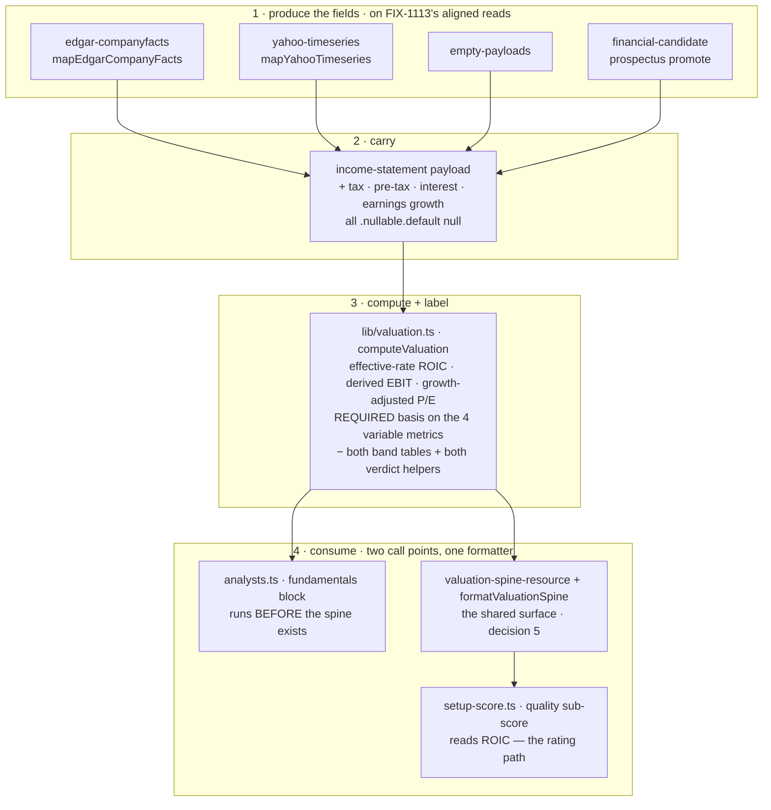

# FIX-1064: Valuation multiples rest on blunt proxies — Implementation Spec

## Part I — The Case *(for the human)*

### 1. Problem — why it matters, why now

Four of the numbers the desk reports about a company are not the numbers it says they are.

**Return on invested capital** is computed by taxing every company at 21%. Nvidia's last
full year reported a **15.1%** effective tax rate ($21.4B of income-tax expense on $141.5B
of pre-tax income). Taxing it at 21% understates its return on capital by about seven
percent of the figure — and that figure is one of three inputs to the quality score that
sets the rating band the portfolio manager is allowed to choose inside. This is the only one
of the four that moves a number the desk acts on.

**EV/EBIT** is not EV/EBIT; it divides by operating income. **PEG** is not PEG; it divides
the price/earnings ratio by *revenue* growth, so a company growing sales fast while earnings
go nowhere reads as reasonably priced.

And every multiple carries a **cheap / fair / expensive** verdict drawn from one hardcoded
table applied to every company on the market. The same "cheap below 2× sales" line is
applied to a utility and to a software company. Energy and industrials have traded four to
six times apart on the same multiple inside a single year, so a fixed threshold is not a
loose read — it is a coin flip wearing a label.

Each of these is documented in the code, and three of the four are labelled in the output.
So this is not concealment. It is a report presenting verdicts with more precision than its
inputs support, on a surface where someone is deciding whether to buy something.

**Why now.** Two issues in this epic are queued directly behind these four figures. The
lens work ([FIX-1066](https://linear.app/fixpoint-labs/issue/FIX-1066)) seats two new
investor perspectives whose entire methodology *is* these ratios, and it is blocked on this
issue precisely so it does not put blunt proxies in front of them. There is no workaround: a
reader cannot recompute return on capital from what the report shows them.

### 2. Solution in plain terms

**Compute the three measurable ones properly, and stop publishing the one we cannot
defend.**

Three numbers the company itself reports — its income-tax expense, its pre-tax income, and
its interest expense — are already inside the filing the desk downloads on every run. It has
simply never read them. Reading them turns the flat-tax return on capital into a return on
capital taxed at the rate the company's own filing reports, and turns "EV/EBIT" into an
actual EV/EBIT. Reading one more, the prior year's earnings, replaces "PEG" with a
growth-adjusted price multiple built on earnings rather than sales. **No new data provider,
no new request, no extra cost per run** — the numbers arrive in a response the desk already
pays for and throws most of away.

One honesty rule carries the whole change: where a company does not report a figure, the
metric says which basis it fell back to, or reports nothing and says why. It never quietly
substitutes.

**It rests on something this issue no longer tries to fix itself.** These figures are only
meaningful if the statement they are read from describes one period — and today the desk's
statement readers each take a field's *latest* reported value, independently. Four rounds of
review each corrected that for one more field and uncovered another, ending at the index
itself. That is a data-layer defect, not a valuation-metrics one, so it now belongs to
**[FIX-1113](https://linear.app/fixpoint-labs/issue/FIX-1113)**, which blocks this issue.
This spec builds on aligned statements; it does not achieve alignment. §12 carries the
evidence.

**The cheap / fair / expensive verdict is removed rather than replaced.** There is no
defensible sector threshold available to us: the peer data the desk already fetches carries
peer *returns*, not peer *multiples*, so a sector median would mean six extra provider calls
per run, and a hand-written table of sector thresholds is seventy-odd numbers nobody can
source and nobody will notice going stale. Meanwhile the desk already produces a real answer
to "is this cheap" — a fair value derived from *this company's* own return on equity, growth
and required return, which abstains outright when its assumptions don't hold, and which
already drives the rating. The multiples go back to being inputs to that judgement instead of
delivering a competing verdict of their own.

**Philosophy** — tenet 3 (earn every addition): the sector-aware verdict is answered by
deleting the band tables, not by adding seventy numbers. Tenet 5 (one convergence point): a
metric whose computation can vary cannot be built without declaring which basis it ran on.
Tenet 1 (coherence): the desk already treats an unobserved statement figure as absent; a
computation that could not run now says so the same way.

> **§2 then §6 lead, and the rest is derivation.**

### 6. Decisions & rules — the sign-off surface

1. **Return on capital uses the effective tax rate the filing reports.** When the statement
   carries income-tax expense and pre-tax income and the resulting rate is plausible (§9 pins
   the bounds), that rate is used; otherwise the 21% assumption is kept and labelled as an
   assumption, exactly as today. This is the **provision** rate — the tax the filing charges
   against the year's earnings.
   *Rejected:* keeping the flat rate and labelling it harder — the label is already there and
   the number is still wrong. *Also rejected:* reading cash taxes paid instead. Cash tax
   differs from the provision through deferrals, credits and timing, and it is a defensible
   figure — but it changes what return on capital *means*, which is a bigger call than this
   issue carries, and it is a fact the desk does not read today.
   *Locks in:* **this changes ratings.** Low-tax companies score better on quality than they
   did last month and high-tax companies score worse, so a report re-run on the same data can
   land in a different rating band. That is a correction, not a regression, but published
   reports and the newer ones will disagree and we cannot restate the old ones.

2. **The growth-adjusted price multiple is renamed, not just recomputed, and is published
   only when earnings growth is observed.** PEG means price/earnings over *per-share*
   earnings growth. The desk holds no share count, so it cannot compute that — and
   company-level net-income growth diverges materially from per-share growth under buybacks
   or dilution. So the metric ships as **"Growth-adjusted P/E"** (and
   **"Growth-and-yield-adjusted P/E"** for the dividend variant), on a stated
   company-earnings basis, in the rendered label *and* the field name. Nothing in the desk
   publishes the letters PEG afterwards.
   *Rejected:* keeping today's revenue-growth version under an honest new name — a number
   invented to fill a slot, that no investor asked for and none would act on. *Also
   rejected:* sourcing diluted share counts to compute a real PEG — that needs data the
   epic's no-new-data fence excludes.
   *Locks in:* a reader loses a line named PEG, and gets a differently-named line that is not
   directly comparable to a PEG they read elsewhere. Some reports lose it entirely, with
   nothing in its place, and that will look like a downgrade. **It also locks in deriving
   earnings growth on the EDGAR path** (§7, §8 step 2): that provider is preferred for US
   filers and reports no growth today, so without the derivation this decision publishes a
   metric that abstains on nearly every US company — and, as §12 notes, the metric would then
   be worth less than the line it replaced.

3. **The cheap / fair / expensive verdict on each multiple is removed, not made
   sector-aware.** *(Owner's call — see §12.)* The desk's existing company-specific fair
   value stays the one place a cheap-or-expensive call is made.
   *Rejected:* a per-sector threshold table (undefendable, and stale within a year with
   nothing to catch it), and peer-derived medians (six extra provider calls per run, against
   the epic's no-new-data fence).
   *Locks in:* the desk makes **one** valuation call per company instead of fourteen. If we
   later want a per-multiple read, it has to come with a real comparison set, which means
   paying for peer fundamentals — a decision with a bill attached, deliberately deferred here.

4. **A figure whose computation can vary must declare which basis it ran on, and cannot be
   built without one.** That is the four variable metrics — return on capital, EV/EBIT, and
   the two growth-adjusted multiples — where a required basis descriptor replaces today's
   optional proxy string. The other ten are straight reported ratios with one possible
   computation, and carry a typed default (`reported-components`) rather than a hand-written
   sentence each.
   *Rejected:* today's optional label, which is why "EV/EBIT" could be shipped for years
   meaning something else. *Also rejected:* a hand-written basis on all fourteen — same
   compile-time guarantee, ten metrics' worth of boilerplate, and a wall of near-identical
   strings is how a real basis stops being read.
   *Locks in:* a new *variable* derived figure can never be added without declaring what it
   actually measures. That is a small permanent tax on adding metrics, and it is the point.

5. **These four figures are put on the shared evidence surface every downstream reader sees,
   which is work [FIX-1066](https://linear.app/fixpoint-labs/issue/FIX-1066)'s plan currently
   assigns to itself.** That surface is the valuation spine (§7 names the module and the
   renderer). Today the spine renders no multiple at all, so the lens pack and every other
   post-Phase-1 reader sees none. **The fundamentals analyst keeps computing its own copy
   before the spine exists — it runs earlier in the pipeline and there is no spine to read
   yet — but both go through one computation and one formatter, so the two cannot disagree.**
   *Rejected:* leaving the exposure to FIX-1066 — it would put proxy figures in front of two
   new lenses for however long the two issues are apart, which is the exact failure this epic
   is about. *Also rejected (and this was folded, then reversed, in review):* retiring the
   analyst's computation and re-pointing it at the spine. The analyst runs before the spine
   is written, so that reads an empty resource and silently drops the multiples from the
   fundamentals memo on every run. Re-ordering the pipeline to fix that is a bigger change
   than this issue is sized for.
   *Locks in:* two call sites remain, kept honest by one shared formatter rather than by
   review. And FIX-1066's second pull request loses a step and must be re-pointed. Somebody
   has to make that edit; if nobody does, the two issues will both try to add the same block.

6. **Ships as two pull requests: reading the new figures out of the filings first, then the
   valuation methodology.**
   *Rejected:* one change — it buries the part that needs judgement (what we compute and what
   we stop publishing) underneath two provider-mapping diffs that need none.
   *Locks in:* two reviews instead of one, and the methodology cannot land until the plumbing
   does.

> **Non-goals** — **period alignment of the statement payload is [FIX-1113](https://linear.app/fixpoint-labs/issue/FIX-1113)'s,
> not this issue's** (§12): no per-field anchoring, no re-indexing of the provider mappers, no
> change to how `asOf` is chosen. This spec consumes a coherent statement and says so.
> No new data provider, feed, or paid entitlement, and no additional request
> to an existing one (the epic's fence). No peer-relative or sector-median valuation. No
> change to the fair-value, DCF, triangulation, or rating-envelope math. **Nothing here
> touches the lens agreement score or the directional lean** — this issue does not open
> `convergence-math.ts`. No per-share figures of any kind: the desk holds no share count
> (`lib/dcf.ts` states the same constraint for intrinsic value), and that is why decision 2
> renames the metric rather than computing a real PEG. No recomputation of already-stored
> reports — the epic's forward-looking rule holds.
>
> **Size:** Medium — 12 production files (enumerated in §8) · 2 fixture files hand-authored,
> 2 deliberately left alone and documented as such · ~20 test behaviours · 3 documentation
> surfaces · 2 PRs. *(Was Large; the period-alignment work left for FIX-1113 in review
> round 4.)*

---

### 3. Tradeoffs & alternatives

**Alternative: build the sector table anyway.** Eleven sectors across seven ratio metrics.
Rejected on two grounds, and the second is the one that decides it. It is undefendable —
there is no source we could cite for any single cell, so every number would be somebody's
recollection. And it has a decay clock with no alarm: sector multiples move materially within
a year, and nothing in the codebase would ever tell us a cell had gone wrong. We would have
replaced one blunt instrument with a bigger, more confident-looking one, which is the epic's
first failure shape at a finer grain.

**The simpler approach: label the proxies harder and change no math.** Genuinely tempting,
and it is roughly a one-file change. Three of the four figures already carry a label, so the
work would be adding one to the bands and sharpening the wording. Insufficient because it
concedes the actual complaint. A better caveat on a number computed with the wrong tax rate
still feeds the wrong number into the quality score, and a reader who trusts the caveat is
being asked to do arithmetic they cannot do — they do not have the tax rate.

**Where the complexity was, and where it went.** Not the arithmetic, which is four small
formulas. It was **coverage of the newly-read fields, per fiscal year**, and it is uneven:
tax expense and pre-tax income are reported reliably and currently — a spot check of Nvidia's
filings returned both for the most recent fiscal year — while interest expense is the weak
one, since Apple's filings stop reporting it under the standard tag after fiscal 2023. That
is not simply "sometimes missing", it is **present but stale**, and a statement reader that
takes each field's latest value independently will pair a fiscal-2023 interest with a
fiscal-2025 pre-tax income and call the result EBIT.

**That whole class is now FIX-1113's** (§12), and this spec is smaller for it. What remains
here is the part that was always this issue's: read three figures the filing reports, compute
the four metrics honestly from them, and label what each was computed on. When a company does
not report interest for the period, EBIT falls back to operating income and decision 4's
basis says so — one branch, no period arithmetic.

A second cost, smaller but real: the new fields have to be read by **four separate
producers** of the income statement (the filings mapper, the market-data mapper, the empty
payload, and the prospectus-recovery path — all four named in §7). Missing one produces a
figure that is honest for companies from three providers and silently wrong for companies
from the fourth.

### 4. Focus practices (1–5)

1. **BP-020 (never fabricate; live paths never fall back silently)** — the reason this issue
   exists. A tax rate we assumed and a tax rate we read are different claims, and only one of
   them may be presented as a measurement. It governs the guard as well as the figure: the
   plausibility check falls back to the labelled assumption, never to a clamped number (§9).
2. **One convergence point for the basis descriptor (tenet 5)** — the basis is part of the
   metric type for the four variable metrics, so the producers of a derived figure cannot
   each decide whether to attach one. This is the enforcement half of decision 4.
3. **BP-030 (tolerate the old shape)** — two persisted shapes change, not one. The valuation
   spine gains the new figures, and the `financialsData` resource embeds the income-statement
   tool schema as state, so both a stored report and a stored statement payload predating
   this must still open, must not render an absent figure as a computed one, and must not
   throw on a key that did not exist when they were written (§7's `.default(null)`).
4. **BP-034 (finish the rename)** — the widest practice here, and review found it
   under-scoped twice. These figures are named by what they *used* to be in the fundamentals
   prompt, two module headers, the package `README.md`, `labs/trading-desk/CLAUDE.md`, and
   `agents/lenses/lenses.ts` — and decision 2's rename has to reach the field names too. The
   last two matter most: both tell a future reader that the deferred GARP lens needs "PEG"
   numbers, which would steer FIX-1066 at a name this issue removes (§8 step 11).
5. **BP-035 (second-path checklist)** — the second path here is the **company that does not
   report the new field**. Every one of the four figures has a fallback basis or an
   abstention, and a suite that only covers the well-reported company proves nothing. (The
   *stale-year* variant of this path moved to FIX-1113 with the alignment work.)

### 5. What using it looks like

*(This is app code, so the surface a person meets is the evidence block a reader and the
downstream agents see, not a public API. **The tax figures below are real** — Nvidia's
reported fiscal-2026 income-tax expense of $21.383B on $141.450B of pre-tax income, read from
the filings API during research. **The metric levels are illustrative**, chosen to show the
shape and the direction of the change, not to predict a specific company's output. The label
text is also illustrative; the wording is the implementer's, the requirement to have one is
decision 4. **The fiscal year each label names is the statement's own period** — which is a
figure the desk can only state honestly once [FIX-1113](https://linear.app/fixpoint-labs/issue/FIX-1113)
lands, and that is the dependency in one line.)*

**Return on capital, before and after** *(the ratio between the two is the real part — taxing
at 15.1% instead of 21% raises the figure by ~7.5%):*

```
before  ROIC: 24.60% (proxy: approx — 21% tax assumption)
after   ROIC: 26.44% (tax basis: effective provision rate 15.1%, as reported FY2026)
```

**A company that does not report the tax fields for that year** — the honest fallback,
unchanged in value and sharper in label:

```
after   ROIC: 24.60% (tax basis: assumed 21%; company reports no tax provision for FY2026)
```

**The renamed and rebased figures:**

```
before  EV/EBIT: 31.20× (cheap/fair/expensive; proxy: operating income used as EBIT proxy)
after   EV/EBIT: 29.90× (basis: pre-tax income + interest expense, FY2026)
        …or, where interest expense is unreported for that year (the Apple case):
        EV/EBIT: 31.20× (basis: operating income — no interest expense reported for FY2026)

before  PEG: 1.42× (fair; proxy: revenue growth used in place of EPS growth)
after   Growth-adjusted P/E: 2.06× (basis: company earnings growth FY2025→FY2026 — not per share)
        …or, where prior-year earnings are unobserved:
        Growth-adjusted P/E: n/a — earnings growth unobserved
```

An abstention states its reason rather than rendering a bare `n/a`; a figure with no value
has no basis to declare, and "we could not compute this, here is why" is the honest form of
the same rule (decision 4, §9).

**What no longer appears anywhere:** the `cheap` / `fair` / `expensive` word on any
individual multiple, and the letters PEG. The desk's single valuation verdict — margin of
safety against its own fair value, and the rating band that follows — is unchanged and
remains where it is.

## Part II — The Build Plan *(for the implementing agent)*

### 7. Technical design

Four new statement fields enter at the four producers of the income-statement payload, travel
that payload, and are consumed by one pure function. The verdict machinery is deleted from
that same function. The resulting figures are then carried onto the valuation spine, which
already receives the derived set as a build argument and keeps none of it.

**The one thing this design assumes and does not build:** that the statement payload
describes a single fiscal period. It does not today, and making it do so is
[FIX-1113](https://linear.app/fixpoint-labs/issue/FIX-1113) — a hard dependency (§12), not a
caveat. Read this section as "what to build on a coherent statement".



- **The income-statement schema** (`flows/analysis/tools/schemas.ts`,
  `incomeStatementSchema`) gains four nullable fields: income-tax expense, pre-tax income,
  interest expense, and a year-over-year *earnings* growth figure beside the
  `yoyRevenueGrowth` that already exists. No anchored operating income and no period stamp —
  both were this spec's own attempts at alignment and are FIX-1113's now; the existing
  `operatingIncome` is read as-is and the statement's `asOf` is the period every basis label
  names.

  **Each new field is `.nullable().default(null)`, not merely `.nullable()`.** A bare
  `.nullable()` leaves the key *required*, so a payload without it fails `.parse()` instead
  of taking the null fallback this spec promises — and two populations lack the keys: the
  `JPM` and `SPCX` fixtures, and every **persisted `financialsData` resource** from before
  this change, since `financialsDataStateSchema` embeds this exact tool schema as resource
  state and re-parses it on read. That second one is BP-030's case proper: the legacy record
  would throw on open rather than degrade. `.default(null)` fills the missing key on parse —
  the same remedy and the same reason as `valuation-spine-resource.ts`'s FIX-807 fields,
  which carry the comment verbatim. **`.default()` is available here:** this is a *tool*
  output schema, not a generator output, and it is not in `output-schemas-strict.spec.ts`'s
  walker (verified — that file lists four schemas from `tools/schemas.ts`, none of them the
  statements), so BP-016's strict-mode constraint does not bind. Do not add it to the walker.

- **The two provider mappers read the three tags they already fetch.** The filings mapper
  reads income-tax expense, pre-tax income and interest expense from the same `companyfacts`
  payload; the market-data mapper adds the corresponding annual series to
  `YAHOO_TIMESERIES_TYPES` — still one request. **Both reads sit on whatever selection
  FIX-1113 settles on**, and this spec deliberately does not name the mechanism: it named one
  in each of rounds 1–3 and was wrong each time, at a finer grain each round.

- **Earnings growth must be derived in *both* mappers, and the filings one is the load-bearing
  half.** `mapEdgarCompanyFacts` hardcodes `yoyRevenueGrowth: null` today, with a comment
  giving the reason: *"EDGAR is point-in-time per filing; YoY would need two annual periods
  selected consistently."* And `get_income_statement.ts` prefers EDGAR, with Yahoo as the
  fallback. So deriving growth only in the Yahoo mapper would ship the renamed metric
  **abstaining on essentially every US filer** — the primary path would never observe its
  only input, while `NetIncomeLoss` sat in the same response carrying several annual periods.
  Decision 2 says the metric publishes only when earnings growth is observed; a version that
  cannot observe it on the main provider is a metric in name only.
  **Two things make this tractable now and not before.** The existing comment names exactly
  the blocker FIX-1113 removes — "two annual periods selected consistently" is that issue's
  deliverable — and the per-fiscal-year index the derivation needs already exists in the same
  file for the history path. So the EDGAR derivation is sequenced *after* FIX-1113 and reads
  two adjacent annual periods of `NetIncomeLoss` through whatever selection it establishes.
  *(Scope note: this spec derives **earnings** growth on the EDGAR path. It does not
  retrofit revenue growth there — that field has its own consumers and its own null
  semantics, and changing it is not this issue's business.)*

- **The empty-payload builder** (`tools/empty-payloads.ts`) **and the prospectus-recovery
  promote** (`lib/financial-candidate.ts`) emit nulls for all four. Both are producers of this
  payload; a missed one is a silent per-provider divergence (§3).

- **The derived-valuation function** (`flows/analysis/lib/valuation.ts`, `computeValuation`)
  is where the work is. Return on capital taxes operating income at the observed effective
  rate when pre-tax income is positive and the computed rate is inside the §9 band, and at the
  assumption otherwise. EBIT is derived from pre-tax income plus interest expense when both
  are observed, and falls back to operating income. The growth-adjusted multiples
  read earnings growth and abstain with a reason without it. **Both band tables
  (`RATIO_BANDS`, `YIELD_BANDS`), both verdict helpers (`verdictForRatio`,
  `verdictForYield`), and the `MetricVerdict` argument threaded through `formatValuation` are
  removed** (decision 3).

- **The metric type gains a required basis descriptor on the four variable metrics**
  (`roic`, `evToEbit`, and the two renamed growth-adjusted fields), replacing the optional
  `proxy` string; the other ten declare a typed `reported-components` default. This is the
  convergence point for decision 4 — a producer that computes ROIC without saying which rate
  it used does not compile. A metric with a `null` value carries an abstention reason instead
  of a basis.

- **The shared surface is the valuation spine, and there are two computation points that
  cannot be collapsed into one.** `buildValuationSpine` (`lib/valuation-spine.ts`) already
  takes `valuation: DerivedValuation` and consumes it into the fair-value and setup-score
  inputs, but `valuationSpineStateSchema` (`valuation-spine-resource.ts`) stores none of the
  metrics and `formatValuationSpine` renders none of them — so every reader of
  `<valuationSpine>`, including the lens pack, sees no multiples at all. Meanwhile the
  fundamentals analyst calls `formatValuation(computeValuation(input))` inline
  (`agents/analysts/analysts.ts`, the generator's `valuation` context slot), which is the
  only place the multiples are rendered today.

  **The ordering forbids merging them.** In `orchestration/analyze.ts` the analyst fan-out is
  `.step(analystFanOut)` and the spine tap is `.tap(computeAndStoreSpine)` **after** it —
  necessarily, because the spine is built from the statement payloads Phase 1 fetches. So the
  fundamentals generator cannot read a spine that does not exist yet; re-pointing it there
  reads an empty resource and drops the multiples from the memo on every fresh run. (Round 1
  folded that re-point on a drift argument and round 2 reversed it — the drift concern was
  real, the proposed remedy was not available.)

  **The shared formatter must be sector-aware, or decision 5 ships EV multiples to banks.**
  `buildValuationSpine` already sets `valuationMethod` to `equity-multiples` for financials
  via `isFinancialSector` (`lib/fair-value.ts`), and `dcf.ts` abstains outright for the same
  cohort (`unavailableReason: "financial-sector"`). `computeFairValue` makes the same split.
  **The derived-valuation formatter is the fourth consumer of that judgement and the only one
  with no guard** — so today's analyst block already renders EV/EBIT, EV/Sales and net
  leverage for a bank, and decision 5 would take that from one memo to every downstream
  reader, the lens pack included. For a bank, enterprise-value multiples are not imprecise,
  they are the wrong instrument: deposits are funding, not capital structure.

  So the guard belongs in the **shared formatter**, not on the spine alone. Filtering only
  the spine would leave the analyst rendering the same misleading figures and recreate
  exactly the two-surfaces-disagree problem this design closed. **Covered fields — the
  capital-structure family:** `enterpriseValue`, `evToSales`, `evToEbit`, `evToFcf`,
  `netDebt`, `netLeverage`. For a financial these are withheld with a stated reason
  (equity-multiples cohort), which is decision 4's abstention shape rather than a new one.
  **Deliberately *not* covered: `roic`.** Invested capital is arguably as meaningless for a
  bank, but return on capital feeds the quality sub-score and therefore the rating band, so
  withholding it would move ratings for every financial — a decision-level consequence, and
  the owner approved decision 1 without it. Filed as
  [FIX-1118](https://linear.app/fixpoint-labs/issue/FIX-1118) with that impact named, so it
  reaches an owner rather than a tidy-up.

  *Plumbing note:* `computeValuation` takes no sector today. The spine has one
  (`compute-spine.ts` reads `profileData.companyProfile.sector`); the fundamentals generator
  does not carry it in its input schema, though its own `discover_fundamentals_context` tool
  already declares `profileDataResource`, so it is reachable inside that analyst's scope. The
  requirement is that **both call sites pass the same sector into the same formatter**; which
  of those routes carries it is the implementer's call.

  **So PR b does two things instead.** It puts the figures on the spine state and renders
  them in `formatValuationSpine`, which is what fixes the lens blindness and is the whole
  content of decision 5. And it makes both sites share **one** `computeValuation` and **one**
  sector-aware metric formatter, so the labels, bases, abstention reasons and cohort guard
  cannot diverge even though the call happens twice. The two agree by construction on inputs as well: the analyst passes
  its own tool payloads and the spine passes the same payloads read back from
  `financialsData`. The spine state's new fields default per BP-030 — a stored report
  predating this must open and render the block as absent, never as computed.

- **Untouched:** the fair-value, DCF, triangulation, expected-return, discount-rate and
  rating-envelope math; the lens pack and its agreement math; every generator output schema;
  the sizing gates; and `expected-return.ts`'s separate consumption of `yoyRevenueGrowth`,
  which keeps reading revenue growth.

**Claims verified in code this round** *(file · symbol — the epic's standing rule; the round-1
review found the first of these missing, which is why the list is now explicit)*:

| Claim | Where it was read |
|---|---|
| **The statement payload does not describe one period, and the obvious fix does not work either** — `fy` is the *filing* year, so comparatives inherit the newer filing's `fy` | `edgar-companyfacts.ts` · `latestDurationB` / `latestB` select per field; `annualByFy` keys on `e.fy`. In `test/__fixtures__/edgar-companyfacts-aapl.json`, period end `2024-09-28` appears under **both `fy: 2024` and `fy: 2025`** in **15 of the 16 tags** — including every balance-sheet instant behind invested capital. This is why alignment left this spec (§12) |
| **The preferred provider reports no year-over-year growth at all**, so a Yahoo-only derivation would abstain on nearly every US filer | `get_income_statement.ts` header — *"SEC EDGAR companyfacts (authoritative US filings) **preferred**, Yahoo `fundamentals-timeseries` **fallback**"*; `edgar-companyfacts.ts` · `mapEdgarCompanyFacts` hardcodes `yoyRevenueGrowth: null` with the comment *"YoY would need two annual periods selected consistently"* — which is FIX-1113's deliverable, named in code before this spec existed |
| Exactly four producers write the income-statement payload | `edgar-companyfacts.ts` · `mapEdgarCompanyFacts`; `yahoo-timeseries.ts` · `mapYahooTimeseries`; `tools/empty-payloads.ts`; `lib/financial-candidate.ts` (prospectus promote) |
| ROIC is flat-taxed and reaches the rating path | `lib/valuation.ts` · `TAX_RATE = 0.21` in `computeValuation`; `lib/setup-score.ts` · quality sub-score, where ROIC is **one of three** averaged parts (Piotroski, ROIC, Altman) |
| The spine receives the derived set and stores none of it | `lib/valuation-spine.ts` · `buildValuationSpine` (uses it for fair value + setup score); `valuation-spine-resource.ts` · `valuationSpineStateSchema`; `formatValuationSpine` renders no multiple |
| There is a second, inline render path | `agents/analysts/analysts.ts` · fundamentals generator `context.valuation` → `formatValuation(computeValuation(input))` |
| That second path **cannot** read the spine — the analysts run first | `orchestration/analyze.ts` · `.step(analystFanOut)` precedes `.tap(computeAndStoreSpine)`, and the spine is built from what Phase 1 fetched |
| **The desk already treats financials as an equity-multiples cohort in three places, and the metric formatter is the one consumer with no guard** | `lib/fair-value.ts` · `isFinancialSector` over `FINANCIAL_SECTORS` (`financial services`, `financials`, `banks`, `insurance`, `financial`); consumed by `computeFairValue`'s method split, `buildValuationSpine`'s `valuationMethod`, and `dcf.ts` · `if (isFinancialSector(sector)) return unavailable("financial-sector")`. `computeValuation` / `formatValuation` take no sector at all |
| The corpus's one full-analyze legacy fixture **is** a financial | `fixtures/JPM/2026-05-06/company-profile.json` · `"sector": "Financial Services"` — so JPM exercises the cohort guard and the missing-key path at once (§10) |
| **SPCX cannot reach a valuation spine**, so it cannot serve a `runArtifacts` condition | `fixtures/README.md` line 13 marks it *"Statements-only (not a full analyze corpus)"* — the directory holds four files (balance sheet, cashflow, income statement, SEC filings) with no `fundamentals.json` or `company-profile.json`; and its `balance-sheet.json` carries `totalEquity: null`, so `investedCapital` is null and ROIC is null even in isolation |
| JPM's invested capital *is* computable, so its ROIC condition can hold | `fixtures/JPM/2026-05-06/balance-sheet.json` — `totalDebt 410 + totalEquity 335 − cash 575 = 170`, positive |
| The new math consumes operating income and a current-instant invested capital, so both inherit whatever period coherence the statement has | `lib/valuation.ts` · `computeValuation` — ROIC taxes `operatingIncome` and divides by `sum(totalDebt, totalEquity, −cash)`; `evToEbit` falls back to `operatingIncome` |
| Three surfaces still advertise the retired metric name, two of them at FIX-1066's GARP lens | `labs/trading-desk/README.md:65-67` (lists PEG/PEGY as shipped, PEG as a labelled proxy); `labs/trading-desk/CLAUDE.md:1061` and `agents/lenses/lenses.ts:21` (both say the deferred GARP lens needs "PEG" numbers) |
| A `.nullable()` key is still required, and the legacy record re-parses | `financials-data-resource.ts` · `financialsDataStateSchema` embeds `toolOutputSchemas.get_income_statement` as **resource state**; `get_income_statement.ts` declares the same schema as its `outputSchema` |
| `.default()` is permitted on this schema | `test/output-schemas-strict.spec.ts` · the walker's `cases` list carries four `tools/schemas.ts` schemas (`secFilings`, `analystEstimates`, `earningsTranscript`, `discoveryPayload`) — no statement schema; and the FIX-807 precedent in `valuation-spine-resource.ts` uses `.nullable().default(null)` for exactly this reason |
| Two fixtures already lack the keys | `fixtures/JPM/2026-05-06/income-statement.json` and `fixtures/SPCX/…` — six fields each, and neither carries `source` (the loader stamps it) |
| **Widening the statement schema reaches the fundamentals model with no wiring**, so PR a is observable on its own | `agents/analysts/analysts.ts` · the fundamentals generator's `context.data = (input) => asDataBlock(input)`; `lib/helpers.ts` · `asDataBlock` is a fenced `JSON.stringify(data, null, 2)` over the **whole input**, and that input includes `incomeStatement`. All four analyst generators use the same idiom |
| `formatValuationSpine`'s output is not a persisted artifact | `capability.ts` renders it into generator context at run time; `run-artifacts.ts` exposes the spine's **structured state**, not the formatted block (§10 depends on this) |
| `runSummary` cannot see the valuation change; `runArtifacts` can | `run-summary.ts` · `runSummaryStateSchema`; `run-artifacts.ts` · `runArtifactsStateSchema.valuationSpine`; the action is registered in `flow.ts` |
| Two module headers and the analyst prompt assert the retired proxies | `lib/dcf.ts` header (cites "operating income as EBIT proxy" / "21% tax assumption" as its own labelling precedent); `agents/analysts/prompts/fundamentals.prompt.md` (names the EBIT proxy, the revenue-growth PEG proxy, and instructs a cheap/expensive read) |
| The fixture corpus carries none of the new fields | `fixtures/{NVDA,AAPL}/2026-05-06/income-statement.json` — six fields, no tax / pre-tax / interest (§10 depends on this) |

**No solution sketch and no POC.** What is left after round 4 is four formulas, three tag
reads, and a deletion inside one pure function that already has a full unit suite. The
premise worth checking was empirical and was checked directly: **the tax, pre-tax and
interest tags are present in the filings response the desk already downloads.** Confirmed for
all three, and the check also surfaced the coverage asymmetry in §3. The premise that turned
out to matter more — that the payload describes one period — was checked in round 4 and
**refuted**, which is what moved that work to FIX-1113 rather than costing this spec a fourth
patch.

### 8. Implementation sequence

**Production files touched (12).** PR a: `flows/analysis/tools/schemas.ts` ·
`lib/providers/edgar-companyfacts.ts` · `lib/providers/yahoo-timeseries.ts` ·
`flows/analysis/tools/empty-payloads.ts` · `flows/analysis/lib/financial-candidate.ts`.
PR b: `flows/analysis/lib/valuation.ts` · `flows/analysis/lib/valuation-spine.ts` ·
`flows/analysis/valuation-spine-resource.ts` ·
`flows/analysis/agents/analysts/analysts.ts` ·
`flows/analysis/agents/analysts/prompts/fundamentals.prompt.md` ·
`flows/analysis/lib/dcf.ts` (header only) ·
`flows/analysis/agents/lenses/lenses.ts` (header only — step 11).

**PR a — the statement fields. Observable on its own; review it as a behaviour change.**
No *code* reads the new fields until PR b, and it is tempting to call this plumbing — the
first four rounds of this spec did. It is wrong. The fundamentals generator's context slot is
`data: (input) => asDataBlock(input)` (`agents/analysts/analysts.ts`), and `asDataBlock`
(`lib/helpers.ts`) is `JSON.stringify` over the **whole input** — which includes the income
statement. So widening `incomeStatementSchema` puts income-tax expense, pre-tax income,
interest expense and earnings growth **in front of the fundamentals model the moment PR a
lands**, with no wiring, no prompt edit and nothing in the diff pointing at it.

**What that means for review:** the fundamentals memo can change on PR a alone, and so can
anything measured off it — eval scores, experiment results, a re-run's wording. Reviewers
should expect that and not treat a memo diff as a regression. It also means a bisect over
"when did the memo change" lands on the schema commit, not on the methodology PR.

*Rejected: withholding the fields from model context until PR b.* It would mean adding a
projection to hide honest data from the model in order to preserve a tidy story about the PR
boundary — machinery whose only purpose is to make the plumbing/methodology split literally
true. Decision 6's split still does its real job: the **judgement** (what we compute and what
we stop publishing) is concentrated in PR b, which is what that decision was about.

*Worth knowing generally:* this automatic flow is a property of every analyst here — all four
generators pass their whole input through `asDataBlock`. Widening any tool payload schema
reaches the model with no wiring. That is convenient when intended and a hidden consequence
when not, and it is the sort of thing that should be known before the next schema widening,
not discovered in its review.

1. **Widen the income-statement schema** with the four new fields, each
   `.nullable().default(null)`. *Test:* **a payload that omits the keys entirely parses and
   yields null for each** — not a payload that passes explicit `null`, which parses fine
   against the broken shape and proves nothing. Plus: a number is accepted, a wrong type is
   still rejected, and a `financialsData` record in the pre-change shape re-parses (BP-030).
   *Depends on:* nothing.
2. **Read the three tags in the filings mapper, and derive earnings growth there too**,
   through whatever selection FIX-1113 leaves in place — two adjacent annual periods of
   `NetIncomeLoss`. **This is the step that decides whether the metric exists for US filers**
   (§7): EDGAR is the preferred provider and leaves growth null today, so skipping it ships
   decision 2's metric permanently abstaining on the main path. *Test:* a response carrying
   the tags maps them; a response missing one maps it null, never zero; **a response with two
   adjacent annual net-income periods yields a growth figure**, and one with a single period
   — or two non-adjacent ones — reports it unobserved rather than guessing.
   *Depends on:* 1, FIX-1113.
3. **Read them in the market-data mapper** — add the annual series to
   `YAHOO_TIMESERIES_TYPES` (still one request) and derive earnings growth alongside the
   existing revenue-growth derivation. *Test:* as step 2, plus growth unobserved when only
   one period is available. *Depends on:* 1, FIX-1113.
4. **Null them in the other two producers** — the empty payload and the prospectus-recovery
   promote. *Test:* each emits null for all four. *Depends on:* 1.

**Also in PR a — write down why two fixtures are different, in code.** §10 leaves the `JPM`
and `SPCX` income-statement fixtures without the new keys on purpose, as the permanent
regression case for the legacy missing-key path. **That reason must land in the repository,
not only in this spec**, because this spec PR is never merged (BP-037) — the moment
implementation starts, the only record of the intent disappears, and the next contributor who
notices two fixtures "missing fields the others have" will helpfully add them. Nothing would
fail; the coverage would just quietly stop existing. So add one or two sentences where a
person tidying fixtures will actually read them — `fixtures/README.md`, and a comment on the
test or goal check that reads them — saying that these two intentionally omit the four new
keys, that this is what exercises the missing-key path, and that filling them in removes the
coverage silently. Note their **different levels** while you are there: `JPM` carries the
goal condition (full analyze corpus, and a financial, so it covers the cohort guard too);
`SPCX` is statements-only and carries the schema-level missing-key test. *Depends on:* 1.

**PR b — the valuation methodology.** Depends on PR a.

5. **Add the basis descriptor to the metric type** — required on the four variable metrics,
   typed `reported-components` default on the other ten. Lands first and alone because it is
   the compile-time gate the rest of the PR relies on (decision 4). *Test:* every rendered
   metric with a value carries a basis. *Depends on:* PR a.
   > **FIX-1063 composition.** FIX-1063's approved spec
   > (`f53195e7`) touches `lib/valuation.ts` as a **consumer** — it widens the fundamentals
   > payload to nullable and relies on `computeValuation`'s existing `sum()` / `ratio()`
   > null handling. It declares **no change to `DerivedMetric`**, and no implementation
   > branch exists on origin as of this round. So the two issues do not contest the type;
   > they contest the same *file*, which the hard sequencing dependency in §12 already
   > resolves (FIX-1063 lands first, this rebases on it). Narrowing decision 4 to the four
   > variable metrics shrinks this step's diff to the same four metrics FIX-1063 does not
   > touch, so the residual overlap is small and mechanical. If FIX-1063 *does* arrive
   > carrying a `DerivedMetric` change, stop and reconcile the two specs rather than merging
   > two shapes of the same type.
6. **Effective-rate return on capital** (decision 1), with the numeric plausibility guard
   (§9) falling back to the labelled assumption. *Test:* the §10 tax behaviours, both
   directions. *Depends on:* 5.
7. **Derived EBIT** from pre-tax income plus interest expense, with the operating-income
   fallback, both bases labelled. *Test:* the §10 EBIT behaviours, both bases.
   *Depends on:* 5.
8. **The renamed growth-adjusted multiples** (decision 2) — rename the fields and the
   rendered labels, compute on earnings growth, abstain with a reason when it is unobserved.
   *Test:* the §10 growth behaviours; no output contains "PEG". *Depends on:* 5.
9. **Remove** both band tables, both verdict helpers, the verdict argument threaded through
   `formatValuation`, and the verdict assertions in the existing suite (decision 3).
   *Test:* no rendered metric carries a cheap/fair/expensive word. *Depends on:* 5.
10. **Carry the figures onto the valuation spine and render them in `formatValuationSpine`**
    (decision 5), defaults-first, and route the fundamentals analyst's `valuation` context
    slot through the **same** metric formatter it now shares with the spine. Do **not**
    re-point the analyst at the spine resource: it runs before the spine is written (§7).
    *Test:* the §10 spine behaviours including the legacy read, and a formatter unit test
    asserting the analyst's block and the spine's block are identical for identical inputs.
    *Depends on:* 6–9.
11. **Finish the rename everywhere it is asserted** (BP-034), which is five surfaces, not
    two: the fundamentals prompt (names both retired proxies and instructs a cheap/expensive
    read); the `valuation.ts` header (advertises the proxy labels); the `dcf.ts` header
    (cites them as its labelling precedent); **`labs/trading-desk/README.md:65-67`** (lists
    PEG/PEGY among the shipped metrics and PEG among the labelled proxies); and
    **`labs/trading-desk/CLAUDE.md:1061` + `agents/lenses/lenses.ts:21`**, which both say the
    deferred GARP lens needs "PEG" numbers. Those last two are the ones that cost something
    if missed — they are the instruction FIX-1066 reads when it seats that lens, and they
    would point it at a metric name this issue removed. *Test:* no source, prompt or doc
    surface under `labs/trading-desk/` asserts PEG/PEGY as a current or planned metric.
    *Depends on:* 10.

**PR plan.**

| sub-PR | deliverables | depends_on |
|---|---|---|
| a | the four statement fields across all four producers (steps 1–4) | **FIX-1113** |
| b | the valuation methodology, the rename, the deletion, the spine exposure, and the prose (steps 5–11) | a |

**Both rows depend on FIX-1113, and PR a's row is the one that matters** — it is the first
thing an implementer reads, and marking it dependency-free would send someone to write the
mapper reads (steps 2 and 3) against the unaligned selectors, producing exactly the
mixed-period figures §12 exists to prevent. §12 makes FIX-1113 a hard blocker for the whole
issue; this table now says the same thing rather than contradicting it.

### 9. Edge cases & error handling

| Case | Expected |
|---|---|
| A loss-making company — negative pre-tax income | The effective rate is not computed. Falls back to the labelled assumption. A negative rate is arithmetic, not a tax rate |
| A one-off tax benefit or valuation-allowance release — a computed rate outside `0 ≤ rate ≤ 1` | Outside the plausible band, so the labelled assumption is used. **The fallback is the labelled assumption, never a clamped number** — clamping would invent a rate the company never paid. The band is exactly `rate ≥ 0 && rate ≤ 1`, evaluated only when pre-tax income is strictly positive |
| A company reporting exactly zero tax on positive pre-tax income | A real 0% effective rate, inside the band. Used as observed. This is the over-application trap: the rule is *unobserved* → fall back, not *falsy* → fall back |
| Interest expense unreported (the Apple case in §3) | EBIT falls back to the operating-income basis, labelled as such. Not an error, and not rare |
| A statement component that is stale rather than absent | **Out of scope here — FIX-1113's** (§12). This spec's figures inherit whatever period coherence the statement has; they do not repair it |
| **A payload or persisted record that omits the new keys entirely** | Parses, and every new field reads null (`.nullable().default(null)`). A pre-change `financialsData` record opens and every dependent figure takes its labelled fallback. This is the case a bare `.nullable()` turns into a parse error (BP-030) |
| Interest expense reported net of interest income | Accepted as reported. The basis label says the figure is derived from reported components; the desk does not attempt to un-net it |
| Prior-year earnings present but zero or negative | Growth is uninterpretable as a divisor. The growth-adjusted multiples abstain with a reason rather than emitting a figure with a sign flip in it |
| Earnings growth observed but negative | The multiples abstain. A growth-adjusted multiple on shrinking earnings is not a small number, it is a meaningless one |
| Both revenue growth and earnings growth present and disagreeing sharply | Only earnings growth is used by the multiples. `expected-return.ts` keeps consuming revenue growth, untouched |
| **A bank or insurer** (`isFinancialSector` true) | The capital-structure family — enterprise value, the three EV multiples, net debt, net leverage — is withheld with a stated reason on **both** render paths. Equity-side metrics render normally. This matches what the desk already does for fair value and the DCF, and it is a behaviour change on the analyst block, which renders them today |
| A company whose sector is unknown (profile absent or unmapped) | Treated as **non-financial** — everything renders. `isFinancialSector(null)` is false, and defaulting the other way would withhold EV multiples from every company whose profile failed to load |
| A US filer answered by EDGAR, which reports no growth field today | With §8 step 2's derivation, growth is observed from two adjacent annual net-income periods and the metric publishes. **Without it, it abstains for every such company** — which is why the derivation is a deliverable and not an optimisation |
| A company from the prospectus-recovery path | All four fields null; every dependent figure falls back or abstains, each labelled |
| A report stored before this change is re-opened | Opens. The new spine fields render as absent, never as computed (BP-030) |
| The fundamentals evidence block after the deletion | Renders every multiple with a value and a basis, or an abstention with a reason, and no verdict word. The prompt must no longer instruct the model to read one |
| A metric with a value but no determinable basis | Cannot occur — the basis is required by the type on the four variable metrics and defaulted on the rest (decision 4). A producer that cannot name one is a compile error, not a runtime fallback |
| A metric with no value | Carries an abstention reason instead of a basis. A figure that does not exist has no computation to describe |

**Taxonomy:** nothing here introduces a fatal path. Every case degrades to a labelled
fallback basis or to a reasoned abstention, both of which every downstream reader — prompts,
formatters, the quality sub-score, the evidence gate — already handles.

### 10. Testing strategy

**Goal check.** Run the analysis pipeline headlessly and read **`runArtifacts`**, not
`runSummary`. `runSummaryStateSchema` carries the decision, the gates and the memo statuses
and **no valuation spine, setup score, quality sub-score, ROIC or tax basis** — so a run that
produced a decision would pass it whether or not the valuation change executed at all, which
is an evidence path that cannot fail for the predicted reason (BP-003). `runArtifacts` is a
registered zero-model action exposing `valuationSpine`, and decision 5 puts the derived
figures on that spine — so the assertions below are executable **only once step 10 lands**,
which is the correct dependency to state rather than to hide.

Pass conditions, on the captured `runArtifacts` output. **Each states the defect that makes
it fail** — a criterion whose failure mode cannot be named is decoration, which is how this
spec's first two goal-check drafts went wrong:

- `summary.status === "completed"` with a decision present. *Fails when:* the pipeline breaks
  outright. This is a smoke condition and is not evidence about the valuation change — it is
  labelled as such rather than counted as one.
- `valuationSpine !== null`, and the spine's return-on-capital figure carries a **basis of
  the effective-rate kind**, with the rate equal to the fixture's reported tax ÷ pre-tax
  income. *Fails when:* the effective-rate path did not run, or read the wrong year's tax.
  **Assert the basis, not `setupScore.quality != null`** — the quality sub-score averages up
  to three parts (Piotroski, ROIC, Altman zone) in `lib/setup-score.ts`, so a non-null
  quality proves only that *one of them* ran. Asserting quality alone rebuilds the same hole
  one level down.
- The EV/EBIT figure carries the derived-components basis on the fixture that reports interest
  and the operating-income basis on the fixture that does not. *Fails when:* the fallback did
  not fire, or fired without changing its label — which is the failure decision 4 exists to
  make visible.
- **The legacy fixture — JPM, and only JPM** — produces a spine in which return on capital
  carries the **assumed-21% fallback basis** and the two growth-adjusted metrics carry
  **abstention reasons** (no earnings-growth input, so no value, so a reason rather than a
  basis per decision 4). *Fails when:* the missing keys throw on parse rather than defaulting
  to null.
  *(Its invested capital is positive — 410 + 335 − 575 = 170 — so the ROIC half is reachable;
  that was checked against the fixture, not assumed.)*
  **The cohort guard is *not* asserted here** — see below; it is not observable at this layer.

**What the goal check deliberately does *not* assert, and why the list grew:** two things,
for the same reason. **(a)** That the rendered block carries no verdict word and no `PEG`.
**(b)** That the **cohort guard** withheld the capital-structure family for JPM. Both live in
the **sector-aware formatter**, whose output is assembled into generator context at run time
and never persisted — `runArtifacts` exposes the spine's *structured* state, which still
carries the computed EV figures because the guard is a **presentation** decision, not a
storage one. So either assertion would scan structured fields vacuously or scan model-authored
memo prose non-deterministically. Both belong in **formatter unit tests** (in the CI list
below), which are deterministic and are where the behaviour actually lives.

*Persisting cohort abstentions into the spine state was the alternative and is rejected:* it
would push a presentation decision into stored data, so every later reader of the record would
inherit a withholding choice it cannot see the reason for, and a stored report would no longer
carry the figures the run actually computed.

> **The check this round added, because the rule from round 6 was not enough.** Round 6's
> lesson was *open the fixture each condition names and confirm it reaches the asserted state*.
> This condition passed that test — JPM is a financial, so the guard genuinely applies to it —
> and still could not pass, because the asserted state **is not observable at the layer the
> condition reads**. So the rule now has two halves, and both must hold: **(1)** the named
> input reaches the asserted state, and **(2)** the asserted state is visible at the layer
> being read. This one was written against the *intent* of the guard rather than against
> *where the guard lives* — the same error as the previous four, one level up.

**The fixture matrix — two authored, two left alone on purpose.** The corpus stores the
*mapped payload*, and none of the four income-statement fixtures carries the new fields, so a
fixture run today exercises only the fallback. Hand-author them onto two
(`fixtures/README.md` sanctions hand-authoring for edge cases): **NVDA** carrying all three
tags, and **AAPL** carrying tax and pre-tax income but **no interest expense** — the §3
coverage gap, as the fallback case. **Leave `JPM` and `SPCX` untouched** — an unmodified
legacy fixture is a free, permanent regression case for the missing-key path, and it is a
better test than an authored one because nobody has to remember to keep it missing.

**The two untouched fixtures serve that role at different levels, and only one of them can
serve it in a run.** `JPM` is a full analyze corpus, so it reaches a spine and carries the
goal condition above — and being a financial, it covers the cohort guard in the same pass.
`SPCX` is statements-only (`fixtures/README.md`), with no fundamentals or profile file and a
null `totalEquity`; it cannot produce a spine and its ROIC would be null regardless. **So
SPCX's missing-key role lives entirely in the CI schema test below, where it runs, and it is
named in no `runArtifacts` condition.** Both fixtures keep their untouched status and both
still need the note in the repository — §8's PR-a deliverable covers it, because this spec is
never merged and a fixture that looks incomplete for no stated reason gets "fixed". A one-time `dataSource: "record"` run
is the alternative to authoring and is more expensive and less deterministic. Use the headless
two-step in the trading-desk guide, driven by the `verify-trading-desk` skill; no new harness.
`goals/trading-desk-valuation/effective-tax-roic/`. This needs a model key, because the
generators still run; everything in the CI list below is deterministic and does not.

**CI specs** (the behaviours, not the test names):

- **one behaviour per decision in §6**, in observable terms — what the rendered figure and
  its basis say, not how the rate was computed.
- **the second path (BP-035), stated separately because it is the whole risk here:** for
  each of the four new figures, a company that does **not** report its input. All four
  fallbacks and abstentions exercised, each asserting the label as well as the value.
- **what must not change, narrowed twice to what can actually hold:** on a **non-financial**
  payload reporting none of the four new fields, every metric except the two growth-adjusted
  ones is byte-identical to today — return on capital falls back to the 21% assumption and
  EV/EBIT to operating income, so both keep today's values, and the other ten never moved.
  **Assert this on a non-financial fixture, not on JPM**: the cohort guard deliberately
  withholds six capital-structure metrics for financials, so JPM's output *must* differ from
  today and a byte-identical assertion there would fail on a correct implementation — the
  same trap this condition has now sprung twice.
  **The two growth-adjusted metrics are excluded on purpose, and the JPM fixture is why:** it
  carries `yoyRevenueGrowth: 0.04`, so today's code publishes a PEG and a PEGY from revenue
  growth, while the replacement abstains for want of *earnings* growth. That difference is
  decision 2 working, not a regression — a byte-identical assertion covering them would fail
  on a correct implementation. Assert their abstention separately.
- **the over-application trap, both directions:** a company reporting a genuine 0% effective
  rate uses it; a company reporting nothing falls back. One test, both directions — the pair
  a naive "falsy means missing" implementation fails.
- **the invariant that is easy to state wrongly:** every metric *with a value* renders a
  basis, and every metric *without* one renders a reason, for every input combination
  including all-null. Assert it as a property over the whole metric set, not as a list of
  expected strings — pinning strings tests the wording, and the wording is the implementer's.
- **the plausibility guard fails to the labelled assumption**, never to a clamped rate. Feed
  a rate above 1 and assert the emitted rate **equals the assumption**, not merely that it is
  within bounds — a clamp would also pass a bounds check, which is how this ships wrong.
- **the persisted spine, both directions:** a record written after this change carries the
  figures; one written before opens and renders them absent.
- **the deletion and the rename, asserted on the formatter directly:** call the metric
  formatter and `formatValuationSpine` on a full metric set and assert the output contains no
  cheap / fair / expensive word and no "PEG". This is the deterministic home for the
  assertion the goal check cannot make.
- **one formatter, two call points:** the fundamentals analyst's block and the spine's block
  are identical for identical inputs (step 10). Asserts they cannot drift; it does **not**
  assert they are produced at the same time, because they are not.
- **the cohort guard, on both call sites — and this is the *only* place it is asserted:** for
  a financial sector, the formatter withholds `enterpriseValue`, `evToSales`, `evToEbit`,
  `evToFcf`, `netDebt` and `netLeverage` with a stated reason, and renders the equity-side
  metrics normally; for a non-financial it renders all of them. Assert it through the
  **shared** formatter so the analyst block and the spine block cannot diverge on it — that is
  the whole reason the guard sits there rather than on the spine, and it is why the goal check
  above cannot see it. Include a null-sector case: absent profile data must not be treated as
  financial (`isFinancialSector(null)` is false), because silently withholding EV multiples for
  every company whose profile failed to load would be its own quiet defect. Use JPM's
  `sector: "Financial Services"` as the financial input so the assertion runs against the
  corpus rather than an invented sector string.
- **the legacy shape (BP-030), as a missing-key test — this is SPCX's job:** parse a
  pre-change income-statement payload — one that *omits* the new keys rather than passing them
  as `null` — and assert it succeeds with null for each. The `SPCX` fixture is the natural
  input and works here precisely because this is a schema-level check with no analysis run. The `null`-passing variant passes against the broken schema
  too, so only the omitting variant reproduces the defect. Same for a persisted
  `financialsData` record in the old shape.

**Discipline:** `tdd`. The seam is `computeValuation` plus the two provider mappers — all
three reachable from a vitest spec with no runtime and no network, so every behaviour above
is a tracer bullet. Extend the existing valuation, valuation-spine, filings-mapper and
market-data-mapper suites rather than adding a parallel one.

### 11. Documentation plan

- **EXTEND** `labs/trading-desk/CLAUDE.md` — the live-mode paragraph describes what the three
  statement tools source and states the nullable-field discipline. Add one short paragraph
  naming the four new fields, where they come from (the same responses, no extra call), and
  the basis-label rule from decision 4, so the next person adding a derived metric meets the
  requirement before they write one. *Voice
  risk:* this is the internal agent guide, so precision over warmth; do not soften
  "assumption" into "estimate", or "provision rate" into "tax paid".
- **EXTEND** `labs/trading-desk/README.md` — its Tier-1 valuation bullet (lines 65–67) lists
  PEG/PEGY among the shipped metrics and PEG among the labelled proxies. Both statements stop
  being true; update the list and the proxy sentence to the renamed metric and the new bases.
- **EXTEND** the module headers on `lib/valuation.ts`, `lib/dcf.ts` and
  `agents/lenses/lenses.ts`, and the fundamentals analyst prompt (§8 step 11). Not published
  docs surfaces, but they currently assert the retired proxies as current behaviour and the
  bands as the preferred fallback — and `lenses.ts` plus `CLAUDE.md` name "PEG" as a thing a
  future lens is waiting for. That is exactly how a corrected metric gets un-corrected later
  (BP-034).
- **EXTEND** `labs/trading-desk/fixtures/README.md` — one or two sentences recording that the
  `JPM` and `SPCX` income-statement fixtures intentionally omit the new keys, what that
  covers, and what filling them in would silently remove (§8, PR a). Small, and it is the only
  part of §10's fixture reasoning that survives this spec being closed unmerged.
- **No `apps/docs` change.** The trading desk is a lab application, not published framework
  documentation, and nothing on any `@flow-state-dev/*` public surface changes.
- **No `docs/architecture/*` change.** No locked framework contract moves.
- **Changeset:** internal-only (`--empty`) per BP-022 — the desk is a private lab app.

### 12. Dependencies, open questions & follow-ups

**Dependencies:**

- **[FIX-1113](https://linear.app/fixpoint-labs/issue/FIX-1113) must land first — it now
  blocks this issue, and it is the reason this spec got smaller.** It owns making the
  statement payload describe one fiscal period: indexing by exact period end across both
  producers, `latestInstantB`'s quarter-end selection, `latestTwoRaw`'s non-adjacent pair,
  and the payload's shared `asOf`.
  **The evidence, because it is the single most useful fact four review rounds produced:**
  SEC's `fy` is the *filing* year, not the period's fiscal year, so a filing's comparatives
  inherit the newer filing's `fy`. In `test/__fixtures__/edgar-companyfacts-aapl.json` the
  period end `2024-09-28` appears under **both `fy: 2024` and `fy: 2025`** in **15 of the 16
  tags** — including `Assets`, `Liabilities`, `StockholdersEquity`, cash and all three debt
  tags, which are exactly the components behind invested capital. So `annualByFy(...).get(2025)`
  can return FY2024 data, and every per-field alignment scheme built on `fy` — including the
  three this spec proposed in rounds 1–3 — is unsound at the root.
  **Why it moved rather than being fixed here:** each round fixed alignment for one more
  field and revealed the next (interest, then operating income, then invested capital, then
  the index). That is a data-layer defect being patched inside a valuation-metrics change,
  and the patches kept being right about the field and wrong about the layer. Everything in
  this spec now assumes aligned statements and builds on them. **It blocks both pull requests,
  not just PR b** — PR a's mapper reads are exactly the code that would otherwise sit on the
  unaligned selectors, so §8's PR-plan table names FIX-1113 as PR a's dependency too.
- **[FIX-1063](https://linear.app/fixpoint-labs/issue/FIX-1063) must land first, and it is a
  hard sequencing constraint, not a preference.** Its first pull request widens the
  fundamentals payload to nullable and rewrites consumers inside `lib/valuation.ts` — the same
  module this issue rewrites. Its approved spec declares **no `DerivedMetric` change** and no
  implementation branch exists on origin as of this round, so the collision is an edit
  collision in one file, not two specs evolving one type (§8 step 5 carries the check and the
  stop condition). **Where the two meet in substance:** FIX-1063's governing invariant is that
  a verdict or status field must only ever describe work that actually happened. Decision 4 is
  that invariant one layer down — the basis descriptor is a status field about *which
  computation ran*. (The input-boundary half of that invariant is now FIX-1113's.)
- **[FIX-1066](https://linear.app/fixpoint-labs/issue/FIX-1066) is blocked on this and its
  plan needs one edit.** Decision 5 moves the four figures onto the valuation spine here,
  which its second pull request currently owns as its step 5; its GARP lens also needs to be
  told the metric is no longer called PEG (decision 2). **Nothing in this spec touches the
  lens agreement score, the directional lean, or `convergence-math.ts`** — the standing
  condition that the gap discount applies to agreement and classification only, and never to
  the lean, is untouched. The only overlap is the evidence-surface exposure, and it is a
  scope handoff rather than a design conflict.

**Open questions:** one, and it is the only genuine fork in this spec — **decision 3**,
whether the per-multiple cheap / fair / expensive read is deleted or kept as an explicitly
rough heuristic. It is asked in full on the spec PR, because it turns on how a reader uses a
labelled-blunt verdict, which the product owner knows and I do not.

**One note for the owner, not a fork — reopened in round 5, and the answer got clearer.**
Decision 2 keeps a growth-adjusted multiple on a company-earnings basis, renamed. I recorded
doubt earlier about whether a company-level version is worth reading at all, since per-share
is the basis every published PEG uses and the GARP lens is built on. Round 5 found something
that bears directly on it: the preferred provider for US filers reports **no** growth field
today, so a Yahoo-only derivation would have shipped this metric abstaining on nearly every
US company (§7).

That cuts toward keeping it, not dropping it. Read against today's behaviour, the same gap
means the *existing* revenue-growth PEG is already absent on the primary path and publishes
mainly when EDGAR misses and Yahoo answers. So the EDGAR derivation in §8 step 2 is what
makes this a real metric for the first time, rather than a renamed version of a line most US
reports never showed. **My answer: land the derivation, and the metric is worth having.** The
per-share question stays open and is now cleanly separable — it is a data purchase (§12's
per-share follow-up), not a reason to withhold the figure. **If the derivation ever gets
dropped from the build, drop the metric with it** rather than shipping one that abstains by
construction; that pairing is the part worth remembering.

**Follow-ups (flagged, not built):**

- **Peer-relative multiples.** The honest version of a per-multiple valuation read needs a
  real comparison set, which means fundamentals for the peer group the desk already
  identifies — roughly six additional provider calls per run. A cost decision with a bill
  attached; it belongs in the data-and-providers lane.
- **Per-share metrics generally.** A real PEG, and per-share intrinsic value, both need a
  diluted share count the desk does not hold. One data addition would unblock both, and it
  should be decided once rather than per-metric.
- **Return on capital for financials — [FIX-1118](https://linear.app/fixpoint-labs/issue/FIX-1118), filed.**
  The cohort guard (§7) withholds the capital-structure family for banks and insurers but
  deliberately leaves ROIC rendering, because invested capital feeds the quality sub-score and
  therefore the rating band — withholding it would move ratings for every financial, which is
  a decision-level change and the owner approved decision 1 without it. Whether
  `totalDebt + totalEquity − cash` means anything for a deposit-funded balance sheet is a real
  question; FIX-1118 carries it with the rating impact named, so it reaches an owner rather
  than being taken as a cleanup. **Filed rather than left as a note here**, because this spec
  is never merged (BP-037) and a follow-up recorded only in §12 disappears the day
  implementation starts.
- **The DCF's own unlabelled proxy.** The intrinsic-value model treats generic reported free
  cash flow as a free-cash-flow-to-firm figure, and says so in a code comment that reaches no
  reader. Decision 4's requirement stops at the derived-valuation metrics; extending it to the
  intrinsic-value block is the same argument one module over. Worth its own small issue.
- **The other unaligned periods** — free cash flow's `operating − capex` from two
  independently-selected values, and the revenue-derived shared `asOf`. Same defect class;
  **now owned by FIX-1113** rather than flagged here.
- **Dividend yield in the growth-adjusted denominator.** The dividend variant currently
  coerces an absent dividend yield to zero before adding it to the denominator. FIX-1063
  already tracks the underlying field's over-application as a follow-up; this consumer should
  be revisited with it rather than separately.
- **Deepening:** the derived-valuation module now carries fourteen metrics with per-metric
  fallback logic in one function. Still readable, but it is the shape that stops being
  readable at twenty. Out of scope; follow up via `improve-codebase-architecture`.

### 13. Implementer notes *(raised in review, below the direction bar)*

- **Field count for the growth inputs.** Whether the payload carries a derived
  `yoyEarningsGrowth` (mirroring `yoyRevenueGrowth`) or a stored prior-year earnings figure
  the pure function differences itself is the implementer's call. The derived field keeps
  `computeValuation` free of period logic; the stored figure keeps the derivation testable in
  one place. Either satisfies the spec, provided an unobservable growth reports as unobserved
  rather than as zero.

---

## Spec evolution

- **Spec drafted** — framed as four separate defects with one shared cause rather than as
  four fixes, because three are measurable from data already on hand and the fourth is not
  measurable at all. Chose to delete the sector-band verdict rather than replace it, after
  confirming the peer data the desk fetches carries returns and not multiples, and that the
  desk already produces a company-specific valuation verdict that abstains. Made the basis
  label a required part of the metric type rather than a convention, so decision 4 is enforced
  by the compiler rather than by review. Verified against the filings API that the three tax
  and interest tags are present in the response the desk already downloads — and that interest
  expense goes stale on at least one large current filer, which is why the basis label is
  always-on rather than a fallback marker. Split into two pull requests so the methodology
  call is reviewed on its own rather than under two provider-mapping diffs.
- **Review round 1** — four defects folded, all of them the spec asserting something its own
  mechanism did not deliver. **Added decision 7 (one fiscal year per derived figure)** after
  reading the two statement mappers: they select each field's latest value independently, so
  the promised operating-income fallback would never have fired on the spec's own Apple
  example. The aligned reader already exists in both files, so this reuses an idiom rather
  than adding one. **Renamed the growth-adjusted multiple** (decision 2) — publishing a
  company-level basis under the name PEG is the same "name outlived the basis" defect the spec
  exists to fix, one layer over. **Relabelled the tax input as the reported provision rate**
  throughout, in §1, §2, §5, §6 and the PR description — dividing tax expense by pre-tax
  income is not "the tax the company actually paid". **Moved the goal check from `runSummary`
  to `runArtifacts`** and pinned what it asserts: `runSummary` carries no valuation spine at
  all, and asserting the quality sub-score would have been the same unfalsifiable shape one
  level down, because ROIC is one of three averaged parts. Also, from the second reviewer:
  marked decision 3 as the owner's call so §6 and §12 stop reading as contradictory; resolved
  the basis-on-abstention contradiction (basis when there is a value, a reason when there is
  not); named decision 5's render surface and chose one render path over two; narrowed
  decision 4 to the four variable metrics with a typed default for the rest; pinned the tax
  plausibility band numerically; enumerated the eleven production files with real paths;
  cross-referenced FIX-1063's `DerivedMetric` contract; and trimmed the restated arguments
  across §3, §4, §9 and §12.
- **Review round 2** — four findings, three of them consequences of the round-1 fold rather
  than new ground. **Reversed round 1's re-point of the fundamentals analyst at the spine**:
  `orchestration/analyze.ts` runs the analyst fan-out *before* the spine tap, necessarily,
  because the spine is built from what Phase 1 fetched — so that re-point would have read an
  empty resource and dropped the multiples from the memo on every run. The drift concern
  behind it was real; the remedy is one shared computation and one shared formatter across
  two call points, not one call point. **Widened decision 7 to operating income**: the scope
  guard was drawn one field too narrow, because the corrected ROIC taxes operating income and
  the EBIT fallback reports it, so both still mixed years. An anchored copy travels beside the
  published field, which keeps the byte-identical regression true. **Made the new fields
  `.nullable().default(null)`**: a bare `.nullable()` leaves the key required, so the two
  legacy fixtures and every persisted `financialsData` record would have thrown on parse
  instead of taking the promised fallback (BP-030) — and the test has to omit the keys, not
  pass them as `null`, or it passes against the broken shape. **Dropped a third
  unfalsifiable assertion**: the no-verdict / no-PEG check moved from the goal check to a
  formatter unit test, because the rendered block is assembled into generator context and
  never persisted. §10's pass conditions now each name the defect that makes them fail.
  Finally, made the deliberately-untouched `JPM` / `SPCX` fixtures a **documented** decision
  in §8 and §11 rather than a spec-only one: this PR never merges, so an intent recorded only
  here is an intent that disappears the day implementation starts, and a fixture that looks
  incomplete for no stated reason gets tidied up — removing the coverage without failing
  anything.
- **Review round 3** — two findings, both consequences of round 2, and the count is falling
  as the scope narrows. **Pinned the anchor to the statement's current fiscal year.** Round
  2's anchor was "the latest year with a reported pre-tax income", which reaches back when
  this year's provision is not filed yet — and then applies that older year's rate and
  operating income against invested capital built from *current* balance-sheet instants
  (`totalDebt + totalEquity − cash`). Same cross-period defect, one field over, in the figure
  decision 7 exists to protect. Anchoring the balance sheet too was the other option and is
  rejected: it drags two more mappers into an income-statement change to chase an alignment
  the simpler rule already answers. A missing current-year pre-tax income now takes the
  labelled 21% assumption — the claim is the provision rate *for the period being measured*,
  and there isn't one. **Corrected a goal condition a correct implementation could not
  satisfy:** the legacy-fixture check demanded fallback bases on all four variable metrics,
  but the two growth-adjusted ones have no value on those fixtures and therefore carry
  abstention reasons. Same fault as the three unfalsifiable assertions, inverted — so §10 is
  now checked in both directions.
- **Review round 4 — the spec got smaller instead of getting another patch.** Codex found
  that `annualByFy` cannot guarantee alignment at all, because SEC's `fy` is the *filing*
  year: verified in `test/__fixtures__/edgar-companyfacts-aapl.json`, where period end
  `2024-09-28` carries **both `fy: 2024` and `fy: 2025`** across **15 of 16 tags**, invested
  capital's components included. That refuted the mechanism under rounds 1–3 rather than
  refining it — and made the pattern legible: four rounds had each aligned one more field and
  uncovered the next, which is a data-layer defect being patched inside a valuation-metrics
  change. **So period alignment left this spec entirely** and became
  [FIX-1113](https://linear.app/fixpoint-labs/issue/FIX-1113), now a hard blocker (§12):
  decision 7 is gone, with the anchored operating income, the anchor period stamp, the
  `annualByFy` reuse and the growth-adjacency rule. What survives is what was always this
  issue's — reading the three tags, the provision-rate ROIC, real EBIT, the rename, the basis
  labels, and the verdict deletion — and it now rests on aligned data instead of trying to
  produce it. Also folded, both independent of the restructure: **finished the rename** across
  `README.md:65-67`, `CLAUDE.md:1061` and `lenses.ts:21`, the last two of which would have
  pointed FIX-1066's GARP lens at the removed name (BP-034); and **narrowed the
  byte-identical assertion**, which could not hold as written because the JPM fixture's
  `yoyRevenueGrowth: 0.04` makes today's code publish a PEG where the replacement must
  abstain. §10 re-read end to end against the smaller shape.
- **Review round 5** — one finding, about what remained rather than what left. The plan told
  only the **Yahoo** mapper to derive earnings growth, while `get_income_statement.ts` prefers
  **EDGAR** for US filers and `mapEdgarCompanyFacts` hardcodes `yoyRevenueGrowth: null`. So
  decision 2's metric would have abstained on essentially every US company — a metric in name
  only — with `NetIncomeLoss` sitting in the same response carrying several annual periods.
  Added the EDGAR derivation as a §8 step-2 deliverable, sequenced after FIX-1113 because the
  existing code comment names that issue's deliverable as its own blocker ("two annual periods
  selected consistently"). Also **reopened §12's owner note**: the same fact means today's
  revenue-growth PEG is already mostly absent on the primary path, so the derivation is what
  makes this a real metric rather than a rename of a line most US reports never showed — which
  resolves the doubt toward keeping the metric, and pairs it explicitly with the derivation.
- **Review round 6 — after the owner's approval, and disclosed rather than folded quietly.**
  Two findings landed on the approved commit; neither touches a §6 decision. **The one that
  mattered:** decision 5's shared surface would have delivered EV multiples to the lens pack
  for banks. The desk already treats financials as an equity-multiples cohort in three places
  — `computeFairValue`'s method split, `buildValuationSpine`'s `valuationMethod`, and
  `dcf.ts`'s `financial-sector` abstention, all through `isFinancialSector` — and the metric
  formatter is the fourth consumer of that judgement with no guard, so it renders EV/EBIT for
  JPM today. Decision 5 would have taken that from one memo to every reader. The guard went
  into the **shared formatter** rather than onto the spine, because filtering one call site
  would recreate the divergence round 2 closed; it covers the capital-structure family and
  deliberately excludes ROIC, which would move the rating band — **filed as
  [FIX-1118](https://linear.app/fixpoint-labs/issue/FIX-1118)** with that impact named, rather
  than left as a §12 note that would die with this never-merged PR. **The
  second:** §10 named SPCX as a goal-check fixture, but it is statements-only with a null
  `totalEquity` and cannot produce a spine — the third criterion in this spec a correct
  implementation could not satisfy. Its missing-key role moved to the CI schema test, where it
  runs. The standing §10 rule is now *open the fixture each condition names and confirm it
  reaches the asserted state* — checking "both directions" was not enough, because all three
  failures came from writing criteria against intent and never against the named fixture.
- **Review round 7 — the last round on this PR.** Three findings, all traceable to earlier
  folds. **The cohort guard I added in round 6 made its own goal condition unpassable:** the
  condition read the structured spine, but the guard lives in the formatter and formatter
  output is never persisted, so a correct implementation leaves JPM's stored spine carrying
  its EV figures. Moved the assertion to the formatter unit test, where the behaviour lives;
  persisting cohort abstentions into spine state was the alternative and is rejected, because
  it pushes a presentation decision into stored data. **This is the fifth criterion of its
  class and it defeated round 6's own rule**, so the rule now has two halves: the named input
  must reach the asserted state, *and* the asserted state must be observable at the layer the
  condition reads. **The PR-plan table contradicted §12** by marking PR a dependency-free
  while its mapper steps sit on FIX-1113's period selection; both rows now name it. **And
  "PR a is plumbing" was false** — the fundamentals generator serializes its entire input via
  `asDataBlock`, so widening the schema puts the four new fields in front of the model the
  moment PR a lands. Rather than adding machinery to hide honest data and preserve the story,
  PR a is now described as observable, with what reviewers should expect. Decision 6 is
  untouched: the *judgement* is still concentrated in PR b, which is what it decided.
