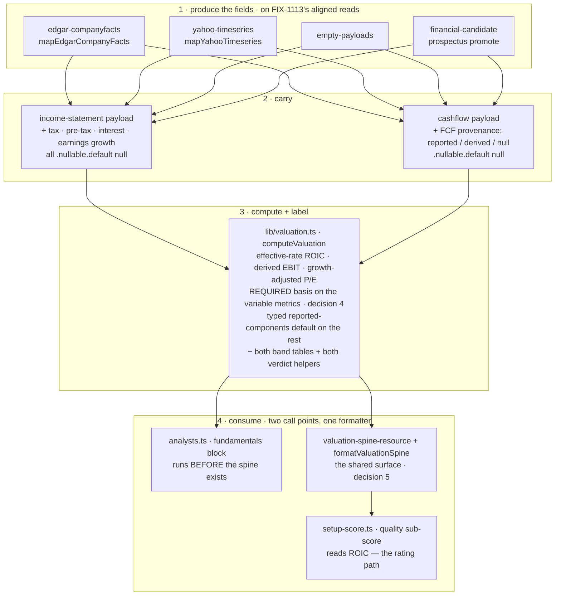

# FIX-1064: Valuation multiples rest on blunt proxies — Implementation Spec

## Part I — The Case *(for the human)*

### 1. Problem — why it matters, why now

Four of the numbers the desk reports about a company are not the numbers it says they are.

**Return on invested capital** is computed by taxing every company at 21%. Nvidia's last
full year reported a **15.1%** effective tax rate ($21.4B of income-tax expense on $141.5B
of pre-tax income). Taxing it at 21% understates its return on capital by about seven
percent of the figure — and that figure is one of three inputs to the quality score that
sets the rating band the portfolio manager is allowed to choose inside. This is the only one
of the four that moves a number the desk acts on.

**EV/EBIT** is not EV/EBIT; it divides by operating income. **PEG** is not PEG; it divides
the price/earnings ratio by *revenue* growth, so a company growing sales fast while earnings
go nowhere reads as reasonably priced.

And every multiple carries a **cheap / fair / expensive** verdict drawn from one hardcoded
table applied to every company on the market. The same "cheap below 2× sales" line is
applied to a utility and to a software company. Energy and industrials have traded four to
six times apart on the same multiple inside a single year, so a fixed threshold is not a
loose read — it is a coin flip wearing a label.

Each of these is documented in the code, and three of the four are labelled in the output.
So this is not concealment. It is a report presenting verdicts with more precision than its
inputs support, on a surface where someone is deciding whether to buy something.

**Why now.** Two issues in this epic are queued directly behind these four figures. The
lens work ([FIX-1066](https://linear.app/fixpoint-labs/issue/FIX-1066)) seats two new
investor perspectives whose entire methodology *is* these ratios, and it is blocked on this
issue precisely so it does not put blunt proxies in front of them. There is no workaround: a
reader cannot recompute return on capital from what the report shows them.

### 2. Solution in plain terms

**Compute the three measurable ones properly, and stop publishing the one we cannot
defend.**

Three numbers the company itself reports — its income-tax expense, its pre-tax income, and
its interest expense — are already inside the filing the desk downloads on every run. It has
simply never read them. Reading them turns the flat-tax return on capital into a return on
capital taxed at the rate the company's own filing reports, and turns "EV/EBIT" into an
actual EV/EBIT. Reading one more, the prior year's earnings, replaces "PEG" with a
growth-adjusted price multiple built on earnings rather than sales. **No new data provider and
no new request** — the numbers arrive in a response the desk already pays for and throws most
of away, and the one lookup this adds is already made elsewhere in the same run and is cached
(§7). The run does get marginally more expensive in one place, stated rather than glossed:
five new fields join the fundamentals analyst's data block, because in this app widening a
tool payload schema is a prompt change (§8). That is a handful of numbers per run, not a new
call — but it is not nothing, and an earlier draft claimed "no extra cost per run" flatly.

One honesty rule carries the whole change: where a company does not report a figure, the
metric says which basis it fell back to, or reports nothing and says why. It never quietly
substitutes.

**It rests on something this issue no longer tries to fix itself.** These figures are only
meaningful if the statement they are read from describes one period — and today the desk's
statement readers each take a field's *latest* reported value, independently. Four rounds of
review each corrected that for one more field and uncovered another, ending at the index
itself. That is a data-layer defect, not a valuation-metrics one, so it now belongs to
**[FIX-1113](https://linear.app/fixpoint-labs/issue/FIX-1113)**, which blocks this issue.
This spec builds on aligned statements; it does not achieve alignment. §12 carries the
evidence.

**The cheap / fair / expensive verdict is removed rather than replaced.** There is no
defensible sector threshold available to us: the peer data the desk already fetches carries
peer *returns*, not peer *multiples*, so a sector median would mean six extra provider calls
per run, and a hand-written table of sector thresholds is seventy-odd numbers nobody can
source and nobody will notice going stale. Meanwhile the desk already produces a real answer
to "is this cheap" — a fair value derived from *this company's* own return on equity, growth
and required return, which abstains outright when its assumptions don't hold, and which
already drives the rating. The multiples go back to being inputs to that judgement instead of
delivering a competing verdict of their own.

**Philosophy** — tenet 3 (earn every addition): the sector-aware verdict is answered by
deleting the band tables, not by adding seventy numbers. Tenet 5 (one convergence point): a
metric whose computation can vary cannot be built without declaring which basis it ran on.
Tenet 1 (coherence): the desk already treats an unobserved statement figure as absent; a
computation that could not run now says so the same way.

> **§2 then §6 lead, and the rest is derivation.**

### 6. Decisions & rules — the sign-off surface

1. **Return on capital uses the effective tax rate the filing reports.** When the statement
   carries income-tax expense and pre-tax income and the resulting rate is plausible (§9 pins
   the bounds), that rate is used; otherwise the 21% assumption is kept and labelled as an
   assumption, exactly as today. This is the **provision** rate — the tax the filing charges
   against the year's earnings.
   *Rejected:* keeping the flat rate and labelling it harder — the label is already there and
   the number is still wrong. *Also rejected:* reading cash taxes paid instead. Cash tax
   differs from the provision through deferrals, credits and timing, and it is a defensible
   figure — but it changes what return on capital *means*, which is a bigger call than this
   issue carries, and it is a fact the desk does not read today.
   *Locks in:* **this changes ratings.** Low-tax companies score better on quality than they
   did last month and high-tax companies score worse, so a report re-run on the same data can
   land in a different rating band. That is a correction, not a regression, but published
   reports and the newer ones will disagree and we cannot restate the old ones.

2. **The growth-adjusted price multiple is renamed, not just recomputed, and is published
   only when earnings growth is observed.** PEG means price/earnings over *per-share*
   earnings growth. The desk holds no share count, so it cannot compute that — and
   company-level net-income growth diverges materially from per-share growth under buybacks
   or dilution. So the metric ships as **"Growth-adjusted P/E"** (and
   **"Growth-and-yield-adjusted P/E"** for the dividend variant), on a stated
   company-earnings basis, in the rendered label *and* the field name. Nothing in the desk
   publishes the letters PEG afterwards.
   *Rejected:* keeping today's revenue-growth version under an honest new name — a number
   invented to fill a slot, that no investor asked for and none would act on. *Also
   rejected:* sourcing diluted share counts to compute a real PEG — that needs data the
   epic's no-new-data fence excludes.
   *Locks in:* a reader loses a line named PEG, and gets a differently-named line that is not
   directly comparable to a PEG they read elsewhere. Some reports lose it entirely, with
   nothing in its place, and that will look like a downgrade. **It also locks in deriving
   earnings growth on the EDGAR path** (§7, §8 step 2): that provider is preferred for US
   filers and reports no growth today, so without the derivation this decision publishes a
   metric that abstains on nearly every US company — and, as §12 notes, the metric would then
   be worth less than the line it replaced.

3. **The cheap / fair / expensive verdict on each multiple is removed, not made
   sector-aware.** *(This was the spec's one genuine fork; the owner's approval settled it —
   see §12. It is recorded here as decided, not as pending.)* The desk's existing
   company-specific fair value stays the one place a cheap-or-expensive call is made.
   *Rejected:* a per-sector threshold table (undefendable, and stale within a year with
   nothing to catch it), and peer-derived medians (six extra provider calls per run, against
   the epic's no-new-data fence).
   *Locks in:* the desk makes **one** valuation call per company instead of fourteen. If we
   later want a per-multiple read, it has to come with a real comparison set, which means
   paying for peer fundamentals — a decision with a bill attached, deliberately deferred here.

4. **A figure whose computation can vary must declare which basis it ran on, and cannot be
   built without one.** That is **seven** metrics — return on capital, EV/EBIT, the two
   growth-adjusted multiples, and the three free-cash-flow ratios (`evToFcf`, `fcfYield`,
   `priceToFcf`), because free cash flow is *derived* rather than reported on the primary
   provider and on some paths of the other two (§7). Each carries a required basis descriptor
   in place of today's optional proxy string. The remaining seven are straight reported ratios
   with one possible computation and carry a typed default (`reported-components`).
   *(Review round 11 moved the three FCF ratios from the defaulted set to the required set —
   the rule is unchanged; the classification of which metrics vary was wrong, and a
   `reported-components` default on a derived figure is a false claim rather than a missing
   one.)*
   *Rejected:* today's optional label, which is why "EV/EBIT" could be shipped for years
   meaning something else. *Also rejected:* a hand-written basis on all fourteen — same
   compile-time guarantee, seven metrics' worth of boilerplate, and a wall of near-identical
   strings is how a real basis stops being read.
   *Locks in:* a new *variable* derived figure can never be added without declaring what it
   actually measures. That is a small permanent tax on adding metrics, and it is the point.

5. **These four figures are put on the shared evidence surface every downstream reader sees,
   which is work [FIX-1066](https://linear.app/fixpoint-labs/issue/FIX-1066)'s plan currently
   assigns to itself.** That surface is the valuation spine (§7 names the module and the
   renderer). Today the spine renders no multiple at all, so the lens pack and every other
   post-Phase-1 reader sees none. **The fundamentals analyst keeps computing its own copy
   before the spine exists — it runs earlier in the pipeline and there is no spine to read
   yet — but both go through one computation and one formatter, so the two cannot disagree.**
   *Rejected:* leaving the exposure to FIX-1066 — **but not for the reason this decision gave
   until round 15, which was wrong and is withdrawn.** The old reason was that it would put
   proxy figures in front of two new lenses for however long the two issues are apart. It
   cannot: FIX-1066's PR plan makes its pack half `depends_on: a, FIX-1064`, so the lenses
   cannot be seated before these computations land, and the interval is already foreclosed by
   a dependency that exists for exactly that purpose. Two reasons do hold. **The guard cannot
   go with it:** today's analyst block renders the capital-structure family for a bank, and
   correcting these figures without the cohort guard would make a wrong-instrument number look
   more trustworthy while leaving it as inapplicable — worse than either the status quo or the
   whole change, and this epic's own thesis reproduced by a scope cut. The guard needs the
   sector plumbing, so that plumbing stays here whatever happens to the exposure. **And
   FIX-1066 has already deleted its step**, contingent on this spec being approved as written;
   both specs record that if neither is edited, the block gets built twice or not at all.
   *Also rejected (and this was folded, then reversed, in review):* retiring the
   analyst's computation and re-pointing it at the spine. The analyst runs before the spine
   is written, so that reads an empty resource and silently drops the multiples from the
   fundamentals memo on every run. Re-ordering the pipeline to fix that is a bigger change
   than this issue is sized for.
   *Locks in:* two call sites remain, kept honest by one shared classifier and one shared
   formatter rather than by review. And FIX-1066's second pull request loses a step and must be
   re-pointed. Somebody has to make that edit; if nobody does, the two issues will both try to
   add the same block. **Also locks in the cohort guard's reach:** it withholds enterprise-value
   multiples from banks and insurers and **fails closed**, so a company whose sector never
   resolved loses them too. **Published reports are not affected** — Past Reports re-renders
   from stored memos and the spine's setup-score components and never calls the formatter
   (§7), so an archived report keeps every figure it shipped with. The withholding applies to
   **generator prompts**, and to a legacy spine only on a resumed session, since a normal run
   classifies its own cohort in Phase 1. What this genuinely locks in is that for a bank the
   desk will show fewer valuation figures than it does today — deliberately, because those
   figures do not describe a deposit-funded balance sheet.

6. **Ships as two pull requests: reading the new figures out of the filings first, then the
   valuation methodology.**
   *Rejected:* one change — it buries the part that needs judgement (what we compute and what
   we stop publishing) underneath two provider-mapping diffs that need none.
   *Locks in:* two reviews instead of one, and the methodology cannot land until the plumbing
   does.

> **Non-goals** — **period alignment of the statement payload is [FIX-1113](https://linear.app/fixpoint-labs/issue/FIX-1113)'s,
> not this issue's** (§12): no per-field anchoring, no re-indexing of the provider mappers, no
> change to how `asOf` is chosen. This spec consumes a coherent statement and says so.
> No new data provider, feed, or paid entitlement, and no additional request
> to an existing one (the epic's fence). No peer-relative or sector-median valuation. No
> change to the fair-value, DCF, triangulation, or rating-envelope math. **Nothing here
> touches the lens agreement score or the directional lean** — this issue does not open
> `convergence-math.ts`. No per-share figures of any kind: the desk holds no share count
> (`lib/dcf.ts` states the same constraint for intrinsic value), and that is why decision 2
> renames the metric rather than computing a real PEG. No recomputation of already-stored
> reports — the epic's forward-looking rule holds.
>
> **Size:** Medium — 12 production files (enumerated in §8) · 2 fixture files hand-authored,
> 2 deliberately left alone and documented as such · ~31 test behaviours · 3 documentation
> surfaces · 2 PRs. *(Was Large; the period-alignment work left for FIX-1113 in review
> round 4.)*

---

### 3. Tradeoffs & alternatives

**Alternative: build the sector table anyway.** Eleven sectors across seven ratio metrics.
Rejected on two grounds, and the second is the one that decides it. It is undefendable —
there is no source we could cite for any single cell, so every number would be somebody's
recollection. And it has a decay clock with no alarm: sector multiples move materially within
a year, and nothing in the codebase would ever tell us a cell had gone wrong. We would have
replaced one blunt instrument with a bigger, more confident-looking one, which is the epic's
first failure shape at a finer grain.

**The simpler approach: label the proxies harder and change no math.** Genuinely tempting,
and it is roughly a one-file change. Three of the four figures already carry a label, so the
work would be adding one to the bands and sharpening the wording. Insufficient because it
concedes the actual complaint. A better caveat on a number computed with the wrong tax rate
still feeds the wrong number into the quality score, and a reader who trusts the caveat is
being asked to do arithmetic they cannot do — they do not have the tax rate.

**Where the complexity was, and where it went.** Not the arithmetic, which is four small
formulas. It was **coverage of the newly-read fields, per fiscal year**, and it is uneven:
tax expense and pre-tax income are reported reliably and currently — a spot check of Nvidia's
filings returned both for the most recent fiscal year — while interest expense is the weak
one, since Apple's filings stop reporting it under the standard tag after fiscal 2023. That
is not simply "sometimes missing", it is **present but stale**, and a statement reader that
takes each field's latest value independently will pair a fiscal-2023 interest with a
fiscal-2025 pre-tax income and call the result EBIT.

**That whole class is now FIX-1113's** (§12), and this spec is smaller for it. What remains
here is the part that was always this issue's: read three figures the filing reports, compute
the four metrics honestly from them, and label what each was computed on. When a company does
not report interest for the period, EBIT falls back to operating income and decision 4's
basis says so — one branch, no period arithmetic.

A second cost, smaller but real: the new fields have to be read by **four separate
producers** of the income statement (the filings mapper, the market-data mapper, the empty
payload, and the prospectus-recovery path — all four named in §7). Missing one produces a
figure that is honest for companies from three providers and silently wrong for companies
from the fourth.

### 4. Focus practices (1–5)

1. **BP-020 (never fabricate; live paths never fall back silently)** — the reason this issue
   exists. A tax rate we assumed and a tax rate we read are different claims, and only one of
   them may be presented as a measurement. It governs the guard as well as the figure: the
   plausibility check falls back to the labelled assumption, never to a clamped number (§9).
2. **One convergence point for the basis descriptor (tenet 5)** — the basis is part of the
   metric type for the variable metrics (decision 4), so the producers of a derived figure cannot
   each decide whether to attach one. This is the enforcement half of decision 4.
3. **BP-030 (tolerate the old shape)** — two persisted shapes change, not one. The valuation
   spine gains the new figures, and the `financialsData` resource embeds the income-statement
   tool schema as state, so both a stored report and a stored statement payload predating
   this must still open, must not render an absent figure as a computed one, and must not
   throw on a key that did not exist when they were written (§7's `.default(null)`).
4. **BP-034 (finish the rename)** — the widest practice here, and review found it
   under-scoped twice. These figures are named by what they *used* to be in the fundamentals
   prompt, two module headers, the package `README.md`, `labs/trading-desk/CLAUDE.md`, and
   `agents/lenses/lenses.ts` — and decision 2's rename has to reach the field names too. The
   last two matter most: both tell a future reader that the deferred GARP lens needs "PEG"
   numbers, which would steer FIX-1066 at a name this issue removes (§8 step 11).
5. **BP-035 (second-path checklist)** — the second path here is the **company that does not
   report the new field**. Every one of the four figures has a fallback basis or an
   abstention, and a suite that only covers the well-reported company proves nothing. (The
   *stale-year* variant of this path moved to FIX-1113 with the alignment work.)

### 5. What using it looks like

*(This is app code, so the surface a person meets is the evidence block a reader and the
downstream agents see, not a public API. **The tax figures below are real** — Nvidia's
reported fiscal-2026 income-tax expense of $21.383B on $141.450B of pre-tax income, read from
the filings API during research. **The metric levels are illustrative**, chosen to show the
shape and the direction of the change, not to predict a specific company's output. The label
text is also illustrative; the wording is the implementer's, the requirement to have one is
decision 4. **The fiscal year each label names is the statement's own period** — which is a
figure the desk can only state honestly once [FIX-1113](https://linear.app/fixpoint-labs/issue/FIX-1113)
lands, and that is the dependency in one line.)*

**Return on capital, before and after** *(the ratio between the two is the real part — taxing
at 15.1% instead of 21% raises the figure by ~7.5%):*

```
before  ROIC: 24.60% (proxy: approx — 21% tax assumption)
after   ROIC: 26.44% (tax basis: effective provision rate 15.1%, as reported FY2026)
```

**A company that does not report the tax fields for that year** — the honest fallback,
unchanged in value and sharper in label:

```
after   ROIC: 24.60% (tax basis: assumed 21%; company reports no tax provision for FY2026)
```

**The renamed and rebased figures:**

```
before  EV/EBIT: 31.20× (cheap/fair/expensive; proxy: operating income used as EBIT proxy)
after   EV/EBIT: 29.90× (basis: pre-tax income + interest expense, FY2026)
        …or, where interest expense is unreported for that year (the Apple case):
        EV/EBIT: 31.20× (basis: operating income — no interest expense reported for FY2026)

before  PEG: 1.42× (fair; proxy: revenue growth used in place of EPS growth)
after   Growth-adjusted P/E: 2.06× (basis: company earnings growth FY2025→FY2026 — not per share)
        …or, where prior-year earnings are unobserved:
        Growth-adjusted P/E: n/a — earnings growth unobserved
```

An abstention states its reason rather than rendering a bare `n/a`; a figure with no value
has no basis to declare, and "we could not compute this, here is why" is the honest form of
the same rule (decision 4, §9).

**The metrics whose *number* does not change but whose line does** — decision 4 reaches
further than the three figures above, and this is the part a reader meets without being told.
The three free-cash-flow ratios keep today's values and gain a basis, because free cash flow
is derived rather than filed on most paths; the remaining metrics gain the typed default:

```
before  FCF yield: 3.10%
after   FCF yield: 3.10% (basis: derived — operating cash flow − capital expenditure)
        …or, where the filer stated free cash flow itself:
        FCF yield: 3.10% (basis: reported components)
        …or, on a record written before this change — every checked-in fixture:
        FCF yield: 3.10% (basis: provenance not recorded)

before  P/B: 4.80×
after   P/B: 4.80× (basis: reported components)
```

That third free-cash-flow line is the state worth looking at: the figure is real and usable,
and what we do not know is how it was made. Saying so is the point — the alternatives are
calling it reported (a false label) or suppressing a good number.

**A bank or insurer, on either render path** — decision 5's cohort guard, which is the one
change to a *set* of lines rather than to a line:

```
Enterprise value, EV/Sales, EV/EBIT, EV/FCF, net debt, net leverage:
  withheld — equity-multiples cohort; enterprise-value measures do not describe a
  deposit-funded balance sheet
P/E, P/B, ROE, earnings yield, …: rendered as normal
```

The same block appears when the sector never resolved, with the reason naming *that* instead
— the guard fails closed. Reports already published are unaffected; they never re-render
through this formatter (§7).

**What no longer appears anywhere:** the `cheap` / `fair` / `expensive` word on any
individual multiple, and the letters PEG. The desk's single valuation verdict — margin of
safety against its own fair value, and the rating band that follows — is unchanged and
remains where it is.

## Part II — The Build Plan *(for the implementing agent)*

### 7. Technical design

Four new statement fields enter at the four producers of the income-statement payload, travel
that payload, and are consumed by one pure function. The verdict machinery is deleted from
that same function. The resulting figures are then carried onto the valuation spine, which
already receives the derived set as a build argument and keeps none of it.

**The one thing this design assumes and does not build:** that the statement payload
describes a single fiscal period. It does not today, and making it do so is
[FIX-1113](https://linear.app/fixpoint-labs/issue/FIX-1113) — a hard dependency (§12), not a
caveat. Read this section as "what to build on a coherent statement".



- **The income-statement schema** (`flows/analysis/tools/schemas.ts`,
  `incomeStatementSchema`) gains four nullable fields: income-tax expense, pre-tax income,
  interest expense, and a year-over-year *earnings* growth figure beside the
  `yoyRevenueGrowth` that already exists. No anchored operating income and no period stamp —
  both were this spec's own attempts at alignment and are FIX-1113's now; the existing
  `operatingIncome` is read as-is and the statement's `asOf` is the period every basis label
  names.

  **Each new field is `.nullable().default(null)`, not merely `.nullable()`.** A bare
  `.nullable()` leaves the key *required*, so a payload without it fails `.parse()` instead
  of taking the null fallback this spec promises — and two populations lack the keys: the
  `JPM` and `SPCX` fixtures, and every **persisted `financialsData` resource** from before
  this change, since `financialsDataStateSchema` embeds this exact tool schema as resource
  state and re-parses it on read. That second one is BP-030's case proper: the legacy record
  would throw on open rather than degrade. `.default(null)` fills the missing key on parse —
  the same remedy and the same reason as `valuation-spine-resource.ts`'s FIX-807 fields,
  which carry the comment verbatim. **`.default()` is available here:** this is a *tool*
  output schema, not a generator output, and it is not in `output-schemas-strict.spec.ts`'s
  walker (verified — that file lists four schemas from `tools/schemas.ts`, none of them the
  statements), so BP-016's strict-mode constraint does not bind. Do not add it to the walker.

- **The two provider mappers read the three tags they already fetch.** The filings mapper
  reads income-tax expense, pre-tax income and interest expense from the same `companyfacts`
  payload; the market-data mapper adds the corresponding annual series to
  `YAHOO_TIMESERIES_TYPES` — still one request. **Both reads sit on whatever selection
  FIX-1113 settles on**, and this spec deliberately does not name the mechanism: it named one
  in each of rounds 1–3 and was wrong each time, at a finer grain each round.

- **Earnings growth must be derived in *both* mappers, and the filings one is the load-bearing
  half.** `mapEdgarCompanyFacts` hardcodes `yoyRevenueGrowth: null` today, with a comment
  giving the reason: *"EDGAR is point-in-time per filing; YoY would need two annual periods
  selected consistently."* And `get_income_statement.ts` prefers EDGAR, with Yahoo as the
  fallback. So deriving growth only in the Yahoo mapper would ship the renamed metric
  **abstaining on essentially every US filer** — the primary path would never observe its
  only input, while `NetIncomeLoss` sat in the same response carrying several annual periods.
  Decision 2 says the metric publishes only when earnings growth is observed; a version that
  cannot observe it on the main provider is a metric in name only.
  **Two things make this tractable now and not before.** The existing comment names exactly
  the blocker FIX-1113 removes — "two annual periods selected consistently" is that issue's
  deliverable — and the per-fiscal-year index the derivation needs already exists in the same
  file for the history path. So the EDGAR derivation is sequenced *after* FIX-1113 and reads
  two adjacent annual periods of `NetIncomeLoss` through whatever selection it establishes.

  **Both mappers return `null` unless the prior-year earnings base is strictly positive, and
  this rule belongs at the derivation, not at the consumer.** A company going from −$100M to
  −$200M — getting materially worse — computes as **+100% growth**, which then divides the
  P/E into an attractive-looking multiple. That is precisely this epic's subject: a published
  figure that is wrong **in the flattering direction**. It cannot be repaired downstream,
  because once the derived rate is stored the sign of the base is gone and `computeValuation`
  has no way to tell +100% from a loss doubling. So the guard sits where the growth is
  computed, in both mappers, and an unusable base yields *unobserved* — never a number.
  **This mirrors the existing revenue derivation exactly**, which already guards
  `revPair[0] > 0` before dividing (`yahoo-timeseries.ts`), with a comment saying growth is
  null rather than 0 because the prompt would read 0 as "flat, a different claim". Same
  reasoning, same shape, one metric over.

  *(Scope note: this spec derives **earnings** growth on the EDGAR path. It does not
  retrofit revenue growth there — that field has its own consumers and its own null
  semantics, and changing it is not this issue's business.)*

- **The empty-payload builder** (`tools/empty-payloads.ts`) **and the prospectus-recovery
  promote** (`lib/financial-candidate.ts`) emit nulls for all four. Both are producers of this
  payload; a missed one is a silent per-provider divergence (§3).

- **The derived-valuation function** (`flows/analysis/lib/valuation.ts`, `computeValuation`)
  is where the work is. Return on capital taxes operating income at the observed effective
  rate when pre-tax income is positive and the computed rate is inside the §9 band, and at the
  assumption otherwise. EBIT is derived from pre-tax income plus interest expense when both
  are observed, and falls back to operating income. The growth-adjusted multiples
  read earnings growth and abstain with a reason without it. **Both band tables
  (`RATIO_BANDS`, `YIELD_BANDS`), both verdict helpers (`verdictForRatio`,
  `verdictForYield`), and the `MetricVerdict` argument threaded through `formatValuation` are
  removed** (decision 3).

- **The metric type gains a required basis descriptor on the *seven* variable metrics**,
  replacing the optional `proxy` string; the other seven declare a typed
  `reported-components` default. This is the convergence point for decision 4 — a producer
  that computes ROIC without saying which rate it used does not compile. A metric with a
  `null` value carries an abstention reason instead of a basis.

  **Seven, not four, because free cash flow is derived more often than it is reported — and a
  blanket `reported-components` default would make three metrics lie.** Verified in all three
  producers:
  - `mapEdgarCompanyFacts` (`edgar-companyfacts.ts`) **always** derives it:
    `freeCashFlow = operating − capex`, on the *primary* provider for US filers.
  - `mapYahooTimeseries` prefers the reported `annualFreeCashFlow` series and falls back to
    `op + capex` when it is absent.
  - `candidateFreeCashFlowRaw` (`lib/financial-candidate.ts`) returns the stated FCF if the
    prospectus gave one, else `operating − |capitalExpenditure|` — its own comment says
    *"Extract-only: derives `freeCashFlow` when FCF is not stated."*

  All three collapse into one `cashflow.freeCashFlow` field, read once in `computeValuation`
  and consumed by **`evToFcf`, `fcfYield` and `priceToFcf`**. So those three join `roic`,
  `evToEbit` and the two growth-adjusted multiples in the required-basis set, and **the
  cashflow payload carries an FCF provenance discriminator** — `reported` or `derived`, `null`
  where no producer recorded one — set by each producer, which the three metrics read for
  their basis.

  *Why a discriminator rather than a softer default:* by the time `computeValuation` sees a
  number, the provenance is gone — the same collapse class §12 tabulates.
  And a default asserting "reported" over a derived value is **worse than no label**: it turns
  an unknown into a false claim, which is decision 4's own defect appearing inside decision 4.
  Classify at the source, store the answer — the pattern already established for the sector
  cohort, one level down.
  *(This is a real scope addition: one field on the cashflow schema, set in four producers. It
  lands in PR a alongside the income-statement fields, in the same files.)*

  **A stored `null` is two consumer states, not one, and they need opposite behaviour.**

  | payload | consumer state | the three FCF ratios |
  | --- | --- | --- |
  | value present, discriminator `reported` / `derived` | as recorded | render, with that basis |
  | value **absent** | **unobserved** | abstain with a reason — there is no number |
  | value present, discriminator `null` | **basis unrecorded** | render the value, basis *"provenance not recorded"* |

  The third row is every checked-in cashflow fixture and every `financialsData` record written
  before this change: a real, usable FCF figure whose derivation the record does not state.
  Collapsing it into *unobserved* would suppress figures that are fine — and would do so on
  fixture replay, the default development and CI path, not on some rare edge. Defaulting it to
  `reported` or `derived` invents the label. So the state is named and rendered, and decision
  4's invariant holds as written: **every metric with a value carries a basis**, and for these
  records the basis is that we do not know.

  **This costs no fourth stored value and no migration.** The schema stores
  `reported | derived | null`; the consumer distinguishes the two null cases by whether
  `freeCashFlow` itself is present. A legacy record dual-reads correctly with the field absent
  (BP-030), and the state self-clears as payloads are re-recorded. *Backfilling was considered
  and rejected:* the basis is not recoverable from a stored payload —
  `freeCashFlow === operating − |capex|` holds both when a producer derived it and when the
  filer reported that same number — so a migration would guess exactly the label this
  discriminator exists to stop us guessing.

- **The shared surface is the valuation spine, and there are two computation points that
  cannot be collapsed into one.** `buildValuationSpine` (`lib/valuation-spine.ts`) already
  takes `valuation: DerivedValuation` and consumes it into the fair-value and setup-score
  inputs, but `valuationSpineStateSchema` (`valuation-spine-resource.ts`) stores none of the
  metrics and `formatValuationSpine` renders none of them — so every reader of
  `<valuationSpine>`, including the lens pack, sees no multiples at all. Meanwhile the
  fundamentals analyst calls `formatValuation(computeValuation(input))` inline
  (`agents/analysts/analysts.ts`, the generator's `valuation` context slot), which is the
  only place the multiples are rendered today.

  **The ordering forbids merging them.** In `orchestration/analyze.ts` the analyst fan-out is
  `.step(analystFanOut)` and the spine tap is `.tap(computeAndStoreSpine)` **after** it —
  necessarily, because the spine is built from the statement payloads Phase 1 fetches. So the
  fundamentals generator cannot read a spine that does not exist yet; re-pointing it there
  reads an empty resource and drops the multiples from the memo on every fresh run. (Round 1
  folded that re-point on a drift argument and round 2 reversed it — the drift concern was
  real, the proposed remedy was not available.)

  **The shared formatter must be sector-aware, or decision 5 ships EV multiples to banks.**
  `buildValuationSpine` already sets `valuationMethod` to `equity-multiples` for financials
  via `isFinancialSector` (`lib/fair-value.ts`), and `dcf.ts` abstains outright for the same
  cohort (`unavailableReason: "financial-sector"`). `computeFairValue` makes the same split.
  **The derived-valuation formatter is the fourth consumer of that judgement and the only one
  with no guard** — so today's analyst block already renders EV/EBIT, EV/Sales and net
  leverage for a bank, and decision 5 would take that from one memo to every downstream
  reader, the lens pack included. For a bank, enterprise-value multiples are not imprecise,
  they are the wrong instrument: deposits are funding, not capital structure.

  So the guard belongs in the **shared formatter**, not on the spine alone. Filtering only
  the spine would leave the analyst rendering the same misleading figures and recreate
  exactly the two-surfaces-disagree problem this design closed. **Covered fields — the
  capital-structure family:** `enterpriseValue`, `evToSales`, `evToEbit`, `evToFcf`,
  `netDebt`, `netLeverage`. For a financial these are withheld with a stated reason
  (equity-multiples cohort), which is decision 4's abstention shape rather than a new one.

  **The guard fails closed: the capital-structure family renders only when the sector is
  known *and* is not a financial.** Unknown, unresolved or absent sector withholds it, with a
  reason saying the cohort could not be established. The two errors are not symmetric —
  withholding six metrics from a non-financial costs a reader some context and says why;
  exposing EV multiples for a bank is the misleading figure this epic exists to remove.

  **But it cannot be implemented in the formatter, because the distinction it needs is
  destroyed upstream.** `buildValuationSpine` computes
  `const financial = isFinancialSector(args.sector)` and stores
  `valuationMethod: financial ? "equity-multiples" : "ev-multiples"`
  (`lib/valuation-spine.ts`) — so a **null** sector and a **known non-financial** sector land
  on the same value, and `valuationMethod` is the only sector-derived thing the spine keeps
  (`valuation-spine.ts` type, `valuation-spine-resource.ts` schema). The `valuationSpine`
  capability preset declares only `valuationSpineResource` and calls
  `formatValuationSpine(spine)` (`capability.ts`). A formatter reading that state and failing
  closed would withhold the capital-structure family from **every non-financial company** —
  which is nearly every company. *(Rounds 6 and 8 both placed this guard in the formatter;
  round 9 found the placement impossible. Fail-closed is right; the formatter cannot be where
  it happens.)*

  **So the spine persists the three-state, and the formatter reads it.** `compute-spine.ts`
  already reads `profileData.companyProfile.sector` and passes it into `buildValuationSpine`,
  and it runs as a `.tap` **after** the analyst fan-out, so it sees a settled profile — none
  of the ordering fragility that made the analyst side racy. The sector is in hand at exactly
  the moment the spine is built, and is then thrown away. Keep it, as an answer rather than an
  input:

  - **Add a three-valued `sectorCohort: "financial" | "non-financial" | "unknown"` to the
    spine state**, computed once in `buildValuationSpine` from the `sector` it already
    receives, through the shared `isFinancialSector` predicate plus an explicit null check.
  - **`valuationMethod` is left alone.** Making *it* three-valued was the alternative and is
    rejected: it is a persisted enum with a rendered line and seven test/helper sites bound to
    its two values, so widening it changes stored data and existing assertions to carry a
    distinction none of those consumers asked for. A new field is additive and dual-reads
    cleanly.
  - **Store the answer, not the raw sector string.** Persisting `sector: string | null` would
    put the *input* on the record and invite every later consumer to re-derive the cohort with
    its own string matching — the divergence decisions 4 and 5 exist to prevent. The
    classification happens once, at the one place that has the profile, and the record carries
    its result. That is decision 4's argument applied to a cohort instead of a basis.
  - **Both call sites classify through one exported helper** and hand the *cohort* to the
    formatter, which stays purely presentational. The analyst site gets its sector from the
    profile payload now in its input (above); the spine site from `compute-spine`. One
    classifier, one formatter, two call points.

  *Rejected — declaring and reading `profileData` inside the `valuationSpine` capability:*
  the spine is the **frozen record of the run**, while a capability resource read happens at
  **render time**. Wiring the formatter to live profile state means a stored report could
  render differently from how it was produced — a worse failure than the one being fixed, on a
  surface whose entire subject is reports telling the truth.

  **BP-030 — and what the dual-read actually costs, which is less than an earlier draft of
  this spec claimed.** A spine stored before this change carries no `sectorCohort` and
  dual-reads as **`unknown`**, which fails closed. **Archived reports are unaffected.** Past
  Reports re-renders from the stored memos plus the spine's `setupScore` component scores
  (`components/summary/report-summary.tsx` → `buildReportSummary`, and
  `components/summary/aggregate.ts`, which reads `setupScore.{value,quality,factor,momentum}`
  and nothing else); it never calls `formatValuationSpine`. That function has exactly **one**
  non-test caller — the `valuationSpine` capability preset (`capability.ts`), which runs at
  **generator prompt assembly**. So the withholding bites only when a *generator* builds a
  prompt against a spine.

  **And a legacy spine reaches a generator only on a resumed session.** The spine resource is
  `scope: "session"` and is written fresh by `computeAndStoreSpine` in Phase 1 of every run,
  so a normal run classifies its own cohort before any generator reads it. Only a session
  persisted before this change, resumed so that a later phase runs, presents a
  cohort-less spine — and then the trader, risk consolidator, scenario forecaster, PM and
  research manager (the preset's consumers) see the capital-structure family withheld for that
  run. **In normal use the fail-closed branch fires on a genuinely unresolved sector, not on
  legacy data.** The dual-read is a correctness guard for the resumed-session case, not a
  change to what published reports show.

  *(An earlier draft stated that archived reports would stop showing enterprise value, the
  three EV multiples, net debt and net leverage. That was false — it assumed the stored report
  re-renders through the formatter, and it does not. §13 carries the general lesson.)*
  **Deliberately *not* covered: `roic`.** Invested capital is arguably as meaningless for a
  bank, but return on capital feeds the quality sub-score and therefore the rating band, so
  withholding it would move ratings for every financial — a decision-level consequence, and
  the owner approved decision 1 without it. Filed as
  [FIX-1118](https://linear.app/fixpoint-labs/issue/FIX-1118) with that impact named, so it
  reaches an owner rather than a tidy-up.

  **How sector reaches each call site — and this is a deliverable, not wiring.**
  `computeValuation` takes no sector today. The spine has one (`compute-spine.ts` reads
  `profileData.companyProfile.sector`). **The fundamentals analyst has no route to one at
  all:** its generator's `context.valuation` receives only `input`, which is exactly the five
  tool payloads in its `inputSchema` (`analysts.ts`), and its tool map carries
  `get_balance_sheet`, `get_income_statement`, `get_cashflow`, `get_fundamentals` and
  `discover_fundamentals_context` — no company profile. Reading the profile *resource* is not
  an escape: `get_company_profile` is the only tool that **writes** it, and it belongs to the
  companyProfile and macro analysts, which are **siblings of fundamentals inside one
  `.parallel({…}, { maxConcurrency: 6 })`** (`orchestration/stages.ts`, nine analysts, six
  concurrent). There is no ordering guarantee between them on any preset, so a resource read
  would find the profile written or not depending on scheduling.

  **So: add `get_company_profile` to the fundamentals analyst's own tool map, and carry its
  payload into the generator's `inputSchema`.** That is this codebase's existing answer to
  exactly this problem — the **macro** analyst does it, and says so in its header: *"Runs as a
  parallel peer — company identity is resolved via `get_company_profile` (cache-deduped), not
  a sub-sequence."* It carries `profile: get_company_profile` in its tools and
  `profile: toolOutputSchemas.get_company_profile` in its input schema. Sector then arrives in
  the fundamentals generator's `input` deterministically, with no resource read and no
  ordering assumption, and the call is cache-deduped against the sibling analysts that already
  make it.

  **The profile payload must not reach the model, and this is a requirement rather than a
  detail.** The generator's `context.data` is `asDataBlock(input)` — a `JSON.stringify` over
  the whole input — so adding the profile to the input schema would put the **entire
  company-profile payload** in front of the fundamentals model: the long business
  description, the website meta description, the search snippets. **Project it out of the data
  block.** The `valuation` context slot reads `input.profile.sector` for the cohort; the data
  block the model sees is unchanged from today.

  *Rejected: letting the profile flow into the data block on the argument that a fundamentals
  analyst knowing its sector is "better, not worse".* That may even be true, but it is an
  **unrequested behaviour change to analyst output**, bundled into a guard fix — the widening
  this project's rules exist to prevent. It would also make §2's *no extra cost per run*
  promise false, and a false statement on the sign-off surface is a problem whether or not the
  thing it misstates is material. If richer profile context genuinely improves the
  fundamentals memo, that is a real question with its own justification and its own
  before/after — it belongs in its own issue, not carried here on the back of a sector lookup.

  **The residual cost, stated precisely so §2's promise stays true:** one additional
  `get_company_profile` resolution inside the fundamentals analyst, and **no additional
  provider request** — `writeSubjectSpine` (`tools/runtime/spine-write-through.ts`) routes the
  subject-ticker call through `resource.getOrPatchState(field, load)` and everything else
  through `getOrFetch`, both get-or-compute, and the companyProfile and macro analysts already
  call it in the same session. Exactly one load happens per run whichever analyst reaches it
  first. No additional model tokens, because the payload is projected out of the context.

  **Which metrics the spine persists — exactly four, named.** `roic`, `evToEbit`, and the two
  renamed growth-adjusted multiples. Those are decision 5's "four figures" and the set is
  closed: **`enterpriseValue`, `evToSales`, `evToFcf`, `priceToBook`, `fcfYield`,
  `priceToFcf`, `earningsYield`, `returnOnAssets`, `netDebt` and `netLeverage` do not go on
  the spine.**
  *Rejected: persisting the whole fourteen-metric `DerivedValuation`.* It reads as the
  obvious move — the object is already in hand at `buildValuationSpine` — but it would put
  ten metrics nobody asked for in front of every downstream reader, the lens pack included,
  as a side effect of a change about four figures. "Persist the DerivedValuation" is
  shorthand for a surface change, and a surface change should be decided, not inherited.
  *The cohort guard is unaffected by this narrowing*, because the guard lives in the shared
  **formatter**, not on the spine: it withholds its six-field capital-structure family from
  whatever set the formatter is given. At the **analyst** call site that is all fourteen —
  which is where five of the six (`enterpriseValue`, `evToSales`, `evToFcf`, `netDebt`,
  `netLeverage`) are rendered for banks today, and where withholding them is the fix. On the
  **spine** the only guarded field present is `evToEbit`, and it is withheld there for
  financials and unknowns. Both surfaces end up honest; they simply carry different sets.

  **So PR b does two things instead.** It puts those four figures on the spine state and
  renders them in `formatValuationSpine`, which is what fixes the lens blindness and is the
  whole content of decision 5. And it makes both sites share **one** `computeValuation` and **one**
  sector-aware metric formatter, so the labels, bases, abstention reasons and cohort guard
  cannot diverge even though the call happens twice. The two agree by construction on inputs as well: the analyst passes
  its own tool payloads and the spine passes the same payloads read back from
  `financialsData`. The spine state's new fields default per BP-030 — a stored report
  predating this must open and render the block as absent, never as computed.

- **Untouched:** the fair-value, DCF, triangulation, expected-return, discount-rate and
  rating-envelope math; the lens pack and its agreement math; every generator output schema;
  the sizing gates; and `expected-return.ts`'s separate consumption of `yoyRevenueGrowth`,
  which keeps reading revenue growth.

**Claims verified in code this round** *(file · symbol — the epic's standing rule; the round-1
review found the first of these missing, which is why the list is now explicit)*:

| Claim | Where it was read |
|---|---|
| **The statement payload does not describe one period, and the obvious fix does not work either** — `fy` is the *filing* year, so comparatives inherit the newer filing's `fy` | `edgar-companyfacts.ts` · `latestDurationB` / `latestB` select per field; `annualByFy` keys on `e.fy`. In `test/__fixtures__/edgar-companyfacts-aapl.json`, period end `2024-09-28` appears under **both `fy: 2024` and `fy: 2025`** in **15 of the 16 tags** — including every balance-sheet instant behind invested capital. This is why alignment left this spec (§12) |
| **The preferred provider reports no year-over-year growth at all**, so a Yahoo-only derivation would abstain on nearly every US filer | `get_income_statement.ts` header — *"SEC EDGAR companyfacts (authoritative US filings) **preferred**, Yahoo `fundamentals-timeseries` **fallback**"*; `edgar-companyfacts.ts` · `mapEdgarCompanyFacts` hardcodes `yoyRevenueGrowth: null` with the comment *"YoY would need two annual periods selected consistently"* — which is FIX-1113's deliverable, named in code before this spec existed |
| Exactly four producers write the income-statement payload | `edgar-companyfacts.ts` · `mapEdgarCompanyFacts`; `yahoo-timeseries.ts` · `mapYahooTimeseries`; `tools/empty-payloads.ts`; `lib/financial-candidate.ts` (prospectus promote) |
| ROIC is flat-taxed and reaches the rating path | `lib/valuation.ts` · `TAX_RATE = 0.21` in `computeValuation`; `lib/setup-score.ts` · quality sub-score, where ROIC is **one of three** averaged parts (Piotroski, ROIC, Altman) |
| The spine receives the derived set and stores none of it | `lib/valuation-spine.ts` · `buildValuationSpine` (uses it for fair value + setup score); `valuation-spine-resource.ts` · `valuationSpineStateSchema`; `formatValuationSpine` renders no multiple |
| There is a second, inline render path | `agents/analysts/analysts.ts` · fundamentals generator `context.valuation` → `formatValuation(computeValuation(input))` |
| That second path **cannot** read the spine — the analysts run first | `orchestration/analyze.ts` · `.step(analystFanOut)` precedes `.tap(computeAndStoreSpine)`, and the spine is built from what Phase 1 fetched |
| **The desk already treats financials as an equity-multiples cohort in three places, and the metric formatter is the one consumer with no guard** | `lib/fair-value.ts` · `isFinancialSector` over `FINANCIAL_SECTORS` (`financial services`, `financials`, `banks`, `insurance`, `financial`); consumed by `computeFairValue`'s method split, `buildValuationSpine`'s `valuationMethod`, and `dcf.ts` · `if (isFinancialSector(sector)) return unavailable("financial-sector")`. `computeValuation` / `formatValuation` take no sector at all |
| **The fundamentals analyst has no route to the company profile, and a resource read would race** | `agents/analysts/analysts.ts` · the fundamentals generator's `inputSchema` is five payloads (balance sheet, income statement, cashflow, fundamentals, `discover_fundamentals_context`) and `context.valuation` receives only that `input`; its `tools` map carries no `get_company_profile`. `get_company_profile.ts` is the only tool that **writes** `profileDataResource`, and it belongs to the companyProfile and macro analysts — siblings of fundamentals inside one `.parallel({…}, { maxConcurrency: 6 })` in `orchestration/stages.ts` (nine analysts, six concurrent), so there is **no ordering guarantee on any preset**. Eight tools *declare* the resource, including `discover_fundamentals_context`, but declaring it grants the tool handler a read — not the generator's `context` slot — and the writer is unordered against them anyway |
| **The spine collapses "unknown sector" and "known non-financial" into one value before any formatter sees it** | `lib/valuation-spine.ts` · `const financial = isFinancialSector(args.sector)` → `valuationMethod: financial ? "equity-multiples" : "ev-multiples"`; the spine type and `valuation-spine-resource.ts`'s schema carry `valuationMethod` and nothing else sector-derived. So a fail-closed *formatter* would withhold from nearly every company — the guard cannot live there |
| The capability hands the formatter the spine and nothing else | `capability.ts` · the `valuationSpine` preset declares `resources: { valuationSpine: valuationSpineResource }` and calls `formatValuationSpine(spine)` — no profile resource, so there is no render-time route to sector either (and §7 rejects adding one) |
| The sector is in hand where the spine is built, after the fan-out has settled | `compute-spine.ts` · reads `ctx.resources.profileData.state`, derives `sector`, and passes it to `buildValuationSpine`, which already accepts it; the tap runs after `.step(analystFanOut)` in `orchestration/analyze.ts`, so it is not exposed to the sibling-analyst race |
| Widening `valuationMethod` instead would touch stored data and existing assertions | `valuation-spine-resource.ts` (persisted enum), `lib/valuation-spine.ts` (type, assignment, rendered line), plus `test/valuation-spine.spec.ts`, `test/past-reports.spec.ts`, `test/eval-invariants.spec.ts`, `test/run-artifacts.spec.ts`, `test/run-artifacts-action.spec.ts` and `test/_helpers/sufficient-evidence.ts` — seven sites bound to its two values |
| The codebase's existing answer to that problem | `agents/analysts/analysts.ts` · the **macro** analyst's header — *"Runs as a parallel peer — company identity is resolved via `get_company_profile` (cache-deduped), not a sub-sequence"* — with `profile: get_company_profile` in its `tools` and `profile: toolOutputSchemas.get_company_profile` in its `inputSchema` |
| The corpus's one full-analyze legacy fixture **is** a financial | `fixtures/JPM/2026-05-06/company-profile.json` · `"sector": "Financial Services"` — so JPM exercises the cohort guard and the missing-key path at once (§10) |
| **SPCX cannot reach a valuation spine**, so it cannot serve a `runArtifacts` condition | `fixtures/README.md` line 13 marks it *"Statements-only (not a full analyze corpus)"* — the directory holds four files (balance sheet, cashflow, income statement, SEC filings) with no `fundamentals.json` or `company-profile.json`; and its `balance-sheet.json` carries `totalEquity: null`, so `investedCapital` is null and ROIC is null even in isolation |
| JPM's invested capital *is* computable, so its ROIC condition can hold | `fixtures/JPM/2026-05-06/balance-sheet.json` — `totalDebt 410 + totalEquity 335 − cash 575 = 170`, positive |
| The new math consumes operating income and a current-instant invested capital, so both inherit whatever period coherence the statement has | `lib/valuation.ts` · `computeValuation` — ROIC taxes `operatingIncome` and divides by `sum(totalDebt, totalEquity, −cash)`; `evToEbit` falls back to `operatingIncome` |
| Three surfaces still advertise the retired metric name, two of them at FIX-1066's GARP lens | `labs/trading-desk/README.md:65-67` (lists PEG/PEGY as shipped, PEG as a labelled proxy); `labs/trading-desk/CLAUDE.md:1061` and `agents/lenses/lenses.ts:21` (both say the deferred GARP lens needs "PEG" numbers) |
| A `.nullable()` key is still required, and the legacy record re-parses | `financials-data-resource.ts` · `financialsDataStateSchema` embeds `toolOutputSchemas.get_income_statement` as **resource state**; `get_income_statement.ts` declares the same schema as its `outputSchema` |
| `.default()` is permitted on this schema | `test/output-schemas-strict.spec.ts` · the walker's `cases` list carries four `tools/schemas.ts` schemas (`secFilings`, `analystEstimates`, `earningsTranscript`, `discoveryPayload`) — no statement schema; and the FIX-807 precedent in `valuation-spine-resource.ts` uses `.nullable().default(null)` for exactly this reason |
| Two fixtures already lack the keys | `fixtures/JPM/2026-05-06/income-statement.json` and `fixtures/SPCX/…` — six fields each, and neither carries `source` (the loader stamps it) |
| **Widening the statement schema reaches the fundamentals model with no wiring**, so PR a is observable on its own | `agents/analysts/analysts.ts` · the fundamentals generator's `context.data = (input) => asDataBlock(input)` (line 103); `lib/helpers.ts` · `asDataBlock` is a fenced `JSON.stringify(data, null, 2)` over the **whole input** |
| **The cashflow payload is in that same input**, so the FCF discriminator reaches the model too | `agents/analysts/analysts.ts:98` · the fundamentals `inputSchema` carries `cashflow: toolOutputSchemas.get_cashflow` alongside `incomeStatement`. Five new fields reach the prompt on PR a, not four |
| The idiom is universal here, not fundamentals-specific | All **nine** analyst generators in `analysts.ts` pass their whole input through `asDataBlock` (lines 103, 138, 168, 197, 229, 261, 297, 336, 378) — the basis for the rule stated in §8 |
| `formatValuationSpine`'s output is not a persisted artifact | `capability.ts` renders it into generator context at run time; `run-artifacts.ts` exposes the spine's **structured state**, not the formatted block (§10 depends on this) |
| `runSummary` cannot see the valuation change; `runArtifacts` can | `run-summary.ts` · `runSummaryStateSchema`; `run-artifacts.ts` · `runArtifactsStateSchema.valuationSpine`; the action is registered in `flow.ts` |
| Two module headers and the analyst prompt assert the retired proxies | `lib/dcf.ts` header (cites "operating income as EBIT proxy" / "21% tax assumption" as its own labelling precedent); `agents/analysts/prompts/fundamentals.prompt.md` (names the EBIT proxy, the revenue-growth PEG proxy, and instructs a cheap/expensive read) |
| The fixture corpus carries none of the new fields | `fixtures/{NVDA,AAPL}/2026-05-06/income-statement.json` — six fields, no tax / pre-tax / interest (§10 depends on this) |

**No solution sketch and no POC.** What is left after round 4 is four formulas, three tag
reads, and a deletion inside one pure function that already has a full unit suite. The
premise worth checking was empirical and was checked directly: **the tax, pre-tax and
interest tags are present in the filings response the desk already downloads.** Confirmed for
all three, and the check also surfaced the coverage asymmetry in §3. The premise that turned
out to matter more — that the payload describes one period — was checked in round 4 and
**refuted**, which is what moved that work to FIX-1113 rather than costing this spec a fourth
patch.

### 8. Implementation sequence

**Production files touched (12).** PR a: `flows/analysis/tools/schemas.ts` ·
`lib/providers/edgar-companyfacts.ts` · `lib/providers/yahoo-timeseries.ts` ·
`flows/analysis/tools/empty-payloads.ts` · `flows/analysis/lib/financial-candidate.ts`.
PR b: `flows/analysis/lib/valuation.ts` · `flows/analysis/lib/valuation-spine.ts` ·
`flows/analysis/valuation-spine-resource.ts` ·
`flows/analysis/agents/analysts/analysts.ts` ·
`flows/analysis/agents/analysts/prompts/fundamentals.prompt.md` ·
`flows/analysis/lib/dcf.ts` (header only) ·
`flows/analysis/agents/lenses/lenses.ts` (header only — step 11).

**PR a — the statement fields. Observable on its own; review it as a behaviour change.**
No *code* reads the new fields until PR b, and it is tempting to call this plumbing — the
first four rounds of this spec did. It is wrong.

> **The rule, because this spec has now tripped over it twice.** In this app, **widening a
> tool payload schema is a prompt change.** Every analyst generator's context slot is
> `data: (input) => asDataBlock(input)` (`agents/analysts/analysts.ts`, nine generators), and
> `asDataBlock` (`lib/helpers.ts`) is `JSON.stringify` over the **whole input**. So any field
> added to any payload an analyst consumes reaches that model the moment the schema lands —
> no wiring, no prompt edit, nothing in the diff pointing at it. Do not reason about a schema
> widening as plumbing, and do not enumerate the affected fields one exception at a time:
> **check what the schema is an input to, and disclose every field the widening carries.**

Applied here, PR a puts **five** new fields in front of the fundamentals model, not four. The
generator's `inputSchema` (`analysts.ts:95–102`) carries the income statement *and* the
cashflow payload, so the four income-statement fields — income-tax expense, pre-tax income,
interest expense and earnings growth — are joined by the **FCF provenance discriminator**
added to `cashflowSchema` in step 1.

The discriminator is honest data and belongs there. It tells a fundamentals analyst that a
free-cash-flow figure was derived from operating cash flow minus capital expenditure rather
than filed as such — provenance the desk's real-money discipline wants in front of the model,
not hidden from it. But it is a **fifth field and a fifth source of prompt tokens**, and any
statement that PR a costs no extra model input is false. It is disclosed here and verified in
§10 as part of PR a's evidence, not left to be discovered in review.

**What that means for review:** the fundamentals memo can change on PR a alone, and so can
anything measured off it — eval scores, experiment results, a re-run's wording. Reviewers
should expect that and not treat a memo diff as a regression. It also means a bisect over
"when did the memo change" lands on the schema commit, not on the methodology PR.

*Rejected: withholding the fields from model context until PR b.* It would mean adding a
projection to hide honest data from the model in order to preserve a tidy story about the PR
boundary — machinery whose only purpose is to make the plumbing/methodology split literally
true. That rejection covers the discriminator on the same reasoning: a projection built to
keep one field out of a prompt it belongs in is worse than the disclosure. Decision 6's split
still does its real job: the **judgement** (what we compute and what we stop publishing) is
concentrated in PR b, which is what that decision was about.

1. **Widen the income-statement schema** with the four new fields, each
   `.nullable().default(null)`, **and the cashflow schema with the FCF provenance
   discriminator** (§7), `.nullable().default(null)` likewise so a legacy payload dual-reads
   as *basis unrecorded* rather than claiming "reported". *Test:* **a payload that omits the
   keys entirely parses and yields null for each** — not a payload that passes explicit
   `null`, which parses fine against the broken shape and proves nothing. Plus: a number is
   accepted, a wrong type is still rejected, a `financialsData` record in the pre-change shape
   re-parses (BP-030), and **a legacy cashflow payload carrying a non-null `freeCashFlow`
   reads as basis-unrecorded — not as `reported`, and not as unobserved.** That last pair is
   one assertion with two failure modes and both matter: claiming a basis is a false label,
   and suppressing the value discards a figure the whole fixture corpus carries.
   *Depends on:* nothing.
2. **Read the three tags in the filings mapper, and derive earnings growth there too**,
   through whatever selection FIX-1113 leaves in place — two adjacent annual periods of
   `NetIncomeLoss`. **This is the step that decides whether the metric exists for US filers**
   (§7): EDGAR is the preferred provider and leaves growth null today, so skipping it ships
   decision 2's metric permanently abstaining on the main path. *Test:* a response carrying
   the tags maps them; a response missing one maps it null, never zero; **a response with two
   adjacent annual net-income periods *and a strictly positive prior-year base* yields a
   growth figure**, while a single period, two non-adjacent periods, or a prior-year base that
   is zero or negative all report it unobserved rather than guessing. **The negative-base case
   is the one that matters** — −100 → −200 must map to `null`, not to +100% (§7).
   *Depends on:* 1, FIX-1113.
3. **Read them in the market-data mapper** — add the annual series to
   `YAHOO_TIMESERIES_TYPES` (still one request) and derive earnings growth alongside the
   existing revenue-growth derivation — **including its `> 0` prior-year-base guard**, which
   this mirrors rather than invents. *Test:* as step 2, plus growth unobserved when only one
   period is available, and unobserved on a non-positive prior-year base.
   *Depends on:* 1, FIX-1113.
4. **Null them in the other two producers** — the empty payload and the prospectus-recovery
   promote. *Test:* each emits null for all four. *Depends on:* 1.

**Also in PR a — set the FCF provenance in all four producers**, since that is where the
distinction still exists (§7). `mapEdgarCompanyFacts` always reports `derived`;
`mapYahooTimeseries` reports `reported` when it used the `annualFreeCashFlow` series and
`derived` when it fell back to `op + capex`; `candidateFreeCashFlowRaw`'s promote reports
whichever branch it took; the empty payload reports the unobserved state. *Test:* each
producer's flag matches the branch it actually took — **including the Yahoo pair, where the
same fixture must produce `reported` with the series present and `derived` with it absent.*
That pair is the one that catches a producer hardcoding the flag. *Depends on:* 1.

**Also in PR a — write down why two fixtures are different, in code.** §10 leaves the `JPM`
and `SPCX` income-statement fixtures without the new keys on purpose, as the permanent
regression case for the legacy missing-key path. **That reason must land in the repository,
not only in this spec**, because this spec PR is never merged (BP-037) — the moment
implementation starts, the only record of the intent disappears, and the next contributor who
notices two fixtures "missing fields the others have" will helpfully add them. Nothing would
fail; the coverage would just quietly stop existing. So add one or two sentences where a
person tidying fixtures will actually read them — `fixtures/README.md`, and a comment on the
test or goal check that reads them — saying that these two intentionally omit the four new
keys, that this is what exercises the missing-key path, and that filling them in removes the
coverage silently. Note their **different levels** while you are there: `JPM` carries the
goal condition (full analyze corpus, and a financial, so it covers the cohort guard too);
`SPCX` is statements-only and carries the schema-level missing-key test. *Depends on:* 1.

**PR b — the valuation methodology.** Depends on PR a.

5. **Add the basis descriptor to the metric type** — required on the variable metrics named in
   decision 4 (ROIC, EV/EBIT, the two growth-adjusted multiples, the three FCF ratios), typed
   `reported-components` default on the rest. Lands first and alone because it is
   the compile-time gate the rest of the PR relies on (decision 4). *Test:* every rendered
   metric with a value carries a basis. *Depends on:* PR a.
   > **FIX-1063 composition.** FIX-1063's approved spec
   > (`f53195e7`) touches `lib/valuation.ts` as a **consumer** — it widens the fundamentals
   > payload to nullable and relies on `computeValuation`'s existing `sum()` / `ratio()`
   > null handling. It declares **no change to `DerivedMetric`**, and no implementation
   > branch exists on origin as of this round. So the two issues do not contest the type;
   > they contest the same *file*, which the hard sequencing dependency in §12 already
   > resolves (FIX-1063 lands first, this rebases on it). **The residual overlap is small but
   > it is no longer nil, and round 11 is why.** Decision 4 covers **seven** metrics, and the
   > three that joined — `evToFcf`, `fcfYield`, `priceToFcf` — read the *cashflow* payload,
   > while FIX-1063 widens the *fundamentals* payload; the other four are the ones it never
   > touches. So the two still meet as an edit collision in one file rather than as two
   > designs on one type. If FIX-1063 *does* arrive carrying a `DerivedMetric` change, stop
   > and reconcile the two specs rather than merging two shapes of the same type.
6. **Effective-rate return on capital** (decision 1), with the numeric plausibility guard
   (§9) falling back to the labelled assumption. *Test:* the §10 tax behaviours, both
   directions. *Depends on:* 5.
7. **Derived EBIT** from pre-tax income plus interest expense, with the operating-income
   fallback, both bases labelled. *Test:* the §10 EBIT behaviours, both bases.
   *Depends on:* 5.
8. **The renamed growth-adjusted multiples** (decision 2) — rename the fields and the
   rendered labels, compute on earnings growth, abstain with a reason when it is unobserved.
   *Test:* the §10 growth behaviours; no output contains "PEG". *Depends on:* 5.
9. **Remove** both band tables, both verdict helpers, the verdict argument threaded through
   `formatValuation`, and the verdict assertions in the existing suite (decision 3).
   *Test:* no rendered metric carries a cheap/fair/expensive word. *Depends on:* 5.
10. **Carry the figures onto the valuation spine and render them in `formatValuationSpine`**
    (decision 5), defaults-first, and route the fundamentals analyst's `valuation` context
    slot through the **same** metric formatter it now shares with the spine. Do **not**
    re-point the analyst at the spine resource: it runs before the spine is written (§7).
    *Test:* the §10 spine behaviours including the legacy read, and a formatter unit test
    asserting that **the shared formatter, invoked with the same metric subset and the same
    cohort, produces byte-identical output**, and that the **overlapping metric lines** — the
    ones the spine persists — match between the analyst's block and the spine's block.
    **Do not assert the two whole blocks are identical:** the analyst renders the whole metric
    set and the spine renders only what it persists (decision 5's narrowing), so whole-block
    identity is a criterion no correct implementation can satisfy (§10 states the same rule).
    *Depends on:* 6–9.
11. **Finish the rename everywhere it is asserted** (BP-034), which is five surfaces, not
    two: the fundamentals prompt (names both retired proxies and instructs a cheap/expensive
    read); the `valuation.ts` header (advertises the proxy labels); the `dcf.ts` header
    (cites them as its labelling precedent); **`labs/trading-desk/README.md:65-67`** (lists
    PEG/PEGY among the shipped metrics and PEG among the labelled proxies); and
    **`labs/trading-desk/CLAUDE.md:1061` + `agents/lenses/lenses.ts:21`**, which both say the
    deferred GARP lens needs "PEG" numbers. Those last two are the ones that cost something
    if missed — they are the instruction FIX-1066 reads when it seats that lens, and they
    would point it at a metric name this issue removed. *Test:* no source, prompt or doc
    surface under `labs/trading-desk/` asserts PEG/PEGY as a current or planned metric.
    *Depends on:* 10.

**PR plan.**

| sub-PR | deliverables | depends_on |
|---|---|---|
| a | **five** new payload fields across all four producers — the four income-statement fields *and* the cashflow FCF provenance discriminator — plus the fixture note in the repository (steps 1–4 and the two "Also in PR a" items) | **FIX-1113** |
| b | the valuation methodology, the rename, the deletion, the spine exposure, and the prose (steps 5–11) | a, **FIX-1063** |

**Both rows depend on FIX-1113, and PR a's row is the one that matters** — it is the first
thing an implementer reads, and marking it dependency-free would send someone to write the
mapper reads (steps 2 and 3) against the unaligned selectors, producing exactly the
mixed-period figures §12 exists to prevent. §12 makes FIX-1113 a hard blocker for the whole
issue; this table now says the same thing rather than contradicting it. **PR b additionally
depends on FIX-1063**, which rewrites `lib/valuation.ts` as a consumer — the file collision
§12 and §8 step 5 both describe. The table names it so the scheduling view matches the prose.

### 9. Edge cases & error handling

| Case | Expected |
|---|---|
| A loss-making company — negative pre-tax income | The effective rate is not computed. Falls back to the labelled assumption. A negative rate is arithmetic, not a tax rate |
| A one-off tax benefit or valuation-allowance release — a computed rate outside `0 ≤ rate ≤ 1` | Outside the plausible band, so the labelled assumption is used. **The fallback is the labelled assumption, never a clamped number** — clamping would invent a rate the company never paid. The band is exactly `rate ≥ 0 && rate ≤ 1`, evaluated only when pre-tax income is strictly positive |
| A company reporting exactly zero tax on positive pre-tax income | A real 0% effective rate, inside the band. Used as observed. This is the over-application trap: the rule is *unobserved* → fall back, not *falsy* → fall back |
| Interest expense unreported (the Apple case in §3) | EBIT falls back to the operating-income basis, labelled as such. Not an error, and not rare |
| A statement component that is stale rather than absent | **Out of scope here — FIX-1113's** (§12). This spec's figures inherit whatever period coherence the statement has; they do not repair it |
| **A payload or persisted record that omits the new keys entirely** | Parses, and every new field reads null (`.nullable().default(null)`). A pre-change `financialsData` record opens and every dependent figure takes its labelled fallback. This is the case a bare `.nullable()` turns into a parse error (BP-030) |
| **Free cash flow that the filer never reported** — the EDGAR path always, and the Yahoo and prospectus paths when the reported series is absent | The three FCF ratios declare a **derived** basis (operating cash flow minus capital expenditure), never `reported-components`. The provenance is set by the producer that made the choice; by `computeValuation` it is one number and the distinction is gone (§7) |
| A cashflow payload stored before this change — **including every checked-in fixture**, so this is the fixture-replay path, not a rare one | Its provenance dual-reads as **basis unrecorded**, never as `reported` (a false label) and never as *unobserved* (which would suppress a real figure). The three FCF ratios render the value with the basis stated as not recorded (§7). Fail-closed on the *label*, not on the number |
| Interest expense reported net of interest income | Accepted as reported. The basis label says the figure is derived from reported components; the desk does not attempt to un-net it |
| **Prior-year earnings present but zero or negative** | **The mapper emits growth as `null`** — the rule lives at the derivation, not at the consumer (§7). A loss deepening from −100 to −200 computes as +100%, which would publish as attractive growth; once the derived rate is stored the sign of the base is unrecoverable, so the consumer cannot repair it. The growth-adjusted multiples then abstain with a reason, as they do for any unobserved growth |
| Earnings growth observed but negative | The multiples abstain. A growth-adjusted multiple on shrinking earnings is not a small number, it is a meaningless one |
| Both revenue growth and earnings growth present and disagreeing sharply | Only earnings growth is used by the multiples. `expected-return.ts` keeps consuming revenue growth, untouched |
| **A bank or insurer** (`isFinancialSector` true) | The capital-structure family (§7 names its fields) is withheld with a stated reason on **both** render paths. Equity-side metrics render normally. This matches what the desk already does for fair value and the DCF, and it is a behaviour change on the analyst block, which renders them today |
| **A company whose sector is unknown** — profile absent, unmapped, or the provider missed | Classified `unknown`, and **the capital-structure family is withheld** with a reason saying the cohort could not be established. The guard fails closed (§7). Note this is *not* `isFinancialSector(null)`, which returns `false` and so answers "no" to a question that was never answerable — the classifier must produce three states, and a bare call to that predicate produces two |
| **A report stored before this change is re-opened in Past Reports** | Unchanged — it re-renders from stored memos and the spine's setup-score components and never calls the formatter, so it keeps every figure it published with (§7) |
| **A session persisted before this change is resumed and a later phase runs** | Its spine has no `sectorCohort`, dual-reads as `unknown`, and the capital-structure family is withheld from that run's generator prompts. The BP-030 dual-read exists for this case; a normal run classifies its own cohort in Phase 1 |
| A US filer answered by EDGAR, which reports no growth field today | With §8 step 2's derivation, growth is observed from two adjacent annual net-income periods and the metric publishes. **Without it, it abstains for every such company** — which is why the derivation is a deliverable and not an optimisation |
| A company from the prospectus-recovery path | All four fields null; every dependent figure falls back or abstains, each labelled |
| **A spine record written before this change is read back** | Parses. The four new metric fields are absent and are rendered as absent, never as computed (BP-030). *(This row is about the stored spine's own fields; what a re-opened **report** shows is the row above — unchanged, because Past Reports never calls the formatter.)* |
| The fundamentals evidence block after the deletion | Renders every multiple with a value and a basis, or an abstention with a reason, and no verdict word. The prompt must no longer instruct the model to read one |
| A metric with a value but no determinable basis | Cannot occur — the basis is required by the type on the variable metrics and defaulted on the rest (decision 4). A producer that cannot name one is a compile error, not a runtime fallback |
| A metric with no value | Carries an abstention reason instead of a basis. A figure that does not exist has no computation to describe |

**Taxonomy:** nothing here introduces a fatal path. Every case degrades to a labelled
fallback basis or to a reasoned abstention, both of which every downstream reader — prompts,
formatters, the quality sub-score, the evidence gate — already handles.

### 10. Testing strategy

**Goal check.** Run the analysis pipeline headlessly and read **`runArtifacts`**, not
`runSummary`. `runSummaryStateSchema` carries the decision, the gates and the memo statuses
and **no valuation spine, setup score, quality sub-score, ROIC or tax basis** — so a run that
produced a decision would pass it whether or not the valuation change executed at all, which
is an evidence path that cannot fail for the predicted reason (BP-003). `runArtifacts` is a
registered zero-model action exposing `valuationSpine`, and decision 5 puts the derived
figures on that spine — so the assertions below are executable **only once step 10 lands**,
which is the correct dependency to state rather than to hide.

Pass conditions, on the captured `runArtifacts` output. **Each states the defect that makes
it fail** — a criterion whose failure mode cannot be named is decoration, which is how this
spec's first two goal-check drafts went wrong:

- `summary.status === "completed"` with a decision present. *Fails when:* the pipeline breaks
  outright. This is a smoke condition and is not evidence about the valuation change — it is
  labelled as such rather than counted as one.
- `valuationSpine !== null`, and the spine's return-on-capital figure carries a **basis of
  the effective-rate kind**, with the rate equal to the fixture's reported tax ÷ pre-tax
  income. *Fails when:* the effective-rate path did not run, or read the wrong year's tax.
  **Assert the basis, not `setupScore.quality != null`** — the quality sub-score averages up
  to three parts (Piotroski, ROIC, Altman zone) in `lib/setup-score.ts`, so a non-null
  quality proves only that *one of them* ran. Asserting quality alone rebuilds the same hole
  one level down.
- The EV/EBIT figure carries the derived-components basis on the fixture that reports interest
  and the operating-income basis on the fixture that does not. *Fails when:* the fallback did
  not fire, or fired without changing its label — which is the failure decision 4 exists to
  make visible.
- **The legacy fixture — JPM, and only JPM** — produces a spine in which return on capital
  carries the **assumed-21% fallback basis** and the two growth-adjusted metrics carry
  **abstention reasons** (no earnings-growth input, so no value, so a reason rather than a
  basis per decision 4). *Fails when:* the missing keys throw on parse rather than defaulting
  to null.
  *(Its invested capital is positive — 410 + 335 − 575 = 170 — so the ROIC half is reachable;
  that was checked against the fixture, not assumed.)*
- **The cohort discriminator is classified, not merely defaulted:** JPM's spine carries
  `sectorCohort: "financial"` (its profile fixture reads `sector: "Financial Services"`), and
  a run whose profile never resolved carries `"unknown"`. *Fails when:* the implementation
  adds the field with a default and never classifies anything — which is the shape that
  otherwise passes every other condition here, since a defaulted `unknown` looks identical to
  a correctly-classified `unknown` on the fixture that has no profile. Asserting the
  `financial` case is what separates them, and it is observable in `runArtifacts` because the
  discriminator is persisted state (§7).
  **The cohort guard is *not* asserted here** — see below; it is not observable at this layer.

**What the goal check deliberately does *not* assert, and why the list grew:** two things,
for the same reason. **(a)** That the rendered block carries no verdict word and no `PEG`.
**(b)** That the **cohort guard** withheld the capital-structure family for JPM. Both live in
the **sector-aware formatter**, whose output is assembled into generator context at run time
and never persisted — `runArtifacts` exposes the spine's *structured* state, which still
carries the computed EV figures because the guard is a **presentation** decision, not a
storage one. So either assertion would scan structured fields vacuously or scan model-authored
memo prose non-deterministically. Both belong in **formatter unit tests** (in the CI list
below), which are deterministic and are where the behaviour actually lives.

*Persisting cohort abstentions into the spine state was the alternative and is rejected:* it
would push a presentation decision into stored data, so every later reader of the record would
inherit a withholding choice it cannot see the reason for, and a stored report would no longer
carry the figures the run actually computed.

> **The check this round added, because the rule from round 6 was not enough.** Round 6's
> lesson was *open the fixture each condition names and confirm it reaches the asserted state*.
> This condition passed that test — JPM is a financial, so the guard genuinely applies to it —
> and still could not pass, because the asserted state **is not observable at the layer the
> condition reads**. So the rule now has two halves, and both must hold: **(1)** the named
> input reaches the asserted state, and **(2)** the asserted state is visible at the layer
> being read. This one was written against the *intent* of the guard rather than against
> *where the guard lives* — the same error as the previous four, one level up.

**The fixture matrix — two authored, two left alone on purpose.** The corpus stores the
*mapped payload*, and none of the four income-statement fixtures carries the new fields, so a
fixture run today exercises only the fallback. Hand-author them onto two
(`fixtures/README.md` sanctions hand-authoring for edge cases): **NVDA** carrying all three
tags, and **AAPL** carrying tax and pre-tax income but **no interest expense** — the §3
coverage gap, as the fallback case. **Leave `JPM` and `SPCX` untouched** — an unmodified
legacy fixture is a free, permanent regression case for the missing-key path, and it is a
better test than an authored one because nobody has to remember to keep it missing.

**The two untouched fixtures serve that role at different levels, and only one of them can
serve it in a run.** `JPM` is a full analyze corpus, so it reaches a spine and carries the
goal condition above — and being a financial, it covers the cohort guard in the same pass.
`SPCX` is statements-only (`fixtures/README.md`), with no fundamentals or profile file and a
null `totalEquity`; it cannot produce a spine and its ROIC would be null regardless. **So
SPCX's missing-key role lives entirely in the CI schema test below, where it runs, and it is
named in no `runArtifacts` condition.** Both fixtures keep their untouched status and both
still need the note in the repository — §8's PR-a deliverable covers it, because this spec is
never merged and a fixture that looks incomplete for no stated reason gets "fixed". A one-time `dataSource: "record"` run
is the alternative to authoring and is more expensive and less deterministic. Use the headless
two-step in the trading-desk guide, driven by the `verify-trading-desk` skill; no new harness.
`goals/trading-desk-valuation/effective-tax-roic/`. This needs a model key, because the
generators still run; everything in the CI list below is deterministic and does not.

**CI specs** (the behaviours, not the test names):

- **one behaviour per decision in §6**, in observable terms — what the rendered figure and
  its basis say, not how the rate was computed.
- **the second path (BP-035), stated separately because it is the whole risk here:** for
  each of the four new figures, a company that does **not** report its input. All four
  fallbacks and abstentions exercised, each asserting the label as well as the value.
- **what must not change — assert *values*, and do not assert byte-identity on any metric
  line.** On a **non-financial** payload reporting none of the four new fields: **every metric
  keeps today's value**, the two growth-adjusted ones excepted (see below) — return on capital
  falls back to the 21% assumption and EV/EBIT to operating income, and the untouched metrics
  never moved. **No metric's rendered bytes survive this change**, and that is decision 4
  working rather than a regression: the variable metrics gain a computed basis, and the rest
  gain the typed `reported-components` default (decision 4), which today's formatter renders
  for none of them. A byte-identical assertion therefore fails on a correct implementation
  **for every metric**, not merely for the FCF trio. So: **values over the whole set**, and if a
  textual regression check is wanted at all, compare the rendered lines **with the basis text
  excluded** — the name and the number, not the label.
  **Assert this on a non-financial fixture, not on JPM**: the cohort guard deliberately
  withholds six capital-structure metrics for financials, so six of JPM's fourteen lines are
  absent by design and a whole-block comparison there fails on a correct implementation — the
  same trap this condition has now sprung four times, three of them from a change made
  elsewhere in the spec rather than from this condition being written carelessly.
  **The two growth-adjusted metrics are excluded on purpose, and the JPM fixture is why:** it
  carries `yoyRevenueGrowth: 0.04`, so today's code publishes a PEG and a PEGY from revenue
  growth, while the replacement abstains for want of *earnings* growth. Their **values** change
  too, not just their labels — that is decision 2 working, not a regression, and it is why they
  are outside the value-identity set. Assert their abstention separately.
- **the over-application trap, both directions:** a company reporting a genuine 0% effective
  rate uses it; a company reporting nothing falls back. One test, both directions — the pair
  a naive "falsy means missing" implementation fails.
- **no metric claims a basis it does not have — the FCF trio specifically:** on a payload
  whose free cash flow was derived, `evToFcf`, `fcfYield` and `priceToFcf` declare the derived
  basis; on one where the filer reported it, they declare the reported basis. *Fails when:* the
  implementation gives the ten non-variable metrics a blanket `reported-components` default
  and sweeps these three in with them — which is what the spec said until round 11, and which
  reads as correct right up until you check what the EDGAR mapper actually does.
- **the invariant that is easy to state wrongly:** every metric *with a value* renders a
  basis, and every metric *without* one renders a reason, for every input combination
  including all-null. Assert it as a property over the whole metric set, not as a list of
  expected strings — pinning strings tests the wording, and the wording is the implementer's.
- **the plausibility guard fails to the labelled assumption**, never to a clamped rate. Feed
  a rate above 1 and assert the emitted rate **equals the assumption**, not merely that it is
  within bounds — a clamp would also pass a bounds check, which is how this ships wrong.
- **the persisted spine, both directions:** a record written after this change carries the
  figures; one written before opens and renders them absent.
- **the deletion and the rename, asserted on the formatter directly — and scoped to the
  per-metric block, not the whole render:** call the metric formatter on a full metric set and
  assert no metric line carries a cheap / fair / expensive **verdict** and no line names
  "PEG". **Do not assert the absence of the word "fair" over `formatValuationSpine`'s whole
  output**: it emits `Fair value (${method}): …` for the desk's company-specific fair value,
  which decision 3 explicitly preserves as the one place a cheap-or-expensive call is made. A
  blanket word search there fails on a correct implementation — the same "criterion a correct
  implementation cannot pass" fault this section has now produced three times. Assert over the
  shared metric sub-block, or over the verdict field, not over the rendered document.
- **one formatter, two call points — asserted on the shared subset, not on the two blocks.**
  The two call sites render **different metric sets** by design: the analyst renders the whole
  set, the spine renders only what it persists (decision 5's narrowing). So "the
  two blocks are identical for identical inputs" is a criterion **no correct implementation
  can satisfy** — the same fault this section has now produced four times, and this instance
  was introduced by the narrowing itself. Assert instead that **the shared formatter, invoked
  with the same metric subset and the same cohort, produces byte-identical output**, and that
  each call site's overlapping lines — the metrics the spine persists — match between the two
  rendered blocks. *Fails when:* a call site formats a metric itself instead of going through
  the shared formatter, which is the drift decision 5 exists to prevent. It does **not**
  assert the two blocks are produced at the same time, because they are not.
- **FCF provenance, all three consumer states, at the formatter — not in the goal check.**
  Given a cashflow payload with the discriminator `reported`, one with `derived`, one with a
  **non-null value and no discriminator**, and one with **no value at all**, the three FCF
  ratios render respectively with the reported basis, the derived basis, a stated
  *provenance-not-recorded* basis, and an abstention reason (§7). *Fails when:* the unrecorded
  case is collapsed into either neighbour — labelled `reported` (a false claim) or suppressed
  as unobserved (discarding a figure the whole fixture corpus carries).
  **This belongs here and not in the goal check**: `evToFcf`, `fcfYield` and `priceToFcf` are
  among the metrics decision 5 deliberately keeps **off** the spine, so `runArtifacts` cannot
  see them at all — the same layer constraint as the cohort guard.
- **the classifier, over all three states:** a financial sector maps to `financial`, a known
  non-financial sector to `non-financial`, and `null` to `unknown` — asserted on the exported
  helper, once, since both call sites use it. Use JPM's `sector: "Financial Services"` as the
  financial input so the assertion runs against the corpus rather than an invented string.
  **`isFinancialSector` alone cannot satisfy this**, which is the point of the test.
- **the guard, on both call sites:** given cohort `financial` **or** `unknown`, the formatter
  withholds `enterpriseValue`, `evToSales`, `evToEbit`, `evToFcf`, `netDebt` and `netLeverage`
  with a stated reason, and renders the equity-side metrics normally; given `non-financial` it
  renders all of them. Assert through the **shared** formatter so the analyst block and the
  spine block cannot diverge. *Fails when:* the formatter renders EV multiples for a bank, or
  for a company whose sector never resolved. **A test that only covers the financial case
  passes against a formatter that treats `unknown` as `non-financial`** — the exact defect
  rounds 6 and 8 shipped — so the `unknown` branch is not optional coverage.
- **the discriminator survives the round trip, and this one *is* observable in the goal
  check:** `runArtifacts` exposes the spine's structured state, and `sectorCohort` now lives
  there — so JPM's spine carries `financial`, and a run whose profile never resolved carries
  `unknown`. *Fails when:* the spine drops the discriminator, which is the half of §7 a
  formatter-only suite cannot see. **This is new in round 9 and it recovers ground the earlier
  drafts had lost:** the guard's *decision* is now persisted state and can be asserted end to
  end; only the *withholding* remains formatter-only.
- **the legacy spine (BP-030):** a stored spine with no `sectorCohort` key parses to
  `unknown` and its report renders without the capital-structure family. Assert the parse and
  the render together — the parse alone would pass on a schema that defaulted to
  `non-financial`, which is the failing-open shape one level down.
  *Observable at:* the formatter for the withholding, the spine state for the classification.
  The absent-profile *render* is therefore still not asserted end to end; the formatter pair is
  the layer where it is visible, and this spec prefers a check that can fail
  at a real layer to one that reads well at an unobservable one.
- **the legacy shape (BP-030), as a missing-key test — this is SPCX's job:** parse a
  pre-change income-statement payload — one that *omits* the new keys rather than passing them
  as `null` — and assert it succeeds with null for each. The `SPCX` fixture is the natural
  input and works here precisely because this is a schema-level check with no analysis run. The `null`-passing variant passes against the broken schema
  too, so only the omitting variant reproduces the defect. Same for a persisted
  `financialsData` record in the old shape.

**Discipline:** `tdd`. The seam is `computeValuation` plus the two provider mappers — all
three reachable from a vitest spec with no runtime and no network, so every behaviour above
is a tracer bullet. Extend the existing valuation, valuation-spine, filings-mapper and
market-data-mapper suites rather than adding a parallel one.

### 11. Documentation plan

- **EXTEND** `labs/trading-desk/CLAUDE.md` — the live-mode paragraph describes what the three
  statement tools source and states the nullable-field discipline. Add one short paragraph
  naming the four new income-statement fields **and the cashflow FCF provenance
  discriminator**, where they come from (the same responses, no extra call), and the
  basis-label rule from decision 4, so the next person adding a derived metric meets the
  requirement before they write one. **Also record the §8 rule there** — widening a tool
  payload schema puts the new field in front of every analyst that consumes it, via
  `asDataBlock` — since that is the guide a contributor reads before the next widening, and
  this spec PR is never merged (BP-037). **And record the cohort guard** (decision 5): the
  capital-structure family renders only for a company classified `non-financial`, the
  classification is persisted on the spine rather than re-derived, and the guard fails closed
  on `unknown`. A contributor who does not know that will read a withheld block as a bug.
  *Voice
  risk:* this is the internal agent guide, so precision over warmth; do not soften
  "assumption" into "estimate", or "provision rate" into "tax paid".
- **EXTEND** `labs/trading-desk/README.md` — its Tier-1 valuation bullet (lines 65–67) lists
  PEG/PEGY among the shipped metrics and PEG among the labelled proxies. Both statements stop
  being true; update the list and the proxy sentence to the renamed metric and the new bases.
- **EXTEND** the module headers on `lib/valuation.ts`, `lib/dcf.ts` and
  `agents/lenses/lenses.ts`, and the fundamentals analyst prompt (§8 step 11). Not published
  docs surfaces, but they currently assert the retired proxies as current behaviour and the
  bands as the preferred fallback — and `lenses.ts` plus `CLAUDE.md` name "PEG" as a thing a
  future lens is waiting for. That is exactly how a corrected metric gets un-corrected later
  (BP-034).
- **EXTEND** `labs/trading-desk/fixtures/README.md` — one or two sentences recording that the
  `JPM` and `SPCX` income-statement fixtures intentionally omit the new keys, what that
  covers, and what filling them in would silently remove (§8, PR a). Small, and it is the only
  part of §10's fixture reasoning that survives this spec being closed unmerged.
- **No `apps/docs` change.** The trading desk is a lab application, not published framework
  documentation, and nothing on any `@flow-state-dev/*` public surface changes.
- **No `docs/architecture/*` change.** No locked framework contract moves.
- **Changeset:** internal-only (`--empty`) per BP-022 — the desk is a private lab app.

### 12. Dependencies, open questions & follow-ups

**Dependencies:**

- **[FIX-1113](https://linear.app/fixpoint-labs/issue/FIX-1113) must land first — it now
  blocks this issue, and it is the reason this spec got smaller.** It owns making the
  statement payload describe one fiscal period: indexing by exact period end across both
  producers, `latestInstantB`'s quarter-end selection, `latestTwoRaw`'s non-adjacent pair,
  and the payload's shared `asOf`.
  **The evidence, because it is the single most useful fact four review rounds produced:**
  SEC's `fy` is the *filing* year, not the period's fiscal year, so a filing's comparatives
  inherit the newer filing's `fy`. In `test/__fixtures__/edgar-companyfacts-aapl.json` the
  period end `2024-09-28` appears under **both `fy: 2024` and `fy: 2025`** in **15 of the 16
  tags** — including `Assets`, `Liabilities`, `StockholdersEquity`, cash and all three debt
  tags, which are exactly the components behind invested capital. So `annualByFy(...).get(2025)`
  can return FY2024 data, and every per-field alignment scheme built on `fy` — including the
  three this spec proposed in rounds 1–3 — is unsound at the root.
  **Why it moved rather than being fixed here:** each round fixed alignment for one more
  field and revealed the next (interest, then operating income, then invested capital, then
  the index). That is a data-layer defect being patched inside a valuation-metrics change,
  and the patches kept being right about the field and wrong about the layer. Everything in
  this spec now assumes aligned statements and builds on them. **It blocks both pull requests,
  not just PR b** — PR a's mapper reads are exactly the code that would otherwise sit on the
  unaligned selectors, so §8's PR-plan table names FIX-1113 as PR a's dependency too.

  **Sequencing note — the two issues share a surface, deliberately.** Decision 5's shared
  computation and its sector-aware formatter are a **convergence point**, and FIX-1113 modifies
  the same pair: its worker read this spec before choosing a mechanism and joined this surface
  rather than adding a second seam. That is the outcome we want, and it has one operational
  consequence: **do not have both issues in flight against that pair at once.** Whichever lands
  second **rebases onto what the first left** rather than re-deriving it — the point of one
  convergence point is lost if two issues arrive at it independently and reconcile afterwards.
  Since this issue is gated behind FIX-1113 anyway, in practice that means: let FIX-1113 land,
  then build on the shape it leaves.
  *Do not encode FIX-1113's own placement here.* Where its period check sits is its call, it has
  already moved once during review, and this spec should not carry a second-hand version of a
  design that is still settling. Read that issue for it rather than this one.
- **[FIX-1063](https://linear.app/fixpoint-labs/issue/FIX-1063) must land first, and it is a
  hard sequencing constraint, not a preference.** Its first pull request widens the
  fundamentals payload to nullable and rewrites consumers inside `lib/valuation.ts` — the same
  module this issue rewrites. Its approved spec declares **no `DerivedMetric` change** and no
  implementation branch exists on origin as of this round, so the collision is an edit
  collision in one file, not two specs evolving one type (§8 step 5 carries the check and the
  stop condition). **Where the two meet in substance:** FIX-1063's governing invariant is that
  a verdict or status field must only ever describe work that actually happened. Decision 4 is
  that invariant one layer down — the basis descriptor is a status field about *which
  computation ran*. (The input-boundary half of that invariant is now FIX-1113's.)
- **[FIX-1066](https://linear.app/fixpoint-labs/issue/FIX-1066) is blocked on this and its
  plan needs one edit.** Decision 5 moves the four figures onto the valuation spine here,
  which its second pull request currently owns as its step 5; its GARP lens also needs to be
  told the metric is no longer called PEG (decision 2). **Nothing in this spec touches the
  lens agreement score, the directional lean, or `convergence-math.ts`** — the standing
  condition that the gap discount applies to agreement and classification only, and never to
  the lean, is untouched. The only overlap is the evidence-surface exposure, and it is a
  scope handoff rather than a design conflict.

  **A recorded option, closed but not dead — moving the exposure back to FIX-1066.** Round 15
  proposed it and the reasoning was sound as far as it went, so the evidence is written down
  here rather than left to be re-derived a third time.
  **What was checked, in that spec, not inferred:** its PR plan reads
  `| b | pack to six… | a, FIX-1064 |`; its §8 carries *"The step that used to be here is
  gone… contingent on FIX-1064's spec (PR #1226) being approved as written — if that decision
  is cut or changed in review, the step returns here"*; its §12 adds *"if neither has been
  edited, both issues build the same block"* and *"PR a and PR c do not depend on FIX-1064 and
  should not wait"*; and its issue text blocks only the panel half — *"the agreement-honesty
  half depends on nothing and ships first"*.
  **So the interval decision 5 used to cite is genuinely impossible**, and the seam is real:
  it would move the four persisted spine fields, the spine-side legacy dual-read and the spine
  formatter tests. It would **not** move the cohort or profile plumbing, because the
  analyst-side guard needs those and the analyst renders the capital-structure family for a
  bank today — that is the half of decision 5 that cannot leave under any split.
  **Why it is closed:** the only thing it buys is a smaller spec, and size prices this spec's
  defect rather than causing it (§13) — the exposure reduction was taken through fewer
  restatements instead. Against that, FIX-1066 has already deleted its step, so taking it back
  means renegotiating a spec mid-review to relocate work whose ship order is identical either
  way.
  **What would reopen it:** if FIX-1066's review changes its PR plan so that its pack half no
  longer depends on this issue, the coordination cost evaporates and the seam becomes nearly
  free. Check that row before assuming this is settled.

**Open questions: none.** This spec carried exactly one genuine fork — **decision 3**, whether
the per-multiple cheap / fair / expensive read is deleted or kept as an explicitly rough
heuristic. It was asked in full on the spec PR because it turned on how a reader uses a
labelled-blunt verdict, which the product owner knows and I do not. **The owner approved the
spec, which settles it: the verdict is deleted**, as decision 3 states and as §8 steps 9 and
11 build. Nothing here is still open for the implementer to resolve.

*(This block read as a live fork for three rounds after the decision was settled — an
implementer reaching §12 after §6 would have stopped and asked. Left as a marker of the
shape: a question recorded once stays recorded, and the section that lists open questions has
to be re-read every time one of them closes.)*

**One note for the owner, not a fork — reopened in round 5, and the answer got clearer.**
Decision 2 keeps a growth-adjusted multiple on a company-earnings basis, renamed. I recorded
doubt earlier about whether a company-level version is worth reading at all, since per-share
is the basis every published PEG uses and the GARP lens is built on. Round 5 found something
that bears directly on it: the preferred provider for US filers reports **no** growth field
today, so a Yahoo-only derivation would have shipped this metric abstaining on nearly every
US company (§7).

That cuts toward keeping it, not dropping it. Read against today's behaviour, the same gap
means the *existing* revenue-growth PEG is already absent on the primary path and publishes
mainly when EDGAR misses and Yahoo answers. So the EDGAR derivation in §8 step 2 is what
makes this a real metric for the first time, rather than a renamed version of a line most US
reports never showed. **My answer: land the derivation, and the metric is worth having.** The
per-share question stays open and is now cleanly separable — it is a data purchase (§12's
per-share follow-up), not a reason to withhold the figure. **If the derivation ever gets
dropped from the build, drop the metric with it** rather than shipping one that abstains by
construction; that pairing is the part worth remembering.

**The failure class this epic keeps producing — worth naming here, because it is now the
fifth instance.** In each case the answer was *carry the extra state instead of collapsing
it away*, and in each case the collapse happened early, cheaply, and looked like a
simplification. **The last row is the one worth staring at: it was produced by the fix for
the row above it.** Adding a discriminator does not end the class; a discriminator has its own
absent state, and that state is not always one thing.

| Where | The boolean | What it destroyed |
|---|---|---|
| FIX-1063 | a payload treated as present-or-absent | the difference between "reported zero" and "not reported" |
| FIX-1066 | a quorum guard using `0` as a sentinel | `0` was already produced by a genuine 3-3 tie, so the sentinel was unavailable |
| **This issue** (round 9) | `isFinancialSector(sector)` at the spine | "unknown sector" and "known non-financial" become one value, and a later guard that needs the distinction cannot be written where it was placed |
| **This issue again** (round 11) | free cash flow reduced to one number by every producer | "reported by the filer" and "derived from operating cash flow minus capex" become one field, so the basis label on three metrics cannot be told the truth — a default asserting "reported" is a false claim, not a missing one |
| **This issue, a third time** (round 13) | the *fix* for the row above: one absent-discriminator state | "no free-cash-flow figure at all" and "a real figure whose basis was never recorded" become one `null`, and they need opposite consumer behaviour — abstain versus render-with-a-stated-unknown. Collapsing them either suppresses good numbers or invents a label |

The general shape: **a boolean derived early destroys a distinction a later guard needs, and
the guard then cannot be implemented at all — not merely implemented wrongly.** The specific
tell is a predicate that answers a yes/no question about a value that might be absent:
`isFinancialSector(null) === false` says "no" to a question that was never answerable. The
symptom is a guard that reviews as correct in prose and turns out to have no site where the
information it needs still exists. Rounds 6 and 8 both placed this guard in a formatter that
could not see the state it was guarding on.

**Follow-ups (flagged, not built):**

- **Peer-relative multiples.** The honest version of a per-multiple valuation read needs a
  real comparison set, which means fundamentals for the peer group the desk already
  identifies — roughly six additional provider calls per run. A cost decision with a bill
  attached; it belongs in the data-and-providers lane.
- **Per-share metrics generally.** A real PEG, and per-share intrinsic value, both need a
  diluted share count the desk does not hold. One data addition would unblock both, and it
  should be decided once rather than per-metric.
- **Return on capital for financials — [FIX-1118](https://linear.app/fixpoint-labs/issue/FIX-1118), filed.**
  The cohort guard (§7) withholds the capital-structure family for banks and insurers but
  deliberately leaves ROIC rendering, because invested capital feeds the quality sub-score and
  therefore the rating band — withholding it would move ratings for every financial, which is
  a decision-level change and the owner approved decision 1 without it. Whether
  `totalDebt + totalEquity − cash` means anything for a deposit-funded balance sheet is a real
  question; FIX-1118 carries it with the rating impact named, so it reaches an owner rather
  than being taken as a cleanup. **Filed rather than left as a note here**, because this spec
  is never merged (BP-037) and a follow-up recorded only in §12 disappears the day
  implementation starts.
- **The DCF's own unlabelled proxy.** The intrinsic-value model treats generic reported free
  cash flow as a free-cash-flow-to-firm figure, and says so in a code comment that reaches no
  reader. Decision 4's requirement stops at the derived-valuation metrics; extending it to the
  intrinsic-value block is the same argument one module over. Worth its own small issue.
- **The other unaligned periods** — free cash flow's `operating − capex` from two
  independently-selected values, and the revenue-derived shared `asOf`. Same defect class;
  **now owned by FIX-1113** rather than flagged here.
- **Dividend yield in the growth-adjusted denominator.** The dividend variant currently
  coerces an absent dividend yield to zero before adding it to the denominator. FIX-1063
  already tracks the underlying field's over-application as a follow-up; this consumer should
  be revisited with it rather than separately.
- **Deepening:** the derived-valuation module now carries fourteen metrics with per-metric
  fallback logic in one function. Still readable, but it is the shape that stops being
  readable at twenty. Out of scope; follow up via `improve-codebase-architecture`.

### 13. Implementer notes *(raised in review, below the direction bar)*

- **Trust the verified-in-code table; distrust anything in this spec that reads like wiring.**
  Eight review rounds found one claim that was simply false: that the fundamentals analyst
  could reach the company profile through a resource its context tool declares. It survived
  seven of those rounds, and the reason it survived is worth your attention — **it read as a
  plumbing detail.** Every claim in this spec that carries a file and a symbol was checked
  against the code and is recorded in §7's table; the false one was a parenthetical about how
  a value would *get* somewhere, phrased as if it were incidental to the design. It was not
  incidental — the cohort guard's correctness depended on it, and the guard would have failed
  open at that call site.
  **The rule I would have wanted applied to me:** a claim about what a module *can reach* is a
  claim about code, not a note about plumbing, and it earns the same file-plus-symbol
  treatment as a claim about what a module *computes*. If you find yourself reading a sentence
  in this spec that tells you where some value comes from and it is not backed by a symbol you
  can grep, check it before you build on it — and if it is wrong, the design decision resting
  on it probably needs re-examining, not just the sentence.

- **The same rule applies to every sentence in this spec about what a change *costs a user*.**
  Rounds 9 and 10 both turned on it. Round 9: a guard was specified at a site where the state
  it guards on had already been destroyed — unimplementable, not merely misplaced. Round 10:
  that guard's stated cost was "archived reports stop showing six figures", and archived
  reports never call the code that withholds them. Both read as ordinary design prose and
  neither was checked.
  **A statement of user-visible consequence is a claim about code paths** — which surface
  renders what, from which function, at which time — and it earns the same file-plus-symbol
  treatment as any entry in §7's verified-in-code table. It deserves *more* care than an
  internal claim, not less, because it is the sentence that gets repeated to whoever decides
  whether the change is worth making. If you find a cost claim in here that does not name the
  path it travels, treat it as unverified.

- **Where this spec's defects actually came from, and what to do differently on the next one.**
  Fifteen rounds, and by round 11 the design had stopped moving — §6's decisions have held
  since then. The findings kept coming anyway, and re-deriving every procedural section in
  round 14 showed why. **The defects were not in the decisions. They were in the sections
  *derived* from the decisions** — a build-plan step, a table row, a diagram label, a
  documentation bullet, a worked example — and they clustered around the moments a decision
  *changed*, one hop downstream, wherever that decision had been restated.
  **The mechanism is that a superseded rule reads as perfectly sensible in isolation.** There
  is nothing wrong-looking to notice. §8 step 10 asked for two rendered blocks to be identical;
  that is a reasonable thing to ask for, and it stayed reasonable-sounding for three rounds
  after decision 5 made it impossible. Careful reading does not catch this, because careful
  reading is looking for something that reads wrong. So: **after a decision changes, re-derive
  each procedural section from the decisions as they now stand and compare it against what is
  written.** Ask what the section *would* say if written fresh today. Do not scan for
  contradictions.
  **The cheaper half of the remedy is to restate less.** Decision 4's parameters were re-encoded
  in seven places; round 11 changed one number and left six stale copies, four of which
  survived to round 14. A section that says "required basis on the variable metrics (decision
  4)" cannot go stale; one that says "on the four variable metrics" is a copy waiting to rot.
  **Reference where the reader needs the rule; re-encode only where the number is the point** —
  worked examples, golden values, and thresholds a test asserts against. The test is whether an
  implementer needs the *parameter* to act, not whether they need the *rule*.
  **Size is not the cause, but it is the price.** A shorter spec restates a decision twice
  instead of seven times; the per-restatement failure rate is identical and the blast radius is
  not. That is an argument for fewer restatements, not for a smaller spec or a split. Both
  splits proposed on this evidence were examined and closed — one because it moved the cohort
  guard to the far side of the seam and so shipped corrected-but-unguarded bank figures in the
  interim, the other because the only thing it bought was a smaller document, which the
  restatement fix already delivered at no coordination cost (§12 records the second with its
  reopen condition).

- **The growth input is the derived rate, and that is not a fork.** The payload carries a
  derived `yoyEarningsGrowth`, mirroring `yoyRevenueGrowth`. An earlier draft of this section
  offered a stored prior-year-earnings figure as an equivalent alternative; it is not one, and
  it is withdrawn. §§7–8 require **both** mappers to derive, store and test the rate —
  including the non-positive-base rule, which can only live at the derivation, because the
  sign of the base is unrecoverable once the rate is stored. An implementer who took the
  alternative would be building against a spec whose steps 2 and 3 describe the other design.
  What remains the implementer's call is the field's *name* and where the shared derivation
  helper lives; the representation is settled.

---

## Spec evolution

- **Spec drafted** — framed as four separate defects with one shared cause rather than as
  four fixes, because three are measurable from data already on hand and the fourth is not
  measurable at all. Chose to delete the sector-band verdict rather than replace it, after
  confirming the peer data the desk fetches carries returns and not multiples, and that the
  desk already produces a company-specific valuation verdict that abstains. Made the basis
  label a required part of the metric type rather than a convention, so decision 4 is enforced
  by the compiler rather than by review. Verified against the filings API that the three tax
  and interest tags are present in the response the desk already downloads — and that interest
  expense goes stale on at least one large current filer, which is why the basis label is
  always-on rather than a fallback marker. Split into two pull requests so the methodology
  call is reviewed on its own rather than under two provider-mapping diffs.
- **Review round 1** — four defects folded, all of them the spec asserting something its own
  mechanism did not deliver. **Added decision 7 (one fiscal year per derived figure)** after
  reading the two statement mappers: they select each field's latest value independently, so
  the promised operating-income fallback would never have fired on the spec's own Apple
  example. The aligned reader already exists in both files, so this reuses an idiom rather
  than adding one. **Renamed the growth-adjusted multiple** (decision 2) — publishing a
  company-level basis under the name PEG is the same "name outlived the basis" defect the spec
  exists to fix, one layer over. **Relabelled the tax input as the reported provision rate**
  throughout, in §1, §2, §5, §6 and the PR description — dividing tax expense by pre-tax
  income is not "the tax the company actually paid". **Moved the goal check from `runSummary`
  to `runArtifacts`** and pinned what it asserts: `runSummary` carries no valuation spine at
  all, and asserting the quality sub-score would have been the same unfalsifiable shape one
  level down, because ROIC is one of three averaged parts. Also, from the second reviewer:
  marked decision 3 as the owner's call so §6 and §12 stop reading as contradictory; resolved
  the basis-on-abstention contradiction (basis when there is a value, a reason when there is
  not); named decision 5's render surface and chose one render path over two; narrowed
  decision 4 to the four variable metrics with a typed default for the rest; pinned the tax
  plausibility band numerically; enumerated the eleven production files with real paths;
  cross-referenced FIX-1063's `DerivedMetric` contract; and trimmed the restated arguments
  across §3, §4, §9 and §12.
- **Review round 2** — four findings, three of them consequences of the round-1 fold rather
  than new ground. **Reversed round 1's re-point of the fundamentals analyst at the spine**:
  `orchestration/analyze.ts` runs the analyst fan-out *before* the spine tap, necessarily,
  because the spine is built from what Phase 1 fetched — so that re-point would have read an
  empty resource and dropped the multiples from the memo on every run. The drift concern
  behind it was real; the remedy is one shared computation and one shared formatter across
  two call points, not one call point. **Widened decision 7 to operating income**: the scope
  guard was drawn one field too narrow, because the corrected ROIC taxes operating income and
  the EBIT fallback reports it, so both still mixed years. An anchored copy travels beside the
  published field, which keeps the byte-identical regression true. **Made the new fields
  `.nullable().default(null)`**: a bare `.nullable()` leaves the key required, so the two
  legacy fixtures and every persisted `financialsData` record would have thrown on parse
  instead of taking the promised fallback (BP-030) — and the test has to omit the keys, not
  pass them as `null`, or it passes against the broken shape. **Dropped a third
  unfalsifiable assertion**: the no-verdict / no-PEG check moved from the goal check to a
  formatter unit test, because the rendered block is assembled into generator context and
  never persisted. §10's pass conditions now each name the defect that makes them fail.
  Finally, made the deliberately-untouched `JPM` / `SPCX` fixtures a **documented** decision
  in §8 and §11 rather than a spec-only one: this PR never merges, so an intent recorded only
  here is an intent that disappears the day implementation starts, and a fixture that looks
  incomplete for no stated reason gets tidied up — removing the coverage without failing
  anything.
- **Review round 3** — two findings, both consequences of round 2, and the count is falling
  as the scope narrows. **Pinned the anchor to the statement's current fiscal year.** Round
  2's anchor was "the latest year with a reported pre-tax income", which reaches back when
  this year's provision is not filed yet — and then applies that older year's rate and
  operating income against invested capital built from *current* balance-sheet instants
  (`totalDebt + totalEquity − cash`). Same cross-period defect, one field over, in the figure
  decision 7 exists to protect. Anchoring the balance sheet too was the other option and is
  rejected: it drags two more mappers into an income-statement change to chase an alignment
  the simpler rule already answers. A missing current-year pre-tax income now takes the
  labelled 21% assumption — the claim is the provision rate *for the period being measured*,
  and there isn't one. **Corrected a goal condition a correct implementation could not
  satisfy:** the legacy-fixture check demanded fallback bases on all four variable metrics,
  but the two growth-adjusted ones have no value on those fixtures and therefore carry
  abstention reasons. Same fault as the three unfalsifiable assertions, inverted — so §10 is
  now checked in both directions.
- **Review round 4 — the spec got smaller instead of getting another patch.** Codex found
  that `annualByFy` cannot guarantee alignment at all, because SEC's `fy` is the *filing*
  year: verified in `test/__fixtures__/edgar-companyfacts-aapl.json`, where period end
  `2024-09-28` carries **both `fy: 2024` and `fy: 2025`** across **15 of 16 tags**, invested
  capital's components included. That refuted the mechanism under rounds 1–3 rather than
  refining it — and made the pattern legible: four rounds had each aligned one more field and
  uncovered the next, which is a data-layer defect being patched inside a valuation-metrics
  change. **So period alignment left this spec entirely** and became
  [FIX-1113](https://linear.app/fixpoint-labs/issue/FIX-1113), now a hard blocker (§12):
  decision 7 is gone, with the anchored operating income, the anchor period stamp, the
  `annualByFy` reuse and the growth-adjacency rule. What survives is what was always this
  issue's — reading the three tags, the provision-rate ROIC, real EBIT, the rename, the basis
  labels, and the verdict deletion — and it now rests on aligned data instead of trying to
  produce it. Also folded, both independent of the restructure: **finished the rename** across
  `README.md:65-67`, `CLAUDE.md:1061` and `lenses.ts:21`, the last two of which would have
  pointed FIX-1066's GARP lens at the removed name (BP-034); and **narrowed the
  byte-identical assertion**, which could not hold as written because the JPM fixture's
  `yoyRevenueGrowth: 0.04` makes today's code publish a PEG where the replacement must
  abstain. §10 re-read end to end against the smaller shape.
- **Review round 5** — one finding, about what remained rather than what left. The plan told
  only the **Yahoo** mapper to derive earnings growth, while `get_income_statement.ts` prefers
  **EDGAR** for US filers and `mapEdgarCompanyFacts` hardcodes `yoyRevenueGrowth: null`. So
  decision 2's metric would have abstained on essentially every US company — a metric in name
  only — with `NetIncomeLoss` sitting in the same response carrying several annual periods.
  Added the EDGAR derivation as a §8 step-2 deliverable, sequenced after FIX-1113 because the
  existing code comment names that issue's deliverable as its own blocker ("two annual periods
  selected consistently"). Also **reopened §12's owner note**: the same fact means today's
  revenue-growth PEG is already mostly absent on the primary path, so the derivation is what
  makes this a real metric rather than a rename of a line most US reports never showed — which
  resolves the doubt toward keeping the metric, and pairs it explicitly with the derivation.
- **Review round 6 — after the owner's approval, and disclosed rather than folded quietly.**
  Two findings landed on the approved commit; neither touches a §6 decision. **The one that
  mattered:** decision 5's shared surface would have delivered EV multiples to the lens pack
  for banks. The desk already treats financials as an equity-multiples cohort in three places
  — `computeFairValue`'s method split, `buildValuationSpine`'s `valuationMethod`, and
  `dcf.ts`'s `financial-sector` abstention, all through `isFinancialSector` — and the metric
  formatter is the fourth consumer of that judgement with no guard, so it renders EV/EBIT for
  JPM today. Decision 5 would have taken that from one memo to every reader. The guard went
  into the **shared formatter** rather than onto the spine, because filtering one call site
  would recreate the divergence round 2 closed; it covers the capital-structure family and
  deliberately excludes ROIC, which would move the rating band — **filed as
  [FIX-1118](https://linear.app/fixpoint-labs/issue/FIX-1118)** with that impact named, rather
  than left as a §12 note that would die with this never-merged PR. **The
  second:** §10 named SPCX as a goal-check fixture, but it is statements-only with a null
  `totalEquity` and cannot produce a spine — the third criterion in this spec a correct
  implementation could not satisfy. Its missing-key role moved to the CI schema test, where it
  runs. The standing §10 rule is now *open the fixture each condition names and confirm it
  reaches the asserted state* — checking "both directions" was not enough, because all three
  failures came from writing criteria against intent and never against the named fixture.
- **Review round 7 — the last round on this PR.** Three findings, all traceable to earlier
  folds. **The cohort guard I added in round 6 made its own goal condition unpassable:** the
  condition read the structured spine, but the guard lives in the formatter and formatter
  output is never persisted, so a correct implementation leaves JPM's stored spine carrying
  its EV figures. Moved the assertion to the formatter unit test, where the behaviour lives;
  persisting cohort abstentions into spine state was the alternative and is rejected, because
  it pushes a presentation decision into stored data. **This is the fifth criterion of its
  class and it defeated round 6's own rule**, so the rule now has two halves: the named input
  must reach the asserted state, *and* the asserted state must be observable at the layer the
  condition reads. **The PR-plan table contradicted §12** by marking PR a dependency-free
  while its mapper steps sit on FIX-1113's period selection; both rows now name it. **And
  "PR a is plumbing" was false** — the fundamentals generator serializes its entire input via
  `asDataBlock`, so widening the schema puts the four new fields in front of the model the
  moment PR a lands. Rather than adding machinery to hide honest data and preserve the story,
  PR a is now described as observable, with what reviewers should expect. Decision 6 is
  untouched: the *judgement* is still concentrated in PR b, which is what it decided.
- **Review round 8 — reopened after "final", because this one invalidated a mechanism.** The
  round-6 cohort guard **failed open at the analyst call site**. This spec claimed sector was
  reachable there via a resource the analyst's context tool declares; that claim was **false
  in the way that mattered** — a tool declaring `profileDataResource` gives the *tool handler*
  a read, not the generator's `context` slot, and the only tool that *writes* it belongs to
  sibling analysts inside the same `.parallel(…, { maxConcurrency: 6 })`, so there is no
  ordering guarantee on any preset. A JPM run could render EV multiples for a bank — the guard
  not working, not a refinement of it. **Fixed by the codebase's own pattern:**
  `get_company_profile` joins the fundamentals analyst's tool map and its payload joins the
  generator's input schema, exactly as the macro analyst already does it, so sector arrives
  deterministically. Named as a behaviour change, since `asDataBlock` puts the whole profile
  payload in front of the model. **And the guard now fails closed** — unknown sector withholds
  the capital-structure family, reversing round 6's call, because a default branch of "expose"
  is one provider miss from the defect the guard exists to prevent. §10 gained the condition
  that catches a half-applied fix: a formatter test on a *known-financial* input passes against
  the broken code, so the absent-profile case is asserted at both call sites. Also folded: §12
  still presented decision 3's fork as live three rounds after the approval settled it, and
  the PR-plan table omitted FIX-1063 from PR b. §13 carries the lesson for the implementer —
  **a claim about what a module can reach is a claim about code**, and this one survived seven
  rounds because it was phrased as wiring.
- **Review round 9 — a defect in the round-8 fix, not in the design it fixed.** Round 8 said
  the guard fails closed "as a property of the formatter". It cannot be: `buildValuationSpine`
  computes `isFinancialSector(sector)` and stores a two-valued `valuationMethod`, so a null
  sector and a known non-financial sector are already the same value by the time any formatter
  runs, and the capability hands the formatter the spine and nothing else. A fail-closed
  formatter would have withheld enterprise-value multiples from **nearly every company**.
  Fail-closed was right; the placement was impossible. **Fixed by persisting the three-state
  where it still exists:** `compute-spine.ts` already has the sector and runs after the fan-out
  has settled, so the spine gains a three-valued `sectorCohort` computed once through the
  shared predicate, and the formatter reads that. `valuationMethod` is left alone — widening it
  would change a persisted enum bound by seven test and helper sites. Reading `profileData` in
  the capability was rejected on a stronger ground than convenience: the spine is the frozen
  record of the run, and a render-time resource read would let a stored report render
  differently from how it was produced. **BP-030 is stated rather than implied** — a legacy
  spine dual-reads as `unknown` and therefore stops showing the capital-structure family, which
  decision 5 now says plainly. §10 gains the assertion this makes possible: the discriminator
  is persisted state, so `runArtifacts` can finally see the guard's *decision* end to end.
  §12 names the class, because this was its third appearance tonight.
- **Review round 10 — the round-9 guard's stated *cost* was wrong.** The spec claimed archived
  reports would stop showing enterprise value, the three EV multiples, net debt and net
  leverage. False: `formatValuationSpine` has exactly one non-test caller — the
  `valuationSpine` capability preset, at generator prompt assembly — and Past Reports renders
  through `buildReportSummary`, which reads the spine's `setupScore` components and never the
  formatter. **Published reports keep every figure they shipped with.** The withholding
  applies to generator prompts, and to a *legacy* spine only on a resumed session, since the
  spine is session-scoped and written fresh in Phase 1 of every normal run. Corrected in §5,
  §6 decision 5, §7 and §9. Also folded: **growth from a non-positive prior-year base now
  returns `null` at the mapper** — a loss deepening from −100 to −200 computes as +100% and
  would publish as attractive growth, and once the derived rate is stored the sign is
  unrecoverable, so the guard has to sit at the derivation (this mirrors the existing revenue
  derivation's own `> 0` guard). **The persisted metric set is now enumerated** — exactly the
  four figures, with the other ten named as *not* persisted, and persisting the whole
  `DerivedValuation` rejected as an unenumerated surface change. And two §10 repairs: an
  explicit `runArtifacts` condition that the cohort is *classified* rather than defaulted, and
  the no-verdict assertion narrowed off `formatValuationSpine`'s whole output, which
  legitimately emits `Fair value (…)`. §13 carries the general rule: **a claim about what a
  change costs a user is a claim about code paths.**
- **Review round 11 — one defect inside decision 4, and one ruling reversed.** **The basis
  default would have made three metrics lie.** Free cash flow is *derived* — operating cash
  flow minus capex — always on the primary EDGAR path, and on the Yahoo and prospectus paths
  whenever the reported series is absent; all three collapse into one `cashflow.freeCashFlow`
  before `evToFcf`, `fcfYield` and `priceToFcf` read it. A blanket `reported-components`
  default would describe derived values as reported — decision 4's own defect inside decision
  4, and worse than no label, because it converts an unknown into a false claim. The three FCF
  ratios join the required-basis set (**seven, not four**) and the cashflow payload carries an
  FCF provenance discriminator set at each producer: the same classify-at-the-source pattern
  as the sector cohort, and the **fourth** instance of the collapse class in §12.
  **And the round-8 ruling to enrich the fundamentals analyst with the whole company profile
  is reversed.** It would have made §2's *no extra cost per run* promise false — the business
  description, the meta description and the search snippets entering every fundamentals
  generation — and, more basically, "coherent here" is not a reason to ship an unrequested
  behaviour change bundled into a guard fix. The input is narrowed to the sector the guard
  needs, the payload is projected out of the model's data block, and the residual is stated
  precisely: one cached lookup, no extra provider request, no extra tokens. If richer profile
  context genuinely improves the memo, it earns its own issue with its own before/after.
- **Review rounds 12–13 — four consequences of round 11's fix, all folded.** Round 11's two
  changes each created the next round's findings, which is worth recording as a pattern rather
  than as four unrelated defects. **The metric narrowing** (decision 5 persisting four figures,
  not fourteen) made §10's "the analyst's block and the spine's block are identical" a
  criterion no correct implementation can satisfy — the two call sites legitimately render
  different sets — so it is re-pointed at the shared formatter invoked with the same subset,
  and at the four overlapping lines. The same narrowing left §13 offering a stored
  prior-year-earnings representation that §§7–8 no longer describe; that fork is withdrawn,
  the derived rate is settled. **The FCF discriminator** turned out to have a fourth consumer
  state: a legacy payload carrying a real free-cash-flow number and no basis — every
  checked-in fixture, so the fixture-replay path, not an edge. Collapsing it into *unobserved*
  suppresses good figures; defaulting it to `reported` invents a label. It is named **basis
  unrecorded**, rendered as such, and costs no fourth stored value and no migration (the
  consumer distinguishes the two `null` cases by whether the value is present; the basis is
  not recoverable from a stored payload, so backfilling would guess). And the discriminator
  itself reaches the fundamentals model on PR a — a **fifth** new field, since that
  generator's input carries the cashflow payload as well as the income statement. Disclosed
  and verified rather than projected away, and §8 now states the underlying **rule** instead
  of a second exception: **widening a tool payload schema is a prompt change**, because all
  nine analyst generators pass their whole input through `asDataBlock`. Check what the schema
  is an input to; disclose every field the widening carries.
- **Review round 14 — two findings, one defect, and a change to how this spec gets revised.**
  Both round-14 comments were the same shape as rounds 12–13: a **procedural** section still
  carrying a rule a later decision had replaced. §8 step 10 still demanded that the analyst's
  block and the spine's block be *identical*, which §10 already said no correct implementation
  can satisfy — round 12 fixed the acceptance criterion and left the build-plan step that
  produces it. And §10's byte-identity assertion, narrowed to "the seven metrics outside the
  required-basis set", could not hold either: decision 4 gives those seven a typed
  `reported-components` default that today's formatter renders for none of them, so **no**
  metric's bytes survive. Values over all fourteen; bytes over none.
  **The lesson is the method, not the two fixes.** Fourteen rounds of careful reading left
  several superseded rules in place because a superseded rule *reads as sensible in isolation*
  — there is nothing wrong-looking to notice. So after a decision changes, each procedural
  section is now **re-derived from the current decisions** and compared against what is
  written, rather than scanned for contradictions. Doing that this round found six more the
  comments had not: §7's diagram still said "REQUIRED basis on the 4 variable metrics" and
  omitted the cashflow payload entirely; §8 step 5 still argued FIX-1063 overlap from the
  withdrawn four-metric narrowing; the PR-plan table still described PR a as four fields when
  §8's own prose says five; §9 still carried a pre-round-12 "stored report re-opened" row
  beside the corrected one; §11 documented the new fields but not the cohort guard; and §5
  showed no example of the two renderings a reader actually meets first — a free-cash-flow
  line with a basis (including *provenance not recorded*, the fixture-replay default) and a
  bank's withheld capital-structure family. Also corrected: decision 4's own rejected-
  alternative still priced the boilerplate at ten metrics.
- **Review round 15 — a scope challenge, ruled on, and the reason for decision 5 replaced.**
  Codex argued that the evidence-surface exposure belongs in FIX-1066: since that issue is
  blocked on this one, leaving the exposure there *cannot* create the interval decision 5
  cites, so importing it adds persisted fields, plumbing, legacy handling and formatter tests
  to prevent an impossible state. **The premise checks out.** FIX-1066's PR plan marks its pack
  half `depends_on: a, FIX-1064`, its §12 says the exposure step is deleted here and contingent
  on this spec being approved as written, and its issue text blocks only the panel-expansion
  half. So decision 5's stated rejection — "proxy figures in front of two new lenses for
  however long the two issues are apart" — was **unsound and is withdrawn**: the dependency
  already forecloses that interval, and it was created for that purpose.
  **The decision stands on two reasons that do hold.** The cohort guard cannot leave with the
  exposure — today's analyst block renders the capital-structure family for a bank, and
  correcting these figures without the guard makes a wrong-instrument number look more
  trustworthy while leaving it as inapplicable, which is this epic's thesis reproduced by a
  scope cut. And FIX-1066 has already deleted its step against this spec; taking it back needs
  an edit to a spec in review, with both specs recording that if neither is edited the block
  gets built twice or not at all.
  **The refined seam that the finding pointed at — exposure to FIX-1066, guard stays here —
  was then considered on its own and closed**, because the only thing it buys is a smaller
  spec, and that reduction was taken through fewer restatements instead. §12 records it as a
  live option with its evidence and its reopen condition, so it is not re-derived a third time.
  **Also this round, the restatement remedy from §13 was applied:** ten restatements of a
  decision's parameters became references across §4, §5, §7's diagram, §8, §9 and §10. Counts
  were kept where the number is the argument (decision 4's "seven, not four"; §7's closed
  four-metric spine set) or where a test asserts it (the plausibility band, the guard's field
  list, the worked examples).
