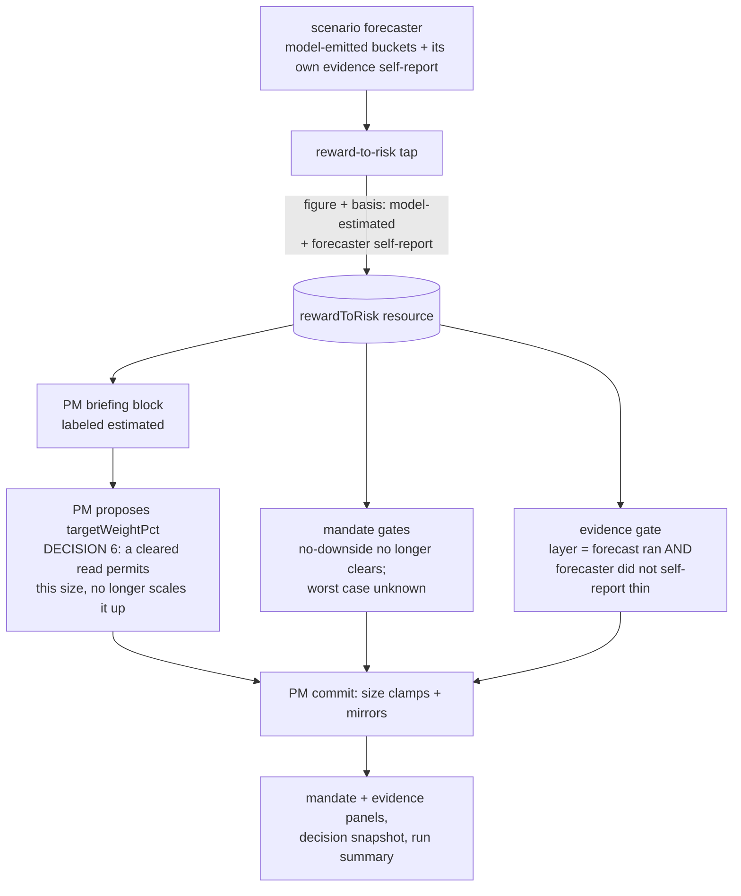

# FIX-1065: The reward-to-risk figure rests on model-invented odds — Implementation Spec

**Linear:** [FIX-1065](https://linear.app/fixpoint-labs/issue/FIX-1065) · **Epic:** [FIX-1067 — Trading desk: report completeness & analytical depth](https://github.com/fixpoint-labs/flow-state-dev/pull/1160) · **Branch:** `spec/FIX-1065`

---

## Part I — The Case *(for the human)*

### 1. Problem — why it matters, why now

The desk shows a reward-to-risk number and treats it as a hard fact. It is used to decide
whether a position is worth taking and how large it may be. The arithmetic on top of it is
real. The odds underneath it are not measured from anything — an AI wrote them.

That would be a labeling problem if the number were only displayed. It isn't. **On a run with
a risk mandate, an optimistic guess does not merely switch off the checks that would have cut
a position — it asks for a bigger one.**

Three holes. The first two disable protections; the third is the one that costs money, and it
was missed on the first pass.

- **A forecast with no losing scenario is treated as a safe one.** When the model's
  distribution contains no downward case, the desk records "no downside", counts the
  reward-to-risk bar as met, and reads the worst case as positive — so the hard capacity check
  that exists to catch names the book cannot absorb has nothing to object to. A model that did
  not imagine a loss is not evidence that no loss is possible.
- **A forecaster that says its own evidence is thin is overruled.** The forecaster reports
  whether it had enough to work with. Nothing reads that report. The evidence check instead
  looks at whether three well-formed buckets came back — which the output format guarantees on
  every successful run. So the one honest signal in the chain is discarded, and the check
  clears on a self-declared guess.
- **A flattering guess turns the size dial up, and nothing downstream bounds it.** The desk
  hands the PM the odds and then tells it, in two separate places, that a name which *clears*
  the bar should be sized toward a fraction of a full-Kelly stake. A Kelly stake is a function
  of the odds — so better invented odds ask for a bigger position, by design. The three
  deterministic gates that follow only ever *reduce* a size, and only when a gate *fails*. So
  on a flattering forecast every gate clears, nothing clamps, and the committed position size
  is whatever number the model wrote.

**What that means in practice.** Take one name on the house-default (balanced) book. Give it a
forecast with no losing case: the desk clears every gate, and a proposed 3%, 8%, or even 25%
of the book passes through untouched. Give the *same* name a forecast that admits a one-in-four
chance of a 20% loss: the reward-to-risk bar fails and the position is capped at 1.5%. The
difference between those two outcomes is not evidence. It is whether the model bothered to
imagine a loss.

So the answer to "if the odds are invented, what can actually go wrong" is not *the desk stops
protecting*. It is **the desk can take a materially larger position on a name precisely because
the forecast was flattering** — and the protections that exist to catch that are the ones the
same flattering forecast switched off.

**Why now.** The epic's rule is that a figure built on invented inputs must stop being
presented as a measurement. This is the only real instance of that class in the set, and it
reaches two shipped gates outside this issue, so it is specced before anything else is built
against the figure.

### 2. Solution in plain terms

Four moves. The first three invent no new number; the fourth is the owner's call, not mine, and
one branch of it (a replacement size ceiling, §12's 6b) would introduce one.

1. **Say what it is.** The figure is labeled model-estimated everywhere it is shown or fed to
   an agent — the PM's briefing, the mandate panel on both report surfaces, the evidence panel,
   and the stored decision record.
2. **Stop treating a flattering guess as a clean bill of health.** A forecast with no losing
   scenario stops clearing the reward-to-risk bar and stops satisfying the capacity check; it
   is treated as an *unknown* worst case, which the code already handles conservatively.
3. **Let the forecaster's own admission count.** When the forecaster says its evidence was
   thin, that gates new exposure. An estimate may now trigger a protection; it still may not
   satisfy one.
4. **Stop letting a guess ask for a bigger position.** Today a cleared read tells the PM to
   size toward fractional-Kelly, so better invented odds buy a bigger stake. The choice is
   between removing that upward pull — a cleared read would *permit* the PM's evidence-based
   size rather than *scale it up* — and leaving it in place with the exposure written down.
   **This is decision 6, and it is the owner's** (§6, §12). Removing the pull retires the
   size-appetite dial with it — the two sentences are the dial's only readers — so the delete
   branch carries a second, smaller call: retire the dial, or replace it with a size ceiling
   that does not come from the odds (§12).

What we deliberately do **not** do is make every check fail because the odds are estimated.
Every run's odds are estimated — there is one producer and it is a model — so a blanket rule
would fire on 100% of runs: the desk would never recommend initiating or adding a position
again, and any run with a risk mandate would be pinned at its hard cap. A protection that
fires always has stopped discriminating. The residual bypass that remains — an optimistic but
not impossible distribution — is written down rather than papered over, and grounding the odds
in observable data becomes its own issue outside this epic.

**Philosophy** — tenet 1 (coherence): the desk's rule is that computed figures are computed;
this makes the one figure that breaks the rule say so. Tenet 3 (earn every addition): no new
data source, no new model call, no new number — the change is a label, two inverted defaults,
and one signal that already exists being read.

### 6. Decisions & rules — the sign-off surface

1. **The reward-to-risk figure is labeled model-estimated wherever it is shown or used.**
   *Rejected:* labeling only the report and leaving the agent-facing briefing alone.
   *Locks in:* the desk concedes in public that one of its headline numbers is an estimate. If
   we later ground the odds, the label flips rather than disappearing, so the concession is
   reversible.

2. **A forecast with no losing scenario no longer clears the reward-to-risk bar, and its worst
   case counts as unknown.**
   *Rejected:* keeping today's "no downside means the bar is met" rule.
   *Locks in:* on a conservative book, a run whose forecast contains no bear case now results
   in no position rather than a full one. We accept losing some genuinely one-sided setups to
   stop a model's omission from reading as safety.

3. **The forecaster's own "my evidence was thin" now gates new exposure; three well-formed
   buckets no longer count as sufficient evidence on their own.**
   *Rejected:* dropping the reward-to-risk layer from the evidence check entirely — that would
   also drop the real signal it carries, that no forecast ran at all.
   *Locks in:* the desk becomes more cautious on exactly the thin runs the check was built for,
   and a model self-report acquires consequences for the first time. If the forecaster becomes
   pessimistic about itself, more runs land on "don't add".

4. **Checks may be triggered by an estimate; they may not be satisfied by one — applied where
   the estimate is flattering, not everywhere.**
   *Rejected:* blanket fail-closed on every check that reads the figure (see the ask below).
   *Locks in:* a known bypass survives — an optimistic-but-plausible distribution can still
   clear the mandate's soft bar, and (unless decision 6 says otherwise) a cleared bar still
   pulls the size up. It is recorded in the code's contract, in the report's disclosure line,
   and in §12, and it is what the grounding follow-up exists to close.

5. **The figure keeps driving the gates it drives today; nothing moves to advisory.**
   *Rejected:* demoting the mandate's size caps to narrative and leaving the PM to interpret
   the figure.
   *Locks in:* the desk keeps its only downside-sizing discipline. Removing it in the name of
   honesty would have made the product less safe, not more.

6. **An estimate may permit a size; it may not authorize a larger one.** *(Owner's call — see
   §12. Added after review; the first draft did not know this path existed.)* The two places
   that tell the PM to size a cleared name toward fractional-Kelly are rewritten so a cleared
   read *releases* the PM's evidence-based size rather than *scaling it toward the odds*. An
   uncleared read keeps its token-size instruction exactly as today.
   *Rejected:* leaving the sizing instruction untouched and disclosing the exposure in the
   residual-risk paragraph the owner is approving.
   *Locks in:* the desk stops sizing up on optimism it cannot substantiate, and a cleared read
   ends up with **no size ceiling of any kind** — the two mandate caps fire only on a *failing*
   gate. Reversible — grounding the odds makes fractional-Kelly sizing legitimate, and this
   instruction can come back the day the odds are measured.
   *My recommendation: take it.* It removes the only path by which invented odds *increase*
   exposure. The other five decisions all make the desk more cautious; leaving this one open
   would mean shipping a spec that closes the small holes and leaves the large one documented.

   **Correction (round 2 — this changes what decision 6 costs).** The first draft of this
   decision said the `kellyFraction` dial "becomes a ceiling the PM reasons against". It does
   not, and cannot as written. The only code that reads the dial's value is `formatRiskMandate`,
   and its only other mention on the model path is the PM prompt rule — the two sentences this
   decision deletes (§7 enumerates all six files). Nothing in the desk computes a full-Kelly
   stake for it to be a fraction of. Delete both and the dial reaches nothing — not the model, not a gate, not a
   panel. Preserving it *as* a ceiling would require the PM to derive full-Kelly from the same
   model-emitted odds, which is precisely what §9's invariant forbids. So decision 6 is no
   longer "two prose surfaces, no gate logic": it also decides what happens to the dial —
   **retire it, or replace it with a ceiling that does not come from the odds.** That is
   decision 6b, and it is the owner's (§12).

**Non-goals** — grounding the odds in realized volatility, an options-implied distribution, or
the valuation envelope (real analytical work, a new issue, outside this epic's fence);
measuring whether the forecaster is *calibrated* against realized outcomes (that is the outcome
scoring work, where it can actually be measured); changing how the forecaster is asked to
produce probabilities; and touching the final rating, which stays orthogonal to every size
gate.

**Size:** Medium — 13 production files (12 + the PM prompt) · 13 test behaviours · 2 doc
surfaces · 1 recompute script · 1 goal · 1 PR. Decision 6b's *retire* branch adds one file
(`lib/risk-mandate.ts`) and removes a test; its *replace* branch adds gate logic to
`lib/mandate-gates.ts` and would push this to the top of Medium.

---

### 3. Tradeoffs & alternatives

**Alternative: demote and accept.** Relabel the figure, leave every check reading it exactly as
today, write the bypass down. It is honest about the words and changes nothing about the money,
which is precisely what the epic's own rule rejects — an invented input is not rescued by a
label. Rejected, but note that decision 4 keeps a piece of it: the residual bypass is accepted
and disclosed rather than closed.

**Alternative: demote and fail closed everywhere.** The epic's recommendation, and it does not
survive contact with the code. The evidence check combines its three layers with an AND, so a
layer that can never be satisfied makes the verdict "insufficient" on every run, and every
"initiate" or "add" becomes "hold" permanently. The mandate's caps behave the same way: soft
gates that can never clear pin every mandated run at a token size unless the PM writes an
override sentence, which would make an AI-written string the thing that unlocks position size.
The epic's own falsifier — *"if failing closed gates most runs rather than the thin ones"* — is
met at 100%, and it is met by construction rather than by observation, because "estimated" is
constant.

**The simpler approach: label-only.** Genuinely tempting; it is a two-hour change. Insufficient
for the reason above, and it would leave the no-downside hole open, which is the one place the
model's invention is both most visible and most flattering.

**Where the complexity is:** not the arithmetic. It is that the two consumers want different
things from the same figure. The mandate's capacity line wants a worst case and can treat
"unknown" as a veto. The evidence check wants a statement about substrate quality and, today,
reads a well-formedness test instead. Getting this right means splitting "the forecast ran"
from "the forecast was worth believing" — they are currently the same boolean.

### 4. Focus practices (1–5)

1. **BP-030 (tolerate the old shape)** — every stored report predates the estimated-basis
   marker. Reading one must not crash and must not silently claim the figure was measured; an
   old record reads as model-estimated, because every old record was.
2. **BP-020 (never fabricate to keep a surface drawing)** — "unknown worst case" must present
   as unknown, through the sentinels the app already uses (`—`, `n/a`), not as a zero or a
   benign number.
3. **Tenet 5 (one convergence point)** — the estimated basis is stamped once where the figure
   is produced. Every consumer reads it from there. A second place that decides what
   "estimated" means is how one surface ends up telling a different story than the gate.
4. **BP-003 (verification evidence)** — decisions 2 and 3 change how often the desk says no.
   The change is not done until that frequency is counted by applying the old and new rules to
   the *same* captured forecasts (§10) — re-running the pipeline twice would measure model
   variance, not the gate.

### 5. What using it looks like

No public framework API changes — this is app-internal behaviour in the trading desk, so the
observable surface is the report and the machine-readable run summary.

**A forecast with no losing scenario, on a balanced mandate** *(what this spec proposes)*:

```
before  loss-adj GLR: "no downside"   verdict: clears   target: 3.0% of NAV
                                          — and 8%, and 25%, all unclamped: on a cleared
                                            read nothing bounds the model's number
after   loss-adj GLR: "—  (no bear case emitted — worst case unknown)"
        verdict: fails (capacity unproven)              target: 0.5% of NAV
```

The `0.5%` is the **capacity** cap, and it only appears if the worst case is normalized to
unknown *at the producer* (§7). Inverting the reward-to-risk bar alone leaves the worst case
reading `+4%`, capacity still clears, and the soft cap lands the position at `1.5%` instead —
three times the size, for a name whose downside nobody has seen. Both numbers are executed
output, not estimates; see §7's verification note.

**The same name, on decision 6** *(if the owner takes it)*:

```
before  cleared read → "size toward 40% of a full-Kelly stake"   model proposes 8.0% of NAV
after   cleared read → "the bar is met; size on the evidence"    model proposes on its own
        (nothing then caps a cleared name: the mandate's two size caps fire only on a
         FAILING gate, and the appetite dial the old sentence quoted reaches nothing
         once the sentence is gone — see decision 6b in §12)
```

**A forecaster that reported its own evidence as thin:**

```
before  evidence: sufficient   action: add     target: 2.0% of NAV
after   evidence: insufficient (forecaster reported thin evidence)
        action: hold           target: capped at the current position
```

**The mandate panel's figure, on every run:**

```
before  REWARD-TO-RISK          loss-adj GLR 1.82
after   REWARD-TO-RISK (model-estimated odds)   loss-adj GLR 1.82
```

## Part II — The Build Plan *(for the implementing agent)*

### 7. Technical design

The chain is unchanged in shape: the forecaster emits buckets, a deterministic tap derives the
figure, and its consumers read it. What changes is what the figure *carries*, what the
deterministic consumers are willing to conclude from it, and — decision 6 — what the prompt
consumers are told to do with it.

**Every producer and consumer of the odds and the figure they derive.** The first pass missed
the sizing path because it enumerated the *gates* and stopped. This is the full set.

| # | Producer / consumer | What it does with the odds | In scope? |
|---|---|---|---|
| 1 | scenario forecaster (`agents/scenario-forecaster/`) | **the only producer** of the buckets and of its own evidence self-report | **No** — changing how it is asked for probabilities is a stated non-goal; grounding is the follow-up |
| 2 | `computeRewardToRisk` (`lib/reward-to-risk.ts`) | derives the figure; sets `noDownside` and `worstCaseReturnPct` | **Yes** — carries the basis; normalizes the no-bear-case worst case to unknown |
| 3 | `compute-reward-to-risk.ts` (the tap) | stamps the figure onto the resource | **Yes** — also carries the forecaster's self-report |
| 4 | `computeMandateGates` / `clampTargetWeight` (`lib/mandate-gates.ts`, FIX-752) | reads `noDownside`, `lossAdjustedGlr`, `expectedValuePct`, `worstCaseReturnPct`; caps size **downward only, and only on a failing gate** | **Yes** — decision 2 |
| 5 | `computeEvidenceGate` (`lib/evidence-gate.ts`, FIX-781) | reads `rewardToRiskEvidenceBasis` only | **Yes** — decision 3 |
| 6 | `computePolicyGate` (`lib/policy-gate.ts`, FIX-761) | **does not read the figure at all** — clamps on the IPS cap and household weight | **No** — checked and clear. Named because it is the layer *beneath* the inflated size, and it only bounds anything when a household IPS exists |
| 7 | PM commit (`agents/portfolio-manager/writer.ts`) | seeds `targetWeightPct` from the model's number, then runs 4 → 6 → 5 | **Yes** — mirrors the basis outward |
| 8 | `formatRewardToRisk` (`lib/format.ts`) → `<rewardToRisk>` | hands the PM the upside/downside/GLR/EV/worst-case numbers | **Yes** — decision 1 (label) |
| 9 | `formatRiskMandate` (`lib/format.ts`) → `<riskMandate>` | tells the PM **and the trader** that a cleared name is "sized to about *k*% of a full-Kelly stake" | **Yes** — decision 6. **This is the hole one field over from the one review named** |
| 10 | PM prompt rule 11, `sizeStance` (`portfolio-manager.prompt.md`) | "a CLEARED name sizes toward the mandate's fractional-Kelly appetite" | **Yes** — decision 6, the surface review named |
| 11 | trader (`agents/trader/trader.ts`) | opts into `riskMandate` but **not** `rewardToRisk` — the tap runs after Phase 3, so it never sees the odds | **No** — checked. It reads the Kelly sentence but has no figure to scale off. Do not "fix" it later thinking it is a path |
| 12 | `mandate-panel.tsx` | renders `noDownside`, `lossAdjustedGlr`, `worstCaseReturnPct`, `evidenceBasis` | **Yes** — decisions 1 + 2 (the mirror must read unknown, not a benign `+4%`) |
| 13 | `evidence-panel.tsx` | renders `rewardToRiskEvidenceBasis` | **Yes** — decision 3 |
| 14 | decision snapshot · run summary · run artifacts | mirror the GLR, worst case, capacity flag, both verdicts | **Yes** — the stored record of a decision must say what its inputs were |
| 15 | `eval/invariants.ts` | recomputes gates 4 and 5 and cross-checks the mirrors | **Yes** — realign to the new rule |
| 16 | `eval/blinding.ts` · `eval/rubrics.ts` | judge inputs | **No** — the judge layer scores runs, it does not gate capital |

**One more model-invented input on the same path, deliberately left alone:**
`decisionConfidence` is LLM-emitted and feeds `confidenceCleared`, so it too can flip the
mandate to *cleared* and release the upward pull. It is a real instance of the same class and
it is **out of scope here** — it belongs to the honesty-taxonomy sweep in §12, not to the
reward-to-risk figure.



The `P → N → W` edge is the path the first draft did not draw: the figure reaches the model
*before* it reaches any gate, and the number the model writes is the number the gates start
from. Gates 4 and 5 can only pull it down.

- **The figure's shape** (`flows/analysis/reward-to-risk-resource.ts`,
  `flows/analysis/lib/reward-to-risk.ts`) gains an explicit input basis — one value today,
  `model-estimated` — and carries the forecaster's own evidence self-report alongside the
  computed bucket check. The two are separate fields on purpose: one is a fact about the data
  (buckets are usable), the other is a stated judgment (the forecaster thinks it was guessing).
  Because there is only one basis value today, the *label copy* can be static; what has to be
  persisted is the **self-report**, which varies per run and which the gate and the eval
  recompute must both read. Persist the basis field only if the implementer finds a consumer
  that cannot derive it — otherwise a stored constant is a field with no producer (tenet 3).
- **The tap** (`flows/analysis/compute-reward-to-risk.ts`) reads the self-report off the
  committed scenario memo, which already stores it, and stamps it onto the resource.
- **The producer normalizes the no-bear-case worst case** (`lib/reward-to-risk.ts`). This is
  the correction review caught, and it is load-bearing. Today a no-downside distribution stores
  the *minimum emitted return* as a positive `worstCaseReturnPct`, and the capacity line's
  unknown branch is keyed on `worstCaseReturnPct == null` — so inverting the reward-to-risk bar
  alone leaves capacity clearing and the panel still rendering a benign `+4%`. `noDownside`
  must set `worstCaseReturnPct: null` **where the figure is produced**, so the existing null
  branch is genuinely reused, and every mirror and panel inherits the unknown for free
  (tenet 5 — one convergence point). Normalizing in the gate instead would fix the money and
  leave the stored report claiming a worst case it cannot know.
- **The mandate gates** (`lib/mandate-gates.ts`) stop treating a no-downside distribution as a
  cleared reward-to-risk bar. Given the producer change above, the capacity line needs **no
  edit at all** — its existing `worstCaseReturnPct == null` branch already fails closed.
- **The evidence gate** (`flows/analysis/lib/evidence-gate.ts`) keeps its reward-to-risk layer
  but redefines it: the forecast ran with usable buckets **and** the forecaster did not report
  thin evidence. The other two layers are untouched.
- **The two sizing instructions** (decision 6, if taken) — `formatRiskMandate` in
  `lib/format.ts` and rule 11's `sizeStance` in `portfolio-manager.prompt.md`. Both are prose;
  neither has gate logic. They must change **together**: fixing one and leaving the other is
  precisely the failure this epic keeps repeating. Note that `formatRiskMandate` currently
  asserts to the model that "the mandate only ever reduces size, never inflates it" two clauses
  after telling it to size toward fractional-Kelly — true of the deterministic clamps, false of
  the sentence above it.

**Every consumer of `kellyFraction`, enumerated** (review round 2 — the reason decision 6
grew a second half). Exhaustive, case-insensitive, repo-wide:
`rg -i kelly` returns six files outside this spec.

| Reader | What it does with the dial | After decisions 6 + 6b |
|---|---|---|
| `lib/risk-mandate.ts` (schema field + the three preset literals `0.25 / 0.4 / 0.6`) | **declares** it | the only thing left |
| `lib/format.ts` → `formatRiskMandate` | the **only** code that reads the value: interpolates it into the `<riskMandate>` sentence the PM *and* the trader see | deleted |
| `portfolio-manager.prompt.md` rule 11 (`sizeStance`) | names "the mandate's fractional-Kelly appetite" in prose (no interpolation) | deleted |
| `portfolio-manager.ts` (the `sizeStance` field comment) | a doc comment — "how the mandate's appetite (kellyFraction) shaped the size you chose" | goes stale; update with the two surfaces |
| `test/risk-mandate.spec.ts` | asserts `conservative.kellyFraction < aggressive.kellyFraction` (preset ordering) | the last thing keeping a dead field green |
| `labs/trading-desk/CLAUDE.md` | lists it among the dials | §11 |

**Nothing computes a full-Kelly stake.** `computeMandateGates` / `clampTargetWeight`
(`lib/mandate-gates.ts`, read end to end) never reference the dial — they read `noDownside`,
`lossAdjustedGlr`, `expectedValuePct`, `worstCaseReturnPct`, `decisionConfidence`, the floors,
and the two caps. `computeRewardToRisk` emits GLR / EV / worst case and no Kelly quantity.
There is no edge→fraction math anywhere in the app. So "the dial becomes a ceiling" was never
available: a ceiling needs a full-Kelly figure, and deriving one would scale size off the same
unmeasured odds (§9's invariant).

**The odds-independent ceiling already has a precedent, and it is optional.** The IPS policy
gate's `constraints.maxPositionWeightPct` (`lib/policy-gate.ts`, §7 row 6) is exactly an
odds-independent hard per-name cap — but it is nullable, household-basis, and binds only when
the household has recorded a portfolio mandate. That is why row 6 reads "checked and clear":
on a book with no IPS, nothing bounds a cleared name at all. Decision 6b is whether the
appetite pack gets its own such cap or whether the ceiling stays the IPS's job.
- **Presentation** — the PM's briefing block (`lib/format.ts`), the mandate and evidence panels
  under `components/theses/`, and the stored decision record (`resources.ts` mirrors, decision
  snapshot, run summary).
- **Untouched:** the forecaster's prompt and output shape, the valuation spine, the final
  rating, the portfolio policy gate (checked — it never reads the figure), the trader (checked
  — it never receives the figure), and every data tool.

**What was executed and what was only read.** Executed: the pure gate path, driven directly
(`computeRewardToRisk` → `computeMandateGates` → `clampTargetWeight`, balanced preset). That
run is what confirms a no-bear-case figure clears every gate and passes a 3% / 8% / 25%
proposal through **unclamped**; that inverting only the reward-to-risk bar lands at `1.5%`
(soft cap, capacity still clearing on a `+4%` worst case); and that normalizing the worst case
to `null` lands at `0.5%` (capacity cap). Read, not executed: that the two prompt surfaces
instruct upward sizing, and that no schema bounds `targetWeightPct` (`z.number()`, no `.max()`).
**Round 2 rests on reading, and deliberately so.** The `kellyFraction` enumeration above and
§10's seam trace were established by exhaustive search and control flow, with nothing executed
this round. Neither claim is the kind execution settles: the first is an *absence* (no consumer,
no full-Kelly quantity), which a case-insensitive repo-wide search proves and a run cannot; the
second is static ordering (`create(..., { replace: true })` in `setupScenarioForecastMemos`,
then the live forecaster, then the tap — `analyze.ts`'s `forecastStage` → `computeAndStoreRewardToRisk`)
plus the CLI's seed surface, all of which read unambiguously. The round-1 execution stands
unchanged. **Not verified at all, and not verifiable by reading:** whether a given model actually
complies with the fractional-Kelly instruction on a given run. That is the point — the only thing
standing between invented odds and a large position is the model's own restraint, which is not
a control. §10's frequency count is what turns this into a measured number.

**Sketch — pseudocode. Illustrative, not the contract. React to the shape.**

```
when the figure is PRODUCED:
    selfReported ← the forecaster's own evidence call, carried through unchanged
    no bear case in the distribution  →  worstCaseReturnPct is NULL (unknown)
                                         — normalized HERE, so every gate, mirror,
                                           and panel inherits it

in the mandate gates:
    reward-to-risk bar met?
        no bear case in the distribution  →  NOT met
        otherwise                          →  as today
    capacity line:  UNCHANGED — its existing null branch now actually fires

in the evidence gate:
    reward-to-risk layer  ←  forecast produced usable buckets
                             AND the forecaster did not call its own evidence thin

in the two sizing instructions (decision 6):
    cleared read  →  "the bar is met; size on the evidence"
                     (was: "size toward k% of a full-Kelly stake")
    uncleared     →  token size — unchanged
```

What this asks a reviewer: *is "no bear case emitted" the right place to draw the fail-closed
line?* It is the one case where the model's omission is indistinguishable from an assertion of
safety. Everything softer than that is judgment about a number nobody measured, and everything
harder gates every run.

**No POC was built; a targeted check was run instead, and it changed the spec.** The premise the
direction rests on — that a blanket fail-closed rule fires on every run — is a property of a
boolean conjunction over a constant, readable in the two gate modules. But the *no-bear-case*
path was not that kind of claim, and reading it got it wrong: the first draft asserted the
capacity branch would fire, and driving the pure functions directly showed it does not (the
worst case is a positive number, not null). Ten minutes of execution corrected §5, §7, and §8.
What execution still cannot answer is the number that actually matters at the gate — how often
a no-downside forecast occurs, and whether the model really does size up on one — because that
needs stored runs across the fixture corpus. §10 makes counting both part of the implementation.

### 8. Implementation sequence

1. **Carry the self-report.** Widen the figure's stored shape; stamp it in the tap; dual-read an
   older record as model-estimated with no self-report (BP-030). Nothing changes behaviourally
   yet. *Test:* a legacy record reads without crashing and reads as estimated. *Depends on:*
   nothing.
2. **Normalize the no-bear-case worst case to `null` at the producer** (decision 2, the
   convergence point). *Test:* a no-downside distribution yields `worstCaseReturnPct: null`;
   the existing capacity branch fires with no edit to `mandate-gates.ts`'s capacity line.
   *Depends on:* nothing. **Do this before step 3** — it is what makes step 3's example true.
3. **Stop the no-downside distribution clearing the reward-to-risk bar** (decision 2).
   *Test:* the §5 no-bear-case case on each of the three mandate presets, asserting the
   *capacity* cap fires (0.5% on balanced), not the soft cap. *Depends on:* 2.
4. **Redefine the evidence layer** (decision 3). *Test:* a self-reported-thin forecast gates a
   would-be add; a self-reported-sufficient one behaves as today. *Depends on:* 1.
5. **Rewrite both sizing instructions together** (decision 6, if the owner takes it):
   `formatRiskMandate` in `lib/format.ts` **and** rule 11's `sizeStance` in the PM prompt. Also
   fix the internal contradiction in the `<riskMandate>` block, which claims the mandate never
   inflates size two clauses after telling the model to size toward Kelly. *Test:* both
   rendered blocks are asserted against a snapshot containing no upward-sizing directive; a
   test that reads only one of the two surfaces does not satisfy this step. *Depends on:*
   nothing.
   **5b — land the dial's fate in the same step** (decision 6b, whichever way the owner calls
   it). *Retire:* drop `kellyFraction` from `riskMandateSchema` and the three presets, drop the
   ordering assertion in `test/risk-mandate.spec.ts`, and fix the stale `sizeStance` field
   comment in `portfolio-manager.ts` — a field with no reader is exactly what tenet 3 refuses,
   and leaving it in place is how the next reader re-derives a Kelly sentence. *Replace:* add
   one odds-independent per-preset cap and enforce it in `clampTargetWeight` on a **cleared**
   read, which is new gate logic and three new constants — size the step accordingly, and note
   that it is the first mandate effect that binds a passing name. Do **not** ship step 5 with
   the dial left dangling: that is the state where the spec's own claim ("a ceiling to reason
   against") reads true and is false.
6. **Mirror outward** — memo mirrors, decision snapshot, run summary — so the stored record of a
   decision says what its inputs were, and shows `—` where the worst case is unknown.
   *Depends on:* 1, 2.
7. **Label every presentation surface** (decision 1): the PM briefing block, the mandate panel,
   the evidence panel. *Depends on:* 6.
8. **Realign the eval invariants** that recompute the mandate and evidence verdicts, so the
   deterministic layer checks the new rule rather than the old one. *Depends on:* 3, 4.
9. **Count the change** over the captured-forecast corpus (§10) and record the before/after in
   the PR. *Depends on:* all.

### 9. Edge cases & error handling

| Case | Expected |
|---|---|
| Forecaster memo absent or errored | Unchanged: no figure, evidence layer fails, mandate-blind decision |
| No losing scenario in the distribution | Reward-to-risk bar not met; worst case unknown; capacity fails closed (decision 2) |
| Forecaster reports thin, buckets are well-formed | Evidence layer fails; new exposure gated (decision 3) |
| Forecaster reports sufficient, buckets unusable | Evidence layer fails, as today — the deterministic check still binds |
| Stored report written before this change | Reads as model-estimated with no self-report; the self-report cannot gate retroactively (BP-030, and the epic's forward-looking guarantee) |
| Mandate-blind run | Mandate gates do not run at all; the evidence gate still applies |
| A re-run on the same session | The tap already clears a stale figure; the self-report clears with it |
| Cleared read, mandate-aware run | Decision 6: the size the PM proposes is its own, not one scaled toward the odds. Both mandate caps are keyed to a *failing* gate, so unless decision 6b adds a cleared-name cap, nothing bounds it (the IPS cap binds only where a household mandate exists) |
| Cleared read, mandate-**blind** run | Unchanged — with no `<riskMandate>` block there is no Kelly instruction and no mandate clamp. The PM still sees the figure, so the label (decision 1) is what carries here |

**Taxonomy:** every case degrades toward *less* exposure — with one honest exception. Decision 6
removes an *upward* pull rather than adding a downward one, so on a cleared read the post-change
size is whatever the model proposes unaided, which is not provably ≤ the pre-change size on
every single run. The invariant the tests can pin is narrower and true: **nothing in the desk
scales a position size off a number no one measured.**

### 10. Testing strategy

**Decision 2's headline cannot be pinned end to end. Saying so is the honest answer.** Round 1
replaced a goal that hoped the model would emit a no-bear-case forecast with one that seeds a
stored scenario memo before the tap. Round 2 traced that remedy and it cannot run either. Four
independent reasons, each read from source:

- **Nothing writes a memo from outside the pipeline.** Scenario memos are entries in the
  `memos` **resource collection** (`ctx.resources.memos.create(...)`), and `fsdev run`'s three
  seed flags — `--seed-session` / `--seed-user` / `--seed-org` — merge JSON into the session /
  user / org **state** record only (`packages/cli/src/commands/run.ts`). There is no
  `--seed-resource`.
- **The pipeline overwrites it anyway.** `forecastStage` opens with
  `setupScenarioForecastMemos`, which calls `create(key, scaffold, { replace: true })` — the
  memo is replaced wholesale — and then runs the live forecaster, which commits over it.
- **And it does so immediately before the read.** `analyze.ts` is
  `… .step(forecastStage).tap(computeAndStoreRewardToRisk).step(portfolioStage)`, and the tap
  reads the committed scenario memo. There is no window between the write and the read.
- **No action starts the pipeline downstream of the forecaster.** The flow registers exactly
  five: `analyze`, `setInstructions`, `runSummary`, `runArtifacts`, `adoptThesis`.

Nor is there a generator seam to pin the output instead: `--model` swaps *which* model runs, not
what it returns, and the desk's fixture mode stubs data **tools** only. So the precondition is
model-dependent by construction — and the forecaster's prompt asks for a downside case, making
it the *rare* output rather than one we can wait for. **There is therefore no end-to-end goal
for decision 2**, and `goals/trading-desk-reward-to-risk/no-bear-case-caps-size/` is not built.

**Rejected: adding a seeding action to make the goal possible.** A registered zero-model writer
for scenario buckets would exist only for the test (tenet 3), and it would be a
fabricate-a-forecast surface shipped by the issue whose whole subject is not fabricating
forecasts. If the end-to-end statement is wanted later, the legitimate route is a general
generator record/replay seam at the framework level — a follow-up (§12), not a hole punched in
this app.

**Where decision 2 is actually pinned:** the pure seam, in CI. `computeRewardToRisk` →
`computeMandateGates` → `clampTargetWeight` → the PM commit are all reachable from vitest with
the existing mock context, and that chain *is* the decision — the same path round 1 executed
directly to correct §5 and §7. This is a narrower claim than an end-to-end goal and it is the
true one.

**The goal that does hold** — `goals/trading-desk-reward-to-risk/forecaster-self-report-reaches-the-gate/`:
on an ordinary fixture run, the forecaster's own evidence self-report is carried onto the stored
record and the evidence verdict agrees with a recompute from it. Its precondition is present on
**every** run (the forecaster always reports something), so it depends on the plumbing rather
than on which way the model called it — the `standing-thesis-injected` shape, on the same
`analyze` → `runSummary` ladder. It proves decision 3's chain end to end. It does **not** prove
decision 2's headline; nothing available does.

**CI specs** (the behaviours, not the test names):

- one behaviour per decision in §6, stated as what the desk decides rather than what it computes
- the no-downside case across all three mandate presets, including the conservative one whose
  hard cap is zero — asserting the **capacity** cap fires, not the soft cap
- the self-reported-thin case, and its complement — a sufficient self-report must not tighten
  anything on its own
- the legacy path (BP-030): a stored figure with no self-report field **reads and gates without
  crashing, defaulting the missing metadata**. This is explicitly *not* full behavioural parity:
  any stored figure with `noDownside: true` changes outcome under decision 2, by design. BP-030
  is about tolerating the old shape, not about preserving the old verdict
- decision 6 covered on **both** prompt surfaces in one spec, so neither can be fixed alone
- decision 6b: on *retire*, the dial is gone from the schema and the presets (a typecheck, plus
  the deleted ordering assertion, is the whole evidence); on *replace*, a cleared read is capped
  at the new per-preset ceiling on all three presets — the first mandate behaviour that binds a
  **passing** name, so it needs its own case rather than riding the existing clamp specs
- what must not change: the final rating, on every case above
- the invariant (per §9): no code path scales `targetWeightPct` off the reward-to-risk figure

**The frequency count** (BP-003, and the epic's own falsifier) — **recompute, do not re-run.**
Two separate `analyze` sweeps would re-invoke the generators, so the scenarios and the proposed
sizes differ between samples even with no change applied; the verdict/size delta would then mix
model variance with the gate's real effect, in both directions. Instead: capture each corpus
run's forecast artifacts once, then apply the **old and new pure gate rules to the same captured
forecasts** offline (`computeRewardToRisk` → `computeMandateGates` / `computeEvidenceGate` are
pure, so this is a script, not a sweep). That answers "how often" exactly, costs no model spend,
and is attributable by cause. It is **ship-blocking for decision 2** — if the no-downside rule
fires on most runs rather than the rare ones, decision 2 goes back to the owner rather than
shipping quietly.

Decision 6's frequency cannot be recomputed this way — removing an upward instruction changes
what the model writes, so measuring it needs paired live runs. That is a PR appendix, not a
ship gate, and it should be reported as the sampled observation it is.

**Discipline:** `tdd`. The seam is the producer plus the two pure gate modules plus the PM commit
handler, all reachable from vitest with the existing mock context, so every **CI** behaviour
above is a tracer bullet with no model call. The one goal runs real generators, as goals do.

### 11. Documentation plan

- **EXTEND** `labs/trading-desk/CLAUDE.md` — the FIX-752 and FIX-781 sections currently
  describe the reward-to-risk figure as deterministic without qualifying its inputs. Add the
  estimated-basis qualifier, the no-downside rule, and the residual bypass, in the same
  register as the surrounding limitations paragraphs. The FIX-752 section also states that "all
  mandate effects are downward-only" — true of the deterministic clamps, but the section
  describes the `kellyFraction` dial two paragraphs earlier without noting it is an *upward*
  instruction to the model. Correct that, whichever way decision 6 lands — and if 6b retires
  the dial, drop it from that dial list rather than leaving a documented knob with no effect
  (BP-034: finish the removal, including the FIX-752 section's prose).
- **EXTEND** `labs/trading-desk/docs/run-quality-eval.md` — one paragraph where the
  deterministic invariants are described, noting that the reward-to-risk recompute now checks
  the estimated-basis rule.
- **No `apps/docs` change.** The trading desk is a lab app, not published framework surface;
  nothing a framework user writes changes.
- **Changeset:** internal to a private lab app — an empty changeset (BP-022). The implementer
  confirms the package's publish status before choosing.

### 12. Dependencies, open questions & follow-ups

**Dependencies:** none blocking. FIX-1063 changes the nullability of tool payloads; this chain
reads scenario buckets, not payloads, and the two do not meet.

**Adjacency to flag, not a dependency.** This change edits the mandate and evidence panels
under `components/theses/`, which the epic's ownership table assigns to FIX-1061 for the
*trader and risk memo renderers*. These are PM-decision panels in the same directory, not memo
renderers, so there is no shared seam and no landing order is required — but the epic's table
reads as if the directory has one owner. Raised on the epic PR rather than decided here.

**Open questions — the two the product owner holds.**

> ### First, what is actually at stake — corrected after review
>
> The first draft of this spec told you the invented odds could only *switch off* protections.
> That was wrong, and the correction is the reason this went back for a round.
>
> **If the odds are invented and flattering, the desk does not merely stop protecting — it takes
> a bigger position.** On any run where the book has a risk mandate set, the desk hands the AI's
> odds to the portfolio manager and then instructs it that a name which *passes* the
> reward-to-risk bar should be sized toward a fraction of a full-Kelly stake. A Kelly stake is a
> function of the odds. Better invented odds therefore ask for a bigger position, deliberately.
> Everything downstream can only shrink a position, and only when a check *fails* — so on a
> flattering forecast nothing shrinks anything, and the size the desk commits to is whatever
> number the AI wrote.
>
> Concretely, on the house-default book: give a name a forecast with no losing case and a
> proposed 3%, 8%, or 25% of the book all pass through untouched. Give the same name a forecast
> that admits a one-in-four chance of a 20% loss and the position is capped at 1.5%. The
> difference is not evidence about the company. It is whether the AI bothered to imagine a loss.
>
> *(These figures are executed output from the desk's own sizing code, not estimates. What is
> read rather than executed is the instruction telling the AI to size up; whether a given run's
> AI actually obeys it is behaviour nobody has measured — which is the point. The only thing
> between invented odds and a large position today is the AI's own restraint.)*

> ### Decision 6 — may an estimate make a position *bigger*?
>
> **Plain terms.** Two sentences in the desk tell the portfolio manager to size a passing name
> up toward the book's risk appetite. Both were written when everyone assumed the reward-to-risk
> number was measured. It isn't. The choice: delete the upward pull, so passing the bar
> *permits* the manager's evidence-based size instead of *scaling it up*; or leave it and
> write the exposure into the disclosure you are approving.
>
> **The trade-off.** Deleting it costs a real capability: sizing to conviction is how a growth
> book is supposed to behave, and an aggressive mandate that can no longer size winners up is a
> quieter product. Keeping it means the desk's largest positions are, by construction, the ones
> whose odds flattered them most.
>
> **My recommendation: delete the upward pull.** It is still the only change that stops invented
> odds from *increasing* exposure rather than merely failing to reduce it, and it is fully
> reversible: the day the odds are grounded in real data, fractional-Kelly sizing becomes
> legitimate and the instruction comes back.
>
> *Corrected in round 2:* I told you this was the cheapest change and that the aggressiveness
> dial would stay on as a ceiling. The first half is nearly right — it is two pieces of prose
> and no gate logic — but the second half was wrong. Those two pieces of prose are the dial's
> only readers, and nothing in the desk computes the full-Kelly stake a ceiling would need. So
> deleting the pull retires the dial too, and what replaces it is decision 6b below. It does not
> change my recommendation here; it changes what the recommendation costs.
>
> **What would change my mind:** if sizing to conviction is a headline behaviour of the
> aggressive book that customers have been shown or promised. Then this is a product-capability
> decision, not a safety one, and the honest answer is to keep it and disclose it loudly until
> the odds are grounded.
>
> **What being wrong costs: high in one direction, low in the other.** Wrongly deleting it makes
> the desk size more conservatively than intended — visible, annoying, reversible in an hour.
> Wrongly keeping it means the desk's biggest bets are its least substantiated ones, and nothing
> in the product would tell you that was happening. Asymmetric, which is why I lean to deleting.

> ### Decision 6b — if the upward pull goes, what carries "how big is big here"?
>
> *Only live if you delete the pull. Keep it, and the dial keeps its reader and this question
> disappears. Raised in round 2, because the first draft of decision 6 promised something it
> could not deliver — see the correction in §6.*
>
> **Plain terms.** Each of the three risk settings carries an aggressiveness number. Today it
> does exactly one thing: it appears in the sentence telling the AI to size a passing name up
> toward it. Delete that sentence and its twin and the number reaches nothing — no calculation
> uses it, no screen shows it, no instruction mentions it. Two ways to land: **retire it**, and
> let the settings that still bind do the differentiating (how much loss the book tolerates, how
> much asymmetry it demands, what it caps a failing name at); or **replace it** with a plain
> maximum position size per setting that the desk enforces itself — a passing name held to, say,
> 1% / 3% / 6% of the book however good the odds look.
>
> **The trade-off.** Retiring is honest and small, but it leaves a name the desk *approved* with
> no upper limit at all: every cap in the product today fires only when a check **fails**. A book
> that has recorded a household policy already has a per-name limit; a book that hasn't has
> nothing. Replacing closes that on every book, and it is the only version where "the dial is a
> ceiling" becomes a true sentence — but it is the first rule that would constrain a name the
> desk liked, it needs three numbers chosen with no evidence to choose them from, and set too low
> it quietly caps the high-conviction positions an aggressive book exists to take.
>
> **My recommendation: retire the dial here, and decide the cleared-name ceiling separately.**
> They are not the same instrument. The dial was an interpretive nudge to a model; a hard
> position cap is a portfolio-construction limit, and one already lives in the household policy
> — where it applies to every name rather than only the one being analyzed. Bundling it into
> this issue means picking three constants on no evidence inside a change about honesty, and
> shipping the product's first upward-binding constraint as a footnote to a labeling fix.
> Retiring is also the one option that cannot be subtly wrong: a field with no reader is
> removable, and the day the odds are grounded, fractional-Kelly returns with a real full-Kelly
> figure behind it.
>
> **What would change my mind:** if most books in practice have no household policy recorded.
> Then retiring ships a desk where an approved name is unbounded on the majority of runs, and
> the cap belongs here rather than in a follow-up. I don't have that number.
>
> **What being wrong costs: low both ways, but only one way is visible.** Wrongly retiring
> leaves a gap that already exists — nothing caps a cleared name today either; the Kelly
> sentence pushed size up, it never bounded it — so the desk is no worse than today and the cap
> is additive later. Wrongly replacing means an unmeasured cap starts binding real positions and
> the aggressive book quietly stops behaving aggressively, which reads as a bug and would take a
> paired live comparison to even notice. Worth ten minutes; it does not need its own meeting.

> ### Decision 4 — fail closed everywhere, or only where the odds are flattering?
>
> **Plain terms.** The desk's reward-to-risk number is built on odds an AI wrote. Two automatic
> safety checks read it to decide whether to shrink a position, and an optimistic guess makes
> them quietly not fire. The epic's answer was: an estimate may set off a safety check but may
> no longer satisfy one. Applied literally, that switches the desk off — every run's odds are
> estimated, so every run fails every check: no new position is ever recommended again, and any
> run with a risk mandate is pinned at its smallest allowed size. This spec instead applies the
> rule where the guess is actually flattering — a forecast with no losing case, and a
> forecaster that admits it was guessing — and writes down the gap that remains.
>
> **The trade-off.** The narrow rule keeps the desk usable and closes the two holes we can name,
> but leaves one open: an optimistic-but-plausible set of odds still clears the mandate's soft
> bar, and nothing in the product detects that. The broad rule closes every hole and takes the
> product's main output with it. There is no third setting, because "estimated" is true on
> every run — which is why grounding the odds, not tightening the rule, is what actually closes
> the gap.
>
> *Note: decision 6 above changes what "the gap" costs. If you delete the upward pull, the
> surviving bypass means a flattering guess fails to shrink a position it should have shrunk. If
> you keep it, the same bypass also lets that guess enlarge the position. Decision 6 is worth
> settling first; decision 4's answer reads differently either way.*
>
> **My recommendation: the narrow rule, plus a tracked issue to ground the odds.** A protection
> that fires on every run is not a protection, it is a switch, and people learn to route around
> switches. Closing the two named holes buys most of the real safety — a fabricated absence of
> downside is the failure mode that actually hurts — and the disclosure keeps us honest about
> the rest. Grounding the odds in the price history or an options-implied distribution is the
> only move that makes a broad fail-closed rule meaningful, and it deserves its own issue.
>
> **What would change my mind:** if you want the desk to be unable to recommend adding to a
> position until the odds are grounded — a defensible stance for real money, and a decision
> about what this product is for, not about this figure. Say so and the broad rule is a smaller
> change than the narrow one.
>
> **What being wrong costs: moderate, and it runs both ways.** Too narrow, and the desk keeps
> sizing off an optimistic guess on the thin theses these gates exist to catch. Too broad, and
> the desk stops being able to say yes, which reads as broken rather than as careful. Worth
> fifteen minutes; not worth an afternoon. One number I do not have yet and cannot get before
> the gate: how often a forecast with no losing case actually occurs. §10 makes counting it part
> of the work, and if it turns out to be common, decision 2 comes back to you.

**Follow-ups (flagged, not built):**

- **Ground the scenario distribution** in data the desk already holds — realized volatility
  from the fetched price bars, or an options-implied distribution where a chain is available.
  New analytical work, outside this epic's fence; the prerequisite for any broad fail-closed
  rule, and the thing that would make fractional-Kelly sizing legitimate again (decision 6).
- **Calibration measurement** — whether the forecaster's odds are any good can only be answered
  against realized outcomes, which is the outcome-scoring work, not this issue.
- **A generator record/replay seam, at the framework level.** The reason decision 2 has no
  end-to-end goal (§10) is that no seam pins a generator's *output* on the real path — fixture
  mode covers tools only, and `--model` picks the model, not the answer. Every rare-path
  behaviour in this app has the same problem, so this is a framework capability, not a hole to
  punch in the desk. Out of scope here; worth its own issue if goal coverage of rare paths
  matters.
- **`decisionConfidence` is on the same path, and it is the next one to check.** It is
  model-emitted and feeds the mandate's confidence floor, so it too can flip a run to *cleared*
  and — until decision 6 lands — release the upward sizing pull. Same class as this issue, a
  different figure; out of scope here, but it should be the first stop of the honesty-taxonomy
  sweep rather than a vague "worth a look".

### 13. Implementer notes from spec review *(recorded, not folded)*

Below-the-bar review feedback, kept verbatim in substance for the implementer to weigh against
real code. Not argued with here, and deliberately not folded into the design prose.

- **Naming collision between two "evidence" concepts.** Carrying the forecaster's self-report
  alongside the existing `evidenceBasis` (bucket well-formedness) creates two fields that both
  read as "evidence" but mean different things — a fact about the data vs a stated judgment. If
  both persist, distinguish them at the name (`bucketEvidenceBasis` vs
  `forecasterEvidenceBasis`, or similar). The directional half of this — *don't persist a
  constant basis field just to carry a static label* — is folded into §7; the naming is the
  implementer's.
- **Read the self-report at commit rather than persisting it?** Suggested as an alternative to
  widening the resource: derive it from the scenario memo at commit time, the way
  `deriveCriticalDataThin` already derives its signal, unless offline replay genuinely needs it
  on the resource. Worth checking against the eval recompute path (`eval/invariants.ts` reads
  the stored bundle) before choosing.
- **§12's decision blocks restate §6 and §3.** Raised as ~30 lines that could collapse to a
  pointer. **Not taken**, and the reason is worth recording: §12 is the owner's sign-off
  surface, and the six-part shape (plain terms · trade-off · recommendation · what would change
  my mind · what being wrong costs) is the format every gate in this repo is written to
  (BP-041). Compressing it to a pointer would optimise the document for a reader who is not the
  one it is for. The redundancy with §6 is intentional — §6 is the engineer's record of what was
  decided, §12 is the ask.

---

## Spec evolution

- **Spec drafted** — framed around the two confirmed holes (a forecast with no bear case reads
  as safe; the forecaster's own thin-evidence report is discarded) rather than around labeling;
  chose a targeted fail-closed rule over the epic's blanket one, because a blanket rule fires on
  every run by construction and would stop the desk recommending any new position.
- **Review round 1 — the framing was understated, and one mechanism was wrong.**
  - **Confirmed (P1):** the odds do not only disable protections, they *raise* position size. On
    a mandate-aware run the desk instructs the PM to size a cleared name toward fractional-Kelly
    (`format.ts`'s `<riskMandate>` block **and** PM prompt rule 11 — two surfaces, only one of
    which review named), and nothing downstream bounds the result: the three gates clamp
    downward only, and only on a *failing* gate. §1 rewritten, decision 6 added, §12 enlarged
    with the corrected exposure. The first pass missed this because it enumerated the *gates*
    and stopped at the code boundary; §7 now enumerates all sixteen producers and consumers,
    including the two checked-and-clear ones (the policy gate, the trader).
  - **Corrected (factual, executed):** §7 claimed a no-downside distribution could be routed
    into the existing unknown-worst-case branch by inverting the reward-to-risk bar. It cannot —
    the producer stores a *positive* worst case, so capacity still clears and the soft cap lands
    the position at 1.5%, not the 0.5% §5 advertised. The worst case is now normalized to `null`
    at the producer (one convergence point, tenet 5), which also fixes the stored report and the
    panel rather than only the money.
  - **Corrected (methodology):** the before/after frequency count would have re-run the
    generators, mixing model variance into the falsifier; it is now an offline recompute of the
    old and new pure rules over the *same* captured forecasts. The end-to-end goal no longer
    depends on the model spontaneously emitting a no-bear-case forecast — it drives from a
    stored memo, since the forecaster's prompt asks for a downside case by design.
  - **Corrected (scope):** §10's legacy line claimed a stored figure "gates exactly as before".
    It does not — decision 2 changes any stored `noDownside: true` figure. BP-030 is about
    tolerating the old shape, not preserving the old verdict.
  - **Recorded, not folded:** naming of the two "evidence" concepts, and whether the self-report
    is persisted or derived at commit (§13). **Declined:** compressing §12's decision blocks —
    that is the owner's sign-off surface (BP-041), and the reason is recorded in §13.
- **Review round 2 — two claims the spec made about the code turned out not to hold.** Both were
  written from reading; both are now checked against source, and both changed what the owner is
  being asked.
  - **Confirmed (P2), and it moves the decision:** decision 6 said the `kellyFraction` dial
    would survive as "a ceiling the PM reasons against". It cannot. The dial's only value-reader
    is `formatRiskMandate`, and its only other mention is the PM prompt rule the same decision
    deletes — so removing both leaves it with **no consumer**, and nothing in the app computes a
    full-Kelly stake for it to be a fraction of (`computeMandateGates` / `clampTargetWeight`
    read end to end; `rg -i kelly` returns six files, all enumerated in §7). Preserving it as a
    ceiling would mean deriving one from the same model-emitted odds, which §9's invariant
    forbids. Decision 6 therefore grew a second half — **6b: retire the dial, or replace it with
    an odds-independent cap** — with the enumeration in §7, the work in §8 step 5b, and the ask
    in §12. §5's and §6's "ceiling" sentences are corrected rather than softened.
  - **Confirmed (P2):** round 1's replacement goal — seed a stored scenario memo, then run —
    cannot establish its precondition either. Scenario memos are resource-collection entries and
    the CLI's three seed flags write session/user/org **state**; `forecastStage` replaces the
    memo scaffold (`{ replace: true }`) and re-runs the live forecaster immediately before the
    tap that reads it; and none of the flow's five registered actions enters the pipeline
    downstream of the forecaster. §10 now **says plainly that decision 2 has no end-to-end
    goal**, pins the decision at the pure seam instead, keeps a goal whose precondition is
    present on every run (the forecaster self-report reaching the gate), and rejects adding a
    test-only seeding action. The general fix — a generator record/replay seam — is a flagged
    follow-up, not built here.
  - **Method note:** round 2 executed nothing, and §7 says so. Neither claim is settled by
    execution — one is an absence proven by exhaustive search, the other is static ordering.
