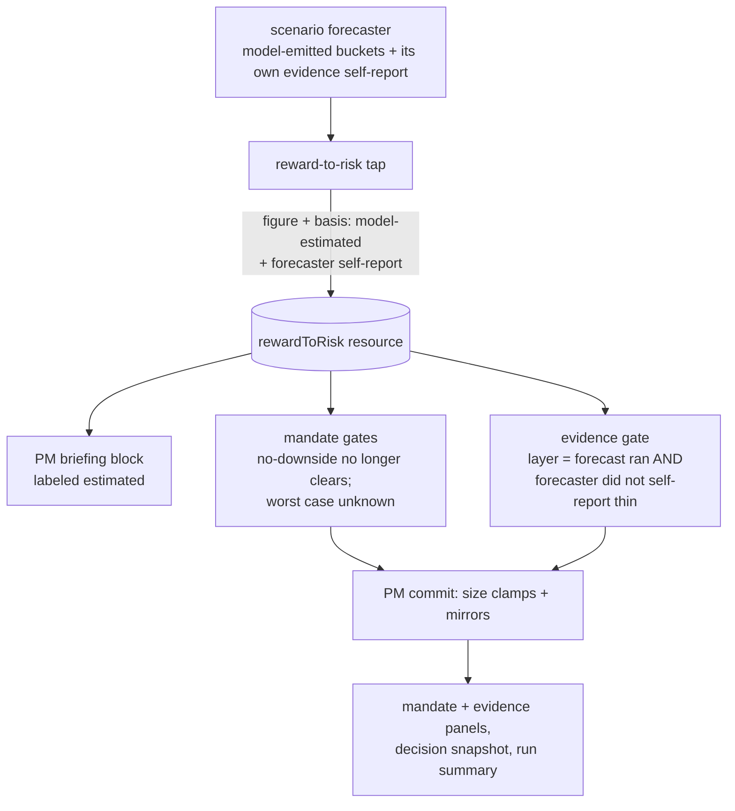

# FIX-1065: The reward-to-risk figure rests on model-invented odds — Implementation Spec

**Linear:** [FIX-1065](https://linear.app/fixpoint-labs/issue/FIX-1065) · **Epic:** [FIX-1067 — Trading desk: report completeness & analytical depth](https://github.com/fixpoint-labs/flow-state-dev/pull/1160) · **Branch:** `spec/FIX-1065`

---

## Part I — The Case *(for the human)*

### 1. Problem — why it matters, why now

The desk shows a reward-to-risk number and treats it as a hard fact. It is used to decide
whether a position is worth taking and how large it may be. The arithmetic on top of it is
real. The odds underneath it are not measured from anything — an AI wrote them.

That would be a labeling problem if the number were only displayed. It isn't. Two automatic
safety checks decide whether to shrink a position by reading it. When the AI's guess is
optimistic, both quietly conclude everything is fine and don't fire. The number cannot inflate
a position directly, but it can switch off the checks that would have cut one.

Two specific holes, both confirmed against the code rather than inferred:

- **A forecast with no losing scenario is treated as a safe one.** When the model's
  distribution contains no downward case, the desk records "no downside", counts the
  reward-to-risk bar as met, and reads the worst case as positive — so the hard capacity check
  that exists to catch names the book cannot absorb has nothing to object to. A model that did
  not imagine a loss is not evidence that no loss is possible.
- **A forecaster that says its own evidence is thin is overruled.** The forecaster reports
  whether it had enough to work with. Nothing reads that report. The evidence check instead
  looks at whether three well-formed buckets came back — which the output format guarantees on
  every successful run. So the one honest signal in the chain is discarded, and the check
  clears on a self-declared guess.

**Why now.** The epic's rule is that a figure built on invented inputs must stop being
presented as a measurement. This is the only real instance of that class in the set, and it
reaches two shipped gates outside this issue, so it is specced before anything else is built
against the figure.

### 2. Solution in plain terms

Three moves, none of which invents a new number.

1. **Say what it is.** The figure is labeled model-estimated everywhere it is shown or fed to
   an agent — the PM's briefing, the mandate panel on both report surfaces, the evidence panel,
   and the stored decision record.
2. **Stop treating a flattering guess as a clean bill of health.** A forecast with no losing
   scenario stops clearing the reward-to-risk bar and stops satisfying the capacity check; it
   is treated as an *unknown* worst case, which the code already handles conservatively.
3. **Let the forecaster's own admission count.** When the forecaster says its evidence was
   thin, that gates new exposure. An estimate may now trigger a protection; it still may not
   satisfy one.

What we deliberately do **not** do is make every check fail because the odds are estimated.
Every run's odds are estimated — there is one producer and it is a model — so a blanket rule
would fire on 100% of runs: the desk would never recommend initiating or adding a position
again, and any run with a risk mandate would be pinned at its hard cap. A protection that
fires always has stopped discriminating. The residual bypass that remains — an optimistic but
not impossible distribution — is written down rather than papered over, and grounding the odds
in observable data becomes its own issue outside this epic.

**Philosophy** — tenet 1 (coherence): the desk's rule is that computed figures are computed;
this makes the one figure that breaks the rule say so. Tenet 3 (earn every addition): no new
data source, no new model call, no new number — the change is a label, two inverted defaults,
and one signal that already exists being read.

### 6. Decisions & rules — the sign-off surface

1. **The reward-to-risk figure is labeled model-estimated wherever it is shown or used.**
   *Rejected:* labeling only the report and leaving the agent-facing briefing alone.
   *Locks in:* the desk concedes in public that one of its headline numbers is an estimate. If
   we later ground the odds, the label flips rather than disappearing, so the concession is
   reversible.

2. **A forecast with no losing scenario no longer clears the reward-to-risk bar, and its worst
   case counts as unknown.**
   *Rejected:* keeping today's "no downside means the bar is met" rule.
   *Locks in:* on a conservative book, a run whose forecast contains no bear case now results
   in no position rather than a full one. We accept losing some genuinely one-sided setups to
   stop a model's omission from reading as safety.

3. **The forecaster's own "my evidence was thin" now gates new exposure; three well-formed
   buckets no longer count as sufficient evidence on their own.**
   *Rejected:* dropping the reward-to-risk layer from the evidence check entirely — that would
   also drop the real signal it carries, that no forecast ran at all.
   *Locks in:* the desk becomes more cautious on exactly the thin runs the check was built for,
   and a model self-report acquires consequences for the first time. If the forecaster becomes
   pessimistic about itself, more runs land on "don't add".

4. **Checks may be triggered by an estimate; they may not be satisfied by one — applied where
   the estimate is flattering, not everywhere.**
   *Rejected:* blanket fail-closed on every check that reads the figure (see the ask below).
   *Locks in:* a known bypass survives — an optimistic-but-plausible distribution can still
   clear the mandate's soft bar. It is recorded in the code's contract, in the report's
   disclosure line, and in §12, and it is what the grounding follow-up exists to close.

5. **The figure keeps driving the gates it drives today; nothing moves to advisory.**
   *Rejected:* demoting the mandate's size caps to narrative and leaving the PM to interpret
   the figure.
   *Locks in:* the desk keeps its only downside-sizing discipline. Removing it in the name of
   honesty would have made the product less safe, not more.

**Non-goals** — grounding the odds in realized volatility, an options-implied distribution, or
the valuation envelope (real analytical work, a new issue, outside this epic's fence);
measuring whether the forecaster is *calibrated* against realized outcomes (that is the outcome
scoring work, where it can actually be measured); changing how the forecaster is asked to
produce probabilities; and touching the final rating, which stays orthogonal to every size
gate.

**Size:** Medium — 12 production files · 10 test behaviours · 2 doc surfaces · 1 PR.

---

### 3. Tradeoffs & alternatives

**Alternative: demote and accept.** Relabel the figure, leave every check reading it exactly as
today, write the bypass down. It is honest about the words and changes nothing about the money,
which is precisely what the epic's own rule rejects — an invented input is not rescued by a
label. Rejected, but note that decision 4 keeps a piece of it: the residual bypass is accepted
and disclosed rather than closed.

**Alternative: demote and fail closed everywhere.** The epic's recommendation, and it does not
survive contact with the code. The evidence check combines its three layers with an AND, so a
layer that can never be satisfied makes the verdict "insufficient" on every run, and every
"initiate" or "add" becomes "hold" permanently. The mandate's caps behave the same way: soft
gates that can never clear pin every mandated run at a token size unless the PM writes an
override sentence, which would make an AI-written string the thing that unlocks position size.
The epic's own falsifier — *"if failing closed gates most runs rather than the thin ones"* — is
met at 100%, and it is met by construction rather than by observation, because "estimated" is
constant.

**The simpler approach: label-only.** Genuinely tempting; it is a two-hour change. Insufficient
for the reason above, and it would leave the no-downside hole open, which is the one place the
model's invention is both most visible and most flattering.

**Where the complexity is:** not the arithmetic. It is that the two consumers want different
things from the same figure. The mandate's capacity line wants a worst case and can treat
"unknown" as a veto. The evidence check wants a statement about substrate quality and, today,
reads a well-formedness test instead. Getting this right means splitting "the forecast ran"
from "the forecast was worth believing" — they are currently the same boolean.

### 4. Focus practices (1–5)

1. **BP-030 (tolerate the old shape)** — every stored report predates the estimated-basis
   marker. Reading one must not crash and must not silently claim the figure was measured; an
   old record reads as model-estimated, because every old record was.
2. **BP-020 (never fabricate to keep a surface drawing)** — "unknown worst case" must present
   as unknown, through the sentinels the app already uses (`—`, `n/a`), not as a zero or a
   benign number.
3. **Tenet 5 (one convergence point)** — the estimated basis is stamped once where the figure
   is produced. Every consumer reads it from there. A second place that decides what
   "estimated" means is how one surface ends up telling a different story than the gate.
4. **BP-003 (verification evidence)** — decision 2 and decision 3 change how often the desk
   says no. The change is not done until that frequency is counted over the fixture corpus,
   before and after.

### 5. What using it looks like

No public framework API changes — this is app-internal behaviour in the trading desk, so the
observable surface is the report and the machine-readable run summary.

**A forecast with no losing scenario, on a balanced mandate** *(what this spec proposes)*:

```
before  loss-adj GLR: "no downside"   verdict: clears   target: 3.0% of NAV
after   loss-adj GLR: "—  (no bear case emitted — worst case unknown)"
        verdict: fails (capacity unproven)              target: 0.5% of NAV
```

**A forecaster that reported its own evidence as thin:**

```
before  evidence: sufficient   action: add     target: 2.0% of NAV
after   evidence: insufficient (forecaster reported thin evidence)
        action: hold           target: capped at the current position
```

**The mandate panel's figure, on every run:**

```
before  REWARD-TO-RISK          loss-adj GLR 1.82
after   REWARD-TO-RISK (model-estimated odds)   loss-adj GLR 1.82
```

## Part II — The Build Plan *(for the implementing agent)*

### 7. Technical design

The chain is unchanged in shape: the forecaster emits buckets, a deterministic tap derives the
figure, and three consumers read it. What changes is what the figure *carries* and what two of
the consumers are willing to conclude from it.



- **The figure's shape** (`flows/analysis/reward-to-risk-resource.ts`,
  `flows/analysis/lib/reward-to-risk.ts`) gains an explicit input basis — one value today,
  `model-estimated` — and carries the forecaster's own evidence self-report alongside the
  computed bucket check. The two are separate fields on purpose: one is a fact about the data
  (buckets are usable), the other is a stated judgment (the forecaster thinks it was guessing).
- **The tap** (`flows/analysis/compute-reward-to-risk.ts`) reads the self-report off the
  committed scenario memo, which already stores it, and stamps both onto the resource.
- **The mandate gates** (`flows/analysis/lib/mandate-gates.ts`) stop treating a no-downside
  distribution as a cleared reward-to-risk bar, and route it into the existing
  unknown-worst-case branch, which already fails closed.
- **The evidence gate** (`flows/analysis/lib/evidence-gate.ts`) keeps its reward-to-risk layer
  but redefines it: the forecast ran with usable buckets **and** the forecaster did not report
  thin evidence. The other two layers are untouched.
- **Presentation** — the PM's briefing block (`flows/analysis/lib/format.ts` and the PM
  prompt), the mandate and evidence panels under `components/theses/`, and the stored decision
  record (`resources.ts` mirrors, decision snapshot, run summary).
- **Untouched:** the forecaster's prompt and output shape, the valuation spine, the final
  rating, the portfolio policy gate, and every data tool.

**Sketch — pseudocode. Illustrative, not the contract. React to the shape.**

```
when the figure is derived:
    basis        ← "model-estimated"            (the only producer today)
    selfReported ← the forecaster's own evidence call, carried through unchanged

in the mandate gates:
    reward-to-risk bar met?
        no bear case in the distribution  →  NOT met, and the worst case is UNKNOWN
        otherwise                          →  as today
    capacity line:  unknown worst case already fails closed — reuse that branch

in the evidence gate:
    reward-to-risk layer  ←  forecast produced usable buckets
                             AND the forecaster did not call its own evidence thin
```

What this asks a reviewer: *is "no bear case emitted" the right place to draw the fail-closed
line?* It is the one case where the model's omission is indistinguishable from an assertion of
safety. Everything softer than that is judgment about a number nobody measured, and everything
harder gates every run.

**No POC was built, and the skip is deliberate.** The premise the direction rests on — that a
blanket fail-closed rule fires on every run — is a property of a boolean conjunction over a
constant, readable in the two gate modules and settled without running anything. What a POC
could not answer either is the number that actually matters at the gate (how often a
no-downside forecast occurs in practice), because that needs stored runs across the fixture
corpus; §10 makes counting it part of the implementation rather than of the spec.

### 8. Implementation sequence

1. **Carry the basis and the self-report.** Widen the figure's stored shape; stamp both in the
   tap; dual-read an older record as model-estimated with no self-report (BP-030). Nothing
   changes behaviourally yet. *Test:* a legacy record reads without crashing and reads as
   estimated. *Depends on:* nothing.
2. **Invert the no-downside default in the mandate gates** (decision 2), routing it into the
   existing unknown-worst-case branch. *Test:* the §5 no-bear-case case, on each of the three
   mandate presets. *Depends on:* 1.
3. **Redefine the evidence layer** (decision 3). *Test:* a self-reported-thin forecast gates a
   would-be add; a self-reported-sufficient one behaves as today. *Depends on:* 1.
4. **Mirror the basis outward** — memo mirrors, decision snapshot, run summary — so the stored
   record of a decision says what its inputs were. *Depends on:* 1.
5. **Label every presentation surface** (decision 1): the PM briefing block and prompt, the
   mandate panel, the evidence panel. *Depends on:* 4.
6. **Realign the eval invariants** that recompute the mandate and evidence verdicts, so the
   deterministic layer checks the new rule rather than the old one. *Depends on:* 2, 3.
7. **Count the change** over the fixture corpus (§10) and record the before/after in the PR.
   *Depends on:* all.

### 9. Edge cases & error handling

| Case | Expected |
|---|---|
| Forecaster memo absent or errored | Unchanged: no figure, evidence layer fails, mandate-blind decision |
| No losing scenario in the distribution | Reward-to-risk bar not met; worst case unknown; capacity fails closed (decision 2) |
| Forecaster reports thin, buckets are well-formed | Evidence layer fails; new exposure gated (decision 3) |
| Forecaster reports sufficient, buckets unusable | Evidence layer fails, as today — the deterministic check still binds |
| Stored report written before this change | Reads as model-estimated with no self-report; the self-report cannot gate retroactively (BP-030, and the epic's forward-looking guarantee) |
| Mandate-blind run | Mandate gates do not run at all; the evidence gate still applies |
| A re-run on the same session | The tap already clears a stale figure; the basis clears with it |

**Taxonomy:** every case degrades toward *less* exposure. Nothing here can fail in the
direction of a larger position, which is the property the tests should pin.

### 10. Testing strategy

**Goal:** a real fixture run whose forecast contains no losing scenario ends with a capped
position rather than a full one, read out of the machine-readable run summary — the honest
end-to-end statement of decision 2. `goals/trading-desk-reward-to-risk/no-bear-case-caps-size/`,
driven by the two-step `fsdev run` harness the lab already uses.

**CI specs** (the behaviours, not the test names):

- one behaviour per decision in §6, stated as what the desk decides rather than what it computes
- the no-downside case across all three mandate presets, including the conservative one whose
  hard cap is zero
- the self-reported-thin case, and its complement — a sufficient self-report must not tighten
  anything on its own
- the legacy path (BP-030): a stored figure with no basis field gates exactly as before
- what must not change: the final rating, on every case above
- the direction invariant: for any input, the post-change size is less than or equal to the
  pre-change size

**The frequency count** (BP-003, and the epic's own falsifier): run the eval suite over the
fixture corpus before and after, and report how many runs change verdict or size, split by
cause. If the no-downside rule turns out to fire on most runs rather than the rare ones, that
is the signal to bring decision 2 back to the owner rather than to ship it quietly.

**Discipline:** `tdd`. The seam is the two pure gate modules plus the PM commit handler, all
reachable from vitest with the existing mock context, so every behaviour above is a tracer
bullet with no model call.

### 11. Documentation plan

- **EXTEND** `labs/trading-desk/CLAUDE.md` — the FIX-752 and FIX-781 sections currently
  describe the reward-to-risk figure as deterministic without qualifying its inputs. Add the
  estimated-basis qualifier, the no-downside rule, and the residual bypass, in the same
  register as the surrounding limitations paragraphs.
- **EXTEND** `labs/trading-desk/docs/run-quality-eval.md` — one paragraph where the
  deterministic invariants are described, noting that the reward-to-risk recompute now checks
  the estimated-basis rule.
- **No `apps/docs` change.** The trading desk is a lab app, not published framework surface;
  nothing a framework user writes changes.
- **Changeset:** internal to a private lab app — an empty changeset (BP-022). The implementer
  confirms the package's publish status before choosing.

### 12. Dependencies, open questions & follow-ups

**Dependencies:** none blocking. FIX-1063 changes the nullability of tool payloads; this chain
reads scenario buckets, not payloads, and the two do not meet.

**Adjacency to flag, not a dependency.** This change edits the mandate and evidence panels
under `components/theses/`, which the epic's ownership table assigns to FIX-1061 for the
*trader and risk memo renderers*. These are PM-decision panels in the same directory, not memo
renderers, so there is no shared seam and no landing order is required — but the epic's table
reads as if the directory has one owner. Raised on the epic PR rather than decided here.

**Open question — the one the product owner holds.**

> ### Reward-to-risk: fail closed everywhere, or only where the odds are flattering?
>
> **Plain terms.** The desk's reward-to-risk number is built on odds an AI wrote. Two automatic
> safety checks read it to decide whether to shrink a position, and an optimistic guess makes
> them quietly not fire. The epic's answer was: an estimate may set off a safety check but may
> no longer satisfy one. Applied literally, that switches the desk off — every run's odds are
> estimated, so every run fails every check: no new position is ever recommended again, and any
> run with a risk mandate is pinned at its smallest allowed size. This spec instead applies the
> rule where the guess is actually flattering — a forecast with no losing case, and a
> forecaster that admits it was guessing — and writes down the gap that remains.
>
> **The trade-off.** The narrow rule keeps the desk usable and closes the two holes we can name,
> but leaves one open: an optimistic-but-plausible set of odds still clears the mandate's soft
> bar, and nothing in the product detects that. The broad rule closes every hole and takes the
> product's main output with it. There is no third setting, because "estimated" is true on
> every run — which is why grounding the odds, not tightening the rule, is what actually closes
> the gap.
>
> **My recommendation: the narrow rule, plus a tracked issue to ground the odds.** A protection
> that fires on every run is not a protection, it is a switch, and people learn to route around
> switches. Closing the two named holes buys most of the real safety — a fabricated absence of
> downside is the failure mode that actually hurts — and the disclosure keeps us honest about
> the rest. Grounding the odds in the price history or an options-implied distribution is the
> only move that makes a broad fail-closed rule meaningful, and it deserves its own issue.
>
> **What would change my mind:** if you want the desk to be unable to recommend adding to a
> position until the odds are grounded — a defensible stance for real money, and a decision
> about what this product is for, not about this figure. Say so and the broad rule is a smaller
> change than the narrow one.
>
> **What being wrong costs: moderate, and it runs both ways.** Too narrow, and the desk keeps
> sizing off an optimistic guess on the thin theses these gates exist to catch. Too broad, and
> the desk stops being able to say yes, which reads as broken rather than as careful. Worth
> fifteen minutes; not worth an afternoon. One number I do not have yet and cannot get before
> the gate: how often a forecast with no losing case actually occurs. §10 makes counting it part
> of the work, and if it turns out to be common, decision 2 comes back to you.

**Follow-ups (flagged, not built):**

- **Ground the scenario distribution** in data the desk already holds — realized volatility
  from the fetched price bars, or an options-implied distribution where a chain is available.
  New analytical work, outside this epic's fence; the prerequisite for any broad fail-closed
  rule.
- **Calibration measurement** — whether the forecaster's odds are any good can only be answered
  against realized outcomes, which is the outcome-scoring work, not this issue.
- **The forecaster's self-report is the only model self-assessment the desk acts on.** Decision
  confidence is also model-emitted and also feeds a mandate gate. Out of scope here; worth a
  look when the honesty taxonomy is next revisited.

---

## Spec evolution

- **Spec drafted** — framed around the two confirmed holes (a forecast with no bear case reads
  as safe; the forecaster's own thin-evidence report is discarded) rather than around labeling;
  chose a targeted fail-closed rule over the epic's blanket one, because a blanket rule fires on
  every run by construction and would stop the desk recommending any new position.
