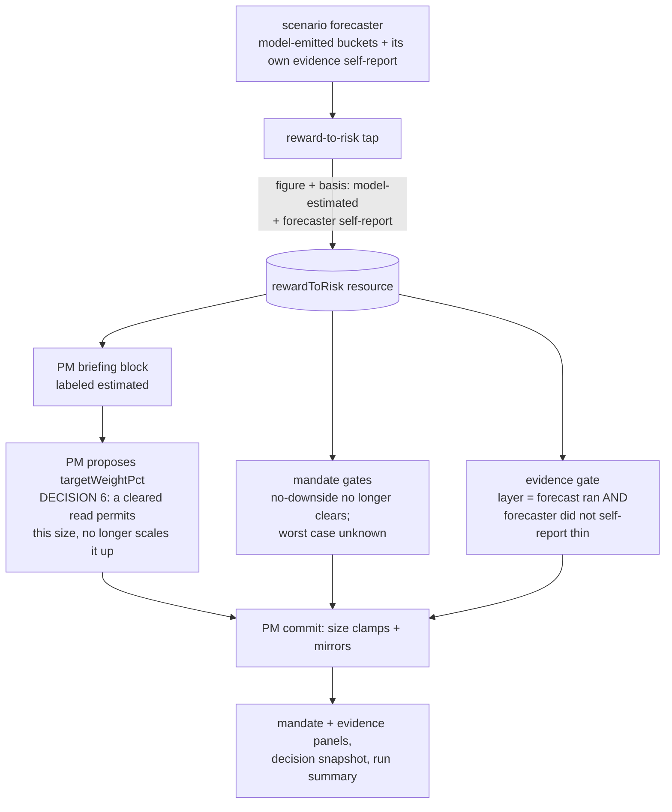

# FIX-1065: The reward-to-risk figure rests on model-invented odds — Implementation Spec

**Linear:** [FIX-1065](https://linear.app/fixpoint-labs/issue/FIX-1065) · **Epic:** [FIX-1067 — Trading desk: report completeness & analytical depth](https://github.com/fixpoint-labs/flow-state-dev/pull/1160) · **Branch:** `spec/FIX-1065`

---

## Part I — The Case *(for the human)*

### 1. Problem — why it matters, why now

The desk shows a reward-to-risk number and treats it as a hard fact. It is used to decide
whether a position is worth taking and how large it may be. The arithmetic on top of it is
real. The odds underneath it are not measured from anything — an AI wrote them.

That would be a labeling problem if the number were only displayed. It isn't. **On a run with
a risk mandate, an optimistic guess does not merely switch off the checks that would have cut
a position — it asks for a bigger one.**

Three holes. The first two disable protections; the third is the one that costs money, and it
was missed on the first pass.

- **A forecast with no losing scenario is treated as a safe one.** When the model's
  distribution contains no downward case, the desk records "no downside", counts the
  reward-to-risk bar as met, and reads the worst case as positive — so the hard capacity check
  that exists to catch names the book cannot absorb has nothing to object to. A model that did
  not imagine a loss is not evidence that no loss is possible.
- **A forecaster that says its own evidence is thin is overruled.** The forecaster reports
  whether it had enough to work with. Nothing reads that report. The evidence check instead
  looks at whether three well-formed buckets came back — which the output format guarantees on
  every successful run. So the one honest signal in the chain is discarded, and the check
  clears on a self-declared guess.
- **A flattering guess turns the size dial up, and nothing downstream bounds it.** The desk
  hands the PM the odds and then tells it, in two separate places, that a name which *clears*
  the bar should be sized toward a fraction of a full-Kelly stake. A Kelly stake is a function
  of the odds — so better invented odds ask for a bigger position, by design. The three
  deterministic gates that follow only ever *reduce* a size, and only when a gate *fails*. So
  on a flattering forecast every gate clears, nothing clamps, and the committed position size
  is whatever number the model wrote.

**What that means in practice.** Take one name on the house-default (balanced) book. Give it a
forecast with no losing case: the desk clears every gate, and a proposed 3%, 8%, or even 25%
of the book passes through untouched. Give the *same* name a forecast that admits a one-in-four
chance of a 20% loss: the reward-to-risk bar fails and the position is capped at 1.5%. The
difference between those two outcomes is not evidence. It is whether the model bothered to
imagine a loss.

So the answer to "if the odds are invented, what can actually go wrong" is not *the desk stops
protecting*. It is **the desk can take a materially larger position on a name precisely because
the forecast was flattering** — and the protections that exist to catch that are the ones the
same flattering forecast switched off.

**And deleting the instruction does not, on its own, close this.** Round 3 caught the spec
promising more than it can deliver, so it is said here rather than in a technical appendix: the
AI reads the odds and writes the position size **in the same breath** — one request, in which it
is asked to judge the odds against the book's standard and to state a size. Removing the sentence
that tells it to size up removes the *instruction*, not the connection. A flattering forecast can
still produce a bigger number, and no amount of prompt wording can prove otherwise.

**What can be done about it, stated exactly** (corrected again in round 5 — the earlier version
of this paragraph promised too much). A size limit the desk enforces itself, in code, that does
not come from the odds, **caps how bad this can get**. It does not stop it happening. Under a 3%
limit, a flattering forecast can still move a position from 1% to 2.5% — the limit never binds,
and the odds still moved the size. What the limit does is turn an exposure with no upper bound
into one with a known worst case, which is the difference between a risk you have sized and a
risk you have not. Genuinely severing the link is a third and much more expensive option
(restructuring how the desk reasons in Phase 5) and it is not clearly better product behaviour —
a portfolio manager should size with risk in view; the problem is that this particular risk
number is invented. Decision 6b asks you about the limit.

**Why now.** The epic's rule is that a figure built on invented inputs must stop being
presented as a measurement. This is the only real instance of that class in the set, and it
reaches two shipped gates outside this issue, so it is specced before anything else is built
against the figure.

### 2. Solution in plain terms

Four moves. The first three invent no new number; the fourth is the owner's call, not mine, and
one branch of it (a replacement size ceiling, §12's 6b) would introduce one.

1. **Say what it is.** The figure is labeled model-estimated everywhere it is shown or fed to
   an agent — the PM's briefing, the mandate panel on both report surfaces, the evidence panel,
   and the stored decision record.
2. **Stop treating a flattering guess as a clean bill of health.** A forecast with no losing
   scenario stops clearing the reward-to-risk bar and stops satisfying the capacity check; it
   is treated as an *unknown* worst case, which the code already handles conservatively.
3. **Let the forecaster's own admission count.** When the forecaster says its evidence was
   thin, that gates new exposure. An estimate may now trigger a protection; it still may not
   satisfy one.
4. **Stop letting a guess ask for a bigger position.** Today a cleared read tells the PM to
   size toward fractional-Kelly, so better invented odds buy a bigger stake. The choice is
   between removing that upward pull — a cleared read would *permit* the PM's evidence-based
   size rather than *scale it up* — and leaving it in place with the exposure written down.
   **This is decision 6, and it is the owner's** (§6, §12). But removing the instruction does
   not by itself stop a flattering guess producing a bigger size — the AI reads the odds and
   writes the size in one request (§1, §9). A size limit the desk enforces in code, that does not
   come from the odds, **bounds** that — it caps the worst case without severing the link, which
   is the most this issue can buy short of grounding the odds. Removing the pull also retires the
   size-appetite dial *if* decision 6 deletes it, since the two sentences are its only readers.
   Both land in **decision 6b** (§12), and the bound is the load-bearing half of this move, not a
   tidy-up.

What we deliberately do **not** do is make every check fail because the odds are estimated.
Every run's odds are estimated — there is one producer and it is a model — so a blanket rule
would fire on 100% of runs: the desk would never recommend initiating or adding a position
again, and any run with a risk mandate would be pinned at its hard cap. A protection that
fires always has stopped discriminating. The residual bypass that remains — an optimistic but
not impossible distribution — is written down rather than papered over, and grounding the odds
in observable data becomes its own issue outside this epic.

**Philosophy** — tenet 1 (coherence): the desk's rule is that computed figures are computed;
this makes the one figure that breaks the rule say so. Tenet 3 (earn every addition): no new
data source and no new model call — the first three moves are a label, two inverted defaults,
and one signal that already exists being read. Decision 6b's bound is the one place this change
adds a number, and it earns it by being the only thing that bounds the exposure (§9).

### 6. Decisions & rules — the sign-off surface

1. **The reward-to-risk figure is labeled model-estimated wherever it is shown or used.**
   *Rejected:* labeling only the report and leaving the agent-facing briefing alone.
   *Locks in:* the desk concedes in public that one of its headline numbers is an estimate. If
   we later ground the odds, the label flips rather than disappearing, so the concession is
   reversible.

2. **A forecast with no losing scenario no longer clears the reward-to-risk bar, and its worst
   case counts as unknown.**
   *Rejected:* keeping today's "no downside means the bar is met" rule.
   *Locks in:* on a conservative book, a run whose forecast contains no bear case now results
   in no position rather than a full one. We accept losing some genuinely one-sided setups to
   stop a model's omission from reading as safety.

3. **The forecaster's own "my evidence was thin" now gates new exposure; three well-formed
   buckets no longer count as sufficient evidence on their own.**
   *Rejected:* dropping the reward-to-risk layer from the evidence check entirely — that would
   also drop the real signal it carries, that no forecast ran at all.
   *Locks in:* the desk becomes more cautious on exactly the thin runs the check was built for,
   and a model self-report acquires consequences for the first time. If the forecaster becomes
   pessimistic about itself, more runs land on "don't add".

4. **Checks may be triggered by an estimate; they may not be satisfied by one — applied where
   the estimate is flattering, not everywhere.**
   *Rejected:* blanket fail-closed on every check that reads the figure (see the ask below).
   *Locks in:* a known bypass survives — an optimistic-but-plausible distribution can still
   clear the mandate's soft bar, and (unless decision 6 says otherwise) a cleared bar still
   pulls the size up. It is recorded in the code's contract, in the report's disclosure line,
   and in §12, and it is what the grounding follow-up exists to close.

5. **The figure keeps driving the gates it drives today; nothing moves to advisory.**
   *Rejected:* demoting the mandate's size caps to narrative and leaving the PM to interpret
   the figure.
   *Locks in:* the desk keeps its only downside-sizing discipline. Removing it in the name of
   honesty would have made the product less safe, not more.

6. **An estimate may permit a size; it may not authorize a larger one.** *(Owner's call — see
   §12. Added after review; the first draft did not know this path existed.)* The two places
   that tell the PM to size a cleared name toward fractional-Kelly are rewritten so a cleared
   read *releases* the PM's evidence-based size rather than *scaling it toward the odds*. An
   uncleared read keeps its token-size instruction exactly as today.
   *Rejected:* leaving the sizing instruction untouched and disclosing the exposure in the
   residual-risk paragraph the owner is approving.
   *Locks in:* the desk stops *instructing* the PM to size up on optimism it cannot
   substantiate — and a cleared read ends up with **no size ceiling of any kind**, since the two
   mandate caps fire only on a *failing* gate. Reversible — grounding the odds makes fractional-Kelly sizing legitimate, and this
   instruction can come back the day the odds are measured.
   *My recommendation: take it — but it is necessary, not sufficient.* It removes the standing
   instruction to size up on invented odds, which should not be in the product. It does **not**
   remove the path: the PM writes the size in the same call that reads the odds (§9's corrected
   invariant), so only decision 6b's bound closes it. The other five decisions all make the desk
   more cautious; leaving this one open would mean shipping a spec that closes the small holes
   and leaves the large one documented.

   **Correction (round 2 — this changes what decision 6 costs).** The first draft of this
   decision said the `kellyFraction` dial "becomes a ceiling the PM reasons against". It does
   not, and cannot as written. The only code that reads the dial's value is `formatRiskMandate`,
   and its only other mention on the model path is the PM prompt rule — the two sentences this
   decision deletes (§7 enumerates all six files). Nothing in the desk computes a full-Kelly
   stake for it to be a fraction of. Delete both and the dial reaches nothing — not the model, not a gate, not a
   panel. Preserving it *as* a ceiling would require the PM to derive full-Kelly from the same
   model-emitted odds, which is precisely what §9's invariant forbids. So decision 6 is no
   longer "two prose surfaces, no gate logic": it also decides what happens to the dial —
   **retire it, or replace it with a ceiling that does not come from the odds.** That is
   decision 6b, and it is the owner's (§12).

   **Round 3 promoted 6b.** The prose change cannot establish the invariant this decision was
   sold on, because the PM writes the size in the same call that reads the odds (§7's coupling
   trace, §9's corrected invariant). So 6b is no longer conditional on this decision and no
   longer a tidy-up: the odds-independent bound is the **only** remedy that bounds the exposure,
   and §12's recommendation now argues for it rather than for retiring the dial alone.

**Non-goals** — grounding the odds in realized volatility, an options-implied distribution, or
the valuation envelope (real analytical work, a new issue, outside this epic's fence);
measuring whether the forecaster is *calibrated* against realized outcomes (that is the outcome
scoring work, where it can actually be measured); changing how the forecaster is asked to
produce probabilities; and touching the final rating, which stays orthogonal to every size
gate.

**Size:** Medium — 15 production files (12 + the PM prompt + the PM writer's action alignment +
the decision-snapshot basis marker) · 23 test behaviours · 2 doc surfaces · 1 recompute script ·
1 goal · 1 PR. Decision 6b's *bound*
branch adds three constants to `lib/risk-mandate.ts` plus an unconditional clamp in
`lib/mandate-gates.ts` and pushes this to the top of Medium; the *no bound* branch instead
retires `kellyFraction` and removes a test. `clampTargetWeight` gains a `currentWeightPct`
parameter either way (step 3b), so its two callers — the PM writer and `eval/invariants.ts` —
both change.

---

### 3. Tradeoffs & alternatives

**Alternative: demote and accept.** Relabel the figure, leave every check reading it exactly as
today, write the bypass down. It is honest about the words and changes nothing about the money,
which is precisely what the epic's own rule rejects — an invented input is not rescued by a
label. Rejected, but note that decision 4 keeps a piece of it: the residual bypass is accepted
and disclosed rather than closed.

**Alternative: demote and fail closed everywhere.** The epic's recommendation, and it does not
survive contact with the code. The evidence check combines its three layers with an AND, so a
layer that can never be satisfied makes the verdict "insufficient" on every run, and every
"initiate" or "add" becomes "hold" permanently. The mandate's caps behave the same way: soft
gates that can never clear pin every mandated run at a token size unless the PM writes an
override sentence, which would make an AI-written string the thing that unlocks position size.
The epic's own falsifier — *"if failing closed gates most runs rather than the thin ones"* — is
met at 100%, and it is met by construction rather than by observation, because "estimated" is
constant.

**The simpler approach: label-only.** Genuinely tempting; it is a two-hour change. Insufficient
for the reason above, and it would leave the no-downside hole open, which is the one place the
model's invention is both most visible and most flattering.

**Where the complexity is:** not the arithmetic. It is that the two consumers want different
things from the same figure. The mandate's capacity line wants a worst case and can treat
"unknown" as a veto. The evidence check wants a statement about substrate quality and, today,
reads a well-formedness test instead. Getting this right means splitting "the forecast ran"
from "the forecast was worth believing" — they are currently the same boolean.

### 4. Focus practices (1–5)

1. **BP-030 (tolerate the old shape) — two persisted shapes change here, not one.** Every stored
   report predates the estimated-basis marker: reading one must not crash and must not silently
   claim the figure was measured; an old record reads as model-estimated, because every old
   record was. **And, on decision 6b's bound branch, the mandate shape itself changes** —
   `riskMandateSchema` is frozen onto session state and into run artifacts, so a new required
   dial breaks resume and replay unless it is re-derived from the stored mandate `id` (§8 5b).
   Round 5 caught this because the first pass read "persisted shape" as meaning only the figure.
2. **BP-020 (never fabricate to keep a surface drawing)** — "unknown worst case" must present
   as unknown, through the sentinels the app already uses (`—`, `n/a`), not as a zero or a
   benign number.
3. **Tenet 5 (one convergence point)** — the estimated basis is stamped once where the figure
   is produced. Every consumer reads it from there. A second place that decides what
   "estimated" means is how one surface ends up telling a different story than the gate.
4. **BP-003 (verification evidence)** — decisions 2 and 3 change how often the desk says no.
   The change is not done until that frequency is counted by applying the old and new rules to
   the *same* captured forecasts (§10) — re-running the pipeline twice would measure model
   variance, not the gate.

### 5. What using it looks like

No public framework API changes — this is app-internal behaviour in the trading desk, so the
observable surface is the report and the machine-readable run summary.

**A forecast with no losing scenario, on a balanced mandate** *(what this spec proposes)*:

```
before  loss-adj GLR: "no downside"   verdict: clears   target: 3.0% of NAV
                                          — and 8%, and 25%, all unclamped: on a cleared
                                            read nothing bounds the model's number
after   loss-adj GLR: "—  (no bear case emitted — worst case unknown)"
        verdict: fails (capacity unproven)              target: 0.5% of NAV
```

**The same case on the conservative book, where the capacity cap is zero** *(corrected again in
round 4 — the first correction only handled a name the book doesn't own)*:

```
name NOT held
before  verdict: fails (capacity unproven)   target: 0%   action: INITIATE  ← green chip
after   verdict: fails (capacity unproven)   target: 0%   action: hold

name ALREADY held at 2%
before  verdict: fails (capacity unproven)   target: 0%   action: ADD       ← green chip,
                                                                             and a 0% target
                                                                             implies "sell it all"
after   verdict: fails (capacity unproven)   target: 2%   action: hold
```

For a name the book doesn't own, the size was already right and only the *action* the card
colours off was wrong. For a name it **does** own, the number was wrong too: a zero target reads
as liquidate, which the desk never intended — its other two size gates both floor a cap at the
current position rather than force a sale. The capacity veto now does the same. It stops the
adding; it does not order the selling.

The `0.5%` is the **capacity** cap, and it only appears if the worst case is normalized to
unknown *at the producer* (§7). Inverting the reward-to-risk bar alone leaves the worst case
reading `+4%`, capacity still clears, and the soft cap lands the position at `1.5%` instead —
three times the size, for a name whose downside nobody has seen. Both numbers are executed
output, not estimates; see §7's verification note.

**The same name, on decision 6** *(if the owner takes it)*:

```
before  cleared read → "size toward 40% of a full-Kelly stake"   model proposes 8.0% of NAV
after   cleared read → "the bar is met; size on the evidence"    model proposes ?.?% of NAV
        (the "?" is the honest part: the model still reads the odds in the call that
         writes the size, and nothing caps a cleared name — the two mandate caps fire
         only on a FAILING gate. This example cannot show a smaller number, because
         no mechanism produces one. Decision 6b's bound is what would.)

with 6b's bound (balanced, illustrative 3%):
after   cleared read → "the bar is met; size on the evidence"    committed 3.0% of NAV
        (whatever the model proposed above 3%, the desk enforces 3%)
```

**A forecaster that reported its own evidence as thin:**

```
before  evidence: sufficient   action: add     target: 2.0% of NAV
after   evidence: insufficient (forecaster reported thin evidence)
        action: hold           target: capped at the current position
```

**The mandate panel's figure, on every run:**

```
before  REWARD-TO-RISK          loss-adj GLR 1.82
after   REWARD-TO-RISK (model-estimated odds)   loss-adj GLR 1.82
```

## Part II — The Build Plan *(for the implementing agent)*

### 7. Technical design

The chain is unchanged in shape: the forecaster emits buckets, a deterministic tap derives the
figure, and its consumers read it. What changes is what the figure *carries*, what the
deterministic consumers are willing to conclude from it, and — decision 6 — what the prompt
consumers are told to do with it.

**Every producer and consumer of the odds and the figure they derive.** The first pass missed
the sizing path because it enumerated the *gates* and stopped. This is the full set.

| # | Producer / consumer | What it does with the odds | In scope? |
|---|---|---|---|
| 1 | scenario forecaster (`agents/scenario-forecaster/`) | **the only producer** of the buckets and of its own evidence self-report | **No** — changing how it is asked for probabilities is a stated non-goal; grounding is the follow-up |
| 2 | `computeRewardToRisk` (`lib/reward-to-risk.ts`) | derives the figure; sets `noDownside` and `worstCaseReturnPct` | **Yes** — carries the basis; normalizes the no-bear-case worst case to unknown |
| 3 | `compute-reward-to-risk.ts` (the tap) | stamps the figure onto the resource | **Yes** — also carries the forecaster's self-report |
| 4 | `computeMandateGates` / `clampTargetWeight` (`lib/mandate-gates.ts`, FIX-752) | reads `noDownside`, `lossAdjustedGlr`, `expectedValuePct`, `worstCaseReturnPct`; caps size **downward only, and only on a failing gate** | **Yes** — decision 2 |
| 5 | `computeEvidenceGate` (`lib/evidence-gate.ts`, FIX-781) | reads `rewardToRiskEvidenceBasis` only | **Yes** — decision 3 |
| 6 | `computePolicyGate` (`lib/policy-gate.ts`, FIX-761) | **does not read the figure at all** — clamps on the IPS cap and household weight | **No** — checked and clear. Named because it is the layer *beneath* the inflated size, and it only bounds anything when a household IPS exists |
| 7 | PM commit (`agents/portfolio-manager/writer.ts`) | seeds `targetWeightPct` from the model's number, then runs 4 → 6 → 5 | **Yes** — mirrors the basis outward |
| 8 | `formatRewardToRisk` (`lib/format.ts`) → `<rewardToRisk>` | hands the PM the upside/downside/GLR/EV/worst-case numbers | **Yes** — decision 1 (label) |
| 9 | `formatRiskMandate` (`lib/format.ts`) → `<riskMandate>` | tells the PM **and the trader** that a cleared name is "sized to about *k*% of a full-Kelly stake" | **Yes** — decision 6. **This is the hole one field over from the one review named** |
| 10 | PM prompt rule 11, `sizeStance` (`portfolio-manager.prompt.md`) | "a CLEARED name sizes toward the mandate's fractional-Kelly appetite" | **Yes** — decision 6, the surface review named |
| 11 | trader (`agents/trader/trader.ts`) | opts into `riskMandate` but **not** `rewardToRisk` — the tap runs after Phase 3, so it never sees the odds | **No** — checked. It reads the Kelly sentence but has no figure to scale off. Do not "fix" it later thinking it is a path |
| 12 | `mandate-panel.tsx` | renders `noDownside`, `lossAdjustedGlr`, `worstCaseReturnPct`, `evidenceBasis` | **Yes** — decisions 1 + 2 (the mirror must read unknown, not a benign `+4%`) |
| 13 | `evidence-panel.tsx` | renders `rewardToRiskEvidenceBasis` | **Yes** — decision 3 |
| 14 | decision snapshot · run summary · run artifacts | mirror the GLR, worst case, capacity flag, both verdicts — as **bare numbers**: `decision-snapshot-resource.ts` declares `rewardToRiskLossAdjustedGlr` and `worstCaseReturnPct` and projects both, with no basis field anywhere in the snapshot or the summary | **Yes** — and this is where decision 1 was not actually being kept (round 5). The stored record must say what its inputs were, in the schema, not only in React copy |
| 15 | `eval/invariants.ts` | recomputes gates 4 and 5 and cross-checks the mirrors | **Yes** — realign to the new rule |
| 16 | `eval/blinding.ts` · `eval/rubrics.ts` | judge inputs | **No** — the judge layer scores runs, it does not gate capital |

**One more model-invented input on the same path, deliberately left alone:**
`decisionConfidence` is LLM-emitted and feeds `confidenceCleared`, so it too can flip the
mandate to *cleared* and release the upward pull. It is a real instance of the same class and
it is **out of scope here** — it belongs to the honesty-taxonomy sweep in §12, not to the
reward-to-risk figure.



The `P → N → W` edge is the path the first draft did not draw: the figure reaches the model
*before* it reaches any gate, and the number the model writes is the number the gates start
from. Gates 4 and 5 can only pull it down.

- **The figure's shape** (`flows/analysis/reward-to-risk-resource.ts`,
  `flows/analysis/lib/reward-to-risk.ts`) gains an explicit input basis — one value today,
  `model-estimated` — and carries the forecaster's own evidence self-report alongside the
  computed bucket check. The two are separate fields on purpose: one is a fact about the data
  (buckets are usable), the other is a stated judgment (the forecaster thinks it was guessing).
  Because there is only one basis value today, the *label copy* can be static; what has to be
  persisted is the **self-report**, which varies per run and which the gate and the eval
  recompute must both read. Persist the basis field only if the implementer finds a consumer
  that cannot derive it — otherwise a stored constant is a field with no producer (tenet 3).
- **The tap** (`flows/analysis/compute-reward-to-risk.ts`) reads the self-report off the
  committed scenario memo, which already stores it, and stamps it onto the resource.
- **The producer normalizes the no-bear-case worst case** (`lib/reward-to-risk.ts`). This is
  the correction review caught, and it is load-bearing. Today a no-downside distribution stores
  the *minimum emitted return* as a positive `worstCaseReturnPct`, and the capacity line's
  unknown branch is keyed on `worstCaseReturnPct == null` — so inverting the reward-to-risk bar
  alone leaves capacity clearing and the panel still rendering a benign `+4%`. `noDownside`
  must set `worstCaseReturnPct: null` **where the figure is produced**, so the existing null
  branch is genuinely reused, and every mirror and panel inherits the unknown for free
  (tenet 5 — one convergence point). Normalizing in the gate instead would fix the money and
  leave the stored report claiming a worst case it cannot know.
- **The mandate gates** (`lib/mandate-gates.ts`) stop treating a no-downside distribution as a
  cleared reward-to-risk bar. Given the producer change above, the capacity line needs **no
  edit at all** — its existing `worstCaseReturnPct == null` branch already fails closed.
- **The evidence gate** (`flows/analysis/lib/evidence-gate.ts`) keeps its reward-to-risk layer
  but redefines it: the forecast ran with usable buckets **and** the forecaster did not report
  thin evidence. The other two layers are untouched.
- **The two sizing instructions** (decision 6, if taken) — `formatRiskMandate` in
  `lib/format.ts` and rule 11's `sizeStance` in `portfolio-manager.prompt.md`. Both are prose;
  neither has gate logic. They must change **together**: fixing one and leaving the other is
  precisely the failure this epic keeps repeating. Note that `formatRiskMandate` currently
  asserts to the model that "the mandate only ever reduces size, never inflates it" two clauses
  after telling it to size toward fractional-Kelly — true of the deterministic clamps, false of
  the sentence above it.

**Every consumer of `kellyFraction`, enumerated** (review round 2 — the reason decision 6
grew a second half). Exhaustive, case-insensitive, repo-wide:
`rg -i kelly` returns six files outside this spec.

| Reader | What it does with the dial | After decisions 6 + 6b |
|---|---|---|
| `lib/risk-mandate.ts` (schema field + the three preset literals `0.25 / 0.4 / 0.6`) | **declares** it | the only thing left |
| `lib/format.ts` → `formatRiskMandate` | the **only** code that reads the value: interpolates it into the `<riskMandate>` sentence the PM *and* the trader see | deleted |
| `portfolio-manager.prompt.md` rule 11 (`sizeStance`) | names "the mandate's fractional-Kelly appetite" in prose (no interpolation) | deleted |
| `portfolio-manager.ts` (the `sizeStance` field comment) | a doc comment — "how the mandate's appetite (kellyFraction) shaped the size you chose" | goes stale; update with the two surfaces |
| `test/risk-mandate.spec.ts` | asserts `conservative.kellyFraction < aggressive.kellyFraction` (preset ordering) | the last thing keeping a dead field green |
| `labs/trading-desk/CLAUDE.md` | lists it among the dials | §11 |

**Nothing computes a full-Kelly stake.** `computeMandateGates` / `clampTargetWeight`
(`lib/mandate-gates.ts`, read end to end) never reference the dial — they read `noDownside`,
`lossAdjustedGlr`, `expectedValuePct`, `worstCaseReturnPct`, `decisionConfidence`, the floors,
and the two caps. `computeRewardToRisk` emits GLR / EV / worst case and no Kelly quantity.
There is no edge→fraction math anywhere in the app. So "the dial becomes a ceiling" was never
available: a ceiling needs a full-Kelly figure, and deriving one would scale size off the same
unmeasured odds (§9's invariant).

**The odds-independent ceiling already has a precedent, and it is optional.** The IPS policy
gate's `constraints.maxPositionWeightPct` (`lib/policy-gate.ts`, §7 row 6) is exactly an
odds-independent hard per-name cap — but it is nullable, household-basis, and binds only when
the household has recorded a portfolio mandate. That is why row 6 reads "checked and clear":
on a book with no IPS, nothing bounds a cleared name at all. Decision 6b is whether the
appetite pack gets its own such cap or whether the ceiling stays the IPS's job.

**Why the prose change alone cannot establish the invariant** (round 3, the P1). The PM is
**one** generator call. `portfolioManagerGenerator`'s `uses` block opts into
`scenarioForecast: true` (the raw buckets), `rewardToRisk: true` (the derived figure), and
`riskMandate: true`; its `outputSchema` emits `portfolioFit.targetWeightPct` in the same
structured response; and rule 11 *requires* the model to read GLR, expected value, and worst
case against the mandate's floors and report the reading in `mandateFit.rewardToRiskRead`. So
the odds and the size share one request. Deleting the Kelly sentence deletes the instruction to
scale, not the coupling — and a rendered-prompt snapshot (§10) can only prove the sentence is
gone, never that the number stopped moving. §9 states the two invariants this leaves.

**Route 2, severing the coupling, is rejected — and here is what it would cost.** Blinding the
PM to the figure is not enough, because it also holds the raw `scenarioForecast` buckets and
must emit `primaryScenario` (the bucket it underwrites). Severing therefore means either
(a) removing the worth-it axis from the PM entirely — which decision 5 explicitly refuses, and
which would leave the mandate's own narrative fields with nothing to narrate — or (b) splitting
Phase 5 into a reads-the-odds call and a blind sizing call, doubling the most expensive
generator in the pipeline and producing a sizer that does not know the risk read. Both are
larger and worse than a deterministic cap. Recorded so the option is visibly considered, not
silently skipped.

**Producers and consumers of `portfolioFit.action`** (round 3, the P2 — the state that fix
touches). Enumerated before editing, because the downgrade has to sit in the right link:

| # | Stage | Effect on `action` |
|---|---|---|
| 1 | PM generator (`portfolioDecisionOutputSchema`) | **produces** it — LLM-emitted, one of `initiate / add / trim / exit / hold` |
| 2 | FIX-752 mandate clamp (`clampTargetWeight`, writer.ts) | **none** — returns `{ targetWeightPct, sizeClamped }` only. **This is the gap** |
| 3 | FIX-761 policy gate (`gatedAction`, writer.ts) | downgrades `initiate`/`add` → `hold` on an **excluded** name; leaves a reducing action intact |
| 4 | FIX-781 evidence gate (`computeEvidenceGate` → `finalAction`) | downgrades `initiate`/`add` → `hold` when the verdict is **insufficient**; on `sufficient` it passes the action through untouched (`actionDowngraded: false`) |
| 5 | `portfolioFit.action` mirror → decision snapshot, run summary, `aggregate.ts` | consumes the final value |
| 6 | `pm-hero.tsx` | `actionColor()` renders `initiate`/`add` as `var(--c-live)` and prints the action as the chip label |
| 7 | `eval/invariants.ts` | recomputes the gates and cross-checks the mirrors — must learn the new downgrade |

Row 2 is the defect: a no-downside forecast on the **conservative** preset fails capacity under
decision 2, and `capacityVetoCapPct: 0` clamps the target to **0%** — but nothing touches the
action. If the spine, the critical-data markers, and the forecaster's self-report are all fine,
row 4's verdict is `sufficient` and the `initiate` survives to row 6. The hero then renders a
live-coloured **INITIATE** chip on a zero-weight position.

**The desk already holds the rule this violates**, which is what makes it incoherence (tenet 1)
rather than a missing feature: rows 3 and 4 both downgrade for exactly this reason, and the
writer says so in as many words — *"the PmHero card colors/labels off `action`, so a hard no-add
must not render as a green add"*. The capacity veto is the one hard gate that drives size to
zero without applying its own rule.

**The fix, corrected in round 4 — it needs the current position, which the FIX-752 clamp has
never had.** Round 3 specced "clamped to zero ⇒ downgrade `initiate`/`add` → `hold`". That is
right for a name the book does **not** hold and wrong for one it does, because the PM contract
is explicit about what the pair means: `targetWeightPct` is *"0 for exit; current weight for
hold"* (`portfolioDecisionOutputSchema`). `hold` at zero therefore says retain and liquidate in
the same breath. The same mismatch exists when the PM already emitted `hold` — which round 3
left untouched — so the defect is not in the downgrade, it is that `clampTargetWeight` takes no
`currentWeightPct` at all and clamps a held name's target to `capacityVetoCapPct` regardless.

**This is pre-existing, and decision 2 is what makes it matter.** The conservative preset's
`capacityVetoCapPct: 0` has always been able to publish a zero target for a held name — an
implied forced liquidation. It was rare because the capacity line rarely fired; decision 2 makes
it fire on **every no-bear-case forecast**, so a latent incoherence becomes a routine one. It is
in scope for that reason, not as scope creep.

**The desk has already answered this question twice, and the FIX-752 clamp is the one gate that
didn't get the memo:**

- `computePolicyGate`: *"AT-PURCHASE cap: never force a trim of an already-over-cap hold — floor
  the cap at the household weight"* (`capFloor = Math.max(cap, householdWeightPct)`).
- `computeEvidenceGate`: caps the target at `currentWeightPct` when known, **skips** the numeric
  clamp when it is unknown (held-but-unpriced) and lets the action downgrade carry the no-add,
  and leaves a reducing action's own target alone.

**So:** give `clampTargetWeight` a `currentWeightPct` (the `computeEvidenceGate` signature
precedent) and floor the capacity cap at it — the cap constrains *new* exposure, it never forces
a sale. Then the action downgrade is coherent for every input class:

| Input | Target after | Action after | Reads as |
|---|---|---|---|
| Not held (current 0), `initiate` | 0% | `hold` | no exposure — consistent, and `hold` at zero *is* the current weight |
| Held at *w*, `add` | *w* (floored) | `hold` | don't add, don't force a sale — matches the contract's "current weight for hold" |
| Held at *w*, already `hold` | *w* (floored) | `hold` | unchanged, and the round-3 mismatch is gone |
| Held, weight **unknown** (unpriced) | clamp skipped | `hold` | never fabricate a size from an unknown basis (both other gates' rule) |
| Any `trim` / `exit` | its own target | unchanged | a reducing action already reduces |

**Downward-only still holds** — the floor raises a *cap*, not a target; the clamp remains
`min(proposed, cap)`, so the committed size never exceeds what the PM proposed. Say this in the
module doc, because "we floored the cap" reads like an inflation at a glance and the next reader
will check.

**State the cost plainly:** flooring means a capacity veto no longer drives a *held* name to
zero — it stops the adding, it does not order the selling. That is a real softening against what
§5 previously advertised, and it is the stance FIX-761 already took deliberately. It is also the
coherent one for this spec: forcing a liquidation off a model-invented worst case is exactly the
kind of hard action on an unmeasured number the whole issue exists to stop. A new position is
still held to zero.

The `mandateDecision` mirror carries the downgrade flag alongside `capacityVetoed`, plus whether
the numeric clamp was skipped for an unknown weight — the `currentWeightKnown` precedent — so
the stored record and the eval recompute can both see it (row 7).

**Every clamp site, audited — because this is the third instance of one class** (zero-weight new
position → held position → held-above-ceiling). Fixing the third and leaving a fourth is the
failure mode; so here is the whole set, and the rule stated once instead of three times.

> **The rule.** A clamp that reduces a target to **at or below the name's current weight** must
> align the published action, because past that point the number and the word disagree. And no
> mandate clamp may set a target **below** the current weight — the mandate governs new
> exposure, it does not order sales.

| # | Clamp site | Floors at current weight? | Aligns the action? | Status |
|---|---|---|---|---|
| 1 | FIX-752 **capacity veto** (`clampTargetWeight`) | no → **yes** (step 3b) | no → **yes** (step 3b) | fixed in round 4 |
| 2 | FIX-752 **soft uncleared cap** (`clampTargetWeight`) | **no** — bare assignment to `unclearedCapPct` | **no** | **the fourth instance. In scope** — see below |
| 3 | Decision 6b **ceiling** (proposed) | yes (round 4) | **no** | **the finding. Fixed** — same rule, applied after the ceiling clamp |
| 4 | FIX-761 policy **exclusion** | yes (`Math.min(target, householdWeightPct)`) | yes (`gatedAction`) | correct already |
| 5 | FIX-761 policy **cap** (`maxPositionWeightPct`) | yes (`Math.max(cap, householdWeightPct)`) | **no** — only exclusion downgrades | same class, **out of scope**: the policy gate never reads the figure (row 6) and this spec does not touch it. Flagged in §12 as a follow-up rather than silently fixed or silently left |
| 6 | FIX-781 evidence gate | yes (`Math.min(target, currentWeightPct)`, skip when unknown) | yes | correct already |

**Site 2 is in scope for the same reason site 1 was.** Decision 2 makes a no-downside forecast
fail `rrCleared`, so `cleared` goes false and the **soft** cap fires on exactly the runs this
spec makes common — and it clamps a held name straight to `unclearedCapPct` (1.5% on balanced)
with no floor, so a name held at 3% gets a target of 1.5% while the action still says `add` or
`hold`. That is an implied trim the desk never decided, published under a word that contradicts
it. Apply the same floor and the same alignment. Leaving it would ship the exact defect twice in
one file, one branch apart.

**Sites 4 and 6 are the reference implementations** — the rule is not new, it is just not
uniformly applied. Sites 1, 2 and 3 should end up reading like site 6.
- **Presentation** — the PM's briefing block (`lib/format.ts`), the mandate and evidence panels
  under `components/theses/`, and the stored decision record (`resources.ts` mirrors, decision
  snapshot, run summary).
- **Untouched:** the forecaster's prompt and output shape, the valuation spine, the final
  rating, the portfolio policy gate (checked — it never reads the figure), the trader (checked
  — it never receives the figure), and every data tool.

**What was executed and what was only read.** Executed: the pure gate path, driven directly
(`computeRewardToRisk` → `computeMandateGates` → `clampTargetWeight`, balanced preset). That
run is what confirms a no-bear-case figure clears every gate and passes a 3% / 8% / 25%
proposal through **unclamped**; that inverting only the reward-to-risk bar lands at `1.5%`
(soft cap, capacity still clearing on a `+4%` worst case); and that normalizing the worst case
to `null` lands at `0.5%` (capacity cap). Read, not executed: that the two prompt surfaces
instruct upward sizing, and that no schema bounds `targetWeightPct` (`z.number()`, no `.max()`).
**Round 5 splits into one claim that needs no code at all and four that were read.** The
maximum-exposure correction is **arithmetic about the remedy**, not a fact about the codebase: a
ceiling is a `min()`, and two values can both sit under it. Nothing to execute, and no source to
cite — which is precisely why it survived four rounds of source-checking. The other four were
read: `state.ts`'s `riskMandate: riskMandateSchema.nullable().default(null)` for the persisted
mandate; `decision-snapshot-resource.ts`'s bare `rewardToRiskLossAdjustedGlr` /
`worstCaseReturnPct` and their projection list for the missing basis marker;
`clampTargetWeight`'s soft branch (a bare assignment to `unclearedCapPct`, no floor) for the
fourth alignment instance; and the 6 × 6b matrix, which is a paper check of this spec's own
branches against `formatRiskMandate`'s reader.

**Round 4 rests on reading too, and on three quotable lines.** The override hole is two
expressions in `mandate-gates.ts` — `verdict = capacityCleared && (cleared || override)` and
`if (!gates.cleared && !override && …)` — read together; the held-position contradiction is the
`targetWeightPct` field comment (*"0 for exit; current weight for hold"*) read against
`clampTargetWeight`'s signature, which takes no current weight. The remedy is copied from two
gates that already solve it (`computePolicyGate`'s `Math.max(cap, householdWeightPct)`,
`computeEvidenceGate`'s `currentWeightPct` clamp-or-skip). Nothing here needs a run, and a run
would not have surfaced either — both are input classes nobody exercised.

**Round 3 also rests on reading.** The PM coupling is a static fact about one generator
definition (its `uses` presets, its `outputSchema`, and rule 11's text) — executing a run would
show one sample of model behaviour and could not establish the *general* claim either way, which
is the whole point. The action path is likewise static: `clampTargetWeight`'s return type carries
no action, and rows 3 and 4 are the only two downgrades in the writer. What execution *could*
add — how often a model actually sizes up on flattering odds after the wording change — is the
paired-live-run measurement §10 already scopes as a PR appendix, not a ship gate.

**Round 2 rests on reading, and deliberately so.** The `kellyFraction` enumeration above and
§10's seam trace were established by exhaustive search and control flow, with nothing executed
this round. Neither claim is the kind execution settles: the first is an *absence* (no consumer,
no full-Kelly quantity), which a case-insensitive repo-wide search proves and a run cannot; the
second is static ordering (`create(..., { replace: true })` in `setupScenarioForecastMemos`,
then the live forecaster, then the tap — `analyze.ts`'s `forecastStage` → `computeAndStoreRewardToRisk`)
plus the CLI's seed surface, all of which read unambiguously. The round-1 execution stands
unchanged. **Not verified at all, and not verifiable by reading:** whether a given model actually
complies with the fractional-Kelly instruction on a given run. That is the point — the only thing
standing between invented odds and a large position is the model's own restraint, which is not
a control. §10's frequency count is what turns this into a measured number.

**Sketch — pseudocode. Illustrative, not the contract. React to the shape.**

```
when the figure is PRODUCED:
    selfReported ← the forecaster's own evidence call, carried through unchanged
    no bear case in the distribution  →  worstCaseReturnPct is NULL (unknown)
                                         — normalized HERE, so every gate, mirror,
                                           and panel inherits it

in the mandate gates:
    reward-to-risk bar met?
        no bear case in the distribution  →  NOT met
        otherwise                          →  as today
    capacity line:  UNCHANGED — its existing null branch now actually fires

in the capacity clamp (which now knows the current position):
    cap  ←  MAX(capacityVetoCapPct, current weight)   -- never force a sale
            current weight UNKNOWN  →  skip the numeric clamp entirely
    then, if the clamped target is the current weight (0 for a name not held):
            an "initiate"/"add" becomes "hold"
            (a reducing action is left alone; a nonzero capped buy stays a buy)

decision 6b's ceiling, if taken:
    applies to EVERY mandate-aware target — cleared, override-cleared, or no
    forecast at all. Not keyed to a verdict, not behind the figure's guard.
    Floored at the current weight, like every other cap.

in the evidence gate:
    reward-to-risk layer  ←  forecast produced usable buckets
                             AND the forecaster did not call its own evidence thin

in the two sizing instructions (decision 6):
    cleared read  →  "the bar is met; size on the evidence"
                     (was: "size toward k% of a full-Kelly stake")
    uncleared     →  token size — unchanged
```

What this asks a reviewer: *is "no bear case emitted" the right place to draw the fail-closed
line?* It is the one case where the model's omission is indistinguishable from an assertion of
safety. Everything softer than that is judgment about a number nobody measured, and everything
harder gates every run.

**No POC was built; a targeted check was run instead, and it changed the spec.** The premise the
direction rests on — that a blanket fail-closed rule fires on every run — is a property of a
boolean conjunction over a constant, readable in the two gate modules. But the *no-bear-case*
path was not that kind of claim, and reading it got it wrong: the first draft asserted the
capacity branch would fire, and driving the pure functions directly showed it does not (the
worst case is a positive number, not null). Ten minutes of execution corrected §5, §7, and §8.
What execution still cannot answer is the number that actually matters at the gate — how often
a no-downside forecast occurs, and whether the model really does size up on one — because that
needs stored runs across the fixture corpus. §10 makes counting both part of the implementation.

### 8. Implementation sequence

1. **Carry the self-report.** Widen the figure's stored shape; stamp it in the tap; dual-read an
   older record as model-estimated with no self-report (BP-030). Nothing changes behaviourally
   yet. *Test:* a legacy record reads without crashing and reads as estimated. *Depends on:*
   nothing.
2. **Normalize the no-bear-case worst case to `null` at the producer** (decision 2, the
   convergence point). *Test:* a no-downside distribution yields `worstCaseReturnPct: null`;
   the existing capacity branch fires with no edit to `mandate-gates.ts`'s capacity line.
   *Depends on:* nothing. **Do this before step 3** — it is what makes step 3's example true.
3. **Stop the no-downside distribution clearing the reward-to-risk bar** (decision 2).
   *Test:* the §5 no-bear-case case on each of the three mandate presets, asserting the
   *capacity* cap fires (0.5% on balanced), not the soft cap. *Depends on:* 2.
   **3b — teach *both* FIX-752 clamps the current position, then align the action.** Give
   `clampTargetWeight` a `currentWeightPct` (the `computeEvidenceGate` signature precedent) and
   apply §7's rule at **both** its clamp sites — the capacity veto and the soft uncleared cap
   (§7 site 2 is the same defect: decision 2 makes the soft cap fire on exactly these runs, and
   it clamps a held name below its current weight with no floor). Floor each at the current
   weight so neither forces a sale; skip the numeric clamp when the weight is unknown. Then
   downgrade `initiate`/`add` → `hold` wherever the clamped target lands at or below the current
   weight, feeding the existing FIX-761 → FIX-781 chain. A reducing action and a genuinely
   smaller-but-nonzero buy stay untouched.
   Carry the downgrade flag and the clamp-skipped flag on the `mandateDecision` mirror and teach
   `eval/invariants.ts` both. *Test:* the all-presets case asserts **action alignment as well as
   weight**, over **both** a not-held and a held name — a zero target must not publish as
   `initiate`/`add`, and a held name must not publish `hold` at zero. Weight-only assertions on a
   not-held name are what let this through twice. *Depends on:* 3. **Not conditional on decision
   6 or 6b** — this is decision 2's own consequence and lands either way.
4. **Redefine the evidence layer** (decision 3). *Test:* a self-reported-thin forecast gates a
   would-be add; a self-reported-sufficient one behaves as today. *Depends on:* 1.
5. **Rewrite both sizing instructions together** (decision 6, if the owner takes it):
   `formatRiskMandate` in `lib/format.ts` **and** rule 11's `sizeStance` in the PM prompt. Also
   fix the internal contradiction in the `<riskMandate>` block, which claims the mandate never
   inflates size two clauses after telling the model to size toward Kelly. *Test:* both
   rendered blocks are asserted against a snapshot containing no upward-sizing directive; a
   test that reads only one of the two surfaces does not satisfy this step. *Depends on:*
   nothing.
   **5b — land decision 6b.** Round 5 caught this step conflating two independent things: it
   removed `kellyFraction` *inside* the bound branch, which breaks the very combination §12 says
   is available (keep the pull **and** add the limit — `formatRiskMandate` would read a deleted
   field). They are two axes, and the rule is one line each:

   - **`kellyFraction` is removed iff decision 6 deletes the upward pull** — because the two
     sentences deleted there are its only readers (§7). Removing it means dropping it from
     `riskMandateSchema` and the three presets, dropping the ordering assertion in
     `test/risk-mandate.spec.ts`, and fixing the stale `sizeStance` field comment in
     `portfolio-manager.ts`. Nothing to do with the bound.
   - **`clearedCapPct` is added iff decision 6b says bound** — enforced in `clampTargetWeight` on
     **every mandate-aware target**: not on a cleared verdict, which would skip the override
     path (§9), and not behind the `rr != null` guard, since the bound does not read the figure.
     Floored at `currentWeightPct` like the capacity cap, and **aligned after the ceiling clamp**
     by §7's rule — a name held above the ceiling floors back to its own weight, which is a
     zero-change `add` unless the action is downgraded (§7 site 3, the round-5 finding). Extend
     the preset invariant to
     `capacityVetoCapPct ≤ unclearedCapPct ≤ clearedCapPct` in `risk-mandate.ts`. Nothing to do
     with the dial.

   **The four combinations, checked on paper** — an independence claim is testable, so here it is
   tested:

   | Decision 6 | 6b | `kellyFraction` | `clearedCapPct` | Ships |
   |---|---|---|---|---|
   | delete pull | bound | removed | added | the full remedy: no upward instruction, bounded worst case |
   | delete pull | no bound | removed | — | no upward instruction, **unbounded** size — the disclosure below is mandatory |
   | keep pull | bound | **kept, still read by `formatRiskMandate`** | added | the AI is still told to size toward fractional-Kelly, but the result is capped. Coherent, and the `<riskMandate>` block must state both — a sizing target *and* a hard ceiling — or it contradicts itself the way it does today |
   | keep pull | no bound | kept | — | status quo plus decisions 1–5 |

   On any *no bound* branch, make the unbounded path an explicit disclosure on the report
   surface — that branch ships a known hole and the report should say so. On the *keep pull +
   bound* branch, the `<riskMandate>` copy is the delicate part: today's sentence already claims
   "the mandate only ever reduces size" two clauses after telling the model to size up (§7), and
   adding a ceiling without rewriting that sentence compounds it.
   **`clampTargetWeight` gains new gate logic on the bound branches** — note it is the first
   mandate effect that binds a *passing* name, so the downward-only language in the module docs
   and `CLAUDE.md` needs restating rather than reusing.

   **BP-030 applies to the mandate itself, which §4 missed.** `riskMandateSchema` is not just a
   config shape — it is embedded in persisted state as
   `riskMandate: riskMandateSchema.nullable().default(null)` (`flows/analysis/state.ts`), frozen
   onto every session at `seedSession`, and read back by the run-artifacts bundle. So **either**
   branch that changes the schema — adding `clearedCapPct`, removing `kellyFraction` — can fail
   validation when an in-flight session is resumed or an old run's report is read. A required
   `clearedCapPct` is the sharper of the two, since a stored mandate has no such key.
   *Remedy:* make the new field tolerant on read and re-derive it from the stored `id` against
   `MANDATE_PACK` — the mandate is config-as-data keyed by a stable id, so the id is sufficient
   to recover every dial, and a stored bundle that predates the field resolves to the current
   preset's value rather than failing. Prefer that over a bare `.default()`, which would silently
   hand an old session a zero-ish cap. On removal, tolerate and ignore the extra key rather than
   rejecting it. *Test:* resume a session frozen with a pre-change mandate, and read a
   run-artifacts bundle containing one — both must parse and gate. The existing legacy coverage
   only exercises the reward-to-risk shape, which is why this was missed.
6. **Mirror outward** — memo mirrors, decision snapshot, run summary — so the stored record of a
   decision says what its inputs were, and shows `—` where the worst case is unknown.
   *Depends on:* 1, 2.
   **6b — carry the basis in the schema, not just on screen** (round 5; this is where decision 1
   was being promised and not delivered). `decisionSnapshotSchema` exposes
   `rewardToRiskLossAdjustedGlr` and `worstCaseReturnPct` as bare numbers and projects them into
   the run summary, so an external consumer — the eval layer, the benchmark, anything reading the
   bundle — sees figures with nothing marking them as model-estimated. A React label on the panel
   does not satisfy "the stored decision record is labeled". Add an explicit basis marker
   alongside them, defaulted for legacy records the same way the figure's own basis is (§4's
   BP-030), and project it wherever the two numbers are projected. **Do not add a second source
   of truth** — it mirrors the value stamped at the producer (tenet 5, §4's focus practice 3).
   *Test:* a run summary parsed from a completed run carries the marker; a snapshot written
   before this change reads as model-estimated rather than as unmarked.
   *Depends on:* 1. **This is the epic's own theme applied to itself** — a figure that looks
   measured because nothing marks it otherwise.
7. **Label every presentation surface** (decision 1): the PM briefing block, the mandate panel,
   the evidence panel. *Depends on:* 6.
8. **Realign the eval invariants** that recompute the mandate and evidence verdicts, so the
   deterministic layer checks the new rule rather than the old one. *Depends on:* 3, 4.
9. **Count the change** over the captured-forecast corpus (§10) and record the before/after in
   the PR. *Depends on:* all.

### 9. Edge cases & error handling

| Case | Expected |
|---|---|
| Forecaster memo absent or errored | Unchanged: no figure, evidence layer fails, mandate-blind decision |
| No losing scenario in the distribution | Reward-to-risk bar not met; worst case unknown; capacity fails closed (decision 2) |
| Capacity veto on a **not-held** name (conservative, cap 0) | Target 0%; an `initiate`/`add` is downgraded to `hold`, so the report cannot show a green add on a position of zero. A `trim`/`exit` is untouched |
| Capacity veto on a name **already held** at *w* | Cap floored at *w* — the veto stops new exposure, it does not order a sale (the `maxPositionWeight` at-purchase precedent). Action `hold`, target *w*, which is what the PM contract says `hold` means |
| Capacity veto, held name of **unknown** weight (unpriced) | Numeric clamp skipped — never fabricate a size from an unknown basis; the action downgrade carries the no-add, as in both other gates |
| Capacity veto clamps to a **nonzero** cap (balanced 0.5%, aggressive 1.0%) | Action untouched — a capped buy is still a smaller buy |
| **Soft** uncleared cap clamps a name held **above** it (held 3%, balanced cap 1.5%) | Floored at 3% and the action aligned — the mandate does not order a trim. Today it publishes a 1.5% target under an `add`, an implied sale nobody decided (§7 site 2) |
| Held **above** decision 6b's ceiling, PM emits `add` | Cap floors at the current weight, so the target is unchanged — and the action is downgraded, or the report shows a green ADD that moves nothing (§7 site 3) |
| Soft bar fails **and** the PM states an override reason | Verdict "clears" with `cleared === false`; the soft cap is lifted by design. **Decision 6b's ceiling still applies** — it is a capacity-class limit and an override never lifts one (rule 11). Without 6b this path is bounded by nothing at all |
| Mandate-aware run whose **forecast is missing** | No reward-to-risk figure, so no soft or capacity gating (as today) — but 6b's ceiling still binds, because it does not read the figure |
| Mandate-**blind** run | No mandate, so no ceiling and no mandate gates; only the IPS cap (if a household policy exists) and the evidence gate apply. Disclosed residue, not an oversight |
| Forecaster reports thin, buckets are well-formed | Evidence layer fails; new exposure gated (decision 3) |
| Forecaster reports sufficient, buckets unusable | Evidence layer fails, as today — the deterministic check still binds |
| Stored report written before this change | Reads as model-estimated with no self-report; the self-report cannot gate retroactively (BP-030, and the epic's forward-looking guarantee) |
| Mandate-blind run | Mandate gates do not run at all; the evidence gate still applies |
| A re-run on the same session | The tap already clears a stale figure; the self-report clears with it |
| Cleared read, mandate-aware run | Decision 6: the PM is no longer *told* to scale the size toward the odds — but it still reads them in the call that writes the size (§9's invariant). Both mandate caps are keyed to a *failing* gate, so unless decision 6b adds its bound, nothing limits the result (the IPS cap binds only where a household mandate exists) |
| Cleared read, mandate-**blind** run | Unchanged — with no `<riskMandate>` block there is no Kelly instruction and no mandate clamp. The PM still sees the figure, so the label (decision 1) is what carries here |

**Taxonomy:** every case degrades toward *less* exposure — with one honest exception. Decision 6
removes an *upward* pull rather than adding a downward one, so on a cleared read the post-change
size is whatever the model proposes unaided, which is not provably ≤ the pre-change size on
every single run.

**The invariant, corrected in round 3.** This section previously promised: *nothing in the desk
scales a position size off a number no one measured.* **That is false, and no prompt edit can
make it true.** The PM receives the scenario buckets (`scenarioForecast`), the derived figure
(`rewardToRisk`), and the mandate in **one** generator call, and emits `portfolioFit.targetWeightPct`
from that same call; rule 11 requires it to read GLR, expected value, and worst case against the
mandate's floors and to state the result in `mandateFit.rewardToRiskRead`. Deleting the Kelly
sentence removes an explicit *instruction* to scale with the odds. It does not remove the
input→output coupling, and a prompt snapshot cannot demonstrate that it did. Optimistic invented
odds can still produce a larger model-written size on a cleared run.

Two invariants replace the one false one:

- **Enforceable, and what the tests pin:** *no deterministic code path scales a position size off
  the reward-to-risk figure* — every code-side mandate effect is a downward clamp keyed to a
  failing gate. True today and after this change.
- **Enforceable with a bound, and narrower than round 3 claimed:** *an unmeasured figure cannot
  push a position past a limit the desk sets itself.* Round 3 wrote this as "the desk does not
  let an unmeasured figure produce a larger position", which the bound **does not deliver**. A
  ceiling is a `min()`. Two odds-driven proposals can both sit under it — flattering odds moving
  a target from 1% to 2.5% beneath a 3% cap is entirely unaffected — so the bound limits
  **maximum exposure** and leaves all sub-ceiling sizing coupled to the odds. It converts an
  unbounded risk into a bounded one. It does not sever the link.

**Severing the link is a third option, and it is the expensive one.** It requires either
restructuring Phase 5 into two generator calls — one that reads the odds and narrates, one that
sizes blind — or dropping the worth-it reasoning from the PM altogether (§7 costs both out).
Beyond cost, it is not obviously desirable: a portfolio manager *should* size with a risk read in
view. The defect is that the risk read is invented, not that sizing depends on it. That is why
grounding the odds — not decoupling — is the follow-up that actually closes this class (§12).

**Consequence for decision 6b:** the deterministic bound is not one option among equals. It is
the **only** remedy that puts a ceiling on where invented odds can take a position; retiring the
dial without one leaves the path open and merely uninstructed. §12's recommendation is corrected
accordingly, and §1 and §12 state the residue in plain language rather than leaving it here.

**The bound must be unconditional, or it isn't one** (round 4). Round 3 specced the ceiling to
apply on a **cleared** read. That leaves the override path unbounded, and the override path is
reachable by exactly the runs 6b exists to catch. Traced: `computeMandateGates` sets
`cleared = rrCleared && hurdleCleared && confidenceCleared` and then
`verdict = capacityCleared && (cleared || override) ? "clears" : "fails"` — so a stated override
produces a **clearing verdict with `cleared === false`**. `clampTargetWeight` then skips the soft
cap (`if (!gates.cleared && !override && …)`), and the capacity cap only fires if capacity
failed. A soft-bar failure plus an override sentence therefore passes through **entirely
unclamped** today, and a ceiling keyed to `gates.cleared` would skip it too — the hole surviving
inside its own remedy.

**So the ceiling applies to every mandate-aware target, not to a verdict.** It is a
capacity-class limit, not an appetite one, and the desk's own vocabulary already says an override
*"NEVER lifts the hard capacity line"* (rule 11) — the override lifts appetite caps, and the
ceiling is not one. Unconditional is also a no-op where the tighter caps already bind: with
illustrative ceilings of 1 / 3 / 6% against uncleared caps of 0.5 / 1.5 / 3.0% and capacity caps
of 0 / 0.5 / 1.0%, the ceiling binds only where nothing else does. The preset invariant extends
from `capacityVetoCapPct ≤ unclearedCapPct` to `capacityVetoCapPct ≤ unclearedCapPct ≤
clearedCapPct`, and `risk-mandate.ts`'s invariant comment must be updated with it.

**Which inputs make the ceiling a no-op or a contradiction** — asked of this fix before shipping
it, because that question is what found the round-3 defect:

1. **Override on a soft-bar failure** — the finding above. Closed by making it unconditional.
2. **A held name above the ceiling** — same at-purchase question as the capacity veto (§7), and
   the same answer: floor at the current weight. The ceiling stops the adding; it does not order
   a trim of a position that predates it.
3. **No usable forecast** (`rr == null`, or no `evidenceBasis`) — the whole FIX-752 block is
   guarded on `mandate != null && rr != null && rr.evidenceBasis != null`, so a run whose
   forecaster failed gets **no mandate clamp at all** today. The ceiling has no reason to inherit
   that: it is odds-independent, so it must sit **outside** the `rr` guard and apply whenever a
   mandate is present. A run with no odds is not a run that should be unbounded.
4. **Mandate-blind run** — no mandate, so no ceiling, and the IPS cap binds only where a
   household policy exists. **This residue is real and stays**, because the appetite mandate is
   where a book states its size standard; a book that set none has not stated one. Disclosed
   here and in §9's edge table rather than discovered later.
5. **Scoped-run NAV units** — the ceiling is a mandate cap applied to the same `targetWeightPct`
   as the other two, so it inherits the writer's existing scoped-vs-household note and adds no
   new mismatch.

### 10. Testing strategy

**Decision 2's headline cannot be pinned end to end. Saying so is the honest answer.** Round 1
replaced a goal that hoped the model would emit a no-bear-case forecast with one that seeds a
stored scenario memo before the tap. Round 2 traced that remedy and it cannot run either. Four
independent reasons, each read from source:

- **Nothing writes a memo from outside the pipeline.** Scenario memos are entries in the
  `memos` **resource collection** (`ctx.resources.memos.create(...)`), and `fsdev run`'s three
  seed flags — `--seed-session` / `--seed-user` / `--seed-org` — merge JSON into the session /
  user / org **state** record only (`packages/cli/src/commands/run.ts`). There is no
  `--seed-resource`.
- **The pipeline overwrites it anyway.** `forecastStage` opens with
  `setupScenarioForecastMemos`, which calls `create(key, scaffold, { replace: true })` — the
  memo is replaced wholesale — and then runs the live forecaster, which commits over it.
- **And it does so immediately before the read.** `analyze.ts` is
  `… .step(forecastStage).tap(computeAndStoreRewardToRisk).step(portfolioStage)`, and the tap
  reads the committed scenario memo. There is no window between the write and the read.
- **No action starts the pipeline downstream of the forecaster.** The flow registers exactly
  five: `analyze`, `setInstructions`, `runSummary`, `runArtifacts`, `adoptThesis`.

Nor is there a generator seam to pin the output instead: `--model` swaps *which* model runs, not
what it returns, and the desk's fixture mode stubs data **tools** only. So the precondition is
model-dependent by construction — and the forecaster's prompt asks for a downside case, making
it the *rare* output rather than one we can wait for. **There is therefore no end-to-end goal
for decision 2**, and `goals/trading-desk-reward-to-risk/no-bear-case-caps-size/` is not built.

**Rejected: adding a seeding action to make the goal possible.** A registered zero-model writer
for scenario buckets would exist only for the test (tenet 3), and it would be a
fabricate-a-forecast surface shipped by the issue whose whole subject is not fabricating
forecasts. If the end-to-end statement is wanted later, the legitimate route is a general
generator record/replay seam at the framework level — a follow-up (§12), not a hole punched in
this app.

**Where decision 2 is actually pinned:** the pure seam, in CI. `computeRewardToRisk` →
`computeMandateGates` → `clampTargetWeight` → the PM commit are all reachable from vitest with
the existing mock context, and that chain *is* the decision — the same path round 1 executed
directly to correct §5 and §7. This is a narrower claim than an end-to-end goal and it is the
true one.

**The goal that does hold** — `goals/trading-desk-reward-to-risk/forecaster-self-report-reaches-the-gate/`:
on an ordinary fixture run, the forecaster's own evidence self-report is carried onto the stored
record and the evidence verdict agrees with a recompute from it. Its precondition is present on
**every** run (the forecaster always reports something), so it depends on the plumbing rather
than on which way the model called it — the `standing-thesis-injected` shape, on the same
`analyze` → `runSummary` ladder. It proves decision 3's chain end to end. It does **not** prove
decision 2's headline; nothing available does.

**CI specs** (the behaviours, not the test names):

- one behaviour per decision in §6, stated as what the desk decides rather than what it computes
- the no-downside case across all three mandate presets, including the conservative one whose
  hard cap is zero — asserting the **capacity** cap fires, not the soft cap, **and asserting the
  published `action` agrees with the enforced size**: zero target ⇒ not `initiate`/`add`; a
  nonzero capped target ⇒ action untouched. Weight-only assertions are what let the zero-weight
  green ADD through
- **the same case on a name already held**, and on one held at an unknown (unpriced) weight —
  the held name floors at its current weight and publishes `hold` at that weight, never `hold` at
  zero; the unpriced one skips the numeric clamp and relies on the action downgrade. The existing
  case only exercises a *new* position, which is how the held-position contradiction got in
- **one case per clamp site in §7's table, held-above-the-cap** — capacity veto, soft uncleared
  cap, and (if 6b lands) the ceiling. Each asserts the same two things: the target never lands
  below the current weight, and the published action never says `add`/`initiate` when the target
  is at or below it. Three sites, one shared assertion helper — the class has recurred three
  times, so the test should be the shape that catches the fourth
- the legacy **mandate** shape (BP-030, §8 5b): a session frozen with a pre-change `riskMandate`
  resumes and gates, and a run-artifacts bundle containing one parses — with the missing dial
  re-derived from the stored `id`, not defaulted to zero
- the **basis marker** in the machine-readable record (§8 6b): a completed run's summary carries
  it beside the GLR and worst case, and a snapshot written before the change reads as
  model-estimated rather than unmarked
- **the override path**: a soft-bar failure plus a stated `mandateOverrideReason` produces a
  clearing verdict with `cleared === false` and lifts the soft cap — assert the target is
  otherwise unbounded today, and, if the owner takes 6b, that the ceiling still binds. An
  override must never lift the ceiling; a test that only exercises cleared verdicts would have
  missed this
- the self-reported-thin case, and its complement — a sufficient self-report must not tighten
  anything on its own
- the legacy path (BP-030): a stored figure with no self-report field **reads and gates without
  crashing, defaulting the missing metadata**. This is explicitly *not* full behavioural parity:
  any stored figure with `noDownside: true` changes outcome under decision 2, by design. BP-030
  is about tolerating the old shape, not about preserving the old verdict
- decision 6 covered on **both** prompt surfaces in one spec, so neither can be fixed alone
- decision 6b: on *bound*, **every** mandate-aware target is capped at the new per-preset ceiling
  on all three presets — cleared, override-cleared, and a run with no forecast at all — the first
  mandate behaviour that binds a **passing** name, so it needs its own case rather than riding
  the existing clamp specs; on *no bound*, the dial is gone from the schema and the presets (a
  typecheck, plus the deleted ordering assertion, is the whole evidence)
- what must not change: the final rating, on every case above
- the **enforceable** invariant (per §9): no deterministic code path scales `targetWeightPct` off
  the reward-to-risk figure. Note what this does *not* cover — the model writes the size in the
  same call that reads the odds, so the prompt snapshot in the decision-6 spec proves the Kelly
  sentence is gone and nothing more. Do not let a green suite read as "invented odds can no
  longer enlarge a position"; only decision 6b's bound supports that sentence, and if the owner
  takes it, this line gains a second assertion: **every** mandate-aware target is capped at the
  bound on all three presets — cleared, override-cleared, and forecast-missing alike. A suite
  that only asserts the cleared case would pass while the override path stayed unbounded

**The frequency count** (BP-003, and the epic's own falsifier) — **recompute, do not re-run.**
Two separate `analyze` sweeps would re-invoke the generators, so the scenarios and the proposed
sizes differ between samples even with no change applied; the verdict/size delta would then mix
model variance with the gate's real effect, in both directions. Instead: capture each corpus
run's forecast artifacts once, then apply the **old and new pure gate rules to the same captured
forecasts** offline (`computeRewardToRisk` → `computeMandateGates` / `computeEvidenceGate` are
pure, so this is a script, not a sweep). That answers "how often" exactly, costs no model spend,
and is attributable by cause. It is **ship-blocking for decision 2** — if the no-downside rule
fires on most runs rather than the rare ones, decision 2 goes back to the owner rather than
shipping quietly.

Decision 6's frequency cannot be recomputed this way — removing an upward instruction changes
what the model writes, so measuring it needs paired live runs. That is a PR appendix, not a
ship gate, and it should be reported as the sampled observation it is.

**Discipline:** `tdd`. The seam is the producer plus the two pure gate modules plus the PM commit
handler, all reachable from vitest with the existing mock context, so every **CI** behaviour
above is a tracer bullet with no model call. The one goal runs real generators, as goals do.

### 11. Documentation plan

- **EXTEND** `labs/trading-desk/CLAUDE.md` — the FIX-752 and FIX-781 sections currently
  describe the reward-to-risk figure as deterministic without qualifying its inputs. Add the
  estimated-basis qualifier, the no-downside rule, and the residual bypass, in the same
  register as the surrounding limitations paragraphs. The FIX-752 section also states that "all
  mandate effects are downward-only" — true of the deterministic clamps, but the section
  describes the `kellyFraction` dial two paragraphs earlier without noting it is an *upward*
  instruction to the model. Correct that, whichever way decision 6 lands — and if 6b retires
  the dial, drop it from that dial list rather than leaving a documented knob with no effect
  (BP-034: finish the removal, including the FIX-752 section's prose). Also record the two
  round-3 and round-4 corrections there: the capacity veto now floors its cap at the current
  position and aligns the published action, so it stops new exposure without ordering a sale (the
  FIX-761 at-purchase language already in the doc is the model for the wording); and — this is
  the one a future reader will otherwise re-derive wrongly — the desk's downward-only guarantee
  covers the *deterministic* clamps, not the size the PM writes, which is produced by the same
  call that reads the odds. If 6b lands, say explicitly that its ceiling is not lifted by a
  mandate override, since every other soft cap is.
- **EXTEND** `labs/trading-desk/docs/run-quality-eval.md` — one paragraph where the
  deterministic invariants are described, noting that the reward-to-risk recompute now checks
  the estimated-basis rule.
- **No `apps/docs` change.** The trading desk is a lab app, not published framework surface;
  nothing a framework user writes changes.
- **Changeset:** internal to a private lab app — an empty changeset (BP-022). The implementer
  confirms the package's publish status before choosing.

### 12. Dependencies, open questions & follow-ups

**Dependencies:** none blocking. FIX-1063 changes the nullability of tool payloads; this chain
reads scenario buckets, not payloads, and the two do not meet.

**Adjacency to flag, not a dependency.** This change edits the mandate and evidence panels
under `components/theses/`, which the epic's ownership table assigns to FIX-1061 for the
*trader and risk memo renderers*. These are PM-decision panels in the same directory, not memo
renderers, so there is no shared seam and no landing order is required — but the epic's table
reads as if the directory has one owner. Raised on the epic PR rather than decided here.

**Open questions — the two the product owner holds.**

> ### First, what is actually at stake — corrected after review
>
> The first draft of this spec told you the invented odds could only *switch off* protections.
> That was wrong, and the correction is the reason this went back for a round.
>
> **If the odds are invented and flattering, the desk does not merely stop protecting — it takes
> a bigger position.** On any run where the book has a risk mandate set, the desk hands the AI's
> odds to the portfolio manager and then instructs it that a name which *passes* the
> reward-to-risk bar should be sized toward a fraction of a full-Kelly stake. A Kelly stake is a
> function of the odds. Better invented odds therefore ask for a bigger position, deliberately.
> Everything downstream can only shrink a position, and only when a check *fails* — so on a
> flattering forecast nothing shrinks anything, and the size the desk commits to is whatever
> number the AI wrote.
>
> Concretely, on the house-default book: give a name a forecast with no losing case and a
> proposed 3%, 8%, or 25% of the book all pass through untouched. Give the same name a forecast
> that admits a one-in-four chance of a 20% loss and the position is capped at 1.5%. The
> difference is not evidence about the company. It is whether the AI bothered to imagine a loss.
>
> *(These figures are executed output from the desk's own sizing code, not estimates. What is
> read rather than executed is the instruction telling the AI to size up; whether a given run's
> AI actually obeys it is behaviour nobody has measured — which is the point. The only thing
> between invented odds and a large position today is the AI's own restraint.)*
>
> **Second correction, round 3 — and it changes what decision 6 buys you.** I told you that
> deleting the two sentences stops invented odds from producing a bigger position. It does not,
> on its own. The AI reads the odds and writes the position size in the **same request**: it is
> handed the forecast and the derived figure, asked to judge them against the book's standard,
> and asked for a size, all at once. Deleting the sentences removes the *instruction* to size up.
> The connection between a flattering forecast and a bigger number survives it, and no wording
> can prove otherwise — the only test available would show one sample of the AI's behaviour, not
> a guarantee.
>
> So decision 6 is still worth taking (an instruction to size up on invented odds should not be
> in the product), but it is **not sufficient**. The thing that actually bounds the exposure is a
> size limit the desk enforces in code, that does not come from the odds. That is decision 6b
> below, and it has been promoted from a tidy-up to the load-bearing half of this fix.

> ### Decision 6 — may an estimate make a position *bigger*?
>
> **Plain terms.** Two sentences in the desk tell the portfolio manager to size a passing name
> up toward the book's risk appetite. Both were written when everyone assumed the reward-to-risk
> number was measured. It isn't. The choice: delete the upward pull, so passing the bar
> *permits* the manager's evidence-based size instead of *scaling it up*; or leave it and
> write the exposure into the disclosure you are approving.
>
> **The trade-off.** Deleting it costs a real capability: sizing to conviction is how a growth
> book is supposed to behave, and an aggressive mandate that can no longer size winners up is a
> quieter product. Keeping it means the desk's largest positions are, by construction, the ones
> whose odds flattered them most.
>
> **My recommendation: delete the upward pull — and pair it with 6b.** A standing instruction to
> size up on numbers nobody measured should not be in the product, and deleting it is fully
> reversible: the day the odds are grounded in real data, fractional-Kelly sizing becomes
> legitimate and the instruction comes back. But on its own it changes what the AI is *told*,
> not what it can *do*. Take this and skip 6b and the exposure is materially unchanged — you
> will have removed the sentence and kept the behaviour.
>
> *Corrected twice, and worth stating plainly because both corrections shrank what this decision
> delivers.* Round 2: the aggressiveness dial does not survive as a ceiling — the two sentences
> are its only readers and nothing computes the full-Kelly stake a ceiling would need. Round 3:
> deleting the sentences does not stop a flattering forecast producing a bigger position at all,
> because the AI reads the odds and writes the size in one request. What began as "the change
> that closes the hole" is now "the change that removes the instruction"; **6b is the one that
> bounds the hole.** My recommendation on *this* fork is unchanged — the correction is to what
> taking it buys you. (Round 5 sharpened "closes" to "bounds": see 6b.)
>
> **What would change my mind:** if sizing to conviction is a headline behaviour of the
> aggressive book that customers have been shown or promised. Then this is a product-capability
> decision, not a safety one, and the honest answer is to keep it and disclose it loudly until
> the odds are grounded.
>
> **What being wrong costs: high in one direction, low in the other.** Wrongly deleting it makes
> the desk size more conservatively than intended — visible, annoying, reversible in an hour.
> Wrongly keeping it means the desk's biggest bets are its least substantiated ones, and nothing
> in the product would tell you that was happening. Asymmetric, which is why I lean to deleting.

> ### Decision 6b — does the desk enforce its own maximum position size, or keep relying on the AI's restraint?
>
> *Raised in round 2, rewritten in round 3, and its promise corrected in round 5 (the box
> below — read that before answering). It is **not** conditional on decision 6: the size limit is
> needed whether you delete the upward pull or keep it, and keeping it only makes the gap wider.
> All four combinations of 6 and 6b are buildable, and §8 spells out what each one ships.*
>
> **Plain terms.** Today, when a name passes the book's standard, nothing puts an upper limit on
> how much of the book the desk will commit to it. Every limit in the product fires only when a
> check *fails*. The AI proposes a number, the checks find nothing to object to, and that number
> is what gets committed. The choice: **add a maximum position size to each of the three risk
> settings** — any name sized under that setting held to, say, 1% / 3% / 6% of the book however
> good the odds look, enforced by the desk in code — or **don't**, and accept that the size is
> whatever the AI wrote, with the exposure disclosed. There is a related tidy-up: the
> "aggressiveness" number each setting carries today stops having any effect **if** you also
> delete the upward pull in decision 6, in which case it is either replaced by this limit or
> retired. Keep the pull and it stays in use, alongside the limit.
>
> > **What the limit actually promises — corrected in round 5, and I had this wrong twice
> > before.** It caps **maximum exposure**. It does not stop invented odds making a position
> > bigger. Under a 3% limit, a flattering forecast can still move a name from 1% to 2.5%: the
> > limit never binds and the odds still moved the size. What you get is a known worst case
> > instead of an open-ended one — the difference between a risk you have sized and a risk you
> > have not. If you want the link genuinely severed, that is a **third option** and a much
> > bigger one: it means restructuring how the desk reasons in Phase 5, either splitting the
> > portfolio manager into two AI calls (one that reads the odds and explains, one that sizes
> > blind) or taking the risk reasoning out of it altogether. I am not recommending that, and
> > not only on cost — a portfolio manager *should* size with a risk read in front of it. The
> > defect is that this particular risk number is invented, which is why grounding the odds is
> > the follow-up that actually closes the class.
>
> **The trade-off.** The limit is the only thing in this spec that puts a number on the worst
> case — everything else either labels the figure or fails a check closed, and none of it
> constrains what the AI writes on a clean read. But it is the first rule in the desk that would
> bind a name it *approved of*, it needs three numbers chosen without evidence to choose them
> from, and set too low it quietly caps the high-conviction positions an aggressive book exists
> to take. Not adding it keeps the desk's current behaviour exactly, which is also its current
> unbounded exposure.
>
> **My recommendation: add the limit — and this is a change from what I told you last round.**
> I previously said the aggressiveness dial could be retired here and a limit decided later,
> on the reasoning that the gap already existed and this change did not widen it. That reasoning
> was wrong in a way that matters to you: without the limit, an unmeasured number can move a
> position to any size at all, and the rest of this spec would ship while describing itself as
> having fixed that. **My recommendation is unchanged by the round-5 correction above**, and
> the reason is worth stating: bounding the worst case is most of the value here. The realistic
> harm from an invented forecast is not that a position lands at 2.5% instead of 1% — it is that
> it lands at 25% because nothing said otherwise. The limit fixes the second and leaves the
> first, at a cost of three constants and one clamp. Severing the link would address the first
> too, at the cost of restructuring the desk's reasoning and making it size risk-blind. That is
> a bad trade. The desk already has this exact shape of limit in the household-policy layer; it
> is simply optional there, so a book with no policy recorded has nothing. Adding it to the
> three risk settings makes it apply everywhere the standard applies.
>
> **What would change my mind:** if you would rather the first version of this limit be chosen
> from observed data than from three guesses. That is a fair objection — I have no distribution
> of committed sizes to set them from. If so, the honest sequence is to ship this spec's other
> five decisions now, disclose the unbounded path in the report in plain words, and set the
> limit in a follow-up once the recompute in §10 has produced real numbers. What I would not do
> is ship it silently, which is the third option and the one I am arguing against.
>
> **What being wrong costs: asymmetric, and the expensive direction is the quiet one.** A limit
> set too low is visible within days — someone notices the aggressive book stopped sizing up,
> and the number is one edit. No limit at all is invisible by construction: the desk's largest
> positions stay the ones whose odds flattered them most, nothing in the product reports it, and
> the first evidence is a loss on a name nobody bounded. Worth fifteen minutes now; it does not
> need its own meeting.

> ### Decision 4 — fail closed everywhere, or only where the odds are flattering?
>
> **Plain terms.** The desk's reward-to-risk number is built on odds an AI wrote. Two automatic
> safety checks read it to decide whether to shrink a position, and an optimistic guess makes
> them quietly not fire. The epic's answer was: an estimate may set off a safety check but may
> no longer satisfy one. Applied literally, that switches the desk off — every run's odds are
> estimated, so every run fails every check: no new position is ever recommended again, and any
> run with a risk mandate is pinned at its smallest allowed size. This spec instead applies the
> rule where the guess is actually flattering — a forecast with no losing case, and a
> forecaster that admits it was guessing — and writes down the gap that remains.
>
> **The trade-off.** The narrow rule keeps the desk usable and closes the two holes we can name,
> but leaves one open: an optimistic-but-plausible set of odds still clears the mandate's soft
> bar, and nothing in the product detects that. The broad rule closes every hole and takes the
> product's main output with it. There is no third setting, because "estimated" is true on
> every run — which is why grounding the odds, not tightening the rule, is what actually closes
> the gap.
>
> *Note, corrected in round 3: it is **6b**, not 6, that changes what "the gap" costs. With the
> bound in place, the surviving bypass means a flattering guess fails to shrink a position it
> should have shrunk. Without it, the same bypass also lets that guess enlarge the position —
> and that is true whether or not you delete the upward pull, because deleting it removes the
> instruction and not the coupling. Settle 6b first; decision 4's answer reads differently
> either way.*
>
> **My recommendation: the narrow rule, plus a tracked issue to ground the odds.** A protection
> that fires on every run is not a protection, it is a switch, and people learn to route around
> switches. Closing the two named holes buys most of the real safety — a fabricated absence of
> downside is the failure mode that actually hurts — and the disclosure keeps us honest about
> the rest. Grounding the odds in the price history or an options-implied distribution is the
> only move that makes a broad fail-closed rule meaningful, and it deserves its own issue.
>
> **What would change my mind:** if you want the desk to be unable to recommend adding to a
> position until the odds are grounded — a defensible stance for real money, and a decision
> about what this product is for, not about this figure. Say so and the broad rule is a smaller
> change than the narrow one.
>
> **What being wrong costs: moderate, and it runs both ways.** Too narrow, and the desk keeps
> sizing off an optimistic guess on the thin theses these gates exist to catch. Too broad, and
> the desk stops being able to say yes, which reads as broken rather than as careful. Worth
> fifteen minutes; not worth an afternoon. One number I do not have yet and cannot get before
> the gate: how often a forecast with no losing case actually occurs. §10 makes counting it part
> of the work, and if it turns out to be common, decision 2 comes back to you.

**Follow-ups (flagged, not built):**

- **Ground the scenario distribution** in data the desk already holds — realized volatility
  from the fetched price bars, or an options-implied distribution where a chain is available.
  New analytical work, outside this epic's fence; the prerequisite for any broad fail-closed
  rule, and the thing that would make fractional-Kelly sizing legitimate again (decision 6).
- **Calibration measurement** — whether the forecaster's odds are any good can only be answered
  against realized outcomes, which is the outcome-scoring work, not this issue.
- **The IPS policy cap has the same action-alignment gap** (§7 site 5). A name held above the
  household `maxPositionWeightPct` floors back to its own weight, and only an *exclusion*
  downgrades the action — so a cap-clamped `add` publishes with zero weight change, exactly like
  the three instances this spec fixes. Deliberately **not** fixed here: the policy gate never
  reads the reward-to-risk figure (§7 row 6), so touching it would widen this issue past its
  subject. Named rather than left for someone to rediscover as a fifth instance.
- **A generator record/replay seam, at the framework level.** The reason decision 2 has no
  end-to-end goal (§10) is that no seam pins a generator's *output* on the real path — fixture
  mode covers tools only, and `--model` picks the model, not the answer. Every rare-path
  behaviour in this app has the same problem, so this is a framework capability, not a hole to
  punch in the desk. Out of scope here; worth its own issue if goal coverage of rare paths
  matters.
- **`decisionConfidence` is on the same path, and it is the next one to check.** It is
  model-emitted and feeds the mandate's confidence floor, so it too can flip a run to *cleared*
  and — until decision 6 lands — release the upward sizing pull. Same class as this issue, a
  different figure; out of scope here, but it should be the first stop of the honesty-taxonomy
  sweep rather than a vague "worth a look".

### 13. Implementer notes from spec review *(recorded, not folded)*

Below-the-bar review feedback, kept verbatim in substance for the implementer to weigh against
real code. Not argued with here, and deliberately not folded into the design prose.

- **Naming collision between two "evidence" concepts.** Carrying the forecaster's self-report
  alongside the existing `evidenceBasis` (bucket well-formedness) creates two fields that both
  read as "evidence" but mean different things — a fact about the data vs a stated judgment. If
  both persist, distinguish them at the name (`bucketEvidenceBasis` vs
  `forecasterEvidenceBasis`, or similar). The directional half of this — *don't persist a
  constant basis field just to carry a static label* — is folded into §7; the naming is the
  implementer's.
- **Read the self-report at commit rather than persisting it?** Suggested as an alternative to
  widening the resource: derive it from the scenario memo at commit time, the way
  `deriveCriticalDataThin` already derives its signal, unless offline replay genuinely needs it
  on the resource. Worth checking against the eval recompute path (`eval/invariants.ts` reads
  the stored bundle) before choosing.
- **§12's decision blocks restate §6 and §3.** Raised as ~30 lines that could collapse to a
  pointer. **Not taken**, and the reason is worth recording: §12 is the owner's sign-off
  surface, and the six-part shape (plain terms · trade-off · recommendation · what would change
  my mind · what being wrong costs) is the format every gate in this repo is written to
  (BP-041). Compressing it to a pointer would optimise the document for a reader who is not the
  one it is for. The redundancy with §6 is intentional — §6 is the engineer's record of what was
  decided, §12 is the ask.

---

## Spec evolution

- **Spec drafted** — framed around the two confirmed holes (a forecast with no bear case reads
  as safe; the forecaster's own thin-evidence report is discarded) rather than around labeling;
  chose a targeted fail-closed rule over the epic's blanket one, because a blanket rule fires on
  every run by construction and would stop the desk recommending any new position.
- **Review round 1 — the framing was understated, and one mechanism was wrong.**
  - **Confirmed (P1):** the odds do not only disable protections, they *raise* position size. On
    a mandate-aware run the desk instructs the PM to size a cleared name toward fractional-Kelly
    (`format.ts`'s `<riskMandate>` block **and** PM prompt rule 11 — two surfaces, only one of
    which review named), and nothing downstream bounds the result: the three gates clamp
    downward only, and only on a *failing* gate. §1 rewritten, decision 6 added, §12 enlarged
    with the corrected exposure. The first pass missed this because it enumerated the *gates*
    and stopped at the code boundary; §7 now enumerates all sixteen producers and consumers,
    including the two checked-and-clear ones (the policy gate, the trader).
  - **Corrected (factual, executed):** §7 claimed a no-downside distribution could be routed
    into the existing unknown-worst-case branch by inverting the reward-to-risk bar. It cannot —
    the producer stores a *positive* worst case, so capacity still clears and the soft cap lands
    the position at 1.5%, not the 0.5% §5 advertised. The worst case is now normalized to `null`
    at the producer (one convergence point, tenet 5), which also fixes the stored report and the
    panel rather than only the money.
  - **Corrected (methodology):** the before/after frequency count would have re-run the
    generators, mixing model variance into the falsifier; it is now an offline recompute of the
    old and new pure rules over the *same* captured forecasts. The end-to-end goal no longer
    depends on the model spontaneously emitting a no-bear-case forecast — it drives from a
    stored memo, since the forecaster's prompt asks for a downside case by design.
  - **Corrected (scope):** §10's legacy line claimed a stored figure "gates exactly as before".
    It does not — decision 2 changes any stored `noDownside: true` figure. BP-030 is about
    tolerating the old shape, not preserving the old verdict.
  - **Recorded, not folded:** naming of the two "evidence" concepts, and whether the self-report
    is persisted or derived at commit (§13). **Declined:** compressing §12's decision blocks —
    that is the owner's sign-off surface (BP-041), and the reason is recorded in §13.
- **Review round 2 — two claims the spec made about the code turned out not to hold.** Both were
  written from reading; both are now checked against source, and both changed what the owner is
  being asked.
  - **Confirmed (P2), and it moves the decision:** decision 6 said the `kellyFraction` dial
    would survive as "a ceiling the PM reasons against". It cannot. The dial's only value-reader
    is `formatRiskMandate`, and its only other mention is the PM prompt rule the same decision
    deletes — so removing both leaves it with **no consumer**, and nothing in the app computes a
    full-Kelly stake for it to be a fraction of (`computeMandateGates` / `clampTargetWeight`
    read end to end; `rg -i kelly` returns six files, all enumerated in §7). Preserving it as a
    ceiling would mean deriving one from the same model-emitted odds, which §9's invariant
    forbids. Decision 6 therefore grew a second half — **6b: retire the dial, or replace it with
    an odds-independent cap** — with the enumeration in §7, the work in §8 step 5b, and the ask
    in §12. §5's and §6's "ceiling" sentences are corrected rather than softened.
  - **Confirmed (P2):** round 1's replacement goal — seed a stored scenario memo, then run —
    cannot establish its precondition either. Scenario memos are resource-collection entries and
    the CLI's three seed flags write session/user/org **state**; `forecastStage` replaces the
    memo scaffold (`{ replace: true }`) and re-runs the live forecaster immediately before the
    tap that reads it; and none of the flow's five registered actions enters the pipeline
    downstream of the forecaster. §10 now **says plainly that decision 2 has no end-to-end
    goal**, pins the decision at the pure seam instead, keeps a goal whose precondition is
    present on every run (the forecaster self-report reaching the gate), and rejects adding a
    test-only seeding action. The general fix — a generator record/replay seam — is a flagged
    follow-up, not built here.
  - **Method note:** round 2 executed nothing, and §7 says so. Neither claim is settled by
    execution — one is an absence proven by exhaustive search, the other is static ordering.
- **Review round 3 — the spec was promising an invariant it cannot enforce.**
  - **Confirmed (P1), and it changes the owner's decision:** §9 promised *nothing in the desk
    scales a position size off a number no one measured*. False, and unreachable by a prompt
    edit. `portfolioManagerGenerator` opts into `scenarioForecast` **and** `rewardToRisk` **and**
    `riskMandate`, emits `portfolioFit.targetWeightPct` from the same structured call, and rule
    11 requires the model to read GLR / EV / worst case against the mandate's floors. Deleting
    the Kelly sentence deletes the *instruction*, not the coupling, and a prompt snapshot cannot
    show otherwise. §9 now carries two invariants — the enforceable deterministic one, and the
    one that needs a bound — and §1, §2, §6 and §12 say it in plain language where the owner
    reads. **Decision 6b is promoted:** no longer conditional on decision 6, no longer a
    tidy-up, and §12's recommendation flips from "retire the dial, decide the limit later" to
    "add the limit", because the earlier reasoning rested on the gap being pre-existing and
    missed that the spec was *claiming* to have closed it. Route 2 (severing the coupling) is
    recorded as rejected with its cost named: the PM also holds the raw buckets and must emit
    `primaryScenario`, so severing means gutting the worth-it axis or splitting Phase 5 into two
    generator calls.
  - **Confirmed (P2):** a capacity veto that clamps the target to zero left the LLM-written
    `initiate`/`add` untouched — `clampTargetWeight` returns `{ targetWeightPct, sizeClamped }`
    and nothing else — so on the conservative preset (`capacityVetoCapPct: 0`) a sufficient
    evidence verdict published a live-coloured INITIATE on a 0% position (`pm-hero.tsx`'s
    `actionColor`). The desk already holds this rule in its other two gates, and the writer
    states it outright, so this is incoherence rather than a gap. §7 enumerates the action
    chain, §8 adds step 3b, §9 gains two rows, and §10's all-presets case now asserts action
    alignment rather than weight alone. Lands with decision 2, independent of 6 / 6b.
  - **Method note:** round 3 executed nothing either, and §7 says so. Both claims are static —
    a generator's context/output wiring, and a return type with no action in it. Executing a run
    would sample one model's behaviour, which is the thing the P1 says cannot be relied on.
- **Review round 4 — both findings are input classes nobody had exercised.**
  - **Confirmed (P1):** the round-3 ceiling was specced to apply on a *cleared* read, which skips
    the override path. `computeMandateGates` returns `verdict: "clears"` with `cleared === false`
    when the PM states an override, and `clampTargetWeight` then lifts the soft cap
    (`!gates.cleared && !override`), so that path is bounded by nothing today and a
    verdict-keyed ceiling would have inherited the hole — the exact failure 6b exists to close,
    surviving inside 6b's own remedy. The ceiling is now **unconditional on every mandate-aware
    target**: not keyed to a verdict (an override never lifts a capacity-class limit, per rule
    11) and not behind the `rr != null` guard (the bound does not read the figure, so a run whose
    forecast failed must not be unbounded). §9 enumerates the five input classes that would make
    it a no-op, including the one residue that stays — a mandate-blind run has no size standard
    to enforce. Preset invariant extends to
    `capacityVetoCapPct ≤ unclearedCapPct ≤ clearedCapPct`.
  - **Confirmed (P2), and it was a defect round 3 introduced.** Rewriting a clamped-to-zero
    `add` into `hold` is right for a name the book does not own and incoherent for one it does:
    the PM contract says `targetWeightPct` is *"0 for exit; current weight for hold"*, so
    `hold` at zero says retain and liquidate at once. The root cause is older than the round-3
    fix — `clampTargetWeight` takes no current weight at all, so the conservative preset's
    `capacityVetoCapPct: 0` has always implied a forced liquidation for a held name; decision 2
    turns that from rare into routine. Fixed by the two precedents the desk already has
    (`computePolicyGate`'s at-purchase floor, `computeEvidenceGate`'s clamp-or-skip): floor the
    capacity cap at the current weight, skip the clamp when the weight is unknown, then
    downgrade. §5's conservative example, which had shown a held name going to 0%, is corrected.
    Stated cost: a capacity veto no longer drives a *held* name to zero — it stops the adding,
    not the selling.
  - **Method note:** round 4 executed nothing. Both findings are static reads, and neither would
    have surfaced in a run — they are input classes (an override, a held position) that no
    existing case exercises. That is the pattern worth carrying: rounds 3 and 4 were both found
    by asking what a fix means for a *different class of input* than the one it was written for.
- **Review round 5 — the remedy was still being oversold, and the same defect class surfaced a
  third time.**
  - **Confirmed (P1), and it is the correction that matters most:** the bound caps **maximum
    exposure**; it does not stop invented odds producing a larger position. A ceiling is a
    `min()`, so two odds-driven proposals can both sit under it — 1% to 2.5% beneath a 3% cap is
    untouched. §1, §9 and §12 all overclaimed and are rewritten to say maximum-exposure, with
    severing the coupling named as the third and far more expensive option (restructuring Phase 5
    into two generator calls, or removing the worth-it reasoning). **The recommendation does not
    change**, and the argument for it is now stated properly: the realistic harm is a position at
    25% because nothing bounded it, not one at 2.5% instead of 1% — and a portfolio manager
    *should* size with a risk read in view, so decoupling is not a better product, grounding the
    odds is. Notably this claim is arithmetic about the remedy rather than a fact about the code,
    which is how it survived four rounds of source-checking.
  - **Confirmed (P1):** §8's bound branch removed `kellyFraction`, which breaks the *keep the
    pull + add the bound* combination §12 advertises — `formatRiskMandate` would read a deleted
    field. The two are independent axes and are now written as one rule each, with all four
    combinations tabulated and checked on paper.
  - **Confirmed (P1):** BP-030 was scoped to the reward-to-risk shape and missed that
    `riskMandateSchema` is itself persisted — `state.ts` freezes it onto every session and the
    run-artifacts bundle reads it back, so a new required dial breaks resume and replay. Remedy:
    re-derive the missing dial from the stored mandate `id` against `MANDATE_PACK` rather than
    defaulting it, plus a frozen-mandate test on both paths.
  - **Confirmed (P2):** decision 1 was not being kept in machine-readable form. The decision
    snapshot declares and projects `rewardToRiskLossAdjustedGlr` and `worstCaseReturnPct` as bare
    numbers with no basis field, so every external consumer reads them as measured. A React label
    is not a labeled record. Step 6b adds the marker to the schema, mirrored from the producer
    rather than re-derived. The epic's own theme, applied to this spec.
  - **Confirmed (P2), third instance of one class:** a name held above the 6b ceiling floors back
    to its own weight and publishes an unchanged `add`. Rather than a third point fix, §7 now
    audits **every** clamp site against one stated rule — which found a **fourth**: the FIX-752
    *soft* uncleared cap has neither a floor nor an alignment, and decision 2 makes it fire on
    exactly the runs this spec creates. Fixed with the others. A fifth (the IPS policy cap) is
    the same class but outside this issue's subject, and is flagged in §12 rather than silently
    fixed or silently left.
  - **Method note:** round 5 executed nothing. Four findings are static reads; the first needed
    no code at all.
