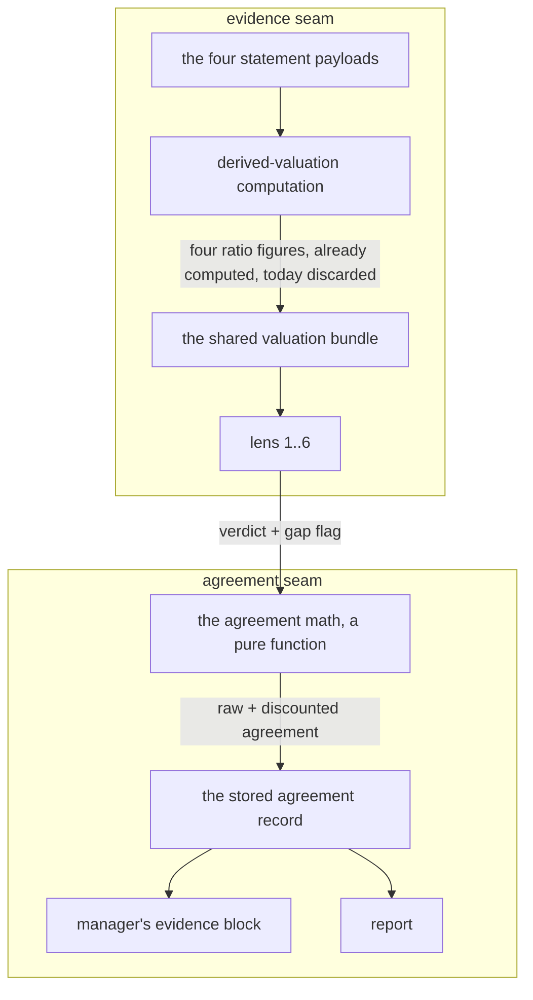

# FIX-1066: Trading-desk: lens pack is 4 of 6 and convergence ignores per-lens data gaps — Implementation Spec

## Part I — The Case *(for the human)*

### 1. Problem — why it matters, why now

The desk reads a stock through a panel of independent investor philosophies and reports how
much they agree. That agreement number is what the portfolio manager uses to decide how
confident to be, and confidence sets position size. Four things make the number read stronger
than the evidence behind it.

**The panel is four seats of an intended six**, and one of the four is the designated bear —
so the philosophical spread is narrower than designed, and a "they all agree" read is partly a
fact about who is in the room.

**A panel member who says out loud that it was missing the numbers it needed counts exactly as
much as one that had everything.** The report shows the gap, then averages it away.
Agreement produced by shared ignorance renders identically to agreement produced by evidence.

**A member that crashes is silently dropped from the count, so the members left divide among
themselves.** The desk reports agreement over the panellists who answered, not the ones we seated —
so a lens failing currently *helps* the headline more than a lens surviving and disagreeing. Three
members agreeing over a dissenting fourth reads "they mostly agree"; the identical run with that
fourth crashing reads "**they all agree**". That is live in what we ship today.

**One seat is occupied by a member that has never changed its mind.** The panel's designated
bear returns a negative read every time we have a record of, and the agreement number treats
that permanent vote as if it were an independent opinion formed on this company. So the number
partly measures a fact about our roster rather than a fact about the stock — and the one thing
the panel could tell us that nothing else can, a bear that turns constructive, is worth exactly
as much as any other vote.

**Why now** — the stated blocker on the two empty seats is gone. The report is the thing a
person reads before risking money, and the failure direction that matters here is the one we
have: the number can only ever be too confident, never too cautious.

### 2. Solution in plain terms

Three changes to one signal. All three move it the same way — **a weakness in the evidence, or
in the panel, must make the desk less sure. It must never make the desk more directional.**
That one sentence is the safety property this whole spec is built to hold, and §10 pins it with
the counterexamples that break it rather than with a claim that it holds.

> ### The one definition — what "the signal" means, everywhere in this file
>
> This spec moves **a conviction signal and the word attached to it**: how much the panel agreed
> (a fraction) and which of CONVERGENT / MIXED / DIVERGENT the report prints. That is the whole
> of what any mechanism here touches, and it only ever moves down.
>
> **It does not size anything.** The portfolio manager reads the word as qualitative guidance and
> writes `targetWeightPct` itself, uncapped by anything in this issue. The deterministic ceiling
> on the position is **FIX-1065 decision 6b**, already owner-approved (§12) — this issue must not
> build a second one.
>
> So: "the desk becomes less sure", "a weaker read", "the headline drops" all mean *the signal and
> its label*, never a bounded position. **This is stated once, here, and cited.** Five review
> rounds each corrected a different sentence that blurred it, which is what a term-meaning defect
> looks like — per-sentence correction is why it kept coming back.

**Agreement stops being a headcount.** A lens that flagged missing data counts for a fraction
of a seat when it sits with the majority. Dissent always counts in full. So the discount can
only ever pull the agreement number down, never push it up — muting a skeptic to manufacture
consensus is impossible by construction, not by care. The report shows both numbers: what the
headcount said, and what it says after the discount.

**And a panel with an empty chair stops reading as unanimous.** Today the agreement number is
computed over the panel members who *answered*, not the ones we *seated* — so a lens that crashes
simply vanishes, and the members who are left divide among themselves. That means a lens **failing**
currently helps the headline more than a lens surviving and disagreeing: three members agreeing with
a fourth dissenting reads "they mostly agree", and the identical run with that fourth member crashing
instead reads "**they all agree**". That is live in what we ship today. From here the number is
divided by the seats, so a member who never spoke counts as evidence nobody gave — the panel is
simply less agreed than a full one, which is the honest reading. The desk will reach its top
confidence level less often, and only on runs where every philosophy actually reported.

**And an evenly split panel stops reporting that nobody agreed.** When the philosophies divide
exactly — three one way, three the other — today's math looks for a "winning" stance, finds none,
and reports **0% agreement**: the desk's strongest disclaimer, for a panel where half of it agreed
each way. That is a wrong number rather than a cautious one, and it is also a cliff — one lens
crashing breaks the tie and the figure leaps. From here a split panel has **no** majority stance
(the report says so instead of naming one) and the agreement figure is the size of the largest bloc
that did agree: three of six reads 50%, which is the fact.

**The discount touches how sure the desk is, and nothing else.** It moves the agreement number
and the headline read. It deliberately does **not** touch the directional lean, because
discounting one side of a lean *lengthens* it — the desk would come out of a thin-evidence run
pointing harder in one direction than it went in. That is the same failure as the original bug,
reached from the other side.

**What this spec does not do, said up front.** The product owner's rule for the permanent bear is:

> A bear having something bad to say doesn't mean much, them having something positive to say
> means a lot.

Today the panel asks the skeptic which way it points, and it always points the same way, so its
vote carries a constant with no information in it. **This spec does not fix that**, and says so rather than implying otherwise: making the
bear's rare good news readable needs the lens to emit a number that means "how much did I find",
which it does not today. That is [FIX-1114](https://linear.app/fixpoint-labs/issue/FIX-1114).
What this spec does is stop the panel *overstating* agreement — the skeptic keeps its ordinary
vote, and the honesty work below is about the aggregate, not about the bear's signal.

**And what sets position size stops being the same number as the headline.** The card still says
what the whole panel thought, skeptic included — that is one question with one answer, and the
skeptic's dissent is information, not noise. But the desk also computes the same read *without* the
skeptic, and **sizes on whichever of the two is more cautious.** That catches the skeptic lowering
confidence in both of the ways it can: by disagreeing with the others, and by agreeing with them
and thereby making a thin consensus look solid.

**What that does and does not promise.** The skeptic can lower the agreement signal and never raise
it — a statement about the signal, not about the position (*The one definition*).

The lens's methodology is untouched throughout. It still only looks for what is wrong.

**The two empty seats get filled by fixing the evidence surface, not by wiring data to two new
lenses.** Valuation figures the desk already computes are thrown away before any lens sees them;
putting them on the shared evidence bundle every lens reads is what unblocks the empty seats *and*
stops the four existing lenses from flagging gaps for figures the desk was holding all along.
**That exposure is now FIX-1064's work, not this issue's** (§8, §12) — it lands before any lens is
seated so none reads a blunt proxy.

> **Verified in round 11, and it does not currently reach: what FIX-1064 ships is not what the two
> deferred lenses need.** Earlier revisions of this paragraph named the four figures as *earnings
> yield, EV/EBIT, return on invested capital, and PEG*. Two of those four are not what arrives, and
> one of the two seats may not be fillable at all. **This is a live blocker on PR b and an open
> question for the owner — §12 carries it.** PR a and PR c are unaffected and should not wait.

**Philosophy** — tenet 5 (one convergence point): the four figures get exactly one producer and
one renderer, so the two new lenses read the same numbers as the four old ones and there is one
place to change when the figures get sharper. Tenet 3 (earn every addition): the pack stays a
config array and the agreement math stays a pure function; nothing new is introduced beside them.
Tenet 7 (prove the goal, not the mock): the discount is arithmetic in a handler, unit-tested at
its boundaries — never an LLM's read of its own confidence.

### 6. Decisions & rules — the sign-off surface

1. **A lens that reported missing evidence counts for a fraction of a seat in the agreement
   number, and only when it agrees with the majority.**
   *Rejected:* excluding gap-flagging lenses outright (throws away a real read from a real
   philosophy), and a cosmetic "2 lenses had gaps" footnote (changes nothing about the number
   the manager acts on).
   *Locks in:* agreement is no longer a headcount, so the same evidence can produce a smaller
   suggested position than it did last month. The discount size becomes a number we have to be
   able to defend to a reader, and re-tuning it moves every future report.

2. **The discount is allowed to change the headline read — a "convergent" panel can become
   "mixed" — which lowers the sizing signal the desk hands the portfolio manager.**
   *Rejected:* showing the discount but freezing the headline, so the signal is untouched.
   *Locks in:* well-founded calls on partially-thin data present a weaker conviction signal than
   they do today — a more honest input, not a smaller number (*The one definition*; the consumer
   trace is in §3). Reversing it later means published reports change their sizing rationale.

3. **The gap discount applies to the agreement number and the headline read ONLY. The directional
   lean is never gap-weighted.**
   *(Stated through round 12 as "the lean keeps today's formula, untouched". The **gap** rule is
   untouched and is what this decision is about. Its **denominator** moved to the seated pack in
   round 13 — a different axis, decision 9c — because dividing by the lenses that answered let an
   errored dissenter lengthen the lean, which is this decision's own failure arriving through
   absence rather than through a weight.)*
   *Rejected:* discounting the lean as well — which was this spec's original design, and it is
   wrong. Reducing only the majority side's terms *lengthens* the lean: two thin bullish reads
   against one firm bearish read move from −0.267 to −0.300 once the thin pair is discounted.
   A data gap would make the desk **more** directional, which is the exact inversion this change
   exists to prevent.
   *Locks in:* the two numbers now answer two different questions — the agreement number says how
   sure the panel is, the lean says which way it points, and only the first responds to evidence
   quality. A reader who expects a thin-data run to show a shorter lean will not see one. That
   asymmetry is deliberate and has to be stated on the report, not left to be inferred.

4. **Any added lens is fed by putting the missing valuation figures on the shared evidence surface
   every lens reads, not by wiring data to the new lenses.**
   *Rejected:* lens-specific data wiring for the newcomers.
   *Locks in:* every lens sees the same figures — including the four we already ship, which stop
   flagging gaps for numbers we were holding. One place changes when the figures improve, so the
   panel can't split into lenses reading two different versions of the same company.
   **⚠ The shared surface does not currently carry what one of the two deferred lenses needs**
   (§12). This decision's *shape* is unaffected — it is still one surface, not per-lens wiring —
   but which lenses it can feed is the fork in §12's first ask.

5. **The pack goes to the six the original design named — mechanical deep value and growth-at-a-
   reasonable-price — and we accept that a majority now read the business through a value frame.**
   *Rejected:* substituting a momentum or positioning lens for one of the two to widen the spread.
   *Locks in:* a "they all agree" read is partly a property of who we seated. The report has to
   say the panel is value-tilted rather than imply the spread is even.
   **⚠ Re-opened in round 11 — this decision may not be deliverable as approved.** Verification
   against the lens contract and FIX-1064's actual output found the deep-value seat has no ranked
   comparison data and no route to any (§12). **§12's first ask is the fork**, and my
   recommendation there is a five-lens pack. Until it is settled, treat "six" throughout this spec
   — decision 9b's arithmetic, §3's tables, §5's examples, §9's rows, §10's parameterisation — as
   *the seated pack size*, which the quorum and threshold rules already read from config rather
   than pin (decisions 9a, 10). **That is why five costs no rework:** nothing downstream hardcodes
   six.

6. **A cheap-preset report states that the panel did not run, instead of omitting the block.**
   *Rejected:* today's silent omission.
   **Corrected after you approved it — as written, this decision could not be built.** It assumed
   the report knew the panel had been skipped. It does not: a cheap run stores **nothing** about
   the panel, and a skipped run, a report saved before this change, an unwritten record, and a
   panel that ran and failed all arrive at the report as the same empty value (§7). There was no
   signal to render "not run at this preset" from, so the decision was stated but not deliverable.
   **What changed:** the cost gate now writes a one-field run-state marker where it writes nothing
   today. **What did not change:** the intent you approved — the reader gets told the panel did not
   run. Flagged here rather than absorbed into the build plan, because a decision that quietly
   becomes something else between approval and delivery is the failure this epic exists to end.
   *Locks in:* a reader can tell "nobody checked the philosophical spread" from "the philosophies
   agreed" — the two look identical today. Costs one line of chrome on every cheap report, plus
   that marker write on the cheap path: no model spend, no new lens, one small resource write on a
   path per-run cost is already ruled out of scope for (§3).

7. **The skeptic stays an ordinary voting member of the pack. Reporting *how much* it found is
   split out to [FIX-1114](https://linear.app/fixpoint-labs/issue/FIX-1114).**
   *Rejected:* reinterpreting the existing `conviction` field as "how much the lens found". The
   producer does not promise that. `lens.prompt.md` defines `conviction` as *"how strongly THIS
   methodology lands on **that stance**"* — it is stance-conditional, so a bullish verdict at 0.9
   means a strong positive read, and reading it as intensity would report that as a large amount
   of skepticism found. **The mapping inverts in exactly the case the feature exists to surface**,
   and measuring the historical distribution cannot repair a semantics mismatch. Getting this right
   needs a real output the lens actually emits — a schema and prompt change — which is a different
   kind of work from re-weighting an aggregate, and is why it is now its own issue.
   *Also rejected:* **softening the lens so it can return bullish.** What would make a forensic
   skeptic bullish is the *absence* of red flags, and absence of evidence of accounting trouble is
   weak evidence of quality. A softened skeptic asserting "this looks like a good buy" claims
   something its methodology cannot support — the fabrication failure this epic removes everywhere
   else — and it costs the pack the one thing that lens is for.
   *Locks in:* this spec does **not** deliver the owner's "good news from the bear means a lot"
   rule. It makes the aggregate honest and leaves that signal unreadable, exactly as today, until
   FIX-1114 lands. Said plainly so nobody reads the discount as having solved it.

8. **Exactly one aggregate is published as the headline, and it is the FULL pack with the skeptic
   counted.** Classification, majority stance, agreement, lean, and the dissenter list all come
   from that one computation — they are never mixed across two member sets.
   *Rejected:* publishing the methodology-lenses-only aggregate, or splitting the tuple so that
   agreement and lean come from one member set while majority stance and dissenters come from
   another. Both produce a self-contradictory card. Verified against the consumers rather than
   assumed: `formatLensConvergence` renders all five fields as **one sentence** in the PM's prompt
   (*"Read: MIXED · majority bearish · agreement 83% · netLean −0.55"*), and both the summary block
   and the hero strip render the same tuple in one pill while annotating each per-lens cell from
   `dissenters`. Splitting the tuple means the skeptic's own cell is rendered from a member set it
   is not in, so it can never show as dissenting no matter what it said. Codex's case makes the
   contradiction concrete — three bullish and two bearish methodology lenses plus a bearish
   skeptic: the full pack ties (majority neutral) while the lens-only read is bullish. Two
   different answers to "what did the panel think", and only one may reach the reader.
   *Locks in:* "the panel" means the whole panel, including the skeptic, and the skeptic's dissent
   stays visible as dissent. The permanent bear therefore still drags the headline — accepted,
   because that error points the safe way and because the alternative is a card that argues with
   itself.

9. **A separate, explicitly labelled sizing figure is the conservative of both member sets. It is
   not a headline and is never rendered as one.**
   *Rejected:* letting the headline drive sizing directly. Removing a dissenter mechanically raises
   the majority fraction, so a lens-only headline would take agreement from 0.833 to 1.000 when the
   skeptic is the only bear (§3) — decision 1's failure arriving through membership instead of
   through the discount. Computing both and sizing on the lower one catches the skeptic lowering
   confidence **two different ways**: by dissenting (visible in the full pack) and by being removed
   to reveal that the methodology lenses were less agreed than the skeptic's agreement made them
   look — a 4-bear/1-bull pack with a bearish skeptic reads 83% full but 80% lens-only, and 80% is
   the figure the sizing rule reads.
   *Locks in:* the report carries one headline plus one lower number labelled as a sizing floor,
   and the PM's sizing rule must read the floor rather than the headline. That is one more number
   on the card. The guarantee it buys is that **the signal** never goes up (*The one definition*).

9a. **A panel that mostly failed cannot report agreement. Below a quorum of methodology verdicts
    the aggregate is `null` — suppressed, not zero — and the desk states that the panel did not
    reach quorum instead of quoting a figure, regardless of what the survivors said.**
    *Rejected:* today's implicit behaviour, which fails open and fails **upward**. If every
    methodology lens errors and only the skeptic publishes, the aggregate is a single-member set:
    agreement `1/1 = 1.000`, classification **convergent** — near-total panel failure becomes the
    strongest robustness signal the desk can hand the sizer. One methodology lens plus the skeptic
    scores 0.000/divergent by accident of the tie-break rather than by design. Neither is a
    judgement about the company.
    *Locks in:* the quorum is **a strict majority of the SEATED methodology lenses** — not an
    absolute count. An absolute (*"at least two verdicts"*) is the same defect as the old `>= 0.8`
    threshold: it was derived against a four-seat pack and stops meaning the same thing when the
    pack grows. At six seats it lets a mostly-failed panel report full convergence — the skeptic
    and three methodology lenses error, the surviving two agree, and `2/2 = 1.000` **convergent**
    would be quoted as a genuine reading, exactly what this decision exists to prevent. A majority of seated is
    2-of-3 at four seats (unchanged from what was derived there) and 3-of-5 at six.
    Reports on a badly degraded run say the panel did not reach quorum instead of quoting a
    number, and a lone read is shown separately rather than promoted into an aggregate. A run that
    would have quoted a figure now sometimes declines to.

    *The representation is part of the decision, not an implementation detail.* Below quorum the
    aggregate figures are **`null`**, and the record carries an explicit reason for the absence.
    **Zero is not available as the sentinel**, and the reason has been restated twice as the
    surrounding design moved — which is worth showing rather than hiding, because each restatement
    was a real narrowing:
    - *Originally:* `0` means "a genuine finding about a genuinely split panel". **Retracted** —
      it contradicted §3, which flags the same value as an artefact of the tie-break, and this
      decision's own text calling it "an accident of the tie-break rather than by design".
    - *Then (revision 12):* `0` is **occupied** — a 3–3 bull/bear split lands there — and an
      occupied point in the domain cannot be an absence sentinel whatever it means. True at the
      time, and **now obsolete**: decision 9d is precisely the change that stops a tied panel
      producing `0`, so this decision must not lean on it either.
    - *Now, and this one does not depend on what any number means:* **the rule is "quote no
      figure", and every number in that field gets printed.** `formatLensConvergence` renders
      `agreement N%` from whatever is there, so *any* in-domain sentinel violates the decision at
      the consumer no matter how unreachable it is elsewhere. Only an absence can be absent.
    Two supporting facts, neither of which the argument needs: after decision 9d **no panel that
    reported anything can score `0`** — a single verdict puts the modal bloc at `GAP_WEIGHT` or
    better — so the two states become unmistakable rather than merely distinguishable; and a
    **legacy record may still carry `0`** from the old tie-break, so the value stays occupied in
    stored data regardless (BP-030).
    Same three-state problem [FIX-1063](https://linear.app/fixpoint-labs/issue/FIX-1063) solves
    for unobserved payloads,
    and it is solved the same way: **an absence is `null`, never a value inside the domain** —
    "we did not measure it" is not a fourth trend, and "the panel did not convene" is not an
    agreement score. Every consumer must handle the null branch explicitly (§7).

    *Constant re-check, prompted by this being the second time the defect appeared.* Every
    threshold in this spec was re-examined against "is this meaningful only at a stated `N`, and
    does `N` change here?":
    - `agreementScore >= 0.8` — **was defective**, fixed by decision 10 (unanimity).
    - `QUORUM_MIN = 2` — **was defective**, fixed here (fraction of seated).
    - the `>= 0.5` mixed boundary — safe: "at least half agree" means the same at any `N`.
    - `GAP_WEIGHT = 0.5` — safe, and worth stating why. Its *scalar* effect does shrink as the
      pack grows (one flagged lens on an otherwise unanimous pack gives 0.875 at four members and
      0.917 at six), but under decision 10 **any** gap flag on the majority puts agreement below
      1.0, so "convergent requires unanimity *and* zero gap flags" holds at every pack size.
      **Read that narrowly — it is scoped to the unanimous case, and revision 8 over-read it.**
      It says the weight cannot decide whether a *unanimous* panel keeps its convergent headline.
      It says nothing about a split panel, where the weight decides the mixed/divergent boundary
      outright (decision 11). The constant is safe across pack sizes; it is not therefore free of
      product consequence.

9b. **The downward-only guarantee is scoped to a fixed pack. Seating the two new lenses is a
    one-time re-baselining that can move sizing either way, and is disclosed as such.**
    *Rejected:* claiming the guarantee as an absolute. It is false across PR b, and the arithmetic
    says so: two bullish and one bearish methodology lens with a bearish skeptic gives a sizing
    floor of **0%** at four lenses; add two bullish lenses and the same company reads **66.7%**.
    A pack where every methodology lens is bullish goes **75.0% → 83.3%**. No mechanism in this
    spec is at fault — the clamp compares two memberships *within* one pack and says nothing about
    the pack growing.
    *Also rejected:* capping the post-expansion floor at its pre-expansion value. That would freeze
    the panel's usefulness at its four-lens state permanently: five of six philosophies agreeing
    genuinely is stronger evidence than two of three, and a cap would discard the reason for
    seating the lenses at all.
    *Locks in:* PR b changes what identical evidence scores, in **both** directions — the same
    expansion drops the floor to 0% when the new lenses disagree with the incumbents. Reports
    either side of it are not comparable, and the release note and `CLAUDE.md` must say so. The
    per-run guarantee that survives is the one worth stating: **for a given pack, no mechanism in
    this spec raises the sizing floor above the full-pack reading.**

9c. **Every agreement figure is computed over the SEATED pack, not over the lenses that reported.
    A panel that did not fully report cannot print the unanimity headline. Quorum is a floor, not
    the only check.**
    *Rejected:* today's denominator, which is the set that reported. `convergence-math.ts:50` sets
    `n = verdicts.length`; a lens that errors produces no verdict, is absent from `verdicts`, and
    shrinks `n`. Nothing else in the aggregate notices it left.
    *Rejected as the fix:* gating only the *word* — keeping the reported denominator and refusing
    `convergent` when attendance is short. That fixes the headline and leaves the number wrong, and
    the number is what decision 9's sizing floor is made of: the crashed panel below would still
    hand the sizer `1.000`.
    *Locks in:* **an absent lens dilutes agreement; it never joins a side.** It contributes `0` to
    every stance count and `1` to the denominator — so absence is *no* evidence, and this decision's
    whole content is that no evidence must not read as agreement. Nothing is invented for the lens
    that did not speak: no default stance, no imputed verdict, no place in `dissenters`.
    Concretely, a panel one seat short of full attendance cannot reach `1.0` no matter what the
    survivors said, so **a degraded run now reads MIXED where it used to read CONVERGENT.** The
    desk reaches full conviction strictly less often, and how much less often is a number nobody
    has measured (§12 names the probe).

    *Why this is a decision and not a build detail — the failure it removes, worked at both pack
    sizes and verified in the real function rather than argued* (`spec-poc/FIX-1066-attendance/`):
    - **Live today, at the four seats we run now.** Three bullish lenses and a dissenting skeptic
      score `3/4 = 0.750` **mixed**. Let the skeptic *crash* instead of dissent and the same run
      scores `3/3 = 1.000` **convergent**. A lens failing is worth more to the headline than a lens
      surviving and disagreeing. This is shipped behaviour, not a consequence of anything here.
    - **And this spec would have made it worse.** At six seats, one lens that reports honestly and
      flags a gap gives `5.5/6 = 0.917` → MIXED; that same lens *crashing* gives `5/5 = 1.000` →
      CONVERGENT, sizing floor `1.000`. **Under the round-11 design a lens is better off crashing
      than admitting what it was missing** — the exact inversion decision 1 exists to remove,
      reached through absence instead of through a gap flag, and introduced by the very mechanism
      that removes it elsewhere. With the seated denominator the two read `0.917` and `0.833`, both
      MIXED, and the honest report ranks above the crash where it belongs.
    - **Quorum does not catch either case.** At six seats quorum is three of five seated
      methodology lenses; one crashing leaves four, which clears it comfortably. The quorum rule
      answers "did enough of the panel show up to say anything at all"; it does not answer "did all
      of it show up", and only the second licenses the word *unanimous*.

    *Consequence for decision 10:* its phrase "unanimity among the **counted** lenses" is what made
    this reachable — the counted set is the reported set. Read it as **unanimity among the seated
    lenses**; this decision is the correction, and §7 derives the property rather than asserting it.
    *Extended to the lean, on the same reasoning* (decision 3, amended). `netLean` divides by the
    same reported count, so an errored dissenter **lengthens** it. That is one axis — the
    denominator — and it is orthogonal to decision 3's approved rule that the lean is never
    gap-discounted, which is untouched. Both fields now divide by the seated pack.

    *Necessary and NOT sufficient, which is the part round 12 got wrong.* Fixing the denominator
    does not by itself make agreement fall when a lens disappears, **because the numerator moves
    too**: `majorityStance` is recomputed, and today's tie-break names `neutral` — a stance nobody
    voted for — so `counts[majorityStance]` collapses to `0` on a bull/bear tie and then jumps off
    that floor when a removal breaks the tie. Decision 9d fixes the numerator; the two are one
    change and neither works alone.

9d. **A tied panel has NO majority stance, and its agreement figure is the size of the largest
    bloc that agreed — not zero.** `majorityStance` becomes nullable and is `null` on a tie.
    *Rejected:* today's rule, which names `neutral` the majority on a tie. **`neutral` is a stance
    a lens can actually hold**, so it cannot also mean "nobody won" — §13's class, exactly, and now
    its sixth instance. The cost is not cosmetic: on a 3–3 bullish/bearish split `counts["neutral"]`
    is `0`, so the desk prints **0% agreement and DIVERGENT for a panel where half the philosophies
    agreed each way**. That is not a conservative reading, it is a wrong number, and it is the floor
    decision 9c's invariant kept falling off.
    *Locks in:* `agreementScore` = the weighted score of the modal bloc, over the seated pack; on a
    tie, the best-scoring of the co-modal blocs. **Direction is still decided on RAW counts**, so a
    gap flag can never flip which way the panel is reported to lean (decision 3's rule, preserved).
    A tie can never reach `convergent` — that needs one bloc to fill every seat. `dissenters` is
    **empty** on a tie: nobody dissents from a majority that does not exist, where today every lens
    is listed as a dissenter, which is equally meaningless. The report has to say "the panel split"
    rather than name a stance, which is one more rendered state.

    *The alternatives were measured, not argued* — every verdict multiset at four and six seats,
    every single-lens removal, in `spec-poc/FIX-1066-attendance/`:

    | tie rule | raises agreement | raises the printed word | overstates the majority bloc |
    |---|---|---|---|
    | `neutral` — today, and round 12 | 58 / 292 | **20 / 42** | 0 |
    | `min` of the co-modal blocs — the cautious-looking one | 45 / 255 | **24 / 54** | 0 |
    | `max` over **all** blocs — perfectly monotone | **0 / 0** | 0 / 0 | **0 / 18** |
    | **`max` of the co-modal blocs — chosen** | 0 / 54 | **0 / 0** | **0 / 0** |

    *(counts are seated-4 / seated-6)*

    Two of those rejections are worth keeping, because both look right and are not. **`min` reads as
    the cautious choice and is strictly worse on every column** — it swaps one cliff for another,
    at the tie-to-untied boundary instead of the untied-to-tie one. **`max` over all blocs is the
    only perfectly monotone rule and is rejected anyway:** at six seats it publishes a number
    *higher* than the majority bloc's own score in 18 cases, because a small well-evidenced bloc
    can outscore a larger gap-flagged one. Overstating agreement is the failure this entire spec
    exists to remove, so a clean invariant bought with an overstatement is not a bargain.

10. **The "convergent" threshold is recalibrated so it means the same thing at any pack size:
    unanimity among the SEATED lenses.**
    *(Stated as "the counted lenses" through round 11. The counted set is the set that reported,
    which is how a panel with an empty chair could still print unanimity — decision 9c is the
    correction and carries the arithmetic.)*
    *Rejected:* keeping `agreementScore >= 0.8`. That constant means "unanimous" at four lenses
    (3/4 = 0.75 is mixed) but "at most one dissenter" at five or six (4/5 = 0.800 and 5/6 = 0.833
    both clear it). So seating the two new lenses would silently loosen the headline the whole
    spec is built to tighten, and a regression test written against a four-verdict fixture would
    keep passing. Every convergence test must run at the pack size the system will actually have.
    *Locks in:* "convergent" becomes rarer and harder to reach as the pack grows, which is the
    honest reading — six independent philosophies agreeing is a stronger claim than three doing
    so, and it should be priced that way. Reports that read convergent last month may read mixed
    on the same evidence.

11. **`GAP_WEIGHT` is `0.5` — a lens that flagged a gap counts as half a seat. It is on the owner's
    sign-off surface (§12), because on a split panel it decides which of three words the report
    prints.**
    *Rejected:* leaving it as "some value below 1", which makes the implementer invent a number.
    *Also rejected, twice, in opposite directions — and the second correction is the live one:*
    - Revision 3 justified `0.5` by claiming `0.9` "changes nothing a reader would notice" while
      `0.5` flips the headline. **False after decision 10.** Once "convergent" requires unanimity, a
      unanimous pack carrying any gap flag scores below `1.0` at *every* weight below 1: the
      motivating case reads `0.95` at `0.9` and `0.75` at `0.5`, and **both print MIXED**.
    - Revision 8 then generalised that disproof to the whole constant and demoted it to
      implementer calibration. **Also false.** The unanimous case is the case where the weight does
      not decide; it is not the only case. On a **non-unanimous** panel the weight decides the
      headline outright, and the spec's own motivating shape is one: six lenses, four on the
      majority stance and all four reporting gaps, two dissenting. Raw agreement `4/6 = 0.667`
      (mixed). At `w = 0.9` the discounted score is `3.6 / 6 = 0.600` → **MIXED**; at `w = 0.5` it
      is `2.0 / 6 = 0.333` → **DIVERGENT**.
    *So the honest statement is two statements, and they must be kept apart:*
    **where the panel is unanimous, the constant does not decide the headline — the unanimity rule
    does, at any weight below 1. Where the panel is not unanimous, the constant does decide it.**
    Collapsing either into the other has now produced a wrong sign-off twice.
    *Rejected as a reason to demote it:* that the PM prompt groups MIXED and DIVERGENT under one
    instruction ("pull toward a smaller target or hold"). **A shared instruction bullet does not
    make the two outputs equivalent** — the classification word is rendered into the manager's
    evidence block as `Read: DIVERGENT · …` and onto the report card as the pill the reader sees.
    Different text reaches the model and different text reaches the customer. This spec should not
    imply otherwise, and no longer does.
    *Locks in:* the number is product policy. Half a seat is the honest reading of the claim — a
    lens that says it lacked its own core metrics gave you something, but not a whole opinion — and
    it means a thin four-of-six agreement prints as the desk's weakest read rather than its middle
    one. Re-tuning it later moves the discounted figure on every future report and can move the
    word attached to it (*The one definition*). §10 pins comparisons rather than literals everywhere
    except the named counterexamples, so the value stays tunable without a test rewrite.

12. **Ships as three pull requests: the agreement-honesty fix *including the quorum guard*, then
    the pack expansion, then the sizing floor. No PR in this sequence may leave a fail-open
    interval behind it.**
    *Rejected:* folding the sizing floor into the pack expansion. It changes what the portfolio
    manager sizes on and should not ride in on a diff that is mostly config entries.
    *Rejected — and this is the correction:* **the earlier a→b→c split, which shipped the quorum
    guard last.** It left a deployable interval in which the pack is six seats and the guard is
    not there yet, and in that interval the exact case decision 9a exists to suppress reports
    CONVERGENT: three methodology lenses and the skeptic error, the surviving two agree, the
    aggregate runs over the two reporting verdicts and scores `2/2 = 1.000`. Quorum at six seats is
    a strict majority of five seated methodology lenses — three — so two survivors do not clear it,
    but nothing checks that until PR c. The panel would fail open, upward, *because* of a change
    made to improve honesty.
    *Rejected as the fix:* making PR c a hard prerequisite of PR b. **An ordering constraint is a
    promise about deployment discipline; a guard in the code is a property of the code**, and only
    the second survives someone merging in a different order.
    *Locks in:* the quorum guard and its nullable representation move to **PR a**, and PR c carries
    only the sizing floor. Three reasons it belongs there rather than in PR b: the fail-open cannot
    exist at any point in the sequence; the quorum rule reads the **seated** methodology count from
    the pack config, so seating two lenses in PR b re-tunes it with no further edit (decision 9a);
    and the guard closes a fail-open that exists at **four** seats today — the lone-surviving-
    skeptic case worked in decision 9a — which should not wait on the valuation work to be fixed.
    The cost is that PR a is now the large one — the discount, the threshold, the record, the quorum
    guard and every consumer. Accepted deliberately: this epic's rule is that a PR boundary may not
    be drawn through a known fail-open interval. **The threshold recalibration (decision 10) ships
    with PR a** for the same family of reason — it is wrong at every pack size today, and waiting
    for the two new lenses would let a known-wrong headline ship twice.

> **Non-goals** — no new data provider, feed, or paid entitlement (the epic's fence). No change to
> the determinism guarantee: agreement stays arithmetic in a handler, never a model output. **No
> change to the lens's methodology, prompt reasoning, or disqualifiers** — decision 7 rejects
> softening the skeptic; it reports what it already finds, it does not look for different things.
> **No statistical weighting of a lens's stance** — the base-rate weighting first proposed is out
> (§3). **And no magnitude of any kind is published here.** Decision 7 leaves the skeptic an
> ordinary voting member and defers every "how much did it find" field — baseline, level,
> deviation, intensity — to FIX-1114. An implementer who adds one is rebuilding the
> `conviction`-as-intensity channel this spec rejected. No
> per-risk-profile or per-sleeve weighting of philosophies (that is FIX-776). **No gap weighting in
> the lean formula** (decision 3) — decisions 3 and 8–9 touch the same numbers through disjoint
> mechanisms and must be read together (§7). No new lens beyond the two the original design named
> — no "optimist", no conservative/aggressive pair; appetite is already the risk mandate's axis and
> folding it into the panel would count the same stance twice. No recomputation of reports already
> stored — the epic's forward-looking rule holds. The cheap preset still skips the panel; only the
> disclosure changes.
>
> **What is actually guaranteed, stated narrowly.** This spec clamps **the agreement signal**,
> downward, for a fixed pack: `min(full, lens-only)`, never above the full-pack reading
> (decision 9). That is the whole of it — *The one definition* (§2) says what that does and does
> not promise, and §12 carries the FIX-1065 cap that actually bounds the position.
>
> Two limits, so the narrow claim is not read wider than it is: the guarantee is **per pack** —
> seating the two new lenses re-baselines it in both directions (decision 9b) — and the PM block
> *already* renders every verdict as `stance @ conviction`, a pre-existing exposure this spec
> neither creates nor closes (recorded on FIX-1114).
>
> **Size:** Large — 3 PRs, 2 documentation surfaces. **The file and behaviour counts are
> deliberately not stated.** They were for three revisions and moved every time the consumer search
> was re-run (12/14 → 14/19 → 17/22), because the set is *derived*, not enumerated: §7's
> completeness property is the criterion and §8's steps are the work. A pinned inventory here goes
> stale on the next extracted formatter and tells a reviewer nothing §7 does not.

---

### 3. Tradeoffs & alternatives

**Alternative: make the panel weight itself.** Ask each lens how much its gap should cost and
average that in. Rejected — it hands a number the manager sizes on back to the model that
produced the opinion, which is exactly what the determinism rule exists to prevent, and a lens
with a thin read has every incentive to say the gap didn't matter.

**The simpler approach: surface the gaps harder and leave the math alone.** Genuinely tempting —
the report already prints each lens's gap, and a bolder treatment costs almost nothing. It is
insufficient because the *number the manager sizes on* is unchanged, and that number is the one
that reaches the decision. Making the reader do the discount by eye is how the current version
already fails.

**Where the complexity is:** not the arithmetic. It is the direction of the discount. The obvious
implementation — weight every lens by whether it flagged a gap, over a weighted total — quietly
*raises* agreement when the gap-flagging lens is the dissenter, because muting a skeptic makes the
rest look unanimous. That is the exact failure this change exists to prevent, arrived at from the
other side. §7 and §10 are mostly about making that impossible rather than merely avoided.

#### What the record actually says about the bear

The question that had to be settled before designing anything: **has the structural skeptic ever
returned a non-bearish verdict, and could it?**

*Has it?* The shared development store holds **two** runs, both at the cheap preset, so neither
produced a lens verdict at all. Four full-preset runs survive in captured run artifacts — AAPL and
NVDA, twice each. In all four, `forensic-skeptic` returned **bearish** (conviction 0.60, 0.65,
0.85, 0.85). So the owner's observation is not contradicted by anything we hold.

**It is also not established by it, and the honest answer is that we cannot measure this yet.**
Four runs over two tickers, in one market period, is not a base rate. Two further facts from the
same sample say why leaning on it would be a mistake:

- **`cycle-risk` is also bearish in 4 of 4** — the skeptic is not uniquely stuck, and a remedy
  aimed only at the skeptic would leave an equally constant member inside the aggregate.
- **Of 16 verdicts, 4 are bullish and every one is `macro-reflexive`.** The panel as a whole
  reads negative on this sample. That may be two expensive megacaps in one tape rather than a
  property of the lenses.

This is a finding to state plainly, not a gap to design around: **it is the reason this spec
takes no statistical remedy.** You cannot estimate what a positive read from the bear is worth
from zero positive reads, and a weight fitted here would be least stable precisely on the rare
verdict it exists to price. FIX-1112 is the measurement; it now blocks any weighting work, and
this spec deliberately does not wait for it because the fix it does take needs no corpus.

*Could it?* Nothing forbids it. The verdict schema accepts `"bullish"` from any lens, and no code
path clamps or rewrites a lens's stance. **But the lens has no criterion that would produce one.**
All four core principles, all four characteristic questions, and all four weights are
negative-detectors, and the `disqualifiers` field is documented as "what makes this lens pass
regardless of upside" — upside is explicitly not a route to a positive verdict. The shared prompt
reinforces it ("A bearish read from a structural-skeptic lens is information, not failure"), and
its sizing philosophy is "Default skeptical; the structural bear of the pack."

So the two diagnoses come apart cleanly: **this is not a stuck output — it is a lens whose only
route to non-bearish is the absence of negatives, which lands on *neutral*.** The stance channel
is nearly constant *by construction*, and that is the fact the remedy has to be built around.

**This is the whole justification for the design, so it is worth stating flatly.** A biased lens
and a lens that cannot vary need different fixes, and this is the second. Weighting a stance —
statistically or otherwise — assumes the stance carries information that is merely mis-scaled. It
does not: nothing in this lens's configuration could produce a bullish read on any company, so its
stance is close to a constant, and **you cannot re-weight a constant into a signal.** That rules
out base-rate weighting on grounds independent of the thin corpus. It also rules out waiting for
the bear to turn bullish, which is what a stance-flip channel would do — that channel would sit
dead indefinitely.

What is left is the magnitude. `conviction` varies while the stance does not, which is precisely
why the owner's *"how skeptical is it"* framing is the right question and *"let it be positive
sometimes"* is not: the first reads a field that already moves, the second waits on one that
cannot. Decision 7 follows directly, and so does the decision not to soften the lens — softening
would manufacture variance in the stance rather than read the variance we already have.

#### The number we already collect and then throw away

Every lens reports a `conviction` in 0–1, documented as "how strongly THIS methodology lands on
that stance." **For a lens whose stance never moves, that field already is "how much did you
find."** The desk collects the owner's number on every run today.

And then discards its most interesting range. The lean is
`Σ(stanceSign × conviction) / N`, and `stanceSign` pins a bearish read to the negative half: a
skeptic that went looking and found almost nothing scores −0.1, a small negative. It can never
cross zero, so "I found very little" and "I found a lot" differ only in how bearish the desk
becomes. The distinction the owner cares about is collected, then flattened.

**And the remedy that suggested itself does not survive its producer.** The tempting move is to read
that already-collected `conviction` as "how much the lens found" and publish it. But the prompt
defines the field as *"how strongly THIS methodology lands on **that stance**"* — stance-conditional.
For a bearish verdict, high does mean "found a lot". For the neutral and bullish verdicts **this
feature exists to surface**, it does not: a bullish 0.9 is a strong positive read, and reading it as
intensity would report it as a large amount of skepticism found. The mapping inverts precisely where
it matters, and no amount of distribution-measuring repairs a semantics mismatch.

That is why the signal is split to FIX-1114 rather than folded in here. It needs a field the lens
actually emits with a stance-independent meaning — a schema and prompt change, a different kind of
work from the aggregate arithmetic in this spec. Reinterpreting a field to mean something its
producer never promised is the "a field describing work that did not happen" failure this epic
exists to end.

#### Only one aggregate may be published, and it has to be the whole panel

The obvious next move — publish the methodology-lenses-only aggregate and put the skeptic beside it
— cannot be done, and the reason is in the consumers rather than in the math. `formatLensConvergence`
renders **one sentence** into the PM's prompt:

> `Read: MIXED · majority bearish · agreement 83% · netLean −0.55.`

…then lists each lens, annotating `(dissents from majority)` from the `dissenters` array, and closes
with the sizing rule. The summary block and the hero strip render the same five fields in a single
pill and outline each per-lens cell from the same array. So `classification`, `majorityStance`,
`agreementScore`, `netLean` and `dissenters` are consumed as **one claim about one group of lenses**,
in three places.

Publishing agreement and lean from one member set while majority stance and dissenters come from
another produces a card that argues with itself — and one concrete bug: the skeptic's own cell would
be rendered from a `dissenters` list computed over a set it is not in, so it could never show as
dissenting no matter what it said. Codex's case makes the contradiction visible at both pack sizes:

| Three bullish + two bearish methodology lenses + a bearish skeptic | Headline it would give |
|---|---|
| Full pack (6) | tie → majority **neutral**, agreement 0%, divergent |
| Methodology lenses only (5) | majority **bullish**, agreement 60%, mixed |
| Full pack (4-lens equivalent) | tie → majority **neutral**, agreement 0%, divergent |
| Methodology lenses only (3) | majority **bullish**, agreement 67%, mixed |

Two different answers to "what did the panel think." **The headline is the full pack** (decision 8):
"the panel" means the panel, and a skeptic that dissents should read as dissenting. The cost is that
the permanent bear keeps dragging the headline — accepted, because it errs the safe way.

*(That table exposes a pre-existing wrinkle that **round 13 brought into scope after it turned out
to be load-bearing.** On a tie, today's math names `majorityStance` **neutral** and then counts how
many lenses hold neutral — on a bullish/bearish split that is **zero**, so the desk prints **0%
agreement and DIVERGENT** for a panel where half the philosophies agreed each way, with every lens
listed as a dissenter. Two things made deferring it untenable. It is a **wrong number**, not a
cautious one: 3 of 6 agreed each way, and 0% is not that fact. And it is a **cliff** — agreement
sits on a floor unrelated to the panel's actual spread and jumps off it the moment a single lens
errors and breaks the tie, which is precisely how decision 9c's attendance invariant was still
falsifiable after the denominator was fixed. Decision 9d replaces it: a tie has **no** majority
stance (`null`, because `neutral` is a stance a lens can really hold), and agreement is the size of
the largest bloc that agreed. The 3–3 case reads **0.500 / MIXED**. Six lenses tie more easily than
four, so PR b would have made the old behaviour more frequent.)*

#### The sizing floor needs a clamp, or it reintroduces the bug

Sizing is a different question from the headline, and it is where the skeptic must not be able to
raise anything. Removing a member changes numerator *and* denominator, so it moves the aggregate in
whichever direction the removed member pointed — and the skeptic is nearly always the one pointing
against a bullish pack:

| Boundary case | Headline (full pack) | Lens-only | **Sizing floor** |
|---|---|---|---|
| All bearish, 4 lenses | 1.000 convergent | 1.000 convergent | 1.000 convergent |
| All bearish, 6 lenses | 1.000 convergent | 1.000 convergent | 1.000 convergent |
| Single dissent, 4 lenses | 0.750 mixed | 0.667 mixed | **0.667** mixed |
| Single dissent, 6 lenses | 0.833 mixed | 0.800 mixed | **0.800** mixed |
| **Skeptic is the only bear, 4 lenses** | 0.750 mixed | **1.000 convergent** | **0.750** mixed |
| **Skeptic is the only bear, 6 lenses** | 0.833 mixed | **1.000 convergent** | **0.833** mixed |
| **4 bull / 1 bear / skeptic neutral, 6 lenses** | 0.667 mixed | **0.800 mixed** | **0.667** mixed |
| **…same pack, skeptic bullish** | 0.833 mixed | 0.800 mixed | **0.800** mixed |
| **Skeptic props up the consensus: 4 bear / 1 bull + bearish skeptic, 6 lenses** | 0.833 mixed | 0.800 mixed | **0.800** mixed |
| **Gap case, 4 seats: 3 agreeing lenses, 2 of them flagged, skeptic dissents** | 0.500 mixed | 0.667 mixed | **0.500** mixed |

The middle column is the failure mode: used as the sizing input on its own it raises agreement in
four of ten cases, twice to "convergent" — decision 1's failure arriving through membership instead
of through the discount. **Taking the lower of the two removes every upward move in the agreement
signal**, at both pack sizes, including the case Codex raised.

*(Reachability, per §4 practice 5 — the last row was wrong for two revisions and is worked here.
A four-seat pack is three methodology lenses plus the skeptic. All three agree; two of them
flagged a gap; the skeptic dissents. Full pack: the three agreeing lenses carry `1 + 0.5 + 0.5 = 2`
over four members = **0.500**. Lens-only: the same two flags over three members = `2 / 3` =
**0.667**. Floor = 0.500. The row this replaces was labelled "2 of 4 agreeing lenses flagged",
which is a **unanimous four-member pack** and scores `(2 + 2×0.5) / 4 = 0.750` — the figure §5's
worked example uses — with no member left to produce a 0.667 lens-only reading. Neither number
in the row was reachable for the case it named, and §3 leans on that row to justify the clamp.)*

**The clamp applies to agreement only — the lean is not clamped, and not touched.** It was worth
checking whether the skeptic should leave the lean too, and the arithmetic says no. Exclusion moves
the lean in *both* directions depending on the pack, so no single rule makes it one-directional:

| Pack | Lean today (skeptic in) | Skeptic excluded |
|---|---|---|
| Five bullish at 0.8 + bearish skeptic at 0.85 | +0.525 | **+0.800** — more bullish |
| Three bullish at 0.8, two bearish at 0.7 + bearish skeptic at 0.85 | +0.025 | **+0.200** — more bullish |
| Five bearish at 1.0 + bearish skeptic at 0.0 | −0.833 | −1.000 — more bearish |

On the common shape — a bullish pack with the permanently-bearish skeptic dissenting — **excluding
it raises the lean**, which is the direction this spec forbids. Keeping today's formula changes the
lean by exactly zero, which is provably safe and is what decision 3 already committed to. So there
is one lean, computed over the full pack, unchanged by this issue.

Two rows of the agreement table show the clamp doing work in opposite directions, which is why both
member sets have to be computed rather than just picking one. In *skeptic is the only bear* the floor binds on the
**headline** (the skeptic's dissent is the cautious reading). In *skeptic props up the consensus* it
binds on the **lens-only** figure — the skeptic was agreeing, and removing it reveals the
methodology lenses were less unanimous than the headline suggested. A permanent bear can overstate
agreement simply by joining it, and only the second computation catches that. The last row shows the
clamp also stops the exclusion from undoing the gap discount.

#### The threshold means two different things at four lenses and six

Independently of any of the above, `convergence-math.ts` classifies on
`agreementScore >= 0.8`. That constant does not survive a change in pack size:

| Pack size | One dissenter | Reads as |
|---|---|---|
| 4 | 3/4 = 0.750 | mixed |
| 5 | 4/5 = 0.800 | **convergent** |
| 6 | 5/6 = 0.833 | **convergent** |

So "convergent" currently promises *unanimity* at four lenses and *at most one dissenter* at five
or six. Seating the two new lenses (PR b) would silently loosen the headline this spec exists to
tighten — and a regression test written against a four-verdict fixture would keep passing while it
happened. Decision 10 recalibrates to unanimity among the **seated** lenses, which means the same
thing at any size, and §10 requires every convergence test to run at the pack size the system will
actually have. *(Seated, not counted — "the counted lenses" is the reported set, and a panel with
an empty chair could still print unanimity over it. Decision 9c.)*

**Composition.** Decisions 3 and 8–9 touch the same numbers through disjoint mechanisms: the gap
discount applies to the agreement headcount and never to the lean; the skeptic change alters
membership and never applies a weight. Checked on the counterexample that started all this — two
thin bullish reads against one firm bearish read, no skeptic seated — the lean is **−0.267** under
the new math, unchanged.

**What this spec therefore does not do.** It makes the agreement number honest. It does not make
the bear's rare good news readable — that is FIX-1114, and until it lands the panel's most
informative event still renders like every other bearish vote.

The second cost is spend, and it is settled: six lenses instead of four is roughly half again as
much model cost on the expensive preset. The product owner has ruled per-run cost out as a
constraint at current volume — recorded here so it is not re-argued, not re-opened.

### 4. Focus practices (1–5)

1. **BP-030 (tolerate the old shape)** — the agreement summary is stored per report. New fields
   need defaults, or every report saved before this change fails to open. The report list is a
   product surface, not a cache.
2. **BP-020 (never fabricate; live paths never fall back)** — a gap flag is a lens telling the
   truth, and this change attaches a cost to telling it. Nothing in the prompt may reward staying
   quiet about a missing figure, and the four newly-exposed numbers must arrive labeled for what
   they are rather than as clean measurements.
3. **One convergence point (tenet 5)** — the four valuation figures get one producer and one
   renderer. A second copy assembled for the lens surface is how the panel ends up reading two
   different versions of the same company.
4. **BP-035 (second-path checklist)** — the paths a naive suite misses here are the cheap preset
   (panel skipped entirely), every lens flagging a gap, and no lens producing a verdict at all.
5. **Demonstrate a safety property, never assert one — and check worked examples for
   *reachability*, not just for arithmetic.** Every claim in this spec that something "can only
   move one way" is carried by a worked case in §3 or §9 and a regression test in §10. Separately,
   every illustrative number must correspond to a verdict set the system can actually produce: an
   earlier draft paired an 80% lens-only reading with a 100% full-pack reading, which no six-lens
   pack can generate, and fixtures built on it would have encoded an impossible stored state.
   An earlier version of this spec asserted the invariant in prose and was falsified by a
   three-verdict counterexample; the second candidate remedy was falsified the same way. Both now
   ship as named tests. If a future edit adds a claim of this kind with no worked case, that is
   the defect.

### 5. What using it looks like (1–5 examples)

*(This is app code, so the surface a person meets is the report and the manager's evidence block,
not a public API. Both are shown; the third example is the config-edit guarantee the issue asks us
to preserve.)*

**What the manager reads — before / after** *(what this spec proposes; today there is no second line):*

```
before  Read: CONVERGENT · majority bullish · agreement 100% · netLean +0.68
after   Read: MIXED · majority bullish · agreement 75% · netLean +0.68
        Headcount agreement was 100%; discounted to 75% — 2 of the 4 agreeing
        lenses reported missing evidence. The discount lowers agreement only,
        never raises it, and does not touch the lean: thin evidence makes the
        desk less sure, never more directional.
```

**Note the lean is unchanged.** That is decision 3, and it is the part most likely to be read as
a bug. Two numbers that used to move together now move independently, and the report has to say
which question each one answers.

**What the report shows when the skeptic is the lone dissenter** *(decisions 8–9 — one headline
from the whole panel, plus a separately labelled sizing floor):*

```
after   Read: MIXED · majority bullish · agreement 83% · netLean +0.48
        Sizing floor: 83% — the lower of the panel read (83%) and the same
        read without the structural skeptic (100%).
```

*(Reachability check, per §4 practice 5: the skeptic is the lone dissenter, so the full pack is
5/6 = 83% and the five methodology lenses are unanimous at 100%. Those two figures occur together
only in this configuration — a fixture pairing an 80% lens-only read with a 100% full-pack read is
impossible and would encode a state the system cannot produce.)*

One headline, from the whole panel (decision 8). The sizing floor is a separate labelled number and
is what the sizing rule reads (decision 9). **How much the skeptic found is not on this card** — the
panel still cannot say it (FIX-1114).

**What the reader sees when the panel ran and mostly failed** *(decision 9a — the biggest new state
on the card, and the one most easily confused with the line below it):*

```
after   Lens pack — the panel did not reach quorum. 2 of 5 methodology lenses
        reported; the rest errored. No agreement figure is quoted, and the two
        reads that did arrive are shown as individual reads, not as a panel.
```

No percentage, no pill, no sizing rule keyed to a number that does not exist. **`0%` would be a
different statement** — a genuinely split panel — which is why the aggregate is `null` (§7).

**What the reader sees on a cheap report** *(today the block is simply absent):*

```
after   Lens pack — not run at this cost preset. No philosophical spread was checked.
```

These last two are the pair a reader must never confuse: one panel never convened, the other
convened and failed. They are told apart by the stored run state, not inferred (§7).

**Adding a lens stays a config edit** *(unchanged guarantee, shown because the issue asks for it):*

```ts
// the pack config array — one entry per lens
{ id: "garp", label: "GARP", attribution: "…documented methodology", … }
// plus its id in the lens id list
```

## Part II — The Build Plan *(for the implementing agent)*

### 7. Technical design

Two independent seams. The agreement seam is the pure math function and the record it writes; the
evidence seam is the shared valuation bundle every lens generator already receives.



- **The agreement math** (`agents/lenses/convergence-math.ts`) gains the discount, the recalibrated
  threshold, **the seated denominator (decision 9c)** and the compute-twice-and-clamp shape. It
  stays pure, stays the single source of both numbers, and stays free of any runtime import. This
  is the only file the aggregate change touches. **Its signature changes**: it cannot compute a
  seated denominator from the verdict list alone, so it takes the seated count as an argument
  rather than inferring it — that is the whole of decision 9c in the code, and inferring it is the
  bug.
- **The stored agreement record** (`agents/lenses/lens-convergence-resource.ts`) gains the
  pre-discount figure, the list of gap-flagging lens ids, the separately labelled sizing floor,
  and **the run-state marker below**, so the report and the manager's block can show the discount,
  the floor and the panel's run state rather than assert them.
  **Every field on the record gets a default, not only the new ones — and this is a correctness
  requirement, not tidiness.** The cheap path writes `packRun` and nothing else; the below-quorum
  path writes `packRun`, `quorumState` and the verdicts that arrived. Both are *partial* writes
  against a schema whose `verdicts` and `dissenters` are today required arrays with no default, so
  either one produces a value that **fails validation the moment it is mirrored into the PM memo or
  returned through `runArtifacts`** — the two projections §8 step 4 opens. The rule that makes both
  paths safe is one line: **the record must be constructible from any subset of writes.** So
  `verdicts` and `dissenters` default to `[]`, every scalar aggregate is
  `.nullable().default(null)`, `quorumState` and the sizing floor default to `null`, and `packRun`
  defaults to `null` for records written before this change (BP-030, BP-023).
  *Found twice, in the same shape:* the cheap-preset marker and the below-quorum tuple are the same
  defect — a path that writes some of the record and a schema that demands all of it. Fixing one
  and not the other leaves the identical failure on the path that matters more, since a
  below-quorum record that fails validation is a **failed panel rendering as no panel**.
- **The verdict-to-record projection** (`agents/lenses/writer.ts`) already recovers each lens's
  gap text from its committed memo. It gains one derived boolean; it does not gain a new source
  and **no new generator field**.
- **The pack config** (`agents/lenses/lenses.ts`) gains two lens entries; the id/agent registry
  gains two entries.
- **Not this issue:** any per-lens baseline, level, deviation or intensity field. Those belong to
  FIX-1114 and must not be built here — an implementer who adds them is rebuilding the
  `conviction`-as-intensity semantics this spec rejected in decision 7.
- **Not this issue:** the four valuation figures on the shared bundle — FIX-1064 owns that now
  (§8, §12).
- **Untouched:** the determinism guarantee (still a handler), the lens independence guarantee
  (each lens still reads only the shared bundle plus its own persona), the cheap-preset cost gate,
  the verdict output schema, **the lens prompts and every lens's methodology** (decision 7 rejects
  softening), and **how the majority stance is decided — on raw counts, never on weights**
  (decision 3). *The tie-break is no longer on this list:* decision 9d changes what a tie produces.
  What survives untouched is the rule above it — a gap flag cannot move direction.
- **Deliberately changed:** what "convergent" means (decision 10), which lenses the headline
  agreement number is computed over (decision 8), and **what the agreement number is divided by —
  the seated pack, not the lenses that answered** (decision 9c). All three make the number harder
  to earn; none can raise it.

**Sketch — pseudocode. Illustrative, not the contract. React to the shape.**

```
GAP_WEIGHT = 0.5                       (decision 11 — a pinned value, not a range)

weight of a verdict:
    1                          if it reported no missing evidence
    1                          if it dissents from the majority   ← the whole safety property
    GAP_WEIGHT                 otherwise

aggregate(seated, reported):           ← TWO sets, not one.  ← decision 9c
    (`seated`   = the chairs, from the pack config, known before any lens runs
     `reported` = the subset that returned a verdict; the rest errored)

    modal blocs          = the stances tied for the highest RAW count over `reported`
    majority stance      = the modal stance if there is exactly ONE
                           null            if two or more tie      ← decision 9d
                            ↑ NOT "neutral". `neutral` is a stance a lens can hold,
                              so it cannot also mean "nobody won". This is the
                              nullable-majority field, and every consumer branches.
                              Direction is decided on RAW counts, never on weights,
                              so a gap flag cannot flip which way the panel leans.

    raw agreement        = (largest RAW bloc count)                / |seated|
    discounted agreement = max over the modal blocs of
                             (sum of that bloc's weights)          / |seated|
                            ↑ numerator over `reported`, DENOMINATOR OVER `seated`.
                              An absent lens adds 0 to the numerator and 1 to the
                              denominator: it dilutes agreement, it never joins a
                              side. No default stance is invented for it and it is
                              NOT listed as a dissenter.
                              With one modal bloc the max is just that bloc's score;
                              the `max` only does work on a tie. §6 decision 9d has
                              the measured comparison against min / max-over-all.
    dissenters           = lenses whose stance ≠ majority stance
                           EMPTY when majority stance is null      ← decision 9d
                            ↑ nobody dissents from a majority that does not exist.
    lean                 = sum(sign × conviction) / |seated|       ← decision 9c, dec. 3 amended.
                            Never gap-weighted (dec. 3, unchanged). The DENOMINATOR
                            moved: over `reported` an errored dissenter lengthens
                            the lean. Bounds it, does not remove it — see §12.

compute it TWICE:
    full    = aggregate(seated = whole pack,           reported = who answered)
    lenses  = aggregate(seated = pack minus skeptic,   reported = ditto, minus skeptic)

THE HEADLINE — one tuple, one member set, never mixed:   ← decision 8
    classification, majorityStance, agreementScore,
    netLean, dissenters, verdicts   :=  ALL from `full`
    classification = agreement >= 1 → convergent         ← decision 10, unanimity
                     agreement >= 0.5 → mixed
                     else → divergent

THE SIZING FLOOR — a separate, labelled field:           ← decision 9, one-directional
    sizingAgreement = min(full.agreement, lenses.agreement)
    (never rendered as the headline; the PM's sizing rule reads THIS)

THERE IS EXACTLY ONE LEAN.                               ← decision 3
    netLean = full-pack, today's formula, skeptic included, never gap-weighted.
    No second lean is computed and no lean is clamped: this spec does not
    touch the lean at all. See §3 for why excluding the skeptic from it
    would be the UNSAFE choice.

QUORUM — checked FIRST, and it decides whether the rest exists: ← decision 9a
    quorumMet = reported methodology verdicts > seated methodology / 2
    (a FRACTION of the seated pack, never an absolute count — decision 9a
     works the instantiations and why an absolute fails.)

    when NOT met:
        agreementScore, sizingAgreement, netLean, classification,
        majorityStance                      :=  null      ← NOT 0, NOT "divergent"
        quorumState := { met: false, reported, seatedMethodology }
        verdicts    :=  the reads that did arrive, shown as individual reads

RUN STATE — written on EVERY run, including the cheap preset:   ← decision 6
    packRun = "ran"                  when the pack executed
              "skipped-cost-preset"  when the cost gate skipped it

    (on the cheap preset that marker is ALL that is written: no verdicts, no
     aggregates, no quorumState — the panel never convened, so it has no
     quorum question to answer.)

the record carries: the run state, the headline tuple (nullable), the sizing
                    floor (nullable), the quorum state (null when the pack was
                    skipped), and which lenses flagged — each labelled for what
                    it is
```

**Null is the suppression state, and every consumer must branch on it.** `0` is unavailable as a
sentinel for one reason that survives every other change in this spec: **decision 9a's rule is
"quote no figure", and `formatLensConvergence` prints `agreement N%` from whatever sits in that
field.** Any in-domain sentinel violates the decision at the consumer, however unreachable it is
upstream — only an absence can be absent. (Decision 9a records the two earlier, weaker forms of
this argument and why each stopped holding; the short version is that both leaned on what `0`
*means*, and decision 9d changed that.) Same class of problem as FIX-1063's zero-filled payloads,
same resolution: **absence is `null`, never a value inside the domain.**

**But `null` is now carrying four different absences, and decision 6 cannot be built until they
come apart.** Today every one of these reaches `pm-hero.tsx` and `components/summary/aggregate.ts`
as the same `lensConvergence: null`, and neither renderer has a cost-preset or pack-run
discriminator to tell them apart:

| The report is… | What the reader must be told | What the record holds |
|---|---|---|
| **never written** (`{}` — no run, or a run that died before the pack) | nothing; the block is absent | no marker of any kind |
| **cheap preset** — the cost gate skipped the pack | "not run at this cost preset" (decision 6) | `packRun: "skipped-cost-preset"`, nothing else |
| **legacy** — stored before this change | the old, undiscounted read, unchanged | a `classification`, no `packRun`, no `quorumState` |
| **ran, below quorum** | "the panel ran and did not reach quorum" (decision 9a) | `packRun: "ran"`, `quorumState.met: false`, aggregates `null` |
| **ran, quorum met** | the normal read | `packRun: "ran"`, `quorumState.met: true`, aggregates set |

So **`packRun` is written on every run from this change forward, including the cheap preset** —
which means the pack's cost gate now writes a one-field marker where today it writes nothing at
all. That is the minimum that makes decision 6 deliverable: without it "not run at this preset" is
unsayable without also mislabeling the other three absences.

*Rejected:* threading the run's `costPreset` to the two renderers instead. It puts the same fact in
two places and leaves the renderers deriving panel state from a cost dial (tenet 5 — one
convergence point); the record already reaches both consumers, so the marker rides for free.

**This is also what the two projection guards must test.** "Was this resource ever written" is a
predicate over *all* the written markers, not over any one of them:

> `written(lc)` = `lc != null && (lc.packRun != null || lc.quorumState != null || typeof lc.classification === "string")`

Each disjunct earns its place, and dropping any one of them re-breaks a case: `classification`
alone is today's bug (it erases a below-quorum record); `quorumState` alone **erases every legacy
record**, which contradicts this spec's own BP-030 promise (§8 step 2, §9); `packRun` alone erases
legacy too. All three together still reject `{}`, which is the behaviour the guards exist for and
must not regress.

**The completeness criterion is a property, not the list below.** Three revisions of this spec
named a subset of consumers and each subset was incomplete, so the rule is stated once and the
list is *derived* from it:

> **Every code path that reads the convergence record — including the ones that only test it for
> presence before passing it on — must handle the null-aggregate / `quorumState` shape. A path that
> gates on a field the suppression sets to `null` will drop a suppressed record entirely, which
> reports "the panel did not run" for a panel that ran and failed.**

That second sentence is the whole defect class. Two guards do exactly this today, and neither was
on any earlier list because both are *presence checks*, not renderers.

**Derive the list, don't trust it.** The list below came from
`grep -rn "lensConvergence\|LensConvergenceState" labs/trading-desk --include=*.ts --include=*.tsx`,
minus tests, then reading each hit to see whether it branches on an aggregate field. Re-run that
search before building the consumer steps (§8 steps 4–6, **PR a**) — if it returns a path not in
this table, the table is stale and the property above governs.

| Consumer | Today | Below quorum, and the other absences |
|---|---|---|
| `lib/format.ts` → `formatLensConvergence` (PM context) | returns `null` and suppresses the whole tag when `classification == null`; otherwise always emits `Read: … agreement N% …` | emits the quorum statement instead — no `Read:` line, no percentage, no sizing rule keyed to a number that does not exist. **The existing `classification == null` guard currently means "pack did not run"; it must stop being the only thing that guard can mean** |
| `agents/portfolio-manager/prompts/portfolio-manager.prompt.md:156-171` | instructs the model to read any present `<lensConvergence>` block as CONVERGENT / MIXED / DIVERGENT and adjust `targetWeightPct` | carries an explicit no-quorum instruction (§8 step 5, PR a); without it the model is told to produce a category from a suppressed aggregate and will invent one |
| `agents/portfolio-manager/writer.ts:390-397` | **projection guard** — mirrors the record onto the PM memo only when `classification != null`, else writes `null` | re-pointed at the `written(lc)` predicate above, so a suppressed record **and** a cheap-preset marker **and** a legacy record all survive while `{}` still nulls. This guard feeds **both** the hero strip and the Summary card, so leaving it closed makes every downstream fix unreachable |
| `components/theses/pm-hero.tsx` → `LensConvergenceStrip` (hero) | renders the classification pill off the memo mirror; has **no** cost-preset or pack-run discriminator | branches on `packRun` / `quorumState`: "not run at this preset", "did not reach quorum" (pill suppressed, never `divergent`), or the normal read. A legacy record renders as it does today |
| `components/summary/aggregate.ts` + `report-summary.tsx` → `LensConvergenceBlock` (summary) | `buildReportSummary` reads `pm?.lensConvergence`; the card renders only when that is non-null — so cheap, legacy, unwritten and below-quorum arrive as one indistinguishable `null` | same three-way branch as the hero. The individual reads that arrived still render, labelled as individual reads rather than as a panel, and the cheap note becomes a rendered state rather than an omission |
| `run-artifacts.ts:144-150,192-197` → `hasConvergence` | **projection guard** — `typeof lc.classification === "string"` drops the record from the machine-readable `runArtifacts` bundle | same `written(lc)` predicate, so the headless verification path (§10) and the eval suite can see quorum state at all. Today a below-quorum run is indistinguishable from a `fast`-preset run in `runArtifacts`; after this they carry different markers |

The two rows marked **projection guard** are the ones a list-shaped criterion missed twice. Both
gate on `classification` — the exact field decision 9a sets to `null` — so the suppression state
they exist to preserve is the one state they erase.

The existing null-guard precedent in `formatLensConvergence` — it already returns `null` and
suppresses its whole tag when the pack did not run on the cheap preset — is the shape to extend, not
a new mechanism. **"Panel did not run" and "panel ran but did not reach quorum" are different
statements** and must read differently; collapsing them loses the fact that lenses errored.

**Three mechanisms touch these numbers and they are deliberately disjoint.** The gap discount
(decision 3) moves the agreement headcount and never the lean. The skeptic change (decisions 8–9)
moves membership and never applies a weight. The threshold (decision 10) reads the result and
changes no input. A reviewer who collapses any two of them into "weight the lens" reintroduces the
bug all three exist to prevent.

**The safety property, stated over what the function emits rather than over what the discount
means.** The round-11 wording — *"the denominator never shrinks and only majority-side terms are
ever scaled down, so no gap flag anywhere can raise the agreement number"* — was true of the
discount in isolation and **false of the system**. It read `N` as a fixed quantity; in
`convergence-math.ts:50` `N` is `verdicts.length`, so an errored lens shrinks it and takes its own
potential disagreement out of the denominator with it. The property has to be derived from the
inputs the function actually has, so:

> Let `S` be the seated pack and `R ⊆ S` the lenses that returned a verdict. Write `M ⊆ R` for
> those on the majority stance and `w(x) ∈ {GAP_WEIGHT, 1}` for a member's weight.
>
> **agreement = Σ(w(x) for x ∈ M) / |S|**
>
> Three facts follow, and together they are the property:
> 1. **The denominator is `|S|`, a constant of the run.** It is read from the pack config before
>    any lens executes, so no lens's behaviour — agreeing, dissenting, flagging, erroring — can
>    move it. (Decision 9c. This is the clause that was false: it used to be `|R|`.)
> 2. **The numerator only ever loses terms.** `w(x) <= 1` always, and only majority-side members
>    contribute at all. A gap flag scales a term down; a dissent omits it; an error omits it.
> 3. **Therefore agreement <= |M| / |S| <= 1**, and every weakness — thin evidence, disagreement,
>    or a lens that never spoke — moves it down or leaves it. **`1.0` is reachable only when every
>    seated lens reported, none flagged a gap, and all agreed.** That is what makes "convergent"
>    mean what the report says it means.
>
> Fact 1 is what makes 2 and 3 load-bearing. With `|R|` in the denominator, omitting a term
> removes it from *both* sides of the fraction, so an omission is not a loss — which is how a
> crashed dissenter used to score higher than a surviving one.
>
> **Fact 4, and it is the one round 12 got wrong.** Facts 1–3 bound the number; they do **not**
> make it fall whenever a lens disappears, because `M` is selected by a *different* quantity than
> the one being summed. Round 12 asserted plain monotonicity and §10 required a test for it; the
> test is unsatisfiable, because the selection is discontinuous at a tie. Decision 9d removes the
> discontinuity — the cliff was `counts["neutral"] = 0`, a floor unrelated to how agreed the panel
> was — and what is then true is stated at measured width, not asserted:
> **no removal can raise the printed classification, at either pack size, and no reading can exceed
> the majority bloc's own weighted score.** Strict monotonicity of the *number* holds at four seats
> and has a residual at six, bounded at `0.083` and confined within a classification band. All four
> claims are exhaustively verified in `spec-poc/FIX-1066-attendance/`, and §10 pins the residual's
> bound so it cannot widen unnoticed.
>
> **The general lesson, since this spec has now made it three times:** a claim proved of one
> mechanism in isolation is not a property of the system that contains it. The denominator clause
> was true of the discount and false of the function; the monotonicity clause was true off the tie
> boundary and false on it. §13 carries the rule; this is its third instance and the first one
> where the spec caught itself only because someone tested the assertion instead of reading it.

**The lean's half is narrower than it was written, deliberately.** The round-11 wording said *"the
lean is never weighted and its membership never changes"*. The first clause is true. The second is
true only of this spec's own mechanisms — a lens **error** changes the lean's membership, and
because the lean divides by the reported count, dropping a dissenter *lengthens* it. That is the
same absence hole as fact 1, one field over. It is pre-existing, unchanged here, and **not closed
by this spec**: shortening a lean on a degraded run is a different question from diluting an
agreement number, and decision 3 says the lean is untouched. §12 carries it as an open item rather
than as a silent fix. So the honest statement is:

- **No mechanism in this spec weights the lean**, so no gap flag can lengthen it. This is the half
  the original design got wrong, and it is why the skeptic stays in the lean — dropping a member is
  a membership change, and a membership change moves the lean.
- **The lean now divides by the seated pack too** (decision 9c). This **bounds** the absence effect
  rather than removing it, and the spec says so rather than claiming a fix it does not have:
  `|netLean| <= |R| / |S|`, so every empty chair caps the lean `1/|S|` shorter and a panel that
  mostly failed cannot point hard in any direction. What it does *not* do is make the lean
  monotone — removing an *opposing* verdict genuinely changes a signed sum. Measured: the lone-bear
  case reads `+0.333` at full attendance and `+1.000` today when that bear errors; with the seated
  denominator it reads `+0.667`. Better by a lot, not perfect. **The only way to close it entirely
  is to impute a stance for a lens that never spoke, which decision 9c forbids** — and an imputed
  neutral would be the §13 defect a third time.

The three facts above and the lean clause are what §10 pins, on the counterexamples that break them
rather than on a claim that they hold.

What this asks a reviewer: *is discounting only the majority side the right shape, or should a
gap-flagging dissenter also count for less — and if so, how do you keep that from manufacturing
consensus?* The choice of a single constant over a per-lens graded weight is the second question;
graded weights buy precision the inputs don't have.

### 8. Implementation sequence

**PR a — the agreement half *and the quorum guard*.** Independent; depends on nothing.

> **Why the quorum guard is here and not in PR c** (decision 12): shipping it last leaves an
> interval in which PR b has seated six lenses and nothing checks quorum — decision 9a's own
> worked case, failing open and upward. It is also worth shipping on its own, because the
> lone-surviving-skeptic fail-open is live at today's four seats. Both cases are worked in
> decision 9a. PR a is correspondingly the large one; that is deliberate, not drift.

1. **Discount the agreement math** at `GAP_WEIGHT = 0.5`, **recalibrate the classification
   threshold to unanimity** (decision 10), **and move the denominator to the seated pack**
   (decision 9c). Add the weight rule and the pre-discount figure to the pure function. Nothing
   reads the new field yet. The threshold ships here rather than with the pack expansion because it
   is wrong at every pack size today.
   **The seated count is an argument, not something the function derives.** `computeConvergence`
   currently takes only `verdicts` and sets `n = verdicts.length` (`convergence-math.ts:50`) — it
   has no way to know a lens was seated and never answered, which is the defect. Pass the seated
   count in from the pack config, the same source the quorum guard reads in step 3, so the two
   rules cannot drift apart. **Do not infer attendance from the verdict list**; that is the bug
   restated. Read the seated count for the *lens-only* aggregate from the same config minus the
   skeptic, so both denominators come from one place. Leave `netLean` dividing by the reported
   count — that is deliberate (§12), and a well-meaning "consistency" edit here changes a
   direction signal the owner approved as untouched.
   *Test:* the §10 boundary set, including the monotonicity invariant, the attendance property,
   the denominator-independence assertion, and the one-dissenter case run at **four, five and six**
   members. Plus the two attendance regressions: the six-seat gap-vs-crash inversion and the live
   four-seat crashed-dissenter case. *Depends on:* nothing.
2. **Widen the stored record**, defaults-first so an existing report still opens, and project the
   gap flag in the verdict-to-record step. *Test:* an old stored shape parses; a lens with gap text
   and one with a missing-data list both flag. *Depends on:* 1.
3. **Add the quorum guard** (decision 9a) ahead of the aggregate, **and the representation it
   needs.** Four parts, and the first three are what make it buildable: widen the aggregate fields
   to nullable on the stored record (defaults-first, BP-030 — an existing report has no quorum
   state and must still open); add the `quorumState` field carrying met/reported/seated; **add the
   `packRun` run-state marker and write it on every run — including the cheap preset, where it is
   the only field written** (§7's four-absences table; this is what makes decision 6 deliverable at
   all, and it means the pack's cost gate now writes a marker where today it writes nothing);
   then suppress the aggregate when quorum fails. **Do not write `0`** — §7 says why, and after
   decision 9d `0` is not even reachable from a panel that reported. **Give every field a default,
   including `verdicts` and `dissenters`** (§7): this step and the cheap-preset marker both write
   *part* of the record, and a required array with no default makes either write fail validation
   the moment step 4's projections touch it — a failed panel rendering as no panel. Assert both
   partial writes round-trip through **both** projections, not merely that they are stored.
   The quorum
   threshold is a strict majority of the **seated** methodology lenses read from the pack config,
   never a literal (decision 9a) — that is what lets PR b re-tune it with no edit here.
   *Test:* skeptic-only, one-methodology-plus-skeptic, and **two-of-five-seated** all produce a
   null aggregate rather than a number; a genuinely tied 3–3 pack produces **`0.500` with
   `majorityStance: null`** (decision 9d) and is unmistakable from a suppressed one; a cheap-preset run writes `packRun:
   "skipped-cost-preset"` and no aggregates; a below-quorum run writes `packRun: "ran"` and the two
   are distinguishable on the record. *Depends on:* 2.
4. **Open the two projection guards, or every consumer fix below is unreachable.**
   `agents/portfolio-manager/writer.ts:390-397` and `run-artifacts.ts:144-150,192-197` both gate on
   `classification` being set — the field decision 9a nulls — so a suppressed record is currently
   converted to `null` before the hero and the Summary ever see it, and dropped from the
   machine-readable `runArtifacts` bundle. Change each guard to test what it actually means to
   test: **"was this resource ever written", not "does it carry a classification"**, in the
   `hasSpine` / `hasRewardToRisk` idiom already in that file. Use **the compatibility predicate
   from §7** — `packRun != null || quorumState != null || typeof classification === "string"` —
   **not a bare `quorumState != null`**: a report persisted before this change carries a valid
   `classification` and no quorum state, so a quorum-only marker would make every legacy record
   look unwritten and drop its convergence from both projections, contradicting step 2's own
   BP-030 promise. The empty-`{}` read these guards were written to catch must still read as
   absent — that is the behaviour they exist for and it must not regress.
   *Test:* a below-quorum record, a cheap-preset marker, **and a legacy record with a
   classification and no quorum state** all survive the PM memo mirror and appear in
   `runArtifacts`; a never-written (`{}`) resource still projects to `null` in both. *Depends on:* 3.
5. **Say it in the manager's evidence block, and teach that block the null branch** — the raw
   figure, the discounted figure, how many agreeing lenses flagged, and that the discount is
   one-directional; below quorum, the quorum statement instead of a `Read:` line, with no
   percentage and no sizing rule keyed to a figure that does not exist.
   **The PM prompt is part of this step, not an implementation detail.**
   `agents/portfolio-manager/prompts/portfolio-manager.prompt.md:156-171` today tells the model
   that a present `<lensConvergence>` block *is* a CONVERGENT / MIXED / DIVERGENT read to size
   against; below quorum the block is present with no classification, so the model is instructed to
   produce a category it has not been given and will invent one. Add a no-quorum branch to clause
   10 that says both halves explicitly: **what the absence means** — the panel ran and too few
   lenses reported, so there is no panel read, and the individual reads that arrived are individual
   reads, not a panel — and **what to do about size** — set `convictionBasis` to the quorum
   shortfall in words, never to a classification, and size on the remaining evidence.
   **Reuse the desk's existing wording for this, do not coin a fourth spelling.** The same prompt
   already states the rule at lines 81-89: *absent, `unavailable`, or thin inputs are NON-evidence
   in BOTH directions — they may lower `decisionConfidence` or support abstention (hold / no-add),
   but may not be cited as affirmative support*, and *do not invent conviction from absence*. A
   failed panel is that rule's case, so the no-quorum branch should point at it in its language
   rather than inventing a parallel formulation. Note the asymmetry this preserves: a missing panel
   read may not size **up** (no invented convergence) and may not size **down** either (a failed
   panel is not a bearish signal) — it lowers confidence.
   *Test:* the block renders both numbers; it suppresses cleanly when the panel did not run; it
   states the shortfall when the panel ran and missed quorum, and those two read differently; and
   the prompt carries the no-quorum branch, naming neither `CONVERGENT`, `MIXED`, nor `DIVERGENT`
   as an available reading. *Depends on:* 4.
6. **Say it in the report, and teach both renderers to branch on the run state** — the convergence
   strip (`pm-hero.tsx`) and the summary card (`components/summary/aggregate.ts` +
   `report-summary.tsx`) show the discount; per decision 6, a cheap-preset report renders a
   one-line "not run at this preset" note where the block would be; below quorum both render a
   "panel did not reach quorum" state with the pill suppressed rather than shown as `divergent`,
   and the individual reads that arrived still render, labelled as individual reads. **Neither
   renderer has a discriminator today** — cheap, legacy, unwritten and below-quorum all arrive as
   the same `lensConvergence: null` — so this step is branching on `packRun` / `quorumState`, not
   on the presence of the mirror.
   *Test:* discounted and undiscounted reports, plus **four separately-asserted absence inputs per
   renderer** — cheap-preset, legacy, never-written, and below-quorum — with "did not run at this
   preset", "did not reach quorum", the legacy read, and the absent block all asserted to render
   differently from one another. *Depends on:* 4.

**PR b — the pack half.** Depends on PR a landing (the shared record **and the quorum guard** — see
decision 12; seating six lenses without the guard is the fail-open interval this split exists to
avoid) and on FIX-1064 (§12).

> **The step that used to be here is gone.** Putting the valuation figures on the shared evidence
> surface is now [FIX-1064](https://linear.app/fixpoint-labs/issue/FIX-1064)'s decision 5, so the
> figures arrive already honest instead of being exposed blunt and sharpened afterwards.
> **This re-pointing is contingent on FIX-1064's spec (PR #1226) being approved as written** — if
> that decision is cut or changed in review, the step returns here and PR b regains its dependency
> on nothing. Verify before building: if FIX-1064 has not taken it, **both issues will build the
> same block.**
>
> **⚠ And verify what it exposes, not just that it landed.** Round 11 found FIX-1064 ships neither
> `earningsYield` (excluded from the spine by name) nor `PEG` (retired outright), which is two of
> the four figures this spec used to claim. §12 carries the finding and the fork; **PR b is blocked
> on it.**

7. **Seat the lenses the evidence surface can actually feed.** One pack entry per seated lens, plus
   its id/agent registry entry, badge identity, and the phase group's agent list.
   **⚠ Blocked on §12's first ask — do not build this step until it is settled.** Round 11 verified
   that the deep-value lens's ranked inputs are absent and deferred with a cost attached, so as
   written this step seats a lens that must fabricate or duplicate `quality-value`. My
   recommendation is GARP only.
   *Test:* the pack/id-list agreement guard and the memo-step coverage guard both pass **at the
   seated count, whatever it is**; **each seated lens's declared data needs are verified present on
   the bundle FIX-1064 shipped — a per-lens assertion, not an assumption** (this is the check that
   would have caught the deep-value gap before a lens shipped guessing); **and the quorum threshold
   PR a shipped has re-tuned itself with no edit in this PR** — two surviving methodology lenses
   out of the seated count suppresses. That last one is the regression proving the guard was
   written against the seated pack rather than a literal.
   **The agreement denominator must re-tune itself the same way (decision 9c):** seating a lens
   widens it with no edit to `convergence-math.ts`, so the same verdict pattern with one lens
   erroring reads strictly lower at the new pack size than at the old. Both rules read the seated
   count from the pack config for exactly this reason — **if either needs a code change in this PR,
   it was written against a literal** and PR a's test suite missed it.
   *Depends on:* §12's first ask, FIX-1064 landing, and PR a.
8. **Confirm there is one figure path, not two.** FIX-1064 owns the shared-surface producer; the
   analyst-side computation of the same four figures may still exist. Collapse to the one on the
   bundle if and only if the renderings are genuinely identical; if they are not, say why in the
   PR rather than leaving two silent copies. *Depends on:* 7.

**PR c — the sizing floor.** Depends on PR a (the record it extends). Independent of PR b and of
any measurement. The quorum guard used to live here; decision 12 moved it to PR a, so this PR is
now a single change to one number.

9. **Add the sizing floor and the clamp** (decisions 8–9): compute the aggregate over both member
   sets, publish the full-pack tuple as the headline and `min(...)` as a separately labelled sizing
   figure, and point the PM's sizing rule at the floor. Defaults-first so an existing report still
   opens. **`sizingAgreement` is `null` below quorum like every other aggregate field** — the guard
   is already in place from PR a, and this step must not compute a floor from a suppressed
   aggregate. *Test:* the §10 clamp property plus the boundary set at four **and** six lenses, and
   one below-quorum record asserting the floor is `null` rather than `0` or a survivor-derived
   number. *Depends on:* PR a steps 2 and 3.

**PR plan.**

| sub-PR | deliverables | depends_on |
|---|---|---|
| a | gap-aware agreement math (decision 11's weight; the gap discount still never touches the lean), **unanimity threshold (decision 10)**, **seated denominator for agreement *and* lean (decision 9c)**, **nullable majority stance + the tie rule (decision 9d)**, stored record, **quorum guard + its nullable representation (decision 9a)**, **the `packRun` run-state marker written on every run including cheap (decision 6)**, **the two projection guards re-pointed at §7's compatibility predicate**, every consumer taught the discount and the run-state branch (manager block, report disclosure, cheap-preset note, three renderers **+ the PM prompt**) | — |
| b | pack to six, one-figure-path confirmation, quorum re-tunes itself off the seated pack with no edit | a, FIX-1064 |
| c | sizing floor + one-directional clamp (`null` below quorum) | a |

### 9. Edge cases & error handling

| Case | Expected |
|---|---|
| Every lens flags a gap | Agreement is discounted across the board; it does not floor to zero, and the majority stance is unchanged |
| The only gap-flagging lens is the dissenter | Nothing changes — raw and discounted agreement are equal. This is the case that proves the safety property |
| **Two thin majority reads against one firm dissenter** | The lean is **unchanged** from today (−0.267, not −0.300). The EM counterexample; a regression test, not a note |
| **All six bearish, skeptic less convinced than the rest** | Lean unchanged at −0.833. No mechanism in this spec weights the lean or moves its membership, so nothing here can lengthen it *(a lens **error** still can — pre-existing, named in §12, not closed here)* |
| **Skeptic is the only bear** | Sizing agreement stays at the **full-pack** value, never the lens-only 1.000/convergent. Parameterised by pack size — 0.750 at four members, 0.833 at six — never hardcoded to one |
| **Pack expansion, same company** | The floor may move in **either** direction (decision 9b): 0% → 66.7% when the new lenses agree with the majority, 75.0% → 0% when they disagree. Pinned as a disclosed re-baselining, not as a violation |
| **4 bullish / 1 bearish / skeptic neutral — 6 lenses** | Sizing agreement stays **0.667**, not 0.800. Codex's case |
| **…same pack, skeptic bullish** | **0.800/mixed** — must not reach convergent. A softening skeptic may not unlock full sizing |
| **One dissenter at 5 or 6 lenses** | **mixed**, not convergent. Decision 10; today's `>= 0.8` gets this wrong at both sizes |
| Unanimous 6-lens pack, no gaps | convergent — the only way to reach it once decision 10 lands |
| The skeptic errored and produced no verdict | Channel omitted and **no default stance invented** — but the full-pack denominator stays at the seated count (decision 9c), so a six-seat pack whose five methodology lenses all agree reads **0.833 mixed**, not 1.000 convergent. *(Round 11 had this row as "both aggregates run on the lenses that did report", which is the attendance hole stated as expected behaviour.)* |

**The above-quorum partial panel** — the class the eleven quorum rows below do not cover, because
every one of them is a *below*-quorum case. These are runs where enough of the panel reported to
clear quorum and not all of it reported, so quorum passes and attendance does not:

| Case | Expected |
|---|---|
| **Five of six seats report, all five agree, none flagged** | **0.833 mixed.** Not 1.000, and not convergent: one chair never spoke, so the panel cannot print unanimity. Quorum is met (4 of 5 seated methodology lenses reported, needing 3) and does not catch this — that is the point of the row |
| **The inversion: one lens reports and flags a gap, vs. that same lens crashing** *(6 seats, all others agreeing, no other gaps)* | Reports-with-gap `5.5/6 = 0.917`; crashes `5/6 = 0.833`. **Both mixed, and the crash must score strictly LOWER.** A named regression test (§10) — under the reported-set denominator these read 0.917/mixed and 1.000/**convergent**, so a lens is better off crashing than admitting a gap |
| **Live at today's four seats: the dissenter crashes** | Three bullish lenses and a dissenting skeptic read `3/4 = 0.750 mixed`. The skeptic crashing instead of dissenting must **still** read 0.750/mixed — not `3/3 = 1.000 convergent`, which is what ships today. This one is a fix to current behaviour, not a guard on new behaviour |
| **Four of six report, all four agree** | `4/6 = 0.667 mixed`. Quorum still met (3 of 5 methodology); the number degrades smoothly with attendance rather than stepping from "full confidence" to "suppressed" |
| **A partial panel where the survivors disagree** | Unchanged in kind — the absent lens dilutes both the majority count and nothing else. It is never counted as a dissenter, and `dissenters` lists only lenses that actually returned a verdict |
| **The sizing floor on a partial panel** | Computed from the two seated denominators like any other run, so it inherits the dilution: the crashed-lens case above hands the sizer **0.833**, not 1.000. This is the half a headline-only attendance gate would have missed |
| **A 3–3 bullish/bearish tie, six seats** | **`agreementScore` 0.500, `majorityStance` `null`, classification MIXED, `dissenters` empty** (decision 9d). Not `0.000`/DIVERGENT, which is what ships today and what round 12 kept. Three of six agreed each way; 0.500 is that fact |
| **…then one bearish lens errors** | **Still 0.500**, `majorityStance` now bullish. Codex's case, and a named regression (§10): under both today's math and the round-12 rule this *rises* (`0.000 → 0.600` and `0.000 → 0.500`), which is a lens improving the headline by disappearing |
| **A tie where the two blocs have different gap profiles** | Agreement is the **better-scoring** of the tied blocs — three clean lenses against three flagged reads 0.500, not 0.250. The alternatives are measured in decision 9d; `min` looks cautious and is strictly worse |
| **A larger gap-flagged bloc against a smaller clean one** | `majorityStance` follows the **raw** count — three flagged bullish against two clean bearish stays **bullish**, even though the bearish bloc scores higher once discounted. A gap flag may never flip the reported direction (decision 3) |
| **Can a tie ever print CONVERGENT?** | No, structurally: that needs one bloc to fill every seat, which is not a tie. No assertion needed beyond the boundary set, but stated so nobody adds a guard for it |
| **Every seated lens reports** | **Every figure in §3, §5 and the rows below is unchanged.** The seated denominator equals the reported one whenever attendance is full, so decision 9c is inert on a healthy run and moves no worked example in this spec |

**Below quorum** — where attendance is short enough that no figure is quoted at all. Decision 9c
degrades the number as attendance falls; decision 9a stops quoting one once too little of the panel
is left. They are two rules on one axis, and the rows below are the second's:

| Case | Expected |
|---|---|
| **Only the skeptic produced a verdict** | **Insufficient quorum → aggregate is `null`.** Must **not** report 1.000/convergent off a one-member set, and must **not** write `0`. The lone read is shown as an individual read. No divide-by-zero on the empty lens-only set |
| **Below quorum vs a genuinely tied panel** | A 3–3 bull/bear tie yields **`agreementScore: 0.500` with `majorityStance: null`** (decision 9d); a below-quorum run yields `null` throughout. The two must be distinguishable on the record **and** in all three renderings. After 9d, **`0` is no longer produced by any panel that reported at all** — a single verdict puts the modal bloc at `GAP_WEIGHT` or better — which makes the two states unmistakable rather than merely different |
| **Below quorum vs the cheap preset** | "The panel did not run" and "the panel ran and did not reach quorum" are different statements and render differently — discriminated by `packRun`, not inferred. Collapsing them loses the fact that lenses errored |
| **A stored report from before this change** | Has no quorum state and no `packRun`; parses, and renders as it did — the nullable widening is defaults-first (BP-030) and must not make an old record look suppressed. **It must also not look *unwritten*:** it survives both projection guards on its `classification` alone (§7's compatibility predicate) |
| **A never-written (`{}`) convergence resource** | Absent in both projections and no block rendered — the behaviour the guards exist for, and the one case the widened predicate must still reject. Distinct from the cheap-preset marker, which *is* written |
| **One methodology verdict + the skeptic** | Insufficient quorum → **the null/suppressed tuple** (`classification`, `agreementScore`, `sizingAgreement`, `netLean`, `majorityStance` all `null`; `quorumState.met: false`), never `divergent`. Today this lands on 0.000/divergent via the tie-break — a number that looks like a finding and is an accident of it. Decision 9d fixes the tie-break so this case would read `0.250`, and it must **still** be suppressed: quorum decides whether a figure is quoted at all, and a well-formed number does not make a one-verdict panel a reading |
| **Two methodology verdicts + the skeptic, 4 seats (3 seated methodology)** | Quorum met (2 ≥ 2); normal path |
| **Two methodology verdicts + the skeptic, 6 seats (5 seated methodology)** | **Quorum NOT met** (2 < 3) → **the null/suppressed tuple**, no figure quoted and no full sizing — never `divergent`. Naively this is `2/2 = 1.000 convergent`; the same verdict count is sufficient at four seats and insufficient at six, which is the point of a fraction |
| **Three methodology verdicts, 6 seats** | Quorum met (3 ≥ 3); normal path |
| **No lens produced a verdict (all errored)** | **The null/suppressed tuple** — zero reported verdicts cannot clear a quorum of any size, so this is the same branch as every other below-quorum case, not a separate shell. No `0`, no `neutral`, no `divergent`, and no divide-by-zero on the empty member set. No throw. (Revision 7 left this row on "today's neutral/divergent shell with the new fields at their defaults", which is the pre-suppression behaviour and contradicts decision 9a.) |
| A lens has gap text but an empty missing-data list, or the reverse | Either alone flags the lens — the two fields are one signal expressed two ways |
| A report stored before this change is re-opened | Parses; the new fields fill to defaults and the report shows the old, undiscounted read without claiming it was discounted |
| Cheap preset | No lens runs and no aggregate, as today — but the cost gate now writes `packRun: "skipped-cost-preset"` and nothing else, which is what lets the report say so (decision 6) rather than omit the block. Must not be renderable as "did not reach quorum": the panel never convened, so `quorumState` stays `null` |
| **The cheap-preset marker must satisfy the record's own schema** | Writing only `packRun` leaves `verdicts` and `dissenters` unset, and both are required arrays today — so the value **fails validation the moment it is mirrored into the PM memo or returned through `runArtifacts`**, and the cheap report goes back to saying nothing. Every field defaults (§7); assert the one-field write round-trips through **both** projections, not just that it is stored |
| **The below-quorum tuple must satisfy it too — the same defect, the more expensive half** | Suppression writes `packRun`, `quorumState` and the verdicts that arrived, and nulls the scalars; if `dissenters` has no default it fails the identical validation. A **failed panel would render as no panel**, which is the exact collapse decision 9a exists to prevent. Assert the partial write round-trips through both projections |
| A valuation figure is unobserved | Renders as unavailable on the bundle, exactly like every other figure there. A lens that needed it flags a gap and is discounted — the loop closes correctly |
| An unlabeled proxy figure reaches a lens | Must not happen — the label rides with the value. This is why FIX-1064 sequences first (§12) |

**Taxonomy:** every path here is non-fatal. A missing figure degrades to unavailable, a missing
verdict is skipped, a legacy record fills defaults. There is no new fatal path.

### 10. Testing strategy

**Goals.** Three, because the honesty behaviour and the pack expansion are different claims proved
on different runs. Each reads the machine-readable artifacts through the headless two-step in the
trading-desk guide (`fsdev run` + a zero-model read-back), not a browser.

> **`discounted <= raw` is not a goal.** It is satisfied by a run where no lens flagged a gap at
> all, and by an implementation that copies the raw score into the discounted field. A goal that
> cannot fail on a broken build is not verification (BP-003). Each goal below names the input that
> makes it falsifiable.

1. **The discount bites** *(PR a)*. Replay a **controlled** verdict set — a fixture or replay in
   which at least one lens on the **majority** side reports a gap, not whatever a live run happens
   to produce. Assert all three together: the gap flag is on the record and intersects the majority
   side; the discounted figure is **strictly** below the raw one; and the classification is at or
   below the raw classification (a rendered downgrade, per decision 2). A run with no majority-side
   gap is the *control* — raw and discounted equal, and that is a separate assertion, not this one.
2. **A degraded panel says so, in both of the two ways it degrades** *(PR a)*. Same read path, two
   verdict sets.
   *Below quorum* — too few methodology verdicts to clear the seated majority. Assert: the
   aggregate fields are `null`; `quorumState.met` is false and carries its reported/seated counts;
   the record is **present** in `runArtifacts` (this is what §8 step 4 buys — see the coupling note
   below); and the rendered block carries the quorum statement with no percentage.
   *Above quorum, short of full attendance* — one seated lens returns nothing while the rest clear
   quorum and agree. Assert the aggregate is a **number, not `null`**, that it is **strictly below
   `1.0`**, that the classification is **not `convergent`**, and that `sizingAgreement` carries the
   same diluted figure rather than the survivors' `1.000` (decision 9c). The falsifiable input is
   the missing verdict: run the identical set *with* that lens reporting and the figure must rise.
3. **Six seats, and the threshold re-tuned itself** *(PR b)*. A real expensive-preset run publishes
   six lens memos, and the two-surviving-methodology-lens case suppresses without an edit to the
   quorum code.

**Harness split, so the gate is affordable.** Goals 1 and 2 are replay-shaped — a pure math seam
plus a stored record — and belong in CI with mocked generators. Goal 3 is real model spend on six
lens generators; run it through the `verify-trading-desk` skill or a nightly, **not** as a PR-a
gate. Specify the outcome and let the implementation attach to an existing goal directory rather
than assuming a new one exists.

**Read them through `runArtifacts`, not `runSummary`** — a factual correction, verified rather than
assumed: `run-summary.ts` exposes decision fields and per-memo statuses and carries no
`lensConvergence` at all, so a goal pointed at it cannot see either agreement figure. The
`runArtifacts` action already reads `lensConvergenceResource` and returns it
(`orchestration/run-artifacts-action.ts:57-88`). Note the coupling to §8 step 4 (PR a): until that
step re-points `run-artifacts.ts`'s `hasConvergence` guard, `runArtifacts` drops a **suppressed**
record, so goal 2 cannot pass before the guard is fixed.

**CI specs** (the behaviours, not the test names):

- **one behaviour per decision in §6**, in observable terms — what the record and the rendered
  block say, not how the weight is computed
- **the invariant that is easy to state wrongly**: no gap flag on any lens, in any position, can
  raise the discounted agreement above the raw agreement or lengthen the directional lean. Assert
  it as a comparison across the two figures on the *same* verdict set, not as a fixed expected
  number — pinning a number tests the constant, and the constant is a dial
- **the two counterexamples that falsified an earlier version of this spec, committed as named
  regression tests.** Both are cases where an asserted invariant turned out to be false, so they
  are pinned by construction rather than by a general property:
  - *the lean counterexample* — two gap-flagged bullish verdicts at conviction 0.1 against one
    bearish verdict at conviction 1.0. The lean must read **−0.267**, today's equal-weight value,
    and must not read −0.300. This is the only place a literal number is pinned, because the
    number **is** the bug
  - *the membership counterexample* — a pack whose only bear is the skeptic. The sizing floor must
    stay at the **full-pack** value and must never reach the lens-only 1.000/"convergent".
    **Parameterise this by pack size** — 0.750 at four members, 0.833 at six — rather than
    hardcoding the four-member figure, which stops being the shipped pack the moment PR b lands
  - *the exclusion counterexample* (decision 9) — a six-lens pack of four bullish, one bearish and
    a skeptic. Sizing agreement must stay at the with-skeptic value and must not reach convergent
    when the skeptic softens. A test that sees it rise means the clamp is missing
  - *the attendance-inversion counterexample* (decision 9c) — **the same lens, two fates.** Six
    seats, five lenses agreeing bullish, and the sixth either (a) reports, agrees, and flags a data
    gap, or (b) errors and returns nothing. Assert **(b) scores strictly below (a)** — `0.833`
    against `0.917` — and that **neither reaches convergent**. Under the reported-set denominator
    (a) reads `0.917/mixed` while (b) reads `1.000/convergent`, so a lens is better off crashing
    than admitting a gap; that ordering is what the test exists to keep dead. Assert the **sizing
    floor** on (b) too, at `0.833` — a headline-only attendance gate passes the classification half
    of this test and still hands the sizer `1.000`
  - *the live four-seat case* (decision 9c) — three bullish lenses and a dissenting skeptic read
    `0.750/mixed`; the skeptic **erroring instead of dissenting** must read `0.750/mixed`, not
    `1.000/convergent`. This one is red against shipped code today, not against a hypothetical:
    `spec-poc/FIX-1066-attendance/` runs it on the real `computeConvergence` and it returns
    `1.000 convergent`

- **attendance, as a property rather than a case list** (decision 9c): for any verdict set at any
  pack size, **if fewer lenses reported than were seated, the classification is not `convergent`
  and the agreement figure is strictly below `1.0`** — regardless of what the survivors said and
  regardless of whether quorum was met. State it over the seated count so it cannot be satisfied by
  a fixture that happens to have full attendance. Pair it with the inverse, which is what keeps the
  rule honest: **with full attendance, no gap flags and unanimous agreement, the figure is exactly
  `1.0`** — otherwise "convergent is unreachable" would pass this suite
- **the denominator is not a function of the verdicts** (decision 9c): hold the seated count fixed
  and remove verdicts one at a time; the denominator must not move. A test that lets it track the
  verdict list sees agreement stay flat, which is the round-11 bug
- **removing a lens never improves the printed word** (decisions 9c + 9d) — **and this is the
  invariant, stated at the width that is actually true.** Round 12 asserted plain monotonicity of
  the *number* and that was unsatisfiable: it is false on the tie boundary, which is what Codex
  found. What holds, exhaustively verified over every verdict multiset at four and six seats and
  every single-lens removal (`spec-poc/FIX-1066-attendance/` section E):
  - **no removal ever raises the classification**, at either pack size — 0 of 714 and 0 of 4746;
  - **no reading ever exceeds the majority bloc's own weighted score**, so the figure cannot
    overstate what the majority actually agreed;
  - **at four seats the number is strictly monotone** — 0 removals raise it;
  - **at six seats there is a residual**: 54 removals raise the number, bounded at **0.083**, all
    of them inside a classification band and none across one. The shape is always the same — a
    removal that creates a tie in which a less gap-discounted bloc becomes co-modal.
  **Assert all four, including the residual's bound.** Pinning the residual is the point: it stops
  a later change widening it silently, and it stops someone "restoring" the clean monotonicity
  claim that was never true. Under the round-12 rule these read 20 and 42 word-changing removals,
  so the test is red against it
- **the two attendance regressions, named** — *Codex's case* (decision 9d): six seats, three
  bullish methodology lenses, two bearish methodology, one bearish skeptic. The 3–3 tie must read
  **0.500 / MIXED with `majorityStance: null`**, and one bearish methodology lens then erroring must
  **still** read 0.500 — not rise. Verified red first: today's shipped math reads `0.000 divergent`
  then `0.600 mixed`, and the round-12 rule reads `0.000 DIVERGENT` then `0.500 MIXED`. Both raise
  agreement because a lens vanished
- **every convergence test runs at the pack size the system will actually have.** A four-verdict
  fixture cannot catch decision 10's defect — `3/4 = 0.750` is mixed while `5/6 = 0.833` is
  convergent under today's rule, so a suite pinned at four passes while the six-lens headline
  loosens. Parameterise the boundary set over both sizes and assert the *same* promise at each
- **the sizing input never exceeds the with-skeptic aggregate**, for any verdict set, at any pack
  size. This is decision 9 as a property rather than a case list, and it is the single strongest
  guard: it fails if anyone later "simplifies" the clamp away
- **the three mechanisms do not interact**: the gap discount never moves the lean; the skeptic
  change never applies a weight; the threshold reads a result and changes no input. Assert them on
  one verdict set carrying a gap-flagging lens *and* a skeptic — the pairing a reviewer is most
  likely to collapse into a single rule
- **the pack-expansion re-baselining is pinned, in both directions** (decision 9b): the same
  verdict pattern at four and at six members, showing the floor rising (0% → 66.7%) when the new
  lenses agree with the majority and falling (75.0% → 0%) when they disagree. This is the test that
  stops someone later "restoring" an absolute downward-only claim that was never true
- **quorum fails closed, at the pack size that will ship**: a verdict set carrying only the
  skeptic, one carrying a single methodology lens plus the skeptic, and — the case an absolute
  threshold missed — **two surviving methodology lenses out of five seated**, which scores
  `2/2 = 1.000 convergent` naively. All three must suppress the aggregate. Parameterised over four
  and six seats, like every other threshold test here
- **suppression is an absence, not a value**: a below-quorum record carries `null`; a genuinely
  tied 3–3 bull/bear pack carries **0.500** and `majorityStance: null` (decision 9d). Assert both,
  and assert that **`0` is no longer produced by any panel that reported at all** — with a verdict
  present the modal bloc scores at least `GAP_WEIGHT`, so agreement is strictly positive. That is
  what makes the two states unmistakable. Note the reason `null` is still required has changed and
  is now stronger: not that `0` is occupied, but that the rule is *quote no figure*, and any number
  in the field gets printed. A legacy record may still carry `0` from the old tie-break, which is
  its own reason not to reuse it (BP-030). Assert they render differently in **every consumer
  §7's property covers** — the PM context, the hero strip, the summary card, and the two
  **projection guards** (the PM memo mirror and `runArtifacts`). A test that only checks the stored
  record passes while the formatter still prints `agreement 0%`, which is the failure mode decision
  9a exists to prevent — and a test that only checks the renderers passes while the memo mirror
  nulls the record before any renderer is reached, which is the failure mode that survived three
  revisions of this spec
- **the widened guards keep every written shape and still reject `{}`**: a below-quorum record, a
  cheap-preset `packRun` marker, **and a legacy record carrying a classification and no quorum
  state** each reach the PM memo mirror and the `runArtifacts` bundle intact, while a never-written
  (`{}`) resource still projects to `null` in both. Four inputs, one predicate — the legacy one is
  the case a `quorumState`-only marker silently erases, and the `{}` one is the case a bare
  `!= null` check lets through. This is the set that proves the guards were re-pointed at "was it
  written" rather than merely loosened
- **the four absences render as four different things**: cheap-preset, legacy, never-written and
  below-quorum, asserted separately in **each** renderer. A suite that tests only below-quorum
  passes while the cheap report still says nothing and the legacy report renders as a failure
- **the PM prompt has a no-quorum branch**: assert the prompt text carries it and that it offers no
  classification to pick from. The prompt is the one consumer a runtime test cannot cover — the
  model reads it and invents a category, which no assertion on the record would catch
- **`GAP_WEIGHT` stays a dial**: assert the discount's *direction and ordering*, not its literal
  output, everywhere except the pinned counterexamples — a suite that hard-codes 0.5's arithmetic
  turns a product dial into a breaking change
- **the classification boundaries, re-pinned on the discounted number** — the existing inclusive
  thresholds are the intent-encoding test and they now read a different input
- **the majority stance is unchanged by any gap flag** — direction is decided on **raw** counts;
  only the strength of agreement is discounted. Assert it on the case that would break it: a larger
  gap-flagged bloc against a smaller clean one (three flagged bullish against two clean bearish).
  `majorityStance` must stay **bullish**. This is why the rejected `max`-over-all-blocs tie rule
  matters as a test and not just as a note — it is the rule that would flip this
- **the second path** (BP-035): the cheap preset, every-lens-flagged, and zero-verdict cases
- **what must not change**: with no gap flags anywhere, the gap discount is inert — raw and
  discounted agreement are equal. (This is no longer "identical to today's output": decisions 8
  and 10 deliberately change the number on a clean verdict set too. The suite must pin the new
  expected values and the migration note, not assert continuity that no longer holds.)
- **the pack guards at six**: pack ids match the id list in order, and every seated lens is placed
  in the run

**Discipline:** `tdd`. The seam is the pure agreement function plus the stored record's schema —
both reachable from a vitest spec with no runtime, so every behaviour above is a tracer bullet.

### 11. Documentation plan

- **EXTEND** `labs/trading-desk/CLAUDE.md` — the lens-pack paragraph under "Portfolio-aware
  analysis + lens pack" and the convergence sentence under "Summary view". Both currently state
  the pack is four and the math is equal-weight; both become wrong with this change. Say what the
  discount does and, explicitly, **which channel it touches** — agreement and classification, not
  the lean — because a reader who assumes it applies to both will re-introduce the bug. Record the
  value tilt from decision 5 so a future reader doesn't have to infer it from the pack list.

  **State the membership contract exactly as it ships**, because it is two rules and they are easy
  to collapse into one wrong one: the **headline** — classification, majority stance, agreement,
  lean, dissenters — is the **whole pack including the skeptic**; the separate **sizing floor** is
  the lower of that reading and the same reading without the skeptic. The floor is the line most
  likely to be "simplified" away by someone who sees a redundant-looking second computation, so say
  what it is for. Record that `convergent` now means unanimity at any pack size and why the old
  `>= 0.8` could not survive the pack growing — a future reader who restores a ratio threshold
  reintroduces a bug no type checker will catch. Record the quorum rule **as a fraction of the
  seated pack**, with the same warning: an absolute count is the identical defect and was caught
  here twice. **Record the two rules on the attendance axis as two rules** (decisions 9a and 9c),
  because collapsing them is the mistake this spec already made: quorum decides whether a figure is
  quoted *at all*; the seated denominator decides *what the figure is* when one is. Say that
  agreement is divided by the **seats, not the answers**, and say why in one line — an absent lens
  used to take its own potential disagreement out of the fraction with it, so a lens that crashed
  helped the headline more than one that survived and dissented. A future reader who "simplifies"
  the denominator back to `verdicts.length` restores that, and no type checker will catch it.
  Say that **`netLean` divides by the seats too**, and record what that does and does not buy — it
  bounds the absence effect (`|netLean| <= reported/seated`) rather than removing it, because
  removing an opposing verdict genuinely changes a signed sum. A reader who finds the lean still
  moving on a degraded run should find that written down, not discover it.
  **Record the tie rule as its own paragraph** (decision 9d): a tie has **no** majority stance, the
  field is `null`, and agreement is the size of the largest bloc that agreed. Say plainly why
  `"neutral"` cannot mean "nobody won" — it is a stance a lens really reports — because that is the
  shape a future reader will re-introduce as a tidy default. Note that `dissenters` is empty on a
  tie, and that direction is still decided on **raw** counts so a gap flag can never flip it.
  Record that **below quorum the aggregate is `null`, never `0`** — because `0` is a value a real
  run already produces, not because `0` is the right reading of one — and record the rule as the **property** §7 states, not as a list of
  consumers: every path that reads the convergence record, *including presence checks that only
  pass it along*, branches on the suppressed shape. Name the two projection guards as the worked
  example of why the property is stated that way, since a guard that tests `classification` is the
  shape a future reader will re-introduce without noticing.

  **Record the four absences and the predicate that tells them apart** (§7's table): never-written,
  cheap-preset-skipped, legacy, and ran-but-below-quorum are four different statements that used to
  reach the renderers as one `null`. Say that `packRun` is written on **every** run including the
  cheap one — a reader who finds a marker written for a pack that never ran will otherwise "clean
  it up" — and that the projection guards accept **any** written marker, because a quorum-only test
  erases every pre-change report.

  **State the guarantee at its true width**, because overstating it is the failure this spec kept
  repeating: the desk clamps the **agreement signal** downward for a fixed pack. It does not bound
  the position size — that is FIX-1065's cap — and the clamp re-baselines when the pack grows
  (decision 9b).

  Also state what this does **not** do: the panel still cannot report how much the skeptic found,
  and the discount does not address it. Point at FIX-1114 so the next reader does not re-derive the
  `conviction`-as-intensity idea and re-discover why it fails.
  *Voice risk:* this is an internal guide, so precision beats warmth; do not smooth "discount" into
  "adjustment".
- **No `apps/docs` change.** The trading desk is a lab app, not a documented framework surface;
  nothing here changes a public package API.
- **Changeset:** internal-only (`--empty`) — the package is private (BP-022).

### 12. Dependencies, open questions & follow-ups

**Dependencies:**

- **FIX-1064 blocks PR b, and now owns a step this spec used to.** Its decision 5 takes over
  putting the valuation figures on the shared evidence surface, so they arrive already honest.
  §8's PR b is re-pointed accordingly and the valuation-exposure step is deleted from this spec.
  **This is contingent on FIX-1064's spec (PR #1226) being approved as written.** If that decision
  does not survive its review, the step comes back here. The implementer's first action on PR b is
  to check which spec owns it — **if neither has been edited, both issues build the same block.**
  **PR a and PR c do not depend on FIX-1064** and should not wait.

  > **⚠ Verified in round 11: the dependency as written is NOT sufficient, and PR b cannot be built
  > on it.** Both sides were read in source rather than assumed.
  >
  > | The deferred lens needs | What FIX-1064 actually ships | Sufficient? |
  > |---|---|---|
  > | **`mechanical-deep-value`** — *"earnings yield + ROIC **ranked** numbers"*; its verdict is *"a number-driven ranking"* (`docs/internal/trading-desk-v2/07-fix709-lenses.md:114-126`) | `roic` — but **`earningsYield` is explicitly excluded** from the spine ("*`earningsYield` … do not go on the spine*", FIX-1064 §7). And its decision 3 **rejects peer-derived medians** outright, deferring any comparison set as *"a decision with a bill attached"* | **No — twice over.** One of the two inputs is absent, and neither is ranked |
  > | **`garp`** — *"needs **PEG** (P/E ÷ growth)"* | **PEG is retired, not exposed.** FIX-1064 decision 2 renames it *"Growth-adjusted P/E"* on a company-earnings basis because the desk holds no share count, and asserts *"nothing in the desk publishes the letters PEG afterwards"* | **Plausibly yes, on a stated basis** — same shape, honestly labelled, and GARP needs no ranking |
  >
  > **Why this matters more than a missing field.** `lenses.ts:19-25` says seating these lenses
  > without their numbers forces them to *"fabricate (BP-020 violation) or degrade to a generic
  > value read that duplicates `quality-value`"*. A lens carrying a named practitioner's
  > methodology while unable to apply it is a report claiming more than it can support — this
  > epic's whole subject, arriving inside the fix for it.
  >
  > **Consequence:** decisions 4 and 5, §8 step 7, and every six-seat figure in §3/§5/§9/§10 are
  > **contingent on the fork below.** PR a and PR c are untouched by it.
- **FIX-1065 decision 6b is what actually bounds position size, and it is already approved.**
  Verified against its spec and PR #1194 rather than assumed: the owner's *"spec approved"* covers
  §12's recommendation, which pairs decision 6 with **6b** — a per-preset maximum position size
  (`clearedCapPct`) enforced in `clampTargetWeight`, and notably the first mandate effect that
  binds a name the desk *approved of*. That is the deterministic cap the downward-only claim in
  this spec cannot supply, so **this issue must not build one**: two competing size gates would be
  worse than one. If 6b's cap values are deferred pending FIX-1065's recompute, the unbounded path
  stays open in the meantime and that spec's own disclosure rule covers it — not this one's.
  No ordering dependency either way.
- **FIX-1114 carries the skeptic-intensity work, and nothing here waits on it.** It was split out
  of this spec during review: reporting *how much* the bear found needs a real output from the lens
  (schema + prompt), not a reinterpretation of `conviction`, whose contract is stance-conditional
  (§3). PRs a–c are independent of it.
- **FIX-1112 is no longer a gate on this spec.** With the intensity channel gone, nothing here
  consumes a base rate or a distribution. It remains the measurement that FIX-1114 needs before any
  band boundary can be set, and its scope note stands: it must measure **distributions**, not just
  stance counts, because the four recoverable runs are all bearish and a stance-only measurement
  would report "constant" and say nothing about magnitude.
- **FIX-1063** sequences ahead of FIX-1064 (it changes the nullability of the fields this math
  consumes). Transitive only; nothing here reads those payloads directly.
- **FIX-705 has landed.** The issue text says its landing removed this issue's blocker. That is
  half right and is corrected here: the *stated* blocker (statement completeness) is gone; the
  *operative* one — that the four ratios never reach the lens surface — is now fixed by
  FIX-1064's decision 5 rather than here (see the re-pointing above). This issue extends FIX-705;
  it does not duplicate it.

**Need your sign-off:** three decisions, hardest first. The first is new in round 11 and is a
change to something you already decided, which is why it leads. The other two were one two-part ask
through revision 7 and that ask was false; revision 8 then over-corrected and demoted the second to
a setting, which was false the other way. Both are now stated at the width the arithmetic actually
supports, and the line they hold — **this moves the conviction signal and the word attached to it,
it does not size the position** (FIX-1065 does that) — is the one this file has corrected five times.

> ### We cannot actually finish the roster: one of the two empty seats has no data to sit on
>
> **Plain terms.** You chose to finish the panel — six philosophies instead of four — rather than
> replace lenses with dispositions. Checking the plumbing before building it, one of the two
> missing philosophies cannot be seated with anything we have or plan to get.
>
> The two seats are a **mechanical deep-value** reader and a **growth-at-a-reasonable-price**
> reader. The growth one is fine: it needs a growth-adjusted price measure, and the valuation work
> already underway produces one on an honestly-stated basis. The deep-value one is not. Its method
> is inherently **comparative** — it ranks a company's cheapness and returns against a field of
> other companies and buys the top of that list. We hold figures for **one company at a time**, and
> buying a comparison set means paying a data provider for peer fundamentals, which is a bill and a
> decision of its own that the current work explicitly declined.
>
> So the choice is what to do with that seat. **Seat it anyway** and it must either invent the
> ranking it does not have, or quietly become a second generic value opinion — and we already have
> one, so the panel would double-count a worldview while presenting it as two independent reads.
> **Leave it empty** and the panel is five, not six.
>
> **The trade-off.** Five seats still fixes the thing this issue is actually about — the agreement
> number that reads stronger than its evidence — because that work is independent of the roster and
> ships first regardless. What five costs you is the spread: the panel stays a little narrower than
> designed, and the "we finished the roster" line is not true yet. What seating it anyway costs is
> worse and harder to see: a lens carrying a named investor's methodology while unable to apply it
> is a report claiming more than it can support, which is the exact failure this whole epic exists
> to remove. Who feels it outside the room: a reader is told six independent philosophies looked at
> this company, when five looked and one guessed.
>
> **My recommendation: seat the growth lens now, leave the deep-value seat empty, and say why.**
> The panel goes four to five, the honesty fix ships on its own schedule, and the empty seat gets a
> written reason — *we do not buy peer data* — rather than the stale one it has now. If you want
> the sixth seat, the honest route is to price peer fundamentals as its own decision, with the bill
> visible, instead of smuggling it in as a lens that fakes the comparison.
>
> **What would change my mind:** if you would accept the deep-value seat running as an explicitly
> *single-company* value screen — cheap on its own absolute numbers, no ranking claimed, and the
> report saying so plainly. That is a real thing a person could act on and it is not fabrication;
> my objection is that it substantially overlaps the value reader we already seat, and I would not
> want it carrying a practitioner's name whose method is the ranking. Your call on whether the
> overlap is acceptable — that is a judgement about what the panel is for.
>
> **What being wrong costs: low, and reversible.** The seat is a config entry; adding it later is
> the same edit as adding it now, and the agreement math sizes itself off however many seats are
> filled, so nothing downstream needs rework when it lands. The cost of being wrong the *other* way
> — seating it and finding out later it was guessing — is a published report that overstated its
> own evidence, which is the one thing here we cannot take back.

> ### One lens says it was missing a number it wanted: does the panel stop reading as unanimous?
>
> **Plain terms.** The desk reads a stock through a panel of independent investment philosophies
> and reports whether they agree. "They all agree" is the strongest thing it says, and it is what
> lets the desk take a full position. Some panel members finish by saying, out loud, that they
> were missing a figure their method depends on. Today that member counts exactly as much as one
> that had everything, so a panel can read as unanimous when part of that unanimity is shared
> ignorance. The proposal: **when one of our methodologies says it was missing a number it wanted,
> we stop calling the panel unanimous** — the report still shows what everyone concluded, but the
> headline drops from "the philosophies agree" to "the philosophies mostly agree", and the desk
> hands the sizing step a weaker conviction signal.
>
> Worth being precise, because the spec was loose about it for four rounds: **that lowers the
> signal, it does not by itself cap the position.** The portfolio manager still writes the number,
> and the enforced ceiling is the one you already approved on FIX-1065 (decision 6b).
>
> **The trade-off.** Saying yes means the desk reaches full conviction less often, and reaches it
> for a *reason a customer can be told* — every methodology had what it needed and they still
> agreed. Saying no keeps the current rate of confident calls and keeps the gap disclosure
> cosmetic: the report would print "2 lenses were missing data" directly above a headline that
> says the philosophies agree, and the number the desk acts on would not move. There is no middle
> setting that makes this softer, which is the part that changed since revision 7 — see the
> correction below. Who feels it outside the room: this changes how often *new* reports read
> "convergent", and reports already published keep the rationale they were written with, so two
> reports on the same name can differ for a reason that is about our method rather than the
> company.
>
> **My recommendation: yes, take it as proposed.** A panel that agrees because two of its members
> were flying blind is the failure this issue exists to fix, and the failure direction here is the
> only one that costs money — the number can currently only be too confident, never too cautious.
> The disclosure-only alternative leaves the reader to do the discount by eye, which is exactly how
> the current version already fails.
>
> **What would change my mind:** if "convergent" is load-bearing downstream in a way I have not
> traced — if a meaningful share of past reports sized up on it and you would call that correct in
> hindsight. That is a judgement about past decisions being right, which I cannot check and you
> can. If so, the honest alternative is **not** a softer discount (it would not change the headline
> — see below); it is to keep the gap flag out of the headline entirely and let it move only the
> reported percentage, which I would want stated as a deliberate choice rather than a dial setting.
>
> **What being wrong costs: moderate, and mostly recoverable.** The rule is one line of arithmetic,
> cheap to reverse for future runs. What is not reversible is that published reports keep the
> sizing rationale they were written with. Too strict costs opportunity you can see and complain
> about; too loose costs capital on names the panel never actually agreed on. Seating the two new
> lenses re-baselines the numbers again either way (decision 9b), so a report from before this
> change and one from after are not comparable on this axis regardless of how you answer.

> ### When a split panel's agreeing lenses were mostly missing data: does the report say "mixed", or "divergent"?
>
> **Plain terms.** The panel doesn't always agree. A common shape is four of six methodologies
> landing the same way and two landing elsewhere — a real split, not a clean read. The question is
> what we call that when most of the four *also* said they were missing figures their method needs.
> One setting decides it: how much a lens that admits a gap counts toward agreement. **Half a seat**
> (proposed) prints **DIVERGENT** on that case — the desk's weakest read, "the philosophies did not
> agree". **Nine-tenths of a seat** prints **MIXED** — "some support, but philosophy-dependent".
> Same evidence, different word on the report and in the manager's evidence block.
>
> This is a genuinely different question from the one above, and the difference is worth one
> sentence because getting it wrong is what put a false trade-off in front of you last round:
> **on a unanimous panel this setting changes nothing** — any gap flag demotes the headline at any
> value below a whole seat, which is the rule in the first ask. **It only bites when the panel is
> already split.**
>
> **The trade-off.** DIVERGENT is the strongest disclaimer the desk has. Spending it on
> four-of-six-with-gaps is honest if you think agreement among lenses that couldn't run their own
> method is close to worthless; it is overstated if you think a methodology missing one input still
> holds a real opinion, and it costs the word its meaning for the case where lenses had their data
> and genuinely disagreed. Who feels it outside the room: the person reading the report sees the
> word, and every future thin-data name inherits the choice.
>
> **My recommendation: half a seat (`0.5`), so this case prints DIVERGENT.** A methodology that says
> it lacked its own core metrics is telling you it could not really run — four such reads agreeing
> is agreement about very little, and the failure direction that costs money here is the confident
> one. It is also the only setting under which the gap disclosure changes anything on a split panel;
> at `0.9` the report prints "four lenses were missing data" above a headline that reads the same as
> if they hadn't been.
>
> **What would change my mind:** if you want DIVERGENT reserved for genuine philosophical
> disagreement — lenses that had their evidence and still landed apart — and never used for thin
> evidence. That is a decision about what the word promises a reader, which is yours and not mine.
> If that's the intent, `0.9` is the setting: DIVERGENT keeps meaning "they disagreed", and MIXED
> carries "they agreed, but thinly", with the percentage doing the honesty work.
>
> **What being wrong costs: low, and lower than the first ask.** One constant, reversible for future
> runs, and it cannot make the desk size up under any value — the whole spec is one-directional. The
> part that doesn't reverse is that published reports keep the word they were written with, so the
> same evidence can read DIVERGENT in one month's report and MIXED in another's. If you have no
> strong view, take the recommendation; this is not where I'd spend your attention.

**Why this ask came back after being withdrawn.** Revision 8 removed it, on the reasoning that
decision 10 had made the constant unable to change the headline. That reasoning holds only for the
**unanimous** case and was generalised past its evidence — the split-panel case above is the
counterexample, and the arithmetic is in decision 11. A secondary claim in that revision was also
wrong and is retracted: that MIXED and DIVERGENT are interchangeable downstream because the PM
prompt groups them under one sizing instruction. **A shared instruction bullet is not equivalent
output** — the classification word is rendered verbatim into the manager's evidence block
(`Read: DIVERGENT · …`) and onto the report card, so different text reaches both the model and the
reader. Recorded here rather than quietly fixed, because "the ask was wrong" is the second-most
expensive thing this spec has done to your attention.

**Scope note, so the shrink is visible.** An earlier revision of this spec also carried the
skeptic-intensity channel — a graded "how much did the bear find" signal with a measured baseline,
bands, and a report-only rule. **It has been split out to FIX-1114** and is no longer part of this
issue or its sign-off. It rested on reading `conviction` as intensity, which the producer's contract
does not support (§3), and repairing that needs a schema and prompt change rather than more
arithmetic. This spec is smaller than it was, and it no longer claims to deliver the owner's "good
news from the bear means a lot" rule.

**Also settled in this revision, no longer open:** whether the skeptic's read may raise the
**agreement signal**. It may not — decision 9's clamp makes that path one-directional, demonstrated
at both pack sizes in §3 and §9. An earlier draft proposed relaxing it; that was withdrawn when the
arithmetic showed three boundary cases moving the signal upward.

**Not settled here, and deliberately not claimed:** whether the resulting *position size* is bounded.
It is not, by anything in this issue — the clamp governs a scalar the portfolio manager reads as
qualitative guidance before writing `targetWeightPct` itself, uncapped (§3's consumer trace). The
enforced ceiling is FIX-1065's decision 6b, already approved. Stated separately from the paragraph
above because collapsing the two is the error this spec made four times.

**Open items this round added — measurable, not rhetorical.** Each names what would settle it, so
none of them turns into a standing argument.

- **Nobody has measured how often a lens actually errors in production, and decision 9c's cost is
  entirely a function of that rate.** If lens errors are rare, the rule is close to free and only
  bites on genuinely degraded runs. If they are common, the desk will visibly stop reaching full
  conviction — every run with one flaky lens now reads MIXED — and the first symptom will be
  someone asking why "convergent" disappeared. **This is a disclosure, not a reason to wait**: the
  rule is right either way, because the alternative is quoting unanimity off a panel with an empty
  chair. But the owner should hear the number before it surprises him.
  **The probe:** per-lens verdict-return rate over the captured full-preset run artifacts and the
  eval corpus — for each run, seated count vs. verdicts returned, and which lens ids are missing.
  It is a read over artifacts we already store, needs no model spend, and answers a yes/no
  question: *is the median run at full attendance?* Worth running **before PR a merges**, since it
  is cheap and it sets the release note's tone. If full attendance turns out to be the exception
  rather than the rule, that is a finding about lens reliability that outranks this spec.
- **The directional lean has the same absence hole, and this spec does not close it.** `netLean`
  divides by the reported count, so a lens that errors changes the lean — and specifically,
  **an errored dissenter lengthens it**: two bullish reads at conviction 1.0 against one bearish at
  1.0 read `+0.333`; drop the bear and the same run reads `+1.000`. That is the *lengthening* the
  whole of decision 3 exists to prevent, arriving through absence rather than through a weight.
  **Not fixed here, deliberately, and the reason is not squeamishness:** decision 3 — which the
  owner approved — says the lean keeps today's formula untouched, and moving its denominator to
  the seated count would change a direction signal on every degraded run. It is also a genuinely
  different question. Diluting *agreement* toward zero is always the cautious direction, which is
  what let decision 9c be absorbed as an engineering call. Shortening a *lean* toward zero is not
  obviously cautious — it is a claim that a partial panel points less hard, which may or may not be
  what we want a direction to mean. **My recommendation is to fix it the same way** (seated
  denominator, so absence dilutes direction as it dilutes agreement), but it needs a ruling rather
  than an edit, and it is not blocking: it is pre-existing, unchanged by this spec, and PR a can
  ship without it. Flagged here so it is not discovered a third time as a surprise.
- **What `agreementScore` is on a genuinely tied panel is no longer open — it was brought into
  scope this round, because it turned out to be load-bearing on decision 9c's invariant.** Round 12
  deferred it on the grounds that the tie-break *fails closed* (it can never overstate). That is
  true, and it was the wrong test: the property 9c asserts is that **removing a lens cannot improve
  the headline**, and the tie's `0` is a cliff that a single lens erroring jumps straight off.
  Fails-closed and monotone are different properties, and only the second was being claimed.
  Decision 9d carries the fix and the measured comparison of the alternatives.
  What is left is not a question but a **disclosure**: a tied panel that reads `0% / DIVERGENT`
  today will read `50% / MIXED`, so the desk's strongest disclaimer gets spent less often. That is
  correct — an evenly split panel is not total disarray — but it is visible, and it rides on the
  same release note as decision 9c.

**Follow-ups (flagged, not built):**

- **The panel reads negative as a whole**, not just the bear: `cycle-risk` was bearish in 4 of 4
  captured runs and only one lens has ever returned bullish (§3). Decisions 7–9 treat **only**
  the designated skeptic this way, because that is the lens whose constant stance is by design. If
  FIX-1112 shows `cycle-risk` is equally constant, the same treatment may be warranted there —
  deliberately not assumed here, because "caution is the default" is a posture, not the
  falsification mandate the skeptic has, and the two may not deserve the same fix.
- **FIX-1114** carries the skeptic-intensity signal, split out of this spec. Its motivating
  evidence is recorded there: `conviction` is stance-conditional, so it cannot be reinterpreted as
  "how much did the lens find" without inverting on the non-bearish verdicts the feature exists to
  surface.
- **FIX-776** owns per-risk-profile weighting of the panel. Decision 5 accepts a value-tilted pack
  until it lands; reconcile the weighting schema with the record shape here, don't merge the work.
- **FIX-709** (the desk reasons from a single implicit philosophy) is the same concern one layer
  down, at the synthesis step rather than the panel. Worth reading alongside this spec's decision
  7; not blocked by it.
- **Deepening:** the four valuation figures currently have two renderers (the analyst-side block
  and, once FIX-1064 lands, the shared bundle). §8 step 8 collapses them if they are genuinely
  identical; if they aren't, that divergence is worth a follow-up via
  `improve-codebase-architecture` rather than a silent second copy.

### 13. Implementer notes

*Not decisions. Things review found that don't change the approach but will cost you time if you
meet them fresh.*

**The one defect this spec keeps making: a state the system must tell apart has no representation
that tells it apart.** Four instances, and they are one class, not four incidents — which is why
it is written here as a class. Each was found late, by a different reviewer, after the round that
introduced it read as complete:

| # | The states that collapsed | What they collapsed into |
|---|---|---|
| 1 | "the panel reached no quorum" vs. any real reading | nothing — the rule had behaviour but no field to live in, so it was unbuildable |
| 2 | a panel that **failed** vs. a panel that genuinely **tied 3–3** | `agreementScore: 0` — a point in the domain a real run reached, *because* of instance 6 below |
| 3 | a **suppressed** record vs. a **never-written** one | the two projection guards' `classification` test |
| 4 | **cheap-preset**, **legacy**, **never-written**, **below-quorum** | one `lensConvergence: null` at both renderers |
| 5 | a lens that **agreed** vs. a lens that **never reported** | `verdicts.length`, which is both "how big is the panel" and "how many answered" — so the absent lens leaves no trace and the denominator silently follows the survivors (decision 9c) |
| 6 | a panel with **no majority** vs. a panel whose majority is **neutral** | `majorityStance: "neutral"` — a stance a lens can genuinely hold, reused to mean "nobody won". Then `counts["neutral"]` is `0` on a bull/bear tie, so the wrong-channel choice becomes a wrong *number* (decision 9d) |

Instance 5 is the class at one remove and worth reading as part of it: the overloaded channel is a
**count** rather than a value or an absence, and the two states it conflates are *the size of the
thing* and *the part of it that worked*. It is the same failure — a state with no representation
that names it — and it is the one that got furthest, because a length is so obviously "the number
of things" that nobody asks the number of *which* things.

**Instance 6 is the textbook case and it sat in the code the whole time.** `"neutral"` was doing
two jobs — a stance a lens reports, and the answer to "who won" when nobody did. Every other
instance here was introduced by *this spec*; this one was inherited, and eleven rounds read past it
because on its own it looks like a deliberate conservative default. **What made it visible was
asserting a property and then testing it.** Decision 9c's invariant was false only on the tie
boundary, so no amount of re-reading the tie-break would have found it — the tie-break in isolation
is fine (it never overstates). It is wrong only in combination, and only a test that ranged over
both could see that. *The transferable part: when you add an invariant, the cheapest thing you can
do is run it over every input you can enumerate.* Four and six seats is a few thousand cases and
took one file.

**Why it recurs, and the rule that stops it.** Every one of these was introduced by correctly
adding a new *state* and then reusing an existing *channel* to carry it — a value already inside
the domain (`0`), a field that means something else (`classification`), or the absence of a value
(`null`) already spoken for. The channel looks free because the new state is rare. It is not free;
it is overloaded, and the overload only shows up at the consumer.

> **So: when you add a state, add the thing that names it, in the same change.** Before reusing a
> field or an absence to mean something new, list every state that already reaches that consumer
> through the same channel. If two of them would now be indistinguishable, you need a new field,
> not a cleverer read of the old one. §7's four-absences table is this rule worked out for the case
> you are building; **instance 4 was found only because someone asked what *else* arrives as
> `null`.** Ask that question.

Related, and the same class one issue over: FIX-1063's zero-filled payloads. It is resolved the
same way and for the same reason — an absence is `null`, never a value inside the domain.

**Two corollaries you will hit directly:**

- **A guard rewritten to admit a new shape must be checked against the old one.** Instance 3's fix
  (`quorumState != null`) was itself instance 3 in the other direction: it admitted the suppressed
  record and erased every legacy one. The fix for a too-narrow test is not a differently-narrow
  test — §8 step 4's predicate accepts *any* written marker.
- **Test the states that are supposed to look alike, separately.** A suite asserting only the
  below-quorum branch passes while the cheap report still says nothing and a legacy report renders
  as a failure. §10 requires all four absences asserted per renderer for exactly this reason.

**Candidate lesson for `distill-lessons` — not applied here, recorded so it survives.** This spec
produced two wrong sign-offs in two rounds, in opposite directions, and the cause generalises past
it. It belongs in `docs/contributing/asking-for-decisions.md`, but that is canonical process
guidance and `CLAUDE.md` routes such changes through `distill-lessons` with user review — not
through a spec branch that closes unmerged (BP-037). An earlier revision of this spec wrote it into
that file directly; that was reverted. The wording, for whoever runs that process:

> **Scope the ask to the case that produced it.** The expensive mistake is not a badly-written ask;
> it is a correctly-written ask about a choice that does not exist, or a real decision quietly
> demoted to a setting. Both come from proving something on one case and stating it as a property
> of the mechanism. *Over-generalising a proof* promotes a calibration constant into a decision;
> *over-generalising a disproof* demotes a real decision into a setting.
>
> **The test, before writing an ask or withdrawing one:** name the case the claim was proved on,
> name a case outside it, and check the claim there. If you cannot name a case outside it, you have
> one example, not a property.
>
> **When a rule and a constant both move the same output, they are usually two asks.** The rule is
> the business decision and leads. The constant is the implementer's — **except where it changes a
> material category, behaviour, or promise**, and those cases are the ask, written from them.
> *(The exception is deliberately narrow. "It changes what the customer reads" is too wide: every
> displayed numeric calibration changes visible text, so that version routes routine tuning to the
> product owner and systematically over-asks — and over-asking trains them to skim.)*
>
> **Worked instance — this spec.** Decision 10 changes which of three words the report prints, so
> it is the owner's. `GAP_WEIGHT` moves a number inside an unchanged category, so it is the
> implementer's — *except* on a non-unanimous six-lens panel, where it flips MIXED to DIVERGENT.
> That single case is what §12's second ask is written from, and it is why the constant sits on the
> sign-off surface without the whole constant being a business decision.
>
> When you catch this, **sweep the whole artifact**: a spec that disproves its own ask three
> sections below the ask has not converged.

*Consistency check, since the inconsistency is what produced the over-broad wording:* this spec's
two asks already satisfy the narrowed rule. Ask 1 (the unanimity rule) changes a category. Ask 2
(`GAP_WEIGHT`) is on the surface **only** on the case where it changes a category, and decision 11
says in terms that on a unanimous panel the constant does not decide the headline. Neither ask is
justified by "it moves a visible number".

---

## Spec evolution

- **Spec drafted** — framed as one signal reading stronger than its evidence; chose a
  majority-side-only discount whose safety property is structural rather than a rule, and filled
  the two empty lens seats by putting four already-computed valuation figures on the shared
  evidence surface instead of wiring data per lens; split into two PRs so the honesty half does
  not wait on the valuation-proxy work.
- **Revision 2 — three conditions from the product owner, none of them cosmetic.**
  - **The stated safety invariant was false and is now closed.** The discount applies to the
    agreement number and the classification only; the lean keeps its equal-weight formula
    (decision 3). The counterexample that falsified the original claim — two thin bullish reads
    against one firm bearish read, lean −0.267 becoming −0.300 — ships as a named regression test
    (§10), not as a note.
  - **The two deferred lenses are sequenced behind FIX-1064**, and PR b **loses its step 5**:
    FIX-1064's decision 5 now owns putting the four valuation figures on the shared surface, so
    they arrive already honest. Re-pointed in §8 and §12, flagged as contingent on PR #1226 being
    approved as written — if neither spec is edited, both issues build the same block.
  - **Lens weighting is in scope, and the measurement changed the fix.** Settled before designing:
    the skeptic returned bearish in all four full-preset runs we can recover, but four runs over
    two tickers is not a base rate, and a second lens is equally constant — so **no statistical
    remedy is taken**, and the reason is recorded rather than left as a gap. Separately, the lens
    *can* return bullish (the schema allows it, nothing clamps it) but has no criterion that would
    ever produce one — so a remedy that waits for the bear to turn bullish would never fire.
  - **The remedy composes two ideas, because neither is sufficient alone.** The owner's insight is
    right about the *producer*: the skeptic's `conviction` already means "how much did I find", and
    the desk collects it and then discards its useful range. The earlier structural idea is right
    about the *consumer*: that signal must not reach sizing. So the intensity is published as a
    graded channel (decision 7) **and** the skeptic leaves both aggregates (decision 8). Softening
    the lens so it could return bullish was rejected on methodology — absence of red flags is weak
    evidence of quality, and a skeptic asserting "good buy" claims what its method cannot support.
- **Revision 3 — four review findings folded, two of which changed the design again.**
  - **Exclusion alone reintroduced the bug.** Dropping a dissenter mechanically raises the majority
    fraction: with the skeptic as the only bear, agreement went 0.750 → 1.000 and the headline to
    "convergent". Decision 9 computes the aggregate both ways and sizes on the more conservative,
    which removes every upward move at both pack sizes (§3's table). The earlier proposal to relax
    the "nothing may raise a position size" rule is **withdrawn**.
  - **The threshold was wrong at six lenses and would have shipped silently.** `agreementScore >= 0.8`
    means "unanimous" at four lenses but "at most one dissenter" at five or six, so seating the two
    new lenses would have loosened the very headline this spec tightens — while a four-verdict
    regression fixture kept passing. Decision 10 recalibrates to unanimity, and §10 now requires
    every convergence test to run at the real pack size.
  - **`GAP_WEIGHT` is pinned at 0.5** (decision 11) instead of left as "< 1", with the worked
    comparison showing 0.9 is cosmetic, and raised to the sign-off surface rather than left for the
    implementer to invent.
  - **The channel's presentation is specified for every verdict case** (§7), including the
    neutral skeptic the earlier draft left undefined — it is its own case, never rendered as the
    constructive one.
- **Revision 4 — the invariant enforced by construction rather than by patching channels.**
  *(The intensity decisions below were superseded by revision 5, which removed the channel entirely.)*
  - **The intensity is report-only** (decision 7a). It renders nowhere the portfolio manager can
    read it. Across three rounds the same tension surfaced three times — an affirmative criterion
    could raise size through `agreementScore`, exclusion through the majority fraction, and prose
    through the model's own reasoning — because a feature that highlights good news and an
    invariant that forbids sizing up are in genuine conflict. Severing the channel ends it; the
    alternative (let the sizer see it, with a deterministic cap) is a different design and is on
    the owner's ask.
  - **One lean, and it is untouched.** Three statements about `netLean` disagreed. Settled on
    today's formula with the skeptic included, because excluding it *raises* the lean on the common
    shape (+0.525 → +0.800 on a bullish pack with a dissenting skeptic) — the direction this spec
    forbids. The second lean and its clamp are deleted rather than reconciled.
  - **A mostly-failed panel can no longer report agreement** (decision 9a). A lone skeptic scored
    `1/1 = 1.000` **convergent** — total panel failure as the strongest robustness signal the desk
    emits. The guard failed open, and open was upward.
  - **Worked examples are now checked for reachability**, not only for arithmetic: an 80%/100%
    pairing across the two member sets cannot occur at six lenses, where the full-pack ceiling
    against a five-lens 80% is 83.3%.
- **Revision 5 — the spec was split, not patched again.** Findings per round ran 4, 3, 4, 6: not
  converging, and successive fixes kept landing in the same place. That is a scope signal.
  - **The skeptic-intensity channel is removed entirely** and filed as
    [FIX-1114](https://linear.app/fixpoint-labs/issue/FIX-1114). The design rested on reading
    `conviction` as "how much the lens found", and the producer does not promise that: the prompt
    defines it as *"how strongly THIS methodology lands on **that stance**"*. For a bullish verdict
    at 0.9 — the case the feature exists to surface — reading it as intensity reports a strong
    positive as a large amount of skepticism found. **The mapping inverts exactly where it matters**,
    and no measurement repairs semantics. Getting it right needs a real output the lens emits, which
    is a schema and prompt change, not more arithmetic. Reinterpreting a field to mean something its
    producer never promised is the failure this epic exists to end.
  - **A pre-existing leak was found while checking the report-only rule**, and left with the split:
    `formatLensConvergence` already renders every verdict as `stance @ conviction` into the PM
    prompt, so the sizer sees the skeptic's conviction today. A byte-identical-context test would
    have passed while the leak persisted. Recorded on FIX-1114.
  - **The downward-only guarantee is narrowed to a fixed pack** (decision 9b), because seating the
    two new lenses can raise the sizing floor on its own — 0% → 66.7% when they agree with the
    majority — with no mechanism in this spec at fault. Capping to the pre-expansion value was
    rejected: it would freeze the panel's usefulness at its four-lens state. Pinned as a
    re-baselining that moves in both directions.
  - **The skeptic-only-bear regression is parameterised by pack size**; it hardcoded the four-member
    0.750, which stops being the shipped pack the moment PR b lands.
  - **§11's documentation instruction contradicted decision 8** — it told the writer the headline
    excludes the skeptic. Rewritten to the membership contract that actually ships.
  - **The owner's ask shrinks to two settings** plus the consequence: identical evidence can size
    smaller than it did last month.
- **Revision 6 — two defects in the split, and the size claim narrowed to what is true.**
  - **The split was incomplete.** Part II still instructed the implementer to store the skeptic's
    baseline-relative level and render its deviation — the work moved to FIX-1114, surviving as a
    *build instruction*. An implementer following it would have rebuilt the rejected
    `conviction`-as-intensity semantics and duplicated a filed follow-up. Removed, with an explicit
    "not this issue" line so the absence is deliberate rather than an oversight. **A stale
    description gets read; a stale instruction gets obeyed** — when a decision is removed, Part II
    is swept for anything that would still build it.
  - **The quorum was the lone-skeptic bug at a different `N`.** `QUORUM_MIN = 2` was derived
    against a four-seat pack; at six seats it let the skeptic plus three methodology lenses error,
    the surviving two agree, and `2/2 = 1.000 convergent` permit full sizing. Now a strict majority
    of the **seated** methodology lenses (2-of-3 at four, 3-of-5 at six), with the two-of-six
    regression pinned. **Second occurrence of one defect**, so every other constant was re-checked
    against the same question and the results recorded in decision 9a.
  - **The downward-only claim is narrowed rather than defended a fifth time.** The clamp bounds an
    agreement scalar; the PM maps it to *qualitative* guidance and `portfolio-manager/writer.ts`
    accepts `targetWeightPct` with no convergence-based cap — so nothing here bounds the outcome.
    The four earlier rounds each closed a channel; the accurate finding is that **no deterministic
    bound exists at all**, which this issue cannot fix by clamping harder. FIX-1065 decision 6b —
    owner-approved, verified on its spec and PR #1194 — is the cap, and building a second one here
    would give the desk two competing size gates.
- **Revision 7 — two earlier rulings applied where they had been missed.**
  - **The sign-off surface still promised a smaller position.** §12 and the invariant had been
    narrowed to "a lower signal", but decision 2 and one §12 claim still promised the *position*
    itself, and the spec's own consumer trace shows `portfolio-manager/writer.ts` accepting
    `targetWeightPct` uncapped. That matters more than the earlier instances because **§6 is what
    the owner approves** — approving a guarantee the system does not provide is this epic's own
    defect aimed at our process. Both rewritten to promise a lower **sizing signal**, with the
    enforced ceiling attributed to FIX-1065 decision 6b.
  - **The quorum guard had behaviour but no representation, so it was unbuildable.** The headline
    tuple requires a numeric `agreementScore` and the formatter always quotes it, so "quote no
    figure" had nowhere to live; writing `0` would make a failed panel indistinguishable from a
    genuinely tied one, since a 3–3 split already produces `0`. Now an explicit nullable aggregate
    plus a `quorumState`, with all three consumers required to branch on it. **A rule whose
    behaviour is specified but whose representation is not cannot be built** — and this is the same
    three-state crossing FIX-1063 fixes for zero-filled payloads, resolved the same way: an absence
    is `null`, never a value inside the domain.
- **Revision 8 — the owner ask was false, and a completeness criterion was a list for the third
  time.** The spec was re-opened at the gate rather than approved, because §6/§12 is the surface
  the owner signs and it described a choice that does not exist.
  - **The sign-off offered a trade-off decision 10 had already removed.** It asked the owner to
    set `GAP_WEIGHT` as the dial deciding whether a gap-flagged panel keeps its "convergent"
    headline. Under unanimity every weight below 1 does that, so the dial only sizes the drop in a
    scalar. **The disproof was already in this spec**, written one revision earlier in decision
    9a's constant audit — *"under unanimity ANY gap flag on the majority puts agreement below
    1.0"* — and was not carried to the ask. Split into two: the **business decision** is the rule
    itself (should one lens admitting a missing figure stop the panel reading as unanimous),
    written in what the owner would tell a customer; `GAP_WEIGHT` is recorded as a calibration
    setting the implementer owns, with its one residual labelling effect at the mixed/divergent
    boundary disclosed rather than buried. Decision 11's own justification was rewritten for the
    same reason — it still argued from the `0.9`-is-cosmetic comparison that decision 10 falsified.
    **A spec that disproves its own ask elsewhere in the document has not converged**; the audit
    that finds a defect must be swept back over every surface that asserts the opposite.
  - **"Update these three consumers" was incomplete for the third time.** Two *presence guards* —
    the PM memo mirror (`portfolio-manager/writer.ts:390-397`) and `hasConvergence`
    (`run-artifacts.ts:144-150,192-197`) — both gate on `classification`, the exact field decision
    9a nulls, so a suppressed record was converted to `null` before the hero and Summary saw it and
    dropped from the machine-readable bundle entirely. Neither appeared on any list because neither
    renders anything. §7 now states the **property** (every path that reads the record, including
    presence checks that only pass it along, branches on the suppressed shape), names the search the
    list was derived from so the next reader re-runs it instead of trusting it, and §8 opens the two
    guards as their own step ahead of the consumer work. **A completeness criterion written as a
    list is only as complete as the list.**
  - **A stale instruction is obeyed — the PM prompt was still one.** `portfolio-manager.prompt.md`
    tells the model that a present `<lensConvergence>` block *is* a CONVERGENT / MIXED / DIVERGENT
    read to size against; below quorum the revised formatter emits that block with no
    classification, so the model was instructed to produce a category from a suppressed aggregate
    and would invent one. The prompt joins §8's consumer step with an explicit no-quorum
    instruction, reusing the desk's existing *"absent or thin inputs are non-evidence in BOTH
    directions"* wording rather than coining a fourth spelling of it. Revision 6 learned this
    lesson on Part II build instructions; the prompt is the same class of artifact.
  - **Second impossible worked example in this file.** §3's `0.500 / 0.667` row was labelled "2 of
    4 agreeing lenses flagged", which is a unanimous four-member pack and scores `0.750` with no
    member left to produce a `0.667` lens-only reading — and §3 uses that row to justify the clamp.
    Relabelled to the case that actually produces those numbers (three agreeing lenses, two
    flagged, dissenting skeptic) with the arithmetic worked inline. Every other example in the spec
    was recomputed at the same time; the rest hold.
  - **Three acceptance rows still demanded `divergent`** for failed-quorum cases decision 9a
    requires to be null, including the all-errored row still carrying the pre-suppression shell.
    All three now require the null/suppressed tuple. Also corrected inline: §10's goal read the
    convergence figures through `runSummary`, which does not carry them — it is `runArtifacts` that
    does.
- **Revision 9 — an over-correction reversed, and a fail-open interval closed in the PR plan.**
  - **`GAP_WEIGHT` is back on the sign-off surface, and revision 8's demotion of it was wrong.**
    Revision 8 was right that the constant cannot decide whether a *unanimous* panel keeps its
    convergent headline — decision 10 does that at any weight below 1 — and then generalised the
    disproof to the constant as a whole. It does not survive the split-panel case: six lenses, four
    on the majority stance all reporting gaps, two dissenting, scores `3.6 / 6 = 0.600` **MIXED** at
    `0.9` and `2.0 / 6 = 0.333` **DIVERGENT** at `0.5`. **A constant that decides which of three
    words the customer reads is not calibration.** The secondary claim propping up the demotion is
    also retracted: MIXED and DIVERGENT are not interchangeable because the PM prompt groups them
    under one sizing bullet — the word is rendered verbatim into the manager's evidence block and
    onto the report card, so a shared instruction does not make the outputs equivalent. The ask is
    rewritten to lead with the split-panel case, which is the decision, and to keep the unanimous
    case beside it as the thing the constant does *not* decide. **Two wrong sign-offs in two
    rounds, in opposite directions, from the same habit: taking a result proved on one case and
    stating it as a property of the mechanism.**
  - **The PR split had a deployable fail-open window.** Under a→b→c, PR b seated six lenses while
    the seated-pack quorum rule arrived only in PR c. In that interval three methodology lenses and
    the skeptic erroring leaves two survivors scoring `2/2 = 1.000` → **CONVERGENT** under the new
    unanimity threshold: decision 9a's own worked case, failing open and upward, *because* of a
    change made to improve honesty. The guard and its nullable representation move to **PR a**, and
    PR c keeps only the sizing floor. Chosen over making PR c a prerequisite of PR b because **an
    ordering constraint is a promise about deployment discipline and a guard is a property of the
    code** — only the second survives a different merge order. It also closes a fail-open live
    today at four seats (a lone surviving skeptic scores `1/1 = 1.000` convergent), and because the
    threshold is derived from the seated pack rather than pinned, PR b re-tunes it from 2-of-3 to
    3-of-5 with no edit — pinned as a PR b regression. PR a is now the large PR; that is the
    deliberate trade, and it is the same call made on FIX-1113 in the same review round: **a PR
    boundary may not be drawn through a known fail-open interval.**
- **Revision 10 — the procedural sections were regenerated from §6 rather than swept for stale
  wording, and the recurring term was pinned once.** The prompt for this round was that a
  superseded rule reads as perfectly sensible in isolation, so re-reading Part II for "anything
  that looks wrong" is the wrong instrument — each section was re-derived from the decisions as
  they now stand and diffed against what was there.
  - **A whole duplicated PR-c block survived nine rounds.** §8 carried a second copy of the quorum
    guard, the projection guards, the consumer changes and the PM-prompt work — all already
    assigned to PR a by revision 9's decision-12 correction — with its duplicate quorum step
    depending on a **PR-b** step. Every line of it was individually sensible; only the comparison
    against the corrected PR-a sequence showed it was superseded. Deleted, so each change has one
    owner and one dependency order.
  - **The new presence guard erased every legacy record (P1).** Revision 9 told the implementer to
    re-point the two projection guards at the resource's "own written marker, e.g.
    `quorumState != null`". A report persisted before this change carries a valid `classification`
    and no quorum state, so that predicate makes it look unwritten and drops its convergence from
    both the PM memo mirror and `runArtifacts` — contradicting this spec's own BP-030 promise two
    steps earlier. Now a compatibility predicate over **any** written marker, which still rejects
    `{}`. **A guard rewritten to admit a new shape has to be checked against the old one**; the
    fix for a too-narrow test is not a differently-narrow test.
  - **A fourth state was collapsed into a two-valued channel, and decision 6 was unbuildable.**
    Cheap-preset, legacy, never-written and below-quorum all reach both renderers as the same
    `lensConvergence: null`, and neither has a cost-preset or pack-run discriminator — so "not run
    at this preset" could not be said without mislabeling the other three. A `packRun` marker is
    now written on every run including the cheap one, which is the minimum that makes an approved
    decision deliverable. It and the P1 above share one mechanism, so they are fixed once.
    **Decision 6 therefore says, in the decision itself, that it could not be built as approved and
    what changed** — an owner-approved decision with no signal to render from is a defect in the
    approval, not a build detail, and it must not quietly become something else between approval
    and delivery.
    **This is the fourth instance of one class, and §13 now names it as a class** rather than as
    four incidents: *a state the system must tell apart has no representation that tells it apart*.
    All four came from adding a new state and reusing an existing channel — a value inside the
    domain (`0`), a field meaning something else (`classification`), or an absence already spoken
    for (`null`). Naming the class is the point; four separately-recorded incidents did not stop
    the fifth, and the rule that does is in §13.
  - **The goal passed on broken code.** It required only `discounted <= raw` — true of a run where
    no lens flagged a gap, and of an implementation that copies the raw score. Replaced by three
    named goals with the inputs that make them falsifiable, the below-quorum half stated rather
    than merely referenced, and a harness split so a six-lens real-model run is not a PR-a CI gate.
    **A goal that cannot fail on a broken build is not verification.**
  - **A surviving scope statement still sold the deleted feature.** §6's non-goals said decision 7
    "publishes one already-collected magnitude", three revisions after the magnitude channel left
    for FIX-1114. Part II had been swept; this one sentence sat in a *non-goals* list, which is
    where nobody looks for a build instruction.
  - **The term this file has been corrected on five times is now defined once and cited.** *The
    one definition* (§2) pins that this moves a conviction signal and its label and does not size a
    position; §2, decisions 2, 9 and 11, and the non-goals now reference it instead of each
    re-deriving it. Per-sentence correction of a term-meaning defect is what produced five rounds
    of it.
  - **Thirteen restatements of a decision's parameters became references.** Size does not cause
    stale restatements, it prices them: the per-restatement failure rate is constant, so a
    parameter re-encoded in six places is six chances to go stale when the decision moves. The
    rule applied here: re-encode a number only where a reader needs it *to act* — the owner's ask,
    the line that sets the constant, a worked example, a test assertion — and reference the rule
    everywhere else, because a reference cannot go stale.
    Converted: five re-derivations of *what the discount moves* (§2, decisions 2/9/11, non-goals);
    four restatements of the quorum instantiation (decision 12, §7's sketch, §8 step 3, the PR
    table); two re-tellings of the fail-open arithmetic already worked in decision 9a (decision 12,
    §8's PR-a preamble); `GAP_WEIGHT`'s value in the PR table; and §6's file/behaviour inventory,
    which had drifted three times while §7's property was always the real criterion.
    Kept deliberately, because the number is what the reader acts on: decision 9a's own
    instantiations (it is the pin), decision 11's `0.5` (it is the owner's live ask), the constant
    declaration in §7's sketch and §8 step 1 (where an implementer sets it), and every figure in
    §3's tables, §5's examples, §9's acceptance rows and §10's assertions (worked examples and test
    thresholds). The Spec-evolution log keeps its numbers as history, not instruction.
- **Revision 11 — a dependency was verified instead of assumed, and it does not hold.**
  - **PR b cannot be built on FIX-1064 as scoped, and one of the two empty seats may not be
    fillable at all.** Both sides were read in source. The `mechanical-deep-value` contract
    (`07-fix709-lenses.md:114-126`) needs **ranked** earnings yield and ROIC across a comparison
    set — *"their verdict is a number-driven ranking"*. FIX-1064 persists exactly four figures and
    **excludes `earningsYield` by name**, and its decision 3 rejects peer-derived medians, deferring
    any comparison set as *"a decision with a bill attached"*. Separately its decision 2 **retires
    PEG** — the desk holds no share count, so the metric ships as "Growth-adjusted P/E" and
    *"nothing in the desk publishes the letters PEG afterwards"*. So **two of the four figures this
    spec named are not what arrives.** `lenses.ts:19-25` states the consequence exactly: seating
    these lenses without their numbers forces them to *"fabricate … or degrade to a generic value
    read that duplicates `quality-value`"*. **A lens carrying a practitioner's methodology while
    unable to apply it is a report claiming more than it can support** — this epic's subject,
    arriving inside the fix for it. Decisions 4 and 5 are marked contingent, §8 step 7 is blocked,
    and §12 carries the fork as the leading ask with a five-lens recommendation. **Not decided
    here:** the owner chose to finish the roster, so "the roster cannot be finished with what we
    have" is his call, not the spec's. PR a and PR c are unaffected.
    The generalisable part: **the step's own test already said to verify each lens's data needs
    against the bundle — as a build-time check.** A dependency stated as "X owns this now" is a
    claim about another artifact's contents, and it is checkable the moment it is written.
  - **A process doc was edited from a spec branch, and reverted.** Round 10 wrote the sign-off
    lesson into `docs/contributing/asking-for-decisions.md`. That branch closes unmerged and is
    deleted (BP-037), so the guidance would never have reached `main` while the commit made it look
    updated — and `CLAUDE.md` routes process-doc changes through `distill-lessons` with user
    review, not through a spec's side door. The file is restored to `main`'s version and the
    wording is recorded in §13 as a candidate lesson so it survives for that process.
  - **The lesson's own exception was too wide, and would have caused the failure it warns about.**
    "Constants that change what the customer actually reads" swallows the implementer rule, since
    every displayed numeric calibration changes visible text — `GAP_WEIGHT` moves the printed
    percentage even when category and behaviour are identical. Narrowed to **a material category,
    behaviour, or promise**. Checked against this spec's own two asks, which already satisfy the
    narrower rule: both are on the surface because they change a *category*, not because they move
    a number. **An over-broad rule about over-asking is itself an over-ask**, and the inconsistency
    between the rule and the asks it was drawn from is what produced the wide wording.
- **Revision 12 — the safety property was true of the discount and false of the system, and the
  gap it left was reachable in shipped code.** Verified against the real function rather than
  argued (`spec-poc/FIX-1066-attendance/`); the EM ruled on it directly rather than escalating,
  because it introduces no new product claim — it stops the desk making one it cannot support.
  - **Agreement was divided by the lenses that ANSWERED, not the lenses we SEATED (P1).**
    `convergence-math.ts:50` sets `n = verdicts.length`, so a lens that errors leaves the
    denominator with it and takes its own potential disagreement out of the fraction. §7's stated
    property — *"the denominator never shrinks"* — described the discount in isolation and was
    false of `computeConvergence`, which is the only thing that emits a number. **Two reachable
    consequences, both confirmed by running it.** Live today at four seats: three bullish lenses
    and a dissenting skeptic read `3/4 = 0.750 mixed`, and the identical run with that skeptic
    *crashing* reads `3/3 = 1.000` **convergent** — a lens failing is worth more to the headline
    than a lens surviving and disagreeing. And at the six seats PR b ships, **this spec would have
    made it worse**: a lens that reports and flags a gap gives `5.5/6 = 0.917` MIXED while the same
    lens crashing gives `5/5 = 1.000` CONVERGENT with a sizing floor of `1.000`, so under the
    round-11 design **a lens is better off crashing than admitting what it was missing** — decision
    1's exact inversion, reached through absence, introduced by the mechanism that removes it
    elsewhere. Quorum does not catch either: at six seats one lens erroring leaves four of five
    methodology verdicts against a floor of three. Now decision 9c — the denominator is the seated
    count, read from the pack config, so no lens's behaviour can move it; §7 **derives** the
    property from what the function emits instead of asserting it; §9 gains the above-quorum
    partial-panel class the eleven quorum rows never covered; §10 gains the attendance property,
    the denominator-independence assertion, and both inversions as named regressions.
    The generalisable part is §13's new instance 5: **the overloaded channel was a `length`**.
    `verdicts.length` means both "how big is the panel" and "how many answered", and a count is the
    hardest kind of channel to notice you have overloaded, because it is so obviously the number of
    things that nobody asks the number of *which* things.
  - **Quorum is a floor, not the only check, and the two rules are now one axis.** Decision 9a
    stops quoting a figure once too little of the panel is left; decision 9c degrades the figure as
    attendance falls. Stated together in §9 so neither reads as a substitute for the other.
  - **The spec argued both sides of what `agreementScore: 0` means, and the contradiction is
    removed by weakening the argument that depended on it.** Decision 9a justified `null`-not-`0`
    by calling `0` *"a genuine finding about a genuinely split panel"* — while §3 flags it as an
    artefact of the tie-break and 9a's own text two paragraphs up calls it *"an accident of the
    tie-break rather than by design"*. The null decision never needed the stronger claim:
    **an occupied point in the domain cannot serve as an absence sentinel, whatever it means.**
    Rewritten to rest on reachability alone, so the tie-break question is genuinely open rather
    than half-settled — and §10's assertion is re-pointed at *the two are distinguishable* rather
    than at *`0` is correct*, which is what a suite pinning `0` as expected quietly encoded.
    **The tie-break stays out of scope, and now says why in a form that can be checked:** it fails
    **closed**. On a tie `majorityStance` is `neutral` and `counts[neutral] <= maxCount` by
    construction, so its agreement can never exceed the modal fraction — it understates or matches,
    never overstates. Only the overstating direction costs money, which is the same test that made
    9c urgent. Recorded in §12 with the probe that would settle it.
  - **Two open items named rather than guessed at.** Nobody has measured the production lens-error
    rate, and decision 9c's visible cost is entirely a function of it — §12 names the probe (a read
    over stored run artifacts, no model spend) and recommends running it before PR a merges so the
    release note's tone is set by data. Separately, **`netLean` has the identical absence hole and
    this spec does not close it**: it divides by the reported count, so an errored dissenter
    *lengthens* the lean (`+0.333` → `+1.000` on a two-bull/one-bear pack), which is decision 3's
    own failure arriving through absence. Left open deliberately — decision 3 is owner-approved as
    "untouched", and shortening a *direction* on a degraded run is a different question from
    diluting an *agreement* number, which is why 9c could be absorbed and this cannot. §7's second
    safety half is narrowed to what is true of it in the meantime.
- **Revision 13 — the fix from revision 12 was necessary and not sufficient, and the invariant it
  asserted had an unsatisfiable test under it.** Found by Codex, ruled by the EM, and the ruling
  reversed an instruction the EM had given the round before — the tie-break had been left optional
  and it is not separable.
  - **Fixing the denominator did not make agreement fall when a lens disappears, because the
    NUMERATOR moves too (P1).** `majorityStance` is recomputed on every run, and today's tie-break
    names `neutral` — so on a bullish/bearish tie `counts["neutral"]` is `0`, and agreement sits on
    a floor that has nothing to do with the panel's spread. Codex's case, seated pinned at 6: three
    bullish methodology lenses, two bearish, one bearish skeptic → 3–3 → `0.000` **DIVERGENT**; one
    bearish methodology lens then errors, quorum still passes at 4 of 5, the majority resolves to
    bullish → `3/6 = 0.500` **MIXED**, sizing floor `0` → `0.5`. **Agreement rose because a lens
    disappeared, with the denominator fixed.** Verified red against both today's shipped math
    (`0.000 → 0.600`) and revision 12's rule (`0.000 → 0.500`) before anything was changed.
  - **So the tie came into scope, and the deferral in revision 12 was reasoned from the wrong
    property.** That round proved the tie-break *fails closed* — `counts[neutral] <= maxCount`, so
    it can never overstate — and treated that as sufficient grounds to defer. It is true and it is
    a different property from the one decision 9c asserts, which is that **removing a lens cannot
    improve the headline**. Fails-closed says nothing about monotonicity, and the tie is exactly
    where monotonicity breaks. *A proof of the adjacent property reads like a proof of the one you
    need, and this spec has now done that three times.*
  - **Decision 9d: a tie has no majority stance.** `majorityStance` becomes nullable and is `null`,
    because **`neutral` is a stance a lens can really hold** and cannot also mean "nobody won" —
    §13's class, sixth instance, and the only one this spec inherited rather than introduced.
    Agreement becomes the weighted score of the modal bloc over the seated pack; on a tie, the
    best-scoring of the co-modal blocs. `dissenters` is empty on a tie. The 3–3 case reads
    **0.500 / MIXED**, which is the fact — three of six agreed each way. Direction is still decided
    on **raw** counts, so a gap flag still cannot flip which way the panel leans.
  - **The tie rule was chosen on measurement, not on argument.** All four candidates were run over
    every verdict multiset at four and six seats and every single-lens removal. `min` of the
    co-modal blocs reads as the cautious choice and is **strictly worse on every column**. `max`
    over *all* blocs is the only perfectly monotone rule and is **rejected anyway**, because at six
    seats it publishes a number higher than the majority bloc's own score in 18 cases — a clean
    invariant bought with an overstatement is not a bargain. The chosen rule never raises the
    printed word at either size and never overstates; its residual is 54 removals at six seats,
    bounded at `0.083`, none crossing a classification boundary. **§10 pins the residual's bound**
    rather than restating the clean claim that was never true.
  - **`netLean` gets the seated denominator too — ruled, not deferred.** Revision 12 left it open
    on the grounds that decision 3 calls the lean untouched. The EM ruled it in: decision 3's rule
    is that the lean is never *gap-weighted*, which is a different axis from its *denominator*, so
    fixing the denominator reopens nothing. Checked before ruling: `netLean` reaches three places
    (`format.ts:717` and the two strips) and **nothing sizes on it** — the PM prompt keys sizing off
    `classification` — so a shorter lean is the less-directional read on every path it reaches.
    **Stated at what it buys, not more:** it bounds the effect (`|netLean| <= reported/seated`) and
    does not remove it, because removing an opposing verdict genuinely changes a signed sum. The
    lone-bear case goes `+1.000` → `+0.667` against a full-attendance `+0.333`.
  - **A partial write could not satisfy the record's own schema (P1), and it was the defect twice.**
    The cheap path writes `packRun` alone; `verdicts` and `dissenters` are required arrays with no
    default, so the value fails validation the moment either projection touches it — and the report
    goes back to saying nothing, which is the decision-6 failure re-arriving. The below-quorum path
    has the identical hole and it is the more expensive half: a **failed panel would render as no
    panel**. One rule fixes both: the record must be constructible from *any* subset of writes, so
    every field defaults.
  - **The POC demonstrated something other than the claim it was cited for (P2, and taken as more
    than a P2).** Its quorum case removed the *skeptic* while the spec cited it as evidence that
    quorum survives a missing *methodology lens* — so the evidence could not have failed on the
    defect. Rebuilt around `l1..l5` as the methodology lenses with the skeptic separate. **A POC is
    what we point at when we say we stopped arguing and measured it**, so evidence that does not
    bear on the claim is worse there than in a test.
