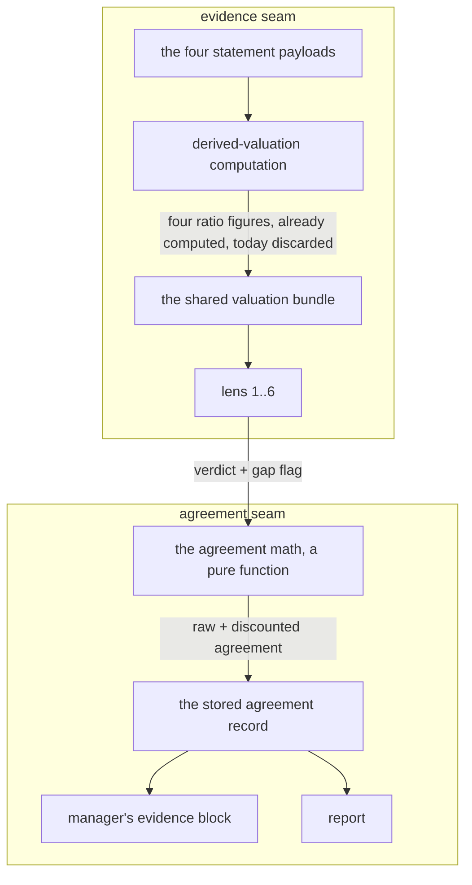

# FIX-1066: Trading-desk: lens pack is 4 of 6 and convergence ignores per-lens data gaps — Implementation Spec

## Part I — The Case *(for the human)*

### 1. Problem — why it matters, why now

The desk reads a stock through a panel of independent investor philosophies and reports how
much they agree. That agreement number is what the portfolio manager uses to decide how
confident to be, and confidence sets position size. Two things make the number read stronger
than the evidence behind it.

**The panel is four seats of an intended six**, and one of the four is the designated bear —
so the philosophical spread is narrower than designed, and a "they all agree" read is partly a
fact about who is in the room.

**A panel member who says out loud that it was missing the numbers it needed counts exactly as
much as one that had everything.** The report shows the gap, then averages it away.
Agreement produced by shared ignorance renders identically to agreement produced by evidence.

**Why now** — the stated blocker on the two empty seats is gone. The report is the thing a
person reads before risking money, and the failure direction that matters here is the one we
have: the number can only ever be too confident, never too cautious.

### 2. Solution in plain terms

Two changes to one signal.

**Agreement stops being a headcount.** A lens that flagged missing data counts for a fraction
of a seat when it sits with the majority. Dissent always counts in full. So the discount can
only ever pull the agreement number down, never push it up — muting a skeptic to manufacture
consensus is impossible by construction, not by care. The report shows both numbers: what the
headcount said, and what it says after the discount.

**The two empty seats get filled by fixing the evidence surface, not by wiring data to two new
lenses.** Four valuation figures the desk already computes — earnings yield, EV/EBIT, return on
invested capital, and PEG — are computed today and then thrown away before any lens sees them.
Putting them on the shared evidence bundle every lens reads fills the two seats *and* stops the
four existing lenses from flagging gaps for figures the desk was holding all along.

**Philosophy** — tenet 5 (one convergence point): the four figures get exactly one producer and
one renderer, so the two new lenses read the same numbers as the four old ones and there is one
place to change when the figures get sharper. Tenet 3 (earn every addition): the pack stays a
config array and the agreement math stays a pure function; nothing new is introduced beside them.
Tenet 7 (prove the goal, not the mock): the discount is arithmetic in a handler, unit-tested at
its boundaries — never an LLM's read of its own confidence.

### 6. Decisions & rules — the sign-off surface

1. **A lens that reported missing evidence counts for a fraction of a seat in the agreement
   number, and only when it agrees with the majority.**
   *Rejected:* excluding gap-flagging lenses outright (throws away a real read from a real
   philosophy), and a cosmetic "2 lenses had gaps" footnote (changes nothing about the number
   the manager acts on).
   *Locks in:* agreement is no longer a headcount, so the same evidence can produce a smaller
   suggested position than it did last month. The discount size becomes a number we have to be
   able to defend to a reader, and re-tuning it moves every future report.

2. **The discount is allowed to change the headline read — a "convergent" panel can become
   "mixed" — which pulls the suggested position size down.**
   *Rejected:* showing the discount but freezing the headline, so sizing is untouched.
   *Locks in:* well-founded calls on partially-thin data get sized smaller than they are today.
   We are choosing to under-size rather than to overstate agreement. Reversing it later means
   published reports change their sizing rationale.

3. **The two added lenses are fed by putting the four missing valuation figures on the shared
   evidence surface every lens reads, not by wiring data to the two new lenses.**
   *Rejected:* lens-specific data wiring for the two newcomers.
   *Locks in:* every lens sees the same figures — including the four we already ship, which stop
   flagging gaps for numbers we were holding. One place changes when the figures improve, so the
   panel can't split into lenses reading two different versions of the same company.

4. **The pack goes to the six the original design named — mechanical deep value and growth-at-a-
   reasonable-price — and we accept that three of six now read the business through a value
   frame.**
   *Rejected:* substituting a momentum or positioning lens for one of the two to widen the spread.
   *Locks in:* a "they all agree" read is partly a property of who we seated. Correcting for that
   by weighting philosophies is a separate, already-tracked piece of work; until it lands, the
   report has to say the panel is value-tilted rather than imply the spread is even.

5. **A cheap-preset report states that the panel did not run, instead of omitting the block.**
   *Rejected:* today's silent omission.
   *Locks in:* a reader can tell "nobody checked the philosophical spread" from "the philosophies
   agreed" — the two look identical today. Costs one line of chrome on every cheap report.

6. **Ships as two pull requests: the agreement-honesty fix first, the pack expansion second.**
   *Rejected:* one change.
   *Locks in:* the honesty half reaches readers even if the valuation-proxy work it depends on
   slips. Two reviews instead of one.

> **Non-goals** — no new data provider, feed, or paid entitlement (the epic's fence). No change to
> the determinism guarantee: agreement stays arithmetic in a handler, never a model output. Nothing
> here may raise a position size. No per-risk-profile or per-sleeve weighting of philosophies (that
> is FIX-776). No recomputation of reports already stored — the epic's forward-looking rule holds.
> The cheap preset still skips the panel; only the disclosure changes.
>
> **Size:** Large — 12 production files · 14 test behaviours · 2 documentation surfaces · 2 PRs.

---

### 3. Tradeoffs & alternatives

**Alternative: make the panel weight itself.** Ask each lens how much its gap should cost and
average that in. Rejected — it hands a number the manager sizes on back to the model that
produced the opinion, which is exactly what the determinism rule exists to prevent, and a lens
with a thin read has every incentive to say the gap didn't matter.

**The simpler approach: surface the gaps harder and leave the math alone.** Genuinely tempting —
the report already prints each lens's gap, and a bolder treatment costs almost nothing. It is
insufficient because the *number the manager sizes on* is unchanged, and that number is the one
that reaches the decision. Making the reader do the discount by eye is how the current version
already fails.

**Where the complexity is:** not the arithmetic. It is the direction of the discount. The obvious
implementation — weight every lens by whether it flagged a gap, over a weighted total — quietly
*raises* agreement when the gap-flagging lens is the dissenter, because muting a skeptic makes the
rest look unanimous. That is the exact failure this change exists to prevent, arrived at from the
other side. §7 and §10 are mostly about making that impossible rather than merely avoided.

The second cost is spend, and it is settled: six lenses instead of four is roughly half again as
much model cost on the expensive preset. The product owner has ruled per-run cost out as a
constraint at current volume — recorded here so it is not re-argued, not re-opened.

### 4. Focus practices (1–5)

1. **BP-030 (tolerate the old shape)** — the agreement summary is stored per report. New fields
   need defaults, or every report saved before this change fails to open. The report list is a
   product surface, not a cache.
2. **BP-020 (never fabricate; live paths never fall back)** — a gap flag is a lens telling the
   truth, and this change attaches a cost to telling it. Nothing in the prompt may reward staying
   quiet about a missing figure, and the four newly-exposed numbers must arrive labeled for what
   they are rather than as clean measurements.
3. **One convergence point (tenet 5)** — the four valuation figures get one producer and one
   renderer. A second copy assembled for the lens surface is how the panel ends up reading two
   different versions of the same company.
4. **BP-035 (second-path checklist)** — the paths a naive suite misses here are the cheap preset
   (panel skipped entirely), every lens flagging a gap, and no lens producing a verdict at all.

### 5. What using it looks like (1–5 examples)

*(This is app code, so the surface a person meets is the report and the manager's evidence block,
not a public API. Both are shown; the third example is the config-edit guarantee the issue asks us
to preserve.)*

**What the manager reads — before / after** *(what this spec proposes; today there is no second line):*

```
before  Read: CONVERGENT · majority bullish · agreement 100% · netLean +0.68
after   Read: MIXED · majority bullish · agreement 75% · netLean +0.53
        Headcount agreement was 100%; discounted to 75% — 2 of the 4 agreeing
        lenses reported missing evidence. The discount lowers agreement only,
        never raises it.
```

**What the reader sees on a cheap report** *(today the block is simply absent):*

```
after   Lens pack — not run at this cost preset. No philosophical spread was checked.
```

**Adding a lens stays a config edit** *(unchanged guarantee, shown because the issue asks for it):*

```ts
// the pack config array — one entry per lens
{ id: "garp", label: "GARP", attribution: "…documented methodology", … }
// plus its id in the lens id list
```

## Part II — The Build Plan *(for the implementing agent)*

### 7. Technical design

Two independent seams. The agreement seam is the pure math function and the record it writes; the
evidence seam is the shared valuation bundle every lens generator already receives.



- **The agreement math** (`agents/lenses/convergence-math.ts`) gains the discount. It stays pure,
  stays the single source of the number, and stays free of any runtime import.
- **The stored agreement record** (`agents/lenses/lens-convergence-resource.ts`) gains the
  pre-discount figure and the list of gap-flagging lens ids, so the report and the manager's
  block can both show the discount rather than assert it. New fields default (BP-030).
- **The verdict-to-record projection** (`agents/lenses/writer.ts`) already recovers each lens's
  gap text from its committed memo. It gains one derived boolean; it does not gain a new source.
- **The shared valuation bundle** (`lib/valuation-spine.ts` + its resource) carries the four
  figures with their proxy labels intact. The producer already computes them at spine time and
  drops them on the floor; this keeps them. The renderer gains a block.
- **The pack config** (`agents/lenses/lenses.ts`) and the id/agent registry gain two entries each.
- **Untouched:** the determinism guarantee (still a handler), the lens independence guarantee
  (each lens still reads only the shared bundle plus its own persona), the cheap-preset cost gate,
  the verdict output schema, and the direction of every sizing effect.

**Sketch — pseudocode. Illustrative, not the contract. React to the shape.**

```
weight of a verdict:
    1                          if it reported no missing evidence
    1                          if it dissents from the majority   ← the whole safety property
    GAP_WEIGHT (< 1)           otherwise

majority stance:  unchanged — modal count over raw verdicts, ties → neutral

raw agreement        = (count on the majority stance)          / N
discounted agreement = (sum of weights on the majority stance) / N     ← denominator stays N
directional lean     = sum(sign × conviction × weight)         / N

classification reads the DISCOUNTED number          (decision 2)
the record carries both, plus which lenses flagged  (so the report can show the discount)
```

The safety property is structural, not a rule anyone has to remember: the denominator never
shrinks and only majority-side terms are ever scaled down, so no gap flag anywhere can raise
agreement or lengthen the lean. That is the invariant §10 pins.

What this asks a reviewer: *is discounting only the majority side the right shape, or should a
gap-flagging dissenter also count for less — and if so, how do you keep that from manufacturing
consensus?* The choice of a single constant over a per-lens graded weight is the second question;
graded weights buy precision the inputs don't have.

### 8. Implementation sequence

**PR a — the agreement half.** Independent; depends on nothing.

1. **Discount the agreement math.** Add the weight rule and the pre-discount figure to the pure
   function. Nothing reads the new field yet. *Test:* the §10 boundary set, including the
   monotonicity invariant. *Depends on:* nothing.
2. **Widen the stored record**, defaults-first so an existing report still opens, and project the
   gap flag in the verdict-to-record step. *Test:* an old stored shape parses; a lens with gap text
   and one with a missing-data list both flag. *Depends on:* 1.
3. **Say it in the manager's evidence block** — the raw figure, the discounted figure, how many
   agreeing lenses flagged, and that the discount is one-directional. *Test:* the block renders
   both numbers and suppresses cleanly when the panel did not run. *Depends on:* 2.
4. **Say it in the report** — the convergence strip and the summary card show the discount;
   per decision 5, a cheap-preset report renders a one-line "not run at this preset" note where
   the block would be. *Test:* discounted and undiscounted reports, and the cheap-preset note.
   *Depends on:* 2.

**PR b — the pack half.** Depends on PR a landing (shared record) and on FIX-1064 (§12).

5. **Keep the four figures.** Carry earnings yield, EV/EBIT, ROIC and PEG — each with the proxy
   label its producer already attaches — onto the shared valuation bundle and its stored schema
   (defaults-first again), and render them in the bundle's prompt block. **Remove** nothing yet;
   the analyst-side rendering of the same figures stays until step 7. *Test:* a bundle with all
   four, with none, and one carrying a proxy label. *Depends on:* nothing in PR a.
6. **Seat the two lenses.** Two pack entries, two id/agent registry entries, two badge identities,
   and the phase group's agent list. *Test:* the pack/id-list agreement guard and the memo-step
   coverage guard both pass at six; each new lens's declared data needs are actually present on
   the bundle. *Depends on:* 5.
7. **Remove the duplicate figure path.** The analyst-side computation of the same four figures now
   has a second producer feeding the same numbers to different readers. Collapse to the one on the
   bundle if and only if the analyst's rendering is genuinely identical; if it isn't, say why in
   the PR rather than leaving two silent copies. *Depends on:* 6.

**PR plan.**

| sub-PR | deliverables | depends_on |
|---|---|---|
| a | gap-aware agreement math, stored record, manager block, report disclosure, cheap-preset note | — |
| b | four valuation figures on the shared bundle, pack to six, duplicate-path removal | a |

### 9. Edge cases & error handling

| Case | Expected |
|---|---|
| Every lens flags a gap | Agreement is discounted across the board; it does not floor to zero, and the majority stance is unchanged |
| The only gap-flagging lens is the dissenter | Nothing changes — raw and discounted agreement are equal. This is the case that proves the safety property |
| No lens produced a verdict (all errored) | Today's neutral/divergent shell, with the new fields at their defaults. No throw |
| A lens has gap text but an empty missing-data list, or the reverse | Either alone flags the lens — the two fields are one signal expressed two ways |
| A report stored before this change is re-opened | Parses; the new fields fill to defaults and the report shows the old, undiscounted read without claiming it was discounted |
| Cheap preset | Panel skipped as today; the report says so (decision 5) rather than omitting the block |
| A valuation figure is unobserved | Renders as unavailable on the bundle, exactly like every other figure there. A lens that needed it flags a gap and is discounted — the loop closes correctly |
| An unlabeled proxy figure reaches a lens | Must not happen — the label rides with the value. This is why FIX-1064 sequences first (§12) |

**Taxonomy:** every path here is non-fatal. A missing figure degrades to unavailable, a missing
verdict is skipped, a legacy record fills defaults. There is no new fatal path.

### 10. Testing strategy

**Goal:** run a real analysis at the expensive preset on a fixture ticker and read the machine-
readable run summary: six lens memos published, and the stored agreement record carrying a
discounted figure that is less than or equal to the raw one. Use the headless two-step in the
trading-desk guide (`fsdev run` + the zero-model summary read), not a browser.
`goals/trading-desk-lens-pack/six-lenses-gap-discounted/`.

**CI specs** (the behaviours, not the test names):

- **one behaviour per decision in §6**, in observable terms — what the record and the rendered
  block say, not how the weight is computed
- **the invariant that is easy to state wrongly**: no gap flag on any lens, in any position, can
  raise the discounted agreement above the raw agreement or lengthen the directional lean. Assert
  it as a comparison across the two figures on the *same* verdict set, not as a fixed expected
  number — pinning a number tests the constant, and the constant is a dial
- **the classification boundaries, re-pinned on the discounted number** — the existing inclusive
  thresholds are the intent-encoding test and they now read a different input
- **the majority stance and the tie-break are unchanged** by any gap flag — direction is decided
  on raw counts; only the strength of agreement is discounted
- **the second path** (BP-035): the cheap preset, every-lens-flagged, and zero-verdict cases
- **what must not change**: a verdict set with no gaps produces byte-identical numbers to today
- **the pack guards at six**: pack ids match the id list in order, and every seated lens is placed
  in the run

**Discipline:** `tdd`. The seam is the pure agreement function plus the stored record's schema —
both reachable from a vitest spec with no runtime, so every behaviour above is a tracer bullet.

### 11. Documentation plan

- **EXTEND** `labs/trading-desk/CLAUDE.md` — the lens-pack paragraph under "Portfolio-aware
  analysis + lens pack" and the convergence sentence under "Summary view". Both currently state
  the pack is four and the math is equal-weight; both become wrong with this change. Say what the
  discount does and, explicitly, that it is one-directional. Also record the value tilt from
  decision 4 so a future reader doesn't have to infer it from the pack list.
  *Voice risk:* this is an internal guide, so precision beats warmth; do not smooth "discount" into
  "adjustment".
- **No `apps/docs` change.** The trading desk is a lab app, not a documented framework surface;
  nothing here changes a public package API.
- **Changeset:** internal-only (`--empty`) — the package is private (BP-022).

### 12. Dependencies, open questions & follow-ups

**Dependencies:**

- **FIX-1064 blocks PR b.** It sharpens the same four figures this change exposes — flat-tax ROIC,
  operating-income EV/EBIT, revenue-growth PEG. Shipping the exposure first would put blunt
  proxies in front of two lenses whose entire methodology is those ratios, which is the epic's
  theme-2 failure exactly. **PR a does not depend on it** and should not wait.
- **FIX-1063** sequences ahead of FIX-1064 (it changes the nullability of the fields this math
  consumes). Transitive only; nothing here reads those payloads directly.
- **FIX-705 has landed.** The issue text says its landing removed this issue's blocker. That is
  half right and is corrected here: the *stated* blocker (statement completeness) is gone; the
  *operative* one — that the four ratios never reach the lens surface — is what §8 step 5 fixes.
  This issue extends FIX-705; it does not duplicate it.

**Open questions:** none. The one genuinely live fork — whether the discount may change the
headline read and therefore position size — is decision 2, asked in full on the spec PR.

**Follow-ups (flagged, not built):**

- **FIX-776** owns per-risk-profile weighting of the panel. Decision 4 accepts a value-tilted pack
  until it lands; reconcile the weighting schema with the record shape here, don't merge the work.
- **Deepening:** the four valuation figures currently have two renderers (the analyst-side block
  and, after this change, the shared bundle). §8 step 7 collapses them if they are genuinely
  identical; if they aren't, that divergence is worth a follow-up via
  `improve-codebase-architecture` rather than a silent second copy.

---

## Spec evolution

- **Spec drafted** — framed as one signal reading stronger than its evidence; chose a
  majority-side-only discount whose safety property is structural rather than a rule, and filled
  the two empty lens seats by putting four already-computed valuation figures on the shared
  evidence surface instead of wiring data per lens; split into two PRs so the honesty half does
  not wait on the valuation-proxy work.
