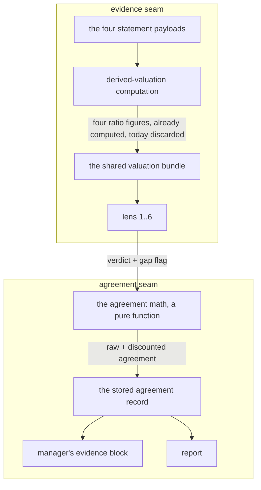

# FIX-1066: Trading-desk: lens pack is 4 of 6 and convergence ignores per-lens data gaps — Implementation Spec

## Part I — The Case *(for the human)*

### 1. Problem — why it matters, why now

The desk reads a stock through a panel of independent investor philosophies and reports how
much they agree. That agreement number is what the portfolio manager uses to decide how
confident to be, and confidence sets position size. Three things make the number read stronger
than the evidence behind it.

**The panel is four seats of an intended six**, and one of the four is the designated bear —
so the philosophical spread is narrower than designed, and a "they all agree" read is partly a
fact about who is in the room.

**A panel member who says out loud that it was missing the numbers it needed counts exactly as
much as one that had everything.** The report shows the gap, then averages it away.
Agreement produced by shared ignorance renders identically to agreement produced by evidence.

**One seat is occupied by a member that has never changed its mind.** The panel's designated
bear returns a negative read every time we have a record of, and the agreement number treats
that permanent vote as if it were an independent opinion formed on this company. So the number
partly measures a fact about our roster rather than a fact about the stock — and the one thing
the panel could tell us that nothing else can, a bear that turns constructive, is worth exactly
as much as any other vote.

**Why now** — the stated blocker on the two empty seats is gone. The report is the thing a
person reads before risking money, and the failure direction that matters here is the one we
have: the number can only ever be too confident, never too cautious.

### 2. Solution in plain terms

Three changes to one signal. All three move it the same way — **a weakness in the evidence, or
in the panel, must make the desk less sure. It must never make the desk more directional.**
That one sentence is the safety property this whole spec is built to hold, and §10 pins it with
the counterexamples that break it rather than with a claim that it holds.

**Agreement stops being a headcount.** A lens that flagged missing data counts for a fraction
of a seat when it sits with the majority. Dissent always counts in full. So the discount can
only ever pull the agreement number down, never push it up — muting a skeptic to manufacture
consensus is impossible by construction, not by care. The report shows both numbers: what the
headcount said, and what it says after the discount.

**The discount touches how sure the desk is, and nothing else.** It moves the agreement number
and the headline read. It deliberately does **not** touch the directional lean, because
discounting one side of a lean *lengthens* it — the desk would come out of a thin-evidence run
pointing harder in one direction than it went in. That is the same failure as the original bug,
reached from the other side.

**What this spec does not do, said up front.** The product owner's rule for the permanent bear is:

> A bear having something bad to say doesn't mean much, them having something positive to say
> means a lot.

Today the panel asks the skeptic which way it points, and it always points the same way, so its
vote carries a constant with no information in it. **This spec does not fix that**, and says so rather than implying otherwise: making the
bear's rare good news readable needs the lens to emit a number that means "how much did I find",
which it does not today. That is [FIX-1114](https://linear.app/fixpoint-labs/issue/FIX-1114).
What this spec does is stop the panel *overstating* agreement — the skeptic keeps its ordinary
vote, and the honesty work below is about the aggregate, not about the bear's signal.

**And what sets position size stops being the same number as the headline.** The card still says
what the whole panel thought, skeptic included — that is one question with one answer, and the
skeptic's dissent is information, not noise. But the desk also computes the same read *without* the
skeptic, and **sizes on whichever of the two is more cautious.** That catches the skeptic lowering
confidence in both of the ways it can: by disagreeing with the others, and by agreeing with them
and thereby making a thin consensus look solid.

**What that does and does not promise.** The skeptic can lower the agreement signal and never raise
it. It does **not** bound the position size that results — the portfolio manager reads the signal as
qualitative guidance and writes the number itself, with no deterministic cap on the way out. The cap
that closes that is FIX-1065's, already approved (§6, §12). Saying so plainly matters: four review
rounds of this spec each closed a different route from this feature to the size, and the accurate
statement is that a clamped signal is not a bounded outcome.

The lens's methodology is untouched throughout. It still only looks for what is wrong.

**The two empty seats get filled by fixing the evidence surface, not by wiring data to two new
lenses.** Four valuation figures the desk already computes — earnings yield, EV/EBIT, return on
invested capital, and PEG — are computed today and then thrown away before any lens sees them.
Putting them on the shared evidence bundle every lens reads fills the two seats *and* stops the
four existing lenses from flagging gaps for figures the desk was holding all along. **That
exposure is now FIX-1064's work, not this issue's** (§8, §12) — it lands before the two lenses are
seated so they never read a blunt proxy.

**Philosophy** — tenet 5 (one convergence point): the four figures get exactly one producer and
one renderer, so the two new lenses read the same numbers as the four old ones and there is one
place to change when the figures get sharper. Tenet 3 (earn every addition): the pack stays a
config array and the agreement math stays a pure function; nothing new is introduced beside them.
Tenet 7 (prove the goal, not the mock): the discount is arithmetic in a handler, unit-tested at
its boundaries — never an LLM's read of its own confidence.

### 6. Decisions & rules — the sign-off surface

1. **A lens that reported missing evidence counts for a fraction of a seat in the agreement
   number, and only when it agrees with the majority.**
   *Rejected:* excluding gap-flagging lenses outright (throws away a real read from a real
   philosophy), and a cosmetic "2 lenses had gaps" footnote (changes nothing about the number
   the manager acts on).
   *Locks in:* agreement is no longer a headcount, so the same evidence can produce a smaller
   suggested position than it did last month. The discount size becomes a number we have to be
   able to defend to a reader, and re-tuning it moves every future report.

2. **The discount is allowed to change the headline read — a "convergent" panel can become
   "mixed" — which lowers the sizing signal the desk hands the portfolio manager.**
   *Rejected:* showing the discount but freezing the headline, so the signal is untouched.
   *Locks in:* well-founded calls on partially-thin data present a weaker conviction signal than
   they do today. **What that signal produces is not guaranteed here** — the portfolio manager
   reads "mixed" as qualitative guidance and writes the position size itself, with no
   convergence-based cap on the way out (the consumer trace is in §3). So this decision buys a
   more honest input, not a smaller number; the enforced ceiling is FIX-1065's decision 6b (§12).
   Reversing it later means published reports change their sizing rationale.

3. **The discount applies to the agreement number and the headline read ONLY. The directional
   lean keeps today's equal-weight formula, untouched.**
   *Rejected:* discounting the lean as well — which was this spec's original design, and it is
   wrong. Reducing only the majority side's terms *lengthens* the lean: two thin bullish reads
   against one firm bearish read move from −0.267 to −0.300 once the thin pair is discounted.
   A data gap would make the desk **more** directional, which is the exact inversion this change
   exists to prevent.
   *Locks in:* the two numbers now answer two different questions — the agreement number says how
   sure the panel is, the lean says which way it points, and only the first responds to evidence
   quality. A reader who expects a thin-data run to show a shorter lean will not see one. That
   asymmetry is deliberate and has to be stated on the report, not left to be inferred.

4. **The two added lenses are fed by putting the four missing valuation figures on the shared
   evidence surface every lens reads, not by wiring data to the two new lenses.**
   *Rejected:* lens-specific data wiring for the two newcomers.
   *Locks in:* every lens sees the same figures — including the four we already ship, which stop
   flagging gaps for numbers we were holding. One place changes when the figures improve, so the
   panel can't split into lenses reading two different versions of the same company.

5. **The pack goes to the six the original design named — mechanical deep value and growth-at-a-
   reasonable-price — and we accept that three of six now read the business through a value
   frame.**
   *Rejected:* substituting a momentum or positioning lens for one of the two to widen the spread.
   *Locks in:* a "they all agree" read is partly a property of who we seated. The report has to
   say the panel is value-tilted rather than imply the spread is even.

6. **A cheap-preset report states that the panel did not run, instead of omitting the block.**
   *Rejected:* today's silent omission.
   *Locks in:* a reader can tell "nobody checked the philosophical spread" from "the philosophies
   agreed" — the two look identical today. Costs one line of chrome on every cheap report.

7. **The skeptic stays an ordinary voting member of the pack. Reporting *how much* it found is
   split out to [FIX-1114](https://linear.app/fixpoint-labs/issue/FIX-1114).**
   *Rejected:* reinterpreting the existing `conviction` field as "how much the lens found". The
   producer does not promise that. `lens.prompt.md` defines `conviction` as *"how strongly THIS
   methodology lands on **that stance**"* — it is stance-conditional, so a bullish verdict at 0.9
   means a strong positive read, and reading it as intensity would report that as a large amount
   of skepticism found. **The mapping inverts in exactly the case the feature exists to surface**,
   and measuring the historical distribution cannot repair a semantics mismatch. Getting this right
   needs a real output the lens actually emits — a schema and prompt change — which is a different
   kind of work from re-weighting an aggregate, and is why it is now its own issue.
   *Also rejected:* **softening the lens so it can return bullish.** What would make a forensic
   skeptic bullish is the *absence* of red flags, and absence of evidence of accounting trouble is
   weak evidence of quality. A softened skeptic asserting "this looks like a good buy" claims
   something its methodology cannot support — the fabrication failure this epic removes everywhere
   else — and it costs the pack the one thing that lens is for.
   *Locks in:* this spec does **not** deliver the owner's "good news from the bear means a lot"
   rule. It makes the aggregate honest and leaves that signal unreadable, exactly as today, until
   FIX-1114 lands. Said plainly so nobody reads the discount as having solved it.

8. **Exactly one aggregate is published as the headline, and it is the FULL pack with the skeptic
   counted.** Classification, majority stance, agreement, lean, and the dissenter list all come
   from that one computation — they are never mixed across two member sets.
   *Rejected:* publishing the methodology-lenses-only aggregate, or splitting the tuple so that
   agreement and lean come from one member set while majority stance and dissenters come from
   another. Both produce a self-contradictory card. Verified against the consumers rather than
   assumed: `formatLensConvergence` renders all five fields as **one sentence** in the PM's prompt
   (*"Read: MIXED · majority bearish · agreement 83% · netLean −0.55"*), and both the summary block
   and the hero strip render the same tuple in one pill while annotating each per-lens cell from
   `dissenters`. Splitting the tuple means the skeptic's own cell is rendered from a member set it
   is not in, so it can never show as dissenting no matter what it said. Codex's case makes the
   contradiction concrete — three bullish and two bearish methodology lenses plus a bearish
   skeptic: the full pack ties (majority neutral) while the lens-only read is bullish. Two
   different answers to "what did the panel think", and only one may reach the reader.
   *Locks in:* "the panel" means the whole panel, including the skeptic, and the skeptic's dissent
   stays visible as dissent. The permanent bear therefore still drags the headline — accepted,
   because that error points the safe way and because the alternative is a card that argues with
   itself.

9. **A separate, explicitly labelled sizing figure is the conservative of both member sets. It is
   not a headline and is never rendered as one.**
   *Rejected:* letting the headline drive sizing directly. Removing a dissenter mechanically raises
   the majority fraction, so a lens-only headline would take agreement from 0.833 to 1.000 when the
   skeptic is the only bear (§3) — decision 1's failure arriving through membership instead of
   through the discount. Computing both and sizing on the lower one catches the skeptic lowering
   confidence **two different ways**: by dissenting (visible in the full pack) and by being removed
   to reveal that the methodology lenses were less agreed than the skeptic's agreement made them
   look — a 4-bear/1-bull pack with a bearish skeptic reads 83% full but 80% lens-only, and 80% is
   the figure the sizing rule reads.
   *Locks in:* the report carries one headline plus one lower number labelled as a sizing floor,
   and the PM's sizing rule must read the floor rather than the headline. That is one more number
   on the card. **The guarantee it buys is that the signal never goes up — not that the position
   doesn't**; nothing here caps `targetWeightPct` (§3, §12).

9a. **A panel that mostly failed cannot report agreement. Below a quorum of methodology verdicts
    the aggregate is `null` — suppressed, not zero — and the desk states that the panel did not
    reach quorum instead of quoting a figure, regardless of what the survivors said.**
    *Rejected:* today's implicit behaviour, which fails open and fails **upward**. If every
    methodology lens errors and only the skeptic publishes, the aggregate is a single-member set:
    agreement `1/1 = 1.000`, classification **convergent** — near-total panel failure becomes the
    strongest robustness signal the desk can hand the sizer. One methodology lens plus the skeptic
    scores 0.000/divergent by accident of the tie-break rather than by design. Neither is a
    judgement about the company.
    *Locks in:* the quorum is **a strict majority of the SEATED methodology lenses** — not an
    absolute count. An absolute (*"at least two verdicts"*) is the same defect as the old `>= 0.8`
    threshold: it was derived against a four-seat pack and stops meaning the same thing when the
    pack grows. At six seats it lets a mostly-failed panel report full convergence — the skeptic
    and three methodology lenses error, the surviving two agree, and `2/2 = 1.000` **convergent**
    would be quoted as a genuine reading, exactly what this decision exists to prevent. A majority of seated is
    2-of-3 at four seats (unchanged from what was derived there) and 3-of-5 at six.
    Reports on a badly degraded run say the panel did not reach quorum instead of quoting a
    number, and a lone read is shown separately rather than promoted into an aggregate. A run that
    would have quoted a figure now sometimes declines to.

    *The representation is part of the decision, not an implementation detail.* Below quorum the
    aggregate figures are **`null`**, and the record carries an explicit reason for the absence.
    **Zero is not available as the sentinel**: `agreementScore: 0` already means "no lens shares
    the majority stance", which is a genuine finding about a genuinely split panel, and reusing it
    for "we could not assemble a panel" makes total disagreement indistinguishable from total
    failure — and quietly violates this decision's own "quote no figure" rule, since the
    formatter would print `agreement 0%`. This is the same three-state problem
    [FIX-1063](https://linear.app/fixpoint-labs/issue/FIX-1063) solves for unobserved payloads,
    and it is solved the same way: **an absence is `null`, never a value inside the domain** —
    "we did not measure it" is not a fourth trend, and "the panel did not convene" is not an
    agreement score. Every consumer must handle the null branch explicitly (§7).

    *Constant re-check, prompted by this being the second time the defect appeared.* Every
    threshold in this spec was re-examined against "is this meaningful only at a stated `N`, and
    does `N` change here?":
    - `agreementScore >= 0.8` — **was defective**, fixed by decision 10 (unanimity).
    - `QUORUM_MIN = 2` — **was defective**, fixed here (fraction of seated).
    - the `>= 0.5` mixed boundary — safe: "at least half agree" means the same at any `N`.
    - `GAP_WEIGHT = 0.5` — safe, and worth stating why. Its *scalar* effect does shrink as the
      pack grows (one flagged lens on an otherwise unanimous pack gives 0.875 at four members and
      0.917 at six), but under decision 10 **any** gap flag on the majority puts agreement below
      1.0, so "convergent requires unanimity *and* zero gap flags" holds at every pack size.
      This is also the disproof of the old sign-off framing, and decision 11 carries it: the
      weight cannot decide whether a unanimous panel stops reading as convergent, because every
      weight below 1 does that.

9b. **The downward-only guarantee is scoped to a fixed pack. Seating the two new lenses is a
    one-time re-baselining that can move sizing either way, and is disclosed as such.**
    *Rejected:* claiming the guarantee as an absolute. It is false across PR b, and the arithmetic
    says so: two bullish and one bearish methodology lens with a bearish skeptic gives a sizing
    floor of **0%** at four lenses; add two bullish lenses and the same company reads **66.7%**.
    A pack where every methodology lens is bullish goes **75.0% → 83.3%**. No mechanism in this
    spec is at fault — the clamp compares two memberships *within* one pack and says nothing about
    the pack growing.
    *Also rejected:* capping the post-expansion floor at its pre-expansion value. That would freeze
    the panel's usefulness at its four-lens state permanently: five of six philosophies agreeing
    genuinely is stronger evidence than two of three, and a cap would discard the reason for
    seating the lenses at all.
    *Locks in:* PR b changes what identical evidence scores, in **both** directions — the same
    expansion drops the floor to 0% when the new lenses disagree with the incumbents. Reports
    either side of it are not comparable, and the release note and `CLAUDE.md` must say so. The
    per-run guarantee that survives is the one worth stating: **for a given pack, no mechanism in
    this spec raises the sizing floor above the full-pack reading.**

10. **The "convergent" threshold is recalibrated so it means the same thing at any pack size:
    unanimity among the counted lenses.**
    *Rejected:* keeping `agreementScore >= 0.8`. That constant means "unanimous" at four lenses
    (3/4 = 0.75 is mixed) but "at most one dissenter" at five or six (4/5 = 0.800 and 5/6 = 0.833
    both clear it). So seating the two new lenses would silently loosen the headline the whole
    spec is built to tighten, and a regression test written against a four-verdict fixture would
    keep passing. Every convergence test must run at the pack size the system will actually have.
    *Locks in:* "convergent" becomes rarer and harder to reach as the pack grows, which is the
    honest reading — six independent philosophies agreeing is a stronger claim than three doing
    so, and it should be priced that way. Reports that read convergent last month may read mixed
    on the same evidence.

11. **`GAP_WEIGHT` is `0.5` — a lens that flagged a gap counts as half a seat. This is a
    calibration setting, not a product decision, and §12 stops presenting it as one.**
    *Rejected:* leaving it as "some value below 1", which makes the implementer invent a number.
    *Also rejected — and this is the correction:* **the earlier justification for `0.5`, which
    said `0.9` "changes nothing a reader would notice" while `0.5` flips the headline.** That was
    true before decision 10 and is false after it. Once "convergent" requires unanimity, a
    unanimous pack with any gap flag scores below `1.0` at **every** weight below 1 — the
    motivating case reads `0.95` at `0.9` and `0.75` at `0.5`, and **both print MIXED**. The
    weight does not decide whether the headline changes; decision 10 does. It decides how far the
    scalar falls once it has.
    *The one headline transition the weight still controls, stated so it is not discovered later:*
    the mixed/divergent boundary at `0.5`, which only a **non-unanimous** majority can cross. Six
    lenses, four on the majority stance, all four flagged: raw `0.667`; at `w = 0.5` the discounted
    score is `2 / 6 = 0.333` → **divergent**, at `w = 0.9` it is `3.6 / 6 = 0.600` → **mixed**.
    That flip changes the pill on the card and the percentage in the manager's block, and it
    changes **nothing the desk does**: both the PM prompt and the formatter's sizing rule give
    MIXED and DIVERGENT the identical instruction ("pull toward a smaller target or hold"), so no
    sizing behaviour turns on which of the two prints. That is why the weight is not on the
    owner's sign-off surface (§12) — it is the implementer's to tune.
    *Locks in:* half a seat is the honest reading of the claim — a lens that says it lacked its own
    core metrics gave you something, but not a whole opinion. Re-tuning it later moves the
    discounted figure on every future report but cannot, by itself, take a panel from convergent to
    mixed or back. §10 pins comparisons rather than literals so the dial stays a dial.

12. **Ships as three pull requests: the agreement-honesty fix, the pack expansion, then the sizing
    floor and quorum guard.**
    *Rejected:* folding the sizing floor into the pack expansion. It changes what the portfolio
    manager sizes on and should not ride in on a diff that is mostly config entries.
    *Locks in:* the honesty half reaches readers even if the valuation work slips. Three reviews
    instead of one. **The threshold
    recalibration (decision 10) ships with PR a**, not PR b — it is wrong at every pack size today
    and waiting for the two new lenses would let a known-wrong headline ship twice.

> **Non-goals** — no new data provider, feed, or paid entitlement (the epic's fence). No change to
> the determinism guarantee: agreement stays arithmetic in a handler, never a model output. **No
> change to the lens's methodology, prompt reasoning, or disqualifiers** — decision 7 rejects
> softening the skeptic; it reports what it already finds, it does not look for different things.
> **No statistical weighting of a lens's stance** — the base-rate weighting first proposed is out
> (§3), and decision 7 is not a stance weight: it publishes one already-collected magnitude and
> feeds it into nothing. No
> per-risk-profile or per-sleeve weighting of philosophies (that is FIX-776). **No gap weighting in
> the lean formula** (decision 3) — decisions 3 and 8–9 touch the same numbers through disjoint
> mechanisms and must be read together (§7). No new lens beyond the two the original design named
> — no "optimist", no conservative/aggressive pair; appetite is already the risk mandate's axis and
> folding it into the panel would count the same stance twice. No recomputation of reports already
> stored — the epic's forward-looking rule holds. The cheap preset still skips the panel; only the
> disclosure changes.
>
> **What is actually guaranteed, stated narrowly — this claim has been wrong four times.**
> This spec clamps **the agreement signal**, downward, for a fixed pack: `min(full, lens-only)`,
> never above the full-pack reading (decision 9). That is the whole of it.
>
> It does **not** bound the resulting position size, and no longer claims to. The portfolio
> manager reads MIXED/DIVERGENT as *qualitative* sizing guidance, and `portfolio-manager/writer.ts`
> accepts the model's `targetWeightPct` with no convergence-based post-generation cap — so a
> clamped scalar proves nothing about the number that gets committed. Four earlier rounds each
> closed a different channel between this feature and the size; the accurate finding is that
> **nothing deterministically bounds the outcome at all**, which is not something this issue can
> fix by clamping harder.
>
> Two further limits, so the narrow claim is not read wider than it is: the guarantee is **per
> pack** — seating the two new lenses re-baselines it in both directions (decision 9b) — and the
> PM block *already* renders every verdict as `stance @ conviction`, a pre-existing exposure this
> spec neither creates nor closes (recorded on FIX-1114).
>
> **Where it does get bounded: FIX-1065 decision 6b**, which is owner-approved and adds a
> per-preset maximum position size enforced in `clampTargetWeight` (§12). That is the deterministic
> cap, it is a sibling in this epic, and building a second one here would give the desk two
> competing size gates.
>
> **Size:** Large — 17 production files · 22 test behaviours · 2 documentation surfaces · 3 PRs.
> (Up from 14/19 in revision 7: the two projection guards and the PM prompt, per §7's derived
> consumer table. The count is an estimate that has moved every time the consumer search was
> re-run — the property in §7 is the criterion, not this number.)

---

### 3. Tradeoffs & alternatives

**Alternative: make the panel weight itself.** Ask each lens how much its gap should cost and
average that in. Rejected — it hands a number the manager sizes on back to the model that
produced the opinion, which is exactly what the determinism rule exists to prevent, and a lens
with a thin read has every incentive to say the gap didn't matter.

**The simpler approach: surface the gaps harder and leave the math alone.** Genuinely tempting —
the report already prints each lens's gap, and a bolder treatment costs almost nothing. It is
insufficient because the *number the manager sizes on* is unchanged, and that number is the one
that reaches the decision. Making the reader do the discount by eye is how the current version
already fails.

**Where the complexity is:** not the arithmetic. It is the direction of the discount. The obvious
implementation — weight every lens by whether it flagged a gap, over a weighted total — quietly
*raises* agreement when the gap-flagging lens is the dissenter, because muting a skeptic makes the
rest look unanimous. That is the exact failure this change exists to prevent, arrived at from the
other side. §7 and §10 are mostly about making that impossible rather than merely avoided.

#### What the record actually says about the bear

The question that had to be settled before designing anything: **has the structural skeptic ever
returned a non-bearish verdict, and could it?**

*Has it?* The shared development store holds **two** runs, both at the cheap preset, so neither
produced a lens verdict at all. Four full-preset runs survive in captured run artifacts — AAPL and
NVDA, twice each. In all four, `forensic-skeptic` returned **bearish** (conviction 0.60, 0.65,
0.85, 0.85). So the owner's observation is not contradicted by anything we hold.

**It is also not established by it, and the honest answer is that we cannot measure this yet.**
Four runs over two tickers, in one market period, is not a base rate. Two further facts from the
same sample say why leaning on it would be a mistake:

- **`cycle-risk` is also bearish in 4 of 4** — the skeptic is not uniquely stuck, and a remedy
  aimed only at the skeptic would leave an equally constant member inside the aggregate.
- **Of 16 verdicts, 4 are bullish and every one is `macro-reflexive`.** The panel as a whole
  reads negative on this sample. That may be two expensive megacaps in one tape rather than a
  property of the lenses.

This is a finding to state plainly, not a gap to design around: **it is the reason this spec
takes no statistical remedy.** You cannot estimate what a positive read from the bear is worth
from zero positive reads, and a weight fitted here would be least stable precisely on the rare
verdict it exists to price. FIX-1112 is the measurement; it now blocks any weighting work, and
this spec deliberately does not wait for it because the fix it does take needs no corpus.

*Could it?* Nothing forbids it. The verdict schema accepts `"bullish"` from any lens, and no code
path clamps or rewrites a lens's stance. **But the lens has no criterion that would produce one.**
All four core principles, all four characteristic questions, and all four weights are
negative-detectors, and the `disqualifiers` field is documented as "what makes this lens pass
regardless of upside" — upside is explicitly not a route to a positive verdict. The shared prompt
reinforces it ("A bearish read from a structural-skeptic lens is information, not failure"), and
its sizing philosophy is "Default skeptical; the structural bear of the pack."

So the two diagnoses come apart cleanly: **this is not a stuck output — it is a lens whose only
route to non-bearish is the absence of negatives, which lands on *neutral*.** The stance channel
is nearly constant *by construction*, and that is the fact the remedy has to be built around.

**This is the whole justification for the design, so it is worth stating flatly.** A biased lens
and a lens that cannot vary need different fixes, and this is the second. Weighting a stance —
statistically or otherwise — assumes the stance carries information that is merely mis-scaled. It
does not: nothing in this lens's configuration could produce a bullish read on any company, so its
stance is close to a constant, and **you cannot re-weight a constant into a signal.** That rules
out base-rate weighting on grounds independent of the thin corpus. It also rules out waiting for
the bear to turn bullish, which is what a stance-flip channel would do — that channel would sit
dead indefinitely.

What is left is the magnitude. `conviction` varies while the stance does not, which is precisely
why the owner's *"how skeptical is it"* framing is the right question and *"let it be positive
sometimes"* is not: the first reads a field that already moves, the second waits on one that
cannot. Decision 7 follows directly, and so does the decision not to soften the lens — softening
would manufacture variance in the stance rather than read the variance we already have.

#### The number we already collect and then throw away

Every lens reports a `conviction` in 0–1, documented as "how strongly THIS methodology lands on
that stance." **For a lens whose stance never moves, that field already is "how much did you
find."** The desk collects the owner's number on every run today.

And then discards its most interesting range. The lean is
`Σ(stanceSign × conviction) / N`, and `stanceSign` pins a bearish read to the negative half: a
skeptic that went looking and found almost nothing scores −0.1, a small negative. It can never
cross zero, so "I found very little" and "I found a lot" differ only in how bearish the desk
becomes. The distinction the owner cares about is collected, then flattened.

**And the remedy that suggested itself does not survive its producer.** The tempting move is to read
that already-collected `conviction` as "how much the lens found" and publish it. But the prompt
defines the field as *"how strongly THIS methodology lands on **that stance**"* — stance-conditional.
For a bearish verdict, high does mean "found a lot". For the neutral and bullish verdicts **this
feature exists to surface**, it does not: a bullish 0.9 is a strong positive read, and reading it as
intensity would report it as a large amount of skepticism found. The mapping inverts precisely where
it matters, and no amount of distribution-measuring repairs a semantics mismatch.

That is why the signal is split to FIX-1114 rather than folded in here. It needs a field the lens
actually emits with a stance-independent meaning — a schema and prompt change, a different kind of
work from the aggregate arithmetic in this spec. Reinterpreting a field to mean something its
producer never promised is the "a field describing work that did not happen" failure this epic
exists to end.

#### Only one aggregate may be published, and it has to be the whole panel

The obvious next move — publish the methodology-lenses-only aggregate and put the skeptic beside it
— cannot be done, and the reason is in the consumers rather than in the math. `formatLensConvergence`
renders **one sentence** into the PM's prompt:

> `Read: MIXED · majority bearish · agreement 83% · netLean −0.55.`

…then lists each lens, annotating `(dissents from majority)` from the `dissenters` array, and closes
with the sizing rule. The summary block and the hero strip render the same five fields in a single
pill and outline each per-lens cell from the same array. So `classification`, `majorityStance`,
`agreementScore`, `netLean` and `dissenters` are consumed as **one claim about one group of lenses**,
in three places.

Publishing agreement and lean from one member set while majority stance and dissenters come from
another produces a card that argues with itself — and one concrete bug: the skeptic's own cell would
be rendered from a `dissenters` list computed over a set it is not in, so it could never show as
dissenting no matter what it said. Codex's case makes the contradiction visible at both pack sizes:

| Three bullish + two bearish methodology lenses + a bearish skeptic | Headline it would give |
|---|---|
| Full pack (6) | tie → majority **neutral**, agreement 0%, divergent |
| Methodology lenses only (5) | majority **bullish**, agreement 60%, mixed |
| Full pack (4-lens equivalent) | tie → majority **neutral**, agreement 0%, divergent |
| Methodology lenses only (3) | majority **bullish**, agreement 67%, mixed |

Two different answers to "what did the panel think." **The headline is the full pack** (decision 8):
"the panel" means the panel, and a skeptic that dissents should read as dissenting. The cost is that
the permanent bear keeps dragging the headline — accepted, because it errs the safe way.

*(That table also exposes a pre-existing wrinkle worth naming: on a tie, today's math sets
`majorityStance` to neutral and then computes agreement as the neutral count over `N` — which is
**0%**, with every lens listed as a dissenter. A 3–3 split is not total disarray, and six lenses tie
more easily than four. §9 pins the behaviour and §12 flags it; this spec does not redesign the
tie-break.)*

#### The sizing floor needs a clamp, or it reintroduces the bug

Sizing is a different question from the headline, and it is where the skeptic must not be able to
raise anything. Removing a member changes numerator *and* denominator, so it moves the aggregate in
whichever direction the removed member pointed — and the skeptic is nearly always the one pointing
against a bullish pack:

| Boundary case | Headline (full pack) | Lens-only | **Sizing floor** |
|---|---|---|---|
| All bearish, 4 lenses | 1.000 convergent | 1.000 convergent | 1.000 convergent |
| All bearish, 6 lenses | 1.000 convergent | 1.000 convergent | 1.000 convergent |
| Single dissent, 4 lenses | 0.750 mixed | 0.667 mixed | **0.667** mixed |
| Single dissent, 6 lenses | 0.833 mixed | 0.800 mixed | **0.800** mixed |
| **Skeptic is the only bear, 4 lenses** | 0.750 mixed | **1.000 convergent** | **0.750** mixed |
| **Skeptic is the only bear, 6 lenses** | 0.833 mixed | **1.000 convergent** | **0.833** mixed |
| **4 bull / 1 bear / skeptic neutral, 6 lenses** | 0.667 mixed | **0.800 mixed** | **0.667** mixed |
| **…same pack, skeptic bullish** | 0.833 mixed | 0.800 mixed | **0.800** mixed |
| **Skeptic props up the consensus: 4 bear / 1 bull + bearish skeptic, 6 lenses** | 0.833 mixed | 0.800 mixed | **0.800** mixed |
| **Gap case, 4 seats: 3 agreeing lenses, 2 of them flagged, skeptic dissents** | 0.500 mixed | 0.667 mixed | **0.500** mixed |

The middle column is the failure mode: used as the sizing input on its own it raises agreement in
four of ten cases, twice to "convergent" — decision 1's failure arriving through membership instead
of through the discount. **Taking the lower of the two removes every upward move in the agreement
signal**, at both pack sizes, including the case Codex raised.

*(Reachability, per §4 practice 5 — the last row was wrong for two revisions and is worked here.
A four-seat pack is three methodology lenses plus the skeptic. All three agree; two of them
flagged a gap; the skeptic dissents. Full pack: the three agreeing lenses carry `1 + 0.5 + 0.5 = 2`
over four members = **0.500**. Lens-only: the same two flags over three members = `2 / 3` =
**0.667**. Floor = 0.500. The row this replaces was labelled "2 of 4 agreeing lenses flagged",
which is a **unanimous four-member pack** and scores `(2 + 2×0.5) / 4 = 0.750` — the figure §5's
worked example uses — with no member left to produce a 0.667 lens-only reading. Neither number
in the row was reachable for the case it named, and §3 leans on that row to justify the clamp.)*

**The clamp applies to agreement only — the lean is not clamped, and not touched.** It was worth
checking whether the skeptic should leave the lean too, and the arithmetic says no. Exclusion moves
the lean in *both* directions depending on the pack, so no single rule makes it one-directional:

| Pack | Lean today (skeptic in) | Skeptic excluded |
|---|---|---|
| Five bullish at 0.8 + bearish skeptic at 0.85 | +0.525 | **+0.800** — more bullish |
| Three bullish at 0.8, two bearish at 0.7 + bearish skeptic at 0.85 | +0.025 | **+0.200** — more bullish |
| Five bearish at 1.0 + bearish skeptic at 0.0 | −0.833 | −1.000 — more bearish |

On the common shape — a bullish pack with the permanently-bearish skeptic dissenting — **excluding
it raises the lean**, which is the direction this spec forbids. Keeping today's formula changes the
lean by exactly zero, which is provably safe and is what decision 3 already committed to. So there
is one lean, computed over the full pack, unchanged by this issue.

Two rows of the agreement table show the clamp doing work in opposite directions, which is why both
member sets have to be computed rather than just picking one. In *skeptic is the only bear* the floor binds on the
**headline** (the skeptic's dissent is the cautious reading). In *skeptic props up the consensus* it
binds on the **lens-only** figure — the skeptic was agreeing, and removing it reveals the
methodology lenses were less unanimous than the headline suggested. A permanent bear can overstate
agreement simply by joining it, and only the second computation catches that. The last row shows the
clamp also stops the exclusion from undoing the gap discount.

#### The threshold means two different things at four lenses and six

Independently of any of the above, `convergence-math.ts` classifies on
`agreementScore >= 0.8`. That constant does not survive a change in pack size:

| Pack size | One dissenter | Reads as |
|---|---|---|
| 4 | 3/4 = 0.750 | mixed |
| 5 | 4/5 = 0.800 | **convergent** |
| 6 | 5/6 = 0.833 | **convergent** |

So "convergent" currently promises *unanimity* at four lenses and *at most one dissenter* at five
or six. Seating the two new lenses (PR b) would silently loosen the headline this spec exists to
tighten — and a regression test written against a four-verdict fixture would keep passing while it
happened. Decision 10 recalibrates to unanimity among the counted lenses, which means the same
thing at any size, and §10 requires every convergence test to run at the pack size the system will
actually have.

**Composition.** Decisions 3 and 8–9 touch the same numbers through disjoint mechanisms: the gap
discount applies to the agreement headcount and never to the lean; the skeptic change alters
membership and never applies a weight. Checked on the counterexample that started all this — two
thin bullish reads against one firm bearish read, no skeptic seated — the lean is **−0.267** under
the new math, unchanged.

**What this spec therefore does not do.** It makes the agreement number honest. It does not make
the bear's rare good news readable — that is FIX-1114, and until it lands the panel's most
informative event still renders like every other bearish vote.

The second cost is spend, and it is settled: six lenses instead of four is roughly half again as
much model cost on the expensive preset. The product owner has ruled per-run cost out as a
constraint at current volume — recorded here so it is not re-argued, not re-opened.

### 4. Focus practices (1–5)

1. **BP-030 (tolerate the old shape)** — the agreement summary is stored per report. New fields
   need defaults, or every report saved before this change fails to open. The report list is a
   product surface, not a cache.
2. **BP-020 (never fabricate; live paths never fall back)** — a gap flag is a lens telling the
   truth, and this change attaches a cost to telling it. Nothing in the prompt may reward staying
   quiet about a missing figure, and the four newly-exposed numbers must arrive labeled for what
   they are rather than as clean measurements.
3. **One convergence point (tenet 5)** — the four valuation figures get one producer and one
   renderer. A second copy assembled for the lens surface is how the panel ends up reading two
   different versions of the same company.
4. **BP-035 (second-path checklist)** — the paths a naive suite misses here are the cheap preset
   (panel skipped entirely), every lens flagging a gap, and no lens producing a verdict at all.
5. **Demonstrate a safety property, never assert one — and check worked examples for
   *reachability*, not just for arithmetic.** Every claim in this spec that something "can only
   move one way" is carried by a worked case in §3 or §9 and a regression test in §10. Separately,
   every illustrative number must correspond to a verdict set the system can actually produce: an
   earlier draft paired an 80% lens-only reading with a 100% full-pack reading, which no six-lens
   pack can generate, and fixtures built on it would have encoded an impossible stored state.
   An earlier version of this spec asserted the invariant in prose and was falsified by a
   three-verdict counterexample; the second candidate remedy was falsified the same way. Both now
   ship as named tests. If a future edit adds a claim of this kind with no worked case, that is
   the defect.

### 5. What using it looks like (1–5 examples)

*(This is app code, so the surface a person meets is the report and the manager's evidence block,
not a public API. Both are shown; the third example is the config-edit guarantee the issue asks us
to preserve.)*

**What the manager reads — before / after** *(what this spec proposes; today there is no second line):*

```
before  Read: CONVERGENT · majority bullish · agreement 100% · netLean +0.68
after   Read: MIXED · majority bullish · agreement 75% · netLean +0.68
        Headcount agreement was 100%; discounted to 75% — 2 of the 4 agreeing
        lenses reported missing evidence. The discount lowers agreement only,
        never raises it, and does not touch the lean: thin evidence makes the
        desk less sure, never more directional.
```

**Note the lean is unchanged.** That is decision 3, and it is the part most likely to be read as
a bug. Two numbers that used to move together now move independently, and the report has to say
which question each one answers.

**What the report shows when the skeptic is the lone dissenter** *(decisions 8–9 — one headline
from the whole panel, plus a separately labelled sizing floor):*

```
after   Read: MIXED · majority bullish · agreement 83% · netLean +0.48
        Sizing floor: 83% — the lower of the panel read (83%) and the same
        read without the structural skeptic (100%).
```

*(Reachability check, per §4 practice 5: the skeptic is the lone dissenter, so the full pack is
5/6 = 83% and the five methodology lenses are unanimous at 100%. Those two figures occur together
only in this configuration — a fixture pairing an 80% lens-only read with a 100% full-pack read is
impossible and would encode a state the system cannot produce.)*

One headline, from the whole panel (decision 8). The sizing floor is a separate labelled number and
is what the sizing rule reads (decision 9). **How much the skeptic found is not on this card** — the
panel still cannot say it (FIX-1114).

**What the reader sees on a cheap report** *(today the block is simply absent):*

```
after   Lens pack — not run at this cost preset. No philosophical spread was checked.
```

**Adding a lens stays a config edit** *(unchanged guarantee, shown because the issue asks for it):*

```ts
// the pack config array — one entry per lens
{ id: "garp", label: "GARP", attribution: "…documented methodology", … }
// plus its id in the lens id list
```

## Part II — The Build Plan *(for the implementing agent)*

### 7. Technical design

Two independent seams. The agreement seam is the pure math function and the record it writes; the
evidence seam is the shared valuation bundle every lens generator already receives.



- **The agreement math** (`agents/lenses/convergence-math.ts`) gains the discount **and** the
  recalibrated threshold, and the compute-twice-and-clamp shape. It stays pure, stays the single
  source of both numbers, and stays free of any runtime import. This is the only file the
  aggregate change touches.
- **The stored agreement record** (`agents/lenses/lens-convergence-resource.ts`) gains the
  pre-discount figure, the list of gap-flagging lens ids, and the separately labelled sizing
  floor, so the report and the manager's block can show the discount and the floor rather than
  assert them. New fields default (BP-030).
- **The verdict-to-record projection** (`agents/lenses/writer.ts`) already recovers each lens's
  gap text from its committed memo. It gains one derived boolean; it does not gain a new source
  and **no new generator field**.
- **The pack config** (`agents/lenses/lenses.ts`) gains two lens entries; the id/agent registry
  gains two entries.
- **Not this issue:** any per-lens baseline, level, deviation or intensity field. Those belong to
  FIX-1114 and must not be built here — an implementer who adds them is rebuilding the
  `conviction`-as-intensity semantics this spec rejected in decision 7.
- **Not this issue:** the four valuation figures on the shared bundle — FIX-1064 owns that now
  (§8, §12).
- **Untouched:** the determinism guarantee (still a handler), the lens independence guarantee
  (each lens still reads only the shared bundle plus its own persona), the cheap-preset cost gate,
  the verdict output schema, **the lens prompts and every lens's methodology** (decision 7 rejects
  softening), and the majority-stance/tie-break rule.
- **Deliberately changed:** what "convergent" means (decision 10) and which lenses the headline
  agreement number is computed over (decision 8). Both make the number harder to earn; neither can
  raise it.

**Sketch — pseudocode. Illustrative, not the contract. React to the shape.**

```
GAP_WEIGHT = 0.5                       (decision 11 — a pinned value, not a range)

weight of a verdict:
    1                          if it reported no missing evidence
    1                          if it dissents from the majority   ← the whole safety property
    GAP_WEIGHT                 otherwise

aggregate(members):                    ← a pure function of a MEMBER SET
    majority stance      = modal stance, ties → neutral
    raw agreement        = (count on the majority stance)          / |members|
    discounted agreement = (sum of weights on the majority stance) / |members|
    lean                 = sum(sign × conviction) / |members|      ← never gap-weighted (dec. 3)

compute it TWICE:
    full    = aggregate(every seated lens)              ← includes the skeptic
    lenses  = aggregate(every seated lens but skeptic)

THE HEADLINE — one tuple, one member set, never mixed:   ← decision 8
    classification, majorityStance, agreementScore,
    netLean, dissenters, verdicts   :=  ALL from `full`
    classification = agreement >= 1 → convergent         ← decision 10, unanimity
                     agreement >= 0.5 → mixed
                     else → divergent

THE SIZING FLOOR — a separate, labelled field:           ← decision 9, one-directional
    sizingAgreement = min(full.agreement, lenses.agreement)
    (never rendered as the headline; the PM's sizing rule reads THIS)

THERE IS EXACTLY ONE LEAN.                               ← decision 3
    netLean = full-pack, today's formula, skeptic included, never gap-weighted.
    No second lean is computed and no lean is clamped: this spec does not
    touch the lean at all. See §3 for why excluding the skeptic from it
    would be the UNSAFE choice.

QUORUM — checked FIRST, and it decides whether the rest exists: ← decision 9a
    quorumMet = reported methodology verdicts > seated methodology / 2
    (a FRACTION of the seated pack, never an absolute count — 2-of-3 at four
     seats, 3-of-5 at six. An absolute 2 lets 2-of-5 report 1.000 convergent.)

    when NOT met:
        agreementScore, sizingAgreement, netLean, classification,
        majorityStance                      :=  null      ← NOT 0, NOT "divergent"
        quorumState := { met: false, reported, seatedMethodology }
        verdicts    :=  the reads that did arrive, shown as individual reads

the record carries: the headline tuple (nullable), the sizing floor (nullable),
                    the quorum state, and which lenses flagged — each labelled
                    for what it is
```

**Null is the suppression state, and every consumer must branch on it.** `0` is unavailable as a
sentinel — `agreementScore: 0` already means "nobody shares the majority stance", a real finding
about a genuinely split panel, and today's tie-break produces exactly that on a 3–3 pack. Reusing it
for "the panel did not convene" makes total disagreement and total failure render identically, and
the formatter would print `agreement 0%` in direct violation of decision 9a. Same class of problem
as FIX-1063's zero-filled payloads, same resolution: **absence is `null`, never a value inside the
domain.**

**The completeness criterion is a property, not the list below.** Three revisions of this spec
named a subset of consumers and each subset was incomplete, so the rule is stated once and the
list is *derived* from it:

> **Every code path that reads the convergence record — including the ones that only test it for
> presence before passing it on — must handle the null-aggregate / `quorumState` shape. A path that
> gates on a field the suppression sets to `null` will drop a suppressed record entirely, which
> reports "the panel did not run" for a panel that ran and failed.**

That second sentence is the whole defect class. Two guards do exactly this today, and neither was
on any earlier list because both are *presence checks*, not renderers.

**Derive the list, don't trust it.** The list below came from
`grep -rn "lensConvergence\|LensConvergenceState" labs/trading-desk --include=*.ts --include=*.tsx`,
minus tests, then reading each hit to see whether it branches on an aggregate field. Re-run that
search before building PR c — if it returns a path not in this table, the table is stale and the
property above governs.

| Consumer | Today | Below quorum |
|---|---|---|
| `lib/format.ts` → `formatLensConvergence` (PM context) | returns `null` and suppresses the whole tag when `classification == null`; otherwise always emits `Read: … agreement N% …` | emits the quorum statement instead — no `Read:` line, no percentage, no sizing rule keyed to a number that does not exist. **The existing `classification == null` guard currently means "pack did not run"; it must stop being the only thing that guard can mean** |
| `agents/portfolio-manager/prompts/portfolio-manager.prompt.md:156-171` | instructs the model to read any present `<lensConvergence>` block as CONVERGENT / MIXED / DIVERGENT and adjust `targetWeightPct` | carries an explicit no-quorum instruction (§8 step 10); without it the model is told to produce a category from a suppressed aggregate and will invent one |
| `agents/portfolio-manager/writer.ts:390-397` | **projection guard** — mirrors the record onto the PM memo only when `classification != null`, else writes `null` | passes a suppressed record through. This guard feeds **both** the hero strip and the Summary card, so leaving it closed makes every downstream fix unreachable |
| `components/theses/pm-hero.tsx` → `LensConvergenceStrip` (hero) | renders the classification pill off the memo mirror | renders a "panel did not reach quorum" state; the pill is suppressed, not shown as `divergent` |
| `components/summary/aggregate.ts` + `report-summary.tsx` → `LensConvergenceBlock` (summary) | `buildReportSummary` reads `pm?.lensConvergence`; the card renders only when that is non-null | same suppression; the individual reads that arrived still render, labelled as individual reads rather than as a panel |
| `run-artifacts.ts:144-150,192-197` → `hasConvergence` | **projection guard** — `typeof lc.classification === "string"` drops the record from the machine-readable `runArtifacts` bundle | passes a suppressed record through, so the headless verification path (§10) and the eval suite can see quorum state at all. Today a below-quorum run is indistinguishable from a `fast`-preset run in `runArtifacts` |

The two rows marked **projection guard** are the ones a list-shaped criterion missed twice. Both
gate on `classification` — the exact field decision 9a sets to `null` — so the suppression state
they exist to preserve is the one state they erase.

The existing null-guard precedent in `formatLensConvergence` — it already returns `null` and
suppresses its whole tag when the pack did not run on the cheap preset — is the shape to extend, not
a new mechanism. **"Panel did not run" and "panel ran but did not reach quorum" are different
statements** and must read differently; collapsing them loses the fact that lenses errored.

**Three mechanisms touch these numbers and they are deliberately disjoint.** The gap discount
(decision 3) moves the agreement headcount and never the lean. The skeptic change (decisions 8–9)
moves membership and never applies a weight. The threshold (decision 10) reads the result and
changes no input. A reviewer who collapses any two of them into "weight the lens" reintroduces the
bug all three exist to prevent.

The safety property is structural, not a rule anyone has to remember, and it now has two halves:

- **The denominator never shrinks and only majority-side terms are ever scaled down**, so no gap
  flag anywhere can raise the agreement number.
- **The lean is never weighted and its membership never changes**, so nothing in this spec can
  lengthen it. This is the half the original design got wrong, and it is why the skeptic stays
  in `N` — dropping a member is a membership change, and a membership change moves the lean.

Those two together are the invariant §10 pins, on the two counterexamples that break them rather
than on a claim that they hold.

What this asks a reviewer: *is discounting only the majority side the right shape, or should a
gap-flagging dissenter also count for less — and if so, how do you keep that from manufacturing
consensus?* The choice of a single constant over a per-lens graded weight is the second question;
graded weights buy precision the inputs don't have.

### 8. Implementation sequence

**PR a — the agreement half.** Independent; depends on nothing.

1. **Discount the agreement math** at `GAP_WEIGHT = 0.5`, **and recalibrate the classification
   threshold to unanimity** (decision 10). Add the weight rule and the pre-discount figure to the
   pure function. Nothing reads the new field yet. The threshold ships here rather than with the
   pack expansion because it is wrong at every pack size today. *Test:* the §10 boundary set,
   including the monotonicity invariant and the one-dissenter case run at **four, five and six**
   members. *Depends on:* nothing.
2. **Widen the stored record**, defaults-first so an existing report still opens, and project the
   gap flag in the verdict-to-record step. *Test:* an old stored shape parses; a lens with gap text
   and one with a missing-data list both flag. *Depends on:* 1.
3. **Say it in the manager's evidence block** — the raw figure, the discounted figure, how many
   agreeing lenses flagged, and that the discount is one-directional. *Test:* the block renders
   both numbers and suppresses cleanly when the panel did not run. *Depends on:* 2.
4. **Say it in the report** — the convergence strip and the summary card show the discount;
   per decision 6, a cheap-preset report renders a one-line "not run at this preset" note where
   the block would be. *Test:* discounted and undiscounted reports, and the cheap-preset note.
   *Depends on:* 2.

**PR b — the pack half.** Depends on PR a landing (shared record) and on FIX-1064 (§12).

> **The step that used to be here is gone.** Putting the four valuation figures on the shared
> evidence surface is now [FIX-1064](https://linear.app/fixpoint-labs/issue/FIX-1064)'s decision
> 5, so the figures arrive already honest instead of being exposed blunt and sharpened afterwards.
> **This re-pointing is contingent on FIX-1064's spec (PR #1226) being approved as written** — if
> that decision is cut or changed in review, the step returns here and PR b regains its dependency
> on nothing. Verify before building: if FIX-1064 has not taken it, **both issues will build the
> same block.**

5. **Seat the two lenses.** Two pack entries, two id/agent registry entries, two badge identities,
   and the phase group's agent list. *Test:* the pack/id-list agreement guard and the memo-step
   coverage guard both pass at six; each new lens's declared data needs are actually present on
   the bundle that FIX-1064 shipped. *Depends on:* FIX-1064 landing.
6. **Confirm there is one figure path, not two.** FIX-1064 owns the shared-surface producer; the
   analyst-side computation of the same four figures may still exist. Collapse to the one on the
   bundle if and only if the renderings are genuinely identical; if they are not, say why in the
   PR rather than leaving two silent copies. *Depends on:* 5.

**PR c — the sizing floor and the quorum guard.** Depends on PR a (the record it extends).
Independent of PR b and of any measurement.

7. **Add the sizing floor and the clamp** (decisions 8–9): compute the aggregate over both member
   sets, publish the full-pack tuple as the headline and `min(...)` as a separately labelled sizing
   figure, and point the PM's sizing rule at the floor. Defaults-first so an existing report still
   opens. *Test:* the §10 clamp property plus the boundary set at four **and** six lenses.
   *Depends on:* PR a step 2.
8. **Add the quorum guard** (decision 9a) ahead of the aggregate, **and the representation it
   needs.** Three parts, and the first two are what make it buildable: widen the aggregate fields to
   nullable on the stored record (defaults-first, BP-030 — an existing report has no quorum state
   and must still open); add the `quorumState` field carrying met/reported/seated; then suppress
   the aggregate when quorum fails. **Do not write `0`** — §7 says why.
   *Test:* skeptic-only, one-methodology-plus-skeptic, and **two-of-five-seated** all produce a
   null aggregate rather than a number; a genuinely tied 3–3 pack still produces `0` and is
   distinguishable from a suppressed one. *Depends on:* 7.
9. **Open the two projection guards first, or every consumer fix below is unreachable.**
   `agents/portfolio-manager/writer.ts:390-397` and `run-artifacts.ts:144-150,192-197` both gate on
   `classification` being set — the field decision 9a nulls — so a suppressed record is currently
   converted to `null` before the hero and the Summary ever see it, and dropped from the
   machine-readable `runArtifacts` bundle. Change each guard to test what it actually means to
   test: **"was this resource ever written", not "does it carry a classification"** (the resource's
   own written marker, e.g. `quorumState != null`, in the `hasSpine` / `hasRewardToRisk` idiom
   already in that file). The empty-`{}` read these guards were written to catch must still read as
   absent — that is the behaviour they exist for and it must not regress.
   *Test:* a below-quorum record survives the PM memo mirror; the same record appears in
   `runArtifacts` with its quorum state; a never-written (`{}`) resource still projects to `null` in
   both. *Depends on:* 8.
10. **Teach the consumers the null branch** — `formatLensConvergence`, the hero strip, the summary
    card, **and the PM prompt** — per §7's table. The PM context must state the quorum shortfall
    instead of a `Read:` line, and must not carry a sizing rule keyed to a figure that does not
    exist.
    **The prompt is part of this step, not an implementation detail.**
    `agents/portfolio-manager/prompts/portfolio-manager.prompt.md:156-171` today tells the model
    that a present `<lensConvergence>` block *is* a CONVERGENT / MIXED / DIVERGENT read to size
    against; below quorum the block is present with no classification, so the model is instructed to
    produce a category it has not been given and will invent one. Add a no-quorum branch to clause
    10 that says both halves explicitly: **what the absence means** — the panel ran and too few
    lenses reported, so there is no panel read, and the individual reads that arrived are individual
    reads, not a panel — and **what to do about size** — set `convictionBasis` to the quorum
    shortfall in words, never to a classification, and size on the remaining evidence.
    **Reuse the desk's existing wording for this, do not coin a fourth spelling.** The same prompt
    already states the rule at lines 81-89: *absent, `unavailable`, or thin inputs are NON-evidence
    in BOTH directions — they may lower `decisionConfidence` or support abstention (hold / no-add),
    but may not be cited as affirmative support*, and *do not invent conviction from absence*. A
    failed panel is that rule's case, so the no-quorum branch should point at it in its language
    rather than inventing a parallel formulation. Note the asymmetry this preserves: a missing
    panel read may not size **up** (no invented convergence) and may not size **down** either (a
    failed panel is not a bearish signal) — it lowers confidence.
    *Test:* one assertion per consumer on a below-quorum record; one that "did not run" (cheap
    preset) and "did not reach quorum" render differently; and one on the prompt itself — the
    no-quorum branch is present and names neither `CONVERGENT`, `MIXED`, nor `DIVERGENT` as an
    available reading. *Depends on:* 9.

**PR plan.**

| sub-PR | deliverables | depends_on |
|---|---|---|
| a | gap-aware agreement math at `GAP_WEIGHT = 0.5` (agreement + classification only, lean untouched), **unanimity threshold (decision 10)**, stored record, manager block, report disclosure, cheap-preset note | — |
| b | pack to six, one-figure-path confirmation | a, FIX-1064 |
| c | sizing floor + one-directional clamp, quorum guard + its nullable representation, the two projection guards opened, every consumer taught the null branch (three renderers **+ the PM prompt**) | a |

### 9. Edge cases & error handling

| Case | Expected |
|---|---|
| Every lens flags a gap | Agreement is discounted across the board; it does not floor to zero, and the majority stance is unchanged |
| The only gap-flagging lens is the dissenter | Nothing changes — raw and discounted agreement are equal. This is the case that proves the safety property |
| **Two thin majority reads against one firm dissenter** | The lean is **unchanged** from today (−0.267, not −0.300). The EM counterexample; a regression test, not a note |
| **All six bearish, skeptic less convinced than the rest** | Lean unchanged at −0.833. Membership never changes, so the lean cannot lengthen |
| **Skeptic is the only bear** | Sizing agreement stays at the **full-pack** value, never the lens-only 1.000/convergent. Parameterised by pack size — 0.750 at four members, 0.833 at six — never hardcoded to one |
| **Pack expansion, same company** | The floor may move in **either** direction (decision 9b): 0% → 66.7% when the new lenses agree with the majority, 75.0% → 0% when they disagree. Pinned as a disclosed re-baselining, not as a violation |
| **4 bullish / 1 bearish / skeptic neutral — 6 lenses** | Sizing agreement stays **0.667**, not 0.800. Codex's case |
| **…same pack, skeptic bullish** | **0.800/mixed** — must not reach convergent. A softening skeptic may not unlock full sizing |
| **One dissenter at 5 or 6 lenses** | **mixed**, not convergent. Decision 10; today's `>= 0.8` gets this wrong at both sizes |
| Unanimous 6-lens pack, no gaps | convergent — the only way to reach it once decision 10 lands |
| The skeptic errored and produced no verdict | Channel omitted; both aggregates run on the lenses that did report. No default stance invented |
| **Only the skeptic produced a verdict** | **Insufficient quorum → aggregate is `null`.** Must **not** report 1.000/convergent off a one-member set, and must **not** write `0`. The lone read is shown as an individual read. No divide-by-zero on the empty lens-only set |
| **Below quorum vs a genuinely tied panel** | A 3–3 tie yields `agreementScore: 0` (a real finding); a below-quorum run yields `null` (an absence). The two must be distinguishable on the record **and** in all three renderings — this is the test that proves `0` was not reused as the sentinel |
| **Below quorum vs the cheap preset** | "The panel did not run" and "the panel ran and did not reach quorum" are different statements and render differently. Collapsing them loses the fact that lenses errored |
| **A stored report from before this change** | Has no quorum state; parses, and renders as it did — the nullable widening is defaults-first (BP-030) and must not make an old record look suppressed |
| **One methodology verdict + the skeptic** | Insufficient quorum → **the null/suppressed tuple** (`classification`, `agreementScore`, `sizingAgreement`, `netLean`, `majorityStance` all `null`; `quorumState.met: false`), never `divergent`. Today this lands on 0.000/divergent via the tie-break — a number that looks like a finding and is an accident of the tie-break, which is precisely why it must be suppressed rather than pinned |
| **Two methodology verdicts + the skeptic, 4 seats (3 seated methodology)** | Quorum met (2 ≥ 2); normal path |
| **Two methodology verdicts + the skeptic, 6 seats (5 seated methodology)** | **Quorum NOT met** (2 < 3) → **the null/suppressed tuple**, no figure quoted and no full sizing — never `divergent`. Naively this is `2/2 = 1.000 convergent`; the same verdict count is sufficient at four seats and insufficient at six, which is the point of a fraction |
| **Three methodology verdicts, 6 seats** | Quorum met (3 ≥ 3); normal path |
| **No lens produced a verdict (all errored)** | **The null/suppressed tuple** — zero reported verdicts cannot clear a quorum of any size, so this is the same branch as every other below-quorum case, not a separate shell. No `0`, no `neutral`, no `divergent`, and no divide-by-zero on the empty member set. No throw. (Revision 7 left this row on "today's neutral/divergent shell with the new fields at their defaults", which is the pre-suppression behaviour and contradicts decision 9a.) |
| A lens has gap text but an empty missing-data list, or the reverse | Either alone flags the lens — the two fields are one signal expressed two ways |
| A report stored before this change is re-opened | Parses; the new fields fill to defaults and the report shows the old, undiscounted read without claiming it was discounted |
| Cheap preset | Panel skipped as today; the report says so (decision 6) rather than omitting the block |
| A valuation figure is unobserved | Renders as unavailable on the bundle, exactly like every other figure there. A lens that needed it flags a gap and is discounted — the loop closes correctly |
| An unlabeled proxy figure reaches a lens | Must not happen — the label rides with the value. This is why FIX-1064 sequences first (§12) |

**Taxonomy:** every path here is non-fatal. A missing figure degrades to unavailable, a missing
verdict is skipped, a legacy record fills defaults. There is no new fatal path.

### 10. Testing strategy

**Goal:** run a real analysis at the expensive preset on a fixture ticker and read the machine-
readable artifacts: six lens memos published, and the stored agreement record carrying a
discounted figure that is less than or equal to the raw one. Use the headless two-step in the
trading-desk guide (`fsdev run` + a zero-model read-back), not a browser.
`goals/trading-desk-lens-pack/six-lenses-gap-discounted/`.

**Read it through `runArtifacts`, not `runSummary`** — a factual correction, verified rather than
assumed: `run-summary.ts` exposes decision fields and per-memo statuses and carries no
`lensConvergence` at all, so a goal pointed at it cannot see either agreement figure. The
`runArtifacts` action already reads `lensConvergenceResource` and returns it
(`orchestration/run-artifacts-action.ts:57-88`). Note the coupling to §8 step 9: until that step
opens `run-artifacts.ts`'s `hasConvergence` guard, `runArtifacts` drops a **suppressed** record, so
the below-quorum half of this goal cannot pass before the guard is fixed.

**CI specs** (the behaviours, not the test names):

- **one behaviour per decision in §6**, in observable terms — what the record and the rendered
  block say, not how the weight is computed
- **the invariant that is easy to state wrongly**: no gap flag on any lens, in any position, can
  raise the discounted agreement above the raw agreement or lengthen the directional lean. Assert
  it as a comparison across the two figures on the *same* verdict set, not as a fixed expected
  number — pinning a number tests the constant, and the constant is a dial
- **the two counterexamples that falsified an earlier version of this spec, committed as named
  regression tests.** Both are cases where an asserted invariant turned out to be false, so they
  are pinned by construction rather than by a general property:
  - *the lean counterexample* — two gap-flagged bullish verdicts at conviction 0.1 against one
    bearish verdict at conviction 1.0. The lean must read **−0.267**, today's equal-weight value,
    and must not read −0.300. This is the only place a literal number is pinned, because the
    number **is** the bug
  - *the membership counterexample* — a pack whose only bear is the skeptic. The sizing floor must
    stay at the **full-pack** value and must never reach the lens-only 1.000/"convergent".
    **Parameterise this by pack size** — 0.750 at four members, 0.833 at six — rather than
    hardcoding the four-member figure, which stops being the shipped pack the moment PR b lands
  - *the exclusion counterexample* (decision 9) — a six-lens pack of four bullish, one bearish and
    a skeptic. Sizing agreement must stay at the with-skeptic value and must not reach convergent
    when the skeptic softens. A test that sees it rise means the clamp is missing
- **every convergence test runs at the pack size the system will actually have.** A four-verdict
  fixture cannot catch decision 10's defect — `3/4 = 0.750` is mixed while `5/6 = 0.833` is
  convergent under today's rule, so a suite pinned at four passes while the six-lens headline
  loosens. Parameterise the boundary set over both sizes and assert the *same* promise at each
- **the sizing input never exceeds the with-skeptic aggregate**, for any verdict set, at any pack
  size. This is decision 9 as a property rather than a case list, and it is the single strongest
  guard: it fails if anyone later "simplifies" the clamp away
- **the three mechanisms do not interact**: the gap discount never moves the lean; the skeptic
  change never applies a weight; the threshold reads a result and changes no input. Assert them on
  one verdict set carrying a gap-flagging lens *and* a skeptic — the pairing a reviewer is most
  likely to collapse into a single rule
- **the pack-expansion re-baselining is pinned, in both directions** (decision 9b): the same
  verdict pattern at four and at six members, showing the floor rising (0% → 66.7%) when the new
  lenses agree with the majority and falling (75.0% → 0%) when they disagree. This is the test that
  stops someone later "restoring" an absolute downward-only claim that was never true
- **quorum fails closed, at the pack size that will ship**: a verdict set carrying only the
  skeptic, one carrying a single methodology lens plus the skeptic, and — the case an absolute
  threshold missed — **two surviving methodology lenses out of five seated**, which scores
  `2/2 = 1.000 convergent` naively. All three must suppress the aggregate. Parameterised over four
  and six seats, like every other threshold test here
- **suppression is an absence, not a value**: a below-quorum record carries `null`, and a genuinely
  tied 3–3 pack carries `0`. Assert both, and assert they render differently in **every consumer
  §7's property covers** — the PM context, the hero strip, the summary card, and the two
  **projection guards** (the PM memo mirror and `runArtifacts`). A test that only checks the stored
  record passes while the formatter still prints `agreement 0%`, which is the failure mode decision
  9a exists to prevent — and a test that only checks the renderers passes while the memo mirror
  nulls the record before any renderer is reached, which is the failure mode that survived three
  revisions of this spec
- **the suppressed record survives projection**: a below-quorum record reaches the PM memo mirror
  and the `runArtifacts` bundle intact, while a never-written (`{}`) resource still projects to
  `null` in both. This is the pair that proves the guards were re-pointed at "was it written"
  rather than merely loosened
- **the PM prompt has a no-quorum branch**: assert the prompt text carries it and that it offers no
  classification to pick from. The prompt is the one consumer a runtime test cannot cover — the
  model reads it and invents a category, which no assertion on the record would catch
- **`GAP_WEIGHT` stays a dial**: assert the discount's *direction and ordering*, not its literal
  output, everywhere except the pinned counterexamples — a suite that hard-codes 0.5's arithmetic
  turns a product dial into a breaking change
- **the classification boundaries, re-pinned on the discounted number** — the existing inclusive
  thresholds are the intent-encoding test and they now read a different input
- **the majority stance and the tie-break are unchanged** by any gap flag — direction is decided
  on raw counts; only the strength of agreement is discounted
- **the second path** (BP-035): the cheap preset, every-lens-flagged, and zero-verdict cases
- **what must not change**: with no gap flags anywhere, the gap discount is inert — raw and
  discounted agreement are equal. (This is no longer "identical to today's output": decisions 8
  and 10 deliberately change the number on a clean verdict set too. The suite must pin the new
  expected values and the migration note, not assert continuity that no longer holds.)
- **the pack guards at six**: pack ids match the id list in order, and every seated lens is placed
  in the run

**Discipline:** `tdd`. The seam is the pure agreement function plus the stored record's schema —
both reachable from a vitest spec with no runtime, so every behaviour above is a tracer bullet.

### 11. Documentation plan

- **EXTEND** `labs/trading-desk/CLAUDE.md` — the lens-pack paragraph under "Portfolio-aware
  analysis + lens pack" and the convergence sentence under "Summary view". Both currently state
  the pack is four and the math is equal-weight; both become wrong with this change. Say what the
  discount does and, explicitly, **which channel it touches** — agreement and classification, not
  the lean — because a reader who assumes it applies to both will re-introduce the bug. Record the
  value tilt from decision 5 so a future reader doesn't have to infer it from the pack list.

  **State the membership contract exactly as it ships**, because it is two rules and they are easy
  to collapse into one wrong one: the **headline** — classification, majority stance, agreement,
  lean, dissenters — is the **whole pack including the skeptic**; the separate **sizing floor** is
  the lower of that reading and the same reading without the skeptic. The floor is the line most
  likely to be "simplified" away by someone who sees a redundant-looking second computation, so say
  what it is for. Record that `convergent` now means unanimity at any pack size and why the old
  `>= 0.8` could not survive the pack growing — a future reader who restores a ratio threshold
  reintroduces a bug no type checker will catch. Record the quorum rule **as a fraction of the
  seated pack**, with the same warning: an absolute count is the identical defect and was caught
  here twice. Record that **below quorum the aggregate is `null`, never `0`** — `0` is a real
  finding about a split panel — and record the rule as the **property** §7 states, not as a list of
  consumers: every path that reads the convergence record, *including presence checks that only
  pass it along*, branches on the suppressed shape. Name the two projection guards as the worked
  example of why the property is stated that way, since a guard that tests `classification` is the
  shape a future reader will re-introduce without noticing.

  **State the guarantee at its true width**, because overstating it is the failure this spec kept
  repeating: the desk clamps the **agreement signal** downward for a fixed pack. It does not bound
  the position size — that is FIX-1065's cap — and the clamp re-baselines when the pack grows
  (decision 9b).

  Also state what this does **not** do: the panel still cannot report how much the skeptic found,
  and the discount does not address it. Point at FIX-1114 so the next reader does not re-derive the
  `conviction`-as-intensity idea and re-discover why it fails.
  *Voice risk:* this is an internal guide, so precision beats warmth; do not smooth "discount" into
  "adjustment".
- **No `apps/docs` change.** The trading desk is a lab app, not a documented framework surface;
  nothing here changes a public package API.
- **Changeset:** internal-only (`--empty`) — the package is private (BP-022).

### 12. Dependencies, open questions & follow-ups

**Dependencies:**

- **FIX-1064 blocks PR b, and now owns a step this spec used to.** Its decision 5 takes over
  putting the four valuation figures on the shared evidence surface, so they arrive already
  honest. §8's PR b is re-pointed accordingly and step 5 is deleted from this spec.
  **This is contingent on FIX-1064's spec (PR #1226) being approved as written.** If that decision
  does not survive its review, the step comes back here. The implementer's first action on PR b is
  to check which spec owns it — **if neither has been edited, both issues build the same block.**
  **PR a and PR c do not depend on FIX-1064** and should not wait.
- **FIX-1065 decision 6b is what actually bounds position size, and it is already approved.**
  Verified against its spec and PR #1194 rather than assumed: the owner's *"spec approved"* covers
  §12's recommendation, which pairs decision 6 with **6b** — a per-preset maximum position size
  (`clearedCapPct`) enforced in `clampTargetWeight`, and notably the first mandate effect that
  binds a name the desk *approved of*. That is the deterministic cap the downward-only claim in
  this spec cannot supply, so **this issue must not build one**: two competing size gates would be
  worse than one. If 6b's cap values are deferred pending FIX-1065's recompute, the unbounded path
  stays open in the meantime and that spec's own disclosure rule covers it — not this one's.
  No ordering dependency either way.
- **FIX-1114 carries the skeptic-intensity work, and nothing here waits on it.** It was split out
  of this spec during review: reporting *how much* the bear found needs a real output from the lens
  (schema + prompt), not a reinterpretation of `conviction`, whose contract is stance-conditional
  (§3). PRs a–c are independent of it.
- **FIX-1112 is no longer a gate on this spec.** With the intensity channel gone, nothing here
  consumes a base rate or a distribution. It remains the measurement that FIX-1114 needs before any
  band boundary can be set, and its scope note stands: it must measure **distributions**, not just
  stance counts, because the four recoverable runs are all bearish and a stance-only measurement
  would report "constant" and say nothing about magnitude.
- **FIX-1063** sequences ahead of FIX-1064 (it changes the nullability of the fields this math
  consumes). Transitive only; nothing here reads those payloads directly.
- **FIX-705 has landed.** The issue text says its landing removed this issue's blocker. That is
  half right and is corrected here: the *stated* blocker (statement completeness) is gone; the
  *operative* one — that the four ratios never reach the lens surface — is now fixed by
  FIX-1064's decision 5 rather than here (see the re-pointing above). This issue extends FIX-705;
  it does not duplicate it.

**Open questions:** one decision for you, and one setting that is **not** a decision and is
recorded here so it stops being presented as one. They were a single two-part ask through revision
7, and that ask was false — the disproof was already in this spec's own constant audit (decision
9a). The correction is below the fork.

> ### One lens says it was missing a number it wanted: does the panel stop reading as unanimous?
>
> **Plain terms.** The desk reads a stock through a panel of independent investment philosophies
> and reports whether they agree. "They all agree" is the strongest thing it says, and it is what
> lets the desk take a full position. Some panel members finish by saying, out loud, that they
> were missing a figure their method depends on. Today that member counts exactly as much as one
> that had everything, so a panel can read as unanimous when part of that unanimity is shared
> ignorance. The proposal: **when one of our methodologies says it was missing a number it wanted,
> we stop calling the panel unanimous** — the report still shows what everyone concluded, but the
> headline drops from "the philosophies agree" to "the philosophies mostly agree", and the desk
> hands the sizing step a weaker conviction signal.
>
> Worth being precise, because the spec was loose about it for four rounds: **that lowers the
> signal, it does not by itself cap the position.** The portfolio manager still writes the number,
> and the enforced ceiling is the one you already approved on FIX-1065 (decision 6b).
>
> **The trade-off.** Saying yes means the desk reaches full conviction less often, and reaches it
> for a *reason a customer can be told* — every methodology had what it needed and they still
> agreed. Saying no keeps the current rate of confident calls and keeps the gap disclosure
> cosmetic: the report would print "2 lenses were missing data" directly above a headline that
> says the philosophies agree, and the number the desk acts on would not move. There is no middle
> setting that makes this softer, which is the part that changed since revision 7 — see the
> correction below. Who feels it outside the room: this changes how often *new* reports read
> "convergent", and reports already published keep the rationale they were written with, so two
> reports on the same name can differ for a reason that is about our method rather than the
> company.
>
> **My recommendation: yes, take it as proposed.** A panel that agrees because two of its members
> were flying blind is the failure this issue exists to fix, and the failure direction here is the
> only one that costs money — the number can currently only be too confident, never too cautious.
> The disclosure-only alternative leaves the reader to do the discount by eye, which is exactly how
> the current version already fails.
>
> **What would change my mind:** if "convergent" is load-bearing downstream in a way I have not
> traced — if a meaningful share of past reports sized up on it and you would call that correct in
> hindsight. That is a judgement about past decisions being right, which I cannot check and you
> can. If so, the honest alternative is **not** a softer discount (it would not change the headline
> — see below); it is to keep the gap flag out of the headline entirely and let it move only the
> reported percentage, which I would want stated as a deliberate choice rather than a dial setting.
>
> **What being wrong costs: moderate, and mostly recoverable.** The rule is one line of arithmetic,
> cheap to reverse for future runs. What is not reversible is that published reports keep the
> sizing rationale they were written with. Too strict costs opportunity you can see and complain
> about; too loose costs capital on names the panel never actually agreed on. Seating the two new
> lenses re-baselines the numbers again either way (decision 9b), so a report from before this
> change and one from after are not comparable on this axis regardless of how you answer.

**And the correction — `GAP_WEIGHT` is not a business decision, and revision 7 wrongly presented it
as one.** Codex caught this at the sign-off surface; the disproof was already sitting in decision
9a's constant audit, which this spec wrote itself and then failed to apply here.

The old ask offered "how much should a gap-flagged lens count for" as a trade-off between a
cosmetic fix and a strict one — `0.9` leaves the headline alone, `0.5` changes it. **Under decision
10 that is false.** Once "convergent" means unanimity, a unanimous panel carrying any gap flag
scores below `1.0` at *every* weight below 1: the motivating case reads `0.95` at `0.9` and `0.75`
at `0.5`, and **both print MIXED**. The weight never decides whether the headline changes — the
rule in the fork above decides that. It decides how far the reported percentage falls once it has.

So what the setting actually controls, stated plainly and left with the implementer:

- **Its effect** is the size of the drop in the agreement percentage the manager reads as sizing
  context — `0.5` takes the motivating case to 75%, `0.9` to 95%.
- **The proposed value is `0.5`** (decision 11): a lens that lacked its own core metrics gave you
  something, but not a whole opinion.
- **It is the implementer's to tune** unless you want it, and §10 pins comparisons rather than
  literals so it stays a dial rather than becoming a breaking change.
- **One residual effect, disclosed rather than buried:** on a panel that is *not* unanimous, the
  weight can still move the headline across the mixed/divergent line — six lenses, four on the
  majority stance, all four flagged reads `0.333` (divergent) at `0.5` and `0.600` (mixed) at
  `0.9`. That flip changes the pill on the card and the percentage beside it, and changes **nothing
  the desk does**: the manager's prompt and the evidence block give MIXED and DIVERGENT the
  identical instruction ("pull toward a smaller target or hold"). I am calling that a labelling
  consequence rather than a business one and leaving the value with the implementer. If you read a
  user-visible pill changing as your call rather than ours, say so and it comes back to this
  surface — it is the one judgement in this correction I would not defend hard.

**Scope note, so the shrink is visible.** An earlier revision of this spec also carried the
skeptic-intensity channel — a graded "how much did the bear find" signal with a measured baseline,
bands, and a report-only rule. **It has been split out to FIX-1114** and is no longer part of this
issue or its sign-off. It rested on reading `conviction` as intensity, which the producer's contract
does not support (§3), and repairing that needs a schema and prompt change rather than more
arithmetic. This spec is smaller than it was, and it no longer claims to deliver the owner's "good
news from the bear means a lot" rule.

**Also settled in this revision, no longer open:** whether the skeptic's read may raise the
**agreement signal**. It may not — decision 9's clamp makes that path one-directional, demonstrated
at both pack sizes in §3 and §9. An earlier draft proposed relaxing it; that was withdrawn when the
arithmetic showed three boundary cases moving the signal upward.

**Not settled here, and deliberately not claimed:** whether the resulting *position size* is bounded.
It is not, by anything in this issue — the clamp governs a scalar the portfolio manager reads as
qualitative guidance before writing `targetWeightPct` itself, uncapped (§3's consumer trace). The
enforced ceiling is FIX-1065's decision 6b, already approved. Stated separately from the paragraph
above because collapsing the two is the error this spec made four times.

**Follow-ups (flagged, not built):**

- **The panel reads negative as a whole**, not just the bear: `cycle-risk` was bearish in 4 of 4
  captured runs and only one lens has ever returned bullish (§3). Decisions 7–9 treat **only**
  the designated skeptic this way, because that is the lens whose constant stance is by design. If
  FIX-1112 shows `cycle-risk` is equally constant, the same treatment may be warranted there —
  deliberately not assumed here, because "caution is the default" is a posture, not the
  falsification mandate the skeptic has, and the two may not deserve the same fix.
- **FIX-1114** carries the skeptic-intensity signal, split out of this spec. Its motivating
  evidence is recorded there: `conviction` is stance-conditional, so it cannot be reinterpreted as
  "how much did the lens find" without inverting on the non-bearish verdicts the feature exists to
  surface.
- **FIX-776** owns per-risk-profile weighting of the panel. Decision 5 accepts a value-tilted pack
  until it lands; reconcile the weighting schema with the record shape here, don't merge the work.
- **FIX-709** (the desk reasons from a single implicit philosophy) is the same concern one layer
  down, at the synthesis step rather than the panel. Worth reading alongside this spec's decision
  7; not blocked by it.
- **Deepening:** the four valuation figures currently have two renderers (the analyst-side block
  and, once FIX-1064 lands, the shared bundle). §8 step 6 collapses them if they are genuinely
  identical; if they aren't, that divergence is worth a follow-up via
  `improve-codebase-architecture` rather than a silent second copy.

---

## Spec evolution

- **Spec drafted** — framed as one signal reading stronger than its evidence; chose a
  majority-side-only discount whose safety property is structural rather than a rule, and filled
  the two empty lens seats by putting four already-computed valuation figures on the shared
  evidence surface instead of wiring data per lens; split into two PRs so the honesty half does
  not wait on the valuation-proxy work.
- **Revision 2 — three conditions from the product owner, none of them cosmetic.**
  - **The stated safety invariant was false and is now closed.** The discount applies to the
    agreement number and the classification only; the lean keeps its equal-weight formula
    (decision 3). The counterexample that falsified the original claim — two thin bullish reads
    against one firm bearish read, lean −0.267 becoming −0.300 — ships as a named regression test
    (§10), not as a note.
  - **The two deferred lenses are sequenced behind FIX-1064**, and PR b **loses its step 5**:
    FIX-1064's decision 5 now owns putting the four valuation figures on the shared surface, so
    they arrive already honest. Re-pointed in §8 and §12, flagged as contingent on PR #1226 being
    approved as written — if neither spec is edited, both issues build the same block.
  - **Lens weighting is in scope, and the measurement changed the fix.** Settled before designing:
    the skeptic returned bearish in all four full-preset runs we can recover, but four runs over
    two tickers is not a base rate, and a second lens is equally constant — so **no statistical
    remedy is taken**, and the reason is recorded rather than left as a gap. Separately, the lens
    *can* return bullish (the schema allows it, nothing clamps it) but has no criterion that would
    ever produce one — so a remedy that waits for the bear to turn bullish would never fire.
  - **The remedy composes two ideas, because neither is sufficient alone.** The owner's insight is
    right about the *producer*: the skeptic's `conviction` already means "how much did I find", and
    the desk collects it and then discards its useful range. The earlier structural idea is right
    about the *consumer*: that signal must not reach sizing. So the intensity is published as a
    graded channel (decision 7) **and** the skeptic leaves both aggregates (decision 8). Softening
    the lens so it could return bullish was rejected on methodology — absence of red flags is weak
    evidence of quality, and a skeptic asserting "good buy" claims what its method cannot support.
- **Revision 3 — four review findings folded, two of which changed the design again.**
  - **Exclusion alone reintroduced the bug.** Dropping a dissenter mechanically raises the majority
    fraction: with the skeptic as the only bear, agreement went 0.750 → 1.000 and the headline to
    "convergent". Decision 9 computes the aggregate both ways and sizes on the more conservative,
    which removes every upward move at both pack sizes (§3's table). The earlier proposal to relax
    the "nothing may raise a position size" rule is **withdrawn**.
  - **The threshold was wrong at six lenses and would have shipped silently.** `agreementScore >= 0.8`
    means "unanimous" at four lenses but "at most one dissenter" at five or six, so seating the two
    new lenses would have loosened the very headline this spec tightens — while a four-verdict
    regression fixture kept passing. Decision 10 recalibrates to unanimity, and §10 now requires
    every convergence test to run at the real pack size.
  - **`GAP_WEIGHT` is pinned at 0.5** (decision 11) instead of left as "< 1", with the worked
    comparison showing 0.9 is cosmetic, and raised to the sign-off surface rather than left for the
    implementer to invent.
  - **The channel's presentation is specified for every verdict case** (§7), including the
    neutral skeptic the earlier draft left undefined — it is its own case, never rendered as the
    constructive one.
- **Revision 4 — the invariant enforced by construction rather than by patching channels.**
  *(The intensity decisions below were superseded by revision 5, which removed the channel entirely.)*
  - **The intensity is report-only** (decision 7a). It renders nowhere the portfolio manager can
    read it. Across three rounds the same tension surfaced three times — an affirmative criterion
    could raise size through `agreementScore`, exclusion through the majority fraction, and prose
    through the model's own reasoning — because a feature that highlights good news and an
    invariant that forbids sizing up are in genuine conflict. Severing the channel ends it; the
    alternative (let the sizer see it, with a deterministic cap) is a different design and is on
    the owner's ask.
  - **One lean, and it is untouched.** Three statements about `netLean` disagreed. Settled on
    today's formula with the skeptic included, because excluding it *raises* the lean on the common
    shape (+0.525 → +0.800 on a bullish pack with a dissenting skeptic) — the direction this spec
    forbids. The second lean and its clamp are deleted rather than reconciled.
  - **A mostly-failed panel can no longer report agreement** (decision 9a). A lone skeptic scored
    `1/1 = 1.000` **convergent** — total panel failure as the strongest robustness signal the desk
    emits. The guard failed open, and open was upward.
  - **Worked examples are now checked for reachability**, not only for arithmetic: an 80%/100%
    pairing across the two member sets cannot occur at six lenses, where the full-pack ceiling
    against a five-lens 80% is 83.3%.
- **Revision 5 — the spec was split, not patched again.** Findings per round ran 4, 3, 4, 6: not
  converging, and successive fixes kept landing in the same place. That is a scope signal.
  - **The skeptic-intensity channel is removed entirely** and filed as
    [FIX-1114](https://linear.app/fixpoint-labs/issue/FIX-1114). The design rested on reading
    `conviction` as "how much the lens found", and the producer does not promise that: the prompt
    defines it as *"how strongly THIS methodology lands on **that stance**"*. For a bullish verdict
    at 0.9 — the case the feature exists to surface — reading it as intensity reports a strong
    positive as a large amount of skepticism found. **The mapping inverts exactly where it matters**,
    and no measurement repairs semantics. Getting it right needs a real output the lens emits, which
    is a schema and prompt change, not more arithmetic. Reinterpreting a field to mean something its
    producer never promised is the failure this epic exists to end.
  - **A pre-existing leak was found while checking the report-only rule**, and left with the split:
    `formatLensConvergence` already renders every verdict as `stance @ conviction` into the PM
    prompt, so the sizer sees the skeptic's conviction today. A byte-identical-context test would
    have passed while the leak persisted. Recorded on FIX-1114.
  - **The downward-only guarantee is narrowed to a fixed pack** (decision 9b), because seating the
    two new lenses can raise the sizing floor on its own — 0% → 66.7% when they agree with the
    majority — with no mechanism in this spec at fault. Capping to the pre-expansion value was
    rejected: it would freeze the panel's usefulness at its four-lens state. Pinned as a
    re-baselining that moves in both directions.
  - **The skeptic-only-bear regression is parameterised by pack size**; it hardcoded the four-member
    0.750, which stops being the shipped pack the moment PR b lands.
  - **§11's documentation instruction contradicted decision 8** — it told the writer the headline
    excludes the skeptic. Rewritten to the membership contract that actually ships.
  - **The owner's ask shrinks to two settings** plus the consequence: identical evidence can size
    smaller than it did last month.
- **Revision 6 — two defects in the split, and the size claim narrowed to what is true.**
  - **The split was incomplete.** Part II still instructed the implementer to store the skeptic's
    baseline-relative level and render its deviation — the work moved to FIX-1114, surviving as a
    *build instruction*. An implementer following it would have rebuilt the rejected
    `conviction`-as-intensity semantics and duplicated a filed follow-up. Removed, with an explicit
    "not this issue" line so the absence is deliberate rather than an oversight. **A stale
    description gets read; a stale instruction gets obeyed** — when a decision is removed, Part II
    is swept for anything that would still build it.
  - **The quorum was the lone-skeptic bug at a different `N`.** `QUORUM_MIN = 2` was derived
    against a four-seat pack; at six seats it let the skeptic plus three methodology lenses error,
    the surviving two agree, and `2/2 = 1.000 convergent` permit full sizing. Now a strict majority
    of the **seated** methodology lenses (2-of-3 at four, 3-of-5 at six), with the two-of-six
    regression pinned. **Second occurrence of one defect**, so every other constant was re-checked
    against the same question and the results recorded in decision 9a.
  - **The downward-only claim is narrowed rather than defended a fifth time.** The clamp bounds an
    agreement scalar; the PM maps it to *qualitative* guidance and `portfolio-manager/writer.ts`
    accepts `targetWeightPct` with no convergence-based cap — so nothing here bounds the outcome.
    The four earlier rounds each closed a channel; the accurate finding is that **no deterministic
    bound exists at all**, which this issue cannot fix by clamping harder. FIX-1065 decision 6b —
    owner-approved, verified on its spec and PR #1194 — is the cap, and building a second one here
    would give the desk two competing size gates.
- **Revision 7 — two earlier rulings applied where they had been missed.**
  - **The sign-off surface still promised a smaller position.** §12 and the invariant had been
    narrowed to "a lower signal", but decision 2 and one §12 claim still promised the *position*
    itself, and the spec's own consumer trace shows `portfolio-manager/writer.ts` accepting
    `targetWeightPct` uncapped. That matters more than the earlier instances because **§6 is what
    the owner approves** — approving a guarantee the system does not provide is this epic's own
    defect aimed at our process. Both rewritten to promise a lower **sizing signal**, with the
    enforced ceiling attributed to FIX-1065 decision 6b.
  - **The quorum guard had behaviour but no representation, so it was unbuildable.** The headline
    tuple requires a numeric `agreementScore` and the formatter always quotes it, so "quote no
    figure" had nowhere to live; writing `0` would make a failed panel indistinguishable from a
    genuinely tied one, since a 3–3 split already produces `0`. Now an explicit nullable aggregate
    plus a `quorumState`, with all three consumers required to branch on it. **A rule whose
    behaviour is specified but whose representation is not cannot be built** — and this is the same
    three-state crossing FIX-1063 fixes for zero-filled payloads, resolved the same way: an absence
    is `null`, never a value inside the domain.
- **Revision 8 — the owner ask was false, and a completeness criterion was a list for the third
  time.** The spec was re-opened at the gate rather than approved, because §6/§12 is the surface
  the owner signs and it described a choice that does not exist.
  - **The sign-off offered a trade-off decision 10 had already removed.** It asked the owner to
    set `GAP_WEIGHT` as the dial deciding whether a gap-flagged panel keeps its "convergent"
    headline. Under unanimity every weight below 1 does that, so the dial only sizes the drop in a
    scalar. **The disproof was already in this spec**, written one revision earlier in decision
    9a's constant audit — *"under unanimity ANY gap flag on the majority puts agreement below
    1.0"* — and was not carried to the ask. Split into two: the **business decision** is the rule
    itself (should one lens admitting a missing figure stop the panel reading as unanimous),
    written in what the owner would tell a customer; `GAP_WEIGHT` is recorded as a calibration
    setting the implementer owns, with its one residual labelling effect at the mixed/divergent
    boundary disclosed rather than buried. Decision 11's own justification was rewritten for the
    same reason — it still argued from the `0.9`-is-cosmetic comparison that decision 10 falsified.
    **A spec that disproves its own ask elsewhere in the document has not converged**; the audit
    that finds a defect must be swept back over every surface that asserts the opposite.
  - **"Update these three consumers" was incomplete for the third time.** Two *presence guards* —
    the PM memo mirror (`portfolio-manager/writer.ts:390-397`) and `hasConvergence`
    (`run-artifacts.ts:144-150,192-197`) — both gate on `classification`, the exact field decision
    9a nulls, so a suppressed record was converted to `null` before the hero and Summary saw it and
    dropped from the machine-readable bundle entirely. Neither appeared on any list because neither
    renders anything. §7 now states the **property** (every path that reads the record, including
    presence checks that only pass it along, branches on the suppressed shape), names the search the
    list was derived from so the next reader re-runs it instead of trusting it, and §8 opens the two
    guards as their own step ahead of the consumer work. **A completeness criterion written as a
    list is only as complete as the list.**
  - **A stale instruction is obeyed — the PM prompt was still one.** `portfolio-manager.prompt.md`
    tells the model that a present `<lensConvergence>` block *is* a CONVERGENT / MIXED / DIVERGENT
    read to size against; below quorum the revised formatter emits that block with no
    classification, so the model was instructed to produce a category from a suppressed aggregate
    and would invent one. The prompt joins §8's consumer step with an explicit no-quorum
    instruction, reusing the desk's existing *"absent or thin inputs are non-evidence in BOTH
    directions"* wording rather than coining a fourth spelling of it. Revision 6 learned this
    lesson on Part II build instructions; the prompt is the same class of artifact.
  - **Second impossible worked example in this file.** §3's `0.500 / 0.667` row was labelled "2 of
    4 agreeing lenses flagged", which is a unanimous four-member pack and scores `0.750` with no
    member left to produce a `0.667` lens-only reading — and §3 uses that row to justify the clamp.
    Relabelled to the case that actually produces those numbers (three agreeing lenses, two
    flagged, dissenting skeptic) with the arithmetic worked inline. Every other example in the spec
    was recomputed at the same time; the rest hold.
  - **Three acceptance rows still demanded `divergent`** for failed-quorum cases decision 9a
    requires to be null, including the all-errored row still carrying the pre-suppression shell.
    All three now require the null/suppressed tuple. Also corrected inline: §10's goal read the
    convergence figures through `runSummary`, which does not carry them — it is `runArtifacts` that
    does.
