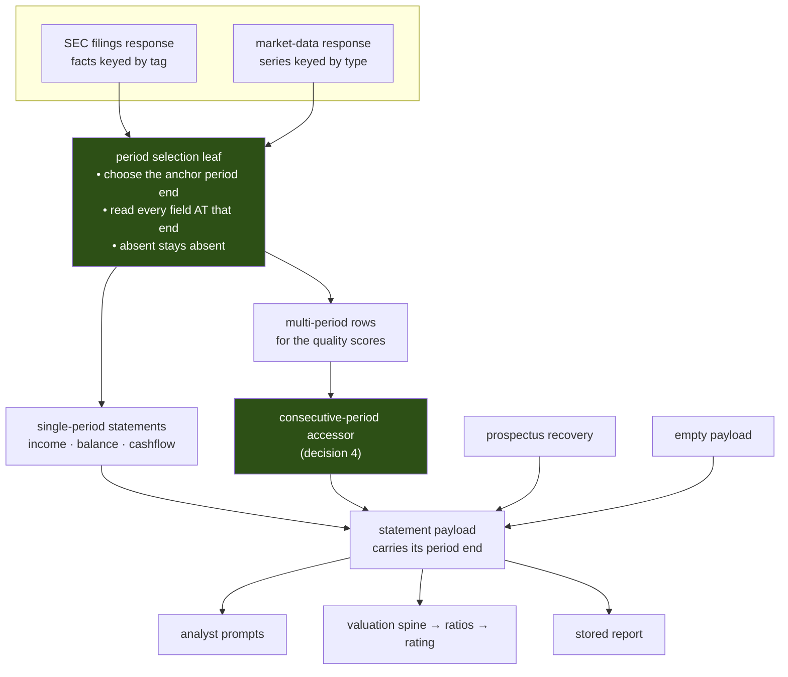

# FIX-1113: Statement figures combine values from different fiscal periods — Implementation Spec

## Part I — The Case *(for the human)*

### 1. Problem — why it matters, why now

When the desk reports a company's revenue, cash, debt and equity as one set of figures for
one year, it has not checked that they describe the same year. Each figure is looked up on
its own and takes whatever that particular line item most recently reported. Put four such
figures in a ratio and the answer can be one year's profit over another year's assets,
printed under a single date.

The index the desk uses to keep figures together does not identify a year. It uses the
regulator's fiscal-year field, which records **the year of the filing**, not the year the
number describes — so last year's comparative figures, republished inside this year's
annual report, carry this year's label. In the repository's own Apple filing, the period
ending 2024-09-28 appears under both 2024 and 2025 in **fifteen of the sixteen line items**,
including total assets, total liabilities, equity, cash and every debt line. The sixteenth
is worse: three different years of revenue all carry the single label 2018, and two of them
are silently thrown away.

**Why now.** This is not a background defect any more. Two issues are queued directly behind
it. FIX-1064 sharpens four valuation ratios and computes them on these figures; FIX-1066's
second pull request sits behind that. FIX-1064 attempted this fix in passing and backed out
of it four times, each round uncovering another independently-selected figure, until the
fourth round found that the index itself was the problem. Every ratio those issues sharpen
would be sharpened on top of an unaligned denominator, which is a more confident wrong
answer than the one we have.

### 2. Solution in plain terms

**Pick one period first, then read every figure at that period — and say which period it
was.**

Instead of asking each line item what it most recently reported, the desk chooses the
company's latest complete financial year, then reads every figure at that exact year-end
date. A figure the company did not report for that year comes back as absent, the way an
unreported figure already does — it is never quietly filled in from a neighbouring year.
Each statement then states the one date all of its figures were read at, so a reader is
told the truth about what they are looking at rather than a date borrowed from one line.

The fiscal-year index is **removed, not repaired**. It is the thing that is broken, and the
correct index — keyed on the exact period-end date — is already in the codebase, used by the
multi-year path in the market-data provider. This adopts that idiom everywhere and deletes
the other one. Nothing new is fetched; the dates are already in the responses the desk
downloads on every run and does not read.

**Philosophy** — tenet 5 (one convergence point): a period becomes something a statement
*has* rather than something four separate producers each decide, so a producer that cannot
name its period cannot compile. Tenet 3 (earn every addition): the fix subtracts a selection
rule rather than adding a third one — two indexes become one. Tenet 1 (coherence): the desk
already refuses to invent a figure it did not observe; it will now refuse to invent a
*period* it did not observe, which is the same rule one level up.

> **§2 then §6 lead, and the rest is derivation.**

### 6. Decisions & rules — the sign-off surface

1. **Every figure in a statement is read at one chosen year-end date, and the fiscal-year
   index is deleted rather than corrected.**
   *Rejected:* keeping the fiscal-year index and de-duplicating it — the regulator's field
   answers a different question, so no amount of tie-breaking makes it mean what the desk
   needs. Also rejected: leaving the existing multi-year path alone and fixing only the
   single-year one; that is what leaves two rules in the codebase, and copying the wrong one
   is how this defect spread in the first place.
   *Locks in:* the desk permanently reports on **completed financial years only**. Anything
   we later want that is finer-grained — a quarterly view, a trailing-twelve-month figure —
   has to be added as its own thing with its own dates, not by loosening this. That is a
   real door being closed, and closing it is the point.

2. **The balance sheet is read at the same year-end as the profit figures, so the desk stops
   showing the most recently filed quarter.**
   *Rejected:* keeping the newest available balance sheet and labelling the mismatch. A
   ratio of a full year's profit over a random quarter's assets is not made correct by
   captioning it, and the caption would appear on the one surface where somebody is deciding
   whether to buy something.
   *Locks in:* cash, debt and equity figures can now be up to nine months older than the
   ones the company most recently filed. A reader comparing the desk against a company's
   latest quarterly report will see different numbers and will be right to ask why. In
   exchange, every ratio built on those figures becomes a statement about one year instead
   of a mixture. Worth naming plainly: today's behaviour is not a freshness feature anyone
   chose — the market-data provider already reports annual-only, so the two providers
   currently disagree about what "the latest balance sheet" means and this settles it.

3. **A figure the chosen year does not carry is reported as absent, and one missing figure
   never blanks the rest of the statement.**
   *Rejected:* requiring a complete set before publishing anything. That produces a desk
   that goes silent on exactly the companies with patchy filings — an analysis that
   abstains by construction is not an analysis. Also rejected: falling back to the nearest
   year for the missing figure, which is the defect wearing a fallback label.
   *Locks in:* some reports will show fewer figures than they do today, with nothing in
   their place, and the downstream evidence gate treats a missing statement figure as thin
   evidence and caps new exposure. So this decision will make the desk decline to add to
   some positions it would previously have sized normally. That is the intended direction,
   and it is a real behaviour change somebody will notice.

4. **Anything that compares two periods must use two consecutive periods, decided in one
   place.**
   *Rejected:* per-consumer checks. There are two consumers today — the revenue-growth
   figure and the multi-year quality scores — and both currently take "the last two values
   available" with no test that they are adjacent, which publishes a two-year change as one
   year's growth. Two independent fixes is how the third consumer gets added without one.
   *Locks in:* year-over-year growth and the change-based quality scores disappear entirely
   for a company with a gap in its filing history, rather than showing a wrong number. The
   quality score is one of the inputs to the rating band, so a gap-year company can land in
   a different band than it does today.

5. **Each statement states the single date all of its figures were read at, and that date
   becomes a required part of the statement rather than an optional caption.**
   *Rejected:* today's arrangement, where the date is derived from one line item and then
   presented as the date for the whole statement. That is how a payload can currently claim
   a date that is not the date its own values came from.
   *Locks in:* every future producer of a statement must state its period or fail to build —
   a small permanent tax on adding a data source, and the enforcement half of decisions 1
   and 3 without which they are rules nothing checks. Reports already stored keep loading
   and keep their old figures; they are not rewritten.

6. **Re-anchoring moves numbers that are already published, and stored reports are left
   alone.**
   *Rejected:* recomputing stored reports so the archive agrees with new runs. An old record
   carries no record of which period each of its figures came from, so a recompute would be
   guessing — the same dishonesty one layer down.
   *Locks in:* two reports on the same company, on the same underlying filings, will
   disagree depending on when they were run, and we cannot tell a reader which of the two is
   which beyond the date on it. This is the epic's forward-looking rule applied to a wider
   set of figures than FIX-1064 applied it to, and it is the same call the product owner
   already made at the objective gate — this spec is ratifying it, not reopening it.

> **Non-goals** — no new provider, feed, entitlement, or additional request to an existing
> one (the epic's fence). No change to the ratio formulas, the fair-value model, the rating
> envelope, or the lens convergence math; this issue changes *which numbers go in*, and
> FIX-1064 changes what is computed from them. No quarterly or trailing-twelve-month
> reporting. No recomputation or migration of stored reports. No change to the
> prospectus-recovery path's own figures, which are already single-period by construction —
> it is touched only to state its period the same way everything else does.
>
> **Size:** Large — 8 production files · 14 test behaviours · 2 documentation surfaces ·
> 1 PR.

---

### 3. Tradeoffs & alternatives

**The simpler approach: align only the four figures FIX-1064 needs, and leave the rest.**
This is what FIX-1064 tried, four times. It fails for a structural reason rather than an
effort one: the figures share an index, so aligning four of them means the aligned four and
the unaligned rest disagree inside the same payload, and the ratio built across the boundary
is worse than either. The fourth review round is what established this, and it is why the
work moved here.

**Alternative: keep the fiscal-year index and de-duplicate it.** Tempting because it is a
smaller diff — drop entries whose period end does not match the modal end for that year. It
does not survive contact with the data. The label answers "which filing was this in", so
there is no rule over that field alone that recovers "which year does this describe"; the
period-end date is already sitting in the same record and is the actual answer. Keeping a
derived index beside the authoritative one is the shape that produced this issue.

**Where the complexity is:** not the selection rule, which is a lookup by date. It is
**coverage of the anchor period**, and it is uneven. A company that reports every line item
in every annual filing aligns perfectly and nothing about its report changes. A company that
renames a tag, stops reporting one, or has a gap year currently gets a quietly mixed answer
and will now get an honestly incomplete one — and "incomplete" propagates into the evidence
gate, which caps new exposure. So the visible effect of this change is concentrated on
exactly the companies whose filings are messiest, which is both correct and the part that
will generate questions.

A second cost, smaller and specific: **the repository's existing fixtures cannot show any of
this.** Both committed fixtures are period-symmetric and complete, so the current mappers
produce coherent output on them, and any test written against them passes whether the code
is fixed or not. §10 treats this as the central test-design constraint rather than a
footnote; the POC on this branch demonstrates it.

### 4. Focus practices (1–5)

1. **One convergence point for the period (tenet 5).** Four separate pieces of code build a
   statement payload — the filings mapper, the market-data mapper, the prospectus recovery,
   and the empty-payload builder. An invariant enforced at one of them is not an invariant.
   Making the period a required part of the statement's shape is what makes decisions 1, 3
   and 5 checkable rather than aspirational; this is the enforcement half, and without it the
   decisions are prose.
2. **BP-030 (tolerate the old shape).** The statement payloads are persisted resource state,
   so a shape change re-parses every stored report on read. The trap here is specific and
   easy to miss: the existing value fields are nullable but **not optional**, so a stored
   record that predates a new key fails to parse while an explicit `null` succeeds. The test
   that matters is the **missing-key** shape, not the null one.
3. **BP-020 (never fabricate; no silent fallback).** The whole issue is a silent fallback:
   an absent figure is currently filled from whatever period did report it. The replacement
   must fail toward absent, and the guard against over-correcting is decision 3 — absent must
   stay per-figure and never escalate into a blank statement.
4. **BP-035 (walk the second path).** The changed surface has three second paths that a
   naive pass misses: the stored-record read path (BP-030 above), the market-data provider
   rather than the filings provider, and the foreign-filer taxonomy, which uses different tag
   names through the same code and is currently covered by its own regression test.
5. **A denominator changes every ratio built on it.** Decision 2 moves the balance sheet,
   which is the denominator of return on equity, return on capital, leverage and the
   enterprise-value multiples — and FIX-1064 is about to compute more of them. Any threshold
   or band that was calibrated against the old denominator is now calibrated against nothing,
   which is why §10 requires the before/after to be counted rather than spot-checked.

### 5. What using it looks like (1–5 examples)

The public surface that changes is the statement payload every analyst prompt and the
valuation spine read. The change is visible in the payload, not in a call site.

**1. A company whose filings are complete — nothing changes but the honesty of the date.**

```
today          { asOf: "2025-09-27", revenue: 416.2, netIncome: 112.0, … }
after          { asOf: "2025-09-27", revenue: 416.2, netIncome: 112.0, … }
```

The date was already right here. It was right by luck: it was read from the revenue line and
happened to match. Now it is the period every figure was read at, by construction.

**2. A company that stopped reporting one line item in its newest filing.**

```
today          { asOf: "2025-09-27", totalAssets: 359.2, totalEquity: 57.0, … }
                                                          ↑ this is the 2024 figure
after          { asOf: "2025-09-27", totalAssets: 359.2, totalEquity: null, … }
```

Today the equity figure is last year's, presented under this year's date, and the resulting
return-on-equity is a year's profit over the prior year's equity. After, it is absent, and
the downstream gate treats the statement as thin.

**3. A company with a gap in its filing history.**

```
today          yoyRevenueGrowth: 0.31     ← the change across two years, called one year
after          yoyRevenueGrowth: null
```

**4. A balance sheet after a quarterly filing.**

```
today          asOf: "2025-09-27"  with cash read at 2025-12-27 (the newest quarter)
after          asOf: "2025-09-27"  with cash read at 2025-09-27
```

This is decision 2's cost and benefit in one line: the cash figure gets older, and the
leverage ratio built from it stops mixing a year of profit with a quarter of balance sheet.

### Reading the spec

Part II is the build plan. The parts most worth a reviewer's attention are §7 (where the
single reader sits, and which producers must pass through it) and §10 (why the existing
fixtures cannot test this, and what replaces them).

---

## Part II — The Build Plan *(for the implementing agent)*

### 7. Technical design

One period-selection leaf, in the shared provider layer, used by both producers and by the
multi-period path. Everything above it receives a statement that already knows its period.



- **`lib/providers/`** — a new period-selection leaf, pure and IO-free, holding the one
  selection rule. The filings mapper's fiscal-year index and its latest-value-per-tag
  selectors are **removed**; the market-data mapper's latest-value-per-series selectors are
  **removed**. The market-data provider's existing period-keyed reader is the idiom the leaf
  generalises — read it before writing the leaf, and note that the filings provider's
  fiscal-year-keyed reader is *not* the same idiom and is the thing being deleted.
- **The statement schemas** — the period end becomes a required part of each statement's
  shape (decision 5), which is what forces all four producers through the contract. The
  stored-state schema must tolerate records written before it (BP-030).
- **The quality-score tool** — currently reads `periods[0]` and `periods[1]` as "current" and
  "prior" with no adjacency test. It moves onto the accessor from decision 4.
- **Untouched:** the ratio formulas, the fair-value and rating math, the lens convergence
  math, the prompt formatters, and every UI surface. This change alters which numbers arrive,
  not what is done with them.

**Sketch — pseudocode. Illustrative, not the contract. React to the shape.**

```
choosing the anchor:
    candidate period ends ← every distinct annual period end across the core line items
    anchor ← the most recent candidate
        (annual = a full-year span for flow figures, a year-end snapshot for
         balance figures — the existing span test already knows how to tell)

reading a statement at the anchor:
    for each field in the statement:
        value ← the field's value AT the anchor end, else absent
                ← never "the field's most recent value"
    statement's period ← the anchor            (decision 5)

comparing two periods:                          (decision 4)
    ordered ← the anchor and the period immediately before it
    if those two are not consecutive:  report nothing

what deliberately does NOT happen:
    the statement is not withheld because one field is absent   (decision 3)
```

What this asks a reviewer: *is "most recent annual period end present in any core line item"
the right anchor, or should it be "most recent period end where the core set is complete"?*
The second sounds safer and is the trap decision 3 names — it makes the desk abstain on
exactly the messy filers. Whether the leaf lives in the provider layer or beside the
statement schemas is the implementer's, not this document's.

**POC on this branch — `spec-poc/FIX-1113-period-alignment/characterize.mjs`**
(`node spec-poc/FIX-1113-period-alignment/characterize.mjs`). Throwaway characterization of
the code as it stands today. It showed four things, and the first is the one that shaped §10:
the committed fixtures are period-symmetric, so the current mappers produce coherent output
on them and **a test written against them passes on broken code**. Removing one line item
from the newest filing produces a balance sheet spanning two period ends and a single
fiscal-year row carrying two periods. The committed fixture already collapses three fiscal
years of revenue into one row and discards two. And the market-data payload's date diverges
from the value it published as soon as the newest point is unreported.

### 8. Implementation sequence

Single pull request. The alignment is one contract across two producers, and shipping half
of it means the desk reads one provider coherently and the other not — the exact incoherence
being fixed. This differs from FIX-1064's two-PR split deliberately: that split separated
plumbing from methodology, whereas here the alignment *is* the methodology. It is also the
critical path for FIX-1064, and two review cycles buy nothing here.

1. **Build the fixtures first**, per §10 — an asymmetric filing, a gap-year history, and a
   filing carrying a quarterly balance-sheet snapshot. Without these there is nothing that
   can fail. *Test:* each fixture makes at least one current behaviour observably wrong.
   *Depends on:* nothing.
2. **The period-selection leaf**, pure and standalone. *Test:* anchor choice, reading at the
   anchor, absent-stays-absent, and the decision-3 case where one field is missing and the
   rest still resolve. *Depends on:* 1.
3. **Move the filings mapper onto the leaf** — both the single-period statements and the
   multi-period rows. **Remove** the fiscal-year index and the latest-value-per-tag
   selectors; nothing may still import them. *Test:* the §10 behaviours on the filings path,
   including the foreign-filer taxonomy. *Depends on:* 2.
4. **Move the market-data mapper onto the leaf.** **Remove** its latest-value-per-series
   selectors and its separate date derivation. *Test:* the §10 behaviours on the market-data
   path, including the date/value divergence the POC found. *Depends on:* 2.
5. **Make the period required in the statement shape**, and thread it through the
   prospectus-recovery and empty-payload producers so all four state it. *Test:* the
   stored-record read path with the key **absent** (BP-030), and each producer's period.
   *Depends on:* 3, 4.
6. **The consecutive-period accessor**, and move the growth figure and the quality-score
   tool onto it. **Remove** both ad-hoc last-two selections. *Test:* adjacent, gap, and
   single-period histories. *Depends on:* 5.
7. **Count the movement.** Run the fixture corpus before and after and record which figures
   and which ratings moved, per §10. *Depends on:* 6.

*(Each step cites the decision it implements rather than restating it — the contract lives in
§6 alone.)*

### 9. Edge cases & error handling

| Case | Expected |
|---|---|
| A line item reports the anchor period end more than once (as-filed and restated) | Take the entry from the newest filing. A restatement is the better figure for the same period, and this is a period-preserving choice, not a period-selecting one |
| No annual period end anywhere in the response | No statement — the existing "unavailable" path, unchanged. Not a new error |
| The only annual period end is many years old | Publish it, at its real date. The date is the disclosure; silently withholding a stale-but-honest filing is a different lie |
| Anchor period carries flow figures but no balance figures at all | Income and cashflow publish at the anchor; the balance sheet is absent. Decision 3 is per-statement as well as per-field |
| Foreign-filer taxonomy | Same leaf, different tag names — the existing arrangement. The regression test for this filer type must still pass |
| A stored report written before this change | Loads and renders with its original figures. It is not re-anchored and not re-parsed into an error (BP-030) |
| Two periods requested, only one exists | Nothing published, not a zero and not a single-period figure relabelled |
| A period end that is a valid date but absurd (far future, pre-listing) | Out of scope. The desk does not validate filing dates today and this change does not add a validator — flagged in §12 |

**Taxonomy:** every case here is non-fatal and degrades to absent. There is no new error
class. The one thing that must fail loudly is a producer that cannot state its period, and
decision 5 makes that a build failure rather than a runtime one.

### 10. Testing strategy

**Read this section in both directions.** For each criterion below, ask both *what defect
makes this fail* and *can a correct implementation always satisfy it*. The sibling spec in
this epic shipped three criteria a correct implementation could not meet and one a broken
implementation passed, and the POC on this branch shows this issue is unusually exposed to
the second kind.

**The fixtures are the load-bearing part.** Both committed fixtures are period-symmetric and
complete. Against them, today's broken mappers emit coherent statements — verified, not
assumed (POC, §7). So *every* pass condition written against the existing fixtures is passed
by the current code, and three new fixtures have to exist before any test is meaningful:

- **F1 — asymmetric filing:** at least one core line item present in the older annual filing
  and absent from the newest. Makes today's code emit a statement spanning two period ends.
- **F2 — gap-year history:** three annual periods with the middle one missing. Makes today's
  code publish a two-year change as one year's growth, and pair non-adjacent periods in the
  quality scores.
- **F3 — post-quarter filing:** an annual filing plus a later quarterly balance-sheet
  snapshot. Makes today's code pair a full year of profit with a quarter-end balance sheet.
  No committed fixture contains a non-annual entry at all, so this behaviour is currently
  untested in either direction.

**Goal check.** `goals/trading-desk-financials/statement-period-alignment/` — **zero model**,
deliberately. The outcome is deterministic (given a filing, does every figure in a statement
come from one period?), so a model in the loop would add noise without adding evidence; the
existing goal check in this directory is model-backed because its subject is transcription,
which this is not. The check runs the real mappers over F1–F3 plus both committed fixtures
and asserts the completeness property below. Its anti-game arm asserts the check still fails
when pointed at the pre-change mappers — a check that passes on both is measuring nothing,
which is this section's whole concern.

**The completeness criterion, stated as a property rather than a list:**

> For every statement a producer emits, each field that is not absent was read at the period
> end that statement declares — and the statement declares exactly one.

A field list would be complete only as of the day it was written; this holds for a field
added next year. It fails on today's code against F1 and F3 and passes on today's code
against the committed fixtures, which is precisely why F1 and F3 must exist.

**CI specs** (the behaviours, not the test names):

- **One behaviour per decision in §6**, in observable terms — what the payload carries, not
  how it was selected.
- **Decision 3 in both directions, and this is the pairing most likely to be got wrong.**
  A missing field is absent *and* the other fields in the same statement still resolve.
  Asserting only the first is satisfied by an implementation that blanks the whole statement,
  which is the abstains-by-construction failure decision 3 exists to prevent.
- **The second path (BP-035):** every behaviour on the market-data provider as well as the
  filings provider, and the foreign-filer taxonomy through the same leaf.
- **The stored-record read path with the period key ABSENT**, not set to null. The value
  fields are nullable-but-required today, so a missing key and an explicit null take
  different branches and only one of them represents a real stored report (BP-030).
- **What must not change:** against a period-symmetric complete filing, every published
  figure is identical to today's, value for value. This is the regression fence for
  decision 6 — it bounds the blast radius to the companies whose filings are actually
  asymmetric, and it is the one criterion here a *broken* implementation would fail loudly.
- **The count, not a spot check** (§4 practice 5): the number of figures and the number of
  ratings that move across the fixture corpus is recorded in the pull request. Named as
  what it is — **a smoke check over a small corpus, not a measurement**; the corpus is a
  handful of large, well-behaved US filers, so it will understate the effect on messy ones
  rather than bound it. Its purpose is to catch an unexpectedly large movement, not to
  certify a small one.

**Discipline:** `tdd`. The seam is the pure mapping layer in `lib/providers/` — reachable
from a vitest spec with a JSON literal and no network, so every behaviour above is a tracer
bullet. Build F1–F3 first (step 1); they are the red.

### 11. Documentation plan

- **EXTEND** `labs/trading-desk/CLAUDE.md` — the "Live mode" paragraph describing the three
  statement tools states the provider chain and the nullable-not-zero discipline. Add the
  period rule beside it: statements describe one completed financial year, every figure is
  read at that year-end, and a figure the year does not carry is absent. Three or four
  sentences. This is the file an agent working on the desk reads before touching the
  statements, and it is where the nullable discipline is already recorded, so the period
  discipline belongs next to it rather than in a new document.
  *Voice risk:* this file documents mechanism for agents, so name the actual behaviour and
  resist compressing it to "period-aligned", which tells a reader nothing they can check.
- **EXTEND** `labs/trading-desk/docs/financials-recovery.md` — one paragraph, because the
  recovery path now states its period through the same required field as the other three
  producers, and that document is where the recovery path's contract is written down.
- **No `apps/docs` change and no new page.** The trading desk is research software under
  `labs/`, not a published framework feature; nothing in the documentation site describes
  these payloads. Adding a page would document an app on the framework's site.

### 12. Dependencies, open questions & follow-ups

**Dependencies:** none blocking, and one live coordination point that must not be missed.

- **FIX-1064** is blocked *by* this and should be re-based on the aligned figures once this
  lands; its spec is in review and its own alignment attempt is already scoped out. Its
  branch will eventually touch the income-statement mapper, so re-check before starting.
- **FIX-1063 overlaps the persisted-state work, and its branch already carries the seam
  this spec's BP-030 obligation belongs at.** That branch introduces a legacy-record
  normalizer for the same stored financials state, applied at the two read boundaries where
  it is consumed, and its own documentation says a downstream consumer that needs its own
  legacy check has found a gap in that normalizer and should say so **rather than build a
  second copy**. Decision 5's tolerance for records written without a period is exactly such
  a check. Whichever of the two lands second extends the existing seam; neither adds a
  parallel one. It also touches the statement schemas, the empty-payload builder, and the
  desk's agent-facing guide — all three of which this spec touches — so the two should not be
  in flight against the same files at the same time. This is a sequencing note, not a
  blocker: the concerns are genuinely different (a legacy *zero* where a value was never
  observed, versus a legacy record with no period recorded at all) and neither design
  constrains the other.

**What FIX-1064 can assume once this lands:** every figure it reads out of a statement came
from the same completed financial year as every other figure in that statement; the
statement says which year; a figure the year does not carry is absent rather than borrowed
from a neighbour; and any two-period comparison it wants is available from one accessor that
has already refused to pair non-adjacent periods. It does not need its own period logic, and
the alignment work its spec currently carries in passing can be dropped.

**Open questions:** none. The two calls this issue existed to make are settled as §6
decisions rather than escalated, and the reasoning is worth stating because the issue was
routed here expecting an escalation:

- *Whether old and new reports may disagree* is decision 6, and it is not this spec's to
  reopen. The epic resolved it at the objective gate — the honesty guarantee is
  forward-looking, stored records are marked and not migrated, and the epic spec states that
  no issue in the set may promise more than that. FIX-1064's first decision already
  instantiated it for the figures it changes. Putting it back to the product owner would ask
  them to re-decide a call they have made twice, and would cost a round on the critical path
  to arrive at the answer already on record.
- *Whether the balance sheet anchors to the year end or keeps the freshest quarter* is
  decision 2. It looks like a live fork and is not one, for a reason only visible in the
  code: the "freshest quarter" behaviour is not a choice anyone made. The filings provider's
  balance-sheet selector filters for snapshot-shaped entries but never for *annual* ones,
  while the market-data provider requests annual series only — so the two providers already
  disagree, and the desk's behaviour today depends on which one answered. There is no
  standing decision to overturn, only an inconsistency to settle, and the epic's own honesty
  rule settles which way.

**Follow-ups (flagged, not built):**

- **Filing-date sanity.** Nothing validates that a period end is plausible for the company —
  a filing error would be read faithfully. Out of scope; it is a provider-trust question, not
  a period-alignment one.
- **Deepening:** the four statement producers each construct the payload independently and
  share only a schema. Once the period is a required field they share an invariant too, which
  makes a common construction seam worth considering. Out of scope; follow up via
  `improve-codebase-architecture`.

---

## Spec evolution

- **Spec drafted** — framed as one index defect with four surfaces rather than four bugs;
  chose to delete the fiscal-year index rather than repair it, after confirming against the
  repository's own fixture that the regulator's field records the filing year and cannot be
  made to mean the reported year. Corrected the issue's own claim that a period-aligned
  reader exists in both producers — only the market-data one is period-aligned; the filings
  one is the defective index — which changes the work from "reuse an idiom" to "adopt one and
  delete the other". Built a characterization POC after finding that both committed fixtures
  are period-symmetric and therefore cannot fail on broken code, which made the fixture set
  the load-bearing part of §10. Settled both calls the issue was routed here to escalate,
  because the epic and FIX-1064 had already decided one and the code showed the other was an
  inconsistency rather than a choice.
