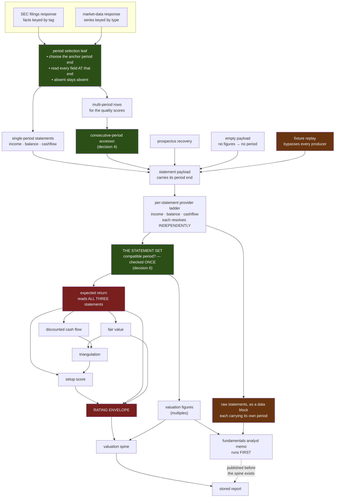

# FIX-1113: Statement figures combine values from different fiscal periods — Implementation Spec

## Part I — The Case *(for the human)*

### 1. Problem — why it matters, why now

When the desk reports a company's revenue, cash, debt and equity as one set of figures for
one year, it has not checked that they describe the same year. Each figure is looked up on
its own and takes whatever that particular line item most recently reported. Put four such
figures in a ratio and the answer can be one year's profit over another year's assets,
printed under a single date.

The index the desk uses to keep figures together does not identify a year. It uses the
regulator's fiscal-year field, which records **the year of the filing**, not the year the
number describes — so last year's comparative figures, republished inside this year's
annual report, carry this year's label. In the repository's own Apple filing, the period
ending 2024-09-28 appears under both 2024 and 2025 in **fifteen of the sixteen line items**,
including total assets, total liabilities, equity, cash and every debt line. The sixteenth
is worse: three different years of revenue all carry the single label 2018, and two of them
are silently thrown away.

**Why now.** This is not a background defect any more. Two issues are queued directly behind
it. FIX-1064 sharpens four valuation ratios and computes them on these figures; FIX-1066's
second pull request sits behind that. FIX-1064 attempted this fix in passing and backed out
of it four times, each round uncovering another independently-selected figure, until the
fourth round found that the index itself was the problem. Every ratio those issues sharpen
would be sharpened on top of an unaligned denominator, which is a more confident wrong
answer than the one we have.

### 2. Solution in plain terms

**Pick one period first, then read every figure at that period — and say which period it
was.**

Instead of asking each line item what it most recently reported, the desk chooses the
company's latest complete financial year, then reads every figure at that exact year-end
date. A figure the company did not report for that year comes back as absent, the way an
unreported figure already does — it is never quietly filled in from a neighbouring year.
Each statement then states the one date all of its figures were read at, so a reader is
told the truth about what they are looking at rather than a date borrowed from one line.

The fiscal-year index is **removed, not repaired**. It is the thing that is broken, and the
correct index — keyed on the exact period-end date — is already in the codebase, used by the
multi-year path in the market-data provider. This adopts that idiom everywhere and deletes
the other one. Nothing new is fetched; the dates are already in the responses the desk
downloads on every run and does not read.

**Philosophy** — tenet 5 (one convergence point): a period becomes something a statement
*has* rather than something four separate producers each decide, so a producer that cannot
name its period cannot compile. Tenet 3 (earn every addition): the fix subtracts a selection
rule rather than adding a third one — two indexes become one. Tenet 1 (coherence): the desk
already refuses to invent a figure it did not observe; it will now refuse to invent a
*period* it did not observe, which is the same rule one level up.

> **§2 then §6 lead, and the rest is derivation.**

### The decisions, in one screen

Everything below this block is derivation — the rejected alternatives, the code evidence, the
worked examples, the build plan. **If you read only one thing, read this and the question
under it.**

| # | The call | What it costs you |
|---|---|---|
| 1 | Read every figure at one chosen year-end; delete the fiscal-year index. The year is the newest one **any** core figure reports — completeness is never required to pick it | The desk reports completed financial years only. A quarterly or trailing-twelve-month view becomes its own future thing, not a loosening of this |
| 2 | The balance sheet is read at the same year-end as the profit figures | Cash, debt and equity can be up to nine months older than the company's latest filing. A reader comparing against the latest quarterly will see different numbers |
| 3 | A figure the year does not carry is **absent**; one missing figure never blanks the statement | Some reports show fewer figures. **The exposure cap does not notice** — it fires on a wholly missing statement, not a partial one. That hole widens and is *not* closed here (follow-up in §12) |
| 4 | Two-period comparisons must use genuinely consecutive periods, decided in one place | Year-over-year growth and the change-based quality scores vanish for a company with a gap year, rather than showing a wrong number. That can move its rating band |
| 5 | Every statement states the one date its figures were read at — empty only when it carries no figures | Every future statement producer must state a period or fail to build. Stored reports keep loading unchanged |
| 6 | The desk **detects** that the three statements are incoherent and withholds every cross-statement computation. It does **not** promise to assemble a coherent set | **The rating still publishes — unclamped and marked unanchored.** Withholding the envelope removes the *bound*, not the rating. See the question below. And on a messy filer the cross-statement figures are withheld rather than recomputed at the newest year — assembling them is a follow-up (§12) |
| 7 | Stored reports are left alone; no recompute | Two reports on the same company can disagree by when they were run. Already settled at the epic's objective gate |

**Three limits worth knowing before you sign off**, all deliberate and all named in full
below: the desk **detects** an incoherent statement set and withholds, rather than assembling
a coherent one — so a messy filer loses its cross-statement figures instead of having them
recomputed at the newest year (decision 6; assembling is priced in §12). The detection covers
the providers the ladder actually fetched, so a source that answers completely at an older
year hides a newer one nobody looked for. And the analyst's own prose arithmetic is
*discouraged, not prevented* — a memo can still carry a figure the spine withheld (§7).

> #### The one question that is yours, not mine
>
> **When the desk cannot establish a single period across the three statements, should it
> publish an unanchored rating with a disclosure — or publish no rating at all?**
>
> The rating comes from the model and is normally bounded by a deterministic calculation.
> This change withholds that calculation when the statements disagree about which year they
> describe — which removes the bound, not the rating. The spec publishes it and says on the
> report that it is unanchored.
>
> **My recommendation: publish it, disclosed, and revisit on the count.** Publishing nothing
> is a change to the desk's output contract rather than its arithmetic, and **nobody knows
> how often this fires** — I tried to measure it and could not. The disclosure plus a run
> marker turns that into a real number within weeks of shipping.
>
> **This does not block the spec.** Implementation proceeds on the recommendation; the full
> ask, the trade-off, what would change my mind, and what being wrong costs are in §12.

### 6. Decisions & rules — the sign-off surface

1. **Every figure in a statement is read at one chosen year-end date, and the fiscal-year
   index is deleted rather than corrected.** **The year chosen is the most recent completed
   financial year any core figure reports; a complete set is never required to choose it.**
   *Rejected:* keeping the fiscal-year index and de-duplicating it — the regulator's field
   answers a different question, so no amount of tie-breaking makes it mean what the desk
   needs. Also rejected: leaving the existing multi-year path alone and fixing only the
   single-year one; that is what leaves two rules in the codebase, and copying the wrong one
   is how this defect spread in the first place. And rejected for the choice of year:
   **anchoring to the most recent year where every core figure is present** — it sounds
   safer and is the same abstains-by-construction trap decision 3 rejects, one level up. It
   would silently walk a messy filer's whole report back to an older year rather than report
   the current year with a gap in it.
   *Locks in:* the desk permanently reports on **completed financial years only**. Anything
   we later want that is finer-grained — a quarterly view, a trailing-twelve-month figure —
   has to be added as its own thing with its own dates, not by loosening this. That is a
   real door being closed, and closing it is the point. It also locks in that a company's
   report tracks its newest filing rather than its newest *complete* filing, so a filer that
   drops a line item shows the current year with that figure missing, not last year entire.
   **"Core figure" is a defined set, not a word — and the code currently holds two different
   ones.** The market-data history path discovers periods from total assets, revenue and net
   income; the recovery ladder's completeness test uses revenue + operating income (income),
   operating + free cash flow (cashflow), and cash + total debt (balance). Left undefined, an
   implementer picks one and the anchor lands on a different year than the other reading
   would give. The canonical set for **anchor discovery** is the union across the three
   statements, one representative per category: **income — revenue, operating income, net
   income; cashflow — operating cash flow, free cash flow; balance — total assets, total
   equity, cash and equivalents, total debt.** A period end reported by *any* of these is a
   candidate.
   **This set is deliberately NOT the ladder's completeness test, and the two must not be
   unified.** They answer different questions: *which period ends exist* (wide — a period
   represented by a single figure is still a real period) versus *is this payload complete
   enough to stop laddering* (narrow — the existing fallback behaviour, which the non-goals
   freeze). Someone who notices the divergence will be tempted to reconcile them; doing so
   changes which provider answers, which is a coverage change this issue does not make.

2. **The balance sheet is read at the same year-end as the profit figures, so the desk stops
   showing the most recently filed quarter.**
   *Rejected:* keeping the newest available balance sheet and labelling the mismatch. A
   ratio of a full year's profit over a random quarter's assets is not made correct by
   captioning it, and the caption would appear on the one surface where somebody is deciding
   whether to buy something.
   *Locks in:* cash, debt and equity figures can now be up to nine months older than the
   ones the company most recently filed. A reader comparing the desk against a company's
   latest quarterly report will see different numbers and will be right to ask why. In
   exchange, every ratio built on those figures becomes a statement about one year instead
   of a mixture. Worth naming plainly: today's behaviour is not a freshness feature anyone
   chose — the market-data provider already reports annual-only, so the two providers
   currently disagree about what "the latest balance sheet" means and this settles it.

3. **A figure the chosen year does not carry is reported as absent, and one missing figure
   never blanks the rest of the statement.**
   *Rejected:* requiring a complete set before publishing anything. That produces a desk
   that goes silent on exactly the companies with patchy filings — an analysis that
   abstains by construction is not an analysis. Also rejected: falling back to the nearest
   year for the missing figure, which is the defect wearing a fallback label.
   *Locks in:* some reports will show fewer figures than they do today, with nothing in
   their place, and **nothing downstream currently notices.** The desk's exposure cap fires
   on a statement that is wholly unavailable, not on one that is present with a figure
   missing — so a report that loses only, say, its equity figure keeps its normal position
   sizing, and the ratios needing that figure are simply absent from it. That is a real hole
   this decision widens without closing: incompleteness becomes more common and the cap does
   not track it. Closing it means changing how conservative the desk is, which is the
   product owner's call and not this issue's (§12 carries it as a named follow-up). What
   this decision does buy is that the figures which *are* shown are true.

4. **Anything that compares two periods must use two consecutive periods, decided in one
   place — and "consecutive" is *about one reporting year apart*, not "the calendar years
   differ by one".** Same predicate shape as decision 6 and for the same reason: calendar
   arithmetic rejects a legitimate pair whose ends straddle December into January, while a
   loose elapsed-time window quietly readmits the two-year-growth bug this decision exists to
   kill. The rule is one reporting interval within a bounded tolerance, the tolerance is much
   smaller than the interval, and the exact number is the implementer's.
   *Rejected:* per-consumer checks. There are two consumers today — the revenue-growth
   figure and the multi-year quality scores — and both currently take "the last two values
   available" with no test that they are adjacent, which publishes a two-year change as one
   year's growth. Two independent fixes is how the third consumer gets added without one.
   Also rejected: comparing fiscal-year labels, which is the same defect decision 1 deletes,
   reappearing in the comparison instead of the index.
   *Locks in:* year-over-year growth and the change-based quality scores disappear entirely
   for a company with a gap in its filing history, rather than showing a wrong number. The
   quality score is one of the inputs to the rating band, so a gap-year company can land in
   a different band than it does today.

5. **Each statement states the single date all of its figures were read at — always present
   as a field, and empty only when the statement carries no figures at all.** A statement
   declares a period exactly when it has something to declare one for; a statement with no
   figures (the unavailable path) declares none, rather than borrowing the date of the
   request.
   *Rejected:* today's arrangement, where the date is derived from one line item and then
   presented as the date for the whole statement. That is how a payload can currently claim
   a date that is not the date its own values came from. Also rejected: making the date
   unconditionally non-empty — an unavailable statement has no period, and the only values
   available to fill one in are the date the analysis was requested (which fabricates a
   year-end) or a guess. A rule whose behaviour is specified without a way to represent it
   cannot be built.
   *Locks in:* every future producer of a statement must state its period or fail to build —
   a small permanent tax on adding a data source, and the enforcement half of decisions 1
   and 3 without which they are rules nothing checks. Reports already stored keep loading
   and keep their old figures; they are not rewritten.

6. **A compatible period is a property of the three statements as a set, checked once before
   anything is computed from them — and it must be the *newest* period the subject has, not
   merely a period they happen to share. When it doesn't hold, every deterministic output
   that reads more than one statement is withheld.** "Agree" means the same fiscal year-end,
   not the same string. Each statement is fetched through its own provider ladder, so income
   can come from the filings source while the balance sheet falls through to market data, and
   nothing compares their dates before anything is built from both.
   **The desk DETECTS that the set is incoherent and withholds. It does not promise to
   assemble a coherent one.** This is the third statement of this guarantee across three
   review rounds, and the previous two were both narrowings of the same promise — that the
   statements would *sit at* the subject's newest period. A promise that needs a new caveat
   every round is the wrong promise, so it is replaced rather than narrowed again. What the
   desk commits to is a **detection contract**: after the three statements have returned, if
   they are not coherent, every deterministic output built across them is withheld. It
   commits to nothing about *making* them coherent.
   **Why the assembling version cannot be built where the check lives.** The three statements
   are fetched in a concurrent fan-out — verified, not assumed (`define-analyst.ts`:
   `.parallel(...)` over the tool set) — and each runs its own `loadStatementWithRecovery`,
   which returns its own winner before any set-level view exists. One call can observe a
   newer period *after* another has already committed to an older complete fallback. So
   "prefer the partial statement at the anchor" is not a rule the current code can execute:
   there is no point at which a statement's choice can consult the set. Making it one needs
   candidate collection, a deterministic barrier, and two-phase selection across
   `define-analyst` and `statement-recovery` — real architecture, not a spec sentence. A
   shared mutable anchor would be worse than not having one: the outcome would depend on
   completion order, which is the kind of defect that reproduces once in twenty runs.
   **The predicate, and it has two parts — the second is the one a naive reading drops.**
   Both are computable *after* the returns, with no ordering discipline and no shared state:
   **(a) No statement settled for less than it saw.** Each resolution records the newest
   annual period end it *observed* among the payloads it actually fetched, and the period it
   returned. If a statement returned an older period than one it observed, the set is
   incoherent. This is a **per-statement, local** property — the call that made the choice
   has both values in hand — so it survives the concurrent fan-out untouched.
   **(b) The three returned periods are mutually compatible**, by the bounded-distance rule
   below.
   **(a) is not optional, and dropping it silently reopens two closed findings.** A check
   written as (b) alone — "do the three periods match" — passes uniform staleness, which is
   exactly the case where an older *complete* statement beat a newer *partial* one on all
   three tools and they agree at the wrong year. That is the defect rounds 4 and 5 closed. It
   is worth being blunt because the pressure is real: (b) alone is simpler, reads as
   sufficient, and would ship a guard that passes the case it was built for.
   **What this deliberately gives up.** Under the assembling version, a messy filer's report
   would carry the anchor-year partial statement *and* its cross-statement figures. Under
   detection, the ladder still returns the older complete statement, and the desk withholds
   instead of correcting. So decision 3's "report the current year with a gap in it" is
   weaker than it reads for the cross-statement figures: the per-statement figures are still
   honest and still publish, but the ratios built across statements are withheld rather than
   computed at the anchor. That is a real loss of output on exactly the messy filers this
   issue is about, and it is the price of not building the barrier. Naming it here rather
   than letting §7 imply the stronger behaviour.
   **And one case is outside detection entirely.** The ladder returns a complete payload
   *without fetching the next provider at all* (`statement-recovery.ts`: the filings return
   short-circuits before the market-data fetch). Nothing observed a newer period, so (a)
   cannot fire and (b) is satisfied — the set is coherent as far as the desk can know. That
   is a limit, not a bug to catch, and it is why the frequency question in §12 is unanswerable
   on the current path.
   *Rejected:* **anchor-selection** — collecting candidates, holding a barrier, and having
   each statement choose the anchor period. It is the version that would let the anchor-year
   partial win, and it is a genuine architectural change to the fan-out and the recovery
   ladder rather than a check. It is not rejected as wrong; it is rejected as **not this
   issue's**, and §12 carries it with the barrier work priced. Also rejected: inspecting every
   provider candidate before choosing, which spends a request per statement per run against a
   frequency nobody has measured, on a path the non-goals already fence.
   **The check belongs to the statement set, not to any one computation.** Two earlier
   drafts of this decision put it inside the shared valuation function, and that is the wrong
   altitude: the spine's expected-return computation reads income, cashflow *and* balance
   sheet directly, runs before the valuation figures and independently of them, and its
   result feeds fair value, the discounted cash flow, the setup score and the rating
   envelope. So a check inside the valuation function stops a bad multiple and lets a
   **rating** computed from mixed periods through — which is not a narrower guard, it is one
   aimed at the wrong target. The contract is therefore on the inputs: *if the three
   statements do not share a compatible period, the cross-statement outputs are withheld
   rather than computed.*
   **Withheld is not everything.** A figure that reads one statement is unaffected — an
   operating margin is income over income, and a mismatch elsewhere is no reason to drop it.
   The distinction is named in Part II so "withhold" cannot be implemented as "blank the
   spine".
   **And a spine that withheld its cross-statement outputs must report itself as thin.** It
   already has a sufficient/thin signal that the exposure gate reads; leaving that reading
   *sufficient* while the outputs it summarises were never computed would be the same
   signal-without-substance defect decision 3 had to retract.
   **What is withheld is the deterministic envelope — the published rating is not withheld,
   and saying otherwise would be a promise no code here keeps.** An earlier draft of this
   decision claimed the desk declines to rate a company whose sources disagree. It does not.
   The portfolio manager emits its own rating as a required field, and the envelope's job is
   to **clamp** it; withhold the envelope and the clamp simply never runs, so what publishes
   is the model's rating with its deterministic bound removed. That is *worse* than the
   mismatched-period envelope this guard exists to suppress, so the guard as first written
   degraded the thing it was protecting.
   **Therefore the rating is published, and disclosed as unanchored.** The report says the
   desk could not establish a single period across the statements, names the dates, and marks
   the rating as carrying no deterministic bound; the run records that it fired. Bringing the
   portfolio-manager path inside the gate — so no rating publishes at all — is a change to
   what the desk does when it cannot compute, is far larger than period alignment, and is
   **not decided here**: §12 escalates it with the frequency question attached, which is the
   sharp version of the ask. Marking the run is what makes that frequency answerable at all,
   since it cannot be measured before implementation.
   **The analyst is the second site and needs the same contract.** It computes and publishes
   its own valuation from its own tool payloads *before* the stored spine exists, so a rule
   enforced on the spine never reaches it. And because it is also handed the three raw
   statements and asked in its own instructions to divide one by another, the periods have to
   be visible to it and a mismatch stated to it, not merely gated in code it does not run.
   **Every surface but one is gated deterministically; the analyst's is advisory, and that is
   a residual rather than a guarantee.** The mappers and every computation over the statement
   set either withhold an output or do not, and a test can prove it. The analyst's own prose arithmetic —
   its instructions ask it to divide cash flow by earnings — is reachable only by telling it
   the periods and telling it not to combine them. A model can ignore an instruction. Naming
   that here rather than letting the build plan imply four gates, because a residual someone
   knows about is manageable and one they discover later is not.
   **Two dates describe the same period when they are within a few weeks of each other —
   not when they fall in the same calendar year.** Calendar year is wrong in both
   directions: it accepts a January year-end and a December year-end as one period though
   they are eleven months apart, and it rejects a 52/53-week filer whose year ends
   `2025-12-28` against a source that normalises it to `2026-01-03`, which is the same year
   six days apart. The rule is a bounded distance, and the bound must stay far below the gap
   between two consecutive reporting periods so two adjacent years can never merge — a month
   is a sound starting point against annual periods roughly a year apart, and the exact
   number is the implementer's.
   *Rejected:* forcing all three statements to come from one provider. That would undo the
   fallback ladder the desk added precisely so a company with patchy filings still gets an
   answer, and would trade a period defect for a coverage defect. Also rejected: requiring
   the dates to match exactly — for the same company and the same fiscal year the filings
   source reports `2025-09-27` and the market-data source reports `2025-09-30`, so strict
   equality would reject almost every correct pairing. And rejected: same-calendar-year, for
   the two reasons above.
   *Locks in:* **on a company whose sources disagree about the period, the desk still rates
   it — but the rating loses its deterministic bound, and the report says so.** That is the
   honest statement of this decision's effect and it is deliberately weaker than the one an
   earlier draft made. The multiples, the expected return, fair value, the cash-flow model and
   the envelope are all withheld; the spine reads thin, so the exposure gate caps new
   positions on that name; and the portfolio manager's own rating publishes unclamped with a
   disclosure attached. **Whether that is acceptable is the open question in §12**, because
   an unanchored rating is a real loss of discipline and the alternative — publishing no
   rating — is a bigger change than this issue should make on its own.
   **And the guarantee stops at the model's doorstep in a second way:** the computed
   figures are gated, but a ratio the analyst works out in prose from the numbers in front of
   it is discouraged, not prevented. That is the honest ceiling here, and what a reader is
   being told when a memo carries a figure the spine withheld. A bound set too tight silently
   drops those figures on healthy companies; set too loose it lets back in the defect this
   issue exists to fix. **This
   is not optional scope:** decision 3 makes statements incomplete more often, an incomplete
   statement is more likely to fall through the ladder, and falling through the ladder is what
   produces the cross-provider mix — so fixing the tag layer without this one would make the
   defect it is fixing *more* frequent one layer up.

7. **Re-anchoring moves numbers that are already published, and stored reports are left
   alone.**
   *Rejected:* recomputing stored reports so the archive agrees with new runs. An old record
   carries no record of which period each of its figures came from, so a recompute would be
   guessing — the same dishonesty one layer down.
   *Locks in:* two reports on the same company, on the same underlying filings, will
   disagree depending on when they were run, and we cannot tell a reader which of the two is
   which beyond the date on it. This is the epic's forward-looking rule applied to a wider
   set of figures than FIX-1064 applied it to, and it is the same call the product owner
   already made at the objective gate — this spec is ratifying it, not reopening it.

> **Non-goals** — no new provider, feed, entitlement, or additional request to an existing
> one (the epic's fence). No change to the ratio formulas, the fair-value model, the rating
> envelope, or the lens convergence math; this issue changes *which numbers go in*, and
> FIX-1064 changes what is computed from them. No quarterly or trailing-twelve-month
> reporting. No recomputation or migration of stored reports. No change to the
> prospectus-recovery path's own figures, which are already single-period by construction —
> it is touched only to state its period the same way everything else does. **No change to
> the provider ladder's order or its fallback behaviour** — decision 6 refuses to build
> figures across mismatched periods; it does not change which provider answers. **No change
> to the exposure cap or any gate policy** — the hole decision 3 names is recorded in §12,
> not closed here. **No re-ordering of the analysis pipeline** — the fundamentals analyst
> keeps running before the spine and keeps computing its own valuation; decision 6 makes both
> sites share one check rather than making one of them go away. **No change to how any spine
> figure is computed** — decision 6 decides *whether* a computation runs on a given statement
> set, never what it calculates when it does. **No change to the portfolio manager's rating
> schema or to whether a rating is required** — the unanchored rating publishes and is
> disclosed; removing it is §12's open question, not this issue's work. **The one ladder
> change is additive reporting, not selection** — each resolution reports the newest annual
> period it fetched alongside the period it returned. Which provider wins, the providers
> tried, and the order they are tried in are all unchanged. **No barrier, no two-phase
> selection, and no re-resolution** — making the anchor-year statement win is §12's follow-up,
> and the concurrent fan-out is why it cannot be done here.
>
> **Size:** Large — 15 production files · 34 test behaviours · 2 documentation surfaces ·
> 1 PR. *(Up from 8 / 14 across six review rounds: the cross-provider layer in decision 6,
> the fixture replay boundary, the unavailable-path representation in decision 5, the
> analyst's own valuation site and its raw-statement path, and — round 3 — moving decision
> 6's check from the valuation function up to the statement set, which is what brings the
> rating envelope inside the guard; and — round 4 — disclosing the unanchored rating once it
> turned out the rating is not withheld at all. **Round 7 replaced the ladder-preference work
> with additive observation reporting**, which is smaller: the guarantee became detection
> rather than assembly, so no selection logic lands in the ladder.)*
>
> **The size has been reviewed twice and the issue is deliberately kept whole.** Splitting
> decision 6 out would ship a window in which the mapper fix is live and the guard is not —
> and in that window the analyst keeps publishing cross-period figures while the stored spine
> is clean, which is the two-surfaces-disagree state this issue exists to end, reintroduced on
> purpose. Worse, the coupling runs the wrong way for a split: decision 3 makes statements
> incomplete more often, the provider ladder's fallback turns on exactly those fields, so the
> mapper fix alone *raises* the rate of the defect the guard catches. A split whose
> intermediate state is worse than either endpoint is a regression with a schedule story
> attached, so the schedule pressure from FIX-1064 was not allowed to buy it.

---

### 3. Tradeoffs & alternatives

**The simpler approach: align only the four figures FIX-1064 needs, and leave the rest.**
This is what FIX-1064 tried, four times. It fails for a structural reason rather than an
effort one: the figures share an index, so aligning four of them means the aligned four and
the unaligned rest disagree inside the same payload, and the ratio built across the boundary
is worse than either. The fourth review round is what established this, and it is why the
work moved here.

**Alternative: keep the fiscal-year index and de-duplicate it.** Tempting because it is a
smaller diff — drop entries whose period end does not match the modal end for that year. It
does not survive contact with the data. The label answers "which filing was this in", so
there is no rule over that field alone that recovers "which year does this describe"; the
period-end date is already sitting in the same record and is the actual answer. Keeping a
derived index beside the authoritative one is the shape that produced this issue.

**Where the complexity is:** not the selection rule, which is a lookup by date. It is
**coverage of the anchor period**, and it is uneven. A company that reports every line item
in every annual filing aligns perfectly and nothing about its report changes. A company that
renames a tag, stops reporting one, or has a gap year currently gets a quietly mixed answer
and will now get an honestly incomplete one. So the visible effect of this change is
concentrated on exactly the companies whose filings are messiest, which is both correct and
the part that will generate questions.

**And incompleteness stops there — it does not reach the exposure cap.** Worth stating
plainly in the tradeoffs, because the intuitive reading is the opposite: a report that loses
one figure keeps its normal position sizing, because the cap fires on a statement that is
wholly missing or unavailable, not on a present one with a gap. Decision 3 has the detail and
§12 carries closing it as a follow-up. The honest summary of this change's effect on
behaviour is therefore *the figures shown are true, and fewer of them are shown* — not
*the desk becomes more cautious.*

A second cost, smaller and specific: **the repository's existing fixtures cannot show any of
this.** Both committed fixtures are period-symmetric and complete, so the current mappers
produce coherent output on them, and any test written against them passes whether the code
is fixed or not. §10 treats this as the central test-design constraint rather than a
footnote; the POC on this branch demonstrates it.

**And the defect has a second altitude, found in review.** Aligning fields inside a provider
response is only half of it: each of the three statements is fetched through its own fallback
chain, so one can come from the filings source and another from market data, and nothing
compares their dates before a ratio is built across them. That is this issue's own defect one
layer up. It has to be in scope rather than deferred, for a reason that is not tidiness: this
change makes statements incomplete more often, an incomplete statement falls through the
chain more often, and falling through the chain is what produces the mismatch. Fixing the
lower layer alone would raise the rate of the upper one. It is the largest single thing
review added — decision 6, and about a third of the growth in the size estimate.

### 4. Focus practices (1–5)

1. **One convergence point for the period (tenet 5).** Several pieces of code put a statement
   in front of a consumer — the filings mapper, the market-data mapper, the prospectus
   recovery, the empty-payload builder, and **fixture replay**, which bypasses every other one
   and is the default analysis path (§7 holds the count). An invariant enforced at one of them
   is not an invariant, and the last is the one a producer-shaped reading misses. Putting the period in the statement
   shape is what makes decisions 1, 3 and 5 checkable rather than aspirational; this is the
   enforcement half, and without it the decisions are prose.
2. **BP-030 (tolerate the old shape).** The statement payloads are persisted resource state,
   so a shape change re-parses every stored report on read. The trap here is specific and
   easy to miss: the existing value fields are nullable but **not optional**, so a stored
   record that predates a new key fails to parse while an explicit `null` succeeds. The test
   that matters is the **missing-key** shape, not the null one.
3. **BP-020 (never fabricate; no silent fallback).** The whole issue is a silent fallback:
   an absent figure is currently filled from whatever period did report it. The replacement
   must fail toward absent, and the guard against over-correcting is decision 3 — absent must
   stay per-figure and never escalate into a blank statement.
4. **BP-035 (walk the second path) — and enumerate replay paths, not only producers.** The
   changed surface has second paths a naive pass misses: the stored-record read path
   (BP-030 above), the market-data provider rather than the filings provider, the
   foreign-filer taxonomy, and **fixture replay**, which returns committed JSON without
   touching a producer and is the *default* analysis path. The last is the one review had to
   find: a shape change enumerated over the code that computes a value misses every path that
   replays one. The general form is in §12 as a standing check.
5. **A denominator changes every ratio built on it.** Decision 2 moves the balance sheet,
   which is the denominator of return on equity, return on capital, leverage and the
   enterprise-value multiples — and FIX-1064 is about to compute more of them. Any threshold
   or band that was calibrated against the old denominator is now calibrated against nothing,
   which is why §10 requires the before/after to be counted rather than spot-checked.

### 5. What using it looks like (1–5 examples)

The public surface that changes is the statement payload every analyst prompt and the
valuation spine read. The change is visible in the payload, not in a call site.

**1. A company whose filings are complete — nothing changes but the honesty of the date.**

```
today          { asOf: "2025-09-27", revenue: 416.2, netIncome: 112.0, … }
after          { asOf: "2025-09-27", revenue: 416.2, netIncome: 112.0, … }
```

The date was already right here. It was right by luck: it was read from the revenue line and
happened to match. Now it is the period every figure was read at, by construction.

**2. A company that stopped reporting one line item in its newest filing.**

```
today          { asOf: "2025-09-27", totalAssets: 359.2, totalEquity: 57.0, … }
                                                          ↑ this is the 2024 figure
after          { asOf: "2025-09-27", totalAssets: 359.2, totalEquity: null, … }
```

Today the equity figure is last year's, presented under this year's date, and the resulting
return-on-equity is a year's profit over the prior year's equity. After, it is absent — and
the report is honest about that rather than the gate reacting to it (decision 3).

**3. A company with a gap in its filing history.**

```
today          yoyRevenueGrowth: 0.31     ← the change across two years, called one year
after          yoyRevenueGrowth: null
```

**4. A balance sheet after a quarterly filing.**

```
today          asOf: "2025-09-27"  with cash read at 2025-12-27 (the newest quarter)
after          asOf: "2025-09-27"  with cash read at 2025-09-27
```

This is decision 2's cost and benefit in one line: the cash figure gets older, and the
leverage ratio built from it stops mixing a year of profit with a quarter of balance sheet.

**5. A company whose three statements land on different years — the decision 6 case.**

```
today          rating: "buy"   bounded by an envelope computed across a
                               2025 income statement and a 2024 balance sheet
after          rating: "buy"   published with no deterministic bound, and
                               marked: the desk could not establish one
                               period (2025-09-27 vs 2024-09-28)
```

The multiples, the expected return, fair value and the cash-flow model are all absent here,
and the spine reads thin. The rating is the one thing that does **not** disappear: the
envelope only *bounds* a rating the portfolio manager emits on its own, so withholding the
envelope removes the bound rather than the rating. That is why the report says so out loud —
and why §12 asks the product owner whether saying so is enough.

### Reading the spec

Part II is the build plan. The parts most worth a reviewer's attention are §7 (the **two**
seams — the per-response reader and the statement-set contract above it — plus the table of
what is withheld, where **the published rating is deliberately not**) and §10 (why the
existing fixtures cannot test this, and what replaces them). §13 leads with the defect this
spec produced twice and the epic has now produced three times: a promise written from what a
change meant rather than from what its code emits.

---

## Part II — The Build Plan *(for the implementing agent)*

### 7. Technical design

**The defect exists at two layers, and fixing only the lower one makes the upper one worse.**
Within a provider response, fields are selected per tag — that is the period-selection leaf.
Above it, each of the three statements runs its own provider ladder and can land on a
different provider, and nothing compares their dates before a figure is built across them.
So the design has two seams: the leaf, and a compatibility check where the three statements
are consumed together.



**The red boxes are why the check is on the statement set rather than inside any one
computation.** The expected return reads income, cashflow *and* balance sheet directly, is
computed **first**, and does not go through the valuation function at all — and everything
downstream of it, including the rating envelope, inherits whatever periods it mixed. A check
placed inside the valuation function would withhold the multiples and publish the rating,
which is the wrong target. So the contract is a property of the three statements before any
of it runs, consulted by every computation that reads more than one.

**Which outputs are cross-statement, and which survive.** Directional, not a closed list —
the rule is *reads more than one statement*, and the implementer applies it:

*Throughout this spec "a mismatch" means **the set is not at the anchor** — which covers both
statements disagreeing with each other and all of them agreeing at an older year. It never
means only the first.*

| | When the set is not at the anchor |
|---|---|
| Expected return, fair value, discounted cash flow, triangulation, setup score, **rating envelope** | **Withheld** — each reads, or descends from something that reads, more than one statement |
| **The published rating** | **Still published, unclamped, marked unanchored.** The envelope *bounds* a rating the portfolio manager emits on its own; withholding the envelope removes the bound, it does not remove the rating. Read `writer.ts` before assuming otherwise — the clamp is inside a conditional on the envelope's presence, so absence is fail-open by construction |
| Multiples that span statements (return on equity, return on capital, leverage, enterprise-value multiples) | **Withheld** |
| Figures inside one statement (an operating margin is income over income) | **Computed as normal** — a mismatch elsewhere is no reason to drop them |
| Ticker, the per-statement periods themselves, sector-derived valuation method, quant / factor / technical inputs | **Unaffected** — not statement-derived |
| The spine's sufficient/thin signal | **Must read thin.** A spine that withheld its cross-statement outputs cannot report the evidence behind them as sufficient |

**The analyst still needs the same contract separately**, because it runs *before* the spine
is written and computes its own valuation from its own tool payloads. One compatibility
determination, made where the statements are assembled, consulted at both sites — which is
this epic's rule about fixing drift by sharing the thing the sites disagree through rather
than patching each site.

**Withholding is fail-open at the portfolio-manager boundary, and that is the shape to hold
in mind.** The deterministic envelope constrains a rating the model produces; every other
withheld output simply disappears from the report, but this one *relaxes* a constraint. So
"withhold more" is not automatically "safer" here, and the disclosure — not the withholding —
is what carries the honesty for the rating. Any future guard that reaches the envelope should
start from this: check what the absence of the thing you are withholding actually causes,
because for one of these outputs absence is permission.

**The anchor has to survive the ladder, which today it does not.** The ladder returns the
first *complete* statement it finds, so a filings statement at the newest year missing one
critical field loses to a market-data statement from the prior year, and the recovery path
can substitute a whole statement the same way before the best-partial fallback is consulted.
If all three take that route they agree at the older year and a mere agreement check passes.

**So the design detects rather than assembles, and the reason is the fan-out.** The three
statements resolve **concurrently** (`define-analyst.ts` fans the tool set out with
`.parallel(...)`), each through its own `loadStatementWithRecovery`, each returning its own
winner before any set-level view exists. There is no point at which one statement's choice
could consult the others, so a rule of the form "prefer the partial statement at the anchor"
cannot be executed here — it needs candidate collection, a barrier, and two-phase selection.
The contract is therefore a **post-hoc detection** over the three returns, which needs no
ordering discipline and no shared state:

1. **Did any statement settle for less than it saw?** Each resolution reports the newest
   annual period end it *observed* among the payloads it actually fetched, alongside the
   period it returned. Returning an older period than one it observed makes the set
   incoherent. Per-statement and local — the call that chose has both values — so the
   concurrent fan-out does not touch it.
2. **Are the three returned periods mutually compatible?** The bounded-distance rule.

**Both parts, or the guard passes the case it exists for.** Part 2 alone is "do the periods
match", which uniform staleness satisfies — three statements that all fell back to the same
older year agree perfectly. Part 1 is what catches that, because at least one of those
resolutions *saw* the newer period before preferring the complete older one.

**And the ladder has a route neither part reaches: it stops early.** A provider payload that
is complete on the critical fields returns *before the next provider is fetched*, so a newer
annual period at a later provider is never observed. Part 1 has nothing to compare, part 2 is
satisfied, and the set reads coherent. That is a **limit of the detection contract**, not a
bug to catch — closing it means fetching every provider on every statement of every run,
which the non-goals exclude. Hold the three routes apart while building: *saw a newer period
and chose an older one* is detected; *the three disagree outright* is detected; *never fetched
the newer provider* is not, and cannot be on the current path.

**This converges with FIX-1064 rather than competing with it.** That spec's decision 5 keeps
both computation sites and makes them share one computation and one sector-aware formatter,
having explicitly rejected re-pointing the analyst at the spine for the same ordering reason.
Its cohort guard lives in the shared formatter. So the shared pair is already becoming the
convergence point for cross-cutting guards, and the period check joins it there. **Check
FIX-1064's spec before building** — if it has moved the shared surface, follow it rather than
adding a second one.

**The input contract does not cover the whole exposure, and the remainder is not code.**
The analyst is also handed the three raw statements as a data block and instructed to compute
a ratio across two of them. No computation seam catches a division the model performs in
prose. Decision 5 already puts each statement's period inside the payload, so the data block
shows them for free; what is additionally required is that when the periods are incompatible
the analyst's context says so, and its instructions tell it not to combine them. That is a
context and prompt change, and it is the half a code-only reading of decision 6 would miss.

**The surfaces do not carry the same strength of guarantee. Say which is which.**

| Surface | Guarantee |
|---|---|
| 1. Filings mapper | **Deterministic** — a figure is read at the anchor or it is absent |
| 2. Market-data mapper | **Deterministic** — same rule, same leaf |
| 3. Every spine computation reading the statement set — **including the rating envelope** | **Deterministic** — cross-statement outputs withheld on mismatched periods, the spine reads thin, and the published rating is marked unanchored. Withholding and marking are both testable; the rating itself is *not* withheld |
| 4. Analyst context + instructions | **Advisory** — the periods are stated and combining is discouraged; a model can ignore an instruction |

Surfaces 1–3 are testable as *the figure is absent*. Surface 4 is testable only as *the
context said so* — the assertion is about what the analyst was told, never about what it
concluded. Treating it as a fourth gate would overstate what the change delivers, and a
reviewer reading §10 should be able to see the difference without inferring it. This is the
same shape as the epic's memo-gate reasoning: a deterministic check on a computed value, and
a disclosure where the value is produced by a model.

- **`lib/providers/`** — a new period-selection leaf, pure and IO-free, holding the one
  selection rule. The filings mapper's fiscal-year index and its latest-value-per-tag
  selectors are **removed**; the market-data mapper's latest-value-per-series selectors are
  **removed**. The market-data provider's existing period-keyed reader is the idiom the leaf
  generalises — read it before writing the leaf, and note that the filings provider's
  fiscal-year-keyed reader is *not* the same idiom and is the thing being deleted.
- **The statement schemas** — the period becomes a field every producer must supply
  (decision 5), empty only when the statement carries no figures. The stored-state schema
  must tolerate records written before it (BP-030).
- **The cross-statement check (decision 6)** — a small predicate over the three statements'
  periods, applied where they are consumed together rather than inside the ladder. It gates
  only figures built *across* statements; a single-statement figure is unaffected. It is
  deliberately not in the ladder: the ladder's job is coverage and changing it would trade
  this defect for a coverage regression.
  **Read `loadStatementWithRecovery` and the spine-compute tap before designing it** — the
  ladder is per-tool and its fallback conditions turn on specific "critical" fields, which is
  why decision 3 interacts with it.
- **Five producers, not four.** The two mappers, the prospectus recovery, the empty payload,
  **and fixture replay** — which bypasses every producer and returns committed per-tool JSON
  that is schema-validated on the way out. Fixture replay is the *default* analysis path, so
  a period field the fixtures don't carry fails the statement tools there first. The fixture
  loader already stamps a field the files omit, so the period follows the same route, and
  the committed corpus states it explicitly where its own date is not the period.
- **Untouched:** the ratio formulas, the fair-value and rating math, the lens convergence
  math, the provider ladder's order and fallback conditions, the exposure cap and every gate
  policy, and every UI surface. **The fundamentals analyst's context and instructions are
  *not* untouched** — decision 6's second half changes both, which is a deliberate narrowing
  of what round one claimed.

**Sketch — pseudocode. Illustrative, not the contract. React to the shape.**

```
choosing the anchor:
    candidate period ends ← every distinct annual period end across the core line items
    anchor ← the most recent candidate
        (annual = a full-year span for flow figures, a year-end snapshot for
         balance figures — the existing span test already knows how to tell)

reading a statement at the anchor:
    for each field in the statement:
        value ← the field's value AT the anchor end, else absent
                ← never "the field's most recent value"
    statement's period ← the anchor            (decision 5)
    if the statement ended up with no figures at all:
        statement's period ← empty             (decision 5, the unavailable path)

comparing two periods:                          (decision 4)
    ordered ← the anchor and the period immediately before it

    consecutive ← the two ends are ONE reporting interval apart, within a
                  bounded tolerance
                  NOT "the calendar years differ by one": that rejects a
                  legitimate pair ending 2024-12-28 / 2025-12-27 whose ends
                  straddle the boundary
                  and the tolerance must stay far below the interval, or it
                  readmits the two-year-growth bug this decision exists to
                  kill  ← same shape as the period rule below; the exact
                          number is the implementer's

    if those two are not consecutive:  report nothing

ONE LAYER UP — where the three statements meet:   (decision 6)
    each of income / balance / cashflow arrived from its OWN provider ladder

    same period?  ←  |end A − end B| within the bounded tolerance (decision 6)
                     NOT "same calendar year": that merges a January year-end
                     with a December one, and splits 2025-12-28 from 2026-01-03

    the three statements resolve CONCURRENTLY (.parallel). each returns its
    own winner before any set-level view exists. so this DETECTS an
    incoherent set — it does NOT make the anchor-year statement win.
    that would need a barrier + two-phase selection (§12 follow-up)

    each resolution reports, alongside its payload:
        observedNewest ← newest annual period end among the payloads IT
                         ACTUALLY FETCHED
        returned       ← the period the statement it returned sits at

    decide ONCE, over the SET, AFTER all three have returned:
        coherent ←  (a) no statement settled for less than it saw
                        every statement:  returned == observedNewest
                        ← this is the UNIFORM STALENESS catch. an older
                          COMPLETE statement beating a newer PARTIAL one
                          is a statement that SAW the newer period first
                    AND
                    (b) the three returned periods are mutually compatible
                        (bounded tolerance, below)

        ← (b) ALONE IS NOT ENOUGH. "do the periods match" passes three
          statements that all fell back to the SAME older year, which is
          exactly the defect rounds 4-5 closed. do not simplify to (b)

    NOT detected: the ladder returned a complete payload WITHOUT fetching
                  the next provider, so a newer period was never observed.
                  (a) has nothing to compare, (b) is satisfied. this is a
                  LIMIT of the contract, named in decision 6

    then every computation that reads more than one statement consults it:
        the multiples                              ← spanning ones withheld
        the expected return                        ← withheld
          …and everything downstream of it: fair value, the cash-flow model,
            triangulation, the setup score,
            THE RATING ENVELOPE                                 ← withheld
        the spine's sufficient/thin signal          ← thin
        a figure inside ONE statement               ← computed as normal

        THE PUBLISHED RATING                        ← NOT withheld
          the envelope CLAMPS a rating the portfolio manager emits on its
          own as a required field. withhold the envelope and the clamp
          simply never runs — the model's rating publishes with its bound
          removed. so it publishes, unclamped, MARKED UNANCHORED, and the
          run records that the guard fired
          ← suppressing it instead is the larger output-contract change
            §6 deliberately leaves undecided. do not build that from here

    NOT: a check inside the valuation function. the expected return does not
         go through it, runs first, and carries the mismatch into the rating.

    and in the analyst's context, because it also gets the raw statements
    and is told to divide one by another:
        the periods are visible (they are in the payloads already)
        a mismatch is stated, and the instruction says do not combine
        ← ADVISORY. this one cannot be enforced. the test asserts what the
          analyst was TOLD, never what it concluded

what deliberately does NOT happen:
    the statement is not withheld because one field is absent   (decision 3)
    the ladder is not reordered and no provider is dropped      (decision 6)
    the published rating is not suppressed                      (decision 6)
```

**The anchor rule is decision 1 and is not open here.** It is the most recent annual period
end present in *any* core line item, never the most recent end where the core set is
complete — the second sounds safer and is the abstains-by-construction trap. It is written
in §6 rather than left as a reviewer question because the two readings produce different
payloads on exactly the asymmetric filers this issue is about, and every other figure in the
desk is read through this one rule. Whether the leaf lives in the provider layer or beside
the statement schemas, and whether it is one module or two, is the implementer's — not this
document's.

**Build the period-end index once per response and feed both the single-period statements
and the multi-period rows from it.** Deriving it separately for each path is how per-tag
sorting comes back under new names, which is the defect with a different spelling.

**POC on this branch — `spec-poc/FIX-1113-period-alignment/characterize.mjs`**
(`node spec-poc/FIX-1113-period-alignment/characterize.mjs`). Throwaway characterization of
the code as it stands today. It showed four things, and the first is the one that shaped §10:
the committed fixtures are period-symmetric, so the current mappers produce coherent output
on them and **a test written against them passes on broken code**. Removing one line item
from the newest filing produces a balance sheet spanning two period ends and a single
fiscal-year row carrying two periods. The committed fixture already collapses three fiscal
years of revenue into one row and discards two. And the market-data payload's date diverges
from the value it published as soon as the newest point is unreported.

### 8. Implementation sequence

Single pull request. The alignment is one contract across two producers, and shipping half
of it means the desk reads one provider coherently and the other not — the exact incoherence
being fixed. This differs from FIX-1064's two-PR split deliberately: that split separated
plumbing from methodology, whereas here the alignment *is* the methodology. It is also the
critical path for FIX-1064, and two review cycles buy nothing here.

1. **Build the fixtures first**, per §10 — an asymmetric filing, a gap-year history, and a
   filing carrying a quarterly balance-sheet snapshot. Without these there is nothing that
   can fail. *Test:* each fixture makes at least one current behaviour observably wrong.
   *Depends on:* nothing.
2. **The period-selection leaf**, pure and standalone. *Test:* anchor choice, reading at the
   anchor, absent-stays-absent, and the decision-3 case where one field is missing and the
   rest still resolve. *Depends on:* 1.
3. **Move the filings mapper onto the leaf** — both the single-period statements and the
   multi-period rows. **Remove** the fiscal-year index and the latest-value-per-tag
   selectors; nothing may still import them. *Test:* the §10 behaviours on the filings path,
   including the foreign-filer taxonomy. *Depends on:* 2.
4. **Move the market-data mapper onto the leaf.** **Remove** its latest-value-per-series
   selectors and its separate date derivation. *Test:* the §10 behaviours on the market-data
   path, including the date/value divergence the POC found. *Depends on:* 2.
5. **Put the period in the statement shape and thread it through every producer (§7)** — the
   two mappers, the prospectus recovery, the empty payload (which states none, per decision
   5), **and fixture replay.** Migrate the committed fixture corpus in the same step: it is
   the default analysis path, so a period the fixtures cannot supply breaks the desk's normal
   run before it breaks anything else. *Test:* the stored-record read path with the key
   **absent** (BP-030); each producer's period; the committed corpus replayed **through the
   fixture statement handlers** — not a full fixture-mode analysis run, which calls real
   models and therefore cannot gate (§10); and a record-then-replay round trip, so a freshly
   recorded fixture and a committed one both satisfy the shape. *Depends on:* 3, 4.
6. **The consecutive-period accessor**, and move the growth figure and the quality-score
   tool onto it. **Remove** both ad-hoc last-two selections. *Test:* adjacent, gap, and
   single-period histories. *Depends on:* 5.
7. **The period-compatibility contract on the statement set** (decision 6). Four parts, in
   order. **(a)** The equivalence rule itself, pure and standalone — a bounded distance, not
   a calendar-year comparison. **(b)** **Observation reporting in the ladder:** each
   resolution returns, alongside its payload, the newest annual period end it actually
   fetched and the period it settled on. This is an **additive return-shape change**, not a
   selection change — the ladder still picks what it picks today, and its order and fallback
   conditions are untouched. Without (b) the set-level check reduces to "do the periods
   match", which uniform staleness passes. Do **not** turn this into preference logic, and do
   not add a fetch to close the short-circuit case — both are §12 follow-ups, and the second
   is fenced by the non-goals. **(c)** One compatibility determination over the three
   statements — *at the anchor*, not merely mutual — made where they are assembled, not
   inside any computation. **(d)** Consulted by everything that reads more than one
   statement: the spanning multiples, **the expected return and everything downstream of it
   including the rating envelope**, and the spine's sufficient/thin signal, which must read
   thin when outputs were withheld. A figure inside one statement is untouched.
   **Part (b) is the one change to the ladder this spec makes**, and it is a preference
   change, not a reordering: the providers tried, and the order they are tried in, are
   unchanged.
   **Read `lib/valuation-spine.ts` before writing any of this** — the expected return takes
   all three statements, is computed first, does not pass through the valuation function, and
   feeds fair value, the cash-flow model, the setup score and the rating. That ordering is
   why the check is not inside the valuation function. Also read
   `loadStatementWithRecovery`, the spine-compute tap, and the fundamentals generator's
   context slot, and **check FIX-1064's spec for the shared surface it is specifying at the
   same site** so the two converge rather than each adding a seam. Do **not** change the
   ladder's order or its fallback conditions.
   *Test:* the equivalence rule in both directions (far apart within one calendar year; near
   across a year boundary); **uniform staleness rejected via part (a)**, since part (b) alone
   passes it; the short-circuit case accepted and named as the contract's limit; the withheld
   set **asserted on the published rating, not only on the envelope**; a single-statement
   figure surviving; the thin signal; and the cross-provider cases at the **analyst** layer,
   not only the spine. *Depends on:* 5.
8. **Disclose the unanchored rating** (decision 6). When the guard fires, the envelope is
   absent and the portfolio manager's rating publishes unclamped — so the report states that
   the desk could not establish one period, names the dates, and marks the rating as carrying
   no deterministic bound; the run records that it fired, so the frequency §12 escalates on
   becomes answerable. **Read `writer.ts` first** — the clamp sits inside a conditional on the
   envelope, which is why absence is fail-open and why this step exists rather than being
   implied by step 7. *Test:* the committed rating is present and marked unanchored on a
   mismatch, and unmarked on a match. *Depends on:* 7.
9. **The analyst's raw-statement path — advisory, and the only step here that is.** The half
   no computation seam reaches: the three statements arrive as a data block and the
   instructions ask the model to divide one by another. The periods are already in the
   payloads after step 5; surface a mismatch in the analyst's context and say in the
   instructions not to combine across it. **Do not write this step's test as "the memo
   contains no cross-period ratio"** — that asserts a model's behaviour and will be flaky in
   one direction and falsely reassuring in the other. *Test:* an analyst run on mismatched
   periods carries the mismatch and the instruction in its context; one on matched periods
   does not. The assertion is about what the analyst was told. *Depends on:* 7.
10. **Count the movement — narrative, not a gate.** Run the fixture corpus before and after
   and write which figures and which ratings moved into the pull request description. **There
   is no threshold and nothing fails on the number**; it exists so a reviewer sees the blast
   radius in one place, and §10 says why it cannot be more than that. Do not build a harness
   for it — the vitest behaviours and the goal check are the gates. *Depends on:* 6, 9.

*(Each step cites the decision it implements rather than restating it — the contract lives in
§6 alone.)*

### 9. Edge cases & error handling

| Case | Expected |
|---|---|
| A line item reports the anchor period end more than once (as-filed and restated) | Take the entry from the newest filing. A restatement is the better figure for the same period, and this is a period-preserving choice, not a period-selecting one |
| No annual period end anywhere in the response | No statement — the existing "unavailable" path, unchanged. Not a new error |
| The only annual period end is many years old | Publish it, at its real date. The date is the disclosure; silently withholding a stale-but-honest filing is a different lie |
| Anchor period carries flow figures but no balance figures at all | Income and cashflow publish at the anchor; the balance sheet is absent. Decision 3 is per-statement as well as per-field |
| Foreign-filer taxonomy | Same leaf, different tag names — the existing arrangement. The regression test for this filer type must still pass |
| A stored report written before this change | Loads and renders with its original figures. It is not re-anchored and not re-parsed into an error (BP-030) |
| Two periods requested, only one exists | Nothing published, not a zero and not a single-period figure relabelled |
| A period end that is a valid date but absurd (far future, pre-listing) | Out of scope. The desk does not validate filing dates today and this change does not add a validator — flagged in §12 |
| A statement with no figures at all (the unavailable path) | It declares **no** period. Not the date the analysis was requested for, which would fabricate a year-end, and not a schema violation — decision 5 makes empty legal exactly here |
| Income from the filings source, balance sheet from market data, **same fiscal year** | Accepted. The two date the same year days apart (`2025-09-27` vs `2025-09-30`), so they fall inside decision 6's bounded tolerance — this row exists because the naive fix, string equality, breaks it |
| Income from the filings source, balance sheet from market data, **different years** | Every figure spanning the two is absent. Each statement still publishes on its own, at its own honest date |
| A prospectus-recovered statement paired with a filings statement | Same rule. Recovery already carries a single real period end, so it compares like any other |
| Fixture replay where the committed file predates the period field | Migrated in step 5. Until it is, the statement tools fail schema validation on the *default* analysis path — which is why the fixture corpus is part of the migration and not a follow-up |
| A fixture recorded from a live run after this change | Carries the period the producer stated; record-then-replay is covered in §10 so the two paths cannot drift |
| All three statements fall back to the *same older* period, **having observed a newer one** | **Rejected** — the check is against the newest observed anchor, not mutual agreement. Uniform staleness is the case a naive compatibility test passes |
| All three statements short-circuit on a **complete but older** filings payload, so the market-data source's newer annual period is never fetched | **Accepted, and outside the guarantee.** Nothing observed a newer period, so the set is at the anchor as the desk can know it. This is the honest limit of decision 6, not a bug to catch — closing it costs a provider request per statement per run (§12). The report's periods are still internally truthful; what is missing is a fresher year nobody looked for |
| Filings statement at the anchor missing one critical field, market-data statement complete at the prior year | **The ladder still returns the older complete statement — and the set is detected as incoherent**, because that resolution observed the newer period before settling. Cross-statement outputs are withheld; each statement still publishes at its own honest period. The anchor-year statement winning instead is the §12 selection follow-up, not this issue |
| Prospectus recovery returns a statement at an older period than the anchor | Same rule — recovery is a provider like any other for this purpose, and it substitutes whole statements before the best-partial fallback is reached |
| Period mismatch, and the portfolio manager still emits a rating | Expected, not an error. The envelope is withheld, the clamp does not run, the rating publishes unclamped and marked unanchored, and the run records it. §12 carries whether that is acceptable |
| Only one statement is present at all | No cross-statement figure to withhold. The single statement publishes at its own period; the envelope is absent for the ordinary reason, not this one |

**Taxonomy:** every case here is non-fatal and degrades to absent. There is no new error
class. The one thing that must fail loudly is a producer that cannot state its period, and
decision 5 makes that a build failure rather than a runtime one.

### 10. Testing strategy

**Read this section in both directions.** For each criterion below, ask both *what defect
makes this fail* and *can a correct implementation always satisfy it*. The sibling spec in
this epic shipped three criteria a correct implementation could not meet and one a broken
implementation passed, and the POC on this branch shows this issue is unusually exposed to
the second kind.

**The fixtures are the load-bearing part.** Both committed fixtures are period-symmetric and
complete. Against them, today's broken mappers emit coherent statements — verified, not
assumed (POC, §7). So *every* pass condition written against the existing fixtures is passed
by the current code, and three new fixtures have to exist before any test is meaningful:

- **F1 — asymmetric filing:** at least one core line item present in the older annual filing
  and absent from the newest. Makes today's code emit a statement spanning two period ends.
- **F2 — gap-year history:** three annual periods with the middle one missing. Makes today's
  code publish a two-year change as one year's growth, and pair non-adjacent periods in the
  quality scores.
- **F3 — post-quarter filing:** an annual filing plus a later quarterly balance-sheet
  snapshot. Makes today's code pair a full year of profit with a quarter-end balance sheet.
  No committed fixture contains a non-annual entry at all, so this behaviour is currently
  untested in either direction.

**Every test asserts against the production mappers, never a copy of them.** The vitest
behaviours and the goal check drive the exported filings mapper, the exported market-data
mapper, and the two history mappers directly. The POC on this branch copies their private
selection helpers verbatim, which is correct for throwaway characterization and is **not** a
pattern to carry forward: a forked copy in a shipped test drifts from production the moment
the leaf lands, and would then be the second thing in this area that proves nothing. If a
behaviour cannot be reached through an exported mapper, that is a signal the seam is wrong,
not a licence to re-implement the selection rule in the test.

**What gates, and what does not.** Three things exercise F1–F3 and they are not
interchangeable:

| | Gates? | What it uniquely establishes |
|---|---|---|
| **CI specs** (vitest) | **Yes** — merge blocking | Per-behaviour correctness at the mapper and analyst layers, including the pairings a single assertion would miss. **This is where the mapper property and the red-before-green evidence live** |
| **Assembled-spine check** (zero model, CI) | **Yes** — outcome level | That the **assembled** spine withholds its cross-statement outputs — *the rating envelope included* — on mismatched periods, and still produces them on matched ones. Neither mapper in isolation shows that |
| **Published-rating check** (zero model, CI) | **Yes** — the one that catches intent-vs-emission | That the value the **report actually carries** matches what §6 claims. Withholding the envelope does not withhold the published rating; only asserting on the committed value proves which of the two happened |
| **Full-run verification** (`fsdev run`, **model-backed**) | **No — pre-ship verification, not a gate** | That the real pipeline end to end agrees. Costs model spend, needs an inference credential, is not deterministic — so it cannot be a merge gate |
| **Movement count** (§8 step 10) | **No — narrative only** | Nothing. It is a description of the blast radius for a human reader |

The overlap is deliberate and the movement count is the part that must not be mistaken for
evidence: it has no threshold, nothing fails on its value, and **no harness should be built
around it.** Stated in as many words because a step that looks gated and is not is exactly
the smoke-counted-as-evidence defect this epic keeps finding.

**The gating outcome check is the assembled spine, run with no model.** `buildValuationSpine`
takes the three statements and produces the expected return, fair value, cash-flow model,
triangulation, setup score and rating envelope — all of it deterministic, all of it reachable
without a generator. So the check drives spine assembly directly from statement payloads and
asserts on what came out. That is the *integrated* outcome for this change: the two consumers
and the withheld set live there, not in the analysts.

**Correcting an earlier draft: `fsdev run` is not zero-model, and calling it that made a
criterion state a cost it does not have.** Fixture mode stubs the **data tools only** and
still calls real models — `labs/trading-desk/CLAUDE.md` says so outright: *"Fixture mode
stubs the data tools but still calls real models, so it exercises the real generator path."*
An arm built on it needs an inference credential, costs spend, and is not deterministic, so
it cannot be a merge gate (BP-003 — the evidence path has to be one that actually runs). The
zero-model half was only ever the read-back, not the run.

**So the full run is kept, and reclassified honestly:** one `fsdev run` over the analysis
flow plus the artifacts read-back, done once before shipping and reported in the pull
request, in the same class as the movement count. It is the only thing that exercises the
analyst's own path end to end, which is worth doing once — and it is **not** a gate, so
nothing in CI depends on a credential.

**The anti-game arm is a pairing, not a comparison against the old code**, and that is a
second correction: an arm that runs "the same check against the pre-change mappers" is not
runnable on a clean post-change checkout, because steps 3–4 delete those selectors and this
section forbids keeping a copy. A pass condition that is executable today and not tomorrow is
the same defect this section is about, one level up. The durable form is two arms over the
assembled spine:

- **mismatched periods → the cross-statement outputs and the rating envelope are withheld,
  the spine reads thin, and the *published* rating is present, unclamped and marked
  unanchored** (assert all four; the last two are what separate what we meant from what the
  code emits), and
- **matched periods → those same outputs are still produced, and a single-statement figure is
  produced in both cases.**

A gate that withholds everything fails the second arm; a gate that never fires fails the
first; a gate aimed only at the multiples passes both while the rating still computes off
mixed inputs — which is why the rating is named in the first arm rather than left to "the
cross-period figures". All of it remains runnable forever, because all of it is a statement
about outcomes on data rather than about code that no longer exists. The red-before-green
evidence — that today's mappers *do* mix periods on F1 and F3 — belongs in the vitest layer,
where the TDD sequence produces it naturally and where it does not have to survive a deletion.

**The completeness criterion, stated as a property rather than a list.** This is the
**vitest** layer's property — it is about what a mapper emits, so it is checked where mappers
are called directly:

> For every statement a producer emits **that carries at least one figure**, each field that
> is not absent was read at the period end that statement declares — and the statement
> declares exactly one.
>
> **The carries-a-figure clause is part of the property, not a footnote.** A statement with
> no figures — the `source: "unavailable"` payload — is still an emitted statement, and by
> decision 5 it declares **no** period. It sits outside this property's subject rather than
> violating it. Written without the clause, the property says every emitted statement
> declares exactly one period, and a test implementing that literally **fails the correct
> implementation** on the unavailable path.

A field list would be complete only as of the day it was written; this holds for a field
added next year. It fails on today's code against F1 and F3 and passes on today's code
against the committed fixtures, which is precisely why F1 and F3 must exist.

**CI specs** (the behaviours, not the test names):

- **One behaviour per decision in §6**, in observable terms — what the payload carries, not
  how it was selected.
- **Decision 3 in both directions, and this is the pairing most likely to be got wrong.**
  A missing field is absent *and* the other fields in the same statement still resolve.
  Asserting only the first is satisfied by an implementation that blanks the whole statement,
  which is the abstains-by-construction failure decision 3 exists to prevent.
- **The second path (BP-035):** every behaviour on the market-data provider as well as the
  filings provider, and the foreign-filer taxonomy through the same leaf.
- **The stored-record read path with the period key ABSENT**, not set to null. The value
  fields are nullable-but-required today, so a missing key and an explicit null take
  different branches and only one of them represents a real stored report (BP-030).
- **The cross-provider cases (decision 6), stated in both directions.** Income from the
  filings source paired with a balance sheet from market data, **same fiscal year** → every
  cross-statement figure still computes; and **different years** → those figures are absent
  while each statement still publishes on its own. The first of those is the one a naive
  implementation fails: the two sources date the same year days apart, so a check written as
  string equality passes the second case and breaks the first, and only testing the mismatch
  would ship it. Also cover a prospectus-recovered statement paired with a filings one.
- **The equivalence rule itself, in both of its failure directions** — the same trap with the
  sign flipped. Two endpoints **far apart inside one calendar year** are *not* the same
  period, and two **near endpoints across a year boundary** (a 52/53-week year ending
  `2025-12-28` against a source reporting `2026-01-03`) *are*. A rule tested only on the
  same-year case passes as `getFullYear()` equality and then drops figures on every filer
  whose year straddles December.
- **The consecutive-periods predicate (decision 4), in the same two directions.** A pair
  ending `2024-12-28` and `2025-12-27` is consecutive though the calendar years differ by
  one only coincidentally; a pair two reporting intervals apart is **not**, however the
  labels read. Both directions, because calendar arithmetic fails the first and a loose
  elapsed-time window fails the second — and the second failure is the two-year-growth bug
  this decision exists to kill, reappearing through the tolerance.
- **Decision 6 asserted on the value the report emits, not on the intermediate it was
  supposed to constrain — and this is the criterion most likely to be written wrongly, twice
  over.** First pass: assert at the rating, not only at a multiple, because the envelope
  descends from an expected return that reads all three statements and never passes through
  the valuation function. Second pass, the one that actually bites: **asserting the envelope
  is absent is not asserting the published rating is withheld.** The envelope only *clamps*
  a rating the portfolio manager emits on its own, so absence of the envelope means the
  clamp never runs and the model's value publishes unchanged. So the behaviours are: the
  envelope is absent, the spine reads thin, **the committed rating is present, unclamped, and
  marked unanchored**, and the disclosure names both dates. A suite that stops at the
  envelope passes on a build that publishes an unconstrained rating.
  Add the inverse too: a figure that reads a single statement is produced in *both* cases, so
  "withhold" cannot be implemented as "blank the spine" and call it green.
- **Uniform staleness must FAIL, and a naive compatibility test passes it.** Give all three
  statements the *same older* period — the shape the ladder produces when a partial newest
  statement loses to a complete older one — and the check must reject it, because decision 6
  requires the newest anchor, not mere agreement. Written as "do the periods match", this
  case passes while the report has silently walked back a year. This is the
  would-it-pass-on-broken-behaviour rule at system level rather than at the mapper, and it is
  the only §10 criterion aimed at a *system* state rather than a function's output.
- **The detection predicate needs BOTH parts, and part (a) needs its own case.** A suite
  that tests only "the three periods disagree" is satisfied by an implementation of part (b)
  alone, which passes uniform staleness — the defect rounds 4 and 5 closed. So:
  - **Settled for less than it saw → incoherent.** A statement whose filings payload was
    incomplete, so the ladder *did* fetch the market-data source, and which then returned the
    older complete payload though it observed the newer period: the set is incoherent and the
    cross-statement outputs are withheld. **This case fails on a part-(b)-only build**, which
    is exactly why it is here.
  - **Never fetched → coherent, and asserted as such.** A complete filings statement at the
    older year, where the market-data source *would* have reported a newer annual period but
    was never called: the set passes and the outputs are produced. Assert the passing
    behaviour and name it as the contract's documented limit, so a later reader does not
    "fix" it into an extra fetch without pricing it (§12).
  Same underlying data, different ladder path, opposite verdicts — the pair is what pins the
  contract. It is also the regression fence: widen the observation beyond what was fetched
  and the second case flips; drop part (a) and the first does.
- **Detection, not assembly — assert what the desk does NOT do.** On the incoherent case
  above, assert that the returned statement is still the older complete one (the ladder's
  choice is unchanged) and that each statement publishes at its own honest period. A suite
  that asserts the anchor-year partial *won* is testing the §12 selection follow-up, and will
  fail against the implementation this spec describes.
- **Decision 6 at the analyst layer, not only the spine — the coverage this review added.**
  The fundamentals analyst computes and publishes its own valuation before the spine exists,
  so every behaviour above is asserted on the analyst's output as well: mismatched periods →
  the analyst's valuation omits the spanning figures; matched → it publishes them. A suite
  that checks only the spine passes while the live memo still publishes cross-period ratios.
- **The analyst's raw data block carries each statement's period, and states a mismatch —
  asserted as a context claim, never as a claim about the memo.** This is the one **advisory**
  behaviour in the set (§7). The model is instructed to divide across statements, so the test
  asserts the periods are present in the block and the mismatch and instruction are in the
  context. It must **not** assert that the produced memo contains no cross-period ratio: that
  is a claim about a model's output, flaky when it fails and falsely reassuring when it
  passes. The residual is real and named in decision 6 — a memo can still carry a figure the
  spine withheld, and no test here rules that out.
- **The unavailable path is representable and tested:** a statement with no figures declares
  no period, parses, and reaches its consumers — not a schema error, and not the request date
  wearing a year-end.
- **Fixture replay, driven at the statement handlers** — because it is the default analysis
  path and bypasses every producer, but **not written as a full fixture-mode run.** Fixture
  mode stubs the *data tools only* and the analysis still calls real models (established
  above), so a merge-blocking gate built on the full run needs an inference credential, costs
  spend, and is not deterministic — the same defect this section corrected once already for
  the goal check. The gating criterion is therefore the **fixture statement handlers and the
  schema/write-through path**: the committed corpus replayed through them yields schema-valid
  statements carrying a period, and a record-then-replay round trip agrees with a live-path
  payload on that period. No generator is involved, so it runs in CI unattended. The full
  fixture-mode run stays where the table above already puts it — pre-ship verification, not a
  gate. The criterion exists because a suite that only drives the mappers passes while the
  desk's normal run is broken; narrowing it to the handlers keeps exactly that property.
- **What must not change:** against a period-symmetric complete filing, every published
  figure is identical to today's, value for value. This is the regression fence for
  decision 7 — it bounds the blast radius to the companies whose filings are actually
  asymmetric, and it is the one criterion here a *broken* implementation would fail loudly.
- **The count, not a spot check** (§4 practice 5): the number of figures and the number of
  ratings that move across the fixture corpus is recorded in the pull request. Named as
  what it is — **a smoke check over a small corpus, not a measurement**; the corpus is a
  handful of large, well-behaved US filers, so it will understate the effect on messy ones
  rather than bound it. Its purpose is to catch an unexpectedly large movement, not to
  certify a small one, and per the table above it gates nothing.

**Discipline:** `tdd`. The main seam is the pure mapping layer in `lib/providers/` —
reachable from a vitest spec with a JSON literal and no network, so most behaviours are
tracer bullets. Two are not, and need their own harness rather than a mapper spec: the
cross-statement check (three payloads, no provider call) and the fixture statement handlers
(the committed corpus replayed through them, no generator). Build
F1–F3 first (step 1); they are the red.

### 11. Documentation plan

- **EXTEND** `labs/trading-desk/CLAUDE.md` — the "Live mode" paragraph describing the three
  statement tools states the provider chain and the nullable-not-zero discipline. Add the
  period rule beside it: statements describe one completed financial year, every figure is
  read at that year-end, and a figure the year does not carry is absent. **Add decision 6's
  behaviour in the same breath** — when the three statements cannot be placed at one period
  the cross-statement outputs and the rating envelope are withheld, the spine reads thin, and
  the rating still publishes, marked as carrying no deterministic bound. An agent that reads
  only the first half will assume a mismatch suppresses the rating, which is the exact
  misreading round 4 had to correct in this spec. Four or five sentences. This is the file an agent working on the desk reads before touching the
  statements, and it is where the nullable discipline is already recorded, so the period
  discipline belongs next to it rather than in a new document.
  *Voice risk:* this file documents mechanism for agents, so name the actual behaviour and
  resist compressing it to "period-aligned", which tells a reader nothing they can check.
- **EXTEND** `labs/trading-desk/docs/financials-recovery.md` — one paragraph, because the
  recovery path now states its period through the same field as every other producer, and
  that document is where the recovery path's contract is written down.
- **No `apps/docs` change and no new page.** The trading desk is research software under
  `labs/`, not a published framework feature; nothing in the documentation site describes
  these payloads. Adding a page would document an app on the framework's site.

### 12. Dependencies, open questions & follow-ups

**Dependencies:** none blocking, and one live coordination point that must not be missed.

- **FIX-1064** is blocked *by* this and should be re-based on the aligned figures once this
  lands; its spec is in review and its own alignment attempt is already scoped out. Its
  branch will eventually touch the income-statement mapper, so re-check before starting.
  **It is also specifying a shared computation and formatter at the same analyst call site
  this spec's decision 6 reaches** (its decision 5, where its sector-cohort guard lives).
  The two guards sit at different altitudes and that is deliberate rather than a conflict:
  FIX-1064's cohort rule decides *how a figure is rendered for a sector* and belongs on the
  shared formatter; this spec's period rule decides *whether a computation may run on a given
  statement set* and belongs on the inputs. Read that spec before building step 7 so the
  analyst site ends up with one shared surface carrying both, rather than each spec adding
  its own — but do not collapse the period check down onto the formatter to achieve it, which
  is the mistake round 3 caught one level up.

- **The fundamentals analyst is a second valuation site that is invisible from the spine, and
  every guard written for the spine will miss it.** Recorded here as a property of the code
  rather than as a task, because it is not this issue's to fix and it will keep happening.
  The analyst receives the three raw statement payloads as its own tool outputs, computes its
  own valuation from them, and publishes its memo **before the valuation spine is written** —
  so it is not downstream of the spine and cannot be made downstream without re-ordering the
  pipeline. Two specs in this epic, working independently, both under-covered it in the same
  way: FIX-1064's cohort guard fails open there for its own reason, and this spec's first
  draft gated only the spine consumer. That is a structural property, not two oversights.
  **The next spec that touches valuation should assume this site exists and check it
  explicitly** — the general rule being that a guard on stored state does not cover a
  consumer that computes its own copy earlier in the pipeline.

- **And the same shape appears a third time *inside* the spine, which is the sharper version
  of the lesson.** The spine's expected-return computation reads all three statements
  directly, runs before the valuation figures, does not pass through them, and feeds fair
  value, the cash-flow model, the setup score and the rating envelope. Two drafts of decision
  6 put the period check inside the shared valuation function and would have withheld the
  multiples while publishing a rating built on mixed periods. So the durable rule is not
  "remember the analyst" — it is: **`valuation.ts` is not the chokepoint for valuation.** A
  guard that belongs to a set of inputs goes on the inputs, because more than one computation
  reads them and they do not all go through the function that looks like the front door. Any
  future guard on the statement set — currency, staleness, restatement provenance — should
  start from the input contract rather than from whichever function first showed the symptom.
- **FIX-1063 overlaps the persisted-state work, and its branch already carries the seam
  this spec's BP-030 obligation belongs at.** That branch introduces a legacy-record
  normalizer for the same stored financials state, applied at the two read boundaries where
  it is consumed, and its own documentation says a downstream consumer that needs its own
  legacy check has found a gap in that normalizer and should say so **rather than build a
  second copy**. Decision 5's tolerance for records written without a period is exactly such
  a check. Whichever of the two lands second extends the existing seam; neither adds a
  parallel one.

  **Concretely: FIX-1113's implementation must not be in flight against
  `flows/analysis/tools/schemas.ts`, `flows/analysis/tools/empty-payloads.ts`, or
  `flows/analysis/tools/runtime/normalize-legacy-financials.ts` while FIX-1063's
  implementation is live.** All three are on both change sets — the first two directly
  (decision 5 threads the period through the statement schemas and the empty payload), the
  third because that is where the BP-030 read boundary lives. FIX-1063 also edits
  `labs/trading-desk/CLAUDE.md`, which is this spec's first documentation surface. This is a
  sequencing constraint, not a blocker: the concerns are genuinely different (a legacy *zero*
  where a value was never observed, versus a legacy record with no period recorded at all)
  and neither design constrains the other. Whichever lands second rebases and extends.

**What FIX-1064 can assume once this lands:** every figure it reads out of a statement came
from the same completed financial year as every other figure in that statement; the
statement says which year; a figure the year does not carry is absent rather than borrowed
from a neighbour; and any two-period comparison it wants is available from one accessor that
has already refused to pair non-adjacent periods. It does not need its own period logic, and
the alignment work its spec currently carries in passing can be dropped.

**Open question — the product owner's, and deliberately *not* gating this spec.**

> **Disposition, so this is not mistaken for an oversight.** It goes to the product owner as
> a **non-blocking note carrying the recommendation below**, and implementation proceeds on
> that recommendation. Three reasons it does not hold the gate: the report **says** the rating
> is unanchored, so nobody is misled while the question is open; the alternative is a larger
> change that needs its own spec work regardless, so nothing is wasted if he chooses it; and
> it is reversible. Blocking the critical path on a decision whose informing number does not
> exist yet costs more than it protects. **It is revisited once the run marker in decision 6
> has produced data** — that is the trigger, not a date.

> **When the desk cannot establish a single period, should it publish an unanchored rating
> with a disclosure, or publish no rating at all?**
>
> **In plain terms.** Every report ends in a rating. Today that rating comes from the model
> and is then bounded by a deterministic calculation, so the model cannot stray far from what
> the numbers support. This change withholds that calculation when the underlying statements
> disagree about which year they describe. Withholding it does **not** withhold the rating —
> it removes the bound, so the model's own rating publishes with nothing constraining it. The
> spec as written publishes it and says on the report that it is unanchored.
>
> **The trade-off.** Publishing it keeps every report complete and honest about its own
> weakness, but the least-supported ratings are exactly the ones that lose their guardrail —
> the constraint disappears precisely when the data is worst. Publishing nothing is the
> conservative read, but it means a report that arrives without the thing it was asked for,
> and it is a change to the desk's output contract rather than to its arithmetic: the rating
> field is required today, and making it optional touches everything that reads a report.
>
> **My recommendation: publish it, disclosed, and revisit on the count.** Not because the
> unanchored rating is good, but because the alternative is a larger change to what the desk
> emits than a period-alignment issue should make on its own, and because **nobody knows how
> often this fires.** The disclosure plus the run marker turns that into a number within
> weeks of shipping. If it turns out to be common, removing the rating becomes a
> well-evidenced decision instead of a guess; if it is rare, we will have avoided reshaping
> the report contract for an edge case.
>
> **What would change my mind:** evidence that it is not rare. I tried to measure it and
> could not (below) — if you have a sense from real runs that provider disagreement is
> routine rather than occasional, that flips it, because "the headline is unconstrained on a
> meaningful share of companies" is not something to discover from production.
>
> **What being wrong costs.** Wrong in the publish direction: for some period after
> shipping, some ratings carry less discipline than the report implies, mitigated only by a
> disclosure a reader may not weigh. Wrong in the withhold direction: reports arrive without
> ratings on companies where the data was merely awkward, users lose confidence in
> completeness, and we have paid a large refactor for it — recoverable, but not cheaply.

**Frequency: measured, and the measurement could not answer it.** Recorded on the spec branch
(`node spec-poc/FIX-1113-period-alignment/measure-disagreement.mjs`). Across **every recorded
payload in the repository — four companies at one date, plus the one ticker with raw
payloads from both providers** — the count of companies whose rating would lose its anchor is
**zero**, at every candidate tolerance. Two reasons that number does not settle anything:

- **The corpus cannot produce a disagreement.** Each fixture statement was hand-authored with
  one date, so measuring cross-statement agreement there measures the authoring convention.
  A count that cannot come out any other way is not evidence — the same rule §10 applies to
  pass conditions.
- **The only real cross-provider evidence is a 3-day skew** (filings `2025-09-27` versus
  market-data `2025-09-30` for the same fiscal year) — a calendar-convention difference that
  is systematic per provider and absorbed by the bounded rule by design. Within each provider
  the three statements agree exactly.

**What the mechanism suggests, since the count cannot.** A genuine year-level disagreement
needs one statement to fall through the ladder to a provider whose newest annual is a year
behind — most plausibly in the window after a filer's annual report lands and before the
market-data source refreshes. That is brief per company but recurs for every company
annually, so the honest expectation is "uncommon at any instant, seasonal, and not
vanishing". That is a hypothesis, not a measurement, which is why the run marker is in
decision 6.

**Other open questions:** none. The two calls this issue existed to make are settled as §6
decisions rather than escalated, and the reasoning is worth stating because the issue was
routed here expecting an escalation:

- *Whether old and new reports may disagree* is decision 7, and it is not this spec's to
  reopen. The epic resolved it at the objective gate — the honesty guarantee is
  forward-looking, stored records are marked and not migrated, and the epic spec states that
  no issue in the set may promise more than that. FIX-1064's first decision already
  instantiated it for the figures it changes. Putting it back to the product owner would ask
  them to re-decide a call they have made twice, and would cost a round on the critical path
  to arrive at the answer already on record.
- *Whether the balance sheet anchors to the year end or keeps the freshest quarter* is
  decision 2. It looks like a live fork and is not one, for a reason only visible in the
  code: the "freshest quarter" behaviour is not a choice anyone made. The filings provider's
  balance-sheet selector filters for snapshot-shaped entries but never for *annual* ones,
  while the market-data provider requests annual series only — so the two providers already
  disagree, and the desk's behaviour today depends on which one answered. There is no
  standing decision to overturn, only an inconsistency to settle, and the epic's own honesty
  rule settles which way.

**Follow-ups (flagged, not built):**

- **The exposure cap does not track partial statements — named here because this issue makes
  it matter more.** The gate that caps new exposure on thin evidence fires when a statement is
  wholly absent or explicitly unavailable. It does not fire on a statement that is present
  with figures missing, and the spine can still read as sufficient from its other components.
  Decision 3 makes partial statements more common, so the gap widens. **Not closed here on
  purpose:** wiring a partial-statement signal into the gate changes how conservative the desk
  is, and this epic has already established that such a call belongs to the product owner
  rather than to the issue that happens to notice it. Worth raising as its own issue with the
  cost stated — the alternative to raising it is a desk that is quietly less cautious than its
  own documentation implies.
- **Anchor SELECTION — making the anchor-year statement win — is the real follow-up, and it
  is architecture.** This spec detects an incoherent set and withholds; it does not assemble
  a coherent one. Assembling requires the three statements to *choose* against a shared
  anchor, and they currently resolve in a concurrent fan-out (`define-analyst.ts`
  `.parallel(...)`), each returning its own winner with no set-level view. So the work is:
  collect period candidates per statement, hold a **deterministic barrier** after collection,
  select the anchor once, then re-resolve each statement against it — a two-phase change
  across `define-analyst` and `statement-recovery`. **The barrier has to be deterministic,
  not a shared mutable anchor**: whichever call finishes first would otherwise set it, making
  the report depend on completion order — a defect that reproduces once in twenty runs and is
  worse than the one it fixes. **What this buys** is the messy filer's cross-statement figures
  computed at the anchor instead of withheld — a real output improvement, on exactly the
  companies this issue is about. **What it costs** is the two-phase refactor plus a second
  resolution pass. Worth doing on evidence that withholding is frequent; not worth doing
  ahead of it.
- **The short-circuit frequency is NOT obtainable on the current path — correcting an earlier
  claim in this spec.** A previous round stated that decision 6's run marker could supply it
  by recording anchor provenance. **It cannot, and the reasoning was wrong in a way worth
  naming**, because it is this epic's recurring defect pointed at a measurement instead of a
  guard: recording which provider answered and that an early return happened does not reveal
  whether the payload nobody fetched held a newer period. The short-circuit cases never fire
  the mismatch marker at all, so ordinary runs cannot distinguish a harmless short-circuit
  from a stale one — the marker is silent in exactly the population being measured. **A claim
  that a number is obtainable is itself a claim about code, and it gets the same standard as
  any other.** Getting it needs a deliberate probe: a **sampled dual-fetch** (on some small
  fraction of runs, fetch the next provider anyway and record whether it held a newer period)
  or an **offline comparison** over recorded payloads from both providers for the same
  subjects and dates. Both cost requests; the offline one costs them once rather than per
  run. Until one is built, the honest statement is that the frequency is unknown and
  grounding the anchor costs a request — not that a number is a marker away.
  **Two different frequencies are in play and only one is obtainable — do not merge them.**
  The **detected-mismatch** frequency (how often the guard fires, and so how often a rating
  publishes unanchored — the number §12's open question turns on) *is* measurable from
  ordinary runs, because the marker fires exactly when the guard does. The **short-circuit**
  frequency (how often a set looks coherent only because nobody fetched the newer provider)
  is not, for the reason above: those runs are the ones where the marker stays silent. The
  first is what the open question above waits on; the second is what anchor selection would
  need. A reader who collapses them will think the second is already answered.
- **Filing-date sanity.** Nothing validates that a period end is plausible for the company —
  a filing error would be read faithfully. Out of scope; it is a provider-trust question, not
  a period-alignment one.
- **Deepening:** the statement producers (§7) each construct the payload independently and
  share only a schema. Once the period is part of that schema they share an invariant too,
  which makes a common construction seam worth considering. Out of scope; follow up via
  `improve-codebase-architecture`. A reviewer suggested pulling a minimal shared builder into
  this change instead — recorded verbatim in §13, and left to the implementer.
- **A standing check this review earned:** when a persisted or tool-output shape changes,
  enumerate every **producer and every replay path**, not only the code that computes the
  value. Fixture replay bypasses every producer and is the default analysis path, and it
  was the blind spot here. Worth carrying into the repo's second-path checklist (BP-035)
  rather than re-learning per issue.

### 13. Review notes for the implementer

**The epic's most repeated defect, and the one to check this spec against hardest —
intent versus emission.** Three specs in this epic have now shipped a claim written from what
the change *meant* rather than from what the code *emits*, and this spec produced the sharpest
instance: §6 promised the desk would decline to rate a company whose sources disagree, §10
was written to "assert at the rating", and both were satisfied by asserting the **envelope**
was absent — while the value the report actually carries, the portfolio manager's own
`finalRating`, published unchanged. **The envelope's job is to clamp, so withholding it
removes the clamp** — not the rating. Absence of a clamp is not absence of a value; it is
permission for the value to be anything.

The general form, which is worth more than the instance: **a guard's promise must be stated
in terms of the value a reader receives, and its test must assert on that value.** Anything
else — an intermediate withheld, a flag set, a function returning null — is a mechanism that
may or may not produce the promised outcome, and the gap between the two is invisible in
prose because the prose is written by whoever also believes the mechanism works.

Two specific traps this leaves for implementation:

- **Check what absence causes before withholding something.** For most outputs here, absence
  means the figure disappears. For the envelope, absence means a constraint is lifted — so
  withholding it makes the output *less* safe. Guards are not uniformly conservative, and
  "withhold more" is not automatically "risk less".
- **When a criterion says "assert at X", confirm X is emitted rather than consumed.** The
  rating envelope is consumed by the writer; the rating is emitted by it. Those are different
  assertions and only one of them can fail for the right reason.

- "**Simplification:** The diagram shows two green boxes (`period selection leaf` +
  `consecutive-period accessor`). These are ~40 lines of pure logic total. Consider one module
  (e.g. `financial-period-selection.ts` or extend `financials-history.ts`) exporting
  `chooseAnchorPeriodEnd()` and `consecutivePeriodPair()` — same decisions, one import
  surface, fewer "which helper?" forks for FIX-1064 consumers. Splitting into two *files* is
  fine; two *frameworks* is probably more than this earns." — cursor
  ([thread](https://github.com/fixpoint-labs/flow-state-dev/pull/1234#discussion_r3761962771))
- "**In-scope trim?** You flag a common construction seam as follow-up, but step 5 touches all
  four producers only to thread `periodEnd`. A minimal `buildStatement({ periodEnd, fields })`
  shared helper would make step 5 "wire through helper" instead of four independent payload
  shapes — small diff, same decision 5 enforcement. Worth considering before implementation
  starts." — cursor
  ([thread](https://github.com/fixpoint-labs/flow-state-dev/pull/1234#discussion_r3761962790))

**For the implementer:** these are *inputs, not instructions.* Both are module layout and
internal decomposition, which the reviewer contract places with you rather than with this
document — adopt, adapt, or discard, and you owe no justification for discarding one. Note
that the second was written against a four-producer count; it is five (§7), and fixture
replay is not a payload builder, which may or may not change the shape of a shared helper.

---

## Spec evolution

- **Spec drafted** — framed as one index defect with four surfaces rather than four bugs;
  chose to delete the fiscal-year index rather than repair it, after confirming against the
  repository's own fixture that the regulator's field records the filing year and cannot be
  made to mean the reported year. Corrected the issue's own claim that a period-aligned
  reader exists in both producers — only the market-data one is period-aligned; the filings
  one is the defective index — which changes the work from "reuse an idiom" to "adopt one and
  delete the other". Built a characterization POC after finding that both committed fixtures
  are period-symmetric and therefore cannot fail on broken code, which made the fixture set
  the load-bearing part of §10. Settled both calls the issue was routed here to escalate,
  because the epic and FIX-1064 had already decided one and the code showed the other was an
  inconsistency rather than a choice.
- **After spec review (round 1)** — added decision 6: the same defect exists one layer up,
  where each of the three statements resolves through its own provider ladder and nothing
  compares their dates before a figure is built across them. Reading the ladder showed this
  is not merely adjacent — an incomplete statement is likelier to fall through it, so
  decision 3 *increases* the cross-provider mixing, and fixing only the tag layer would have
  left the epic where FIX-1064 was. Reading the two sources also killed the obvious remedy:
  they date the same fiscal year `2025-09-27` and `2025-09-30`, so period equality had to be
  same-year, not string match. Size grew 8→11 files and 14→19 behaviours.
- **After spec review (round 1)** — corrected decision 3, which claimed that nulling a figure
  caps exposure through the evidence gate. It does not: the gate fires on a wholly absent or
  unavailable statement, not on a present one with a figure missing. The claim was a
  consequence asserted from a signal, and it is now stated as the hole it is, with closing it
  recorded in §12 as the product owner's call rather than absorbed here.
- **After spec review (round 1)** — made the period empty-able for a statement with no
  figures, because the unavailable path had no truthful value to put there and the rule as
  written could not be built; and pulled fixture replay in as a fifth producer and a required
  migration step, because it bypasses every producer, is schema-validated, and is the default
  analysis path — so a required period would have broken the desk's normal run first.
- **After spec review (round 1)** — promoted the anchor rule from an open §7 question into
  decision 1, and labelled the movement count narrative-only, because a step that looks gated
  and is not is the defect this epic keeps finding. Two layout suggestions went to §13 unfolded.
- **After spec review (round 2)** — extended decision 6 to both valuation sites, not just the
  spine. Reading the analyst showed it computes and publishes its own valuation from its own
  tool payloads *before* the spine exists, so a spine-side gate is structurally invisible to
  it; the check moved into the shared computation both sites already call, converging with
  the shared surface FIX-1064 is specifying at the same site rather than adding a second one.
  Added the analyst's raw-statement path as a separate step, since its prompt asks the model
  to divide across statements and no code gate reaches a division done in prose. Recorded the
  site in §12 as a structural property — two specs in this epic missed it the same way.
- **After spec review (round 2)** — defined decision 6's equivalence predicate as a bounded
  distance rather than a shared calendar year, because calendar year fails in both directions:
  it merges a January year-end with a December one, and splits a 52/53-week year ending
  `2025-12-28` from a source reporting `2026-01-03`. Both directions are now required tests.
- **After spec review (round 2)** — rebuilt the goal check's anti-game arm, which asserted
  against the pre-change mappers that steps 3–4 delete, so it was executable before the change
  and not after. It is now an outcome-level pairing over the real run — mismatched periods
  withhold the spanning figures, matched periods still publish them — with the mapper property
  and the red evidence kept in vitest where the TDD sequence produces them.
- **After spec review (round 2)** — corrected a §3 paragraph that still told the sign-off
  surface incompleteness caps exposure, which decision 3 and §12 had already established it
  does not. Swept §6 and §12 for the same drift.
- **After spec review (round 3)** — moved decision 6's check up an altitude, from inside the
  shared valuation function to the statement set entering the spine. Reading
  `lib/valuation-spine.ts` showed the expected return takes all three statements, is computed
  first, does not pass through the valuation function, and feeds fair value, the cash-flow
  model, the setup score and the rating envelope — so the previous placement would have
  withheld a multiple and published a **rating** built on mixed periods. Named which outputs
  are withheld and which survive, so "withhold" cannot become "blank the spine", and required
  the spine to read thin when it withheld. The durable lesson went to §12: `valuation.ts` is
  not the chokepoint for valuation, so a guard belonging to a set of inputs goes on the inputs.
- **After spec review (round 3)** — reclassified the outcome check. `fsdev run` was labelled
  zero-model and is not: fixture mode stubs the data tools but still calls real models, so
  that arm needs a credential, costs spend, and cannot gate CI. The gating check moved to
  assembled-spine computation, which is deterministic and generator-free, and the full run was
  kept as named pre-ship verification rather than a gate.
- **After spec review (round 4)** — corrected the spec's largest false claim: it promised the
  desk declines to rate a company whose sources disagree, and no code produces that. Reading
  `portfolio-manager.ts` and `writer.ts` showed the rating is a required field the model
  emits and the envelope only *clamps* it inside a conditional on its presence — so
  withholding the envelope removes the bound and publishes an **unconstrained** rating, which
  is worse than the mismatched-period envelope the guard was suppressing. The promise is now
  narrowed to what the design does, the rating publishes disclosed as unanchored, and whether
  it should publish at all became §12's open question with the frequency attached.
- **After spec review (round 4)** — added anchor preservation through the provider ladder.
  The ladder prefers a complete statement over a partial one regardless of period, so all
  three statements can fall back to the same older year and satisfy a mutual-agreement check
  while the report walks backward. The contract is now the subject's newest anchor, not mere
  agreement, and §10 requires uniform staleness to fail.
- **After spec review (round 4)** — defined "consecutive" for the growth pair as one
  reporting interval within a bounded tolerance, the same shape decision 6 already used, after
  a reviewer noted it had the identical hole calendar arithmetic left in the period rule.
- **Frequency measured, and the measurement could not answer the question** — zero
  withholdings across every recorded payload, but the fixture corpus is authored coherent and
  so cannot produce a disagreement, and the only real cross-provider evidence is a
  systematic 3-day convention skew the bounded rule absorbs by design. Recorded in §12 with
  its ceiling stated rather than reported as a reassuring zero; the run marker in decision 6
  is what makes the number obtainable after shipping.
- **After spec review (round 4)** — swept the spec for "the three statements agree", which
  was the load-bearing phrasing before the anchor requirement replaced it. The build-plan
  sketch still defined compatibility as mutual agreement, which would have restored the
  uniform-staleness hole the same round had just closed; *mismatch* is now defined once, as
  *the set is not at the anchor*, and covers both shapes.
- **After spec review (round 5)** — **regenerated each procedural section from §6 as it now
  stands, rather than reading it for contradictions.** Round 4 swept for one stale *phrase*
  and found a real leak; the defect class is wider than a phrase. Any procedural section can
  still carry a rule a later decision replaced, and a superseded rule **reads as perfectly
  sensible in isolation** — which is why five rounds of careful reading left these in place.
  The build-plan sketch still directed the implementer to withhold **THE RATING**, reversing
  round 4's central correction inside the section an implementer works from line by line, and
  still said "if those two are not consecutive" without the predicate decision 4 had by then
  defined. The mapper-wide property required every emitted statement to declare exactly one
  period, which the `source: "unavailable"` payload deliberately does not — so a test written
  from it literally would have failed the correct implementation. And the merge-blocking
  fixture criterion, in §10 and again in step 5's test list, still demanded a full
  fixture-mode run after §10 itself had established that fixture mode stubs only the data
  tools and the analysis still calls real models; that gate needed a credential it cannot
  have, and is now the fixture statement handlers and the schema/write-through path. Two gaps
  rather than stale rules also closed: §5 never gained decision 6's user-visible case, and
  §11 documented the period rule without the guard and disclosure that grew beside it. §9,
  §7's withheld-outputs table, §10's gates table and §12 regenerated **unchanged**.
- **After spec review (round 6)** — **narrowed the anchor guarantee to what the code can
  support.** Review found the mirror of round 5's ladder finding: there, an older complete
  statement *replaced* a newer partial one; here, the ladder returns a complete payload
  **without fetching the next provider at all** (verified in `statement-recovery.ts` — the
  filings return short-circuits before the market-data fetch), so a newer annual period is
  never observed, all three statements short-circuit alike, and the set satisfies the anchor
  check while sitting a year behind. The guarantee is now *the newest annual period observed
  among the providers consulted*, rather than *the subject's newest* — the honest claim,
  since the desk does not look at every provider before choosing. Inspecting every candidate
  was rejected: it spends a provider request per statement per run against an unmeasured
  frequency, on a path the non-goals already fence, and it stays cleanly additive later.
  Care was taken that the narrowing is not a hiding place — one predicate covers both routes,
  and the *observed a newer period and chose an older one* case still fails closed, so round
  5's finding is not reopened. §10 gained the pair that pins both directions, and §12 records
  the frequency question with its cost and a way to obtain the number from the existing run
  marker at no request cost.
- **After spec review (round 6)** — **applied the fold to Part I (BP-039).** The decisions
  and the owner's open question were behind ~250 lines of rejected alternatives and ~440 of
  derivation, on the surface the product owner actually reads. A one-screen decision table
  with each call's cost, the two deliberate limits, and the unanchored-rating question now
  sits directly under §2; the derivation, the proofs and the worked examples stay below it.
  Nothing was decided or reworded in the move — the summary points at §6 and §12 rather than
  restating their parameters, so it cannot go stale independently of them.
- **Restatement exposure reduced (rounds 5–6)** — the durable fix for the stale-restatement
  class is fewer restatements, not a better sweep: a decision restated in N places yields N
  stale copies when it moves, so size prices the defect rather than causing it. Converted the
  re-encoded parameters whose readers need the *rule* rather than the *number* into
  references — the producer count (§7 keeps the one definitional statement; §4, §8 step 5 and
  §12 now reference it), the second-path count, the surface count in §6 and §7, and the
  equivalence tolerance in the build-plan sketch. Deliberately kept: the worked examples' date
  literals and the size estimate (the number *is* the content), §7's "five producers, not
  four" (the correction is the point), and §13's note that a reviewer's suggestion assumed
  four (it is correcting that reviewer's arithmetic). This pass also caught a stale one the
  regeneration had missed: a §9 row still defined compatibility as "same-year-end" after
  round 2 replaced calendar-year matching with a bounded distance.
- **After spec review (round 7)** — **stopped narrowing the anchor promise and replaced it.**
  Three consecutive rounds found the same guarantee unenforceable by three different
  mechanisms: an older complete statement replacing a newer partial one (round 5), the ladder
  short-circuiting before the newer provider is consulted (round 6), and now the **concurrent
  fan-out** — verified in `define-analyst.ts`, which resolves the three statement tools with
  `.parallel(...)`, each `loadStatementWithRecovery` returning its own winner before any
  set-level view exists, so one call can observe the anchor after another has committed to an
  older fallback. A post-return check can withhold but cannot make the anchor-year statement
  win, and a shared mutable anchor would make the outcome completion-order-dependent. **A
  promise needing a new caveat every round is the wrong promise**, so the spec now commits to
  **detection**: the desk detects that the set is incoherent and withholds, and promises
  nothing about assembling a coherent one. Anchor selection — candidate collection, a
  deterministic barrier, two-phase re-resolution — is named in §12 with the architecture
  priced.
  **The predicate kept two parts on purpose.** Detection written as "do the three periods
  match" would have silently reopened rounds 4 and 5, because uniform staleness satisfies it.
  So part (a) — *no statement settled for an older period than one its own resolution
  observed* — is required alongside mutual compatibility, and §10 carries a case that fails
  on a part-(b)-only build. Part (a) is per-statement and local, so it survives the fan-out
  with no ordering discipline; the ladder change is an **additive return shape**, not
  selection logic. What this gives up is stated rather than implied: a messy filer's
  cross-statement figures are withheld instead of recomputed at the newest year.
- **After spec review (round 7)** — **withdrew a false claim that a measurement was
  obtainable.** An earlier round asserted decision 6's run marker could yield the
  short-circuit frequency at no request cost. It cannot: recording which provider answered
  and that an early return happened says nothing about whether the unfetched payload held a
  newer period, and the accepted short-circuit cases never fire the mismatch marker — the
  marker is silent in exactly the population being measured. Noted as this epic's recurring
  defect aimed at a measurement rather than a guard: **a claim that a number is obtainable is
  a claim about code and gets the same standard.** §12 now says plainly that the frequency is
  unknown on the current path and names the two ways to get it (sampled dual-fetch, offline
  provider comparison), both of which cost requests.
- **After spec review (round 7)** — **defined "core figure", which was load-bearing and
  undefined.** The code holds two different candidate sets (the market-data history path
  discovers periods from assets/revenue/net income; the recovery ladder's completeness test
  uses revenue + operating income, operating + free cash flow, cash + total debt), so an
  implementer would have picked one and landed the anchor on a different year than the other
  reading gives. Decision 1 now names the canonical **anchor-discovery** set across all three
  statements, and states explicitly that it is *not* the ladder's completeness test and must
  not be unified with it — they answer different questions, and reconciling them would change
  which provider answers, which the non-goals forbid.
- **Scope reviewed a second time and kept whole** — decision 6 stays in this issue rather
  than splitting, because the split's intermediate state ships a window where the analyst
  publishes cross-period figures against a clean spine, and because the mapper fix alone
  raises the rate of the defect the guard catches. Recorded in §6 beside the size.
