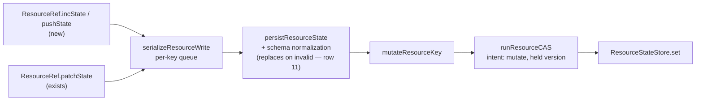

# FIX-1154: Scope state and resources split one mutation surface across two APIs — Implementation Spec

## Part I — The Case *(for the human)*

### 1. Problem — why it matters, why now

FSD gives an app two places to keep durable data: the **state bag** hanging off a session
(or user, or org), and **resources**. They are meant to be chosen by where the data
belongs. In practice developers choose by **which one carries the verb they need**.

The state bag has seven ways to change data, including "add one to this counter" and
"append to this list". Resources have four, and neither of those two is among them. Our own
documentation then tells people, in as many words, to *prefer* increment and append when
several things write at once — advice a resource user cannot take. So somebody who
correctly reached for a resource reads that line, concludes resources are the wrong
primitive for concurrent writing, and moves data back into the bag it did not belong in.

Underneath that sit eleven differences between the two surfaces. Most are written down
nowhere, and none are collected anywhere a developer comparing the two would look. Some are
deliberate and permanent; some are accidents. Nobody can currently tell which is which.

**Why now.** The epic this sits under (FIX-1157) exists to stop the verb list driving that
choice, and this issue is the only substantive piece of it. The original urgency — "data is
migrating out of the bag" — is **stale**: the deprecation issue was cancelled. What remains
is smaller and more honest, and §3 is direct about how small.

### 2. Solution in plain terms

Two things, and the second is the bigger one.

**Give resources the two missing verbs.** `incState` and `pushState` land on both public
resource handles, so the surfaces stop differing at the moment a developer scans a method
list and picks a primitive.

**Write down every remaining difference, once, where a developer will hit it.** Eleven
differences, each recorded as *closed here*, *deliberate with a reason*, or *deferred with
a trigger*.

One row is the headline, and review has now narrowed it twice. The verbs that look
identical do not promise the same thing, and they do not cost the same either:

- **Guarantee.** A resource write is *always* version-checked, so it can be refused — a
  resource can be deleted, and a check-free write would bring a deleted one back. A bag
  write can skip that check, but only on a narrow path: the adapter must implement a native
  increment or append, **and** the call must be single-field. A multi-field increment takes
  the checked path like any other write. So the durable contrast is *never skips the check*
  versus *skips it on a specific path*, not *always* versus *never*.
- **Cost.** Because a resource write goes through the whole value, appending to a resource
  list copies that list every time — fine for tens of items, not for thousands. The bag's
  native append does not. Decision 2 accepts that cost for now rather than fixing it, so it
  is a documented property with a named trigger, not an oversight, and the docs steer bulk
  appends to a single compound write.

Shipping the verbs without shipping both of those would replace one trap with a worse one.

**Both verbs land on both public resource handles**, and that is load-bearing rather than
tidiness: eight files across `@flow-state-dev/memory` and `@thought-fabric/core` already
type their resource work as `ResourceContext`, not `ResourceRef`. A verb that reaches only
one handle is invisible to every one of them, which is the same failure this issue exists
to close, one level down.

**Philosophy** — tenet 2 (composition over features): the verbs extend a write path that
already exists rather than adding a mechanism beside it. Tenet 3 (earn every addition):
this spec **drops** a tier of work the epic had deferred, **splits out** three unrelated
fixes review found bundled in, and adds no new shared abstraction. Tenet 1 (coherence): the
deliverable is a single true statement about two surfaces, replacing a docs line that is
actively misleading.

### 6. Decisions & rules — the sign-off surface

1. **Resources get `incState` and `pushState` on *both* public handles, and the docs state
   the weaker guarantee and the higher cost on the method itself.**
   Both handles is the operative half: eight files in `@flow-state-dev/memory` and
   `@thought-fabric/core` type their resource work as `ResourceContext`, so verbs on
   `ResourceRef` alone would ship without reaching a single existing consumer.
   *Rejected:* documenting the gap without closing it — that leaves the surfaces different
   in the method list, which is where the wrong choice gets made; and shipping the verbs
   quietly, which is worse than the gap because it implies a guarantee we cannot give.
   *Locks in:* two more methods on a shipped public interface that we cannot remove without
   a breaking change, and a guarantee-and-cost difference we now own forever in docs and in
   support answers. Developers who read only the method name will still sometimes assume
   the bag's behaviour.

2. **We are not building store-native increment and append for resources, and it comes off
   the roadmap — but the one condition that would reopen it is named rather than closed.**
   The epic carried it as a deferred phase. It removes no conflicts: a resource write is
   version-checked either way, so a native database increment is refused in exactly the
   situations a whole-value write is. It is not a contention fix and should stop being
   described as one. What it *would* fix is the per-append copy in §2.
   *Rejected:* leaving it deferred with no condition attached, which reads as "a contention
   fix is coming" to anyone planning against it.
   *Locks in:* less than an earlier draft of this spec claimed. Resource writes keep sending
   the whole value, so appending stays proportional to the list's length — that is the real
   cost, and it lands on anyone storing long lists in a resource. **Reversing it later is
   cheap, not expensive:** the storage contract already makes these verbs optional and
   feature-detects them per call, so adding them for resources would be additive and would
   require no change to any adapter we ship. *Trigger:* a resource holding a list long
   enough for the per-append copy to show up in practice.

3. **The difference map ships as documentation, split by audience — not pasted whole into
   every surface.**
   The caller-facing page leads with the guarantee-and-cost row; the internal contract doc
   carries the collapsed full table.
   *Rejected:* leaving it in this spec, which by our own rules never merges — the map would
   exist only where nobody looks. Also rejected: the same eleven rows in four places, which
   is a maintenance contract nobody keeps.
   *Locks in:* two pages that have to be kept true by anyone who later changes either
   surface. A stale map is worse than none, so this is an ongoing commitment.

**Non-goals** — merging the two primitives or deprecating either; a shared
`MutationContract` type (no second consumer yet); reconciling the two retry drivers (the
epic settled that they can only be eliminated, and nothing here eliminates anything);
reconciling the bag's own adapter divergence (§12 — a separate defect); cross-record
atomicity (FIX-854); and the resource-only surface with no state analogue at all — content,
`client`, `reactTo`, `edges`, collections.

**Size:** Medium — 2 production files · 13 test behaviours · 4 doc surfaces · 1 PR.
**Most of the work is documentation, not code** — the code is two methods plus a
one-line type addition.

---

### 3. Tradeoffs & alternatives

**Alternative: don't add the verbs, just document the gap.** The strongest case against
this spec, and worth stating at full strength. Every increment and append on a resource in
this repository today is **compound** — semantic memory's `addFact` appends a fact *and*
bumps a counter in one write; working memory's `advance` bumps a turn counter *and*
recomputes every entry. None would be rewritten to use a single-verb `incState`, so the two
new methods replace **zero** existing call sites. Judged on code removed, they are worth
nothing.

They are not judged on that, and the case has two legs. The softer one is the failure in §1:
somebody scans a method list and picks a primitive, upstream of any call site, where a
documentation line does not reach. The harder one is checkable — **eight files across
`@flow-state-dev/memory` and `@thought-fabric/core` already type their resource work as
`ResourceContext`** (`working-memory-helpers`, `semantic-memory-helpers`,
`episodic-memory-helpers`, `digest-helpers`, `internal/recall`, `capabilities`,
`perspective-helpers`, `perspective-capability`). Those are the consumers, they hold the
narrower handle, and they cannot reach a verb that lands only on `ResourceRef`. So decision
1 rests on discoverability *and* on a live gap in the handle those consumers use. The
epic's framing implied a capability gap instead, and that correction is this spec's.

**Alternative: give resources the store-native delta verbs too** (the epic's deferred
Tier 2). Rejected in decision 2, and the reason is counter-intuitive enough to repeat: on
the bag, a native delta verb avoids contention *because* the version check is skipped
alongside it. Resources may not skip it — a check-free write to a resource can resurrect a
deleted one — so a native resource increment would still carry a held version and conflict
exactly as often as a whole-value write does. It buys bandwidth and the per-append copy,
not conflicts.

**Where the complexity is:** not in the two verbs, which are a dozen lines each. It is in
the map, and specifically in getting each row's *reason* right rather than its existence.
Three review rounds have each narrowed a row that read as true — which is the argument for
deriving the map from the type declarations and the write path line by line, and for
stating every condition a row depends on rather than the clean version of it.

### 4. Focus practices (1–5)

1. **BP-004 (public boundary first)** — `ResourceContext` and `ResourceRef` are two public
   views of one runtime object, and a verb added to one and not the other splits the
   contract by handle type. That is the exact failure this issue exists to remove, so both
   get the verbs or neither does.
2. **BP-007 (concise API docs)** — the weaker guarantee and the per-append cost have to be
   on the methods, not only on a docs page. Someone reading a method list never reaches the
   page.
3. **State a condition or state nothing** (change-specific, not yet a BP) — every claim in
   the map that survived review did so by naming what it depends on. "Contention-free" was
   wrong twice; "contention-free on the native-delta path, single-field only" is right. The
   map ships to the docs, so an unqualified guarantee there is the next mutation story.
   **The same rule bans equivalence claims outright** (row 5): "the same op under two
   names" was refined three times and was wrong every time, because the two ops genuinely
   differ. Describe each side in its own terms and let the reader see they do not
   interchange — a reader who believes an equivalence and ports a callback loses data.
4. **Tenet 7 (prove the goal, not the mock)** — the epic's load-bearing claim was a
   type-level read. It is now run on the real path (§7).

### 5. What using it looks like (1–5 examples)

**A counter on a resource** *(what this spec proposes; today only the second form exists):*

```ts
// after
await ctx.resources.stats.incState({ factsExtracted: 1 })
await ctx.resources.stats.pushState("recentTopics", topic)

// before — still valid, and still the right tool for a compound change
await ctx.resources.stats.updateState((s) => ({
  ...s,
  factsExtracted: s.factsExtracted + 1
}))
```

**The same verbs through a shared helper.** Helpers in `@flow-state-dev/memory` and
`@thought-fabric/core` take the *context* view, not the ref, so a verb on only one handle
would be invisible here:

```ts
type SemRef = ResourceContext<SemanticMemoryState>
async function recordExtraction(ref: SemRef) {
  await ref.incState({ totalExtracted: 1 })   // reaches ResourceContext too
}
```

**What the differences look like when they bite (before / after):**

```
scope bag    await ctx.session.incState({ n: 1 })
             → single field + adapter has a native increment: version check
               skipped, so a concurrent writer cannot refuse it
             → multi-field, e.g. incState({ a: 1, b: 1 }): version-checked,
               and can raise ConcurrentModificationError on retry exhaustion

resource     await ctx.resources.stats.incState({ n: 1 })
             → always version-checked: normally lands, re-running against the
               winner on a conflict
             → ConcurrentModificationError if contention outlasts the retries
             → ResourceDeletedError if the resource was deleted underneath

resource     await ctx.resources.log.pushState("entries", e)   // in a loop
             → each append rewrites the whole list. For bulk appends use one
               compound write instead:
               await ref.updateState((s) => ({ ...s, entries: [...s.entries, ...batch] }))
```

## Part II — The Build Plan *(for the implementing agent)*

Part II carries shape and sequence, not the finished design.

### 7. Technical design

Nothing new is built. The two verbs are two more mutator bodies handed to the write path
`patchState` already uses, and the map is documentation.



- **`@flow-state-dev/core`** — `ResourceRef` and `ResourceContext` each gain `incState` and
  `pushState`. No new shared type: the epic's guard against a premature `MutationContract`
  stands and nothing here needs one.
- **`@flow-state-dev/engine`** — the resource registry gains the two ops, in **both** ref
  builders (the single-resource handle and the collection-instance handle). The retry
  driver, the store contract and every adapter are **untouched**.
- **Untouched, deliberately:** `ResourceStateStore`, `DeltaStoreOps`, both CAS drivers,
  the scope persist bridge, and every store adapter. Decision 2 keeps them out.

**Wrong-typed fields: the resource contract is defined here, independently.** The obvious
move — "match what the bag does" — is not available, because **the bag does three different
things** and nothing picks between them. Appending to a durable bag field that already
holds a non-array: the in-memory adapter **throws**, SQLite **replaces** the value, and
Postgres **wraps** it (a stored `5` becomes `[5, appended]`). That is a real defect in the
bag and it is out of scope here (§12).

So the resource verbs get their own rule, and it is one rule for both:

- **Field absent** → treat as the identity (`0` for increment, empty list for append), then
  apply. This is the ordinary first-touch case and must not be an error.
- **Field present but the wrong type** → **throw**, naming the call site.
- **Result fails the resource's own `stateSchema` for any other reason** — a refinement like
  `z.number().nonnegative()` that a decrement pushes below zero, where the JavaScript type
  is still correct → **throw**, naming the call site.

The third case is the one that looks like it needs no rule and does. **The write path does
not reject a schema-invalid result — it replaces it, destructively, and reports success.**
A single resource's invalid state is swapped for the resource's **entire default**
(`resources/normalize-resource-state.ts:44-51` — a failed `safeParse` falls through to
`normalizeResourceDefault`); a collection instance's is swapped for **`{}`**
(`context/resource-registry.ts:679-680`, the `: {}` branch). Either way the call resolves
normally and **fields the caller never touched are gone**.

So the choice here is not between rejecting and validating. It is between **throwing** and
**silently resetting state**, and this spec throws. That is the same failure class as the
other two this review has already turned up — a partial-returning callback dropping omitted
fields (row 5), and SQLite's `pushToArray` destroying a scalar (§12) — and the same answer:
a write that cannot be performed correctly must not resolve as though it were.

Mechanically the verb validates its own result against the resource's `stateSchema` before
handing it to the write path, and throws instead of returning. The store contract already
reasons this way — its delta verbs throw on a meaningless `expectedVersion` because "a
throw names the programming error at the call site" — and this follows it.

**Scoped to the new verbs, deliberately.** `patchState`, `setState` and `updateState` keep
today's destructive fallback: changing them is a behavioural break on shipped methods and is
not this issue's to make. That leaves a real inconsistency — `incState` throws where
`patchState` resets — and it is the lesser of the two evils, because the alternative is
shipping two brand-new methods into a known data-loss path. The fallback itself is filed as
its own defect in §12.

**Solution sketch — pseudocode. Illustrative, not the contract. React to the shape.**

```
on the resource handle, beside patchState:

    incState(increments):
        hand the write path a mutator that, for each field:
            absent        → start from zero, add the delta
            not a number  → throw, naming the field
            otherwise     → add the delta
        then check the whole result against the resource's schema:
            invalid       → throw   (NOT hand it on — the write path
                                     would reset the state and succeed)

    pushState(field, value):
        same shape, with empty-list and not-a-list

both go through the per-key queue and the version-checked driver,
exactly as patchState does — no new intent, no new hint, no store change
```

What this asks a reviewer: *is riding the existing mutator seam the right shape, or should
these carry an intent hint the way the bag's verbs do?* This spec says the former, and
decision 2 is why — a hint would have nowhere to route to.

**POC — built on this branch; results in §12.**

```
pnpm install
cd spec-poc/FIX-1154-resource-mutation-verbs && ../../node_modules/.bin/vitest run
```

### 7a. The mutation-surface map — this issue's headline deliverable

Derived line by line from `ScopeStateOps` (`packages/core/src/types/state.ts`),
`ResourceRef` and `ResourceContext` (`packages/core/src/types/resource.ts`), and the write
path each op takes. **Verdict is one of: closed here · deliberate asymmetry with a reason ·
deferred with a trigger.** This table is the source for the docs in §11 — which ship it
split by audience, not pasted whole.

The epic asserted a version of this claim three times and each was falsified by the next
review round, which is why every row states what it depends on rather than the clean
version of it.

| # | Difference | State bag | Resource | Verdict |
|---|---|---|---|---|
| 1 | `incState` | present | absent | **Closed here** — added to both resource handles, version-checked, with the wrong-type contract in §7 |
| 2 | `pushState` | present | absent | **Closed here** — same |
| 3 | `setStateRecord(field, key, value)` | present | absent | **Deliberate** — it addresses one slot inside a blob many writers share. A resource *is* the per-key row, so the storage key already does that addressing. A map nested inside a resource's own state is reached with `updateState` |
| 4 | `deleteStateRecord(field, key)` | present | absent | **Deliberate** — same addressing argument. Note this removes a key *inside* a state field; it is not the resource-lifecycle delete, which resources have separately |
| 5 | Re-run-a-callback mutation | `atomicState(fn)` — `fn` returns a **partial**, which the bag shallow-merges over current state. Fields the callback omits are **kept** | `updateState(fn)` — `fn` returns the **whole next state**, which is then schema-normalized and written. Fields the callback omits are **gone** | **Deliberate, and NOT interchangeable.** Both re-run their callback against refreshed state on retry, and that is where the similarity stops. Moving a callback from one to the other **silently drops every field it does not return** — the bag merges, the resource replaces. **Never describe these as the same op under two names**; a reader who believes that and ports a callback loses data. See also row 9 for the sync/async and read-only differences on the same pair |
| 6 | `getOrPatchState` | absent | present on `ResourceRef`, **absent on `ResourceContext`** | **Bag side: deliberate** (no demand; no per-key single-flight seam exists there). **Handle split: closed here** — `ResourceContext` is the handle the eight named consumers actually hold, so a verb missing from it is the same failure as a verb missing from resources. The runtime already exists on `ResourceRef`; this is the type surface catching up |
| 7 | Return type | `Promise<boolean>` — callers branch on it to suppress a redundant change event | `Promise<void>` — the driver verifies the no-op internally and gates the event itself | **Deliberate** — settled at epic altitude. New verbs return `void`, matching their surface |
| 8 | `patchState` keyed-updater form `(key, updater)` | present | absent | **Deferred** — the overload exists to produce a read-modify-write routing hint, which resources have nowhere to route to (decision 2). `updateState` already covers read-then-compute. *Trigger:* revisit only if decision 2 is reversed |
| 9 | Callback signature on that same pair | `atomicState`: callback must be **synchronous**; its parameter is typed read-only | `updateState`: callback **may be async**; its parameter is **not** typed read-only | **Deliberate** — resource updaters do I/O, so async is required there. Row 5 owns the return-shape difference; this row is the two remaining signature differences. The non-read-only parameter is a type-level laxity the runtime compensates for by cloning before the callback sees it. **Deferred:** tightening it breaks existing call sites for no behaviour change. *Trigger:* the next breaking change to this interface |
| 10 | **Guarantee and cost of the verbs they share** | **Guarantee:** a write skips the version check — and so cannot be refused — only when it emits a commutative hint **and** the adapter implements the matching delta verb. Both conditions are narrow: `incState({a:1,b:1})` emits no commutative hint and takes checked CAS, and the delta verbs are **optional on the store contract**. Every adapter we ship implements them. **Cost:** a native delta verb sends only the delta | **Guarantee:** every write is version-checked and can raise a conflict or a deleted-resource error. No exceptions and no adapter can change it. **Cost:** every write sends the whole value, so appending to a list is proportional to the list's length | **Deliberate and permanent on the resource side** — resources have a lifecycle and bag records do not, so a check-free write to a resource could resurrect a deleted one; decision 2 locks in the whole-value cost. **The bag side is doubly conditional and the conditions must travel with the claim.** No caller-facing doc states either half today. The sharpest row, and the easiest to publish wrongly |
| 11 | What happens to a schema-invalid write | none at the mutator layer — the bag does not re-check the schema per write | **Not validation — a destructive fallback.** A result that fails the resource's `stateSchema` is not rejected: a single resource's state is replaced with the resource's **entire default** (`normalize-resource-state.ts:44-51`), a collection instance's with **`{}`** (`resource-registry.ts:679-680`). The call then resolves successfully, having erased fields the caller never touched | **Deliberate that a resource carries its own schema; NOT deliberate that violating it silently resets state.** The new verbs (rows 1–2) **throw** rather than enter this path — §7. `patchState` / `setState` / `updateState` keep it, because changing shipped methods is out of scope here, so the inconsistency is real and named. **Never describe this row as validation**; the word implies a rejection that does not happen. The fallback is filed as its own defect (§12) |

Rows 1 and 2 are the code change. Everything else is the documentation change or a
follow-up. Nothing is left as "unknown".

### 8. Implementation sequence

Two unrelated cleanups review found bundled here have been **cut** — see §12. What remains
is one coherent change.

**Two axes, and getting either wrong ships a no-op.** The verbs must reach both *public
handles* (`ResourceRef` **and** `ResourceContext`) and both *ref builders* (the
single-resource handle and the collection-instance handle). These are different things:
the first is the type surface consumers hold, the second is the runtime wiring, and they
live in different packages.

1. **Add both verbs to both public handles** — `ResourceRef` **and** `ResourceContext`.
   `ResourceContext` is not optional here: it is the handle the eight consumer files in
   `@flow-state-dev/memory` and `@thought-fabric/core` type against, so verbs that land
   only on `ResourceRef` would reach none of them and the issue would close without
   solving anything. Document the weaker guarantee and the per-append cost on the methods
   themselves (focus practice 2). *Test:* a type test pinning that a
   `ResourceContext`-typed value can call both. *Depends on:* nothing.
2. **Close the `getOrPatchState` handle gap** (map row 6) — add it to `ResourceContext`,
   which the runtime already satisfies via `ResourceRef`. Same BP-004 gap as step 1, same
   consumers, one line of type surface. *Test:* the same type test. *Depends on:* nothing.
3. **Implement both ops in the resource registry**, in **both** ref builders, with the
   wrong-type contract from §7. *Test:* the behaviours in §10. *Depends on:* 1.
4. **Ship the map** per §11, and **correct the concurrency-guidance line** that currently
   tells readers to prefer increment and append for concurrent writes without saying which
   primitive, which adapter, or which arity that holds for. *Depends on:* 1–3, so the docs
   describe what shipped.

*(No removals. Subtraction here is decision 2 and the §12 split — work removed from this
change rather than code removed from the tree.)*

### 9. Edge cases & error handling

| Case | Expected |
|---|---|
| `incState` on an absent field | Starts from `0`, then increments |
| `pushState` on an absent field | Starts from an empty list, then appends |
| `incState` on a field holding a non-number | **Throws**, naming the field — §7. Deliberately *not* the bag's coercion, which the bag itself does not apply consistently |
| `pushState` on a field holding a non-array | **Throws**, naming the field — §7 |
| Multi-field `incState` on a resource | No special case: every resource write is version-checked regardless of arity, so a resource has no equivalent of the bag's single-field/multi-field split (row 10) |
| Either verb on a resource never yet stored | Creates it from its schema default plus the change. Proven in the POC |
| Either verb producing no change | A **verified** no-op: no write, no version bump, no change event — and specifically **not** an error about a deletion. Proven in the POC |
| Either verb racing a delete of the same resource | Terminal `ResourceDeletedError`. Never a resurrection. Proven in the POC |
| Two contexts running the same verb on one resource | Both land; the loser re-runs against the winner. Proven in the POC |
| Contention outlasting the retry budget | `ConcurrentModificationError`, as every other resource write already does |
| Either verb on a resource declared `writable: false` | Rejected, on the same path `patchState` already rejects |
| Either verb producing a value that violates a **schema refinement** while keeping the right JavaScript type — e.g. `incState({ n: -1 })` on `z.number().nonnegative()` | **Throws.** This is the case that looks safe and is not: handing it on does not reject it, it **replaces the whole state** — with the resource's default for a single, with `{}` for a collection instance — and resolves successfully (§7, row 11). The type-level checks above do not catch it, because the type is correct |
| Either verb producing a value the resource's schema rejects for any other reason | **Throws**, same rule and same reason |

**Taxonomy:** the three errors resource writes already raise, for the same reasons, plus one
new *fatal* class — a result the resource's schema rejects, whether by JavaScript type or by
refinement. Both are programming errors at the call site and must never be retried, and both
must throw rather than reach the write path, which would reset the state and report success.

**Second path (BP-035):** the second path here is the **collection-instance** handle, not
the single-resource one. A change tested only against `ctx.resources.foo` would ship half
the feature — the two handles are built by separate code in the same module.

### 10. Testing strategy

**No goal check applies.** The deliverable is a public-type change plus documentation, and
the behaviour underneath is the existing write path, already exercised on the real path by
the POC. A real-model goal run would exercise nothing this change touches.

**CI specs** (the behaviours, not the test names):

1. increment on a single resource
2. append on a single resource
3. both verbs on a **collection instance** (BP-035)
4. absent field takes the identity for both verbs
5. wrong-typed field **throws** for both verbs, and the message names the field
6. **a schema-refinement violation that keeps the right JavaScript type throws** — e.g.
   `incState({ n: -1 })` against `z.number().nonnegative()` — on a single resource **and**
   on a collection instance. Each paired with an assertion that **the resource's other
   fields are untouched afterwards**, because the failure this guards is not a bad value
   being stored, it is the whole state being reset while the call reports success. A test
   that only asserts "it threw" would pass against an implementation that threw *after*
   the reset landed
7. multi-field increment on a resource behaves as any other resource write
8. concurrent increments from two contexts converge
9. a verb racing a delete is terminal
10. a no-change verb is a verified no-op that does not bump the version
11. **a no-change verb emits no `resource_change`** — on a **collection instance** and on a
    **live (or `reactTo`) single resource**, each paired with a negative control proving the
    event fires for a real change. This is the half that matters: `committed: false` exists
    *because* the notification is gated on it, and the two ref builders each carry their own
    copy of that gate, so an implementation could notify on a no-op in one and stay green on
    the other
12. a `ResourceContext`-typed value exposes `incState`, `pushState` **and**
    `getOrPatchState` — easy to get half-right, because adding to `ResourceRef` alone
    type-checks everywhere and silently leaves the eight consumer files unable to call them
13. `updateState`, `patchState` and `setState` behave byte for byte as today

**Constraint on graduating rows 8–10 from the POC:** the POC models the verbs as wrappers
over `updateState` and casts through `as any` / `as unknown as`. That is fine for
throwaway code and **not** fine in CI — the graduated specs must call the real
`incState` / `pushState` on typed `ResourceRef` and `ResourceContext` values, or they would
pass without the shipped methods existing.

**Discipline:** `tdd`. The seam is the resource registry, reachable from a vitest spec over
`createExecutionContext` with in-memory stores — the harness the POC already uses.

### 11. Documentation plan

The map ships **split by audience**. Eleven rows in four places is a maintenance contract
nobody keeps, so each surface gets the slice its reader needs and only that.

- **EXTEND** `apps/docs/docs/state/mutation-model.md` — the published page a developer
  choosing between the primitives lands on. **Lead the resource section with row 10** — the
  guarantee difference and the cost difference — rather than leaving it at the end where a
  linear reader has already stopped. Decision 1 says we own that difference permanently, so
  it is the first thing a caller should read. Then the verb lists. One minimal example: the
  same counter written both ways, with what each can raise; plus the bulk-append steer from
  §5. *Cross-link:* ← resources overview, → the scopes page.
  *Voice risk:* "atomic" means two different things across this page. Never use it
  unqualified here.
- **EXTEND** `docs/architecture/state-and-scopes.md` — the internal contract reference, and
  the paragraph this issue owns under the epic's shared-surface convention. Carry the
  **collapsed** table: rows 3 and 4 merge into one addressing row, rows 8 and 9 drop to a
  footnote (both are deferred-with-trigger and are noise inline). Correct the
  concurrency-guidance line per §8 step 3. **Leave the pointer sentence to the retry
  driver's policy table alone** — the epic reversed an earlier plan to move that table.
- **EXTEND** `packages/core/README.md` — the `ResourceRef` / `ResourceContext` entries gain
  the new verbs, with a pointer to the map. No table.
- **EXTEND** `docs/contributing/architecture-reference.md` — the locked-contracts list names
  the seven bag ops with no resource counterpart. Add the resource line. One line, no table.
- **No new page.** This is one section under two existing concepts.

### 12. Dependencies, open questions & follow-ups

**Dependencies:** none. No open PR touches either type file or the resource registry.
FIX-1158 (the epic's other active child) shares no code with this, and the epic states its
children are independent.

**Open questions:** none.

**Settled claims**

- **Settled:** the retry driver's conflict policy survives under increment- and
  append-shaped mutators on the real resource path — **CONFIRMED**. Ten rows, all passing:
  concurrent increments converge · concurrent appends converge · both verbs stay
  **terminal** against a deleted resource rather than resurrecting it · a zero increment is
  a **verified** no-op that neither bumps the version **nor emits a `resource_change`**,
  checked on both a live single handle and a collection instance, each with a negative
  control proving the event fires for a real change · a first touch of a never-stored
  resource is not misreported as a deletion · two first-touch increments converge rather
  than raising already-exists. (`spec-poc/FIX-1154-resource-mutation-verbs/`; run command
  in §7.)
- **Not reached — the POC says nothing about schema-invalid results.** Its ten rows all use
  a permissive schema, so none of them enters the destructive fallback in row 11. The throw
  contract in §7 rests on **reading** `normalize-resource-state.ts:44-51` and
  `resource-registry.ts:679-680`, not on running them. That is why §10 behaviour 6 asserts
  the *surviving fields* rather than just the throw: the untested path is the one where a
  reset lands and the call still succeeds.
- **Not reached, and deliberately so:** the epic's theme-2 claim as originally written
  covers *store-native delta verbs* carrying a held version. Decision 2 drops that tier, so
  no code in scope exercises it and the POC does not speak to it. The obligation is
  **dissolved by scope reduction, not discharged by evidence** — recorded plainly because
  reversing decision 2 re-opens it.

**Split out of this change (review found them bundled; each wants its own issue):**

- **The retry driver's stale citations.** Its module header explains itself with seven
  line-number citations into neighbouring modules; **six point at the wrong lines** on
  current `main` (one at a blank line, one at a type declaration), an eighth in the body is
  wrong too, and one is wrong in *substance*: it attributes the unconditional-write
  downgrade to the scope CAS driver's commutative path when it actually comes from the
  scope persist bridge one module over. Re-cite by symbol, and fix the attribution.
- **The guard at the point of temptation** (epic theme 1) — a doc comment on
  `createScopeStateOps`, exported from the engine package root, warning that its
  identically-named ops are the wrong import for a resource.

**Follow-ups (flagged, not built):**

- **A schema-invalid resource write silently resets state, and reports success.** Not a
  rejection — a *replacement*: the resource's entire default for a single
  (`normalize-resource-state.ts:44-51`), `{}` for a collection instance
  (`resource-registry.ts:679-680`). Every existing write op — `patchState`, `setState`,
  `updateState` — goes through it, so a refinement violation anywhere erases fields the
  caller never touched, with no error. The new verbs throw instead of entering it (§7), but
  that leaves the shipped three unchanged and the surfaces inconsistent. Changing them is a
  behavioural break on public methods and **wants its own issue** — the same shape as the
  divergence below, and probably the more serious of the two, since it needs no unusual
  adapter to fire.
- **The bag's `pushToArray` diverges across adapters, three ways** — appending to a durable
  bag field that already holds a non-array **throws** in the in-memory adapter, **replaces**
  the value in SQLite, and **wraps** it in Postgres. One of those silently destroys data.
  This is a real defect, it is why §7 defines the resource contract independently, and it
  **wants its own issue**.
- **A losing commutative bag write is not retried** — on an adapter without the native
  verb, it is reported to the caller as a no-op rather than retried, which is a silently
  dropped write. Out of scope (this issue does not change bag behaviour) and already
  tracked by [FIX-710](https://linear.app/fixpoint-labs/issue/FIX-710).
- **Map rows 8 and 9** carry their own triggers; neither fires while decision 2 holds.
- **Deepening:** the two ref builders in the resource registry duplicate their write-op
  bodies almost exactly, and this change adds two more pairs. Follow up via
  `improve-codebase-architecture`.

---

## Spec evolution

- **Spec drafted** — framed as a discoverability failure rather than a capability gap,
  because every increment and append on a resource in the repository today is compound and
  would not use a single verb; built the map from the type declarations after the epic's
  three attempts at the claim were each falsified; dropped the epic's deferred store-native
  tier outright, because a version-checked resource write conflicts exactly as often with
  or without it; ran the epic's least-evidenced claim as a POC on the real path, where it
  held.
- **After spec review, round 1** — the bag half of row 10 was wrong twice over. It claimed
  a commutative bag write is unconditionally contention-free; in fact the check-free path
  needs the adapter to implement the matching delta verb *and* the call to be single-field,
  since a multi-field increment emits no commutative hint. The row, §2 and the §5 example
  now carry both conditions. Separately, "coercion parity with the bag" turned out to be
  unspecifiable — the bag's own adapters do three different things with a wrong-typed field
  — so §7 defines the resource contract independently and the divergence is filed as its
  own defect. The resource half of row 10 and decision 2 are unchanged.
- **After spec review, round 2** — split two unrelated cleanups out of §8 (the driver's
  stale citations, the temptation guard); a third proposed cut, `getOrPatchState` on
  `ResourceContext`, was **kept in** on second look, because `ResourceContext` is the handle
  eight existing consumer files actually hold, which makes it the same gap this issue
  closes rather than adjacent hygiene. Those eight files also replaced the unfalsifiable
  autocomplete argument as decision 1's evidence. Row 10 gained the **cost** asymmetry
  beside the guarantee one — every resource append is proportional to the list. Decision 2's
  reversal cost was **corrected downward**: an earlier draft claimed reopening it meant
  changing the contract every adapter implements, but the storage contract already makes
  these verbs optional and feature-detects them, so it would be additive; the decision now
  rests on "not a contention fix and we are not building it", with the per-append cost as a
  named trigger. Row 5's "same op under two names" was **replaced, not refined** — the bag
  merges a partial and the resource replaces with the whole state, so porting a callback
  across silently drops fields; a third refinement of an equivalence claim would have been
  the fourth wrong version of it. The POC gained the assertion the no-op row actually needed
  — that no `resource_change` is emitted — on both ref builders, each with a negative
  control. Documentation moved from four full copies of the map to a split by audience.
- **Factual correction after convergence** — row 11 described per-write schema handling as
  *validation*. It is not: a result the schema rejects is **replaced**, not refused — with
  the resource's whole default for a single, with `{}` for a collection instance — and the
  call then resolves successfully, having erased fields the caller never touched. The gap
  this opens is a refinement violation that keeps the right JavaScript type (a decrement
  below `nonnegative()`), which every type-level check in the spec missed. The new verbs now
  **throw** on any schema-invalid result rather than entering that path; the three shipped
  ops keep it, because changing them is a behavioural break out of scope, and the fallback
  is filed as its own defect. Row 11, §7, §9, §10 and the taxonomy all changed; nothing in
  §6 did.
