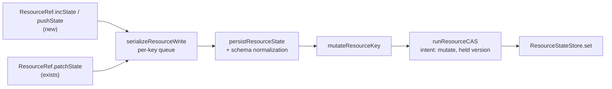

# FIX-1154: Scope state and resources split one mutation surface across two APIs — Implementation Spec

## Part I — The Case *(for the human)*

### 1. Problem — why it matters, why now

FSD gives an app two places to keep durable data: the **state bag** hanging off a session
(or user, or org), and **resources**. They are meant to be chosen by where the data
belongs. In practice developers choose by **which one carries the verb they need**.

The state bag has seven ways to change data, including "add one to this counter" and
"append to this list". Resources have four, and neither of those two is among them. Our own
documentation then tells people, in as many words, to *prefer* increment and append when
several things write at once — advice a resource user cannot take. So somebody who
correctly reached for a resource reads that line, concludes resources are the wrong
primitive for concurrent writing, and moves data back into the bag it did not belong in.

**Why now.** The epic this sits under (FIX-1157) exists to stop the verb list driving that
choice, and this issue is the only substantive piece of it. The original urgency —
"data is migrating out of the bag" — is **stale**: the deprecation issue was cancelled.
What remains is a smaller and more honest claim: the two surfaces differ in eleven ways,
most of them written down nowhere, and none of them collected anywhere a developer
comparing the two would look. They are guessing at which differences are deliberate, and
the guessing is cheap to end.

There is a workaround and it works fine — `updateState` on a resource does everything
`incState` and `pushState` do, and is already how every increment and append in this
repository is written. That matters, and §3 is honest about what it means for the size of
the prize.

### 2. Solution in plain terms

Two things, and the second is the bigger one.

**Give resources the two missing verbs.** `incState` and `pushState` land on both resource
handles, so the surfaces stop differing in ways a developer meets before they meet the
reason.

**Write down every remaining difference, once, where a developer will hit it.** Eleven
differences between the two surfaces, each recorded as *closed here*, *deliberate with a
reason*, or *deferred with a trigger*. Today that map does not exist in any form — the epic
tried three times to state it and was wrong each time — so anyone comparing the two is
reverse-engineering it from two type files.

One difference is the headline and is **permanent**: the verbs that look identical do not
promise the same thing. On the state bag an increment is *contention-free* — it can never
fail because someone else wrote at the same moment. On a resource it cannot be, because a
resource can be deleted and a contention-free write would bring a deleted one back. So a
resource increment is version-checked and can, under sustained contention, be refused.
Shipping the verb without shipping that sentence would replace one trap with a worse one.

**Philosophy** — tenet 2 (composition over features): the verbs extend a write path that
already exists rather than adding a mechanism beside it. Tenet 3 (earn every addition):
this spec **drops** a tier of work the epic had merely deferred, and adds no new shared
abstraction. Tenet 1 (coherence): the deliverable is a single true statement about two
surfaces, replacing a docs line that is actively misleading.

### 6. Decisions & rules — the sign-off surface

1. **Resources get `incState` and `pushState` as ergonomic parity, and the docs say
   plainly that "atomic" means something weaker on a resource than on the state bag.**
   *Rejected:* documenting the gap without closing it — leaves the two surfaces different
   in autocomplete, which is where the wrong choice actually gets made; and shipping the
   verbs quietly, which is worse than the gap because it promises a guarantee we cannot
   give.
   *Locks in:* two more methods on a shipped public interface that we cannot remove
   without a breaking change, and a difference in what "atomic" means that we now own
   forever in docs and in support answers. Developers who read only the method name will
   still occasionally assume the stronger guarantee.

2. **Store-native increment and append for resources is dropped, not deferred.**
   The epic left it on the roadmap. It buys nothing: a resource write is version-checked,
   so a native database increment is refused in exactly the same situations a whole-value
   write is. The only saving is how many bytes travel, and we have no resource large enough
   for that to register.
   *Rejected:* keeping it deferred, which reads as "coming later" to anyone planning
   against it.
   *Locks in:* resource writes always send the whole value. If a customer ever runs
   resources big enough for payload size to hurt, reopening this means changing the storage
   contract every adapter implements — a bigger bill later than it would be now.

3. **The difference map ships as documentation, not as spec text.**
   *Rejected:* leaving it in this spec, which by our own rules never merges — the map would
   exist only where nobody looks.
   *Locks in:* one page that has to be kept true by anyone who later changes either
   surface. A stale map is worse than none, so this is a maintenance commitment, not a
   one-off write-up.

**Non-goals** — merging the two primitives or deprecating either; a shared
`MutationContract` type (no second consumer yet); reconciling the two retry drivers (the
epic settled that they can only be eliminated, and nothing here eliminates anything);
cross-record atomicity (FIX-854); and the resource-only surface with no state analogue at
all — content, `client`, `reactTo`, `edges`, collections.

**Size:** Medium — 5 production files · 10 test behaviours · 4 doc surfaces · 1 PR.

---

### 3. Tradeoffs & alternatives

**Alternative: don't add the verbs, just document the gap.** Genuinely tempting and the
strongest case against this spec. Every increment and append on a resource in this
repository today is **compound** — semantic memory's `addFact` appends a fact *and* bumps a
counter in one write; working memory's `advance` bumps a turn counter *and* recomputes
every entry. None of them would be rewritten to use a single-verb `incState`, so the two
new methods replace **zero** existing call sites. Judged on code removed, they are worth
nothing.

They are not judged on that. The failure this issue describes happens at the moment
somebody scans an autocomplete list and picks a primitive, which is upstream of any call
site. A documentation line does not reach that moment. That is the whole argument for
decision 1, and it is worth stating that it rests on discoverability rather than on
capability — because the epic's framing implied the opposite.

**Alternative: give resources the store-native delta verbs too** (the epic's deferred
Tier 2). Rejected in decision 2, and the reason is worth repeating because it is
counter-intuitive: on the state bag those verbs are fast *because* they skip the version
check. Resources may not skip it — a contention-free write to a resource can resurrect a
deleted one — so a native resource increment conflicts exactly as often as a whole-value
write does. It saves bandwidth, not conflicts.

**Where the complexity is:** not in the two verbs, which are a dozen lines each. It is in
the map, and specifically in getting the *reasons* right rather than the list. The epic
narrowed its version of this claim twice and both narrowings were falsified by the next
review round. That history is why the map here is derived from the two type declarations
line by line, and why each row says which of three things it is rather than just noting
that a difference exists.

### 4. Focus practices (1–5)

1. **BP-004 (public boundary first)** — `ResourceContext` and `ResourceRef` are two public
   views of one runtime object, and a verb added to one and not the other splits the
   contract by handle type. That is the exact failure this issue exists to remove, so both
   move together or neither does.
2. **BP-007 (concise API docs)** — the weaker guarantee from decision 1 has to be on the
   method, not only on a docs page. Someone reading autocomplete never reaches the page.
3. **BP-034 (finish the refactor)** — the retry driver's module header explains itself with
   seven line-number citations into neighbouring modules. **Six of the seven point at the
   wrong lines on current `main`** (one at a blank line, one at a type declaration), and an
   eighth in the file body is wrong too. Re-cite by symbol so the next edit to a neighbour
   cannot rot them again.
4. **Tenet 7 (prove the goal, not the mock)** — the epic's load-bearing claim was a
   type-level read. It is now run (§7), and any further claim about how these verbs behave
   under contention gets the same treatment.

### 5. What using it looks like (1–5 examples)

**A counter on a resource** *(what this spec proposes; today only the second form exists):*

```ts
// after
await ctx.resources.stats.incState({ factsExtracted: 1 })
await ctx.resources.stats.pushState("recentTopics", topic)

// before — still valid, still the right tool for a compound change
await ctx.resources.stats.updateState((s) => ({
  ...s,
  factsExtracted: s.factsExtracted + 1
}))
```

**The same two verbs through a shared helper.** This is the case decision 1's second half
is about — helpers in `@flow-state-dev/memory` and `@thought-fabric/core` take the
*context* view, not the ref, so a verb on only one of them is invisible here:

```ts
type SemRef = ResourceContext<SemanticMemoryState>
async function recordExtraction(ref: SemRef, topic: string) {
  await ref.incState({ totalExtracted: 1 })   // reaches ResourceContext too
}
```

**What the guarantee difference looks like when it bites (before / after):**

```
scope bag    await ctx.session.incState({ n: 1 })
             → never refused; the store applies the delta unconditionally

resource     await ctx.resources.stats.incState({ n: 1 })
             → normally lands, re-running against the winner on a conflict
             → raises ConcurrentModificationError if contention outlasts the retries
             → raises ResourceDeletedError if the resource was deleted underneath
```

## Part II — The Build Plan *(for the implementing agent)*

### 7. Technical design

Nothing new is built. The two verbs are two more mutator bodies handed to the write path
`patchState` already uses, and the map is documentation.



- **`@flow-state-dev/core`** — `ResourceRef` and `ResourceContext` each gain `incState` and
  `pushState`; `ResourceContext` also gains `getOrPatchState`, which `ResourceRef` already
  has (see the map, row 6). No new shared type: the epic's guard against a premature
  `MutationContract` stands, and nothing here needs one.
- **`@flow-state-dev/engine`** — the resource registry gains the two ops, in **both** ref
  builders (the single-resource handle and the collection-instance handle). The retry
  driver, the store contract and every adapter are **untouched**.
- **Untouched, deliberately:** `ResourceStateStore`, `DeltaStoreOps`, `cas.ts`,
  `scope-persist.ts`'s routing, and every store adapter. Decision 2 is what keeps them out.

**The coercions must match the state bag's**, or the two primitives disagree about what a
missing field means. The bag treats a non-numeric value as `0` and a non-array value as
empty; the resource ops do the same, and one behaviour in §10 pins it.

**Solution sketch — pseudocode. Illustrative, not the contract. React to the shape.**

```
on the resource handle, beside patchState:

    incState(increments):
        hand the write path a mutator that, for each field,
        replaces it with (current-as-number + delta)

    pushState(field, value):
        hand the write path a mutator that
        replaces the field with (current-as-list + [value])

both go through the per-key queue and the version-checked driver,
exactly as patchState does — no new intent, no new hint, no store change
```

What this asks a reviewer: *is riding the existing mutator seam the right shape, or should
these carry an intent hint the way the scope-side verbs do?* The answer this spec gives is
the former, and decision 2 is why — a hint has nowhere to route to.

**POC — built, and the premise held.** The epic named one claim its most load-bearing and
least evidenced: that the retry driver's conflict policy survives under increment and
append. `spec-poc/FIX-1154-resource-mutation-verbs/` runs it on the real path — two
execution contexts over one store, no mocks — across eight rows: concurrent increments
converge, concurrent appends converge, both verbs stay **terminal** against a deleted
resource rather than resurrecting it, a zero increment is a **verified** no-op that does
not bump the version, a first touch of a never-stored resource is not reported as a
deletion, and two first-touch increments converge rather than raising already-exists.
**All eight pass** — see §12. Run it:

```
pnpm install
cd spec-poc/FIX-1154-resource-mutation-verbs && ../../node_modules/.bin/vitest run
```

The POC covers the driver under these mutator shapes. It says nothing about a store-native
delta verb, which is why dropping that tier (decision 2) also dissolves the part of the
epic's proof obligation this evidence does not reach — see §12.

### 7a. The mutation-surface map — this issue's headline deliverable

Derived line by line from `ScopeStateOps` (`packages/core/src/types/state.ts`),
`ResourceRef` and `ResourceContext` (`packages/core/src/types/resource.ts`). **Verdict is
one of: closed here · deliberate asymmetry with a reason · deferred with a trigger.** This
table is what ships into the docs (§11); it is not spec-only.

| # | Difference | State bag | Resource | Verdict |
|---|---|---|---|---|
| 1 | `incState` | present; routes to a store-native increment where the adapter has one | absent | **Closed here** — added to both resource handles, version-checked |
| 2 | `pushState` | present; routes to a store-native append where available | absent | **Closed here** — same |
| 3 | `setStateRecord(field, key, value)` | present | absent | **Deliberate** — it addresses one slot inside a blob many writers share. A resource *is* the per-key row, so the storage key already does that addressing. A map nested inside a resource's own state is reached with `updateState` |
| 4 | `deleteStateRecord(field, key)` | present | absent | **Deliberate** — same addressing argument. Note this removes a key *inside* a state field; it is not the resource-lifecycle delete, which resources have separately |
| 5 | `atomicState` | present | absent **by name only** — `updateState` runs the identical mechanism (re-run a mutator against state refreshed on every retry) | **Deliberate** — one mechanism, two shipped names. Renaming either is breaking and buys no behaviour |
| 6 | `getOrPatchState` | absent | present on `ResourceRef`, **absent on `ResourceContext`** | **Bag side: deliberate** (no demand; no per-key single-flight seam exists there). **Handle split: closed here** — the two are views of one runtime object, so the gap is accidental |
| 7 | Return type | `Promise<boolean>` — callers branch on it to suppress a redundant change event | `Promise<void>` — the driver verifies the no-op internally and gates the event itself | **Deliberate** — settled at epic altitude. New verbs return `void`, matching their surface |
| 8 | `patchState` keyed-updater form `(key, updater)` | present | absent | **Deferred** — the overload exists to produce a read-modify-write routing hint, which resources have nowhere to route to (decision 2). `updateState` already covers read-then-compute. *Trigger:* revisit only if decision 2 is ever reversed |
| 9 | Updater shape | `atomicState`: **synchronous**, returns a partial that is shallow-merged, parameter is read-only | `updateState`: **may be async**, returns whole state, parameter is **not** typed read-only | **Deliberate** — the resource shape is the better one; resource updaters do I/O. The non-read-only parameter is a **type-level laxity** the runtime already compensates for by cloning before the mutator sees it. **Deferred:** tightening it would break existing call sites for no behaviour change. *Trigger:* the next breaking change to this interface |
| 10 | **Concurrency semantics of the verbs they share** | a single-field literal patch is *commutative* — persisted unconditionally, cannot conflict | every resource write is version-checked and can raise a conflict or a deleted-resource error | **Deliberate and permanent** — resources have a lifecycle and bag records do not, so an unconditional write to a resource could resurrect a deleted one. **No caller-facing doc states this today** — the internal driver header explains the mechanism, but nothing tells a developer the two same-named verbs promise different things. The sharpest row in the table |
| 11 | Per-write schema validation | none at the mutator layer | every write is normalized against the resource's own state schema before it persists | **Deliberate** — a resource carries its own schema; the bag's schema is composed from block partials and validated elsewhere |

Rows 1, 2 and half of 6 are the code change. Rows 3–5 and 7–11 are the documentation
change. Nothing in the table is left as "unknown".

### 8. Implementation sequence

1. **Add the two verbs to the type surface** — `ResourceRef` and `ResourceContext` both,
   plus `getOrPatchState` on `ResourceContext` (map row 6). Document the weaker guarantee
   on the methods themselves (focus practice 2). *Test:* type tests pinning that a value
   typed as `ResourceContext` can call all three, since that is the shape every shared
   helper in `@flow-state-dev/memory` and `@thought-fabric/core` takes. *Depends on:*
   nothing.
2. **Implement both ops in the resource registry**, in **both** ref builders — the
   single-resource handle and the collection-instance handle. Coercions mirror the state
   bag's. *Test:* the behaviours in §10. *Depends on:* 1.
3. **Fix the retry driver's module header** — re-cite **by symbol, not line number**
   (six of seven header citations are wrong on current `main`, plus one in the body).
   One is wrong in substance, not only in position: the header attributes the
   unconditional `"any"` write to the scope driver's commutative path, where it actually
   comes from the scope *persist* bridge one module over. Correct the attribution while
   re-citing — a wrong explanation outlives a wrong line number. *Test:* none; verified by
   confirming each cited symbol exists. *Depends on:* nothing.
4. **Add the guard at the point of temptation** (epic theme 1) — a doc comment on
   `createScopeStateOps`, which is exported from the engine package root and is what a
   developer autocompletes, warning that its identically-named ops are the wrong import for
   a resource. A weaker one on `createScopePersist`, which is not re-exported anywhere.
   *Depends on:* nothing.
5. **Ship the map** (§7a) into the docs per §11, and **correct the concurrency-guidance
   line** that currently tells readers to prefer increment and append for concurrent
   writes without saying which primitive that holds for. *Depends on:* 1–2 landing, so the
   docs describe what shipped.

*(No removals. Subtraction here is decision 2 — work removed from the roadmap rather than
code removed from the tree — and there is no dead code this change orphans.)*

### 9. Edge cases & error handling

| Case | Expected |
|---|---|
| `incState` on a field holding a non-number | Treated as `0`, then incremented — matches the state bag exactly |
| `pushState` on a field holding a non-array | Treated as empty, then appended — matches the state bag exactly |
| Either verb on a resource never yet stored | Creates it from its schema default plus the change. Proven in the POC |
| Either verb producing no change (zero increment on a never-stored resource) | A **verified** no-op: no write, no version bump, no change event — and specifically **not** an error about a deletion. Proven in the POC |
| Either verb racing a delete of the same resource | Terminal `ResourceDeletedError`. Never a resurrection. Proven in the POC |
| Two contexts running the same verb on one resource | Both land; the loser re-runs against the winner. Proven in the POC |
| Contention outlasting the retry budget | `ConcurrentModificationError`, as every other resource write already does |
| Either verb on a resource declared `writable: false` | Rejected, on the same path `patchState` already rejects |
| Either verb producing a value the resource's schema rejects | Normalized by the existing per-write schema step (map row 11) — no new behaviour |

**Taxonomy:** unchanged. These verbs raise exactly the three errors resource writes already
raise, for exactly the same reasons. No new error type, no new guard.

**Second path (BP-035):** the second path here is the **collection-instance** handle, not
the single-resource one. A change tested only against `ctx.resources.foo` and not against a
collection instance would ship half the feature — the two handles are built by separate
code in the same module.

### 10. Testing strategy

**No goal check applies.** The deliverable is a public-type change plus documentation; the
behaviour underneath is the existing write path, and the POC already exercises it on the
real path with real stores. A real-model goal run would exercise nothing this change
touches.

**CI specs** (the behaviours, not the test names):

- **one behaviour per closed row of the map** — increment on a resource, append on a
  resource, and `getOrPatchState` reachable through the context view
- **both handles** (BP-035): every behaviour above run against a collection instance as
  well as a single resource
- **coercion parity with the state bag**: a non-numeric field increments from zero, a
  non-array field appends into a fresh list — stated as the bag's documented behaviour, so
  the test fails if the two ever diverge
- **the conflict rows**, graduated from the POC rather than copied: concurrent increments
  converge; a verb racing a delete is terminal; a no-change verb is a verified no-op that
  does not bump the version
- **the type-level contract**: a `ResourceContext`-typed value exposes all three new
  methods — this is the row that is easy to get half-right, because adding to `ResourceRef`
  alone type-checks everywhere and silently leaves shared helpers unable to call them
- **what must not change**: `updateState`, `patchState` and `setState` behave byte for byte
  as today

**Discipline:** `tdd`. The seam is the resource registry, reachable from a vitest spec over
`createExecutionContext` with in-memory stores — the harness the POC already uses, so every
behaviour above is a tracer bullet with no server involved.

### 11. Documentation plan

- **EXTEND** `apps/docs/docs/state/mutation-model.md` — the published page a developer
  choosing between the two primitives lands on. Add a section after "The resource state
  store is versioned too" carrying the **caller-facing half** of the map (§7a): which verbs
  each primitive has, and — leading — the guarantee difference from decision 1. One minimal
  example: the same counter written both ways, with what each can raise.
  *Cross-link:* ← from the resources overview, → to the scopes page.
  *Voice risk:* "atomic" is the word doing all the work here and means two different things
  on the two sides. Do not use it unqualified anywhere in this section.
- **EXTEND** `docs/architecture/state-and-scopes.md` — the internal contract reference, and
  the paragraph this issue owns under the epic's shared-surface convention. Carry the
  **full eleven-row map** with verdicts, replacing what the doc currently says about the
  two primitives' mutation surfaces. Correct the concurrency-guidance line that tells
  readers to prefer increment and append without naming which primitive it holds for.
  **Leave the pointer sentence to the retry driver's policy table alone** — the epic
  reversed an earlier plan to relocate that table, and it stays where it is.
- **EXTEND** `packages/core/README.md` — the `ResourceRef` / `ResourceContext` entries gain
  the new verbs; the `ScopeStateOps` entry gains a pointer to the map rather than a second
  copy of it.
- **EXTEND** `docs/contributing/architecture-reference.md` — the locked-contracts list
  currently names the seven state-bag ops with no resource counterpart. Add the resource
  line beside it.
- **No new page.** This is one section under two existing concepts, not a term anyone will
  search for on its own.

### 12. Dependencies, open questions & follow-ups

**Dependencies:** none. No open PR touches either type file or the resource registry.
FIX-1158 (the epic's other active child) is a bug in cross-flow validation and shares no
code with this. The epic explicitly states there is no sequencing between its children.

**Open questions:** none. Everything the research raised is settled in §6 or recorded in
the map with a verdict.

**Settled claims**

- **Settled:** the retry driver's conflict policy survives under increment- and
  append-shaped mutators on the real resource path — **CONFIRMED**: eight rows, including
  tombstone-terminal for both verbs, verified no-op without a version bump, first-touch
  create, and convergence of two first-touch increments. All pass.
  (`spec-poc/FIX-1154-resource-mutation-verbs/`, run command in §7.)
- **Not reached, and deliberately so:** the epic's theme-2 claim as originally written
  covers *store-native delta verbs* carrying a held version. Decision 2 drops that tier, so
  no code in this issue's scope exercises it and the POC does not speak to it. The
  obligation is **dissolved by scope reduction, not discharged by evidence** — recorded
  plainly here because reversing decision 2 later re-opens it.

**Follow-ups (flagged, not built):**

- **Map row 8** — the keyed-updater form of `patchState` stays state-bag-only while
  decision 2 holds.
- **Map row 9** — the resource updater's parameter is not typed read-only, which the
  runtime compensates for by cloning. Tighten it at the next breaking change to that
  interface, not before.
- **Deepening:** the two ref builders in the resource registry duplicate their write-op
  bodies almost exactly, and this change adds two more pairs. Out of scope here; follow up
  via `improve-codebase-architecture`.

---

## Spec evolution

- **Spec drafted** — framed as a discoverability failure rather than a capability gap,
  because every increment and append on a resource in the repository today is compound and
  would not use a single verb; built the eleven-row map from the two type declarations
  after the epic's three attempts at the claim were each falsified; dropped the epic's
  deferred store-native tier outright, because a version-checked resource write conflicts
  exactly as often with or without it; ran the epic's least-evidenced claim as a POC on the
  real path, where it held.
