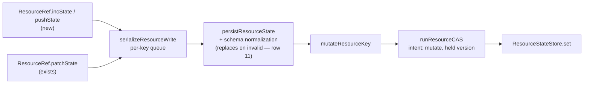

# FIX-1154: Scope state and resources split one mutation surface across two APIs — Implementation Spec

## Part I — The Case *(for the human)*

### 1. Problem — why it matters, why now

FSD stores durable data two ways: the **state bag** on a session (or user, or org), and
**resources**. Developers pick by **which one carries the verb they need** rather than by
where the data belongs. The bag has "add one to this counter" and "append to this list";
resources have neither, and our docs tell people to *prefer* those verbs when several
things write at once. Someone who correctly chose a resource reads that and moves the data
back into a bag it did not belong in.

Underneath, the surfaces differ in **eleven** ways — most written down nowhere, none
collected anywhere a developer would look, and no way to tell which are deliberate.

### 2. Solution in plain terms

Give resources the two missing verbs, on both public handles, typed from the resource's own
state so a mistyped field is a compile error rather than a write that quietly does nothing.
Then write the eleven differences down once — each closed, deliberate, or deferred — and
ship that map into the docs, where the choice gets made.

One difference is permanent and is the headline: **every resource write through the shared
state mutators — `incState`, `pushState`, `patchState`, `setState`, `updateState` — is
version-checked and can be refused**, where the bag's write can skip that check. (The
promise is scoped to those verbs deliberately: a collection's `create(key, state, { replace:
true })` is an explicit unconditional overwrite and writes without a version check, which is
the posture that call is asking for.) **With one
exception we found while writing this and did not fix:** a request that never observed the
resource still revives it after a delete, because a first touch writes as create-if-absent
and a deleted row satisfies that. It is a live defect on `main`, filed as
[FIX-1258](https://linear.app/fixpoint-labs/issue/FIX-1258) and out of scope here (§9). The
verbs look identical and do
not promise the same thing.

Building them also surfaced **two ways a resource write silently loses data today**, both
erasing untouched fields while the call reports success. The new verbs refuse both; the
three existing write methods still carry them, each filed as its own defect.

**Philosophy** — tenets 2 and 3 (extends an existing write path; drops a deferred tier and
splits out two bundled fixes) and tenet 1 (one true statement replacing a misleading one).

### 6. Decisions & rules — the sign-off surface

**Decision 1 is the owner's, asked in full in the spec PR description**; that line is the
record, not the ask. Decisions 2 and 3 are settled — 2 at **D-6 (#1446)**, after review
falsified the reason this spec had given for it.

1. **Resources get `incState` and `pushState` on both public handles, typed from the
   resource's own state, with the weaker guarantee documented on the methods.**
   *Locks in:* two methods on a shipped interface we cannot remove without a breaking
   change, and a permanent difference in what "atomic" means across the two primitives.

2. **Store-native increment and append for resources is DEFERRED — not dropped, and not
   this cycle.** Settled at **D-6 (#1446)**; it is not the owner's call and no longer an ask.
   An earlier draft of this spec proposed taking it off the roadmap on the grounds that it
   "removes no conflicts". That reason was **false** — §7b keeps the correction visible —
   and the deferral now rests on implementation cost plus an unevaluated design surface.
   *Locks in:* resource writes keep sending the whole value and concurrent resource
   increments keep contending, **for this cycle**. The roadmap keeps the item; a later cycle
   owns it (§12).

3. **The difference map ships as documentation, split by audience**, not pasted whole into
   every surface.
   *Locks in:* two pages anyone changing either surface has to keep true.

**Non-goals** — merging or deprecating either primitive; a shared `MutationContract` type;
reconciling the two retry drivers; fixing the bag's own adapter divergences; cross-record
atomicity (FIX-854); the resource-only surface with no bag analogue.

**Size:** Medium — 2 production files · 25 test behaviours (behaviour 6 is three assertions) · 7 doc surfaces, written by `docs-writer` then `docs-editor`, not inline · 1 PR + changeset.
**Most of the work is documentation.** Everything justifying the above is Part II —
alternatives (§7b), practices (§7c), examples (§7d).

---

## Part II — The Build Plan *(for the implementing agent)*

Part II carries shape and sequence, not the finished design.

### 7. Technical design

Nothing new is built. The two verbs are two more mutator bodies handed to the write path
`patchState` already uses, and the map is documentation.



- **`@flow-state-dev/core`** — `ResourceRef` and `ResourceContext` each gain `incState` and
  `pushState`. No new shared type: the epic's guard against a premature `MutationContract`
  stands and nothing here needs one.
- **`@flow-state-dev/engine`** — the resource registry gains the two ops in **both** ref
  builders (the single-resource handle and the collection-instance handle). The retry
  driver, the store contract and every adapter are **untouched**.
- **Untouched, deliberately:** `ResourceStateStore`, `DeltaStoreOps`, both CAS drivers, the
  scope persist bridge, and every store adapter.

**Keys come from `keyof TState`, not from a string map.** The bag's `incState` takes
`Record<string, number>`, and copying that here would be a public-boundary defect (BP-004):
`incState({ factExtractd: 1 })` — a typo — type-checks, an ordinary `z.object` then
**strips** the unknown key during normalization, the result deep-equals current state, and
the call resolves as a **verified no-op**. Nothing throws and nothing is written. So
increment's keys narrow to the number-valued keys of `TState`, append's to the array-valued
ones, and the appended value's type follows that array's element type.

**A runtime unknown-key rejection backs the types up — where the schema can be inspected,
and only there.** It exists for the JavaScript caller or the `as any` that walks straight
past the types. Implementing it means reading the schema's declared keys, so it is available
exactly when the schema exposes them: a `z.object` has `.shape`, and the check is the
obvious one. **An opaque schema has no `.shape` to read** — `z.custom<{ count: number }>()`
exposes zero inspectable keys — so for those resources there is nothing to check against and
**the backstop is absent, not merely weaker.** Say that rather than stating the rejection
universally.

What an untyped caller gets on an opaque schema is therefore *not* the silent no-op above —
it is the opposite failure. `z.custom` does not strip: `safeParse({count: 1, typoKey: 2})`
succeeds **and keeps `typoKey`**, so the result differs from current state, the write lands,
and the junk key accumulates in stored state. Two different silent outcomes from one typo,
depending on the schema, and the type-level guarantee is what closes both — which is why it
is the guarantee that matters and the runtime one is a backstop.

**What the verbs must refuse.** One rule per case, and the last two are the ones that look
like they need no rule:

- **Field absent** → treat as the identity (`0`, or an empty list) and apply. The ordinary
  first-touch case; must not be an error.
- **Field present but the wrong type** → **throw**, naming the call site.
- **Field declared nullable or optional** (`z.number().nullable()`, `n?: number`) → **the
  key is not offered.** A `number | null` or `number | undefined` does not extend `number`,
  so the key-narrowing conditional excludes it, and the verb is unavailable for that field.
  This is deliberate and needs saying, because a developer with a nullable counter will
  otherwise read it as a bug: the bag coerces a `null` counter to `0` and increments
  (`state-container.ts:373`), and silently doing the same here would **invent a value the
  schema deliberately allowed to be absent**. Use `updateState`, which makes the intent
  explicit. *(A field that is nullable but currently holds a number is still excluded — the
  exclusion is on the declared type, not the runtime value, because the type surface is
  where it has to be decided.)*
- **Any value that is not JSON-safe** — anywhere inside a delta, a computed result, or an
  appended value → **throw**. Applies to `incState` *and* `pushState`. **The rule is
  JSON-safety, not finiteness**; see below for why the narrower version was wrong.
- **A result the resource's `stateSchema` rejects** for any other reason — a refinement like
  `z.number().nonnegative()` that a decrement pushes below zero, where the JavaScript type
  is still correct → **throw**.

**The verbs are available when the state type has no string index signature — and that is a
narrower restriction than "closed schemas", deliberately.** The `keyof TState` typing needs a
key it can name. For an open schema — `z.object({ count: z.number() }).passthrough()` — the
inferred state carries a string index signature, so no key is recoverable as *the*
number-valued one: a conditional-key API admits every string (reinstating the typo hole the
typing exists to close) or admits none. Runtime is no better there: an absent dynamic key and
a typo are the same observation, so the unknown-key rejection has nothing to reject on.

**Defined on the index signature, not on schema reflectability, and the difference matters.**
An earlier draft said "closed, reflectable object schemas". That cannot be expressed at the
surface where it would have to hold: the handles carry only the **output type**, never the
schema — `ContextOf<T, "resource">` reduces to `ResourceContext<AsStateObject<StateOf<T>>>`,
and flow/block inference lands on `ResourceRef<S>` the same way. So
`z.custom<{ count: number }>()` — not reflectable at all — produces a handle type
*identical* to a closed `z.object`, and no conditional over `TState` can tell them apart.
Enforcing reflectability would mean **carrying a capability marker through both inference
paths**, which is new core type surface for one restriction, against the epic's standing
guard on new abstractions.

So the restriction is stated in the only terms the type surface actually has, and **it
admits `z.custom` — say so rather than implying otherwise.** That is acceptable because the
hazard being closed is specifically the index signature swallowing a typo; `z.custom` has no
index signature, `keyof` recovers `count` from it correctly, and the typed-key guarantee
holds — and **the type-level guarantee is the one that matters here**, because it is the one
that closes the typo hole for every caller who compiles.

What an opaque schema does not give is anything to inspect, and that costs **two** of the
runtime refusals, not one. **Every runtime refusal is only ever as strong as the schema
behind it:**

- **Schema-invalid results** degrade to whatever the custom validator checks — for a bare
  `z.custom` that is nothing.
- **Unknown keys** lose their backstop entirely: there is no `.shape` to read, so the check
  cannot be implemented at all for that resource, and an untyped caller's typo lands in
  stored state rather than being refused.

Both are already true of `updateState` and every other write method — these verbs inherit
the property rather than introducing it — but the spec states it once, generally, so the
next refusal added here is scoped when it is written rather than a round later.

**A second availability condition, and it is not about keys at all: the output must re-parse
as input.** The write path validates a *candidate state* by running the resource's schema over
it, so a schema whose output type differs from its input type produces an API that compiles and
always fails. `z.object({ n: z.string().default("0").transform(Number) })` exposes `n: number`,
so `incState({ n: 1 })` type-checks — and then the candidate `{ n: 1 }` is re-parsed against a
schema whose input side wants a string, which **rejects it every time**. Verified: `parse({})`
yields `{"n":0}`, and `safeParse({n:1})` is `false`.

So availability needs both: **no string index signature** (a key can be named) **and an output
type that is valid input** (the named key can be written back). Such a schema keeps
`updateState`, which has the same constraint but never promised otherwise. **State this as a
condition of the contract, not as an edge case** — an API that type-checks and throws on every
call is worse than one that does not exist.

**What this condition does not cover, said out loud rather than left to inference: a same-type transform.**
`z.object({ n: z.number().transform((v) => v + 1) })` has an output type identical to its input
type, so it **satisfies** the rule above and the verbs are offered — and the stored value drifts
anyway:

```
z.object({ n: z.number().transform((v) => v + 1) })

  stored {n:0}  → read as {n:1}    load normalizes     (resource-registry.ts:209)
  incState({ n: 1 }) builds {n:2}
  write normalizes → {n:3}         candidate re-parsed (normalize-resource-state.ts:44-51)

  advanced by 2. The caller asked for 1.
```

**That is not an availability gap, and it must not be patched as one.** The drift comes from
`normalizeResourceState` storing the **output** of `safeParse` instead of the candidate it just
validated — and both ends of a read-modify-write cycle run it. `updateState` drifts on such a
schema **today, on `main`**, with no new verb involved; `incState` and `pushState` would inherit
it through the same `persistResourceState` call rather than introduce it. Filed as
[FIX-1260](https://linear.app/fixpoint-labs/issue/FIX-1260) and **pinned, not fixed here** (§9,
§10 behaviour 17a, §12) — the same posture as FIX-1258.

**Explicitly considered and rejected: a verb-local fixed-point guard** — parse the candidate,
parse that result, refuse if they differ. It was this round's first proposal and it is the wrong
fix. Schema safety would then live on the two new verbs while `updateState`, `patchState` and
`setState` kept corrupting through the same normalizer, **rebuilding inside one primitive the
very per-verb asymmetry this epic exists to remove.** The shared normalizer is FIX-1260's to
fix, once, for every mutator. A guard here would also make it *look* handled, which is worse
than the gap.

**It is row 11's sibling, not row 11 — keep them apart.** Row 11 is a candidate the schema
**rejects**, replaced wholesale by the default while the call reports success. This is a
candidate the schema **accepts** and silently alters. Two distinct failures of the same root
decision to store parse output; §12 carries them as separate follow-ups.

**The process lesson, which is the more useful half.** This arrived looking like a fourth
narrowing of a rule already narrowed in rounds 10 and 11 — and it was not a narrowing at all.
The rule was being stretched to compensate for a defect one layer down. **When a rule needs
narrowing repeatedly, check whether it is covering for a bug somewhere else.** That check is
cheaper than the next narrowing, and here the narrowing would not have worked: no condition
stated over the output type can exclude a transform whose output type is its input type.

**What the restriction actually costs, counted rather than assumed.** Of the **137**
`stateSchema` declarations in `packages/*/src`:

- **Transforming or coercing: zero.** So the availability condition excludes nothing on that
  count today, and FIX-1260's drift is latent rather than live — it becomes reachable the first
  time someone writes a perfectly reasonable normalizing schema.
- **Passthrough: one, and it is shipped.** `defineSkillsCollection` declares
  `skillStateSchema`, which ends `.passthrough()` (`orchestration/src/skills/collection.ts:50`,
  used at `:82`). **So the type restriction is not free, and earlier drafts of this spec said it
  was** — the claim "no resource in `packages/*/src` uses a passthrough state schema" was
  **false**, and had stood since round 10.

**The exclusion is still right, and now for a stated reason rather than a vacuous one.** That
schema is open **on purpose**: a skill manifest round-trips fields written out-of-band that the
schema does not describe (`skills/delegation-surface.ts:423` and `skills/skill-md.ts:162` both
depend on exactly that). An open schema is precisely the case where no key is recoverable as
*the* array-valued one, so `pushState("keywords", …)` — a shape someone would plausibly want
there — cannot be typed without readmitting every string. It keeps `updateState`. **The
honest framing is a named exclusion, not a free restriction**, and it belongs in the docs §11
ships rather than only here.

**Every one of those throws must be NON-RETRYABLE, and a plain `Error` is not.**
`isRetryableError` stops only for a `FlowError` carrying `retryable: false`; anything else
falls through to `return true` when the policy names no error types
(`execution/retry.ts:76-89`). So a refusal thrown as an ordinary `Error` puts the **whole
block** back through the retry policy — re-running every side effect it already performed —
on what is by definition a programming error that cannot succeed on a second attempt. Use
`ValidationError` (`errors/flow-error.ts:33-44`, `code: "validation_error"`,
`retryable: false`), which is exactly this case, or a typed equivalent that also carries
`retryable: false`.

This is the one refusal detail that is **not** the implementer's to settle: a spec that says
only "throw" ships that bug, because the §10 behaviours would stay green while the block
silently re-ran. §10 therefore asserts the **attempt count through the execution retry
path**, not just that the call rejected.

**Where the schema check runs is the contract, not a detail.** It must be the **last step
inside the mutator** handed to the write path — never a check performed once before handing
off. `persistResourceState` wraps the caller's mutator as
`normalizeResourceState(config, await mutate(current))` (`resource-registry.ts:662-666`), and
`runResourceCAS` **re-runs that whole thing on every retry**, so a check outside it validates
the first attempt only:

> `n` is constrained `max(1)`. Two contexts increment from `0`; both compute `1`, both
> validate, one wins. The loser refreshes to `1` and its mutator recomputes **`2`** — which,
> with the check outside, nothing re-validates. `2` reaches `normalizeResourceState`, fails
> the schema, and is **replaced by the resource's default**. Silent data loss, on the retry
> path these verbs exist to ride.

Inside the mutator, every attempt re-validates against refreshed state and the loser throws.
**Only a refinement-plus-contention case distinguishes the two placements** — an
immediate-refinement test and a concurrency test both pass against the broken one — so §10
specifies it as a single composed behaviour rather than two independent ones.

**The rule is a property of the write path, not of the new code.** An earlier draft applied
it only to the refusals these verbs introduce and missed one the verbs *route through* — the
blast radius was drawn around the new methods instead of around the path a caller reaches.
So: **every refusal reachable from `incState` / `pushState` is enumerated here, and each is
either non-retryable by type or scoped out with a reason.**

| Refusal reachable from the new verbs | Where it comes from | Today | Verdict |
|---|---|---|---|
| Unknown key · wrong type · JSON-unsafe value · schema-invalid result | **New** (this spec, above) | — | `ValidationError`, `retryable: false` |
| **Resource declared `writable: false`** | **Pre-existing**, `resource-registry.ts:658-660` | plain `Error` → **retried** | **Fix.** A configuration error: a read-only resource never becomes writable, so every retry re-runs the block's side effects and fails identically. Make it non-retryable by type |
| `ResourceDeletedError` | Pre-existing | `FlowError`, `retryable: false` | Already correct |
| `ConcurrentModificationError` | Pre-existing | `FlowError`, `retryable: true` | **Correct as-is — leave it.** The CAS budget exhausting is exactly the case where a fresh attempt can succeed. This is the one refusal on the path that *should* retry |
| `ResourceAlreadyExistsError` | Pre-existing | `FlowError`, `retryable: false` | Not reachable — `create` intent only, and these verbs always run as `mutate` |
| **Aborted write** | Pre-existing, `resource-cas.ts:139-141` | `signal.reason` if it is an `Error`, else plain `Error("Resource write aborted")` | **Verify before changing.** `retryWithPolicy` carries its own `signal` and short-circuits on it (`execution/retry.ts:122-126`), so an abort may already be handled without consulting the error's type — but only if that is the *same* signal the resource driver holds (`sideChainSignal`), which this spec has **not** confirmed. Check it at implementation time; if the signals differ, the framework-generated fallback needs the same treatment as the `writable` row. A caller-supplied `signal.reason` is the caller's to type and stays out of scope |

**Blast radius of the `writable` fix, stated rather than discovered:** that throw sits in
`persistResourceState`, which `patchState` / `setState` / `updateState` also reach, so
changing it changes their behaviour too. The change is one-directional — an error that was
pointlessly retried now fails fast — and there is no case where retrying a read-only refusal
was the desired outcome. Worth doing on the path rather than shadowing it with a second
check inside the new verbs, which would leave the older three still wrong.

**Why the schema and JSON-safety rules need to exist at all — the write path does not reject,
it replaces.**
A result that fails the schema is not refused. A single resource's state is swapped for the
resource's **entire default** (`resources/normalize-resource-state.ts:44-51` — a failed
`safeParse` falls through to `normalizeResourceDefault`); a collection instance's is swapped
for **`{}`** (`context/resource-registry.ts:679-680`, the `: {}` branch). The call then
resolves normally with fields the caller never touched gone.

**JSON-unsafe values** reach that same destruction by a longer route, which is what makes
them the worst case here — and the hazard class is **JSON-safety, not finiteness.** An
earlier draft drew the rule at non-finite numbers because `Infinity` was the instance that
motivated it; the boundary that actually holds is *anything the storage layer cannot
round-trip*. Zod accepts all of these under an ordinary schema, and the adapters then
disagree:

| Value | Zod (`z.number()` / `z.array(z.any())`) | Memory (`structuredClone`) | SQLite / filesystem (`JSON.stringify`) |
|---|---|---|---|
| `Infinity`, `-Infinity`, overflow | accepts | **keeps** | → **`null`** |
| `undefined` in an array | accepts | keeps | → **`null`** |
| function, symbol | accepts | *(clone throws)* | → **`null`** |
| `bigint` | accepts | *(clone throws)* | **throws** `TypeError` mid-write |

`NaN` is the one exception, caught by `z.number()` itself. Everything else passes the schema
check, gets written, and then — on the SQL and filesystem adapters — comes back as `null`,
which **fails the schema on the next durable read**, and *that* failure lands in the
replacement above. `bigint` is worse in a different direction: it throws during
serialization, so the write fails at persist time rather than at the call site, with a raw
`TypeError` and no indication of which field caused it.

So the defect never surfaces at the write that causes it. It surfaces later, in a different
request, as unrelated fields vanishing, and only on some deployments. That is why finiteness
is checked at the call site rather than left to the schema. A resource declaring `.finite()`
would be caught by the schema check, but nothing makes that the default and no existing
resource does it.

The choice here is therefore not between rejecting and validating — it is between
**throwing** and **silently resetting state**, and this spec throws. Same failure class as
the two other data-loss paths this review turned up (row 5's partial-merge, and the bag's
`pushToArray` divergence in §12), and the same answer: a write that cannot be performed
correctly must not resolve as though it were.

**Scoped to the new verbs, deliberately.** `patchState`, `setState` and `updateState` keep
today's behaviour on all of the above — changing them is a break on shipped methods and is
not this issue's to make. That leaves a real inconsistency, and it is the lesser evil
against shipping two brand-new methods into a known data-loss path. Both underlying defects
are filed in §12.

**Solution sketch — pseudocode. Illustrative, not the contract. React to the shape.**

```
on the resource handle, beside patchState:

    incState(increments):            keys: number-valued keys of TState
        reject unknown keys, and any JSON-unsafe value → throw
        mutator, per field:
            absent       → start from zero, add the delta
            not a number → throw
            otherwise    → add, then not JSON-safe → throw
                           (the schema will NOT catch this)

    pushState(field, value):         field: array-valued keys of TState
        reject unknown field, and any JSON-unsafe value
        anywhere inside `value` → throw
        mutator: absent → empty list, then append
                 not a list → throw

    both — INSIDE the mutator, as its last step, NOT before
    handing it off:
        result fails the resource's schema → throw
        (NOT hand it on — the write path would reset the
         state and report success)

    the placement is the contract, not a detail: the write path
    re-runs this mutator on every CAS retry, so a check that runs
    once outside it validates only the FIRST attempt
```

What this asks a reviewer: *is riding the existing mutator seam the right shape, or should
these carry an intent hint the way the bag's verbs do?* This spec says the former, and
decision 2 is why — a hint would have nowhere to route to.

**POC — built on this branch; results and limits in §12.**

```
pnpm install
cd spec-poc/FIX-1154-resource-mutation-verbs && ../../node_modules/.bin/vitest run
```

### 7a. The mutation-surface map — this issue's headline deliverable

Derived line by line from `ScopeStateOps` (`packages/core/src/types/state.ts`),
`ResourceRef` and `ResourceContext` (`packages/core/src/types/resource.ts`), and the write
path each op takes. **Verdict is one of: closed here · deliberate asymmetry with a reason ·
deferred with a trigger.** This is the source for §11, which ships it split by audience.

The epic asserted a version of this claim three times and each was falsified by the next
review round; two further rounds then corrected rows here. Every row states what it depends
on rather than the clean version of it, and that is why.

| # | Difference | State bag | Resource | Verdict |
|---|---|---|---|---|
| 1 | `incState` | present | absent | **Closed here** — both resource handles, version-checked, typed from `keyof TState`, with the refusals in §7 |
| 2 | `pushState` | present | absent | **Closed here** — same |
| 3 | `setStateRecord(field, key, value)` | present | absent | **Deliberate** — it addresses one slot inside a blob many writers share. A resource *is* the per-key row, so the storage key already does that addressing. A map nested inside a resource's own state is reached with `updateState` |
| 4 | `deleteStateRecord(field, key)` | present | absent | **Deliberate** — same addressing argument. This removes a key *inside* a state field; it is not a record-level delete, which **both** primitives have separately |
| 5 | Re-run-a-callback mutation | `atomicState(fn)` — `fn` returns a **partial**, shallow-merged over current state. Fields the callback omits are **kept** | `updateState(fn)` — `fn` returns the **whole next state**, normalized and written. Fields the callback omits are **gone** | **Deliberate, and NOT interchangeable.** Both re-run their callback against refreshed state on retry, and that is where the similarity stops. Moving a callback between them **silently drops every field it does not return**. **Never describe these as one op under two names** — a reader who believes that and ports a callback loses data. Row 9 carries the remaining signature differences |
| 6 | `getOrPatchState` | absent | present on `ResourceRef`, **absent on `ResourceContext`** | **Bag side: deliberate** (no demand; no per-key single-flight seam there). **Handle split: deferred, not closed here.** A different defect class from rows 1–2: those are verbs missing from the *runtime*, this is a verb the runtime already has and only the *type* omits — so it is a type-surface gap, **not a missing capability, and not a runtime bug** for a later reader to reopen as one. No consumer demonstrates demand: every `ResourceContext` in the repo is a cast target and **no production code calls `getOrPatchState` through either handle**. The epic's standing constraint — no new abstraction until a second consumer appears — decides it. *Trigger:* the first consumer that actually wants it on `ResourceContext` |
| 7 | Return type | `Promise<boolean>` — callers branch on it to suppress a redundant change event | `Promise<void>` — the driver verifies the no-op internally and gates the event itself | **Deliberate** — settled at epic altitude. New verbs return `void` |
| 8 | `patchState` keyed-updater form `(key, updater)` | present | absent | **Deferred** — the overload exists to produce a read-modify-write routing hint, which resources have nowhere to route to (decision 2). `updateState` covers read-then-compute. *Trigger:* revisit only if decision 2 is reversed |
| 9 | Callback signature on the row-5 pair | `atomicState`: callback must be **synchronous**; parameter typed read-only | `updateState`: callback **may be async**; parameter **not** typed read-only | **Deliberate** — resource updaters do I/O, so async is required. The non-read-only parameter is a type-level laxity the runtime compensates for by cloning. **Deferred:** tightening breaks call sites for no behaviour change. *Trigger:* the next breaking change to this interface |
| 10 | **Guarantee of the verbs they share** | **Conditional, in more than one way** — whether a bag write skips the version check turns on the op's shape, the adapter, and whether the record still exists. Stated **by reference, not asserted**: this spec changes nothing on the bag side, and every precise claim it made here was corrected. Read it at `docs/architecture/state-and-scopes.md` → delta-verb routing, which §11 makes accurate as part of this change | **Every write through the shared state mutators is version-checked and can be refused** — a conflict, or a deleted-resource error. No adapter can change it. **Scoped to those verbs on purpose:** `create(..., { replace: true })` maps to `intent: "replace"` and writes at `expectedVersion: "any"` (`resource-cas.ts:219-220`) — a deliberate unconditional overwrite, not a gap. **One honest caveat:** a write from a context that never observed the resource goes out as create-if-absent, which a tombstone satisfies, so it revives a deleted resource rather than being refused — a live defect on `main` this issue does not fix ([FIX-1258](https://linear.app/fixpoint-labs/issue/FIX-1258), §9). Appending in a loop means N whole-state writes, which is why §7d steers bulk appends to one compound write | **Deliberate and permanent on the resource side** — because the two stores disagree on whether a delete stays **visible to a version check**. A resource delete leaves a **tombstone that retains its version**, so a check-free write can land on top of one and resurrect it. A bag delete leaves nothing for a version check to see, so a bag write cannot resurrect a deleted record — a different failure mode, not a missing one. **The reader's takeaway is the asymmetry, not the bag's mechanics:** the two verbs share a name and do not share a guarantee. The resource side is the near-absolute one — unconditional except for the never-observed-delete defect above — and the bag side varies by construction. No caller-facing doc says so today. The sharpest row, and the one whose bag half this spec deliberately stopped asserting |
| 11 | What happens to a schema-invalid write | none at the mutator layer — the bag does not re-check the schema per write | **Not validation — a destructive fallback.** A result failing the resource's `stateSchema` is replaced: a single resource's state with its **entire default** (`normalize-resource-state.ts:44-51`), a collection instance's with **`{}`** (`resource-registry.ts:679-680`). The call then resolves successfully, having erased untouched fields | **Deliberate that a resource carries its own schema; NOT deliberate that violating it resets state.** The new verbs **throw** rather than enter this path (§7). The three shipped ops keep it, so the inconsistency is real and named. **Never describe this row as validation** — the word implies a rejection that does not happen. Filed as its own defect (§12) |

**Rows 1 and 2 are the code change — the scope is exactly two verbs.** The rest is
documentation or a follow-up.
Nothing is left as "unknown".

### 7b. Tradeoffs & alternatives *(moved out of Part I)*

**Alternative: don't add the verbs, just document the gap.** The strongest case against this
spec. Every increment and append on a resource in this repository today is **compound** —
semantic memory's `addFact` appends a fact *and* bumps a counter in one write; working
memory's `advance` bumps a turn counter *and* recomputes every entry. None would be
rewritten to use a single verb, so the two new methods replace **zero** existing call sites.
Judged on code removed, they are worth nothing.

They are not judged on that, and the case has two legs. The softer one is discoverability:
somebody scans a method list and picks a primitive, upstream of any call site, where a
documentation line does not reach. The harder one is checkable — **eight files across
`@flow-state-dev/memory` and `@thought-fabric/core` already type their resource work as
`ResourceContext`** (`working-memory-helpers`, `semantic-memory-helpers`,
`episodic-memory-helpers`, `digest-helpers`, `internal/recall`, `capabilities`,
`perspective-helpers`, `perspective-capability`). Those are the consumers, they hold the
narrower handle, and they cannot reach a verb that lands only on `ResourceRef`.

**Alternative: give resources the store-native delta verbs too** (the epic's deferred
Tier 2). **Deferred at D-6 (#1446)** — not dropped, and not this cycle. This block records
that decision rather than arguing it; the two things worth carrying forward are the reason
that turned out to be false, and the reason that stands.

**The falsified reason, kept visible because the epic made the same error.** An earlier
draft deferred this on the grounds that native verbs *remove no conflicts*. That assumed a
native resource delta must carry a held `expectedVersion` — the epic's constraint says never
use the commutative `"any"` downgrade, since `"any"` asserts nothing about the row and can
resurrect a tombstone. But `"any"` is not the only version-free option. **Both SQL resource
stores already predicate every conditional update on `lifecycle = 'live'`**
(`store-postgres/src/resource-state-store.ts:205-211`,
`store-sqlite/src/resource-state-store.ts:54-58`), and a delta predicated on *liveness
rather than version* is tombstone-safe by construction: concurrent increments all land, and
a delete that wins first makes the delta refuse without resurrecting anything. So a
lifecycle-guarded native delta **would** remove contention. Ruling out one extreme is not
establishing the other, and both the epic and this spec made that step without noticing.

**What the deferral actually rests on.** Implementation cost, and a design surface nobody
has evaluated: a version-free resource write bypasses `runResourceCAS`, which is where the
verified-no-op check, the `previousState` basis and the `resource_change` gate live. The
epic's theme-2 proof obligation — *every row of the policy table survives* — would come back
with it, and harder than the version-checked form this spec analysed, because the commutative
path has no basis to verify against. The cost half is also where this spec was wrong twice in
the other direction: the optional, feature-detected delta verbs belong to the **scope-record**
stores (`SessionStore`, `RequestStore`, `UserStore`, `OrgStore` each `extends DeltaStoreOps`,
`stores/types.ts:516, 551, 772, 784`); resources go through **none** of them, persisting via
`ResourceStateStore` (`stores/types.ts:1036`), which extends nothing and whose whole mutation
surface is `set`, `delete` and `deleteAll`. Reason about this from `ResourceStateStore`, never
from the scope-side precedent.

**Where the complexity is:** not in the two verbs, which are a dozen lines each. It is in
getting each map row's *reason* right rather than its existence — five review passes have
each corrected a row that read as true.

### 7c. Focus practices *(moved out of Part I)*

1. **BP-004 (public boundary first)** — three separate defects in this spec were public
   boundary defects: a verb reaching one handle and not the other, a `Record<string, …>`
   key surface that turns a typo into a silent no-op, and a guarantee documented without
   its conditions.
2. **BP-007 (concise API docs)** — the weaker guarantee belongs on the methods, not only on
   a docs page. Someone reading a method list never reaches the page.
3. **Don't assert into a subsystem you aren't changing** (change-specific, not yet a BP —
   and the lesson this spec paid the most for). Nearly every correction across six review
   passes landed on a claim about the **state bag**, which this issue does not touch; the
   resource column — the actual deliverable — stayed stable throughout. A comparison is a
   claim about two systems, and a spec only owns one of them. So row 10 now states the bag
   side **by reference**, and where a planned doc page genuinely needs a bag fact, the fact
   lives in §11 beside the page that publishes it, to be re-verified at implementation time.
   Two corollaries that survived: **name what a claim depends on** (an unconditional
   "contention-free" was wrong three times), and **never assert an equivalence** (row 5 —
   "the same op under two names" was refined three times and wrong every time).
4. **Tenet 7 (prove the goal, not the mock)** — the epic's load-bearing claim was a
   type-level read; it is now run. Where a claim in this spec is still a read rather than a
   run, §12 says so.

### 7d. What using it looks like *(moved out of Part I)*

```ts
// after
await ctx.resources.stats.incState({ factsExtracted: 1 })
await ctx.resources.stats.pushState("recentTopics", topic)

// before — still valid, and still the right tool for a compound change
await ctx.resources.stats.updateState((s) => ({
  ...s,
  factsExtracted: s.factsExtracted + 1
}))
```

Through a shared helper — the handle the eight consumer files actually hold:

```ts
type SemRef = ResourceContext<SemanticMemoryState>
async function recordExtraction(ref: SemRef) {
  await ref.incState({ totalExtracted: 1 })   // reaches ResourceContext too
}
```

What the differences look like when they bite:

```
scope bag    await ctx.session.incState({ n: 1 })
             → single field + adapter has a native increment: version check
               skipped, so concurrent state updates cannot refuse it
             → but a concurrent DELETE of the record still refuses it, even
               at "any" — reported as a no-op on the commutative path
             → multi-field, e.g. incState({ a: 1, b: 1 }): version-checked,
               and can raise ConcurrentModificationError on retry exhaustion

resource     await ctx.resources.stats.incState({ n: 1 })
             → always version-checked: normally lands, re-running against the
               winner on a conflict
             → ConcurrentModificationError if contention outlasts the retries
             → ResourceDeletedError if the resource was deleted underneath

resource     await ctx.resources.stats.incState({ factExtractd: 1 })
             → compile error. On the bag's Record<string, number> surface the
               same typo type-checks, is stripped during normalization, and
               resolves as a silent no-op

resource     await ctx.resources.log.pushState("entries", e)   // in a loop
             → N whole-state writes. For bulk appends use one compound write
```

### 8. Implementation sequence

Two unrelated cleanups review found bundled here have been **cut** — see §12.

**Two axes, and getting either wrong ships a no-op.** The verbs must reach both *public
handles* (`ResourceRef` **and** `ResourceContext`) and both *ref builders* (the
single-resource handle and the collection-instance handle). Different things, different
packages.

1. **Add both verbs to both public handles**, typed from `keyof TState` per §7.
   `ResourceContext` is not optional: it is what the eight consumer files type against, so
   verbs landing only on `ResourceRef` would reach none of them and the issue would close
   without solving anything. Document the weaker guarantee on the methods themselves.
   *Test:* the type behaviours in §10. *Depends on:* nothing.
2. **Implement both ops in the resource registry**, in **both** ref builders, with every
   refusal in §7 — and **no schema-stability guard of their own** (§7: that belongs to the
   shared normalizer, FIX-1260, not to these two verbs). *Test:* the behaviours in §10.
   *Depends on:* 1.
3. **Make the `writable: false` refusal non-retryable** (§7's table) — it is on the path
   these verbs route through, and it lives in `persistResourceState`, so the fix covers
   `patchState` / `setState` / `updateState` too. *Test:* behaviours 11 and 24. *Depends on:* nothing.
   Also **verify the abort row** in that table while here — whether `retryWithPolicy`'s own
   signal already covers it, or the framework-generated fallback needs the same treatment.
4. **Add a Changeset** (BP-022). Four new public methods on a publishable package plus a
   user-visible behaviour change, so this is not `--empty`. Pre-1.0, so `patch` / `minor`
   only: **`@flow-state-dev/core` `minor`** (new public API on `ResourceRef` and
   `ResourceContext`) and **`@flow-state-dev/engine` `minor`** (the new ops, plus the
   read-only refusal becoming non-retryable — a behaviour change callers can observe).
   *Depends on:* nothing; write it with the change rather than after it.
5. **Ship the map** per §11, and **correct the concurrency-guidance line** that tells
   readers to prefer increment and append for concurrent writes without saying which
   primitive, which adapter, which arity, or that a deleted record refuses the write anyway.
   **Do not write this prose yourself.** §11 is seven published surfaces — the largest prose
   surface in this issue — and CLAUDE.md is explicit that user-facing prose is not written
   while holding a spec or a diff, because the context leaks even when you know the rules.
   Dispatch **`docs-writer`** with §7a's map and §11's per-surface briefs, then **`docs-editor`**
   over the result. The published claims are load-bearing here: this is the change whose whole
   point is that the existing docs state the difference wrongly, so a writer paraphrasing from
   the diff is the specific failure to avoid. *Depends on:* 1–3.

*(No removals. Subtraction here is decision 2, the §12 split, and row 6 — the scope is
exactly two verbs. `getOrPatchState` is **not** added to `ResourceContext`.)*

### 9. Edge cases & error handling

| Case | Expected |
|---|---|
| `incState` / `pushState` on an absent field | Starts from `0` / an empty list, then applies |
| `incState` on a field holding a non-number | **Throws**, naming the field |
| `pushState` on a field holding a non-array | **Throws**, naming the field |
| Unknown key — `incState({ factExtractd: 1 })` | **Compile error**, and a **runtime throw** for callers who reach it untyped. Never the bag's silent strip-and-no-op |
| `incState({ n: Infinity })` or `{ n: -Infinity }` | **Throws.** A plain `z.number()` accepts both, so the schema check does not catch them |
| `incState` whose sum **overflows** to `Infinity` | **Throws.** Same path, reached by arithmetic rather than by argument |
| `pushState("values", Infinity)`, or a non-finite number nested anywhere inside an appended value | **Throws.** Identical hole to the two above — `z.array(z.number())` passes it just as `z.number()` does |
| An appended value that is **JSON-unsafe for any other reason** — `undefined`, a function, a symbol, a `bigint`, or any of these nested inside it | **Throws.** Same hazard class, non-numeric: Zod accepts them under `z.array(z.any())`, SQL and filesystem adapters serialize the first three to `null` (corrupting a later read), and `bigint` **throws mid-write** with a raw `TypeError` naming no field |
| An appended value that is **self-referential** | **Throws**, cleanly and without recursing forever. The hazard is *shape*, not type, and it splits by adapter: `z.array(z.any())` accepts it, `structuredClone` **preserves the cycle** so the memory store stores it happily, and a JSON-serializing adapter throws `TypeError: Converting circular structure to JSON` at the write. So it is a store-dependent corruption that a type-only check does not see |
| Either verb on a resource whose schema has a **type-changing** transform (`z.string().default("0").transform(Number)`) | **Unavailable** — the verbs are not offered on it at all (§7, availability). The resource keeps `updateState` |
| **CURRENT BEHAVIOUR, pinned as a defect:** either verb on a resource whose schema has a **same-type** transform (`z.number().transform(v => v + 1)`) | **The stored value drifts, and the call reports success** — `incState({ n: 1 })` advances it by 2. The verbs are *offered* here, correctly: output is valid input, so availability is satisfied. The drift is `normalizeResourceState` storing the parse **output**, which `updateState` already does on `main`; these verbs inherit it rather than cause it. [FIX-1260](https://linear.app/fixpoint-labs/issue/FIX-1260) owns it and **this issue does not fix it** — see §7 for why a verb-local guard would be the wrong shape. **Row 11's sibling, not row 11:** there the schema *rejects* the candidate and the state is replaced by the default; here it *accepts* and silently alters it |
| `incState({ n: NaN })` | **Throws** — caught by the schema check, since `z.number()` does reject `NaN`. Listed because it is the one non-finite value that behaves differently |
| Either verb producing a value the schema rejects for any other reason (a refinement) | **Throws.** Handing it on does not reject it — it **replaces the whole state** and resolves successfully (§7, row 11) |
| Multi-field `incState` on a resource | No special case: a write through the shared state mutators is version-checked regardless of arity, so a resource has no equivalent of the bag's single/multi-field split (row 10) |
| Either verb on a resource never yet stored, **whose schema has a valid complete default** | Creates it from that default plus the change. Proven in the POC |
| Either verb on a resource never yet stored, whose schema has **no** valid complete default — e.g. `z.object({ n: z.number().default(0), label: z.string() })` with no declared `default` | **Throws.** `normalizeResourceDefault` cannot parse `undefined` or `{}` against that schema, so it falls back to `{}`; incrementing `n` leaves the required `label` absent and the result fails the schema check (§7). First touch is a *create*, and this spec does not invent values for unrelated required fields — declare a valid `default` on the resource |
| Either verb producing no change, against a **live** row or a **never-stored** resource | A **verified** no-op: no write, no version bump, no change event — and specifically **not** an error about a deletion. Proven in the POC |
| Either verb producing no change, while holding a **stale positive version** of a row that has since been **deleted** | **`ResourceDeletedError`** — terminal, not a quiet no-op. The no-op branch re-reads, finds no live row, and reports the deletion because the held version is not `0` (`resource-cas.ts:229-252`). This is the **boundary of the row above**, and stating it unqualified was a defect. Proven in the POC |
| Either verb racing a delete, **from a context that observed the resource live** | Terminal `ResourceDeletedError`, immediately. Proven in the POC. **What that buys is precision, not safety** — the write could not have landed either way: a positive held version requires a *live* row at that version (`resource-state-predicate.ts:145-156`), so a tombstone refuses it however many times it is retried. The alternative is a retry storm exhausting into a generic `ConcurrentModificationError`, not a resurrection. Stated carefully because `resource-cas.ts`'s own header gets this row wrong (§12) |
| Either verb racing a delete, **from a context that never observed it** (holding "no live row") | **Today: the write succeeds and the resource comes back live.** A first-touch write goes out as create-if-absent, which a tombstone satisfies (`resource-state-predicate.ts:147-149`) — so the delete is undone with no error. **This is a live defect on `main`, not something these verbs introduce** (`updateState` does it today), and **this issue does not fix it**: [FIX-1258](https://linear.app/fixpoint-labs/issue/FIX-1258) owns it. Stated here because shipping "never a resurrection" unqualified would publish a guarantee the framework does not keep. Asserted as **current behaviour** in the POC, so that row fails when FIX-1258 lands |
| Two contexts running the same verb on one resource | Both land; the loser re-runs against the winner. Proven in the POC |
| Contention outlasting the retry budget | `ConcurrentModificationError`, as every other resource write already does |
| Either verb on a resource declared `writable: false` | Rejected, on the same path `patchState` already rejects |

**Taxonomy:** the three errors resource writes already raise, plus one new *fatal* class —
a call the verb refuses (unknown key, wrong type, JSON-unsafe value, schema-invalid). All are
programming errors at the call site and must throw **before** reaching the write path, which
would reset state and report success. **They must also be non-retryable by type**
(`ValidationError` or equivalent, §7) — not merely documented as fatal, because the retry
path decides from the error's type and defaults to retrying.

**Second path (BP-035):** the second path is the **collection-instance** handle. A change
tested only against `ctx.resources.foo` ships half the feature — the two handles are built
by separate code in the same module.

### 10. Testing strategy

**Goal check: `fsdev run`, and it is required.** An earlier draft of this spec said no goal
check applied, on the grounds that the deliverable is types plus documentation. That was
wrong: `AGENTS.md` → *Verifying flow changes* names **"resource state ops"** in the
`fsdev run` row explicitly, and this change adds two of them to both registry ref builders.

The POC does **not** substitute for it, and the distinction is the point. The POC drives
`createExecutionContext` directly — deliberately, because that isolates the CAS driver — so
it never traverses `runAction`, which is the composition path a real caller uses. A verb that
works under a hand-built context and fails once composed is exactly the gap the goal check
exists to catch.

**No model or provider required** — a handler block, not a generator.

**It must observe the stored values, not the run's completion.** An earlier draft of this
section said "the NDJSON shows the resource's state advanced", which does not work: the
stream carries resource *change notifications*, not stored values — and for a resource
without `client.live` or `reactTo` it carries nothing at all. A handler-only run that ends
`completed` proves the action didn't throw, which is not the goal. That is exactly the
ceremonial check this spec is trying not to add.

So the flow's handler performs both mutations and then **returns the resource's post-write
state as its output**, which does reach the NDJSON as the action result. The pass criterion
is that the returned value shows **both** effects — the counter incremented *and* the item
appended — not that the run completed. (A zero-model read action asserting the same two
values is an equivalent shape if the implementer prefers to separate write from read.)

Run it before the unit suite, per the ordering `AGENTS.md` gives when a change spans more
than one row.

**CI specs** (the behaviours, not the test names):

1. increment on a single resource
2. append on a single resource
3. both verbs on a **collection instance** (BP-035)
4. absent field takes the identity for both verbs
5. wrong-typed field **throws** for both verbs, and the message names the field
6. **unknown key — test the boundary, not just the good case.** Three assertions, because
   the runtime half is scoped to inspectable schemas (§7) and an implementation could
   otherwise collapse the two silently:
   - **closed `z.object`**: a typo is a **compile error** (type test) **and**, when reached
     untyped, a runtime throw — specifically *not* the silent no-op the bag's key surface
     produces
   - **opaque schema** (`z.custom`): the typo is still a **compile error** — the type-level
     guarantee is what carries here
   - **opaque schema, untyped caller**: pin that the runtime backstop is **absent** and the
     key lands in stored state. Assert today's behaviour deliberately, the way behaviour 17
     pins FIX-1258 — an implementer who "fixes" this by inventing a key check for a schema
     with no declared keys has invented a guarantee the spec does not make
7. **a schema-refinement violation that keeps the right JavaScript type throws** — e.g.
   `incState({ n: -1 })` against `z.number().nonnegative()` — on a single resource **and**
   a collection instance
8. **a refinement violation produced only on a RETRY throws — it does not reset the
   resource.** One composed behaviour, deliberately: a refinement (`max`), two contending
   contexts, and the loser's *recomputed* value violating it. **Do not split this into a
   refinement test and a concurrency test** — both pass against a validation check placed
   outside the mutator, which is the placement §7 forbids. Assert the loser throws *and*
   that the resource still holds the winner's value rather than its schema default
9. **JSON-unsafe throws, for `incState`**: `Infinity`, `-Infinity`, and an **overflow** case
   reaching `Infinity` by arithmetic. Cover `NaN` too, noting why it is the odd one out
10. **JSON-unsafe appended values throw, for `pushState`** — and test the class, not the
   instance, along **both** axes. *Type:* a non-finite number, `undefined`, a function, a
   symbol, and a `bigint`, each **also nested inside an appended object** so a shallow check
   fails. `bigint` asserts a clean refusal rather than the raw serialization `TypeError` it
   produces today. *Shape:* a **self-referential** appended value — `z.array(z.any())` accepts
   it (verified), `structuredClone` preserves the cycle so the memory store keeps it, and a
   JSON-serializing adapter throws `TypeError: Converting circular structure to JSON` at the
   write. Assert a clean pre-write refusal, and assert the guard **terminates** — a naive
   recursive walk stack-overflows on the same input, which is a different failure wearing the
   same symptom
11. **a verb on a resource declared `writable: false` refuses non-retryably** — the
    pre-existing refusal the new verbs route through (§7's table). Assert attempt count, not
    just rejection
12. **a nullable or optional numeric/array field does not offer the verb** — a type test.
    Assert the key is absent from the accepted set, so nobody "helpfully" widens the
    conditional to `number | null` and reintroduces value invention
13. multi-field increment on a resource behaves as any other resource write
14. concurrent increments from two contexts converge
15. a verb racing a delete, **from a context that observed the resource live**, is
    terminal — the qualifier matters, because behaviour 18 pins the never-observed case as
    a defect and an implementer who writes only the held-version case meets it as a surprise
16. **a resource whose schema has no valid complete default throws on first touch** rather
    than creating a half-populated row — the case that looks like ordinary creation and is
    not
17. **the verbs are unavailable on an open (`.passthrough()`) schema, and on a type-changing
    transform** — the two availability conditions of §7, both as type tests. The resource keeps
    `updateState`. Assert a **coercing** (`z.coerce.number()`) and a **defaulting** schema are
    *still offered* the verbs: they satisfy both conditions, and excluding them is the mistake
    an implementation that tried to detect "is it a transform" would make
17a. **CURRENT BEHAVIOUR, pinned as a defect (FIX-1260):** a **same-type** transform
    (`z.number().transform(v => v + 1)`) **satisfies** availability, so the verbs are offered —
    and the stored value **drifts**, with the call reporting success. Assert today's behaviour,
    the way behaviour 18 pins FIX-1258. Pin it with an **identity** mutator as well as with
    `incState`, since that is what shows the drift is the normalizer's and not the verb's
    arithmetic. **Do not "fix" this behind the verbs** — §7 explains why a verb-local guard
    would rebuild the per-verb asymmetry this epic removes
18. **CURRENT BEHAVIOUR, pinned as a defect:** a write from a context that never observed
    the resource **revives** it after a delete. Assert today's behaviour and reference
    [FIX-1258](https://linear.app/fixpoint-labs/issue/FIX-1258) in the test name, so the
    failure when that lands is read as the fix arriving rather than a regression. **Do not
    fix it here**
19. a no-change verb is a verified no-op that does not bump the version — against a
    **live** row and against a **never-stored** resource
20. **a no-change verb against a row we held and lost is terminal** — a stale positive
    version plus a deleted row raises `ResourceDeletedError` rather than reporting a quiet
    no-op. This is the boundary of behaviour 13, and asserting 13 alone would let an
    implementation collapse the two
21. **a no-change verb emits no `resource_change`** — on a **collection instance** and on a
    **live (or `reactTo`) single resource**, each with a negative control proving the event
    fires for a real change. `committed: false` exists *because* the notification is gated
    on it, and each ref builder carries its own copy of that gate
22. a `ResourceContext`-typed value exposes `incState` and `pushState` — easy to get
    half-right, because adding to `ResourceRef` alone type-checks everywhere
23. `updateState`, `patchState`, `setState` **and `getOrPatchState`** are unchanged in
    **success behaviour and in every error path except the one step 3 deliberately
    changes** — `getOrPatchState` included because row 6 defers its handle gap, so this
    change must leave it exactly where it is. **"Byte for byte as today" would be false and
    was:** step 3 makes the read-only refusal non-retryable inside shared
    `persistResourceState`, so these three change too. That is the stated blast radius, not
    a regression
24. **the new read-only semantics hold on the three existing methods, not just the new
    verbs** — `patchState` / `setState` / `updateState` against a `writable: false` resource
    refuse **non-retryably**, asserted by attempt count. Testing this only on `incState` /
    `pushState` would leave the change's actual reach unverified

**Every refusal on the path — not just the new ones — is asserted through the execution retry
path, not just at the call.** That means **every throwing behaviour in the list above** —
5–10, plus the `writable: false` refusal (§7's table). Stated
as *"every refusal in this list"* rather than as a numeric range **on purpose**: the range
`5–9` was written in round 9, behaviour 10 was created in round 11 to carry the JSON-unsafe
`pushState` class, and nothing re-checked the round-9 enumeration against the round-11 surface
— so an append validator could have thrown a plain `Error`, satisfied the plan, and left the
retry layer re-running the block. **A widening has a blast radius backwards**, over every rule
that enumerated the old, narrower set. Scoping the assertion to the refusals this spec
introduces is the same mistake at a different scale — it is what left the pre-existing one
retrying. Each runs the verb inside a block under a
retry policy and asserts the block executed **exactly once** — that the refusal aborted rather than being retried. A test
that only asserts the promise rejected stays green while the block re-runs every side effect
it already performed, which is precisely the defect §7's non-retryable requirement exists to
stop. Assert the error type carries `retryable: false` too, so the guarantee is pinned to
the type rather than to one call site's behaviour.

**Every throwing behaviour in the list also asserts the resource's other fields survive** —
5–10, enumerated the same way and for the same reason. The
failure being guarded is not a bad value being stored — it is the whole state being reset
while the call reports success, so a test that only asserts "it threw" would pass against an
implementation that threw *after* the reset landed.

**Behaviours 8 and 9 must not be written as schema-check tests.** The whole point is that
the schema passes JSON-unsafe values — that is the whole hazard.

**Constraint on graduating rows 11–13 from the POC:** the POC models the verbs as wrappers
over `updateState` and casts through `as any` / `as unknown as`. Fine for throwaway code and
**not** fine in CI — the graduated specs must call the real `incState` / `pushState` on
typed `ResourceRef` and `ResourceContext` values, or they would pass without the shipped
methods existing.

**Discipline:** `tdd`. The seam is the resource registry, reachable from a vitest spec over
`createExecutionContext` with in-memory stores — the harness the POC already uses.

### 11. Documentation plan

The map ships **split by audience**. Eleven rows in four places is a maintenance contract
nobody keeps, so each surface gets the slice its reader needs and only that.

- **EXTEND** `apps/docs/docs/state/mutation-model.md` — the published page a developer
  choosing between the primitives lands on. **Lead the resource section with row 10's
  asymmetry** — same verb name, and the resource side is the one that promises the same
  thing every time, with the never-observed-delete exception (§9) stated plainly rather
  than left for a reader to discover — rather than leaving it at the end where a linear reader has stopped. State the
  bag's behaviour **by reference**, not by re-deriving it here. Then the verb lists, then the refusals from §7 (a caller needs
  to know these throw). One minimal example: the same counter written both ways, with what
  each can raise; plus the bulk-append steer from §7d.
  *Cross-link:* ← resources overview, → the scopes page.
  *Voice risk:* "atomic" means two different things across this page. Never use it
  unqualified here.
- **EXTEND** `docs/architecture/state-and-scopes.md` — the internal contract reference, and
  the paragraph this issue owns under the epic's shared-surface convention. Carry the
  **collapsed** table: rows 3 and 4 merge into one addressing row, rows 8 and 9 drop to a
  footnote (both deferred-with-trigger, both noise inline). Correct the concurrency-guidance
  line per §8 step 3. **Leave the pointer sentence to the retry driver's policy table
  alone** — the epic reversed an earlier plan to move that table.
- **EXTEND** `packages/core/README.md` — the `ResourceRef` / `ResourceContext` entries gain
  the new verbs, with a pointer to the map. No table.
- **EXTEND** `docs/contributing/architecture-reference.md` — the locked-contracts list names
  the seven bag ops with no resource counterpart. Add the resource line. One line, no table.
- **QUALIFY three published guides that already promise the unqualified version.** Leaving
  them makes the docs contradict each other the moment `mutation-model.md` lands, and one is
  wrong on its own terms today:
  - `apps/docs/guides/building-a-chat-app.md:67` — *"`incState` is atomic … a single
    CAS-guarded operation. Safe under concurrent requests."* **Wrong twice over**,
    independent of this change. **Rewrite, don't just link** — and the two facts the rewrite
    needs live here rather than in row 10, because this is the surface that publishes them
    and row 10 deliberately stopped asserting into the bag:
    1. A **single-field** bag `incState` on a delta-capable adapter **skips** the version
       check (`scope-persist.ts:60` computes `"any"` for a commutative hint), so calling it
       "CAS-guarded" is backwards. A **multi-field** `incState` emits no commutative hint
       and does take checked CAS — so the page cannot make one claim for both shapes.
    2. Skipping the check is **not** immunity: every shipped delta store refuses a
       **missing record even at `"any"`** (`memory/shared.ts:72-74`,
       `sqlite-store.ts:226-231`), so a write racing a record delete is still refused.
    *Verify both against the code at implementation time* — they are the class of claim this
    spec kept getting wrong, and they are being written into a published page.
  - `apps/docs/guides/anatomy-of-a-flow.md:89` — *"Concurrent `incState` and `pushState`
    calls do not lose updates. Each write is atomic."* Qualify, or link to row 10.
  - `apps/docs/docs/sequencers/control-flow.md:45` — *"reach for an atomic state op
    (`incState`, `pushState`, `setStateRecord`) when a shared key is unavoidable."* This is
    the advice §1 names as the thing that pushes people off resources. It needs the resource
    counterpart beside it.
- **The availability restriction gets a documented line, because it excludes a shipped
  resource.** A resource whose state schema is open (`.passthrough()`) does not offer these
  verbs and keeps `updateState` — the skills collection is the in-tree instance (§7). Say it as
  a property of open schemas, not by naming that collection: the outsider rule means the page
  describes what the thing does, not which of our resources happened to hit it. Pair it with
  the idempotent-schema precondition, which is the other reason a resource may not offer them.
- **No new page.** One section under two existing concepts.
- **None of this prose is written by the implementer.** Per §8 step 5: `docs-writer` from these
  briefs and §7a's map, then `docs-editor`. Seven surfaces, and the whole point of the change is
  that the current text states the difference wrongly — so paraphrasing from the diff is the
  specific failure mode to design against.

### 12. Dependencies, open questions & follow-ups

**Dependencies:** none. No open PR touches either type file or the resource registry.
FIX-1158 (the epic's other active child) shares no code with this, and the epic states its
children are independent.

**Open questions:** none.

**Settled claims**

- **Settled:** the retry driver's conflict policy survives under increment- and
  append-shaped mutators on the real resource path — **CONFIRMED with one exception**
  (see the defect below). Thirteen rows, all passing: concurrent increments converge · concurrent appends converge · both verbs are
  **terminal** against a deleted resource, failing fast instead of retrying into a generic
  error · a zero increment is
  a **verified** no-op that neither bumps the version **nor emits a `resource_change`**,
  checked on both a live single handle and a collection instance, each with a negative
  control proving the event fires for a real change · a first touch of a never-stored
  resource is not misreported as a deletion · two first-touch increments converge rather
  than raising already-exists · **and the boundary of the no-op guarantee**: a zero
  increment against a row we held and lost raises `ResourceDeletedError` rather than
  reporting a quiet no-op, which is why §9 states that guarantee for live and never-stored
  rows only. (`spec-poc/FIX-1154-resource-mutation-verbs/`; run command in
  §7.)
- **Not reached — the POC covers none of the refusals in §7.** Every row uses a permissive
  schema and finite values, so none enters the destructive-replacement path or the
  JSON-safety one. Those contracts rest on **reading** `normalize-resource-state.ts:44-51`,
  `resource-registry.ts:679-680`, `filesystem/resource-state-store.ts:83` and
  `core/src/helpers/clone.ts:16`, plus a direct check of Zod's and `JSON.stringify`'s
  behaviour — not on running the shipped verbs, which do not exist yet. That is what §10
  behaviours 5–9 are for.
- **Not reached, and deliberately so:** the epic's theme-2 claim as originally written
  covers *store-native delta verbs* carrying a held version. Decision 2 defers that tier
  (D-6, #1446), so no code in scope exercises it. The obligation is **deferred with the
  tier, not discharged by evidence** — recorded plainly because whoever picks the tier up
  inherits it.

**If a later cycle picks up native resource deltas, it is an epic-theme rewrite, not a
child leftover.** Theme 2 frames the constraint as *held `expectedVersion`, never `"any"`* —
and the **liveness-gated** option is neither, so the constraint is **incomplete rather than
merely deferred**. A future cycle has to amend theme 2 to name lifecycle-guarded as an
allowed exception, next to FIX-992, rather than inherit "never `any`" and conclude the tier
is unreachable. Cite **D-6 (#1446)**. Note also that epic #1365's "Tier 2 deferred" stays
**deferred** — do not fold it to dropped.

**A live defect this spec found, filed, and deliberately does not fix.**
[**FIX-1258**](https://linear.app/fixpoint-labs/issue/FIX-1258) — a write from a context that
never observed a resource **revives** it after a delete, because a first-touch write is
create-if-absent and a tombstone satisfies that. Reachable through shipped APIs: the
session-delete route tombstones every resource in a session
(`routes/session-routes.ts:228-229`), and any request already in flight can then bring one
back. **Not introduced by these verbs** — `updateState` does it today — so fixing it here
would be an unrelated change riding a spec PR, and *not* fixing it would have meant
publishing "never a resurrection" as a guarantee the framework does not keep. The POC pins
the current behaviour, so FIX-1258 landing shows up as that row failing.

**And it is the *only* place resurrection is real — which corrects something this spec and the
driver's own header both implied.** `resource-cas.ts`'s eight-row table justifies the separate
driver partly by claiming the shared one would resurrect a tombstone on a **positive** held
version. It would not: a positive version requires a *live* row at that version
(`resource-state-predicate.ts:145-156`), so the shared driver would retry-storm into
`ConcurrentModificationError` instead. The separate driver's value on that row is a precise
terminal error, not resurrection prevention. Resurrection happens only at version `0` — the
branch this driver does **not** guard, which is exactly FIX-1258. So the epic's centre is the
tombstone semantics generally, **not** "non-resurrection", and the header correction ships with
the re-citation follow-up below.

**A second one, found in round 12 and filed the same way.**
[**FIX-1260**](https://linear.app/fixpoint-labs/issue/FIX-1260) — a resource whose
`stateSchema` **transforms** its input drifts its own stored value. The load path normalizes
(`resource-registry.ts:209`) and the write path normalizes again
(`normalize-resource-state.ts:44-51`), so every read-modify-write cycle applies the transform
one more time and the call reports success: `z.number().transform(v => v + 1)` turns a `+1`
into a `+2`. The root is that `normalizeResourceState` stores the **output** of `safeParse`
rather than validating the candidate and storing the candidate.

**Not introduced by these verbs and not fixed here.** `updateState` drifts on such a schema
today; `incState` and `pushState` inherit it through the same `persistResourceState` call.
The fix belongs to the **shared normalizer**, where it lands once for every mutator — this
spec deliberately does **not** put a stability guard behind the two new verbs, because that
would make the verb list drive schema safety and rebuild the per-verb asymmetry the epic
exists to remove (§7). Pinned instead: §9 states it as current behaviour, §10 behaviour 17a
tests it, and the POC asserts it on the real path so **FIX-1260 landing shows up as that row
failing** — the same signal FIX-1258's row carries.

**Distinct from the destructive-fallback follow-up below, though they share a root.** That one
is a candidate the schema **rejects**, replaced wholesale by the default. This one is a
candidate the schema **accepts** and silently alters. Same decision to store parse output, two
different failures, two issues — folding them would lose the second, which is the one with no
error to notice.

Latent today: of the **137** `stateSchema` declarations in `packages/*/src`, none transforms or
coerces.

**Split out of this change (review found them bundled; each wants its own issue):**

- **The retry driver's stale citations.** Its module header explains itself with seven
  line-number citations into neighbouring modules; **six point at the wrong lines** on
  current `main` (one at a blank line, one at a type declaration), an eighth in the body is
  wrong too, and **two are wrong in *substance***.

  1. It attributes the unconditional-write downgrade to the scope CAS driver's commutative
     path when it comes from the scope persist bridge one module over.
  2. **The tombstone row names the wrong shared-driver outcome, and this is the row the whole
     two-drivers argument rests on.** It reads *"the tombstone's version matches, so the write
     lands — **resurrecting a deleted resource**."* That cannot happen. `checkWriteVersion`
     returns `isLive && row.version === expectedVersion`
     (`resource-state-predicate.ts:145-156`) — a version match is **necessary but not
     sufficient**, and its own code comment says so. `runWithCAS` commits at
     `result.currentVersion` (`cas.ts:170-171`), which for a tombstone is the version it
     retains, so every retry re-presents a positive version against a non-live row and the
     loop exhausts into `ConcurrentModificationError`. **No write lands.** The rationale for a
     distinct `ResourceDeletedError` survives intact — a precise terminal error beats a retry
     storm ending in a generic one — but the failure it prevents is a **retry storm, not a
     resurrection**. Resurrection is real only at version `0`, the other branch of the same
     function, which is FIX-1258 and which this driver does *not* prevent.

  Re-cite by symbol, and fix both attributions. **This follow-up is the only route by which
  correction 2 ships:** the epic doc fixed its own copy at `c0c3128e`, the epic PR never
  merges, and the shipped header is still wrong.
- **The guard at the point of temptation** (epic theme 1) — a doc comment on
  `createScopeStateOps`, exported from the engine package root, warning that its
  identically-named ops are the wrong import for a resource. **Whoever writes it: the root
  is tombstoned-generations versus hard-deleted, recreatable records — not "resources have a
  lifecycle and scope records do not".** The epic carried that second phrasing and it is
  false: `SessionStore.delete()` is a hard delete with no tombstone, and scope state has
  create-if-absent too, via the `"absent"` sentinel. The epic corrected it
  (doc `82b5b3c5`); do not reach for the older wording. This lands in an **exported**
  symbol's doc comment, so a wrong invariant here is a published one.

**Follow-ups (flagged, not built):**

- **Non-finite numbers survive a resource write on some adapters and become `null` on
  others**, then fail the schema on a later read and trigger the reset below. The new verbs
  refuse them (§7); every existing write op still accepts them. **Wants its own issue** —
  the sharpest of the three filed here, because the damage is deferred and
  adapter-dependent.
- **A schema-invalid resource write silently resets state and reports success.** Not a
  rejection but a *replacement* — the resource's entire default, or `{}` for a collection
  instance. Every existing write op goes through it. **Wants its own issue.**
- **The bag's `pushToArray` diverges across adapters, three ways** — appending to a durable
  bag field already holding a non-array **throws** in memory, **replaces** the value in
  SQLite, and **wraps** it in Postgres. One silently destroys data. **Wants its own issue.**
- **A losing commutative bag write is not retried** — on an adapter without the native verb,
  or against a deleted record even with it, the write is reported to the caller as a no-op
  rather than retried. Already tracked by
  [FIX-710](https://linear.app/fixpoint-labs/issue/FIX-710).
- **Map rows 8 and 9** carry their own triggers; neither fires while decision 2 holds.
- **Deepening:** the two ref builders in the resource registry duplicate their write-op
  bodies almost exactly, and this change adds two more pairs. Follow up via
  `improve-codebase-architecture`.

---

## Spec evolution

- **Spec drafted** — framed as a discoverability failure rather than a capability gap,
  because every increment and append on a resource today is compound and would not use a
  single verb; built the map from the type declarations after the epic's three attempts were
  each falsified; dropped the epic's deferred store-native tier; ran the epic's
  least-evidenced claim as a POC on the real path, where it held.
- **After spec review, round 1** — row 10's bag half was wrong twice over: the check-free
  path needs the adapter to implement the matching delta verb *and* the call to be
  single-field. "Coercion parity with the bag" turned out unspecifiable — the bag's own
  adapters do three different things with a wrong-typed field — so §7 defines the resource
  contract independently and the divergence is filed.
- **After spec review, round 2** — split two unrelated cleanups out of §8; kept
  `getOrPatchState` in on second look, because `ResourceContext` is the handle eight
  existing consumers hold. *(That reinstatement was reversed in the final pass — see the
  last entry; do not act on this line.)* Those eight files replaced the unfalsifiable
  autocomplete argument as decision 1's evidence. Row 5's "same op under two names" was
  **replaced, not refined** — the bag merges a partial, the resource replaces wholesale, so
  porting a callback drops fields.
- **After spec review, round 3** — three corrections, two of them to earlier corrections.
  `z.number()` accepts `Infinity`, so the schema check does not catch non-finite values, and
  the adapters then disagree — memory keeps them, SQLite and filesystem serialize to `null`,
  which fails the schema on a *later* read. The round-2 per-append **cost** claim was wrong:
  every shipped native append rebuilds the array. And the round-2 "reversal is cheap"
  correction was itself wrong — those optional delta verbs live on `DeltaStoreOps`, which
  the four **scope-record** stores extend and resources never touch.
- **After spec review, round 4 — final** — the non-finite guard was applied to `incState`
  only; `pushState` had the identical hole and now shares the rule. Both verbs' keys move
  from a bag-shaped `Record<string, …>` to `keyof TState`, because a mistyped key was
  type-checking, being stripped during normalization, and resolving as a **silent no-op** —
  worse than throwing. Row 10 gained its third and fourth conditions: a delta store refuses
  a **missing record even at `"any"`**, so skipping the version check is not immunity; and
  the targeted-rewrite benefit is Postgres-only, since SQLite re-serializes the whole record
  blob and the other two rebuild it. **Part I was cut from ~2,200 words to its budget**, with
  every derivation moved to §7b–§7d — five passes of corrections had each landed in Part I
  and grown the sign-off surface, which is the pattern that generated this round's findings.
- **After spec review, round 5 — a subtraction** — row 6's handle gap is **deferred, not
  closed**, cutting scope to exactly two verbs. The reinstatement in round 2 rested on eight
  files holding `ResourceContext`, which is a count of **type annotations, not of calls**:
  every one is a cast target, and no production code calls `getOrPatchState` through either
  handle. It is also a different defect class from rows 1–2 — a verb the runtime already has
  and only the type omits — so bundling it made the issue's own scope claim untrue. The
  epic's no-new-abstraction-without-a-second-consumer constraint decides it. The eight files
  still carry decision 1, where the argument is about *new* verbs being reachable at all, not
  about existing calls.
- **After spec review, round 6** — four confirmed defects, one of which mis-framed a
  ratification ask. **Decision 2's stated reason was false**: "removes no conflicts"
  assumed a native resource delta must carry a held version, but both SQL resource stores
  already predicate conditional updates on `lifecycle = 'live'`, so a *lifecycle-guarded*
  delta is tombstone-safe without a version predicate and **would** remove contention. The
  epic ruled out the commutative `"any"` downgrade and this spec inherited the conclusion
  without noticing a third option between them. Decision 2 stays deferred but is now an
  explicit fork, resting on implementation cost plus an unevaluated design surface — a
  version-free write bypasses `runResourceCAS`, where the no-op verification and the
  `resource_change` gate live. **§7's refusals are now typed non-retryable**
  (`ValidationError`): specified as plain `Error`s they would be retried by default
  (`execution/retry.ts:76-89`), re-running the whole block's side effects on a programming
  error while the tests stayed green — so §10 asserts attempt count through the retry path,
  not just rejection. The **no-op-is-never-a-deletion** guarantee was too broad and is now
  scoped to live and never-stored rows, with the deleted-row boundary added to the POC
  (eleven rows). The doc plan gained **three published guides** carrying the same
  unqualified concurrency promise, one of which is wrong on its own terms today.
- **After spec review, round 7 — a subtraction, and a diagnosis** — six rounds produced
  ~15 confirmed factual corrections, and nearly all of them landed on claims about the
  **state bag**, a subsystem this issue does not change; the resource column stayed stable
  throughout. Root cause: **a comparison is a claim about two systems, and this spec owns
  one of them.** So row 10's bag half is now stated **by reference** rather than asserted,
  the per-append cost contrast is **dropped** (it had been narrowed across two rounds into
  near-vacuity, and the resource-side fact the bulk-append steer needs survives on its own),
  and §7b's second reason is **dropped** — reason 1 was falsified and reason 3 carries the
  argument alone. Row 10 was the only row that failed this test: every other bag half is
  either a bare present/absent or a type-level fact readable off one declaration, and row 5's
  is load-bearing (the row exists *because* the two are not interchangeable). Two bag facts
  were **moved rather than dropped** — the `building-a-chat-app.md` rewrite is sourced from
  them, so they now live in §11 beside the page that publishes them, flagged for
  re-verification at implementation time. **No scope, decision or shipped behaviour changed.**
- **Decision 2 settled at D-6 (#1446)** — **deferred, not dropped, not this cycle**, and no
  longer an owner ask. Round 6 had falsified its stated reason and reopened it as a live
  fork; D-6 closed it on the corrected reasoning. §7b now records the decision instead of
  arguing it, keeping the falsified reason visible because the epic made the same error.
  One consequence for whoever picks the tier up later: theme 2's *held `expectedVersion`,
  never `"any"`* is **incomplete**, not just deferred — liveness-gated is neither — so that
  is an epic-theme amendment beside FIX-992, not a child leftover (§12). **Ask 1 is
  untouched and still open.**
- **After spec review, round 7 — one defect filed, two contracts narrowed** — the "never a
  resurrection" guarantee was **false**, and not only in the spec: a write from a context
  that never observed a resource goes out as create-if-absent, which a tombstone satisfies,
  so it **revives a deleted resource**. Reproduced on the real path through shipped APIs —
  the session-delete route tombstones a whole session's resources and any in-flight request
  can bring one back. **This is a live defect on `main`, not something these verbs
  introduce**, so it is filed as [FIX-1258](https://linear.app/fixpoint-labs/issue/FIX-1258)
  and deliberately **not fixed here**; §9 and row 10 now state the current behaviour, and the
  POC pins it so FIX-1258 landing shows as that row failing. Separately, the `keyof TState`
  typing needs a **closed, reflectable object schema** — an open `.passthrough()` schema can
  recover no key's type and cannot tell a typo from a dynamic key — so the verbs are declared
  only for closed schemas (**"no in-tree resource uses passthrough" was false and stood until
  round 12 — the shipped skills collection does**; see §7 and the round-12 entry below. The
  POC's own fixture was closed to match). And first-touch creation only works where the schema has a **valid
  complete default**; without one, `normalizeResourceDefault` yields `{}` and the write throws
  on the missing required fields rather than creating a half-populated row.
- **After spec review, round 7b — the prose half of the same fold** — round 7 corrected the
  FIX-1258 exception into the *structured* surfaces (row 10, §9, §10 behaviour 15) and left
  four *narrative* ones still asserting the unqualified guarantee: Part I §2's headline
  (whose own reasoning — "version-checked, therefore no resurrection" — is exactly what the
  defect falsifies), §11's published lead, §10 behaviour 12, and row 10's own verdict
  sentence. **A table row and a headline sentence are the same claim at two altitudes**, and
  correcting one leaves the other *more* misleading than before, because the table now reads
  as authoritative beside prose that contradicts it. The standing check this adds: **after
  correcting a row, grep the prose for the claim it made.**
- **After spec review, round 8 — the retry rule's blast radius, and a goal check I wrongly
  waived** — round 6 made this spec's *own* refusals non-retryable and drew the rule around
  the new code instead of around the **path**. It missed a pre-existing refusal the new verbs
  route through: `writable: false` throws a plain `Error`
  (`resource-registry.ts:658-660`), so a **configuration** error re-runs the whole block and
  its side effects. §7 now **enumerates every refusal reachable from the two verbs** — ours
  and pre-existing — with a verdict each, including the two that are already correct
  (`ResourceDeletedError`) and the one that should *stay* retryable
  (`ConcurrentModificationError`, where a fresh attempt genuinely can succeed). One row is
  left as **verify-at-implementation** rather than asserted: whether an aborted write is
  already covered by `retryWithPolicy`'s own signal short-circuit, which turns on a signal
  identity this spec has not confirmed. Separately, **"no goal check applies" was wrong** —
  `AGENTS.md` names "resource state ops" in the `fsdev run` row, and the POC drives
  `createExecutionContext` directly, so it never traverses `runAction`. A provider-free
  `fsdev run` is now required ahead of the unit suite.
- **After spec review, round 9 — three of five were edges of our own fixes** — and that is
  the finding, more than any single item. **(P1)** The schema check added in round 5 was
  placed "before handing off"; the write path **re-runs the mutator on every CAS retry**
  (`resource-registry.ts:662-666`), so it validated the first attempt only, and a refinement
  violated by a *recomputed* value fell through to the replacing normalizer — silent data
  loss on the retry path these verbs exist to ride. Validation now runs **inside** the
  mutator, and §10 specifies one **composed** behaviour (refinement + contention + retry),
  because an immediate-refinement test and a concurrency test both pass against the broken
  placement. **(Schema fork)** Round 7's "closed, reflectable schemas" cannot be expressed
  where it would have to hold — the handles carry the output type, never the schema, so
  `z.custom` is indistinguishable from a closed `z.object`. Restated on the **index
  signature**, which is narrower and honest: `z.custom` is admitted, and the schema-invalid
  refusal is only ever as strong as the schema behind it. **(Parity)** Round 8's blast-radius
  decision left a regression clause promising the three existing methods behave "byte for
  byte as today", which step 3 deliberately falsifies; narrowed, and the new read-only
  semantics are now tested **on those three**, not only on the new verbs. Plus: the goal
  check's pass criterion could not observe the goal (the stream carries change
  *notifications*, not stored values) and now reads post-write state; and a **Changeset** is
  a named deliverable rather than an assumed one.
- **Also round 9 — the epic's theme-1 root was false, and this spec had copied it once.**
  The epic said *every divergence traces to one root: resources have a lifecycle, scope
  records do not*. Both stores delete: `SessionStore.delete()` is a **hard delete with no
  tombstone** (`stores/types.ts:537-540`), and scope state has create-if-absent too via the
  `"absent"` sentinel. The corrected root is **tombstoned generations versus hard-deleted,
  recreatable records** — the two drivers stay separate for a sharper reason than before, and
  the no-unifying conclusion is unchanged. Row 10's verdict carried the old phrasing and is
  corrected; the split-out **guard-comment** deliverable now names the corrected root
  explicitly, because that comment lands on an **exported** symbol and would have published
  the false invariant. One more instance of the class this spec keeps hitting: **a claim
  about a subsystem this issue is not changing.**
- **The check this suggests** — *a fix has a blast radius inside the spec, not only in the
  code.* After folding one, re-read three things: the mechanism it now runs inside, every
  other claim about the same code, and the surface that has to express it. Two rounds ago
  this spec adopted "after correcting a claim, grep the prose for it" — that habit was
  applied to **wrong claims** and not to **behaviour-changing fixes**, which is exactly the
  gap these three fell through.
- **And the same check, widened once more (round 10).** It was still too narrow: it covered
  fixes that *change behaviour*, and missed fixes that **narrow a rule's scope**. Narrowing
  has a blast radius of its own — **every place that stated the rule at the old width** — and
  those places do not look wrong on their own, which is why re-reading the changed passage
  never finds them. Round 9 admitted `z.custom` and left the runtime unknown-key rejection
  stated universally two paragraphs above. **Full form:** after folding any fix, ask what it
  changed *and* what it narrowed, then grep for the rule at its old width.
- **After spec review, round 10 — the fourth edge of this class, and the first the adopted
  check should have caught.** Round 9's index-signature decision admitted `z.custom`, but the
  runtime unknown-key rejection was still stated **universally** two paragraphs above it and
  in behaviour 6. Verified: `z.custom` exposes **no `.shape`** — zero inspectable keys — so
  the backstop is not weaker there, it is **unimplementable**, and the failure *inverts*:
  `z.custom` does not strip, so `safeParse({count: 1, typoKey: 2})` succeeds keeping
  `typoKey`, the write lands, and junk accumulates in stored state. One typo, two opposite
  silent outcomes depending on the schema. The runtime claim is now scoped to schemas that
  expose their keys, the general property is stated once for **both** runtime refusals rather
  than only the schema-invalid one, and behaviour 6 tests the boundary — including pinning
  the absent backstop, so nobody "fixes" it by inventing a key check for a schema with no
  declared keys. The index-signature decision itself stands: nothing about it changed, only
  its consequence was followed.
- **After spec review, round 11 — one systematic error, five instances, and a width sweep.**
  Four findings arrived as separate items and were the same defect: **a rule stated at the
  width of the instance that motivated it, rather than the boundary that actually holds.**
  *(a)* JSON-safety was written as **non-finite** because `Infinity` was the motivating case;
  `undefined`, functions and symbols serialize to `null` on the SQL and filesystem adapters
  just as `Infinity` does, and `bigint` **throws mid-write**. Rule restated as JSON-safety.
  *(b)* A stale bullet still required "closed, reflectable" schemas beside the
  index-signature contract that replaced it — two contradicting contracts in adjacent text.
  *(c)* Availability was defined by the **output** type, when the write path re-parses the
  candidate, so a transforming schema (`z.string().default("0").transform(Number)`) yields an
  API that compiles and fails every call; availability now also requires **output that is
  valid input**. *(d)* The **headline** promised every resource write is version-checked;
  `create(..., { replace: true })` writes at `expectedVersion: "any"` by design. Scoped to the
  shared state mutators — and it had been wrong for eleven rounds while sitting in the
  sentence Decision 3 publishes. **My first fold of *(d)* was itself incomplete:** I scoped
  the headline and row 10 and left §9's multi-field row still saying "every resource write",
  which is the round-7b failure repeating — fix the surface named in the finding, miss the
  restatement elsewhere. Found by grepping the claim rather than re-reading the sections I
  had edited, and now scoped there too.
- **The sweep those four forced, and its one additional find.** Every rule in this spec was
  re-read against its actual boundary. **Nineteen rules; four already known wrong (above);
  one further defect found; fourteen correct as stated.** The find: the rules covered
  *present-and-well-typed* versus *absent* and said nothing about the **nullable/optional
  middle**. A `number | null` key does not extend `number`, so the conditional silently
  excludes it — defensible, but unstated, and the bag does the opposite (coercing `null` to
  `0` and incrementing, `state-container.ts:373`). Now stated with its reason: the verb is
  unavailable there because inventing a value for a field the schema deliberately allowed to
  be absent is not a shortcut we should take silently. The fourteen that held include the
  refusal-retryability enumeration (stated as a path property, which is why it survived) and
  the two-handles rule — external resource collections turn out to declare **no** state
  mutators at all (`external-resource-collection.ts:186`), so that boundary was right by
  construction rather than by luck.
- **After spec review, round 12 — what looked like a fourth narrowing was a shipped bug the
  rule was covering for.** Rounds 10 and 11 each narrowed the availability condition; round 12
  produced a case the round-11 condition admits — a **same-type** transform
  (`z.number().transform(v => v + 1)`) whose output type equals its input type, so *output is
  valid input* holds, the verbs are offered, and `incState({ n: 1 })` advances the stored value
  by **2** while reporting success. Verified end to end against the real normalize path.
  **My first response was to settle it at the availability layer** — withdraw round 11's
  condition as unenforceable and add a verb-local fixed-point guard (parse the candidate, parse
  that result, refuse if they differ). **That was the wrong shape and was redirected.** Two
  reasons, both decisive: the drift is not an availability property at all — it comes from
  `normalizeResourceState` storing the **output** of `safeParse`, so `updateState` drifts on
  such a schema today with no new verb involved — and a guard living on the two new verbs while
  the other three mutators kept corrupting through the same normalizer would **rebuild inside
  one primitive the per-verb asymmetry this whole epic exists to remove**. Availability stands
  as round 11 left it, with its non-coverage now stated outright instead of left to inference.
- **The defect it was covering for, filed and pinned.**
  [FIX-1260](https://linear.app/fixpoint-labs/issue/FIX-1260) — same posture as FIX-1258: named
  in §7, §9, §10 and §12, asserted as **current behaviour** in the POC so the fix landing shows
  up as that row failing, and explicitly not repaired here. Kept **separate from row 11's
  destructive fallback** despite the shared root — one is a candidate the schema rejects and
  replaces, the other a candidate it accepts and alters, and the second is the one with no
  error to notice.
- **The transferable lesson, which is worth more than the fix.** A rule that needs narrowing
  round after round is evidence about something other than the rule. **When a rule needs
  narrowing repeatedly, check whether it is compensating for a defect somewhere else** — that
  check is cheaper than the next narrowing, and here no narrowing could have worked: no
  condition stated over the output type can exclude a transform whose output type *is* its
  input type. Three rounds of narrowing were the symptom, not the work.
- **Two more width errors, both in round 11's own fixes — the pattern is now a rule.**
  *(a)* The "every refusal is non-retryable" enumeration said **behaviours 5–9**; it was
  written in round 9, behaviour 10 was created in round 11 to carry the JSON-unsafe `pushState`
  class, and nothing re-checked the older rule against the newer surface. So an append
  validator could throw a plain `Error`, satisfy the plan, and leave the retry layer re-running
  the block with its side effects. Both enumerations now say *every throwing behaviour in the
  list*, not a numeric range. **The lesson generalizes the round-11 one: a widening has a blast
  radius backwards, over every rule that enumerated the old, narrower set** — the mirror of
  narrowing's blast radius, and the reason the round-11 sweep did not catch it (it checked
  whether each rule was too wide, never whether a neighbour had outgrown it).
  *(b)* Round 11 widened JSON-safety across value **types** and missed value **shape**: a
  self-referential appended value is accepted by `z.array(z.any())`, preserved by
  `structuredClone`, and throws on a JSON-serializing adapter — a store-dependent corruption,
  plus a naive recursive guard stack-overflows on it. Now tested along both axes.
- **A fifth, found by checking my own round-12 sentence, and the oldest error in the spec.**
  Writing "the restriction costs nothing — N declarations surveyed, zero hits" I went to
  re-count, and the survey had two faults. The number was **mentions of the word**, not
  **declarations** (340 versus 137) — a count of the wrong thing, reported with the precision
  of the right one. And the passthrough half was simply **false**: `defineSkillsCollection`
  declares a `.passthrough()` state schema (`orchestration/src/skills/collection.ts:50`), so a
  **shipped** resource is excluded by the type restriction. That claim had stood since round 10
  and was load-bearing — it is what made the restriction look free. It isn't; §7 now names the
  excluded resource and argues the exclusion on its merits (that schema is open on purpose, so
  no key is nameable), and the round-10 entry above is marked where it was wrong. **The
  transferable part: a survey is a claim like any other, and "grep | wc -l" answers whatever
  the pattern actually matched, not the question asked.** BP-003 already says to execute the
  check rather than read it; the gap was executing a check aimed at a neighbour of the claim,
  which is the failure tenet 7 names.
- **Round 12, added late: the driver's own header names a failure that cannot happen, and the
  spec had inherited it.** `resource-cas.ts`'s eight-row table justifies a separate resource
  CAS driver partly by saying the shared one would **resurrect** a tombstone when a context
  holds a positive version. Verified against the code: it would not. `checkWriteVersion`
  returns `isLive && row.version === expectedVersion` (`resource-state-predicate.ts:145-156`)
  — a version match is necessary, not sufficient — and `runWithCAS` re-commits at
  `result.currentVersion` (`cas.ts:170-171`), so each retry re-presents a positive version
  against a non-live row until the budget exhausts into `ConcurrentModificationError`. **No
  write lands.** The separate driver's value on that row is a precise, immediate error instead
  of a retry storm — worth having, but not what the header claims.
- **The trap that followed from it, checked and found in three places.** Having inherited the
  header's framing, this spec was **claiming credit for preventing something that cannot
  happen**: §9 said the terminal error meant "never a resurrection"; the POC summary said the
  verbs stay terminal "rather than resurrecting it"; and §12 said "non-resurrection is the
  stated reason resources have their own CAS driver". All three now say what the behaviour
  actually buys — failing fast and precisely — and the POC's two tombstone rows are renamed to
  match, since a row named for a guarantee it does not test is the same error in the evidence.
  **Resurrection is real at exactly one version, `0`, on the branch this driver does *not*
  guard** — FIX-1258. The header correction ships through the re-citation follow-up (§12),
  which is its only route: the epic doc fixed its own copy at `c0c3128e` and the epic PR never
  merges.
