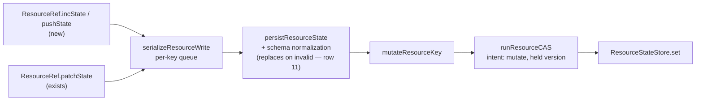

# FIX-1154: Scope state and resources split one mutation surface across two APIs — Implementation Spec

## Part I — The Case *(for the human)*

### 1. Problem — why it matters, why now

FSD stores durable data two ways: the **state bag** on a session (or user, or org), and
**resources**. Developers pick by **which one carries the verb they need** rather than by
where the data belongs. The bag has "add one to this counter" and "append to this list";
resources have neither, and our docs tell people to *prefer* those verbs when several
things write at once. Someone who correctly chose a resource reads that and moves the data
back into a bag it did not belong in.

Underneath, the surfaces differ in **eleven** ways — most written down nowhere, none
collected anywhere a developer would look, and no way to tell which are deliberate.

### 2. Solution in plain terms

Give resources the two missing verbs, on both public handles, typed from the resource's own
state so a mistyped field is a compile error rather than a write that quietly does nothing.
Then write the eleven differences down once — each closed, deliberate, or deferred — and
ship that map into the docs, where the choice gets made.

One difference is permanent and is the headline: **a resource write is always
version-checked and can be refused**, because a resource can be deleted and a check-free
write would resurrect it. A bag write can skip that check. The verbs look identical and do
not promise the same thing.

Building them also surfaced **two ways a resource write silently loses data today**, both
erasing untouched fields while the call reports success. The new verbs refuse both; the
three existing write methods still carry them, each filed as its own defect.

**Philosophy** — tenets 2 and 3 (extends an existing write path; drops a deferred tier and
splits out two bundled fixes) and tenet 1 (one true statement replacing a misleading one).

### 6. Decisions & rules — the sign-off surface

Decisions 1 and 2 are live forks, **asked in full in the spec PR description**; these lines
are the record, not the ask.

1. **Resources get `incState` and `pushState` on both public handles, typed from the
   resource's own state, with the weaker guarantee documented on the methods.**
   *Locks in:* two methods on a shipped interface we cannot remove without a breaking
   change, and a permanent difference in what "atomic" means across the two primitives.

2. **Store-native increment and append for resources stays deferred — but this is now a
   live fork, not a ratification.** Review falsified the reason this spec gave for taking
   it off the roadmap. "Removes no conflicts" was **wrong**: it assumed a native resource
   delta must carry a held version, and a *lifecycle-guarded* delta is a third option
   nobody had weighed — tombstone-safe without a version predicate, so concurrent
   increments would all land (§7b). What is left to defer on is implementation cost plus a
   design surface nobody has evaluated, which is weaker than what you were previously asked
   to ratify. **Asked in full in the spec PR description; do not read this line as settled.**
   *Locks in, if deferred:* resource writes keep sending the whole value, concurrent
   resource increments keep contending, and reversing is real work rather than an additive
   tweak (§7b).

3. **The difference map ships as documentation, split by audience**, not pasted whole into
   every surface.
   *Locks in:* two pages anyone changing either surface has to keep true.

**Non-goals** — merging or deprecating either primitive; a shared `MutationContract` type;
reconciling the two retry drivers; fixing the bag's own adapter divergences; cross-record
atomicity (FIX-854); the resource-only surface with no bag analogue.

**Size:** Medium — 2 production files · 17 test behaviours · 7 doc surfaces · 1 PR.
**Most of the work is documentation.** Everything justifying the above is Part II —
alternatives (§7b), practices (§7c), examples (§7d).

---

## Part II — The Build Plan *(for the implementing agent)*

Part II carries shape and sequence, not the finished design.

### 7. Technical design

Nothing new is built. The two verbs are two more mutator bodies handed to the write path
`patchState` already uses, and the map is documentation.



- **`@flow-state-dev/core`** — `ResourceRef` and `ResourceContext` each gain `incState` and
  `pushState`. No new shared type: the epic's guard against a premature `MutationContract`
  stands and nothing here needs one.
- **`@flow-state-dev/engine`** — the resource registry gains the two ops in **both** ref
  builders (the single-resource handle and the collection-instance handle). The retry
  driver, the store contract and every adapter are **untouched**.
- **Untouched, deliberately:** `ResourceStateStore`, `DeltaStoreOps`, both CAS drivers, the
  scope persist bridge, and every store adapter.

**Keys come from `keyof TState`, not from a string map.** The bag's `incState` takes
`Record<string, number>`, and copying that here would be a public-boundary defect (BP-004):
`incState({ factExtractd: 1 })` — a typo — type-checks, an ordinary `z.object` then
**strips** the unknown key during normalization, the result deep-equals current state, and
the call resolves as a **verified no-op**. Nothing throws and nothing is written. So
increment's keys narrow to the number-valued keys of `TState`, append's to the array-valued
ones, and the appended value's type follows that array's element type. **A runtime
unknown-key rejection backs the types up**, because a JavaScript caller or an `as any` walks
straight past them into the same silent no-op.

**What the verbs must refuse.** One rule per case, and the last two are the ones that look
like they need no rule:

- **Field absent** → treat as the identity (`0`, or an empty list) and apply. The ordinary
  first-touch case; must not be an error.
- **Field present but the wrong type** → **throw**, naming the call site.
- **Any non-finite number** — a delta, a computed result, or one appearing anywhere inside
  an appended value → **throw**. Applies to `incState` *and* `pushState`.
- **A result the resource's `stateSchema` rejects** for any other reason — a refinement like
  `z.number().nonnegative()` that a decrement pushes below zero, where the JavaScript type
  is still correct → **throw**.

**Every one of those throws must be NON-RETRYABLE, and a plain `Error` is not.**
`isRetryableError` stops only for a `FlowError` carrying `retryable: false`; anything else
falls through to `return true` when the policy names no error types
(`execution/retry.ts:76-89`). So a refusal thrown as an ordinary `Error` puts the **whole
block** back through the retry policy — re-running every side effect it already performed —
on what is by definition a programming error that cannot succeed on a second attempt. Use
`ValidationError` (`errors/flow-error.ts:33-44`, `code: "validation_error"`,
`retryable: false`), which is exactly this case, or a typed equivalent that also carries
`retryable: false`.

This is the one refusal detail that is **not** the implementer's to settle: a spec that says
only "throw" ships that bug, because the §10 behaviours would stay green while the block
silently re-ran. §10 therefore asserts the **attempt count through the execution retry
path**, not just that the call rejected.

**Why the schema and non-finite rules need to exist at all — the write path does not reject,
it replaces.**
A result that fails the schema is not refused. A single resource's state is swapped for the
resource's **entire default** (`resources/normalize-resource-state.ts:44-51` — a failed
`safeParse` falls through to `normalizeResourceDefault`); a collection instance's is swapped
for **`{}`** (`context/resource-registry.ts:679-680`, the `: {}` branch). The call then
resolves normally with fields the caller never touched gone.

Non-finite numbers reach that same destruction by a longer route, which is what makes them
the worst case here. A plain `z.number()` **accepts** `Infinity` and `-Infinity` — only
`NaN` is rejected — so `incState({ n: Infinity })`, an increment that overflows to it, and
`pushState("values", Infinity)` against `z.array(z.number())` all pass the schema check and
get written. Then the adapters disagree: the in-memory store clones with `structuredClone`
(`core/src/helpers/clone.ts:16`) and **keeps** the value, while the SQLite and filesystem
resource stores `JSON.stringify` it (`filesystem/resource-state-store.ts:83`) into **`null`**.
On the next durable read that `null` fails the schema — and *that* failure lands in the
replacement above.

So the defect never surfaces at the write that causes it. It surfaces later, in a different
request, as unrelated fields vanishing, and only on some deployments. That is why finiteness
is checked at the call site rather than left to the schema. A resource declaring `.finite()`
would be caught by the schema check, but nothing makes that the default and no existing
resource does it.

The choice here is therefore not between rejecting and validating — it is between
**throwing** and **silently resetting state**, and this spec throws. Same failure class as
the two other data-loss paths this review turned up (row 5's partial-merge, and the bag's
`pushToArray` divergence in §12), and the same answer: a write that cannot be performed
correctly must not resolve as though it were.

**Scoped to the new verbs, deliberately.** `patchState`, `setState` and `updateState` keep
today's behaviour on all of the above — changing them is a break on shipped methods and is
not this issue's to make. That leaves a real inconsistency, and it is the lesser evil
against shipping two brand-new methods into a known data-loss path. Both underlying defects
are filed in §12.

**Solution sketch — pseudocode. Illustrative, not the contract. React to the shape.**

```
on the resource handle, beside patchState:

    incState(increments):            keys: number-valued keys of TState
        reject non-finite deltas, and unknown keys → throw
        mutator, per field:
            absent       → start from zero, add the delta
            not a number → throw
            otherwise    → add, then non-finite → throw
                           (the schema will NOT catch this)

    pushState(field, value):         field: array-valued keys of TState
        reject unknown field, and any non-finite number
        anywhere inside `value` → throw
        mutator: absent → empty list, then append
                 not a list → throw

    both, before handing off:
        result fails the resource's schema → throw
        (NOT hand it on — the write path would reset the
         state and report success)
```

What this asks a reviewer: *is riding the existing mutator seam the right shape, or should
these carry an intent hint the way the bag's verbs do?* This spec says the former, and
decision 2 is why — a hint would have nowhere to route to.

**POC — built on this branch; results and limits in §12.**

```
pnpm install
cd spec-poc/FIX-1154-resource-mutation-verbs && ../../node_modules/.bin/vitest run
```

### 7a. The mutation-surface map — this issue's headline deliverable

Derived line by line from `ScopeStateOps` (`packages/core/src/types/state.ts`),
`ResourceRef` and `ResourceContext` (`packages/core/src/types/resource.ts`), and the write
path each op takes. **Verdict is one of: closed here · deliberate asymmetry with a reason ·
deferred with a trigger.** This is the source for §11, which ships it split by audience.

The epic asserted a version of this claim three times and each was falsified by the next
review round; two further rounds then corrected rows here. Every row states what it depends
on rather than the clean version of it, and that is why.

| # | Difference | State bag | Resource | Verdict |
|---|---|---|---|---|
| 1 | `incState` | present | absent | **Closed here** — both resource handles, version-checked, typed from `keyof TState`, with the refusals in §7 |
| 2 | `pushState` | present | absent | **Closed here** — same |
| 3 | `setStateRecord(field, key, value)` | present | absent | **Deliberate** — it addresses one slot inside a blob many writers share. A resource *is* the per-key row, so the storage key already does that addressing. A map nested inside a resource's own state is reached with `updateState` |
| 4 | `deleteStateRecord(field, key)` | present | absent | **Deliberate** — same addressing argument. This removes a key *inside* a state field; it is not the resource-lifecycle delete, which resources have separately |
| 5 | Re-run-a-callback mutation | `atomicState(fn)` — `fn` returns a **partial**, shallow-merged over current state. Fields the callback omits are **kept** | `updateState(fn)` — `fn` returns the **whole next state**, normalized and written. Fields the callback omits are **gone** | **Deliberate, and NOT interchangeable.** Both re-run their callback against refreshed state on retry, and that is where the similarity stops. Moving a callback between them **silently drops every field it does not return**. **Never describe these as one op under two names** — a reader who believes that and ports a callback loses data. Row 9 carries the remaining signature differences |
| 6 | `getOrPatchState` | absent | present on `ResourceRef`, **absent on `ResourceContext`** | **Bag side: deliberate** (no demand; no per-key single-flight seam there). **Handle split: deferred, not closed here.** A different defect class from rows 1–2: those are verbs missing from the *runtime*, this is a verb the runtime already has and only the *type* omits — so it is a type-surface gap, **not a missing capability, and not a runtime bug** for a later reader to reopen as one. No consumer demonstrates demand: every `ResourceContext` in the repo is a cast target and **no production code calls `getOrPatchState` through either handle**. The epic's standing constraint — no new abstraction until a second consumer appears — decides it. *Trigger:* the first consumer that actually wants it on `ResourceContext` |
| 7 | Return type | `Promise<boolean>` — callers branch on it to suppress a redundant change event | `Promise<void>` — the driver verifies the no-op internally and gates the event itself | **Deliberate** — settled at epic altitude. New verbs return `void` |
| 8 | `patchState` keyed-updater form `(key, updater)` | present | absent | **Deferred** — the overload exists to produce a read-modify-write routing hint, which resources have nowhere to route to (decision 2). `updateState` covers read-then-compute. *Trigger:* revisit only if decision 2 is reversed |
| 9 | Callback signature on the row-5 pair | `atomicState`: callback must be **synchronous**; parameter typed read-only | `updateState`: callback **may be async**; parameter **not** typed read-only | **Deliberate** — resource updaters do I/O, so async is required. The non-read-only parameter is a type-level laxity the runtime compensates for by cloning. **Deferred:** tightening breaks call sites for no behaviour change. *Trigger:* the next breaking change to this interface |
| 10 | **Guarantee and cost of the verbs they share** | **Guarantee:** a write skips the version check only when it emits a commutative hint **and** the adapter implements the matching delta verb. Both are narrow — `incState({a:1,b:1})` emits no commutative hint and takes checked CAS, and the verbs are **optional** on the store contract. **And skipping the check is not immunity:** every shipped delta store refuses a **missing record even at `"any"`** (`memory/shared.ts:72-74`, `sqlite-store.ts:226-231`), so a write racing a record delete is still refused — silently, as a reported no-op, on the commutative path. **Cost:** sends only the delta, but **still rebuilds the array** (memory and SQLite spread, Postgres concatenates into new JSONB) | **Guarantee:** every write is version-checked and can raise a conflict or a deleted-resource error. No exceptions, no adapter can change it. **Cost:** sends and rewrites the whole state. **Not** an asymptotic difference — both rebuild the list — but more data per write, and appending in a loop is N whole-state writes | **Deliberate and permanent on the resource side** — resources have a lifecycle and bag records do not, so a check-free write to a resource could resurrect a deleted one. **The bag side is conditional three times over** (hint shape, adapter support, record existence) and every condition must travel with the claim. No caller-facing doc states any of it. The sharpest row, the most corrected, and the easiest to publish wrongly |
| 11 | What happens to a schema-invalid write | none at the mutator layer — the bag does not re-check the schema per write | **Not validation — a destructive fallback.** A result failing the resource's `stateSchema` is replaced: a single resource's state with its **entire default** (`normalize-resource-state.ts:44-51`), a collection instance's with **`{}`** (`resource-registry.ts:679-680`). The call then resolves successfully, having erased untouched fields | **Deliberate that a resource carries its own schema; NOT deliberate that violating it resets state.** The new verbs **throw** rather than enter this path (§7). The three shipped ops keep it, so the inconsistency is real and named. **Never describe this row as validation** — the word implies a rejection that does not happen. Filed as its own defect (§12) |

**Rows 1 and 2 are the code change — the scope is exactly two verbs.** The rest is
documentation or a follow-up.
Nothing is left as "unknown".

### 7b. Tradeoffs & alternatives *(moved out of Part I)*

**Alternative: don't add the verbs, just document the gap.** The strongest case against this
spec. Every increment and append on a resource in this repository today is **compound** —
semantic memory's `addFact` appends a fact *and* bumps a counter in one write; working
memory's `advance` bumps a turn counter *and* recomputes every entry. None would be
rewritten to use a single verb, so the two new methods replace **zero** existing call sites.
Judged on code removed, they are worth nothing.

They are not judged on that, and the case has two legs. The softer one is discoverability:
somebody scans a method list and picks a primitive, upstream of any call site, where a
documentation line does not reach. The harder one is checkable — **eight files across
`@flow-state-dev/memory` and `@thought-fabric/core` already type their resource work as
`ResourceContext`** (`working-memory-helpers`, `semantic-memory-helpers`,
`episodic-memory-helpers`, `digest-helpers`, `internal/recall`, `capabilities`,
`perspective-helpers`, `perspective-capability`). Those are the consumers, they hold the
narrower handle, and they cannot reach a verb that lands only on `ResourceRef`.

**Alternative: give resources the store-native delta verbs too** (the epic's deferred
Tier 2). Deferred in decision 2 — and **the first reason this spec gave was wrong**, which
is why decision 2 is now a live fork rather than a ratification:

1. ~~**It removes no conflicts.**~~ **False, and the error is worth naming because the epic
   made it too.** The claim assumed a native resource delta must carry a held
   `expectedVersion` — the epic's constraint says never use the commutative `"any"`
   downgrade, because `"any"` asserts nothing about the row and can resurrect a tombstone.
   But `"any"` is not the only version-free option. **Both SQL resource stores already
   predicate every conditional update on `lifecycle = 'live'`**
   (`store-postgres/src/resource-state-store.ts:205-211`,
   `store-sqlite/src/resource-state-store.ts:54-58`). A delta predicated on
   *liveness rather than version* is tombstone-safe by construction: concurrent increments
   would all land, and a delete that wins first makes the delta refuse without resurrecting
   anything. So a lifecycle-guarded native delta **would** remove contention on the resource
   path. Nobody weighed that option — the epic ruled out `"any"` and this spec inherited the
   conclusion without noticing a third choice sat between them.

   What still argues for deferring is **a design surface nobody has evaluated**, not the
   absence of a benefit. A version-free resource write bypasses `runResourceCAS` entirely,
   and that driver is where the verified-no-op check, the `previousState` basis and the
   `resource_change` gate all live. The epic's theme-2 proof obligation — *every row of the
   policy table survives* — would come back, and harder than the version-checked form this
   spec analysed, because the commutative path has no basis to verify against. That is a
   real reason to not do it now. It is **not** the reason decision 2 previously gave.
2. **It does not remove the per-append copy.** Every shipped native append rebuilds the
   array. What it buys is bandwidth and a smaller *logical* blast radius — and even the
   physical one only on Postgres, which updates the JSONB path in SQL; SQLite's `runDelta`
   parses and re-serializes the whole record blob (`sqlite-store.ts:241-247`), and the
   filesystem and memory stores rebuild and persist the enclosing record.
3. **Reversing is real work, and this spec twice said otherwise.** *Which interface bears
   the cost is the substitution that keeps happening:* the optional, feature-detected delta
   verbs (`patchField?` / `incField?` / `pushToArray?` on `DeltaStoreOps`) belong to the
   **scope-record** stores — `SessionStore`, `RequestStore`, `UserStore` and `OrgStore` each
   `extends DeltaStoreOps` (`stores/types.ts:516, 551, 772, 784`). **Resources go through
   none of them.** Resource state persists via `ResourceStateStore`
   (`stores/types.ts:1036`), which extends nothing and whose entire mutation surface is
   `set`, `delete` and `deleteAll`. Native resource verbs mean extending *that* contract,
   implementing it per adapter, and extending the conformance suite. Reason about this from
   `ResourceStateStore`, never from the scope-side precedent.

**Where the complexity is:** not in the two verbs, which are a dozen lines each. It is in
getting each map row's *reason* right rather than its existence — five review passes have
each corrected a row that read as true.

### 7c. Focus practices *(moved out of Part I)*

1. **BP-004 (public boundary first)** — three separate defects in this spec were public
   boundary defects: a verb reaching one handle and not the other, a `Record<string, …>`
   key surface that turns a typo into a silent no-op, and a guarantee documented without
   its conditions.
2. **BP-007 (concise API docs)** — the weaker guarantee belongs on the methods, not only on
   a docs page. Someone reading a method list never reaches the page.
3. **State a condition or state nothing** (change-specific, not yet a BP) — every claim in
   the map that survived review did so by naming what it depends on. "Contention-free" was
   wrong three times; the version in row 10 names all three conditions. **The same rule
   bans equivalence claims outright** (row 5): "the same op under two names" was refined
   three times and was wrong every time.
4. **Tenet 7 (prove the goal, not the mock)** — the epic's load-bearing claim was a
   type-level read; it is now run. Where a claim in this spec is still a read rather than a
   run, §12 says so.

### 7d. What using it looks like *(moved out of Part I)*

```ts
// after
await ctx.resources.stats.incState({ factsExtracted: 1 })
await ctx.resources.stats.pushState("recentTopics", topic)

// before — still valid, and still the right tool for a compound change
await ctx.resources.stats.updateState((s) => ({
  ...s,
  factsExtracted: s.factsExtracted + 1
}))
```

Through a shared helper — the handle the eight consumer files actually hold:

```ts
type SemRef = ResourceContext<SemanticMemoryState>
async function recordExtraction(ref: SemRef) {
  await ref.incState({ totalExtracted: 1 })   // reaches ResourceContext too
}
```

What the differences look like when they bite:

```
scope bag    await ctx.session.incState({ n: 1 })
             → single field + adapter has a native increment: version check
               skipped, so concurrent state updates cannot refuse it
             → but a concurrent DELETE of the record still refuses it, even
               at "any" — reported as a no-op on the commutative path
             → multi-field, e.g. incState({ a: 1, b: 1 }): version-checked,
               and can raise ConcurrentModificationError on retry exhaustion

resource     await ctx.resources.stats.incState({ n: 1 })
             → always version-checked: normally lands, re-running against the
               winner on a conflict
             → ConcurrentModificationError if contention outlasts the retries
             → ResourceDeletedError if the resource was deleted underneath

resource     await ctx.resources.stats.incState({ factExtractd: 1 })
             → compile error. On the bag's Record<string, number> surface the
               same typo type-checks, is stripped during normalization, and
               resolves as a silent no-op

resource     await ctx.resources.log.pushState("entries", e)   // in a loop
             → N whole-state writes. For bulk appends use one compound write
```

### 8. Implementation sequence

Two unrelated cleanups review found bundled here have been **cut** — see §12.

**Two axes, and getting either wrong ships a no-op.** The verbs must reach both *public
handles* (`ResourceRef` **and** `ResourceContext`) and both *ref builders* (the
single-resource handle and the collection-instance handle). Different things, different
packages.

1. **Add both verbs to both public handles**, typed from `keyof TState` per §7.
   `ResourceContext` is not optional: it is what the eight consumer files type against, so
   verbs landing only on `ResourceRef` would reach none of them and the issue would close
   without solving anything. Document the weaker guarantee on the methods themselves.
   *Test:* the type behaviours in §10. *Depends on:* nothing.
2. **Implement both ops in the resource registry**, in **both** ref builders, with every
   refusal in §7. *Test:* the behaviours in §10. *Depends on:* 1.
3. **Ship the map** per §11, and **correct the concurrency-guidance line** that tells
   readers to prefer increment and append for concurrent writes without saying which
   primitive, which adapter, which arity, or that a deleted record refuses the write anyway.
   *Depends on:* 1–2.

*(No removals. Subtraction here is decision 2, the §12 split, and row 6 — the scope is
exactly two verbs. `getOrPatchState` is **not** added to `ResourceContext`.)*

### 9. Edge cases & error handling

| Case | Expected |
|---|---|
| `incState` / `pushState` on an absent field | Starts from `0` / an empty list, then applies |
| `incState` on a field holding a non-number | **Throws**, naming the field |
| `pushState` on a field holding a non-array | **Throws**, naming the field |
| Unknown key — `incState({ factExtractd: 1 })` | **Compile error**, and a **runtime throw** for callers who reach it untyped. Never the bag's silent strip-and-no-op |
| `incState({ n: Infinity })` or `{ n: -Infinity }` | **Throws.** A plain `z.number()` accepts both, so the schema check does not catch them |
| `incState` whose sum **overflows** to `Infinity` | **Throws.** Same path, reached by arithmetic rather than by argument |
| `pushState("values", Infinity)`, or an appended object containing a non-finite number anywhere | **Throws.** Identical hole to the two above — `z.array(z.number())` passes it just as `z.number()` does |
| `incState({ n: NaN })` | **Throws** — caught by the schema check, since `z.number()` does reject `NaN`. Listed because it is the one non-finite value that behaves differently |
| Either verb producing a value the schema rejects for any other reason (a refinement) | **Throws.** Handing it on does not reject it — it **replaces the whole state** and resolves successfully (§7, row 11) |
| Multi-field `incState` on a resource | No special case: every resource write is version-checked regardless of arity, so a resource has no equivalent of the bag's single/multi-field split (row 10) |
| Either verb on a resource never yet stored | Creates it from its schema default plus the change. Proven in the POC |
| Either verb producing no change, against a **live** row or a **never-stored** resource | A **verified** no-op: no write, no version bump, no change event — and specifically **not** an error about a deletion. Proven in the POC |
| Either verb producing no change, while holding a **stale positive version** of a row that has since been **deleted** | **`ResourceDeletedError`** — terminal, not a quiet no-op. The no-op branch re-reads, finds no live row, and reports the deletion because the held version is not `0` (`resource-cas.ts:229-252`). This is the **boundary of the row above**, and stating it unqualified was a defect. Proven in the POC |
| Either verb racing a delete of the same resource | Terminal `ResourceDeletedError`. Never a resurrection. Proven in the POC |
| Two contexts running the same verb on one resource | Both land; the loser re-runs against the winner. Proven in the POC |
| Contention outlasting the retry budget | `ConcurrentModificationError`, as every other resource write already does |
| Either verb on a resource declared `writable: false` | Rejected, on the same path `patchState` already rejects |

**Taxonomy:** the three errors resource writes already raise, plus one new *fatal* class —
a call the verb refuses (unknown key, wrong type, non-finite, schema-invalid). All are
programming errors at the call site and must throw **before** reaching the write path, which
would reset state and report success. **They must also be non-retryable by type**
(`ValidationError` or equivalent, §7) — not merely documented as fatal, because the retry
path decides from the error's type and defaults to retrying.

**Second path (BP-035):** the second path is the **collection-instance** handle. A change
tested only against `ctx.resources.foo` ships half the feature — the two handles are built
by separate code in the same module.

### 10. Testing strategy

**No goal check applies.** The deliverable is a public-type change plus documentation, and
the behaviour underneath is the existing write path, already exercised on the real path by
the POC.

**CI specs** (the behaviours, not the test names):

1. increment on a single resource
2. append on a single resource
3. both verbs on a **collection instance** (BP-035)
4. absent field takes the identity for both verbs
5. wrong-typed field **throws** for both verbs, and the message names the field
6. **unknown key is a compile error** (type test) **and** a runtime throw when reached
   untyped — asserting specifically that it is *not* a silent no-op, which is what the
   bag's key surface produces
7. **a schema-refinement violation that keeps the right JavaScript type throws** — e.g.
   `incState({ n: -1 })` against `z.number().nonnegative()` — on a single resource **and**
   a collection instance
8. **non-finite throws, for `incState`**: `Infinity`, `-Infinity`, and an **overflow** case
   reaching `Infinity` by arithmetic. Cover `NaN` too, noting why it is the odd one out
9. **non-finite throws, for `pushState`**: a non-finite appended value, **and** one nested
   inside an appended object — the case a shallow check misses
10. multi-field increment on a resource behaves as any other resource write
11. concurrent increments from two contexts converge
12. a verb racing a delete is terminal
13. a no-change verb is a verified no-op that does not bump the version — against a
    **live** row and against a **never-stored** resource
14. **a no-change verb against a row we held and lost is terminal** — a stale positive
    version plus a deleted row raises `ResourceDeletedError` rather than reporting a quiet
    no-op. This is the boundary of behaviour 13, and asserting 13 alone would let an
    implementation collapse the two
15. **a no-change verb emits no `resource_change`** — on a **collection instance** and on a
    **live (or `reactTo`) single resource**, each with a negative control proving the event
    fires for a real change. `committed: false` exists *because* the notification is gated
    on it, and each ref builder carries its own copy of that gate
16. a `ResourceContext`-typed value exposes `incState` and `pushState` — easy to get
    half-right, because adding to `ResourceRef` alone type-checks everywhere
17. `updateState`, `patchState`, `setState` **and `getOrPatchState`** behave byte for byte
    as today — `getOrPatchState` included because row 6 defers its handle gap, so this
    change must leave it exactly where it is

**Every refusal (5–9) is asserted through the execution retry path, not just at the call.**
Each of those behaviours runs the verb inside a block under a retry policy and asserts the
block executed **exactly once** — that the refusal aborted rather than being retried. A test
that only asserts the promise rejected stays green while the block re-runs every side effect
it already performed, which is precisely the defect §7's non-retryable requirement exists to
stop. Assert the error type carries `retryable: false` too, so the guarantee is pinned to
the type rather than to one call site's behaviour.

**Every throwing behaviour (5–9) also asserts the resource's other fields survive.** The
failure being guarded is not a bad value being stored — it is the whole state being reset
while the call reports success, so a test that only asserts "it threw" would pass against an
implementation that threw *after* the reset landed.

**Behaviours 8 and 9 must not be written as schema-check tests.** The whole point is that
the schema passes non-finite values.

**Constraint on graduating rows 11–13 from the POC:** the POC models the verbs as wrappers
over `updateState` and casts through `as any` / `as unknown as`. Fine for throwaway code and
**not** fine in CI — the graduated specs must call the real `incState` / `pushState` on
typed `ResourceRef` and `ResourceContext` values, or they would pass without the shipped
methods existing.

**Discipline:** `tdd`. The seam is the resource registry, reachable from a vitest spec over
`createExecutionContext` with in-memory stores — the harness the POC already uses.

### 11. Documentation plan

The map ships **split by audience**. Eleven rows in four places is a maintenance contract
nobody keeps, so each surface gets the slice its reader needs and only that.

- **EXTEND** `apps/docs/docs/state/mutation-model.md` — the published page a developer
  choosing between the primitives lands on. **Lead the resource section with row 10** — the
  guarantee difference and the cost difference — rather than leaving it at the end where a
  linear reader has stopped. Then the verb lists, then the refusals from §7 (a caller needs
  to know these throw). One minimal example: the same counter written both ways, with what
  each can raise; plus the bulk-append steer from §7d.
  *Cross-link:* ← resources overview, → the scopes page.
  *Voice risk:* "atomic" means two different things across this page. Never use it
  unqualified here.
- **EXTEND** `docs/architecture/state-and-scopes.md` — the internal contract reference, and
  the paragraph this issue owns under the epic's shared-surface convention. Carry the
  **collapsed** table: rows 3 and 4 merge into one addressing row, rows 8 and 9 drop to a
  footnote (both deferred-with-trigger, both noise inline). Correct the concurrency-guidance
  line per §8 step 4. **Leave the pointer sentence to the retry driver's policy table
  alone** — the epic reversed an earlier plan to move that table.
- **EXTEND** `packages/core/README.md` — the `ResourceRef` / `ResourceContext` entries gain
  the new verbs, with a pointer to the map. No table.
- **EXTEND** `docs/contributing/architecture-reference.md` — the locked-contracts list names
  the seven bag ops with no resource counterpart. Add the resource line. One line, no table.
- **QUALIFY three published guides that already promise the unqualified version.** Leaving
  them makes the docs contradict each other the moment `mutation-model.md` lands, and one is
  wrong on its own terms today:
  - `apps/docs/guides/building-a-chat-app.md:67` — *"`incState` is atomic … a single
    CAS-guarded operation. Safe under concurrent requests."* **Wrong twice over**,
    independent of this change: a single-field bag `incState` on a delta-capable adapter
    skips the version check, so it is *not* CAS-guarded; and it can still be refused by a
    concurrent record delete (row 10). Rewrite, don't just link.
  - `apps/docs/guides/anatomy-of-a-flow.md:89` — *"Concurrent `incState` and `pushState`
    calls do not lose updates. Each write is atomic."* Qualify, or link to row 10.
  - `apps/docs/docs/sequencers/control-flow.md:45` — *"reach for an atomic state op
    (`incState`, `pushState`, `setStateRecord`) when a shared key is unavoidable."* This is
    the advice §1 names as the thing that pushes people off resources. It needs the resource
    counterpart beside it.
- **No new page.** One section under two existing concepts.

### 12. Dependencies, open questions & follow-ups

**Dependencies:** none. No open PR touches either type file or the resource registry.
FIX-1158 (the epic's other active child) shares no code with this, and the epic states its
children are independent.

**Open questions:** none.

**Settled claims**

- **Settled:** the retry driver's conflict policy survives under increment- and
  append-shaped mutators on the real resource path — **CONFIRMED**. Eleven rows, all
  passing: concurrent increments converge · concurrent appends converge · both verbs stay
  **terminal** against a deleted resource rather than resurrecting it · a zero increment is
  a **verified** no-op that neither bumps the version **nor emits a `resource_change`**,
  checked on both a live single handle and a collection instance, each with a negative
  control proving the event fires for a real change · a first touch of a never-stored
  resource is not misreported as a deletion · two first-touch increments converge rather
  than raising already-exists · **and the boundary of the no-op guarantee**: a zero
  increment against a row we held and lost raises `ResourceDeletedError` rather than
  reporting a quiet no-op, which is why §9 states that guarantee for live and never-stored
  rows only. (`spec-poc/FIX-1154-resource-mutation-verbs/`; run command in
  §7.)
- **Not reached — the POC covers none of the refusals in §7.** Every row uses a permissive
  schema and finite values, so none enters the destructive-replacement path or the
  non-finite one. Those contracts rest on **reading** `normalize-resource-state.ts:44-51`,
  `resource-registry.ts:679-680`, `filesystem/resource-state-store.ts:83` and
  `core/src/helpers/clone.ts:16`, plus a direct check of Zod's and `JSON.stringify`'s
  behaviour — not on running the shipped verbs, which do not exist yet. That is what §10
  behaviours 5–9 are for.
- **Not reached, and deliberately so:** the epic's theme-2 claim as originally written
  covers *store-native delta verbs* carrying a held version. Decision 2 drops that tier, so
  no code in scope exercises it. The obligation is **dissolved by scope reduction, not
  discharged by evidence** — recorded plainly because reversing decision 2 re-opens it.

**Split out of this change (review found them bundled; each wants its own issue):**

- **The retry driver's stale citations.** Its module header explains itself with seven
  line-number citations into neighbouring modules; **six point at the wrong lines** on
  current `main` (one at a blank line, one at a type declaration), an eighth in the body is
  wrong too, and one is wrong in *substance*: it attributes the unconditional-write
  downgrade to the scope CAS driver's commutative path when it comes from the scope persist
  bridge one module over. Re-cite by symbol, and fix the attribution.
- **The guard at the point of temptation** (epic theme 1) — a doc comment on
  `createScopeStateOps`, exported from the engine package root, warning that its
  identically-named ops are the wrong import for a resource.

**Follow-ups (flagged, not built):**

- **Non-finite numbers survive a resource write on some adapters and become `null` on
  others**, then fail the schema on a later read and trigger the reset below. The new verbs
  refuse them (§7); every existing write op still accepts them. **Wants its own issue** —
  the sharpest of the three filed here, because the damage is deferred and
  adapter-dependent.
- **A schema-invalid resource write silently resets state and reports success.** Not a
  rejection but a *replacement* — the resource's entire default, or `{}` for a collection
  instance. Every existing write op goes through it. **Wants its own issue.**
- **The bag's `pushToArray` diverges across adapters, three ways** — appending to a durable
  bag field already holding a non-array **throws** in memory, **replaces** the value in
  SQLite, and **wraps** it in Postgres. One silently destroys data. **Wants its own issue.**
- **A losing commutative bag write is not retried** — on an adapter without the native verb,
  or against a deleted record even with it, the write is reported to the caller as a no-op
  rather than retried. Already tracked by
  [FIX-710](https://linear.app/fixpoint-labs/issue/FIX-710).
- **Map rows 8 and 9** carry their own triggers; neither fires while decision 2 holds.
- **Deepening:** the two ref builders in the resource registry duplicate their write-op
  bodies almost exactly, and this change adds two more pairs. Follow up via
  `improve-codebase-architecture`.

---

## Spec evolution

- **Spec drafted** — framed as a discoverability failure rather than a capability gap,
  because every increment and append on a resource today is compound and would not use a
  single verb; built the map from the type declarations after the epic's three attempts were
  each falsified; dropped the epic's deferred store-native tier; ran the epic's
  least-evidenced claim as a POC on the real path, where it held.
- **After spec review, round 1** — row 10's bag half was wrong twice over: the check-free
  path needs the adapter to implement the matching delta verb *and* the call to be
  single-field. "Coercion parity with the bag" turned out unspecifiable — the bag's own
  adapters do three different things with a wrong-typed field — so §7 defines the resource
  contract independently and the divergence is filed.
- **After spec review, round 2** — split two unrelated cleanups out of §8; kept
  `getOrPatchState` in on second look, because `ResourceContext` is the handle eight
  existing consumers hold. *(That reinstatement was reversed in the final pass — see the
  last entry; do not act on this line.)* Those eight files replaced the unfalsifiable
  autocomplete argument as decision 1's evidence. Row 5's "same op under two names" was
  **replaced, not refined** — the bag merges a partial, the resource replaces wholesale, so
  porting a callback drops fields.
- **After spec review, round 3** — three corrections, two of them to earlier corrections.
  `z.number()` accepts `Infinity`, so the schema check does not catch non-finite values, and
  the adapters then disagree — memory keeps them, SQLite and filesystem serialize to `null`,
  which fails the schema on a *later* read. The round-2 per-append **cost** claim was wrong:
  every shipped native append rebuilds the array. And the round-2 "reversal is cheap"
  correction was itself wrong — those optional delta verbs live on `DeltaStoreOps`, which
  the four **scope-record** stores extend and resources never touch.
- **After spec review, round 4 — final** — the non-finite guard was applied to `incState`
  only; `pushState` had the identical hole and now shares the rule. Both verbs' keys move
  from a bag-shaped `Record<string, …>` to `keyof TState`, because a mistyped key was
  type-checking, being stripped during normalization, and resolving as a **silent no-op** —
  worse than throwing. Row 10 gained its third and fourth conditions: a delta store refuses
  a **missing record even at `"any"`**, so skipping the version check is not immunity; and
  the targeted-rewrite benefit is Postgres-only, since SQLite re-serializes the whole record
  blob and the other two rebuild it. **Part I was cut from ~2,200 words to its budget**, with
  every derivation moved to §7b–§7d — five passes of corrections had each landed in Part I
  and grown the sign-off surface, which is the pattern that generated this round's findings.
- **After spec review, round 5 — a subtraction** — row 6's handle gap is **deferred, not
  closed**, cutting scope to exactly two verbs. The reinstatement in round 2 rested on eight
  files holding `ResourceContext`, which is a count of **type annotations, not of calls**:
  every one is a cast target, and no production code calls `getOrPatchState` through either
  handle. It is also a different defect class from rows 1–2 — a verb the runtime already has
  and only the type omits — so bundling it made the issue's own scope claim untrue. The
  epic's no-new-abstraction-without-a-second-consumer constraint decides it. The eight files
  still carry decision 1, where the argument is about *new* verbs being reachable at all, not
  about existing calls.
- **After spec review, round 6** — four confirmed defects, one of which mis-framed a
  ratification ask. **Decision 2's stated reason was false**: "removes no conflicts"
  assumed a native resource delta must carry a held version, but both SQL resource stores
  already predicate conditional updates on `lifecycle = 'live'`, so a *lifecycle-guarded*
  delta is tombstone-safe without a version predicate and **would** remove contention. The
  epic ruled out the commutative `"any"` downgrade and this spec inherited the conclusion
  without noticing a third option between them. Decision 2 stays deferred but is now an
  explicit fork, resting on implementation cost plus an unevaluated design surface — a
  version-free write bypasses `runResourceCAS`, where the no-op verification and the
  `resource_change` gate live. **§7's refusals are now typed non-retryable**
  (`ValidationError`): specified as plain `Error`s they would be retried by default
  (`execution/retry.ts:76-89`), re-running the whole block's side effects on a programming
  error while the tests stayed green — so §10 asserts attempt count through the retry path,
  not just rejection. The **no-op-is-never-a-deletion** guarantee was too broad and is now
  scoped to live and never-stored rows, with the deleted-row boundary added to the POC
  (eleven rows). The doc plan gained **three published guides** carrying the same
  unqualified concurrency promise, one of which is wrong on its own terms today.
