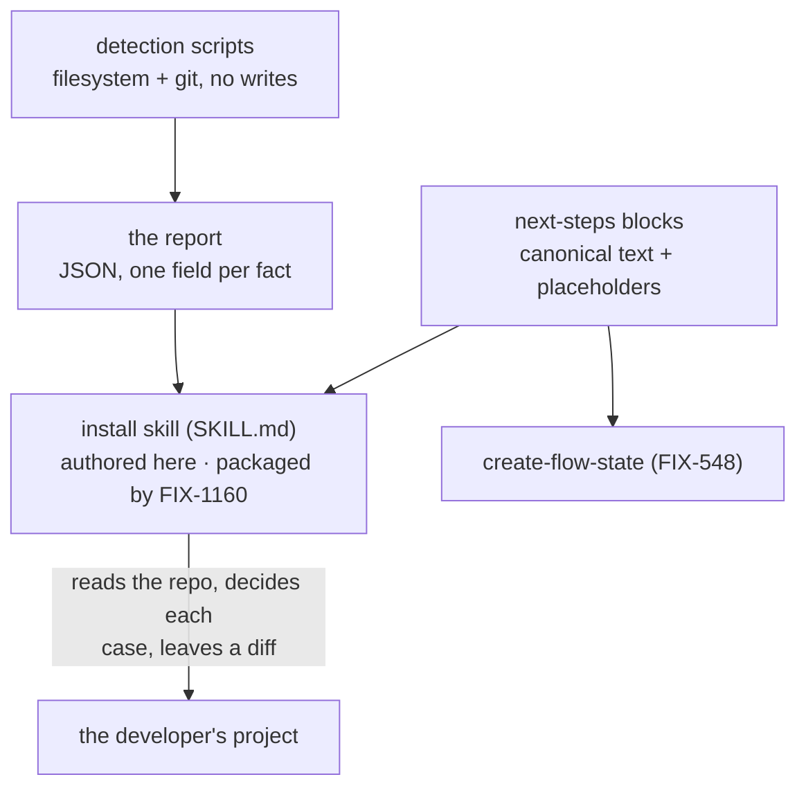

# FIX-1159: Adding FSD to a project you already have — Implementation Spec

## Part I — The Case *(for the human)*

### 1. Problem — why it matters, why now

Someone who wants to try FSD in a project they already have has no way in. The only documented
path is cloning our monorepo, so adding FSD to an existing Next.js app or Node service means
copying files out of our repository by hand and guessing at the wiring — config, the route that
serves flows, the keys, the scripts. Most people stop there.

**Why now** — Public Launch points strangers at a front door that does not exist. Everything
else in that project assumes a person can get FSD running in their own code in a few minutes.
There is no workaround worth naming: hand-copying our internal wiring is what we are trying to
stop asking people to do.

**Why this spec was re-shaped twice.** The approved version answered the whole problem with one
deterministic command. Three rounds of review then grew it a separate branch for each of: four
merge semantics across four files; CommonJS versus ESM config loading; Node 22.0–22.17 versus
22.18+; `packageManager` versus lockfile versus `npm_config_user_agent`; an already-tracked
`.env.local`; an existing `fsdev.config` that orphans the generated flow; an existing
`scripts.fsdev`; npm's option separator; `create-next-app` drift; the network-bind guard; a
two-process store race; provider SDK selection. Every one was found by a reviewer, one at a
time, and no round was the last. That is not a design converging — it is a command trying to
**enumerate** the shapes of repositories it has never seen. So brownfield became something an
agent runs. The second re-shape is this pass: the epic then assigned the set's **one** command,
and every deterministic file-writing path, to FIX-548. What is left here is the knowledge the
brownfield path is made of, and no command at all. §6 decision 1 carries the reasoning.

*Linear **FIX-1159** · Epic **FIX-1161** (`epic/building-with-fsd`, PR
[#1301](https://github.com/fixpoint-labs/flow-state-dev/pull/1301)) · spec PR
[#1310](https://github.com/fixpoint-labs/flow-state-dev/pull/1310) · Project **Public Launch**.*

### 2. Solution in plain terms

Four deliverables, and none of them is something a person types.

**Detection.** Which package manager, which Next version and where its app directory actually
is, whether a config already exists, whether `.env.local` is tracked by git. Cheap, checkable
facts about a repository, and an agent guessing at them is exactly the failure this issue exists
to prevent. They ship as deterministic scripts, and their output — a report — is the contract
everything else reads. **Detection is also where every refusal is decided**, which is what keeps
a run that cannot succeed from writing anything first.

**The install skill's content.** Adding FSD to a repository that already exists is a reading
problem before it is a writing problem: what is already in `AGENTS.md`, whether this project is
CommonJS, whether a config already claims the flow registry. A coding assistant reads all of
that directly, decides each case in context, and leaves the result as a diff the developer
reviews before accepting. This issue authors what that assistant is told to do. FIX-1160
packages and ships it as a Claude skill inside the plugin.

**The next-steps block.** The paragraph a developer reads when the run finishes — which servers
now exist, what each is for, which ports they land on, and the caveats. One authored source,
used by the brownfield skill and by FIX-548's greenfield command, with the commands rendered for
whichever package manager the path is actually using.

**The wiring contract both entry paths satisfy.** What a wired-up FSD project looks like: the
mount pair, the config's shape and store profile, and the dependency set. This issue holds the
knowledge of what wiring FSD into an existing repo requires, so it writes the specification;
FIX-548's template is the deterministic *writer* that conforms to it. Writing the shape and
specifying it are different jobs, and separating them is what lets the skill cite a shared
contract instead of restating a template it can never read.

**Philosophy** — tenet 5 (fix at the owning layer): merging into an unknown repository is a
judgment problem, and putting judgment in a `switch` statement is fixing it at the wrong layer.
Tenet 3 (earn every addition): this issue used to ship a command, then a command plus a library
behind it; it now ships neither, because the epic gave the deterministic writing to the one
issue that has a shape it controls. Tenet 2 (composition over features): the skill composes
commands that already ship, and composes the project's own package manager instead of
re-implementing manifest editing.

### 6. Decisions & rules — the sign-off surface

1. **This issue ships no `fsdev init` — not the command, and not a library entry point behind
   it. The only artifact that crosses to FIX-548 is the next-steps block.**
   *Rejected:* keeping write mode as an in-process library that `create-flow-state` calls with
   the target directory, the declared host, the collected provider and key, and a declaration
   that config and flows are already present — which is the seam FIX-548's spec still describes
   and depends on.
   *Why:* the epic gives FIX-548 "the greenfield command and its template — **it is the only
   command in the set**", and lists this issue's deliverables as detection scripts, the skill's
   content, and the next-steps block. The five jobs FIX-548's spec routes through the library —
   the key, the ignore entry, the agent-instructions section, the install, the printed block —
   are the same five the epic's objective hands FIX-548 when it gives that issue the template
   "end to end … the agent-instructions file", and the same five its greenfield transcript shows
   the command doing with no init step in it. Its sequencing note then says the wrapper
   relationship "is gone, and what remains is the shared next-steps block". So a library here
   would keep the deterministic mutation the epic removed; putting it behind a function instead
   of a command does not change what it is. §12 carries the full citation trail.
   *Locks in:* **FIX-548's spec now has a hole in it** — the decision that made its template
   checked-in files while delegating the rest to init, its hand-off table, its fourth build step,
   four test behaviours and its dependency note all rest on a seam that will not exist, and it
   converged over three review rounds in that shape. Nothing in this document can close that; it
   is the first ask on the PR. What this issue gains is that FIX-548 waits on one small module
   rather than on this issue merging.

2. **Detection ships as scripts the skill runs, not as a subcommand of our CLI.**
   *Rejected:* an `fsdev detect` (or `fsdev init --report`) subcommand, which is how the
   previous draft delivered the same facts.
   *Locks in:* **a developer without a coding assistant has nothing to type.** The previous
   draft gave them a real keystroke — run the command in your own repo, get a report and two
   ways forward. That is gone, and the manual path is now a documentation page reached from the
   README rather than a command that meets them where they are. In exchange there is exactly one
   command in the epic, which is the thing the epic's ownership split is for, and the report
   stops being an artifact that has to be good enough to earn a keystroke from a person who
   wanted files. The scripts are authored here and travel with the skill, so the plugin a
   stranger installs carries both halves and neither can rot without the other.

3. **The config the brownfield path writes is `fsdev.config.mts`. FIX-548's template writes
   `fsdev.config.ts`, and that divergence is required rather than a coordination failure.**
   *Rejected:* one extension across both paths — either `.ts` everywhere, or `.mts` everywhere.
   *Why:* the extension is not a preference, it is a consequence of who controls the manifest.
   FIX-548 created the directory seconds earlier and adds `"type": "module"` to it, so `.ts`
   loads cleanly for both Turbopack and our CLI. The brownfield skill lands in a repository
   whose module system somebody else chose, and adding `"type": "module"` to it would rewrite
   content we did not author and break their code — the one thing the epic's additive guarantee
   forbids outright. Measured, not assumed (§12): under an explicit `"type": "commonjs"` a `.ts`
   config with `export default` fails outright; with no `type` field it loads but prints a Node
   warning on every command a beginner runs; `.mts` is clean in all three settings.
   *Locks in:* the two paths produce files with different names, so the skill's instructions
   cannot point at the template *file* for this one detail — they point at its shape and state
   the extension rule themselves. That is the narrowest possible exception to the drift rule and
   §10 spends a check on it. Aligning the wider corpus on one extension is a follow-up (§12);
   this issue should follow the corpus, not lead it.

4. **The setup the skill writes keeps a first session on disk, using the development-only file
   store that ships with FSD, marked as such in the generated config and in the next-steps
   block.**
   *Rejected:* memory-only (a restart wipes the conversation during the exact hour someone is
   forming an opinion) and SQLite (a compiled native component that fails to install on some
   machines — a first-hour failure chosen on purpose).
   *Locks in:* the wired-up project is deliberately **not deployable as it stands** — a
   development store and no authentication — and it says so in its own output and in the docs.
   The run creates a data directory and adds it to the project's ignore file. Cheap to revise:
   it only affects projects wired up after we change it. FIX-548's template declares the same
   store profile, citing this decision.

5. **The next-steps block invokes the CLI directly rather than through a script added to the
   project, and no path adds such a script.**
   *Rejected:* adding an `fsdev` entry to `scripts` and printing the shorter command.
   *Locks in:* nothing ever has to decide what to do when a project already has something called
   `fsdev`, and no path prints a command that would run someone else's script. Printed commands
   are longer, and under npm they carry the option separator — `npm exec -- fsdev serve --host
   127.0.0.1` — because without it npm consumes `--host` as its own configuration and the
   command fails.

6. **The next-steps block is one authored source: the steps as content, the commands rendered
   for the package manager in use. It is verified by executing what it printed, never by
   matching a pattern.**
   *Rejected:* a block each path authors separately, and a single literal string shared
   byte-for-byte.
   *Locks in:* a brownfield run against a pnpm repo prints `pnpm dev` and `pnpm exec fsdev dev`
   while greenfield prints `npm run dev` and `npx fsdev dev`, so the rendered text genuinely
   differs and any test asserting the two are identical is wrong. What must not vary is the
   content: which servers exist, what each is for, which ports they land on, and the caveats
   that go with them. The module ships where `create-flow-state` can depend on it — the CLI is
   the obvious home, since both paths already require the CLI to be present — and it carries no
   monorepo reach.

**Non-goals** — the greenfield command and its template in every part (FIX-548); the packaging
and distribution of the install skill and the detection scripts (FIX-1160 — see §12); the
*content* of the agent-instructions file (FIX-1160 authors it, and on this path the skill places
it); and any host beyond Next.js App Router and plain Node. A shape nobody can identify is
reported, never guessed at.

**Size:** Medium — detection scripts · 1 authored Claude skill · 1 next-steps source block (two
conditional branches) + its exported comparison · 1 wiring contract · ~31 test behaviours ·
3 doc surfaces · 3 PRs.

---

### 3. Tradeoffs & alternatives

**Alternative: keep a deterministic brownfield command and cap its ambition** — handle the three
commonest host shapes properly and refuse everything else. This is the conservative version of
the same lesson and it deserved a real hearing, because it keeps the path testable in CI. It
fails on where the refusals fall. Of §1's thirteen branches, only three are about the *host
framework*; the rest are about the project's module system, its version-control state, its
package manager, and files it already owns — all of which vary independently inside "a Next.js
App Router project". Capping the host list does not cap the branch count, so we would ship the
same enumeration with a narrower door.

**Alternative: keep write mode as a library FIX-548 calls** — decision 1's rejected option, and
the one this pass turned on. Beyond what the epic says, it has exactly one caller: brownfield
cannot use it, because the skill is instructions plus scripts and instructions do not make
in-process function calls. So it would be a single-use abstraction in a package owned by another
issue, adding a build-and-merge edge between two issues the epic wants running in parallel. The
argument *for* it is real and should be said plainly: FIX-548's spec is converged and this breaks
it. That is a sequencing cost rather than a design argument, and §12 carries it rather than
absorbing it.

**Where the complexity is:** the **detection report**. It is what stops the assistant guessing,
and it is the one place a wrong answer is silent — a report that says "npm" about a pnpm project
produces a confidently wrong install and a lockfile the project never wanted. Everything else
here is authored prose.

**What the shape costs, stated plainly:** the brownfield path is not something we can prove in
CI. §10 replaces that check with a recorded run, which is weaker evidence, and §12 carries it as
an open question rather than burying it. **That trade has not been put to the owner, and this
document previously said it had.** What the owner changed was the delivery mechanism — brownfield
became agent work. The proof-strength consequence is a *coordinator* reading of that change,
recommended and never asked, and it is **reversible**: the reversal cost is a maintained fixture
repository per host shape, kept green on machines we do not control, which is the treadmill the
split was made to escape.

### 4. Focus practices (1–5)

1. **The safety properties are stated once and carried as instructions, not as branches.** Each
   was earned by a specific review finding. The epic's additive guarantee binds both entry
   paths now, so these are this issue's half of it rather than the whole rule:
   - Never overwrite a file the run did not author, and never rewrite content outside our own
     delimiters.
   - **Refuse** when `.env.local` is already tracked by git — naming the file and the
     `git rm --cached` the developer must run. Adding a tracked file to `.gitignore` does not
     untrack it, so ordering the ignore entry first is not sufficient on its own.
   - **Never ask for, accept, echo, or repeat a provider key.** The brownfield surface is an
     assistant conversation, so a key typed there is disclosed to a third party before it reaches
     the file. The run writes the empty variable line; the developer supplies the value; the run
     asserts presence and non-emptiness only.
   - **Write the ignore entry first, then ask git whether the file is actually ignored, and only
     then write the key line.** Untracked is not the same as ignored, and our own entry is not the
     last word on the answer — a later `!.env.local` re-includes it. The guard has to run against
     the file as it will exist, not against a prediction of it (§7).
   - **Refuse a host the skill has no design for**, rather than reporting it as supported and
     discovering it at install time or at first request. A Next project that is Pages Router, or
     below the adapters' `>=15` peer range, is refused with the failing condition named.
   - **Refuse an ambiguous package manager** — two lockfiles and no `packageManager` field — and
     name both files, rather than picking one and installing through it.
   - **Refuse when a file the run must create is already there and is not ours** — checked for
     every required path before the first write, so a collision never leaves a half-applied repo.
   - **Refuse when the next steps cannot be written truthfully** — no identifiable dev script, or
     a `pageExtensions` setting we cannot read — rather than printing a command that fails or
     writing a route the framework will ignore.
   - Never print a command the project cannot run.
   - The Node path must not bind `0.0.0.0` with an unauthenticated flow.
   - Name every file the run touched and say what happened to each, the lockfile included.
   - The wired-up project is not deployable as it stands, and says so in its own output.
2. **Tenet 7 (prove the goal, not the mock)** — "never print a command the project cannot run"
   has caught three separate defects and every one of them survived a plausible-looking
   transcript. It is asserted by **executing the printed strings**, never by matching them
   against a pattern. See §10.
3. **BP-035 (second-path checklist)** — the second path is *the second run*. Every delimited
   section the skill writes is exercised twice and must update in place rather than duplicate.
4. **BP-031-adjacent (never make a decision from untrusted input)** — the report is derived from
   the filesystem and from `git`, and its provenance is stated per field. The skill acts on the
   report; it does not re-derive a fact the report already carries, and it does not overrule one.

### 5. What using it looks like (1–5 examples)

**An existing Next.js app — the mounted-route shape** *(what this spec proposes; there is no
such capability today)*:

```
you   add FSD to this project

      ▸ running FSD detection …
        host: next 15.4 (app router)  ·  app root: ./src/app
        package manager: pnpm (pnpm-lock.yaml)  ·  module: commonjs
        route extension: .ts (pageExtensions not set — Next's default)
        dev command: pnpm serve  (next dev -p 4000)
        fsdev.config: absent  ·  AGENTS.md: present, no FSD section
        .env.local: present, untracked
        no collisions on any path I need to create

      I'll create   src/app/api/flows/route.ts   src/app/api/flows/[...path]/route.ts
                    flows/hello/flow.mts         fsdev.config.mts
      and append to .gitignore · AGENTS.md · .env.local   (delimited FSD section)
      and add dependencies with pnpm, which rewrites pnpm-lock.yaml.
      (zod and @ai-sdk/openai included — your flow imports them directly.)

      Nothing already in those files will be changed. Review the diff before you accept it.

      [ diff shown · accepted ]

      Next steps

        pnpm serve           your app, now serving /api/flows/*  → http://localhost:4000
        pnpm exec fsdev dev  the FSD DevTool                     → http://localhost:4200

        pnpm exec fsdev run hello send --input '{"userId":"u1","message":"hi"}'

      (Your dev script is `serve`, on port 4000 — that is what it prints, not `dev` and 3000.)

      Storage is on disk for development. Pick a real store before you deploy.
      AGENTS.md tells your coding assistant how to write FSD flows.
```

**An existing plain-Node service — the second-process shape.** A plain-Node project gives no
derivable mount point, and nothing edits an entrypoint it did not write, so FSD arrives beside
the server that is already there rather than inside it. The run says which shape it gave you:

```
      ▸ running FSD detection …
        host: node  ·  package manager: npm  ·  module: esm  ·  no mount point

      Your project has no convention that tells me where an FSD route would go, so FSD
      will run as its own process alongside your server rather than inside it.

      I'll create   flows/hello/flow.mts   fsdev.config.mts
      and append to .gitignore · AGENTS.md · .env.local
      and add dependencies with npm, which rewrites package-lock.json.

      Next steps

        npm exec fsdev dev              FSD API + DevTool  → http://localhost:4200
        npm exec -- fsdev serve --host 127.0.0.1
                                        the same API, without the DevTool

      Your own server is untouched and still starts the way it did.
      Storage is on disk for development, and the demo flow has no authentication,
      so serve binds to localhost only.
```

Two details in that block are load-bearing rather than cosmetic. The `--` separator is required:
without it npm consumes `--host` as its own configuration and the command fails. And
`--host 127.0.0.1` is required because `fsdev serve` defaults to `0.0.0.0` and the CLI refuses to
bind a network host when a served flow uses the framework's default principal resolver — which
the demo flow does. A bare `fsdev serve` fails on first use. §10 asserts both by running what was
printed.

**A repository that would publish the key — the refusal:**

```
      ▸ running FSD detection …
        .env.local: present, TRACKED BY GIT

      .env.local is committed to this repository, so I am not putting your API key
      in it. Run this first, then ask me again:

          git rm --cached .env.local
```

**A host the skill cannot serve — refused before anything is written:**

```
      ▸ running FSD detection …
        next 14.2.5 detected  ·  Pages Router (./pages)

      I can't add FSD to this project yet, and I've written nothing.

      Two things would need to be true:
        · App Router — the route adapter builds App Router route exports,
          and there is no Pages Router equivalent yet
        · Next 15 or later — the FSD Next adapter requires it, so the
          install would fail partway

      This project is on neither. https://flow-state.dev/docs/getting-started/existing-project
      has the by-hand path if you want to wire it up yourself.
```

**An ambiguous package manager — the same posture, a cheaper answer:**

```
      ▸ running FSD detection …
        lockfiles: pnpm-lock.yaml AND package-lock.json  ·  no packageManager field

      I can't tell which package manager this project actually uses, and installing
      through the wrong one would rewrite the wrong lockfile. Nothing written.

      Either delete the stale lockfile, or declare it — "packageManager": "pnpm@9.x"
      in package.json — and ask me again.
```

## Part II — The Build Plan *(for the implementing agent)*

### 7. Technical design

Three artifacts, no command, and nothing here imports from this monorepo at run time.



**Detection (the report).** One module, one shape, two renderers — JSON for the skill, prose for
the transcript the developer reads. Every field carries where it came from, because the skill is
instructed not to overrule it:

| field | derived from |
|---|---|
| host | `next` **only** when the App Router convention is present **and** the declared `next` satisfies `>=15`. Any other Next shape — Pages Router, or Next below 15 — is `next-unsupported`, which refuses; it must never fall back to `node`. No Next dependency → `node`. Otherwise `unknown` |
| **app root** | `app/` or `src/app/`, resolved **the way Next resolves it** — root first, then `src/` — and reported as a path, never assumed. Everything the run writes for a Next host goes beneath this path. A `pages` directory found the same way is reported too, because its parent has to match |
| package manager | the `packageManager` field wins outright when present. Otherwise exactly one lockfile → that manager. **More than one lockfile and no `packageManager` field → `ambiguous`, which refuses.** Neither → `npm_config_user_agent`, reported as a guess: the documented invocation is `npx`, so the user agent says npm regardless of what the project uses |
| **route extension** | which extension the mount files may use, from `pageExtensions` in `next.config.*`. Absent → Next's default `['tsx','ts','jsx','js']`, so `.ts`. Present as a plain array of string literals → prefer `ts`, else `tsx`, else **refuse**. Present in any form we cannot read statically → **refuse**; see below |
| **dev command** | the script that starts the host app, and the port it lands on, read from `scripts` in `package.json`. No usable script → **refuse**, because the next-steps block cannot be written without it |
| module system | nearest `package.json` `type` — `module`, `commonjs`, or absent |
| existing config | `fsdev.config.{ts,mts,js,mjs}` in the project root, which the CLI searches cwd-only |
| credential file | `.env.local` present; **tracked by git**, from `git ls-files --error-unmatch`; **and whether git would actually ignore it**, from `git check-ignore -q`. Tracked and ignored are different questions and both have to be asked |
| instructions file | `AGENTS.md` present; whether it already carries our delimiters |
| declared FSD deps | which of ours are already in `package.json`, at what versions |
| runtime | the Node version running detection |

No detection logic exists in the CLI today; this is new, and it is the bulk of the work.

**Two of those rows refuse rather than report, and both exist because a permissive report defeats
the refusal posture.** Every refusal in this design is stated before anything is written; a
detection rule that admits a host the skill cannot serve moves the failure *after* the writes,
which is the one place the guarantee does not hold.

**Next is narrower than "a Next dependency", measured against the adapters.** Both
`@flow-state-dev/next` and `@flow-state-dev/vercel` declare `next: ">=15.0.0"` as a peer, and
`createNextHandler` is an App Router adapter by construction — it returns the
`{ GET, POST, PATCH, DELETE }` exports a route file needs, and awaits Next 15's `params`
promise. A Pages Router project needs a different handler shape that does not exist, and Next 13
or 14 fails the peer range at install. So a report of plain `next` for either shape hands the
skill a green light for a host it has no design for: it writes four files, then the install
fails or the printed route never answers. `next-unsupported` refuses first, names which of the
two conditions failed, and says what would make the project eligible. **Degrading to `node`
would be worse than guessing** — it would write a second-process setup into a Next app, which is
the one host where theme 8 says FSD arrives as a mounted route.

**Writing into the wrong app root breaks the project silently, which is the worst thing this
issue can do.** Next resolves its app directory with `findDir`, which checks `./app` **before**
`./src/app` and returns the first that exists — read from the published tarballs of `next@16.3.1`
and `next@15.5.23`, both carrying the comment *"prioritize `./${name}` over `./src/${name}`"*. So
creating a root `app/` in a project laid out under `src/app` does not extend their application.
It **changes which directory Next treats as the app**, and every route they had stops being
served. Nothing errors; the developer accepts a diff that added four files and discovers their
site is gone.

**The same mistake fails differently on Next 16, and one of the two failures is loud.** Next
16's `findPagesDir` adds a check `next@15` does not have: if a `pages` directory and an `app`
directory are both found and their parents differ, it throws *"`pages` and `app` directories
should be under the same folder"*. A project migrating incrementally — `src/app` alongside
`src/pages`, which detection accepts because App Router is present — gets a hard build failure
the moment our root `app/` lands, because our parent is the project root and theirs is `src`.
On `next@15` the same project silently shadows instead. **Two versions, two failure modes, one
cause**, and writing beneath the detected root removes both. This is why the app root is a
reported field rather than a constant: a rule that hardcodes `app/` is correct only for the
layout `create-next-app` happens to produce without `--src-dir`.

**A project can configure `route.ts` out of existence, and the run would report success.** Next
builds its App Router file matcher from `pageExtensions`: `createValidFileMatcher` composes
`` `(^route|[\\/]route)\.(?:${exts.join('|')})$` `` and `isAppRouterRoute` tests against it, so in a
project whose config sets `pageExtensions: ['jsx','js']` a `route.ts` file simply is not a route.
Both mount files land, nothing errors, and `/api/flows` does not exist — read from
`next/dist/server/lib/find-page-file.js` in the published tarball, with the default
`['tsx','ts','jsx','js']` read from `dist/server/config-shared.js`. The run must pick an
extension the project actually enables, and say which.

**Reading that value has to stay cheap, which decides the rule's shape.** Detection derives facts
from the filesystem and from `git`; it does not execute the project's code, and `next.config.*`
is a module that can export a function or compute its value. So: **when `pageExtensions` is a
plain array of string literals — the overwhelmingly common form, including the frequent
`[…, 'mdx']` — read it statically and choose.** When it is absent, the documented default
applies and `.ts` is correct. When it is present in any other form, we cannot know what it
evaluates to without running their config, so the run **refuses and says why** rather than
writing files that might be invisible. Refusing on the unreadable case is the conservative half
of a rule whose common case needs no refusal at all.

**Nothing may print a command the project cannot run, and the block had no inputs with which to
keep that promise.** A brownfield host is not `create-next-app` output: a project may have renamed
`scripts.dev`, removed it, or pointed it at another port. A block rendered from the package
manager alone prints `pnpm dev` and advertises `localhost:3000` regardless, so the first thing
the developer types fails, or the URL sends them to the wrong place. **The dev command and its
port therefore become declared substitutions filled from detection, not constants.** The script is chosen by
name where a `dev` script exists, and otherwise by finding the single script that starts the
host; a port stated in that script's own flags is used, and when no port is stated the block
says where the framework's default lands rather than asserting a number as fact. **If no script
can be identified, the run refuses** — a wired-up project whose next steps cannot be written is
not a success, and guessing here is exactly what theme 5 forbids.

**Two lockfiles is a question, not a tiebreak.** A repository carrying a stale
`package-lock.json` beside `pnpm-lock.yaml` has no fact that resolves it, and the skill installs
immediately through whatever the report names — so a wrong pick mutates a manifest state the
project abandoned, or leaves a third lockfile behind. The `packageManager` field is promoted
above lockfiles rather than kept beneath them because it is the only *declaration* among these
signals: a lockfile is residue, and corepack enforces the field. That promotion also makes the
refusal rare, which matters — a repo that migrated managers and left the old lockfile is common,
and it now resolves cleanly on the field instead of refusing. What is left refusing is the
genuinely undecidable case: two lockfiles, nothing declared. There the report names both files
and asks for one of two cheap human answers — delete the stale lockfile, or add a
`packageManager` field.

**Why `.mts` on this path, measured rather than assumed.** The config is loaded by a plain native
`import()`, so its module format follows the project's `package.json`. Probed on Node 22.22
(§12): with an explicit `"type": "commonjs"` a `.ts` config carrying `export default` fails with
`SyntaxError: Unexpected token 'export'`; with no `type` field at all it *works* but emits a
`MODULE_TYPELESS_PACKAGE_JSON` warning on every command; `.mts` loads clean in all three. Note
the consequence: the CLI's directory discovery looks only for `flow.ts` / `flow.js` / `index.ts`
/ `index.js`, so a `.mts` flow is **not** discoverable — which is fine and deliberate, because
the config the skill writes registers its flows explicitly, and an explicit registry is what the
CLI uses whenever a config exists. §12 carries the follow-up.

**What the skill is instructed to write.** `fsdev.config.mts`, `flows/hello/flow.mts`, and for a
Next.js App Router host the mount. The mount is **two files** — the required catch-all plus a
sibling bare route forwarding an empty path array — because `list_flows` is registered as
`GET /` on the mount base, which is what the client's `listFlows()` requests, and a required
catch-all cannot match zero segments. Both in-repo mounts and the published guides do exactly
this, with a comment saying why; a single optional catch-all would make this a third shape (§12).

**The write allowlist is per host, because the count differs by host.** Enumerated rather than
counted — a single number is wrong for at least one host and stays wrong as hosts are added:

| host | files the skill may write or append to |
|---|---|
| `next` | `fsdev.config.mts` · `flows/hello/flow.mts` · `<appRoot>/api/flows/route.<ext>` · `<appRoot>/api/flows/[...path]/route.<ext>` · `.gitignore` · `.env.local` · `AGENTS.md` — **seven**, because the mount is two files. Both `<appRoot>` and `<ext>` come from **detection**: the literal `app/` and the literal `.ts` are each wrong for a real project, so the allowlist is parameterized on the same two facts the writing rule uses. A check that hardcoded either would pass on a run that wrote to the wrong place |
| `node` | `fsdev.config.mts` · `flows/hello/flow.mts` · `.gitignore` · `.env.local` · `AGENTS.md` — **five**, no mount |

`package.json` and the lockfile are deliberately **not** on either list: the skill never writes
them, the project's package manager does. They still have to appear in the run's report, so the
report-versus-diff check in §10 counts them as named-and-expected rather than as unlisted
touches. A check that enforced one flat number would have to reject the bare route the client's
`listFlows()` needs, or be loosened until it asserted nothing.

**In-place edits.** Exactly one mechanism, for exactly three files: a delimited section that is
created when the file is absent, appended when it is present, and replaced between our own
delimiters on a second run. Nothing outside the delimiters is read or rewritten. `package.json`
is not on that list — the project's own package manager owns the manifest and the lockfile, and
the skill installs through it rather than editing either. That is the epic's rule, not a local
call, and delegation is why it holds: the manager already preserves everything it does not own.

**Rerun semantics for the files the run authors whole.** The delimited mechanism above covers the
three text files it appends to. The config, the flow and the mount pair are different: the run
creates them entire, so on a second run they already exist and the question is whether they are
still ours. **Each carries an authorship marker in its header** —
`// fsd:generated sha256:<digest of the body below>` — written on creation, and the rule is three
cases per path.

**This marker is a stored value, and the epic's "no stored values" rule does not reach it** — the
distinction is worth stating because the two look alike. That rule governs *shared artifacts*,
where a canonical text exists in this repository and a shipper's copy can simply be compared
against it. Here there is no canonical: the question is whether a file **in someone else's
repository** is still as this tool left it, months later, with no reference copy anywhere. A
stored fingerprint is the only thing that answers it, and its failure mode is the benign one — a
mismatch means "assume it's theirs and leave it alone", so a stale or wrong marker costs a
skipped rewrite rather than an overwrite.

| state on rerun | what the run does |
|---|---|
| absent | write it, with the marker |
| present, marker matches the body | ours and unedited. Safe to leave, or to rewrite if the content changed — either way, report it as unchanged or updated |
| present, marker missing or not matching | **the developer has edited it, or wrote it themselves. Never overwrite.** Report the path, say it was left alone, and print what would have changed |

This is the same rule the run already applies to everyone else's files — never rewrite content it
did not author — extended to content it *did* author but no longer owns. The marker is what makes
"did we write this?" a fact rather than a guess: comparing against freshly generated content
cannot answer it, because the content legitimately varies with the provider and model the
developer chose.

**Every required path is checked before the first write, and a collision refuses the whole run.**
The three cases above decide *per file*, and applying them file-by-file mid-run is what produces
the failure they were meant to prevent. A first run that meets an unrelated `flows/hello/flow.mts`,
or a `route.ts` already sitting where the mount goes, leaves that file alone under the rule — and
then carries on appending credentials, appending instructions, and installing dependencies. The
developer ends up with a changed repository and **no demo flow or no mount**, and next steps that
tell them to run something that cannot work. That is the same shape as the Next-version gap: a
condition known before any write, discovered after several.

So the rule is a **preflight**: resolve the host's whole allowlist, classify every path in it,
and only then write anything. **Partial application is never a legitimate outcome**, which is
what turns a per-file decision into a whole-run one.

| classification | what it means | what the run does |
|---|---|---|
| absent | nothing there | write it, with a marker |
| ours | marker present and matching | rewrite or leave, and report which |
| **theirs, with a defined integration** | today this is exactly one path: an `fsdev.config.*` the project wrote itself | **proceed.** Do not write a config, keep every other write, and tell them the one line that registers the new flow in theirs |
| theirs, no integration | a flow file, a mount file — the name or the location is taken | **refuse the whole run**, nothing touched, naming every such path |

**An existing FSD config is an integration point, not a collision, and treating it as one
deadlocks the case it was written for.** A project that already uses FSD is the most likely
brownfield caller there is. Classifying its config as a colliding required path stops the run
before the flow is written — while the remediation for that very case tells the developer to
register the flow that was never created, and a rerun hits the identical stop. The run would be
unable to complete on any existing FSD project, forever. So a user-owned config is the one path
with a defined integration behaviour: skip writing it, write everything else, and hand back the
registration line. **The distinguishing question is not "is it ours" but "is there a defined way
to proceed"** — a taken flow name or an occupied mount has no such answer, and those still
refuse.

**The marker also fixes a rule that misled rather than broke.** §9 says a project with an
existing `fsdev.config.*` is told the demo flow is unregistered, reasoning that a config we did
not write uses its own explicit registry. On a second run that config *is* ours and *does*
register the flow, so the same rule would print a remediation for a problem that does not exist.
A config carrying our marker is ours and the flow is registered; one without belongs to the
project, and the warning — plus the integration path above — is right.

**The provider is chosen before anything is written, and one answer settles four things.** The
run asks which provider and takes the key, before the first write — not because a prompt is
tidy, but because the generated flow's model intent, the dependency that gets installed, the
environment variable name and the `.env.local` line all follow from it. A run that reaches the
install step without having asked has already written files it cannot finish. **The mapping is a
declared contract, not the implementer's to invent**, because three artifacts have to agree:

| provider | package installed | env var | model intent `default` |
|---|---|---|---|
| `openai` | `@ai-sdk/openai` | `OPENAI_API_KEY` | an OpenAI chat model |
| `anthropic` | `@ai-sdk/anthropic` | `ANTHROPIC_API_KEY` | an Anthropic chat model |
| `google` | `@ai-sdk/google` | `GOOGLE_GENERATIVE_AI_API_KEY` | a Google chat model |

The config names the chosen provider through a statically imported, pre-built `modelResolver`
rather than the `models` shorthand, for the bundler reason the wiring contract records. A refusal
to answer is a refusal to proceed: there is no default provider, because guessing one installs
the wrong package and writes the wrong variable name.

**The provider is asked; the key never enters the conversation.** Choosing a provider is not a
secret. An API key is, and on this path the "prompt" is a chat with a coding assistant —
a transcript that is retained, often uploaded, and not the developer's terminal. **A key pasted
there has been disclosed to a third party before it ever reaches `.env.local`,** and no later
handling of the file undoes that. So the run **never asks for, accepts, echoes, or repeats a key
value.** It prepares `.env.local` with the variable name and an empty value, tells the developer
to paste the key into that line themselves, and afterwards asserts only that the variable is
**present and non-empty** — a fact about the file, established without reading the secret back
into the conversation.

**This is the one place the two entry paths legitimately differ on credentials, and the reason is
the surface, not the design.** FIX-548's greenfield command prompts in a terminal, where the
value goes from the developer's keyboard into a local process; the epic's proof describes exactly
that and it is safe there. The same words describing an agent conversation would mean something
else entirely. **A key already present in an untracked `.env.local` is the easy case:** confirm
the variable exists and move on, without printing it.

**Credential writes are ordered so the guard runs against reality.** The ignore entry goes in
**first**, then git is asked whether the file is now actually ignored, and only then is the key
written. Predicting the answer from our own entry is what fails: a `.gitignore` reading
`.env*` followed by our delimited section followed by `!.env.local` leaves the file untracked
and **re-included**, so the key lands and the next `git add -A` stages it — reproduced in a
scratch repository, where `git add -A` did stage `.env.local`. **The check is
`git check-ignore -q`, and the `-q` is load-bearing:** with `-v` the command exits 0 whenever
*any* pattern matches, including the negation that re-included the file, so a `-v` exit-code test
reports "ignored" for a file git will happily commit. Measured both ways (§12). If the file is
not ignored after the edit, the run stops before the key is written and says which line
re-included it.

**Install.** `<pm> add` for the runtime dependencies and `<pm> add -D` for
`@flow-state-dev/devtool`. The set is the dependency rule from the wiring contract, not a list:
every package the generated files import directly, which is `zod`, the chosen provider's
`@ai-sdk/*`, and the `@flow-state-dev/*` packages — plus the DevTool, an *optional peer* of the
CLI satisfied inside our monorepo and by nothing outside it. Without them the commands the
next-steps block prints fail immediately.

**The next-steps block is a source block, and that dissolves the renderer problem rather than
solving it.** Earlier drafts specified a module with a render function, which left the install
skill — Markdown, with no callable interface — unable to reach it. There is nothing to call:
**one canonical block text, carrying declared placeholders, is embedded verbatim in each
shipper's own source and substituted at emit time.** The skill embeds the same text and fills the
placeholders from what detection already told it. `create-flow-state` embeds the same text and
fills them from what it just wrote.

**Declared variation has two forms, and this issue owns both syntaxes.** Everything that varies
is one of these or it is not inside the delimiters.

**Values** — named placeholders replaced with a detected value:

| placeholder | filled with |
|---|---|
| `{{run}}` | the package manager's run form — `npm run`, `pnpm`, `yarn` |
| `{{exec}}` | its exec form — `npx`, `pnpm exec`, **`yarn exec`** |
| `{{execSep}}` | the option separator npm needs and the others do not |
| `{{devScript}}` | the host's own dev script name, from detection or from what the template wrote |
| `{{devUrl}}` | where that script actually serves, not an assumed `localhost:3000` |

**Conditional sections** — a named region rendered only under one of the two host topologies,
`mounted-route` or `second-process`. **The key set is closed and belongs to the epic**, because
exactly two topologies exist; a block wanting a third has hit a cross-cutting question rather
than a local call. This form exists because the first cannot express what the topologies differ
in: a mounted-route host runs its own dev server with FSD answering inside it, while a
second-process host starts `fsdev serve` alongside the server already there, and no
package-manager substitution turns one process list into the other. Moving the process list
outside the delimiters is not the escape — that hands the block's whole payload back to unowned
per-host prose, which is what a single authored source exists to prevent.

**One block, not two — corrected this pass.** An earlier draft split the shapes into two
canonical texts on the reasoning that they differ in prose rather than in a value. The epic then
provided conditional sections for exactly this, so the two topologies are branches of one block.
That matters beyond tidiness: **every shipper embeds every branch and renders only its own.**
`create-flow-state` ships greenfield Next.js and never renders `second-process`, but that branch
still sits in its source identical to canonical, because that is what the check reads. A shipper
that trims a branch it cannot reach breaks the check — and trimming it looks like tidying, which
is why it is stated rather than assumed.

**The check is normalized text equality, and this issue owns the implementation.** Stored values
are gone: no digest, no hash, no marker line to maintain — the mechanism was wrong five times and
every one of those fixes was defending a stored value. **The author owns the comparison** — the
normalization, the placeholder and conditional syntax, and the equality itself are one
implementation, here, exported. Two shippers cannot drift apart on a normalization neither of
them implements.

**Owning the comparison is not owning its invocation, and that distinction is what makes the
invariant enforceable.** This issue lands *before* FIX-548, so a check run here over a shipper's
copy cannot be written correctly: demanding the copy exist fails while FIX-548 has not landed,
and tolerating its absence passes forever if FIX-548 never ships it. Neither distinguishes *not
yet* from *never*. **So the comparison is exported and each shipper invokes it against its own
embedded copy inside its own test suite** — the assertion lands exactly when the copy does, and a
shipper that never embeds the block has no passing suite to hide behind. The skill's own copy is
checked the same way, by this issue, since it is a shipper too. This adds no dependency between
packages: it is a test-time import inside this monorepo, where every shipper already lives.

**The assertion is equality over the whole block, every branch included — never presence or a
substring.** A dropped `second-process` branch changes the text and fails; a check that only
asked "is the block here?" would pass on exactly the shipper-side damage the invariant exists to
prevent.

*Rejected: a CLI subcommand the skill shells out to.* It is the obvious way to give Markdown an
interface, and decision 1 forbids it — this issue ships no command. It is also wrong on its own
terms: it would make printing the next steps depend on our CLI already resolving in a project
that may have just failed to install it, which is exactly the moment the block matters most.
*Also rejected: the skill restating the steps freehand*, which is the drift the equality check
exists to catch.

**Invoking our CLI before the project has been installed into.** Use the scoped
`npx @flow-state-dev/cli …` form — there is no `fsdev` on the path yet. After the install there
is: a scoped package's `bin` key does create `node_modules/.bin/fsdev` (§12, verified by
execution), which is why the next-steps block prints `pnpm exec fsdev …` instead. Decision 1
removed the subcommand the previous draft named here; it did not remove the rule.

**The install skill (content authored here).** A `SKILL.md` on the spine FIX-1160's packaged
skills already use — read first, decide out loud, write, verify by running:

```
run  the detection scripts                            ← never guess a fact they report
if the report names a refusal condition:              ← BEFORE any write, always
    stop, state it in the developer's terms, print the remediation
    refusals: tracked .env.local · next-unsupported · ambiguous package manager
              · host unknown · Node below the floor
state the shape you are giving them: mounted route, or a second process
ASK which provider, before any write        ← no default; the answer decides the
     package, the env var name and the config's model wiring
     ← NEVER ask for, accept, echo or repeat the KEY ITSELF. This is a chat
       transcript, not their terminal. You write the empty variable line;
       the developer pastes the value in; you assert only that it is
       present and non-empty
PREFLIGHT every path on your host's allowlist, before writing anything:
    absent → will write · ours (marker matches) → will rewrite
    their fsdev.config → do NOT write a config; keep going; hand back the
                         one line that registers the flow in theirs
    anything else of theirs → stop, name them all, write nothing
state the plan: one line per file, created or appended
write only what your host's allowlist permits (7 for next, 5 for node):
     fsdev.config.mts · flows/hello/flow.mts · the mount pair (if host is next)
     ← the mount goes under the app root the REPORT gave you, never a literal app/
     ← and uses the extension the REPORT says pageExtensions enables
     ← each file you author whole carries an fsd:generated marker
append only: a delimited section in .gitignore, .env.local, AGENTS.md
            ← never read or rewrite anything outside the delimiters
CREDENTIALS, in this order and no other:
     1. write the .gitignore section
     2. `git check-ignore -q .env.local`   ← -q, not -v: with -v a NEGATION
                                             pattern also exits 0
     3. only if it is ignored, write the EMPTY variable line and ask the
        developer to paste the value in. Otherwise stop and name the line
        that re-included it
     4. assert the variable is present and non-empty — never print it
the AGENTS.md section is a PLACEHOLDER FIX-1160 substitutes at packaging
     ← never restate its content here; this issue does not author it
install through the reported package manager — never write a lockfile
     ← declare every package the generated files import: zod, the chosen
       @ai-sdk/*, the FSD packages, and devtool
run every command before printing it, then emit the next-steps block
     ← embed the canonical block for YOUR HOST SHAPE and fill its
       placeholders; never a fixed `pnpm dev` or a fixed localhost:3000
name every file you touched, including the lockfile
leave the working tree dirty — the developer reviews the diff; never commit
```

**Three shared artifacts touch this issue, and each declares author, kind, carrier and check**
against the epic's one rule rather than inventing a mechanism per artifact — which is what
produced four different seam answers before the rule existed:

| artifact | author | kind | this issue's role | check owner |
|---|---|---|---|---|
| wiring contract | **this issue** | specification | author; the skill is also a shipper | **this issue** — behavioural conformance, both paths, under an isolated install |
| next-steps block | **this issue** | source block (values + conditional sections above) | author; the skill embeds it and is checked like any shipper | **this issue** — exports the comparison; each shipper invokes it |
| agent-instructions block | FIX-1160 | source block | **shipper only, and not even the embedder** — the skill carries a named placeholder that FIX-1160 substitutes with the canonical block when it packages the plugin | FIX-1160 |

**The third row runs against the epic's dependency direction, which is why it is handled
differently.** This issue lands *before* FIX-1160, because FIX-1160 packages this skill — so the
skill cannot embed a canonical block that has not landed. A placeholder filled by the packager
runs along the existing edge instead of against it, and it costs this issue nothing but a named
slot. **Nothing here re-authors that block**, and the skill must not restate its content in
prose: that is the drift the equality check exists to catch, and it would also make this issue a
second author of something it does not own.

**A specification is checked behaviourally, and that is deliberate rather than an omission.** The
wiring contract's shippers produce genuinely different output — the template writes a chat page
and `flows/chat.ts`, a brownfield Next run writes `flows/hello.ts`, a plain-Node run writes no
mount at all — so there is no common text to compare. Conformance is the only honest check: both
paths' proofs have to produce the same observable shape, under an isolated install, with the
dependency rule holding. A text comparison here would either force the outputs to be identical,
which they are not, or compare something so abstract it could not fail.

**The wiring contract — authored here, and it replaces the seam that used to be missing.** The
epic previously made FIX-548's template the reference shape and had the skill point at it; the
skill can never reach it, since nothing may instruct an agent to read our monorepo and a
brownfield developer installs only the plugin. That is now resolved the other way round: **this
issue authors a wiring contract that both entry paths satisfy, and FIX-548's template conforms to
it.** Writing the shape and specifying it are different jobs. The contract is skill content, so
it travels the path skill content already travels — authored here, packaged by FIX-1160, shipped
in the plugin — and needs no new package, artifact, or dependency between packages.

It covers only what both paths genuinely share, which is less than the template carries (that
also has a chat page and a `flows/chat.ts` no brownfield run writes, and a plain-Node run writes
no mount at all): **the Next.js mount pair · the config's shape, including a declared store
profile · how the provider is wired · the dependency set · the runtime floor.**

**The config must declare a store profile, because `stores` is not optional.** It is a required
option needing at least one named profile — `createFlowState({ flows })` alone neither typechecks
nor initializes, which would break every command the next-steps block prints. Which profile ships
and how it is labelled a development default is decision 4's call; that one exists at all is the
contract's.

**The provider is imported statically and passed as a pre-built `modelResolver`, never through
the `models` shorthand.** `createModelResolver` reaches providers through `createRequire` and a
dynamic `import()`, and **Next bundles server code, which breaks that path** — our own published
Vercel guide already says exactly this and shows the fix. Both entry paths mount into Next, so it
binds both, which is why it sits in the contract rather than in either issue. **The failure it
prevents is the reason it is stated at all:** the dependency rule can be fully satisfied — the
provider package installed, the manifest complete, an isolated install green — and the first
browser request still fails with `No provider available`. Installing a package and being able to
reach it through a bundler are two different claims, and only one of them had a check.

**The dependency set is a rule, not a list: every package the generated files import directly is
a direct dependency.** Stating it as a rule is what closes the class, because two separate review
rounds each found one member missing from a list. **pnpm's strict isolation does not expose a
dependency's own dependencies for direct import**, so "core already depends on it" never
satisfies a consumer's `import`. Under the shape specified here that means:

- **`zod`** — the generated flow needs an input schema and imports `z` directly.
  `@flow-state-dev/core` carries `zod` in its own dependencies, which does nothing for a consumer
  under pnpm. Without it the run fails while *importing* the generated flow, before reaching a
  model at all.
- **The AI SDK package for the provider the developer chose** — `@ai-sdk/openai`,
  `@ai-sdk/anthropic` or `@ai-sdk/google`, never a fixed one. `@flow-state-dev/core` carries
  `@ai-sdk/openai` as a **devDependency only**, and the model resolver loads provider packages
  from the consumer's own `node_modules`, so with it absent the first request throws
  `No provider available`.
- **`@flow-state-dev/devtool`**, an optional peer of the CLI satisfied only inside our monorepo,
  without which `fsdev dev` — a command the next-steps block prints — cannot resolve its assets.

**The manifest is proved by an isolated install, and a static scan may not be substituted** (§10).
npm hoists transitives into a flat `node_modules`, so an npm-only proof passes on an incomplete
`package.json`; and a static import scan cannot see the provider SDK at all, which is resolved at
run time rather than imported. This binds both issues symmetrically — the brownfield manifest and
FIX-548's greenfield manifest each need their own isolated install.

**The runtime floor is 22.18, not 22.** Every FSD package declares `"engines": {"node": ">=22"}`,
and that is the wrong number to check: both paths emit an `fsdev.config.ts`, and the CLI loads it
with a native `import()` that needs **Node 22.18+** for type stripping — `load-config.ts` names
22.18 in its own error text. So Node 22.0–22.17 passes a `>=22` check and then fails every
printed command at config load. **Both entry paths check 22.18 before writing anything, and the
guidance names 22.18.** A `.mjs` or `.js` config is the documented escape, but a path that emits
`.ts` does not get to rely on it.

**Untouched:** the engine, the adapters, every block kind, and `.agents/skills/` (our own
development skills). Nothing here changes framework behaviour.

### 8. Implementation sequence

1. **Detection and the report.** The eight fields above, both renderers, and the refusal
   conditions. *Test:* a fixture tree per host shape, per lockfile, per `type` setting, a
   project with a tracked `.env.local`, and an unidentifiable directory; the JSON shape is
   asserted as the skill's contract. *Depends on:* nothing.
2. **The next-steps blocks.** The two canonical texts, their declared substitutions, and the
   exported comparison. *Test:* substituting the same block for different managers changes only
   the commands; each conditional branch renders under its own topology and neither is trimmed
   from the source; the comparison rejects a block with a branch removed; and the executed-command
   check from §10.
   *Depends on:* nothing — the substitutions are passed in rather than detected, which is why this
   can land first and unblock FIX-548 without waiting on the rest of this issue.
3. **The install skill's content, the wiring contract, and the docs.** `SKILL.md` authored
   against the report's JSON, plus the contract FIX-548's template conforms to, plus the skill
   invoking the exported comparison against its own embedded copy of the next-steps block. *Test:* every fact the skill
   acts on appears in the report; its instruction set names no file outside its host's allowlist;
   the mount paths it names sit under the reported app root and use the reported extension; the
   comparison fails on a stale or trimmed copy. *Depends on:* 1, 2.

**PR plan.** Three sub-PRs; the first two are independent, the third rides on both.

| sub-PR | deliverables | depends_on |
|---|---|---|
| a | the detection scripts + the report, both renderers (step 1) | — |
| b | the next-steps block: canonical text, declared values and conditional sections, and the exported comparison (step 2) — **this is what FIX-548 waits on** | — |
| c | the `install-fsd` skill content, the wiring contract, the skill's own invocation of the comparison, docs (step 3) | a, b |

### 9. Edge cases & error handling

| Case | Expected |
|---|---|
| `.env.local` is already tracked by git | Refuse before writing anything, naming the file and `git rm --cached`. The report carries the fact; the skill's rule acts on it. |
| Project has an explicit `"type": "commonjs"` | Nothing special — decision 3 makes the written config format-independent. The report still states it, because the *developer's own* later files are affected. |
| Node below the floor | **The floor is 22.18, and the guidance names 22.18** — not the `>=22` our packages declare. Detection reports the host's version and the run refuses before writing. `>=22` is the wrong number twice over: Node 22.0–22.17 passes it and then fails every printed command at config load, because the CLI loads the emitted `.ts` config with a native `import()` that needs type stripping; and Next 16 accepts Node 20.9+ while npm's engines check only warns, so without this gate a run completes and hands over an app that cannot start. This gates the project being wired up; it narrows no package's own `engines`. |
| Host framework cannot be identified | Report `unknown` and stop. Do not guess a mount location. |
| Next.js project on the **Pages Router** | Report `next-unsupported` and refuse before writing. `createNextHandler` returns App Router route exports and there is no Pages handler shape, so the mount could not work even if the install succeeded. Name the router as the failing condition and say App Router is what is supported today. **Never fall back to `node`** — that would write a second-process setup into a Next app, contradicting theme 8. |
| Next.js **below 15** | Report `next-unsupported` and refuse before writing. Both adapters declare `next: ">=15.0.0"` as a peer, so the install would fail after four files were already on disk. Name the installed version and the required range. |
| Two lockfiles, no `packageManager` field | Report `ambiguous` and refuse before writing. Name both lockfiles and offer the two cheap answers: delete the stale one, or declare a `packageManager`. Do not pick one — the skill installs immediately through whatever is reported, so a wrong pick rewrites a manifest state the project abandoned or leaves a third lockfile. |
| Two lockfiles **with** a `packageManager` field | Not ambiguous. The field wins and the run proceeds, and the report says which lockfile it is ignoring so the developer sees it in the plan before accepting. |
| `AGENTS.md` exists with unrelated content | Append a delimited section; everything outside the delimiters is untouched. |
| Project uses the `src/` layout | The mount goes under `src/app/`, because that is where detection resolved the app root. **Never create a root `app/`** — Next prefers root over `src/`, so that would shadow every route the project already serves, silently on Next 15 and as a hard build error on Next 16 when a `src/pages` is also present. |
| `next.config.*` sets `pageExtensions` excluding `ts` | Write the mount with an enabled extension — `tsx` where that is allowed. If neither `ts` nor `tsx` is enabled, refuse: a route file we can write would not be a route. Never write `route.ts` into a project that has configured it out, which lands the files and leaves `/api/flows` non-existent with nothing in the output. |
| `pageExtensions` present but not a plain array of literals | Refuse before writing. Reading it would mean executing the project's config, which detection does not do. Name the file and ask the developer to confirm which extensions are enabled. |
| A required path already exists and is not ours | Refuse the **whole run** before the first write, naming every colliding path. Never write the rest and skip the collision — that leaves the repository changed and the promised mount or demo flow absent. |
| The project has its own `fsdev.config.*` (no marker) | **Not a collision — proceed.** Write no config, write everything else, and hand back the one line that registers the new flow in theirs. Refusing here would deadlock every existing FSD project: the run would stop before writing the flow, while the remediation names a flow that was never created, and a rerun would stop identically. |
| The developer declines to choose a provider | Refuse before writing. There is no default: guessing installs the wrong `@ai-sdk/*` package, writes the wrong environment variable name, and wires a provider with no credential behind it. |
| The developer pastes an API key into the conversation anyway | Do not write it, do not repeat it, and do not carry it forward. Say plainly that it has been exposed to the transcript and should be rotated, then continue with the empty-line-and-paste flow. **The instruction cannot prevent this, so it must handle it** — the failure is a live key in a retained transcript, and silently using it teaches the habit. |
| The variable is still empty after the developer was asked | Stop before install and say what is missing. Do not print a next-steps block promising a model response the project cannot produce. |
| `.env.local` is untracked but a later `.gitignore` line re-includes it | Refuse before the key is written, naming the line. This is why the ignore entry is written first and the state is then read back with `git check-ignore -q` — untracked is not ignored, and our own entry is not the last word. |
| `scripts.dev` renamed, missing, or on another port | Render the script the project actually has, and its port. If no script can be identified as the one that starts the app, refuse — the next-steps block cannot be written, and printing `pnpm dev` anyway is precisely the command-the-project-cannot-run failure. |
| Second run, delimited text files | Replace between our own delimiters. Never a second section. |
| Second run, a file the run authored whole, still unedited | Marker matches the body: ours. Leave it or rewrite it, and report which. |
| Second run, a file the run authored whole, since edited | Marker missing or not matching: **do not overwrite.** Name the path, say it was left alone, and print what would have changed so the developer can merge it themselves. |
| Second run, and the existing config is ours | The marker says so, so the demo flow *is* registered. Do not print the unregistered-flow remediation — that warning belongs to a config the project wrote, not to one from a previous run. |
| Project already has an `fsdev.config.*` **it wrote itself** (no marker) | Report it and do not overwrite. A present config makes runtime resolution use its explicit registry instead of directory discovery, so a newly written demo flow would be invisible to it — say the flow is unregistered and print the one line that registers it, rather than promising `fsdev run hello send` will work. |
| A dependency is already declared at another version | The package manager decides. The run reports what the install did. |
| Install fails (offline, registry error) | Files stay; report the failure and the exact command to retry. Do not roll back. |
| The demo flow is unauthenticated and `fsdev serve` defaults to `0.0.0.0` | Print the loopback form and say why. Never print `--allow-unauthenticated`: teaching someone to switch off a safety rail in their first hour is the wrong lesson, and the guard is correct. |
| The Next.js next steps run the app and `fsdev dev` over one store directory | Two filesystem-store instances over the same directory can each accept the same write. Tolerable for a development default (decision 4) as long as nothing implies the two should drive the same session concurrently; the block's wording and the docs page owe the caveat beside "replace this before you deploy". |
| The developer has no coding assistant | Not served by anything this issue ships (decision 2). The docs page §11 creates is the whole answer, and the README points at it. |

**Taxonomy:** detection writes nothing, so it cannot fail destructively. Every refusal — tracked
credential file, Node below the floor, unidentifiable host, unsupported Next shape, ambiguous
package manager, a colliding required path, an unreadable `pageExtensions`, no identifiable dev
script — is stated before anything is written, which is the property the whole design rests on. A failed install is the one non-fatal case, and it is retryable. **A refusal that
fires after a write would be a defect in this table, not a new case for it** — that is the test
to apply when adding a row.

### 10. Testing strategy

**Goal checks** (the epic's proof for this issue; real projects, real model, both brownfield):

- *Mounted-route path* — a fresh `create-next-app` **scaffolded with `--src-dir` and installed
  with pnpm**, with distinctive content seeded into `package.json`, `.gitignore`, `.env.local`
  and `AGENTS.md` and a route that existed before the run. An agent is given the install skill
  and nothing else. Afterwards every seeded string is intact, the pre-existing route still
  responds, the bare `/api/flows` and a nested path both respond, and **a request through the
  mounted HTTP route returns a streamed model response**. **The run's own report is compared
  against the actual diff**, so a file it touched but did not name is a failure.

  **Three of those setup choices are load-bearing rather than incidental.** `--src-dir` is the
  layout that catches a run writing to a root `app/`: the pre-existing route lives under
  `src/app`, so shadowing it makes that assertion fail instead of passing silently. pnpm's
  strict isolation is what catches a missing direct dependency — under npm's flat
  `node_modules` a hoisted `zod` or provider SDK satisfies the import and the whole class hides.
  And **the model request goes through the HTTP route rather than through `fsdev run`**: the CLI
  runs in-process and resolves providers through the dynamic path that works there, so a
  CLI-only check stays green while the product's actual path — a bundled Next server — is broken.
  That is precisely how the static-provider wiring in the contract could go missing with every
  other check passing.
- *Second-process path* — the same skill against an **existing plain-Node project**, seeded and
  checked the same way. The printed command starts FSD, a call to it returns a streamed model
  response, and the project's own server still runs. This is a different host and a different
  shape, not the same check twice, and with the Node template cut it is the epic's only Node
  coverage of any kind.

**These are one recorded observation each, not deterministic checks** — the honest cost of the
brownfield path being an agent, and the same shape as FIX-1160's proof. **Neither run pre-exports
the provider key, and neither supplies it through the conversation**: the run prepares the empty
variable line and the key is pasted into the file directly, which is both what exercises the
credential path and what the path itself requires. A brownfield check that handed the key to the
assistant would be testing a flow the design forbids.

**CI specs** (behaviours, not test names) — all against fixture project trees in a temporary
directory; no `create-next-app`, no network, no install:

- one behaviour per decision in §6, in observable terms
- **the report is right** — one case per host shape, per lockfile, per `type` setting, plus an
  unidentifiable directory
- **package-manager precedence, each rule its own case** — a `packageManager` field beats a
  lockfile that disagrees with it; a single lockfile with no field resolves to that manager; **two
  lockfiles with no field resolve to `ambiguous` and refuse**, naming both files; and a project
  with neither falls to the user agent and says it is guessing rather than reporting `npm` flatly
- **an unsupported Next shape refuses and does not degrade** — a Pages Router project and a Next
  14 project each resolve to `next-unsupported`, not to `next` and not to `node`, and the refusal
  names which condition failed. The `>=15` bound is asserted against the adapters' declared peer
  range rather than hardcoded twice, so bumping the adapter moves this check with it
- **the report's JSON is a contract** — its shape is asserted directly, because the skill is the
  consumer and there is no compiler between them
- **detection writes nothing** — run against a seeded tree and assert every file is unchanged,
  including mtimes
- **the printed commands actually run** — execute the strings the next-steps block emitted, in a
  wired-up fixture project, and assert the process starts. This is where npm's option separator
  and the network-bind guard are caught; a plausible-looking transcript has hidden a broken
  command three times
- **the block says the same thing across managers** — the same steps in the same order with the
  same caveats, and the commands differing exactly where the manager differs. Asserted on the
  content, not on the rendered string, because requiring the two renderings to match byte-for-byte
  is wrong for at least one supported context
- **the skill's rules are checkable** — its first instruction runs detection; its instruction set
  names no file outside its host's allowlist — seven for `next`, five for `node`, asserted per
  host rather than against one number; it states which shape the host got
- **the app root is detected, never assumed** — a fixture laid out under `src/app` resolves to
  `src/app`, one under root `app/` resolves to root, and a fixture with **both** resolves to root
  the way Next's own `findDir` does. Then the writing rule: given a `src/app` fixture, every path
  the skill would write sits beneath `src/app` and **no root `app/` is proposed** — the assertion
  that would have caught the shadowing bug
- **the route extension follows `pageExtensions`** — a fixture with no `next.config` gets `.ts`;
  one configuring `['jsx','js']` refuses; one configuring `['tsx','ts','jsx','js','mdx']`
  proceeds with `.ts`; one whose `pageExtensions` is a function or a spread refuses rather than
  guessing. The assertion is on the extension chosen, not on the file merely being written,
  because writing a file Next ignores is the bug
- **the credential guard sees through a negation** — a fixture whose `.gitignore` re-includes
  `.env.local` after our delimited section must **fail before the fix and pass after**: assert the
  run stopped and **no key was written**. Paired with a fixture using `-v` semantics to show why
  the check is `-q`, since a `-v` exit-code test passes on this fixture while the credential lands
- **provider selection reaches every artifact it decides** — choosing `anthropic` installs
  `@ai-sdk/anthropic`, writes `ANTHROPIC_API_KEY`, and makes that provider the config's model
  intent `default`; declining refuses. Asserted across all three together, because the failure is
  them disagreeing, not any one being wrong
- **a user-owned config completes the run** — a fixture with a marker-less `fsdev.config.mts`
  writes the flow and everything else, writes no config, and returns the registration line. The
  regression this guards is the run refusing and the project never being able to finish
- **preflight refuses as a whole run** — seed one required path (an unrelated
  `flows/hello/flow.mts`, then separately a pre-existing mount file) and assert **nothing at all
  was written or appended** — no credential line, no instructions section, no install invoked.
  Asserting only that the colliding file survived would pass on the broken behaviour
- **the printed command is the project's own** — a fixture whose dev script is renamed renders
  that name; one whose script sets another port renders that port; one with no identifiable
  script refuses. Paired with the executed-command check, since a rendered command that is
  correct but unrunnable is the failure this pair exists to catch
- **rerun ownership, three cases per authored path** — absent writes it with a marker; present
  and matching its marker is treated as ours; present with the marker missing or stale is left
  untouched and reported. Asserted for the config, the flow and both route files, since the rule
  has to hold for every path the run authors, not just the config
- **a config carrying our marker does not trigger the unregistered-flow warning**, and one
  without a marker still does — the two halves asserted separately, because the bug was that one
  rule covered both
- **the skill's embedded block equals canonical after normalization** — the skill is a shipper
  like any other, so it invokes the exported comparison against its own copy. **Equality over the
  whole block, every branch included**, never presence or a substring: the regression case is a
  copy with the `second-process` branch trimmed, which a presence check passes and this one fails
- **the comparison is the only implementation** — asserted by the skill's test importing the
  exported one rather than reimplementing normalization, since a second implementation is the
  drift a single owner exists to prevent

**Where the line falls.** The two goal checks are real-machine runs under `goals/fsd-install/`,
one directory per host shape, never part of the vitest suite. Everything above runs in CI with no
network.

**Discipline:** `tdd`. The seam is the report and the block's substitution against a temporary
project directory.

### 11. Documentation plan

- **CREATE** `apps/docs/docs/getting-started/existing-project.md` — "Add FSD to an existing
  project". Sidebar: in Getting Started, after `getting-started/quick-start` and before
  `getting-started/setting-up-models`. Covers: asking your coding assistant and how to install
  the plugin that carries the skill, what it will write and what it will append, what to look for
  when you read the diff, the by-hand path for someone without an assistant, and **one short
  section on replacing the development store before deploying** — the wired-up project is
  deliberately not deployable as it stands (decision 4), and that has to be said where a reader
  meets it, not only in output that scrolls away. Cross-links ← from the quickstart and the root
  README, → to the DevTool page and the persistence overview.
  *Voice risks:* "seamless" and "just works" are the obvious adjectives for a setup path — do
  not. Introduce "flow" and "DevTool" in plain terms on first use. The by-hand section carries
  more weight than it looks, because decision 2 leaves it as the only path for a developer
  without an assistant.
- **EXTEND** `packages/cli/README.md` — a short note on the next-steps block if it lands in that
  package, and nothing else. There is no new command to document.
- **EXTEND** the root `README.md` — the onboarding path currently starts at cloning the monorepo
  (BP-008). It should lead with the two entry points for someone who has their own project.
  FIX-548 edits the same section and lands after this, so it edits the version this leaves.
- **No blog post.** This ships as part of Public Launch; announcement copy is that project's.

### 12. Dependencies, open questions & follow-ups

**Dependencies.**

- **The currency mechanism landed at the epic and this issue now owns its implementation — nothing
  is deferred.** Theme 9 **deleted digests entirely** rather than fixing them a sixth time: every
  previous attempt defended a *stored value* — a hand-incremented label, a canonical-only digest, a
  self-referential whole-block digest, the normalization that fix required, and a stripped marker
  nothing validated. **Stored values are gone; the check is normalized text equality between
  canonical and each shipped copy, both read from this monorepo.** What this issue now owns, and
  §7 specifies: the block's canonical text, its placeholder and conditional syntax, its
  normalization, and the exported comparison. **Ownership stops at the comparison** — each shipper
  invokes it in its own suite, because an author-run check over a shipper that has not landed
  cannot distinguish *not yet* from *never*.
- **FIX-1160 embeds the agent-instructions block into this skill; this issue carries a named
  placeholder.** That artifact flows against the epic's dependency direction — this issue lands
  first, so it cannot embed a canonical block that does not exist yet. FIX-1160 substitutes the
  block and its marker at packaging time. **What this issue owes:** a named placeholder and no
  restatement of that content anywhere in the skill's prose.
- **The template-reach question is resolved, and it added scope here rather than removing it.**
  It was blocking as of the last revision. The epic answered it by inverting the direction: the
  skill no longer points at FIX-548's template, because it can never reach it — instead **this
  issue authors the wiring contract and the template conforms to it** (§7). That makes the
  contract a fourth deliverable, travelling as skill content on the path this issue's content
  already travels, and it turns the FIX-1159 → FIX-548 edge from "the next-steps block only" into
  "the block plus the contract the template satisfies". Nothing here is blocked on the epic any
  more.
- **FIX-1160 packages and distributes the install skill and the detection scripts.** This issue
  authors their *content*. FIX-1160 already builds the marketplace manifest, the plugin, and
  `skills/<name>/SKILL.md`; the install skill is a fifth entry in that directory and the
  detection scripts travel with it. **No packaging mechanism is built here.** Two consequences
  for FIX-1160, raised there rather than decided here: its decision that four skills ship, which
  this makes five; and its rule that every packaged skill reads `AGENTS.md` first and stops if it
  is missing, which cannot bind this one — it runs *before* `AGENTS.md` exists and is the thing
  that creates it. Its step-4 test as written would fail on the install skill.
- **FIX-548 depends on two things here: the next-steps block, and the wiring contract its
  template conforms to.** The block is sub-PR b, which has no dependencies of its own and can land
  first; the contract is authored alongside the skill in sub-PR c. That is a firmer edge than the
  block alone, and it is why this issue lands before FIX-548. **What FIX-548's spec currently says
  instead is different again and no longer holds** — see the open question below.
- **FIX-1162** (npm names) is not a blocker for anything in this document. Nothing here is
  published under a new name, and a scoped package's `bin` already puts `fsdev` on the path once
  installed (verified by execution).

**Open questions.**

- **FIX-548's spec depends on a seam decision 1 removes, and only its owner can route that.**
  Its own decision 3 — *the template is checked-in files, and init is called only for what must
  not exist twice* — routes five jobs across that seam: the API key, the ignore entry, the
  agent-instructions section, the dependency install, and the printed block. Its hand-off table
  describes the seam as five inputs and one return; its fourth build step depends on "FIX-1159's
  library seam existing"; four of its test behaviours assert across it; and its dependency note
  says it cannot be built until the seam exists and cannot merge before this issue merges. Under
  decision 1 those five jobs are FIX-548's own, which is what the epic's objective already says
  when it gives that issue the template "end to end … the agent-instructions file". Two smaller
  tells point the same way: the epic's greenfield transcript has no init step in it, and
  FIX-548's test asserting the printed block is "byte-identical to a standalone init run (epic
  theme 5)" cites theme 5 for the exact thing theme 5 calls a defect. **This document cannot fix
  it** — a worker on one issue does not edit another issue's spec, and FIX-548 converged over
  three review rounds in its current shape. It is on the PR as the first ask.
- **Is a recorded agent run acceptable as the epic's brownfield proof? — open, and never asked.**
  The epic lists two runs as this issue's proofs and both are observations rather than
  deterministic checks. **This document previously recorded the trade as put to the owner and
  accepted. It was not.** The owner changed the delivery mechanism; that brownfield's proof
  therefore weakens from a check to an observation is a **coordinator decision** — reasoned from
  the mechanism change, recommended, and never escalated. It belongs to the owner because it
  changes what the epic can claim about existing-project setup, and it is still owed to them.
  **Reversible**, at a stated price: restoring a deterministic check means maintaining a fixture
  repository per host shape and keeping it green on machines we do not control — the enumeration
  treadmill the split exists to escape, which is why the recommendation is to accept the weaker
  proof rather than that it is free. Nothing in this issue is blocked on the answer; what is
  blocked is the epic's ability to say the words "we test this every release".

**Verified premises** (measured, so a reviewer need not re-derive them):

- **Module-type loading, probed on Node 22.22** (the run that produced decision 3): a
  `fsdev.config.ts` with `export default` fails under an explicit `"type": "commonjs"`
  (`SyntaxError: Unexpected token 'export'`); under a `package.json` with no `type` field it
  loads but emits `MODULE_TYPELESS_PACKAGE_JSON` and reparses; `fsdev.config.mts` loads cleanly
  in every setting. The earlier claim that "CommonJS projects cannot load an ESM
  `fsdev.config.ts`" is true only of the explicit form, and `.mts` makes the distinction moot.
- `fsdev.config.mts` is already second in the CLI loader's filename precedence, so decision 3
  needs no loader change.
- The CLI's flow discovery matches only `flow.ts` / `flow.js` / `index.ts` / `index.js`, so a
  `.mts` flow is registered explicitly in the config rather than discovered — which is what the
  CLI does anyway whenever a config is present.
- **Next resolves its app directory root-first, so writing a root `app/` into a `src/app` project
  shadows it.** `findDir` in `next/dist/lib/find-pages-dir.js` joins `dir` with the name, returns
  it if it exists, and only then tries `dir/src/<name>` — carrying the comment *"prioritize
  `./${name}` over `./src/${name}`"*. Read from the published tarballs of **`next@16.3.1`** and
  **`next@15.5.23`**, fetched from the registry and extracted, since no Next is installed in this
  repo. **The two versions then differ, which is why both were checked:** 16's `findPagesDir` adds
  a guard that throws *"`pages` and `app` directories should be under the same folder"* when a
  found `pages` and a found `app` have different parents; 15 has no such guard. So the same
  mistake is a hard build failure on 16 for a project with `src/pages`, and a silent shadowing
  everywhere else.
- **A `.gitignore` negation re-includes a file our own entry ignored, and `git check-ignore -v`
  will not tell you.** Reproduced in a scratch repository: with `.env*`, then our delimited
  section, then `!.env.local`, the file is **untracked** (`git ls-files --error-unmatch` fails)
  yet **not ignored** — and `git add -A` staged `.env.local`. The exit codes differ by flag:
  `git check-ignore -q` exits **1** (correctly, "not ignored"), while `git check-ignore -v` exits
  **0**, because verbose mode reports that *some* pattern matched and the matching pattern was
  the negation. **A guard written with `-v`'s exit code passes on exactly the case that leaks the
  key.** Hence `-q`, and hence checking after the edit rather than predicting from our own entry.
- **`pageExtensions` decides whether a `route.ts` is a route at all.**
  `createValidFileMatcher` in `next/dist/server/lib/find-page-file.js` composes
  `` `(^route|[\\/]route)\.(?:${pageExtensions.join('|')})$` `` and `isAppRouterRoute` tests
  against it, so a project configuring `['jsx','js']` makes `route.ts` a non-route with no error
  anywhere. The default is `['tsx','ts','jsx','js']`, read from `dist/server/config-shared.js`.
  Both read from the published `next@16.3.1` tarball.
- **Both Next adapters require Next 15 or later, and both are App Router only.**
  `@flow-state-dev/next` and `@flow-state-dev/vercel` each declare `"next": ">=15.0.0"` under
  `peerDependencies`, read from their manifests. `createNextHandler` is documented as the
  "Platform-agnostic Next.js App Router adapter", returns the `{ GET, POST, PATCH, DELETE }`
  exports a catch-all route file needs, and types its route context as
  `{ params: Promise<{ path?: string[] }> }` — Next 15's async `params`. There is no Pages
  Router handler in either package. This is what the host row refuses on, and it is why the
  refusal is a correctness gate rather than a scope preference.
- `serve()` in `@flow-state-dev/node` defaults its host to all interfaces and applies no
  authentication guard itself; the guard is `assertNetworkBindIsAuthenticated` in the CLI's
  `serve` command. This is why the printed command carries `--host 127.0.0.1`, and it is why the
  brownfield Node path starts FSD through our CLI rather than through a generated entrypoint.
- `.env` loading happens in the CLI's runtime-resolution path, not in `serve()`.
- `list_flows` is registered as `GET /` on the mount base, so the bare `/api/flows` is a real
  endpoint the client requests; both in-repo mounts pair the catch-all with a sibling bare route
  deliberately, with a comment saying why.
- `@ai-sdk/openai` is a *dev* dependency of our `core` package, so it never reaches a consumer;
  `@flow-state-dev/devtool` is an *optional peer* of the CLI, satisfied only inside this
  monorepo. Both must be installed.
- The engine's filesystem store warns once per process that it is unsuitable for production
  unless constructed with the flag acknowledging local-only use — which is why decision 4 ships
  it qualified.
- `packages/cli/src/commands/` holds `run`, `dev`, `serve`, `chat`, `block`, `ui` and
  `benchmark`, and has never had an `init`. Decision 1 removes a planned command, not a shipped
  one, so nothing depends on it today.
- A scoped package's `bin` key creates `node_modules/.bin/<name>` in a consumer and `npx <name>`
  runs it, with no unscoped package existing — packed, installed and executed by FIX-1162's
  worker. Only a bare `npx fsdev` typed where nothing is installed needs an unscoped name.
- The repo-wide Node floor is `>=22` (`docs/contributing/RELEASING.md`), which is why §9 gates
  the wired-up project rather than narrowing any package's `engines`.

**Cross-issue notes (raised on the epic PR, not decided here).**

- The epic's additive guarantee now binds both entry paths. This issue holds its half as the
  skill's instructions plus the report; FIX-548 holds the other half in its template's checked-in
  contents. The property is unchanged; only the enforcement differs.
- The epic's "say which shape you got" rule is satisfied by the skill stating it out loud before
  it writes, which §10 checks. Detection reports the host; the skill does not re-decide what
  "knowable" means per run.
- Decision 3's two extensions are the one place the two paths visibly differ. The reason is that
  only FIX-548 controls its manifest; the divergence is forced rather than chosen, and §10 checks
  that the skill states the rule rather than restating the template.

**Follow-ups (flagged, not built).**

- **Align the corpus on `.mts`, or teach the loader to handle `.ts` safely.** The brownfield path
  writes an extension the docs, both examples and every in-repo app do not use. Doing it properly
  means moving the docs, the Vercel guide and the examples together so there is one shape rather
  than two. Worth its own issue — this issue should follow the corpus, not lead it.
- **Teach flow discovery `.mts` / `.mjs`.** Independent of the above and small.
- **Collapse the two-file Next.js mount into one** optional catch-all, moving the docs, the
  Vercel guide and both examples together.
- **`@flow-state-dev/next` has no bare-path handler.** `@flow-state-dev/vercel` exports
  `createVercelBareHandler`; the platform-agnostic Next package exports only `createNextHandler`,
  so the sibling file the skill writes for a non-Vercel Next app is a small hand-written
  forwarder.

### 13. Review notes for the implementer

Below-the-bar spec-PR feedback, recorded verbatim, not folded into the design. These are inputs,
not instructions — adopt, adapt, or discard. Several were answered by a re-shape rather than by
an argument; where that happened it is noted.

- "No `lib/flowstate.ts` re-export — docs and apps import `@/lib/flowstate` in routes while `fsdev.config.ts` stays at project root (cwd-only config search). Worth naming in authored files even if paths are implementer-owned." — cursor ([thread](https://github.com/fixpoint-labs/flow-state-dev/pull/1310#discussion_r3789372057))
- "Template should use `createVercelNextHandler` / `createNextHandler` from the adapter packages, not hello-chat's manual `router.GET` delegation." — cursor ([thread](https://github.com/fixpoint-labs/flow-state-dev/pull/1310#discussion_r3789372052)) *(applies to the mount the skill writes; the Vercel variant is the implementer's call)*
- "Consider v1-simple idempotency: for text files, append-if-missing / skip-if-present on second run instead of replace-between-delimiters." — cursor ([thread](https://github.com/fixpoint-labs/flow-state-dev/pull/1310#discussion_r3789372060)) *(§7 keeps replace-between-delimiters, now the only mechanism in the design rather than one of four)*
- "Premature abstraction? Authoring a reusable next-steps module for FIX-548 before that issue exists adds API surface and test obligations." — cursor ([thread](https://github.com/fixpoint-labs/flow-state-dev/pull/1310#discussion_r3789372062)) *(answered, and for a better reason than last round: the epic requires exactly one authored source for the block. It is now the only thing this issue exposes to FIX-548 — the library seam it used to sit behind is gone.)*
- "Skip re-install on second run when the dependency block is unchanged — install dominates init latency." — cursor ([thread](https://github.com/fixpoint-labs/flow-state-dev/pull/1310#discussion_r3789372063)) *(the package manager's call, not ours)*
- "Package manager detection + install: don't import vitest internals; if hand-rolled lockfile detection is insufficient, add `@antfu/install-pkg` or `package-manager-detector` explicitly to `@flow-state-dev/cli`. Follow `packages/cli/src/commands/ui.ts` spawn pattern for a single install invocation." — cursor ([review](https://github.com/fixpoint-labs/flow-state-dev/pull/1310#pullrequestreview-4943848380)) *(detection survives the re-shape, so this still applies to it)*
- "Config/env: compose `load-env.ts`, `load-config.ts`, `resolve-runtime.ts` — init should write keys the same loader will read." — cursor (same review). Worth checking directly rather than assuming: the `.env.local` key name the skill writes has to be the one the resolution path reads back, which is what the goal checks' un-pre-supplied key exercises.
- "Scaffold errors: `EXIT_SCAFFOLD_ERROR` exists but is unused; wire it for `fsdev.config.*` conflicts." — cursor (same review) *(no longer reaches this issue — there is no command here to exit with a code. If it applies anywhere it is FIX-548's.)*
- "Skip: plop/degit/jsonc-parser — not justified for 3 authored files + 4 edits." — cursor (same review)

---

## Spec evolution

- **Spec drafted** — framed as the missing front door for Public Launch; chose to compose the
  existing CLI commands rather than generate a server entrypoint, which removed the
  unauthenticated-bind and unloaded-credential hazards outright; settled the store profile on
  file storage and dropped the package script.
- **After spec review (round 1)** — split the in-place edit layer into a delimited text mechanism
  and a structured manifest merge, because JSON carries no comment syntax; qualified the store as
  a *development* default the docs tell you to replace; and switched the Next.js mount to the
  two-file shape the docs and both examples already teach.
- **After spec review (round 2)** — corrected the printed plain-Node next step to
  `fsdev serve --host 127.0.0.1`; made the credential guarantee *"will git publish this file"*
  rather than *"is it ignored"*, refusing on an already-tracked `.env.local`; and stopped
  promising `fsdev run hello send` when a project already has a config that would not register
  the generated flow.
- **Direction changed by the product owner; the first approval retracted.** Brownfield became a
  skill an agent runs, greenfield stayed a deterministic command, and deterministic mutation of
  files we did not write went away. The reason was the shape of the three review rounds rather
  than any single finding in them: the design had grown thirteen separate branches, each earned
  by a reviewer's example, and there was no round at which they stopped. Three of those branches
  were then deleted rather than moved — `package.json` merging became the package manager's job,
  which also dissolved the unsatisfiable pair "byte-identical preservation" and "parse and
  re-serialize"; the CommonJS/ESM branch became the `.mts` extension after a probe on Node 22.22;
  and the Node 22.0–22.17 branch became a runtime gate on the wired-up project.
- **Second approval retracted; re-specced against the epic's ownership split.** The document
  still described `fsdev init` as a live command this issue delivers, and the scaffolder as a
  wrapper calling it as a library. Decision 1 resolves the gap the epic's ownership split opened:
  the command goes
  **and so does the library behind it**. Deleted with it — write mode, the library seam, the
  declared-versus-detected mode selection, report mode as something a person invokes, the
  empty-directory worked example, and the greenfield goal check that ran it. The two goal checks
  are now the epic's two brownfield runs. Detection moved from a CLI subcommand to scripts the
  skill runs, which costs a developer without a coding assistant their keystroke (decision 2).
  One consequence is left open rather than absorbed: FIX-548's spec still depends on the removed
  seam, and routing that is the owner's.
- **Naming corrected.** Earlier drafts of this document called the scaffolder `create-fsd-app`.
  That package is not ours and never will be — `create-fsd-app@1.1.2` is an unrelated React/Vite
  starter published in 2024 by a different maintainer. The scaffolder is **`create-flow-state`**,
  invoked as `npm create flow-state my-app`, and it is FIX-548's in every part.
- **After spec review — detection was too permissive in three ways, all of them refusals that
  should fire before a write.** The host rule reported a supported `next` for Pages Router
  projects and for Next 13/14, while both adapters declare `next: ">=15.0.0"` peers and
  `createNextHandler` builds App Router route exports — so a run could write four files and only
  then fail at install or answer nothing at the route. It now resolves `next-unsupported` and
  refuses, and explicitly does **not** degrade to `node`, which would put a second-process setup
  in a Next app. The write allowlist was stated as a single number that was wrong for the Next
  path (seven files, because the mount is two) and is now enumerated per host, so a test cannot
  be satisfied by rejecting the bare route `listFlows()` needs. And two lockfiles had no defined
  result: the `packageManager` field is promoted above lockfiles, since it is the only signal
  that is a declaration rather than residue, which resolves the common migrated-repo case
  cleanly and leaves only the genuinely undecidable one — two lockfiles, nothing declared —
  refusing with both filenames named.
- **After spec review — a shadowing bug, a seam with no interface, and undefined rerun
  behaviour.** The mount rule wrote to a literal `app/`, which for a project laid out under
  `src/app` does not extend the application: Next's `findDir` prefers root over `src/`, so the
  run **switches which directory Next treats as the app** and every existing route stops being
  served. Verified against the published `next@16.3.1` and `next@15.5.23` tarballs, which also
  showed the failure differs by version — 16 throws a build error when a `src/pages` is present,
  15 shadows silently. The app root is now a detected, reported path and everything is written
  beneath it, with the goal check scaffolded `--src-dir` so the assertion can fail. Separately,
  the next-steps block was specified as a library module while one of its two consumers is
  Markdown, which cannot call one — the skill now carries the content with a digest of the
  canonical module, the mechanism theme 9 (ii) already established for the agent-instructions
  file. And rerun behaviour was defined only for the delimited text files, so a second run could
  overwrite a developer's edits to the config, flow or routes; each authored file now carries an
  authorship marker, which also fixes a rule that told a rerun its own config left the demo flow
  unregistered.
- **After spec review — three more ways a run could damage or mislead, all decidable before the
  first write.** A project can set `pageExtensions` so that `route.ts` is not a route: both mount
  files would land, nothing would error, and `/api/flows` would not exist. Verified against
  `createValidFileMatcher` in the published tarball, with the default read from
  `config-shared.js`; the extension is now detected, chosen from what the project enables, and
  refused where the setting cannot be read without executing the project's config. Collision
  handling was per-file, so a first run meeting an unrelated `flows/hello/flow.mts` would skip it
  and carry on appending credentials and installing — leaving a changed repository with no demo
  flow; every required path is now checked in a **preflight** and a collision refuses the whole
  run. And the next-steps renderer took only the package manager, so it printed `pnpm dev` and
  `localhost:3000` at a project that had renamed its script or moved its port — the dev command
  and port are now detected inputs, and a project with no identifiable script refuses rather than
  printing something that fails. The pattern across all three is the one the taxonomy already
  names: a condition knowable before any write, discovered after several.
- **Deferred to the epic: how a copied content block is kept honest.** A digest over the
  canonical source proves the copy was *produced from* version X, not that it still *expresses*
  X — update the hash, leave the prose stale, and CI passes while brownfield users read different
  instructions. Two artifacts in this epic have that shape, so the mechanism is being reworked at
  epic altitude and this issue conforms rather than shipping a second one with different
  semantics (§12).
- **Folded from the epic: the wiring contract, and the dependency set as a rule.** The
  template-reach question that was blocking is resolved by inverting it — this issue specifies the
  wiring shape, FIX-548's template conforms — which adds a fourth deliverable here. With it comes
  a rule that closes a class two review rounds had been finding one member at a time: every
  package the generated files import directly is a direct dependency, `zod` and the chosen
  `@ai-sdk/*` included. Both goal checks now run under pnpm, because npm's hoisting hides that
  entire class.
- **After spec review — a credential leak, a deadlock, an undefined interaction, and a shape the
  block could not express.** The credential guard asked whether `.env.local` was *tracked*, which
  is a different question from whether git will *ignore* it: with a `!.env.local` after our own
  section the file is untracked and re-included, so the key lands and `git add -A` stages it —
  reproduced, along with the trap that `git check-ignore -v` exits 0 on the negation while `-q`
  correctly exits 1. Writes are now ordered ignore-entry-then-verify-then-key. The preflight
  classified a user-owned `fsdev.config.*` as a collision, which **deadlocked every existing FSD
  project**: the run stopped before writing the flow while the remediation named that flow, and a
  rerun stopped identically; a user-owned config is now an integration case that proceeds. Nothing
  specified where the provider and key came from, although the installed package, the environment
  variable and the config's model intent all follow from that one answer; there is now a declared
  provider contract and an explicit pre-write step. And the next-steps block took package-manager
  substitutions only, which cannot express the difference between a mounted Next host and a
  second-process Node host — those became two blocks rather than one block with a value swapped.
  *(Superseded in the next entry: the epic then provided conditional sections, so they are two
  branches of one block.)*
- **Folded from the epic at `ca88539`: theme 9's finished mechanism.** The next-steps block is a
  **source block** with declared substitutions, embedded verbatim with placeholders intact and
  substituted at emit time — which dissolves the renderer problem rather than solving it, since a
  Markdown skill has nothing to call and now needs nothing to call. The digest is four explicit
  normalization steps with the marker line stripped, both sides recomputed. The agent-instructions
  block reverses direction: FIX-1160 both authors and embeds it, and this skill carries a named
  placeholder. The wiring contract is a **specification**, checked behaviourally because its
  shippers' outputs legitimately differ.
- **Attribution corrected, and the correction is the point rather than the wording.** Two
  sentences recorded the proof-strength trade — that brownfield's proof weakens from a CI check to
  a recorded observation — as *put to the owner and accepted*. It never was. The owner changed the
  delivery mechanism; the proof consequence is a **coordinator** reading of that change,
  recommended and never escalated. That mattered beyond credit: "accepted" is what licensed
  *"nothing about it changed this pass"*, and §12's "nothing is blocked on it" rested on it — a
  closed escalation path standing on borrowed authority, in the document that owns both affected
  goal checks. Both places now name the decision as the coordinator's, mark it reversible, and
  state the reversal price: a maintained fixture repository per host shape, kept green on machines
  we do not control. The evolution log's *"the gap the owner named"* is corrected the same way —
  the owner named the mechanism change; deriving the library's removal from it was a coordinator
  step.
- **Theme 9 again, at `44df8a8` — digests deleted, not fixed.** The mechanism had been wrong five
  times and every fix defended a stored value, so stored values went: the check is **normalized
  text equality** between canonical and each shipped copy. This issue **owns the comparison** and
  exports it; **each shipper invokes it in its own suite**, because an author landing before its
  shippers cannot write a check that distinguishes *not yet* from *never*. The block also stopped
  being two: the epic provided **conditional sections** keyed on the two topologies, so
  `mounted-route` and `second-process` are branches of one canonical text, **every shipper embeds
  every branch and renders only its own**, and equality is asserted over the whole block so a
  trimmed branch fails. The wiring contract gained three items it had been missing — a declared
  store profile (`stores` is required, so `createFlowState({ flows })` neither typechecks nor
  initializes), a **statically imported provider passed as a pre-built `modelResolver`** (Next
  bundles server code and breaks the dynamic resolver path, which our own Vercel guide already
  documents), and the floor at **22.18 rather than 22** (`load-config.ts` names 22.18 in its own
  error text, so `>=22` passes and then fails at config load). The mounted-route proof moved to
  the HTTP route, since a `fsdev run` check passes in-process while the bundled path is broken.
- **The provider key never enters the assistant conversation.** Asking for a key in a chat
  transcript discloses it to a third party before it reaches the file, and no later handling
  undoes that. The run asks which provider, writes the empty variable line, and asserts only that
  the value is present and non-empty. This is the one place the two entry paths differ on
  credentials, and the reason is the surface rather than the design: a terminal prompt on the
  greenfield path is safe in a way an agent conversation is not. `yarn dlx` was also corrected to
  `yarn exec` — `dlx` fetches a package rather than running the project's own binary.
