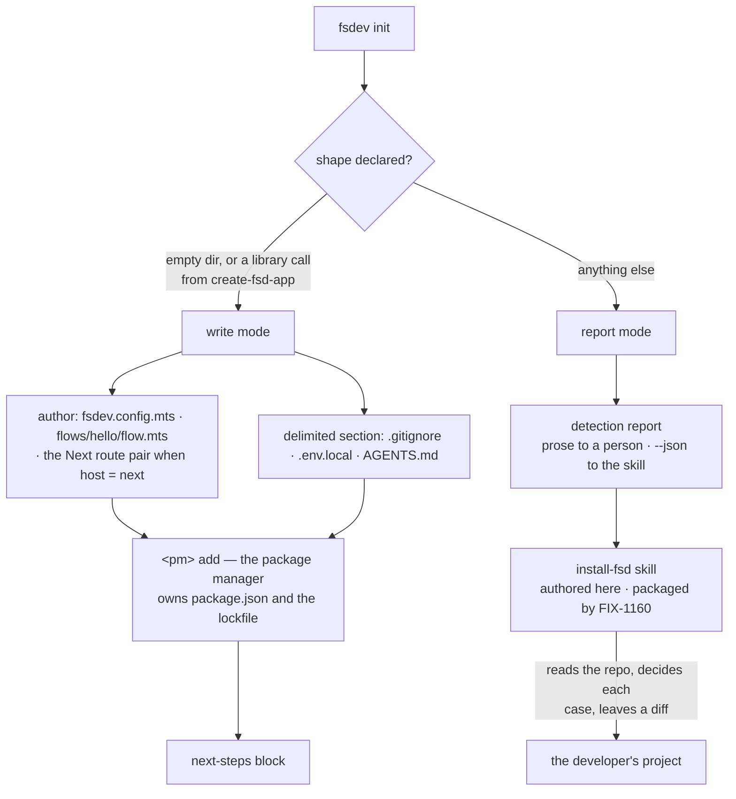

# FIX-1159: `fsdev init` — wire FSD into an existing project — Implementation Spec

## Part I — The Case *(for the human)*

### 1. Problem — why it matters, why now

Someone who wants to try FSD in a project they already have has no way in. The only documented
path is cloning our monorepo, so adding FSD to an existing Next.js app or Node service means
copying files out of our repository by hand and guessing at the wiring — config, the route that
serves flows, the keys, the scripts. Most people stop there.

**Why now** — Public Launch points strangers at a front door that does not exist. Everything
else in that project assumes a person can get FSD running in their own code in a few minutes.
There is no workaround worth naming: hand-copying our internal wiring is what we are trying to
stop asking people to do.

**Why this spec was re-shaped.** The approved version answered the whole problem with one
deterministic command. Three rounds of review then grew it a separate branch for each of: four
merge semantics across four files; CommonJS versus ESM config loading; Node 22.0–22.17 versus
22.18+; `packageManager` versus lockfile versus `npm_config_user_agent`; an already-tracked
`.env.local`; an existing `fsdev.config` that orphans the generated flow; an existing
`scripts.fsdev`; npm's option separator; `create-next-app` drift; the network-bind guard; a
two-process store race; provider SDK selection. Every one was found by a reviewer, one at a
time, and no round was the last. That is not a design converging — it is a command trying to
**enumerate** the shapes of repositories it has never seen. An agent does not enumerate; it
reads the repository in front of it. So the brownfield half becomes something an agent runs,
and the greenfield half, where there is exactly one shape, stays a command.

*Linear **FIX-1159** · Epic **FIX-1161** (`epic/building-with-fsd`, PR
[#1301](https://github.com/fixpoint-labs/flow-state-dev/pull/1301)) · spec PR
[#1310](https://github.com/fixpoint-labs/flow-state-dev/pull/1310) · Project **Public Launch**.*

### 2. Solution in plain terms

Two things, split by whether anyone can know the shape of the project in advance.

**A command, for a project whose shape is declared.** An empty directory is one shape. So is a
directory `create-fsd-app` (FIX-548) has just built from a template it controls. In both cases
the caller can state the host framework, the package manager and the module system, so there is
nothing to detect and nothing to merge into. `fsdev init` writes the files, installs through the
stated package manager, and prints what to run next.

**A skill, for a project nobody can describe in advance.** Adding FSD to a repository that
already exists is a reading problem before it is a writing problem: what is already in
`AGENTS.md`, whether `.env.local` is under version control, whether this project is CommonJS,
whether a config already claims the flow registry. A coding assistant reads all of that
directly, decides each case in context, and leaves the result as a diff the developer reviews
before accepting. That is a strictly better instrument for the job than a decision tree we
maintain forever, and it is available to the same person the epic's second clause is about.

**Detection stays deterministic and stays ours.** Which package manager, App Router or Pages,
does a config already exist, is `.env.local` tracked. Those are cheap, checkable facts, and an
agent guessing at them is exactly the failure the skill is supposed to avoid. So `fsdev init`
reports them — in prose to a person, as JSON to the skill — and that report is the single thing
both halves agree on. Getting it right is most of the remaining engineering.

What goes away is deterministic *mutation* of files we did not write.

**Philosophy** — tenet 5 (fix at the owning layer): merging into an unknown repository is a
judgment problem, and putting judgment in a `switch` statement is fixing it at the wrong layer.
Tenet 3 (earn every addition): each branch the old design grew was earned by one reviewer's
example and paid for by everyone; the skill has no branches to grow. Tenet 2 (composition over
features): init composes commands that already ship, and now composes the package manager's own
manifest handling instead of re-implementing it.

### 6. Decisions & rules — the sign-off surface

1. **Brownfield is a skill an agent runs; greenfield is a command. Only the skill writes into a
   repository we have not seen.**
   *Rejected:* the approved design — one deterministic `fsdev init` that detects a host
   repository's shape and merges into it.
   *Locks in:* the brownfield path's quality now depends on a coding assistant behaving well,
   and it cannot be fully pinned by a CI assertion the way a command can — the epic's brownfield
   proof becomes one recorded run rather than a deterministic check (§10, and the open question
   in §12). In exchange, the failure mode inverts: a command that guesses wrong damages
   someone's repository silently, while a skill's output is a diff the developer reads before
   accepting. We are also trading a path that works with no assistant for one that assumes one —
   which is the assumption the epic's objective already makes. The manual path survives as a
   documentation page, not as a code path.

2. **The mode is chosen by whether the shape was *declared*, not by what is on disk. Given a
   directory it was not told about, `fsdev init` detects, reports, and writes nothing.**
   *Rejected:* refusing outright, and doing "only the unambiguous part" — writing the files that
   cannot collide and leaving the rest.
   *Locks in:* someone who types `fsdev init` in their own repository gets a report instead of
   files, which will read as a broken command to a few people, and the report has to be good
   enough to earn the keystroke. The partial-write alternative is worse than it sounds: the
   unambiguous set keeps shrinking under review (that is §1's whole story), and it leaves a
   half-wired project the skill then has to reconcile with — two writers on the same files,
   which epic theme 1 names as the tripwire. Reporting and stopping keeps exactly one writer per
   mode. The report is not a consolation prize: it is the same JSON the skill consumes, so the
   detection surface is exercised by both audiences and cannot rot on one side.

3. **The project's own package manager owns `package.json` and the lockfile. Init runs its
   `add` command and never edits the manifest itself.**
   *Rejected:* parsing `package.json`, adding absent dependency keys, and re-serializing — which
   is what the approved spec's structured merge did.
   *Locks in:* formatting and key order are whatever the package manager does, not what we
   promise, so the spec no longer carries the contradiction between "byte-identical preservation"
   and "parse and re-serialize" — it makes neither claim, because it does not rewrite the file.
   A dependency already declared at another version is resolved by the tool that owns
   resolution. The cost is one more process invocation and an error surface we do not control;
   in return an entire merge mechanism, and the four-mechanisms problem it anchored, stops
   existing.

4. **Every file init generates that our CLI loads directly uses the `.mts` extension —
   `fsdev.config.mts`, `flows/<name>/flow.mts`.**
   *Rejected:* `fsdev.config.ts` (what our docs and every in-repo app use) with a module-system
   check beside it, and a `.mjs` fallback that gives up TypeScript.
   *Locks in:* init's output uses an extension our own documentation does not show, so the docs
   page and the CLI README owe an explanation, and aligning the wider corpus is a follow-up
   (§12). What it buys is that the file loads on every Node the CLI supports and under every
   `type` setting a project can have, with no detection step and no startup warning — measured,
   not assumed (§12). One of the enumerated branches from §1 is deleted rather than handled.

5. **The generated setup keeps a first session on disk, using the development-only file store
   that ships with FSD, marked as such in the generated config and in init's own output.**
   *Rejected:* memory-only (a restart wipes the conversation during the exact hour someone is
   forming an opinion) and SQLite (a compiled native component that fails to install on some
   machines — a first-hour failure chosen on purpose).
   *Locks in:* the generated project is deliberately **not deployable as it stands** — a
   development store and no authentication — and it says so in its own output and in the docs.
   Init creates a data directory and adds it to the project's ignore file. Cheap to revise: it
   only affects projects initialised after we change it.

6. **The printed next steps invoke the CLI directly rather than through a script added to the
   project, and init adds no such script.**
   *Rejected:* adding an `fsdev` entry to `scripts` and printing the shorter command.
   *Locks in:* init never has to decide what to do when a project already has something called
   `fsdev`, and never prints a command that would run someone else's script. Printed commands
   are longer, and under npm they carry the option separator — `npm exec -- fsdev serve --host
   127.0.0.1` — because without it npm consumes `--host` as its own configuration and the
   command fails. Securing the short public name (FIX-1162) later becomes an alias on top of
   this, not a change to what init writes.

**Non-goals** — the *content* of the agent-instructions file (FIX-1160 authors it; init places
it), the packaging and distribution of the install skill (FIX-1160 — see §12), the
`create-fsd-app` wrapper and its demo content (FIX-548), and any declared host beyond Next.js
App Router and plain Node. A shape nobody declared is reported, never guessed at.

**Size:** Medium — 6 production files · 1 authored skill · 12 test behaviours · 3 doc surfaces ·
3 PRs.

---

### 3. Tradeoffs & alternatives

**Alternative: keep the deterministic brownfield command and cap its ambition** — handle the
three commonest host shapes properly and refuse everything else. This is the conservative
version of the same lesson and it deserved a real hearing, because it keeps the path testable
in CI. It fails on where the refusals fall. Of §1's thirteen branches, only three are about the
*host framework*; the rest are about the project's module system, its version-control state, its
package manager, and files it already owns — all of which vary independently inside "a Next.js
App Router project". Capping the host list does not cap the branch count, so we would ship the
same enumeration with a narrower door.

**Alternative: no greenfield command either — the skill does both.** Tempting for symmetry, and
it would leave one artifact instead of two. Rejected because FIX-548 calls init as a library, in
process, with the answers already collected (its decision 1); a skill cannot be called from a
scaffolder's pipeline, and the empty-directory case has no ambiguity for an agent to resolve. It
would also make `npx @flow-state-dev/create-fsd-app` depend on the developer having a coding
assistant, which the greenfield path has no reason to require.

**Where the complexity is:** the **detection report**. It is the only artifact both halves
depend on, it is what stops the agent guessing, and it is the one place a wrong answer is
silent — a report that says "npm" about a pnpm project produces a confidently wrong install and
a lockfile the project never wanted. Everything else in this issue is file authoring.

**What the re-shape costs, stated plainly:** the brownfield path is no longer a thing we can
prove in CI. §10 replaces that check with a recorded run, which is weaker evidence, and §12
carries it as an open question for the epic rather than burying it.

### 4. Focus practices (1–5)

1. **The five safety properties are stated once and carried by both halves** — as assertions in
   the command, as non-negotiable rules in the skill, and as facts in the detection report.
   Each was earned by a specific review finding, and none of them is a code branch:
   - Never overwrite or rewrite content the tool did not author.
   - **Refuse** when `.env.local` is already tracked by git — naming the file and the
     `git rm --cached` the developer must run. Adding a tracked file to `.gitignore` does not
     untrack it, so ordering the ignore entry first is not sufficient on its own.
   - Never print a command the project cannot run.
   - The generated Node path must not bind `0.0.0.0` with an unauthenticated flow.
   - The generated project is not deployable as it stands, and says so in its own output.
2. **Tenet 7 (prove the goal, not the mock)** — "never print a command the project cannot run"
   has caught three separate defects and every one of them survived a plausible-looking
   transcript. It is asserted by **executing the printed strings**, never by matching them
   against a pattern. See §10.
3. **BP-035 (second-path checklist)** — the second path is *the second run*. Every delimited
   section init writes is exercised twice and must update in place rather than duplicate.
4. **BP-031-adjacent (never make a decision from untrusted input)** — the detection report is
   derived from the filesystem and from `git`, and its provenance is stated per field. The
   skill acts on the report; it does not re-derive a fact the report already carries, and it
   does not overrule one.

### 5. What using it looks like (1–5 examples)

**Into an existing project — the agent path** *(what this spec proposes; there is no such
capability today)*:

```
you   add FSD to this project

      ▸ npx @flow-state-dev/cli init --report --json
        host: next (app router, ./app)   ·  package manager: pnpm  ·  module: commonjs
        fsdev.config: absent  ·  AGENTS.md: present, no FSD section
        .env.local: present, TRACKED BY GIT

      .env.local is committed to this repository, so I am not putting your API key
      in it. Run this first, then ask me again:

          git rm --cached .env.local

you   done

      ▸ 4 files created, 3 appended to. Review the diff before you commit.
        This project is CommonJS, so the config is fsdev.config.mts.
```

**Typed directly in a project that already exists** — the same detection, no writes:

```
$ npx @flow-state-dev/cli init

  Detected  Next.js (App Router)  ·  package manager: pnpm  ·  CommonJS
            AGENTS.md exists (no FSD section)  ·  .env.local is tracked by git

  This project already exists, so init will not write into it. Two ways on:

    your coding assistant   ask it to add FSD to this project
                            (Claude Code: /plugin marketplace add flow-state-dev)
    by hand                 https://flow-state.dev/docs/getting-started/existing-project

  Nothing was written.
```

**An empty directory — the command path**, which is also what `create-fsd-app` drives:

```
$ mkdir my-api && cd my-api && npx @flow-state-dev/cli init

? Model provider ›  OpenAI
? OPENAI_API_KEY ›  sk-••••••••

  Created   fsdev.config.mts   flows/hello/flow.mts   AGENTS.md
            .gitignore   .env.local   package.json
  Installed via npm — package-lock.json written by npm, not by init

  Next steps

    npm exec fsdev dev            FSD API + DevTool  → http://localhost:4200
    npm exec -- fsdev serve --host 127.0.0.1
                                  the same API, without the DevTool

  Storage is on-disk for development. Pick a real store before you deploy.
  The demo flow has no authentication, so serve binds to localhost only.
  Deploying means configuring authentication as well as a real store.
```

Two details in that block are load-bearing rather than cosmetic. The `--` separator is required:
without it npm consumes `--host` as its own configuration and the command fails. And
`--host 127.0.0.1` is required because `fsdev serve` defaults to `0.0.0.0` and refuses to bind a
network host when a served flow uses the framework's default principal resolver — which the
generated demo flow does. A bare `fsdev serve` fails on first use. §10 asserts both by running
what was printed.

## Part II — The Build Plan *(for the implementing agent)*

### 7. Technical design

One CLI command with two modes, plus one authored skill. Nothing init writes imports anything
from this monorepo.



**Detection (the report).** One module, one shape, two renderers. Every field carries where it
came from, because the skill is instructed not to overrule it:

| field | derived from |
|---|---|
| host | a Next dependency plus the App Router / Pages directory convention; otherwise `node`; otherwise `unknown` |
| package manager | lockfile present → `packageManager` field → `npm_config_user_agent`. The middle step matters: the documented invocation is `npx`, so the user agent says npm regardless of what the project uses |
| module system | nearest `package.json` `type` — `module`, `commonjs`, or absent |
| existing config | `fsdev.config.{ts,mts,js,mjs}` in the project root, which the CLI searches cwd-only |
| credential file | `.env.local` present; **and tracked by git**, from `git ls-files --error-unmatch` |
| instructions file | `AGENTS.md` present; whether it already carries our delimiters |
| declared FSD deps | which of ours are already in `package.json`, at what versions |
| runtime | the Node version running init |

No detection logic exists in the CLI today; this is new, and it is the bulk of the work.

**Why `.mts`, measured rather than assumed.** The config is loaded by a plain native `import()`,
so its module format follows the project's `package.json`. Probed on Node 22.22 (§12): with an
explicit `"type": "commonjs"` a `.ts` config carrying `export default` fails with
`SyntaxError: Unexpected token 'export'`; with no `type` field at all it *works* but emits a
`MODULE_TYPELESS_PACKAGE_JSON` warning on every command; `.mts` loads clean in all three
settings. So the extension replaces a detection branch. Note the consequence: the CLI's
directory discovery looks only for `flow.ts` / `flow.js` / `index.ts` / `index.js`, so a
`.mts` flow is **not** discoverable — which is fine and deliberate, because the generated config
registers its flows explicitly and an explicit registry is what the CLI uses whenever a config
exists. §12 carries the follow-up.

**Authored files (write mode).** `fsdev.config.mts` (default-exports `createFlowState({ flows,
stores })` with decision 5's store profile), `flows/hello/flow.mts` unless the caller supplied a
flow, and for a declared Next.js host the mount. The mount is **two files** — the required
catch-all plus a sibling bare route forwarding an empty path array — because `list_flows` is
registered as `GET /` on the mount base, which is what the client's `listFlows()` requests, and
a required catch-all cannot match zero segments. Both in-repo mounts and the published guides do
exactly this, with a comment saying why; a single optional catch-all would make init's output a
third shape (§12).

**In-place edits (write mode).** Exactly one mechanism, for exactly three files: a delimited
section that is created when the file is absent, appended when it is present, and replaced
between our own delimiters on a second run. Nothing outside the delimiters is read or rewritten.
`package.json` is not on that list — decision 3 hands it to the package manager.

**Install.** `<pm> add` for the runtime dependencies and `<pm> add -D` for
`@flow-state-dev/devtool`, following the spawn pattern already in
`packages/cli/src/commands/ui.ts`. Both the provider SDK (e.g. `@ai-sdk/openai`) and the DevTool
must be installed: the first is only a dev dependency of our `core` package so it never reaches
a consumer, and the second is an *optional peer* of the CLI, satisfied inside our monorepo and
by nothing outside it. Without both, the commands the next-steps block prints fail immediately.

**The library seam.** FIX-548 calls init in process (its decision 1), so write mode is a
function taking target directory, host, package manager, provider and key, and an optional
supplied flow, and returning the next-steps block. The CLI command is a thin caller. That
answers the earlier reviewer note calling a reusable next-steps module premature — the issue
that needs it now exists.

**The install skill (content authored here).** A `SKILL.md` on the spine FIX-1160's packaged
skills already use — read first, decide out loud, write, verify by running:

```
run  npx @flow-state-dev/cli init --report --json          ← never guess a fact it reports
if the report names a refusal condition:
    stop, state it in the developer's terms, print the remediation
state the plan: one line per file, created or appended
write only: fsdev.config.mts · flows/hello/flow.mts · the mount (if host is next)
append only: a delimited section in .gitignore, .env.local, AGENTS.md
            ← never read or rewrite anything outside the delimiters
install through the reported package manager
run every command before printing it, then print the next-steps block
leave the working tree dirty — the developer reviews the diff; never commit
```

The skill invokes the CLI through `npx` because in a project that has not been through init
there is no `fsdev` on the path — the same discipline the skill is being asked to apply to its
own output, applied to its own first instruction.

**Untouched:** the engine, the adapters, every block kind, and `.agents/skills/` (our own
development skills). Init generates configuration and wiring; it changes no framework behaviour.

### 8. Implementation sequence

1. **Detection and the report.** The eight fields above, both renderers, and the refusal
   conditions. *Test:* a fixture tree per host shape, per lockfile, per `type` setting, a
   project with a tracked `.env.local`, and an unidentifiable directory; the JSON shape is
   asserted as the skill's contract. *Depends on:* nothing.
2. **Write mode.** The authored files, the one delimited-section mechanism, `<pm> add`, and the
   next-steps block — exposed as a library function with the CLI command as a thin caller.
   *Test:* the §5 empty-directory transcript, second-run idempotency, and the executed-command
   check from §10. *Depends on:* 1 (it shares the refusal assertions).
3. **Report mode wiring and the install skill's content.** `fsdev init` in an undeclared
   directory prints the report and exits without writing; `SKILL.md` is authored against the
   report's JSON. *Test:* nothing is written in report mode, asserted on a seeded fixture tree;
   every fact the skill acts on appears in the report. *Depends on:* 1, 2.

**PR plan.** Three sub-PRs; the first two are sequential, the third rides on both.

| sub-PR | deliverables | depends_on |
|---|---|---|
| a | detection + the report, both renderers (step 1) | — |
| b | write mode: authored files, the delimited-section mechanism, install, next-steps block, library seam (step 2) | a |
| c | report mode, the `install-fsd` skill content, docs (step 3) | a, b |

### 9. Edge cases & error handling

| Case | Expected |
|---|---|
| `fsdev init` in a directory it was not told about | Print the report, name the two ways on, write nothing. Exit 0 — this is an answer, not a failure. |
| `.env.local` is already tracked by git | Refuse before writing anything, naming the file and `git rm --cached`. Applies in write mode as an assertion and in the skill as a rule; the report carries the fact. |
| Project has an explicit `"type": "commonjs"` | Nothing special — decision 4 makes the generated config format-independent. The report still states it, because the *developer's own* later files are affected. |
| Node below 22.18 | Native type stripping is unavailable, so the generated config cannot load. Refuse before writing, naming the version and the remediation. **Do not narrow the CLI package's `engines`** — that would make every other command unsupported on Node 22.0–22.17 and contradicts the repo-wide `>=22` in `docs/contributing/RELEASING.md`. |
| Host framework cannot be identified | Report `unknown` and stop. Do not guess a mount location. |
| `AGENTS.md` exists with unrelated content | Append a delimited section; everything outside the delimiters is untouched. |
| Second run | Replace between our own delimiters. Never a second section. |
| Project already has `fsdev.config.*` | Report it and do not overwrite. A present config makes runtime resolution use its explicit registry instead of directory discovery, so a newly written demo flow would be invisible to it — say the flow is unregistered and print the one line that registers it, rather than promising `fsdev run hello send` will work. |
| A dependency is already declared at another version | The package manager decides (decision 3). Init reports what the install did. |
| Install fails (offline, registry error) | Files stay; report the failure and the exact command to retry. Do not roll back. |
| `create-next-app` changes its output shape | Only reaches this issue through the report's host detection, which asserts against directory conventions rather than that tool's flags. |
| The demo flow is unauthenticated and `fsdev serve` defaults to `0.0.0.0` | Print the loopback form and say why. Never print `--allow-unauthenticated`: teaching someone to switch off a safety rail in their first hour is the wrong lesson, and the guard is correct. |
| The Next.js next steps run the app and `fsdev dev` over one store directory | Two filesystem-store instances over the same directory can each accept the same write. Tolerable for a development default (decision 5) as long as nothing implies the two should drive the same session concurrently; the docs page owes the caveat beside "replace this before you deploy". |

**Taxonomy:** report mode writes nothing, so it cannot fail destructively. In write mode every
refusal — undeclared shape, tracked credential file, Node below the floor, unidentifiable host —
is stated before anything is written. A failed install is non-fatal and retryable.

### 10. Testing strategy

**Goal checks** (the epic's proof for this issue; real projects, real model):

- *Greenfield, second-process path* — an empty directory, `fsdev init`, then **the commands it
  printed are executed verbatim**, and one returns a streamed model response.
- *Brownfield, agent path* — a real existing Next.js app with distinctive content seeded into
  `.gitignore`, `.env.local`, `AGENTS.md` and `package.json`; an agent given the install skill
  and nothing else; afterwards every seeded string is intact, the bare `/api/flows` and a nested
  path both respond, a route that existed before still responds, and `fsdev run` returns a
  streamed model response. **This is one recorded observation, not a deterministic check** — the
  honest cost of decision 1, and the same shape as FIX-1160's proof.

Neither run pre-exports the provider key: it goes in through the prompt, which is what makes the
credential path actually exercised.

**CI specs** (behaviours, not test names) — all against fixture project trees in a temporary
directory; no `create-next-app`, no network, no install:

- one behaviour per decision in §6, in observable terms
- **the report is right** — one case per host shape, per lockfile, per `type` setting, plus an
  unidentifiable directory; and package-manager precedence specifically, where a project with no
  lockfile but a `packageManager` field resolves to that manager and not to the `npx` user agent
- **the report's JSON is a contract** — its shape is asserted directly, because the skill is the
  consumer and there is no compiler between them
- **report mode writes nothing** — run against a seeded tree and assert every file is unchanged,
  including mtimes
- **the printed commands actually run** — execute the strings the next-steps block emitted, in
  the generated project, and assert the process starts. This is where npm's option separator and
  the network-bind guard are caught; a plausible-looking transcript has hidden a broken command
  three times
- **the second run** — every delimited section updated in place, never duplicated
- **content outside the delimiters is untouched**, asserted byte-for-byte
- **the tracked-credential refusal** — on a project where `.env.local` is committed, init
  refuses, names `git rm --cached`, and leaves the file unchanged
- **the manifest is not ours** — after write mode, `package.json` still parses and still holds
  every key the project had, and the install command was invoked with the expected argv
- **the store profile is declared development-only** — the generated config does not trip the
  framework's production-unsuitability warning, and the output says the store is a development
  default
- **the skill's rules are checkable** — its first instruction runs the report; its instruction
  set names no file outside the six it is permitted to touch

**Where the line falls.** The two goal checks are real-machine runs under `goals/fsdev-init/`,
one directory per shape, never part of the vitest suite. Everything above runs in CI with no
network. Keeping that line sharp is what stops the goal checks drifting into CI, where their
cost and flakiness would be paid on every run.

**Discipline:** `tdd`. The seam is the report and the write-mode library function against a
temporary project directory.

### 11. Documentation plan

- **CREATE** `apps/docs/docs/getting-started/existing-project.md` — "Add FSD to an existing
  project". Sidebar: in Getting Started, after `getting-started/quick-start` and before
  `getting-started/setting-up-models`. Covers: asking your coding assistant, what it will write
  and what it will append, what to look for when you read the diff, the by-hand path for someone
  without an assistant, and **one short section on replacing the development store before
  deploying** — the generated project is deliberately not deployable as it stands (decision 5),
  and that has to be said where a reader meets it, not only in output that scrolls away.
  Cross-links ← from the quickstart and the root README, → to the DevTool page and the
  persistence overview.
  *Voice risks:* "seamless" and "just works" are the obvious adjectives for a setup command — do
  not. Introduce "flow" and "DevTool" in plain terms on first use.
- **EXTEND** `packages/cli/README.md` — an `init` entry alongside `run` / `dev` / `serve`, terse,
  naming both modes and why the generated config is `.mts`.
- **EXTEND** the root `README.md` — the onboarding path currently starts at cloning the monorepo
  (BP-008). It should lead with the two entry points for someone who has their own project.
- **No blog post.** This ships as part of Public Launch; announcement copy is that project's.

### 12. Dependencies, open questions & follow-ups

**Dependencies.**

- **FIX-1160 packages and distributes the install skill.** This issue authors its *content* — the
  same split the two issues already use for the agent-instructions file, where FIX-1160 authors
  the content and this issue places it. FIX-1160 already builds the marketplace manifest, the
  plugin, and `skills/<name>/SKILL.md`; the install skill is a fifth entry in that directory. **No
  packaging mechanism is built here.** Two consequences for FIX-1160, raised there rather than
  decided here: its decision 3 says four skills ship, and this makes five; and its decision 1 —
  every packaged skill reads `AGENTS.md` first and stops if it is missing — cannot bind this one,
  which runs *before* `AGENTS.md` exists and is the thing that creates it. Its step-4 test as
  written would fail on the install skill.
- **FIX-548** calls write mode as a library. Its §7 hand-off table is satisfied by §7's library
  seam. One correction it owes: the demo content it supplies is `flows/chat/flow.ts`, and the
  generated config imports it, so under decision 4 that file must be `.mts` as well — or the
  wrapper must guarantee the target project is ESM. Raised on its PR.
- **FIX-1162** (npm short name) is not a blocker: decision 6 makes init work under the scoped
  package name we already own.

**Open questions.**

- **Is a recorded agent run acceptable as the epic's brownfield proof?** Epic §1 lists a
  brownfield init run as one of this issue's two deterministic proofs, written when brownfield
  was a command. Decision 1 makes it an observation instead. That is a consequence of the
  direction, not a choice this spec is making, but it changes what the epic can claim, so it
  belongs to the epic's owner rather than to this document. Nothing is blocked on it.

**Verified premises** (measured, so a reviewer need not re-derive them):

- **Module-type loading, probed on Node 22.22** (the run that produced decision 4): a
  `fsdev.config.ts` with `export default` fails under an explicit `"type": "commonjs"`
  (`SyntaxError: Unexpected token 'export'`); under a `package.json` with no `type` field it
  loads but emits `MODULE_TYPELESS_PACKAGE_JSON` and reparses; `fsdev.config.mts` loads cleanly
  in every setting. The earlier claim that "CommonJS projects cannot load an ESM
  `fsdev.config.ts`" is true only of the explicit form, and `.mts` makes the distinction moot.
- `fsdev.config.mts` is already second in the CLI loader's filename precedence, so decision 4
  needs no loader change.
- The CLI's flow discovery matches only `flow.ts` / `flow.js` / `index.ts` / `index.js`, so a
  `.mts` flow is registered explicitly in the config rather than discovered — which is what the
  CLI does anyway whenever a config is present.
- `serve()` in `@flow-state-dev/node` defaults its host to all interfaces and applies no
  authentication guard itself; the guard is `assertNetworkBindIsAuthenticated` in the CLI's
  `serve` command. This is why the printed command carries `--host 127.0.0.1`.
- `.env` loading happens in the CLI's runtime-resolution path, not in `serve()`.
- `list_flows` is registered as `GET /` on the mount base, so the bare `/api/flows` is a real
  endpoint the client requests; both in-repo mounts pair the catch-all with a sibling bare route
  deliberately, with a comment saying why.
- `@ai-sdk/openai` is a *dev* dependency of our `core` package, so it never reaches a consumer;
  `@flow-state-dev/devtool` is an *optional peer* of the CLI, satisfied only inside this
  monorepo. Both must be installed.
- The engine's filesystem store warns once per process that it is unsuitable for production
  unless constructed with the flag acknowledging local-only use — which is why decision 5 ships
  it qualified.
- The repo-wide Node floor is `>=22` (`docs/contributing/RELEASING.md`), which is why §9 gates
  the generated path rather than narrowing the CLI package's `engines`.

**Cross-issue notes (raised on the epic PR, not decided here).**

- **Epic theme 6** fixes init's boundary as four in-place files with an append-only guarantee.
  Decision 3 removes `package.json` from that set — the package manager edits it — so the
  guarantee now covers three files plus a delegated manifest and a delegated lockfile. The
  property theme 6 exists to protect is unchanged and arguably stronger; the file count is not.
- **Epic theme 8** ("init says which shape you got") now holds in two places: write mode prints
  it, and report mode is nothing but that statement.
- Theme 5's single next-steps block is unchanged and is now shared by construction, since
  FIX-548 calls the same library function.

**Follow-ups (flagged, not built).**

- **Align the corpus on `.mts`, or teach the loader to handle `.ts` safely.** Init's output uses
  an extension the docs, both examples and every in-repo app do not. Doing it properly means
  moving the docs, the Vercel guide and the examples together so there is one shape rather than
  two. Worth its own issue — init should follow the corpus, not lead it.
- **Teach flow discovery `.mts` / `.mjs`.** Independent of the above and small.
- **Collapse the two-file Next.js mount into one** optional catch-all, moving the docs, the
  Vercel guide and both examples together.
- **`@flow-state-dev/next` has no bare-path handler.** `@flow-state-dev/vercel` exports
  `createVercelBareHandler`; the platform-agnostic Next package exports only `createNextHandler`,
  so the sibling file init writes for a non-Vercel Next app is a small hand-written forwarder.

### 13. Review notes for the implementer

Below-the-bar spec-PR feedback, recorded verbatim, not folded into the design. These are inputs,
not instructions — adopt, adapt, or discard. Several were answered by the re-shape rather than by
an argument; where that happened it is noted.

- "No `lib/flowstate.ts` re-export — docs and apps import `@/lib/flowstate` in routes while `fsdev.config.ts` stays at project root (cwd-only config search). Worth naming in authored files even if paths are implementer-owned." — cursor ([thread](https://github.com/fixpoint-labs/flow-state-dev/pull/1310#discussion_r3789372057))
- "Template should use `createVercelNextHandler` / `createNextHandler` from the adapter packages, not hello-chat's manual `router.GET` delegation." — cursor ([thread](https://github.com/fixpoint-labs/flow-state-dev/pull/1310#discussion_r3789372052)) *(the adapter half is folded into §7; the Vercel variant is the implementer's call)*
- "Consider v1-simple idempotency: for text files, append-if-missing / skip-if-present on second run instead of replace-between-delimiters." — cursor ([thread](https://github.com/fixpoint-labs/flow-state-dev/pull/1310#discussion_r3789372060)) *(§7 keeps replace-between-delimiters, now the only mechanism in the design rather than one of four)*
- "Premature abstraction? Authoring a reusable next-steps module for FIX-548 before that issue exists adds API surface and test obligations." — cursor ([thread](https://github.com/fixpoint-labs/flow-state-dev/pull/1310#discussion_r3789372062)) *(answered: FIX-548 now exists and its decision 1 needs the library seam)*
- "Skip re-install on second run when the dependency block is unchanged — install dominates init latency." — cursor ([thread](https://github.com/fixpoint-labs/flow-state-dev/pull/1310#discussion_r3789372063)) *(now the package manager's call, not ours)*
- "Package manager detection + install: don't import vitest internals; if hand-rolled lockfile detection is insufficient, add `@antfu/install-pkg` or `package-manager-detector` explicitly to `@flow-state-dev/cli`. Follow `packages/cli/src/commands/ui.ts` spawn pattern for a single install invocation." — cursor ([review](https://github.com/fixpoint-labs/flow-state-dev/pull/1310#pullrequestreview-4943848380))
- "Config/env: compose `load-env.ts`, `load-config.ts`, `resolve-runtime.ts` — init should write keys the same loader will read." — cursor (same review). Worth checking directly rather than assuming: the `.env.local` key name init writes has to be the one the resolution path reads back, which is what the goal check's un-pre-supplied key exercises.
- "Scaffold errors: `EXIT_SCAFFOLD_ERROR` exists but is unused; wire it for `fsdev.config.*` conflicts." — cursor (same review)
- "Skip: plop/degit/jsonc-parser — not justified for 3 authored files + 4 edits." — cursor (same review)

---

## Spec evolution

- **Spec drafted** — framed as the missing front door for Public Launch; chose to compose the
  existing CLI commands rather than generate a server entrypoint, which removed the
  unauthenticated-bind and unloaded-credential hazards outright; settled the store profile on
  file storage and dropped the package script.
- **After spec review (round 1)** — split the in-place edit layer into a delimited text mechanism
  and a structured manifest merge, because JSON carries no comment syntax; qualified the store as
  a *development* default the docs tell you to replace; and switched the Next.js mount to the
  two-file shape the docs and both examples already teach.
- **After spec review (round 2)** — corrected the printed plain-Node next step to
  `fsdev serve --host 127.0.0.1`; made the credential guarantee *"will git publish this file"*
  rather than *"is it ignored"*, refusing on an already-tracked `.env.local`; and stopped
  promising `fsdev run hello send` when a project already has a config that would not register
  the generated flow.
- **Direction changed by the product owner; the previous approval retracted.** Brownfield is a
  skill an agent runs, greenfield stays a deterministic command, and deterministic mutation of
  files we did not write is gone. The reason is the shape of the three review rounds above rather
  than any single finding in them: the design had grown thirteen separate branches, each one
  earned by a reviewer's example, and there was no round at which they stopped. Detection stays
  deterministic and becomes the report both halves share. §1 states the reasoning, §6 decisions 1
  and 2 carry it, and §10 records what it costs — the brownfield proof is now a recorded run
  rather than a deterministic check, which §12 puts to the epic's owner.
- **After the re-shape, three of the enumerated branches were deleted rather than moved.**
  `package.json` merging became the package manager's job, which also dissolved the unsatisfiable
  pair "byte-identical preservation" and "parse and re-serialize" — the spec now makes neither
  claim, because it does not rewrite the file. The CommonJS/ESM branch became the `.mts`
  extension, after a probe on Node 22.22 showed the earlier claim was true only of an explicit
  `"type": "commonjs"` and that `.mts` loads cleanly in every setting. And the Node 22.0–22.17
  branch became a runtime gate on the generated path, leaving the CLI package's `engines` at the
  repo-wide `>=22` that `RELEASING.md` requires. What survived unchanged are the five safety
  properties in §4: each was earned by a specific review finding, and each is now an instruction
  the skill follows and a fact the report carries, rather than a code branch.
