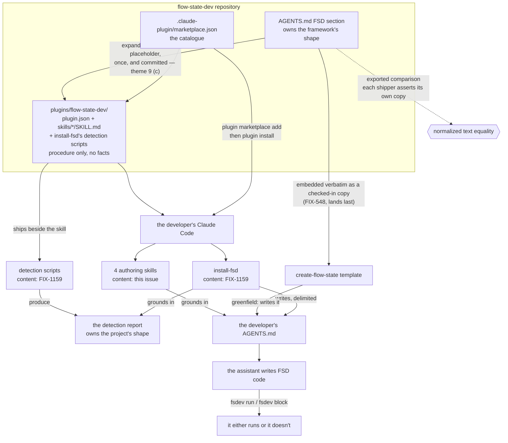

# FIX-1160: Consumer pack — agent-instructions file + the Claude Code plugin that ships the authoring and install skills — Implementation Spec

## Part I — The Case *(for the human)*

### 1. Problem — why it matters, why now

A developer who installs FSD and then asks their coding assistant for a feature gets code
that looks right and does not run. The assistant has never seen FSD, so it invents a fifth
kind of building block, wires a flow in a way the framework does not accept, and never
discovers that a one-line terminal command would have told it so in two seconds. The
developer's first hour is spent correcting an assistant instead of building.

**Why now.** Public Launch points strangers at a front door, and the objective's second
half is that the assistant beside them writes FSD code that runs. Nothing in the product
serves that today. We do have five authoring skills that encode this knowledge, but every
one of them reads our source tree and runs our monorepo commands, so none can leave this
repository.

**And the job grew while this spec was in review.** Adding FSD to a repository that already
exists is no longer a command — it is an agent skill (FIX-1159), and a Claude skill reaches
a stranger's machine exactly one way: inside an installed plugin. This issue owns that
plugin. So this is no longer help for someone already running FSD. It is how a developer
with an existing project gets FSD at all. Packaging that was a convenience is now the epic's
delivery channel, and a manifest nobody can install costs the objective half its outcome
rather than costing an assistant some polish.

**The workaround is "read the docs to your assistant"**, and it fails the way you would
expect: it works for the person who already knows which page to paste. For the brownfield
half there is no workaround at all — copying our wiring out of this repository by hand is
the thing the epic exists to stop asking people to do.

*Linear issue **FIX-1160** · Epic **FIX-1161** ([epic PR
#1301](https://github.com/fixpoint-labs/flow-state-dev/pull/1301)) · Project **Public
Launch**.*

### 2. Solution in plain terms

Ship two things, and keep them from ever disagreeing.

**One instructions file** — the FSD section of `AGENTS.md`, written into the developer's
project by whichever path they came in through: the greenfield command in a new project, the
install skill in one they already had. Every mainstream coding assistant already reads that
filename with no configuration. It states what FSD actually is: the four kinds of building
block, how
flows and actions are declared, what a capability is, where flows live, and — the part that
changes the most outcomes — that `fsdev run` and `fsdev block` exist, so the assistant can
check its own output instead of handing the developer a guess.

**One Claude Code plugin**, for the assistant most of our early users are on, carrying the
step-by-step procedures the instructions file has no room for. Five skills, of two kinds:
four that help someone author FSD code in a project already running it, and the **install
skill**, which adds FSD to a project that is not. A developer adds our catalogue once and
installs from it — Claude Code has no command that takes a bare plugin URL, so a catalogue
file is the required artifact, and it is not the same thing as a public listing (§6
decision 2).

**And this issue puts the instructions content into the install skill itself.** The skill has
to write that section into a stranger's project, but it cannot import anything, and it lands
before this issue does — so it carries a named blank and we fill it with the canonical text
when we assemble the plugin. One text, written once, checked by comparison wherever it is
copied (§7).

**Nothing packaged holds a fact of its own — that is what stops the two from drifting.**
Each skill names one live source, reads it at the moment it runs, and states nothing from
memory. The four authoring skills read `AGENTS.md`. The install skill runs the detection
scripts that ship beside it in this plugin, because it is the thing that *creates*
`AGENTS.md`. A skill that needs to know what a generator is tells the assistant to read
`AGENTS.md`, and stops there.

**Philosophy** — tenet 3 (earn every addition): this adds no framework API at all; it is
content and packaging, and the public type surface grows by zero. Tenet 1 (coherence): two
descriptions of the same framework that can disagree is the failure mode this design is
shaped around, so every fact has exactly one owner. Tenet 5 (fix at the owning layer): the
owner of a fact is whoever produces it — `AGENTS.md` owns the framework's shape, the
detection report owns the project's shape — and a skill that restates either is fixing
knowledge at the wrong layer. Tenet 7 (prove the goal): the pack's whole value is that the
assistant verifies its own work on the real path, which is why every packaged procedure ends
in a CLI run rather than a claim.

**What it deliberately does not do:** it does not add an authoring MCP server, and it does
not add editor-specific rules files for Cursor, Windsurf or anything else. Both were ruled
out at epic level. The Claude plugin is the single exception, and it earns it by carrying
*procedures* — a rules file cannot hold a workflow. It does not author the install skill's
content either: FIX-1159 owns that, and this issue owns the directory it lands in.

### 6. Decisions & rules — the sign-off surface

1. **Every packaged skill names one live grounding source, reads it at the moment it runs,
   and states no framework fact of its own. Which source depends on what the skill does: the
   four authoring skills read `AGENTS.md`; the install skill runs the detection scripts that
   ship beside it in this plugin, because it is the thing that creates `AGENTS.md`. A skill
   stops when its source is missing or refuses.**
   *Rejected:* the earlier form of this rule — *every* packaged skill reads `AGENTS.md`
   first and stops if it is missing — and, separately, self-contained skills that restate the
   block kinds so they work in any project.
   *Why restated rather than given a carve-out:* the rule is worth having only because it is
   mechanical, and an unexplained exception for the one skill that breaks it destroys exactly
   that. The old wording named a **file** when what it meant was a **property**: do not carry
   framework knowledge inside a skill. Those two came apart the moment the install skill
   existed. It cannot read `AGENTS.md` — it runs before there is one — and it also carries no
   framework knowledge, because every fact it acts on comes from a report it executes. The
   old rule would have failed it for the wrong reason. Naming the property covers both kinds,
   keeps the stop-if-absent behaviour (a refusal in the report stops the install skill the
   way a missing `AGENTS.md` stops an authoring skill), and is the same rule the epic already
   states from the other side — theme 1: *an instruction that restates the reference shape
   instead of pointing at it is the signal.*
   *A correction this decision now carries, and it was on this sign-off surface:* an earlier
   revision named the install skill's source as **`fsdev init --report --json`**. That command
   does not exist and will not — FIX-1159 decision 1 ships no `fsdev init` "not the command,
   and not a library entry point behind it", and its decision 2 rejects `fsdev init --report`
   by name. Detection ships as **scripts**, authored by FIX-1159 and run by the assistant
   directly from the installed plugin. The pairing was inherited whole when this decision was
   last re-drafted and nobody re-examined the command inside it; §12 carries what else moved
   with it.
   *Locks in:* every packaged skill is useless outside a project our own tooling has touched
   — the authoring four need an `AGENTS.md` FSD section, and **the install skill is inert
   unless the detection scripts ship inside this plugin beside it.** That is a deliverable of
   this issue rather than an ambient capability: the plugin tree this issue assembles carries
   both halves or the brownfield path does not work (§7, §12). We accept the coupling, because
   the alternative is descriptions of FSD published on independent release cadences, and the
   day they disagree the assistant's output is confidently wrong and the developer cannot tell
   which half lied.
   *And it makes the rule enforceable in a way the old wording could not be.* Two changes.
   The mechanical check runs per fact class rather than over whole skill bodies, because the
   install skill's subject matter *is* the file layout. And because the grounding source is now
   **a file in the artifact this issue publishes**, the first-instruction check can assert that
   the named source is *present in the shipped tree* — not merely that the skill's text names
   something. Against a command fetched from npm at runtime there was nothing in the tree to
   check, which is why that check could not have failed. §10 carries both forms; §8 step 4
   matches.

2. **The plugin is distributed from a marketplace manifest in the `flow-state-dev`
   repository itself, added with two commands we publish, and listed in no public plugin
   directory — and those two commands appear on the getting-started page and in the root
   README, not only in this issue's own guide.**
   *Whose call each half is, because an earlier revision of this spec got it wrong:* **no
   public listing is epic Q2, decided by the product owner, and it binds.** **The docs
   placement is not.** It is the epic's own recommendation inside **Q4 — which is open and is
   the owner's to answer** (§12). This spec **builds to the epic's recommendation pending the
   owner's answer**; the call to build to it now is the coordinator's and is reversible. It is
   safe to make because it is right under either answer: if Q4 comes back as a public listing,
   the two commands are unchanged and these docs surfaces become one channel among two instead
   of the only one.
   *Rejected:* a separate repository for the plugin (a second thing to keep in step with
   every framework release), and a public directory listing at launch (epic Q2 — decided by
   the product owner, on the asymmetry that delisting later reads as abandonment; Q4 re-prices
   that decision now that the plugin carries the only brownfield path, and is open).
   *A wording correction this decision now carries:* "install by URL" is the epic's label,
   not a command. Claude Code has no bare-URL plugin install — verified by running it, not by
   reading help text (§12). `plugin install` resolves a *name* against configured
   marketplaces; `plugin marketplace add` is the command that takes "a URL, path, or GitHub
   repo". So the manifest is a **required distribution artifact**, and declining a listing is
   still a separate and intact choice. The spec says "added as a marketplace from a source we
   publish" wherever it used to say "installs from a URL".
   *Locks in:* the marketplace name and the plugin name become public strings printed in our
   docs and in the root README — and in FIX-1159's `existing-project.md`, which tells a
   brownfield developer how to install the plugin that carries the skill. (They are *not*
   printed by anything the CLI emits; nothing in FIX-1159 renders an install line, and there
   is no `fsdev init` to render one.) Renaming either later
   breaks every install line already published, and a developer can register only one
   marketplace per name, so the name is effectively ours forever from the first install. The
   docs placement is carried as a deliverable rather than a preference — **a coordinator
   decision, reversible, on the epic's reasoning in Q4**: with brownfield shipping through this
   channel, a stranger who does not find the install source has no brownfield path at all, and
   burying it one click deep is the failure Q4 describes. It is two short doc blocks; building
   them is cheaper than holding the spec for an answer that does not change them.

3. **Five skills ship, of two kinds. Four authoring skills — creating a block, adding a
   flow, composing a pattern, writing tests. Plus the install skill, whose content FIX-1159
   authors and this issue packages. Writing a storage adapter still does not ship.**
   *Rejected:* four (what this decision said before the re-shape — the install skill is a
   packaged skill now, and calling the pack "four skills" would leave the brownfield channel
   undescribed), and rewriting all five of our own development skills as the issue originally
   scoped.
   *Locks in:* a developer whose database we do not already support gets no guided path and
   falls back to our docs. That is the rarest of those tasks and the one most dependent on
   reading our source, so it would cost the most to maintain and be invoked the least.
   Reversible in a commit — the POC established that a skill is a directory and adding one
   edits no manifest (§12), so a sixth skill changes nothing about packaging. **Say the word
   at sign-off and it goes back in.** The one real per-skill cost is measured rather than
   guessed: `claude plugin details` projects roughly **100 always-on tokens per skill** in
   every session of every developer who installs the pack — the frontmatter, which is what
   makes a skill discoverable and so is loaded whether or not it fires. Five skills is about
   500 tokens of everyone's context, forever. That is the reason to keep the pack small, and
   it is a better reason than taste.

**Non-goals** — the *content* of the install skill, of the detection scripts it runs, and of
the wiring contract it writes against (FIX-1159 authors all three; this issue packages and
ships them inside the plugin); the *placement* of `AGENTS.md`
into a project (also FIX-1159); the demo flow a scaffolded project starts with (FIX-548); an
authoring MCP server; editor-specific rules files; any public plugin-directory listing.

**Size:** Medium — 10 production files · 17 test behaviours · 5 doc surfaces · 1 PR.
*(Theme 9 added the exported comparison and the one-time placeholder expansion; the same fold
then removed the published CLI asset and the two surfaces nothing consumed, so the count came
back down. §7 carries the reasoning for both directions. The seventeenth is the
grounding-source resolution assertion, added when decision 1's source was corrected — §10.)*
*(Four of those files are the authoring skills. Neither `skills/install-fsd/SKILL.md` nor the
detection scripts beside it are counted — FIX-1159 authors both, and this issue provides the
plugin tree they land in and ships them from it.)*

---

### 3. Tradeoffs & alternatives

**Alternative: no plugin, just a longer `AGENTS.md`.** Genuinely tempting — one artifact,
zero packaging, no drift question at all, and it reaches every assistant rather than one.
It was argued at epic level as a case for cutting the plugin, and the scope call went the
other way. It is insufficient because an instructions file is *reference* and is read
passively: it can say "generators exist" but it cannot walk an assistant through picking a
kind, wiring an action, running the CLI, and reacting to the failure. Padding it until it
could would make it too long to be loaded reliably, which degrades the half that reaches
everyone. **After the re-shape this alternative is dead rather than merely weak** — an
`AGENTS.md` cannot exist in a project until something writes it, and the thing that writes
it is the install skill, which ships in the plugin. You cannot bootstrap the file half from
the file half.

**The simpler approach we are taking anyway:** the plugin is markdown. No code, no MCP
server, no runtime. If it turns out nobody installs it, we delete four files and the
instructions file is untouched.

**Where the complexity is:** not authoring the content — it is keeping one source of truth
across two artifacts on two distribution channels. The instructions file ships inside the
CLI package on npm and lands in the developer's repo when the install skill or the greenfield
command writes it, so a project can be running six-month-old content. The plugin ships from
git and updates whenever the developer runs `plugin marketplace update`. Those two clocks are
independent and always will be. Decision 1 is the whole answer: no packaged skill holds
anything that *can* go stale about the framework, because none of them holds a framework fact.

**The one place that answer needs care** is the instructions content itself, which two
different artifacts ship. Neither of them imports it and neither runs anything to fetch it:
each carries a **verbatim copy in its own source**, and this issue's exported comparison is
what stops the copies from disagreeing (§7). That is theme 9's treatment of a source block, and
it is the reason the drift question has a mechanical answer rather than a procedural one.

**The honest cost of the plugin, which the re-shape made much larger.** It is one vendor's
format. Before the split that bought a better authoring experience for Claude Code users and
cost everyone else nothing they had. Now the brownfield entry path ships inside it, so a
developer on Cursor or Copilot has no install skill — they get `AGENTS.md` (once something
writes it) and the by-hand documentation page FIX-1159 keeps for exactly this reason. That is
a real gap in the epic's headline capability for everyone not on one product, and it is worth
naming plainly rather than filing under packaging.

Two things keep it from being a reason to change course here. The manual path is a
documentation page, not a dead end — it is the same wiring, written out. And the fix, if the
gap turns out to matter, is a second *procedural* package, not a second copy of the facts: the
grounding sources stay exactly where decision 1 puts them, and a Cursor-format port of the
install skill would read the same detection report. So this decision is expensive to have
gotten wrong but cheap to extend, and nothing in the packaging forecloses it. What would
change the answer is evidence about which assistant our brownfield users actually run, which
we do not have and will not before launch.

**This is a live fork, and it is the epic's, not this spec's.** An earlier revision closed it
here by citing epic Q2/Q4 — but Q4 is unanswered, so there was nothing to close it against. It
sits downstream of Q4 (how narrow a channel the brownfield path may have during launch) and
moves with it. §12 carries it as an open fork the epic owns, with the second-package fix
recorded as the follow-up it becomes if the answer goes the other way.

### 4. Focus practices (1–5)

1. **Every fact class has exactly one owner (tenet 5).** Two classes matter here and they
   have different owners. *The framework's shape* — block kinds, how flows and actions are
   declared, what a capability is — enters through the `AGENTS.md` content module, and any
   skill that states one is a second writer and a defect. *The project's shape* — host
   framework, package manager, module system, what is already on disk — is owned by
   FIX-1159's detection report, and a skill that asserts one instead of running the report
   is the same defect wearing different clothes. Naming the classes is what lets the rule
   bind five skills that do not all read the same file.
2. **BP-003 (verification evidence).** A plugin manifest that passes a validator is not a
   plugin that installs — the POC caught exactly that. The evidence path is an actual
   install-and-invoke run, not a lint. The same discipline applied to a claim handed to this
   spec: "Claude Code has no bare-URL plugin install" was re-checked by running the install
   with a URL and with an `owner/repo` shorthand, not by reading the help text that says so.
3. **BP-035 (second-path checklist).** The path that matters here is *published*, not
   *local* — and after §7 removed the published npm asset, the published path that remains is
   the **committed plugin tree a `github` install clones**. It works trivially in this
   monorepo and can still be wrong for every real consumer; see §9.
4. **The outsider rule** (`docs/contributing/user-docs.md`). This content is read by
   strangers and by machines. No monorepo paths, no `pnpm --filter`, no reference to our
   packages' source layout, no issue numbers.
5. **The acceptance step must exercise the artifact the step produced.** The sharpening of
   BP-003 this spec most needs, because every acceptance rule here is a rule about what a
   *skill* does at the end of its run, and the cheap version of each one passes while the
   thing it exists to establish is broken. A flow run does not exercise a test file. A
   process exit code does not exercise a schema. A declaration lookup does not exercise
   packages that are not installed. **For every acceptance rule below, name what the step
   produced and confirm the check touches that** — §10 does this per rule, and §7's spine
   carries the two places it changed the design rather than just the test.
   **And its third half, which is a scope rule rather than a consistency one:** a check is
   written for the artifact that motivated it and then **inherits that artifact's boundary on
   the way out**. Ask of every check *what set does this run over, and who owns that set* — a
   premise sweep cannot see this, because each rule is internally consistent. The boundary
   inherited is not always a file set: when a rule names **a command's output fields** and the
   path is later routed to a different command, the rule keeps describing a command the skill no
   longer runs. That variant is the hardest to catch, because "which command emits this field"
   is not a boundary anyone thinks to sweep for. Both are why the payload exemption is now a
   **rule** rather than a list — a list cannot notice a new member.
   **And its fourth half, which is a different sweep again: does any check *forbid* what another
   rule *requires*?** Enumerate what each check bans, then read that list against what the
   mandated procedures must contain. Neither a premise sweep nor a scope sweep performs this —
   both examine rules one at a time, and an unsatisfiable pair is a property of the *set*. Every
   instance found here was two rules that were individually correct. The durable answer is not a
   better sweep but a **fixture that satisfies the whole set at once** (§10): satisfiability is
   the kind of thing you prove by construction, not by reading.
   **And its second half, learned the harder way: check each rule against the rest of this
   document, not only against reality.** The three defects found after this practice was
   written were not gaps — they were **contradictions between two things this spec already
   said**, each half defensible alone: an import edge against the landing order; a placeholder
   that must be present and must not survive; a fact scan that forbade what the canonical block
   is made of. A single pass down the document cannot see those, because each half reads
   correctly where it sits. The check is to take each premise a rule rests on and sweep the
   whole document for what else asserts it.

### 5. What using it looks like (1–5 examples)

**Installing the pack** *(the two commands the docs print — one adds our catalogue, one
installs the plugin from it; there is no single-command form, see §6 decision 2):*

```
/plugin marketplace add fixpoint-labs/flow-state-dev
/plugin install flow-state-dev@flow-state-dev
```

**The brownfield entry, which is what those two commands now unlock.** The developer has a
repository already and no FSD in it:

```
you   add FSD to this project

      ▸ install-fsd runs the detection scripts that shipped with it
        next (app router) · pnpm · commonjs · no fsdev.config · AGENTS.md present

      4 files created, 3 appended to. Review the diff before you commit.
```

The skill's steps and its refusals belong to FIX-1159. What this issue owns is that the
skill is *there* — that a developer who has never seen our repository can put it on their
machine with the two commands above.

**What the developer types once FSD is running, and what changes.** The ask is the same
either way; the difference is entirely in what comes back.

```
"add an endpoint that summarises a support ticket"

before   the assistant writes a plausible file, names a block kind that does not
         exist, and reports success. The developer finds out at runtime.

after    the assistant reads AGENTS.md, picks a generator, writes it beside the
         flow, wires it into an action, then runs:
             npx fsdev run support summarise --input '{"userId":"u1", ...}'
         and pastes the result — or fixes what failed before saying anything.
```

**The instructions file's shape** *(headings only — this is what gets appended, delimited, to
whatever `AGENTS.md` is already there, by the command in a new project and by the install
skill in an existing one):*

```
<!-- flow-state-dev:start -->
## Building with FSD
   What a flow is · the four block kinds · actions · capabilities
   Where flows live in this project
   Verifying your own work:  fsdev run · fsdev block · fsdev dev
   Two things that are always wrong
<!-- flow-state-dev:end -->
```

## Part II — The Build Plan *(for the implementing agent)*

### 7. Technical design

Two artifacts and one catalogue. The instructions content is authored once and reaches two
consumers that never talk to each other — a program that imports it and an agent that runs
for it.



- **This repository** — gains the canonical agent-instructions text as a file this issue owns,
  plus the exported comparison that checks copies of it. **Not a published package asset:** no
  issue imports it and no skill runs anything to fetch it (see the seam below).
- **Repository root** — gains `.claude-plugin/marketplace.json`, and a plugin directory
  holding `plugin.json` plus `skills/<name>/SKILL.md`. Four of those directories are this
  issue's; `skills/install-fsd/` is FIX-1159's content landing in this issue's structure.
  Distinct from `.agents/skills/`, which stays exactly as it is: those are *our* development
  skills, and the packaged ones are rewrites, not copies or symlinks.
  **`skills/install-fsd/` is not only a `SKILL.md`.** FIX-1159's detection ships as scripts the
  assistant runs directly, and this issue is where they are packaged and distributed — so they
  land inside the plugin tree beside the skill that runs them, and the published artifact
  carries both halves. This was missed while decision 1 named a CLI command as the install
  skill's source: a source fetched from npm at runtime needs no room in the tree, so nothing
  here made any. Their layout inside the directory is FIX-1159's to pick; what this issue owns
  is that they ship, that the skill's declared source resolves to one of them, and that the
  inventory check sees them (§10).
- **Untouched:** every framework package's public API. FSD's own runtime `skills` concept is
  unrelated and must not be touched (epic §5 Q3 — write *Claude skills* / *the Claude
  plugin* wherever the two could be confused).

**The content seam, restated — theme 9 dissolved it rather than solving it, and an earlier
draft of this section did not notice.** That draft said *"FIX-1159's greenfield command imports
the instructions content as a string"*, and required the content to carry both an **importable**
and a **printable** surface. Three things are wrong with it now:

- **FIX-1159 has no greenfield command.** The split left it brownfield-only with no command of
  its own; the set's one greenfield command is FIX-548's `create-flow-state`.
- **No issue imports this content.** Theme 9 makes it a **source block**: every shipper embeds a
  verbatim copy in its own source and the author's comparison catches drift. It explicitly
  rejects a build-time copy between packages, so FIX-548's template checks its copy in rather
  than importing one.
- **No skill runs anything to obtain it.** Theme 9 (c) puts the text *into* the install skill at
  packaging, so it carries the block rather than fetching it. A command to print it would also
  revive what FIX-1159 rejected for the next-steps block: making the content depend on our CLI
  resolving in a project that may have just failed to install it.

**So both surfaces are removed, and with them the last edge that pointed backwards.** The
canonical text is **a file in this repository that this issue owns** — not a published asset of
`@flow-state-dev/cli`. Its consumers are the packaging substitution, the exported comparison,
and FIX-548's checked-in copy; all three are in this monorepo at test or assembly time.
*This is a coordinator decision and it removes scope rather than adding it: one fewer published
asset, no tarball-resolution behaviour to prove, and no second rendering of the content that
could disagree with the first. Reversible — if a consumer outside this repository ever needs the
string, it becomes a published export then, on evidence rather than in advance.*

**The ordering invariant, stated once so the next edge can be checked against it rather than
found by a reviewer.** This is the second dependency cycle this epic has produced, and both had
the same shape: an edge added for a good local reason, pointing against an existing one.

> **Every dependency in this set runs `FIX-1159 → FIX-1160 → FIX-548`.** An artifact authored by
> a later issue is **never imported** by an earlier one. It reaches an earlier issue exactly two
> ways: as a **checked-in copy** verified against the author's exported comparison, or by a
> **substitution the author itself performs** when it lands. Any new edge is checked against
> this line before it is added.

Both of this issue's edges satisfy it. FIX-1160 → FIX-548 is a checked-in copy. FIX-1159 →
FIX-1160 is packaging, running with the grain. The one artifact that flows against the grain —
this block, needed by a skill that lands first — is handled by substitution *performed by this
issue*, which is theme 9 (c) and is why that mechanism exists at all.

**The agent-instructions block, and the check that keeps its copies honest (epic theme 9).**
The epic classifies this content as a **source block**: one canonical text, embedded verbatim
in every shipper's own source, so the check is text equality rather than behaviour. This issue
is its **author**, which under theme 9 (a) means it owns four things — the canonical text, the
normalization, the comparison, and the placeholder syntax — as **one implementation**, so that
two shippers cannot drift apart on a normalization neither of them wrote.

*These are the epic's calls, not the product owner's, and they are reversible* — the epic
records the mechanism as coordinator-decided and says why it moved down here: the mechanics of
checking an artifact are not coordination, and they were wrong five times while they lived at
epic altitude, each time because a fix defended a **stored value**. **There is no stored value
now.** No digest, no version marker, no `sha256`, no `node:crypto`. If this spec previously
implied a marker embedded in the block, that is gone.

- **Normalization — two steps, and it is the whole of it.** Take the bytes between the FSD
  delimiters, exclusive; then normalize line endings to `\n`, strip trailing whitespace per
  line, and strip leading and trailing blank lines. Nothing is stripped from inside the block,
  because nothing is embedded in it that needs stripping.
- **The comparison is exported, and this issue does not invoke it over anyone else's copy.**
  Theme 9 (a) splits ownership of the comparison from ownership of the invocation, and the
  reason binds here specifically: **this issue lands before FIX-548.** A check written here
  over FIX-548's `AGENTS.md` cannot be written correctly — demanding the copy fails while
  FIX-548 has not landed, and tolerating its absence passes forever if FIX-548 never embeds
  it. Neither version can tell *not yet* from *never*. So the comparison ships as a test-time
  import and **each shipper asserts its own copy in its own suite**, where the assertion lands
  exactly when the copy does. A test-time import inside this monorepo is not the inter-package
  dependency theme 9 rejects.
- **What this issue asserts is its own copy** — the one it creates. See the substitution below.
- **The invariant every shipper is held to:** the embedded copy is identical to canonical after
  normalization. The *file* varies; the *block* does not. Everything that varies is either
  outside the delimiters (per-host prose) or a **declared substitution** — a named placeholder
  filled with a detected value, or a named conditional section rendered under one of theme 8's
  two topologies. **A shipper embeds every branch and renders only its own**, so a branch it
  can never reach still sits in its source byte-identical to canonical. Trimming one looks like
  tidying and breaks the check; the assertion is normalized **equality over the whole block**,
  never presence or substring.
- **Does this block need either form of variation?** As specified: **no.** The epic calls the
  agent-instructions file universal, and the content is the framework's shape — block kinds,
  actions, capabilities, verification commands — none of which differs by host or package
  manager. It is authored with no placeholders and no conditional sections, which is the
  simplest thing that satisfies the invariant. **If the implementer finds a genuine per-host
  difference, it becomes a declared substitution, not free prose** — and a *shape* difference
  would be a second block rather than a placeholder, which is the conclusion FIX-1159 reached
  for the next-steps block and is worth raising up rather than deciding locally.

**The packaging-time substitution, which is a scope addition and exists to break a cycle.**
FIX-1159's install skill must emit this block, but **FIX-1159 lands before this issue**, so it
cannot embed a canonical text that has not landed; and reversing that edge would break
packaging, which runs the other way. The epic resolves it by **co-location: this issue owns the
content *and* the embedding.** FIX-1159's `SKILL.md` carries a named placeholder, and **this
issue substitutes the canonical block into it when it packages the plugin.** That runs *along*
the existing FIX-1159 → FIX-1160 edge rather than against it. This artifact is the only one in
the epic with the cycle.

- **This issue declares the placeholder token**, because theme 9 (a) gives the placeholder
  syntax to the artifact's author. FIX-1159's spec commits to carrying "a named placeholder"
  without naming it, so there is nothing to collide with: **`{{fsd:agent-instructions}}`**, in
  the `{{…}}` form FIX-1159 already uses for the next-steps block's substitutions. Agreed on
  that spec rather than assumed (§12).
- **The substitution happens once, when this issue lands, and its result is committed.** This
  is the correction to an earlier draft that would have shipped the placeholder to users.
  **There is no build step and no separate publish tree**: `marketplace.json` names the plugin
  with a relative `"source": "./plugins/flow-state-dev"`, so a `github`-sourced install clones
  the repository and serves **whatever is committed there**. A draft that left
  `{{fsd:agent-instructions}}` in the committed file until "packaging" would hand a real
  developer a skill with a literal `{{…}}` in it — the whole brownfield feature failing at
  install time, silently, for everyone.
  So: **FIX-1159's PR commits the skill with the placeholder** (it lands first and cannot embed
  text that does not exist yet). **This issue's PR commits the same file with the canonical
  block expanded in place.** After that the placeholder is gone for good and the file is an
  ordinary shipper copy, held by the equality check like any other.
- **Which changes what "failure" means, and it is now checkable at every commit rather than
  once.** The rule is not "a placeholder must be present" — after this issue lands, it must
  not be. Two assertions replace it, and both run always:
  - **no unresolved substitution token appears anywhere in the published plugin tree** — a
    literal `{{…}}` in a committed skill is a release-blocking failure. Cheap, and it is the
    assertion that would have caught this directly
  - **the committed skill's embedded block equals canonical** under the exported comparison —
    which also fails if someone re-introduces a placeholder, since `{{…}}` is not canonical
    text
- **FIX-548 has no equivalent exposure, and the asymmetry is the point.** Its template ships
  inside `create-flow-state` on npm, so a placeholder left in it would reach consumers the same
  way — but FIX-548 **lands last**, after this issue, so it embeds the canonical text directly
  and never needs a placeholder at all. Only the artifact that flows against the ordering
  invariant needs one, and only for the interval between the two landings. Checked rather than
  assumed, because the failure mode would have been identical.

**What this does not add:** no new package, no new dependency between packages, no build step
for the check. The comparison reads files and compares strings at test time. The substitution
is part of assembling the plugin, which this issue already does.

**What "rewritten" means, concretely** (the four authoring skills — the install skill is
authored fresh by FIX-1159). The five existing development skills are grounded in *reading our
source* — "read `packages/core/src/utility/summarizer.ts`", "add the export to
`packages/core/src/utility/index.ts`", "run `pnpm --filter …`". None of those exist in a
stranger's project, so a path substitution does not rescue them. The rewrite swaps the
grounding source: **read `AGENTS.md` for the shape, read the installed package's type
declarations for exact signatures, and exercise what you wrote with the CLI.**

**Solution sketch — the spine every packaged skill shares. Pseudocode, illustrative.**
The spine is the same for both kinds; **two lines differ by kind** — the grounding source,
which is decision 1 stated as code, and where the exact API shape comes from, which is what
review found the old spine had got wrong for the install skill.

```
read the skill's grounding source                        ← varies by kind
    authoring skills:  the FSD section of AGENTS.md at the project root
    install skill:     the detection scripts shipped beside it in this plugin
    if absent or refusing: stop and say what to run       ← decision 1, enforced
state what was chosen, and why                            ← one line, before writing
get the exact API shape                                   ← varies by kind, and never
    authoring skills:  read the INSTALLED package's           from memory
                       declarations in the project
                       if they do not resolve: stop and say what to install
    install skill:     the wiring contract, which is skill content shipped
                       beside it — it does not read declarations, because
                       FSD is not installed yet
write
exercise what you just wrote                              ← §4 practice 5
    handler/sequencer/router:  fsdev block … then fsdev run <flow> <action> …
    a GENERATOR or a FLOW:     fsdev run only — `fsdev block` cannot
                               verify a generator (§10, verified in the CLI)
    READ THE SIGNAL THE COMMAND YOU RAN ACTUALLY EMITS:   ← they differ
      fsdev block:  result.success FIRST, then
                    schemaValidation.input/output.passed
                    ← never the exit code, never the schema fields alone
      fsdev run:    the TERMINAL NDJSON EVENT — flow_complete vs error
                    ← there is NO schemaValidation on this path, and
                      stdout carries events, not the result object.
                      Want the structured value? pass --capture and
                      read result.success from the capture file
    the test skill:    additionally run the project's own test command
report what was run and what came back                    ← not "done"
```

**Two lines of that spine changed after review found the same defect twice, and both are the
design rather than the test.**

**The declaration lookup cannot be universal, because the install skill runs before FSD
exists.** In the brownfield case there is no `node_modules/@flow-state-dev/core` to read at the
moment the skill writes — the detection scripts run from the installed plugin and put nothing
in the project, which is the whole point of them: they read the repository and write nothing at
all. A spine that told all five skills to "read the
installed declarations" would, for the one skill that matters most to the epic, be an
instruction to read something absent — and the documented fallback for an absent source is the
assistant's memory, which is the exact failure this pack exists to remove.
**Resolved by giving the install skill the other source it already has: the wiring contract**
(epic theme 9 (b)) **, which is skill content — authored by FIX-1159, packaged here, shipped in
this plugin, travelling exactly the path the skill's own text travels rather than arriving
inside the report.** It specifies the mount pair,
`fsdev.config.ts`'s shape, the statically-imported provider passed as a pre-built
`modelResolver`, the dependency set and the runtime floor — which is the whole API surface the
install skill writes. *Rejected: install the packages first, then read declarations.* It would
work, and it is worse: it makes the install skill a second independent discoverer of a shape
the contract already specifies and FIX-548's template already conforms to, which is the drift
theme 9 exists to stop. Reading a specification is not weaker evidence than reading a
declaration when the specification is the thing both writers are held to.
*The authoring skills keep the declaration read* — they run only in a project that already has
an FSD section in `AGENTS.md`, so the packages are there — **and gain the same stop rule as
decision 1**: if the declarations do not resolve (a fresh clone with no install), stop and say
what to run. Falling back to memory there is the same defect one room over.

What this asks a reviewer: is *stopping* right, or should a skill fall back to its own
knowledge and warn? Stopping is decision 1 taken seriously; falling back is friendlier and
reintroduces exactly the guessing this pack removes. Note the question now has more weight on
the install skill's side, where "fall back" means guessing a stranger's package manager.

**POC on this branch — both premises held, with two corrections.** See
`spec-poc/FIX-1160-authoring-pack/` on this branch — it renders in the spec PR's own diff
with no checkout, and the full commands are in its README.

The first pass showed that a marketplace manifest in this repository produces an installable
plugin whose skills load, that "install by URL" *means* adding a marketplace so shipping a
manifest does not contradict the epic's no-listing decision, and that both steps are
non-interactive subcommands, so the goal check is scriptable. It caught one trap: a manifest
using `metadata.pluginRoot` **passed `claude plugin validate` and then failed to install**.
Write full relative plugin sources; see §9.

The re-shape run added an `install-fsd` skill directory and re-ran the round trip. **Three
findings shape this draft.** Skills are discovered from directories, so adding one **edits no
manifest** — the fifth skill is a file drop and there is nothing for FIX-1159 and this issue
to race on (§12). A skill grounded in the report rather than in `AGENTS.md` **loads
identically** — the conflict between the install skill and the old decision 1 was entirely a
rule we wrote, not a constraint the tooling imposes, which is why §6 restates the rule instead
of exempting the skill. And `claude plugin details` reports a projected **per-skill always-on
token cost**, which is what makes the pack's size a real cost rather than a matter of taste
(§6 decision 3).

### 8. Implementation sequence

1. **Author the instructions content.** The FSD section of `AGENTS.md`: what a flow is, the
   four block kinds and when each applies, actions, capabilities, where flows live, the
   config file, and the verification commands. Two or three "always wrong" rules earn their
   place (a handler calling another block; inventing an API instead of reading the installed
   declarations). Written to the outsider rule — a stranger's project, no monorepo paths.
   *Test:* the content contains no repository-relative path and no `pnpm --filter`; it is
   readable from a package installed the way a consumer installs it. *Depends on:* nothing.
2. **Give it a home in this repository** as the one canonical file, with the delimiters theme 6
   requires. Not a published package asset — nothing imports it and no skill runs anything to
   fetch it (§7). *Test:* covered by step 5's comparison and step 6's assertion; there is no
   tarball behaviour to prove, because there is no shipped asset. *Depends on:* 1.
3. **Stand up the plugin skeleton** — `.claude-plugin/marketplace.json` at the repository
   root and `plugin.json` for the plugin, with full relative sources per decision 2 and the
   POC's finding. *Test:* both validate, and the local install round trip succeeds.
   *Depends on:* nothing.
3b. **Write the fixture matrix before any scan** — two positives (one authoring skill, one
   install-shaped) that satisfy every §10 check at once, and one negative per check, each a copy
   of a positive with a single violation injected (§10 tabulates what makes each check go red).
   *Test:* the positives are green on every scan; each negative is red on exactly its own check
   and green on every other. **If a positive cannot be written, stop and fix the check set** —
   four review rounds have each found a pair of checks that could not both hold, and this is the
   step that catches the next one. **If a negative cannot be made red, the scan is a no-op** and
   the green build is proving nothing — the same defect class caught from the other side, and the
   one a satisfiability fixture is structurally blind to. *Depends on:* nothing.
4. **Write the four authoring skills** on the §7 spine. Each grounds in `AGENTS.md`, reads
   the installed declarations for signatures (stopping if they do not resolve), and ends by
   **exercising what it wrote** — §4 practice 5, which for the test-writing skill means
   running the project's own test command, not only a flow run, and for `create-block` means
   **branching on the kind it just wrote**: `fsdev block` for a handler, sequencer or router;
   `fsdev run` for a generator, which `fsdev block` cannot verify (§10).
   *Test (re-drafted — the old form would fail the install skill; §6 decision 1):* every
   skill's first instruction reads or runs its declared grounding source. **For the install
   skill only, that source must also resolve to a detection script the published plugin tree
   actually contains** — the half with teeth, because while its declared source was a CLI
   command fetched at runtime this check read the skill's text and passed for a skill whose
   first instruction invoked something that would never exist. **It is scoped to `install-fsd`
   and must stay there:** the authoring four ground in the *consumer project's* `AGENTS.md`,
   which by definition is never inside our tree, so for them the check is textual and §9 covers
   the absent-file behaviour at run time (§10).
   And no skill's
   *procedure body* states a **framework fact** — a block kind, an action or capability
   concept, a config key. That check runs over all five skills, install skill included, and
   the install skill passes it: it wires a project, it does not author blocks. The **file
   layout** check — that a body names no path — runs over the four authoring skills only,
   because the install skill's subject matter *is* the layout and FIX-1159's own §10 pins its
   file list from the other side. Frontmatter is exempt throughout (§10). *Depends on:* 1, 3.
5. **Export the block comparison** — the canonical text, the two-step normalization, and the
   equality comparison, as one implementation importable at test time (§7, epic theme 9 (a)).
   *Test:* it reports **equal** for a copy differing only in line endings, trailing whitespace
   and surrounding blank lines, and **unequal** for a copy with one line removed — the trimmed
   branch is the case a presence check would pass. *Depends on:* 1.
6. **Expand the placeholder in the committed skill, once** — replace
   `{{fsd:agent-instructions}}` in `skills/install-fsd/SKILL.md` with the canonical block and
   **commit the result**, because a `github` install serves the committed tree and there is no
   build step (§7, theme 9 (c)). *Test:* the committed skill's embedded block equals canonical
   under step 5's comparison, **and no `{{…}}` token survives anywhere in the published plugin
   tree** — both asserted on every commit thereafter, not only at the moment of expansion.
   *Depends on:* 1, 3, 5, and FIX-1159's placeholder having landed.
7. **Wire the manifest checks into CI** — validate the marketplace and the plugin, and run
   the install round trip. *Depends on:* 3.
8. **Docs** per §11, including the install source on the getting-started page and in the root
   README (decision 2). *Depends on:* 3.

The install skill's `SKILL.md` is **not authored here** — FIX-1159 writes it and it lands in
`skills/install-fsd/`, **and so do the detection scripts it grounds in**; this issue packages
and distributes both, and neither is content it authors. **What changed: its arrival is no
longer a matter of timing this issue can shrug at.** The POC's finding still holds mechanically — a skill directory needs no
manifest entry — but theme 9 (c) has this issue *expanding a placeholder inside that file and
committing the result*, so the file must be there, carrying the placeholder, when this issue
lands. FIX-1159 lands first (§12), and the three failure dispositions for when it has not are
in §9 and §10. Step 6 is the one step here that depends on another issue's artifact, and it
happens once — after it, the committed skill is an ordinary shipper copy.

No removals: `.agents/skills/`'s five skills stay as our own development skills. The packaged
ones are new files, and there is no shared copy to delete — which is the point of decision 1.

### 9. Edge cases & error handling

| Case | Expected |
|---|---|
| A committed skill still carries an unresolved `{{…}}` token | **The failure this change is most likely to ship, and it replaces the tarball row.** `marketplace.json` uses a relative `"source"`, so a `github` install serves the committed tree with no build step — a user gets a skill with a literal placeholder in it. Asserted over the whole published plugin tree, always (§10) |
| A marketplace manifest that validates but does not install | `metadata.pluginRoot` did exactly this (POC). Never trust the validator alone; CI runs the install |
| `skills/install-fsd/SKILL.md` ships, but the detection scripts it names do not | **The grounding-source resolution assertion fails** (§10). Nothing else would catch it: the manifests validate, the plugin installs, the inventory lists five skills by name, and the skill's own text still names a source — so every other check is green while the brownfield path is dead on first invocation. This is the row the old `fsdev init --report --json` framing made unwritable, because a source fetched from npm was never in the tree to be missing |
| The project has no `AGENTS.md`, or no FSD section in it | An **authoring** skill stops and tells the developer to add FSD to the project first. Not an error — decision 1's intended behaviour. The **install** skill does not stop here: it is the thing that creates the section, and its grounding source is the report, not the file |
| A developer invokes an authoring skill in a project that never had FSD added | The stop above, and the message must name the install skill as the way on. Otherwise the pack's two halves are strangers to each other and a developer who installed the plugin still gets nowhere |
| The project's `AGENTS.md` FSD section is older than the installed packages | The skill reads the installed type declarations for signatures, so the shape may be stale but the signatures never are. Worth one sentence in the content itself |
| Marketplace name already registered by the developer under a different source | Claude Code replaces the first silently. Nothing we can do in code; the docs name the marketplace explicitly so it is at least visible |
| `skills/install-fsd/SKILL.md` is present with neither the placeholder nor the canonical block | **The equality assertion fails** — there is no block where one is required. Before this issue lands, the expansion step also refuses on a file with nothing to expand. Renamed or never added are the same case. This is the *missing* disposition (§10) |
| The packaged skill's block differs from canonical | **The equality assertion fails** — normalized equality over the whole block, so a trimmed conditional branch fails exactly like an edited sentence. The *drifted* disposition |
| `skills/install-fsd/` is absent entirely because FIX-1159 has not landed | **The named-inventory assertion fails** — not the block check, which has nothing to read. *Nothing in the tooling warns*: a four-skill pack is a valid, installable plugin with no brownfield path in it, which is why §10 asserts the skill set **by name rather than by count**. The *not-yet-landed* disposition, and a red build rather than a tolerated state, because FIX-1159 lands before this issue (§12) |
| An authoring skill runs in a project with an `AGENTS.md` FSD section but no installed packages | The declaration read does not resolve, so the skill **stops and says what to install** (§7 spine). It does not write from memory — the fallback is the defect decision 1 exists to remove |
| A block's output violates its declared schema | `fsdev block` **exits 0** and reports `schemaValidation.output.passed: false` — validation is explicitly non-aborting and the exit code is derived from whether `run()` threw. A skill that reads the exit code reports success for a malformed block, so **skills read the structured result** (§10, §12) |
| A block **throws** during `fsdev block` | `schemaValidation.output.passed` is **`true`** — the CLI substitutes `{ passed: true }` when execution failed rather than validating anything (`packages/cli/src/commands/block.ts`). So the schema fields alone report success for a crashed block, which is why skills read **`result.success` first** (§10). **FIX-1188**, routed around here, not fixed here |
| The block just written is a **generator** | `fsdev block` cannot verify it — a mock context, no project config, and a `--model` path broken three ways (§10). The skill verifies a generator with **`fsdev run`** instead. A skill that ran `fsdev block` on a generator and reported the result would be reporting a mock's answer as the framework's |
| A skill looks for `schemaValidation` in `fsdev run`'s output | **It is not there and never was** — `run.ts` performs no schema validation and emits no such field (the name appears only in `block.ts`). A skill written against the wrong command's shape would read `undefined` and either crash or, worse, treat a missing field as a pass. Success on this path is the terminal NDJSON event — `flow_complete` vs `error` — or `result.success` from a `--capture` file (§10) |
| A generated test file has a bad import, syntax error or broken mock | The flow still runs and `fsdev run` still passes. Only running the **project's own test command** exercises the file the step produced (§4 practice 5) |
| A `github`-sourced install of a repository this size is slow | Still untested; the POC ran from a local path, and there is no `.claude-plugin/` on `main` yet to point at. The escape hatch is better than this spec previously said: `plugin marketplace add` takes **`--sparse <paths...>`**, documented as git sparse-checkout "for monorepos", with `--sparse .claude-plugin plugins` as its own example. That is a flag on the command the consumer types, not a source type in our manifest — so if we need it, it changes the install line we publish, not the artifact. Read from `--help`, not exercised |

**Taxonomy:** every failure here is a setup failure that surfaces at install or first
invocation, is visible to the developer, and is recoverable by re-running a command. Nothing
in this change runs at application runtime, so nothing can fail in production.

### 10. Testing strategy

**Goal & goal check.** The epic's check for this issue: install the Claude plugin **from the
source we publish**, invoke **one packaged skill**, and have a coding assistant in a freshly
scaffolded project produce a flow that passes `fsdev run` — one recorded observation, not a
metric.

**It splits, and the split is a real dependency, not a hedge.** The install-and-invoke half
is provable on this issue alone and the POC showed it is scriptable, so it ships with this
PR. The "freshly scaffolded project" half needs a scaffolded project to exist (FIX-1159 /
FIX-548) and is run once that lands. Say which half ran in the PR; do not report the whole
check as passed on the strength of the half that did.

**A third proof now runs through this issue's artifact, and it is not this issue's check.**
FIX-1159's brownfield goal check — an agent given the install skill and nothing else, wiring
FSD into a real existing Next.js app — reaches that agent only through this plugin. So it is
the end-to-end proof of the distribution channel, and it cannot run until this PR has landed.
Neither issue should claim it alone: this issue proves the channel carries a skill, FIX-1159
proves the skill does the job. Record which is which in both PRs.

**CI specs** (the behaviours, not the test names):

- the marketplace manifest and the plugin manifest both validate
- the plugin **installs** and the component inventory lists **the expected skills by name,
  not by count** — separate from validating, because the POC proved a green validator is not
  evidence of an install, and named because §9's silent ordering failure (a pack missing
  `install-fsd` is a valid pack) is invisible to a count.
  **The evidence run installs from the `github`-sourced marketplace we publish, not only from
  a local path.** Remote manifest discovery and relative plugin-source resolution are exactly
  what a local-path install never exercises — §9's last row is untested for that reason. A
  local-path install is the fast pre-check; it is not the evidence
- **no unresolved *packaging* token — `{{fsd:…}}` — appears anywhere in the published plugin
  tree.** A literal `{{fsd:agent-instructions}}` in a committed skill is release-blocking (§9).
  This replaces the packed-tarball and print-versus-import checks, which proved surfaces §7 has
  removed.
  **The namespace is the whole point, and a blanket `{{…}}` scan is wrong — it would fail
  permanently.** FIX-1159's next-steps block is *runtime-templated*: `{{run}}`, `{{exec}}`,
  `{{execSep}}`, `{{devScript}}`, `{{devUrl}}`, `{{mountPath}}` are filled by the install skill
  **at invocation, against that project's detection report**, and every shipper embeds every
  branch. Those tokens **must survive packaging** — expanding them here is impossible (we do not
  know the stranger's package manager) and removing them would delete the templating the block
  is made of. So the two kinds are separated by namespace: **`{{fsd:…}}` is this issue's
  packaging namespace and must not survive; a bare `{{name}}` is FIX-1159's invocation
  templating and must.** This check owns only the former. The latter's correctness is already
  covered, once, by the block-equality assertion against canonical — which is FIX-1159's, and
  enumerating their token set here would restate a fact another issue owns, the exact defect
  decision 1 exists to prevent
- **the canonical agent-instructions content** contains no repository-relative path, no
  `pnpm --filter`, and no issue or PR number — the outsider rule, checked rather than reviewed.
  **Scoped to the text this issue authors, not to the tree.** The path and `pnpm --filter`
  clauses cannot run tree-wide: the install skill and the detection scripts name paths into the
  project because the file layout is their subject matter (the file-layout row below), and a
  detection script legitimately reads a lockfile by name. The issue/PR-number clause *is* safe
  tree-wide and runs there, since nothing shipped to a stranger should carry our tracking IDs
- **the committed install skill's embedded agent-instructions block equals canonical** under
  this issue's exported normalization — asserted on every commit, not only at the moment the
  placeholder is expanded (§7, theme 9 (c))

**What "body" means, for every scan below — fixed once, because several of them shared the same
collision.** After theme 9, the packaged install skill **contains the canonical
agent-instructions block**, which is a description of the framework's shape: block kinds,
actions, capabilities, where flows live. A body-wide "states no framework fact" scan therefore
fails on it, and the skill could not satisfy that scan and the canonical-equality assertion at
the same time — two rules of this spec's own, neither wrong alone.

**The wiring contract is the second payload of exactly this kind, and it arrived after that
definition was written.** Once the contract is skill content shipped beside the skill (§7,
corrected) rather than a section of the report, it sits inside the artifact these scans read —
and it *is* configuration facts: the config's shape, the statically-imported provider passed as
a pre-built `modelResolver`, the dependency set, the runtime floor. That is the whole API
surface §7's spine **mandates** the install skill write against. So the framework-fact scan
would reject the one payload the brownfield path cannot work without: implementation would have
to omit it or fail CI. Neither is acceptable, and neither is a carve-out.

> **Every body-level scan reads the skill's *procedure*: the file minus its frontmatter, and
> minus any delimited owned payload — the canonical agent-instructions block, and the wiring
> contract.**

Both payloads are exempt **by ownership, not by exception** — the same reasoning as the
file-layout row below, and each already has exactly one check of its own, stronger than a scan.
The agent-instructions block has equality against canonical (this issue's). The wiring contract
has **behavioural conformance under an isolated install, on both entry paths** — FIX-1159 §7's
shared-artifact table names that issue as its author *and* its check owner. Scanning either here
would be a second, weaker test of a fact that already has a strong one, and the two would
disagree the moment the payload named a config key — which both must, since that is their whole
job. **A payload is only exempt when it is delimited and its check owner is named**; anything
else in the file is procedure and is scanned. The delimiters are the ones theme 6 already
requires, so nothing new marks them.
**The first-instruction rule reads the procedure too**: the payload is content the skill writes,
not a step it performs, so it never counts as the skill's first instruction.

**The decision-1 check, scoped by fact class.** The old single check ("no packaged skill
states a block kind, a config key, or a directory convention in its body") would fail the
install skill, whose whole job is to write named files into named places. Splitting it by
*which fact class has which owner* (§4 practice 1) keeps it mechanical and makes it correct.

> **The verb governs all three rows, and it is the whole check: what is banned is
> *independently restating* a fact — teaching what a generator is, what a capability does, what
> a config key means, or inventing a project's layout. What is *not* banned is using the
> vocabulary to name a target, route a step, or reference the declared grounding source.**

**Stated once, above the rows, because narrowing them one at a time is how this went wrong.**
The project-shape row got this treatment on its own and the other two did not, and the pair of
defects that followed were both of the form *a scan forbids what a mandated procedure requires*:

- **A skill named "create a block" cannot avoid the word "block", and one named "add a flow"
  cannot avoid "action".** The pack ships four authoring skills whose subjects are blocks,
  flows, patterns and tests (decision 3). A scan that forbids the vocabulary forbids the skill.
- **`create-block`'s verification branch must name `generator`** to route it to `fsdev run`
  instead of `fsdev block` (§10, and it is mandatory). A scan forbidding kind names makes that
  branch unwritable — two of this spec's own rules, jointly unsatisfiable.
- **Every skill's procedure names `fsdev run <flow> <action>`**, so a scan reading "action" as a
  concept fires on the verification step the same rules require.

The distinction a check must implement is therefore *explains it* versus *points at it or uses
it*: `"a generator streams model output"` is a restatement and fails; `"if the block you wrote
is a generator, verify with fsdev run"` routes and passes; `"read AGENTS.md to choose the kind"`
points and passes. **If an implementer cannot make that distinction mechanical, the check
asserts the narrower thing rather than the wrong one** — a scan that cannot be satisfied gets
disabled, and then nothing is checked at all.

- **framework facts — all five skills.** No procedure body **explains** a block kind, an action
  or capability concept, or a config key. `AGENTS.md` owns those, and a skill that teaches one
  is a second writer. **Naming one to route or to name a target is not explaining it** (the verb
  rule above): `create-block` must say `generator` to send it to `fsdev run`, `add-flow` must say
  `action`, and every skill's verification step names a flow and an action. What would fail is a
  skill telling the assistant *what a generator is* instead of pointing at `AGENTS.md`. The
  install skill passes this too: it wires a project, it does not author blocks, and if it ever
  needs to *explain* a block kind that is the signal that its scope has drifted
- **project-shape facts — all five skills, and the verb is load-bearing.** No procedure body
  asserts a host framework, a package manager, or a module system **as a fact about the project
  in front of it**. The detection report owns those.
  **What that does not forbid, because a naive grep would fire on it:** naming the *supported
  set* is not asserting which one this project uses. The install skill's procedure legitimately
  says it handles npm, pnpm and Yarn and refuses anything else, and legitimately names
  `pnpm-lock.yaml` as a thing to look for — it is describing its own coverage and the report's
  inputs, not stating that this project uses pnpm. The check is *"reads it from the report
  versus states it outright"*, and a scan that cannot tell those apart should assert the
  narrower thing rather than the wrong one
- **file layout — the four authoring skills only.** No procedure body names a path into the
  project **that it invented independently** — where things live is the project's own business,
  and a skill asserting it is guessing.
  **Two paths are exempt because the same rules mandate them**, and without the exemption this
  check rejects all four skills for doing exactly what decision 1 requires: **the declared
  grounding source** — the FSD section of `AGENTS.md` at the project root, which the
  first-instruction check *asserts* they name — and **the declaration lookup**, reading the
  installed package's declarations for signatures, which the spine mandates and whose absence
  they must stop on. Both are references to a source, not invented layout. What still fails is a
  skill stating where a consumer's flows live, or hardcoding a directory it was never told.
  The install skill is exempt from the whole row *by ownership, not by exception*: the layout is its
  subject matter, its source is the detection report rather than `AGENTS.md`, and
  its file list is pinned from the other side by FIX-1159's own check that its instruction set
  **"names no file outside its host's allowlist — seven for `next`, five for `node`, asserted
  per host rather than against one number"** (FIX-1159 §10; the allowlists are enumerated in
  its §7). **Re-verified against that spec at its head, because a check deleted here is only as
  good as the check it defers to** — an earlier revision cited "the six it is permitted to
  touch", a count FIX-1159 no longer makes and which was wrong for the Next path, where the
  mount is two files. If FIX-1159's per-host assertion ever weakens, this check comes back here
  rather than staying deleted. The fact still has exactly one owner and exactly one test; the
  test just lives in the other issue
- **the frontmatter and the delimited canonical payload are exempt throughout** (above). A
  skill's `description` has to name the task in
  the assistant's own vocabulary or the skill is never discovered, so a whole-file grep would
  flag the pack's own skills (both POC sketches included). Check the body. The POC's token
  measurement is the mechanism behind this: frontmatter is the always-on part precisely
  because it is what discovery reads

**The check set must be proven jointly satisfiable, by construction, before any of it is
enforced — and this is the first build step, not the last.** Four separate rounds of review have
now found pairs of checks in this section that are each defensible alone and cannot both hold:
a scan forbidding what a mandated procedure requires. That class is invisible to its author,
because every rule reads correctly where it sits, and it has survived a premise sweep and a
scope sweep. Arguing about it once more is not the answer; making the build prove it is.

> **Write one fixture skill that satisfies every check in this section simultaneously, and one
> per skill kind — an authoring skill and an install-shaped skill. If a fixture cannot be
> written, the check set is unsatisfiable and the checks are wrong, not the fixture.**
>
> **Then mutate each positive into one negative per check — the same file with a single
> violation injected — and assert the matrix: the positives are green on every check, and each
> negative is red on exactly the check it violates and green on all the rest.**

That is tenet 7 applied to our own acceptance rules: a goal-shaped check rather than a claim.
It is cheap — the fixtures are markdown, they never ship, and the POC sketches under
`spec-poc/FIX-1160-authoring-pack/` are most of one already. It fails loudly and immediately on
exactly the defect prose review keeps missing, and it keeps failing as checks are added later,
which is when the next unsatisfiable pair will arrive. **An implementer who writes the scans
before the fixture will ship a scan that has to be disabled**, and a disabled scan checks
nothing at all.

**The negatives are not a second exercise, and separating them would reintroduce the defect.**
A positive fixture proves the checks *can all pass at once*; it cannot tell a working scan from
one that matches nothing, because a scan that never fires passes every positive. That gap is not
hypothetical here — it is the direction this section's own guidance pushes. Twice above, a row
tells an implementer who cannot make a distinction mechanical to **assert the narrower thing**,
and narrowing a scan can only raise its pass rate on positives. With positives as the sole
constraint, the empty scan is the cheapest way to a green build: the degenerate answer is the
*optimum* of the rules as written, not an accident an implementer has to stumble into. The
negatives are what bound the narrowing — a scan may be narrowed until it stops being wrong, but
never past the point where its negative goes green. **And the single-violation form is what
catches the twin defect**, a check that fires for the wrong reason: a negative that differs from
its parent in one place must produce exactly one red, so a scan that also trips its siblings, or
trips a positive, fails the matrix from the other side.

**What makes each check go red** — stated per check, because "what makes it pass" is the half we
have written four times and the half that has never been the problem. Where a check is a
*discrimination* rather than a detection, the negative is meaningless without its paired green,
so both columns are the fixture:

| check | goes red on | must stay green on |
|---|---|---|
| framework facts | `"a generator streams model output"` — teaches the concept | `"if the block you wrote is a generator, verify with fsdev run"` — names it to route |
| project-shape facts | `"this project uses pnpm"` — asserts the project in front of it | `"handles npm, pnpm and Yarn"`, and `pnpm-lock.yaml` as a thing to look for — its own coverage and the report's inputs |
| file layout | `"put your flows in src/flows/"` — a path it invented | `"read the FSD section of AGENTS.md at the project root"` — the declared grounding source |
| first instruction | a fixture whose opening step writes a file before reading or running its declared source | *(the positive covers it)* |
| grounding-source resolution | an install-shaped fixture naming a detection script the tree does not contain (§9's row) | *(scoped to `install-fsd`; it does not run over the authoring four)* |
| `{{fsd:…}}` packaging token | a fixture carrying a literal `{{fsd:agent-instructions}}` | a fixture carrying `{{run}}` and `{{mountPath}}` — FIX-1159's invocation templating, which **must** survive packaging |
| outsider rule | a fixture carrying `pnpm --filter`, a repository-relative path, and an issue number | *(the positive covers it)* |

**The pairs are not new judgment.** Every discriminating sentence above is already written into
this section — the verb rule's three exemplars and the project-shape row's carve-out. The fold
promotes them from illustration to assertion, which is the only form in which they bind an
implementer. The last row's pair is the one most likely to be got wrong, and it is the reason the
namespace exists: a blanket `{{…}}` grep goes red on *both* fixtures, which reads as a working
check right up until the green one fails — and its over-corrected twin, a scan matching only the
one literal `{{fsd:agent-instructions}}`, goes green on both the day a second `{{fsd:…}}` token
is introduced. Only the pair distinguishes them.

**This also repairs an inconsistency rather than only closing a gap.** The discipline this
section declares is `tdd` (below). A step that writes only fixtures which must pass has no red
phase, and would be the one place in this build where we assert a check works without ever having
watched it fail. The precedent is already here and was applied only to the mechanical checks:
the equality comparison carries **unequal for a copy with one line removed**, and the three
dispositions are asserted separately for exactly this reason. The semantic scans — the newest and
the least mechanical of the set — are the ones that were left with a green-only proof.

Plus: **every packaged skill's first instruction reads or runs its declared grounding
source** — read from the *procedure*, per the definition above, so the canonical payload the
install skill carries is never mistaken for its opening step.

**And the half that gives that check teeth, scoped to the one skill it can apply to: for
`install-fsd`, the declared source must resolve to a detection script the published plugin tree
contains.** It is a file in the artifact this issue publishes, so it is asserted directly — the
path the skill's first instruction names exists in the tree a `github` install serves.
**It does not run over the authoring four, and scoping it that way would be a defect rather
than a gap.** Their declared source is the *consumer project's* `AGENTS.md`, which is never
inside our tree; asserting existence there could only ever fail. Their check stays textual, and
§9's row carries the absent-file behaviour at run time. *(Drafted once in the wider form, which
is the recurring shape §4 practice 5's second half is about: a check is written for the skill
that motivated it and then inherits that skill's scope on the way out.)*
**Why this is worth its own line.** Apply the standing test — the scenario that motivates the
first-instruction rule is *a skill written to guess instead of ground*. While the install
skill's declared source was `fsdev init --report --json`, a command FIX-1159 ships nothing to
provide, the textual check read the skill, found the source named, and **passed**. It could not
detect the failure it exists to detect. The fix is not a better regex; it is that under the true
mechanism the source is an artifact this issue ships, so there is something for the check to
touch.

**The acceptance rules, restated so each one exercises what the step produced** (§4 practice
5). The old single rule — *every packaged skill's procedure ends in a `fsdev` command* — is
withdrawn. It is not a verification rule; it is a rule a malformed block passes.

- **Every verification rule below names the command it applies to, because the two commands
  emit different shapes and only one of them has `schemaValidation` at all.** Stated once, at
  the top, because the previous draft attached `fsdev block`'s field names to a rule whose
  subject was "a block **or a flow**" — and a flow is verified with `fsdev run`, which emits no
  such field. The contracts, read from `packages/cli/src/commands/`:

  | command | success signal | schema validation | where it lands |
  |---|---|---|---|
  | `fsdev block` | `result.success` | `schemaValidation.input.passed` / `.output.passed` | the result object on stdout |
  | `fsdev run` | terminal NDJSON event: **`flow_complete`** vs **`error`** | **none — the command performs no schema validation** | events on stdout; the `FlowRunResult` (`success`, `flow`, `output`, `execution`, `error?`) is the return value, written to disk only under `--capture` |

- **A skill that ran `fsdev block` reads `result.success` first, then
  `schemaValidation.input.passed` and `schemaValidation.output.passed` — never the exit code,
  and never the schema fields alone.** Two separate defects in `fsdev block` make each half
  necessary, both read in `packages/cli/src/commands/block.ts`:
  - schema validation is **non-aborting** and the exit code comes from whether `run()` threw
    (`process.exitCode = success ? EXIT_SUCCESS : EXIT_EXECUTION_ERROR`), so a handler
    returning a value that violates its own declared output schema exits **0**. That is why the
    exit code is not the signal.
  - **and the schema fields are not sufficient either**, which the earlier draft of this rule
    missed: `const outputValidation = success ? validateWithSchema(…) : { passed: true }`. On an
    execution failure the output validation is **substituted `{passed: true}`**, so a block that
    *threw* reports `schemaValidation.output.passed: true`. A skill reading only the two schema
    fields — which is what this rule used to say — reports success for a block that crashed.
    `result.success` is the field that carries it, and it is in the emitted result.
  **This rule was an instance of the defect it was written to catch**, which is the sharpest
  available illustration of §4 practice 5: it replaced a check a malformed block passes with a
  check a *failed* block passes. *Asserted on the packaged skills' text — **per command**: a
  skill that ends in `fsdev block` names `success` and the `schemaValidation` fields; a skill
  that ends in `fsdev run` names the terminal event. Asserting the `schemaValidation` names
  across all skills is the same defect a third time — it would force the generator skill to
  name a field its command never emits.*
  **This spec changes no CLI behaviour**; both defects are **FIX-1188**'s (§12)
- **A skill that wrote a *generator* verifies it with `fsdev run`, never with `fsdev block`.**
  `fsdev block` cannot verify a generator at all — verified in the CLI, not inferred. It builds
  a **mock** context (`createTestContext`), never loading the project's `fsdev.config.*`, so no
  real model resolver is ever in play. Without `--model` the mock resolver's default policy is
  `"error"` and an unmocked generator **throws**. With `--model` it is worse than a failure: it
  sets `models: { "*": <model string> }` and `unmockedGeneratorPolicy: "passthrough"` — but
  lookup is an exact key match on the model id, so `"*"` never matches; the value must be a
  `MockGeneratorInstance` and a bare string is not one; and `"passthrough"` is **not a member**
  of `UnmockedGeneratorPolicy` (`"error" | "warn" | "allow" | "default"`), reaching the field
  only through an `as any`. So the mandatory standalone run either dies or produces a
  confidently-shaped non-answer.
  **Routed around rather than waited on, deliberately.** `fsdev run` executes the real flow
  through the project's own config and provider, which is tenet 7 — `fsdev block`'s mock context
  is *by construction* the mock this pack exists to stop trusting. Making the pack's headline
  verification depend on a CLI fix would add a blocking edge to an issue outside this epic's
  `FIX-1159 → FIX-1160 → FIX-548` ordering, to buy a weaker proof. **This is a routing decision,
  not a footnote:** the `create-block` skill's procedure branches on the kind it just wrote, and
  §10 asserts that branch exists in its text.
  **What success looks like on that path, since it is not the same shape.** `fsdev run` emits an
  NDJSON `FlowEvent` stream and its terminal event is **`flow_complete`** on success or
  **`error`** on failure; the structured `FlowRunResult` is the command's return value and
  reaches disk only under `--capture`. So the skill reads the terminal event, or passes
  `--capture` and reads `result.success` from the file. **There is no `schemaValidation` on this
  path at all** — `run.ts` performs none.
  **And the honest consequence, stated rather than left implicit in a field list: a generator is
  verified more weakly than a deterministic block.** `fsdev run` proves the flow executed and
  produced output on the real path; it does not prove the output matched a declared schema.
  **This is not a capability we gave up** — under `fsdev block` a generator could not be executed
  at all, so there was never a real schema signal for one, only a mock's answer. The alternative
  that would restore it is a CLI fix, which is the dependency rejected above. Worth knowing when
  reading the pack's promise: for generators it is "it ran and came back", not "it ran and
  conformed"
- **A skill that wrote tests runs the project's configured test command.** A flow run does not
  load the test file the step just produced, so invalid imports, syntax, assertions or mocks
  survive while `fsdev run` goes green. The test-writing skill discovers the project's test
  command and executes it before its final smoke run
- **A skill that wrote files reports what it ran and what came back**, not "done"
- **The equality comparison's own tests** (step 5): equal for a copy differing only in line
  endings, trailing whitespace and surrounding blank lines; **unequal for a copy with one line
  removed**. The second is the one that matters — it is the trimmed-branch case a presence or
  substring check would pass
- **The three dispositions, asserted separately, because a check that cannot tell them apart
  is the defect this epic has hit repeatedly.** *Drifted* → the committed copy differs from
  canonical, the equality assertion fails. *Missing* → the skill file carries neither the
  placeholder nor the block, so the equality assertion has no block to match and fails (and the
  one-time expansion refuses on a file with nothing to expand). *Not-yet-landed* → the skill
  directory is absent entirely, the named-inventory assertion fails. **None of the three is a
  skip**, and this issue writes no check over FIX-548's copy — FIX-548 imports the comparison
  and asserts its own (§7)

**Discipline:** `tdd`. The seam is the file system and the `claude plugin` subcommands — both
scriptable from a plain node test, no Claude Code session required. The content checks are
ordinary assertions over the exported string and the printed bytes.

### 11. Documentation plan

**The install source goes where a stranger actually lands, not only in this issue's own
guide.** With no public listing and brownfield shipping through this plugin, a stranger who
does not meet the two install commands has no brownfield path. **This is a coordinator
decision, reversible** — it builds to the epic's recommendation on Q4 while Q4 is open, and it
is not a requirement the owner has given (§6 decision 2, §12).

- **EXTEND** `apps/docs/docs/getting-started/quick-start.md` — the getting-started page.
  A short block near the top: the two commands, one line on what the pack gives you, and a
  link on to the guide below. It sits *before* the framework walkthrough because a reader
  with an existing repository needs it before anything else on that page applies to them.
  Keep it to a few lines — the quick-start's job is still the five-minute chat app.
- **EXTEND** the root `README.md` — the same two commands in the onboarding path. Note the
  collision: FIX-1159's §11 also rewrites this section, which currently opens by cloning the
  monorepo (BP-008). Whoever lands second edits around the other rather than replacing it;
  the two are complementary, not competing (§12).
- **CREATE** `apps/docs/guides/coding-with-an-assistant.md` — task-oriented and the page
  both surfaces above link to: what the instructions file gives any assistant, the two
  commands, **what each of the five skills does and which of the two kinds it is**, and how
  to tell it is working. Placed in `sidebarsGuides.ts` immediately after `nextjs-setup.md`
  (verified — it is third in `guidesSidebar`), alongside the other first-hour setup guides.
  One minimal example: the before/after from §5. Cross-link ← from the quick-start, the root
  README, `getting-started/project-structure.md` and the CLI README; → to
  `getting-started/your-first-flow.md` and to FIX-1159's `existing-project.md`.
  *Voice risks:* "seamless" and "powerful" are the obvious adjectives for an AI-assistant
  page. Do not. Also: introduce *Claude skills* and *the Claude plugin* with those
  qualifiers on first use — FSD has its own runtime `skills` concept, and
  `guides/adding-skills-to-your-app.md` already exists and is about that other thing.
- **EXTEND** `apps/docs/docs/getting-started/project-structure.md` — one entry for
  `AGENTS.md` in the file list, saying what it is for and that it is safe to edit around.
- **EXTEND** `packages/cli/README.md` — one line noting that the CLI carries the assistant
  instructions, linking the new guide.
- **No new reference page.** This is a setup task, not a framework concept; a guide is the
  right surface and a concept page would fragment the sidebar for content with no API.

### 12. Dependencies, open questions & follow-ups

**Dependencies.**

- **FIX-1159** — now the heavier of the two directions, and it is no longer symmetric.
  - *This issue → FIX-1159:* **nothing FIX-1159 has to build against.** It carries a named
    placeholder; this issue expands it. There is no export for FIX-1159 to import and no
    command for its skill to run, which is what keeps the edge one-directional (§7).
  - *FIX-1159 → this issue:* **three artifacts, not one.** The install skill's `SKILL.md`,
    which lands in `skills/install-fsd/` **carrying the `{{fsd:agent-instructions}}`
    placeholder**; **the detection scripts** that skill grounds in, which land beside it and
    which this issue packages and distributes (FIX-1159 §12 assigns that here explicitly); and
    **the wiring contract**, which is *skill content* — not a section of the report — and so
    travels the same path the skill's own text travels. The contract is what the install skill
    uses instead of reading declarations that are not there yet (§7).
    **Two of those three were wrong here until this revision**, both downstream of decision 1
    naming a CLI command as the grounding source: the scripts were not listed as an inbound
    artifact at all, and the contract was described as arriving inside the report — which
    FIX-1159's report, a field table of project facts, has never carried.
    **The ordering is now a hard edge, not a preference.** Theme 9 (c) has this
    issue substituting into FIX-1159's file, so there must be a file with a placeholder to
    substitute into — **FIX-1159 lands first**, which is the epic's own sequencing
    (`FIX-1159 → FIX-1160 → FIX-548`). The POC's finding still holds mechanically — a skill
    directory needs no manifest entry — but it no longer makes the hand-off timing-free. §9
    and §10 carry the three dispositions for when the file, the placeholder, or the whole
    directory is not there, and none of them is a skip.
  - **Whoever lands second owns making the ends meet.** Concretely, for this issue landing
    second: expand the placeholder, confirm the committed skill's block equals canonical,
    confirm the inventory lists all five by name, and **confirm the detection scripts are in
    the published tree and that the install skill's declared source resolves to one of them**
    — the last is what the old textual-only check would have let through.
  - *Withdrawn:* the question of which command emits a **printable** form of the content. There
    is no printable surface and no importable one — theme 9 made this a source block that
    shippers embed, so nothing runs a command to obtain it (§7). Raised on that spec as a
    withdrawal, since it was asked there.
- **Epic decisions that bind and must not be reopened:** the filename is `AGENTS.md`,
  appended and never overwritten (epic §5 Q1); distribution is by adding a marketplace from a
  source we publish, with no public directory listing at launch — the epic labels this
  "install-by-URL" (Q2, **decided by the product owner**); FSD's runtime `skills` concept keeps
  its bare name and FIX-417 / FIX-424 are not touched (Q3).
  **Q4 does not belong in this list and has been removed from it.** It is open (below), it
  re-prices Q2 rather than reopening it, and an earlier revision of this spec recorded it here
  as held by the owner. That was wrong.

**Open questions.** One is open, it is the owner's, and this spec builds to the epic's
recommendation on it rather than to an answer. *(A previous revision said "none that block".
That was false — it recorded the question below as decided.)*

- **Epic Q4 — the plugin is no longer just authoring help; it is how brownfield reaches
  anyone. Does install-by-URL still hold?** **Open at the epic's head, blocks nothing, and
  belongs to the product owner.** Q2 — no public listing at launch — is the owner's decision
  and stands; what the greenfield/brownfield split changed is what that decision *costs*, and
  the epic is explicit that only the owner can price the new version. **The epic states the
  fork in full** — plain terms, the trade-off, its recommendation ("hold URL-only, and make the
  docs carry it properly"), what would change its mind (a launch aimed at "add this to your
  app" rather than "try this out"), and the cost of being wrong either way. Read it there
  (epic §5 Q4). This spec does not restate it, does not pre-empt it, and does not need the
  answer before implementation starts.
  *What this spec does about it:* it builds to the epic's recommendation — the two install
  commands on the getting-started page and in the root README (§6 decision 2, §11) — as a
  **coordinator decision, reversible**, correct under either answer.
- **The one-vendor gap (§3), downstream of Q4 and a live fork the epic owns.** A brownfield
  developer not on Claude Code gets a documentation page where everyone else gets a skill. An
  earlier revision of this spec closed this by citing Q2/Q4 as "decisions already made" — but
  Q4 is unanswered, so the dismissal rested on nothing. It is restored as open: it is the
  epic's fork to hold, not this spec's to close, and it moves with Q4. The follow-up below is
  what the fix looks like if the answer goes the other way, not a substitute for the question.

One thing is **decided rather than asked**: the fifth authoring skill (storage adapters) is
decided in §6 decision 3 rather than handed over as a menu, and is reversible in a word at
sign-off.

**Settled claims.**

- **Settled:** a marketplace manifest hosted in this repository produces an installable
  plugin whose packaged skills load — **CONFIRMED**, `claude plugin validate` + a full
  `marketplace add` → `install` → `details` round trip on Claude Code v2.1.233, showing
  `Skills (2) create-block, install-fsd`. (`spec-poc/FIX-1160-authoring-pack/`)
- **Settled:** Claude Code has **no bare-URL plugin install** — **CONFIRMED by running it**,
  not by reading the help text, since the claim arrived from a reviewer rather than from a
  measurement. `claude plugin install https://github.com/fixpoint-labs/flow-state-dev` and
  `claude plugin install fixpoint-labs/flow-state-dev` both fail with *"not found in any
  configured marketplace"*; `plugin install` resolves a **name**, and `plugin marketplace
  add` is the command documented to take "a URL, path, or GitHub repo". So a marketplace
  manifest is a **required distribution artifact**, and a public directory listing remains a
  separable thing the epic declined. §2 and §6 decision 2 are re-worded to match; the epic's
  Q2 is unaffected.
- **Settled:** adding a packaged skill requires **no manifest edit** — **CONFIRMED**: dropping
  `skills/install-fsd/SKILL.md` in took the inventory from one skill to two with
  `plugin.json` and `marketplace.json` untouched. Neither file lists its skills. **Still true,
  and it no longer means the hand-off is timing-free:** theme 9 (c) has this issue substituting
  into that file, so the *packaging* needs FIX-1159's placeholder even though the *manifest*
  needs nothing. The finding was about manifests; it was doing more work than it could carry.
- **Settled:** a skill grounded in something other than `AGENTS.md` packages and loads
  identically — **CONFIRMED**: `install-fsd`, whose first instruction runs the detection
  report, listed alongside the authoring skill with no special handling. The conflict between
  the install skill and the old decision 1 was a rule we wrote, not a tooling constraint,
  which is why §6 restates the rule rather than exempting the skill.
- **Settled:** `claude plugin validate` passing is not evidence a plugin installs —
  **REFUTED** as a check: a `metadata.pluginRoot` manifest validated clean and then failed
  with `Source path does not exist`. The goal check runs the install.
- **Measured, not settled:** each packaged skill costs roughly **100 always-on tokens** in
  every consumer session (`claude plugin details`, projected). Not a pass/fail claim — a price
  on the pack's size, and the argument in §6 decision 3 for keeping it small.

**Follow-ups (flagged, not built):**

- The storage-adapter authoring skill, if a developer asks for it. Decision 3.
- **A procedural package for a second assistant**, if brownfield users turn out not to be on
  Claude Code (§3). The port would read the same detection report and restate no facts, so
  decision 1 survives it unchanged. Gate it on evidence we do not have yet, not on symmetry.
- Our own five development skills in `.agents/skills/` now have consumer-facing cousins that
  say some of the same things in a different register. Not a drift risk today — they target
  different repositories — but worth a look if the packaged set grows.

**Cross-issue notes (raised, not decided here).**

- **The install line: the conflict is gone, the coordination is not.** An earlier revision here
  reported that *FIX-1159's report output* prints `/plugin marketplace add flow-state-dev`
  against this spec's `/plugin marketplace add fixpoint-labs/flow-state-dev`. At FIX-1159's head
  there is no such output — nothing it ships renders an install line, and the whole `fsdev init`
  surface that revision assumed is gone. What remains is a docs surface: its §11 creates
  `existing-project.md` covering "how to install the plugin that carries the skill". **The
  `owner/repo` form is the one `marketplace add` resolves as a GitHub repo**; a bare
  `flow-state-dev` is not a source. Raised there so the page prints the form that works, and so
  the two specs publish one string rather than two.
- **This spec no longer puts `npm_config_user_agent` back, and that refusal was the thing at
  risk.** FIX-1159 removed the variable as a package-manager source, and its §12 makes the
  reason load-bearing: the detection scripts are run by the assistant from the installed plugin,
  *"not through `npx`, so no npm process wraps them and `npm_config_user_agent` is normally
  absent."* That removal is why a project with no lockfile and no `packageManager` field refuses
  rather than defaulting to npm. Decision 1 here used to *lock in* running our CLI through
  `npx` as the install skill's grounding path — which puts npm back in the process tree at the
  exact moment detection runs, and hands their refusal a signal it was justified in not having.
  It is gone. **Checked, not assumed:** their argument has a second leg that survives either
  mechanism — the variable describes how *our script* was launched, never what the project uses,
  and defaulting to npm writes a `package-lock.json` outside the write allowlist — so the
  refusal was never resting on this alone. Note also that `npx` is not banned on that side: their
  §7 still uses the scoped `npx @flow-state-dev/cli …` form for invoking our CLI before the
  project has been installed into. What is load-bearing is narrower and precise: **detection**
  does not run under npm, and nothing here should imply it does.
  **The other branch was checked and not taken.** The reconciliation could have gone the other
  way — FIX-1159 restores a detection subcommand and this spec keeps its command. It is not
  ours to take and it is the worse of the two: the epic gives FIX-548 the set's **one** command,
  and reinstating one here reopens an ownership split the epic already made, to buy nothing this
  issue needs. Correcting one restatement costs less than reversing a decision two specs are
  written against. If the product owner wants that direction anyway, it is an epic-level call
  and this spec follows it.
- **Both issues edit the root `README.md` onboarding section** (§11). Complementary, but two
  PRs on one section — noted so the second to land merges rather than replaces.
- **The placeholder token is `{{fsd:agent-instructions}}`.** Theme 9 (a) gives the placeholder
  syntax to the artifact's author, and FIX-1159's spec commits to carrying "a named
  placeholder" without naming one — so this issue names it and FIX-1159 carries it. Raised
  there so the two do not each invent a token.
- **The two specs agree on the mechanism — checked, not assumed.** An earlier revision of this
  note reported a conflict: FIX-1159 specifying a **digest** where the epic had deleted stored
  values. That was read at `f49c589` and **is resolved at `7b07d25`** — its §7 now reads "the
  check is normalized text equality, and this issue owns the implementation … no digest, no
  hash, no marker line to maintain", and its theme 9 table names FIX-1160 as check owner rather
  than "digest, owned by FIX-1160". The two specs describe the same seam the same way.
- **FIX-1159's `// fsd:generated sha256:<digest>` marker is a different thing, and is not the
  mechanism the epic deleted.** Worth stating because the two look alike and this spec's own
  §7 says "no stored value". That rule governs **shared artifacts**, where a canonical text
  lives in this repository and a shipper's copy is compared against it. Their marker answers a
  question with no canonical anywhere: is a file in **someone else's** repository still as we
  left it, months later. Its failure mode is benign — a mismatch means leave the file alone.
  Nothing in this issue embeds or reads it.
- **One residual clause on their side, a nit rather than a conflict:** their dependencies
  section still says this issue "substitutes the block **and its marker** at packaging time".
  There is no marker to substitute — this issue writes the canonical block and nothing else.
  Raised there; it would only mislead an implementer into looking for one.
- **`fsdev block` is unreliable in three ways, all verified in
  `packages/cli/src/commands/block.ts`, and this spec routes around all three rather than
  depending on a fix. Two of them are already filed as FIX-1188.**
  - *Exits 0 on a schema-violating output.* Input and output validation are both computed and
    reported under `schemaValidation`, and **neither affects `process.exitCode`**, which is set
    from whether `run()` threw.
  - *Reports `output.passed: true` for a block that threw.* `outputValidation` is
    `success ? validateWithSchema(…) : { passed: true }` — on failure it is substituted, not
    computed. So the schema fields alone are green for a crash.
  - *Cannot verify a generator at all.* It builds a mock context via `createTestContext` and
    never loads the project's `fsdev.config.*`. Without `--model` the mock resolver's default
    policy is `"error"` and an unmocked generator throws. With `--model` it sets
    `models: { "*": <string> }` and `unmockedGeneratorPolicy: "passthrough"`, and all three
    parts are wrong: lookup is an exact match on model id so `"*"` never matches, the value
    must be a `MockGeneratorInstance` rather than a string, and `"passthrough"` is not a member
    of `UnmockedGeneratorPolicy` (`"error" | "warn" | "allow" | "default"`) — it reaches the
    field through an `as any`.
  **What this spec does:** skills read `result.success` before the schema fields, and a
  generator is verified with `fsdev run` on the real path instead (§10). **This is a routing
  decision, not a dependency** — nothing here waits on FIX-1188, and no CLI behaviour changes.
  Deliberate, because the alternative is worse in two directions: it would add a blocking edge
  to an issue outside this epic's ordering, and it would make the pack's headline verification
  rest on a *mock* context, which is the thing tenet 7 exists to refuse. The third defect
  (generators) is not in FIX-1188's scope as filed and is worth adding there — a `--model` flag
  documented as "model override for generator blocks" that cannot resolve a real model is a
  sharper bug than either of the other two.

### 13. Review notes for the implementer

Recorded from spec-PR review, verbatim. These are below the direction bar — judge each
against real code when you get there; none of them changes the approach.

- **A shared spine file for the four skills** (on §7's sketch) — *"This pseudocode is the
  real contract for all four skills. The POC `create-block` skill is already mostly this
  spine plus task-specific steps 3–4. Consider specifying a `_spine.md` (or similar) that
  each skill includes verbatim, rather than four independent rewrites that will drift from
  each other over time. Optional simplification — only worth it if you expect the spine to
  change."* Weigh it once you have written two of the four and can see how much is actually
  shared; note that Claude Code loads a `SKILL.md` as one file, so "include verbatim" is a
  build step, not a runtime one. **Worth more attention after the re-shape, and harder:** the
  spine now has a variable first line (§7), and its fifth user is a skill authored in another
  issue. A build step that stitches a spine across an issue boundary is a coupling the file
  drop currently avoids — if you do build one, keep it inside this issue's four.

- **Path-filter the install round trip in CI** (on §8 step 5) — *"'on every change' for the
  full `marketplace add` → `install` → `details` round trip will be expensive and may
  require Claude Code in CI. Suggest path-filtering install to plugin manifest/skill paths
  (validate on every PR; install on those paths or on `main` only). The POC already proved
  install is scriptable — you don't need to pay that cost on unrelated PRs."* §10 names the
  behaviours, not the trigger conditions; the trigger is yours. Whatever you pick, the
  published-source install must still run somewhere that blocks a release.

- **An automated check for the `fsdev init` seam** (on §12) — *"Assign an automated
  acceptance check that runs `fsdev init` and verifies it writes the exported FSD
  instructions. The current issue-local checks allow the content and init changes to pass
  independently without proving that freshly initialized projects contain the section the
  plugin requires."* §12 already assigns that ownership — whoever of FIX-1160 / FIX-1159
  lands second makes the two ends meet — but it says so in prose rather than naming a
  check. If you are the second to land, this is the concrete shape it should take.
  **Read the note's substance, not its mechanism: there is no `fsdev init` to run.** The gap it
  names is real and unchanged — the content and the writer can each go green while no wired-up
  project actually carries the section. The artifact to exercise is the **install skill's run**
  (and FIX-548's template on the greenfield side), not a command.

---

## Spec evolution

- **Spec drafted** — framed as one instructions file plus one Claude plugin, with drift
  prevented structurally rather than by discipline: the file holds every framework fact, the
  packaged skills hold only procedure. Cut the storage-adapter skill from the launch pack.
  Built a POC on this branch that confirmed the packaging premise and caught a manifest form
  that validates but does not install.

- **After spec review (round 1)** — scoped the mechanical decision-1 check to skill bodies
  with frontmatter exempt, and pinned the install evidence to a `github`-sourced install
  rather than a local path.

- **Direction changed by the product owner; the previous approval retracted.** FIX-1159's
  brownfield half became an agent skill instead of a command, and a Claude skill reaches a
  stranger only inside an installed plugin — so this pack stopped being authoring help and
  became the epic's brownfield delivery channel. §1 and §2 are re-drafted to say so, and §3
  states the cost that grew with it: a brownfield developer not on Claude Code now has a
  documentation page where everyone else has a skill.

- **Decision 1 was restated rather than given an exception**, because the install skill runs
  *before* `AGENTS.md` exists and is the thing that creates it. The old rule named a file
  (*every packaged skill reads `AGENTS.md` first*) when what it meant was a property (*carry
  no framework knowledge in a skill*), and the install skill separated the two: it cannot
  read the file, and it also states no framework fact, because everything it acts on comes
  from a report it runs. The rule now names the property — every skill grounds in one live
  source it reads at run time — which binds both kinds mechanically and matches what the epic
  says from the other side (theme 1). §8 step 4 and §10 follow: the check is split by fact
  class, so framework facts and project-shape facts are checked across all five skills while
  the file-layout check covers the four authoring skills, whose owner for that class is
  `AGENTS.md`. The install skill's file list is pinned by FIX-1159's own check instead — one
  owner, one test, in the issue that owns the fact.

- **Four skills became five**, of two kinds, and decision 3 carries the count with a measured
  price: `claude plugin details` projects about 100 always-on tokens per skill in every
  consumer session, which is a stronger argument for a small pack than taste.

- **Two claims re-verified rather than inherited.** *No bare-URL plugin install* arrived from
  a reviewer and was re-checked by running it — both a URL and an `owner/repo` shorthand fail
  against `plugin install`, which resolves a name. The finding is consistent with the epic's
  Q2, but the spec's own wording was not: "it installs from a URL we publish" is now "added as
  a marketplace from a source we publish". And *§9's escape hatch* was wrong in detail — the
  documented mechanism is `plugin marketplace add --sparse <paths...>`, a flag on the consumer's
  command, not a source type in our manifest.

- **The POC was extended on this branch** to settle two premises the re-shape created: a fifth
  skill directory is discovered with **no manifest edit** (so FIX-1159 hands off a file, not a
  coordinated change), and a skill grounded in the report rather than in `AGENTS.md` loads
  identically (so the old rule's conflict was ours, not the tooling's). §12 records both.

- **Built to the epic's recommendation on Q4** — §11 gains the getting-started page and the
  root README as install surfaces, and §6 decision 2 carries them as part of the deliverable
  rather than as documentation taste.

- **Attribution corrected — an epic question this spec had recorded as answered is open, and
  it is the owner's.** The previous revision recorded epic Q4 as *"re-priced and held by the
  owner"*, listed it among the epic decisions that "must not be reopened", and stated *"open
  questions: none that block"*. None of that is true. Q4 reads **"open, blocks nothing"** at
  the epic's head and in every revision since it was raised; the epic says the decision "stands
  unless you move it … only you can price the new version". And the docs-placement requirement
  this spec had hardened into a deliverable is **the epic's own recommendation inside that open
  question** — it was relayed here as something to weigh, and it was folded as decided.
  §6 decision 2, §11 and §12 now say whose call each half is: **Q2 (no public listing) is the
  owner's and binds; the docs placement is the coordinator's, reversible, built to the epic's
  recommendation while Q4 is open.** The one-vendor gap in §3, which the previous revision
  dismissed by citing Q4, is restored as a live fork the epic owns.
  *The standing rule this violated:* a decision the coordinator makes is recorded as a
  **coordinator** decision, with its reasoning attached and marked reversible. Only what the
  owner actually said or did is attributed to them. Q1, Q2, Q3 and the greenfield/brownfield
  direction change are genuinely the owner's and are unchanged here.

- **Epic theme 9 folded — this issue owns the agent-instructions block's check and embeds it
  into FIX-1159's skill at packaging.** Read from the epic at its head rather than from the
  five comments that announced it, because the mechanism changed while they were being
  written: **there is no stored value.** No version marker, no `sha256`, no `node:crypto` —
  five defects in that mechanism were all defects in a stored value, so the value went. The
  check is normalized text equality, and this issue owns the canonical text, the two-step
  normalization, the comparison and the placeholder syntax as **one implementation**. Two
  things the epic separates and this spec follows: the author owns the **comparison** but not
  the **invocation** — each shipper asserts its own copy, because a check written here over
  FIX-548's copy cannot tell *not yet* from *never* — and the FIX-1159 hand-off stops being
  timing-free, since there must be a placeholder to substitute into. *These are the epic's
  calls, recorded as coordinator decisions with their reasoning and reversible; none of them
  is the product owner's.*

- **Three findings of one shape: an acceptance step that reports success while the thing it
  was meant to establish is broken.** Folded as one rule (§4 practice 5) rather than three
  patches — *the acceptance step must exercise the artifact the step produced*.
  - **The spine told all five skills to read the installed declarations, and the install skill
    runs before FSD is installed.** Nothing the skill runs installs anything into the project,
    so for the one skill carrying the epic's brownfield outcome the instruction pointed at
    something absent — and the fallback for an absent source is the assistant's memory, the
    exact failure this pack removes. **Fixed by kind, not by ordering:** the install skill
    takes its API shape from the wiring contract (theme 9 (b)), which is what
    FIX-548's template also conforms to. *(This entry originally reasoned from `npx` putting
    our CLI in npm's cache, and located the contract inside the report; the conclusion held but
    both mechanisms were wrong — see the entry below.)* Installing first and then reading declarations would
    work and was rejected — it makes the install skill a second independent discoverer of a
    shape the contract already specifies.
  - **`fsdev block` exits 0 for a block that violates its own declared schema.** Verified in
    `packages/cli/src/commands/block.ts`: validation is explicitly non-aborting and the exit
    code comes from whether `run()` threw. So *"every skill's procedure ends in a `fsdev`
    command"* was never a verification rule — it is one a malformed block passes. Withdrawn;
    skills now read `schemaValidation.*.passed`. No CLI behaviour is changed here, and §12
    records the CLI question for its owner. *(That replacement rule was itself corrected twice
    after this: it must read `result.success` first, and it applies only to `fsdev block` —
    `fsdev run` emits no `schemaValidation`. See the two entries below.)*
  - **The test-writing skill's completion check never ran the tests.** A flow run does not
    load the file that step produced. It now runs the project's own test command.

- **Three contradictions between two things this spec already said, each half defensible
  alone.** Not gaps — which is why a pass down the document did not catch them, and why §4
  practice 5 gained a second half about sweeping by premise.
  - **A dependency cycle, the epic's second.** §7 said FIX-1159's *greenfield command* imports
    the canonical string; §12 said FIX-1159 lands first so this issue can consume its
    placeholder. The first PR cannot compile against an export that does not exist yet. The
    root was staler than the cycle: **FIX-1159 has no greenfield command** — the split left it
    brownfield-only — and under theme 9 **nothing imports this content at all**, because a
    source block is embedded verbatim by its shippers. Both the importable and the printable
    surfaces are removed, and with them the published CLI asset, §9's tarball row and §10's
    print-versus-import check. **The ordering invariant is now stated once**, so the next added
    edge is checked against a line rather than found by a reviewer.
  - **The placeholder would have shipped to users.** `marketplace.json` names the plugin by
    relative `"source"`, so a `github` install serves the **committed** tree — there is no
    build step and no separate publish tree. A draft that left `{{fsd:agent-instructions}}` in
    the committed file until "packaging" would hand a developer a skill with a literal `{{…}}`
    in it, silently, at install. The substitution is now a **one-time expansion committed by
    this issue's PR**, after which the file is an ordinary shipper copy; and an always-on
    assertion that **no `{{…}}` survives in the published tree** is what would have caught it.
    Checked FIX-548 for the same exposure: it has none, because it lands last and embeds the
    canonical text directly.
  - **Two of this spec's own rules could not both hold.** The packaged install skill must embed
    the canonical block, which is made of block kinds, actions and config keys — exactly what
    the framework-fact scan forbids in a skill body, with only frontmatter exempt. **Every
    body-level scan now reads the *procedure*: the file minus frontmatter and minus any
    delimited canonical payload**, stated once because three scans shared the collision. Exempt
    by ownership, not by exception — the payload is not a fact the skill states, and it already
    has a stronger check of its own.

- **§10's deleted file-layout check re-anchored to what FIX-1159 actually asserts.** This spec
  drops the file-layout check for the install skill on the strength of FIX-1159 pinning it from
  the other side, and cited that check as *"names no file outside the six it is permitted to
  touch"*. FIX-1159 §10 no longer says six — it asserts **per host**, seven for `next` (the
  mount is two files) and five for `node`, and its §7 allowlists match. A deleted check resting
  on a cross-issue count that does not exist is a hole, so the cross-reference now quotes the
  per-host assertion and says what happens if it ever weakens.

- **The install skill's grounding source did not exist.** A cross-spec sweep found decision 1
  naming **`fsdev init --report --json`** as the source the install skill runs. FIX-1159 at its
  head ships no such command: its decision 1 removes `fsdev init` entirely — *"not the command,
  and not a library entry point behind it"* — and its decision 2 rejects `fsdev init --report`
  by name, shipping detection as **scripts the assistant runs directly from the installed
  plugin**. Verified at that branch's head, not from an earlier read. **The pairing was
  inherited, not authored.** FIX-1159 §12 had flagged two problems here (four skills versus
  five; *every packaged skill reads `AGENTS.md` first*), both were fixed, and the fix adopted
  the command as the install skill's source — the half nobody re-examined was the command
  itself, and it landed on the sign-off surface. Four consequences, all corrected:
  - **A check that could not fail.** §8 step 4 / §10 assert that every packaged skill's first
    instruction reads or runs its declared grounding source. Against a skill whose first
    instruction invokes a command that will never exist, that check reads the text and
    **passes** — it could not detect the failure it was written for. Now the declared source
    must also **resolve to something the published plugin tree contains**, which is possible
    only because the true source is a file this issue ships.
  - **A missing deliverable, which the wrong mechanism hid.** The detection scripts must ship
    *inside this plugin* beside the skill that runs them, and FIX-1159 §12 assigns their
    packaging here explicitly. §7's artifact inventory listed `plugin.json` plus
    `skills/<name>/SKILL.md` and nothing else — because a source fetched from npm at runtime
    needs no room in the tree. It does now, along with §9's row for the case where the skill
    ships and its scripts do not.
  - **The wiring contract is skill content, not a section of the report.** §7's spine and §12
    both had it *"delivered in the detection report"*; FIX-1159's report is a table of project
    facts and has never carried it. Its §7 says the contract *"travels as skill content —
    authored here, packaged by FIX-1160, shipped in the plugin"*, which is the conclusion §7
    here already reached from the other direction. The two statements are reconciled onto the
    true one; the design conclusion it supports is unchanged.
  - **A refusal on the other side stopped being undercut.** Decision 1's old *locks in* —
    running our CLI through `npx` — puts npm back in detection's process tree, which is the
    fact FIX-1159 spent to remove `npm_config_user_agent` and refuse a project with no lockfile
    and no `packageManager` field. §12 records the reconciliation, and notes that their refusal
    has a second leg that never depended on it.
  Also stale in the same pass, from the same root: decision 2's claim that our public names are
  printed in *"`fsdev init`'s report output"*, and a §12 note reporting a conflict with an
  install line in that output. Nothing FIX-1159 ships renders one; the surface that carries it
  is its `existing-project.md` docs page, and the note now coordinates on that.

- **Four checks were scoped to the wrong artifact set, and two of them were residuals of the
  fix above.** One shape: **a check written for the skill that motivated it, then applied to
  everything.** It is the scope-side twin of §4 practice 5's second half — sweeping by premise
  catches a rule that contradicts another rule, and misses a rule that is right about the wrong
  set.
  - **The artifact-existence half I had just added ran over all five skills.** The authoring
    four ground in the *consumer project's* `AGENTS.md`, which can never be inside our plugin
    tree, so for them the assertion could only ever fail — while §10 said three paragraphs
    earlier that their sources cannot be asserted from this repository. Two incompatible
    acceptance definitions, both mine, one revision apart. Now scoped to `install-fsd`'s
    shipped detection script.
  - **The framework-fact scan rejected the wiring contract** — the second residual. Once the
    contract became skill content shipped beside the skill rather than a section of the report,
    it landed inside the scanned artifact, and it *is* configuration facts: the config's shape,
    the `modelResolver`, the dependency set. Implementation would have had to omit the one
    payload brownfield setup needs, or fail CI. The body definition now excludes **any
    delimited owned payload whose check owner is named** — the agent-instructions block
    (checked here by equality) and the wiring contract (checked by FIX-1159, behavioural
    conformance under an isolated install). Exempt by ownership, as before; the definition just
    had one payload in it and now has the rule instead.
  - **The unresolved-token guard banned templating that must survive.** FIX-1159's next-steps
    block is filled *at invocation* from the detection report — `{{run}}`, `{{exec}}`,
    `{{execSep}}`, `{{devScript}}`, `{{devUrl}}`, `{{mountPath}}` — and every shipper embeds
    every branch. A blanket `{{…}}` scan fails permanently or forces the templating out. Split
    by namespace: `{{fsd:…}}` is this issue's packaging token and must not survive; a bare
    `{{name}}` is FIX-1159's and must.
  - **The outsider-rule scan could not run tree-wide.** "No repository-relative path" is right
    for the canonical text this issue authors and wrong for the install skill and the detection
    scripts, whose subject matter *is* the file layout. Scoped to the authored content; the
    issue/PR-number half stays tree-wide, where it is correct.
  Also corrected alongside them: the **project-shape scan** now says *asserts as a fact about
  the project in front of it*, because naming the supported manager set is not claiming this
  project uses pnpm, and a naive grep cannot tell those apart.

- **`fsdev block` cannot verify a generator, and the rule that read its output was itself an
  instance of the defect it was written to catch.** Read in the CLI rather than inferred.
  The command builds a **mock** context and never loads the project's config: without
  `--model` an unmocked generator throws under the resolver's default `"error"` policy; with
  it, `models: { "*": … }` never matches (lookup is exact on model id), the value must be a
  `MockGeneratorInstance` rather than the bare string it passes, and `"passthrough"` is not a
  member of `UnmockedGeneratorPolicy`. **Generators are verified with `fsdev run`** — the real
  path, which is the tenet-7 answer rather than a workaround, and it adds no dependency on a
  CLI fix outside this epic's ordering.
  Separately: the rule that replaced the exit-code check told skills to read
  `schemaValidation.*.passed` — but `outputValidation` is `success ? validate(…) : { passed:
  true }`, so a block that **threw** reports `output.passed: true`. The rule swapped a check a
  malformed block passes for a check a crashed block passes. Skills now read **`result.success`
  first**. Both defects are FIX-1188's; this spec routes around them and changes no CLI
  behaviour, and the generator defect is worth adding to that issue.

- **Spec approved by the product owner, pinned to `af2771111`.** Approved together with FIX-548,
  conditional on each being applied only once its review round had settled. **This commit
  records the approval and changes no approved content** — the design, the decisions, the
  deliverables and the checks are exactly as they stand at `af2771111`; if anything below this
  line ever edits them, the pin is what the approval refers to, not the file's head.
  **Approved does not mean startable.** Three things still gate implementation and none is this
  issue's to clear: the epic's `FIX-1159 → FIX-1160 → FIX-548` ordering; cross-spec clearance,
  which has not been given; and FIX-1159 still moving after four review rounds and a
  restructure. This issue packages FIX-1159's skill, its detection scripts and its wiring
  contract, so building against a spec still in flux would re-create the stale-restatement
  failure this round existed to fix — on the artifacts it just corrected.
  *Why the pin is to this head and not an earlier one:* the two commits before it corrected
  §6 decision 1's named grounding source, which until `17952f668` was a command that does not
  exist. An approval applied to the pre-round head would have been an approval of a decision
  whose central noun was wrong.

- **Post-approval correction: the verification rule named `fsdev block`'s output shape on a path
  that now runs `fsdev run`.** A residual of the previous round's routing change, and the third
  instance of one class. Contracts read directly rather than recalled — `schemaValidation`
  appears only in `packages/cli/src/commands/block.ts`; `run.ts` performs no schema validation
  and emits an NDJSON `FlowEvent` stream terminating in **`flow_complete`** or **`error`**, with
  `FlowRunResult` (`success`, `flow`, `output`, `execution`, `error?`) as the return value,
  reaching disk only under `--capture`. The rule's subject was "a block **or a flow**" while its
  field names were `fsdev block`'s, so a generator or flow skill would have been told to read a
  field its command never emits — failing the text assertion, or instructing consumers to
  inspect `undefined`. **Fixed by naming the command in every verification rule** and adding the
  contract table to §10; §9 gains the row, and §7's spine now branches its *read* step the way
  it already branched its *run* step.
  **The class variant this exposed, now in §4 practice 5:** the inherited boundary is not always
  a file set. Here a rule inherited **a command's** boundary — which is harder to see, because
  "which command emits this field" is not something a premise sweep or a scope sweep looks for.
  **Disclosed rather than left implicit:** a generator is now verified more weakly than a
  deterministic block — `fsdev run` proves it executed and returned, not that its output matched
  a declared schema. **No capability was lost** (under `fsdev block` a generator could not execute
  at all, so the schema signal for one was never real, only a mock's), but the document had been
  promising a check it could not perform, and now says what it does perform.
  *This does not disturb the owner's approval pinned to `af2771111`:* no decision, deliverable,
  scope, cost or risk changes, and there is no fork here for an owner to decide — which command
  emits which field is a fact about our CLI, not a choice. §6's three decisions are untouched.

- **Four checks forbade what other rules require — a satisfiability sweep, and the first one
  performed on this document.** Two were reported; two more were found by running the sweep
  properly. All four are pairs of rules that are individually correct and cannot both hold.
  - **The file-layout ban rejected all four authoring skills.** Their declared grounding source
    is the FSD section of `AGENTS.md` **at the project root**, and the first-instruction check
    *asserts* they name it; the spine additionally mandates reading the installed declarations.
    Both are paths into the project. The ban now covers **independently invented** layout, with
    the grounding source and the declaration lookup exempt as references rather than assertions.
  - **The framework-fact scan rejected the generator branch added one round earlier.**
    `create-block` must name `generator` to route verification to `fsdev run` rather than
    `fsdev block`. A scan forbidding kind names makes a mandatory branch unwritable.
  - **It also rejected two of the four skills outright, which nobody had flagged.** `add-flow`
    cannot avoid naming actions and the pattern skill cannot avoid naming capabilities — their
    subjects (decision 3). A scan that forbids the vocabulary forbids the skill.
  - **And it fired on every skill's verification step**, which names `fsdev run <flow> <action>`.
  **One fix for all four:** the ban is on *explaining* a fact, never on naming one to route, to
  name a target, or to reference the declared source — stated **once above all three fact-class
  rows** rather than per row. Narrowing them one at a time is precisely how this happened: the
  project-shape row received this treatment a round earlier and its two siblings did not.
  **The durable half, and the reason this entry is not just another fix:** §10 now requires a
  **fixture skill that satisfies every check simultaneously**, written as build step 3b *before*
  any scan is enforced, and a fixture is the deliverable that fails when the next unsatisfiable
  pair arrives. Four rounds have each found one of these by prose review; the class is invisible
  to its author because every rule reads correctly where it sits. Satisfiability is proven by
  construction, not by reading — tenet 7 turned on our own acceptance rules. §4 practice 5
  carries the sweep; §10 carries the fixture.
  *No decision, deliverable, scope or cost changes, and there is no fork here for an owner:
  §6's three decisions are untouched and the approval pinned to `af2771111` stands. What these
  rounds have moved is not the design but the spec's readiness to be built — see the note below.*

- **The fixture that proved satisfiability could not have proved enforcement, and the two are one
  artifact.** Step 3b as first written asked only for skills that *pass* every check. A scan that
  matches nothing passes them too, so the step could have gone green over a check set that
  enforced none of it — the previous entry's fix, validated by a proof structurally blind to the
  failure mode it most needed to see. **This was not a remote possibility but the direction §10's
  own guidance pushes**: two rows tell an implementer who cannot make a distinction mechanical to
  *assert the narrower thing*, and narrowing only ever raises a scan's pass rate on positives, so
  under a positive-only proof the empty scan is the cheapest green. The risk concentrates in the
  newly-required semantic distinction between text that **explains** a fact and text that merely
  **names** one, which is the least mechanical check in the set and therefore the likeliest to be
  quietly narrowed to nothing. **The fix keeps one step and adds no check:** step 3b now builds a
  matrix — the positives, plus one negative per check formed by injecting a single violation into
  a positive — and asserts each negative red on its own check and green on every other. The
  single-violation form also catches the twin defect, a check that fires for the *wrong* reason,
  which Codex's finding did not ask for and which is the same class seen four times in this epic.
  §10 now tabulates what makes each check go red, and pairs each discrimination with the sentence
  that must stay green; the pairs are this section's own exemplars promoted from illustration to
  assertion, not new judgment. Two notes on why this was a gap rather than a philosophy: the
  *mechanical* checks already carried their negatives (the equality comparison's **unequal for a
  copy with one line removed**, and the three dispositions asserted separately), and §10 already
  declares `tdd` as its discipline — a green-only step 3b had no red phase, which no other step
  here would have tolerated.
  *No decision, deliverable, scope or cost changes, no check is added, removed or re-scoped, and
  there is no fork here for an owner: §6's three decisions are untouched and the approval pinned
  to `af2771111` stands. What changed is the evidence a check works, not what is checked.*

- **Approved is not the same property as implementable, and this spec is currently the first
  and not yet the second.** Recorded deliberately rather than left to emerge when an implementer
  stalls. The owner's approval concerns §6's decisions, which have not moved through any of
  these rounds and remain sound. **Implementability is a separate question and it has been the
  weak one:** three consecutive post-approval reviews each found a defect that would have
  blocked implementation, and each fix generated the next finding. The common cause is now
  identified — an unsatisfiable pair inside §10's check set — and it has a concrete, cheap
  closing condition rather than a promise to be more careful: **build step 3b's fixture matrix.**
  Until the positives satisfy every check at once *and* every negative goes red on its own check
  alone, treat §10 as unvalidated. **The satisfiability half is not the whole condition, and
  saying it was would have let this clear on the weaker proof** — vacuous scans pass a positive
  fixture, so a green-only step 3b can report §10 validated while checking nothing. That is the
  honest status line for anyone scheduling this work.
