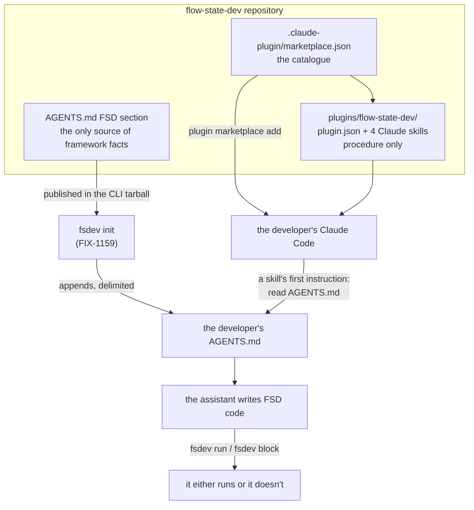

# FIX-1160: Consumer authoring pack — agent-instructions file + Claude Code plugin — Implementation Spec

## Part I — The Case *(for the human)*

### 1. Problem — why it matters, why now

A developer who installs FSD and then asks their coding assistant for a feature gets code
that looks right and does not run. The assistant has never seen FSD, so it invents a fifth
kind of building block, wires a flow in a way the framework does not accept, and never
discovers that a one-line terminal command would have told it so in two seconds. The
developer's first hour is spent correcting an assistant instead of building.

**Why now.** Public Launch points strangers at a front door, and the objective's second
half is that the assistant beside them writes FSD code that runs. Nothing in the product
serves that today. We do have five authoring skills that encode this knowledge, but every
one of them reads our source tree and runs our monorepo commands, so none can leave this
repository.

**The workaround is "read the docs to your assistant"**, and it fails the way you would
expect: it works for the person who already knows which page to paste.

*Linear issue **FIX-1160** · Epic **FIX-1161** ([epic PR
#1301](https://github.com/fixpoint-labs/flow-state-dev/pull/1301)) · Project **Public
Launch**.*

### 2. Solution in plain terms

Ship two things, and keep them from ever disagreeing.

**One instructions file** — the FSD section of `AGENTS.md`, which `fsdev init` writes into
the developer's project. Every mainstream coding assistant already reads that filename with
no configuration. It states what FSD actually is: the four kinds of building block, how
flows and actions are declared, what a capability is, where flows live, and — the part that
changes the most outcomes — that `fsdev run` and `fsdev block` exist, so the assistant can
check its own output instead of handing the developer a guess.

**One Claude Code plugin**, for the assistant most of our early users are on, carrying
step-by-step authoring procedures the instructions file has no room for. It installs from a
URL we publish.

The two cannot drift because they carry different things: **the file holds the facts, the
plugin's skills hold the procedure and defer to the file for every fact.** A skill that
needs to know what a generator is tells the assistant to read `AGENTS.md`, and stops there.

**Philosophy** — tenet 3 (earn every addition): this adds no framework API at all; it is
content and packaging, and the public type surface grows by zero. Tenet 1 (coherence): two
descriptions of the same framework that can disagree is the failure mode this design is
shaped around, so facts live in exactly one of them. Tenet 7 (prove the goal): the pack's
whole value is that the assistant verifies its own work on the real path, which is why
every packaged procedure ends in a CLI run rather than a claim.

**What it deliberately does not do:** it does not add an authoring MCP server, and it does
not add editor-specific rules files for Cursor, Windsurf or anything else. Both were ruled
out at epic level. The Claude plugin is the single exception, and it earns it by carrying
*procedures* — a rules file cannot hold a workflow.

### 6. Decisions & rules — the sign-off surface

1. **`AGENTS.md` is the only place the framework's shape is written down. The plugin's
   skills carry procedure, cite `AGENTS.md` for every fact, and stop if it is missing.**
   *Rejected:* a self-contained plugin that restates the block kinds and conventions, so it
   works in any project.
   *Locks in:* the plugin is useful only in a project that has been through `fsdev init`, and
   a developer who deletes our `AGENTS.md` section degrades the plugin too. We accept that,
   because the alternative is two descriptions of FSD published on two release cadences —
   and the day they disagree, the assistant's output is confidently wrong and the developer
   has no way to tell which half lied.

2. **The plugin is distributed from a marketplace manifest in the `flow-state-dev`
   repository itself, installed with two commands we publish in the docs, and listed in no
   public plugin directory.**
   *Rejected:* a separate repository for the plugin (a second thing to keep in step with
   every framework release), and a public directory listing (settled at epic level — a
   support commitment in the week we can least afford one).
   *Locks in:* the marketplace name and the plugin name become public strings printed in our
   docs and in `fsdev init`'s output. Renaming either later breaks every install line
   already published, and a user can register only one marketplace per name, so the name is
   effectively ours forever from the first install.

3. **Four skills ship at launch, not five: creating a block, adding a flow, composing a
   pattern, and writing tests. Writing a storage adapter does not ship.**
   *Rejected:* porting all five, as the issue originally scoped.
   *Locks in:* a developer whose database we do not already support gets no guided path and
   falls back to our docs. That is the rarest of the five tasks and the one most dependent
   on reading our source, so it is the one that would cost the most to maintain and be
   invoked the least. Reversible at any time by adding a fifth skill — nothing about the
   packaging changes. **Say the word at sign-off and it goes back in.**

**Non-goals** — the *placement* of `AGENTS.md` into a project (that is `fsdev init`'s job,
FIX-1159); the demo flow a scaffolded project starts with (FIX-548); an authoring MCP
server; editor-specific rules files; any public plugin-directory listing.

**Size:** Medium — 8 production files · 6 test behaviours · 3 doc surfaces · 1 PR.

---

### 3. Tradeoffs & alternatives

**Alternative: no plugin, just a longer `AGENTS.md`.** Genuinely tempting — one artifact,
zero packaging, no drift question at all, and it reaches every assistant rather than one.
It was argued at epic level as a case for cutting the plugin, and the scope call went the
other way. It is insufficient because an instructions file is *reference* and is read
passively: it can say "generators exist" but it cannot walk an assistant through picking a
kind, wiring an action, running the CLI, and reacting to the failure. Padding it until it
could would make it too long to be loaded reliably, which degrades the half that reaches
everyone.

**The simpler approach we are taking anyway:** the plugin is markdown. No code, no MCP
server, no runtime. If it turns out nobody installs it, we delete four files and the
instructions file is untouched.

**Where the complexity is:** not authoring the content — it is keeping one source of truth
across two artifacts on two distribution channels. The instructions file ships inside the
CLI package on npm and lands in the developer's repo at init time, so a project can be
running six-month-old content. The plugin ships from git and updates whenever the developer
runs `plugin marketplace update`. Those two clocks are independent and always will be.
Decision 1 is the whole answer: the plugin's skills hold nothing that *can* go stale about
the framework, because they hold no framework facts.

**The honest cost of the plugin.** It is one vendor's format, and shipping it makes the
next request ("do the same for Cursor") easier to say yes to. The epic already drew that
line and this spec stays behind it. The defensible distinction, if the question comes back:
we ship one universal *file* for every assistant, plus one *procedural* package for the
assistant our users are actually on. A second rules file would be a second copy of facts,
which decision 1 exists to prevent.

### 4. Focus practices (1–5)

1. **Coherence has exactly one convergence point (tenet 5).** Every fact about FSD's shape
   enters through the `AGENTS.md` content module. Any skill that states a block kind, a
   config key, or a directory convention is a second writer and is a defect.
2. **BP-003 (verification evidence).** A plugin manifest that passes a validator is not a
   plugin that installs — the POC caught exactly that. The evidence path is an actual
   install-and-invoke run, not a lint.
3. **BP-035 (second-path checklist).** The path that matters here is *published*, not
   *local*. The content works trivially inside this monorepo and can be entirely absent from
   the npm tarball; see §9.
4. **The outsider rule** (`docs/contributing/user-docs.md`). This content is read by
   strangers and by machines. No monorepo paths, no `pnpm --filter`, no reference to our
   packages' source layout, no issue numbers.

### 5. What using it looks like (1–5 examples)

**Installing the plugin** *(the two commands the docs print — one adds our catalogue, one
installs from it):*

```
/plugin marketplace add fixpoint-labs/flow-state-dev
/plugin install flow-state-dev@flow-state-dev
```

**What the developer types afterwards, and what changes.** The ask is the same either way;
the difference is entirely in what comes back.

```
"add an endpoint that summarises a support ticket"

before   the assistant writes a plausible file, names a block kind that does not
         exist, and reports success. The developer finds out at runtime.

after    the assistant reads AGENTS.md, picks a generator, writes it beside the
         flow, wires it into an action, then runs:
             npx fsdev run support summarise --input '{"userId":"u1", ...}'
         and pastes the result — or fixes what failed before saying anything.
```

**The instructions file's shape** *(headings only — this is what init appends, delimited, to
whatever `AGENTS.md` is already there):*

```
<!-- flow-state-dev:start -->
## Building with FSD
   What a flow is · the four block kinds · actions · capabilities
   Where flows live in this project
   Verifying your own work:  fsdev run · fsdev block · fsdev dev
   Two things that are always wrong
<!-- flow-state-dev:end -->
```

## Part II — The Build Plan *(for the implementing agent)*

### 7. Technical design

Two artifacts, one direction of dependency. The content module is authored once and read by
two consumers that never talk to each other.



- **`@flow-state-dev/cli`** — gains the instructions content as a shipped asset. This issue
  authors the content and gives it a home the CLI can read; `fsdev init` (FIX-1159) owns
  reading it and appending it. The seam between them is one exported string.
- **Repository root** — gains `.claude-plugin/marketplace.json`, and a plugin directory
  holding `plugin.json` plus `skills/<name>/SKILL.md` for the four skills. Distinct from
  `.agents/skills/`, which stays exactly as it is: those are *our* development skills, and
  the four packaged ones are rewrites, not copies or symlinks.
- **Untouched:** every framework package's public API. FSD's own runtime `skills` concept is
  unrelated and must not be touched (epic §5 Q3 — write *Claude skills* / *the Claude
  plugin* wherever the two could be confused).

**What "rewritten" means, concretely.** The five existing skills are grounded in *reading our
source* — "read `packages/core/src/utility/summarizer.ts`", "add the export to
`packages/core/src/utility/index.ts`", "run `pnpm --filter …`". None of those exist in a
stranger's project, so a path substitution does not rescue them. The rewrite swaps the
grounding source: **read `AGENTS.md` for the shape, read the installed package's type
declarations for exact signatures, verify with the CLI.** A skill's first instruction is to
read `AGENTS.md`; its last is to run something.

**Solution sketch — the shared spine of every packaged skill. Pseudocode, illustrative.**

```
read the FSD section of AGENTS.md at the project root
    if absent: stop, tell the developer to run init      ← decision 1, enforced
state which block kind / flow shape was chosen, and why  ← one line, before writing
read the installed package's declarations for signatures ← never from memory
write the file beside the flow it belongs to
run it:   fsdev block …   then   fsdev run <flow> <action> …
report what was run and what came back                   ← not "done"
```

What this asks a reviewer: is *stopping* when `AGENTS.md` is missing right, or should a
skill fall back to its own knowledge and warn? Stopping is decision 1 taken seriously;
falling back is friendlier and reintroduces exactly the guessing this pack removes.

**POC on this branch — the premise held, with one correction.** See
`spec-poc/FIX-1160-authoring-pack/` on this branch — it renders in the spec PR's own diff
with no checkout, and the full commands are in its README. It showed that a marketplace
manifest in this repository does produce an installable plugin whose skills load, that
"install by URL" *means* adding a marketplace so shipping a manifest does not contradict the
epic's no-listing decision, and that both steps are non-interactive subcommands, so the goal
check is scriptable. It also caught a real trap: a manifest using `metadata.pluginRoot`
**passed `claude plugin validate` and then failed to install**. Write full relative plugin
sources; see §9.

### 8. Implementation sequence

1. **Author the instructions content.** The FSD section of `AGENTS.md`: what a flow is, the
   four block kinds and when each applies, actions, capabilities, where flows live, the
   config file, and the verification commands. Two or three "always wrong" rules earn their
   place (a handler calling another block; inventing an API instead of reading the installed
   declarations). Written to the outsider rule — a stranger's project, no monorepo paths.
   *Test:* the content contains no repository-relative path and no `pnpm --filter`; it is
   readable from a package installed the way a consumer installs it. *Depends on:* nothing.
2. **Give it a home that survives publishing**, and export it as a string the CLI can read.
   *Test:* the §9 packaging behaviour — resolve it from a packed tarball, not from the
   working tree. *Depends on:* 1.
3. **Stand up the plugin skeleton** — `.claude-plugin/marketplace.json` at the repository
   root and `plugin.json` for the plugin, with full relative sources per decision 2 and the
   POC's finding. *Test:* both validate, and the local install round trip succeeds.
   *Depends on:* nothing.
4. **Write the four Claude skills** on the §7 spine. Each defers to `AGENTS.md` for facts and
   ends in a CLI run. *Test:* every skill's first instruction reads `AGENTS.md`; no skill's
   *procedure body* states a block kind or a config key (frontmatter exempt — see §10).
   *Depends on:* 1, 3.
5. **Wire the manifest checks into CI** — validate the marketplace and the plugin on every
   change, and run the install round trip. *Depends on:* 3.
6. **Docs** per §11. *Depends on:* 3.

No removals: `.agents/skills/`'s five skills stay as our own development skills. The packaged
four are new files, and there is no shared copy to delete — which is the point of decision 1.

### 9. Edge cases & error handling

| Case | Expected |
|---|---|
| The instructions asset is absent from the published npm tarball | The failure this change is most likely to ship. `@flow-state-dev/cli` publishes `files: ["dist"]`, so a raw markdown asset outside `dist` is silently excluded — it works in the monorepo and is missing for every real consumer. Prove it against a packed tarball, not the working tree |
| A marketplace manifest that validates but does not install | `metadata.pluginRoot` did exactly this (POC). Never trust the validator alone; CI runs the install |
| The project has no `AGENTS.md`, or no FSD section in it | A skill stops and tells the developer to run `fsdev init`. Not an error — decision 1's intended behaviour |
| The project's `AGENTS.md` FSD section is older than the installed packages | The skill reads the installed type declarations for signatures, so the shape may be stale but the signatures never are. Worth one sentence in the content itself |
| Marketplace name already registered by the developer under a different source | Claude Code replaces the first silently. Nothing we can do in code; the docs name the marketplace explicitly so it is at least visible |
| A `github`-sourced install of a repository this size is slow | Untested; the POC ran from a local path. If unacceptable, a sparse `git-subdir` source is the escape hatch, same manifest |

**Taxonomy:** every failure here is a setup failure that surfaces at install or first
invocation, is visible to the developer, and is recoverable by re-running a command. Nothing
in this change runs at application runtime, so nothing can fail in production.

### 10. Testing strategy

**Goal & goal check.** The epic's check for this issue: install the Claude plugin **from its
URL**, invoke **one packaged skill**, and have a coding assistant in a freshly scaffolded
project produce a flow that passes `fsdev run` — one recorded observation, not a metric.

**It splits, and the split is a real dependency, not a hedge.** The install-and-invoke half
is provable on this issue alone and the POC showed it is scriptable, so it ships with this
PR. The "freshly scaffolded project" half needs `fsdev init` to exist (FIX-1159) and is run
once that lands. Say which half ran in the PR; do not report the whole check as passed on
the strength of the half that did.

**CI specs** (the behaviours, not the test names):

- the marketplace manifest and the plugin manifest both validate
- the plugin **installs** and its four skills appear in the component inventory — separate
  from validating, because the POC proved a green validator is not evidence of an install.
  **The evidence run installs from the `github`-sourced marketplace we publish, not only
  from a local path.** The goal is install-from-URL, and remote manifest discovery and
  relative plugin-source resolution are precisely what a local-path install never
  exercises — §9's last row is untested for exactly this reason. A local-path install is
  the fast pre-check; it is not the evidence
- the instructions content resolves from a **packed** CLI tarball (§9's first row)
- the content contains no repository-relative path, no `pnpm --filter`, and no issue or PR
  number — the outsider rule, checked rather than reviewed
- no packaged skill states a block kind, a config key, or a directory convention **in its
  procedure body** — decision 1's convergence point, enforced mechanically rather than by
  discipline. **The YAML frontmatter is exempt**: a skill's `description` has to name the
  task in the assistant's own vocabulary or the skill never gets discovered, so a
  whole-file grep would flag the pack's own skills (the POC's `create-block` included).
  Check the body
- every packaged skill's procedure ends in a `fsdev` command

**Discipline:** `tdd`. The seam is the file system and the `claude plugin` subcommands — both
scriptable from a plain node test, no Claude Code session required. The two content checks
are ordinary assertions over the exported string.

### 11. Documentation plan

- **CREATE** `apps/docs/guides/coding-with-an-assistant.md` — task-oriented: what the
  instructions file gives any assistant, the two commands that install the Claude plugin,
  what each of the four skills does, and how to tell it is working. Placed in
  `sidebarsGuides.ts` immediately after `nextjs-setup.md`, alongside the other
  first-hour setup guides, since a reader hits it right after getting a project running.
  One minimal example: the before/after from §5. Cross-link ← from
  `getting-started/project-structure.md` and from the CLI README; → to
  `getting-started/your-first-flow.md`.
  *Voice risks:* "seamless" and "powerful" are the obvious adjectives for an AI-assistant
  page. Do not. Also: introduce *Claude skills* and *the Claude plugin* with those
  qualifiers on first use — FSD has its own runtime `skills` concept and the two sit on
  adjacent pages.
- **EXTEND** `apps/docs/docs/getting-started/project-structure.md` — one entry for
  `AGENTS.md` in the file list, saying what it is for and that it is safe to edit around.
- **EXTEND** `packages/cli/README.md` — one line under init's entry noting that it writes
  the assistant instructions, linking the new guide.
- **No new reference page.** This is a setup task, not a framework concept; a guide is the
  right surface and a concept page would fragment the sidebar for content with no API.

### 12. Dependencies, open questions & follow-ups

**Dependencies.**

- **FIX-1159 (`fsdev init`)** — two-way, neither blocking this issue's build. This issue
  authors the instructions content and exports it; FIX-1159 writes it into the project. The
  seam is one exported string, so both can be built in parallel, but **whoever lands second
  owns making the two ends meet** — and the goal check's second half cannot run until init
  exists.
- **Epic decisions that bind and must not be reopened:** the filename is `AGENTS.md`,
  appended and never overwritten (epic §5 Q1); distribution is install-by-URL with no public
  listing (Q2); FSD's runtime `skills` concept keeps its bare name and FIX-417 / FIX-424 are
  not touched (Q3).

**Open questions:** none. The one call that could have been asked — whether the fifth skill
ships — is decided in §6 rather than handed over as a menu, and is reversible in a word at
sign-off.

**Settled claims.**

- **Settled:** a marketplace manifest hosted in this repository produces an installable
  plugin whose packaged skills load — **CONFIRMED**, `claude plugin validate` + a full
  `marketplace add` → `install` → `details` round trip on Claude Code v2.1.233, showing
  `Skills (1) create-block`. (`spec-poc/FIX-1160-authoring-pack/`)
- **Settled:** shipping a marketplace manifest is not the same as taking a public listing —
  **CONFIRMED**: there is no command that installs a bare plugin from a URL, so a manifest is
  the required distribution artifact and the directory listing is the separable thing the
  epic declined.
- **Settled:** `claude plugin validate` passing is not evidence a plugin installs —
  **REFUTED** as a check: a `metadata.pluginRoot` manifest validated clean and then failed
  with `Source path does not exist`. The goal check runs the install.

**Follow-ups (flagged, not built):**

- The fifth skill (writing a storage adapter), if a developer asks for it. Decision 3.
- Our own five development skills in `.agents/skills/` now have consumer-facing cousins that
  say some of the same things in a different register. Not a drift risk today — they target
  different repositories — but worth a look if the packaged four grow.

### 13. Review notes for the implementer

Recorded from spec-PR review, verbatim. These are below the direction bar — judge each
against real code when you get there; none of them changes the approach.

- **A shared spine file for the four skills** (on §7's sketch) — *"This pseudocode is the
  real contract for all four skills. The POC `create-block` skill is already mostly this
  spine plus task-specific steps 3–4. Consider specifying a `_spine.md` (or similar) that
  each skill includes verbatim, rather than four independent rewrites that will drift from
  each other over time. Optional simplification — only worth it if you expect the spine to
  change."* Weigh it once you have written two of the four and can see how much is actually
  shared; note that Claude Code loads a `SKILL.md` as one file, so "include verbatim" is a
  build step, not a runtime one.

- **Path-filter the install round trip in CI** (on §8 step 5) — *"'on every change' for the
  full `marketplace add` → `install` → `details` round trip will be expensive and may
  require Claude Code in CI. Suggest path-filtering install to plugin manifest/skill paths
  (validate on every PR; install on those paths or on `main` only). The POC already proved
  install is scriptable — you don't need to pay that cost on unrelated PRs."* §10 names the
  behaviours, not the trigger conditions; the trigger is yours. Whatever you pick, the
  published-source install must still run somewhere that blocks a release.

- **An automated check for the `fsdev init` seam** (on §12) — *"Assign an automated
  acceptance check that runs `fsdev init` and verifies it writes the exported FSD
  instructions. The current issue-local checks allow the content and init changes to pass
  independently without proving that freshly initialized projects contain the section the
  plugin requires."* §12 already assigns that ownership — whoever of FIX-1160 / FIX-1159
  lands second makes the two ends meet — but it says so in prose rather than naming a
  check. If you are the second to land, this is the concrete shape it should take.

---

## Spec evolution

- **Spec drafted** — framed as one instructions file plus one Claude plugin, with drift
  prevented structurally rather than by discipline: the file holds every framework fact, the
  packaged skills hold only procedure. Cut the storage-adapter skill from the launch pack.
  Built a POC on this branch that confirmed the packaging premise and caught a manifest form
  that validates but does not install.
