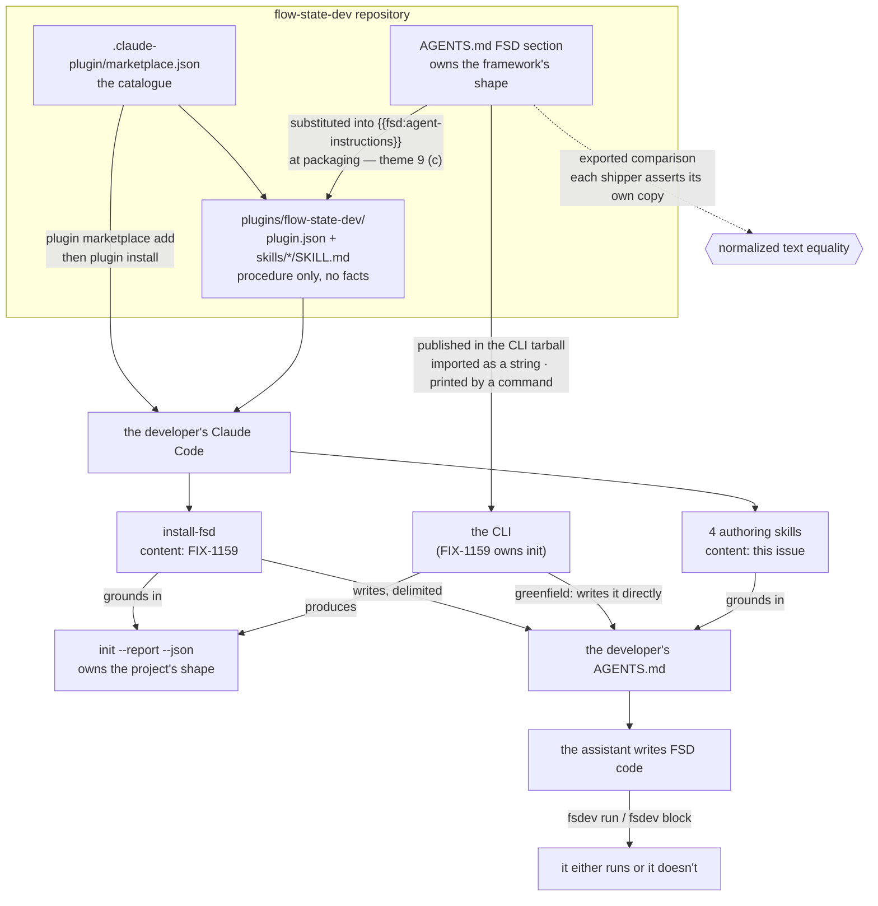

# FIX-1160: Consumer pack — agent-instructions file + the Claude Code plugin that ships the authoring and install skills — Implementation Spec

## Part I — The Case *(for the human)*

### 1. Problem — why it matters, why now

A developer who installs FSD and then asks their coding assistant for a feature gets code
that looks right and does not run. The assistant has never seen FSD, so it invents a fifth
kind of building block, wires a flow in a way the framework does not accept, and never
discovers that a one-line terminal command would have told it so in two seconds. The
developer's first hour is spent correcting an assistant instead of building.

**Why now.** Public Launch points strangers at a front door, and the objective's second
half is that the assistant beside them writes FSD code that runs. Nothing in the product
serves that today. We do have five authoring skills that encode this knowledge, but every
one of them reads our source tree and runs our monorepo commands, so none can leave this
repository.

**And the job grew while this spec was in review.** Adding FSD to a repository that already
exists is no longer a command — it is an agent skill (FIX-1159), and a Claude skill reaches
a stranger's machine exactly one way: inside an installed plugin. This issue owns that
plugin. So this is no longer help for someone already running FSD. It is how a developer
with an existing project gets FSD at all. Packaging that was a convenience is now the epic's
delivery channel, and a manifest nobody can install costs the objective half its outcome
rather than costing an assistant some polish.

**The workaround is "read the docs to your assistant"**, and it fails the way you would
expect: it works for the person who already knows which page to paste. For the brownfield
half there is no workaround at all — copying our wiring out of this repository by hand is
the thing the epic exists to stop asking people to do.

*Linear issue **FIX-1160** · Epic **FIX-1161** ([epic PR
#1301](https://github.com/fixpoint-labs/flow-state-dev/pull/1301)) · Project **Public
Launch**.*

### 2. Solution in plain terms

Ship two things, and keep them from ever disagreeing.

**One instructions file** — the FSD section of `AGENTS.md`, written into the developer's
project by whichever path they came in through: the greenfield command in a new project, the
install skill in one they already had. Every mainstream coding assistant already reads that
filename with no configuration. It states what FSD actually is: the four kinds of building
block, how
flows and actions are declared, what a capability is, where flows live, and — the part that
changes the most outcomes — that `fsdev run` and `fsdev block` exist, so the assistant can
check its own output instead of handing the developer a guess.

**One Claude Code plugin**, for the assistant most of our early users are on, carrying the
step-by-step procedures the instructions file has no room for. Five skills, of two kinds:
four that help someone author FSD code in a project already running it, and the **install
skill**, which adds FSD to a project that is not. A developer adds our catalogue once and
installs from it — Claude Code has no command that takes a bare plugin URL, so a catalogue
file is the required artifact, and it is not the same thing as a public listing (§6
decision 2).

**And this issue puts the instructions content into the install skill itself.** The skill has
to write that section into a stranger's project, but it cannot import anything, and it lands
before this issue does — so it carries a named blank and we fill it with the canonical text
when we assemble the plugin. One text, written once, checked by comparison wherever it is
copied (§7).

**Nothing packaged holds a fact of its own — that is what stops the two from drifting.**
Each skill names one live source, reads it at the moment it runs, and states nothing from
memory. The four authoring skills read `AGENTS.md`. The install skill runs `fsdev init`'s
detection report, because it is the thing that *creates* `AGENTS.md`. A skill that needs to
know what a generator is tells the assistant to read `AGENTS.md`, and stops there.

**Philosophy** — tenet 3 (earn every addition): this adds no framework API at all; it is
content and packaging, and the public type surface grows by zero. Tenet 1 (coherence): two
descriptions of the same framework that can disagree is the failure mode this design is
shaped around, so every fact has exactly one owner. Tenet 5 (fix at the owning layer): the
owner of a fact is whoever produces it — `AGENTS.md` owns the framework's shape, the
detection report owns the project's shape — and a skill that restates either is fixing
knowledge at the wrong layer. Tenet 7 (prove the goal): the pack's whole value is that the
assistant verifies its own work on the real path, which is why every packaged procedure ends
in a CLI run rather than a claim.

**What it deliberately does not do:** it does not add an authoring MCP server, and it does
not add editor-specific rules files for Cursor, Windsurf or anything else. Both were ruled
out at epic level. The Claude plugin is the single exception, and it earns it by carrying
*procedures* — a rules file cannot hold a workflow. It does not author the install skill's
content either: FIX-1159 owns that, and this issue owns the directory it lands in.

### 6. Decisions & rules — the sign-off surface

1. **Every packaged skill names one live grounding source, reads it at the moment it runs,
   and states no framework fact of its own. Which source depends on what the skill does: the
   four authoring skills read `AGENTS.md`; the install skill runs
   `fsdev init --report --json`, because it is the thing that creates `AGENTS.md`. A skill
   stops when its source is missing or refuses.**
   *Rejected:* the earlier form of this rule — *every* packaged skill reads `AGENTS.md`
   first and stops if it is missing — and, separately, self-contained skills that restate the
   block kinds so they work in any project.
   *Why restated rather than given a carve-out:* the rule is worth having only because it is
   mechanical, and an unexplained exception for the one skill that breaks it destroys exactly
   that. The old wording named a **file** when what it meant was a **property**: do not carry
   framework knowledge inside a skill. Those two came apart the moment the install skill
   existed. It cannot read `AGENTS.md` — it runs before there is one — and it also carries no
   framework knowledge, because every fact it acts on comes from a report it executes. The
   old rule would have failed it for the wrong reason. Naming the property covers both kinds,
   keeps the stop-if-absent behaviour (a refusal in the report stops the install skill the
   way a missing `AGENTS.md` stops an authoring skill), and is the same rule the epic already
   states from the other side — theme 1: *an instruction that restates the reference shape
   instead of pointing at it is the signal.*
   *Locks in:* every packaged skill is useless outside a project our own tooling has touched
   — the authoring four need an `AGENTS.md` FSD section, the install skill needs to be able
   to run our CLI through `npx`. We accept that, because the alternative is descriptions of
   FSD published on independent release cadences, and the day they disagree the assistant's
   output is confidently wrong and the developer cannot tell which half lied. It also changes
   what the rule is enforceable *against*: the mechanical check now runs per fact class
   rather than over whole skill bodies, because the install skill's subject matter *is* the
   file layout. §10 carries the scoped form; §8 step 4 is re-drafted to match.

2. **The plugin is distributed from a marketplace manifest in the `flow-state-dev`
   repository itself, added with two commands we publish, and listed in no public plugin
   directory — and those two commands appear on the getting-started page and in the root
   README, not only in this issue's own guide.**
   *Whose call each half is, because an earlier revision of this spec got it wrong:* **no
   public listing is epic Q2, decided by the product owner, and it binds.** **The docs
   placement is not.** It is the epic's own recommendation inside **Q4 — which is open and is
   the owner's to answer** (§12). This spec **builds to the epic's recommendation pending the
   owner's answer**; the call to build to it now is the coordinator's and is reversible. It is
   safe to make because it is right under either answer: if Q4 comes back as a public listing,
   the two commands are unchanged and these docs surfaces become one channel among two instead
   of the only one.
   *Rejected:* a separate repository for the plugin (a second thing to keep in step with
   every framework release), and a public directory listing at launch (epic Q2 — decided by
   the product owner, on the asymmetry that delisting later reads as abandonment; Q4 re-prices
   that decision now that the plugin carries the only brownfield path, and is open).
   *A wording correction this decision now carries:* "install by URL" is the epic's label,
   not a command. Claude Code has no bare-URL plugin install — verified by running it, not by
   reading help text (§12). `plugin install` resolves a *name* against configured
   marketplaces; `plugin marketplace add` is the command that takes "a URL, path, or GitHub
   repo". So the manifest is a **required distribution artifact**, and declining a listing is
   still a separate and intact choice. The spec says "added as a marketplace from a source we
   publish" wherever it used to say "installs from a URL".
   *Locks in:* the marketplace name and the plugin name become public strings printed in our
   docs, in the root README, and in `fsdev init`'s report output. Renaming either later
   breaks every install line already published, and a developer can register only one
   marketplace per name, so the name is effectively ours forever from the first install. The
   docs placement is carried as a deliverable rather than a preference — **a coordinator
   decision, reversible, on the epic's reasoning in Q4**: with brownfield shipping through this
   channel, a stranger who does not find the install source has no brownfield path at all, and
   burying it one click deep is the failure Q4 describes. It is two short doc blocks; building
   them is cheaper than holding the spec for an answer that does not change them.

3. **Five skills ship, of two kinds. Four authoring skills — creating a block, adding a
   flow, composing a pattern, writing tests. Plus the install skill, whose content FIX-1159
   authors and this issue packages. Writing a storage adapter still does not ship.**
   *Rejected:* four (what this decision said before the re-shape — the install skill is a
   packaged skill now, and calling the pack "four skills" would leave the brownfield channel
   undescribed), and rewriting all five of our own development skills as the issue originally
   scoped.
   *Locks in:* a developer whose database we do not already support gets no guided path and
   falls back to our docs. That is the rarest of those tasks and the one most dependent on
   reading our source, so it would cost the most to maintain and be invoked the least.
   Reversible in a commit — the POC established that a skill is a directory and adding one
   edits no manifest (§12), so a sixth skill changes nothing about packaging. **Say the word
   at sign-off and it goes back in.** The one real per-skill cost is measured rather than
   guessed: `claude plugin details` projects roughly **100 always-on tokens per skill** in
   every session of every developer who installs the pack — the frontmatter, which is what
   makes a skill discoverable and so is loaded whether or not it fires. Five skills is about
   500 tokens of everyone's context, forever. That is the reason to keep the pack small, and
   it is a better reason than taste.

**Non-goals** — the *content* of the install skill and of the detection report it runs
(FIX-1159 authors both; this issue packages and ships them); the *placement* of `AGENTS.md`
into a project (also FIX-1159); the demo flow a scaffolded project starts with (FIX-548); an
authoring MCP server; editor-specific rules files; any public plugin-directory listing.

**Size:** Medium — 11 production files · 17 test behaviours · 5 doc surfaces · 1 PR.
*(Grew with epic theme 9: the block comparison this issue exports and the packaging-time
substitution into FIX-1159's placeholder, plus the acceptance rules §4 practice 5 replaced.)*
*(Four of those files are the authoring skills; `skills/install-fsd/SKILL.md` is not counted
— FIX-1159 authors it and this issue provides the directory it lands in.)*

---

### 3. Tradeoffs & alternatives

**Alternative: no plugin, just a longer `AGENTS.md`.** Genuinely tempting — one artifact,
zero packaging, no drift question at all, and it reaches every assistant rather than one.
It was argued at epic level as a case for cutting the plugin, and the scope call went the
other way. It is insufficient because an instructions file is *reference* and is read
passively: it can say "generators exist" but it cannot walk an assistant through picking a
kind, wiring an action, running the CLI, and reacting to the failure. Padding it until it
could would make it too long to be loaded reliably, which degrades the half that reaches
everyone. **After the re-shape this alternative is dead rather than merely weak** — an
`AGENTS.md` cannot exist in a project until something writes it, and the thing that writes
it is the install skill, which ships in the plugin. You cannot bootstrap the file half from
the file half.

**The simpler approach we are taking anyway:** the plugin is markdown. No code, no MCP
server, no runtime. If it turns out nobody installs it, we delete four files and the
instructions file is untouched.

**Where the complexity is:** not authoring the content — it is keeping one source of truth
across two artifacts on two distribution channels. The instructions file ships inside the
CLI package on npm and lands in the developer's repo when the install skill or the greenfield
command writes it, so a project can be running six-month-old content. The plugin ships from
git and updates whenever the developer runs `plugin marketplace update`. Those two clocks are
independent and always will be. Decision 1 is the whole answer: no packaged skill holds
anything that *can* go stale about the framework, because none of them holds a framework fact.

**The one place that answer needs care** is the instructions content itself, which now has
two consumers rather than one. FIX-1159's greenfield command imports it as a string. The
install skill is an agent and cannot import anything — so unless the content is reachable by
*running* something, that skill would write the FSD section from memory, which is precisely
the drift decision 1 exists to prevent. §7 states what this issue therefore owes: the content
needs a printable surface as well as an importable one.

**The honest cost of the plugin, which the re-shape made much larger.** It is one vendor's
format. Before the split that bought a better authoring experience for Claude Code users and
cost everyone else nothing they had. Now the brownfield entry path ships inside it, so a
developer on Cursor or Copilot has no install skill — they get `AGENTS.md` (once something
writes it) and the by-hand documentation page FIX-1159 keeps for exactly this reason. That is
a real gap in the epic's headline capability for everyone not on one product, and it is worth
naming plainly rather than filing under packaging.

Two things keep it from being a reason to change course here. The manual path is a
documentation page, not a dead end — it is the same wiring, written out. And the fix, if the
gap turns out to matter, is a second *procedural* package, not a second copy of the facts: the
grounding sources stay exactly where decision 1 puts them, and a Cursor-format port of the
install skill would read the same detection report. So this decision is expensive to have
gotten wrong but cheap to extend, and nothing in the packaging forecloses it. What would
change the answer is evidence about which assistant our brownfield users actually run, which
we do not have and will not before launch.

**This is a live fork, and it is the epic's, not this spec's.** An earlier revision closed it
here by citing epic Q2/Q4 — but Q4 is unanswered, so there was nothing to close it against. It
sits downstream of Q4 (how narrow a channel the brownfield path may have during launch) and
moves with it. §12 carries it as an open fork the epic owns, with the second-package fix
recorded as the follow-up it becomes if the answer goes the other way.

### 4. Focus practices (1–5)

1. **Every fact class has exactly one owner (tenet 5).** Two classes matter here and they
   have different owners. *The framework's shape* — block kinds, how flows and actions are
   declared, what a capability is — enters through the `AGENTS.md` content module, and any
   skill that states one is a second writer and a defect. *The project's shape* — host
   framework, package manager, module system, what is already on disk — is owned by
   FIX-1159's detection report, and a skill that asserts one instead of running the report
   is the same defect wearing different clothes. Naming the classes is what lets the rule
   bind five skills that do not all read the same file.
2. **BP-003 (verification evidence).** A plugin manifest that passes a validator is not a
   plugin that installs — the POC caught exactly that. The evidence path is an actual
   install-and-invoke run, not a lint. The same discipline applied to a claim handed to this
   spec: "Claude Code has no bare-URL plugin install" was re-checked by running the install
   with a URL and with an `owner/repo` shorthand, not by reading the help text that says so.
3. **BP-035 (second-path checklist).** The path that matters here is *published*, not
   *local*. The content works trivially inside this monorepo and can be entirely absent from
   the npm tarball; see §9.
4. **The outsider rule** (`docs/contributing/user-docs.md`). This content is read by
   strangers and by machines. No monorepo paths, no `pnpm --filter`, no reference to our
   packages' source layout, no issue numbers.
5. **The acceptance step must exercise the artifact the step produced.** The sharpening of
   BP-003 this spec most needs, because every acceptance rule here is a rule about what a
   *skill* does at the end of its run, and the cheap version of each one passes while the
   thing it exists to establish is broken. A flow run does not exercise a test file. A
   process exit code does not exercise a schema. A declaration lookup does not exercise
   packages that are not installed. **For every acceptance rule below, name what the step
   produced and confirm the check touches that** — §10 does this per rule, and §7's spine
   carries the two places it changed the design rather than just the test.

### 5. What using it looks like (1–5 examples)

**Installing the pack** *(the two commands the docs print — one adds our catalogue, one
installs the plugin from it; there is no single-command form, see §6 decision 2):*

```
/plugin marketplace add fixpoint-labs/flow-state-dev
/plugin install flow-state-dev@flow-state-dev
```

**The brownfield entry, which is what those two commands now unlock.** The developer has a
repository already and no FSD in it:

```
you   add FSD to this project

      ▸ install-fsd runs npx @flow-state-dev/cli init --report --json
        next (app router) · pnpm · commonjs · no fsdev.config · AGENTS.md present

      4 files created, 3 appended to. Review the diff before you commit.
```

The skill's steps and its refusals belong to FIX-1159. What this issue owns is that the
skill is *there* — that a developer who has never seen our repository can put it on their
machine with the two commands above.

**What the developer types once FSD is running, and what changes.** The ask is the same
either way; the difference is entirely in what comes back.

```
"add an endpoint that summarises a support ticket"

before   the assistant writes a plausible file, names a block kind that does not
         exist, and reports success. The developer finds out at runtime.

after    the assistant reads AGENTS.md, picks a generator, writes it beside the
         flow, wires it into an action, then runs:
             npx fsdev run support summarise --input '{"userId":"u1", ...}'
         and pastes the result — or fixes what failed before saying anything.
```

**The instructions file's shape** *(headings only — this is what gets appended, delimited, to
whatever `AGENTS.md` is already there, by the command in a new project and by the install
skill in an existing one):*

```
<!-- flow-state-dev:start -->
## Building with FSD
   What a flow is · the four block kinds · actions · capabilities
   Where flows live in this project
   Verifying your own work:  fsdev run · fsdev block · fsdev dev
   Two things that are always wrong
<!-- flow-state-dev:end -->
```

## Part II — The Build Plan *(for the implementing agent)*

### 7. Technical design

Two artifacts and one catalogue. The instructions content is authored once and reaches two
consumers that never talk to each other — a program that imports it and an agent that runs
for it.



- **`@flow-state-dev/cli`** — gains the instructions content as a shipped asset, reachable
  two ways. This issue authors the content and gives it a home that survives publishing;
  FIX-1159 owns writing it into a project.
- **Repository root** — gains `.claude-plugin/marketplace.json`, and a plugin directory
  holding `plugin.json` plus `skills/<name>/SKILL.md`. Four of those directories are this
  issue's; `skills/install-fsd/` is FIX-1159's content landing in this issue's structure.
  Distinct from `.agents/skills/`, which stays exactly as it is: those are *our* development
  skills, and the packaged ones are rewrites, not copies or symlinks.
- **Untouched:** every framework package's public API. FSD's own runtime `skills` concept is
  unrelated and must not be touched (epic §5 Q3 — write *Claude skills* / *the Claude
  plugin* wherever the two could be confused).

**The content seam has two ends, and one of them is an agent.** FIX-1159's greenfield command
imports the instructions content as a string. The install skill cannot import anything — so
if the content is only importable, that skill writes the FSD section from memory and decision
1 is broken by the one skill that most needs it. **The content therefore ships with a
printable surface as well as an importable one**: something an agent can run that emits the
exact bytes, so the skill copies rather than composes. This issue owns that the content has
both; *which* command carries the printable form is FIX-1159's call, since it owns `init` and
its flags (§12).

**The agent-instructions block, and the check that keeps its copies honest (epic theme 9).**
The epic classifies this content as a **source block**: one canonical text, embedded verbatim
in every shipper's own source, so the check is text equality rather than behaviour. This issue
is its **author**, which under theme 9 (a) means it owns four things — the canonical text, the
normalization, the comparison, and the placeholder syntax — as **one implementation**, so that
two shippers cannot drift apart on a normalization neither of them wrote.

*These are the epic's calls, not the product owner's, and they are reversible* — the epic
records the mechanism as coordinator-decided and says why it moved down here: the mechanics of
checking an artifact are not coordination, and they were wrong five times while they lived at
epic altitude, each time because a fix defended a **stored value**. **There is no stored value
now.** No digest, no version marker, no `sha256`, no `node:crypto`. If this spec previously
implied a marker embedded in the block, that is gone.

- **Normalization — two steps, and it is the whole of it.** Take the bytes between the FSD
  delimiters, exclusive; then normalize line endings to `\n`, strip trailing whitespace per
  line, and strip leading and trailing blank lines. Nothing is stripped from inside the block,
  because nothing is embedded in it that needs stripping.
- **The comparison is exported, and this issue does not invoke it over anyone else's copy.**
  Theme 9 (a) splits ownership of the comparison from ownership of the invocation, and the
  reason binds here specifically: **this issue lands before FIX-548.** A check written here
  over FIX-548's `AGENTS.md` cannot be written correctly — demanding the copy fails while
  FIX-548 has not landed, and tolerating its absence passes forever if FIX-548 never embeds
  it. Neither version can tell *not yet* from *never*. So the comparison ships as a test-time
  import and **each shipper asserts its own copy in its own suite**, where the assertion lands
  exactly when the copy does. A test-time import inside this monorepo is not the inter-package
  dependency theme 9 rejects.
- **What this issue asserts is its own copy** — the one it creates. See the substitution below.
- **The invariant every shipper is held to:** the embedded copy is identical to canonical after
  normalization. The *file* varies; the *block* does not. Everything that varies is either
  outside the delimiters (per-host prose) or a **declared substitution** — a named placeholder
  filled with a detected value, or a named conditional section rendered under one of theme 8's
  two topologies. **A shipper embeds every branch and renders only its own**, so a branch it
  can never reach still sits in its source byte-identical to canonical. Trimming one looks like
  tidying and breaks the check; the assertion is normalized **equality over the whole block**,
  never presence or substring.
- **Does this block need either form of variation?** As specified: **no.** The epic calls the
  agent-instructions file universal, and the content is the framework's shape — block kinds,
  actions, capabilities, verification commands — none of which differs by host or package
  manager. It is authored with no placeholders and no conditional sections, which is the
  simplest thing that satisfies the invariant. **If the implementer finds a genuine per-host
  difference, it becomes a declared substitution, not free prose** — and a *shape* difference
  would be a second block rather than a placeholder, which is the conclusion FIX-1159 reached
  for the next-steps block and is worth raising up rather than deciding locally.

**The packaging-time substitution, which is a scope addition and exists to break a cycle.**
FIX-1159's install skill must emit this block, but **FIX-1159 lands before this issue**, so it
cannot embed a canonical text that has not landed; and reversing that edge would break
packaging, which runs the other way. The epic resolves it by **co-location: this issue owns the
content *and* the embedding.** FIX-1159's `SKILL.md` carries a named placeholder, and **this
issue substitutes the canonical block into it when it packages the plugin.** That runs *along*
the existing FIX-1159 → FIX-1160 edge rather than against it. This artifact is the only one in
the epic with the cycle.

- **This issue declares the placeholder token**, because theme 9 (a) gives the placeholder
  syntax to the artifact's author. FIX-1159's spec commits to carrying "a named placeholder"
  without naming it, so there is nothing to collide with: **`{{fsd:agent-instructions}}`**, in
  the `{{…}}` form FIX-1159 already uses for the next-steps block's substitutions. Agreed on
  that spec rather than assumed (§12).
- **Substitution failure is loud, never a no-op.** If the skill file is present and the
  placeholder is absent — renamed, already filled, or never added — packaging **fails**. A
  substitution step that silently finds nothing to replace ships a plugin whose brownfield
  skill has no instructions block in it, and every other check stays green. §9 and §10 carry
  the three dispositions.

**What this does not add:** no new package, no new dependency between packages, no build step
for the check. The comparison reads files and compares strings at test time. The substitution
is part of assembling the plugin, which this issue already does.

**What "rewritten" means, concretely** (the four authoring skills — the install skill is
authored fresh by FIX-1159). The five existing development skills are grounded in *reading our
source* — "read `packages/core/src/utility/summarizer.ts`", "add the export to
`packages/core/src/utility/index.ts`", "run `pnpm --filter …`". None of those exist in a
stranger's project, so a path substitution does not rescue them. The rewrite swaps the
grounding source: **read `AGENTS.md` for the shape, read the installed package's type
declarations for exact signatures, and exercise what you wrote with the CLI.**

**Solution sketch — the spine every packaged skill shares. Pseudocode, illustrative.**
The spine is the same for both kinds; **two lines differ by kind** — the grounding source,
which is decision 1 stated as code, and where the exact API shape comes from, which is what
review found the old spine had got wrong for the install skill.

```
read the skill's grounding source                        ← varies by kind
    authoring skills:  the FSD section of AGENTS.md at the project root
    install skill:     npx @flow-state-dev/cli init --report --json
    if absent or refusing: stop and say what to run       ← decision 1, enforced
state what was chosen, and why                            ← one line, before writing
get the exact API shape                                   ← varies by kind, and never
    authoring skills:  read the INSTALLED package's           from memory
                       declarations in the project
                       if they do not resolve: stop and say what to install
    install skill:     the wiring contract in the report — it does not read
                       declarations, because FSD is not installed yet
write
exercise what you just wrote                              ← §4 practice 5
    every skill:       fsdev block … then fsdev run <flow> <action> …
                       and read schemaValidation.*.passed, not the exit code
    the test skill:    additionally run the project's own test command
report what was run and what came back                    ← not "done"
```

**Two lines of that spine changed after review found the same defect twice, and both are the
design rather than the test.**

**The declaration lookup cannot be universal, because the install skill runs before FSD
exists.** In the brownfield case there is no `node_modules/@flow-state-dev/core` to read at the
moment the skill writes — the report is fetched with `npx`, which resolves our CLI into npm's
own cache and puts nothing in the project. A spine that told all five skills to "read the
installed declarations" would, for the one skill that matters most to the epic, be an
instruction to read something absent — and the documented fallback for an absent source is the
assistant's memory, which is the exact failure this pack exists to remove.
**Resolved by giving the install skill the other source it already has: the wiring contract**
(epic theme 9 (b)) **, delivered in the detection report.** It specifies the mount pair,
`fsdev.config.ts`'s shape, the statically-imported provider passed as a pre-built
`modelResolver`, the dependency set and the runtime floor — which is the whole API surface the
install skill writes. *Rejected: install the packages first, then read declarations.* It would
work, and it is worse: it makes the install skill a second independent discoverer of a shape
the contract already specifies and FIX-548's template already conforms to, which is the drift
theme 9 exists to stop. Reading a specification is not weaker evidence than reading a
declaration when the specification is the thing both writers are held to.
*The authoring skills keep the declaration read* — they run only in a project that already has
an FSD section in `AGENTS.md`, so the packages are there — **and gain the same stop rule as
decision 1**: if the declarations do not resolve (a fresh clone with no install), stop and say
what to run. Falling back to memory there is the same defect one room over.

What this asks a reviewer: is *stopping* right, or should a skill fall back to its own
knowledge and warn? Stopping is decision 1 taken seriously; falling back is friendlier and
reintroduces exactly the guessing this pack removes. Note the question now has more weight on
the install skill's side, where "fall back" means guessing a stranger's package manager.

**POC on this branch — both premises held, with two corrections.** See
`spec-poc/FIX-1160-authoring-pack/` on this branch — it renders in the spec PR's own diff
with no checkout, and the full commands are in its README.

The first pass showed that a marketplace manifest in this repository produces an installable
plugin whose skills load, that "install by URL" *means* adding a marketplace so shipping a
manifest does not contradict the epic's no-listing decision, and that both steps are
non-interactive subcommands, so the goal check is scriptable. It caught one trap: a manifest
using `metadata.pluginRoot` **passed `claude plugin validate` and then failed to install**.
Write full relative plugin sources; see §9.

The re-shape run added an `install-fsd` skill directory and re-ran the round trip. **Three
findings shape this draft.** Skills are discovered from directories, so adding one **edits no
manifest** — the fifth skill is a file drop and there is nothing for FIX-1159 and this issue
to race on (§12). A skill grounded in the report rather than in `AGENTS.md` **loads
identically** — the conflict between the install skill and the old decision 1 was entirely a
rule we wrote, not a constraint the tooling imposes, which is why §6 restates the rule instead
of exempting the skill. And `claude plugin details` reports a projected **per-skill always-on
token cost**, which is what makes the pack's size a real cost rather than a matter of taste
(§6 decision 3).

### 8. Implementation sequence

1. **Author the instructions content.** The FSD section of `AGENTS.md`: what a flow is, the
   four block kinds and when each applies, actions, capabilities, where flows live, the
   config file, and the verification commands. Two or three "always wrong" rules earn their
   place (a handler calling another block; inventing an API instead of reading the installed
   declarations). Written to the outsider rule — a stranger's project, no monorepo paths.
   *Test:* the content contains no repository-relative path and no `pnpm --filter`; it is
   readable from a package installed the way a consumer installs it. *Depends on:* nothing.
2. **Give it a home that survives publishing**, reachable both ways per §7 — importable as a
   string, and emittable by a command so an agent can copy it verbatim.
   *Test:* the §9 packaging behaviour — resolve it from a packed tarball, not from the
   working tree — and the printed bytes are identical to the imported string. *Depends on:* 1.
3. **Stand up the plugin skeleton** — `.claude-plugin/marketplace.json` at the repository
   root and `plugin.json` for the plugin, with full relative sources per decision 2 and the
   POC's finding. *Test:* both validate, and the local install round trip succeeds.
   *Depends on:* nothing.
4. **Write the four authoring skills** on the §7 spine. Each grounds in `AGENTS.md`, reads
   the installed declarations for signatures (stopping if they do not resolve), and ends by
   **exercising what it wrote** — §4 practice 5, which for the test-writing skill means
   running the project's own test command, not only a flow run.
   *Test (re-drafted — the old form would fail the install skill; §6 decision 1):* every
   skill's first instruction reads or runs its declared grounding source, and no skill's
   *procedure body* states a **framework fact** — a block kind, an action or capability
   concept, a config key. That check runs over all five skills, install skill included, and
   the install skill passes it: it wires a project, it does not author blocks. The **file
   layout** check — that a body names no path — runs over the four authoring skills only,
   because the install skill's subject matter *is* the layout and FIX-1159's own §10 pins its
   file list from the other side. Frontmatter is exempt throughout (§10). *Depends on:* 1, 3.
5. **Export the block comparison** — the canonical text, the two-step normalization, and the
   equality comparison, as one implementation importable at test time (§7, epic theme 9 (a)).
   *Test:* it reports **equal** for a copy differing only in line endings, trailing whitespace
   and surrounding blank lines, and **unequal** for a copy with one line removed — the trimmed
   branch is the case a presence check would pass. *Depends on:* 1.
6. **Substitute the canonical block into the install skill at packaging** — replace
   `{{fsd:agent-instructions}}` in `skills/install-fsd/SKILL.md` as the plugin is assembled
   (§7, theme 9 (c)). *Test:* the packaged skill's embedded block equals canonical under step
   5's comparison; and **packaging fails** when the skill file is present with no placeholder
   in it. *Depends on:* 1, 3, 5, and FIX-1159's placeholder having landed.
7. **Wire the manifest checks into CI** — validate the marketplace and the plugin, and run
   the install round trip. *Depends on:* 3.
8. **Docs** per §11, including the install source on the getting-started page and in the root
   README (decision 2). *Depends on:* 3.

The install skill's `SKILL.md` is **not authored here** — FIX-1159 writes it and it lands in
`skills/install-fsd/`. **What changed: its arrival is no longer a matter of timing this issue
can shrug at.** The POC's finding still holds mechanically — a skill directory needs no
manifest entry — but theme 9 (c) now has this issue *substituting into that file*, so there
must be a file with a placeholder in it to substitute into. FIX-1159 lands first (§12), and
the three failure dispositions for when it has not are in §9 and §10. Step 6 is the one step
here that depends on another issue's artifact.

No removals: `.agents/skills/`'s five skills stay as our own development skills. The packaged
ones are new files, and there is no shared copy to delete — which is the point of decision 1.

### 9. Edge cases & error handling

| Case | Expected |
|---|---|
| The instructions asset is absent from the published npm tarball | The failure this change is most likely to ship. `@flow-state-dev/cli` publishes `files: ["dist"]`, so a raw markdown asset outside `dist` is silently excluded — it works in the monorepo and is missing for every real consumer. Prove it against a packed tarball, not the working tree |
| A marketplace manifest that validates but does not install | `metadata.pluginRoot` did exactly this (POC). Never trust the validator alone; CI runs the install |
| The project has no `AGENTS.md`, or no FSD section in it | An **authoring** skill stops and tells the developer to add FSD to the project first. Not an error — decision 1's intended behaviour. The **install** skill does not stop here: it is the thing that creates the section, and its grounding source is the report, not the file |
| A developer invokes an authoring skill in a project that never had FSD added | The stop above, and the message must name the install skill as the way on. Otherwise the pack's two halves are strangers to each other and a developer who installed the plugin still gets nowhere |
| The project's `AGENTS.md` FSD section is older than the installed packages | The skill reads the installed type declarations for signatures, so the shape may be stale but the signatures never are. Worth one sentence in the content itself |
| Marketplace name already registered by the developer under a different source | Claude Code replaces the first silently. Nothing we can do in code; the docs name the marketplace explicitly so it is at least visible |
| The plugin is installed but `skills/install-fsd/` is absent because FIX-1159 has not landed | The pack ships with four skills and the brownfield path is missing entirely. Nothing warns — a plugin with fewer skills is a valid plugin. This is the one ordering failure that is silent, which is why §10's inventory assertion names the expected skill set rather than counting it |
| `skills/install-fsd/SKILL.md` is present but carries no `{{fsd:agent-instructions}}` placeholder | **Packaging fails.** Renamed, already filled, or never added — all the same. A substitution that finds nothing and continues ships a brownfield skill with no instructions block while every other check stays green. This is the *missing* disposition (§10) |
| The packaged skill's block differs from canonical | **The equality assertion fails** — normalized equality over the whole block, so a trimmed conditional branch fails exactly like an edited sentence. The *drifted* disposition |
| `skills/install-fsd/` is absent entirely because FIX-1159 has not landed | **The named-inventory assertion fails** — not the block check, which has nothing to read. The *not-yet-landed* disposition, and it is a red build rather than a tolerated state, because FIX-1159 lands before this issue (§12) |
| An authoring skill runs in a project with an `AGENTS.md` FSD section but no installed packages | The declaration read does not resolve, so the skill **stops and says what to install** (§7 spine). It does not write from memory — the fallback is the defect decision 1 exists to remove |
| A block's output violates its declared schema | `fsdev block` **exits 0** and reports `schemaValidation.output.passed: false` — verified in `packages/cli/src/commands/block.ts`, where validation is explicitly non-aborting and the exit code is derived from whether `run()` threw. A skill that reads the exit code reports success for a malformed block, so **skills read `schemaValidation.input.passed` and `schemaValidation.output.passed`** (§10, §12) |
| A generated test file has a bad import, syntax error or broken mock | The flow still runs and `fsdev run` still passes. Only running the **project's own test command** exercises the file the step produced (§4 practice 5) |
| A `github`-sourced install of a repository this size is slow | Still untested; the POC ran from a local path, and there is no `.claude-plugin/` on `main` yet to point at. The escape hatch is better than this spec previously said: `plugin marketplace add` takes **`--sparse <paths...>`**, documented as git sparse-checkout "for monorepos", with `--sparse .claude-plugin plugins` as its own example. That is a flag on the command the consumer types, not a source type in our manifest — so if we need it, it changes the install line we publish, not the artifact. Read from `--help`, not exercised |

**Taxonomy:** every failure here is a setup failure that surfaces at install or first
invocation, is visible to the developer, and is recoverable by re-running a command. Nothing
in this change runs at application runtime, so nothing can fail in production.

### 10. Testing strategy

**Goal & goal check.** The epic's check for this issue: install the Claude plugin **from the
source we publish**, invoke **one packaged skill**, and have a coding assistant in a freshly
scaffolded project produce a flow that passes `fsdev run` — one recorded observation, not a
metric.

**It splits, and the split is a real dependency, not a hedge.** The install-and-invoke half
is provable on this issue alone and the POC showed it is scriptable, so it ships with this
PR. The "freshly scaffolded project" half needs a scaffolded project to exist (FIX-1159 /
FIX-548) and is run once that lands. Say which half ran in the PR; do not report the whole
check as passed on the strength of the half that did.

**A third proof now runs through this issue's artifact, and it is not this issue's check.**
FIX-1159's brownfield goal check — an agent given the install skill and nothing else, wiring
FSD into a real existing Next.js app — reaches that agent only through this plugin. So it is
the end-to-end proof of the distribution channel, and it cannot run until this PR has landed.
Neither issue should claim it alone: this issue proves the channel carries a skill, FIX-1159
proves the skill does the job. Record which is which in both PRs.

**CI specs** (the behaviours, not the test names):

- the marketplace manifest and the plugin manifest both validate
- the plugin **installs** and the component inventory lists **the expected skills by name,
  not by count** — separate from validating, because the POC proved a green validator is not
  evidence of an install, and named because §9's silent ordering failure (a pack missing
  `install-fsd` is a valid pack) is invisible to a count.
  **The evidence run installs from the `github`-sourced marketplace we publish, not only from
  a local path.** Remote manifest discovery and relative plugin-source resolution are exactly
  what a local-path install never exercises — §9's last row is untested for that reason. A
  local-path install is the fast pre-check; it is not the evidence
- the instructions content resolves from a **packed** CLI tarball (§9's first row), and the
  bytes a consumer can **print** are identical to the string a program **imports** — the §7
  seam has two ends and a drift between them is the failure decision 1 exists to prevent
- the content contains no repository-relative path, no `pnpm --filter`, and no issue or PR
  number — the outsider rule, checked rather than reviewed
- **the packaged install skill's embedded agent-instructions block equals canonical** under
  this issue's exported normalization, and **packaging fails on a skill file with no
  placeholder** — the substitution is not allowed to be a silent no-op (§7, theme 9 (c))

**The decision-1 check, scoped by fact class.** The old single check ("no packaged skill
states a block kind, a config key, or a directory convention in its body") would fail the
install skill, whose whole job is to write named files into named places. Splitting it by
*which fact class has which owner* (§4 practice 1) keeps it mechanical and makes it correct:

- **framework facts — all five skills.** No procedure body states a block kind, an action or
  capability concept, or a config key. `AGENTS.md` owns those. The install skill passes this
  unchanged: it wires a project, it does not author blocks, and if it ever needs to name a
  block kind that is the signal that its scope has drifted
- **project-shape facts — all five skills.** No procedure body asserts a host framework, a
  package manager, or a module system as a fact. The detection report owns those
- **file layout — the four authoring skills only.** No procedure body names a path into the
  project. The install skill is exempt *by ownership, not by exception*: the layout is its
  subject matter, its source is the report and init's own output rather than `AGENTS.md`, and
  its file list is pinned from the other side by FIX-1159's own check that its instruction set
  **"names no file outside its host's allowlist — seven for `next`, five for `node`, asserted
  per host rather than against one number"** (FIX-1159 §10; the allowlists are enumerated in
  its §7). **Re-verified against that spec at its head, because a check deleted here is only as
  good as the check it defers to** — an earlier revision cited "the six it is permitted to
  touch", a count FIX-1159 no longer makes and which was wrong for the Next path, where the
  mount is two files. If FIX-1159's per-host assertion ever weakens, this check comes back here
  rather than staying deleted. The fact still has exactly one owner and exactly one test; the
  test just lives in the other issue
- **the frontmatter is exempt throughout.** A skill's `description` has to name the task in
  the assistant's own vocabulary or the skill is never discovered, so a whole-file grep would
  flag the pack's own skills (both POC sketches included). Check the body. The POC's token
  measurement is the mechanism behind this: frontmatter is the always-on part precisely
  because it is what discovery reads

Plus: **every packaged skill's first instruction reads or runs its declared grounding
source**.

**The acceptance rules, restated so each one exercises what the step produced** (§4 practice
5). The old single rule — *every packaged skill's procedure ends in a `fsdev` command* — is
withdrawn. It is not a verification rule; it is a rule a malformed block passes.

- **A skill that wrote a block or a flow reads `schemaValidation.input.passed` and
  `schemaValidation.output.passed`, not the exit code.** `fsdev block` records schema
  validation as **non-aborting** and sets its exit code from whether `run()` threw
  (`packages/cli/src/commands/block.ts` — `// Validate output against block's schema
  (non-aborting)`, then `process.exitCode = success ? EXIT_SUCCESS : EXIT_EXECUTION_ERROR`).
  So a handler returning a value that violates its own declared output schema exits **0**. The
  check must read the structured result. *Asserted on the packaged skills' text — every skill
  that ends in `fsdev block` names the `schemaValidation` fields.* **This spec changes no CLI
  behaviour**; §12 records the CLI question for the owning issue
- **A skill that wrote tests runs the project's configured test command.** A flow run does not
  load the test file the step just produced, so invalid imports, syntax, assertions or mocks
  survive while `fsdev run` goes green. The test-writing skill discovers the project's test
  command and executes it before its final smoke run
- **A skill that wrote files reports what it ran and what came back**, not "done"
- **The equality comparison's own tests** (step 5): equal for a copy differing only in line
  endings, trailing whitespace and surrounding blank lines; **unequal for a copy with one line
  removed**. The second is the one that matters — it is the trimmed-branch case a presence or
  substring check would pass
- **The three dispositions, asserted separately, because a check that cannot tell them apart
  is the defect this epic has hit repeatedly.** *Drifted* → the packaged copy differs from
  canonical, the equality assertion fails. *Missing* → the skill file is there with no
  placeholder, packaging fails. *Not-yet-landed* → the skill directory is absent, the
  named-inventory assertion fails. **None of the three is a skip**, and this issue writes no
  check over FIX-548's copy — FIX-548 imports the comparison and asserts its own (§7)

**Discipline:** `tdd`. The seam is the file system and the `claude plugin` subcommands — both
scriptable from a plain node test, no Claude Code session required. The content checks are
ordinary assertions over the exported string and the printed bytes.

### 11. Documentation plan

**The install source goes where a stranger actually lands, not only in this issue's own
guide.** With no public listing and brownfield shipping through this plugin, a stranger who
does not meet the two install commands has no brownfield path. **This is a coordinator
decision, reversible** — it builds to the epic's recommendation on Q4 while Q4 is open, and it
is not a requirement the owner has given (§6 decision 2, §12).

- **EXTEND** `apps/docs/docs/getting-started/quick-start.md` — the getting-started page.
  A short block near the top: the two commands, one line on what the pack gives you, and a
  link on to the guide below. It sits *before* the framework walkthrough because a reader
  with an existing repository needs it before anything else on that page applies to them.
  Keep it to a few lines — the quick-start's job is still the five-minute chat app.
- **EXTEND** the root `README.md` — the same two commands in the onboarding path. Note the
  collision: FIX-1159's §11 also rewrites this section, which currently opens by cloning the
  monorepo (BP-008). Whoever lands second edits around the other rather than replacing it;
  the two are complementary, not competing (§12).
- **CREATE** `apps/docs/guides/coding-with-an-assistant.md` — task-oriented and the page
  both surfaces above link to: what the instructions file gives any assistant, the two
  commands, **what each of the five skills does and which of the two kinds it is**, and how
  to tell it is working. Placed in `sidebarsGuides.ts` immediately after `nextjs-setup.md`
  (verified — it is third in `guidesSidebar`), alongside the other first-hour setup guides.
  One minimal example: the before/after from §5. Cross-link ← from the quick-start, the root
  README, `getting-started/project-structure.md` and the CLI README; → to
  `getting-started/your-first-flow.md` and to FIX-1159's `existing-project.md`.
  *Voice risks:* "seamless" and "powerful" are the obvious adjectives for an AI-assistant
  page. Do not. Also: introduce *Claude skills* and *the Claude plugin* with those
  qualifiers on first use — FSD has its own runtime `skills` concept, and
  `guides/adding-skills-to-your-app.md` already exists and is about that other thing.
- **EXTEND** `apps/docs/docs/getting-started/project-structure.md` — one entry for
  `AGENTS.md` in the file list, saying what it is for and that it is safe to edit around.
- **EXTEND** `packages/cli/README.md` — one line noting that the CLI carries the assistant
  instructions, linking the new guide.
- **No new reference page.** This is a setup task, not a framework concept; a guide is the
  right surface and a concept page would fragment the sidebar for content with no API.

### 12. Dependencies, open questions & follow-ups

**Dependencies.**

- **FIX-1159** — now the heavier of the two directions, and it is no longer symmetric.
  - *This issue → FIX-1159:* the instructions content, exported as a string and printable as
    bytes (§7). Both of its writers consume that seam.
  - *FIX-1159 → this issue:* the install skill's `SKILL.md`, which lands in
    `skills/install-fsd/` **carrying the `{{fsd:agent-instructions}}` placeholder**; the
    detection report that skill grounds in; and **the wiring contract inside that report**,
    which is what the install skill uses instead of reading declarations that are not there
    yet (§7). **The ordering is now a hard edge, not a preference.** Theme 9 (c) has this
    issue substituting into FIX-1159's file, so there must be a file with a placeholder to
    substitute into — **FIX-1159 lands first**, which is the epic's own sequencing
    (`FIX-1159 → FIX-1160 → FIX-548`). The POC's finding still holds mechanically — a skill
    directory needs no manifest entry — but it no longer makes the hand-off timing-free. §9
    and §10 carry the three dispositions for when the file, the placeholder, or the whole
    directory is not there, and none of them is a skip.
  - **Whoever lands second owns making the ends meet**, as before. Concretely, for the second
    to land: confirm the printed content is byte-identical to what the skill writes, and
    confirm the inventory lists all five.
  - *One thing to decide over there, not here:* the content's **printable surface** — which
    command emits it. This issue owns that the content has one; FIX-1159 owns `init` and its
    flags. Raised on that spec.
- **Epic decisions that bind and must not be reopened:** the filename is `AGENTS.md`,
  appended and never overwritten (epic §5 Q1); distribution is by adding a marketplace from a
  source we publish, with no public directory listing at launch — the epic labels this
  "install-by-URL" (Q2, **decided by the product owner**); FSD's runtime `skills` concept keeps
  its bare name and FIX-417 / FIX-424 are not touched (Q3).
  **Q4 does not belong in this list and has been removed from it.** It is open (below), it
  re-prices Q2 rather than reopening it, and an earlier revision of this spec recorded it here
  as held by the owner. That was wrong.

**Open questions.** One is open, it is the owner's, and this spec builds to the epic's
recommendation on it rather than to an answer. *(A previous revision said "none that block".
That was false — it recorded the question below as decided.)*

- **Epic Q4 — the plugin is no longer just authoring help; it is how brownfield reaches
  anyone. Does install-by-URL still hold?** **Open at the epic's head, blocks nothing, and
  belongs to the product owner.** Q2 — no public listing at launch — is the owner's decision
  and stands; what the greenfield/brownfield split changed is what that decision *costs*, and
  the epic is explicit that only the owner can price the new version. **The epic states the
  fork in full** — plain terms, the trade-off, its recommendation ("hold URL-only, and make the
  docs carry it properly"), what would change its mind (a launch aimed at "add this to your
  app" rather than "try this out"), and the cost of being wrong either way. Read it there
  (epic §5 Q4). This spec does not restate it, does not pre-empt it, and does not need the
  answer before implementation starts.
  *What this spec does about it:* it builds to the epic's recommendation — the two install
  commands on the getting-started page and in the root README (§6 decision 2, §11) — as a
  **coordinator decision, reversible**, correct under either answer.
- **The one-vendor gap (§3), downstream of Q4 and a live fork the epic owns.** A brownfield
  developer not on Claude Code gets a documentation page where everyone else gets a skill. An
  earlier revision of this spec closed this by citing Q2/Q4 as "decisions already made" — but
  Q4 is unanswered, so the dismissal rested on nothing. It is restored as open: it is the
  epic's fork to hold, not this spec's to close, and it moves with Q4. The follow-up below is
  what the fix looks like if the answer goes the other way, not a substitute for the question.

One thing is **decided rather than asked**: the fifth authoring skill (storage adapters) is
decided in §6 decision 3 rather than handed over as a menu, and is reversible in a word at
sign-off.

**Settled claims.**

- **Settled:** a marketplace manifest hosted in this repository produces an installable
  plugin whose packaged skills load — **CONFIRMED**, `claude plugin validate` + a full
  `marketplace add` → `install` → `details` round trip on Claude Code v2.1.233, showing
  `Skills (2) create-block, install-fsd`. (`spec-poc/FIX-1160-authoring-pack/`)
- **Settled:** Claude Code has **no bare-URL plugin install** — **CONFIRMED by running it**,
  not by reading the help text, since the claim arrived from a reviewer rather than from a
  measurement. `claude plugin install https://github.com/fixpoint-labs/flow-state-dev` and
  `claude plugin install fixpoint-labs/flow-state-dev` both fail with *"not found in any
  configured marketplace"*; `plugin install` resolves a **name**, and `plugin marketplace
  add` is the command documented to take "a URL, path, or GitHub repo". So a marketplace
  manifest is a **required distribution artifact**, and a public directory listing remains a
  separable thing the epic declined. §2 and §6 decision 2 are re-worded to match; the epic's
  Q2 is unaffected.
- **Settled:** adding a packaged skill requires **no manifest edit** — **CONFIRMED**: dropping
  `skills/install-fsd/SKILL.md` in took the inventory from one skill to two with
  `plugin.json` and `marketplace.json` untouched. Neither file lists its skills. **Still true,
  and it no longer means the hand-off is timing-free:** theme 9 (c) has this issue substituting
  into that file, so the *packaging* needs FIX-1159's placeholder even though the *manifest*
  needs nothing. The finding was about manifests; it was doing more work than it could carry.
- **Settled:** a skill grounded in something other than `AGENTS.md` packages and loads
  identically — **CONFIRMED**: `install-fsd`, whose first instruction runs the detection
  report, listed alongside the authoring skill with no special handling. The conflict between
  the install skill and the old decision 1 was a rule we wrote, not a tooling constraint,
  which is why §6 restates the rule rather than exempting the skill.
- **Settled:** `claude plugin validate` passing is not evidence a plugin installs —
  **REFUTED** as a check: a `metadata.pluginRoot` manifest validated clean and then failed
  with `Source path does not exist`. The goal check runs the install.
- **Measured, not settled:** each packaged skill costs roughly **100 always-on tokens** in
  every consumer session (`claude plugin details`, projected). Not a pass/fail claim — a price
  on the pack's size, and the argument in §6 decision 3 for keeping it small.

**Follow-ups (flagged, not built):**

- The storage-adapter authoring skill, if a developer asks for it. Decision 3.
- **A procedural package for a second assistant**, if brownfield users turn out not to be on
  Claude Code (§3). The port would read the same detection report and restate no facts, so
  decision 1 survives it unchanged. Gate it on evidence we do not have yet, not on symmetry.
- Our own five development skills in `.agents/skills/` now have consumer-facing cousins that
  say some of the same things in a different register. Not a drift risk today — they target
  different repositories — but worth a look if the packaged set grows.

**Cross-issue notes (raised, not decided here).**

- **The install line in FIX-1159's report output says `/plugin marketplace add
  flow-state-dev`; this spec publishes `/plugin marketplace add fixpoint-labs/flow-state-dev`.**
  The `owner/repo` form is the one `marketplace add` resolves as a GitHub repo; a bare
  `flow-state-dev` is not a source. One of the two is wrong and it is the shorter one. Raised
  on that spec rather than corrected here, since it is their output string.
- **Both issues edit the root `README.md` onboarding section** (§11). Complementary, but two
  PRs on one section — noted so the second to land merges rather than replaces.
- **The placeholder token is `{{fsd:agent-instructions}}`.** Theme 9 (a) gives the placeholder
  syntax to the artifact's author, and FIX-1159's spec commits to carrying "a named
  placeholder" without naming one — so this issue names it and FIX-1159 carries it. Raised
  there so the two do not each invent a token.
- **FIX-1159's spec is stale against the epic on this mechanism.** At its head it still
  specifies the check as a **digest** with a marker line stripped during normalization
  ("the check is a digest, per theme 9 rule 1", "digest, owned by FIX-1160", "the shared
  digest-normalization helper"). The epic has since deleted stored values entirely — no
  marker, no `sha256`, no `node:crypto` — and the check is normalized text equality. Both
  specs describe the same seam, so this one is worth reconciling before either builds it.
  Raised there; not corrected here, since the next-steps block is their artifact.
- **`fsdev block` exits 0 when a block violates its own declared schema.** Verified in
  `packages/cli/src/commands/block.ts`: input and output validation are both computed, both
  reported under `schemaValidation`, and **neither affects `process.exitCode`**, which is set
  from whether `run()` threw. This spec works around it by having skills read the structured
  fields (§10) and **changes no CLI behaviour**. Whether the CLI itself should fail — or gain
  a `--strict` — is a question for the CLI's owner rather than a spec that packages skills.
  Worth filing: a command whose whole job is to check a block returns success for a block
  that violates its own contract.

### 13. Review notes for the implementer

Recorded from spec-PR review, verbatim. These are below the direction bar — judge each
against real code when you get there; none of them changes the approach.

- **A shared spine file for the four skills** (on §7's sketch) — *"This pseudocode is the
  real contract for all four skills. The POC `create-block` skill is already mostly this
  spine plus task-specific steps 3–4. Consider specifying a `_spine.md` (or similar) that
  each skill includes verbatim, rather than four independent rewrites that will drift from
  each other over time. Optional simplification — only worth it if you expect the spine to
  change."* Weigh it once you have written two of the four and can see how much is actually
  shared; note that Claude Code loads a `SKILL.md` as one file, so "include verbatim" is a
  build step, not a runtime one. **Worth more attention after the re-shape, and harder:** the
  spine now has a variable first line (§7), and its fifth user is a skill authored in another
  issue. A build step that stitches a spine across an issue boundary is a coupling the file
  drop currently avoids — if you do build one, keep it inside this issue's four.

- **Path-filter the install round trip in CI** (on §8 step 5) — *"'on every change' for the
  full `marketplace add` → `install` → `details` round trip will be expensive and may
  require Claude Code in CI. Suggest path-filtering install to plugin manifest/skill paths
  (validate on every PR; install on those paths or on `main` only). The POC already proved
  install is scriptable — you don't need to pay that cost on unrelated PRs."* §10 names the
  behaviours, not the trigger conditions; the trigger is yours. Whatever you pick, the
  published-source install must still run somewhere that blocks a release.

- **An automated check for the `fsdev init` seam** (on §12) — *"Assign an automated
  acceptance check that runs `fsdev init` and verifies it writes the exported FSD
  instructions. The current issue-local checks allow the content and init changes to pass
  independently without proving that freshly initialized projects contain the section the
  plugin requires."* §12 already assigns that ownership — whoever of FIX-1160 / FIX-1159
  lands second makes the two ends meet — but it says so in prose rather than naming a
  check. If you are the second to land, this is the concrete shape it should take.

---

## Spec evolution

- **Spec drafted** — framed as one instructions file plus one Claude plugin, with drift
  prevented structurally rather than by discipline: the file holds every framework fact, the
  packaged skills hold only procedure. Cut the storage-adapter skill from the launch pack.
  Built a POC on this branch that confirmed the packaging premise and caught a manifest form
  that validates but does not install.

- **After spec review (round 1)** — scoped the mechanical decision-1 check to skill bodies
  with frontmatter exempt, and pinned the install evidence to a `github`-sourced install
  rather than a local path.

- **Direction changed by the product owner; the previous approval retracted.** FIX-1159's
  brownfield half became an agent skill instead of a command, and a Claude skill reaches a
  stranger only inside an installed plugin — so this pack stopped being authoring help and
  became the epic's brownfield delivery channel. §1 and §2 are re-drafted to say so, and §3
  states the cost that grew with it: a brownfield developer not on Claude Code now has a
  documentation page where everyone else has a skill.

- **Decision 1 was restated rather than given an exception**, because the install skill runs
  *before* `AGENTS.md` exists and is the thing that creates it. The old rule named a file
  (*every packaged skill reads `AGENTS.md` first*) when what it meant was a property (*carry
  no framework knowledge in a skill*), and the install skill separated the two: it cannot
  read the file, and it also states no framework fact, because everything it acts on comes
  from a report it runs. The rule now names the property — every skill grounds in one live
  source it reads at run time — which binds both kinds mechanically and matches what the epic
  says from the other side (theme 1). §8 step 4 and §10 follow: the check is split by fact
  class, so framework facts and project-shape facts are checked across all five skills while
  the file-layout check covers the four authoring skills, whose owner for that class is
  `AGENTS.md`. The install skill's file list is pinned by FIX-1159's own check instead — one
  owner, one test, in the issue that owns the fact.

- **Four skills became five**, of two kinds, and decision 3 carries the count with a measured
  price: `claude plugin details` projects about 100 always-on tokens per skill in every
  consumer session, which is a stronger argument for a small pack than taste.

- **Two claims re-verified rather than inherited.** *No bare-URL plugin install* arrived from
  a reviewer and was re-checked by running it — both a URL and an `owner/repo` shorthand fail
  against `plugin install`, which resolves a name. The finding is consistent with the epic's
  Q2, but the spec's own wording was not: "it installs from a URL we publish" is now "added as
  a marketplace from a source we publish". And *§9's escape hatch* was wrong in detail — the
  documented mechanism is `plugin marketplace add --sparse <paths...>`, a flag on the consumer's
  command, not a source type in our manifest.

- **The POC was extended on this branch** to settle two premises the re-shape created: a fifth
  skill directory is discovered with **no manifest edit** (so FIX-1159 hands off a file, not a
  coordinated change), and a skill grounded in the report rather than in `AGENTS.md` loads
  identically (so the old rule's conflict was ours, not the tooling's). §12 records both.

- **Built to the epic's recommendation on Q4** — §11 gains the getting-started page and the
  root README as install surfaces, and §6 decision 2 carries them as part of the deliverable
  rather than as documentation taste.

- **Attribution corrected — an epic question this spec had recorded as answered is open, and
  it is the owner's.** The previous revision recorded epic Q4 as *"re-priced and held by the
  owner"*, listed it among the epic decisions that "must not be reopened", and stated *"open
  questions: none that block"*. None of that is true. Q4 reads **"open, blocks nothing"** at
  the epic's head and in every revision since it was raised; the epic says the decision "stands
  unless you move it … only you can price the new version". And the docs-placement requirement
  this spec had hardened into a deliverable is **the epic's own recommendation inside that open
  question** — it was relayed here as something to weigh, and it was folded as decided.
  §6 decision 2, §11 and §12 now say whose call each half is: **Q2 (no public listing) is the
  owner's and binds; the docs placement is the coordinator's, reversible, built to the epic's
  recommendation while Q4 is open.** The one-vendor gap in §3, which the previous revision
  dismissed by citing Q4, is restored as a live fork the epic owns.
  *The standing rule this violated:* a decision the coordinator makes is recorded as a
  **coordinator** decision, with its reasoning attached and marked reversible. Only what the
  owner actually said or did is attributed to them. Q1, Q2, Q3 and the greenfield/brownfield
  direction change are genuinely the owner's and are unchanged here.

- **Epic theme 9 folded — this issue owns the agent-instructions block's check and embeds it
  into FIX-1159's skill at packaging.** Read from the epic at its head rather than from the
  five comments that announced it, because the mechanism changed while they were being
  written: **there is no stored value.** No version marker, no `sha256`, no `node:crypto` —
  five defects in that mechanism were all defects in a stored value, so the value went. The
  check is normalized text equality, and this issue owns the canonical text, the two-step
  normalization, the comparison and the placeholder syntax as **one implementation**. Two
  things the epic separates and this spec follows: the author owns the **comparison** but not
  the **invocation** — each shipper asserts its own copy, because a check written here over
  FIX-548's copy cannot tell *not yet* from *never* — and the FIX-1159 hand-off stops being
  timing-free, since there must be a placeholder to substitute into. *These are the epic's
  calls, recorded as coordinator decisions with their reasoning and reversible; none of them
  is the product owner's.*

- **Three findings of one shape: an acceptance step that reports success while the thing it
  was meant to establish is broken.** Folded as one rule (§4 practice 5) rather than three
  patches — *the acceptance step must exercise the artifact the step produced*.
  - **The spine told all five skills to read the installed declarations, and the install skill
    runs before FSD is installed.** `npx` puts our CLI in npm's cache, not in the project, so
    for the one skill carrying the epic's brownfield outcome the instruction pointed at
    something absent — and the fallback for an absent source is the assistant's memory, the
    exact failure this pack removes. **Fixed by kind, not by ordering:** the install skill
    takes its API shape from the wiring contract in the report (theme 9 (b)), which is what
    FIX-548's template also conforms to. Installing first and then reading declarations would
    work and was rejected — it makes the install skill a second independent discoverer of a
    shape the contract already specifies.
  - **`fsdev block` exits 0 for a block that violates its own declared schema.** Verified in
    `packages/cli/src/commands/block.ts`: validation is explicitly non-aborting and the exit
    code comes from whether `run()` threw. So *"every skill's procedure ends in a `fsdev`
    command"* was never a verification rule — it is one a malformed block passes. Withdrawn;
    skills now read `schemaValidation.*.passed`. No CLI behaviour is changed here, and §12
    records the CLI question for its owner.
  - **The test-writing skill's completion check never ran the tests.** A flow run does not
    load the file that step produced. It now runs the project's own test command.

- **§10's deleted file-layout check re-anchored to what FIX-1159 actually asserts.** This spec
  drops the file-layout check for the install skill on the strength of FIX-1159 pinning it from
  the other side, and cited that check as *"names no file outside the six it is permitted to
  touch"*. FIX-1159 §10 no longer says six — it asserts **per host**, seven for `next` (the
  mount is two files) and five for `node`, and its §7 allowlists match. A deleted check resting
  on a cross-issue count that does not exist is a hole, so the cross-reference now quotes the
  per-host assertion and says what happens if it ever weakens.
