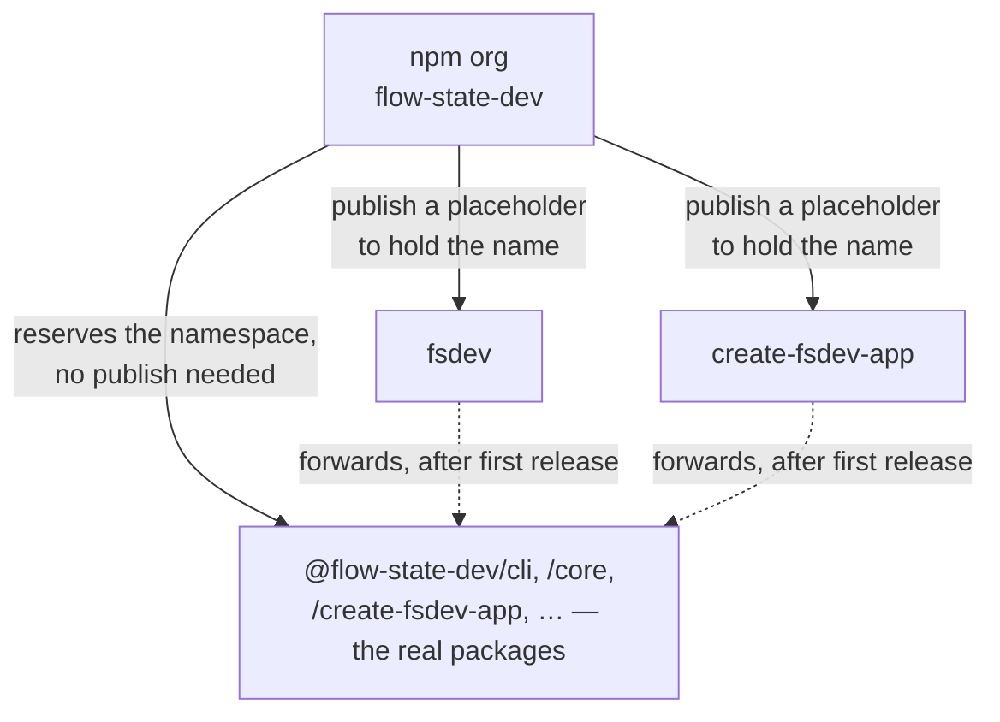

# FIX-1162: Claim the npm package names the launch needs — Implementation Spec

## Part I — The Case *(for the human)*

### 1. Problem — why it matters, why now

npm names go to whoever registers them first, and they are effectively unrecoverable. This
epic has written several into a launch plan without checking that any of them is ours.
Three facts, each executed against the registry on 2026-08-15 rather than read from the
issue's earlier comment:

**The scaffolding name is already gone.** `create-fsd-app` has belonged to an unrelated
project since 2024. The epic spec's transcripts and FIX-548 both name it.

**The short CLI name is still free.** `fsdev` is unregistered. It is the perishable asset
here, and it is the only one of the three that could be taken by someone else tomorrow.

**And the one that matters most: we may not own the namespace either.** Nothing under
`@flow-state-dev/` has ever been published, and whether that *scope* is registered to us
cannot be checked without the npm account. This is not a detail. FIX-1159's spec — already
approved — and FIX-548's, in review now, both say they will publish under "the scoped
package name we already own", and both treat that as the safe fallback for exactly the
short-name risk this issue exists to remove. An npm scope belongs to whoever registers the
matching organization first. If `flow-state-dev` is not ours, the fallback is not there
either, and two specs' central naming decision is resting on a premise nobody has verified.

**Why now** — the exposure is time-based, not effort-based. None of this is hard; it is
simply not done, and each day it stays undone is a day someone else can take a name already
committed to in an approved document.

### 2. Solution in plain terms

Register the npm organization `flow-state-dev`, which reserves the whole `@flow-state-dev`
namespace in one action and needs no publish at all. Then publish two tiny placeholder
packages to hold the two short names — a placeholder being the only way to hold an unscoped
name, since those are global rather than namespaced.

Then correct the one name that is provably wrong. `create-fsd-app` cannot be had, so the
short scaffolding name becomes `create-fsdev-app`, and FIX-548's scoped package is aligned
to match rather than shipping under one brand with an alias under another.

What this deliberately does *not* do is change how anything is invoked. FIX-1159 and FIX-548
have both already decided to ship under scoped names, with the short names as a later alias.
That decision is sound and this spec leaves it alone; it secures the short names so the
option exists, and no more.

**Philosophy** — tenet 3 (earn every addition): this adds no framework surface at all. The
two placeholder packages exist to be deleted, and the spec names who deletes them. Tenet 1
(coherence): the epic's transcripts promise `npx fsdev init` while its approved sub-spec
prints `npx @flow-state-dev/cli init`. That disagreement is surfaced here as decision 3
rather than quietly resolved in one direction.

### 6. Decisions & rules — the sign-off surface

1. **The `@flow-state-dev` namespace is claimed as an npm *organization* named
   `flow-state-dev`, not under a personal npm account.**
   *Rejected:* claiming it under one person's npm user, which reserves the namespace
   identically and takes thirty seconds less.
   *Locks in:* every package we ever publish lives under an account more than one person can
   administer. The bill for getting this wrong arrives the day a security release has to go
   out and the individual account holder is unreachable — recoverable, but through npm
   support, on npm's timetable rather than ours.

2. **The scaffolding tool is branded `fsdev`, not `fsd`: unscoped `create-fsdev-app`, and
   FIX-548's scoped package renamed from `@flow-state-dev/create-fsd-app` to
   `@flow-state-dev/create-fsdev-app` to match.**
   *Rejected:* keeping the scoped name as `create-fsd-app` and aliasing it to a differently
   branded short name — which is where FIX-548's current spec lands by default, since the
   unscoped `create-fsd-app` it planned to alias to is unobtainable. Also rejected:
   `create-flow-state-app`, which reads as a different product from the `fsdev` command it
   wraps.
   *Locks in:* the name a stranger types to start a project, in one brand rather than two.
   FIX-548 is in spec review and has built nothing, so this costs an edit today; after that
   spec is approved it costs a re-spec, and after launch it is a broken command in published
   material.

3. **The launch's headline command stays the scoped one. The short names are secured now and
   graduate later, in the issues that own them.**
   *Rejected:* making `fsdev` the real CLI package now so `npx fsdev init` works at launch,
   which is what the epic's own transcripts promise.
   *Locks in:* a slightly longer first command in launch material, in exchange for not
   reopening an approved spec weeks before the launch. The epic's transcripts need
   correcting either way; this decides which direction they are corrected in.

**Non-goals** — renaming `@flow-state-dev/cli`, changing anything in FIX-1159's approved
design, the scaffolding tool itself (FIX-548), and releasing the framework packages. This
spec claims names; it ships no software.

**Size:** Small — 6 production files · 0 CI test behaviours · 0 doc surfaces · 1 PR.

---

### 3. Tradeoffs & alternatives

**The alternative I most nearly recommended: rename the CLI to unscoped `fsdev` now**, so
the epic's headline `npx fsdev init` actually works. It is the better end state — one
package carrying the name people type, rather than a scoped package plus a forwarding alias
kept in version lockstep — and the cheapest moment to do a rename is before anything is
published. Rejected for timing, not for merit. FIX-1159's spec is approved and its
transcripts, decisions, and dependency argument are all built on the scoped name; reversing
that from a name-registration issue would churn an approved design, and the short package
cannot forward to anything until the scoped one is published anyway. It belongs after the
first release, and §12 records it.

**The simpler approach: create the organization and publish nothing.** Genuinely tempting,
and it handles the largest exposure in one free action. Insufficient because an organization
reserves only the `@scope`. Unscoped names — what `npx fsdev` resolves against — are global,
and the only way to hold one is to publish a version under it.

**Where the complexity is:** not the placeholders, which are a `package.json` and a shebang
each. It is that **only an actual publish proves a name is claimable.** A 404 means
unpublished, which is the strongest signal obtainable without credentials, but npm
separately rejects names it judges too similar to an existing package after stripping
punctuation. `create-fsdev-app` reduces to `createfsdevapp` against the taken `createfsdapp`,
so it should pass — "should" is the honest word, and §12 carries the fallback order.

### 4. Focus practices (1–5)

1. **BP-003 (verification evidence)** — every availability claim here was executed against
   `registry.npmjs.org`. The one that could not be executed, namespace ownership, is stated
   as unverified rather than assumed. That distinction is the whole finding in §1: two specs
   assumed it.
2. **Tenet 1 (surface incoherence, don't route around it)** — the epic and its approved
   sub-spec disagree about the headline command. Decision 3 picks a side and says so, rather
   than letting two documents stay quietly inconsistent until launch copy is written from
   the wrong one.
3. **Tenet 3 (subtract as you go)** — both placeholders are temporary by construction. §8
   names who deletes each one and when, so they cannot become permanent packages nobody
   remembers publishing.

### 5. What using it looks like (1–5 examples)

Nothing about how code is written against the framework changes. Two observable effects,
both at the command line.

**What the placeholders do between now and launch.** Anyone who types the short command
early gets a straight answer instead of npm's "could not determine executable to run":

```
$ npx fsdev init
flow-state-dev is not released yet. See https://flow-state.dev
$ echo $?
1
```

**Starting a project, once FIX-548 ships** *(the name decision 2 settles — the left column
is FIX-548's current spec):*

```
before   npx @flow-state-dev/create-fsd-app my-app
after    npx @flow-state-dev/create-fsdev-app my-app
later    npx create-fsdev-app my-app          # the short alias, once it forwards
```

## Part II — The Build Plan *(for the implementing agent)*

### 7. Technical design

The organization is the root of everything. It reserves the namespace with no publish; each
unscoped name needs a published version of its own.



- **The placeholders live outside every pnpm workspace glob.** `pnpm-workspace.yaml` matches
  `packages/*`, `apps/*`, `examples/*`, `labs/*`, `goals` — so a placeholder under
  `packages/` becomes a workspace package, and the changesets release pipeline would publish
  it alongside the framework's first release. Put them where no glob reaches
  (`tools/npm-names/<name>/` is a suggestion; the path is the implementer's) and publish each
  by hand, once.
- **Each placeholder is three files:** a `package.json` (name, version, `bin`, `files`,
  `license`, `repository`, `publishConfig.access: public`), a plain `bin.js` with a shebang
  that prints one line and exits non-zero, and a `README.md` saying what the package is for
  and who deletes it. No TypeScript, no build step, no dependencies.
- **A `bin` rather than a bare package** is deliberate. Without one, `npx fsdev init` fails
  with npm's own message about not finding an executable, which reads as our tooling being
  broken rather than unreleased.
- **Untouched:** every workspace package, the release pipeline, CI, and `packages/cli`.

**Solution sketch — pseudocode. Illustrative, not the contract.**

```
tools/npm-names/fsdev/
  package.json   name: fsdev · version: 0.0.1 · bin: { fsdev: ./bin.js }
                 files: [bin.js] · no dependencies · no build
  bin.js         #!/usr/bin/env node
                 print "flow-state-dev is not released yet. See <site>"
                 exit 1
  README.md      why this exists · the one-time publish command ·
                 "FIX-1159 deletes this when the real package takes the name"

tools/npm-names/create-fsdev-app/   — same three files, deleted by FIX-548
```

### 8. Implementation sequence

1. **Write both placeholder directories** outside the workspace globs, per §7. *Test:*
   `node bin.js` prints the line and exits 1; none in CI (§10). *Depends on:* nothing.
2. **Empty changeset.** Nothing here is published by the pipeline and no workspace package
   changes, so `pnpm changeset --empty` (BP-022). *Depends on:* 1.
3. **Raise the two cross-cutting corrections where they belong**, as comments rather than
   edits from this branch: decision 2 on FIX-548's spec PR (#1312, in review, so the change
   is an edit rather than a re-spec), and §1's namespace finding plus decision 3's
   headline-command call on the epic PR (#1301), whose transcripts and running index still
   say `npx fsdev init` and `create-fsd-app`. *Depends on:* nothing.
4. **Hand the three npm actions to the owner** — create the organization, publish `fsdev`,
   publish `create-fsdev-app`. No agent in this epic holds the credentials, and §10 is how
   the result is verified. *Depends on:* 1.
5. **No removals in this change.** The two removals this spec commissions are the
   placeholder directories themselves: FIX-1159 deletes `fsdev`'s when the real package takes
   the name, FIX-548 deletes the scaffolder's. §12 records both so neither becomes a package
   nobody remembers publishing.

### 9. Edge cases & error handling

| Case | Expected |
|---|---|
| The `flow-state-dev` organization name is already taken | Stop and escalate. Every package name across the epic is then wrong, and two specs' fallback plan is gone — this is the finding in §1 turning real, not an implementation problem. |
| npm rejects `create-fsdev-app` as too similar to `create-fsd-app` | Fall to the next name in §12's order, record which was used, and revisit decision 2's scoped half so the two still match. Only a real publish attempt can surface this. |
| npm rejects `fsdev` as too similar to the taken `fsd` / `fsdev-cli` | Escalate rather than downgrade. §12 has no acceptable fallback, and the epic's headline command would need rewording rather than renaming. |
| The placeholder's version is later reused by the real package | Rejected by npm permanently — a published version can never be republished, even after unpublishing. The real package's first release must be strictly above the placeholder's. |
| A placeholder needs withdrawing | Possible within 72 hours; after that only while it has no dependents and under 300 weekly downloads. Treat the first publish as final. |
| Someone later adds `tools/*` to `pnpm-workspace.yaml` | The next release publishes two placeholders as framework packages. The placeholder READMEs say so; no CI guard, because both directories are deleted long before that is plausible. |

**Taxonomy:** every failure here is a naming failure, and each is fatal to its step rather
than retryable — a name is claimable or it is not. None degrade.

### 10. Testing strategy

**Goal:** the names resolve to us, from outside our machines. In an empty directory, with no
FSD anything installed:

```
npx -y fsdev@latest            → prints our notice, exits 1
npx -y create-fsdev-app@latest → prints our notice, exits 1
npm view fsdev maintainers     → our account
npm org ls flow-state-dev      → our members
```

That is the whole proof, and only the credential holder can run it, after the publish. Run
it once and record the output on the Linear issue — that record *is* the deliverable the
issue asked for ("which names were secured as wanted vs. which needed a fallback").

**CI specs: none, deliberately.** Each placeholder is one `console.log` and one exit code
with no branches. The only assertion worth making is *does npm consider this name ours*,
which is a fact about a remote registry and unreachable from CI. A test asserting that a
print statement prints would encode nothing about why this change matters.

**Discipline:** neither `tdd` nor `diagnose`. There is no behaviour to drive out; the change
is two stub packages plus three manual registry operations.

### 11. Documentation plan

**No docs changes required**, and this is a real answer rather than a punt:

- Nothing user-facing changes. Decision 3 keeps every documented command exactly as
  FIX-1159's and FIX-548's approved and in-review specs already write it, and the
  placeholders exist to be replaced — documenting one would tell a reader to run a command
  whose only output is that it does not work yet.
- The two documents that *are* wrong — the epic spec's transcripts and running index, and
  FIX-548's spec — are not `apps/docs` pages and are not edited from this branch. §8 step 3
  raises both where their owners can act on them.
- The install lines across `apps/docs/docs/cli/overview.md`, `apps/docs/docs/api/cli.md`,
  `apps/docs/docs/devtool/setup.md`, `packages/cli/README.md` and the root `README.md`
  change only if the §12 follow-up rename happens, which is after the first release.

### 12. Dependencies, open questions & follow-ups

**Dependencies:** the npm account and its 2FA. No agent in this epic holds them, so step 4's
three actions sit with the owner. Nothing in the repo blocks this issue.

**What this issue owes its siblings.** FIX-548 planned to alias the unscoped `create-fsd-app`
"if and when FIX-1162 secures it" — it cannot be secured, which is decision 2. FIX-1159's
dependency section is correct that this issue does not block it, and stays correct under
decision 3.

**Premise correction for the epic (raised on #1301, #1310, #1312, not edited here).** Both
sibling specs describe publishing under "the scoped package name we already own." Nothing
under `@flow-state-dev/` is published and the namespace's ownership is unverified. The
sentence is safe to keep only once decision 1 is executed; until then it asserts something
no one has checked.

**Fallback order, if a name is rejected at publish time.** All verified free on 2026-08-15:

- Scaffolder: `create-fsdev-app` → `create-flow-state-app` → `create-flowstate-app` →
  `create-flow-state-dev-app`.
- CLI short name: none acceptable. `fsd`, `fsd-cli`, `fsdev-cli`, `flowstate` and the
  unscoped `flow-state-dev` are all taken by unrelated projects. A refusal on `fsdev` is
  escalated, not silently downgraded — it changes what the launch can promise.

**Open questions:** none. The issue's own "thin shim now, or a placeholder held until
launch?" closed on a fact rather than a preference: `@flow-state-dev/cli` is not published,
so a shim has nothing to forward to and "ship a real shim now" was never available.

**Follow-ups (flagged, not built):**

- **After the first release, revisit publishing the CLI as unscoped `fsdev`** rather than
  keeping a scoped package plus a forwarding alias — the alternative weighed in §3. The
  surface is enumerated so whoever picks it up inherits it (BP-034): the package name, the
  `tsconfig.base.json` path map, fourteen pending changeset fragments naming
  `@flow-state-dev/cli` (a fragment naming a package that no longer exists fails `changeset
  version`), the three docs-site pages and two READMEs in §11, and `pnpm --filter`
  invocations in four `.agents/skills/` files.
- **FIX-1159 deletes `tools/npm-names/fsdev/`** when the real package takes the name;
  **FIX-548 deletes `tools/npm-names/create-fsdev-app/`** on the same terms.

---

## Spec evolution

- **Spec drafted** — framed as claiming the npm names before someone else does, with the
  unclaimed `@flow-state-dev` namespace as the largest of the three exposures. Chose
  placeholder publishes over shipping real packages early, because the release pipeline
  publishes the whole workspace at once.
- **After reading the sibling specs** — dropped the recommendation to rename the CLI to
  unscoped `fsdev` in this issue, because FIX-1159's spec is already approved on the scoped
  name and FIX-548's in-review spec plans the same; reversing that from a name-registration
  issue would churn an approved design for a shorter command. It became the §3 alternative
  and a §12 follow-up. The same read turned up the real finding: both specs call it "the
  scoped package name we already own", and nobody has verified that we do.
</content>
