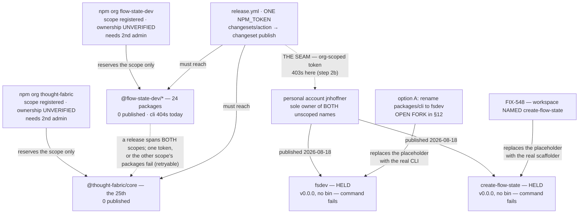

# FIX-1162: Claim the npm package names the launch needs — Implementation Spec

## Part I — The Case *(for the human)*

### 1. Problem — why it matters, why now

npm names go to whoever registers them first, and this epic wrote several into a launch plan
believing they were ours. **They are now — on 2026-08-18 the owner published the two that
onboarding depends on.** *Verified from the registry, not reported:*

| Name | Status | Maintainer |
|---|---|---|
| `fsdev` | **ours** — placeholder, **no `bin`** | `jnhoffner` |
| `create-flow-state` | **ours** — placeholder, **no `bin`** | `jnhoffner` |
| `flow-state-app` | unclaimed; treated as deliberate | — |

**Three things follow, and none of them is the race this issue was opened to run.**

1. **The naming decision stopped being urgent.** It is now an ordinary product call — what is the
   CLI's package called? — with our own first release as its only deadline. §12 re-derives it.
2. **Both names sit on a personal account, not an organization.** If CI publishes with an
   org-scoped token, the first release fails on exactly these two packages (§8 step 2b).
3. **A held name is not a working command.** Both are v0.0.0 with **no `bin`**, so `npm create
   flow-state` and a cold `npx fsdev` now fail *could not determine executable to run* instead of
   returning a clean 404. Only shipping real software under them fixes that.

**Still open, and it gates every publish:** the two *scopes* the release goes into are ours by
assertion only. Nothing is published under either (`@flow-state-dev/cli` 404s), npm hides member
lists, and §12 carries the two commands that settle it.

### 2. Solution in plain terms

Confirm both publishing organizations are ours — two read-only commands the owner runs (§12 is the
ask). Then close the ownership seam the placeholders opened: a second owner on each name, and a
release credential that can actually write to them.

**On the placeholders.** This spec argued against stand-in publishes on npm's
[dispute policy](https://docs.npmjs.com/policies/disputes); they exist now, so it records the world
as it is. The cure for the small residual exposure is to ship real software under both names, not
to undo anything — **and we keep both whichever way §12 goes** (a coordinator decision, §12), since
unpublishing is irreversible and hands a name back for nothing.

That leaves the rename, which §12 prices. **It is the *name* at stake, not the command** — `fsdev`
comes from the CLI's `bin` key and works under every option (§10, verified).

### 6. Decisions & rules — the sign-off surface

**One decision is live.** Two others are settled and sit in §6b: the organizations and their second
administrator, and the scaffolder's name. Both remain open to challenge; neither needs deciding
here.

3. **An unscoped name is claimed only by a package actually *named* that — so the live question
   is what ships under `fsdev`, not who holds it.** Publishing `@flow-state-dev/cli` would not have
   claimed the name; publishing a package named `fsdev` did. §12's fork is whether the CLI is
   renamed so the **real** software ships there, or we keep the scoped name and leave the
   placeholder idle.
   *Still rejected:* running the unmodified snapshot workflow to claim anything — it publishes the
   scoped names and risks 25 packages going public early (§9).

**Non-goals** — *executing* the CLI rename, changing FIX-1159's design, the scaffolding tool
itself (FIX-548), and releasing the framework packages. **Whether to rename is decided here; doing
it is not.**

**Size.** *This issue:* 0 production files · 0 CI test behaviours · 0 doc surfaces · 1 PR (an empty
changeset and the Linear record). *What it commissions —* **every option:** 2 blocking issues, the
ownership seam (step 2b, filed as FIX-1186) and the release-plan repair (step 5c). **Option A:**
plus the rename — 34 files / 49 references, 1 PR. **Option C:** nothing further. **Option B is
retired** (§12).

---

### 3. Tradeoffs & alternatives

**Renaming the package is the only way our *software* ends up under `fsdev`.** The name is held,
but Changesets publishes each workspace under its own `package.json` name, and no workspace is
named `fsdev` — it is the CLI's `bin` key, which the registry never sees. *(Verified: all 39
workspace names read; 25 non-private; none is `fsdev`.)* So the placeholder stays a placeholder
until a workspace carries the name. §12 prices that rather than deciding it.

It is also the better end state — one package carrying the name people type, the shape `vite`,
`prisma` and `next` all use — and the cheapest moment to rename is before anything is published.

**Two constraints that shape the fork, derived in Part II:** no release can be assembled at this
commit at all (step 5c), and the release credential cannot currently be shown to reach either
unscoped name (step 2b). Both bind under every option, so neither is an argument for one branch of
the fork over the other.

### 4. Focus practices (1–5)

1. **BP-003** — every claim was executed against the registry, the repo, or a pinned dependency's
   source, including claims handed to me as settled. Several came back different.
2. **Tenet 7 (a green check aimed at a neighbour of the claim)** — this spec produced several
   itself, which is why §10 carries commands rather than lists. "404 on the registry" answered
   *is this registered* and was read as *can we have it*; "the CLI's bin is `fsdev`" answered
   *what command do users get* and was read as *do we own the name*.
3. **Tenet 1 (surface incoherence)** — the owner reported owning names the registry showed as
   unheld; recorded as an open contradiction with the command that settles it, not averaged away.

### 5. What using it looks like (1–5 examples)

Nothing about writing code against the framework changes. The one observable effect is the name a
stranger types to start a project, once FIX-548 ships *(left column is FIX-548's current spec)*:

```
before   npx @flow-state-dev/create-fsd-app my-app
after    npm create flow-state my-app     # one unscoped package, no scoped twin
         npx create-flow-state my-app     # the same package, spelled out
```

**Both of those commands are worse today than they were last week, and that is the placeholders'
doing.** `npm create flow-state my-app` used to fail with a clean 404 — *not released yet*. It now
resolves `create-flow-state`, downloads our v0.0.0 package, finds **no `bin`**, and fails with
*could not determine executable to run* (*verified from the packument: no `bin`, no `main`, no
`files`*). Same for `npx fsdev` in a fresh directory. **The name being ours does not make the
command work; only shipping real software under it does** — FIX-548 for the scaffolder, and §12's
fork for the CLI.

Once `@flow-state-dev/cli` *is* installed, `npx fsdev` runs our CLI from its `bin` key regardless,
under every option (§10, verified). That has never depended on the unscoped name.

## Part II — The Build Plan *(for the implementing agent)*

### 6b. Settled decisions

Ratifications rather than open questions, kept here so Part I carries only the live fork. Both are
still open to challenge — a reviewer who thinks either is wrong should say so.

1. **Both namespaces are held as npm organizations, and neither counts as secured until a second
   administrator or owner is on it.** There are two: `flow-state-dev` and `thought-fabric`.
   A second *developer* does not satisfy this — only `admin` or `owner` can manage an org, so §10
   asserts the role rather than counting members.
   *Rejected:* claiming under one person's npm user — identical reservation, no redundancy.
   *Why it is settled:* it follows from wanting to publish at all. An organization one person can
   administer strands every package the day that person is unreachable.

2. **The scaffolding tool is ONE package, published unscoped as `create-flow-state`, with no
   scoped twin.** `npm init foo` resolves to `create-foo`, so the unscoped name both gets claimed
   and powers the command; a scoped twin would claim nothing extra and add a permanently
   version-locked surface. FIX-548's workspace is therefore *named* `create-flow-state`.
   *Rejected:* a scoped package plus an unscoped forwarder; `create-flow-state-app`, whose extra
   word the shorthand swallows anyway.
   **`create-fsd-app` is a third party's package and is not available to us in any form** — not as
   a forwarder, not as an alias, not as a fallback. *Verified: maintainer `keyready`, v1.1.2,
   published 2024-10-18, a React/Vite starter unrelated to this project.* Our owner's npm handle is
   **`jnhoffner`**, so the two are plainly different accounts. Republishing it would break real
   users' installs, and we could not do so anyway.
   *Why it is settled:* the owner chose the name, and the registry has since confirmed it —
   `create-flow-state` is now published under `jnhoffner` (§1).

### 7. Technical design

There is no code in this issue. The design is which name is claimed by what, and when.



- **The names are held; the ownership around them is the work.** The claiming half is done. What
  this issue executes is confirming the two scopes are ours and closing the seam the placeholders
  opened — a second owner on each name, and a release credential that can write to them.
- **A scope is not an unscoped package name, and neither is a `bin` key.** Still the design's
  load-bearing distinction, and it now cuts the other way: holding the org `create-flow-state`
  gave **no** rights over the package `create-flow-state` — publishing it did. Separately, npm
  registers what is in a package's `name` field, so `packages/cli` publishing as
  `@flow-state-dev/cli` would have claimed nothing on `fsdev`; a package literally named `fsdev`
  claimed it.
- **Package ownership and organization membership are different objects**, which is the seam in
  the diagram. A second org *admin* does nothing for a package owned by a personal account, and
  `npm owner add` on a package does nothing for the org. Step 2b does both.
- **The placeholders are not the product.** Both are v0.0.0 with no `bin`, so every advertised
  command still fails; only FIX-548 (for the scaffolder) and §12's fork (for the CLI) change that.
- **Nothing is committed to the repo.**
- **Untouched:** every workspace package, the release pipeline, CI, and `packages/cli`.

### 8. Implementation sequence

**The dividing line is whether a step changes account state, not whether it touches npm.** A
read-only lookup leaves nothing behind and can be undone by closing the terminal, so it does
not wait on approval — and it cannot, because its output is what §12 asks you to approve
*on*. An account mutation is externally visible and is what approval gates. *(The previous
draft put every step after approval, which deadlocked against §12 asking for a lookup before
it. Split here; the lookups moved up.)*

**Before approval — read-only evidence gathering only. Nothing is written, on npm or in the
repo:**

1. **Confirm *both* publishing organizations are ours** — `npm org ls flow-state-dev` **and
   `npm org ls thought-fabric`.** *Test:* §10's block 1. *Depends on:* nothing. Two commands, one
   per scope: 24 of the 25 publishable workspaces are `@flow-state-dev/*` and the 25th is
   `@thought-fabric/core`. **Both must come back ours before step 2** — approving account
   mutations on one organization while the other is unverified would leave the scope a quarter of
   the release publishes under unchecked. §12 is the ask.

1b. **Re-check the two unscoped names, and assert the *maintainer* rather than the status code.**
   *Test:* §10's block 1b. *Depends on:* nothing; metadata-only, so it is safe to re-run at any
   time. A name held on 2026-08-18 is not a name held on approval day, and **the owner's own
   history cannot prove a third party has not published since.** The assertion is
   `maintainers == ["jnhoffner"]` on both `fsdev` and `create-flow-state` — **not** a 200, because
   a 200 is exactly what someone else's package returns too. That is the whole point of the check:
   it must be able to come back *someone else's*, or it is not a check. **Re-run it immediately
   before commissioning the rename** — a 34-file rename around a name that changed hands is the
   failure this exists to prevent.

**After approval — account mutations, repository changes, and outbound corrections:**

2. **Add a second administrator or owner to *both* organizations — `flow-state-dev` and
   `thought-fabric`.** *Test:* §10's block 2. *Depends on:* spec approval, and on step 1 coming
   back saying each org is ours. An org that publishes one package still strands that package if
   its sole administrator is unreachable.

2b. **Close the personal-account seam on the two published names.** *Test:* §10's block 2b.
   *Depends on:* spec approval. `fsdev` and `create-flow-state` are owned by the personal account
   **`jnhoffner`**; the scopes are different objects with different ownership. **It has two halves,
   and they are conditional differently — an earlier draft made the whole step unconditional and
   could not say why.**

   - **Second owner on both names — unconditional, under every option.** A held name with one
     owner is stranded the day that person is unreachable, and that is true of a name we ship
     under *and* of one we merely hold. **This half is unconditional only because we keep both
     placeholders under every option** — a coordinator decision recorded in §12 as reversible. If
     that is ever revisited and `fsdev` retired, this half goes with it. *Carries:* `npm owner add` on each. *Done when:* `npm owner ls` shows more than one
     account for each.
   - **Release-token write access — `create-flow-state` always, `fsdev` only under option A.**
     FIX-548 publishes the scaffolder whatever the CLI ends up being called, so its name must be
     writable by CI regardless. Nothing publishes `fsdev` under C, so no token needs to reach it
     there. **`release.yml` publishes through `changesets/action@v1` running `pnpm release:ci` →
     `changeset publish --provenance`, with a single `NPM_TOKEN`** *(verified by reading the
     workflow and `package.json`)*, so that one token must reach both scopes plus whichever
     unscoped names the chosen option publishes. A token authorised only for the orgs publishes
     the scoped packages and fails on exactly the ones onboarding depends on — and per §9 the run
     does not abort, it exits 1 with a partial release. *Done when:* the proof in §10 block 2b has
     run, which is **an action, not a query.**

   **Filed as [FIX-1186](https://linear.app/fixpoint-labs/issue/FIX-1186), which *blocks FIX-548* —
   the issue that actually publishes `create-flow-state`. It stays open through the first release,
   because a token can be rotated after any check passes.** *(Filed ahead of approval, unlike steps
   5 and 5c, because it is a live release blocker discovered after the placeholders went up rather
   than a consequence of the fork.)*
3. **Empty changeset**, created on the implementation branch. No workspace package changes and
   nothing here is published by the pipeline, so `pnpm changeset --empty` (BP-022). *Depends
   on:* spec approval. *(It sat before approval in an earlier draft. That was wrong twice over:
   it writes to the repo, and a fragment created on this never-merged spec branch would be
   stranded.)*
4. **Raise the cross-cutting corrections where they belong**, as comments rather than edits
   from this branch: decision 2 on FIX-548's spec PR (#1312, in review, so the change is an
   edit rather than a re-spec), and §1's namespace finding, the 404-is-not-a-green-light rule
   and decision 3's corrected claiming rule on the epic PR (#1301), whose transcripts and
   running index still say `npx fsdev init` and `create-fsd-app`. *Depends on:* spec approval.
5. **File the issue that delivers the *whole* selected outcome — via `issue-manager`, before this
   issue closes, and wire it as a blocker on the release it applies to.** This issue deliberately
   performs none of it (§6 non-goals), and no other spec in the epic owns it, so without this step
   the time-sensitive work is untracked while FIX-1162 completes on an org mutation and an empty
   changeset. *Depends on:* the §12 fork being answered.

   **Scope it to the option the owner picked, not just to the rename.** An issue that carries only
   the rename leaves the rest of the selected plan ownerless:

   | Picked | The issue must carry | Wired as |
   |---|---|---|
   | **A** | the rename — code, the 14 changeset fragments, **and the user-facing docs in the same change set** (five `apps/docs` pages, both READMEs; AGENTS.md:199–205) — closed by the inventory + `rg -nP` gate. **Plus replacing the `fsdev` placeholder with the real CLI**, which is the point of the exercise | **a blocker on the normal first release.** Under A the point is that the CLI is renamed *before* it is first published — if the release can run without it, `@flow-state-dev/cli` ships under the old name and choosing A bought nothing |
   | **B** | **retired** — see §12. Its only purpose was closing an exposure window that the placeholders closed | — |
   | **C** | nothing filed here — record the decision instead. Steps 2b and 5c still apply, and the `fsdev` placeholder stays published | — |

   **Under A the issue also carries the snapshot guard** (§9). Renaming the package gives
   `snapshot-release.yml` a side effect it does not have today: a dispatched snapshot would publish
   `fsdev` — and all 25 packages — before the release A promises to wait for. **The guard is
   operational, and it is the only one available:** an earlier draft offered adding the CLI to
   Changesets' `ignore` list as an escape hatch, which **does not work** — *verified: 10 of the 14
   CLI fragments also name other publishable packages, and the planner rejects mixed
   ignored/not-ignored fragments*, the identical failure `@flow-state-dev/ui` already causes. So:
   no snapshot dispatch between the rename landing and the first release, full stop.

   **Blocks:** no epic *command* depends on the unscoped name (§12), but under A this issue
   **blocks the first release**, which is a different thing and an earlier draft conflated them.

5c. **File the release-plan repair — unconditionally, under every option.** *Verified by reading
   the fragments:* six pending changesets pair the private, version-less `@flow-state-dev/ui` with
   publishable packages, and **both** workflows call the same planner, so **no release can be
   assembled at this commit at all.** Earlier drafts filed this only under B, which left option A
   able to complete while the release it blocks on remained blocked by unfiled work — and left C
   with a broken release nobody owned either. It is not this issue's work to *do*, but by this
   spec's own rule it has to be someone's. *Definition of done:* `pnpm changeset status` exits 0.
   *Wired as:* a blocker on the first release, under every option.

*(**Step 5b is gone, absorbed into step 2b.** It existed because `npm owner add` "cannot run before
the packages exist and the publisher is CI." Both packages now exist, so ownership is fixable
today rather than deferred past a publish — which is strictly better, since the seam it guards is
now a live release blocker rather than a future one.)*

   **The epic-transcript correction in step 4 is conditional on the fork, not unconditional.**
   The transcripts say `npx fsdev init`, and what that should become depends on which package
   ends up published: **under C**, `npx @flow-state-dev/cli init` — the scoped package, which is
   what FIX-1159 already prints. **Under A**, the CLI package *is* renamed to `fsdev`, so
   `npx fsdev init` becomes correct as written and the transcripts need no change at all. Writing
   the scoped form in unconditionally would point the launch material at a package name the
   chosen plan never publishes. **So step 4 raises the ambiguity; it does not resolve it until
   the fork is answered.**
6. **Record the outcome on the Linear issue** — which names are secured *as unscoped packages*,
   which are held only as scopes, which are deferred under decision 3, which fork option was
   chosen, and the identifiers of the issues filed by steps 2b, 5 and 5c. That record *is* the
   deliverable the issue asked for. *Depends on:* 1, 1b, 2, **2b, 3, 4,** 5c — **and on step 5
   only under A.** Under C step 5 files no rename by design, and recording "option C chosen, no
   rename issue filed" *is* how step 5 is satisfied.
7. **No removals in this change**, and none commissioned in future ones.

**Handed on:** both unscoped names are now **held but not usable** — v0.0.0 placeholders with no
`bin`. `create-flow-state` becomes real software when FIX-548 ships (decision 2); `fsdev` becomes
real software only under option A. **Second ownership and the release token on both are step 2b's,
under every option, and that is a release blocker rather than a nicety.**

**A rule this issue keeps re-learning, worth stating once because this issue is the one that
hands work to the release: a step that exists but no issue owns does not happen.** Six instances
here — the rename nobody filed, the epic correction nobody made conditional, the release steps
under B nobody owned, the `npm owner add` deferred to a publisher that is CI, that same hand-off
then attached to an issue option C never files, and the release-plan repair filed only under an
option nobody is now choosing (step 5c). Every hand-off in this spec names an issue and a
definition of done, or it is not a hand-off.

**This issue is not done when the orgs have a second admin.** It is done when the fork is
answered, **the empty changeset is in (step 3), the sibling and epic corrections are raised
(step 4)**, the outcome is recorded, **the ownership issue (2b) and the release-plan repair (5c)
are filed and wired as release blockers**, and — under A — the rename issue exists with an owner
and a blocking link to the first release. Filed-but-not-blocking would let the release publish
straight past it. *(Steps 3 and 4 were missing from this sentence and from step 6's dependencies,
so the issue could have closed without either — the same "declared but unowned" shape this section
is about, one level down.)*

### 9. Edge cases & error handling

| Case | Expected |
|---|---|
| **npm refuses a name at publish time despite a 404** | The default assumption, not the surprise. It already happened to `flow-state`. A 404 means unregistered; the similarity check runs at publish and compares after stripping punctuation. **Stop and return to the owner for sign-off** (§12) — do not publish the next candidate. Record the refusal and never treat a registry check as a claim. |
| `create-flow-state` is refused for similarity to `flowstate` | Same shape as the `flow-state` refusal, one word further away. **Escalate, do not substitute:** every candidate name is also a different `npm create` command, so choosing one changes the advertised product surface. Surfaces at FIX-548's first publish, not here. |
| A name is held as a **scope/organization** but the unscoped package is still open | Not secured, and this is the epic's actual situation for four names. Different namespaces (§1). Anyone can still publish the unscoped name, and that is the name `npm create` resolves. Record it as open, not as claimed. |
| Someone reports having "bought a name" on npm | Ask which namespace. Registering an organization and publishing a package are both bought under the word *name*, and only the second claims what a user types. Confirm with `npm owner ls <name>`, never with a receipt. |
| The `flow-state-dev` organization turns out not to be ours | Stop and escalate. Every package name across the epic is then wrong, and two sibling specs' fallback plan is gone. |
| The `thought-fabric` organization turns out not to be ours, or the token is scoped to one org | The packages under the unauthorised scope simply fail to publish; the rest still go out. **Recoverable — and I overstated this last round.** *Verified in the pinned `@changesets/cli@2.30.0` source:* a failed publish returns `{published: false}` rather than throwing, so every package is still attempted (`Promise.all` over the unpublished set), the failures are listed and the command exits 1; and on a re-run `getUnpublishedPackages` queues a workspace only when `!publishedVersions.includes(localVersion)`, so **the retry attempts only what is missing.** The real cost is the window in between: published packages pin their siblings at exact versions, so anything depending on an unpublished package is uninstallable until the retry lands, and git tags exist for the successful subset only. Worth twenty seconds of lookup to avoid; not a disaster if it happens. `RELEASING.md:82,107` already requires both orgs and a token authorised for both; §10 block 1 checks both. |
| The first publish runs before the version baseline is set | Unintended initial versions, permanently. `RELEASING.md:84` requires the 0.1.0 launch baseline across all publishable packages first; today 23 of 25 sit at `0.0.0`, with `@thought-fabric/core` at `0.0.1` and `@flow-state-dev/chat-sdk` at `0.1.0`. Consuming the pending fragments off those numbers publishes a scatter of versions nobody chose, and no `name@version` can ever be reused. This is the one genuinely irreversible step in the issue, which is why setting the baseline and reviewing the diff is a stated prerequisite of the first release rather than a detail of it — this row is the failure that prerequisite exists to prevent. |
| **A snapshot is dispatched after the rename lands but before the first release** *(option A only)* | It claims `fsdev` — and makes **all 25 packages public**. `snapshot-release.yml:33-40` runs an **unfiltered** `changeset version --snapshot` then `changeset publish --tag`, and after the rename the **14 fragments that declare the CLI** *(verified: all 14 declare it in frontmatter, none merely mention it)* put `fsdev` in every release plan — so the dispatch registers the name at a canary version. **This is latent, not scheduled:** the workflow is `workflow_dispatch` only, so nothing fires it on its own, and **two defects block it today — of which option A repairs only one.** A clears the six mixed fragments at the normal release; it does **not** commission the workflow's missing `registry-url`/`.npmrc` (a §12 follow-up), without which the publish cannot authenticate at all. **Guard, owned by step 5's issue:** do not dispatch a snapshot between the rename landing and the first release — **operationally, because no config escape hatch exists.** *An earlier draft proposed adding the CLI to `.changeset/config.json`'s `ignore` for the window; verified false: 10 of the 14 CLI fragments also name other publishable packages, and Changesets rejects mixed ignored/not-ignored fragments — the same failure `@flow-state-dev/ui` already causes.* Splitting 10 fragments to enable a snapshot costs more than not dispatching one. |
| **CI publishes with a token that cannot write to `fsdev` / `create-flow-state`** | **The new most-likely release failure, and it lands on exactly the two packages onboarding depends on.** Both are owned by the personal account `jnhoffner`; the scopes are separate objects. `release.yml` publishes through `changesets/action@v1` with **one** `NPM_TOKEN` *(verified)*, so an org-only token publishes the 25 scoped packages and 403s on these two. Per the row above the run does **not** abort — it exits 1 with a partial release, and the half that fails is the half a new user touches first. **Prevented by step 2b, which is a release prerequisite under every option.** |
| **A user runs the advertised command against a placeholder** | `npm create flow-state my-app` and a fresh-directory `npx fsdev` now resolve, download a v0.0.0 package with **no `bin`**, and fail *could not determine executable to run* — worse than the old clean 404, because it looks like our software is broken rather than unreleased. *Verified from the packument: no `bin`, no `main`, no `files`.* **No fix short of shipping real software under both names**; until then, do not advertise either command as working. |
| **Someone disputes a placeholder as name-squatting** | Small but real, and self-inflicted (§2). npm's dispute policy names publishing "simply for the purposes of reserving [a name] for future use" as against the Terms. The cure is to ship, not to argue: a package with real software and real users is no longer a reservation. Until then, do not treat either name as unassailable. |
| `fsdev` is taken by someone else | **Retired as a live risk — we hold it as of 2026-08-18, and the placeholder stays published under every option** (a coordinator decision, §12, reversible). The one way it could return is unpublishing, which is why that is ruled out rather than left to judgement: the name would go back to the pool and npm "does not resolve squatting claims on demand", transferring names only on a trademark or IP claim. **Our `fsdev` command was never exposed to this** — it comes from the CLI's `bin` key (§12, verified). The `@fsdev` scope belongs to someone else, so `@fsdev/cli` was never a fallback. |
| Someone reads a `bin` name as a claim | It is not one. `packages/cli` exposes the `fsdev` command while being published as `@flow-state-dev/cli`; the registry only ever sees the `name` field. This is the mistake that produced the retired early-publish option (§3). |
| A name is claimed but only one account can publish it | Not yet secured. Creating the organization does not confer ownership of an unscoped package; `npm owner add` does. |
| A second org member is added as a `developer` | Not yet secured. Only `admin` or `owner` can manage the organization, which is the failure decision 1 exists to survive. |
| Someone proposes holding a name with a stub after all | Refuse and point at the clause in §2. Against npm's terms, and the weakest claim available. |

**Taxonomy:** the *naming* failures are each fatal to their step rather than retryable — a name
is claimable or it is not, and none degrade. **Publication failures are the exception and behave
the opposite way:** a Changesets run that publishes some packages and fails on others is
retryable, and the correct response is to fix the credential and re-run, which publishes only what
is missing (row 3, verified in the pinned source). Do not treat a partial publication as a dead
end.

### 10. Testing strategy

**Goal:** we can state, per name, whether we hold the unscoped package, only the scope, or
neither — and that **both** namespaces the release publishes into are ours and administrable by
more than one person. Only the credential holder can run the first two blocks.

*Block 1 — read-only, runs before approval (step 1).* Nothing here writes; this is the
evidence §12's ask is asking for. **Two commands**, one per scope, because the owner has already
answered the rest: no package was ever published, so every unscoped name is open and needs no
lookup.

```
npm org ls flow-state-dev    → lists our members  → the org is ours (24 of 25 packages)
                             → error / not found  → it is NOT ours; stop and escalate

npm org ls thought-fabric    → lists our members  → @thought-fabric/core can publish
                             → error / not found  → settle it before publishing. A retry
                                                    does fix a partial release, but the
                                                    gap leaves siblings uninstallable
```

**Both are a publish gate, not just an approval gate.** 24 of the 25 publishable workspaces are
`@flow-state-dev/*` and one is `@thought-fabric/core` (*verified by reading every workspace
manifest*), and `RELEASING.md:82` and `:107` already require both orgs and a token authorised for
both scopes. Checking one scope and publishing into two is how a release stops half-finished.

*Block 1b — read-only, no credentials, runs before approval and again before commissioning the
rename (step 1b).* **Assert the maintainer set against a recorded roster — never the status code,
and never a bare singleton.**

```
roster = the accounts FIX-1186 records as approved owners of these two names.
         Today: {jnhoffner}. Step 2b adds a second account and updates it there.

npm view fsdev maintainers              → set(maintainers) == roster  → ours; proceed
npm view create-flow-state maintainers  → set(maintainers) == roster  → ours; proceed
                                        → an account not in roster    → STOP. Do not commission
                                                                        the rename; return to §12.
                                        → a roster account missing    → STOP. Someone removed an
                                                                        owner; treat as hostile.
                                        → 404                         → the package is gone.
                                                                        Stop and ask.
```

**Three ways to get this assertion wrong, and the previous draft picked one of them.** It asserted
`maintainers == ["jnhoffner"]` — a bare singleton — which **step 2b breaks by design**: 2b adds a
second owner, after which the exact-singleton check takes its own STOP path on a package that is
perfectly healthy. A gate that fails after the fix it is sequenced behind is not a gate. The
obvious repair is worse: asserting merely that `jnhoffner` **appears** would pass for any superset,
including one a stranger was added to — the same failure one step over. **Set equality against a
recorded roster is the shape that fails in both directions**, on an unexpected account appearing
and on an expected one vanishing.

**And never on the status code.** A 200 means *some* package exists at that name — exactly what a
stranger's package returns — so a 200 assertion would pass most loudly in the one scenario the
check exists to catch.

**Recorded result, 2026-08-18:** both return exactly `["jnhoffner"]`, `latest` = `0.0.0`, published
21:55–21:56Z. *(Controls: `flow-state-app` → 404, `create-fsd-app` → `keyready`. The command
distinguishes ours, unclaimed, and someone else's.)*

*Block 2 — after approval, and it is the only assertion on a mutation (step 2).* Assert the
**role**, not the member count:

```
npm org ls flow-state-dev    → at least one member besides the primary holder
                               showing `admin` or `owner`
npm org ls thought-fabric    → the same assertion, on the second org
```

*Block 2b — after approval, on the two published names (step 2b).* Two different properties, and
only the first can be settled by a query:

```
redundancy — a query, and it is sufficient:
npm owner ls fsdev              → more than one account listed
npm owner ls create-flow-state  → more than one account listed
                                  (today: jnhoffner alone — this is the seam)
```

**Publishability cannot be proved by any read-only command, and the previous draft claimed
otherwise.** It reached for `npm access list packages <account>` — but *(verified against the
installed npm 10.9.7)* that command's operand is **`[<user>|<scope>|<scope:team>]`**, an *account*,
not a token. It reports what a **user** may access, so a read-only or granularly-restricted
`NPM_TOKEN` belonging to that same user returns a clean green while being unable to publish
anything. That is the exact scenario FIX-1186 exists to catch, and the gate was blind to it.
`npm token list` does not close the gap either: it enumerates the *caller's own* classic tokens,
not CI's, and granular access tokens are managed outside it.

**So the gate is an action, not a query — the only thing that proves a token can publish a package
is publishing with it:**

```
1. CONFIGURE (not check): grant the release credential's account read-write on both
   unscoped names — `npm owner add <that account> fsdev`, same for create-flow-state —
   or, for a granular token, select both packages explicitly when minting it.

2. PROVE, through release.yml's own credential, never a human login:
   publish a throwaway patch of each placeholder — fsdev@0.0.1, create-flow-state@0.0.1,
   same do-nothing content.
      → succeeds → the token can publish these names. This is the evidence.
      → 403      → exactly the release failure, surfaced now instead of mid-release.
```

**This is cheap only because they are placeholders**, which is the one advantage of the situation:
it burns a version number on a package that carries nothing, and we are keeping both packages
regardless. Run it with the CI credential — a human's `npm login` proves the wrong thing (tenet 7).

**Residual, stated rather than papered over:** even this proves the token could publish *those two
names on that day*. Token rotation or a scope change after the proof re-opens the gap, which is why
FIX-1186 stays open through the first release rather than closing on a green result.

*Cross-check without credentials*, which is what produced §1 and what anyone can re-run:

```
curl -s -o /dev/null -w '%{http_code}\n' https://registry.npmjs.org/<name>
      → 200 = published, 404 = unregistered (NOT "available")
curl -s https://registry.npmjs.org/-/org/<name>/user
      → {"error":"Scope not found"} = not registered
      → {"someuser":"owner"}        = registered, owner publicly listed
      → {}                          = registered, members NOT public — this is what
                                      BOTH @flow-state-dev and @thought-fabric return,
                                      and it is why block 1 cannot be replaced by a curl
                                      (control: an invented scope returns "Scope not found",
                                       so {} is a real answer, not an empty one)
```

*Already executed — the check that re-priced §12's fork, recorded so it is not re-argued.*
Whether the `fsdev` **command** depends on the unscoped **name** is a mechanism question, and it
had been answered wrong twice from reasoning. Run on npm 10.9.7 / Node 22.22.2, 2026-08-18, with
no network publish and no unscoped `fsdev` in existence:

```
1. pack a package named @<anything>/cli whose package.json carries our CLI's own
   bin key — "bin": { "fsdev": "./dist/bin.js" }
2. npm install that tarball into an empty consumer project
   → creates node_modules/.bin/fsdev  ✓
   → npx fsdev · npm exec fsdev · npm exec -- fsdev   all run it  ✓
3. npm install -g the same tarball
   → puts a bare fsdev on PATH  ✓
4. in a directory with nothing installed, BEFORE the placeholders existed:
   npm view fsdev version   → 404, the name was unheld at the time
   npx fsdev                → npm error 404  'fsdev@*' is not in this registry   ✗
```

**Step 4's guard is now obsolete, and saying so matters more than the step.** It read: *run
`npm view fsdev version` first; if it returns anything but a 404, stop, because the name is a
stranger's.* Since 2026-08-18 that lookup returns `0.0.0` under `jnhoffner` — **so the guard trips
every time, on a name that is ours.** A stop-condition that fires unconditionally is not a
safeguard, it is a broken step. **Do not re-run step 4:** it is a recorded historical observation,
not a live check, and steps 1–3 are the load-bearing ones anyway. The rule it came from survives
unchanged and now sits in the deferred block below — never `npx` an unscoped name we do not own —
it simply no longer applies to these two names.

Conclusion, which §12's fork still rests on: **the `bin` key carries the command; the unscoped
name carries only the cold-start invocation.** Steps 1–3 are the load-bearing ones, are unaffected
by the placeholders, and are always safe to re-run; they take about a minute and need no
credentials.

*Deferred to the release that ships real software under these names.* Ownership itself is no
longer deferred — the packages exist, so block 2b runs now (step 2b). What still has to wait is
proving the published thing *works*:

```
after the first real publish, under EVERY option — create-flow-state is FIX-548's:
npx -y create-flow-state@latest my-app   → scaffolds a project

after an option-A publication of fsdev — nothing to run under C:
npx -y fsdev@latest --help               → the real CLI's help output
```

**Both must assert on behaviour, not on exit status, and that is a new requirement.** The standing
rule was *never `npx` an unscoped name we do not own*; we now own both, so the rule permits these
commands. But **we own placeholders** — v0.0.0, no `bin` — so today `npx -y fsdev@latest` fetches
our own package and fails *could not determine executable to run*. A check that accepts "it ran"
would go green on a nonexistent CLI the day someone points it at the wrong version. Assert on the
help text and on a scaffolded project, or do not run the check.

**The rule itself still holds and still generalises:** never `npx` / `npm exec` an unscoped name we
do not own — `npm exec` fetches and runs a missing package, and `-y` suppresses the prompt that
would otherwise be the last thing between us and a stranger's postinstall. Both names stay ours
under every option, so the rule no longer bites on either.

Record block 1's output on the Linear issue — that record *is* the deliverable the issue
asked for.

**CI specs: none, deliberately.** This change commits no code. The only assertion worth making
is *does npm consider this namespace ours*, which is a fact about a remote registry and
unreachable from CI.

**Acceptance step, if §12's fork takes the rename (option A).** The rename is **not done
when the list in §12 is exhausted** — it is done when the repo has no stale references left.
That inventory has been wrong twice, both times because someone re-checked the categories
already on the list instead of the repo, so the list is a starting point and this search is the
gate (BP-034, tenet 7):

```
# run from the REPOSITORY ROOT — rg searches the working directory
rg -nP '@flow-state-dev/cli(?![A-Za-z0-9_-])' --hidden \
   -g '!node_modules' -g '!.git' -g '!dist' -g '!spec/**'
      → must return ZERO matches. No exceptions — see the changelog note below

# coverage control — SAME flags, SAME directory, run immediately after.
# The 24 packages that keep the scope must still match:
rg -nP '@flow-state-dev(?![A-Za-z0-9_-])' --hidden \
   -g '!node_modules' -g '!.git' -g '!dist' -g '!spec/**' -l | wc -l
      → ~2,000 files. Anything in the tens means the search was aimed at a
        subtree, and the zero above is meaningless
```

**`packages/cli/CHANGELOG.md` is renamed, not exempted — an earlier draft had this backwards.**
Its single match is **line 1, `# @flow-state-dev/cli`**, which is the file's *live* top-level
heading, not a historical entry: Changesets appends every future release underneath it, so leaving
it would file `fsdev`'s releases under the retired name forever. Rename the heading to `# fsdev`.
The dated entries below it stay exactly as they are — they describe what the package was called at
the time, which is what a changelog is for — and none of them matches the search anyway *(verified:
the file has exactly one match, at line 1)*. That is why the gate above now takes no exception.

**The control is not ceremony — it is the specific way this gate fails.** A search that returns
zero because it was run one directory down passes exactly like a finished rename. *(Measured
2026-08-18: from the repo root the control returns 2,017 files; from `packages/core` the gate
itself returns 1 file instead of 34, and from a package with no CLI reference it returns a clean,
worthless zero.)* Run both lines together or neither.

**`-P` is required, not decoration:** rg's default engine rejects look-ahead, and the
look-ahead is what stops `@flow-state-dev/client` matching as a prefix. A plain
`rg '@flow-state-dev/cli'` returns 13 docs pages instead of 5 and reads like a much larger
rename — that false signal is how one of the earlier bad counts happened. *(Verified today:
the command above returns 34 files / 49 references.)*

Run it as the last step, not the first. Expect it to find things the list does not: the current
inventory already spans source files, a *different package* (`packages/core`), repo-orientation
docs, and a changelog — none of which the first two versions of the list mentioned.

**Discipline:** neither `tdd` nor `diagnose`. There is no behaviour to drive out.

### 11. Documentation plan

**No docs changes required *in this change set*** — which is a real answer rather than a punt,
and is not a claim that the docs never change:

- Nothing user-facing changes here. Decision 3 keeps every documented command as FIX-1159's
  and FIX-548's specs already write it, and no package is added or renamed in this repo.
- The documents that *are* wrong — the epic spec's transcripts and running index, and FIX-548's
  spec — are not `apps/docs` pages and are not edited from this branch. §8 step 4 raises both
  where their owners can act on them.
- **The install and setup surface changes if the §12 fork takes A — and it changes *before*
  the applicable first release, not after it.** That is the point of the rename: §8 step 5 wires
  its issue as a blocker on the release, so `@flow-state-dev/cli` is never published under a name
  the docs have stopped using. **Those doc updates belong to the rename's own change set**, with
  the code — AGENTS.md:199–205 requires it, and the surface is concrete: `pnpm add -D
  @flow-state-dev/cli` in five `apps/docs` pages (`getting-started/installation.md`,
  `cli/overview.md`, `devtool/setup.md`, `api/cli.md`, `guides/nextjs-setup.md`), plus the root
  README's package table and `packages/cli/README.md`'s install line and import examples. Deferring
  them past the release would either publish `fsdev` while the docs still point at
  `@flow-state-dev/cli`, or leave §10's acceptance search unable to pass. **None of it is edited
  from this branch** — this issue files the issue that owns it. Enumerated once, in §12.
  **Under C nothing here changes at all.**

### 12. Dependencies, open questions & follow-ups

**Dependencies:** the npm account and its 2FA. No agent in this epic holds them, so every
lookup and every mutation sits with the owner. Nothing in the repo blocks this issue.

#### The unscoped names are settled. The *scopes* are the open gate.

**Two questions were tangled together in earlier drafts, and they now have opposite answers.**
Keeping them apart is the whole point of this section.

**Question 1 — do we hold the unscoped names people type? Yes, and it is verified, not asserted.**
`fsdev` and `create-flow-state` were published on 2026-08-18 and return maintainer `jnhoffner`
(§1). `flow-state-app` is unclaimed and nothing plans around it. *(This reverses the previous
draft, which said zero unscoped names were held and recommended claiming them by publishing.
That recommendation has been carried out; it is not still pending.)*

**Question 2 — do we hold the two scopes the release publishes into? Unknown, and it gates
everything.** Five matching scopes are registered. The owner said "the org", singular, and npm
hides member lists, so this cannot be read from outside. Nothing is published under either scope
(*verified: `@flow-state-dev/cli`, `@flow-state-dev/core` and `@thought-fabric/core` all 404*).

**The distinction that keeps these apart, because it has bitten this epic three times.** npm keeps
two namespaces and sells both under the word *name*. A *scope* (`@name/…`) is claimed by
registering an organization, costs nothing, and is what npm's UI makes easy. An *unscoped package*
(`name`) is claimed only by publishing a package whose `package.json` `name` is that string — and
that is what a user types. **Verified by counterexample:** the org `types` and the unscoped package
`types` belong to different parties; `@flow-state` is registered even though publishing the
*package* `flow-state` was refused — two namespaces answering differently about the same word on
the same day.

**The second scope is not optional, and the previous draft missed it entirely.** The release
publishes **25** public workspaces, and they are **not all under one scope**: 24 are
`@flow-state-dev/*` and one — **`@thought-fabric/core`** — is under **`@thought-fabric`**.
*Verified by reading every workspace manifest at this commit.* `RELEASING.md` already says so in
three places: line 21 (`@thought-fabric/core` publishes under the `@thought-fabric` scope), line
82 (the first-publish ceremony confirms **both** orgs exist), and line 107 (`NPM_TOKEN` needs
publish access to **both** scopes). And the registry gives `@thought-fabric` the *same* answer it
gives `@flow-state-dev` — registered, members not public — so its ownership is exactly as
unverified.

**Why this is a gate, and — correcting last round — why it is not a catastrophe.** If the token is
authorised for one scope and not the other, the packages under the unauthorised scope fail while
the rest publish, leaving a **temporarily partial release**. *Verified in the pinned
`@changesets/cli@2.30.0` source:* a failed publish resolves as `{published: false}` instead of
throwing, so the run still attempts every package rather than stopping at the first failure, then
reports the failures and exits 1 — and a re-run queues a workspace only when
`!publishedVersions.includes(localVersion)`, so **it publishes exactly the ones that are
missing.** The retry is clean.

What the window actually costs, which is the honest reason to still check both scopes first:
published packages pin their siblings at exact versions, so during the gap anything depending on
an unpublished package cannot be installed; git tags exist for the successful subset only; and a
half-visible first release is a poor first impression. Twenty seconds of lookup avoids all of it.
**An earlier draft of this section called the partial state unrecoverable and "the worst outcome
available". That was wrong, and it overpriced the fork in the direction I was already
recommending — which is exactly the direction an error is hardest to notice.**

Everything re-executed 2026-08-18:

| Name | Unscoped package | Scope / org | Reading |
|---|---|---|---|
| **`fsdev`** | **200 — `jnhoffner`, v0.0.0** *(2026-08-18)* | registered to **someone else** | **the name is OURS**; the `@fsdev` scope never was and is not a fallback |
| **`create-flow-state`** | **200 — `jnhoffner`, v0.0.0** *(2026-08-18)* | **registered**, owner not public | **the name is OURS** |
| `flow-state-dev` (24 of the 25 workspaces ship under this scope) | 200 — **`jezweb`**, v2.1.3, unrelated | **registered**, owner not public | the *scope* exists; **whether it is ours is the open gate** |
| **`thought-fabric`** (**`@thought-fabric/core`**, the 25th) | 404 | **registered**, owner not public | **same unknown, and the release needs it too** |
| `flow-state-app` | 404 — unclaimed | **registered**, owner not public | deliberate; nothing plans around it |
| `flow-state` | 404 — publish was **refused** | **registered**, owner not public | the worked example of a 404 that is not a green light |
| `create-fsd-app` | **200 — `keyready`, v1.1.2, 2024-10-18** | **not registered** | **a third party's**, in both namespaces — never available to us |

**What is left to check: two commands, about twenty seconds.** The unscoped names no longer need
asking about; only the two scopes do:

```
npm org ls flow-state-dev     lists members  → the scope 24 of 25 packages ship under
                                               is OURS. The largest item here closes.
                              errors / 404   → it is NOT ours. Stop the epic: every package
                                               name in it is wrong, both sibling specs'
                                               fallback is gone, and this becomes urgent.

npm org ls thought-fabric     lists members  → the 25th package (@thought-fabric/core)
                                               can publish too.
                              errors / 404   → settle it before publishing, or that one
                                               package silently fails while 24 go out.
```

**Run both before anything publishes, not just before this issue closes.** A token authorised for
one scope and not the other lets 24 packages publish while the 25th fails. That is **recoverable**
— re-running publishes only what is missing (*verified in the pinned Changesets source*) — but in
the gap, anything depending on the missing package cannot be installed, and the first release is
half-visible. Twenty seconds now, versus a scramble mid-release.

**My recommendation: run both and paste the output into the Linear issue.** That record is this
issue's deliverable. The other half of this ask — claim the unscoped names by publishing — **has
already been done**, which is why it is no longer here.

**What would change my mind:** nothing about the unscoped names; the registry answers those
directly and §10 block 1b re-checks them. On either org, only the command output, or an npm
receipt naming an *organization* rather than a package.

**If I'm wrong about the orgs:** this is the largest blast radius in the epic. Nearly everything
the project publishes lives under `@flow-state-dev/`, and the rest under `@thought-fabric/`. If
either belongs to someone else, three specs, the launch plan and the install instructions in the
docs are wrong at once — and we find out on the day of the first publish instead of today. The
`@thought-fabric` half is the worse failure of the two, because it surfaces *mid-publish* rather
than before one.

#### What do we want the CLI's package to be called? *(re-derived from scratch — the race is over)*

**Read this part first: the question changed.** This fork used to be *"claim `fsdev` before a
stranger does."* **You published it on 2026-08-18, so there is no stranger and no clock.** Every
sentence in earlier drafts about exposure windows, forfeited options and betting against squatters
is now void. What is left is an ordinary product question with no deadline attached to a third
party: **when someone installs our tool, what is the package called?**

**Plain terms.** The tool is called `fsdev` and stays called `fsdev` under every option — that has
never been at stake. What is at stake is the name on the *package* people install:

- **Option A — rename the package to `fsdev`.** The install line becomes `pnpm add -D fsdev`, and
  `npx fsdev` works in a fresh directory once we publish real software there.
- **Option C — leave it `@flow-state-dev/cli`.** The install line stays `pnpm add -D
  @flow-state-dev/cli`. `fsdev` remains ours, holding a placeholder we never ship.

**Option B is retired.** It was "rename and drag the whole first release forward to claim the name
sooner." The name is claimed. Bringing 25 packages public weeks early now buys **nothing at all**,
and its costs were never small. It is off the table unless something new puts it back.

**The only real deadline left is our own first release**, and it cuts toward deciding rather than
toward hurrying: renaming a package before anyone has installed it costs a day of text edits;
renaming it after the first publish is a breaking change for every user. So this is decidable at
leisure, but not indefinitely — it wants an answer before the release, not before the weekend.

| | Option | What a user types | What it costs | Loose ends |
|---|---|---|---|---|
| **A** | **Rename the CLI package to `fsdev`** *(recommended, weakly)* | `pnpm add -D fsdev` · `npx fsdev` works cold | The rename: 34 files, ~a day, plus re-cutting FIX-1159 mid-review | None — the placeholder becomes the real thing |
| **C** | **Keep `@flow-state-dev/cli`** | `pnpm add -D @flow-state-dev/cli` · `npx fsdev` cold never works | Nothing today | None — the `fsdev` placeholder stays published and idle |
| ~~B~~ | ~~Rename and publish early~~ | — | — | **Retired:** its only purpose was closing a window that is now closed |

**What C actually keeps, unchanged and verified:** every `fsdev` command anyone runs *after
installing the CLI* — `npx fsdev`, `npm exec fsdev`, project scripts, and a bare `fsdev` after a
global install. Those come from the `bin` key, not from the registry name (§10, verified by
execution). **C costs no working command.** It costs the shorter install line and the cold
`npx fsdev`, which nothing this epic promises uses.

**A footnote on A's "at the first release", because the rename opens a way to jump that queue —
and it is a hazard to guard, not a cost to re-price.** Once `packages/cli` is named `fsdev`, a
dispatched snapshot publishes it, at a canary version, along with all 25 packages
(`snapshot-release.yml`, unfiltered). Nothing dispatches it automatically and two defects block it
today — of which A repairs only the mixed fragments — so §9 carries the guard and step 5's issue
owns it. **It does not narrow the gap between A and B.** The tempting reading is that claiming the
name early is protective, and it is: an early claim is exactly what A wants eventually. But the
name was never what separates A from B — **25 packages going public weeks early** is, and an
unguarded snapshot buys precisely that. It does spare the one genuinely irreversible step, since
snapshot versions are `0.0.0-<tag>-<sha>` and leave the 0.1.0 baseline unconsumed. So an unguarded
A is B minus the version ceremony, which is the argument for the guard rather than for re-pricing
the fork.

**Does anything we have promised actually need the zero-install path? No — checked against both
sibling specs, and this is the most decision-relevant fact on this fork.** The starter is a
different package: `npm create flow-state my-app` resolves to `create-flow-state`, which FIX-548
publishes unscoped and claims as a side effect of shipping — it never involves `fsdev`.
FIX-1159's own zero-install command is `npx @flow-state-dev/cli init`, written scoped
deliberately "because in a project that has not been through init there is no `fsdev` on the
path"; every `fsdev` command it prints — `npm exec fsdev dev`, `npm exec -- fsdev serve --host
127.0.0.1` — runs after init has installed the CLI. Its decision 6 says as much outright:
securing the short public name "later becomes an alias on top of this, not a change to what init
writes." **So option C breaks no command in anything this epic has promised.** What it forfeits
is a name we could still have, and the shortest possible first line in material not yet written.

**The trade-off, priced.**

- **What option C actually loses — measured, not reasoned about.** *Verified 2026-08-18 on npm
  10.9.7 / Node 22.22.2:* `packages/cli/package.json` declares `"bin": {"fsdev":
  "./dist/bin.js"}`, and a `bin` key is what puts a command on a machine. Packing a scoped
  package with that same key and installing it the way a consumer would created
  `node_modules/.bin/fsdev`, and `npx fsdev`, `npm exec fsdev` and `npm exec -- fsdev` each ran
  it — **with no unscoped package existing anywhere.** Installing it globally put a bare `fsdev`
  on `PATH` the same way. So **C keeps every installed-CLI command and loses only the cold
  `npx fsdev`**, which nothing this epic promises uses. *(The old sharper half of that loss —
  that a stranger's code would eventually answer to `npx fsdev` — is gone: the name is ours and
  the placeholder stays published, so a cold `npx fsdev` fails on our own do-nothing package
  rather than running someone else's.)*
- **What the rename touches.** *Verified:* **no workspace in the repo depends on
  `@flow-state-dev/cli`** — it is a leaf, so no package's dependencies change. A repo-wide
  exact-boundary search finds **34 files, 49 references**: **14** pending changeset fragments
  (a fragment naming a package that no longer exists fails `changeset version`), **5** `apps/docs`
  pages, **4** `.agents/skills/` files, **3** source files — including
  `packages/core/src/helpers/slash-command.ts`, which is a *different package* — **2** READMEs,
  `packages/cli/CHANGELOG.md`, `packages/cli/package.json`, `tsconfig.base.json`, and three
  repo-orientation docs (`CLAUDE.md`, `CONTRIBUTING.md`,
  `docs/architecture/overview.md`). Perhaps a day. **Treat this list as a starting point, not a
  contract** — see §10's acceptance step; a hand-maintained version of it has been wrong twice.
- **The real cost is the sibling specs, and it is the number I am least sure of.** FIX-1159 is
  a design written against `@flow-state-dev/cli` — the package name appears in its own printed
  output — so renaming means re-cutting it mid-review. *(Its commands do not depend on a
  resolvable unscoped `fsdev`; that claim is corrected below.)* FIX-548's exposure is narrower —
  whatever install line its generated project prints — and I am pricing that from outside its
  spec rather than from inside it, since it is being reworked concurrently.
- **What the first release costs, whenever it happens — which is now A's and C's bill equally,
  and is why B had nothing left to buy.** These were priced here as option B's costs; with B
  retired they are simply facts about the release both remaining options walk into.
  - **It publishes all 25 public workspaces, across two scopes.** `changeset publish` releases
    every public workspace whose version is absent from npm, and nothing is published — so the
    first run is 25 packages, the 25th being `@thought-fabric/core` under a second organization.
    *(A usable CLI needs a closure of 10, but no filtered publication path is designed or verified
    anywhere in this repo, so 25 is the real number.)*
  - **It cannot be assembled at this commit at all.** *Verified:* `changeset status` and
    `changeset version` both exit 1 — `@flow-state-dev/ui` is private with no `version`, and six
    pending fragments pair it with publishable packages. **Now owned by §8 step 5c**, under every
    option.
  - **It carries the one genuinely irreversible step: the version baseline.**
    `RELEASING.md:78-87` requires setting the 0.1.0 launch baseline across all publishable
    packages and reviewing the `version-packages` diff *first*. *Verified by reading all 25:* 23
    sit at `0.0.0`, `@thought-fabric/core` at `0.0.1`, `@flow-state-dev/chat-sdk` at `0.1.0`.
    Publishing off those numbers permanently burns a scatter of unintended initial versions, and
    a `name@version` pair can never be reused.
  - **And it now needs a token that reaches the personal-account names** (step 2b) — the newest
    entry on this list, and the one most likely to bite first.
- **The release is close to a one-way door, and this is about the 25 packages — not about the
  placeholders, which we are keeping.** npm's
  [unpublish policy](https://docs.npmjs.com/policies/unpublish): inside **72 hours** you may
  unpublish "as long as no other packages in the npm Public Registry depend on your package";
  after that you *also* need "less than 300 downloads over the last week" **and "a single
  owner/maintainer"**. Our 25 packages depend on each other, so a takedown runs in reverse
  dependency order — and step 2b deliberately adds a second owner to every name we secure, which
  **forecloses the after-72-hours route by construction.** A given `name@version` can never be
  reused regardless, and `RELEASING.md:99` is blunt about the intent: *"Do not unpublish unless
  absolutely necessary."* Treat the first release as effectively irreversible; the real one-way
  door is reputational anyway, since packages people can install today are packages some of them
  depend on tomorrow.

**My recommendation: still A, but held weakly, and for a different reason than before.** The old
argument was insurance against a squatter, and it is gone. What survives is narrower and worth
stating on its own: **the rename is cheap exactly once.** Today it is 34 files of text and a
re-cut of a spec still in review. After the first publish it is a breaking change for everyone who
installed the old name, and we would be running two names for a release cycle to avoid it. If we
are ever going to want `fsdev` to be the package people install, this is the last cheap moment —
and we clearly do want it, or we would not have bought the name twice over.

**But I want to be honest that C got better, not worse, and it is now a defensible answer rather
than a bet.** Before, C meant accepting that a stranger might answer to `fsdev`. Now it means
owning `fsdev` and choosing not to use it. Nothing breaks, nothing is forfeited, no promise is
missed — the epic's own commands all either name the scope or run after an install. **C's honest
cost is a longer install line and a cold `npx fsdev` that nothing we have promised needs.** If the
day of edits is better spent elsewhere, C is a reasonable call and I would not argue hard.

**Under C the `fsdev` placeholder simply stays published, so this fork carries no loose end.**
**Decided by the coordinator, not the owner** — I had leaned toward unpublishing under C and was
overruled on an asymmetry I had underweighted: keeping a dead v0.0.0 costs a cosmetic package
under our name, while unpublishing is irreversible and returns the name to the pool, reopening for
free exactly the risk that was just closed for free. **The owner has been told the call was made
but has not ratified it**, and it is recorded as reversible — so anyone who wants to revisit it
needs the coordinator, not the owner's schedule. The reasoning is written out here rather than
referenced so that a later reader can weigh it without retrieving the conversation.

**Note what is *no longer* a decision.** `create-flow-state` needed no sign-off before, because
FIX-548's workspace is simply named it; now it is published too. Both short names are held. The
asymmetry that used to define this fork is gone — what is left is only the CLI's package name.

**What would change my mind — toward C:** if re-cutting FIX-1159 mid-review is more disruptive
than I can see from outside its spec. That is the one cost I am pricing at a distance, and it is
the largest number in A. Also toward C if the launch timeline is tight: A adds a blocking issue to
the first release, and the release already has two (steps 2b and 5c). **Toward B:** nothing short
of discovering the placeholders are contested or were published to the wrong account.

**If I'm wrong:** under A we spend a day on edits and a re-cut for a shorter install line — a
recoverable waste, and the rename can be abandoned mid-flight at any point before the release,
because nothing outside the repo depends on it until we publish. Under C we keep the longer
install line and an idle package under our brand. **Neither error is expensive, which is the real
headline of this fork now** — it stopped being a decision with a permanent downside the moment the
names were held. Decide it on preference and timeline, not on risk.

**Which names the launch actually requires — and holding a name is not the same as the command
working.** Two names are now held; **zero commands work**, because every package a user would
install is still unpublished. This is the full list:

| The command we advertise | What must be **published** | Owned by | Status |
|---|---|---|---|
| `npm create flow-state my-app` | **`create-flow-state`** carrying the real scaffolder | FIX-548 | **name held** (`jnhoffner`) · placeholder only, **no `bin`** — the command fails today |
| `npx @flow-state-dev/cli init` | the package **`@flow-state-dev/cli`** itself — **not just the scope** | the first release | **404** — registering the org did not create it |
| then `npm exec fsdev <cmd>` | nothing further — it runs from the installed CLI's `bin` | — | works once the line above is published |
| cold `npx fsdev <cmd>` *(nothing in the epic requires it)* | **`fsdev`** carrying the real CLI | option A, or nobody | **name held** (`jnhoffner`) · placeholder only, **no `bin`** — the command fails today |
| `pnpm add @flow-state-dev/core` *(and 23 siblings)* | the 24 scoped packages | the first release | scope registered, **ownership still owner-asserted**; 0 published |
| the 25th, **`@thought-fabric/core`** | that package | the first release | same, under a second scope; 0 published |

Three things this table is now saying that an earlier draft got wrong. **Registering a scope does
not create a package** — the `npx @flow-state-dev/cli init` row previously read "nothing beyond
the scope," which would have marked onboarding ready while the advertised command returned 404;
under option A that row's package is `fsdev` instead, and under C it is the scoped name, but
either way **something must be published.** **A held name is not a working command** — the two
placeholder rows fail today with *no executable*, which is why §8 step 5 makes replacing the
placeholder part of the work rather than a footnote. And **the scope rows still gate everything
else**: ownership there is asserted, not command-verified, so it is a gate still open.

**What this issue owes its siblings.** FIX-548 planned to alias the unscoped `create-fsd-app` "if
and when FIX-1162 secures it" — **that was never possible: it belongs to `keyready`, a different
account from our owner's `jnhoffner`** (§6b). The name is `create-flow-state`, it is now published
as a placeholder, and FIX-548's job is to replace that placeholder with the real scaffolder.
FIX-1159's dependency section is correct that this issue does not block it, and what lands on it
**depends on the fork**: under **A** the CLI package name it is written against gets re-cut, which
is the one real cost; under **C**, nothing lands on it and its spec stands as written. Either way
its printed commands are fine — they name the scope (`npx @flow-state-dev/cli init`) or follow an
install (`npm exec fsdev …`), so none depends on the unscoped name. An earlier draft said
otherwise; that was wrong.

**Premise corrections for the epic (raised on #1301, #1310, #1312, not edited here).**

- Both sibling specs describe publishing under "the scoped package name we already own." The
  scope is confirmed to **exist**; that it is **ours** is owner-asserted and not command-
  verified, and nothing is published under it. The sentence is safe once the org lookup comes
  back clean, and not before.
- **FIX-548 §12** states that "`npm create <name>` and a bare `fsdev` on the path both need
  unscoped names." The first half is right; **the second half is not.** A bare `fsdev` on the
  path comes from the CLI's `bin` key — from a global install, or from `node_modules/.bin` under
  `npm exec` and package scripts. *Verified by execution, above.* Only the zero-install form
  needs the unscoped name. FIX-548's own conclusion about `create-flow-state` is unaffected.

**If a name is refused at publish time, stop and come back for sign-off. Do not auto-select the
next candidate.** This has narrowed but not vanished: `fsdev` and `create-flow-state` are past the
similarity check, since npm accepted the placeholders — **that is the one thing a placeholder
publish genuinely proved.** It still applies to any *new* name, and `flow-state` remains the
worked example of a 404 that refused anyway.

The reason this is a gate and not a fallback list: **the package name *is* the advertised
command.** `npm init foo` runs `create-foo`, so publishing `create-flow-state-app` instead of
`create-flow-state` silently changes the command from `npm create flow-state` to `npm create
flow-state-app`. That is a different product surface from the one decision 2 approved, and it
would reach users through docs nobody re-read. An earlier draft listed an auto-fallback order
here; it also referenced a "scoped half" of decision 2 that no longer exists, since the
scaffolder now ships as one unscoped package.

- **Candidates to bring to that conversation**, not to apply unilaterally: `create-flow-state-app`,
  `create-flowstate-app`, `create-flow-state-dev-app` — each progressively further from the
  taken `flowstate`, which is the collision that fired on `flow-state`. Each also renames the
  command, which is the part the owner is deciding.
- **CLI short name: no acceptable substitute exists.** `fsd`, `fsd-cli`, `fsdev-cli`,
  `flowstate` and the unscoped `flow-state-dev` are all taken by unrelated projects, and the
  `@fsdev` scope belongs to someone else. A refusal on `fsdev` is escalated, full stop.

**Follow-ups (flagged, not built):**

- **Release-pipeline repairs — a prerequisite for publishing anything, and now *owned* by §8 step
  5c rather than merely flagged here.** *Verified:* `changeset status` and `changeset version`
  both exit 1, because `@flow-state-dev/ui` is private with no `version` field (so changesets
  ignores it) while **six** pending fragments pair it with publishable packages *(re-counted at
  this commit: 6 of 8 fragments mentioning `ui` are mixed with publishable packages)*. **Both**
  workflows call that same planner, so no release can be assembled at this commit. Fix by editing
  those six fragments or giving `ui` a version. Separately, `snapshot-release.yml` cannot
  authenticate (no `registry-url`, no `.npmrc`), and `release.yml`'s publish step is gated on the
  unset `CHANGESETS_TOKEN`. `release.yml` needs no auth *mechanism* fix — `changesets/action@v1`
  handles that — **but see step 2b: the single `NPM_TOKEN` it carries must now cover two scopes
  and two personal-account packages.** Earlier drafts filed this repair only under option B,
  which left it ownerless under the option actually being recommended.
- **The rename surface is *derived*, not maintained (BP-034).** A hand-written list has been
  wrong twice, so the durable artifact is the command, not the table. Run it and read the
  output; §10 carries the same command as the acceptance gate.

  ```
  rg -nP '@flow-state-dev/cli(?![A-Za-z0-9_-])' --hidden \
     -g '!node_modules' -g '!.git' -g '!dist' -g '!spec/**'
  ```

  **On 2026-08-18 that returned 34 files / 49 references** — spanning changeset fragments (14),
  docs-site pages (5), `.agents/skills/` (4), **source files (3, one of them in
  `packages/core`)**, READMEs (2), `packages/cli/package.json`, `tsconfig.base.json`, and
  orientation docs (`CLAUDE.md`, `CONTRIBUTING.md`, `docs/architecture/overview.md`,
  `packages/cli/CHANGELOG.md`). Treat those numbers as a sanity check on the command's output,
  not as the list to work through. **No workspace declares a dependency on
  `@flow-state-dev/cli`** (39 manifests scanned), so no dependency edges change.

  **The same command shape covers a scope rename, but the scale does not carry over — and the
  difference is worth knowing before anyone commits to one.** Searching the bare scope,
  `rg -nP '@flow-state-dev(?![A-Za-z0-9_-])'`, returns **~2,017 files** on 2026-08-18, because
  every package's imports match. The 34 CLI files are a small subset of that, not a near-equal
  set. *(I initially wrote that the two overlap almost entirely. Measured, that is wrong by two
  orders of magnitude — recorded here because this spec's recurring failure is exactly this kind
  of unmeasured sizing claim.)* Practical consequence: if a scope change and the CLI rename are
  both taken, run them as **one sweep over one derived list** — not because the sets are similar,
  but because the CLI set sits inside the larger one and a second pass would re-touch and
  re-review it for nothing.
- **Both names are held; neither carries software.** `fsdev` and `create-flow-state` are v0.0.0
  placeholders on `jnhoffner` (§1). What §12's fork decides is whether the CLI is renamed so real
  software ships under `fsdev`; `create-flow-state` becomes real when FIX-548 ships. **The second
  owner and the release token on both belong to §8 step 2b** — no longer deferred to "whoever
  publishes", which is CI, and which is how that step went ownerless twice.

### 13. Implementer notes *(recorded verbatim, not folded)*

Below-the-bar review feedback, kept for whoever builds the packages that eventually claim these
names. Not argued with, not folded into the design.

- *(cursor)* "Simpler fork: §7 already specifies the full placeholder contract. Since step 4 is
  always owner hand-publish with credentials, consider whether this issue needs **six committed
  files** at all… If you keep repo placeholders, `tools/` is a new top-level tree that reads like
  `@flow-state-dev/tools`. Consider `npm-names/` at repo root plus a guardrail README." — *the
  first half is now the approach, for a different reason; the second half is moot.*
- *(cursor)* "This FIX-1159 surface inventory (tsconfig, 14 changeset fragments, docs, skills) is
  repeated in §11 and §12 follow-ups. Suggestion: keep one canonical list." — *acted on: the list
  lives once, in §12.*
- *(cursor)* "Step 2 reads as 'don't add a doc' rather than a deliverable. If the only output is
  README prose in the placeholder dirs, merge into step 1 and drop step 2."
- *(cursor)* "This pseudocode block restates the §7 bullets (three files, `bin.js` shebang, no
  deps/build)." — *moot; the sketch is gone with the packages.*
- *(cursor)* "Four scaffolder fallbacks add spec surface. §3 already flags npm similarity as the
  real unknown. Not definite — but primary + `create-flow-state-app` may suffice unless you
  verified similarity for the others too." — *sharpened rather than folded: similarity cannot be
  verified without attempting a publish (§1), so the order stays and §12 now says what the order
  is ordered by.*
- *(cursor)* "Low-probability edge case (someone adds `tools/*` to `pnpm-workspace.yaml`) as a
  full table row + README-only guard." — *acted on: the row is gone with the packages.*
- *(greptile)* "The reference to four `.agents/skills/` files is also stale because that directory
  does not exist." — **factually wrong, corrected inline:** `.agents/skills/` does exist (it is
  `agents/skills/` that does not; `.claude/skills` is the symlink), and four files under it carry
  `pnpm --filter @flow-state-dev/cli`. Re-executed 2026-08-18; the count stands.
- *(codex)* "Rename inventory omits install guides — `apps/docs/docs/getting-started/installation.md`
  and `apps/docs/guides/nextjs-setup.md`." — *folded in round 1; both are in §12's list. Re-verified
  2026-08-18: an exact-boundary grep for `@flow-state-dev/cli` across `apps/docs` returns exactly
  those five pages, so the count and the list are correct.*

---

## Spec evolution

Direction-changing turns only. The commit history on this branch is the full changelog.

- **Drafted** — claim the names before someone else does, with placeholder publishes as the
  mechanism.
- **Placeholders removed.** npm's dispute policy forbids publishing "simply for the purposes of
  reserving" a name. The unscoped names were deferred to the packages that actually want them,
  and the organization claim kept on the "immediate and active use" standard.
- **The premise inverted: we hold organizations, not names.** Scopes and unscoped packages are
  different namespaces, and everything bought was the first kind — so none of the names a
  stranger types is held. A 404 also stopped meaning "available": `flow-state` was 404 and npm
  refused the publish. The scaffolder was renamed `create-fsdev-app` → **`create-flow-state`** to
  match the brand and npm's shorthand.
- **The `fsdev` fork was retired, then restored.** Publishing the CLI claims nothing on the
  unscoped name, which killed the early-claim route — but not the *rename* route, which is the
  owner's call rather than mine to close by argument. §12 has carried it as a priced A/B/C fork
  since.
- **Option C was mispriced, and the correction narrowed the whole decision.** Losing the name
  does not lose the `fsdev` command — that comes from the CLI's `bin` key. What C actually gives
  up is the zero-install invocation, and **nothing this epic promises needs it.** The fork became
  much smaller than it had been presented.
- **A second publishing scope surfaced.** `@thought-fabric/core` ships under `@thought-fabric`,
  whose ownership is as unverified as `@flow-state-dev`'s. The gate, the ask and the acceptance
  checks became two-scope. Option B also inherited the first-publish version ceremony, which is
  the one genuinely irreversible step here.
- **A partial publication turned out to be retryable**, correcting a claim that had overpriced
  the fork in the direction already being recommended. Changesets skips already-published
  versions on a re-run and does not abort siblings on one failure.
- **Ownership seams closed.** The follow-up issue now blocks the release it applies to (without
  it, choosing A bought nothing), and post-publish second ownership became its own unconditional
  issue — the rule this spec kept re-learning is that a step no issue owns does not happen.
- **Cut to length, and the fork re-balanced toward B.** Part I was cut hard — the derivation was
  duplicated in Part II, so it was deleted rather than relocated — and this log went from 223 lines
  to 30. Two fairness corrections in the same pass: B was being charged for the 25 packages, the
  single-use versions and the closed unpublish route, **all of which option A incurs too**, and for
  publishing "unreviewed" versions, which its own stated prerequisites forbid. A and B now differ
  where they actually differ — timing, and whether the irreversible steps happen under time
  pressure. The failure taxonomy also gained the exception it was missing: publication failures
  retry, unlike every naming failure beside them.
  *(This entry used to quote the resulting word count. It has been removed rather than updated: a
  measurement written into a log reads as a description of the document and silently decays as the
  document grows, which is exactly what happened — see the length entry below.)*
- **Part I reduced to the live fork.** Decisions 1 and 2 moved intact to §6b in Part II as
  ratifications — the organization and its second admin follow from wanting to publish at all, and
  the scaffolder's name was settled by the owner and confirmed against the registry. Part I now
  carries the problem, decision 3, and the constraint summary. §12's option table was also
  re-cut so all three options answer the *same* two questions — when the name is claimed, and how
  long we stay exposed — because the previous column answered "when" for A and "why not today" for
  B, which made the two hardest to tell apart on the page where they are chosen.
- **Part I re-cut, and a stale measurement removed from this log.** Above-the-fold Part I had grown
  back to **1,163 words** against the ~400 ceiling in
  [`writing-for-humans.md`](../docs/contributing/writing-for-humans.md); §1, §2 and §6 were
  rewritten to **~630**. The earlier "cut to ~1,150" entry was *accurate when written* — the cut
  really did take Part I from 2,686 to 1,118 words, which git still shows — but four later rounds
  grew it back and nothing re-measured. **The defect was recording a point-in-time number in a log
  that reads as current state**, so the entry decayed into a false claim without anyone editing it.
  The number is gone rather than refreshed, for the same reason.
- **The `fsdev` placeholder is kept under every option — a coordinator decision, not the owner's.**
  The coordinator overruled a lean toward unpublishing under option C: holding a dead v0.0.0 costs
  a cosmetic package under our name, while unpublishing is irreversible and returns the name to the
  pool, reopening for free the risk just closed for free. C therefore carries no placeholder
  decision and no 72-hour clock, and §9's squatter row is retired rather than conditional.
  **Recorded as reversible; the owner has been informed but has not ratified it.**
- **The premise inverted a second time: the names were published, and the race ended.** On
  2026-08-18 the owner published `fsdev` and `create-flow-state` as v0.0.0 placeholders under the
  personal account `jnhoffner` *(verified from the registry)*. **Option B was retired** — its only
  purpose was shortening an exposure window that no longer exists — and §12 was re-derived from
  scratch rather than re-weighted: the fork is now an ordinary product question about what the
  CLI's package is called, with the first release, not a squatter, as its only deadline. The
  recommendation stayed A but changed its reason (the rename is cheap exactly once) and weakened;
  C stopped being a bet and became defensible, at the price of a new decision about whether to
  retire the placeholder before the 72-hour window closes. Three consequences the news created
  rather than removed: **the names sit on a personal account while CI publishes with one
  `NPM_TOKEN`**, which would fail the first release on exactly the two packages onboarding needs
  (new step 2b, a blocker under every option); **a held name is not a working command** — both
  placeholders lack a `bin`, so the advertised commands now fail with *no executable* instead of a
  clean 404; and the spec's own argument against stand-in publishes is now recorded as overtaken
  by events rather than restated. Step 5b dissolved into 2b, since the packages it was waiting for
  now exist.
- **The rename turned out to open a back door to the name, and Size was measuring the wrong
  thing.** Renaming the CLI gives `snapshot-release.yml` — unfiltered, and fed by all 14 fragments
  that declare the package — the power to publish `fsdev` and the other 24 packages before the
  release option A promises to wait for. It is `workflow_dispatch` only and two defects block it
  today, so it became a guard on step 5's issue rather than a re-price of the fork: the name was
  never what separates A from B, and an unguarded snapshot buys B's actual cost (public weeks
  early) while sparing its irreversible one (the 0.1.0 baseline). In the same pass Size stopped
  reporting only this branch's empty diff and became conditional by option, since what the owner
  is choosing between is the work the decision *commissions*.
- **Option C's path re-walked end to end, after two defects turned up in it.** The verification
  block would have run `npx -y fsdev@latest` under C — a command that resolves `fsdev` from the
  registry, which under C is by definition someone else's package. **That turned the risk C
  accepts into arbitrary code execution on our own machine**, so the `fsdev` checks are now
  A/B-only, the recorded reproduction carries a registry check before the one line that resolves
  from the network, and §10 states the general rule: never `npx` an unscoped name we do not own.
  Three smaller C-path errors alongside it — step 6 depended on a step C never performs, §5 said
  the zero-install command "keeps failing until the CLI is renamed" when under C it eventually
  starts running a stranger's code instead, and §12 told FIX-1159 it was owed a re-cut that under
  C never comes. The pattern is worth keeping: **C was the least-walked branch precisely because
  the document argues against it**, and that is where the unexercised defects collected.
