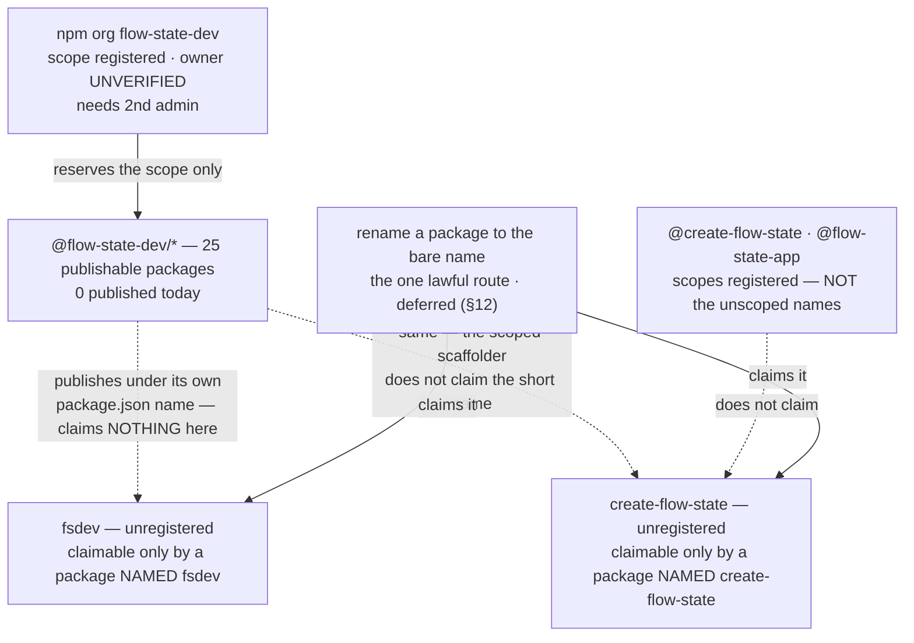

# FIX-1162: Claim the npm package names the launch needs — Implementation Spec

## Part I — The Case *(for the human)*

### 1. Problem — why it matters, why now

npm names go to whoever registers them first, and they are effectively unrecoverable. This
epic wrote several into a launch plan without checking that any of them was ours. Since the
last revision the owner has acted on npm, and what came back changed the facts this spec
rested on — including one that changes how every availability claim in it should be read.

Two kinds of statement follow and the difference is the point. **Verified** means I executed
it against `registry.npmjs.org` on **2026-08-18**. **Reported** means it comes from the
owner's own npm session, which no agent here can see. Where the two disagree I have kept the
disagreement rather than averaging it, because averaging is how a name gets recorded as ours
while it is still open.

**Verified: a 404 means unregistered. It does not mean publishable.** The bare `flow-state`
returned 404 and npm **refused the publish anyway** — its publish-time similarity check,
against the already-published `flowstate` (reported; a refusal cannot be reproduced without
attempting the publish). This is the fact with teeth, because every availability claim in
every spec in this epic was made from a 404. A registry 404 is the strongest signal
obtainable without attempting a publish, and it is not a green light. **Only an attempted
publish settles a name** — which this spec asserted as a caveat last round and has now
watched happen.

**Verified: holding a scope is not holding the unscoped name, and the two have come apart
here.** The scopes `@create-flow-state` and `@flow-state-app` exist, and **nothing is
published under either unscoped name** — both still return 404. Those are separate
namespaces: the npm organization `types` is registered while the unscoped package `types`
belongs to an unrelated user (`vitaly`, v0.1.1). So an organization named `create-flow-state`
does not stop anyone publishing the package `create-flow-state` — and `npm create flow-state
my-app` resolves to the *unscoped* package.

**Verified: the namespace exists. Whether it is ours is exactly what the endpoint hides.**
npm's `/-/org/<name>/user` endpoint separates a registered scope from an unregistered one — an
unregistered one answers `{"error":"Scope not found"}`, checked against controls. But a
registered scope answers with its *publicly listed* members, and `@flow-state-dev` answers
`{}`: registered, members not public. Compare `@fsdev`, which answers `{"fsdev":"owner"}` and
so is visibly somebody else's. The one scope this project depends on is the one whose owner
cannot be read from outside, which is why §12's first ask is the only thing that settles it.

**Verified, and it contradicts what I was told: `create-fsd-app` is not ours.** The unscoped
package is still maintained by `keyready`, latest 1.1.2, untouched since 2024-10-18, and no
scope by that name exists. The unscoped `flow-state-dev` is likewise somebody else's
(`jezweb`, v2.1.3, 2025-06-26). Reported to me is that the owner holds `create-flow-state`,
`create-fsd-app` and `flow-state-app`. Both cannot be true of `create-fsd-app`, and I cannot
settle it from outside — §12 carries the disagreement and the commands that end it.

**Nothing is published under `@flow-state-dev/` yet** (`core`, `cli`, `contracts` all 404),
and `fsdev` is still unregistered — still the one asset here that can be lost tomorrow
without us.

**Why now** — the exposure is time-based, not effort-based. Three names are further along
than they were, but the ones a stranger actually types are still open.

### 2. Solution in plain terms

Name the scaffolder `create-flow-state`, matching the published brand rather than the CLI
abbreviation, and matching npm's shorthand: `npm create flow-state my-app`. That is the one
naming decision this spec still settles.

Then **verify what is actually held** before recording anything as secured. Scopes and
unscoped packages are different namespaces, and the evidence says we are holding scopes. The
checks that separate them are three read-only commands the owner runs from their own npm
session. They change nothing, so they do not wait on this spec being approved — and one of
them is what tells you whether the rest of this spec is even addressed to the right account.
§12 is the ask; §10 block 1 is the commands.

The `@flow-state-dev` namespace is confirmed to exist. Confirm it is ours, then add a second
administrator, because an organization one person can administer does not survive that person
being unreachable. Adding the administrator is an account change, so that half waits for
approval.

And **stop, deliberately, short of claiming unscoped names by publishing stand-ins.** npm's
[dispute policy](https://docs.npmjs.com/policies/disputes) forbids publishing "simply for the
purposes of reserving [a name] for future use." The unscoped names get claimed by the packages
that genuinely want them, at their first publish.

That leaves a real gap, and this revision removed the only lever anyone thought could close
it: **`fsdev` is exposed until the framework's first publish**, and so, on the evidence, are
`create-flow-state` and `flow-state-app`. The early-publish option this spec carried for two
rounds turned out not to exist — §3 says why. Nothing here buys the exposure down.

**Philosophy** — tenet 3 (earn every addition): this still adds nothing to the repo. Tenet 1
(surface incoherence): the epic's transcripts promise `npx fsdev init` while its sub-spec
prints `npx @flow-state-dev/cli init`; that disagreement is decision 3, not quietly resolved.
Tenet 7 / BP-003: the "verified free" table this spec was built on was a green result from a
check aimed at a neighbour of the claim — §9 now says so in the spec rather than in a review
thread.

### 6. Decisions & rules — the sign-off surface

1. **The `@flow-state-dev` namespace is held as an npm *organization*, and is not considered
   secured until a second **administrator or owner** is on it.**
   The scope is confirmed to exist. Whether it is ours is the credential holder's check, not
   an assumption (§10). npm's policy standard is names "intended for immediate and active
   use"; a monorepo of twenty-five publishable packages weeks from publishing under that scope
   meets it about as plainly as it can be met.
   *Rejected:* claiming it under one person's npm user, which reserves the namespace
   identically and takes thirty seconds less.
   *Locks in:* every package we ever publish lives under an account more than one person can
   administer. The bill for getting this wrong arrives the day a security release has to go
   out and the individual account holder is unreachable — recoverable, but through npm
   support, on npm's timetable rather than ours. **A second *developer* does not satisfy this**;
   only `admin` or `owner` can manage the org, so §10 asserts the role rather than counting
   members.

2. **The scaffolding tool is named `create-flow-state`** — unscoped `create-flow-state`, and
   FIX-548's scoped package renamed from `@flow-state-dev/create-fsd-app` to
   `@flow-state-dev/create-flow-state` to match.
   It matches the brand we actually publish under (`@flow-state-dev/`, org `flow-state-dev`)
   rather than the CLI abbreviation, and it is the only candidate that reads correctly in
   npm's shorthand — `npm create flow-state my-app`. The owner reports having acquired the
   name; from outside it still reads 404, which per §1 is consistent with either a scope or a
   reservation and proves neither. §12's first ask settles which.
   *Rejected:* `create-flow-state-app` — it adds a word that the `npm create` shorthand then
   swallows anyway.
   *Locks in:* the name a stranger types to start a project, in one brand rather than two.
   FIX-548 is in spec review and has built nothing, so this costs an edit today; after that
   spec is approved it costs a re-spec, and after launch it is a broken command in published
   material.

   **`create-fsd-app` is left dormant — no redirect, no alias — if it turns out we hold it at
   all.** Two reasons, and the first is decisive: on the evidence in §1 that package is still
   an unrelated project's, published to real users in 2024, and republishing it as our
   forwarder would break their installs. Even if it were ours, a redirect is a second
   published surface kept in permanent version lockstep, pointing at a brand we have just
   retired — every install of it is somebody following a stale instruction we chose to keep
   alive. Dormant costs nothing and forecloses nothing.

3. **The unscoped names are claimed only by a package actually *named* that, and this issue
   claims none of them. `fsdev` is accepted as exposed in the interval.**
   The compliant mechanism is a package that does something, and every package that wants
   these names will do something. But it has to carry the name in its own `package.json`:
   publishing `@flow-state-dev/cli` does **not** claim `fsdev`, and publishing
   `@flow-state-dev/create-flow-state` does **not** claim `create-flow-state`. *(This corrects
   the previous draft, which said both names were claimed by their packages' first publish.
   They are not, and nothing in the current plan claims either.)* Closing that needs the
   rename in §3 for the CLI, and an unscoped publish from FIX-548 for the scaffolder — neither
   is this issue's work, and §12 hands both on.
   *Rejected:* publishing stand-ins now — forbidden by the clause quoted in §2, and the weakest
   protection available: a package that does nothing is the one shape a disputant can point at.
   *Withdrawn, not rejected:* running the snapshot workflow to claim `fsdev` early. This spec
   offered it as the live alternative for two rounds. It cannot claim `fsdev` at all, for the
   reason in §3, so there is nothing left to weigh.
   *Locks in:* weeks of exposure on `fsdev`, and — per §1 — on `create-flow-state` and
   `flow-state-app` too, since scopes do not hold them. If someone takes `fsdev` in that
   window it is gone for good, and the epic's headline command changes. **This is now accepted
   rather than chosen**: the only lawful route to `fsdev` is renaming the CLI package itself,
   which §3 defers on timing.

**Non-goals** — renaming `@flow-state-dev/cli`, changing FIX-1159's design, the scaffolding
tool itself (FIX-548), and releasing the framework packages. This spec settles names; it ships
no software and commits no files.

**Size:** Small — 0 production files · 0 CI test behaviours · 0 doc surfaces · 1 PR
(an empty changeset and the Linear record).

---

### 3. Tradeoffs & alternatives

**The alternative this spec carried for two rounds does not exist, and that is the main news
of this revision.** The option was: run `.github/workflows/snapshot-release.yml`, publish the
CLI early, and claim `fsdev` today. It cannot claim `fsdev` under any circumstances.
**Changesets publishes each workspace under the name in its own `package.json`.** No workspace
in this repo is named `fsdev` — the CLI's package name is `@flow-state-dev/cli`, and `fsdev` is
only the `bin` key inside it, which is a command name on an installed machine and confers
nothing in npm's registry namespace. Running that workflow publishes 25 scoped packages and
claims **nothing** on the unscoped `fsdev`. *(Verified: all 39 workspace `package.json` names
read; 25 are non-private; none is `fsdev`.)*

Two things I said about its price were also wrong, and they no longer matter except as a record
that the option was never as ready as it was sold: it publishes **up to 25 packages, not 8**,
and it **cannot authenticate today at all** — neither `snapshot-release.yml` nor `release.yml`
sets `registry-url` on `actions/setup-node`, and there is no `.npmrc` in the repo, so
`NPM_TOKEN` never becomes registry auth. That is now a §12 follow-up in its own right, because
the *real* first publish needs the same pipeline.

So `fsdev` has exactly one lawful route: rename the CLI package itself. Everything else was a
misreading of what the publish pipeline does.

**Which is the alternative I most nearly recommended: rename the CLI to unscoped `fsdev`
outright.**
It is the better end state — one package carrying the name people type, rather than a scoped
package plus a forwarding alias kept in version lockstep, which is what `vite`, `prisma`,
`turbo` and `next` all do. The cheapest moment to rename is before anything is published,
which is now. Rejected for timing, not merit: FIX-1159's and FIX-548's specs are built on the
scoped name. §12 records it as a follow-up with its surface enumerated.

**Where the complexity is:** it is no longer "only an actual publish proves a name is
claimable" as a theoretical caveat. It happened. `flow-state` was 404 and was refused, and
the mechanism — npm's similarity check after stripping punctuation — is exactly the one this
spec flagged and then did not weight heavily enough. `create-flow-state` reduces to
`createflowstate` against the taken `flowstate`; it carries the same shape of risk that just
fired, which is why §12 keeps a fallback order and §9 makes the refusal a first-class case.

### 4. Focus practices (1–5)

1. **BP-003 (verification evidence)** — every claim here was executed against
   `registry.npmjs.org` or the repo on 2026-08-18, including the ones handed to me as settled.
   Three came back different from how they were reported: `create-fsd-app`'s ownership (§1),
   the snapshot workflow's ability to claim `fsdev` (§3), and npm's unpublish rules (§12). The
   one claim that cannot be executed from outside — *is this scope ours* — is stated as
   unverified and routed to §12's ask rather than assumed.
2. **Tenet 7 (a green result from a check aimed at a neighbour of the claim)** — this spec has
   now produced two of these itself. "404 on the registry" answered *is this name registered*
   and was read as *can we have this name*; the `flow-state` refusal is that gap turning real.
   "The repo has a publish workflow" answered *can we publish* and was read as *can we publish
   under a chosen name*; §3 is that gap turning real. Both were arguments I built without
   executing the thing they rested on.
3. **Tenet 1 (surface incoherence, don't route around it)** — the owner reports owning three
   names; the registry shows scopes for two of them and an unrelated maintainer on the third.
   That is recorded as a contradiction with the command that settles it, rather than written
   up as agreement.

### 5. What using it looks like (1–5 examples)

Nothing about how code is written against the framework changes, and nothing at the command
line changes today. The one observable effect is the name a stranger types to start a project,
once FIX-548 ships *(the left column is FIX-548's current spec)*:

```
before   npx @flow-state-dev/create-fsd-app my-app
after    npx @flow-state-dev/create-flow-state my-app
later    npm create flow-state my-app     # only once an UNSCOPED create-flow-state
                                          # is published — the scoped one above
                                          # does not make this work (§12)
```

Until somebody renames the CLI package to `fsdev` and publishes it, `npx fsdev` keeps doing
what it does today: failing with npm's own "could not determine executable to run". Decision 3
accepts that. Note this is *not* fixed by the framework's first publish, which ships the CLI as
`@flow-state-dev/cli`.

## Part II — The Build Plan *(for the implementing agent)*

### 7. Technical design

There is no code in this issue. The design is which name is claimed by what, and when.



- **The organization is the only thing this issue executes**, and the largest piece of it is
  already done: the scope is registered. What remains is confirming it is ours and adding a
  second administrator.
- **A scope is not an unscoped package name, and neither is a `bin` key.** This is the
  design's load-bearing distinction after this revision, and it now has two edges. Holding
  the org `create-flow-state` gives **no** rights over the package `create-flow-state`, and
  `npm create flow-state` resolves to the latter. Separately, npm registers what is in a
  package's `name` field: `packages/cli` is named `@flow-state-dev/cli` and merely exposes a
  command called `fsdev` via `bin`, so **publishing it claims nothing on the unscoped
  `fsdev`.** An unscoped name is claimed only by a package whose own `name` is that string.
  Redundancy then comes from `npm owner add <user> <package>` — §10 checks the owner list, not
  the publisher.
- **Nothing is committed to the repo.**
- **Untouched:** every workspace package, the release pipeline, CI, and `packages/cli`.

### 8. Implementation sequence

**The dividing line is whether a step changes account state, not whether it touches npm.** A
read-only lookup leaves nothing behind and can be undone by closing the terminal, so it does
not wait on approval — and it cannot, because its output is what §12 asks you to approve
*on*. An account mutation is externally visible and is what approval gates. *(The previous
draft put every step after approval, which deadlocked against §12 asking for a lookup before
it. Split here; the lookups moved up.)*

**Before approval — read-only, no account state changed:**

1. **Look up what the account actually holds.** The organization first, then the three names.
   *Test:* §10's block 1. *Depends on:* nothing. This is the step that turns §1's
   disagreement into a fact, and §12 is the ask that requests it.
2. **Empty changeset.** No workspace package changes and nothing here is published by the
   pipeline, so `pnpm changeset --empty` (BP-022). *Depends on:* nothing.

**After approval — account mutations and outbound corrections:**

3. **Add a second administrator or owner to the `flow-state-dev` organization.** *Test:* §10's
   block 2. *Depends on:* spec approval, and on step 1 coming back saying the org is ours.
4. **Raise the cross-cutting corrections where they belong**, as comments rather than edits
   from this branch: decision 2 on FIX-548's spec PR (#1312, in review, so the change is an
   edit rather than a re-spec), and §1's namespace finding, the 404-is-not-a-green-light rule
   and decision 3's corrected claiming rule on the epic PR (#1301), whose transcripts and
   running index still say `npx fsdev init` and `create-fsd-app`. *Depends on:* spec approval.
5. **Record the outcome on the Linear issue** — which names are secured *as unscoped packages*,
   which are held only as scopes, which are deferred under decision 3, and any fallback used.
   That record *is* the deliverable the issue asked for. *Depends on:* 1, 3.
6. **No removals in this change**, and none commissioned in future ones.

**Handed on** (recorded in §12, not built here): neither unscoped name is claimed by the
current plan, because neither package is named after it. `fsdev` needs the CLI rename; the
short `create-flow-state` needs FIX-548 to publish an unscoped package alongside its scoped
one. Whoever does either adds a second owner at that point.

### 9. Edge cases & error handling

| Case | Expected |
|---|---|
| **npm refuses a name at publish time despite a 404** | The default assumption, not the surprise. It already happened to `flow-state`. A 404 means unregistered; the similarity check runs at publish and compares after stripping punctuation. Fall to the next name in §12's order, record which was used, and never treat a registry check as a claim. |
| `create-flow-state` is refused for similarity to `flowstate` | Same shape as the `flow-state` refusal, one word further away. Fall to §12's order and revisit decision 2's scoped half so the two still match. Surfaces at FIX-548's first publish, not here. |
| A name is held as a **scope** but the unscoped package is still open | Not secured. Different namespaces (§1). Anyone can still publish the unscoped name, and that is the name `npm create` resolves. Record it as open, not as claimed. |
| The `flow-state-dev` organization turns out not to be ours | Stop and escalate. Every package name across the epic is then wrong, and two sibling specs' fallback plan is gone. |
| `fsdev` is taken by someone else | The risk decision 3 accepts, and it is unrecoverable: npm "does not resolve squatting claims on demand" and transfers names only on a trademark or IP claim. The window is *not* "until the framework's first publish" — that publish claims nothing here — it is until someone renames a package to `fsdev` and publishes it. The epic's headline command gets reworded rather than renamed; §12 has no acceptable fallback. The `@fsdev` scope is already registered to someone else, so `@fsdev/cli` is not a fallback either. |
| Someone reads a `bin` name as a claim | It is not one. `packages/cli` exposes the `fsdev` command while being published as `@flow-state-dev/cli`; the registry only ever sees the `name` field. This is the mistake that produced the retired early-publish option (§3). |
| A name is claimed but only one account can publish it | Not yet secured. Creating the organization does not confer ownership of an unscoped package; `npm owner add` does. |
| A second org member is added as a `developer` | Not yet secured. Only `admin` or `owner` can manage the organization, which is the failure decision 1 exists to survive. |
| Someone proposes holding a name with a stub after all | Refuse and point at the clause in §2. Against npm's terms, and the weakest claim available. |

**Taxonomy:** every failure here is a naming failure, and each is fatal to its step rather
than retryable — a name is claimable or it is not. None degrade.

### 10. Testing strategy

**Goal:** we can state, per name, whether we hold the unscoped package, only the scope, or
neither — and that the namespace is administrable by more than one person. Only the credential
holder can run the first two blocks.

*Block 1 — read-only, runs before approval (step 1).* Nothing here writes; this is the
evidence §12's ask is asking for.

```
npm org ls flow-state-dev    → lists our members  → the org is ours
                             → error / not found  → it is NOT ours; stop and escalate
npm access list packages     → every package the logged-in account can publish;
                               shows whether the @flow-state-dev scope is on it
npm owner ls <name>          → lists us           → we hold the UNSCOPED package
                             → 404 / not found    → we do not; a scope by that
                                                    name is not the same thing
```

Run `npm owner ls` for `create-flow-state`, `flow-state-app` and `create-fsd-app`.

*Block 2 — after approval, and it is the only assertion on a mutation (step 3).* Assert the
**role**, not the member count:

```
npm org ls flow-state-dev    → at least one member besides the primary holder
                               showing `admin` or `owner`
```

*Cross-check without credentials*, which is what produced §1 and what anyone can re-run:

```
curl -s -o /dev/null -w '%{http_code}\n' https://registry.npmjs.org/<name>
      → 200 = published, 404 = unregistered (NOT "available")
curl -s https://registry.npmjs.org/-/org/<name>/user
      → {"error":"Scope not found"} = not registered
      → {"someuser":"owner"}        = registered, owner publicly listed
      → {}                          = registered, members NOT public — this is what
                                      @flow-state-dev returns, and it is why block 1
                                      cannot be replaced by a curl
```

*Deferred to the publishes that claim them*, recorded so they are inherited rather than
rediscovered:

```
npm view fsdev maintainers              → our account, plus a second owner
npm view create-flow-state maintainers  → our account, plus a second owner
npx -y fsdev@latest --help              → the real CLI's help output
```

Record block 1's output on the Linear issue — that record *is* the deliverable the issue
asked for.

**CI specs: none, deliberately.** This change commits no code. The only assertion worth making
is *does npm consider this namespace ours*, which is a fact about a remote registry and
unreachable from CI.

**Discipline:** neither `tdd` nor `diagnose`. There is no behaviour to drive out.

### 11. Documentation plan

**No docs changes required**, and this is a real answer rather than a punt:

- Nothing user-facing changes here. Decision 3 keeps every documented command as FIX-1159's
  and FIX-548's specs already write it, and no package is added or renamed in this repo.
- The documents that *are* wrong — the epic spec's transcripts and running index, and FIX-548's
  spec — are not `apps/docs` pages and are not edited from this branch. §8 step 4 raises both
  where their owners can act on them.
- The install and invocation surface changes only if the §12 follow-up rename happens, which is
  after the first release. That surface is enumerated once, in §12.

### 12. Dependencies, open questions & follow-ups

**Dependencies:** the npm account and its 2FA. No agent in this epic holds them, so every
lookup and every mutation sits with the owner. Nothing in the repo blocks this issue.

#### Which npm account is this project actually publishing from? — the one thing I need from you

**Plain terms.** I have been told we own three names. From outside the account, the registry
says something different about one of them, and says nothing at all about the most important
one. Until somebody looks from inside the account, this spec is a plan for a namespace we
have not confirmed we hold. Every other question here is smaller than that one.

Here is the whole disagreement, re-executed on 2026-08-18:

| Name | Unscoped package | Scope | Reading |
|---|---|---|---|
| `flow-state-dev` (the scope everything ships under) | 200 — **`jezweb`**, v2.1.3, 2025-06-26 | registered, **owner not public** | the scope exists; **whether it is ours is unknown** |
| `create-flow-state` | 404 — nothing published | registered, owner not public | we appear to hold a **scope**, not the name |
| `flow-state-app` | 404 — nothing published | registered, owner not public | same |
| `create-fsd-app` | **200 — `keyready`, v1.1.2, 2024-10-18** | not registered | **contradicts** "we own it" |

**What it costs you.** Three commands in a terminal you are already logged into, about a
minute, hardest first. They read; they change nothing; there is no way to get them wrong.

```
npm org ls flow-state-dev     lists members   → the scope is ours. Everything proceeds.
                              errors          → it is NOT ours. Stop the epic: every
                                                package name in it is wrong, and both
                                                sibling specs' fallback is gone.
npm access list packages      shows every package this account may publish — the
                              second opinion on the line above, and it also reveals
                              anything held that nobody wrote down.
npm owner ls create-flow-state   lists you    → we hold the real name.
   (repeat for flow-state-app,   not found    → we hold only the scope, and the name
    create-fsd-app)                             a stranger types is still open.
```

**My recommendation: treat all four as unheld until that output says otherwise, and paste the
output into the Linear issue.** The failure mode is asymmetric. Believing we hold a name we do
not is how it gets taken while nobody is watching for it, and this epic has already been burned
once for reading a registry answer as a stronger claim than it was. The reverse mistake —
double-checking something we did own — costs a minute.

**What would change my mind:** a receipt, an npm email, or a screenshot from inside the account
showing the org's member list. Any of those is the same evidence and I would take it. What I
cannot take is the recollection, because the one name we have a written record of buying
(`create-fsd-app`) is demonstrably somebody else's.

**If I'm wrong about the org:** this is the largest blast radius in the epic. Everything the
project publishes lives under `@flow-state-dev/`. If that scope belongs to someone else, three
specs, the launch plan and the install instructions in the docs are all wrong at once, and we
find out on the day of the first publish instead of today.

**What this issue owes its siblings.** FIX-548 planned to alias the unscoped `create-fsd-app`
"if and when FIX-1162 secures it" — it is not ours (above), and the name is now
`create-flow-state` (decision 2). One correction goes with that: publishing
`@flow-state-dev/create-flow-state` does **not** claim the unscoped `create-flow-state`, so
`npm create flow-state` will not work until FIX-548 also publishes an unscoped package of that
name. FIX-1159's dependency section is correct that this issue does not block it.

**Premise correction for the epic (raised on #1301, #1310, #1312, not edited here).** Both
sibling specs describe publishing under "the scoped package name we already own." The scope is
confirmed to **exist**; that it is **ours** is unverified, and nothing is published under it.
The sentence is safe once the org lookup comes back clean, and not before.

**Retired: the early-publish option, and the argument that propped up the alternative.** For two
rounds this section asked whether to claim `fsdev` by running the snapshot workflow early. There
is nothing to decide — §3 shows the workflow cannot claim `fsdev` at all, because Changesets
publishes each workspace under its own `package.json` name and none is named `fsdev`. Two
corrections go with it. The price was misstated (up to 25 packages, not 8, and the pipeline
cannot authenticate today). And the argument I leaned on against publishing early —
*"versions cannot be unpublished after 72 hours"* — **is wrong**: npm's
[unpublish policy](https://docs.npmjs.com/policies/unpublish) allows removal at any time for a
package with no dependents, under 300 weekly downloads, and a single maintainer, which a fresh
canary would have met. What is permanent is that a `name@version` pair can never be reused.

So the recommendation is still **wait**, but it no longer rests on irreversibility or on
weighing a price. It rests on something simpler: there is no early-claim option to take. The
only lawful route to `fsdev` is renaming the CLI package, which §3 defers on timing, and until
somebody does that the name is exposed. That is a fact to accept, not a fork to decide.

**Fallback order, if a name is refused at publish time.** All returned 404 on 2026-08-18 —
which, per §1, means unregistered and **not** confirmed publishable:

- Scaffolder: `create-flow-state` → `create-flow-state-app` → `create-flowstate-app` →
  `create-flow-state-dev-app`. The later entries are further from the taken `flowstate`, which
  is the collision that already fired once.
- CLI short name: none acceptable. `fsd`, `fsd-cli`, `fsdev-cli`, `flowstate` and the unscoped
  `flow-state-dev` are taken by unrelated projects, and the `@fsdev` scope is registered to
  someone else. A refusal on `fsdev` is escalated, not silently downgraded.

**Follow-ups (flagged, not built):**

- **Repair the release/snapshot publish path.** No `registry-url` on `actions/setup-node` and no
  `.npmrc` in the repo, so `NPM_TOKEN` never becomes registry auth in `release.yml` *or*
  `snapshot-release.yml`; and six pending changeset fragments name a private package alongside
  publishable ones. This was raised last round as a blocker on the early-publish option, which
  is now retired — but it got **more** important, not less: it is the same pipeline the real
  first publish needs, and today that publish would fail at the auth step. Not this issue's
  work; it belongs to whoever owns the first release.
- **After the first release, revisit publishing the CLI as unscoped `fsdev`** rather than a
  scoped package plus a forwarding alias — the alternative weighed in §3. The surface is
  enumerated once, here, so whoever picks it up inherits it (BP-034): the package name; the
  `tsconfig.base.json` path map; **fourteen** pending changeset fragments naming
  `@flow-state-dev/cli` (a fragment naming a package that no longer exists fails `changeset
  version`); **five** docs-site pages — `apps/docs/docs/cli/overview.md`,
  `apps/docs/docs/api/cli.md`, `apps/docs/docs/devtool/setup.md`,
  `apps/docs/docs/getting-started/installation.md` and `apps/docs/guides/nextjs-setup.md`, the
  last two carrying `pnpm add -D @flow-state-dev/cli` install lines in the primary onboarding
  path; **two** READMEs (`packages/cli/README.md` and the root `README.md`); and `pnpm --filter
  @flow-state-dev/cli` invocations in **four** `.agents/skills/` files (`debug-flow`, `diagnose`,
  and two in `prototype`). *All five counts re-executed on 2026-08-18 and unchanged.*
- **Neither unscoped name is claimed by anything currently planned**, and this is the follow-up
  that replaces the previous draft's assumption that they were. `fsdev` needs the CLI rename
  above. The short `create-flow-state` needs FIX-548 to publish an unscoped package of that
  name in addition to its scoped one, or `npm create flow-state` never resolves. Each adds a
  second owner at that point — §10's deferred checks.

### 13. Implementer notes *(recorded verbatim, not folded)*

Below-the-bar review feedback, kept for whoever builds the packages that eventually claim these
names. Not argued with, not folded into the design.

- *(cursor)* "Simpler fork: §7 already specifies the full placeholder contract. Since step 4 is
  always owner hand-publish with credentials, consider whether this issue needs **six committed
  files** at all… If you keep repo placeholders, `tools/` is a new top-level tree that reads like
  `@flow-state-dev/tools`. Consider `npm-names/` at repo root plus a guardrail README." — *the
  first half is now the approach, for a different reason; the second half is moot.*
- *(cursor)* "This FIX-1159 surface inventory (tsconfig, 14 changeset fragments, docs, skills) is
  repeated in §11 and §12 follow-ups. Suggestion: keep one canonical list." — *acted on: the list
  lives once, in §12.*
- *(cursor)* "Step 2 reads as 'don't add a doc' rather than a deliverable. If the only output is
  README prose in the placeholder dirs, merge into step 1 and drop step 2."
- *(cursor)* "This pseudocode block restates the §7 bullets (three files, `bin.js` shebang, no
  deps/build)." — *moot; the sketch is gone with the packages.*
- *(cursor)* "Four scaffolder fallbacks add spec surface. §3 already flags npm similarity as the
  real unknown. Not definite — but primary + `create-flow-state-app` may suffice unless you
  verified similarity for the others too." — *sharpened rather than folded: similarity cannot be
  verified without attempting a publish (§1), so the order stays and §12 now says what the order
  is ordered by.*
- *(cursor)* "Low-probability edge case (someone adds `tools/*` to `pnpm-workspace.yaml`) as a
  full table row + README-only guard." — *acted on: the row is gone with the packages.*
- *(greptile)* "The reference to four `.agents/skills/` files is also stale because that directory
  does not exist." — **factually wrong, corrected inline:** `.agents/skills/` does exist (it is
  `agents/skills/` that does not; `.claude/skills` is the symlink), and four files under it carry
  `pnpm --filter @flow-state-dev/cli`. Re-executed 2026-08-18; the count stands.
- *(codex)* "Rename inventory omits install guides — `apps/docs/docs/getting-started/installation.md`
  and `apps/docs/guides/nextjs-setup.md`." — *folded in round 1; both are in §12's list. Re-verified
  2026-08-18: an exact-boundary grep for `@flow-state-dev/cli` across `apps/docs` returns exactly
  those five pages, so the count and the list are correct.*

---

## Spec evolution

- **Spec drafted** — framed as claiming the npm names before someone else does, with the
  unclaimed `@flow-state-dev` namespace as the largest exposure. Chose placeholder publishes over
  shipping real packages early.
- **After reading the sibling specs** — dropped the recommendation to rename the CLI to unscoped
  `fsdev` in this issue; it became the §3 alternative and a §12 follow-up. The same read turned up
  the real finding: both specs call it "the scoped package name we already own", and nobody had
  verified that we do.
- **Review round 1 — the central deliverable was invalidated, and it deserved to be.** npm's
  dispute policy forbids publishing a package *or registering an organization name* "simply for the
  purposes of reserving it for future use". The two placeholder packages were exactly that and are
  gone (6 committed files → 0). The organization **stays**, because the same page sets the standard
  as "immediate and active use". The unscoped names were **deferred** to the packages that actually
  want them. Also folded: creating the organization confers no ownership of the unscoped names, so
  §7/§9/§10 require `npm owner add`; and the rename inventory gained the two onboarding pages it had
  missed.
- **Fact update — the owner acted on npm, and two of this spec's load-bearing assumptions broke.**
  Not a review round; the world changed under the document. **(a)** The bare `flow-state` returned
  404 and npm **refused the publish anyway**, so "verified free on the registry" never meant what
  this spec used it to mean — §1 and §9 now carry *a 404 means unregistered, not publishable; only a
  publish settles a name*, and §12's fallback list is re-labelled accordingly. **(b)** Checking what
  is now held showed **scopes, not unscoped packages**: `create-flow-state` and `flow-state-app`
  have registered scopes and nothing published, and those are different namespaces — proved by
  counterexample (npm org `types` vs the unscoped `types`, owned by an unrelated user). So the names
  the launch actually types are still open, and §12 carries the contradiction plus the one command
  that settles it. **(c)** Namespace ownership turned out to be *partly* checkable from outside
  after all: npm's scope endpoint distinguishes registered from unregistered, and `flow-state-dev`
  is registered — whether it is *ours* still needs the credential holder. Decision 2 was re-drafted
  from `create-fsdev-app` to **`create-flow-state`** to match the published brand and npm's
  `npm create flow-state` shorthand, with `create-fsd-app` left dormant rather than aliased. Three
  outstanding review findings were folded: §10 now asserts the second member's **admin/owner role**
  rather than counting members, §8 no longer tells anyone to act before this spec is approved, and
  §3's canary alternative is re-priced — it publishes **up to 25 packages, not 8**, and cannot
  authenticate at all today, which is now a §12 follow-up. The rename inventory's five counts were
  re-executed and are unchanged.
- **Directed rework — the early-publish option turned out never to have existed, and three
  smaller things were wrong.** Not a review round. **(a) The `fsdev` fork is retired, not
  re-priced.** Changesets publishes each workspace under its own `package.json` name; no
  workspace is named `fsdev` (39 read, 25 non-private, none named that), and the CLI's `fsdev`
  is a `bin` key, which the registry never sees. Running the snapshot workflow claims nothing
  on the unscoped name, so §3's canary block and §12's six-part fork are **deleted** rather
  than replaced. The recommendation is still *wait*, now resting on the simpler fact that
  there is no early-claim option — the only lawful route to `fsdev` is renaming the CLI
  package, already carried as the §3 alternative and a §12 follow-up. **(b)** The same
  correction propagates: decision 3 previously said each unscoped name would be claimed by its
  package's first publish. It would not — publishing `@flow-state-dev/cli` does not claim
  `fsdev`, and publishing `@flow-state-dev/create-flow-state` does not claim
  `create-flow-state`. Corrected in §6, §7, §9 and handed to FIX-548 in §12. **(c)** *"Versions
  cannot be unpublished after 72 hours"* was wrong and is gone: npm permits removal at any time
  for a package with no dependents, under 300 weekly downloads, and a single maintainer; what is
  permanent is that a `name@version` pair cannot be reused. The argument it supported was
  already gone with (a). **(d)** §8's post-approval rule deadlocked against §12 asking for a
  lookup *before* approval. Split on whether a step changes account state: read-only lookups run
  now, account mutations wait. **(e)** §12's ask is rewritten as the three read-only commands
  the owner runs from their own session, priced at about a minute, with the unverifiable
  ownership of the `flow-state-dev` scope first because it has the largest blast radius. The
  earlier name `create-fsdev-app` survives only in this history. Registry state and the rename
  inventory were re-executed on 2026-08-18; the inventory is unchanged.
