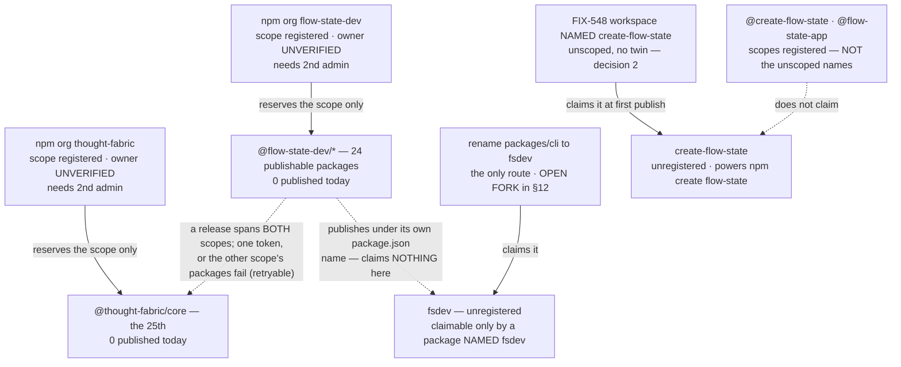

# FIX-1162: Claim the npm package names the launch needs — Implementation Spec

## Part I — The Case *(for the human)*

### 1. Problem — why it matters, why now

npm names go to whoever registers them first, and they are effectively unrecoverable. This epic
wrote several into a launch plan believing they were ours. **They are not.**

**The owner's own words settle why: *"Yes I have the org. Didn't add the package."*** npm keeps
two namespaces and sells both under the word *name*. Registering an **organization** claims the
scope `@name/…`; publishing a **package** claims the bare `name`. The flow npm's UI makes easy is
the first, and it claims nothing a user ever types. So **no unscoped name is held** — not
`create-flow-state`, not `flow-state-app`, not `fsdev`. *(A 404 means unregistered, not
publishable: `flow-state` was 404 and npm refused the publish anyway. Only a publish settles a
name — §9 makes that a first-class case, §12 carries the evidence.)*

**Two things are still open, and they are the largest items here.**

1. **Whose scopes are these?** Five are registered, and the release publishes into **two** of
   them — 24 of the 25 publishable workspaces are `@flow-state-dev/*`, and `@thought-fabric/core`
   ships under `@thought-fabric`. npm hides member lists, so neither can be verified from
   outside. §12 carries the two commands that settle it.
2. **Do we claim `fsdev`?** Nothing claims it today, and only renaming the CLI package would.
   That is the one open decision here, priced in §12.

**Why now** — the exposure is time-based, not effort-based. The gap between believing this is
handled and it being handled is the thing with a clock on it.

### 2. Solution in plain terms

Name the scaffolder `create-flow-state`, matching the published brand and npm's shorthand: `npm
create flow-state my-app`. That is the one naming decision this spec settles outright.

Then **verify what is actually held** before recording anything as secured — two read-only
commands the owner runs from their own npm session (§12 is the ask, §10 block 1 the commands) —
and add a second administrator to each organization, because one a single person can administer
does not survive that person being unreachable.

And **stop short of claiming names by publishing stand-ins.** npm's
[dispute policy](https://docs.npmjs.com/policies/disputes) forbids publishing "simply for the
purposes of reserving [a name] for future use." The unscoped names get claimed by the packages
that genuinely want them, at their first publish.

That leaves the `fsdev` gap, which §12 prices as a live fork. **Note it is the *name* at stake,
not the command:** our `fsdev` command comes from the CLI package's `bin` key and works under
every option (verified by execution, §10).

### 6. Decisions & rules — the sign-off surface

**One decision is live. The other two are settled and sit in §6b, below the fold** — the
organization and its second administrator (decision 1) follow from wanting to publish at all, and
the scaffolder's name (decision 2) was settled by the owner and confirmed against the registry.
Both remain open to challenge; neither needs deciding here.

**The live one:**

3. **An unscoped name is claimed only by a package actually *named* that — so this issue claims
   none of them, and whether we claim `fsdev` early is the open fork in §12.** Publishing
   `@flow-state-dev/cli` does **not** claim `fsdev`. *(This corrects an earlier draft that
   expected the CLI's first publish to claim it.)* Decision 2 closes the scaffolder half; the CLI
   half needs a rename, which is a live decision.
   *Rejected:* publishing stand-ins (forbidden, and the weakest claim available); running the
   unmodified snapshot workflow, which publishes the scoped names and claims nothing here.

**Non-goals** — *executing* the CLI rename, changing FIX-1159's design, the scaffolding tool
itself (FIX-548), and releasing the framework packages. **Whether to rename is decided here;
doing it is not.**

**Size:** Small — 0 production files · 0 CI test behaviours · 0 doc surfaces · 1 PR (an empty
changeset and the Linear record).

---

### 3. Tradeoffs & alternatives

**Renaming the package is the only route to `fsdev`.** Changesets publishes each workspace under
its own `package.json` name, and no workspace is named `fsdev` — it is the CLI's `bin` key, which
the registry never sees. *(Verified: all 39 workspace names read; 25 non-private; none is
`fsdev`.)* So no publish pipeline claims it unchanged. §12 prices the rename rather than deciding
it, because losing the name changes what a stranger who has installed nothing gets, and that is
the owner's call.

It is also the better end state — one package carrying the name people type, the shape `vite`,
`prisma` and `next` all use — and the cheapest moment to rename is before anything is published.

**Two constraints that shape the fork, derived in Part II:** no release can be assembled at this
commit at all (§12's follow-ups), and `create-flow-state` carries the same similarity-check risk
that just refused `flow-state`, so a refusal returns for sign-off rather than substituting a name
(§9).

### 4. Focus practices (1–5)

1. **BP-003** — every claim was executed against the registry, the repo, or a pinned dependency's
   source, including claims handed to me as settled. Several came back different.
2. **Tenet 7 (a green check aimed at a neighbour of the claim)** — this spec produced several
   itself, which is why §10 carries commands rather than lists. "404 on the registry" answered
   *is this registered* and was read as *can we have it*; "the CLI's bin is `fsdev`" answered
   *what command do users get* and was read as *do we own the name*.
3. **Tenet 1 (surface incoherence)** — the owner reported owning names the registry showed as
   unheld; recorded as an open contradiction with the command that settles it, not averaged away.

### 5. What using it looks like (1–5 examples)

Nothing about writing code against the framework changes. The one observable effect is the name a
stranger types to start a project, once FIX-548 ships *(left column is FIX-548's current spec)*:

```
before   npx @flow-state-dev/create-fsd-app my-app
after    npm create flow-state my-app     # one unscoped package, no scoped twin
         npx create-flow-state my-app     # the same package, spelled out
```

`npx fsdev` in a directory where **nothing is installed** fails at the registry today, and keeps
failing until the CLI is renamed and published — which under option C never happens. Note what
that means over time: the day someone else claims the name, that command stops failing and starts
running *their* software. Once `@flow-state-dev/cli` *is* installed, `npx fsdev` runs our CLI from
its `bin` key regardless, under every option (§10, verified).

## Part II — The Build Plan *(for the implementing agent)*

### 6b. Settled decisions

Ratifications rather than open questions, kept here so Part I carries only the live fork. Both are
still open to challenge — a reviewer who thinks either is wrong should say so.

1. **Both namespaces are held as npm organizations, and neither counts as secured until a second
   administrator or owner is on it.** There are two: `flow-state-dev` and `thought-fabric`.
   A second *developer* does not satisfy this — only `admin` or `owner` can manage an org, so §10
   asserts the role rather than counting members.
   *Rejected:* claiming under one person's npm user — identical reservation, no redundancy.
   *Why it is settled:* it follows from wanting to publish at all. An organization one person can
   administer strands every package the day that person is unreachable.

2. **The scaffolding tool is ONE package, published unscoped as `create-flow-state`, with no
   scoped twin.** `npm init foo` resolves to `create-foo`, so the unscoped name both gets claimed
   and powers the command; a scoped twin would claim nothing extra and add a permanently
   version-locked surface. FIX-548's workspace is therefore *named* `create-flow-state`.
   *Rejected:* a scoped package plus an unscoped forwarder; `create-flow-state-app`, whose extra
   word the shorthand swallows anyway.
   **`create-fsd-app` stays dormant** — it is an unrelated project's, published to real users in
   2024, so republishing it as a forwarder would break their installs.
   *Why it is settled:* the owner chose the name, and the registry has since confirmed the
   unscoped name is unheld and the scope claims nothing.

### 7. Technical design

There is no code in this issue. The design is which name is claimed by what, and when.



- **The organization is the only thing this issue executes**, and the largest piece of it is
  already done: the scope is registered. What remains is confirming it is ours and adding a
  second administrator.
- **A scope is not an unscoped package name, and neither is a `bin` key.** This is the
  design's load-bearing distinction after this revision, and it has two edges. Holding
  the org `create-flow-state` gives **no** rights over the package `create-flow-state`, and
  `npm create flow-state` resolves to the latter. Separately, npm registers what is in a
  package's `name` field: `packages/cli` is named `@flow-state-dev/cli` and merely exposes a
  command called `fsdev` via `bin`, so **publishing it claims nothing on the unscoped
  `fsdev`.** An unscoped name is claimed only by a package whose own `name` is that string.
  Redundancy then comes from `npm owner add <user> <package>` — §10 checks the owner list, not
  the publisher.
- **The scaffolder needs no rename decision; the CLI does.** FIX-548 has built nothing, so
  naming its workspace `create-flow-state` costs an edit and claims the name at its first
  publish. `packages/cli` already exists under a scoped name that two sibling specs are written
  against, which is why the same move costs more there and is a fork rather than an edit.
- **Nothing is committed to the repo.**
- **Untouched:** every workspace package, the release pipeline, CI, and `packages/cli`.

### 8. Implementation sequence

**The dividing line is whether a step changes account state, not whether it touches npm.** A
read-only lookup leaves nothing behind and can be undone by closing the terminal, so it does
not wait on approval — and it cannot, because its output is what §12 asks you to approve
*on*. An account mutation is externally visible and is what approval gates. *(The previous
draft put every step after approval, which deadlocked against §12 asking for a lookup before
it. Split here; the lookups moved up.)*

**Before approval — read-only evidence gathering only. Nothing is written, on npm or in the
repo:**

1. **Confirm *both* publishing organizations are ours** — `npm org ls flow-state-dev` **and
   `npm org ls thought-fabric`.** *Test:* §10's block 1. *Depends on:* nothing. Two commands, one
   per scope: 24 of the 25 publishable workspaces are `@flow-state-dev/*` and the 25th is
   `@thought-fabric/core`. The owner has already answered what is held under the other names, so
   these are the only lookups left. **Both must come back ours before step 2** — approving account
   mutations on one organization while the other is unverified would leave the scope a quarter of
   the release publishes under unchecked. §12 is the ask.

**After approval — account mutations, repository changes, and outbound corrections:**

2. **Add a second administrator or owner to *both* organizations — `flow-state-dev` and
   `thought-fabric`.** *Test:* §10's block 2. *Depends on:* spec approval, and on step 1 coming
   back saying each org is ours. An org that publishes one package still strands that package if
   its sole administrator is unreachable.
3. **Empty changeset**, created on the implementation branch. No workspace package changes and
   nothing here is published by the pipeline, so `pnpm changeset --empty` (BP-022). *Depends
   on:* spec approval. *(It sat before approval in an earlier draft. That was wrong twice over:
   it writes to the repo, and a fragment created on this never-merged spec branch would be
   stranded.)*
4. **Raise the cross-cutting corrections where they belong**, as comments rather than edits
   from this branch: decision 2 on FIX-548's spec PR (#1312, in review, so the change is an
   edit rather than a re-spec), and §1's namespace finding, the 404-is-not-a-green-light rule
   and decision 3's corrected claiming rule on the epic PR (#1301), whose transcripts and
   running index still say `npx fsdev init` and `create-fsd-app`. *Depends on:* spec approval.
5. **File the issue that delivers the *whole* selected outcome — via `issue-manager`, before this
   issue closes, and wire it as a blocker on the release it applies to.** This issue deliberately
   performs none of it (§6 non-goals), and no other spec in the epic owns it, so without this step
   the time-sensitive work is untracked while FIX-1162 completes on an org mutation and an empty
   changeset. *Depends on:* the §12 fork being answered.

   **Scope it to the option the owner picked, not just to the rename.** An issue that carries only
   the rename leaves the rest of the selected plan ownerless:

   | Picked | The issue must carry | Wired as |
   |---|---|---|
   | **A** | the rename — code, the 14 changeset fragments, **and the user-facing docs in the same change set** (five `apps/docs` pages, both READMEs; AGENTS.md:199–205) — closed by the inventory + `rg -nP` gate | **a blocker on the normal first release.** Under A the point is that the CLI is renamed *before* it is first published — if the release can run without it, `@flow-state-dev/cli` ships under the old name and choosing A bought nothing |
   | **B** | that same rename change set **plus** the release-plan repair (six mixed fragments), the 0.1.0 baseline and version review across 25 packages, both org confirmations, the both-scope token and `CHANGESETS_TOKEN`, and the 25-package first publish | **a blocker on that early release, and its owner** — B *is* a release, so someone has to own the first-publish steps end to end rather than inheriting them |
   | **C** | nothing filed here — record the decision instead. **Step 5b still applies** | — |

   **Blocks:** no epic *command* depends on the unscoped name (§12), but under A and B this issue
   **blocks the applicable release**, which is a different thing and the previous draft conflated
   them.

5b. **File the post-publish ownership issue — unconditionally, under every option including C.**
   The deferred `npm owner add` (§10's deferred block, §7's hand-off) cannot run before the
   packages exist and the publisher is CI, so "whoever publishes" owned it — which is nobody. It
   needs an owner under **C** too, because **C changes nothing about `create-flow-state`**: FIX-548
   still publishes it, and it still needs a second maintainer. Tying this to the option issue would
   have left the scaffolder single-owner under C while §10's criteria claimed otherwise — this
   spec's own rule biting the spec that wrote it.
   *Carries:* `npm owner add` on every unscoped name we actually publish — `create-flow-state`
   always, `fsdev` as well under A or B. *Definition of done:* `npm view <name> maintainers` shows
   a second owner for each. *Stays open through post-publish verification.* *Depends on:* the
   publishes themselves, not on this issue or the fork.

   **The epic-transcript correction in step 4 is conditional on the fork, not unconditional.**
   The transcripts say `npx fsdev init`, and what that should become depends on which package
   ends up published: **under C**, `npx @flow-state-dev/cli init` — the scoped package, which is
   what FIX-1159 already prints. **Under A or B**, the CLI package *is* renamed to `fsdev`, so
   `npx fsdev init` becomes correct as written and the transcripts need no change at all. Writing
   the scoped form in unconditionally would point the launch material at a package name the
   chosen plan never publishes. **So step 4 raises the ambiguity; it does not resolve it until
   the fork is answered.**
6. **Record the outcome on the Linear issue** — which names are secured *as unscoped packages*,
   which are held only as scopes, which are deferred under decision 3, which fork option was
   chosen, and the identifiers of the issues filed by steps 5 and 5b. That record *is* the
   deliverable the issue asked for. *Depends on:* 1, 2, 5b — **and on step 5 only under A or B.**
   Under C step 5 files nothing by design, and recording "option C chosen, no rename issue filed"
   *is* how step 5 is satisfied.
7. **No removals in this change**, and none commissioned in future ones.

**Handed on:** an unscoped name is claimed only by a package whose own `package.json` carries
it. `create-flow-state` is claimed as a side effect of FIX-548 shipping (decision 2); `fsdev` is
claimed by nothing until step 5 files its issue. **Second ownership on both is step 5b's, under
every option.**

**A rule this issue keeps re-learning, worth stating once because this issue is the one that
hands work to the release: a step that exists but no issue owns does not happen.** Five instances
here — the rename nobody filed, the epic correction nobody made conditional, the release steps
under B nobody owned, the `npm owner add` deferred to a publisher that is CI, and that same
hand-off then attached to an issue option C never files. Every hand-off in this spec names an
issue and a definition of done, or it is not a hand-off.

**This issue is not done when the orgs have a second admin.** It is done when the fork is
answered, the outcome is recorded, step 5b exists, and — under A or B — the option issue exists
with an owner and a blocking link to the release it applies to. Filed-but-not-blocking would let
the release publish straight past it.

### 9. Edge cases & error handling

| Case | Expected |
|---|---|
| **npm refuses a name at publish time despite a 404** | The default assumption, not the surprise. It already happened to `flow-state`. A 404 means unregistered; the similarity check runs at publish and compares after stripping punctuation. **Stop and return to the owner for sign-off** (§12) — do not publish the next candidate. Record the refusal and never treat a registry check as a claim. |
| `create-flow-state` is refused for similarity to `flowstate` | Same shape as the `flow-state` refusal, one word further away. **Escalate, do not substitute:** every candidate name is also a different `npm create` command, so choosing one changes the advertised product surface. Surfaces at FIX-548's first publish, not here. |
| A name is held as a **scope/organization** but the unscoped package is still open | Not secured, and this is the epic's actual situation for four names. Different namespaces (§1). Anyone can still publish the unscoped name, and that is the name `npm create` resolves. Record it as open, not as claimed. |
| Someone reports having "bought a name" on npm | Ask which namespace. Registering an organization and publishing a package are both bought under the word *name*, and only the second claims what a user types. Confirm with `npm owner ls <name>`, never with a receipt. |
| The `flow-state-dev` organization turns out not to be ours | Stop and escalate. Every package name across the epic is then wrong, and two sibling specs' fallback plan is gone. |
| The `thought-fabric` organization turns out not to be ours, or the token is scoped to one org | The packages under the unauthorised scope simply fail to publish; the rest still go out. **Recoverable — and I overstated this last round.** *Verified in the pinned `@changesets/cli@2.30.0` source:* a failed publish returns `{published: false}` rather than throwing, so every package is still attempted (`Promise.all` over the unpublished set), the failures are listed and the command exits 1; and on a re-run `getUnpublishedPackages` queues a workspace only when `!publishedVersions.includes(localVersion)`, so **the retry attempts only what is missing.** The real cost is the window in between: published packages pin their siblings at exact versions, so anything depending on an unpublished package is uninstallable until the retry lands, and git tags exist for the successful subset only. Worth twenty seconds of lookup to avoid; not a disaster if it happens. `RELEASING.md:82,107` already requires both orgs and a token authorised for both; §10 block 1 checks both. |
| The first publish runs before the version baseline is set | Unintended initial versions, permanently. `RELEASING.md:84` requires the 0.1.0 launch baseline across all publishable packages first; today 23 of 25 sit at `0.0.0`, with `@thought-fabric/core` at `0.0.1` and `@flow-state-dev/chat-sdk` at `0.1.0`. Consuming the pending fragments off those numbers publishes a scatter of versions nobody chose, and no `name@version` can ever be reused. This is the one genuinely irreversible step in the issue, which is why setting the baseline and reviewing the diff is a stated prerequisite of option B rather than a detail of it — this row is the failure that prerequisite exists to prevent, not a cost of choosing B. |
| `fsdev` is taken by someone else | The risk decision 3 accepts, and it is unrecoverable: npm "does not resolve squatting claims on demand" and transfers names only on a trademark or IP claim. The window is *not* "until the framework's first publish" — that publish claims nothing here — it is until someone renames a package to `fsdev` and publishes it. **Our `fsdev` command is unaffected** — it comes from the CLI's `bin` key and survives (§12, verified); what is lost is zero-install `npx fsdev`, which then runs the other party's code instead of failing. §12 has no acceptable fallback for the name itself. The `@fsdev` scope is already registered to someone else, so `@fsdev/cli` is not a fallback either. |
| Someone reads a `bin` name as a claim | It is not one. `packages/cli` exposes the `fsdev` command while being published as `@flow-state-dev/cli`; the registry only ever sees the `name` field. This is the mistake that produced the retired early-publish option (§3). |
| A name is claimed but only one account can publish it | Not yet secured. Creating the organization does not confer ownership of an unscoped package; `npm owner add` does. |
| A second org member is added as a `developer` | Not yet secured. Only `admin` or `owner` can manage the organization, which is the failure decision 1 exists to survive. |
| Someone proposes holding a name with a stub after all | Refuse and point at the clause in §2. Against npm's terms, and the weakest claim available. |

**Taxonomy:** the *naming* failures are each fatal to their step rather than retryable — a name
is claimable or it is not, and none degrade. **Publication failures are the exception and behave
the opposite way:** a Changesets run that publishes some packages and fails on others is
retryable, and the correct response is to fix the credential and re-run, which publishes only what
is missing (row 3, verified in the pinned source). Do not treat a partial publication as a dead
end.

### 10. Testing strategy

**Goal:** we can state, per name, whether we hold the unscoped package, only the scope, or
neither — and that **both** namespaces the release publishes into are ours and administrable by
more than one person. Only the credential holder can run the first two blocks.

*Block 1 — read-only, runs before approval (step 1).* Nothing here writes; this is the
evidence §12's ask is asking for. **Two commands**, one per scope, because the owner has already
answered the rest: no package was ever published, so every unscoped name is open and needs no
lookup.

```
npm org ls flow-state-dev    → lists our members  → the org is ours (24 of 25 packages)
                             → error / not found  → it is NOT ours; stop and escalate

npm org ls thought-fabric    → lists our members  → @thought-fabric/core can publish
                             → error / not found  → settle it before publishing. A retry
                                                    does fix a partial release, but the
                                                    gap leaves siblings uninstallable
```

**Both are a publish gate, not just an approval gate.** 24 of the 25 publishable workspaces are
`@flow-state-dev/*` and one is `@thought-fabric/core` (*verified by reading every workspace
manifest*), and `RELEASING.md:82` and `:107` already require both orgs and a token authorised for
both scopes. Checking one scope and publishing into two is how a release stops half-finished.

*(`npm owner ls <name>` and `npm access list packages` were in this block for two rounds. They
are now redundant — they would confirm what the owner has stated directly. Run `npm owner ls`
only if the org lookup comes back surprising.)*

*Block 2 — after approval, and it is the only assertion on a mutation (step 2).* Assert the
**role**, not the member count:

```
npm org ls flow-state-dev    → at least one member besides the primary holder
                               showing `admin` or `owner`
npm org ls thought-fabric    → the same assertion, on the second org
```

*Cross-check without credentials*, which is what produced §1 and what anyone can re-run:

```
curl -s -o /dev/null -w '%{http_code}\n' https://registry.npmjs.org/<name>
      → 200 = published, 404 = unregistered (NOT "available")
curl -s https://registry.npmjs.org/-/org/<name>/user
      → {"error":"Scope not found"} = not registered
      → {"someuser":"owner"}        = registered, owner publicly listed
      → {}                          = registered, members NOT public — this is what
                                      BOTH @flow-state-dev and @thought-fabric return,
                                      and it is why block 1 cannot be replaced by a curl
                                      (control: an invented scope returns "Scope not found",
                                       so {} is a real answer, not an empty one)
```

*Already executed — the check that re-priced §12's fork, recorded so it is not re-argued.*
Whether the `fsdev` **command** depends on the unscoped **name** is a mechanism question, and it
had been answered wrong twice from reasoning. Run on npm 10.9.7 / Node 22.22.2, 2026-08-18, with
no network publish and no unscoped `fsdev` in existence:

```
1. pack a package named @<anything>/cli whose package.json carries our CLI's own
   bin key — "bin": { "fsdev": "./dist/bin.js" }
2. npm install that tarball into an empty consumer project
   → creates node_modules/.bin/fsdev  ✓
   → npx fsdev · npm exec fsdev · npm exec -- fsdev   all run it  ✓
3. npm install -g the same tarball
   → puts a bare fsdev on PATH  ✓
4. in a directory with nothing installed — CHECK BEFORE YOU RUN (see below):
   npm view fsdev version   → 404, the name is unheld
   npx fsdev                → npm error 404  'fsdev@*' is not in this registry   ✗
```

**Step 4 carries a hazard, and it is the same one option C accepts.** Steps 1–3 resolve
`fsdev` locally and are always safe. Step 4 deliberately resolves it *from the registry* — so the
day someone else owns `fsdev`, that line stops printing a 404 and starts downloading and running
their package. **Run `npm view fsdev version` first: if it returns anything but a 404, stop — the
answer to the fork has already been decided for us, and running the second line would execute a
stranger's code.** (This was safe on 2026-08-18 because the 404 was confirmed first; it is not
safe unconditionally, and the check is the difference.)

Conclusion, which §12's option C now rests on: **the `bin` key carries the command; the unscoped
name carries only the zero-install invocation.** Steps 1–3 are the load-bearing ones and are
always safe to re-run; they take about a minute and need no credentials.

*Deferred to the publishes that claim them* — **owned by §8 step 5b's issue, which stays open
through post-publish verification.** They cannot run before the packages exist and the publisher
is CI, which is why "whoever publishes" was not an owner.

**Split by option, and this is a safety split rather than a tidiness one.** Under C we never
publish `fsdev`, so any command that *resolves* `fsdev` from the registry would be resolving
whatever a stranger put there — the precise risk option C accepts, turned into code execution on
our machine.

```
under EVERY option — create-flow-state is published by FIX-548 regardless:
npm view create-flow-state maintainers   → our account, plus a second owner

only AFTER an A/B publication of fsdev — never under C:
npm view fsdev maintainers               → our account, plus a second owner
npx -y fsdev@latest --help               → the real CLI's help output
```

**The rule these two obey, because it is the one that generalises:** never run `npx` / `npm exec`
against an unscoped name we do not yet own. `npm exec` fetches and runs a missing package, and
`-y` suppresses the prompt that would otherwise be the last thing standing between us and a
stranger's postinstall. `npm view` is metadata-only and safe to run either way — but under C its
answer is a stranger's account, not a failure of ours, so it is scoped here too. **Under C the
`fsdev` verification is not "skipped"; there is nothing of ours to verify.**

Record block 1's output on the Linear issue — that record *is* the deliverable the issue
asked for.

**CI specs: none, deliberately.** This change commits no code. The only assertion worth making
is *does npm consider this namespace ours*, which is a fact about a remote registry and
unreachable from CI.

**Acceptance step, if §12's fork takes the rename (option A or B).** The rename is **not done
when the list in §12 is exhausted** — it is done when the repo has no stale references left.
That inventory has been wrong twice, both times because someone re-checked the categories
already on the list instead of the repo, so the list is a starting point and this search is the
gate (BP-034, tenet 7):

```
# run from the REPOSITORY ROOT — rg searches the working directory
rg -nP '@flow-state-dev/cli(?![A-Za-z0-9_-])' --hidden \
   -g '!node_modules' -g '!.git' -g '!dist' -g '!spec/**'
      → must return ZERO matches, except packages/cli/CHANGELOG.md,
        which keeps its historical heading

# coverage control — SAME flags, SAME directory, run immediately after.
# The 24 packages that keep the scope must still match:
rg -nP '@flow-state-dev(?![A-Za-z0-9_-])' --hidden \
   -g '!node_modules' -g '!.git' -g '!dist' -g '!spec/**' -l | wc -l
      → ~2,000 files. Anything in the tens means the search was aimed at a
        subtree, and the zero above is meaningless
```

**The control is not ceremony — it is the specific way this gate fails.** A search that returns
zero because it was run one directory down passes exactly like a finished rename. *(Measured
2026-08-18: from the repo root the control returns 2,017 files; from `packages/core` the gate
itself returns 1 file instead of 34, and from a package with no CLI reference it returns a clean,
worthless zero.)* Run both lines together or neither.

**`-P` is required, not decoration:** rg's default engine rejects look-ahead, and the
look-ahead is what stops `@flow-state-dev/client` matching as a prefix. A plain
`rg '@flow-state-dev/cli'` returns 13 docs pages instead of 5 and reads like a much larger
rename — that false signal is how one of the earlier bad counts happened. *(Verified today:
the command above returns 34 files / 49 references.)*

Run it as the last step, not the first. Expect it to find things the list does not: the current
inventory already spans source files, a *different package* (`packages/core`), repo-orientation
docs, and a changelog — none of which the first two versions of the list mentioned.

**Discipline:** neither `tdd` nor `diagnose`. There is no behaviour to drive out.

### 11. Documentation plan

**No docs changes required *in this change set*** — which is a real answer rather than a punt,
and is not a claim that the docs never change:

- Nothing user-facing changes here. Decision 3 keeps every documented command as FIX-1159's
  and FIX-548's specs already write it, and no package is added or renamed in this repo.
- The documents that *are* wrong — the epic spec's transcripts and running index, and FIX-548's
  spec — are not `apps/docs` pages and are not edited from this branch. §8 step 4 raises both
  where their owners can act on them.
- **The install and setup surface changes if the §12 fork takes A or B — and it changes *before*
  the applicable first release, not after it.** That is the point of the rename: §8 step 5 wires
  its issue as a blocker on the release, so `@flow-state-dev/cli` is never published under a name
  the docs have stopped using. **Those doc updates belong to the rename's own change set**, with
  the code — AGENTS.md:199–205 requires it, and the surface is concrete: `pnpm add -D
  @flow-state-dev/cli` in five `apps/docs` pages (`getting-started/installation.md`,
  `cli/overview.md`, `devtool/setup.md`, `api/cli.md`, `guides/nextjs-setup.md`), plus the root
  README's package table and `packages/cli/README.md`'s install line and import examples. Deferring
  them past the release would either publish `fsdev` while the docs still point at
  `@flow-state-dev/cli`, or leave §10's acceptance search unable to pass. **None of it is edited
  from this branch** — this issue files the issue that owns it. Enumerated once, in §12.
  **Under C nothing here changes at all.**

### 12. Dependencies, open questions & follow-ups

**Dependencies:** the npm account and its 2FA. No agent in this epic holds them, so every
lookup and every mutation sits with the owner. Nothing in the repo blocks this issue.

#### Is the `@flow-state-dev` scope actually ours? — a one-minute check, and it gates everything below

**Settled, and it is the fact this spec now rests on.** The owner's own words: ***"Yes I have
the org. Didn't add the package."*** So the purchases were **organizations**, and **zero
unscoped names are held** — not `create-flow-state`, not `flow-state-app`, not `fsdev`. This is
no longer asserted-versus-verified; it is answered, and it matches the registry 404s exactly.

**The distinction, because the owner hit it in the wild and it has now bitten this epic three
times.** npm keeps two namespaces and sells both under the word *name*. A *scope* (`@name/…`)
is claimed by registering an organization, costs nothing, and is what npm's UI makes easy. An
*unscoped package* (`name`) is claimed only by publishing a package whose `package.json` `name`
is that string — and that is what a user types. **Verified by counterexample:** the org `types`
and the unscoped package `types` belong to different parties (`vitaly` owns the package); the
scope `@fsdev` is registered while the unscoped `fsdev` is still free. Most tellingly,
**`@flow-state` is registered even though publishing the *package* `flow-state` was refused** —
the two namespaces answering differently about the same word on the same day.

**What is still open is which org — and there are now two of them.** The owner said "the org",
singular, and **five** matching scopes are registered. Either more were created than recalled,
or some belong to strangers — and npm hides member lists, so this cannot be read from outside.
If `flow-state-dev` is ours, the largest item in this spec closes. If it is not, the epic has a
much bigger problem.

**The second scope is not optional, and the previous draft missed it entirely.** The release
publishes **25** public workspaces, and they are **not all under one scope**: 24 are
`@flow-state-dev/*` and one — **`@thought-fabric/core`** — is under **`@thought-fabric`**.
*Verified by reading every workspace manifest at this commit.* `RELEASING.md` already says so in
three places: line 21 (`@thought-fabric/core` publishes under the `@thought-fabric` scope), line
82 (the first-publish ceremony confirms **both** orgs exist), and line 107 (`NPM_TOKEN` needs
publish access to **both** scopes). And the registry gives `@thought-fabric` the *same* answer it
gives `@flow-state-dev` — registered, members not public — so its ownership is exactly as
unverified.

**Why this is a gate, and — correcting last round — why it is not a catastrophe.** If the token is
authorised for one scope and not the other, the packages under the unauthorised scope fail while
the rest publish, leaving a **temporarily partial release**. *Verified in the pinned
`@changesets/cli@2.30.0` source:* a failed publish resolves as `{published: false}` instead of
throwing, so the run still attempts every package rather than stopping at the first failure, then
reports the failures and exits 1 — and a re-run queues a workspace only when
`!publishedVersions.includes(localVersion)`, so **it publishes exactly the ones that are
missing.** The retry is clean.

What the window actually costs, which is the honest reason to still check both scopes first:
published packages pin their siblings at exact versions, so during the gap anything depending on
an unpublished package cannot be installed; git tags exist for the successful subset only; and a
half-visible first release is a poor first impression. Twenty seconds of lookup avoids all of it.
**An earlier draft of this section called the partial state unrecoverable and "the worst outcome
available". That was wrong, and it overpriced the fork in the direction I was already
recommending — which is exactly the direction an error is hardest to notice.**

Everything re-executed 2026-08-18:

| Name | Unscoped package | Scope / org | Reading |
|---|---|---|---|
| `flow-state-dev` (24 of the 25 workspaces ship under it) | 200 — **`jezweb`**, v2.1.3 | **registered**, owner not public | the scope exists; **whether it is ours is unknown** |
| **`thought-fabric`** (**`@thought-fabric/core`**, the 25th) | 404 — unheld | **registered**, owner not public | **same unknown, and the release needs it too** |
| `create-flow-state` | 404 — unheld | **registered**, owner not public | we hold an **org**, not the name |
| `flow-state-app` | 404 — unheld | **registered**, owner not public | same |
| `flow-state` | 404 — unheld (publish was refused) | **registered**, owner not public | same |
| `create-fsd-app` | **200 — `keyready`, v1.1.2, 2024-10-18** | **not registered** | held in **neither** namespace — not ours in any form |
| `fsdev` | 404 — unheld | registered to **someone else** (`{"fsdev":"owner"}`) | the scope is gone; the name is still free |

The organization reading covers four of the five scopes. It does **not** cover `create-fsd-app`,
where there is no org and the package is someone else's — that one was never acquired in any
form, and no lookup will change it.

**What it costs you: two commands, about twenty seconds.** The owner's answer already settled
whether packages were published (they were not), so the three commands this section used to ask
for have collapsed to the two scopes that are still genuinely unknown:

```
npm org ls flow-state-dev     lists members  → the scope 24 of 25 packages ship under
                                               is OURS. The largest item here closes.
                              errors / 404   → it is NOT ours. Stop the epic: every package
                                               name in it is wrong, both sibling specs'
                                               fallback is gone, and this becomes urgent.

npm org ls thought-fabric     lists members  → the 25th package (@thought-fabric/core)
                                               can publish too.
                              errors / 404   → settle it before publishing, or that one
                                               package silently fails while 24 go out.
```

**Run both before anything publishes, not just before this issue closes.** A token authorised for
one scope and not the other lets 24 packages publish while the 25th fails. That is **recoverable**
— re-running publishes only what is missing (*verified in the pinned Changesets source*) — but in
the gap, anything depending on the missing package cannot be installed, and the first release is
half-visible. Twenty seconds now, versus a scramble mid-release.

**My recommendation: run both, paste the output into the Linear issue, and plan on claiming
every unscoped name by publishing.** The second half is no longer a judgement call — the owner
has confirmed no package was ever published, so every short name is open and the only way to
close one is to ship software under it. That record is this issue's deliverable.

**What would change my mind:** nothing about the unscoped names — that is answered. On either
org, only the command output, or an npm receipt naming an *organization* rather than a package.

**If I'm wrong about the orgs:** this is the largest blast radius in the epic. Nearly everything
the project publishes lives under `@flow-state-dev/`, and the rest under `@thought-fabric/`. If
either belongs to someone else, three specs, the launch plan and the install instructions in the
docs are wrong at once — and we find out on the day of the first publish instead of today. The
`@thought-fabric` half is the worse failure of the two, because it surfaces *mid-publish* rather
than before one.

#### Do we claim the name `fsdev` — and if so, how soon? *(three options)*

**Plain terms.** Our command-line tool is called `fsdev`, and it stays called `fsdev` under every
option here — **that is not what is at stake.** What is at stake is the bare word `fsdev` on the
public registry. Nobody owns it. Owning it takes **two separate steps**: rename the package we
ship the tool in (today it is published as `@flow-state-dev/cli`) so that its name *is* `fsdev`,
and then publish it. The rename is cheap and can happen now. The publish is the expensive half,
and **when** it happens is the actual question — at our normal first release, or dragged forward
to close the window sooner. If we never do it, anyone can take the name, and then someone who has
installed nothing and types `fsdev` gets a stranger's software instead of an error, permanently.

**The distinction this fork turns on, because the previous draft got it wrong.** There are two
different situations, and only one of them is in play:

- **A fresh directory, nothing installed.** `npx fsdev …` goes to the registry looking for a
  package called `fsdev`. **This is the only thing option C gives up** — that, and the name.
- **After installing our CLI** (which is what our install guide already tells people to do).
  `npx fsdev …`, `npm exec fsdev …`, `fsdev` inside a project script, and a bare `fsdev` after
  a global install all run our tool. **Option C keeps every one of them.** Verified by
  execution below — an earlier draft of this section claimed option C loses the command itself,
  and it does not.

**Three options, not two.** The rename and the publish are separable, which is the whole shape
of this decision:

| | Option | When the name is claimed | How long we stay exposed | What it costs |
|---|---|---|---|---|
| **A** | **Rename now, publish at the normal first release** *(recommended)* | At the first release, weeks away | Until that release | A day of text edits (the rename below), plus re-cutting FIX-1159 mid-review |
| **B** | **Rename now, publish as soon as the pipeline allows** | Once B's prerequisites are done — **not today**; no release can be assembled at this commit | Shortest, but not zero | The rename **plus the whole first release brought forward**: pipeline repair, the 0.1.0 version baseline and its review, both org confirmations, a both-scope token, then 25 packages public |
| **C** | **Keep the scoped name, don't claim it** | **Never** | Permanently — anyone may take it | Nothing today. The `fsdev` command keeps working for everyone who installs the CLI; what is given up is zero-install `npx fsdev` and the name itself, including the right to stop someone else answering to it |

**The one-line difference:** A and B both rename and both eventually claim the name — they differ
only in *how much of the first release is dragged forward to shorten the window*. C declines the
name altogether and keeps the command.

**Does anything we have promised actually need the zero-install path? No — checked against both
sibling specs, and this is the most decision-relevant fact on this fork.** The starter is a
different package: `npm create flow-state my-app` resolves to `create-flow-state`, which FIX-548
publishes unscoped and claims as a side effect of shipping — it never involves `fsdev`.
FIX-1159's own zero-install command is `npx @flow-state-dev/cli init`, written scoped
deliberately "because in a project that has not been through init there is no `fsdev` on the
path"; every `fsdev` command it prints — `npm exec fsdev dev`, `npm exec -- fsdev serve --host
127.0.0.1` — runs after init has installed the CLI. Its decision 6 says as much outright:
securing the short public name "later becomes an alias on top of this, not a change to what init
writes." **So option C breaks no command in anything this epic has promised.** What it forfeits
is a name we could still have, and the shortest possible first line in material not yet written.

**The trade-off, priced.** Renaming is cheap. Publishing early is what costs.

- **What option C actually loses — measured, not reasoned about.** *Verified 2026-08-18 on npm
  10.9.7 / Node 22.22.2:* `packages/cli/package.json` declares `"bin": {"fsdev":
  "./dist/bin.js"}`, and a `bin` key is what puts a command on a machine. Packing a scoped
  package with that same key and installing it the way a consumer would created
  `node_modules/.bin/fsdev`, and `npx fsdev`, `npm exec fsdev` and `npm exec -- fsdev` each ran
  it — **with no unscoped package existing anywhere.** Installing it globally put a bare `fsdev`
  on `PATH` the same way. The same `npx fsdev` in an empty directory failed:
  `404 'fsdev@*' is not in this registry`. So option C keeps the command and loses the
  zero-install invocation. The sharper half of that loss is not the error message: once someone
  else holds the name, `npx fsdev` in a fresh directory stops failing and starts running their
  code under our command.
- **What the rename touches.** *Verified:* **no workspace in the repo depends on
  `@flow-state-dev/cli`** — it is a leaf, so no package's dependencies change. A repo-wide
  exact-boundary search finds **34 files, 49 references**: **14** pending changeset fragments
  (a fragment naming a package that no longer exists fails `changeset version`), **5** `apps/docs`
  pages, **4** `.agents/skills/` files, **3** source files — including
  `packages/core/src/helpers/slash-command.ts`, which is a *different package* — **2** READMEs,
  `packages/cli/CHANGELOG.md`, `packages/cli/package.json`, `tsconfig.base.json`, and three
  repo-orientation docs (`CLAUDE.md`, `CONTRIBUTING.md`,
  `docs/architecture/overview.md`). Perhaps a day. **Treat this list as a starting point, not a
  contract** — see §10's acceptance step; a hand-maintained version of it has been wrong twice.
- **The real cost is the sibling specs, and it is the number I am least sure of.** FIX-1159 is
  a design written against `@flow-state-dev/cli` — the package name appears in its own printed
  output — so renaming means re-cutting it mid-review. *(Its commands do not depend on a
  resolvable unscoped `fsdev`; that claim is corrected below.)* FIX-548's exposure is narrower —
  whatever install line its generated project prints — and I am pricing that from outside its
  spec rather than from inside it, since it is being reworked concurrently.
- **Publishing early means publishing everything, across two scopes.** `changeset publish`
  publishes every public workspace whose version is absent from npm, and nothing is published, so
  the first run publishes **all 25** — not just the CLI, and not only `@flow-state-dev/*`: the
  25th is **`@thought-fabric/core`**, under a second organization. **25 is the number to decide
  against.** *(For context only: a usable CLI needs its own dependency closure of 10 — `core`,
  `contracts`, `engine`, `node`, `store-sqlite`, `scheduled`, `testing`, `devtool`, `client` plus
  itself. That is **not** an option on the table, because no filtered publication path is designed
  or verified anywhere in this repo, and designing one is work option B would have to do first.)*
  Either way this is the public 1.0-shaped surface arriving before we intended.
- **Option B needs a repo repair first, and this is the price I got wrong last round.** I
  reported that publishing needed only a secret. It does not: **no release can be assembled
  today at all.** *Verified by execution* — `changeset status` and `changeset version` both exit
  1, because `@flow-state-dev/ui` is private with no `version` field (so changesets ignores it)
  while **six** pending fragments pair it with publishable packages, which is fatal. Both
  workflows call the same planner, so both are blocked. Fixing it means editing those six
  fragments or giving `ui` a version — small work, but it is **release-pipeline work that
  option B must complete before it can claim anything**, on top of setting `CHANGESETS_TOKEN`
  and confirming `NPM_TOKEN`. Option A inherits the same repair, but at the normal release,
  when it has to happen regardless.
- **And the repair is not sufficient: option B also inherits the first-publish version
  ceremony, which is the one genuinely irreversible step in this issue.**
  `RELEASING.md:78-87` requires **setting the 0.1.0 launch baseline across all publishable
  packages** and reviewing the `version-packages` diff *before* publishing. Today's manifests are
  nowhere near it — *verified by reading all 25*: **23 sit at `0.0.0`**, `@thought-fabric/core` at
  `0.0.1`, `@flow-state-dev/chat-sdk` at `0.1.0`. Running B as-is would consume the pending
  fragments off those numbers and permanently publish a scatter of unintended initial versions
  under our real names — and a `name@version` pair can never be reused, so there is no correcting
  it afterwards, only publishing past it. So B's prerequisites are: fix the release plan, set the
  baseline, review the versions, confirm **both** org lookups, set the secrets — *then* publish 25
  packages. Option A does all of this too — at the release where it was always going to happen,
  rather than brought forward to claim a name.
- **Rollback is worse than I said last round, and the reason is our own design.** npm's
  [unpublish policy](https://docs.npmjs.com/policies/unpublish) has two regimes, quoted: inside
  **72 hours** you may unpublish "as long as no other packages in the npm Public Registry depend
  on your package"; after that you *also* need "less than 300 downloads over the last week" **and
  "a single owner/maintainer"**. Read against what this spec actually asks for:
  - **The 72-hour window is narrower than it sounds.** Our 25 packages depend on each other, and
    once published those are *registry* dependents — so a takedown must run in reverse dependency
    order, each package only after everything depending on it is already gone.
  - **After 72 hours, securing a name as designed is what forecloses the easy rollback.** §7, §9
    and §10 require `npm owner add` — a second maintainer on every unscoped name we claim — so
    those packages **stop meeting the single-owner criterion by construction.** That is not the
    open question I recorded last round: that one was about a second *organization admin*, which
    is a different object. On packages, the policy is explicit and the answer is no.
  - What is permanent regardless is that a given `name@version` pair can never be reused, and
    `RELEASING.md:99` is already blunt about the intent: *"Do not unpublish unless absolutely
    necessary."*

  So: reversible for 72 hours, in reverse dependency order, and only until we do the very thing
  that makes a name *secured*. **The real one-way door is still reputational rather than
  technical** — packages people can `npm install` today are packages some of them will depend on
  tomorrow — but the technical door is closer to shut than the previous draft claimed.

**My recommendation: option A — rename now, publish at the normal first release.** The rename
is strictly cheaper today than at any later point: after the sibling specs are approved it is a
re-spec, and after launch it is a broken command in published material. So take the cheap half
now.

**Option B has been re-priced three times, always upward.** To claim `fsdev` "early" it must
first repair the release plan (six mixed fragments), set the 0.1.0 baseline across 25 packages and
review the resulting versions, confirm **two** organizations, and set `CHANGESETS_TOKEN` plus a
token authorised for both scopes — then publish all 25.

**Be precise about what is actually B's cost and what is not**, because most of that list is work
A does too. **A and B differ in exactly two ways.** *Timing:* B makes 25 packages public weeks
before we intended, and a public surface cannot be quietly withdrawn. *Conditions:* B does the
whole first-release ceremony — the irreversible version baseline included — under time pressure to
beat a squatter, where A does it deliberately at the release it was always going to happen at.
Everything else — the 25 packages, the single-use versions, the second owner that closes the easy
unpublish route — **A incurs as well**, just later and calmly. **I would not choose B**, on those
two differences alone; nothing about it is still "the fast option", which is the only thing it was
ever for. It is not incoherent, though — see the posture below.

Option C throws away a name we can still have for a day's work — **and it is a closer call than
the previous draft made it look**, since C costs us no working command and blocks nothing we have
promised. It is a bet that we will never mind a stranger answering to `fsdev`. A takes the cheap
half of that bet off the table for a day's work.

**The posture that would still choose B, stated fairly because it is yours to hold, not mine to
cut.** If claiming the name *now* is treated as insuring an asset rather than shipping software —
if the exposure window itself is the thing you refuse to carry — then B is the only option that
closes it, and every cost above is the premium. What changed is the size of that premium, not the
logic. Decide it as an insurance question: the premium is the whole first release, brought forward
and taken irreversibly; the risk insured against is that someone takes a word we can still work
without.

**Note the asymmetry between the two short names, because it is the whole decision.**
`create-flow-state` gets claimed **as a side effect of FIX-548 shipping**, since that workspace
is simply named it — no decision required. `fsdev` gets claimed **only if the CLI is renamed**,
because a `bin` key installs a command but registers nothing. That is why one of these names
needs your sign-off and the other does not.

**What would change my mind — toward B:** evidence anyone else is moving on `fsdev`, or launch
material already promising zero-install `npx fsdev` to people outside the team. Either converts a
speculative loss into a concrete broken promise. Even then the bill is **all 25 packages** —
*that is the number to decide against.* The CLI's own dependency closure is 10, but no filtered
publication path is designed or verified anywhere in this repo; `changeset publish` releases every
workspace whose version is absent from npm, so 25 is what B ships. **Toward C:** if re-cutting
FIX-1159 mid-review is more disruptive than I can see from outside its spec — that is the one cost
here I am pricing at a distance. C is also the right answer if you would rather spend the day
elsewhere and accept that the bare name may go.

**If I'm wrong:** under A we lose `fsdev` in the exposure window. No command breaks — everyone
who installs the CLI still types `fsdev` — but the bare name is gone unrecoverably, npm
transfers names only on a trademark claim, and whoever takes it inherits every `npx fsdev` typed
by someone who installed nothing. It breaks no customer and blocks no release; the scoped names
carry the product either way. **Being wrong toward B is the expensive error** — and stated fairly,
after its required version review rather than instead of it: what we cannot undo is having been
**public weeks early**. The 25 packages and the single-use versions are A's bill too; B's is that
they went out before we were ready to stand behind them, and a published surface cannot be quietly
withdrawn. Being wrong toward C costs the name permanently for no saving beyond a day.

**Which names the launch actually requires.** Every command the epic advertises resolves to a
package that does not exist yet. Nothing here is held today, so this is the full list of what
must be published before the documented onboarding path works at all:

| The command we advertise | What must exist on npm | Owned by | Status |
|---|---|---|---|
| `npm create flow-state my-app` | unscoped package **`create-flow-state`** | FIX-548 — claimed as a side effect of it shipping | not published |
| `npx @flow-state-dev/cli init`, then `npm exec fsdev <cmd>` | nothing beyond the scope — *verified above* | this issue, via the scope row | not published |
| zero-install `npx fsdev <cmd>` *(nothing in the epic requires it — see the fork above)* | unscoped package **`fsdev`** | **nobody, unless the fork above picks A or B** | not published |
| `pnpm add @flow-state-dev/core` *(and 23 siblings)* | the **`@flow-state-dev` scope** — **owner-asserted, not command-verified** | this issue | scope registered; **`npm org ls flow-state-dev` still outstanding**; 0 published |
| the 25th package, **`@thought-fabric/core`** | the **`@thought-fabric` scope** — **owner-asserted, not command-verified** | this issue | scope registered; **`npm org ls thought-fabric` still outstanding**; 0 published |

Three consequences worth stating plainly rather than leaving implied. **The `fsdev` row is the
only one whose owner is a decision rather than a plan** — decision 3 corrects the previous
draft's belief that the CLI's first publish would claim it. **But it is the narrowest row in the
table:** under option C the epic's printed commands still run, because each one either names the
scope or follows an install; what stops working is only `fsdev` typed where nothing is
installed. And **the last row gates every other**: nothing publishes at all until the scope is
confirmed ours. That last row is *asserted* today — the owner has stated they hold the org, and
no credentialed lookup has confirmed which org — so it is a gate still open, not a gate passed.

**What this issue owes its siblings.** FIX-548 planned to alias the unscoped `create-fsd-app`
"if and when FIX-1162 secures it" — it is not ours (above), and the name is now
`create-flow-state`, published unscoped with no scoped twin (decision 2). FIX-1159's dependency
section is correct that this issue does not block it, and what lands on it **depends on the
fork**: under **A or B** the CLI package name it is written against gets re-cut, which is the one
real cost; under **C**, nothing lands on it at all and its spec stands as written. Either way its
printed commands are fine — they name the scope (`npx @flow-state-dev/cli init`) or follow an
install (`npm exec fsdev …`), so none depends on the unscoped name. An earlier draft said
otherwise; that was wrong.

**Premise corrections for the epic (raised on #1301, #1310, #1312, not edited here).**

- Both sibling specs describe publishing under "the scoped package name we already own." The
  scope is confirmed to **exist**; that it is **ours** is owner-asserted and not command-
  verified, and nothing is published under it. The sentence is safe once the org lookup comes
  back clean, and not before.
- **FIX-548 §12** states that "`npm create <name>` and a bare `fsdev` on the path both need
  unscoped names." The first half is right; **the second half is not.** A bare `fsdev` on the
  path comes from the CLI's `bin` key — from a global install, or from `node_modules/.bin` under
  `npm exec` and package scripts. *Verified by execution, above.* Only the zero-install form
  needs the unscoped name. FIX-548's own conclusion about `create-flow-state` is unaffected.

**If a name is refused at publish time, stop and come back for sign-off. Do not auto-select the
next candidate.** Every name here returned 404 on 2026-08-18, which per §1 means unregistered
and **not** confirmed publishable, so a refusal is a live possibility rather than a hypothetical
— it already happened to `flow-state`.

The reason this is a gate and not a fallback list: **the package name *is* the advertised
command.** `npm init foo` runs `create-foo`, so publishing `create-flow-state-app` instead of
`create-flow-state` silently changes the command from `npm create flow-state` to `npm create
flow-state-app`. That is a different product surface from the one decision 2 approved, and it
would reach users through docs nobody re-read. An earlier draft listed an auto-fallback order
here; it also referenced a "scoped half" of decision 2 that no longer exists, since the
scaffolder now ships as one unscoped package.

- **Candidates to bring to that conversation**, not to apply unilaterally: `create-flow-state-app`,
  `create-flowstate-app`, `create-flow-state-dev-app` — each progressively further from the
  taken `flowstate`, which is the collision that fired on `flow-state`. Each also renames the
  command, which is the part the owner is deciding.
- **CLI short name: no acceptable substitute exists.** `fsd`, `fsd-cli`, `fsdev-cli`,
  `flowstate` and the unscoped `flow-state-dev` are all taken by unrelated projects, and the
  `@fsdev` scope belongs to someone else. A refusal on `fsdev` is escalated, full stop.

**Follow-ups (flagged, not built):**

- **Release-pipeline repairs — now a prerequisite for publishing anything, not a nicety.**
  *Verified by execution:* `changeset status` and `changeset version` both exit 1, because
  `@flow-state-dev/ui` is private with no `version` field (so changesets ignores it) while six
  pending fragments pair it with publishable packages. **Both** workflows call that same
  planner, so no release can be assembled at this commit. Fix by editing those six fragments or
  giving `ui` a version. Separately, `snapshot-release.yml` cannot authenticate (no
  `registry-url`, no `.npmrc`), and `release.yml`'s publish step is gated on the unset
  `CHANGESETS_TOKEN`. `release.yml` needs no auth fix — `changesets/action@v1` handles that
  itself. Not this issue's work, but the first release cannot happen without it.
- **The rename surface is *derived*, not maintained (BP-034).** A hand-written list has been
  wrong twice, so the durable artifact is the command, not the table. Run it and read the
  output; §10 carries the same command as the acceptance gate.

  ```
  rg -nP '@flow-state-dev/cli(?![A-Za-z0-9_-])' --hidden \
     -g '!node_modules' -g '!.git' -g '!dist' -g '!spec/**'
  ```

  **On 2026-08-18 that returned 34 files / 49 references** — spanning changeset fragments (14),
  docs-site pages (5), `.agents/skills/` (4), **source files (3, one of them in
  `packages/core`)**, READMEs (2), `packages/cli/package.json`, `tsconfig.base.json`, and
  orientation docs (`CLAUDE.md`, `CONTRIBUTING.md`, `docs/architecture/overview.md`,
  `packages/cli/CHANGELOG.md`). Treat those numbers as a sanity check on the command's output,
  not as the list to work through. **No workspace declares a dependency on
  `@flow-state-dev/cli`** (39 manifests scanned), so no dependency edges change.

  **The same command shape covers a scope rename, but the scale does not carry over — and the
  difference is worth knowing before anyone commits to one.** Searching the bare scope,
  `rg -nP '@flow-state-dev(?![A-Za-z0-9_-])'`, returns **~2,017 files** on 2026-08-18, because
  every package's imports match. The 34 CLI files are a small subset of that, not a near-equal
  set. *(I initially wrote that the two overlap almost entirely. Measured, that is wrong by two
  orders of magnitude — recorded here because this spec's recurring failure is exactly this kind
  of unmeasured sizing claim.)* Practical consequence: if a scope change and the CLI rename are
  both taken, run them as **one sweep over one derived list** — not because the sets are similar,
  but because the CLI set sits inside the larger one and a second pass would re-touch and
  re-review it for nothing.
- **`fsdev` is claimed by nothing currently planned** — that is §12's open fork, not a settled
  follow-up. `create-flow-state` *is* claimed, by FIX-548's workspace being named that outright
  (decision 2). The second owner on either name belongs to **§8 step 5b**, not to "whoever
  publishes" — the publisher is CI, which is how that step went ownerless twice.

### 13. Implementer notes *(recorded verbatim, not folded)*

Below-the-bar review feedback, kept for whoever builds the packages that eventually claim these
names. Not argued with, not folded into the design.

- *(cursor)* "Simpler fork: §7 already specifies the full placeholder contract. Since step 4 is
  always owner hand-publish with credentials, consider whether this issue needs **six committed
  files** at all… If you keep repo placeholders, `tools/` is a new top-level tree that reads like
  `@flow-state-dev/tools`. Consider `npm-names/` at repo root plus a guardrail README." — *the
  first half is now the approach, for a different reason; the second half is moot.*
- *(cursor)* "This FIX-1159 surface inventory (tsconfig, 14 changeset fragments, docs, skills) is
  repeated in §11 and §12 follow-ups. Suggestion: keep one canonical list." — *acted on: the list
  lives once, in §12.*
- *(cursor)* "Step 2 reads as 'don't add a doc' rather than a deliverable. If the only output is
  README prose in the placeholder dirs, merge into step 1 and drop step 2."
- *(cursor)* "This pseudocode block restates the §7 bullets (three files, `bin.js` shebang, no
  deps/build)." — *moot; the sketch is gone with the packages.*
- *(cursor)* "Four scaffolder fallbacks add spec surface. §3 already flags npm similarity as the
  real unknown. Not definite — but primary + `create-flow-state-app` may suffice unless you
  verified similarity for the others too." — *sharpened rather than folded: similarity cannot be
  verified without attempting a publish (§1), so the order stays and §12 now says what the order
  is ordered by.*
- *(cursor)* "Low-probability edge case (someone adds `tools/*` to `pnpm-workspace.yaml`) as a
  full table row + README-only guard." — *acted on: the row is gone with the packages.*
- *(greptile)* "The reference to four `.agents/skills/` files is also stale because that directory
  does not exist." — **factually wrong, corrected inline:** `.agents/skills/` does exist (it is
  `agents/skills/` that does not; `.claude/skills` is the symlink), and four files under it carry
  `pnpm --filter @flow-state-dev/cli`. Re-executed 2026-08-18; the count stands.
- *(codex)* "Rename inventory omits install guides — `apps/docs/docs/getting-started/installation.md`
  and `apps/docs/guides/nextjs-setup.md`." — *folded in round 1; both are in §12's list. Re-verified
  2026-08-18: an exact-boundary grep for `@flow-state-dev/cli` across `apps/docs` returns exactly
  those five pages, so the count and the list are correct.*

---

## Spec evolution

Direction-changing turns only. The commit history on this branch is the full changelog.

- **Drafted** — claim the names before someone else does, with placeholder publishes as the
  mechanism.
- **Placeholders removed.** npm's dispute policy forbids publishing "simply for the purposes of
  reserving" a name. The unscoped names were deferred to the packages that actually want them,
  and the organization claim kept on the "immediate and active use" standard.
- **The premise inverted: we hold organizations, not names.** Scopes and unscoped packages are
  different namespaces, and everything bought was the first kind — so none of the names a
  stranger types is held. A 404 also stopped meaning "available": `flow-state` was 404 and npm
  refused the publish. The scaffolder was renamed `create-fsdev-app` → **`create-flow-state`** to
  match the brand and npm's shorthand.
- **The `fsdev` fork was retired, then restored.** Publishing the CLI claims nothing on the
  unscoped name, which killed the early-claim route — but not the *rename* route, which is the
  owner's call rather than mine to close by argument. §12 has carried it as a priced A/B/C fork
  since.
- **Option C was mispriced, and the correction narrowed the whole decision.** Losing the name
  does not lose the `fsdev` command — that comes from the CLI's `bin` key. What C actually gives
  up is the zero-install invocation, and **nothing this epic promises needs it.** The fork became
  much smaller than it had been presented.
- **A second publishing scope surfaced.** `@thought-fabric/core` ships under `@thought-fabric`,
  whose ownership is as unverified as `@flow-state-dev`'s. The gate, the ask and the acceptance
  checks became two-scope. Option B also inherited the first-publish version ceremony, which is
  the one genuinely irreversible step here.
- **A partial publication turned out to be retryable**, correcting a claim that had overpriced
  the fork in the direction already being recommended. Changesets skips already-published
  versions on a re-run and does not abort siblings on one failure.
- **Ownership seams closed.** The follow-up issue now blocks the release it applies to (without
  it, choosing A bought nothing), and post-publish second ownership became its own unconditional
  issue — the rule this spec kept re-learning is that a step no issue owns does not happen.
- **Cut to length, and the fork re-balanced toward B.** Part I went from ~2,700 words to ~1,150
  and this log from 223 lines to 30 — the derivation was duplicated in Part II, so it was deleted
  rather than relocated. Two fairness corrections in the same pass: B was being charged for the 25
  packages, the single-use versions and the closed unpublish route, **all of which option A incurs
  too**, and for publishing "unreviewed" versions, which its own stated prerequisites forbid. A
  and B now differ where they actually differ — timing, and whether the irreversible steps happen
  under time pressure. The failure taxonomy also gained the exception it was missing: publication
  failures retry, unlike every naming failure beside them.
- **Part I reduced to the live fork.** Decisions 1 and 2 moved intact to §6b in Part II as
  ratifications — the organization and its second admin follow from wanting to publish at all, and
  the scaffolder's name was settled by the owner and confirmed against the registry. Part I now
  carries the problem, decision 3, and the constraint summary. §12's option table was also
  re-cut so all three options answer the *same* two questions — when the name is claimed, and how
  long we stay exposed — because the previous column answered "when" for A and "why not today" for
  B, which made the two hardest to tell apart on the page where they are chosen.
- **Option C's path re-walked end to end, after two defects turned up in it.** The verification
  block would have run `npx -y fsdev@latest` under C — a command that resolves `fsdev` from the
  registry, which under C is by definition someone else's package. **That turned the risk C
  accepts into arbitrary code execution on our own machine**, so the `fsdev` checks are now
  A/B-only, the recorded reproduction carries a registry check before the one line that resolves
  from the network, and §10 states the general rule: never `npx` an unscoped name we do not own.
  Three smaller C-path errors alongside it — step 6 depended on a step C never performs, §5 said
  the zero-install command "keeps failing until the CLI is renamed" when under C it eventually
  starts running a stranger's code instead, and §12 told FIX-1159 it was owed a re-cut that under
  C never comes. The pattern is worth keeping: **C was the least-walked branch precisely because
  the document argues against it**, and that is where the unexercised defects collected.
