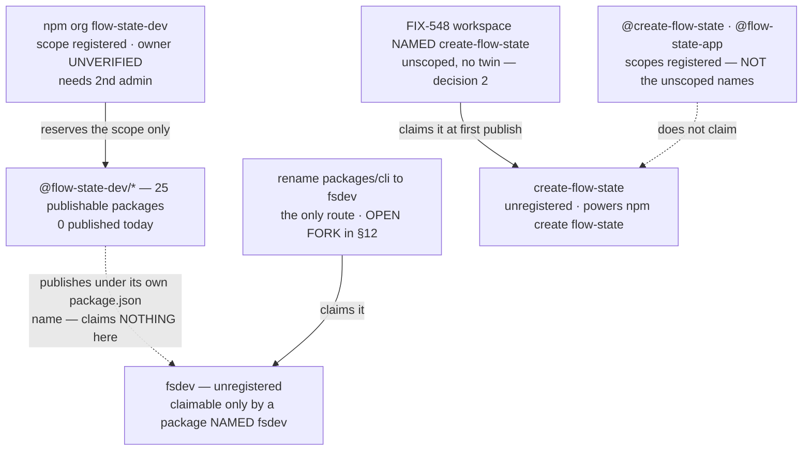

# FIX-1162: Claim the npm package names the launch needs — Implementation Spec

## Part I — The Case *(for the human)*

### 1. Problem — why it matters, why now

npm names go to whoever registers them first, and they are effectively unrecoverable. This
epic wrote several into a launch plan believing they were ours. **They are not, and we now
know exactly why.**

**The answer, from the owner: *"Yes I have the org. Didn't add the package."*** That one
sentence resolves the whole contradiction this spec has been carrying. npm keeps two separate
namespaces and sells both under the word *name*. Registering an **organization** claims the
scope `@name/…`. Publishing a **package** claims the bare `name`. The reservation flow npm's
UI makes easy is the first one, and it claims nothing a user ever types.

So: **no unscoped name is claimed — not `create-flow-state`, not `flow-state-app`, not
`fsdev`.** *Verified 2026-08-18:* all three return 404, matching the owner's account exactly.
`create-fsd-app` is a separate story and was never ours in any form — the package belongs to
`keyready` (v1.1.2, 2024-10-18) and no `@create-fsd-app` scope exists either.

**The distinction is not a technicality; it has now cost this epic three times.** The org
`types` is registered while the unscoped package `types` belongs to an unrelated user
(`vitaly`). The scope `@fsdev` is registered while the unscoped `fsdev` is still free. And
`@flow-state` is registered even though npm **refused the publish** of the package
`flow-state` — the two namespaces answering differently about the same word on the same day.
That refusal is also why a 404 is not a green light: it means unregistered, not publishable,
and **only an attempted publish settles a name.**

**One thing is still open, and it is the largest item here.** The owner said "the org",
singular, and four matching scopes are registered — `@flow-state-dev`, `@create-flow-state`,
`@flow-state-app`, `@flow-state`. Either more were created than recalled, or some belong to
strangers. npm hides member lists (`@flow-state-dev` answers `{}` rather than naming an
owner), so **whether the `@flow-state-dev` scope is ours cannot be read from outside.** Every
package this project ships lives under it. §12 carries the one command that settles it.

**Why now** — the exposure is time-based, not effort-based. Money has been spent, four scopes
registered, and **not one of the names a stranger actually types is held.** The gap between
believing this is handled and it being handled is the thing with a clock on it.

### 2. Solution in plain terms

Name the scaffolder `create-flow-state`, matching the published brand rather than the CLI
abbreviation, and matching npm's shorthand: `npm create flow-state my-app`. That is the one
naming decision this spec still settles.

Then **verify what is actually held** before recording anything as secured. Scopes and
unscoped packages are different namespaces, and the evidence says we are holding scopes. The
checks that separate them are three read-only commands the owner runs from their own npm
session. They change nothing, so they do not wait on this spec being approved — and one of
them is what tells you whether the rest of this spec is even addressed to the right account.
§12 is the ask; §10 block 1 is the commands.

The `@flow-state-dev` namespace is confirmed to exist. Confirm it is ours, then add a second
administrator, because an organization one person can administer does not survive that person
being unreachable. Adding the administrator is an account change, so that half waits for
approval.

And **stop, deliberately, short of claiming unscoped names by publishing stand-ins.** npm's
[dispute policy](https://docs.npmjs.com/policies/disputes) forbids publishing "simply for the
purposes of reserving [a name] for future use." The unscoped names get claimed by the packages
that genuinely want them, at their first publish.

That leaves a real gap. **Every name a stranger types is unheld** — `fsdev`,
`create-flow-state` and `flow-state-app` alike — because what was bought were organizations,
which claim no unscoped name. `create-flow-state` is closed by decision 2, since FIX-548's
workspace is simply named that. `fsdev` is not closed by anything, and **that is the one open
decision in this spec**: rename the CLI package to `fsdev` and publish it, or accept that we
may lose it. §12 prices the fork and recommends taking the cheap half of it.

**Philosophy** — tenet 3 (earn every addition): this still adds nothing to the repo. Tenet 1
(surface incoherence): the epic's transcripts promise `npx fsdev init` while its sub-spec
prints `npx @flow-state-dev/cli init`; that disagreement is decision 3, not quietly resolved.
Tenet 7 / BP-003: the "verified free" table this spec was built on was a green result from a
check aimed at a neighbour of the claim — §9 now says so in the spec rather than in a review
thread.

### 6. Decisions & rules — the sign-off surface

1. **The `@flow-state-dev` namespace is held as an npm *organization*, and is not considered
   secured until a second **administrator or owner** is on it.**
   The scope is confirmed to exist. Whether it is ours is the credential holder's check, not
   an assumption (§10). npm's policy standard is names "intended for immediate and active
   use"; a monorepo of twenty-five publishable packages weeks from publishing under that scope
   meets it about as plainly as it can be met.
   *Rejected:* claiming it under one person's npm user, which reserves the namespace
   identically and takes thirty seconds less.
   *Locks in:* every package we ever publish lives under an account more than one person can
   administer. The bill for getting this wrong arrives the day a security release has to go
   out and the individual account holder is unreachable — recoverable, but through npm
   support, on npm's timetable rather than ours. **A second *developer* does not satisfy this**;
   only `admin` or `owner` can manage the org, so §10 asserts the role rather than counting
   members.

2. **The scaffolding tool is ONE package, published unscoped as `create-flow-state`. There is
   no scoped twin.**
   npm documents the transformation as `npm init foo` → `npm exec create-foo`, so the unscoped
   `create-flow-state` is both the name that gets claimed and the package that powers `npm
   create flow-state my-app`. A scoped `@flow-state-dev/create-flow-state` alongside it would
   claim nothing extra, would be reachable only as the clumsier `npm create
   @flow-state-dev/flow-state`, and would create exactly the permanently version-locked
   duplicate surface this same decision uses to reject reviving the old name. FIX-548's
   workspace is therefore *named* `create-flow-state` rather than scoped-and-twinned.
   **The unscoped name is not held today** — 404 on the registry, with only the `@create-flow-state`
   *scope* registered (§1), which claims nothing. It gets claimed by that workspace's first
   publish.
   *Rejected:* a scoped package plus an unscoped forwarder — two published surfaces in version
   lockstep, for a command npm already resolves to the unscoped one.
   *Rejected:* `create-flow-state-app` — it adds a word that the `npm create` shorthand then
   swallows anyway.
   *Locks in:* the name a stranger types to start a project, in one brand rather than two.
   FIX-548 is in spec review and has built nothing, so this costs an edit today; after that
   spec is approved it costs a re-spec, and after launch it is a broken command in published
   material.

   **`create-fsd-app` is left dormant — no redirect, no alias — if it turns out we hold it at
   all.** Two reasons, and the first is decisive: on the evidence in §1 that package is still
   an unrelated project's, published to real users in 2024, and republishing it as our
   forwarder would break their installs. Even if it were ours, a redirect is a second
   published surface kept in permanent version lockstep, pointing at a brand we have just
   retired — every install of it is somebody following a stale instruction we chose to keep
   alive. Dormant costs nothing and forecloses nothing.

3. **An unscoped name is claimed only by a package actually *named* that. This issue claims
   none of them, and whether we claim `fsdev` early is the open fork in §12.**
   The compliant mechanism is a package that does something, and every package that wants
   these names will do something. But it has to carry the name in its own `package.json`:
   publishing `@flow-state-dev/cli` does **not** claim `fsdev`. *(This corrects the previous
   draft, which said the name would be claimed by the CLI's first publish. It would not.)*
   Decision 2 already fixes the scaffolder half by naming that workspace `create-flow-state`
   outright. The CLI half needs a rename, and **that is a live decision, not a settled one** —
   §12 puts it to you priced.
   *Rejected:* publishing stand-ins now — forbidden by the clause quoted in §2, and the weakest
   protection available: a package that does nothing is the one shape a disputant can point at.
   *Rejected:* running the **unmodified** snapshot workflow to claim `fsdev`. It publishes the
   scoped names and claims nothing here (§3). This is not the same as the rename route, which
   is live.
   *Locks in, if the §12 fork goes the way I recommend:* exposure on `fsdev` until the CLI is
   renamed and published. If someone takes it in that window it is gone for good, and the
   epic's headline command changes.

**Non-goals** — *executing* the CLI rename, changing FIX-1159's design, the scaffolding tool
itself (FIX-548), and releasing the framework packages. This spec settles names; it ships no
software and commits no files. **Whether to rename is decided here (§12's fork); doing it is
not** — if that fork goes the other way it becomes its own issue, with the surface §12
enumerates.

**Size:** Small — 0 production files · 0 CI test behaviours · 0 doc surfaces · 1 PR
(an empty changeset and the Linear record).

---

### 3. Tradeoffs & alternatives

**Publishing the workspaces as they are named today claims neither short name.** Changesets
publishes each workspace under the name in its own `package.json`. No workspace is named
`fsdev` — the CLI's package name is `@flow-state-dev/cli`, and `fsdev` is only the `bin` key
inside it, which is a command on an installed machine and is invisible to the registry. So
running any publish pipeline unchanged claims **nothing** on the unscoped `fsdev`. *(Verified:
all 39 workspace `package.json` names read; 25 are non-private; none is `fsdev`.)*

**That kills one route to `fsdev` and leaves another: rename the package, then publish it.**
This is the alternative I most nearly recommended last round, and correcting the pipeline
misreading did not remove it — it made it the only route. §12 prices it as a live fork rather
than deciding it here, because losing `fsdev` changes the command a stranger types, which is
the owner's call and not mine to close by argument.

It is also the better end state on the merits: one package carrying the name people type,
rather than a scoped package plus a forwarding alias in permanent version lockstep — the shape
`vite`, `prisma`, `turbo` and `next` all use. The cheapest moment to rename is before anything
is published, which is now.

**The publish path: authentication is fine, release-plan assembly is not.** Two separate
things, and I have now been wrong about each of them once.

- **`release.yml` authenticates correctly.** It uses `changesets/action@v1`, passing `NPM_TOKEN`
  as an env var — the action's own publishing configuration. *(Verified in the v1.9.0 source:
  when `NPM_TOKEN` is set it writes `//registry.npmjs.org/:_authToken=…` into `~/.npmrc` itself.
  The `.npmrc` handling was removed in the action's **2.0.0**, which this repo does not use.)*
  No `registry-url` and no repo `.npmrc` are needed on this path.
- **`snapshot-release.yml` genuinely cannot authenticate.** It calls `pnpm changeset publish`
  directly, where nothing translates `NPM_TOKEN` into registry auth, and there is no
  `registry-url` and no `.npmrc`.
- **But neither path can publish today, because the release plan does not assemble.**
  *Verified by execution at this commit:* `changeset status` **and** `changeset version` both
  exit **1** with `Found mixed changeset approval-card-receipt … Mixed changesets that contain
  both ignored and not ignored packages are not allowed`, thrown from `assembleReleasePlan` —
  the single planner both commands share. `release.yml` runs `pnpm version-packages` →
  `changeset version`, so it fails there, before authentication is ever reached.
  **The mechanism:** `@flow-state-dev/ui` is `private: true` **with no `version` field**, so
  changesets auto-ignores it (the config's own `ignore` list is empty). **Six** pending
  fragments name it alongside publishable packages; `approval-card-receipt`, which pairs it
  with `@flow-state-dev/react`, is simply the first one hit.
- **So the release path needs a repo fix, not just a secret.** `CHANGESETS_TOKEN` being unset
  (publish step **skipped** on the 2026-08-15 run) is a second, independent blocker. *This
  corrects last round, where I reported the token as the only thing missing.*

**Where the complexity is:** it is no longer "only an actual publish proves a name is
claimable" as a theoretical caveat. It happened. `flow-state` was 404 and was refused, and
the mechanism — npm's similarity check after stripping punctuation — is exactly the one this
spec flagged and then did not weight heavily enough. `create-flow-state` reduces to
`createflowstate` against the taken `flowstate`; it carries the same shape of risk that just
fired, which is why §12 keeps a fallback order and §9 makes the refusal a first-class case.

### 4. Focus practices (1–5)

1. **BP-003 (verification evidence)** — every claim here was executed against
   `registry.npmjs.org` or the repo on 2026-08-18, including the ones handed to me as settled.
   Three came back different from how they were reported: `create-fsd-app`'s ownership (§1),
   the snapshot workflow's ability to claim `fsdev` (§3), and npm's unpublish rules (§12). The
   one claim that cannot be executed from outside — *is this scope ours* — is stated as
   unverified and routed to §12's ask rather than assumed.
2. **Tenet 7 (a green result from a check aimed at a neighbour of the claim)** — this spec has
   now produced **three** of these itself, which is why §10 carries a search as an acceptance
   step rather than a list. "404 on the registry" answered *is this name registered* and was
   read as *can we have this name*; the `flow-state` refusal is that gap turning real. "The repo
   has a publish workflow" answered *can we publish* and was read as *can we publish under a
   chosen name*; §3 is that gap turning real. And the rename inventory was twice "re-executed"
   by re-checking the categories already on the list — which answers *are these entries still
   right*, not *is the list complete*. It was not: seven files were missing, including source
   in a second package.
3. **Tenet 1 (surface incoherence, don't route around it)** — the owner reported owning three
   names while the registry showed none of them held. That was recorded as an open contradiction
   with the command that settles it, rather than averaged into agreement — and it turned out to
   be a real distinction (org versus package) that the owner had hit in the wild, not a
   bookkeeping error.

### 5. What using it looks like (1–5 examples)

Nothing about how code is written against the framework changes, and nothing at the command
line changes today. The one observable effect is the name a stranger types to start a project,
once FIX-548 ships *(the left column is FIX-548's current spec)*:

```
before   npx @flow-state-dev/create-fsd-app my-app
after    npm create flow-state my-app     # one unscoped package, no scoped twin
         npx create-flow-state my-app     # the same package, spelled out
```

Until somebody renames the CLI package to `fsdev` and publishes it, `npx fsdev` keeps doing
what it does today: failing with npm's own "could not determine executable to run". Decision 3
accepts that. Note this is *not* fixed by the framework's first publish, which ships the CLI as
`@flow-state-dev/cli`.

## Part II — The Build Plan *(for the implementing agent)*

### 7. Technical design

There is no code in this issue. The design is which name is claimed by what, and when.



- **The organization is the only thing this issue executes**, and the largest piece of it is
  already done: the scope is registered. What remains is confirming it is ours and adding a
  second administrator.
- **A scope is not an unscoped package name, and neither is a `bin` key.** This is the
  design's load-bearing distinction after this revision, and it has two edges. Holding
  the org `create-flow-state` gives **no** rights over the package `create-flow-state`, and
  `npm create flow-state` resolves to the latter. Separately, npm registers what is in a
  package's `name` field: `packages/cli` is named `@flow-state-dev/cli` and merely exposes a
  command called `fsdev` via `bin`, so **publishing it claims nothing on the unscoped
  `fsdev`.** An unscoped name is claimed only by a package whose own `name` is that string.
  Redundancy then comes from `npm owner add <user> <package>` — §10 checks the owner list, not
  the publisher.
- **The scaffolder needs no rename decision; the CLI does.** FIX-548 has built nothing, so
  naming its workspace `create-flow-state` costs an edit and claims the name at its first
  publish. `packages/cli` already exists under a scoped name that two sibling specs are written
  against, which is why the same move costs more there and is a fork rather than an edit.
- **Nothing is committed to the repo.**
- **Untouched:** every workspace package, the release pipeline, CI, and `packages/cli`.

### 8. Implementation sequence

**The dividing line is whether a step changes account state, not whether it touches npm.** A
read-only lookup leaves nothing behind and can be undone by closing the terminal, so it does
not wait on approval — and it cannot, because its output is what §12 asks you to approve
*on*. An account mutation is externally visible and is what approval gates. *(The previous
draft put every step after approval, which deadlocked against §12 asking for a lookup before
it. Split here; the lookups moved up.)*

**Before approval — read-only evidence gathering only. Nothing is written, on npm or in the
repo:**

1. **Confirm the `flow-state-dev` organization is ours** — `npm org ls flow-state-dev`.
   *Test:* §10's block 1. *Depends on:* nothing. One command; the owner has already answered
   what is held under the other names, so this is the only lookup left. §12 is the ask.

**After approval — account mutations, repository changes, and outbound corrections:**

2. **Add a second administrator or owner to the `flow-state-dev` organization.** *Test:* §10's
   block 2. *Depends on:* spec approval, and on step 1 coming back saying the org is ours.
3. **Empty changeset**, created on the implementation branch. No workspace package changes and
   nothing here is published by the pipeline, so `pnpm changeset --empty` (BP-022). *Depends
   on:* spec approval. *(It sat before approval in an earlier draft. That was wrong twice over:
   it writes to the repo, and a fragment created on this never-merged spec branch would be
   stranded.)*
4. **Raise the cross-cutting corrections where they belong**, as comments rather than edits
   from this branch: decision 2 on FIX-548's spec PR (#1312, in review, so the change is an
   edit rather than a re-spec), and §1's namespace finding, the 404-is-not-a-green-light rule
   and decision 3's corrected claiming rule on the epic PR (#1301), whose transcripts and
   running index still say `npx fsdev init` and `create-fsd-app`. *Depends on:* spec approval.
5. **File the rename issue, if the owner picked option A or B — via `issue-manager`, before this
   issue closes.** This issue deliberately does not *perform* the rename (§6 non-goals), and no
   other spec in the epic owns it, so without this step the one time-sensitive piece of work
   here is untracked while FIX-1162 completes on an org mutation and an empty changeset. The new
   issue carries: the §12 rename surface as its starting inventory, §10's `rg -nP` acceptance
   step as its definition of done, and the release-plan repair (six mixed fragments) if option B
   was chosen. **Blocks:** the epic's launch material, which advertises `npx fsdev`.
   *Depends on:* the §12 fork being answered. *(Option C files nothing — record the decision
   instead, and reword the epic's `npx fsdev` commands.)*
6. **Record the outcome on the Linear issue** — which names are secured *as unscoped packages*,
   which are held only as scopes, which are deferred under decision 3, which fork option was
   chosen, and the identifier of any issue filed by step 5. That record *is* the deliverable the
   issue asked for. *Depends on:* 1, 2, 5.
7. **No removals in this change**, and none commissioned in future ones.

**Handed on:** an unscoped name is claimed only by a package whose own `package.json` carries
it. `create-flow-state` is handled — FIX-548's workspace is **named `create-flow-state` and
published only as that unscoped package, with no scoped twin** (decision 2), so shipping it
claims the name as a side effect. `fsdev` is handled by nothing until step 5 files the issue
for it. Whoever publishes either adds a second owner at that point.

**This issue is not done when the org has a second admin.** It is done when the fork is
answered, the outcome is recorded, and — under A or B — the rename issue exists with an owner.
Closing it with `fsdev` untracked would leave the epic advertising a command nobody is building.

### 9. Edge cases & error handling

| Case | Expected |
|---|---|
| **npm refuses a name at publish time despite a 404** | The default assumption, not the surprise. It already happened to `flow-state`. A 404 means unregistered; the similarity check runs at publish and compares after stripping punctuation. **Stop and return to the owner for sign-off** (§12) — do not publish the next candidate. Record the refusal and never treat a registry check as a claim. |
| `create-flow-state` is refused for similarity to `flowstate` | Same shape as the `flow-state` refusal, one word further away. **Escalate, do not substitute:** every candidate name is also a different `npm create` command, so choosing one changes the advertised product surface. Surfaces at FIX-548's first publish, not here. |
| A name is held as a **scope/organization** but the unscoped package is still open | Not secured, and this is the epic's actual situation for four names. Different namespaces (§1). Anyone can still publish the unscoped name, and that is the name `npm create` resolves. Record it as open, not as claimed. |
| Someone reports having "bought a name" on npm | Ask which namespace. Registering an organization and publishing a package are both bought under the word *name*, and only the second claims what a user types. Confirm with `npm owner ls <name>`, never with a receipt. |
| The `flow-state-dev` organization turns out not to be ours | Stop and escalate. Every package name across the epic is then wrong, and two sibling specs' fallback plan is gone. |
| `fsdev` is taken by someone else | The risk decision 3 accepts, and it is unrecoverable: npm "does not resolve squatting claims on demand" and transfers names only on a trademark or IP claim. The window is *not* "until the framework's first publish" — that publish claims nothing here — it is until someone renames a package to `fsdev` and publishes it. The epic's headline command gets reworded rather than renamed; §12 has no acceptable fallback. The `@fsdev` scope is already registered to someone else, so `@fsdev/cli` is not a fallback either. |
| Someone reads a `bin` name as a claim | It is not one. `packages/cli` exposes the `fsdev` command while being published as `@flow-state-dev/cli`; the registry only ever sees the `name` field. This is the mistake that produced the retired early-publish option (§3). |
| A name is claimed but only one account can publish it | Not yet secured. Creating the organization does not confer ownership of an unscoped package; `npm owner add` does. |
| A second org member is added as a `developer` | Not yet secured. Only `admin` or `owner` can manage the organization, which is the failure decision 1 exists to survive. |
| Someone proposes holding a name with a stub after all | Refuse and point at the clause in §2. Against npm's terms, and the weakest claim available. |

**Taxonomy:** every failure here is a naming failure, and each is fatal to its step rather
than retryable — a name is claimable or it is not. None degrade.

### 10. Testing strategy

**Goal:** we can state, per name, whether we hold the unscoped package, only the scope, or
neither — and that the namespace is administrable by more than one person. Only the credential
holder can run the first two blocks.

*Block 1 — read-only, runs before approval (step 1).* Nothing here writes; this is the
evidence §12's ask is asking for. **One command**, because the owner has already answered the
rest: no package was ever published, so every unscoped name is open and needs no lookup.

```
npm org ls flow-state-dev    → lists our members  → the org is ours
                             → error / not found  → it is NOT ours; stop and escalate
```

*(`npm owner ls <name>` and `npm access list packages` were in this block for two rounds. They
are now redundant — they would confirm what the owner has stated directly. Run `npm owner ls`
only if the org lookup comes back surprising.)*

*Block 2 — after approval, and it is the only assertion on a mutation (step 2).* Assert the
**role**, not the member count:

```
npm org ls flow-state-dev    → at least one member besides the primary holder
                               showing `admin` or `owner`
```

*Cross-check without credentials*, which is what produced §1 and what anyone can re-run:

```
curl -s -o /dev/null -w '%{http_code}\n' https://registry.npmjs.org/<name>
      → 200 = published, 404 = unregistered (NOT "available")
curl -s https://registry.npmjs.org/-/org/<name>/user
      → {"error":"Scope not found"} = not registered
      → {"someuser":"owner"}        = registered, owner publicly listed
      → {}                          = registered, members NOT public — this is what
                                      @flow-state-dev returns, and it is why block 1
                                      cannot be replaced by a curl
```

*Deferred to the publishes that claim them*, recorded so they are inherited rather than
rediscovered:

```
npm view fsdev maintainers              → our account, plus a second owner
npm view create-flow-state maintainers  → our account, plus a second owner
npx -y fsdev@latest --help              → the real CLI's help output
```

Record block 1's output on the Linear issue — that record *is* the deliverable the issue
asked for.

**CI specs: none, deliberately.** This change commits no code. The only assertion worth making
is *does npm consider this namespace ours*, which is a fact about a remote registry and
unreachable from CI.

**Acceptance step, if §12's fork takes the rename (option A or B).** The rename is **not done
when the list in §12 is exhausted** — it is done when the repo has no stale references left.
That inventory has been wrong twice, both times because someone re-checked the categories
already on the list instead of the repo, so the list is a starting point and this search is the
gate (BP-034, tenet 7):

```
rg -nP '@flow-state-dev/cli(?![A-Za-z0-9_-])' --hidden \
   -g '!node_modules' -g '!.git' -g '!dist' -g '!spec/**'
      → must return ZERO matches, except packages/cli/CHANGELOG.md,
        which keeps its historical heading
```

**`-P` is required, not decoration:** rg's default engine rejects look-ahead, and the
look-ahead is what stops `@flow-state-dev/client` matching as a prefix. A plain
`rg '@flow-state-dev/cli'` returns 13 docs pages instead of 5 and reads like a much larger
rename — that false signal is how one of the earlier bad counts happened. *(Verified today:
the command above returns 34 files / 49 references.)*

Run it as the last step, not the first. Expect it to find things the list does not: the current
inventory already spans source files, a *different package* (`packages/core`), repo-orientation
docs, and a changelog — none of which the first two versions of the list mentioned.

**Discipline:** neither `tdd` nor `diagnose`. There is no behaviour to drive out.

### 11. Documentation plan

**No docs changes required**, and this is a real answer rather than a punt:

- Nothing user-facing changes here. Decision 3 keeps every documented command as FIX-1159's
  and FIX-548's specs already write it, and no package is added or renamed in this repo.
- The documents that *are* wrong — the epic spec's transcripts and running index, and FIX-548's
  spec — are not `apps/docs` pages and are not edited from this branch. §8 step 4 raises both
  where their owners can act on them.
- The install and invocation surface changes only if the §12 follow-up rename happens, which is
  after the first release. That surface is enumerated once, in §12.

### 12. Dependencies, open questions & follow-ups

**Dependencies:** the npm account and its 2FA. No agent in this epic holds them, so every
lookup and every mutation sits with the owner. Nothing in the repo blocks this issue.

#### Is the `@flow-state-dev` scope actually ours? — a one-minute check, and it gates everything below

**Settled, and it is the fact this spec now rests on.** The owner's own words: ***"Yes I have
the org. Didn't add the package."*** So the purchases were **organizations**, and **zero
unscoped names are held** — not `create-flow-state`, not `flow-state-app`, not `fsdev`. This is
no longer asserted-versus-verified; it is answered, and it matches the registry 404s exactly.

**The distinction, because the owner hit it in the wild and it has now bitten this epic three
times.** npm keeps two namespaces and sells both under the word *name*. A *scope* (`@name/…`)
is claimed by registering an organization, costs nothing, and is what npm's UI makes easy. An
*unscoped package* (`name`) is claimed only by publishing a package whose `package.json` `name`
is that string — and that is what a user types. **Verified by counterexample:** the org `types`
and the unscoped package `types` belong to different parties (`vitaly` owns the package); the
scope `@fsdev` is registered while the unscoped `fsdev` is still free. Most tellingly,
**`@flow-state` is registered even though publishing the *package* `flow-state` was refused** —
the two namespaces answering differently about the same word on the same day.

**What is still open is which org.** The owner said "the org", singular, and four matching
scopes are registered. Either more were created than recalled, or some belong to strangers —
and npm hides member lists, so this cannot be read from outside. If it is `flow-state-dev`, the
largest item in this spec closes. If it is not, `@flow-state-dev` may be somebody else's and
the epic has a much bigger problem. One command settles it.

Everything re-executed 2026-08-18:

| Name | Unscoped package | Scope / org | Reading |
|---|---|---|---|
| `flow-state-dev` (the scope everything ships under) | 200 — **`jezweb`**, v2.1.3 | **registered**, owner not public | the scope exists; **whether it is ours is unknown** |
| `create-flow-state` | 404 — unheld | **registered**, owner not public | we hold an **org**, not the name |
| `flow-state-app` | 404 — unheld | **registered**, owner not public | same |
| `flow-state` | 404 — unheld (publish was refused) | **registered**, owner not public | same |
| `create-fsd-app` | **200 — `keyready`, v1.1.2, 2024-10-18** | **not registered** | held in **neither** namespace — not ours in any form |
| `fsdev` | 404 — unheld | registered to **someone else** (`{"fsdev":"owner"}`) | the scope is gone; the name is still free |

The organization reading covers three of the four scopes. It does **not** cover
`create-fsd-app`, where there is no org and the package is someone else's — that one was never
acquired in any form, and no lookup will change it.

**What it costs you: one command, about ten seconds.** The owner's answer already settled
whether packages were published (they were not), so the three commands this section used to ask
for have collapsed to the one that is still genuinely unknown:

```
npm org ls flow-state-dev     lists members  → the scope is OURS. The largest item in
                                               this spec closes, and everything proceeds.
                              errors / 404   → it is NOT ours. Stop the epic: every package
                                               name in it is wrong, both sibling specs'
                                               fallback is gone, and this becomes urgent.
```

**My recommendation: run that one command, paste the output into the Linear issue, and plan on
claiming every unscoped name by publishing.** The second half is no longer a judgement call —
the owner has confirmed no package was ever published, so every short name is open and the only
way to close one is to ship software under it. That record is this issue's deliverable.

**What would change my mind:** nothing about the unscoped names — that is answered. On the org,
only the command output, or an npm receipt naming an *organization* rather than a package.

**If I'm wrong about the org:** this is the largest blast radius in the epic. Everything the
project publishes lives under `@flow-state-dev/`. If that scope belongs to someone else, three
specs, the launch plan and the install instructions in the docs are all wrong at once, and we
find out on the day of the first publish instead of today.

#### Rename the CLI to `fsdev` and publish now, or keep the scoped name and risk losing `fsdev`?

**Plain terms.** The first command we ask a new user to type is `npx fsdev`. Nobody owns that
name. The only way to own it is to publish a package actually called `fsdev`, which means
renaming our command-line tool from its current long name and putting it on the public registry
weeks before we planned to launch. If we don't, anyone can take the name, and then our headline
command becomes something longer and uglier — permanently.

**Three options, not two.** The rename and the publish are separable, which is the whole shape
of this decision:

| | Option | Claims `fsdev`? | What it costs |
|---|---|---|---|
| **A** | **Rename now, publish at the normal first release** *(recommended)* | At the real release | The rename work below. Exposure continues until that release |
| **B** | **Rename now, publish as soon as the pipeline can** | Not today — the release plan does not assemble at this commit | The rename **plus** a release-pipeline repair **plus** publishing 25 packages weeks early |
| **C** | **Keep the scoped name, accept the exposure** | Never | Nothing today; `npx fsdev` never works and the epic's headline command is reworded |

**The trade-off, priced.** Renaming is cheap. Publishing early is what costs.

- **What the rename touches.** *Verified:* **no workspace in the repo depends on
  `@flow-state-dev/cli`** — it is a leaf, so no package's dependencies change. A repo-wide
  exact-boundary search finds **34 files, 49 references**: **14** pending changeset fragments
  (a fragment naming a package that no longer exists fails `changeset version`), **5** docs
  pages, **4** `.agents/skills/` files, **3** source files — including
  `packages/core/src/helpers/slash-command.ts`, which is a *different package* — **2** READMEs,
  `packages/cli/CHANGELOG.md`, `packages/cli/package.json`, `tsconfig.base.json`, and three
  repo-orientation docs (`CLAUDE.md`, `CONTRIBUTING.md`,
  `docs/architecture/overview.md`). Perhaps a day. **Treat this list as a starting point, not a
  contract** — see §10's acceptance step; a hand-maintained version of it has been wrong twice.
- **The real cost is the sibling specs, and it is the number I am least sure of.** FIX-1159 is
  a design written against `@flow-state-dev/cli`, and its printed commands assume a resolvable
  `fsdev`, so renaming means re-cutting it mid-review. FIX-548's exposure is narrower — whatever
  install line its generated project prints — and I am pricing that from outside its spec rather
  than from inside it, since it is being reworked concurrently.
- **Publishing early means publishing everything.** `changeset publish` publishes every public
  workspace whose version is absent from npm, and nothing is published, so the first run
  publishes **all 25** — not just the CLI. A usable CLI needs at minimum its own dependency
  closure, which is **9 further packages** (`core`, `contracts`, `engine`, `node`,
  `store-sqlite`, `scheduled`, `testing`, `devtool`, `client`) — 10 in total. Either way this
  is the public 1.0-shaped surface arriving before we intended.
- **Option B needs a repo repair first, and this is the price I got wrong last round.** I
  reported that publishing needed only a secret. It does not: **no release can be assembled
  today at all.** *Verified by execution* — `changeset status` and `changeset version` both exit
  1, because `@flow-state-dev/ui` is private with no `version` field (so changesets ignores it)
  while **six** pending fragments pair it with publishable packages, which is fatal. Both
  workflows call the same planner, so both are blocked. Fixing it means editing those six
  fragments or giving `ui` a version — small work, but it is **release-pipeline work that
  option B must complete before it can claim anything**, on top of setting `CHANGESETS_TOKEN`
  and confirming `NPM_TOKEN`. Option A inherits the same repair, but at the normal release,
  when it has to happen regardless.
- **Genuinely irreversible: very little.** Correcting last round's error — npm permits
  unpublishing at any time when a package has no registry dependents, under 300 weekly
  downloads, and a single maintainer, all of which fresh packages meet. Two caveats I could not
  settle: our 25 packages *depend on each other*, so they would have to come down in reverse
  dependency order; and decision 1 adds a second org admin, which may or may not defeat the
  "single maintainer" criterion — npm does not say, and I will not test it on production names.
  What is permanent is only that a given `name@version` pair can never be reused. **The real
  one-way door is reputational, not technical:** packages people can `npm install` today are
  packages some of them will depend on tomorrow.

**My recommendation: option A — rename now, publish at the normal first release.** The rename
is strictly cheaper today than at any later point: after the sibling specs are approved it is a
re-spec, and after launch it is a broken command in published material. So take the cheap half
now. Option B buys a small risk reduction for a large, permanent widening of what we have
shipped — and it is **slower to execute than it looks**, because the release pipeline cannot
assemble a plan at this commit, so B cannot claim `fsdev` "today" in any case. Option C throws
away a name we can still have for a day's work. A accepts a real exposure window and is honest
about it.

**Note the asymmetry between the two short names, because it is the whole decision.**
`create-flow-state` gets claimed **as a side effect of FIX-548 shipping**, since that workspace
is simply named it — no decision required. `fsdev` gets claimed **only if the CLI is renamed**,
because a `bin` key is invisible to the registry. That is why one of these names needs your
sign-off and the other does not.

**What would change my mind — toward B:** evidence anyone else is moving on `fsdev`, or launch
material already promising `npx fsdev` to people outside the team. Either converts a
speculative loss into a concrete broken promise, and then publishing the 10-package closure
early is worth it. **Toward C:** if re-cutting FIX-1159 mid-review is more disruptive than I
can see from outside its spec — that is the one cost here I am pricing at a distance.

**If I'm wrong:** under A we lose `fsdev` in the exposure window. The headline command gets
longer, published material promising it is wrong, and it is unrecoverable — npm transfers names
only on a trademark claim. It breaks no customer and blocks no release; the scoped names carry
the product either way. Being wrong toward B costs a public surface we cannot quietly withdraw;
being wrong toward C costs the name permanently for no saving beyond a day.

**Which names the launch actually requires.** Every command the epic advertises resolves to a
package that does not exist yet. Nothing here is held today, so this is the full list of what
must be published before the documented onboarding path works at all:

| The command we advertise | What must exist on npm | Owned by | Status |
|---|---|---|---|
| `npm create flow-state my-app` | unscoped package **`create-flow-state`** | FIX-548 — claimed as a side effect of it shipping | not published |
| `npx fsdev <cmd>` | unscoped package **`fsdev`** | **nobody, unless the fork above picks A or B** | not published |
| `pnpm add @flow-state-dev/core` *(and 24 siblings)* | the **`@flow-state-dev` scope**, confirmed ours | this issue | scope registered, ownership unverified, 0 published |

Two consequences worth stating plainly rather than leaving implied. **The `fsdev` row is the
only one whose owner is a decision rather than a plan** — decision 3 corrects the previous
draft's belief that the CLI's first publish would claim it, so under option C every `npx fsdev`
in the epic's material is a command that will not run. And **the third row gates the other
two**: nothing publishes at all until the scope is confirmed ours.

**What this issue owes its siblings.** FIX-548 planned to alias the unscoped `create-fsd-app`
"if and when FIX-1162 secures it" — it is not ours (above), and the name is now
`create-flow-state`, published unscoped with no scoped twin (decision 2). FIX-1159's dependency
section is correct that this issue does not block it, but two things land on it: the fork above
would re-cut the CLI package name it is written against, and its printed commands assume a
resolvable `fsdev` that the table above says does not exist.

**Premise correction for the epic (raised on #1301, #1310, #1312, not edited here).** Both
sibling specs describe publishing under "the scoped package name we already own." The scope is
confirmed to **exist**; that it is **ours** is unverified, and nothing is published under it.
The sentence is safe once the org lookup comes back clean, and not before.

**If a name is refused at publish time, stop and come back for sign-off. Do not auto-select the
next candidate.** Every name here returned 404 on 2026-08-18, which per §1 means unregistered
and **not** confirmed publishable, so a refusal is a live possibility rather than a hypothetical
— it already happened to `flow-state`.

The reason this is a gate and not a fallback list: **the package name *is* the advertised
command.** `npm init foo` runs `create-foo`, so publishing `create-flow-state-app` instead of
`create-flow-state` silently changes the command from `npm create flow-state` to `npm create
flow-state-app`. That is a different product surface from the one decision 2 approved, and it
would reach users through docs nobody re-read. An earlier draft listed an auto-fallback order
here; it also referenced a "scoped half" of decision 2 that no longer exists, since the
scaffolder now ships as one unscoped package.

- **Candidates to bring to that conversation**, not to apply unilaterally: `create-flow-state-app`,
  `create-flowstate-app`, `create-flow-state-dev-app` — each progressively further from the
  taken `flowstate`, which is the collision that fired on `flow-state`. Each also renames the
  command, which is the part the owner is deciding.
- **CLI short name: no acceptable substitute exists.** `fsd`, `fsd-cli`, `fsdev-cli`,
  `flowstate` and the unscoped `flow-state-dev` are all taken by unrelated projects, and the
  `@fsdev` scope belongs to someone else. A refusal on `fsdev` is escalated, full stop.

**Follow-ups (flagged, not built):**

- **Release-pipeline repairs — now a prerequisite for publishing anything, not a nicety.**
  *Verified by execution:* `changeset status` and `changeset version` both exit 1, because
  `@flow-state-dev/ui` is private with no `version` field (so changesets ignores it) while six
  pending fragments pair it with publishable packages. **Both** workflows call that same
  planner, so no release can be assembled at this commit. Fix by editing those six fragments or
  giving `ui` a version. Separately, `snapshot-release.yml` cannot authenticate (no
  `registry-url`, no `.npmrc`), and `release.yml`'s publish step is gated on the unset
  `CHANGESETS_TOKEN`. `release.yml` needs no auth fix — `changesets/action@v1` handles that
  itself. Not this issue's work, but the first release cannot happen without it.
- **The rename surface is *derived*, not maintained (BP-034).** A hand-written list has been
  wrong twice, so the durable artifact is the command, not the table. Run it and read the
  output; §10 carries the same command as the acceptance gate.

  ```
  rg -nP '@flow-state-dev/cli(?![A-Za-z0-9_-])' --hidden \
     -g '!node_modules' -g '!.git' -g '!dist' -g '!spec/**'
  ```

  **On 2026-08-18 that returned 34 files / 49 references** — spanning changeset fragments (14),
  docs-site pages (5), `.agents/skills/` (4), **source files (3, one of them in
  `packages/core`)**, READMEs (2), `packages/cli/package.json`, `tsconfig.base.json`, and
  orientation docs (`CLAUDE.md`, `CONTRIBUTING.md`, `docs/architecture/overview.md`,
  `packages/cli/CHANGELOG.md`). Treat those numbers as a sanity check on the command's output,
  not as the list to work through. **No workspace declares a dependency on
  `@flow-state-dev/cli`** (39 manifests scanned), so no dependency edges change.

  **The same command shape covers a scope rename, but the scale does not carry over — and the
  difference is worth knowing before anyone commits to one.** Searching the bare scope,
  `rg -nP '@flow-state-dev(?![A-Za-z0-9_-])'`, returns **~2,016 files** on 2026-08-18, because
  every package's imports match. The 34 CLI files are a small subset of that, not a near-equal
  set. *(I initially wrote that the two overlap almost entirely. Measured, that is wrong by two
  orders of magnitude — recorded here because this spec's recurring failure is exactly this kind
  of unmeasured sizing claim.)* Practical consequence: if a scope change and the CLI rename are
  both taken, run them as **one sweep over one derived list** — not because the sets are similar,
  but because the CLI set sits inside the larger one and a second pass would re-touch and
  re-review it for nothing.
- **`fsdev` is claimed by nothing currently planned** — that is §12's open fork, not a settled
  follow-up. `create-flow-state` *is* claimed, by FIX-548's workspace being named that outright
  (decision 2). Whoever publishes either adds a second owner at that point — §10's deferred
  checks.

### 13. Implementer notes *(recorded verbatim, not folded)*

Below-the-bar review feedback, kept for whoever builds the packages that eventually claim these
names. Not argued with, not folded into the design.

- *(cursor)* "Simpler fork: §7 already specifies the full placeholder contract. Since step 4 is
  always owner hand-publish with credentials, consider whether this issue needs **six committed
  files** at all… If you keep repo placeholders, `tools/` is a new top-level tree that reads like
  `@flow-state-dev/tools`. Consider `npm-names/` at repo root plus a guardrail README." — *the
  first half is now the approach, for a different reason; the second half is moot.*
- *(cursor)* "This FIX-1159 surface inventory (tsconfig, 14 changeset fragments, docs, skills) is
  repeated in §11 and §12 follow-ups. Suggestion: keep one canonical list." — *acted on: the list
  lives once, in §12.*
- *(cursor)* "Step 2 reads as 'don't add a doc' rather than a deliverable. If the only output is
  README prose in the placeholder dirs, merge into step 1 and drop step 2."
- *(cursor)* "This pseudocode block restates the §7 bullets (three files, `bin.js` shebang, no
  deps/build)." — *moot; the sketch is gone with the packages.*
- *(cursor)* "Four scaffolder fallbacks add spec surface. §3 already flags npm similarity as the
  real unknown. Not definite — but primary + `create-flow-state-app` may suffice unless you
  verified similarity for the others too." — *sharpened rather than folded: similarity cannot be
  verified without attempting a publish (§1), so the order stays and §12 now says what the order
  is ordered by.*
- *(cursor)* "Low-probability edge case (someone adds `tools/*` to `pnpm-workspace.yaml`) as a
  full table row + README-only guard." — *acted on: the row is gone with the packages.*
- *(greptile)* "The reference to four `.agents/skills/` files is also stale because that directory
  does not exist." — **factually wrong, corrected inline:** `.agents/skills/` does exist (it is
  `agents/skills/` that does not; `.claude/skills` is the symlink), and four files under it carry
  `pnpm --filter @flow-state-dev/cli`. Re-executed 2026-08-18; the count stands.
- *(codex)* "Rename inventory omits install guides — `apps/docs/docs/getting-started/installation.md`
  and `apps/docs/guides/nextjs-setup.md`." — *folded in round 1; both are in §12's list. Re-verified
  2026-08-18: an exact-boundary grep for `@flow-state-dev/cli` across `apps/docs` returns exactly
  those five pages, so the count and the list are correct.*

---

## Spec evolution

- **Spec drafted** — framed as claiming the npm names before someone else does, with the
  unclaimed `@flow-state-dev` namespace as the largest exposure. Chose placeholder publishes over
  shipping real packages early.
- **After reading the sibling specs** — dropped the recommendation to rename the CLI to unscoped
  `fsdev` in this issue; it became the §3 alternative and a §12 follow-up. The same read turned up
  the real finding: both specs call it "the scoped package name we already own", and nobody had
  verified that we do.
- **Review round 1 — the central deliverable was invalidated, and it deserved to be.** npm's
  dispute policy forbids publishing a package *or registering an organization name* "simply for the
  purposes of reserving it for future use". The two placeholder packages were exactly that and are
  gone (6 committed files → 0). The organization **stays**, because the same page sets the standard
  as "immediate and active use". The unscoped names were **deferred** to the packages that actually
  want them. Also folded: creating the organization confers no ownership of the unscoped names, so
  §7/§9/§10 require `npm owner add`; and the rename inventory gained the two onboarding pages it had
  missed.
- **Fact update — the owner acted on npm, and two of this spec's load-bearing assumptions broke.**
  Not a review round; the world changed under the document. **(a)** The bare `flow-state` returned
  404 and npm **refused the publish anyway**, so "verified free on the registry" never meant what
  this spec used it to mean — §1 and §9 now carry *a 404 means unregistered, not publishable; only a
  publish settles a name*, and §12's fallback list is re-labelled accordingly. **(b)** Checking what
  is now held showed **scopes, not unscoped packages**: `create-flow-state` and `flow-state-app`
  have registered scopes and nothing published, and those are different namespaces — proved by
  counterexample (npm org `types` vs the unscoped `types`, owned by an unrelated user). So the names
  the launch actually types are still open, and §12 carries the contradiction plus the one command
  that settles it. **(c)** Namespace ownership turned out to be *partly* checkable from outside
  after all: npm's scope endpoint distinguishes registered from unregistered, and `flow-state-dev`
  is registered — whether it is *ours* still needs the credential holder. Decision 2 was re-drafted
  from `create-fsdev-app` to **`create-flow-state`** to match the published brand and npm's
  `npm create flow-state` shorthand, with `create-fsd-app` left dormant rather than aliased. Three
  outstanding review findings were folded: §10 now asserts the second member's **admin/owner role**
  rather than counting members, §8 no longer tells anyone to act before this spec is approved, and
  §3's canary alternative is re-priced — it publishes **up to 25 packages, not 8**, and cannot
  authenticate at all today, which is now a §12 follow-up. The rename inventory's five counts were
  re-executed and are unchanged.
- **Directed rework — the early-publish option turned out never to have existed, and three
  smaller things were wrong.** Not a review round. **(a) The `fsdev` fork is retired, not
  re-priced.** Changesets publishes each workspace under its own `package.json` name; no
  workspace is named `fsdev` (39 read, 25 non-private, none named that), and the CLI's `fsdev`
  is a `bin` key, which the registry never sees. Running the snapshot workflow claims nothing
  on the unscoped name, so §3's canary block and §12's six-part fork are **deleted** rather
  than replaced. The recommendation is still *wait*, now resting on the simpler fact that
  there is no early-claim option — the only lawful route to `fsdev` is renaming the CLI
  package, already carried as the §3 alternative and a §12 follow-up. **(b)** The same
  correction propagates: decision 3 previously said each unscoped name would be claimed by its
  package's first publish. It would not — publishing `@flow-state-dev/cli` does not claim
  `fsdev`, and publishing `@flow-state-dev/create-flow-state` does not claim
  `create-flow-state`. Corrected in §6, §7, §9 and handed to FIX-548 in §12. **(c)** *"Versions
  cannot be unpublished after 72 hours"* was wrong and is gone: npm permits removal at any time
  for a package with no dependents, under 300 weekly downloads, and a single maintainer; what is
  permanent is that a `name@version` pair cannot be reused. The argument it supported was
  already gone with (a). **(d)** §8's post-approval rule deadlocked against §12 asking for a
  lookup *before* approval. Split on whether a step changes account state: read-only lookups run
  now, account mutations wait. **(e)** §12's ask is rewritten as the three read-only commands
  the owner runs from their own session, priced at about a minute, with the unverifiable
  ownership of the `flow-state-dev` scope first because it has the largest blast radius. The
  earlier name `create-fsdev-app` survives only in this history. Registry state and the rename
  inventory were re-executed on 2026-08-18; the inventory is unchanged.
- **Review round 1 — the previous entry over-corrected, and the `fsdev` decision comes back.**
  **(a) The fork is restored and priced.** Killing the false premise (the *unmodified* snapshot
  workflow claims nothing) was right; killing the underlying decision with it was not. The
  **rename-and-publish** route always existed, and losing `fsdev` changes the command a stranger
  types, so it is the owner's call. §12 now carries it as a live six-part fork, priced: the
  rename touches no package manifest (**verified: no workspace depends on `@flow-state-dev/cli`**),
  a first release publishes **all 25** public workspaces (the CLI's own closure is 10), and the
  irreversibility is mostly reputational rather than technical. Recommendation: **rename now,
  publish at the normal first release** — the two halves are separable and only the rename is
  cheap. **(b) The authentication finding was overbroad and is split.** `release.yml` uses
  `changesets/action@v1`, which writes the npm auth token itself (*verified in v1.9.0 source;
  the behaviour was removed in the action's 2.0.0, which this repo does not use*), so it needs
  no `registry-url` and no `.npmrc`. Only `snapshot-release.yml` does. `release.yml` is inert
  for a different reason: its `CHANGESETS_TOKEN` gate is unset, and the publish step was
  **skipped** on the 2026-08-15 run. **(c) The scaffolder is one unscoped package, no scoped
  twin.** npm documents `npm init foo` → `npm exec create-foo`, so the unscoped name both gets
  claimed and powers the command; a scoped twin would add a permanently version-locked surface
  this very decision rejects elsewhere. Decision 2, §5 and §7 aligned. **(d) The "owner acquired
  three names" claim is removed, not softened** — it was a mis-relay, and my original finding
  stood. What the evidence shows is **organizations**: four scopes registered
  (`@flow-state-dev`, `@create-flow-state`, `@flow-state-app`, `@flow-state`) and **zero**
  unscoped names held. Verified by counterexample — the org `types` coexists with the unscoped
  `types` owned by `vitaly`, and `@flow-state` is registered although publishing the *package*
  `flow-state` was refused. The theory covers three of the four scopes; `create-fsd-app` has no
  org either and was never acquired in any form. **(e)** §12 gained the table of **which names
  the launch actually requires**, because every advertised command resolves to a package that
  does not exist yet, and the `fsdev` row currently has no owner at all.
- **The owner answered, and review round 2 converged the document.** ***"Yes I have the org.
  Didn't add the package."*** The org-versus-package reading is confirmed from inside the
  account, so §1 and §12 now state it as settled fact rather than as a contradiction: **zero
  unscoped names are held**, and the three-command ask collapses to the one thing still unknown
  — *which* org, since "the org" was singular and four scopes are registered. Four review
  findings folded alongside it. **(a)** §8's handoff told FIX-548 to publish an unscoped package
  *alongside* a scoped one, contradicting decision 2's "no scoped twin" — corrected to
  named-and-published unscoped only. **(b)** The `fsdev` fork offered two options while the
  recommendation was a third, so approving it could have been read as authorising the 25-package
  early release. It is now explicitly **A / B / C** — rename now + publish at the normal release
  (recommended) · rename now + publish now · keep the scoped name — with the asymmetry stated
  plainly: `create-flow-state` is claimed as a side effect of FIX-548 shipping, `fsdev` only if
  the CLI is renamed. **(c)** The rename inventory was **incomplete and had been reported as
  verified**. A repo-wide exact-boundary search finds **34 files / 49 references**, adding three
  source files (one in `packages/core`), `packages/cli/CHANGELOG.md`, `CLAUDE.md`,
  `CONTRIBUTING.md` and `docs/architecture/overview.md`. Because a hand-maintained list has now
  been wrong twice, §10 gains a **repo-wide `rg -nP` acceptance step** as the gate; `-P` is
  required, since rg's default engine rejects the look-ahead that stops `@flow-state-dev/client`
  matching as a prefix. **(d)** The empty changeset moved after approval — it writes to the repo,
  and a fragment created on this never-merged branch would be stranded.
- **Review round 3 — the release path is more broken than either of us thought, and two gaps
  closed.** **(a) "Early publish needs a secret, not a rewrite" was wrong.** *Verified by
  execution at this commit:* `changeset status` **and** `changeset version` both exit **1** —
  `Found mixed changeset approval-card-receipt … Mixed changesets that contain both ignored and
  not ignored packages are not allowed`, thrown from `assembleReleasePlan`, the planner both
  commands share. `release.yml` runs `changeset version`, so it fails before authentication is
  reached. The mechanism: `@flow-state-dev/ui` is `private: true` **with no `version` field**, so
  changesets auto-ignores it while six pending fragments pair it with publishable packages. So
  **no release can be assembled at all today**, and option B's price gains a repo repair; §3, the
  fork table and §12 all corrected. **(b) The refused-name fallback silently changed the
  product.** Auto-selecting `create-flow-state-app` would change the advertised command to
  `npm create flow-state-app`, since `npm init foo` runs `create-foo` — a different surface from
  the one decision 2 approved. A refusal now **returns to owner sign-off** instead of picking the
  next identity, and the stale "scoped half" reference is gone. **(c) Nothing filed the rename.**
  This issue excludes performing it and no other spec owned it, so it could have closed with the
  time-sensitive `fsdev` work untracked. §8 gains an explicit `issue-manager` handoff (step 5)
  that files the issue under option A or B, carrying the derived inventory and the `rg` gate as
  its definition of done, plus a completion bar saying this issue is not done until that exists.
  **(d)** §12's rename inventory is now **derived by command rather than hand-maintained**, since
  a written list has been wrong twice. Measuring for that also caught a fresh error of my own: I
  wrote that a scope rename and the CLI rename touch nearly the same files, and the bare-scope
  search returns **~2,016 files** against the CLI's 34 — wrong by two orders of magnitude, and
  corrected on the page.
