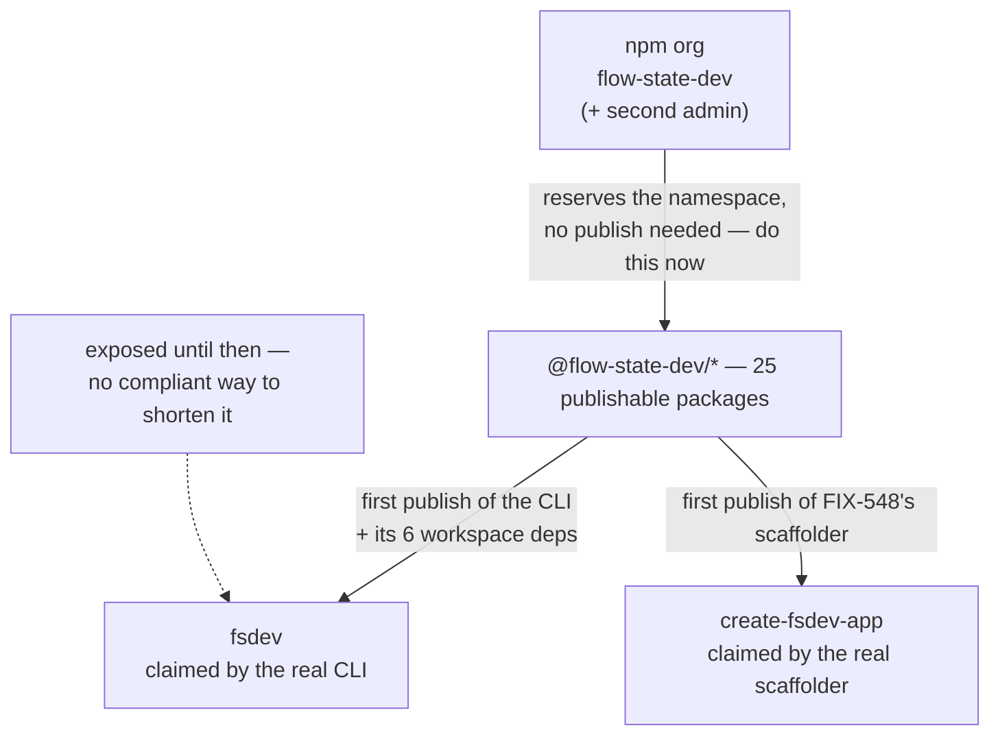

# FIX-1162: Claim the npm package names the launch needs — Implementation Spec

## Part I — The Case *(for the human)*

### 1. Problem — why it matters, why now

npm names go to whoever registers them first, and they are effectively unrecoverable. This
epic has written several into a launch plan without checking that any of them is ours.
Four facts, each executed rather than read from the issue's earlier comment — the first
three against the registry on 2026-08-15 (re-executed 2026-08-15 after the review round),
the fourth against npm's published policy:

**The scaffolding name is already gone.** `create-fsd-app` has belonged to an unrelated
project since 2024. The epic spec's transcripts and FIX-548 both name it.

**The short CLI name is still free.** `fsdev` is unregistered. It is the perishable asset
here, and it is the only one of the four facts that could change tomorrow without us.

**We may not own the namespace either.** Nothing under `@flow-state-dev/` has ever been
published, and whether that *scope* is registered to us cannot be checked without the npm
account. FIX-1159's spec and FIX-548's both say they will publish under "the scoped package
name we already own", and both treat that as the safe fallback for exactly the short-name
risk this issue exists to remove. An npm scope belongs to whoever registers the matching
organization first. If `flow-state-dev` is not ours, the fallback is not there either.

**And the obvious mechanism for holding a name is against npm's terms.** The registry's
[package-name dispute policy](https://docs.npmjs.com/policies/disputes) says: *"It is
against npm's Terms of Use to publish a package, register a username or an organization
name simply for the purposes of reserving it for future use."* This spec's first draft
proposed exactly that — two packages whose only behaviour was to announce they were
unreleased and exit. That route is closed, and closing it changes what this issue can
deliver rather than how it delivers it.

**Why now** — the exposure is time-based, not effort-based. None of this is hard; it is
simply not done, and each day it stays undone is a day someone else can take a name already
committed to in an approved document.

### 2. Solution in plain terms

Register the npm organization `flow-state-dev`, and add a second administrator to it. That
reserves the whole `@flow-state-dev` namespace in one action, needs no publish, and is the
item with by far the largest blast radius — nothing this project ever ships can be published
if the scope belongs to someone else.

Then **stop**, deliberately, short of the two unscoped names. The only compliant way to hold
an unscoped name is to publish something real under it, and the honest position is that
`fsdev` and `create-fsdev-app` get claimed by the packages that genuinely want them, when
those packages first publish — not by stand-ins now.

That leaves a real, unremovable gap: **`fsdev` is exposed until the framework's first
publish**, and this spec says so plainly rather than papering over it with a stub. §6's
decision 3 gives you the lever to close that gap early if you judge the risk higher than I
do; §12 prices both sides.

Finally, correct the one name that is provably wrong. `create-fsd-app` cannot be had, so the
short scaffolding name becomes `create-fsdev-app`, and FIX-548's scoped package is aligned to
match rather than shipping under one brand with an alias under another.

**Philosophy** — tenet 3 (earn every addition): this now adds nothing at all to the repo. The
first draft's two placeholder packages are gone, and what replaced them is a sequencing rule
and an honest statement of exposure. Tenet 1 (coherence): the epic's transcripts promise
`npx fsdev init` while its sub-spec prints `npx @flow-state-dev/cli init`. That disagreement
is surfaced as decision 3 rather than quietly resolved in one direction.

### 6. Decisions & rules — the sign-off surface

1. **The `@flow-state-dev` namespace is claimed as an npm *organization* named
   `flow-state-dev`, with a second administrator added before the name is considered
   secured.**
   The same policy clause covers organization names, so this is worth stating rather than
   assuming: npm's standard is that names are *"intended for immediate and active use."* A
   monorepo of twenty-five publishable packages, weeks from publishing under that scope,
   meets that standard about as plainly as it can be met. This is not a reservation; it is
   the account we are about to publish from.
   *Rejected:* claiming it under one person's npm user, which reserves the namespace
   identically and takes thirty seconds less.
   *Locks in:* every package we ever publish lives under an account more than one person can
   administer. The bill for getting this wrong arrives the day a security release has to go
   out and the individual account holder is unreachable — recoverable, but through npm
   support, on npm's timetable rather than ours.

2. **The scaffolding tool is branded `fsdev`, not `fsd`: unscoped `create-fsdev-app`, and
   FIX-548's scoped package renamed from `@flow-state-dev/create-fsd-app` to
   `@flow-state-dev/create-fsdev-app` to match.**
   *Rejected:* keeping the scoped name as `create-fsd-app` and aliasing it to a differently
   branded short name — which is where FIX-548's current spec lands by default, since the
   unscoped `create-fsd-app` it planned to alias to is unobtainable. Also rejected:
   `create-flow-state-app`, which reads as a different product from the `fsdev` command it
   wraps.
   *Locks in:* the name a stranger types to start a project, in one brand rather than two.
   FIX-548 is in spec review and has built nothing, so this costs an edit today; after that
   spec is approved it costs a re-spec, and after launch it is a broken command in published
   material.

3. **The unscoped names are claimed by the real packages at their first publish, and this
   issue claims neither. `fsdev` is accepted as exposed in the interval.**
   The compliant mechanism is a package that does something, and both packages that want
   these names will do something. So `fsdev` is claimed when the CLI first publishes, and
   `create-fsdev-app` when FIX-548's scaffolder first publishes.
   *Rejected:* publishing stand-ins now — the first draft's plan, and the clause in §1
   quoted verbatim. It is also the weakest protection available: a name held by a package
   that does nothing is the one shape a disputant can point at.
   *Rejected, and it is the live alternative:* bringing the framework's first publish
   forward to claim `fsdev` now. It is compliant and it works — §3 and §12 price it, and it
   is yours to pull.
   *Locks in:* weeks of exposure on `fsdev`, in exchange for not publishing eight packages
   before the epic is ready to. If someone takes `fsdev` in that window it is gone for good,
   and the epic's headline command changes.

**Non-goals** — renaming `@flow-state-dev/cli`, changing FIX-1159's design, the scaffolding
tool itself (FIX-548), and releasing the framework packages. This spec claims a namespace; it
ships no software and now commits no files.

**Size:** Small — 0 production files · 0 CI test behaviours · 0 doc surfaces · 1 PR
(an empty changeset and the Linear record).

---

### 3. Tradeoffs & alternatives

**The alternative that is genuinely live, and the one decision 3 hands you: canary-publish
now.** The repo already has `.github/workflows/snapshot-release.yml` — a manually dispatched
job that versions every package as a snapshot, builds, and publishes under a dist-tag
(`canary` by default) with provenance. Point that at a CLI package named `fsdev` and the name
is claimed **today**, by real working software, entirely within npm's terms: `fsdev run`,
`fsdev dev`, `fsdev serve`, `fsdev chat` and three more commands shipped in wave 1.m and work
now. A canary tag means nothing lands on `latest`, so no version number the real launch wants
is burned.

The price is the whole price, and it is not small. The CLI depends on six workspace packages
(`core`, `engine`, `node`, `store-sqlite`, `testing`, and `contracts` and `scheduled`
transitively), so claiming `fsdev` this way publishes **eight packages, publicly and
permanently**, weeks before the epic intends to. A published version can never be
republished, even after unpublishing. And it only claims `fsdev` if the CLI is *named*
`fsdev`, which reverses the naming FIX-1159 and FIX-548 are both written against.

I do not recommend it, and I hold that loosely — see §12, where it is put to you as a
decision rather than settled here.

**The alternative I most nearly recommended: rename the CLI to unscoped `fsdev` outright.**
It is the better end state — one package carrying the name people type, rather than a scoped
package plus a forwarding alias kept in version lockstep, which is what `vite`, `prisma`,
`turbo` and `next` all do. And the cheapest moment to rename is before anything is published,
which is now. Rejected for timing, not merit: FIX-1159's and FIX-548's specs are built on the
scoped name, and the short package cannot forward to anything until the scoped one is
published anyway. §12 records it as a follow-up with its surface enumerated.

**The approach that is now simply the approach: create the organization and publish
nothing.** In the first draft this was the tempting simplification I argued against, on the
grounds that an organization reserves only the `@scope` while unscoped names are global. That
reasoning was correct and the conclusion drawn from it was not — "therefore publish
stand-ins" does not follow, because npm's terms forbid it. The organization handles the
largest exposure in one free action, and the unscoped names wait.

**Where the complexity is:** not in any of this, which is now three registry operations. It is
that **only an actual publish proves a name is claimable.** A 404 means unpublished, which is
the strongest signal obtainable without credentials, but npm separately rejects names it
judges too similar to an existing package after stripping punctuation. `create-fsdev-app`
reduces to `createfsdevapp` against the taken `createfsdapp`, so it should pass — "should" is
the honest word, and §12 carries the fallback order for whoever publishes it.

### 4. Focus practices (1–5)

1. **BP-003 (verification evidence)** — every availability claim here was executed against
   `registry.npmjs.org`, and the policy claim that reshaped this spec was read from npm's own
   disputes page rather than from the review comment that raised it. The one claim that
   cannot be executed, namespace ownership, is stated as unverified rather than assumed. That
   distinction is the whole finding in §1: two specs assumed it.
2. **Tenet 1 (surface incoherence, don't route around it)** — the epic and its sub-spec
   disagree about the headline command. Decision 3 says which is true and when, rather than
   letting two documents stay quietly inconsistent until launch copy is written from the
   wrong one.
3. **Tenet 3 (subtract as you go)** — the review round removed this spec's only deliverable
   and nothing was added back. What is left is smaller and correct, and the temptation to
   replace six files with six different files was declined.

### 5. What using it looks like (1–5 examples)

Nothing about how code is written against the framework changes, and after this review round
nothing at the command line changes either — the placeholder transcript that used to sit here
described a package that will not now exist.

The one observable effect is the name a stranger types to start a project, once FIX-548
ships *(the left column is FIX-548's current spec)*:

```
before   npx @flow-state-dev/create-fsd-app my-app
after    npx @flow-state-dev/create-fsdev-app my-app
later    npx create-fsdev-app my-app          # the short name, once that package publishes
```

Between now and the framework's first publish, `npx fsdev` continues to do what it does
today: fail with npm's own "could not determine executable to run". Decision 3 accepts that.

## Part II — The Build Plan *(for the implementing agent)*

### 7. Technical design

There is no code in this issue. The design is which name is claimed by what, and when.



- **The organization is the only thing this issue executes.** It is free, needs no publish,
  and reserves every scoped name at once.
- **A second organization administrator is part of claiming it, not a follow-up.** Decision 1
  exists to survive one person being unreachable, and an organization with one member does
  not. The same applies to each unscoped package when it eventually publishes: creating the
  organization gives **no** publish rights over `fsdev` or `create-fsdev-app`, which are
  owned by whichever account publishes them. `npm owner add <user> <package>` is the
  mechanism, and §10 checks for it rather than for the publisher alone.
- **Nothing is committed to the repo.** The first draft put two three-file packages under a
  path outside the pnpm workspace globs; those packages are gone, and with them the whole
  question of where to put them, the workspace-glob hazard, and the two follow-ups to delete
  them again.
- **Untouched:** every workspace package, the release pipeline, CI, and `packages/cli`.

### 8. Implementation sequence

1. **Create the `flow-state-dev` organization and add a second administrator.** *Test:* §10's
   first two checks. *Depends on:* nothing. **This is the whole of this issue's npm work, and
   it does not wait on this spec being approved** — it is free, compliant, and the thing
   everything else rests on.
2. **Empty changeset.** No workspace package changes and nothing here is published by the
   pipeline, so `pnpm changeset --empty` (BP-022). *Depends on:* nothing.
3. **Raise the two cross-cutting corrections where they belong**, as comments rather than
   edits from this branch: decision 2 on FIX-548's spec PR (#1312, in review, so the change
   is an edit rather than a re-spec), and §1's namespace finding plus decision 3's claiming
   rule on the epic PR (#1301), whose transcripts and running index still say `npx fsdev
   init` and `create-fsd-app`. *Depends on:* nothing.
4. **Record the outcome on the Linear issue** — which names were secured, which are deferred
   under decision 3, and any fallback used. That record *is* the deliverable the issue asked
   for. *Depends on:* 1.
5. **No removals in this change**, and — unlike the first draft — none commissioned in future
   ones. There are no placeholder directories for FIX-1159 and FIX-548 to delete, which is
   the clearest sign the mechanism got simpler rather than differently complicated.

**Handed to the packages that own the names** (recorded in §12, not built here): when the CLI
first publishes it takes `fsdev`; when FIX-548's scaffolder first publishes it takes
`create-fsdev-app`. Each adds a second owner at that point.

### 9. Edge cases & error handling

| Case | Expected |
|---|---|
| The `flow-state-dev` organization name is already taken | Stop and escalate. Every package name across the epic is then wrong, and two specs' fallback plan is gone — this is the finding in §1 turning real, not an implementation problem. |
| `fsdev` is taken by someone else before the framework's first publish | The risk decision 3 accepts, and it is unrecoverable: npm "does not resolve squatting claims on demand" and transfers names only on a trademark or IP claim. The epic's headline command gets reworded rather than renamed — §12 has no acceptable fallback. |
| npm rejects `create-fsdev-app` as too similar to `create-fsd-app` | Fall to the next name in §12's order, record which was used, and revisit decision 2's scoped half so the two still match. Surfaces at FIX-548's first publish, not here. |
| A name is claimed but only one account can publish it | Not yet secured. Creating the organization does not confer ownership of an unscoped package; `npm owner add` does. §10 checks the owner list, not the publisher. |
| Someone proposes holding a name with a stub after all | Refuse and point at §1's quoted clause. It is against npm's terms, and it is also the weakest claim available — a package that does nothing is what a disputant points at. |

**Taxonomy:** every failure here is a naming failure, and each is fatal to its step rather
than retryable — a name is claimable or it is not. None degrade.

### 10. Testing strategy

**Goal:** the namespace resolves to us, and to more than one of us. Only the credential
holder can run this, after step 1:

```
npm org ls flow-state-dev          → our members, at least two
npm access list packages flow-state-dev → the org exists and is ours
```

Deferred to the publishes that claim them, and recorded here so they are inherited rather
than rediscovered:

```
npm view fsdev maintainers            → our account, plus a second owner
npm view create-fsdev-app maintainers  → our account, plus a second owner
npx -y fsdev@latest --help             → the real CLI's help output
```

Run the first pair once and record the output on the Linear issue — that record *is* the
deliverable the issue asked for ("which names were secured as wanted vs. which needed a
fallback").

**CI specs: none, deliberately.** This change commits no code. The only assertion worth
making is *does npm consider this namespace ours*, which is a fact about a remote registry and
unreachable from CI.

**Discipline:** neither `tdd` nor `diagnose`. There is no behaviour to drive out; the change
is one registry operation and a record of it.

### 11. Documentation plan

**No docs changes required**, and this is a real answer rather than a punt:

- Nothing user-facing changes. Decision 3 keeps every documented command exactly as
  FIX-1159's and FIX-548's specs already write it, and no package is added or renamed here.
- The two documents that *are* wrong — the epic spec's transcripts and running index, and
  FIX-548's spec — are not `apps/docs` pages and are not edited from this branch. §8 step 3
  raises both where their owners can act on them.
- The install and invocation surface changes only if the §12 follow-up rename happens, which
  is after the first release. That surface is enumerated once, in §12.

### 12. Dependencies, open questions & follow-ups

**Dependencies:** the npm account and its 2FA. No agent in this epic holds them, so step 1
sits with the owner. Nothing in the repo blocks this issue.

**What this issue owes its siblings.** FIX-548 planned to alias the unscoped `create-fsd-app`
"if and when FIX-1162 secures it" — it cannot be secured, which is decision 2, and the
replacement name is now claimed by FIX-548's own first publish rather than handed to it.
FIX-1159's dependency section is correct that this issue does not block it, and stays correct
under decision 3.

**Premise correction for the epic (raised on #1301, #1310, #1312, not edited here).** Both
sibling specs describe publishing under "the scoped package name we already own." Nothing
under `@flow-state-dev/` is published and the namespace's ownership is unverified. The
sentence is safe to keep only once decision 1 is executed; until then it asserts something no
one has checked.

**Open question — do we buy the name now, and what does it cost?**

- **The fork:** claim `fsdev` today by canary-publishing eight real packages weeks early, or
  accept that `fsdev` is exposed until the framework's first publish and might be gone.
- **Plain terms:** the short command people will type is unclaimed, and the only lawful way
  to claim it is to actually ship something under it. We can ship early, or we can wait and
  risk the name.
- **The trade-off:** publishing early is permanent — versions cannot be un-published after 72
  hours, and eight packages of unfinished framework become publicly visible before we are
  ready to stand behind them. Waiting costs nothing unless the name goes, and if it goes it
  is gone: npm transfers names only on a trademark claim.
- **My recommendation: wait.** `fsdev` is an obscure four-letter name that has sat free while
  this project has been in progress, and the mitigating half of npm's policy cuts our way
  once we do publish — nobody takes it from us afterwards either. Publishing eight packages
  early to insure against a low-probability loss is a large, irreversible action bought
  against a small risk.
- **What would change my mind:** evidence anyone else is moving on the name, or launch
  material that has already gone out promising `npx fsdev`. Either makes the loss concrete
  rather than hypothetical, and the canary route is ready to run the same day.
- **If I'm wrong:** we lose `fsdev` and the epic's headline command becomes something longer.
  Embarrassing and permanent, but it breaks no customer and blocks no release — the scoped
  names carry the whole product either way.

**Fallback order, if a name is rejected at publish time.** All verified free on 2026-08-15:

- Scaffolder: `create-fsdev-app` → `create-flow-state-app` → `create-flowstate-app` →
  `create-flow-state-dev-app`.
- CLI short name: none acceptable. `fsd`, `fsd-cli`, `fsdev-cli`, `flowstate` and the
  unscoped `flow-state-dev` are all taken by unrelated projects. A refusal on `fsdev` is
  escalated, not silently downgraded — it changes what the launch can promise.

**Follow-ups (flagged, not built):**

- **After the first release, revisit publishing the CLI as unscoped `fsdev`** rather than
  keeping a scoped package plus a forwarding alias — the alternative weighed in §3. The
  surface is enumerated once, here, so whoever picks it up inherits it (BP-034): the package
  name; the `tsconfig.base.json` path map; **fourteen** pending changeset fragments naming
  `@flow-state-dev/cli` (a fragment naming a package that no longer exists fails `changeset
  version`); **five** docs-site pages — `apps/docs/docs/cli/overview.md`,
  `apps/docs/docs/api/cli.md`, `apps/docs/docs/devtool/setup.md`,
  `apps/docs/docs/getting-started/installation.md` and `apps/docs/guides/nextjs-setup.md`,
  the last two carrying `pnpm add -D @flow-state-dev/cli` install lines in the primary
  onboarding path; **two** READMEs (`packages/cli/README.md` and the root `README.md`); and
  `pnpm --filter @flow-state-dev/cli` invocations in **four** `.agents/skills/` files
  (`debug-flow`, `diagnose`, and two in `prototype`).
- **`fsdev` and `create-fsdev-app` are claimed by their real packages at first publish**, each
  with a second owner added — see §8's handoff and §10's deferred checks.

### 13. Implementer notes *(recorded verbatim, not folded)*

Below-the-bar review feedback, kept for whoever builds the packages that eventually claim
these names. Not argued with, not folded into the design.

- *(cursor)* "Simpler fork: §7 already specifies the full placeholder contract. Since step 4
  is always owner hand-publish with credentials, consider whether this issue needs **six
  committed files** at all — owner could publish from the §7 templates immediately and record
  §10 results on Linear, with FIX-1159/FIX-548 shipping real packages later (no
  delete-placeholder-directory follow-up). If you keep repo placeholders, `tools/` is a new
  top-level tree that reads like `@flow-state-dev/tools` (`packages/tools`). Consider
  `npm-names/` at repo root (parallel to `spec-poc/`) plus a guardrail README like
  `spec-poc/README.md`." — *the first half is now the approach, for a different reason; the
  second half is moot.*
- *(cursor)* "This FIX-1159 surface inventory (tsconfig, 14 changeset fragments, docs, skills)
  is repeated in §11 and §12 follow-ups. Suggestion: keep one canonical list (§11 or §12) and
  replace the other two with a single cross-reference — reduces ~25 lines and drift when
  FIX-1159 is specced." — *acted on: the list now lives once, in §12.*
- *(cursor)* "Step 2 reads as 'don't add a doc' rather than a deliverable. If the only output
  is README prose in the placeholder dirs, merge into step 1 and drop step 2 — fewer sequence
  steps for a already-small change."
- *(cursor)* "This pseudocode block restates the §7 bullets (three files, `bin.js` shebang, no
  deps/build). Suggestion: drop the tree sketch or keep only fields the bullets omit (exact
  exit message, `files: [bin.js]` without README in tarball — worth one explicit line so
  implementers don't 'fix' it)." — *moot; the sketch is gone with the packages.*
- *(cursor)* "Four scaffolder fallbacks add spec surface. §3 already flags npm similarity as
  the real unknown. Not definite — but primary + `create-flow-state-app` may suffice unless
  you verified similarity for `create-flowstate-app` and `create-flow-state-dev-app` too."
- *(cursor)* "Low-probability edge case (someone adds `tools/*` to `pnpm-workspace.yaml`) as a
  full table row + README-only guard. Fine as a one-line note in §7; as a row it reads heavier
  than the risk. If placeholders are owner-only runbook (no repo commit), this row disappears
  entirely." — *acted on: the row is gone with the packages.*
- *(greptile)* "The reference to four `.agents/skills/` files is also stale because that
  directory does not exist." — **factually wrong and corrected inline rather than folded:**
  `.agents/skills/` does exist (it is `agents/skills/` that does not; `.claude/skills` is the
  symlink), and four files under it carry `pnpm --filter @flow-state-dev/cli`. The count in
  §12 stands, and now names them.

---

## Spec evolution

- **Spec drafted** — framed as claiming the npm names before someone else does, with the
  unclaimed `@flow-state-dev` namespace as the largest of the three exposures. Chose
  placeholder publishes over shipping real packages early, because the release pipeline
  publishes the whole workspace at once.
- **After reading the sibling specs** — dropped the recommendation to rename the CLI to
  unscoped `fsdev` in this issue, because FIX-1159's and FIX-548's specs both plan the scoped
  name; reversing that from a name-registration issue would churn a design for a shorter
  command. It became the §3 alternative and a §12 follow-up. The same read turned up the real
  finding: both specs call it "the scoped package name we already own", and nobody has
  verified that we do.
- **Review round 1 — the central deliverable was invalidated, and it deserved to be.** npm's
  dispute policy forbids publishing a package *or registering an organization name* "simply
  for the purposes of reserving it for future use". The two placeholder packages were exactly
  that and are gone. Three things followed. The organization **stays**, because the same page
  sets the standard as "immediate and active use" and twenty-five packages weeks from
  publishing meet it — but §6 now states the policy and the argument rather than calling the
  org free and consequence-free. The unscoped names are **deferred** to the packages that
  actually want them. And the sequencing was checked rather than inherited: `fsdev` is not
  gated on FIX-1159 at all — the CLI already works, having shipped seven commands in wave 1.m
  — but publishing it means publishing its six workspace dependencies, so the real gate is
  the framework's first publish. That made a compliant early claim *possible* (the repo has a
  snapshot-release workflow) and expensive, which is why §12 puts it to the owner instead of
  deciding it. Also folded: creating the organization confers no ownership of the unscoped
  names, so §7/§9/§10 now require `npm owner add` and check the owner list rather than the
  publisher; and the rename inventory gained the two onboarding pages it had missed. The spec
  lost its only committed files and got smaller — 6 production files to 0.
</content>
