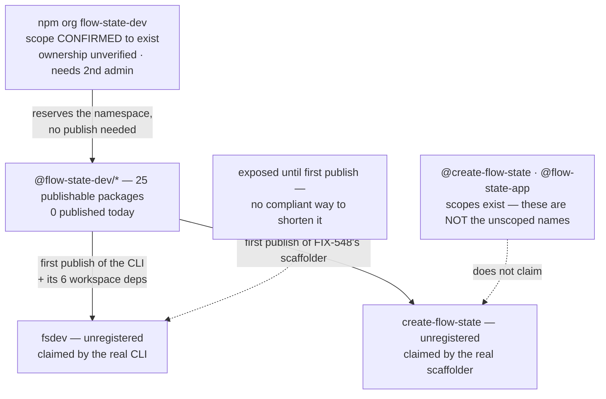

# FIX-1162: Claim the npm package names the launch needs — Implementation Spec

## Part I — The Case *(for the human)*

### 1. Problem — why it matters, why now

npm names go to whoever registers them first, and they are effectively unrecoverable. This
epic wrote several into a launch plan without checking that any of them was ours. Since the
last revision the owner has acted on npm, and what came back changed the facts this spec
rested on — including one that changes how every availability claim in it should be read.

All five facts below were executed against `registry.npmjs.org` on **2026-08-18**, not read
from a comment.

**A 404 means unregistered. It does not mean publishable.** The bare `flow-state` returned
404 and npm still **refused the publish** — almost certainly its similarity check against the
already-published `flowstate`. This is the fact with teeth, because every availability claim
in every spec in this epic was made from a 404. A registry 404 is the strongest signal
obtainable without attempting a publish, and it is not a green light. **Only an attempted
publish settles a name.**

**Holding a scope is not holding the unscoped name, and the two have come apart here.** The
scopes `@create-flow-state` and `@flow-state-app` now exist, and **nothing is published under
either unscoped name** — both still return 404. Those are separate namespaces: the npm
organization `types` exists while the unscoped package `types` belongs to an unrelated user
(`vitaly`, v0.1.1). So an organization named `create-flow-state` does not stop anyone
publishing the package `create-flow-state` — and `npm create flow-state my-app` resolves to
the *unscoped* package. §12 carries what must be run to settle which of the two we hold.

**The namespace can now be checked from outside, and it exists.** The previous draft said
scope ownership "cannot be checked without the npm account." Half of that was wrong.
npm's `/-/org/<name>/user` endpoint distinguishes a registered scope from an unregistered one
(`{"error":"Scope not found"}`), verified against five controls. **`flow-state-dev` returns
registered.** What is still *not* checkable from outside is whether it is registered **to
us** — that needs the credential holder.

**`create-fsd-app` is not ours, on the evidence available.** The unscoped package is still
maintained by `keyready` (`vip.korchak@list.ru`), latest 1.1.2, untouched since 2024-10-18,
and no scope by that name exists. Recorded as a contradiction to resolve, not folded in —
§12.

**Nothing is published under `@flow-state-dev/` yet** (`core`, `cli`, `contracts` all 404),
and `fsdev` is still unregistered — still the one asset here that can be lost tomorrow
without us.

**Why now** — the exposure is time-based, not effort-based. Three names are further along
than they were, but the ones a stranger actually types are still open.

### 2. Solution in plain terms

Name the scaffolder `create-flow-state`, matching the published brand rather than the CLI
abbreviation, and matching npm's shorthand: `npm create flow-state my-app`. That is the one
naming decision this spec still settles.

Then **verify what is actually held** before recording anything as secured. Scopes and
unscoped packages are different namespaces, and the evidence says we are holding scopes. §10
carries the three commands that separate them; only the credential holder can run them.

The `@flow-state-dev` namespace is confirmed to exist. Confirm it is ours, and add a second
administrator, because an organization one person can administer does not survive that person
being unreachable.

And **stop, deliberately, short of claiming unscoped names by publishing stand-ins.** npm's
[dispute policy](https://docs.npmjs.com/policies/disputes) forbids publishing "simply for the
purposes of reserving [a name] for future use." The unscoped names get claimed by the packages
that genuinely want them, at their first publish.

That leaves a real, unremovable gap: **`fsdev` is exposed until the framework's first
publish**, and so, on the evidence, are `create-flow-state` and `flow-state-app`. §6's
decision 3 gives you the lever to close it early; §12 prices both sides and does not decide
it.

**Philosophy** — tenet 3 (earn every addition): this still adds nothing to the repo. Tenet 1
(surface incoherence): the epic's transcripts promise `npx fsdev init` while its sub-spec
prints `npx @flow-state-dev/cli init`; that disagreement is decision 3, not quietly resolved.
Tenet 7 / BP-003: the "verified free" table this spec was built on was a green result from a
check aimed at a neighbour of the claim — §9 now says so in the spec rather than in a review
thread.

### 6. Decisions & rules — the sign-off surface

1. **The `@flow-state-dev` namespace is held as an npm *organization*, and is not considered
   secured until a second **administrator or owner** is on it.**
   The scope is confirmed to exist. Whether it is ours is the credential holder's check, not
   an assumption (§10). npm's policy standard is names "intended for immediate and active
   use"; a monorepo of twenty-five publishable packages weeks from publishing under that scope
   meets it about as plainly as it can be met.
   *Rejected:* claiming it under one person's npm user, which reserves the namespace
   identically and takes thirty seconds less.
   *Locks in:* every package we ever publish lives under an account more than one person can
   administer. The bill for getting this wrong arrives the day a security release has to go
   out and the individual account holder is unreachable — recoverable, but through npm
   support, on npm's timetable rather than ours. **A second *developer* does not satisfy this**;
   only `admin` or `owner` can manage the org, so §10 asserts the role rather than counting
   members.

2. **The scaffolding tool is named `create-flow-state`** — unscoped `create-flow-state`, and
   FIX-548's scoped package renamed from `@flow-state-dev/create-fsd-app` to
   `@flow-state-dev/create-flow-state` to match.
   It matches the brand we actually publish under (`@flow-state-dev/`, org `flow-state-dev`)
   rather than the CLI abbreviation, and it is the only candidate that reads correctly in
   npm's shorthand — `npm create flow-state my-app`. `create-fsdev-app`, this spec's previous
   answer, was chosen while we believed we were confined to `fsd`-adjacent naming after
   `create-fsd-app` turned out to be taken. That constraint was never real.
   *Rejected:* `create-fsdev-app` and `create-flow-state-app` — the first brands the scaffolder
   off the CLI abbreviation rather than the product, the second adds a word that the `npm
   create` shorthand then swallows anyway.
   *Locks in:* the name a stranger types to start a project, in one brand rather than two.
   FIX-548 is in spec review and has built nothing, so this costs an edit today; after that
   spec is approved it costs a re-spec, and after launch it is a broken command in published
   material.

   **`create-fsd-app` is left dormant — no redirect, no alias — if it turns out we hold it at
   all.** Two reasons, and the first is decisive: on the evidence in §1 that package is still
   an unrelated project's, published to real users in 2024, and republishing it as our
   forwarder would break their installs. Even if it were ours, a redirect is a second
   published surface kept in permanent version lockstep, pointing at a brand we have just
   retired — every install of it is somebody following a stale instruction we chose to keep
   alive. Dormant costs nothing and forecloses nothing.

3. **The unscoped names are claimed by the real packages at their first publish, and this
   issue claims none of them. `fsdev` is accepted as exposed in the interval.**
   The compliant mechanism is a package that does something, and every package that wants
   these names will do something. So `fsdev` is claimed when the CLI first publishes, and
   `create-flow-state` when FIX-548's scaffolder first publishes.
   *Rejected:* publishing stand-ins now — forbidden by the clause quoted in §2, and the weakest
   protection available: a package that does nothing is the one shape a disputant can point at.
   *Rejected, and it is the live alternative:* bringing the framework's first publish forward
   to claim `fsdev` now. §3 and §12 price it — it is more expensive and less ready than the
   previous draft said, and it is still yours to pull.
   *Locks in:* weeks of exposure on `fsdev`, and — per §1 — on `create-flow-state` and
   `flow-state-app` too, since scopes do not hold them. If someone takes `fsdev` in that
   window it is gone for good, and the epic's headline command changes.

**Non-goals** — renaming `@flow-state-dev/cli`, changing FIX-1159's design, the scaffolding
tool itself (FIX-548), and releasing the framework packages. This spec settles names; it ships
no software and commits no files.

**Size:** Small — 0 production files · 0 CI test behaviours · 0 doc surfaces · 1 PR
(an empty changeset and the Linear record).

---

### 3. Tradeoffs & alternatives

**The alternative decision 3 hands you: canary-publish now.** The repo has
`.github/workflows/snapshot-release.yml` — a manually dispatched job that versions every
package as a snapshot, builds, and publishes under a dist-tag with provenance. Point it at a
CLI package named `fsdev` and the name is claimed by real working software, entirely within
npm's terms: seven `fsdev` commands shipped in wave 1.m and work today.

**The previous draft priced this at "ready to run the same day". It is not, and the price was
understated.** Three findings, verified in this revision:

- **It cannot authenticate.** Neither `snapshot-release.yml` nor `release.yml` sets
  `registry-url` on `actions/setup-node`, and there is no `.npmrc` in the repo. `NPM_TOKEN` is
  exported as a plain environment variable that nothing translates into registry auth, so
  `changeset publish` has no credentials to publish with.
- **It would publish up to 25 packages, not 8.** The publish step is unfiltered. Pending
  fragments version all 25 non-private workspaces, and Changesets publishes every public
  workspace whose local version is absent from npm — not the CLI's seven-package dependency
  closure.
- **`changeset version --snapshot` is reported to abort** on fragments that mix the private
  `@flow-state-dev/ui` with publishable packages; six pending fragments name a private
  package. *Reported by review and not reproduced here* — this worktree has no `node_modules`
  and a spec change does not justify a full install. The structural facts (`ui` and
  `integration-tests` are `private: true`; `approval-card-receipt` bumps `ui` alongside the
  publishable `react`) are verified; the abort itself is inherited and marked as such.

So the canary route is a repair job before it is an option. I still do not recommend it, and I
hold that loosely — §12 puts it to you.

**The alternative I most nearly recommended: rename the CLI to unscoped `fsdev` outright.**
It is the better end state — one package carrying the name people type, rather than a scoped
package plus a forwarding alias kept in version lockstep, which is what `vite`, `prisma`,
`turbo` and `next` all do. The cheapest moment to rename is before anything is published,
which is now. Rejected for timing, not merit: FIX-1159's and FIX-548's specs are built on the
scoped name. §12 records it as a follow-up with its surface enumerated.

**Where the complexity is:** it is no longer "only an actual publish proves a name is
claimable" as a theoretical caveat. It happened. `flow-state` was 404 and was refused, and
the mechanism — npm's similarity check after stripping punctuation — is exactly the one this
spec flagged and then did not weight heavily enough. `create-flow-state` reduces to
`createflowstate` against the taken `flowstate`; it carries the same shape of risk that just
fired, which is why §12 keeps a fallback order and §9 makes the refusal a first-class case.

### 4. Focus practices (1–5)

1. **BP-003 (verification evidence)** — every claim here was executed against
   `registry.npmjs.org` on 2026-08-18, including the ones handed to me as settled. Two came
   back different from how they were reported, and both are in §1. The one claim that cannot
   be executed from outside — *is this scope ours* — is stated as unverified and routed to
   §10 rather than assumed.
2. **Tenet 7 (a green result from a check aimed at a neighbour of the claim)** — this is the
   spec's own lesson. "404 on the registry" answered *is this name registered*, and was read
   as *can we have this name*. The `flow-state` refusal is that gap turning real, and §9 now
   carries it as a rule.
3. **Tenet 1 (surface incoherence, don't route around it)** — the owner reports owning three
   names; the registry shows scopes for two of them and an unrelated maintainer on the third.
   That is recorded as a contradiction with the command that settles it, rather than written
   up as agreement.

### 5. What using it looks like (1–5 examples)

Nothing about how code is written against the framework changes, and nothing at the command
line changes today. The one observable effect is the name a stranger types to start a project,
once FIX-548 ships *(the left column is FIX-548's current spec)*:

```
before   npx @flow-state-dev/create-fsd-app my-app
after    npx @flow-state-dev/create-flow-state my-app
later    npm create flow-state my-app         # the short form, once that package publishes
```

Between now and the framework's first publish, `npx fsdev` continues to do what it does
today: fail with npm's own "could not determine executable to run". Decision 3 accepts that.

## Part II — The Build Plan *(for the implementing agent)*

### 7. Technical design

There is no code in this issue. The design is which name is claimed by what, and when.



- **The organization is the only thing this issue executes**, and the largest piece of it is
  already done: the scope exists. What remains is confirming it is ours and adding a second
  administrator.
- **A scope is not an unscoped package name.** This is the design's load-bearing distinction
  after this revision. Creating or holding the org `create-flow-state` gives **no** rights over
  the package `create-flow-state`; `npm create flow-state` resolves to the latter. The same
  applies to `fsdev`: creating the organization gives no publish rights over it. Ownership of
  an unscoped name comes from publishing it, and redundancy from `npm owner add <user>
  <package>` — §10 checks the owner list, not the publisher.
- **Nothing is committed to the repo.**
- **Untouched:** every workspace package, the release pipeline, CI, and `packages/cli`.

### 8. Implementation sequence

**Every step below runs after this spec is approved.** Decision 1 and decision 2 are on the
sign-off surface, and acting on them early leaves externally visible account state behind
while the direction is still under review. *(The previous draft said step 1 "does not wait on
this spec being approved". That was wrong and is removed.)*

1. **Confirm the `flow-state-dev` organization is ours, and add a second administrator or
   owner.** *Test:* §10's first block. *Depends on:* spec approval.
2. **Establish what is actually held under `create-flow-state`, `flow-state-app` and
   `create-fsd-app`** — scope, unscoped package, or neither. *Test:* §10's second block.
   *Depends on:* spec approval. This is the step that turns §1's contradiction into a fact.
3. **Empty changeset.** No workspace package changes and nothing here is published by the
   pipeline, so `pnpm changeset --empty` (BP-022). *Depends on:* nothing.
4. **Raise the cross-cutting corrections where they belong**, as comments rather than edits
   from this branch: decision 2 on FIX-548's spec PR (#1312, in review, so the change is an
   edit rather than a re-spec), and §1's namespace and 404-is-not-a-green-light findings plus
   decision 3's claiming rule on the epic PR (#1301), whose transcripts and running index still
   say `npx fsdev init` and `create-fsd-app`. *Depends on:* spec approval.
5. **Record the outcome on the Linear issue** — which names are secured *as unscoped packages*,
   which are held only as scopes, which are deferred under decision 3, and any fallback used.
   That record *is* the deliverable the issue asked for. *Depends on:* 1, 2.
6. **No removals in this change**, and none commissioned in future ones.

**Handed to the packages that own the names** (recorded in §12, not built here): when the CLI
first publishes it takes `fsdev`; when FIX-548's scaffolder first publishes it takes
`create-flow-state`. Each adds a second owner at that point.

### 9. Edge cases & error handling

| Case | Expected |
|---|---|
| **npm refuses a name at publish time despite a 404** | The default assumption, not the surprise. It already happened to `flow-state`. A 404 means unregistered; the similarity check runs at publish and compares after stripping punctuation. Fall to the next name in §12's order, record which was used, and never treat a registry check as a claim. |
| `create-flow-state` is refused for similarity to `flowstate` | Same shape as the `flow-state` refusal, one word further away. Fall to §12's order and revisit decision 2's scoped half so the two still match. Surfaces at FIX-548's first publish, not here. |
| A name is held as a **scope** but the unscoped package is still open | Not secured. Different namespaces (§1). Anyone can still publish the unscoped name, and that is the name `npm create` resolves. Record it as open, not as claimed. |
| The `flow-state-dev` organization turns out not to be ours | Stop and escalate. Every package name across the epic is then wrong, and two sibling specs' fallback plan is gone. |
| `fsdev` is taken by someone else before the framework's first publish | The risk decision 3 accepts, and it is unrecoverable: npm "does not resolve squatting claims on demand" and transfers names only on a trademark or IP claim. The epic's headline command gets reworded rather than renamed — §12 has no acceptable fallback. Note the `@fsdev` scope is already registered to someone else, so `@fsdev/cli` is not a fallback either. |
| A name is claimed but only one account can publish it | Not yet secured. Creating the organization does not confer ownership of an unscoped package; `npm owner add` does. |
| A second org member is added as a `developer` | Not yet secured. Only `admin` or `owner` can manage the organization, which is the failure decision 1 exists to survive. |
| Someone proposes holding a name with a stub after all | Refuse and point at the clause in §2. Against npm's terms, and the weakest claim available. |

**Taxonomy:** every failure here is a naming failure, and each is fatal to its step rather
than retryable — a name is claimable or it is not. None degrade.

### 10. Testing strategy

**Goal:** we can state, per name, whether we hold the unscoped package, only the scope, or
neither — and that the namespace is administrable by more than one person. Only the credential
holder can run these.

*Block 1 — the organization (step 1).* Assert the **role**, not the member count:

```
npm org ls flow-state-dev        → our members; at least one besides the primary
                                   holder showing `admin` or `owner`
npm access list packages flow-state-dev  → the org exists and is ours
```

*Block 2 — what is actually held (step 2).* Run per name for `create-flow-state`,
`flow-state-app`, `create-fsd-app`:

```
npm owner ls <name>              → lists us          → we hold the UNSCOPED package
                                 → 404 / not found   → we do not; a scope by that
                                                       name is not the same thing
```

Cross-check without credentials, which is what produced §1:

```
curl -s -o /dev/null -w '%{http_code}\n' https://registry.npmjs.org/<name>
      → 200 = published, 404 = unregistered (NOT "available")
curl -s https://registry.npmjs.org/-/org/<name>/user
      → JSON body = scope registered · {"error":"Scope not found"} = not registered
```

*Deferred to the publishes that claim them*, recorded so they are inherited rather than
rediscovered:

```
npm view fsdev maintainers              → our account, plus a second owner
npm view create-flow-state maintainers  → our account, plus a second owner
npx -y fsdev@latest --help              → the real CLI's help output
```

Run blocks 1 and 2 once and record the output on the Linear issue — that record *is* the
deliverable the issue asked for.

**CI specs: none, deliberately.** This change commits no code. The only assertion worth making
is *does npm consider this namespace ours*, which is a fact about a remote registry and
unreachable from CI.

**Discipline:** neither `tdd` nor `diagnose`. There is no behaviour to drive out.

### 11. Documentation plan

**No docs changes required**, and this is a real answer rather than a punt:

- Nothing user-facing changes here. Decision 3 keeps every documented command as FIX-1159's
  and FIX-548's specs already write it, and no package is added or renamed in this repo.
- The documents that *are* wrong — the epic spec's transcripts and running index, and FIX-548's
  spec — are not `apps/docs` pages and are not edited from this branch. §8 step 4 raises both
  where their owners can act on them.
- The install and invocation surface changes only if the §12 follow-up rename happens, which is
  after the first release. That surface is enumerated once, in §12.

### 12. Dependencies, open questions & follow-ups

**Dependencies:** the npm account and its 2FA. No agent in this epic holds them, so steps 1
and 2 sit with the owner. Nothing in the repo blocks this issue.

**Contradiction to resolve before this spec is approved.** I was told three names are owned:
`create-flow-state`, `create-fsd-app`, `flow-state-app`. What the registry shows on 2026-08-18
is different, and I could not settle it from outside:

| Name | Unscoped package | Scope | Reading |
|---|---|---|---|
| `create-flow-state` | 404 — nothing published | registered | we appear to hold the **scope**, not the name |
| `flow-state-app` | 404 — nothing published | registered | same |
| `create-fsd-app` | **200 — `keyready`, v1.1.2, last published 2024-10-18** | not registered | appears **not ours** |

`npm owner ls create-flow-state` settles all three in about ten seconds, and §10's block 2 is
the full check. **My recommendation: treat the unscoped names as unsecured until that output
says otherwise**, because the failure mode is asymmetric — believing we hold a name we do not
is how it gets taken while nobody is watching for it, and the epic has already been burned once
by reading a registry answer as a stronger claim than it was.

**What this issue owes its siblings.** FIX-548 planned to alias the unscoped `create-fsd-app`
"if and when FIX-1162 secures it" — it is not ours (above), the name is now `create-flow-state`
(decision 2), and that name is claimed by FIX-548's own first publish rather than handed to it.
FIX-1159's dependency section is correct that this issue does not block it, and stays correct
under decision 3.

**Premise correction for the epic (raised on #1301, #1310, #1312, not edited here).** Both
sibling specs describe publishing under "the scoped package name we already own." The scope is
now confirmed to **exist**; that it is **ours** is still unverified, and nothing is published
under it. The sentence is safe once §10 block 1 comes back clean, and not before.

**Open question — do we buy the name now, and what does it cost?** *(Unchanged in substance;
re-priced. The CLI name is the one with a clock on it, and it is not decided here.)*

- **The fork:** claim `fsdev` today by canary-publishing the framework weeks early, or accept
  that `fsdev` is exposed until the framework's first publish and might be gone.
- **Plain terms:** the short command people will type is unclaimed, and the only lawful way to
  claim it is to actually ship something under it. We can ship early, or wait and risk the name.
- **The trade-off:** publishing early is permanent — versions cannot be unpublished after 72
  hours. And it is worse than the last draft said: the publish is unfiltered, so it is **up to
  25 packages, not 8**, and the workflow **cannot authenticate today** (no `registry-url`, no
  `.npmrc`), so this is a repair job first. Waiting costs nothing unless the name goes, and if it
  goes it is gone: npm transfers names only on a trademark claim.
- **My recommendation: wait** — more strongly than last round, because the early-publish option
  got more expensive and less ready while the risk stayed the same. `fsdev` is an obscure
  four-letter name that has sat free throughout this project.
- **What would change my mind:** evidence anyone else is moving on the name, or launch material
  already promising `npx fsdev`. Either makes the loss concrete, and the canary route can be
  repaired in a day.
- **If I'm wrong:** we lose `fsdev` and the epic's headline command becomes something longer.
  Embarrassing and permanent, but it breaks no customer and blocks no release — the scoped names
  carry the whole product either way.

**Fallback order, if a name is refused at publish time.** All returned 404 on 2026-08-18 —
which, per §1, means unregistered and **not** confirmed publishable:

- Scaffolder: `create-flow-state` → `create-flow-state-app` → `create-flowstate-app` →
  `create-flow-state-dev-app`. The later entries are further from the taken `flowstate`, which
  is the collision that already fired once.
- CLI short name: none acceptable. `fsd`, `fsd-cli`, `fsdev-cli`, `flowstate` and the unscoped
  `flow-state-dev` are taken by unrelated projects, and the `@fsdev` scope is registered to
  someone else. A refusal on `fsdev` is escalated, not silently downgraded.

**Follow-ups (flagged, not built):**

- **Repair the release/snapshot publish path** before either is relied on: no `registry-url` on
  `actions/setup-node` and no `.npmrc` in the repo, so `NPM_TOKEN` never becomes registry auth
  in `release.yml` *or* `snapshot-release.yml`; and six pending changeset fragments name a
  private package alongside publishable ones. Not this issue's work, but it is the thing standing
  between decision 3's alternative and being real.
- **After the first release, revisit publishing the CLI as unscoped `fsdev`** rather than a
  scoped package plus a forwarding alias — the alternative weighed in §3. The surface is
  enumerated once, here, so whoever picks it up inherits it (BP-034): the package name; the
  `tsconfig.base.json` path map; **fourteen** pending changeset fragments naming
  `@flow-state-dev/cli` (a fragment naming a package that no longer exists fails `changeset
  version`); **five** docs-site pages — `apps/docs/docs/cli/overview.md`,
  `apps/docs/docs/api/cli.md`, `apps/docs/docs/devtool/setup.md`,
  `apps/docs/docs/getting-started/installation.md` and `apps/docs/guides/nextjs-setup.md`, the
  last two carrying `pnpm add -D @flow-state-dev/cli` install lines in the primary onboarding
  path; **two** READMEs (`packages/cli/README.md` and the root `README.md`); and `pnpm --filter
  @flow-state-dev/cli` invocations in **four** `.agents/skills/` files (`debug-flow`, `diagnose`,
  and two in `prototype`). *All five counts re-executed on 2026-08-18 and unchanged.*
- **`fsdev` and `create-flow-state` are claimed by their real packages at first publish**, each
  with a second owner added — see §8's handoff and §10's deferred checks.

### 13. Implementer notes *(recorded verbatim, not folded)*

Below-the-bar review feedback, kept for whoever builds the packages that eventually claim these
names. Not argued with, not folded into the design.

- *(cursor)* "Simpler fork: §7 already specifies the full placeholder contract. Since step 4 is
  always owner hand-publish with credentials, consider whether this issue needs **six committed
  files** at all… If you keep repo placeholders, `tools/` is a new top-level tree that reads like
  `@flow-state-dev/tools`. Consider `npm-names/` at repo root plus a guardrail README." — *the
  first half is now the approach, for a different reason; the second half is moot.*
- *(cursor)* "This FIX-1159 surface inventory (tsconfig, 14 changeset fragments, docs, skills) is
  repeated in §11 and §12 follow-ups. Suggestion: keep one canonical list." — *acted on: the list
  lives once, in §12.*
- *(cursor)* "Step 2 reads as 'don't add a doc' rather than a deliverable. If the only output is
  README prose in the placeholder dirs, merge into step 1 and drop step 2."
- *(cursor)* "This pseudocode block restates the §7 bullets (three files, `bin.js` shebang, no
  deps/build)." — *moot; the sketch is gone with the packages.*
- *(cursor)* "Four scaffolder fallbacks add spec surface. §3 already flags npm similarity as the
  real unknown. Not definite — but primary + `create-flow-state-app` may suffice unless you
  verified similarity for the others too." — *sharpened rather than folded: similarity cannot be
  verified without attempting a publish (§1), so the order stays and §12 now says what the order
  is ordered by.*
- *(cursor)* "Low-probability edge case (someone adds `tools/*` to `pnpm-workspace.yaml`) as a
  full table row + README-only guard." — *acted on: the row is gone with the packages.*
- *(greptile)* "The reference to four `.agents/skills/` files is also stale because that directory
  does not exist." — **factually wrong, corrected inline:** `.agents/skills/` does exist (it is
  `agents/skills/` that does not; `.claude/skills` is the symlink), and four files under it carry
  `pnpm --filter @flow-state-dev/cli`. Re-executed 2026-08-18; the count stands.
- *(codex)* "Rename inventory omits install guides — `apps/docs/docs/getting-started/installation.md`
  and `apps/docs/guides/nextjs-setup.md`." — *folded in round 1; both are in §12's list. Re-verified
  2026-08-18: an exact-boundary grep for `@flow-state-dev/cli` across `apps/docs` returns exactly
  those five pages, so the count and the list are correct.*

---

## Spec evolution

- **Spec drafted** — framed as claiming the npm names before someone else does, with the
  unclaimed `@flow-state-dev` namespace as the largest exposure. Chose placeholder publishes over
  shipping real packages early.
- **After reading the sibling specs** — dropped the recommendation to rename the CLI to unscoped
  `fsdev` in this issue; it became the §3 alternative and a §12 follow-up. The same read turned up
  the real finding: both specs call it "the scoped package name we already own", and nobody had
  verified that we do.
- **Review round 1 — the central deliverable was invalidated, and it deserved to be.** npm's
  dispute policy forbids publishing a package *or registering an organization name* "simply for the
  purposes of reserving it for future use". The two placeholder packages were exactly that and are
  gone (6 committed files → 0). The organization **stays**, because the same page sets the standard
  as "immediate and active use". The unscoped names were **deferred** to the packages that actually
  want them. Also folded: creating the organization confers no ownership of the unscoped names, so
  §7/§9/§10 require `npm owner add`; and the rename inventory gained the two onboarding pages it had
  missed.
- **Fact update — the owner acted on npm, and two of this spec's load-bearing assumptions broke.**
  Not a review round; the world changed under the document. **(a)** The bare `flow-state` returned
  404 and npm **refused the publish anyway**, so "verified free on the registry" never meant what
  this spec used it to mean — §1 and §9 now carry *a 404 means unregistered, not publishable; only a
  publish settles a name*, and §12's fallback list is re-labelled accordingly. **(b)** Checking what
  is now held showed **scopes, not unscoped packages**: `create-flow-state` and `flow-state-app`
  have registered scopes and nothing published, and those are different namespaces — proved by
  counterexample (npm org `types` vs the unscoped `types`, owned by an unrelated user). So the names
  the launch actually types are still open, and §12 carries the contradiction plus the one command
  that settles it. **(c)** Namespace ownership turned out to be *partly* checkable from outside
  after all: npm's scope endpoint distinguishes registered from unregistered, and `flow-state-dev`
  is registered — whether it is *ours* still needs the credential holder. Decision 2 was re-drafted
  from `create-fsdev-app` to **`create-flow-state`** to match the published brand and npm's
  `npm create flow-state` shorthand, with `create-fsd-app` left dormant rather than aliased. Three
  outstanding review findings were folded: §10 now asserts the second member's **admin/owner role**
  rather than counting members, §8 no longer tells anyone to act before this spec is approved, and
  §3's canary alternative is re-priced — it publishes **up to 25 packages, not 8**, and cannot
  authenticate at all today, which is now a §12 follow-up. The rename inventory's five counts were
  re-executed and are unchanged.
</content>
</invoke>
