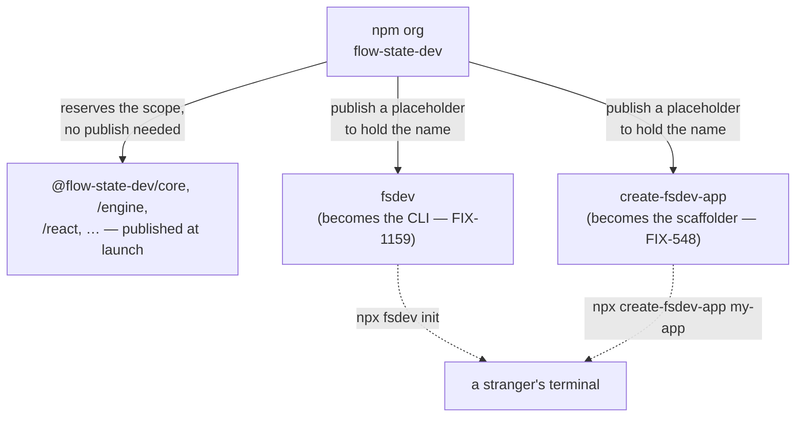

# FIX-1162: Claim the npm package names the launch needs — Implementation Spec

## Part I — The Case *(for the human)*

### 1. Problem — why it matters, why now

The launch tells a stranger to type `npx fsdev init`. Nobody has checked that the word
`fsdev` on npm is ours, and npm names are first-come and effectively unrecoverable. If
someone else takes it, that command runs a stranger's code or fails outright, on the very
first thing we ask a new user to do.

Three facts, all verified against the npm registry on 2026-08-15:

- **`fsdev` is still free.** Perishable, and the whole launch story rests on it.
- **`create-fsd-app` is already gone** — an unrelated project has held it since 2024. The
  epic spec and FIX-548 both name it as the scaffolding command. That command cannot ship
  under that name, so FIX-548 is specced against a name we can never have.
- **Nothing under `@flow-state-dev/` is published, and whether we own that *scope* cannot be
  checked without the npm account.** This is the one that matters most. A scope belongs to
  whoever registers the matching npm org or user first, and every package the framework
  ships sits under it. If someone registers `flow-state-dev` on npm before we do, the two
  short names above are the small half of the problem.

**Why now** — the exposure is time-based, not effort-based. Nothing here is hard; it is
simply not done, and each day it stays undone is a day someone else can take a name we have
already written into a launch plan.

### 2. Solution in plain terms

Claim all three things now, cheaply, and decide the naming question the downstream issues
are blocked on.

**Claim.** Register the npm organization `flow-state-dev` (free for public packages), which
reserves the whole `@flow-state-dev` scope in one action. Then publish two tiny placeholder
packages — `fsdev` and `create-fsdev-app` — to occupy the two unscoped names. A placeholder
is the only way to hold an unscoped name; the scope needs no publish at all.

**Decide.** When the real CLI ships, it publishes *as* `fsdev`, not as a second package
forwarding to `@flow-state-dev/cli`. One package with the name people actually type, rather
than two that must stay in version lockstep forever. Nothing depends on
`@flow-state-dev/cli` today and nothing is published under it, so retiring it costs nothing
now and becomes a breaking rename the moment we publish. The rename itself is FIX-1159's
work; this spec settles that it happens.

**Philosophy** — tenet 3 (earn every addition, and subtract as you go): a forwarding shim
is a second route to a job one package already does, and the cheapest moment to delete a
path is before anyone depends on it. Tenet 1 (coherence): an unscoped CLI beside a scoped
library set is the shape the ecosystem already uses — `vite`, `prisma`, `turbo`, `next` all
publish the command unscoped and the satellites scoped.

### 6. Decisions & rules — the sign-off surface

1. **The `@flow-state-dev` scope is claimed as an npm *organization* named
   `flow-state-dev`, not under a personal npm account.**
   *Rejected:* claiming it under one person's npm user, which also reserves the scope and
   takes thirty seconds less.
   *Locks in:* every package we ever publish lives under an account more than one person
   can administer. The bill for getting this wrong arrives when the individual account
   holder is unavailable and a security release cannot be published — recoverable, but only
   through npm support, on npm's timetable.

2. **The scaffolding command is `create-fsdev-app`.** `create-fsd-app` is taken and is not
   obtainable.
   *Rejected:* `create-flow-state-app` (also free) — it reads as a different product from
   the `fsdev` command it wraps; and `create-fsdev` (also free, one word shorter) — the
   `create-<x>-app` shape is what people expect to type.
   *Locks in:* every mention of the scaffolding command changes — the epic spec's
   transcripts, FIX-548's scope, and any launch copy already drafted. Choosing it now costs
   a find-and-replace; choosing it after FIX-548 is specced costs a re-spec, and after
   launch it is a broken command in published material.

3. **The CLI publishes as unscoped `fsdev`, and `@flow-state-dev/cli` is retired before the
   first release. No forwarding shim, now or later.**
   *Rejected:* keeping `@flow-state-dev/cli` as the real package and publishing `fsdev` as a
   thin wrapper over it.
   *Locks in:* one package to version, one name in every install line and every doc page. A
   shim would be a permanent tax — two releases per change, and a version-skew failure that
   only ever shows up on a stranger's machine. Reversing this after the first publish is a
   breaking rename for early adopters; reversing it before costs nothing.

**Non-goals** — the scaffolding tool itself (FIX-548), what `fsdev init` does (FIX-1159),
executing the CLI rename (FIX-1159, per decision 3), and publishing the framework packages
themselves. This spec claims names; it does not release software.

**Size:** Small — 6 production files · 0 CI test behaviours (see §10) · 0 doc surfaces ·
1 PR.

---

### 3. Tradeoffs & alternatives

**Alternative: publish the real packages now instead of placeholders.** It would claim every
name at once and prove claimability properly. Rejected — nothing in the repo has ever been
published, all versions sit at `0.0.0`, and the release pipeline publishes the whole
workspace together. Claiming two names would drag the entire unreleased framework onto npm
weeks early, with the version numbers permanently burned.

**The simpler approach: publish nothing, just create the org.** Genuinely tempting, and it
handles the largest exposure in one action. Insufficient because an npm org reserves only
the `@scope`. Unscoped names — which is what `npx fsdev` and `npx create-fsdev-app` resolve
against — are global, and the only way to hold one is to publish a version under it.

**Where the complexity is:** not the placeholders, which are a package.json and a shebang
each. It is that **only an actual publish proves a name is claimable.** A 404 from the
registry means unpublished, which is the strongest signal obtainable without credentials,
but npm separately rejects names it judges too similar to an existing package after
stripping punctuation. `create-fsdev-app` reduces to `createfsdevapp` against the taken
`createfsdapp`, so it should pass — but "should" is the honest word, and §12 carries the
fallback order for the case where it doesn't.

### 4. Focus practices (1–5)

1. **Subtract in the same change (tenet 3)** — decision 3 retires `@flow-state-dev/cli`
   rather than leaving it beside `fsdev`. The retirement executes in FIX-1159, but it is
   named here so it cannot quietly not happen.
2. **BP-003 (verification evidence)** — every availability claim in this spec was executed
   against `registry.npmjs.org`, not read from the earlier issue comment. The one claim that
   could *not* be executed (scope ownership) is stated as unverified rather than assumed.
3. **BP-034 (finish rename refactors)** — applies to FIX-1159 when decision 3 executes:
   the package name appears in the tsconfig path map, fourteen pending changeset fragments, the
   docs site, and four skill files. A changeset naming a package that no longer exists fails
   the release build.

### 5. What using it looks like (1–5 examples)

**Installing the CLI** *(what decision 3 proposes — the left column is what today's package
name would have produced):*

```
before   pnpm add -D @flow-state-dev/cli      npx @flow-state-dev/cli init
after    pnpm add -D fsdev                    npx fsdev init
```

**What the placeholder does between now and launch.** Anyone who types the command early
gets a straight answer instead of npm's "could not determine executable to run":

```
$ npx fsdev init
flow-state-dev is not released yet. See https://flow-state.dev
$ echo $?
1
```

**Scaffolding a new project** *(FIX-548's headline command, under the name decision 2
settles):*

```
$ npx create-fsdev-app@latest my-app
```

## Part II — The Build Plan *(for the implementing agent)*

### 7. Technical design

The npm org is the root of everything else. It reserves the scope with no publish; the two
unscoped names each need a published version of their own.



- **The placeholders live outside every pnpm workspace glob.** `pnpm-workspace.yaml` matches
  `packages/*`, `apps/*`, `examples/*`, `labs/*`, `goals` — so a placeholder under
  `packages/` becomes a workspace package, and the changesets release pipeline would publish
  it alongside the framework's first release. Put them somewhere no glob reaches
  (`tools/npm-names/<name>/` is the suggestion; the exact path is the implementer's) and
  publish each by hand, once.
- **Each placeholder is three files:** a `package.json` (name, version, `bin`, `files`,
  `license`, `repository`, `publishConfig.access: public`), a plain `bin.js` with a shebang
  that prints one line and exits non-zero, and a `README.md` saying what the package is for
  and that it is replaced when the real one ships. No TypeScript, no build step, no
  dependencies.
- **A `bin` rather than a bare package** is deliberate. Without one, `npx fsdev init` fails
  with npm's own message about not finding an executable, which reads like our tooling is
  broken rather than unreleased.
- **Untouched:** every workspace package, the release pipeline, CI, and `packages/cli`'s
  name. The rename in decision 3 is FIX-1159's.

**Solution sketch — pseudocode. Illustrative, not the contract.**

```
tools/npm-names/fsdev/
  package.json   name: fsdev · version: 0.0.1 · bin: { fsdev: ./bin.js }
                 files: [bin.js] · no dependencies · no build
  bin.js         #!/usr/bin/env node
                 print "flow-state-dev is not released yet. See <site>"
                 exit 1
  README.md      why this exists · the one-time publish command ·
                 "delete this directory when <real package> takes the name"

tools/npm-names/create-fsdev-app/   — same three files, same shape
```

### 8. Implementation sequence

1. **Write both placeholder directories** outside the workspace globs, per §7. *Test:* none
   in CI (§10); `node bin.js` prints the line and exits 1. *Depends on:* nothing.
2. **Add a root-level note** — one line in the placeholder READMEs is enough; do **not** add
   an internal naming-record doc. The durable record of which names were wanted, which were
   taken, and what was chosen instead is the Linear issue and its comments, which is where
   the decision was made. *Depends on:* 1.
3. **Empty changeset.** Nothing here is published by the pipeline and no workspace package
   changes, so `pnpm changeset --empty` (BP-022). *Depends on:* 1.
4. **Hand off the three npm actions to the owner** (§10's goal check is how they are
   verified): create the org, publish `fsdev`, publish `create-fsdev-app`. No agent holds
   these credentials.
5. **No removals in this change.** The removal decision 3 commissions —
   `@flow-state-dev/cli` as a package name, and both placeholder directories once the real
   packages take the names — executes in FIX-1159 and FIX-548 respectively, and §12 records
   it so it cannot be dropped.

### 9. Edge cases & error handling

| Case | Expected |
|---|---|
| npm rejects `create-fsdev-app` as too similar to `create-fsd-app` | Fall to the next name in §12's order and record which one was used. Only a real publish attempt can surface this. |
| npm rejects `fsdev` as too similar to the taken `fsd` / `fsdev-cli` | Same handling. Nothing in §12's order is a good substitute, so this one is escalated, not silently downgraded — it changes the launch's headline command. |
| The `flow-state-dev` org name is already taken by someone else | Stop and escalate. Every package name in the epic is wrong and the scope has to be re-chosen before anything publishes. |
| Someone later adds `tools/*` to `pnpm-workspace.yaml` | The next release publishes two placeholders as framework packages. The placeholder READMEs say so; no CI guard, because the directories are deleted long before that is plausible. |
| The placeholder version number is reused by the real package | Rejected by npm permanently — a published version can never be republished, even after unpublishing. The real package's first release must be strictly above the placeholder's. |
| A placeholder needs to be withdrawn | Possible within 72 hours; after that only while it has no dependents and under 300 weekly downloads. Neither will be true of `fsdev` after launch, so treat the first publish as final. |

**Taxonomy:** every failure here is a naming failure, and every one of them is fatal to the
step rather than retryable — a name is claimable or it is not. None of them degrade.

### 10. Testing strategy

**Goal:** the names resolve to us, from outside our machines. In an empty directory, with no
FSD anything installed:

```
npx -y fsdev@latest            → prints our notice, exits 1
npx -y create-fsdev-app@latest → prints our notice, exits 1
npm view fsdev maintainers     → our account
npm org ls flow-state-dev      → our members
```

This is the whole proof, and it can only be run by the credential holder after the publish.
Run it once, and record the result on the Linear issue — that record is the deliverable the
issue asked for.

**CI specs: none, deliberately.** The placeholders have no logic — one `console.log` and one
exit code, with no branches. The only assertion worth making is *does npm consider this name
ours*, which is a fact about a remote registry and cannot be established from CI. A test
asserting that a print statement prints would encode nothing about why the change matters.

**Discipline:** neither `tdd` nor `diagnose`. There is no behaviour to drive out; the change
is release plumbing plus three manual registry operations.

### 11. Documentation plan

**No docs changes required.** Two reasons, both specific:

- Nothing user-facing changes. The placeholders exist to be replaced, and documenting them
  would tell readers to run a command whose only output is that it does not work yet.
- The install lines that *do* change (`@flow-state-dev/cli` → `fsdev`, across
  `apps/docs/docs/cli/overview.md`, `apps/docs/docs/api/cli.md`,
  `apps/docs/docs/devtool/setup.md`, `packages/cli/README.md`, the root `README.md`,
  `CLAUDE.md`, `CONTRIBUTING.md`, and `docs/architecture/overview.md`) change when the
  rename executes, which decision 3 assigns to FIX-1159. Editing them here would leave the
  docs describing a package name that does not exist yet on either npm or in the repo.

The list above is written down so FIX-1159 inherits the surface rather than rediscovering
it (BP-034).

### 12. Dependencies, open questions & follow-ups

**Dependencies:** the npm account and its 2FA. No agent in this epic holds them, so steps
4's three actions sit with the owner. Nothing in the repo blocks this issue, and this issue
blocks FIX-548 (which cannot commit to a headline command until decision 2 lands) and
informs FIX-1159 (decision 3).

**Fallback order, if a name is rejected at publish time.** All verified free on 2026-08-15:

- Scaffolder: `create-fsdev-app` → `create-flow-state-app` → `create-flowstate-app` →
  `create-flow-state-dev-app`.
- CLI short name: no acceptable fallback. `fsd`, `fsd-cli`, `fsdev-cli`, `flowstate`, and
  the unscoped `flow-state-dev` are all taken by unrelated projects. If `fsdev` is refused,
  the launch's headline command is an open question, not an implementer's call.

**Open questions:** none. The three forks this issue opened — which scaffolder name, shim or
no shim, and how the scope is held — are decisions 2, 3 and 1. The shim fork is settled by
fact rather than preference: `@flow-state-dev/cli` is not published, so a shim has nothing
to forward to and "ship a real shim now" was never available.

**Follow-ups (flagged, not built):**

- **FIX-1159 owns the rename** that decision 3 commissions: `packages/cli` publishes as
  `fsdev`, with the tsconfig path map, the fourteen pending changeset fragments naming
  `@flow-state-dev/cli`, the docs surfaces in §11, and the `pnpm --filter` invocations in
  four `.agents/skills/` files all updated in the same change. A changeset naming a package
  that no longer exists fails `changeset version`.
- **FIX-548 renames its deliverable** from `create-fsd-app` to `create-fsdev-app`, and
  deletes `tools/npm-names/create-fsdev-app/` when the real package takes the name. FIX-1159
  deletes the `fsdev` one on the same terms.
- **The epic spec's running index, theme 1, and §3 transcripts all say `create-fsd-app`.**
  Raised on the epic PR rather than edited here, per the cross-cutting rule.

---

## Spec evolution

- **Spec drafted** — framed around the exposure being three claims rather than two: the
  unclaimed `@flow-state-dev` *scope* is the one everything else rests on, and it is the one
  the issue did not know about. Chose placeholder publishes over shipping real packages
  early, because the release pipeline publishes the whole workspace at once. Settled the
  shim question by fact (nothing is published for a shim to forward to) and chose the
  unscoped `fsdev` as the CLI's real name, with the rename assigned to FIX-1159 so the
  perishable half of this issue is not held up by a refactor.
</content>
