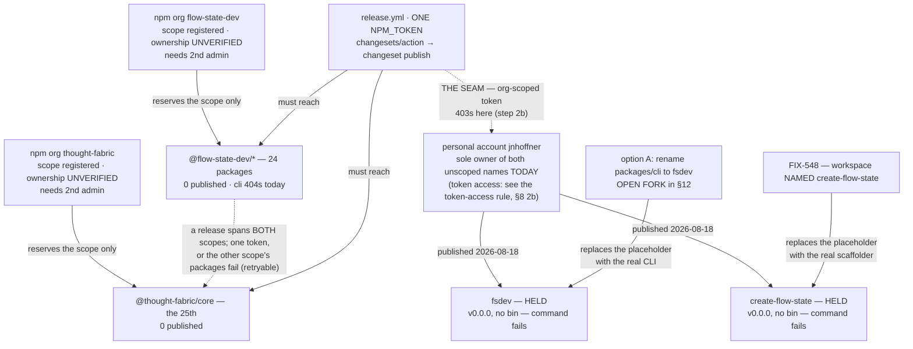

# FIX-1162: Claim the npm package names the launch needs — Implementation Spec

## Part I — The Case *(for the human)*

### 1. Problem — why it matters, why now

npm names go to whoever registers them first, and this epic wrote several into a launch plan
believing they were ours. **They are now — on 2026-08-18 the owner published the two that
onboarding depends on.** *Verified from the registry, not reported:*

| Name | Status | Maintainer |
|---|---|---|
| `fsdev` | **ours** — placeholder, **no `bin`** | `jnhoffner` |
| `create-flow-state` | **ours** — placeholder, **no `bin`** | `jnhoffner` |
| `flow-state-app` | unclaimed — **assumed** deliberate; not confirmed | — |

**Three things follow, and none of them is the race this issue was opened to run.**

1. **The naming decision stopped being urgent.** It is now an ordinary product call — what is the
   CLI's package called? — with our own first release as its only deadline. §12 re-derives it.
2. **Both names sit on a personal account, not an organization.** If CI publishes with an
   org-scoped token, the first release fails on exactly these two packages (§8 step 2b).
3. **A held name is not a working command.** Both are v0.0.0 with **no `bin`**, so `npm create
   flow-state` and a cold `npx fsdev` now fail *could not determine executable to run* instead of
   returning a clean 404. Only shipping real software under them fixes that.

**Still open, and it gates every publish:** the two *scopes* the release goes into are ours by
assertion only. Nothing is published under either (`@flow-state-dev/cli` 404s), npm hides member
lists, and §12 carries the two commands that settle it.

### 2. Solution in plain terms

Confirm both publishing organizations are ours — two read-only commands the owner runs (§12 is the
ask). Then close the ownership seam the placeholders opened: a second owner on each name, and a
release credential that can actually write to them.

**On the placeholders.** This spec argued against stand-in publishes on npm's
[dispute policy](https://docs.npmjs.com/policies/disputes); they exist now, so it records the world
as it is. The cure for the small residual exposure is to ship real software under a name — FIX-548
does that for `create-flow-state`, and option A does it for `fsdev`. **Whether to keep the `fsdev`
placeholder if you pick C is a
second question on your sign-off surface, and it expires on 2026-08-21** — §12 carries it with the
deadline and both branches priced.

That leaves the rename, which §12 prices. **It is the *name* at stake, not the command** — `fsdev`
comes from the CLI's `bin` key and works under every option (§10, verified).

### 6. Decisions & rules — the sign-off surface

**Two decisions are live, and one action is a precondition of approving either.** Two further
decisions are settled and sit in §6b: the organizations and their second administrator, and the
scaffolder's name. Both remain open to challenge; neither needs deciding here.

**Before approving — run the two scope lookups (§12, question 2).** Not a decision, but approval
does not stand without it: §8's account mutations are gated on both organizations coming back ours,
and nothing in the repo can establish that. Two read-only commands, about twenty seconds.

3. **An unscoped name is claimed only by a package actually *named* that — so the live question
   is what ships under `fsdev`, not who holds it.** Publishing `@flow-state-dev/cli` would not have
   claimed the name; publishing a package named `fsdev` did. §12's fork is whether the CLI is
   renamed so the **real** software ships there, or we keep the scoped name and leave the
   placeholder idle.
   *Still rejected:* running the unmodified snapshot workflow to claim anything — it publishes the
   scoped names and risks 25 packages going public early (§9).

4. **Under option C only: do we keep the `fsdev` placeholder, or unpublish it?** Under A the
   question dissolves — the placeholder becomes the real CLI. Under C we hold, indefinitely, a
   package that exists only to reserve a word, which is what npm's dispute policy describes; the
   only clean exit is unpublishing, and that is **self-service only until
   `2026-08-21T21:56:04Z`** (§12 carries the derivation and the after-window caveat).
   **Recommendation: keep it.** *(This was recorded as a coordinator decision for several rounds.
   That was wrong — the reasoning was sound but it settled the wrong question, namely who decides.
   §12 has the full ask.)*

**The one standing rule this asks you to accept:** if npm refuses a *new* name at publish time, it
comes back to you rather than falling through to the next candidate — the package name is the
advertised command, so substituting one silently ships a different product surface (§12, §9). Both
current names are past the similarity check, since npm accepted the placeholders.

**Non-goals** — *executing* the CLI rename, changing FIX-1159's design, the scaffolding tool
itself (FIX-548), and releasing the framework packages. **Whether to rename is decided here; doing
it is not.**

**Size.** *This issue:* 0 production files · 0 CI test behaviours · 0 doc surfaces · 1 PR (an empty
changeset and the Linear record).

*What it commissions —* **option A files one new issue; option C files none.** All three *release
prerequisites* already exist and already block **FIX-1187**: the ownership seam is **FIX-1186**
(filed from this spec), the changeset repair is **FIX-870** (pre-existing; step 5c reuses it rather
than filing a duplicate), and the scaffolder itself is **FIX-548** (edge added this round — see §8).
On top of those:

- **Option A** — **one new issue**, filed through `issue-manager` by step 5 before this issue
  closes and wired as a blocker on the first release: the rename, **34 files / 49 references at this
  commit — provisional, and larger if FIX-1160 lands first** (§12), 1 PR, plus the user-facing docs
  in the same change set.
- **Option C** — **no new issue.** Step 5 files nothing by design; the retention answer is executed
  here (step 2b, or step 2c if *unpublish*).
- **Option B is retired** (§12).

*(An earlier draft said "every option: no new issues", which was wrong for A and sits on the fork
you are deciding. Step 5 is mandatory under A, not optional.)*

---

### 3. Tradeoffs & alternatives

**Renaming the package is the only way our *software* ends up under `fsdev`.** The name is held,
but Changesets publishes each workspace under its own `package.json` name, and no workspace is
named `fsdev` — it is the CLI's `bin` key, which the registry never sees. *(Verified: all 39
workspace names read; 25 non-private; none is `fsdev`.)* So the placeholder stays a placeholder
until a workspace carries the name. §12 prices that rather than deciding it.

It is also the better end state — one package carrying the name people type, the shape `vite`,
`prisma` and `next` all use — and the cheapest moment to rename is before anything is published.

**Two constraints that shape the fork, derived in Part II:** no release can be assembled at this
commit at all (step 5c), and the release credential cannot currently be shown to reach either
unscoped name (step 2b). Both bind under every option, so neither is an argument for one branch of
the fork over the other.

### 4. Focus practices (1–5)

1. **BP-003** — every claim was executed against the registry, the repo, or a pinned dependency's
   source, including claims handed to me as settled. Several came back different.
2. **Tenet 7 (a green check aimed at a neighbour of the claim)** — this spec produced several
   itself, which is why §10 carries commands rather than lists. "404 on the registry" answered
   *is this registered* and was read as *can we have it*; "the CLI's bin is `fsdev`" answered
   *what command do users get* and was read as *do we own the name*.
3. **Tenet 1 (surface incoherence)** — the owner reported owning names the registry showed as
   unheld; recorded as an open contradiction with the command that settles it, not averaged away.

### 5. What using it looks like (1–5 examples)

Nothing about writing code against the framework changes. The one observable effect is the name a
stranger types to start a project, once FIX-548 ships:

```
earlier drafts   npx @flow-state-dev/create-fsd-app my-app   ← superseded, and never ours
now              npm create flow-state my-app     # one unscoped package, no scoped twin
                 npx create-flow-state my-app     # the same package, spelled out
```

*(**The left column is not FIX-548's current spec** — an earlier label here said it was. *Verified
at FIX-548's branch head:* it prints `npm create flow-state my-app` and explicitly rejects
`create-fsd-app`, which is `keyready`'s package and was never available to us. The row is kept
because it is the change this epic's older material still reflects, but it is a historical
contrast, not a live sibling state.)*

**Both of those commands are worse today than they were last week, and that is the placeholders'
doing.** `npm create flow-state my-app` used to fail with a clean 404 — *not released yet*. It now
resolves `create-flow-state`, downloads our v0.0.0 package, finds **no `bin`**, and fails with
*could not determine executable to run* (*verified from the packument: no `bin`, no `main`, no
`files`*). Same for `npx fsdev` in a fresh directory. **The name being ours does not make the
command work; only shipping real software under it does** — FIX-548 for the scaffolder, and §12's
fork for the CLI.

Once `@flow-state-dev/cli` *is* installed, `npx fsdev` runs our CLI from its `bin` key regardless,
under every option (§10, verified). That has never depended on the unscoped name.

## Part II — The Build Plan *(for the implementing agent)*

### 6b. Settled decisions

Ratifications rather than open questions, kept here so Part I carries only the live fork. Both are
still open to challenge — a reviewer who thinks either is wrong should say so.

1. **Both namespaces are *registered* as npm organizations — that they are **ours** is asserted,
   not verified — and neither counts as secured until a second administrator or owner is on it.**
   There are two: `flow-state-dev` and `thought-fabric`. *(An earlier draft said "held", which reads
   as ownership settled; the registry shows only that the scopes exist. §12 carries the two
   commands that would settle it, and they are still outstanding.)*
   A second *developer* does not satisfy this — only `admin` or `owner` can manage an org, so §10
   asserts the role rather than counting members.
   *Rejected:* claiming under one person's npm user — identical reservation, no redundancy.
   *Why it is settled:* it follows from wanting to publish at all. An organization one person can
   administer strands every package the day that person is unreachable.

2. **The scaffolding tool is ONE package, published unscoped as `create-flow-state`, with no
   scoped twin.** `npm init foo` resolves to `create-foo`, so the unscoped name both gets claimed
   and powers the command; a scoped twin would claim nothing extra and add a permanently
   version-locked surface. FIX-548's workspace is therefore *named* `create-flow-state`.
   *Rejected:* a scoped package plus an unscoped forwarder; `create-flow-state-app`, whose extra
   word the shorthand swallows anyway.
   **`create-fsd-app` is a third party's package and is not available to us in any form** — not as
   a forwarder, not as an alias, not as a fallback. *Verified: maintainer `keyready`, v1.1.2,
   published 2024-10-18, a React/Vite starter unrelated to this project.* Our owner's npm handle is
   **`jnhoffner`**, so the two are plainly different accounts. Republishing it would break real
   users' installs, and we could not do so anyway.
   *Why it is settled — and which half is whose:* **the owner chose the name `create-flow-state`,
   and acted on it** (they published a package under it; §1 verifies the registry). **The rest of
   this decision is ours, not theirs** — one package rather than two, no scoped twin, and FIX-548's
   workspace carrying the name outright are engineering calls derived from `npm init foo` resolving
   to `create-foo`. They are open to challenge on their merits and do not inherit the owner's
   sign-off from the name.

### 7. Technical design

There is no code in this issue. The design is which name is claimed by what, and when.



- **The names are held; the ownership around them is the work.** The claiming half is done. What
  this issue executes is confirming the two scopes are ours and closing the seam the placeholders
  opened — a second owner on each name, and a release credential that can write to them.
- **A scope is not an unscoped package name, and neither is a `bin` key.** Still the design's
  load-bearing distinction, and it now cuts the other way: holding the org `create-flow-state`
  gave **no** rights over the package `create-flow-state` — publishing it did. Separately, npm
  registers what is in a package's `name` field, so `packages/cli` publishing as
  `@flow-state-dev/cli` would have claimed nothing on `fsdev`; a package literally named `fsdev`
  claimed it.
- **Package ownership and organization membership are different objects**, which is the seam in
  the diagram. A second org *admin* does nothing for a package owned by a personal account, and
  `npm owner add` on a package does nothing for the org. Step 2b does both.
- **The placeholders are not the product.** Both are v0.0.0 with no `bin`, so every advertised
  command still fails; only FIX-548 (for the scaffolder) and §12's fork (for the CLI) change that.
- **Nothing is committed to the repo.**
- **Untouched:** every workspace package, the release pipeline, CI, and `packages/cli`.

### 8. Implementation sequence

**The dividing line is whether a step changes account state, not whether it touches npm.** A
read-only lookup leaves nothing behind and can be undone by closing the terminal, so it does
not wait on approval — and it cannot, because its output is what §12 asks you to approve
*on*. An account mutation is externally visible and is what approval gates. *(The previous
draft put every step after approval, which deadlocked against §12 asking for a lookup before
it. Split here; the lookups moved up.)*

**Before approval — read-only evidence gathering only. Nothing is written, on npm or in the
repo:**

1. **Confirm *both* publishing organizations are ours** — `npm org ls flow-state-dev` **and
   `npm org ls thought-fabric`.** *Test:* §10's block 1. *Depends on:* nothing. Two commands, one
   per scope: 24 of the 25 publishable workspaces are `@flow-state-dev/*` and the 25th is
   `@thought-fabric/core`. **Both must come back ours before step 2** — approving account
   mutations on one organization while the other is unverified would leave the scope a quarter of
   the release publishes under unchecked. §12 is the ask.

1b. **Re-check the two unscoped names, and assert the *maintainer* rather than the status code.**
   *Test:* §10's block 1b. *Depends on:* nothing; metadata-only, so it is safe to re-run at any
   time. A name held on 2026-08-18 is not a name held on approval day, and **the owner's own
   history cannot prove a third party has not published since.** The assertion is
   **`set(maintainers) == the approved-owner roster FIX-1186 records`** on both `fsdev` and
   `create-flow-state` — today `{jnhoffner}`, and **step 2b adds a second account and updates that
   roster**, so this step must read the roster rather than hard-code a name.
   **Not** a 200 (that is exactly what someone else's package returns), and **not** a bare
   singleton — a singleton is broken by step 2b on a perfectly healthy package, and its obvious
   repair, "the roster is *included*", passes for any superset a stranger joined. Set equality
   fails in both directions. **Re-run it immediately before commissioning the rename** — a 34-file
   rename around a name that changed hands is the failure this exists to prevent.

**After approval — account mutations, repository changes, and outbound corrections:**

2. **Add a second administrator or owner to *both* organizations — `flow-state-dev` and
   `thought-fabric`.** *Test:* §10's block 2. *Depends on:* spec approval, and on step 1 coming
   back saying each org is ours. An org that publishes one package still strands that package if
   its sole administrator is unreachable.
   **Pass the role explicitly — `npm org set <org> <account> admin`.** *Verified,
   `lib/commands/org.js:53`: `role = role || 'developer'`* — omitting it silently adds a developer,
   who cannot administer the org, so the redundancy this step exists to create would not exist and
   §10 block 2 would still have passed under its old predicate.
   **Record the approved org-member roster — name and role, per org — on FIX-1186**, the same way
   step 2b records the package-owner roster, and for the same reason: block 2 asserts against that
   roster, so the mutation and the check share one source. *Done when:* `npm org ls` on each org
   returns **exactly the recorded roster with the recorded roles**, not merely one extra admin —
   `npm org set` accepts any valid account, and an org admin controls every package in the scope.

2b. **Close the personal-account seam on the published names the selected option retains**
   (`create-flow-state` always; `fsdev` unless step 2c removed it). *Test:* §10's layers 1–2
   (the release itself is layer 3).
   *Depends on:* spec approval. `fsdev` and `create-flow-state` are owned by the personal account
   **`jnhoffner`**; the scopes are different objects with different ownership. **It has two halves,
   and they are conditional differently — an earlier draft made the whole step unconditional and
   could not say why.**

   > <a id="token-rule"></a>**THE TOKEN-ACCESS RULE — stated once, here, and referenced everywhere
   > else.** Two different sets, and every surface that merges them is wrong:
   > **redundancy (a second owner) goes on every name we RETAIN; release-token write access goes
   > only on names we PUBLISH.** `create-flow-state`: both, under every option. **`fsdev`:
   > redundancy unless step 2c removed it; token access under option A only.** Under C the CI
   > credential must **not** hold rights on `fsdev` — nothing publishes it, so that is standing
   > publish privilege with no publisher. *This rule has been restated and re-merged repeatedly;
   > anywhere else it appears it should point here rather than paraphrase.*

   - **Second owner on both names — unconditional across the A/C fork, but conditional on the
     retention answer.** A held name with one owner is stranded the day that person is unreachable,
     and that is true of a name we ship under *and* of one we merely hold. **This half applies to
     `fsdev` only if the owner keeps the placeholder** — §12 carries that question, and it is the
     owner's, not settled here. **Sequencing matters and cuts one way only:** `npm owner add` on
     `fsdev` does **not** permanently foreclose unpublishing it — an earlier draft claimed it did.
     The roster is reducible again with `npm owner rm` (§12), so the mutation is undoable. What it
     does do is move the exit from the documented 72-hour self-service window onto a Support
     request whose criteria npm does not say are evaluated at request time. **So do not run this
     half on `fsdev` until §12's retention question is answered** — not because it is irreversible,
     but because the cost of waiting is zero and it keeps a documented exit open while the owner
     decides. `create-flow-state` is unconditional; we ship under it either way. *Carries:*
     `npm owner add`
     on each, **and recording the resulting approved-owner roster on FIX-1186** — step 1b's
     assertion reads that roster, so the mutation and the check share one source.
     *Done when:* `npm owner ls` on **each retained name** returns **exactly the recorded roster**,
     not merely more than one account. **Cardinality is not enough:** `npm owner add` on a mistyped or
     unapproved account raises the count to two and hands publish rights on both launch packages
     to the wrong party — which is the scenario that motivates checking at all.
   - **Release-token write access — `create-flow-state` always, `fsdev` only under option A.**
     FIX-548 publishes the scaffolder whatever the CLI ends up being called, so its name must be
     writable by CI regardless. Nothing publishes `fsdev` under C, so no token needs to reach it
     there. **`release.yml` publishes through `changesets/action@v1` running `pnpm release:ci` →
     `changeset publish --provenance`, with a single `NPM_TOKEN`** *(verified by reading the
     workflow and `package.json`)*, so that one token must reach both scopes plus whichever
     unscoped names the chosen option publishes. A token authorised only for the orgs publishes
     the scoped packages and fails on exactly the ones onboarding depends on — and per §9 the run
     does not abort, it exits 1 with a partial release. **Under A that is *both* unscoped names,
     not one** — granular tokens are per-package, so a token good for `fsdev` and not for
     `create-flow-state` still ships a partial first release.

     **FIX-1186 closes on the provisioning. Nothing the release does reports back to it.** Its
     whole definition of done is satisfiable before the release runs: the approved-owner roster is
     recorded, the account behind `NPM_TOKEN` **holds a role in both publishing organizations
     (§10 layer 2a — the part that was missing until this round)** *and* is an owner of every
     unscoped name the chosen option publishes, and the token is deliberately configured for both
     scopes plus those names.
     **The normative wording lives on FIX-1186, not here** — this spec names the condition's owner
     and stops. A definition of done restated in two artifacts is one that drifts, which is how the
     cycle below survived a repair.

     **Closing FIX-1186 is not a claim that the credential can publish, and the DoD says so.**
     §10 layer 2 is necessary and not sufficient: an absent account means the release will certainly
     fail on that package, while a present one proves nothing, because a read-only token on that
     same account returns the identical green. That asymmetry is exactly why **the attended first
     release belongs to FIX-1187's own definition of done** — including that the publish succeeded
     **without re-issuing a credential**, which is the only evidence that these pre-release checks
     caught anything at all. If the release needed a new token, they passed and were not enough.
     Record that on FIX-1187 and comment it back on FIX-1186; do not reopen the provisioning issue
     to hold a result it cannot produce.

   **Filed as [FIX-1186](https://linear.app/fixpoint-labs/issue/FIX-1186). It gates the *first
   publish*, not any implementation** — and this spec has now produced the same deadlock three
   times, under two different wirings. The history is recorded because the class recurred, not
   because any one instance was interesting:

   1. **FIX-548.** FIX-1186 was wired to block FIX-548 — created by filing it as a "live release
      blocker" without asking what it was blocking. But FIX-548 *builds* the real
      `create-flow-state`, and FIX-1186 stayed open through the release FIX-548's package is part
      of, so neither could start. **The blocking edge is removed** (Linear relation deleted; a
      non-blocking *related* edge kept so the pair stays discoverable).
   2. **FIX-1187.** The repair was to split FIX-1186's DoD into a *blocking* condition (pre-release
      checks) and a *closing* condition (the attended release). **That did not remove the cycle; it
      moved it.** FIX-1186 still closed only on the release, and FIX-1187 — the issue that *performs*
      the release — is blocked by FIX-1186, so under `epic-lifecycle` it could never enter the active
      set and the condition could never be met. *Verified:*
      `.agents/workflows/epic-wake.js` returns no pending action for a row with an open `blockedBy`,
      and `epic-lifecycle` admits a blocked row only when its blocker merges. Caught in review at
      head `f7ef1da1e1`; the fix is above.
   3. **Option A's rename issue** — the same shape, caught by sweeping for it rather than by
      review. See step 5.

   **The class, stated so the next instance is recognisable: a verification condition assigned to
   the issue that *provisions* a thing rather than to the issue that *uses* it.** Both repairs 1
   and 2 treated it as a wiring mistake and moved the edge. It is not a wiring mistake — the edge
   was right both times. It is an ownership mistake, and the fix is to move the *condition*.
   *(Filed ahead of approval, unlike steps 5 and 5c, because it is a live release blocker
   discovered after the placeholders went up rather than a consequence of the fork.)*

   **The release it gates is [FIX-1187](https://linear.app/fixpoint-labs/issue/FIX-1187)** —
   "First public npm publish of `@flow-state-dev` / `@thought-fabric` — release-readiness
   tracking". *Verified:* open, and **blocked by FIX-1186, FIX-870 and FIX-548**, which is the
   correct state. It was opened as a **coordinator decision, reversible**, because these two prerequisites
   had no owner; it tracks readiness and implies no date, since the go/no-go is the owner's.
2c. **Only if the owner answers §12's retention question with *unpublish* — run it, here, and verify
   the registry.** *Depends on:* that answer. **This issue owns the execution; it is not filed as a
   follow-up**, because the self-service window closes `2026-08-21T21:56:04Z` and a newly filed
   issue would not be picked up inside it. *(An earlier draft recorded the decision and stopped,
   which meant choosing this branch produced no action at all and the window would have expired with
   the placeholder still public.)*

   - **Do not run this half of step 2b first.** `npm owner add` on `fsdev` moves the exit onto npm's
     undocumented post-window reading (§12). Sequence: answer → 2c → then 2b's roster work on
     whatever names remain.
   - *Carries — one command, and the version-pinned form is **not** an acceptable first attempt:*

     ```
     npm unpublish fsdev --force
     ```

     **`npm unpublish fsdev@0.0.0` cannot succeed here and must not be written into the runbook.**
     *Verified in the installed npm 10.9.7, `lib/commands/unpublish.js:152`:*
     `if (versions.length === 1 && spec.rawSpec === versions[0] && !force) throw ...` —
     *"Refusing to delete the last version of the package. It will block from republishing a new
     version for 24 hours. Run with --force to do this."* `fsdev` has **exactly one version**
     (`0.0.0`, re-confirmed from the packument), so the pinned form matches that branch by
     construction. `--force` is also required for the whole-package form (`:97`, "Refusing to delete
     entire project"), and with one version present npm removes the package outright anyway (`:155`).
     Removing the package is what "give the name back" means; a single remaining version is still a
     held name.
   - *Done when:* **`npm view fsdev` returns 404** *(and `curl -s -o /dev/null -w '%{http_code}'
     https://registry.npmjs.org/fsdev` agrees)*. **The completion condition is the registry state,
     not the decision being recorded** — recording is step 6's job and is not evidence that anything
     happened.
   - *If it fails:* stop and return to the owner. Do not retry past the window and do not substitute
     `deprecate`; that leaves the name held, which is the opposite of the chosen outcome.
     **This stop rule is why the command above had to be right.** An earlier draft listed the
     version-pinned form first and offered `--force` as an alternative — so the executor added to
     rescue a time-limited window would have failed on its first command and then, correctly
     following this rule, halted *inside* the window. **The remedy for a missing executor was itself
     unable to execute.** Ledger entry, next to *recording is not executing*: **an executor is not
     an executor until its first command has been checked against the state it will actually meet.**

3. **Empty changeset**, created on the implementation branch. No workspace package changes and
   nothing here is published by the pipeline, so `pnpm changeset --empty` (BP-022). *Depends
   on:* spec approval. *(It sat before approval in an earlier draft. That was wrong twice over:
   it writes to the repo, and a fragment created on this never-merged spec branch would be
   stranded.)*
4. **Raise the cross-cutting corrections where they belong**, as comments rather than edits from
   this branch. *Depends on:* spec approval. **Re-checked against each document at its branch head
   rather than carried forward — the previous version of this step named two corrections that had
   already been made, which would have left step 6 gated on a step with nothing to do.**

   - **FIX-548's spec PR (#1312)** — decision 2 (one unscoped package, no scoped twin). *Still
     live.*
   - **The epic PR (#1301)** — **not** the transcript/`create-fsd-app` fix this step used to name:
     the epic already records `create-fsd-app` as a third party's and already carries the namespace
     finding. **What is stale there now is different and larger.** The epic states *"the cheap proof
     is publishing one scoped package at `0.0.0`"* — a check **§10 rejected on evidence**, because
     publishing a real workspace at `0.0.0` makes a framework package public and sets `latest`
     outside the first-publish ceremony. It also states the ownership question cannot be settled by
     lookup (*"`/-/org/<name>/package` returns 200 with an empty body"*), which §10 supersedes:
     `/-/org/<name>/user` distinguishes registered-but-private (`{}`) from unregistered
     (`{"error":"Scope not found"}`), with a control, and `npm org ls` settles it outright. **Raise
     both**, since two sibling specs lean on that "cheap proof" as a fallback.
   - **Nothing to raise about the transcripts.** *Verified:* the epic's §3 transcripts and §4
     running index contain neither `npx fsdev init` nor `create-fsd-app` as live commands. The
     conditional-on-the-fork correction below therefore applies only if a future edit reintroduces
     them.
5. **File the issue that delivers the *whole* selected outcome — via `issue-manager`, before this
   issue closes, and wire it as a blocker on the release it applies to.** This issue deliberately
   performs none of it (§6 non-goals), and no other spec in the epic owns it, so without this step
   the time-sensitive work is untracked while FIX-1162 completes on an org mutation and an empty
   changeset. *Depends on:* the §12 fork being answered.

   **Scope it to the option the owner picked, not just to the rename.** An issue that carries only
   the rename leaves the rest of the selected plan ownerless:

   | Picked | The issue must carry | Wired as |
   |---|---|---|
   | **A** | the rename — code, the 14 changeset fragments, **and the user-facing docs in the same change set** (five `apps/docs` pages, both READMEs; AGENTS.md:199–205) — closed by the inventory + `rg -nP` gate. **Plus the workspace rename itself**, which is what makes the next release publish real software under `fsdev` and is the point of the exercise. **Its DoD is the merged repo change, not a registry state:** "`fsdev` is no longer a placeholder" is an outcome of the release this issue *blocks*, so making it a closing condition here is the §8 step 2b cycle a third time. Record it on FIX-1187 | **TWO blocking edges, not one.** (i) **a blocker on the normal first release** — under A the CLI must be renamed *before* it is first published, or `@flow-state-dev/cli` ships under the old name and choosing A bought nothing. (ii) **a blocker on FIX-1160**, because FIX-1160 authors packaged skills that hardcode `npx @flow-state-dev/cli` and **distributes them**. Wiring only (i) records the ordering without enforcing it: FIX-1160 could land first, ship the scoped command to installs, and **no repository sweep can reach an installed copy** — `plugin marketplace update` runs on the developer's clock. If (ii) is refused, the rename issue must instead own a **migration for already-distributed copies**, which is strictly more work than sequencing |
   | **B** | **retired** — see §12. Its only purpose was closing an exposure window that the placeholders closed | — |
   | **C + keep `fsdev`** | nothing filed here — record the decision instead. Step 5c still applies; step 2b applies in full to both names | — |
   | **C + unpublish `fsdev`** | **this issue executes it — see step 2c.** Not a filed follow-up: the window closes `2026-08-21T21:56:04Z`, sooner than any new issue would be picked up | — |

   **Under A the issue also owns the FIX-1159 correction — measured, and it is one paragraph.**
   §12 says FIX-1159 must be re-cut under A, and the issue's scope above covers only repository
   code, fragments, docs and ordering — so the re-cut had no owner. **It cannot be caught by the
   acceptance search either, and not because of the `spec/**` exclusion:** FIX-1159's spec lives on
   its own branch and in Linear, never on `main` (BP-037, CI-enforced), so no repo-wide search can
   reach it under any exclusion set. *Measured rather than estimated:* FIX-1159 contains
   **2** occurrences of `@flow-state-dev/cli` — one normative (*"Invoking our CLI before the project
   has been installed into. Use the scoped `npx @flow-state-dev/cli …` form — there is no `fsdev` on
   the path yet"*, whose conclusion stops holding under A because `npx fsdev init` then resolves from
   the registry), and one inside a **verbatim reviewer quotation in its §13**, which must not be
   edited — a recorded quote is a historical fact, not a claim. **So the correction is a single
   paragraph.**
   **Deliver it as a blocking edge plus a comment, not as a second issue.** FIX-1159 is in spec
   review with an active owner; filing an issue to change one paragraph of a live document costs
   more than the change. **Wire this issue as a blocker on FIX-1159 as well** — the same reason as
   FIX-1160: it must not be built against a package name option A removes.

   **Under A the issue also carries the snapshot guard** (§9). Renaming the package gives
   `snapshot-release.yml` a side effect it does not have today: a dispatched snapshot would publish
   `fsdev` — and every other publishable workspace — before the release A promises to wait for. **The guard is
   operational, and it is the only one available:** an earlier draft offered adding the CLI to
   Changesets' `ignore` list as an escape hatch, which **does not work** — *verified: 10 of the 14
   CLI fragments also name other publishable packages, and the planner rejects mixed
   ignored/not-ignored fragments*, the identical failure `@flow-state-dev/ui` already causes. So:
   no snapshot dispatch between the rename landing and the first release, full stop.

   **Blocks:** no epic *command* depends on the unscoped name (§12), but under A this issue
   **blocks the first release**, which is a different thing and an earlier draft conflated them.

5c. **The release-plan repair — already tracked as
   [FIX-870](https://linear.app/fixpoint-labs/issue/FIX-870); do NOT file a second issue.**
   *Verified by reading the fragments:* six pending changesets pair the private, version-less
   `@flow-state-dev/ui` with publishable packages, and **both** workflows call the same planner, so
   **no release can be assembled at this commit at all.** FIX-870 is open, has the identical root
   cause and the identical definition of done (`pnpm changeset status` exits 0), and is already
   wired as a blocker on **FIX-1187**.
   **What this spec adds is the size, not the ticket:** FIX-870 was filed against *one* fragment
   (`approval-card-receipt.md`); the measurement here finds **six**, so the repair is larger than
   the issue looks. Record that on FIX-870 rather than opening a rival issue.
   *(An earlier draft commissioned a new issue here. That would have split one fix across two
   tickets and let each look smaller than it is — see the evolution log.)*

*(**Step 5b is gone, absorbed into step 2b.** It existed because `npm owner add` "cannot run before
the packages exist and the publisher is CI." Both packages now exist, so ownership is fixable
today rather than deferred past a publish — which is strictly better, since the seam it guards is
now a live release blocker rather than a future one.)*

   **The epic-transcript correction in step 4 is conditional on the fork — and, as of this
   round, conditional on the text still being there at all.** *Verified: it is not; the epic's
   transcripts and running index no longer print `npx fsdev init`.* The rule below is kept because
   the same ambiguity returns the moment anyone writes that command into launch material, and
   because it is the reasoning step 4 must apply if they do. **If the text stays absent, this
   correction is satisfied by finding nothing** — which step 6 records as such rather than as an
   open hand-off. Were the transcripts to say `npx fsdev init`, what it should become depends on
   which package ends up published: **under C**, `npx @flow-state-dev/cli init` — the scoped package, which is
   what FIX-1159 already prints. **Under A**, the CLI package *is* renamed to `fsdev`, so
   `npx fsdev init` becomes correct as written and the transcripts need no change at all. Writing
   the scoped form in unconditionally would point the launch material at a package name the
   chosen plan never publishes. **So step 4 raises the ambiguity; it does not resolve it until
   the fork is answered.**

   **If that text is present under C it leaves an edit nobody in this issue makes, so name its
   executor rather than trusting the comment.** §6's non-goals keep this branch from editing the
   epic spec, which is right — but "raised on the epic PR" is a hand-off, and this spec's own rule
   is that a hand-off names an owner and a definition of done. So: **if the stale command is there
   and C is chosen, step 4's comment must carry the exact replacement text**
   (`npx fsdev init` → `npx @flow-state-dev/cli init`, transcripts and running index), and **step 6
   records it as an open hand-off owned by the epic PR (#1301)**. Under A there is nothing to hand
   off — `npx fsdev init` is correct once the CLI is renamed.

   ***Both conditions, not one.*** *Verified this round: the text is absent, so today the hand-off
   does not exist on any branch and step 6 records "checked, nothing to correct".* An earlier draft
   made the hand-off unconditional under C — which would have manufactured an ownerless edit
   pointing at text nobody can find, and contradicted step 4's own verification two hundred lines
   away. *(Found by sweeping both branches of every fork after step 2c; this is the same "chosen
   outcome with no executor" shape, one altitude down. The residual is instructive on its own: the
   fix that gave the hand-off an owner did not carry the branch saying **there may be nothing to
   hand off** — a verification that already existed, in the step being handed from.)*
6. **Record the outcome on the Linear issue** — which names are secured *as unscoped packages*,
   which are held only as scopes, **which fork option was
   chosen, and the identifiers of the issues involved — FIX-1186 (2b), FIX-870 (5c) and, under A,
   step 5's rename issue. **Under C also record the retention answer and, if it was *unpublish*,
   step 2c's verified registry result.**

   **The epic-transcript hand-off is recorded only if there is one** — *conditional, and an earlier
   draft recorded it unconditionally.* Step 4 verifies whether the epic still prints
   `npx fsdev init`; **it does not today.** So:
   - *text absent (today's state)* → record **"checked, nothing to correct"**. No hand-off, no
     owner, nothing left open. Manufacturing an ownerless edit against text that does not exist is
     worse than silence: it leaves a permanently unclosable line on the record.
   - *text present, option C* → record it as an open hand-off owned by the epic PR (#1301), with
     the exact replacement text step 4's comment carries.
   - *text present, option A* → nothing to hand off; `npx fsdev init` is correct under A.

   That record *is* the deliverable the issue asked for — **but recording is not executing**, and for
   every branch above the executor is named before this step, not here.
   *Depends on:* 1, 1b, 2, **2b, 3, 4,** 5c — **on step 2c whenever the retention answer was
   *unpublish*, without exception** — and **on step 5 only under A.** Under C step 5 files no rename
   by design, and recording "option C chosen, no rename issue filed" *is* how step 5 is satisfied.
   *(2c was missing from this list. Since it is the only time-limited step in the issue, its absence
   meant the branch could be "completed" by recording the choice while the window expired — the
   third defect on that one branch, after having no executor and then an unrunnable command.)*
7. **No removals in this change** — **except step 2c's `npm unpublish`, when the owner chose it**,
   which is a removal from the *registry*, not from the repo, and is the whole point of that branch.
   No repository removals under any option, and none commissioned in future ones.

**Handed on:** both unscoped names are today **held but not usable** — v0.0.0 placeholders with no
`bin`. `create-flow-state` becomes real software when FIX-548 ships (decision 2); `fsdev` becomes
real software only under option A, and **under C + unpublish it stops being ours at all** (step 2c).
**Step 2b's two halves answer different questions about different sets, and this summary previously
collapsed them:**

- **Redundancy — a second owner — on every name we *retain*.** A held name with one owner is
  stranded whether or not we ship under it. `create-flow-state` always; `fsdev` unless step 2c
  removed it.
- **Release-token write access on every name we *publish*.** `create-flow-state` always;
  **`fsdev` only under option A.** Under C + keep, `fsdev` is retained but nothing publishes it,
  so the CI credential must **not** be granted rights to it — that would be standing publish
  privilege on a name with no publisher, which is a liability rather than an oversight, and the
  reason to withhold it does not depend on how the risk is labelled. Granting it would also block
  FIX-1186 on access the release never uses.

Both are release blockers rather than niceties. *(An earlier version of this paragraph assigned
"second ownership and the release token" jointly to "every name the selected option retains",
contradicting the A-only rule in step 2b itself — the same two-questions-one-set error the sweep
rule exists to catch.)*

**A rule this issue keeps re-learning, worth stating once because this issue is the one that
hands work to the release: a step that exists but no issue owns does not happen.** Six instances
here — the rename nobody filed, the epic correction nobody made conditional, the release steps
under B nobody owned, the `npm owner add` deferred to a publisher that is CI, that same hand-off
then attached to an issue option C never files, and the release-plan repair filed only under an
option nobody is now choosing (step 5c). Every hand-off in this spec names an issue and a
definition of done, or it is not a hand-off.

**And its near neighbour, which this spec got wrong three separate times and which the rule above
does not cover: a verification condition belongs to the issue whose work produces the evidence.**
Naming an owner is not enough if you name the wrong one. An issue that *provisions* something
closes when the provisioning is done; the issue that *uses* it owns the proof that it worked.
Assign the proof to the provisioner while the user is blocked on the provisioner and the pair
deadlocks by construction — the dependent never enters the active set, so the evidence its work
would produce never exists. *Verified against the mechanism, not assumed:*
`.agents/workflows/epic-wake.js` returns no pending action for a row with an open `blockedBy`, and
`epic-lifecycle` admits such a row only once its blocker merges. Three instances here, all the
same shape: FIX-1186's proof pinned first to FIX-548, then to FIX-1187, and option A's rename
issue closing on a registry state only the release it blocks can deliver. **The tell is a
definition of done written in the past tense of somebody else's work.**

**This issue is not done when the orgs have a second admin.** It is done when the fork is
answered, **the empty changeset is in (step 3), the sibling and epic corrections are raised
(step 4)**, the outcome is recorded, **FIX-1186 is *completed* and FIX-870 is *wired* to
FIX-1187**, and, under A, the rename issue exists with an owner and the same wiring.
Filed-but-not-blocking would let the release publish straight past it.
**Under C + unpublish it is additionally not done until step 2c has run and `npm view fsdev`
returns 404** — the registry state, not the answer being recorded.

**The whole close path for C + unpublish, traced as a sequence rather than as a checklist**, because
that branch has now produced three separate defects and each was found by looking at a different
list: 1 → 1b → *approval* → 2 (org admins + roster) → **2c (unpublish, verify 404 — the only
time-limited step, so it runs before 2b touches that name)** → 2b (roster work on the retained
names, `create-flow-state` only by then) → 3 (empty changeset) → 4 (corrections raised; the epic's
transcript item verifies as absent) → 5 (files nothing; recording the choice satisfies it) → 5c
(size recorded on FIX-870) → **FIX-1186 completed against its retained-name scope** → 6 (record,
including 2c's verified result) → 7 (no *repository* removals). **Three of those points previously
dropped the branch** — step 6's dependency list, step 7's blanket no-removals, and the sentence
above. A branch that keeps falling out of completion paths is a branch nobody walks end to end; the
sequence is written out here so the next reader can walk it instead of re-deriving it.

**The two obligations are deliberately different verbs, and an earlier draft used "wired" for
both.** FIX-870's repair is not this issue's work — step 5c only records the corrected size on it
and confirms the existing blocking edge, so *wired* is the whole obligation and it is already
satisfied. **FIX-1186's DoD is step 2b**: `npm owner add` on **every unscoped name the selected
option retains** — `create-flow-state` always, `fsdev` only if §12's retention answer keeps it —
the roster recorded, and the token configured. That is work this issue performs, so *wired* is not
enough: wiring FIX-1186 was already true the moment it was filed, which would have let FIX-1162
close with the account mutation it owns still outstanding and nothing scheduled to do it.

***"Both names" was wrong here, and it was wrong only after step 2c existed.*** Under *C +
unpublish*, `fsdev` is gone by the time 2b runs, so a DoD demanding `npm owner add` on it could
never be met — and since FIX-1162 requires FIX-1186 to **complete**, that unsatisfiable clause would
have blocked this issue from ever closing. §10's roster assertions were scoped to the retention
answer in the same edit that added 2c; **this completion definition, a hundred lines away, was
not.** Same pair-shape as the org-vs-owner rosters: the conditional landed at one site and its
restatement stayed absolute.

**Requiring FIX-1186's completion here introduces no cycle, and that is checkable rather than
hopeful:** FIX-1186's definition of done is now entirely pre-release, and FIX-1162 is blocked by
nothing. The dependency runs FIX-1162 → FIX-1186 → (nothing), and FIX-1186 → FIX-1187 forward
only. *(Until the previous round, step 2b carried a closing condition satisfied by the release, so
this same sentence would have made FIX-1162 wait on a publish — the cycle one level down,
inherited rather than authored.)*

**The wiring target now exists: [FIX-1187](https://linear.app/fixpoint-labs/issue/FIX-1187).**
*Verified:* open, and blocked by **FIX-1186** (credential proof), **FIX-870** (changeset repair)
and **FIX-548** (the scaffolder itself) — so it is genuinely blocked, which is the correct state.
Opened as a **coordinator decision, reversible**, because its prerequisites had no owner. **Do not
substitute an implementation issue as the target** — that is what deadlocked FIX-548. *(A previous
draft required wiring to a first-release issue while confirming none existed and no step created
one, so the plan could either never complete or close with its prerequisites unenforced. Third
altitude at which this spec produced that shape.)*

**FIX-548 was added as a blocker after review, and how it was missed is worth more than the edge
itself.** Without it, FIX-1186 and FIX-870 could both close before the scaffolder exists, admitting
FIX-1187 to the active set — and the first release would ship 25 packages with `npm create
flow-state` still broken, **permanently consuming the initial versions** before the package that
makes onboarding work is written. The direction is implementation-before-release, which is the
non-circular one. *Verified no cycle by the same method as before, and this time the method is
conclusive rather than suggestive: FIX-1187 has **no outgoing blocking edges at all**, so no path
can return to it from anything.*

**The epistemic lesson, because it undercuts a move this spec has leaned on.** Last round the
blocker set was reported as *exactly* `{FIX-1186, FIX-870}`, read from Linear's `inverseRelations`,
and that completeness was offered as the basis for a no-cycle claim. The read was complete and it
was correct — and the set was still **missing an edge that ought to have existed**. **A complete
enumeration of the edges that are there says nothing about the edges that should be there.** The
first is a question about the data; the second is a question about the design, and only re-deriving
the dependency from what the release actually needs will answer it. Treat "verified by enumeration"
as evidence of *consistency*, never of *sufficiency*.

*(Steps 3 and 4 were also missing from this sentence and from step 6's dependencies, so the issue
could have closed without either — the same shape, one level down.)*

### 9. Edge cases & error handling

| Case | Expected |
|---|---|
| **npm refuses a name at publish time despite a 404** | The default assumption, not the surprise. It already happened to `flow-state`. A 404 means unregistered; the similarity check runs at publish and compares after stripping punctuation. **Stop and return to the owner for sign-off** (§12) — do not publish the next candidate. Record the refusal and never treat a registry check as a claim. |
| `create-flow-state` is refused for similarity to `flowstate` | Same shape as the `flow-state` refusal, one word further away. **Escalate, do not substitute:** every candidate name is also a different `npm create` command, so choosing one changes the advertised product surface. Surfaces at FIX-548's first publish, not here. |
| A name is held as a **scope/organization** but the unscoped package is still open | Not secured. **This was the epic's situation for four names; since the 2026-08-18 placeholders it is three** — `fsdev` and `create-flow-state` are now held as packages, and the count moves again if the retention answer is *unpublish*. Different namespaces (§1). Anyone can still publish the unscoped name, and that is the name `npm create` resolves. Record it as open, not as claimed. |
| Someone reports having "bought a name" on npm | Ask which namespace. Registering an organization and publishing a package are both bought under the word *name*, and only the second claims what a user types. Confirm with `npm owner ls <name>`, never with a receipt. |
| The `flow-state-dev` organization turns out not to be ours | Stop and escalate. Every package name across the epic is then wrong, and two sibling specs' fallback plan is gone. |
| The `thought-fabric` organization turns out not to be ours, or the token is scoped to one org | The packages under the unauthorised scope simply fail to publish; the rest still go out. **Recoverable — and I overstated this last round.** *Verified in the pinned `@changesets/cli@2.30.0` source:* a failed publish returns `{published: false}` rather than throwing, so every package is still attempted (`Promise.all` over the unpublished set), the failures are listed and the command exits 1; and on a re-run `getUnpublishedPackages` queues a workspace only when `!publishedVersions.includes(localVersion)`, so **the retry attempts only what is missing.** The real cost is the window in between: published packages pin their siblings at exact versions, so anything depending on an unpublished package is uninstallable until the retry lands, and git tags exist for the successful subset only — **those tags and their GitHub Releases do survive**, since `changesets/action@v1` runs the publish with `ignoreReturnCode: true` and pushes every `New tag:` line the CLI logged before it threw, then exits non-zero afterwards (§10, verified through the action source). Worth twenty seconds of lookup to avoid; not a disaster if it happens. `RELEASING.md:82,107` already requires both orgs and a token authorised for both; §10 block 1 checks both. |
| The first publish runs before the version baseline is set | Unintended initial versions, permanently. `RELEASING.md:84` requires the 0.1.0 launch baseline across all publishable packages first; today 23 of 25 sit at `0.0.0`, with `@thought-fabric/core` at `0.0.1` and `@flow-state-dev/chat-sdk` at `0.1.0`. Consuming the pending fragments off those numbers publishes a scatter of versions nobody chose, and no `name@version` can ever be reused. This is the one genuinely irreversible step in the issue, which is why setting the baseline and reviewing the diff is a stated prerequisite of the first release rather than a detail of it — this row is the failure that prerequisite exists to prevent. |
| **A snapshot is dispatched after the rename lands but before the first release** *(option A only)* | It claims `fsdev` — and makes **every publishable workspace public** (25 today, 26 once FIX-548 lands). `snapshot-release.yml:33-40` runs an **unfiltered** `changeset version --snapshot` then `changeset publish --tag`, and after the rename the **14 fragments that declare the CLI** *(verified: all 14 declare it in frontmatter, none merely mention it)* put `fsdev` in every release plan — so the dispatch registers the name at a canary version. **This is latent, not scheduled:** the workflow is `workflow_dispatch` only, so nothing fires it on its own, and **two defects block it today — of which option A repairs only one.** A clears the six mixed fragments at the normal release; it does **not** commission the workflow's missing `registry-url`/`.npmrc` (a §12 follow-up), without which the publish cannot authenticate at all. **Guard, owned by step 5's issue:** do not dispatch a snapshot between the rename landing and the first release — **operationally, because no config escape hatch exists.** *An earlier draft proposed adding the CLI to `.changeset/config.json`'s `ignore` for the window; verified false: 10 of the 14 CLI fragments also name other publishable packages, and Changesets rejects mixed ignored/not-ignored fragments — the same failure `@flow-state-dev/ui` already causes.* Splitting 10 fragments to enable a snapshot costs more than not dispatching one. |
| **CI publishes with a token that cannot write to `fsdev` / `create-flow-state`** | **The new most-likely release failure, and it lands on exactly the two packages onboarding depends on.** Both are owned by the personal account `jnhoffner`; the scopes are separate objects. `release.yml` publishes through `changesets/action@v1` with **one** `NPM_TOKEN` *(verified)*, so an org-only token publishes the scoped packages (**24 under A, 25 under C** — the CLI leaves the scope only if it is renamed; §12's derivation table is the one source for these counts) and 403s on the unscoped ones. Per the row above the run does **not** abort — it exits 1 with a partial release, and the half that fails is the half a new user touches first. **Mitigated, not prevented — and the distinction is operational.** Step 2b plus §10 layer 2 make the *decisive negatives* visible before the release: an account missing from an org, or absent from a name's owner list, is caught. **But every pre-release query still passes for a read-only or narrowly-granular token on an approved account**, which is exactly the highest-risk credential path. What catches that is layer 3 — the **attended** release — and nothing earlier. *(A previous version of this cell said "Prevented by step 2b". A release operator reading that would treat this path as closed and could reasonably run the publish unattended, which is the one condition under which the fallback fails.)* |
| **A user runs the advertised command against a placeholder** | `npm create flow-state my-app` and a fresh-directory `npx fsdev` now resolve, download a v0.0.0 package with **no `bin`**, and fail *could not determine executable to run* — worse than the old clean 404, because it looks like our software is broken rather than unreleased. *Verified from the packument: no `bin`, no `main`, no `files`.* **No fix short of shipping real software under the name**; until then, do not advertise either command as working. **Under C + unpublish this row stops applying to `fsdev` and the squatter row below takes over instead** — a cold `npx fsdev` then resolves whoever registered the name next, which is a worse failure than a broken placeholder, not a milder one. |
| **Someone disputes a placeholder as name-squatting** | Small but real, and self-inflicted (§2). npm's dispute policy names publishing "simply for the purposes of reserving [a name] for future use" as against the Terms. The cure is to ship, not to argue: a package with real software and real users is no longer a reservation. Until then, do not treat either name as unassailable. |
| `fsdev` is taken by someone else | **Dormant, not retired — we hold it as of 2026-08-18, and it returns as a live risk on exactly one path: the owner choosing C *and* electing to unpublish** (§12's retention question, open, deadline `2026-08-21T21:56:04Z`). If that happens the name goes back to the pool and npm "does not resolve squatting claims on demand", transferring names only on a trademark or IP claim — so it would not be recoverable by asking. Recommended answer is to keep it, but the decision is the owner's and this row must not be read as though it were already made. **Our `fsdev` command was never exposed to this** — it comes from the CLI's `bin` key (§12, verified). The `@fsdev` scope belongs to someone else, so `@fsdev/cli` was never a fallback. |
| Someone reads a `bin` name as a claim | It is not one. `packages/cli` exposes the `fsdev` command while being published as `@flow-state-dev/cli`; the registry only ever sees the `name` field. This is the mistake that produced the retired early-publish option (§3). |
| A name is claimed but only one account can publish it | Not yet secured. Creating the organization does not confer ownership of an unscoped package; `npm owner add` does. |
| A second org member is added as a `developer` | Not yet secured. Only `admin` or `owner` can manage the organization, which is the failure decision 1 exists to survive. |
| Someone proposes holding a name with a stub after all | Refuse and point at the clause in §2. Against npm's terms, and the weakest claim available. |

**Taxonomy:** the *naming* failures are each fatal to their step rather than retryable — a name
is claimable or it is not, and none degrade. **Publication failures are the exception and behave
the opposite way:** a Changesets run that publishes some packages and fails on others is
retryable, and the correct response is to fix the credential and re-run, which publishes only what
is missing (row 3, verified in the pinned source). Do not treat a partial publication as a dead
end.

### 10. Testing strategy

**Goal:** we can state, per name, whether we hold the unscoped package, only the scope, or
neither — and that **both** namespaces the release publishes into are ours and administrable by
more than one person. Only the credential holder can run the first two blocks.

*Block 1 — read-only, runs before approval (step 1).* Nothing here writes; this is the evidence
§12's ask is asking for. **Two commands**, one per scope. The unscoped names are not in this block
because block 1b covers them directly against the registry — **not** because anyone's account of
what was published can stand in for a lookup. *(An earlier draft skipped them on the strength of a
relayed statement that no package had ever been published. That statement was true when relayed and
false a day later, which is why this block now defers to 1b rather than to anybody's recollection.)*

**Run `npm whoami` first, and read the error code — not merely the fact of an error.** An
unauthenticated session and an org that is not ours produce the same red text, and an earlier
draft read every failure as "not ours", which would stop the epic on an expired login or a flaky
network.

```
npm whoami                   → names the logged-in account → proceed
                             → errors → you are not logged in. NOT evidence about
                                        either org. Log in and re-run.

npm org ls flow-state-dev    → lists our members  → the org is ours (24 of 25 packages)
npm org ls thought-fabric    → lists our members  → @thought-fabric/core can publish

  reading a failure — three outcomes, not one:
    E404 / "not found"     → AUTHENTICATED ANSWER. The org is not visible to this
                             account: not ours, or our membership is wrong.
                             DECISIVE — stop and escalate.
    E401 / E403 / EOTP     → the CHECK DID NOT RUN. Auth expired, or OTP needed.
                             Re-authenticate and re-run. Proves nothing either way.
    ENOTFOUND / ECONNRESET
    / ETIMEDOUT / E5xx     → the CHECK DID NOT RUN. Transport or registry fault.
                             Retry. Proves nothing either way.
```

*Verified in the installed npm 10.9.7 rather than assumed:* `lib/commands/org.js`'s `ls` calls
`libnpmorg.ls`, which is a bare `npm-registry-fetch` call to `/-/org/<org>/user` with **no
try/catch and no mapping of failure to a semantic result** — every failure above propagates
identically to the terminal. What makes them separable is that `npm-registry-fetch`'s error class
sets `statusCode` and `code = 'E' + status` (`lib/errors.js:28-29`), so an HTTP failure carries an
`E404`/`E401` code while a transport failure carries node's `ENOTFOUND`-family code and no status.
**Read the code, not the redness.**

**This is the inverse of the defect class that has dominated this spec, and worth naming as the
same one.** The recurring failure has been a check that *cannot fail* — a bare singleton the fix
breaks, a 200 that a stranger's package also returns, a `rg` run from the wrong directory. This is
a check that *fails for the wrong reason*. Both are the same underlying defect: **the check's
outcome does not correspond to the thing it claims to measure.** A reviewer meeting them
separately will read them as unrelated, so they are named together here — when adding any gate to
this spec, ask both questions, because passing one is not passing the other.

**Both are a publish gate, not just an approval gate.** 24 of the 25 publishable workspaces are
`@flow-state-dev/*` and one is `@thought-fabric/core` (*verified by reading every workspace
manifest*), and `RELEASING.md:82` and `:107` already require both orgs and a token authorised for
both scopes. Checking one scope and publishing into two is how a release stops half-finished.

*Block 1b — read-only, no credentials, runs before approval and again before commissioning the
rename (step 1b).* **Assert the maintainer set against a recorded roster — never the status code,
and never a bare singleton.**

```
roster = the accounts FIX-1186 records as approved owners of these two names.
         Today: {jnhoffner}. Step 2b adds a second account and updates it there.

npm view fsdev maintainers              → set(maintainers) == roster  → ours; proceed
npm view create-flow-state maintainers  → set(maintainers) == roster  → ours; proceed
                                        → an account not in roster    → STOP. Do not commission
                                                                        the rename; return to §12.
                                        → a roster account missing    → STOP. Someone removed an
                                                                        owner; treat as hostile.
                                        → 404                         → the package is gone.
                                                                        Stop and ask — UNLESS we
                                                                        unpublished it ourselves
                                                                        per §12's retention
                                                                        answer, which is the one
                                                                        404 that is expected.
```

**Three ways to get this assertion wrong, and the previous draft picked one of them.** It asserted
`maintainers == ["jnhoffner"]` — a bare singleton — which **step 2b breaks by design**: 2b adds a
second owner, after which the exact-singleton check takes its own STOP path on a package that is
perfectly healthy. A gate that fails after the fix it is sequenced behind is not a gate. The
obvious repair is worse: asserting merely that `jnhoffner` **appears** would pass for any superset,
including one a stranger was added to — the same failure one step over. **Set equality against a
recorded roster is the shape that fails in both directions**, on an unexpected account appearing
and on an expected one vanishing.

**And never on the status code.** A 200 means *some* package exists at that name — exactly what a
stranger's package returns — so a 200 assertion would pass most loudly in the one scenario the
check exists to catch.

**Recorded result, 2026-08-18:** both return exactly `["jnhoffner"]`, `latest` = `0.0.0`, published
21:55–21:56Z. *(Controls: `flow-state-app` → 404, `create-fsd-app` → `keyready`. The command
distinguishes ours, unclaimed, and someone else's.)*

*Block 2 — after approval, on the organizations (step 2).* Assert the **role**, not the member
count:

```
roster = the approved org members recorded on FIX-1186, name → role.
         Assert the WHOLE MAP after BOTH `npm org set` calls.

npm org ls flow-state-dev --json   → set(members) == roster, AND each member's
npm org ls thought-fabric --json     role matches the roster's role for them,
                                     AND **at least TWO members hold `admin` or
                                     `owner`, one of them the designated second
                                     account** — not merely one privileged member
   → an account not in roster      → STOP. A mistyped-but-valid account now
                                     administers every package in the scope.
   → a roster account missing      → STOP. Someone was removed.
   → role differs from the roster  → STOP. A `developer` cannot manage the org;
                                     an unexpected `admin` is the failure above.

failures read exactly as in block 1: E404 is an answer, E401/E403/transport
errors mean the check did not run. Do not record a retryable failure as
"the second admin is missing".
```

**Why TWO privileged members, and why "at least one `admin` or `owner`" admitted the exact state
this gate exists to reject — the fifth rewrite of this gate and the third time it has done that.**
The original holder is already an `owner`. So "at least one member holds `admin` or `owner`" is
satisfied **before step 2 runs at all**, and stays satisfied if the second account is added as a
`developer` — which is the *likely* outcome, because *(verified, `lib/commands/org.js:53`)*
`npm org set orgname username [developer | admin | owner]` sets `role = role || 'developer'`:
**omit the role and npm silently makes them a developer.** A developer cannot administer the org,
so decision 1's redundancy — the thing this step exists to create — would not exist, while the gate
reported pass and §9's own row calls that state *not secured*. **Step 2 must therefore pass the role
explicitly** (`npm org set <org> <account> admin`), and this block asserts **two** privileged
members, naming which second account. *The recurrence is the finding, not the fix: three of five
rewrites of this gate have admitted the scenario it was written to catch, each time because the
predicate was weaker than the sentence describing it.*

**Why exact equality here, and why the earlier "at least one other admin" was the
check-that-cannot-fail class in its purest form.** Name the scenario it exists to catch — *a typo
added a stranger as admin* — and the old check returns **pass**: the typo'd account is an
additional `admin`, so "at least one member besides the primary holder showing `admin` or `owner`"
is satisfied by the very event that should stop the release. `npm org set` accepts any valid npm
account, and an org admin controls **every package in the scope** — 24 of the 26 at the release,
which is a strictly larger blast radius than the two unscoped names.

**And the correct pattern was already in this document, one block away.** Block 2b asserts
`set(owners) == roster` on the unscoped names for exactly this reason, and block 1b was hardened to
set equality two rounds earlier. This is the *fix-applied-to-one-of-a-pair* class again — the third
instance in this spec — and the pair this time was "package owners" and "org members", which are
different objects and so did not look like a pair. **The tell is not shared wording; it is a shared
question.** Both blocks ask *did exactly the intended accounts gain publish rights*, and any block
asking that question needs roster equality, whatever object it reads.

*Block 2b — after approval, on the two published names (step 2b).* Two different properties, and
only the first can be settled by a query:

```
redundancy — a query, and it is sufficient. Assert the ROSTER, not the count:
roster = the approved owners recorded on FIX-1186 by step 2b's mutation.
         Today {jnhoffner}; after 2b, {jnhoffner, <the approved second account>}.

npm owner ls fsdev              → set(owners) == roster
npm owner ls create-flow-state  → set(owners) == roster
   → an account not in roster   → STOP. A mistyped or unapproved `npm owner add`
                                  raises the count to two and still hands publish
                                  rights on both launch packages to the wrong party.
   → fewer than two accounts    → the seam is still open (today: jnhoffner alone)
```

**Same assertion shape as block 1b, deliberately, and stated in both places because they run at
different times** — 1b before the rename is commissioned, 2b after the mutation. If either is ever
changed, change both: an earlier draft hardened 1b to set equality and left 2b counting, which is
the shape that presents as fixed.

**Both blocks assume both names still exist.** If §12's retention question is answered by
unpublishing `fsdev`, drop it from both — the roster assertion has nothing to assert against, and
a 404 there is the intended state rather than the hostile one each block is written to catch.
**This is a redundancy check, not the token check** — layer 2 below asks a different question
about the same command, and only that one is scoped to option A.

**Publishability cannot be proved by any read-only command, and the previous draft claimed
otherwise.** It reached for `npm access list packages <account>` — but *(verified against the
installed npm 10.9.7)* that command's operand is **`[<user>|<scope>|<scope:team>]`**, an *account*,
not a token. It reports what a **user** may access, so a read-only or granularly-restricted
`NPM_TOKEN` belonging to that same user returns a clean green while being unable to publish
anything. That is the exact scenario FIX-1186 exists to catch, and the gate was blind to it.
`npm token list` does not close the gap either: it enumerates the *caller's own* classic tokens,
not CI's, and granular access tokens are managed outside it.

**So a query cannot settle it — but neither can any pre-release action, which took three attempts to
establish.** The first attempt said *"publish a throwaway patch of each placeholder through
`release.yml`'s own credential."* Two defects, both verified, and they are worth keeping because
they are what the eventual constraint is made of:

- **`release.yml` cannot publish those names at all.** It runs `changeset publish` over
  **workspaces**, and *(verified against `pnpm-workspace.yaml` and every manifest)* neither `fsdev`
  nor `create-flow-state` is one. Under option A the CLI *becomes* the `fsdev` workspace — and then
  the same command queues **every unpublished workspace**, 26 at the release, which is a first
  release rather than a probe.
- **Namespace coverage cuts both ways.** Two unscoped names say nothing about `@flow-state-dev` or
  `@thought-fabric`, which carry **24 of the release's 26** packages; and the scopes say nothing
  about the unscoped names, which are reachable by no org lookup and no scope-level grant. Any
  honest gate would have needed **one probe per namespace** — four under A, three under C.

**What survives is a three-layer gate in which only the last layer is a proof, and it is the release itself:**

```
LAYER 1 — identity. Cheap, no side effects, run in CI with NPM_TOKEN:
  npm whoami            → the account the token authenticates as
     → errors           → the token is invalid or expired. Stop; nothing below matters.
  Proves IDENTITY ONLY. Never read it as proof of publish rights.

LAYER 2 — the necessary conditions. Queries, run after step 2b's mutation.
           THE RELEASE PUBLISHES INTO THREE KINDS OF NAMESPACE, SO THIS
           LAYER HAS THREE PARTS. Let ACCT = the account layer 1 named.

  2a — THE SCOPES (24 of the 26 packages). Does ACCT belong to each org?
  npm org ls flow-state-dev  ACCT --json   → must print {"ACCT": "<role>"}
  npm org ls thought-fabric  ACCT --json   → same, on the second org
     → {}                 → ACCT IS NOT A MEMBER. The release will fail on
                            every package in that scope. Decisive.
                            NOTE: this is the SILENT case — npm filters the
                            roster to the named user and prints NOTHING on a
                            non-member, exiting 0. Assert on the printed role,
                            NEVER on the exit status. (Verified in npm 10.9.7,
                            lib/commands/org.js:120-133: a missing user yields
                            an empty roster, not an error.)
     → {"ACCT":"role"}    → necessary, NOT sufficient — see below.
     → E401/E403/transport→ the check DID NOT RUN (block 1's taxonomy).
                            The QUERY may run under any credential with org
                            read access; what must be ACCT is the USERNAME
                            being asked about, not the caller. So a granular
                            token without org-read does not block this — run
                            it from the owner's session and ask about ACCT.

  2b — THE UNSCOPED NAMES, scoped to what the chosen option publishes:
  npm owner ls create-flow-state  → must INCLUDE ACCT
                                    EVERY OPTION — FIX-548 publishes it regardless
                                    of what the CLI ends up called.
  npm owner ls fsdev              → must INCLUDE ACCT — OPTION A ONLY.
                                    Under C nothing publishes fsdev, so the token
                                    needs no access to it. DO NOT ASSERT THIS
                                    UNDER C: a correctly-restricted option-C token
                                    would fail, and FIX-1186 would block the
                                    release over access it never uses.
     → ACCT absent from a name THIS OPTION PUBLISHES → the release WILL fail
                        on that package. Decisive.
     UNDER C THE ASSERTION ON `fsdev` INVERTS — it does not disappear.
     Skipping it lets an over-granted token pass silently, which is the
     failure the token-access rule exists to prevent, so state the RED:
     → ACCT ABSENT from `fsdev`'s owner roster  → GREEN. The intended state.
     → ACCT PRESENT on `fsdev`'s owner roster   → **RED**, unless the token is
                        demonstrably granular and excludes `fsdev`, with that
                        restriction recorded on FIX-1186. Otherwise the CI
                        credential holds standing publish rights on a package
                        nothing publishes — indefinite privilege with no
                        purpose, and exactly what the rule forbids.
                        **This is reachable by accident, not by malice:** step
                        2b adds a *second owner* to `fsdev` for redundancy
                        under C + keep, and if the obvious spare account is
                        the release account, the over-grant happens while
                        everyone is following the runbook.
                        *Cheapest fix: make the redundant owner someone other
                        than the release account.*

  BOTH PARTS: present → necessary, NOT sufficient. Org membership does not
  by itself confer write access to every package in the scope (npm grants
  package access through teams), and a read-only or narrowly-granular token
  on a fully-privileged account still cannot publish anything.

LAYER 3 — the proof. THERE IS NO PRE-RELEASE PROOF. The first release is the
test, and it is run ATTENDED. See below.
```

**The question "can this token publish everything the release publishes?" has THREE objects, and
until this round the gate read only one.** Layer 2 asserted package ownership on the unscoped names
and stopped — so the scenario *"the release token's account was never added to the publishing
organization"* returned **pass**, while the attended release failed on **24 of the 26 packages**.
The org lookups that do exist (blocks 1 and 2) run under the **owner's interactive login** and say
nothing about the token's account, and layer 1 names that account without checking it anywhere. The
three objects:

| Object | Answers | Checked by |
|---|---|---|
| **Package owners** on the unscoped names | can the token's account write `create-flow-state` / `fsdev`? | layer 2b |
| **Org membership** of the token's account | can it write anything in `@flow-state-dev` / `@thought-fabric`? | **layer 2a — added this round** |
| **Org membership** of *our* accounts | is the org ours, and administrable by more than one person? | blocks 1 and 2 |

**This is the third time the same rule has caught something, and it is the rule the spec already
carries: sweep on the question a check answers, not the object it reads.** First the org-versus-owner
rosters (both asking *did exactly the intended accounts gain publish rights*, only one asserting
equality). Then the redundancy-versus-token distinction on the same command. Now a third object
nobody was reading at all — **and it landed on the credential gate, the one place the whole release
rests.** The tell each time is that the checks look unrelated because their *commands* differ;
they are the same question wearing different objects.

**Two different assertions run `npm owner ls` on these same two names, and only one of them is
option-conditional. Do not collapse them.** Block 2b's *redundancy* check asserts set equality
against the approved-owner roster on **every name we still hold, under either fork option** — a
held name with one owner is stranded whether or not we ship under it, so this one does not vary
with A/C. (It varies with §12's retention answer only, and only by dropping `fsdev` if that name
is given up.) Layer 2 above asserts
that the **release token's account** is among those owners, and that is needed only where the
chosen option actually publishes. Same command, same packages, different questions; an earlier
draft made layer 2 unconditional by copying the redundancy check's shape.

**Layers 1 and 2 are FIX-1186's definition of done. Layer 3 is FIX-1187's.** The provisioning
issue closes on the checks it can actually run; the release owns the only layer that is a proof,
because the release is the work that produces it. Any other split makes FIX-1186 block a release
whose success is its own closing condition — §8 step 2b carries why that deadlocks, and how it
survived one repair by moving rather than dying.

**Why there is no layer-2 publish any more — the probe was attempted in three shapes and the
constraint was accepted.** Each shape failed for a different reason, which is what finally made the
pattern visible rather than the details:

| Shape | Why it failed |
|---|---|
| Throwaway scoped probes (`@flow-state-dev/release-probe` etc.) | Proves the **scopes**, which were never the risk — the org lookup already covers them and `RELEASING.md` already requires a both-scope token. Cannot touch the unscoped names at all. |
| `0.0.0` of a real workspace (`@flow-state-dev/contracts`) | Makes a **real framework package public** and sets `latest`, bypassing every check `RELEASING.md:62-94` requires "before **any** publish". A credential probe must not be a production release. |
| `0.0.1` bumps on the two placeholders | Either advances `latest` to **another no-`bin` stub** *(verified: both are `bin: null` today)* — leaving the advertised commands broken and deepening the reservation-only state §12 charges against option C — or publishes the real scaffolder/CLI **before** the baseline and ceremony. Neither name is a workspace, so there is also **no Changesets path** to publish it through. |

**The constraint underneath all three: there is no way to prove a publishing credential works without
publishing.** Every design hit that wall from a different angle, and each fix moved the cost rather
than removing it. **So the fallback is not a compromise — it is the honest statement of the
constraint.**

**And the half that actually matters cannot be probed at all.** FIX-1186 exists for the
*personal-account seam*: two unscoped names owned by `jnhoffner` while CI publishes with something
else. Any probe of those names is one of the two rejected publishes. So a probe could only ever
prove the low-risk half **while the high-risk half stayed unproven until the release anyway** — which
means the release must be run attended regardless, and the probe buys an earlier warning on the part
that was never in doubt, at the price of burned names and a cleanup step that could be forgotten.

**The gate is therefore the attended first release**, and two already-verified facts are what make
that safe rather than reckless: `changeset publish` **does not abort** on a failed package (a failure
resolves as `{published: false}`; every package is still attempted, and the run exits 1), and a
re-run **queues only what is missing** (`getUnpublishedPackages` requires
`!publishedVersions.includes(localVersion)`). *Both verified in the pinned `@changesets/cli@2.30.0`
source; §9 carries the detail.* **The tags and GitHub Releases for the successful subset survive a
partial failure — checked end to end, because a review round claimed they do not.** The chain:
`changeset publish` creates each successful package's tag locally and logs `New tag: <pkg>@<ver>`
**before** throwing `ExitError(1)` for the failed siblings (`tagPublish` runs inside the
`successfulNpmPublishes` branch, the throw is after it); `changesets/action@v1` runs the publish
script with **`ignoreReturnCode: true`**, so a non-zero exit does not stop it; it parses those
`New tag:` lines out of stdout and, with `createGithubReleases: true` as `release.yml` sets, calls
`git.pushTag(tagName)` and `createRelease(...)` for each; only **then** does `index.ts` read
`result.exitCode` and `process.exit` on it. **So the step still goes red — the failure is visible —
and the successful packages keep durable tags and releases.** *(The claim under review was that
`release.yml` has no tag-push step, so the first runner's tags die with it. The workflow indeed has
no such step; the action does the pushing, which is why reading only the workflow gives the wrong
answer.)*

**One narrow residual, which is real and is not the above.** The pushes run as
`Promise.all(releasedPackages.map(...))`. If a `pushTag` or `createRelease` itself fails — a
transient GitHub error rather than an npm one — that package is published but untagged, and a
**re-run cannot repair it**: `getUnpublishedPackages` skips already-published versions, so the
package never re-enters `releasedPackages` and its `New tag:` line is never printed again. The
repair is manual (`git tag` + push, and a release if wanted). **FIX-1187's definition of done
therefore includes reconciling tags and releases against the published set**, rather than assuming
the retry restored everything. *(Cheap to state, and the only branch where "the retry fixes it" is
false.)*

**So the worst case is a partial release that completes on the second
attempt with a human watching — which is exactly what "attended" means.**

**Attended is a requirement, not an adjective** — and it is a property of the release run, so it is
**carried on FIX-1187's definition of done**, not on the issue that configured the token. Someone
with the ability to fix a credential must be watching the run and ready to re-run it. A release scheduled and walked away from is the one case
where this fallback fails, because a partial publish would sit half-live until somebody noticed.

**The residual that killed every pre-release proof, now stated in its general form.** `release.yml`
delegates auth to `changesets/action@v1`. Any probe job wiring its own
`registry-url`/`NODE_AUTH_TOKEN` proves *the token*, not *the action's wiring* — the same class of
gap as `snapshot-release.yml`, which carries `NPM_TOKEN` and still cannot authenticate because
nothing writes an `.npmrc`. Generalised: **only the workflow proves the workflow.** Even a perfect
probe would have left this open, which is a second reason the fallback is the honest answer rather
than a lesser one.

**What is not acceptable is a green query standing in for the release.** Layers 1 and 2 fail
usefully — an invalid token, a release account absent from a publishing organization, or one that
is not an owner of a name the release publishes — and each failure is decisive. **Neither success proves anything about publishing**, and neither may be recorded as
though it did.

*Cross-check without credentials*, which is what produced §1 and what anyone can re-run:

```
curl -s -o /dev/null -w '%{http_code}\n' https://registry.npmjs.org/<name>
      → 200 = published, 404 = unregistered (NOT "available")
curl -s https://registry.npmjs.org/-/org/<name>/user
      → {"error":"Scope not found"} = not registered
      → {"someuser":"owner"}        = registered, owner publicly listed
      → {}                          = registered, members NOT public — this is what
                                      BOTH @flow-state-dev and @thought-fabric return,
                                      and it is why block 1 cannot be replaced by a curl
                                      (control: an invented scope returns "Scope not found",
                                       so {} is a real answer, not an empty one)
```

*Already executed — the check that re-priced §12's fork, recorded so it is not re-argued.*
Whether the `fsdev` **command** depends on the unscoped **name** is a mechanism question, and it
had been answered wrong twice from reasoning. Run on npm 10.9.7 / Node 22.22.2, 2026-08-18, with
no network publish and no unscoped `fsdev` in existence:

```
1. pack a package named @<anything>/cli whose package.json carries our CLI's own
   bin key — "bin": { "fsdev": "./dist/bin.js" }
2. npm install that tarball into an empty consumer project
   → creates node_modules/.bin/fsdev  ✓
   → npx fsdev · npm exec fsdev · npm exec -- fsdev   all run it  ✓
3. npm install -g the same tarball
   → puts a bare fsdev on PATH  ✓
4. in a directory with nothing installed, BEFORE the placeholders existed:
   npm view fsdev version   → 404, the name was unheld at the time
   npx fsdev                → npm error 404  'fsdev@*' is not in this registry   ✗
```

**Step 4's guard is now obsolete, and saying so matters more than the step.** It read: *run
`npm view fsdev version` first; if it returns anything but a 404, stop, because the name is a
stranger's.* Since 2026-08-18 that lookup returns `0.0.0` under `jnhoffner` — **so the guard trips
every time, on a name that is ours.** A stop-condition that fires unconditionally is not a
safeguard, it is a broken step. **Do not re-run step 4:** it is a recorded historical observation,
not a live check, and steps 1–3 are the load-bearing ones anyway. The rule it came from survives
unchanged and now sits in the deferred block below — never `npx` an unscoped name we do not own —
and it applies to `fsdev` again the moment §12's retention answer is *unpublish*.

Conclusion, which §12's fork still rests on: **the `bin` key carries the command; the unscoped
name carries only the cold-start invocation.** Steps 1–3 are the load-bearing ones, are unaffected
by the placeholders, and are always safe to re-run; they take about a minute and need no
credentials.

*Deferred to the release that ships real software under these names.* Ownership itself is no
longer deferred — the packages exist, so §10 layer 2's owner check runs at step 2b. What waits for
the release is **both** the credential proof (there is no earlier one) and proving the published
thing *works*:

```
after the first real publish, under EVERY option — create-flow-state is FIX-548's:
npx -y create-flow-state@latest my-app   → scaffolds a project

after an option-A publication of fsdev — nothing to run under C:
npx -y fsdev@latest --help               → the real CLI's help output
```

**Both must assert on behaviour, not on exit status, and that is a new requirement.** The standing
rule was *never `npx` an unscoped name we do not own*; we now own both, so the rule permits these
commands. But **we own placeholders** — v0.0.0, no `bin` — so today `npx -y fsdev@latest` fetches
our own package and fails *could not determine executable to run*. A check that accepts "it ran"
would go green on a nonexistent CLI the day someone points it at the wrong version. Assert on the
help text and on a scaffolded project, or do not run the check.

**The rule itself still holds and still generalises:** never `npx` / `npm exec` an unscoped name we
do not own — `npm exec` fetches and runs a missing package, and `-y` suppresses the prompt that
would otherwise be the last thing between us and a stranger's postinstall.

**The exemption is scoped, and it must be — an earlier draft exempted both names "under every
option", which step 2c made false and dangerous.** `create-flow-state` is ours under every option;
exempt. **`fsdev` is exempt only under A or C + keep.** Under **C + unpublish** the name is
deliberately returned to the pool, so `npx -y fsdev@latest` would fetch **whoever registered it
next** and run their postinstall — the precise failure this rule was derived from, re-created by an
exemption written when the name could not stop being ours. **Under that branch the standing rule
applies to `fsdev` in full: do not run it, ever, including in the deferred smoke checks above.**

Record block 1's output on the Linear issue — that record *is* the deliverable the issue
asked for.

**CI specs: none, deliberately.** This change commits no code. The only assertion worth making
is *does npm consider this namespace ours*, which is a fact about a remote registry and
unreachable from CI.

**Acceptance step, if §12's fork takes the rename (option A).** The rename is **not done
when the list in §12 is exhausted** — it is done when the repo has no stale references left.
That inventory has been wrong twice, both times because someone re-checked the categories
already on the list instead of the repo, so the list is a starting point and this search is the
gate (BP-034, tenet 7):

```
# run from the REPOSITORY ROOT — rg searches the working directory
rg -nP '@flow-state-dev/cli(?![A-Za-z0-9_-])' --hidden \
   -g '!node_modules' -g '!.git' -g '!dist' -g '!spec/**'
      → must return ZERO matches. No exceptions — see the changelog note below

# On -g '!spec/**' — it exists so the gate can be run FROM a spec branch, where
# this document's own prose names the old package dozens of times. Measured:
# on `main` the whole `spec/` tree is ONE file (spec/README.md) with ZERO
# matches, so the exclusion changes nothing there. It is NOT a way of covering
# specs — specs never land on main (BP-037), so no exclusion set could reach
# them. A spec that must change under option A needs an owner and a blocking
# edge, not a wider search: see step 5's FIX-1159 clause.

# coverage control — SAME flags, SAME directory, run immediately after.
# The 24 packages that keep the scope must still match:
rg -nP '@flow-state-dev(?![A-Za-z0-9_-])' --hidden \
   -g '!node_modules' -g '!.git' -g '!dist' -g '!spec/**' -l | wc -l
      → ~2,000 files. Anything in the tens means the search was aimed at a
        subtree, and the zero above is meaningless
```

**`packages/cli/CHANGELOG.md` is renamed, not exempted — an earlier draft had this backwards.**
Its single match is **line 1, `# @flow-state-dev/cli`**, which is the file's *live* top-level
heading, not a historical entry: Changesets appends every future release underneath it, so leaving
it would file `fsdev`'s releases under the retired name forever. Rename the heading to `# fsdev`.
The dated entries below it stay exactly as they are — they describe what the package was called at
the time, which is what a changelog is for — and none of them matches the search anyway *(verified:
the file has exactly one match, at line 1)*. That is why the gate above now takes no exception.

**The control is not ceremony — it is the specific way this gate fails.** A search that returns
zero because it was run one directory down passes exactly like a finished rename. *(Measured
2026-08-18: from the repo root the control returns 2,017 files; from `packages/core` the gate
itself returns 1 file instead of 34, and from a package with no CLI reference it returns a clean,
worthless zero.)* Run both lines together or neither.

**`-P` is required, not decoration:** rg's default engine rejects look-ahead, and the
look-ahead is what stops `@flow-state-dev/client` matching as a prefix. A plain
`rg '@flow-state-dev/cli'` returns 13 docs pages instead of 5 and reads like a much larger
rename — that false signal is how one of the earlier bad counts happened. *(Verified today:
the command above returns 34 files / 49 references.)*

Run it as the last step, not the first. Expect it to find things the list does not: the current
inventory already spans source files, a *different package* (`packages/core`), repo-orientation
docs, and a changelog — none of which the first two versions of the list mentioned.

**Discipline:** neither `tdd` nor `diagnose`. There is no behaviour to drive out.

### 11. Documentation plan

**No docs changes required *in this change set*** — which is a real answer rather than a punt,
and is not a claim that the docs never change:

- Nothing user-facing changes here. Decision 3 keeps every documented command as FIX-1159's
  and FIX-548's specs already write it, and no package is added or renamed in this repo.
- The documents that *are* wrong — the epic spec's transcripts and running index, and FIX-548's
  spec — are not `apps/docs` pages and are not edited from this branch. §8 step 4 raises both
  where their owners can act on them.
- **The install and setup surface changes if the §12 fork takes A — and it changes *before*
  the applicable first release, not after it.** That is the point of the rename: §8 step 5 wires
  its issue as a blocker on the release, so `@flow-state-dev/cli` is never published under a name
  the docs have stopped using. **Those doc updates belong to the rename's own change set**, with
  the code — AGENTS.md:199–205 requires it, and the surface is concrete: `pnpm add -D
  @flow-state-dev/cli` in five `apps/docs` pages (`getting-started/installation.md`,
  `cli/overview.md`, `devtool/setup.md`, `api/cli.md`, `guides/nextjs-setup.md`), plus the root
  README's package table and `packages/cli/README.md`'s install line and import examples. Deferring
  them past the release would either publish `fsdev` while the docs still point at
  `@flow-state-dev/cli`, or leave §10's acceptance search unable to pass. **None of it is edited
  from this branch** — this issue files the issue that owns it. Enumerated once, in §12.
  **Under C nothing here changes at all.**

### 12. Dependencies, open questions & follow-ups

**Dependencies:** the npm account and its 2FA. No agent in this epic holds them, so every
lookup and every mutation sits with the owner. Nothing in the repo blocks this issue.

#### The unscoped names are settled. The *scopes* are the open gate.

**Two questions were tangled together in earlier drafts, and they now have opposite answers.**
Keeping them apart is the whole point of this section.

**Question 1 — do we hold the unscoped names people type? Yes, and it is verified, not asserted.**
`fsdev` and `create-flow-state` were published on 2026-08-18 and return maintainer `jnhoffner`
(§1). `flow-state-app` is unclaimed and nothing plans around it. *(This reverses the previous
draft, which said zero unscoped names were held and recommended claiming them by publishing.
That recommendation has been carried out; it is not still pending.)*

**Question 2 — do we hold the two scopes the release publishes into? Unknown, and it gates
everything.** Five matching scopes are registered. The owner said "the org", singular, and npm
hides member lists, so this cannot be read from outside. Nothing is published under either scope
(*verified: `@flow-state-dev/cli`, `@flow-state-dev/core` and `@thought-fabric/core` all 404*).

**The distinction that keeps these apart, because it has bitten this epic three times.** npm keeps
two namespaces and sells both under the word *name*. A *scope* (`@name/…`) is claimed by
registering an organization, costs nothing, and is what npm's UI makes easy. An *unscoped package*
(`name`) is claimed only by publishing a package whose `package.json` `name` is that string — and
that is what a user types. **Verified by counterexample:** the org `types` and the unscoped package
`types` belong to different parties; `@flow-state` is registered even though publishing the
*package* `flow-state` was refused — two namespaces answering differently about the same word on
the same day.

**The second scope is not optional, and the previous draft missed it entirely.** The release
publishes **25** public workspaces, and they are **not all under one scope**: 24 are
`@flow-state-dev/*` and one — **`@thought-fabric/core`** — is under **`@thought-fabric`**.
*Verified by reading every workspace manifest at this commit.* `RELEASING.md` already says so in
three places: line 21 (`@thought-fabric/core` publishes under the `@thought-fabric` scope), line
82 (the first-publish ceremony confirms **both** orgs exist), and line 107 (`NPM_TOKEN` needs
publish access to **both** scopes). And the registry gives `@thought-fabric` the *same* answer it
gives `@flow-state-dev` — registered, members not public — so its ownership is exactly as
unverified.

**Why this is a gate, and — correcting last round — why it is not a catastrophe.** If the token is
authorised for one scope and not the other, the packages under the unauthorised scope fail while
the rest publish, leaving a **temporarily partial release**. *Verified in the pinned
`@changesets/cli@2.30.0` source:* a failed publish resolves as `{published: false}` instead of
throwing, so the run still attempts every package rather than stopping at the first failure, then
reports the failures and exits 1 — and a re-run queues a workspace only when
`!publishedVersions.includes(localVersion)`, so **it publishes exactly the ones that are
missing.** The retry is clean.

What the window actually costs, which is the honest reason to still check both scopes first:
published packages pin their siblings at exact versions, so during the gap anything depending on
an unpublished package cannot be installed; git tags exist for the successful subset only; and a
half-visible first release is a poor first impression. Twenty seconds of lookup avoids all of it.
**An earlier draft of this section called the partial state unrecoverable and "the worst outcome
available". That was wrong, and it overpriced the fork in the direction I was already
recommending — which is exactly the direction an error is hardest to notice.**

Everything re-executed 2026-08-18:

| Name | Unscoped package | Scope / org | Reading |
|---|---|---|---|
| **`fsdev`** | **200 — `jnhoffner`, v0.0.0** *(2026-08-18)* | registered to **someone else** | **the name is OURS**; the `@fsdev` scope never was and is not a fallback |
| **`create-flow-state`** | **200 — `jnhoffner`, v0.0.0** *(2026-08-18)* | **registered**, owner not public | **the name is OURS** |
| `flow-state-dev` (24 of the 25 workspaces ship under this scope) | 200 — **`jezweb`**, v2.1.3, unrelated | **registered**, owner not public | the *scope* exists; **whether it is ours is the open gate** |
| **`thought-fabric`** (**`@thought-fabric/core`**, the 25th) | 404 | **registered**, owner not public | **same unknown, and the release needs it too** |
| `flow-state-app` | 404 — unclaimed | **registered**, owner not public | **coordinator assumption** that leaving it is deliberate; never confirmed by the owner. Nothing plans around it either way |
| `flow-state` | 404 — publish was **refused** | **registered**, owner not public | the worked example of a 404 that is not a green light |
| `create-fsd-app` | **200 — `keyready`, v1.1.2, 2024-10-18** | **not registered** | **a third party's**, in both namespaces — never available to us |

**What is left to check: two commands, about twenty seconds.** The unscoped names no longer need
asking about; only the two scopes do:

```
run `npm whoami` first — if it errors you are logged out, and neither result below
means anything. Call the account it names YOU.

npm org ls flow-state-dev  YOU --json  → must print {"YOU": "admin"} or {"YOU": "owner"}
npm org ls thought-fabric  YOU --json  → same, on the second org
     → {"YOU":"developer"} → NOT ENOUGH, and this is the trap: you are a member of an
                             org somebody else controls. `npm org ls <org>` on its own
                             lists members for you, so a bare "it listed members" reads
                             as OURS — while step 2's `npm org set` will then fail,
                             because a developer cannot administer the org.
     → {}                   → not a member at all. Not ours.

npm org ls flow-state-dev     lists members  → the scope 24 of 25 packages ship under
                                               is OURS **only if the role check above
                                               passed**. The largest item here closes.
                              E404/not found → it is NOT ours. Stop the epic: every package
                                               name in it is wrong, both sibling specs'
                                               fallback is gone, and this becomes urgent.

npm org ls thought-fabric     lists members  → the 25th package (@thought-fabric/core)
                                               can publish too.
                              E404/not found → settle it before publishing, or that one
                                               package silently fails while 24 go out.

any other error (E401/E403/EOTP, or ENOTFOUND/ETIMEDOUT/E5xx)
                                             → the check DIDN'T RUN. Re-authenticate or
                                               retry. It is NOT a result about ownership,
                                               and must not be recorded as one.
```

**Run both before anything publishes, not just before this issue closes.** A token authorised for
one scope and not the other lets 24 packages publish while the 25th fails. That is **recoverable**
— re-running publishes only what is missing (*verified in the pinned Changesets source*) — but in
the gap, anything depending on the missing package cannot be installed, and the first release is
half-visible. Twenty seconds now, versus a scramble mid-release.

**My recommendation: run both and paste the output into the Linear issue.** That record is this
issue's deliverable. The other half of this ask — claim the unscoped names by publishing — **has
already been done**, which is why it is no longer here.

**What would change my mind:** nothing about the unscoped names; the registry answers those
directly and §10 block 1b re-checks them. On either org, only the command output, or an npm
receipt naming an *organization* rather than a package.

**If I'm wrong about the orgs:** this is the largest blast radius in the epic. Nearly everything
the project publishes lives under `@flow-state-dev/`, and the rest under `@thought-fabric/`. If
either belongs to someone else, three specs, the launch plan and the install instructions in the
docs are wrong at once — and we find out on the day of the first publish instead of today. The
`@thought-fabric` half is the worse failure of the two, because it surfaces *mid-publish* rather
than before one.

#### What do we want the CLI's package to be called? *(re-derived from scratch — the race is over)*

**Read this part first: the question changed.** This fork used to be *"claim `fsdev` before a
stranger does."* **You published it on 2026-08-18, so there is no stranger and no clock.** Every
sentence in earlier drafts about exposure windows, forfeited options and betting against squatters
is now void. What is left is an ordinary product question with no deadline attached to a third
party: **when someone installs our tool, what is the package called?**

**Plain terms.** The tool is called `fsdev` and stays called `fsdev` under every option — that has
never been at stake. What is at stake is the name on the *package* people install:

- **Option A — rename the package to `fsdev`.** The install line becomes `pnpm add -D fsdev`, and
  `npx fsdev` works in a fresh directory once we publish real software there.
- **Option C — leave it `@flow-state-dev/cli`.** The install line stays `pnpm add -D
  @flow-state-dev/cli`. `fsdev` remains ours, holding a placeholder we never ship.

**Option B is retired.** It was "rename and drag the whole first release forward to claim the name
sooner." The name is claimed. Bringing 25 packages public weeks early now buys **nothing at all**,
and its costs were never small. It is off the table unless something new puts it back.

**The only real deadline left is our own first release**, and it cuts toward deciding rather than
toward hurrying: renaming a package before anyone has installed it costs a day of text edits;
renaming it after the first publish is a breaking change for every user. So this is decidable at
leisure, but not indefinitely — it wants an answer before the release, not before the weekend.

| | Option | What a user types | What it costs | Loose ends |
|---|---|---|---|---|
| **A** | **Rename the CLI package to `fsdev`** *(recommended, weakly)* | `pnpm add -D fsdev` · `npx fsdev` works cold | The rename: **34 files today, and this number is provisional — it grows with FIX-1160** (below), ~a day, plus re-cutting FIX-1159 mid-review | **Sequencing against FIX-1160.** Rename before it lands, or the rename must edit **packaged skill content that ships to strangers** |
| **C** | **Keep `@flow-state-dev/cli`** | `pnpm add -D @flow-state-dev/cli` · `npx fsdev` cold never works | Nothing today | **`fsdev` stays a reservation-only package** — the one thing npm's dispute policy names, and only A cures it by shipping. **C carries a second question because of this:** keep it that way, or unpublish and hand the name back (decision 4, expires `2026-08-21T21:56:04Z`) |
| ~~B~~ | ~~Rename and publish early~~ | — | — | **Retired:** its only purpose was closing a window that is now closed |

**What C actually keeps, unchanged and verified:** every `fsdev` command anyone runs *after
installing the CLI* — `npx fsdev`, `npm exec fsdev`, project scripts, and a bare `fsdev` after a
global install. Those come from the `bin` key, not from the registry name (§10, verified by
execution). **C costs no working command.** It costs the shorter install line and the cold
`npx fsdev`, which nothing this epic promises uses.

**A footnote on A's "at the first release", because the rename opens a way to jump that queue —
and it is a hazard to guard, not a cost to re-price.** Once `packages/cli` is named `fsdev`, a
dispatched snapshot publishes it, at a canary version, along with every other publishable
workspace (`snapshot-release.yml`, unfiltered). Nothing dispatches it automatically and two defects block it
today — of which A repairs only the mixed fragments — so §9 carries the guard and step 5's issue
owns it. **It does not narrow the gap between A and B.** The tempting reading is that claiming the
name early is protective, and it is: an early claim is exactly what A wants eventually. But the
name was never what separates A from B — **25 packages going public weeks early** is, and an
unguarded snapshot buys precisely that. It does spare the one genuinely irreversible step, since
snapshot versions are `0.0.0-<tag>-<sha>` and leave the 0.1.0 baseline unconsumed. So an unguarded
A is B minus the version ceremony, which is the argument for the guard rather than for re-pricing
the fork.

**Does anything we have promised actually need the zero-install path? No — checked against both
sibling specs, and this is the most decision-relevant fact on this fork.** The starter is a
different package: `npm create flow-state my-app` resolves to `create-flow-state`, which FIX-548
publishes unscoped and claims as a side effect of shipping — it never involves `fsdev`.
FIX-1159's own zero-install command is `npx @flow-state-dev/cli init`, written scoped
deliberately. **Its rule, quoted from the text that actually exists** *(FIX-1159 at its branch
head, "Invoking our CLI before the project has been installed into")*:

> Use the scoped `npx @flow-state-dev/cli …` form — there is no `fsdev` on the path yet. After the
> install there is: a scoped package's `bin` key does create `node_modules/.bin/fsdev`, which is
> why the next-steps block prints `pnpm exec fsdev …` instead.

So every `fsdev` command it prints — `npm exec fsdev dev`, `pnpm exec fsdev dev` — runs *after*
init has installed the CLI, and the scoped package is what puts the binary there. **This spec
verified that mechanism independently rather than relying on the sibling at all** (§10, executed):
packing a scoped package carrying our CLI's `bin` key and installing it creates
`node_modules/.bin/fsdev`, and `npx fsdev` / `npm exec fsdev` / a global install's bare `fsdev` all
run it, with no unscoped `fsdev` in existence. **So option C breaks no command in anything this
epic has promised.** What it forfeits is a name we could still have, and the shortest possible
first line in material not yet written.

*(**Two quotations were removed from this paragraph because they do not exist in FIX-1159** — a
"decision 6" saying the short name "later becomes an alias on top of this, not a change to what
init writes", and a "because in a project that has not been through init…" clause. FIX-1159's
decision 6 is about the next-steps block being one authored source. **The conclusion survives on
the real text above plus §10's own execution**, which is stronger evidence than a citation to a
sibling still in review — but a fork decided on quotations nobody can find is the defect regardless
of whether the conclusion holds, and this one sits under a sentence calling itself "the most
decision-relevant fact on this fork.")*

**The trade-off, priced.**

- **What option C actually loses — measured, not reasoned about.** *Verified 2026-08-18 on npm
  10.9.7 / Node 22.22.2:* `packages/cli/package.json` declares `"bin": {"fsdev":
  "./dist/bin.js"}`, and a `bin` key is what puts a command on a machine. Packing a scoped
  package with that same key and installing it the way a consumer would created
  `node_modules/.bin/fsdev`, and `npx fsdev`, `npm exec fsdev` and `npm exec -- fsdev` each ran
  it — **with no unscoped package existing anywhere.** Installing it globally put a bare `fsdev`
  on `PATH` the same way. So **C keeps every installed-CLI command and loses only the cold
  `npx fsdev`**, which nothing this epic promises uses. *(The old sharper half of that loss — that a
  stranger's code would eventually answer to `npx fsdev` — is **suspended, not gone, and §12's
  retention question is what decides which**: while we hold the name, a cold `npx fsdev` fails on
  our own do-nothing package rather than running someone else's. Unpublish it and that half comes
  back in full.)*
- **What the rename touches.** *Verified:* **no workspace in the repo depends on
  `@flow-state-dev/cli`** — it is a leaf, so no package's dependencies change. A repo-wide
  exact-boundary search finds **34 files, 49 references**: **14** pending changeset fragments
  (a fragment naming a package that no longer exists fails `changeset version`), **5** `apps/docs`
  pages, **4** `.agents/skills/` files, **3** source files — including
  `packages/core/src/helpers/slash-command.ts`, which is a *different package* — **2** READMEs,
  `packages/cli/CHANGELOG.md`, `packages/cli/package.json`, `tsconfig.base.json`, and three
  repo-orientation docs (`CLAUDE.md`, `CONTRIBUTING.md`,
  `docs/architecture/overview.md`). Perhaps a day. **Treat this list as a starting point, not a
  contract** — see §10's acceptance step; a hand-maintained version of it has been wrong twice.

  **This number is provisional, and it is provisional in one direction: up.** *Re-measured at this
  commit: 34 files / 49 references, unchanged.* But it counts **files that exist today**, and
  **FIX-1160 has not landed.** What it therefore excludes, read from FIX-1160's spec at its branch
  head rather than guessed:
  - **`plugins/flow-state-dev/skills/*/SKILL.md` — five packaged skills** (four FIX-1160's, one
    FIX-1159's content in FIX-1160's structure), whose spine hardcodes
    `npx @flow-state-dev/cli init --report --json`, plus the same string in its §5 transcript.
  - **`.claude-plugin/marketplace.json`**, the catalogue that distributes them.
  - **`packages/cli/README.md`**, which FIX-1160 §11 extends *(already inside the 34 as a README,
    but the extension adds surface)*, and its new `apps/docs` pages.

  **Two consequences, and the first is not a documentation problem.** Those skills are
  **distributed to strangers** through `plugin marketplace add`, so a rename after FIX-1160 ships
  means installed copies keep printing a package name that no longer exists — and
  `plugin marketplace update` is on the developer's clock, not ours. **Second, §10's acceptance gate
  catches this by construction:** it excludes only `node_modules`, `.git`, `dist` and `spec/**`, so
  `plugins/**` is **inside** the gate. Once FIX-1160 lands, option A either edits packaged skill
  content or fails its own acceptance check. **Do not resolve that by adding `plugins/**` to the
  exclusions** — that would be editing the check to fit the claim, which is the exact inversion this
  spec has spent its whole review learning to avoid. The gate is right; the estimate was
  incomplete.

  **So the sequencing is the real finding: rename before FIX-1160 lands, and the cost stays roughly
  34 files. Rename after, and it grows by the packaged skills plus whatever has already been
  installed.** Step 5's issue carries that ordering constraint under A.
- **The real cost is the sibling specs, and it is the number I am least sure of.** FIX-1159 is
  a design written against `@flow-state-dev/cli` — the package name appears in its own printed
  output — so renaming means re-cutting it mid-review. *(Its commands do not depend on a
  resolvable unscoped `fsdev`; that claim is corrected below.)* **FIX-1160 is the one this
  paragraph omitted entirely, and it is the largest of the three under A** — it is what creates the
  packaged skill content above, so under A it should author `fsdev` from the start rather than be
  rewritten afterwards. FIX-548's exposure is narrower — whatever install line its generated
  project prints — and I am pricing that from outside its spec rather than from inside it, since it
  is being reworked concurrently.

  ***This correction moves the cost toward the option I am recommending, and it should be read that
  way.*** A was already the weaker recommendation; it just got more expensive, and its "Loose ends:
  None" was wrong. If the ordering constraint against FIX-1160 is inconvenient, that is a real
  argument for C that did not exist when the fork was last priced.
- **What the first release costs, whenever it happens — which is now A's and C's bill equally,
  and is why B had nothing left to buy.** These were priced here as option B's costs; with B
  retired they are simply facts about the release both remaining options walk into.
  - **It publishes every public workspace — 25 today, but 26 at the release, and the scope split
    changes too.** `changeset publish` releases every public workspace whose version is absent
    from npm, and nothing is published today. **FIX-548 adds a new publishable workspace**
    (`create-flow-state`), so the release set grows by one; option A *renames* the CLI workspace
    rather than adding one, so it does not add a second. Counting it out, because this number gets
    quoted:

    | | today | at release, option A | at release, option C |
    |---|---|---|---|
    | `@flow-state-dev/*` | 24 | **23** — the CLI is renamed out of the scope | 24 |
    | `@thought-fabric/*` | 1 | 1 | 1 |
    | unscoped | 0 | 2 — `fsdev`, `create-flow-state` | 1 — `create-flow-state` |
    | **total publishable** | **25** | **26** | **26** |

    **Both options land on 26**; they differ in where the packages sit, not how many there are.
    *(This assumes FIX-548 lands before the first release, which is what the launch requires —
    `npm create flow-state my-app` does not work until it does. If it slips, the release is 25 and
    the scaffolder is not in it.)*
    *(A usable CLI needs a closure of 10, but no filtered publication path is designed or verified
    anywhere in this repo, so 25 is the real number.)*
  - **It cannot be assembled at this commit at all.** *Verified:* `changeset status` and
    `changeset version` both exit 1 — `@flow-state-dev/ui` is private with no `version`, and six
    pending fragments pair it with publishable packages. **Owned by [FIX-870](https://linear.app/fixpoint-labs/issue/FIX-870)**, which
    blocks FIX-1187 — not a new issue; §8 step 5c reuses it and records that the true scope is six
    fragments rather than the one it was filed against.
  - **It carries the one genuinely irreversible step: the version baseline.**
    `RELEASING.md:78-87` requires setting the 0.1.0 launch baseline across all publishable
    packages and reviewing the `version-packages` diff *first* — **across the release set (26),
    not today's 25.** A baseline review that covers the 25 that exist now and misses the scaffolder
    publishes `create-flow-state` at whatever version it happens to carry. *Verified by reading all
    25 that exist today:* 23 sit at `0.0.0`, `@thought-fabric/core` at `0.0.1`,
    `@flow-state-dev/chat-sdk` at `0.1.0`.
    Publishing off those numbers permanently burns a scatter of unintended initial versions, and
    a `name@version` pair can never be reused.
  - **And it now needs a token that reaches the personal-account names** (step 2b) — the newest
    entry on this list, and the one most likely to bite first.
- **The release is close to a one-way door, and this is about the framework packages — not the
  placeholders, whose own retention question is above.** npm's
  [unpublish policy](https://docs.npmjs.com/policies/unpublish): inside **72 hours** you may
  unpublish "as long as no other packages in the npm Public Registry depend on your package";
  after that you *also* need "less than 300 downloads over the last week" **and "a single
  owner/maintainer"**. **The binding constraint is the dependency graph, not ownership.** The
  release's packages depend on each other, so once published they are registry dependents of one
  another and a takedown must run in reverse dependency order — which is what closes the door,
  well before any download or owner threshold. *(An earlier draft said step 2b forecloses the
  after-72-hours route by adding a second owner to every name we secure. That premise was
  corrected in §10: **step 2b touches only `fsdev` and `create-flow-state`**, and scoped packages
  draw publish rights from org membership rather than per-package owners. The conclusion —
  effectively irreversible — survives; the reason it gave did not.)* A given `name@version` can
  never be reused regardless, and `RELEASING.md:99` is blunt about the intent: *"Do not unpublish
  unless absolutely necessary."* The real one-way door is reputational anyway, since packages
  people can install today are packages some of them depend on tomorrow.

**My recommendation: A — and it firmed up since the last draft, on a cost I had missed rather than
on anything new about A.** The old argument was insurance against a squatter, and that is gone.
Two things carry it now. First, **the rename is cheap exactly once — and "once" is now dated.**
Today it is 34 files of text and a re-cut of a spec still in review; **once FIX-1160 lands it also
means editing packaged skills already distributed to installs**, which is a second cheapness
deadline behind the publish one. After the first publish it is a breaking change for everyone who
installed the old name, and we would be running two names for a release cycle to avoid it. If we
are ever going to want `fsdev` to be the package people install, this is the last cheap moment —
and we clearly do want it, or we would not have bought the name twice over. Second, **A is the only
option that stops `fsdev` being a reservation-only package** (below). That is not a large risk, but
it is permanent under C and cured under A, and it was absent from my previous recommendation.

**C got better than it was, but it is not free, and one cost belongs on its side of the ledger
that I had left off.** Before, C meant accepting that a stranger might answer to `fsdev`. Now it
means owning `fsdev` and choosing never to use it. Nothing breaks and no promise is missed — the
epic's commands all either name the scope or run after an install. So C's *visible* cost is a
longer install line and a cold `npx fsdev` nothing we promised needs.

**The cost I missed: under C, `fsdev` stays a reservation-only package indefinitely — unless you
end it deliberately.** This spec's own
§2 and §9 say publishing "simply for the purposes of reserving [a name] for future use" is what
npm's [dispute policy](https://docs.npmjs.com/policies/disputes) names, and that **the cure is to
ship real software under the name.** Option A performs that cure — the placeholder becomes the
actual CLI. **Option C never does.** It leaves us holding, indefinitely, exactly the artifact the
policy describes: v0.0.0, no `bin`, no code, existing only to hold a word. That is a low
probability of ever being challenged and a permanent, self-inflicted exposure — and it is
**asymmetric between the options**, which is what makes it decision-relevant rather than
background. **It has exactly one clean exit — unpublishing inside the window — which is why the
retention question below is a live decision with a deadline rather than a settled premise.**
*(This liability is a consequence of the keep-both-placeholders call and was not priced when that
call was made. Pricing it is also what showed the call was not the coordinator's to make: an
unpriced cost is hard to argue about, and "irreversible, and now visibly asymmetric between the
options" is the owner's territory.)*

#### Do we keep the `fsdev` placeholder? — yours to answer, and it expires

**This was recorded as a coordinator decision through several rounds. That was wrong, and the
reasoning behind it was not.** The asymmetry still holds — keeping a dead v0.0.0 costs a cosmetic
package under our name, while unpublishing is irreversible and hands the name back to the pool,
reopening for free exactly the risk that was just closed for free. But that is an argument about
*which answer is better*, and it was used to settle *who decides*. **A choice that is both
irreversible and time-limited is the owner's regardless of how confident the engineer is.** It is
put here rather than left as a premise under step 2b.

**Plain terms.** We published two empty packages on 18 August to hold the names `fsdev` and
`create-flow-state`. Neither runs anything. The question is only about `fsdev`, and only if you
pick C: do we keep holding a name we will never ship software under, or give it back?

**The deadline is real, and it is two deadlines.** *Verified against npm's
[unpublish policy](https://docs.npmjs.com/policies/unpublish) and the registry's own
`time.created`, not from memory:*

| Package | Published | Unpublish window closes |
|---|---|---|
| `create-flow-state` | `2026-08-18T21:55:09.737Z` | **`2026-08-21T21:55:09Z`** |
| `fsdev` | `2026-08-18T21:56:04.818Z` | **`2026-08-21T21:56:04Z`** |

- **Inside 72 hours** you may unpublish as long as nothing in the registry depends on the package.
  Nothing does — both are days-old placeholders with no dependents.
- **After 72 hours** removal needs npm Support *and* all three of: no dependents, fewer than 300
  downloads in the last week, and **a single owner/maintainer**.
- **Step 2b does not create a second hard deadline — an earlier draft of this section said it did,
  and that was wrong.** Its first half adds a second owner, which fails the third condition *while
  it stands*; but `npm owner rm <user> <package-spec>` reduces the roster again, and *(verified in
  the installed npm 10.9.7, `lib/commands/owner.js:187`)* it filters the named account out of the
  maintainer list, refusing only to remove the last one. So the roster is restorable to a single
  owner before making a request.
- **What is genuinely unknown, and must not be resolved in our favour: whether npm evaluates that
  condition at the time of the request or over the package's history.** The policy says only *"it
  has a single owner/maintainer"* — present tense, no statement of when it is read, and no
  statement of Support discretion either way. **The policy does not address it.** The post-72-hour
  route is also a *request to Support*, not a command you can run, so on every reading it is
  something asked for rather than something held.
- **Net: one firm deadline, not two.** The 72-hour window is documented, self-service, and expires
  at the times above. After it, removal is a Support request whose availability we cannot confirm —
  and step 2b makes it *depend on an undocumented reading* rather than closing it. **Do not plan on
  the post-72-hour route.** It is described here so nobody rediscovers it and assumes it works.
- **Unpublishing does not park the name for us.** `fsdev@0.0.0` could never be published again by
  anyone including us, no new version of `fsdev` could be published for 24 hours, and the name
  itself returns to the pool for whoever wants it.
- **If you choose *unpublish*, this issue runs it — §8 step 2c — and closes on `npm view fsdev`
  returning 404, not on the decision being written down.** Said explicitly because an earlier draft
  recorded the answer and did nothing, which would have let the window expire with the placeholder
  still public. Answering either way now causes something to happen.

**The trade-off, made visible on both branches** rather than as a premise under one:

- **Option A** turns the placeholder into the real CLI. The reservation-only exposure priced just
  above **ends**, because the package becomes software. No unpublish decision arises.
- **Option C** never ships anything under `fsdev`. Keeping it means holding a package that exists
  only to hold a word, indefinitely — which is what npm's dispute policy describes. Unpublishing
  is the only clean exit from that, and it is available only before the deadline above.

**My recommendation: keep both placeholders, under either option.** A dormant v0.0.0 is a small,
quiet liability; a name in a stranger's hands is the failure this whole issue was opened to
prevent, and `flow-state` already showed that a name we want can be refused. If you pick C, I would
rather carry the policy exposure than hand back the option to fix it later by renaming.

**What would change my mind:** if you regard a reservation-only package under our name as a real
brand or policy problem rather than a cosmetic one — you own how much that matters, not me. In
that case C plus unpublishing is coherent, and it has to be decided before the deadline, not at
the release.

**What being wrong costs.** Keeping it and choosing C: we carry the dispute exposure indefinitely,
and the realistic downside is an embarrassing challenge on a package we would then have to explain
or vacate. Unpublishing and later wanting the name: it is gone, `fsdev@0.0.0` is permanently
unusable, and the zero-install `npx fsdev` belongs to whoever registered it next. **The second
mistake is much harder to undo than the first**, which is why the recommendation leans the way it
does even though the call is yours.

**Note what is *no longer* a decision.** `create-flow-state` needed no sign-off before, because
FIX-548's workspace is simply named it; now it is published too. Both short names are held. The
asymmetry that used to define this fork is gone — what is left is only the CLI's package name.

**What would change my mind — toward C:** if re-cutting FIX-1159 mid-review is more disruptive
than I can see from outside its spec. That is the one cost I am pricing at a distance, and it is
the largest number in A. Also toward C if the launch timeline is tight: A adds a blocking issue to
the first release, and FIX-1187 already carries three blockers (FIX-1186, FIX-870, FIX-548). **Toward B:** nothing short
of discovering the placeholders are contested or were published to the wrong account.

**If I'm wrong:** under A we spend a day on edits and a re-cut for a shorter install line — a
recoverable waste, and the rename can be abandoned mid-flight at any point before the release,
because nothing outside the repo depends on it until we publish. **Under C the error is small but
does not expire:** a longer install line, and a reservation-only `fsdev` we hold indefinitely
against npm's stated policy. Neither is severe — this stopped being a decision with a *large*
downside the moment the names were held — but the asymmetry is real: **A's mistake is a wasted day,
C's is permanent.** That is why I land on A rather than calling it a coin flip.

**Which names the launch actually requires — and holding a name is not the same as the command
working.** Two names are now held; **zero commands work**, because every package a user would
install is still unpublished. This is the full list:

| The command we advertise | What must be **published** | Owned by | Status |
|---|---|---|---|
| `npm create flow-state my-app` | **`create-flow-state`** carrying the real scaffolder | FIX-548 | **name held** (`jnhoffner`) · placeholder only, **no `bin`** — the command fails today |
| `npx @flow-state-dev/cli init` | the package **`@flow-state-dev/cli`** itself — **not just the scope** | the first release | **404** — registering the org did not create it |
| then `npm exec fsdev <cmd>` | nothing further — it runs from the installed CLI's `bin` | — | works once the line above is published |
| cold `npx fsdev <cmd>` *(nothing in the epic requires it)* | **`fsdev`** carrying the real CLI | option A, or nobody | **name held** (`jnhoffner`) · placeholder only, **no `bin`** — the command fails today |
| `pnpm add @flow-state-dev/core` *(and 23 siblings)* | the 24 scoped packages | the first release | scope registered, **ownership still owner-asserted**; 0 published |
| the 25th, **`@thought-fabric/core`** | that package | the first release | same, under a second scope; 0 published |

Three things this table is now saying that an earlier draft got wrong. **Registering a scope does
not create a package** — the `npx @flow-state-dev/cli init` row previously read "nothing beyond
the scope," which would have marked onboarding ready while the advertised command returned 404;
under option A that row's package is `fsdev` instead, and under C it is the scoped name, but
either way **something must be published.** **A held name is not a working command** — the two
placeholder rows fail today with *no executable*, which is why §8 step 5 makes replacing the
placeholder part of the work rather than a footnote. And **the scope rows still gate everything
else**: ownership there is asserted, not command-verified, so it is a gate still open.

**What this issue owes its siblings.** FIX-548 planned to alias the unscoped `create-fsd-app` "if
and when FIX-1162 secures it" — **that was never possible: it belongs to `keyready`, a different
account from our owner's `jnhoffner`** (§6b). The name is `create-flow-state`, it is now published
as a placeholder, and FIX-548's job is to replace that placeholder with the real scaffolder.
FIX-1159's dependency section is correct that this issue does not block it, and what lands on it
**depends on the fork**: under **A** the CLI package name it is written against gets re-cut, which
is the one real cost; under **C**, nothing lands on it and its spec stands as written. Either way
its printed commands are fine — they name the scope (`npx @flow-state-dev/cli init`) or follow an
install (`npm exec fsdev …`), so none depends on the unscoped name. An earlier draft said
otherwise; that was wrong.

**Premise corrections for the epic — *owed*, not already raised; step 4 raises them after approval,
and it names exactly two targets: #1301 (the epic) and #1312 (FIX-548).** *(An earlier version of
this heading said "raised on #1301, #1310, #1312", which was wrong twice: it reported a
post-approval step as done, and **#1310 appears nowhere else in this spec** — so whatever was owed
there had no step, no owner and no definition of done. If something is genuinely owed to #1310,
it needs a step; a mention in a heading is not one.)*

- Both sibling specs describe publishing under "the scoped package name we already own." The
  scope is confirmed to **exist**; that it is **ours** is owner-asserted and not command-
  verified, and nothing is published under it. The sentence is safe once the org lookup comes
  back clean, and not before.
- **FIX-548 §12** states that "`npm create <name>` and a bare `fsdev` on the path both need
  unscoped names." The first half is right; **the second half is not.** A bare `fsdev` on the
  path comes from the CLI's `bin` key — from a global install, or from `node_modules/.bin` under
  `npm exec` and package scripts. *Verified by execution, above.* Only the zero-install form
  needs the unscoped name. FIX-548's own conclusion about `create-flow-state` is unaffected.

**If a name is refused at publish time, stop and come back for sign-off. Do not auto-select the
next candidate.** This has narrowed but not vanished: `fsdev` and `create-flow-state` are past the
similarity check, since npm accepted the placeholders — **that is the one thing a placeholder
publish genuinely proved.** It still applies to any *new* name, and `flow-state` remains the
worked example of a 404 that refused anyway.

The reason this is a gate and not a fallback list: **the package name *is* the advertised
command.** `npm init foo` runs `create-foo`, so publishing `create-flow-state-app` instead of
`create-flow-state` silently changes the command from `npm create flow-state` to `npm create
flow-state-app`. That is a different product surface from the one decision 2 approved, and it
would reach users through docs nobody re-read. An earlier draft listed an auto-fallback order
here; it also referenced a "scoped half" of decision 2 that no longer exists, since the
scaffolder now ships as one unscoped package.

- **Candidates to bring to that conversation**, not to apply unilaterally: `create-flow-state-app`,
  `create-flowstate-app`, `create-flow-state-dev-app` — each progressively further from the
  taken `flowstate`, which is the collision that fired on `flow-state`. Each also renames the
  command, which is the part the owner is deciding.
- **CLI short name: no acceptable substitute exists.** `fsd`, `fsd-cli`, `fsdev-cli`,
  `flowstate` and the unscoped `flow-state-dev` are all taken by unrelated projects, and the
  `@fsdev` scope belongs to someone else. A refusal on `fsdev` is escalated, full stop.

**Follow-ups (flagged, not built):**

- **Release-pipeline repairs — a prerequisite for publishing anything, and now *owned* by §8 step
  5c rather than merely flagged here.** *Verified:* `changeset status` and `changeset version`
  both exit 1, because `@flow-state-dev/ui` is private with no `version` field (so changesets
  ignores it) while **six** pending fragments pair it with publishable packages *(re-counted at
  this commit: 6 of 8 fragments mentioning `ui` are mixed with publishable packages)*. **Both**
  workflows call that same planner, so no release can be assembled at this commit. **Either remedy
  works, and this was challenged in review on a mechanism that does not hold.** *Verified by
  executing the pinned resolver:* `@changesets/should-skip-package@0.1.2` tests
  `ignore.includes(name)`, then `packageJson.private && !allowPrivatePackages`, then
  `!packageJson.version`. `allowPrivatePackages` is `config.privatePackages.version`, which
  **defaults to `true`** when the key is absent — and our `.changeset/config.json` does not set it.
  So the private branch does **not** fire; `ui` is skipped solely because it has **no `version`
  field**. Executed against the real manifests: `ui` as-is → skipped; **`ui` with a version → not
  skipped**; `react` → not skipped. So giving `ui` a version does clear the mixed-fragment error.
  It stays unpublished regardless — `publishPackages` filters `!packageJson.private` — and gets no
  git tag, since `privatePackages.tag` defaults to `false`. *(The review claim was that the private
  check short-circuits first; it would, only if `privatePackages.version` were disabled, which it
  is not.)* **This repair is FIX-870's and is unconditional — it is not option A's**, and no fork
  answer changes it. Separately, `snapshot-release.yml` cannot
  authenticate (no `registry-url`, no `.npmrc`), and `release.yml`'s publish step is gated on the
  unset `CHANGESETS_TOKEN`. `release.yml` needs no auth *mechanism* fix — `changesets/action@v1`
  handles that — **but see step 2b: the single `NPM_TOKEN` it carries must now cover two scopes
  and two personal-account packages.** Earlier drafts filed this repair only under option B,
  which left it ownerless under the option actually being recommended.
- **The rename surface is *derived*, not maintained (BP-034).** A hand-written list has been
  wrong twice, so the durable artifact is the command, not the table. **The command lives in §10's
  acceptance step and is deliberately not repeated here** — it carries a coverage control that a
  second copy would lose, and a check stated twice is a check that drifts (this spec has now
  produced that defect three times). Run §10's version and read the output.

  **On 2026-08-18 it returned 34 files / 49 references** — spanning changeset fragments (14),
  docs-site pages (5), `.agents/skills/` (4), **source files (3, one of them in
  `packages/core`)**, READMEs (2), `packages/cli/package.json`, `tsconfig.base.json`, and
  orientation docs (`CLAUDE.md`, `CONTRIBUTING.md`, `docs/architecture/overview.md`,
  `packages/cli/CHANGELOG.md`). Treat those numbers as a sanity check on the command's output,
  not as the list to work through. **No workspace declares a dependency on
  `@flow-state-dev/cli`** (39 manifests scanned), so no dependency edges change.

  **The same command shape covers a scope rename, but the scale does not carry over — and the
  difference is worth knowing before anyone commits to one.** Searching the bare scope,
  `rg -nP '@flow-state-dev(?![A-Za-z0-9_-])'`, returns **~2,017 files** on 2026-08-18, because
  every package's imports match. The 34 CLI files are a small subset of that, not a near-equal
  set. *(I initially wrote that the two overlap almost entirely. Measured, that is wrong by two
  orders of magnitude — recorded here because this spec's recurring failure is exactly this kind
  of unmeasured sizing claim.)* Practical consequence: if a scope change and the CLI rename are
  both taken, run them as **one sweep over one derived list** — not because the sets are similar,
  but because the CLI set sits inside the larger one and a second pass would re-touch and
  re-review it for nothing.
- **Both names are held today; neither carries software.** `fsdev` and `create-flow-state` are
  v0.0.0 placeholders on `jnhoffner` (§1). What §12's fork decides is whether the CLI is renamed so
  real software ships under `fsdev`; the retention question decides whether we keep the name at all;
  `create-flow-state` becomes real when FIX-548 ships. **Both belong to §8 step 2b — but to
  different sets, and this line used to collapse them:** a **second owner** goes on every name we
  *retain*, while **release-token access** goes only on names we *publish* (`create-flow-state`
  always, `fsdev` under A only). Neither is deferred to "whoever publishes", which is CI, and which
  is how that step went ownerless twice.

### 13. Implementer notes *(recorded verbatim, not folded)*

Below-the-bar review feedback, kept for whoever builds the packages that eventually claim these
names. Not argued with, not folded into the design.

- *(cursor)* "Simpler fork: §7 already specifies the full placeholder contract. Since step 4 is
  always owner hand-publish with credentials, consider whether this issue needs **six committed
  files** at all… If you keep repo placeholders, `tools/` is a new top-level tree that reads like
  `@flow-state-dev/tools`. Consider `npm-names/` at repo root plus a guardrail README." — *the
  first half is now the approach, for a different reason; the second half is moot.*
- *(cursor)* "This FIX-1159 surface inventory (tsconfig, 14 changeset fragments, docs, skills) is
  repeated in §11 and §12 follow-ups. Suggestion: keep one canonical list." — *acted on: the list
  lives once, in §12.*
- *(cursor)* "Step 2 reads as 'don't add a doc' rather than a deliverable. If the only output is
  README prose in the placeholder dirs, merge into step 1 and drop step 2."
- *(cursor)* "This pseudocode block restates the §7 bullets (three files, `bin.js` shebang, no
  deps/build)." — *moot; the sketch is gone with the packages.*
- *(cursor)* "Four scaffolder fallbacks add spec surface. §3 already flags npm similarity as the
  real unknown. Not definite — but primary + `create-flow-state-app` may suffice unless you
  verified similarity for the others too." — *sharpened rather than folded: similarity cannot be
  verified without attempting a publish (§1), so the order stays and §12 now says what the order
  is ordered by.*
- *(cursor)* "Low-probability edge case (someone adds `tools/*` to `pnpm-workspace.yaml`) as a
  full table row + README-only guard." — *acted on: the row is gone with the packages.*
- *(greptile)* "The reference to four `.agents/skills/` files is also stale because that directory
  does not exist." — **factually wrong, corrected inline:** `.agents/skills/` does exist (it is
  `agents/skills/` that does not; `.claude/skills` is the symlink), and four files under it carry
  `pnpm --filter @flow-state-dev/cli`. Re-executed 2026-08-18; the count stands.
- *(codex)* "Rename inventory omits install guides — `apps/docs/docs/getting-started/installation.md`
  and `apps/docs/guides/nextjs-setup.md`." — *folded in round 1; both are in §12's list. Re-verified
  2026-08-18: an exact-boundary grep for `@flow-state-dev/cli` across `apps/docs` returns exactly
  those five pages, so the count and the list are correct.*

---

## Spec evolution

Direction-changing turns only. The commit history on this branch is the full changelog.

- **Drafted** — claim the names before someone else does, with placeholder publishes as the
  mechanism.
- **Placeholders removed.** npm's dispute policy forbids publishing "simply for the purposes of
  reserving" a name. The unscoped names were deferred to the packages that actually want them,
  and the organization claim kept on the "immediate and active use" standard.
- **The premise inverted: we hold organizations, not names.** Scopes and unscoped packages are
  different namespaces, and everything bought was the first kind — so none of the names a
  stranger types is held. A 404 also stopped meaning "available": `flow-state` was 404 and npm
  refused the publish. The scaffolder was renamed `create-fsdev-app` → **`create-flow-state`** to
  match the brand and npm's shorthand.
- **The `fsdev` fork was retired, then restored.** Publishing the CLI claims nothing on the
  unscoped name, which killed the early-claim route — but not the *rename* route, which is the
  owner's call rather than mine to close by argument. §12 has carried it as a priced A/B/C fork
  since.
- **Option C was mispriced, and the correction narrowed the whole decision.** Losing the name
  does not lose the `fsdev` command — that comes from the CLI's `bin` key. What C actually gives
  up is the zero-install invocation, and **nothing this epic promises needs it.** The fork became
  much smaller than it had been presented.
- **A second publishing scope surfaced.** `@thought-fabric/core` ships under `@thought-fabric`,
  whose ownership is as unverified as `@flow-state-dev`'s. The gate, the ask and the acceptance
  checks became two-scope. Option B also inherited the first-publish version ceremony, which is
  the one genuinely irreversible step here.
- **A partial publication turned out to be retryable**, correcting a claim that had overpriced
  the fork in the direction already being recommended. Changesets skips already-published
  versions on a re-run and does not abort siblings on one failure.
- **Ownership seams closed.** The follow-up issue now blocks the release it applies to (without
  it, choosing A bought nothing), and post-publish second ownership became its own unconditional
  issue — the rule this spec kept re-learning is that a step no issue owns does not happen.
- **Cut to length, and the fork re-balanced toward B.** Part I was cut hard — the derivation was
  duplicated in Part II, so it was deleted rather than relocated — and this log went from 223 lines
  to 30. Two fairness corrections in the same pass: B was being charged for the 25 packages, the
  single-use versions and the closed unpublish route, **all of which option A incurs too**, and for
  publishing "unreviewed" versions, which its own stated prerequisites forbid. A and B now differ
  where they actually differ — timing, and whether the irreversible steps happen under time
  pressure. The failure taxonomy also gained the exception it was missing: publication failures
  retry, unlike every naming failure beside them.
  *(This entry used to quote the resulting word count. It has been removed rather than updated: a
  measurement written into a log reads as a description of the document and silently decays as the
  document grows, which is exactly what happened — see the length entry below.)*
- **Part I reduced to the live fork.** Decisions 1 and 2 moved intact to §6b in Part II as
  ratifications — the organization and its second admin follow from wanting to publish at all, and
  the scaffolder's name was settled by the owner and confirmed against the registry. Part I now
  carries the problem, decision 3, and the constraint summary. §12's option table was also
  re-cut so all three options answer the *same* two questions — when the name is claimed, and how
  long we stay exposed — because the previous column answered "when" for A and "why not today" for
  B, which made the two hardest to tell apart on the page where they are chosen.
- **Part I re-cut, and a stale measurement removed from this log.** Above-the-fold Part I had grown
  back to **1,163 words** against the ~400 ceiling in
  [`writing-for-humans.md`](../docs/contributing/writing-for-humans.md); §1, §2 and §6 were
  rewritten to **~630**. The earlier "cut to ~1,150" entry was *accurate when written* — the cut
  really did take Part I from 2,686 to 1,118 words, which git still shows — but four later rounds
  grew it back and nothing re-measured. **The defect was recording a point-in-time number in a log
  that reads as current state**, so the entry decayed into a false claim without anyone editing it.
  The number is gone rather than refreshed, for the same reason.
- **Two more shapes, both of which present as already-handled.** *(a) **A fix applied to one of a
  pair presents as fixed.** The maintainer assertion was corrected in §10 block 1b and left stale in
  §8 step 1b — the copy an implementer actually follows — so the defect survived a fix that looked
  complete. Sweeping every step/§10-block pair afterwards found two more drifts, and §12's duplicate
  of the rename command was **deleted rather than re-synced**, because the durable fix for a pair
  that drifts is to stop having a pair. *(b) **A count copied into several places is updated in
  one.*** The first release is **26** packages, not 25: FIX-548 adds the `create-flow-state`
  workspace, while option A *renames* the CLI rather than adding one. Both options land on 26 with
  different scope splits — under A the `@flow-state-dev` scope drops to **23**, since the CLI leaves
  it. The number had been copied into the baseline review, the probe reasoning and the snapshot
  hazard; the table now derives it once. **The check for both shapes is the same: find every
  instance before declaring it done.**
- **A duplicate caught one step before it was filed, and why the description is what caught it.**
  Step 5c was about to commission a new issue for the changeset repair. **[FIX-870](https://linear.app/fixpoint-labs/issue/FIX-870)
  already tracked it** — same root cause, same fragment, same definition of done — so 5c now
  *references* it and contributes only the size: FIX-870 was filed against **one** fragment, and
  the measurement here finds **six**. Filing the second ticket would have split one fix across two
  issues and let each look smaller than it is, which is how a release blocker gets under-prioritised
  twice over. **What made it findable was describing the repair precisely** — the fragment, the
  mechanism, the exit condition. A vaguer hand-off ("fix the changeset config") would have been
  filed and nobody would have matched it. That applies to every follow-up this spec commissions, not
  just this one: **a hand-off specific enough to file is also specific enough to deduplicate.**
- **The rule the whole spec converged on, and the shape it kept producing.** Five defects tonight
  were the same thing: **a check that cannot fail in the scenario that motivated it.** The
  rename gate returned a clean zero from the wrong directory. The maintainer assertion was a bare
  singleton that step 2b breaks by design — and its obvious repair, "includes the expected owners",
  passes for any superset a stranger joined. The credential gate queried `npm access`, which
  describes an *account* and so goes green for a read-only token. And the probe proved one unscoped
  name while the release publishes two, since granular tokens are per-package. **The rule: a check
  must be able to fail in the exact scenario that motivated it, and the way to confirm that is to
  name the scenario out loud and ask what the check returns.** A second shape recurred at three
  altitudes: **a step that requires wiring to a target while no step creates the target** — the
  rename nobody filed, the release-plan repair filed only under an option nobody chose, and finally
  this spec's own definition of done requiring a first-release issue that did not exist.
- **The credential probe was attempted in three shapes, then abandoned for the constraint underneath
  it.** *(1)* Throwaway scoped probes — proved the scopes, which were never the risk, and could not
  touch the unscoped names. *(2)* `0.0.0` of a real workspace — **the coordinator's** proposal,
  which I first argued against on a claim that was wrong *in the coordinator's favour* (that step 2b
  would add a second owner to `contracts`; it touches only the two unscoped names), then adopted,
  before the real cost surfaced: publishing it makes a **framework package public** and sets
  `latest`, bypassing everything `RELEASING.md:62-94` requires before **any** publish. *(3)* `0.0.1`
  bumps on the placeholders — either another no-`bin` stub taking `latest`, deepening the
  reservation-only state, or the real artifacts shipped before the ceremony; and neither name is a
  workspace, so there is no Changesets path either.
  **Three shapes, three unrelated failure modes — which is the signature of a mechanism fighting its
  context rather than three unlucky details. The constraint: there is no way to prove a publishing
  credential works without publishing.** Accepted rather than worked around: the first release is the
  test, run **attended**, which is safe because `changeset publish` continues past a failed package
  and a re-run publishes only what is missing. **Recorded at length so nobody proposes shape four**,
  and because the half that actually matters — the personal-account names — was never probeable
  without committing one of the rejected publishes.
- **A circular blocker, an unrunnable proof, and a cost the placeholder decision hid.** FIX-1186 was
  wired to *block FIX-548* — but FIX-548 builds the `create-flow-state` the release needs, and
  FIX-1186 stays open through that release, so neither could ever start. **The gate belongs on the
  release, not on an implementation**; the Linear blocking edge is deleted and a *related* edge
  kept. §10's credential proof was also not executable: `release.yml` publishes *workspaces*, and
  neither unscoped name is one — under A the CLI becomes one and the same command then publishes
  every unpublished workspace. It also touched neither scope, so it proved nothing about the 24 of
  26 packages the release ships under them. Replaced with a layered gate: identity in CI, then one throwaway probe **per
  namespace** published by the release credential (scoped probes unpublished inside 72 hours), with
  the honest fallback named — the first release becomes the test, run attended — and the residual
  stated, since a probe proves the token and not `changesets/action`'s wiring. Finally, **option C
  was carrying an unpriced liability**: it never ships software under `fsdev`, so it holds a
  reservation-only package indefinitely, which is the thing this spec's own §2 and §9 say npm's
  dispute policy names. A cures it; C cannot. That firmed the recommendation from *weakly A* to
  *A*, on a cost that had been missing rather than on anything new about A.
- **The option-C token exclusion passed for the wrong reason — inside the fix for a prior finding.**
  Collapsing the token-access rule to one anchored statement was right; the gate's C branch then
  said "do not assert this under C", which **checks nothing**, so an over-granted token passes
  silently. And it is reachable while following the runbook: step 2b adds a second owner to `fsdev`
  under C + keep, and if the spare account is the release account, the CI credential quietly gains
  standing publish rights on a package nothing publishes. **Under C the assertion now inverts
  rather than disappearing** — ACCT *present* on that roster is **RED** unless a granular
  restriction is recorded. *Sixth instance of the check-that-passes-for-the-wrong-reason class, and
  the fourth found inside a fix for a previous finding — worth noting that "I just rewrote this"
  correlates with defects rather than protecting against them.*
- **Option A's commissioned issue omitted the FIX-1159 re-cut, and measuring it shrank the cost
  rather than growing it.** §12 required the re-cut; step 5's scope covered only repo code,
  fragments, docs and ordering. **Measured: FIX-1159 holds 2 occurrences** — one normative paragraph
  whose conclusion stops holding under A, and one inside a verbatim reviewer quotation that must not
  be edited. So the correction is **one paragraph**, delivered as a blocking edge plus a comment
  rather than a second issue. **The repository count is unchanged at 34 / 49**, and not because of
  the `spec/**` exclusion: specs never land on `main`, so no search could reach FIX-1159 under any
  exclusion set — on `main` the entire `spec/` tree is one file with zero matches.
- **A non-author pass plus an independent reviewer, and the two were complementary rather than
  redundant.** The reader found no new normative defect; the reviewer found two, **both inside the
  reader's declared coverage gaps** (it could not read the installed Changesets source, and could
  not check npm org membership without credentials). That is the useful shape: *"not done yet" with
  a knowable cause*, rather than an open-ended worry. What landed:
  **(1)** the **token-access rule** now exists in one place with an anchor (§8 step 2b) and the
  restatements point at it — the same two-sets/one-set merge had reappeared in the diagram and in
  the gate's shared consequence line, which read as decisive for `fsdev` under C and would have
  pushed an implementer either to stall FIX-1187 on a false premise or to grant the CI token rights
  on a package nothing publishes. The gate now names *absent-under-C* as **expected and correct**.
  **(2)** Block 1 asserted "it listed members → the org is ours", which **passes for a `developer`
  in somebody else's org** — and step 2's `npm org set` then fails. It now asserts the caller's role
  is `admin`/`owner`. *Fourth appearance of this gate; the mirror of the block 2 predicate fixed one
  round earlier — one checked the caller's role, the other the members'.*
  **(3)** The rename/FIX-1160 ordering was **recorded but wired downstream only** — step 5 blocked
  the release and not FIX-1160, so the packaged skills could ship the scoped command to installs
  that no repository sweep can reach. Now two blocking edges, or an owned migration.
  **Three of the reader's ten were already fixed** in the two preceding rounds (the "prevented"
  overclaim, the Size line, the blocker count) — it read a commit behind. Worth recording because
  it is the cost of the method, not an argument against it: a reader working from a snapshot will
  re-report, and re-verifying is cheaper than the defects it catches.
- **Two review findings did not hold, and both were refuted by executing the pinned code rather
  than by argument.** *(a)* "Giving `@flow-state-dev/ui` a version does not fix the mixed fragments,
  because `should-skip-package` short-circuits on `private && !allowPrivatePackages`." It does not:
  `allowPrivatePackages` is `privatePackages.version`, which **defaults to `true`**, so the private
  branch never fires here and `ui` is skipped only for having no `version`. Executed:
  `ui` as-is → skipped, `ui` with a version → **not** skipped. Both remedies work.
  *(b)* "The evolution log reinstates a C-branch unpublish decision that §9 and §12 rule out." The
  quoted §9/§12 language **no longer exists** — it was removed when retention became the owner's
  decision — so the log entry is correct and consistent. **C does carry a retention sub-decision
  with a clock**, and anything told to the owner on that basis stands.
- **Three summaries disagreed with rules this spec had already fixed, and the unpublish branch fell
  out of the close path for the third time.** *(a)* Step 6's dependency list omitted **2c**, step 7
  declared "no removals", and the completion sentence omitted it too — so the one **time-limited**
  step in the issue could be skipped while the branch reported complete and the window expired.
  Fixed in all three, and **the whole close path for that branch is now written out as a sequence**,
  because three defects on one branch means nobody was walking it end to end — each was found by
  inspecting a different list. *(b)* §9 said the credential failure was **"prevented by step 2b"**
  while §10 says both layers are *necessary, not sufficient* and that only the attended release
  catches a read-only or granular token — the overclaim landed on the spec's own statement of the
  gate's limits, and a release operator reading "prevented" could reasonably publish unattended,
  the single condition under which the fallback fails. Now "mitigated". *(c)* The hand-off summary
  granted the release token access to every **retained** name, contradicting the A-only rule a few
  hundred lines up; redundancy (retained names) and token access (published names) are now
  separated, since they are different questions about different sets.
  **The pattern, stated plainly because it has now recurred after being named twice:** the rule gets
  fixed and a summary, table or dependency list keeps the old claim. Sweeping harder has not caught
  these — a reader who was not the author has, every time. **Treat "the normative rule changed" as
  requiring a non-author pass over every restatement of it**, not a self-check.
- **The org second-admin predicate admitted the unsecured state, for the third time in five
  rewrites.** It required *at least one* `admin`/`owner` — satisfied by the original holder before
  step 2 runs at all, and still satisfied if the second account lands as a `developer`. That is the
  likely outcome: *(verified, `lib/commands/org.js:53`)* `npm org set` sets `role = role ||
  'developer'`, so omitting the role silently creates a member who cannot administer anything, while
  §9's own row calls that state *not secured*. Now: **two** privileged members including the named
  second account, and step 2 passes the role explicitly. *The recurrence is the finding — each time,
  the predicate was weaker than the sentence describing it.*
- **The credential gate never checked the token's organization membership — the third object of a
  question the spec thought had two.** Layer 2 asserted package ownership on the unscoped names and
  stopped, so *"the release token's account was never added to the publishing organization"*
  returned **pass** while the attended release would fail on **24 of the 26 packages**. The org
  lookups that existed run under the *owner's* interactive login and say nothing about the token;
  layer 1 names the token's account and nothing then checks it. New layer 2a asserts that account
  holds a role in **both** orgs via `npm org ls <org> <account> --json` — **asserting the printed
  role, never the exit status**, because *(verified, `lib/commands/org.js:120-133)`* npm filters the
  roster to the named user and prints **nothing, exiting 0**, for a non-member. A silent success is
  precisely the failure mode this whole review has been chasing, and it was sitting inside the
  replacement for a gate rewritten twice already.
  **This is the third catch from one rule — *sweep on the question a check answers, not the object
  it reads*** — after the org-versus-owner rosters and the redundancy-versus-token distinction. The
  three objects are now tabulated at the gate, because the checks look unrelated (different
  commands, different npm concepts) while asking one question.
- **Option A's cost omitted FIX-1160, and three cross-issue quotations pointed at text that no
  longer exists.** Both classes came from a **cross-spec reader**, not from this spec's own sweeps,
  and that is the finding. **The cost:** the 34-file inventory re-measures correctly at this commit,
  but FIX-1160 has not landed and will add five packaged `plugins/**/SKILL.md` files hardcoding
  `npx @flow-state-dev/cli` — content **distributed to strangers** through the plugin marketplace,
  and inside §10's acceptance gate, which excludes only `node_modules`/`.git`/`dist`/`spec/**`. The
  number is now stated as provisional with what it excludes, the "Loose ends: **None**" cell carries
  the sequencing constraint, and **the gate was not widened to make the estimate true.** The cost
  moved toward the recommended option, which is said out loud on the sign-off surface.
  **The quotations:** §12's fork evidence cited a FIX-1159 "decision 6" and two verbatim strings
  that do not exist there; §8 step 4 commissioned corrections the epic had already made; §5 labelled
  a superseded command as FIX-548's current spec. All three re-sourced to text checked at each
  document's branch head — and §12's now leans on **this spec's own executed evidence** instead of a
  sibling's prose. *The conclusion happened to survive in every case, which is exactly why this
  needed catching: unverifiable citations under a sentence calling itself "the most decision-relevant
  fact on this fork" are a defect whether or not they are lucky.*
  **The structural lesson, and it is the one worth keeping:** every one of these is a claim about a
  *document this spec does not own*. Its own premise sweeps cannot see them, because the premise
  moved somewhere else. **A cross-document claim needs a reader who holds both documents** —
  the same argument as *the check must be run by someone other than the editor*, one altitude up.
- **Adding step 2c broke four unconditional statements elsewhere, including its own first command.**
  Every one was a residual of that single edit, which is the clearest instance yet of *fix a site,
  leave its restatements*: **(1)** step 2c's own runbook said `npm unpublish fsdev@0.0.0`, which
  **cannot succeed** — npm refuses to delete a package's last version without `--force`
  (`lib/commands/unpublish.js:152`), and `fsdev` has exactly one version — while the step's own stop
  rule said to halt on failure, so the executor added to rescue a time-limited window would have
  halted *inside* it; **(2)** FIX-1186's completion definition still demanded `npm owner add` on
  *both* names, unsatisfiable once one is unpublished, and FIX-1162 requires FIX-1186 to complete —
  so the issue could never have closed; **(3)** §10's `npx` safety exemption covered both names
  "under every option", which would have had us run `npx -y fsdev@latest` against **a stranger's
  package**; **(4)** Part I's Size line said no option files a new issue, though step 5 mandates one
  under A — wrong on the fork the owner is deciding.
  **Two lessons, and the first is new:** *an executor is not an executor until its first command has
  been checked against the state it will actually meet* — the remedy for a missing executor was
  itself unable to execute. And: **when an edit changes a premise, the sweep is over the premise,
  not over the sections you touched.** The premise here stopped being "`fsdev` exists" and became
  "`fsdev` exists **under the selected option**"; every roster, gate, command, exemption and cost
  line that assumed the first was in scope, and four of them were nowhere near step 2c.
- **A fourth variant of the class: a decision surface with no execution path.** §12 asked the owner
  whether to keep or unpublish the `fsdev` placeholder, and if they chose *unpublish*, **nothing in
  the spec did it** — step 5 filed no work under C and step 6 only recorded the decision, so the
  72-hour window would have expired with the placeholder still public and the issue closed. The
  three earlier variants were about *who owns a condition*; this one is about a branch having no
  owner at all. **New step 2c executes it in this issue** (a filed follow-up cannot be picked up
  inside the window), and its completion condition is **`npm view fsdev` returning 404** — the
  registry state, not the decision being recorded. The generalisation now applied to every fork
  here: **a fork needs an executor on both branches, and the recommended branch is the one whose
  gap is hardest to see**, because the unrecommended branch is where nobody has walked the steps.
- **The org second-admin check accepted the account it existed to reject.** It asserted "at least
  one member besides the primary holder showing `admin` or `owner`" — so a mistyped-but-valid
  account added by `npm org set` **passes**, while now administering every package in the scope,
  24 of the release's 26. Replaced with exact roster equality including roles, and step 2 now
  records that roster on FIX-1186 so mutation and check share one source. **Two classes at once:**
  the check-that-cannot-fail in its purest form (name the scenario, get a pass), and
  fix-applied-to-one-of-a-pair — block 2b already asserted roster equality on package owners, and
  block 1b had been hardened two rounds earlier. The pair was invisible because the objects differ
  (org members vs package owners); **the shared thing is the question — *did exactly the intended
  accounts gain publish rights* — not the wording.**
- **A review claim about lost git tags was checked and did not hold — recorded because the checking
  is the point.** The claim: on a partial publish, `changeset publish` tags successes locally then
  exits 1, `release.yml` has no tag-push step, and the retry skips published versions, so those tags
  vanish. Every individual fact is true except the conclusion. `changesets/action@v1` runs the
  publish with **`ignoreReturnCode: true`**, parses the `New tag:` lines the CLI printed *before* it
  threw, pushes each tag and creates each release, and only then exits non-zero. Reading the
  workflow alone gives the wrong answer because the workflow is not what pushes. **What the check
  did surface** is a narrower real gap: if a `pushTag`/`createRelease` call itself fails, the retry
  cannot repair it, since the package no longer re-enters `releasedPackages`. FIX-1187's DoD now
  includes reconciling tags against the published set.
- **FIX-548 was missing from the release's blocker set, and "verified by enumeration" is why it
  stayed missing.** Without it, FIX-1186 and FIX-870 could both close first, admitting FIX-1187 and
  shipping a 25-package first release with `npm create flow-state` still broken — consuming the
  initial versions permanently before the scaffolder exists. Edge added (implementation before
  release; no cycle, since FIX-1187 has no outgoing blocking edges). **The transferable part:** the
  previous round read the blocker set from Linear, found it *exactly* `{FIX-1186, FIX-870}`, and
  offered that completeness as evidence. It was complete and correct, and still wrong about the
  design — **a full read of the edges that exist says nothing about the edges that should.** That
  is a second way this spec's favourite move can mislead, alongside the two check-shaped defects
  below.
- **A second defect class named, and it is the mirror of the first.** The recurring failure here
  has been a check that *cannot fail* — a bare singleton the fix itself breaks, a 200 a stranger's
  package also returns, an `rg` run from the wrong directory. Block 1's org lookup was the
  opposite: it read **every** error as "the org is not ours", so an expired login or a dropped
  connection would have stopped the epic on a scope we own. *Verified in the installed npm 10.9.7:*
  `libnpmorg.ls` is a bare `npm-registry-fetch` call with no try/catch and no failure mapping,
  while `npm-registry-fetch` does set `statusCode`/`code`, so the causes are separable by code even
  though the command's output does not separate them. **Both defects are one thing — the check's
  outcome not corresponding to what it claims to measure** — and the spec now says so where the
  gates are, because a reviewer meeting them apart reads them as unrelated. The fix landed in three
  places, since §12's owner-facing ask carried its own copy of the old conflation.
- **Placeholder retention moved from a coordinator premise to the owner's fork, with a measured
  deadline** — and then the deadline was **corrected downward one round later.** The first version
  claimed step 2b's second owner *permanently forecloses* npm's post-72-hour removal, making a
  second and nearer deadline. Review caught it: `npm owner rm` reduces the roster again *(verified,
  `lib/commands/owner.js:187` — it filters the account out and refuses only to empty the list)*, so
  the mutation is undoable. **The honest position is weaker and is now what the spec says:** one
  firm deadline (the documented 72-hour self-service window), after which removal is a Support
  request whose owner-count criterion npm does **not** say is evaluated at request time. Step 2b
  moves the exit onto that undocumented reading rather than closing it. The sequencing survives
  because waiting costs nothing, not because the mutation is irreversible.
  **Worth keeping as a process note:** the over-strong version was *more useful* — a hard second
  deadline concentrates a decision — which is exactly why it needed checking rather than repeating.
  It had also already been relayed to the owner, so the correction had to travel further than the
  spec.
- **The `fsdev` token-owner gate was unconditional while its prose was not.** §8 said the
  credential needs `create-flow-state` always and `fsdev` only under A; §10's layer 2 asserted both
  regardless, so a correctly-restricted option-C token would have failed FIX-1186 and blocked the
  release over access it never uses. Same "fixed in prose, not in the executable gate" class the
  spec has produced repeatedly. The sweep that followed found the *other* `npm owner ls` assertion
  is correctly unconditional — it is a different question (redundancy, not the token) — and that
  distinction is now written down so the next reader does not "fix" the sound one.
- **The circular blocker came back, because the first two repairs moved the edge instead of the
  condition.** Splitting FIX-1186's DoD into blocking and closing halves looked like the fix for the
  FIX-548 deadlock. It was not: FIX-1186 still closed only on the attended release, and FIX-1187 —
  the issue that *runs* that release — is blocked by FIX-1186, so it could never enter
  `epic-lifecycle`'s active set and the closing condition could never be met. *Verified against
  `.agents/workflows/epic-wake.js` and `epic-lifecycle`, not reasoned from the diagram.* **The
  condition moved instead:** FIX-1186 closes on the provisioning it can actually finish (roster
  recorded, token configured, owner check passed — necessary, still not sufficient), and the
  attended release became FIX-1187's own DoD, including that it published **without re-issuing a
  credential**, which is the only evidence the pre-release checks proved anything. Named as a class
  rather than an instance — *a verification condition assigned to the issue that provisions a thing
  rather than the one that uses it* — and swept for; option A's rename issue was carrying the third
  copy, closing on a registry state only the release it blocks could deliver.
- **Attribution audited end to end, and the rule it produced.** Every "the owner" in this spec was
  re-checked against something they actually said or did. Four were wrong: `flow-state-app` being
  left unclaimed was a *coordinator assumption* reading as owner intent; §10 block 1 skipped the
  unscoped-name lookups on a relayed statement that no package had ever been published (true when
  relayed, false a day later); decision 2's sign-off clause credited the owner with the whole
  one-package/no-twin structure when they chose only the *name*; and decision 1 said both scopes
  were "held" when the registry shows only that they are registered. **The standing rule for this
  epic: a coordinator decision is written as one, with its reasoning and marked reversible; only
  what the owner actually said or did is attributed to them.** The reasoning has to travel with the
  decision, so a later reader can argue with it instead of deferring to it.
- **Placeholder retention was taken back off the coordinator and put on the owner's fork.** It had
  been recorded as a coordinator decision for several rounds, on the asymmetry that holding a dead
  v0.0.0 is cheap while unpublishing is irreversible and hands the name back. **That reasoning
  survives as the recommendation; what was wrong was using it to settle *who decides*.** A choice
  that is both irreversible and time-limited belongs to the owner however confident the engineer
  is. §12 now carries it as a priced question with the measured deadline
  (`2026-08-21T21:55:09Z` / `21:56:04Z`, from npm's unpublish policy and the registry's own
  `time.created`), and the consequence is shown on both branches: A ends the reservation-only state
  by shipping software under the name, C perpetuates it. **Step 2b's `npm owner add` on `fsdev` is
  now sequenced behind that answer** — originally on a claim that it permanently foreclosed the
  post-72-hour route, which the next round corrected (see above); the sequencing stands on the
  weaker and true ground that waiting costs nothing and keeps a documented exit open. §9's squatter
  row went from retired back to conditional.
- **The premise inverted a second time: the names were published, and the race ended.** On
  2026-08-18 the owner published `fsdev` and `create-flow-state` as v0.0.0 placeholders under the
  personal account `jnhoffner` *(verified from the registry)*. **Option B was retired** — its only
  purpose was shortening an exposure window that no longer exists — and §12 was re-derived from
  scratch rather than re-weighted: the fork is now an ordinary product question about what the
  CLI's package is called, with the first release, not a squatter, as its only deadline. The
  recommendation stayed A but changed its reason (the rename is cheap exactly once) and weakened;
  C stopped being a bet and became defensible, at the price of a new decision about whether to
  retire the placeholder before the 72-hour window closes. Three consequences the news created
  rather than removed: **the names sit on a personal account while CI publishes with one
  `NPM_TOKEN`**, which would fail the first release on exactly the two packages onboarding needs
  (new step 2b, a blocker under every option); **a held name is not a working command** — both
  placeholders lack a `bin`, so the advertised commands now fail with *no executable* instead of a
  clean 404; and the spec's own argument against stand-in publishes is now recorded as overtaken
  by events rather than restated. Step 5b dissolved into 2b, since the packages it was waiting for
  now exist.
- **The rename turned out to open a back door to the name, and Size was measuring the wrong
  thing.** Renaming the CLI gives `snapshot-release.yml` — unfiltered, and fed by all 14 fragments
  that declare the package — the power to publish `fsdev` and the other 24 packages before the
  release option A promises to wait for. It is `workflow_dispatch` only and two defects block it
  today, so it became a guard on step 5's issue rather than a re-price of the fork: the name was
  never what separates A from B, and an unguarded snapshot buys B's actual cost (public weeks
  early) while sparing its irreversible one (the 0.1.0 baseline). In the same pass Size stopped
  reporting only this branch's empty diff and became conditional by option, since what the owner
  is choosing between is the work the decision *commissions*.
- **Option C's path re-walked end to end, after two defects turned up in it.** The verification
  block would have run `npx -y fsdev@latest` under C — a command that resolves `fsdev` from the
  registry, which under C is by definition someone else's package. **That turned the risk C
  accepts into arbitrary code execution on our own machine**, so the `fsdev` checks are now
  A/B-only, the recorded reproduction carries a registry check before the one line that resolves
  from the network, and §10 states the general rule: never `npx` an unscoped name we do not own.
  Three smaller C-path errors alongside it — step 6 depended on a step C never performs, §5 said
  the zero-install command "keeps failing until the CLI is renamed" when under C it eventually
  starts running a stranger's code instead, and §12 told FIX-1159 it was owed a re-cut that under
  C never comes. The pattern is worth keeping: **C was the least-walked branch precisely because
  the document argues against it**, and that is where the unexercised defects collected.
