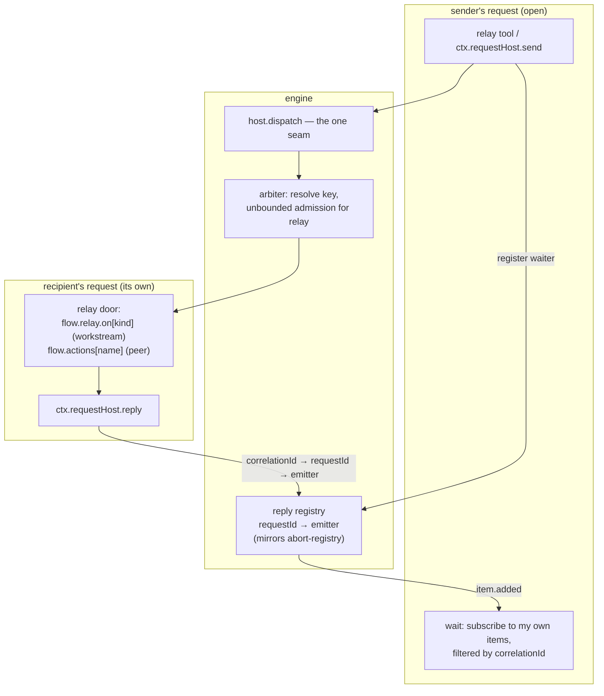

# FIX-1230: Relay core — address an existing session and send it a message, with fire-and-forget and wait-for-response modes — Implementation Spec

## Part I — The Case *(for the human)*

### 1. Problem — why it matters, why now

A running piece of work cannot be reached. FSD can start a session, and start a background
job under one, but there is no way back *in*. A worker that hits a question has two exits —
finish on a stale brief, or fail. A coordinator that learns something after handing work off
can only wait for it to come back and start again.

**Why now** — Conductor drives coding-agent runs across many sessions and needs this to
exist at all, and every other issue in the Relay epic is built on this one. Today's
workaround is to let the work finish and re-dispatch, throwing away everything it had done.

### 2. Solution in plain terms

A session gets an address — the id it already has — and a way to send it a message. The
message arrives as an ordinary request on the recipient, visible in that session's history
like anything else. Two modes: **send and move on**, acknowledged when the system accepts
it; or **send and wait**, where the sender parks until the recipient answers or its clock
runs out. Who may send is decided by the server from the sending context, never from
anything written in the message.

An agent inside a worker gets this as a tool, through a small surface its author declares.
It never reaches the flow's public actions — a worker is inside-world and stays there.

**Built before written, in the one place that matters.** The epic said the waiting half had
been specified wrong twice and told us not to write a third prose variant. So we ran it, and
it moved two things — how the reply is delivered, and which key a message queues on. §7
carries both, and decision 1 is one of them.

**Philosophy** — tenet 2: the send uses the one dispatch seam every transport already funnels
through, and the reply rides the existing item stream. Tenet 5: the reply reaches a live
request the same way a cancellation already does — one registry, not a path per transport.
Tenet 3: one verb, one declared config group, no new block kind, no new queue.

### 6. Decisions & rules — the sign-off surface

1. **A message obeys the recipient's declared concurrency policy, and "send and wait" is
   refused on the spot when the message would queue behind the sender itself.**
   *Rejected:* exempting relay from that policy. It rescues one configuration and buys a
   worse failure — we measured a message running alongside the sender's own request on the
   same session, the exact thing that configuration exists to prevent (§7, Q6 case 3).
   *Locks in:* an app that declares "one request at a time per user" gets a named refusal on
   "send and wait" at the first send, and must use "send and move on" or narrow that
   setting. Apps that declare no concurrency policy — the default — are unaffected.

2. **A wait that runs out of clock reports an *unknown* outcome, never a failure, and the
   sender reads a durable per-send status before acting on it. We do not cancel the
   message.**
   *Rejected:* cancelling the undelivered message on timeout — a race we would lose, since
   it may already be running, replacing "you don't know" with "you were told wrong."
   *Locks in:* a caller may never retry on the timeout alone. It is a promise to consumers,
   the same one `livenessOf` already makes, and breaking it later means someone's side
   effect runs twice.

3. **Ships as two PRs: the address and "send and move on" first, then "send and wait".**
   *Rejected:* one PR. The first is what four other epic issues wait on; the second carries
   all the risk.
   *Locks in:* the rest of the epic unblocks roughly a week earlier, and "send and wait" is
   briefly documented as not-yet-available rather than shipping half-working.

**Non-goals** — finding a session to talk to (the sender is given the address), fan-out or
subscribers, ordering on the queue-backed path (FIX-830 owns it), and the cross-worker wake
channel that would let "send and wait" work on a queue-backed deployment (the epic's issue
2 — refused here in the meantime, not depended on).

**Size:** Large — 12 production files · 15 test behaviours · 4 doc surfaces · 2 PRs.

---

### 3. Tradeoffs & alternatives

**Alternative: a durable inbox both sides poll** (the shape FIX-1075 sketches). A message
waits in a shared resource until the recipient next looks. Rejected as the primitive here
because it does not wake anybody: the headline case is a worker that is *mid-run* and needs
to be reached now, and an inbox turns that into "whenever it next checks." It is a good
thing to build *on* relay later, and nothing here forecloses it.

**The simpler approach: fire-and-forget only, and let the sender listen for a reply
message.** Genuinely tempting — it is one mode instead of two, it needs no reply registry,
and it works identically on every deployment. Insufficient because the sender has to stay
alive and keep listening for a reply that is a fresh request on *its* side, which is the
whole second half of the problem wearing a different hat. What we would save is the
registry; what we would pay is that every consumer writes the correlation logic itself.

**Where the complexity is:** not the send. It is the four ways a bounded wait and an
unbounded delivery can disagree — the reply that arrives after the listener is gone, the
delivery that runs after the sender is terminal, the caller who retries a timeout, and the
sender whose own concurrency key is what the delivery is queued behind. §9 is mostly that.

### 4. Focus practices (1–5)

1. **BP-031 (never decide from caller-controllable input)** — the sender's identity and the
   authorization tuple are derived from the running request. The *recipient locator* is the
   deliberate exception: it is caller-supplied and opaque by design, and over-applying the
   rule to it makes the headline case unreachable. Both halves get a test.
2. **BP-035 (second-path checklist)** — every behaviour is exercised on the *relay* path,
   not only on the HTTP path it resembles. A suite that only proves the seam works from
   outside proves nothing about this change.
3. **BP-030 (tolerate the old shape)** — the new session field reads back absent on every
   record written before it, and absent must mean top-level, guarded with `== null`.
4. **One convergence point for the refusal** (tenet 5) — the two refusals (`key-collision`,
   `no-cross-worker-wake`) are decided at the send verb, which is the single place a relay
   message is created. A guard added at the tool is a guard the verb's other callers skip.
5. **Prove the unknown outcome can fire** (tenet 7) — a timeout test that can only pass
   because nothing replied is not a check. Force a *late* reply and a *late* delivery.

### 5. What using it looks like

**A worker asks its coordinator a question and waits** *(what this spec proposes)*:

```ts
const answer = await ctx.requestHost.send({
  to: coordinatorSessionId,        // an address the worker was given
  message: { kind: "question", text: "Ship behind a flag, or hold?" },
  mode: "waitForResponse",
  timeoutMs: 120_000
})
// answer.ok && answer.replied  → answer.reply is the coordinator's payload
// answer.ok && !answer.replied → we stopped waiting. UNKNOWN, not "no".
// !answer.ok                   → answer.refused names why: "key-collision" |
//                                "no-cross-worker-wake" | "org-mismatch" | …
```

**The coordinator declares what it accepts, and answers without ending its turn:**

```ts
defineFlow({
  kind: "conductor",
  relay: { on: { question: { block: answerQuestion, input: (m) => m.payload } } },
  // …
})

// inside answerQuestion, or anywhere nested under it:
await ctx.requestHost.reply({ text: "Hold — legal is still reviewing." })
```

**Send and move on** — the same verb, no clock, acknowledged when accepted:

```ts
await ctx.requestHost.send({ to: peerSessionId, message: {...}, mode: "fireAndForget" })
// resolves once the system has accepted it. Not once it has run.
```

---

## Part II — The Build Plan *(for the implementing agent)*

### 7. Technical design

Nothing new sits in the middle. A relay message is an ordinary dispatch through the one
seam every transport already uses, stamped with a source a caller cannot set; the reply is
an item on the sender's own stream, delivered through a registry shaped exactly like the
abort registry that already reaches live requests from outside.



- **`@flow-state-dev/core`** — `RequestHost` gains `send` and `reply`, both returning the
  `{ ok: true, … } | { ok: false, refused, detail }` shape `startDetached` already uses. A
  new declared group `relay?: { on: { <kind>: binding } }` on the flow definition, a sibling
  of `webhooks?` / `schedules?` and the same shape: a binding carries its `ActionCore` inline
  plus an `input` mapper, so a relay handler never appears in `flow.actions`.
- **`@flow-state-dev/engine`** — a `RELAY_SOURCE` in `transport-sources.ts`; a branch in
  `resolve-action-core.ts` that is **terminal for a workstream recipient** exactly as the
  workstream branch is, and falls through to `flow.actions` for a peer; the reply registry;
  the send/reply operations wired onto the request host the way
  `detached-start-operation.ts` is; an unbounded admission budget for the relay source; and
  a `crossWorkerWake` capability the host reads off the effective dispatcher.
- **`SessionRecord` gains `sessionKind`** — server-written at creation, `"workstream"` for a
  detached child and absent for everything else. It is what picks the door, and it must be a
  carried decision rather than one re-derived at each read: `topic` and `coordinate` are
  documented as display-only with no authority, and `parentSessionId` will not separate a
  workstream from the sibling issue 3 mints. Additive and non-indexed, so no adapter
  migration — the session row's `data` column already holds everything but a handful of
  indexed columns.
- **Untouched:** `waitForCondition`, every block kind, the item taxonomy, the queue.

**What the POC showed** — `spec-poc/FIX-1230-relay-core/` on this PR, two scripts, ~7s
total, no model and no store. Both settle premises this design rests on, and both changed
it — Q5 changed how the reply is delivered, Q6 changed decision 1.

- **Q5 (`q5-correlated-reply.ts`) — the reply half works in-process, and two sends stay
  separate.** One request issued two blocking sends at once; each woke on its own reply in
  ~160ms, on its own correlation id. The wait needs no new primitive:
  `ctx.response.subscribeToItems` plus a timer is `waitForCondition`'s own engine with a
  call-time predicate.
- **Q5's first run is the finding that changed the design.** Delivering the reply as the
  obvious `{ type: "message", … }` draft reported *delivered* and woke nobody.
  `ResponseEmitter.emit` accepts anything with a string `type` and only routes
  `item.added` / `item.done` / `item.updated` through item tracking
  (`response-emitter.ts:112-121`, `:343-364`); everything else is appended as a raw stream
  event, which is never an item, never in `getItems()`, and never seen by
  `subscribeToItems`. **A reply delivered that way is dropped in silence.** So the registry
  must hold the engine's `ResponseEmitter` (which has `emitItemOneShot`), not the
  `ResponseEmitterHandle` a block sees — and the delivery is an *item event*, not an emit.
- **Q6 (`q6-arbiter-key.ts`) — the arbitration matrix, and it decided §6's decision 1.**
  Five cases under `policy: "queue"`. **Predicted collision matched observed stall in every
  one**, so the refusal needs no heuristic: compare the key the sender's dispatch resolved
  against the key the delivery resolves. Case 4 showed an ordinary peer send on a
  `key: "session"` flow already works with no relay change; case 1 showed the same send under
  `key: "user"` stalls; case 3 showed that exempting relay rescues case 1 and lets a
  self-addressed message run *concurrently with the sender's own request on the same
  session*. A stalled delivery is not a dropped one — unbounded admission keeps it queued —
  which is why the refusal has to be at send time.

**Sketch — pseudocode. Illustrative, not the contract. React to the shape.**

```
send(to, message, mode):
    identity   ← the running request's, server-derived        (never from `message`)
    recipient  ← load the session record for `to`
    refuse unless recipient.owner == identity.owner
               and recipient.org   == identity.org            (unbound == unbound too)
    door       ← recipient is a workstream ? the declared relay group : the public actions
    refuse if door is absent

    if mode is waitForResponse:
        refuse "no-cross-worker-wake" unless the effective dispatcher can wake us
        refuse "key-collision"        if the delivery's key == a key we already hold
        correlationId ← mint one, now                         (per SEND, not per request)
        register (correlationId → my requestId) and (my requestId → my emitter)

    dispatch through the one seam, stamped source=relay, admission unbounded
    if mode is fireAndForget: return once accepted

    wait on MY OWN item stream for an item carrying correlationId, bounded by timeoutMs
    on timeout: return UNKNOWN — never "did not happen"       (decision 2)

reply(payload):
    correlationId ← stamped into this request at dispatch, closed over    (no argument)
    requestId     ← the waiter for it
    emitter       ← reply registry[requestId]                 (absent → other process)
    emit an ITEM event onto it                                (not a raw stream event)
```

**Two things the sketch is deliberately making a claim about.** `reply` takes no correlation
id — it is stamped into the recipient's request and closed over, the same reason
`settleParentTask` takes no claim ticket: an argument would be forgeable by anyone who can
read the message. And replying is **explicit**, not the recipient action's return value:
the headline case is a coordinator answering a question *without* ending its turn, so an
implicit reply-on-completion cannot serve it, and shipping both would be two routes to one
job (tenet 3).

### 8. Implementation sequence

**PR a — the address, the door, and "send and move on".** Independently shippable; it is
what epic issues 3, 4 and 6 wait on.

1. **`sessionKind` on the session record**, written by the detached-start writer. *Test:* a
   record written without it reads as top-level; a detached child reads as a workstream.
   *Depends on:* nothing.
2. **The `relay` declared group** on the flow definition and instance, mirroring
   `webhooks`. Definition-only, like its siblings — add it to `rejectDefinitionOnlyOptions`.
   *Test:* a declared binding is reachable; an instance option is rejected.
3. **`RELAY_SOURCE` and the resolution branch.** Terminal for a workstream recipient, falls
   through to `flow.actions` for a peer, per AC 1's rule that the recipient's kind and flow
   are read from the record and never asserted by the sender. *Test:* a workstream recipient
   cannot reach a public action *even when the message names one*; a peer can; a flow that
   declares no relay group refuses by name. *Depends on:* 1, 2.
4. **The send operation and `ctx.requestHost.send`**, assembled the way
   `detached-start-operation.ts` assembles a detached dispatch: identity closed over, source
   stamped at the seam. Fire-and-forget only in this PR; `waitForResponse` refuses
   `mode-not-available`. *Test:* the identity tuple (owner, org bound-vs-unbound, tenant);
   acceptance resolves while still queued. *Depends on:* 3.
5. **Unbounded admission for the relay source** in the arbiter. *Test:* a recipient busy
   longer than the 30s default still runs — the Q4 shape, as a CI spec. *Depends on:* 4.
6. **The agent-facing tool**, exposing `fireAndForget`. *Test:* it is offered inside a
   worker's declared surface and nowhere else. *Depends on:* 4.

**PR b — "send and wait".** *Depends on:* a.

7. **The reply registry** — `requestId → ResponseEmitter`, registered and deregistered by
   the host alongside the abort controller, in the same lifecycle. *Test:* deregistration on
   every terminal path, including abort.
8. **`ctx.requestHost.reply`** and the per-send correlation id, stamped at dispatch.
   *Test:* two sends outstanding from one request each wake on their own reply — the Q5
   case, as a CI spec. *Depends on:* 7.
9. **The two refusals**, both at the send verb: `key-collision` (decision 1) and
   `no-cross-worker-wake` (AC 4), the latter read off a `crossWorkerWake` capability the
   dispatcher declares — false for an external dispatcher, and the seam epic issue 2 plugs
   into. *Test:* the Q6 matrix's collision cases refuse *synchronously*; a queue-backed
   dispatcher refuses the mode and still serves fire-and-forget. *Depends on:* 8.
10. **The unknown-outcome contract** (decision 2) — the durable per-send status and the
    `timedOut` result that never means "did not happen". *Test:* a reply that lands after
    the listener is gone, and a delivery that runs after the sender is terminal, neither
    throwing and neither reported as a negative. *Depends on:* 8.
11. **The tool's blocking mode**, and the refusal surfaced to the model as a tool result it
    can act on rather than an exception. *Depends on:* 9, 10.

| sub-PR | deliverables | depends_on |
|---|---|---|
| a | steps 1–6: the address, the door, the send verb, fire-and-forget, admission, the tool | — |
| b | steps 7–11: the reply registry, correlation, both refusals, the unknown-outcome contract | a |

**Removals:** none. Nothing today does this job, so there is no path to subtract — which is
worth stating rather than leaving as a silence, since a change that supersedes nothing is
unusual here.

### 9. Edge cases & error handling

| Case | Expected |
|---|---|
| Recipient session does not exist | Refused `unknown-recipient`. Indistinguishable from a recipient under another owner — no existence oracle, matching `livenessOf` |
| Recipient owned by another user | Refused `unknown-recipient` (same code, deliberately). An existing invariant already blocks the run; refusing at the verb keeps the two answers identical |
| Sender unbound, recipient org-bound (or the reverse) | Refused `org-mismatch`. The existing check only fires when both are set and *differ*, so an omitted org silently resolves to the recipient's |
| Reply arrives after `timeoutMs` | Delivered to a registry entry that is gone, or to a terminal request. Dropped, logged once, never an error to anyone |
| Delivery runs after the sender is terminal | Normal and expected. It was accepted; unbounded admission means it will run |
| Two replies for one correlation id | First wins; the second is dropped and logged. A recipient replying twice is a caller bug, not a stream to keep open |
| `reply` from a request that was not a relay delivery | Refused `no-relay-message` — nothing was stamped, so there is nothing to answer |
| Self-addressed "send and wait" | Refused `key-collision` when a key is held (Q6 case 5); permitted when none is (`policy: "allow"`), where it is merely a second request on one session |
| Recipient's flow declares no relay group, message names an action | Refused. The workstream door is terminal — it never falls through, which is the whole security property |

**Taxonomy:** every refusal is a returned `{ ok: false, refused }`, fatal to that send and
retryable by the caller once it fixes the cause — none of them throw, matching
`startDetached`. The one *non*-fatal, non-retryable outcome is the timeout, and it is
neither: it is unknown (decision 2).

### 10. Testing strategy

**Goal:** two real sessions on a running host, one asking the other a question mid-run. The
worker sends and parks; the coordinator's agent answers from inside its turn; the worker
continues on the answer and finishes. `goals/relay-core/ask-and-continue/run.mts`, real
model — the point is that a *generator's* tool call parks and resumes, which no mocked spec
proves.

**CI specs** (behaviours, not test names):

- one behaviour per decision in §6, in observable terms
- **the identity split, both halves**: the sender's identity is ignored when supplied on the
  message, and the recipient locator *is* honoured when supplied — the second is the one a
  well-meaning implementer breaks
- **the door is terminal**: a message naming a public action, addressed to a workstream, runs
  nothing
- **two sends, one request** — each wakes on its own reply (Q5)
- **the refusals are synchronous** — the caller learns at send time, not at timeout (Q6)
- **the second path** (BP-035): every behaviour exercised over relay, not over HTTP
- **what must not change**: a flow declaring no relay group behaves exactly as today, and a
  flow declaring no concurrency policy never refuses a send
- **the invariant that is easy to state wrongly**: a timeout asserts *nothing* about the
  delivery. A test that asserts the recipient did not run is testing a race and will pass
  for the wrong reason on a fast machine; assert the sender's outcome, and separately assert
  that a late delivery still lands

**Discipline:** `tdd`. The seam is `createInboundTransportHost` + `createInMemoryStores`,
reachable from a vitest spec with no HTTP server — the POC runs there already, so every
behaviour above is a tracer bullet.

### 11. Documentation plan

- **CREATE** `apps/docs/docs/server/session-messages.md`, sidebar position immediately after
  `server/background-work` ("Detached work") and before `server/authentication` — the page
  order already reads "here is background work, here is how you reach it." `sidebar_label:
  Messaging a session`. Outline: what an address is · the two modes and when each is right ·
  declaring what a worker accepts · what a timeout means and why it is not a "no" · the two
  refusals in plain terms. One example, the worker-asks-a-question one from §5.
  Cross-link ← from `server/background-work` (a "you can also reach one" line), →
  `advanced/concurrency-policies`.
  *Voice risk:* the timeout section will attract "gracefully". It should say what happens.
- **EXTEND** `apps/docs/docs/advanced/concurrency-policies.md` — a short section on why a
  shared concurrency key and "send and wait" are incompatible, and the two ways out. This is
  where an app author hits decision 1, and the refusal message should point here.
- **EXTEND** `packages/engine/README.md` and `packages/core/README.md` — one entry each for
  the new verbs and the declared group (BP-009).
- **No new architecture doc.** Relay is a new door on the existing dispatch seam, so it is a
  section under an existing concept rather than a subsystem of its own; a line in
  `docs/architecture/execution-and-errors.md` naming the relay source alongside the others is
  enough.

### 12. Dependencies, open questions & follow-ups

**Dependencies:** none blocking. Nothing in the epic must land first — that is the point of
this being issue 1. Epic issue 2 (the cross-worker wake channel) *depends on* this and is
conditional; step 9 leaves it a declared capability to plug into.

**Open questions:** none. Two things are deliberately deferred rather than open:

- **The names.** `relay`, `send`, `reply` are working names. The epic's owner deferred
  naming until there is code to look at, so this spec uses them consistently and does not
  ask.
- **Which layer role materialization belongs on.** The epic deferred it; nothing here
  depends on the answer.

**Settled claims:**

- **Settled:** a reply produced by the recipient's own request can reach the sender's live
  stream and wake a runtime-built wait, and two concurrent sends stay separate —
  **CONFIRMED** (Q5, `spec-poc/FIX-1230-relay-core/q5-correlated-reply.ts`).
- **Settled:** delivering that reply as a raw stream event reports success and wakes nobody —
  **CONFIRMED**; the delivery must be an item event, and the registry must hold the engine's
  emitter, not the handle a block sees (Q5's first run).
- **Settled:** the deadlock is a property of a shared arbitration key, not of relay; a
  session-keyed flow's ordinary peer send already works, and exempting relay from the policy
  lets a self-addressed message run concurrently with its sender — **CONFIRMED** (Q6).
- **Settled:** the refusal is exactly decidable by comparing the sender's held key with the
  delivery's resolved key — predicted collision matched observed stall in all five cases
  (Q6).

**Follow-ups (flagged, not built):**

- **FIX-1056** (steering work in flight) and **FIX-1075** (a durable inbox) are the same
  seam approached two other ways, and both predate this epic. FIX-1056 carries an owner
  decision from 2026-08-10 that a detached task is the only way to start a Workstream, and
  the constraint it records — *"if steering wants a channel that is not a task, that is the
  point where the authored-entrypoint question re-opens"* — is precisely what the declared
  `relay` group does. Whether relay supersedes either is the owner's call and is raised
  separately; **nothing here closes, merges or re-scopes them.** FIX-1075's own framing
  question ("what does an inbox add once shared resources exist?") is better asked after
  relay lands, since an inbox built on relay is a different answer from an inbox built
  beside it.
- **Deepening:** `resolve-action-core.ts` will carry five source branches after this,
  three of which fall through and two of which are terminal. That distinction is currently
  a comment. Out of scope; follow up via `improve-codebase-architecture`.

---

## Spec evolution *(the change story, not an audit log)*

- **Spec drafted** — framed as "a running session cannot be reached"; the send goes through
  the existing dispatch seam with a source a caller cannot set, and the reply rides the
  sender's own item stream through a registry shaped like the abort registry; split into two
  PRs so the epic's dependent issues unblock on the first.
- **After the POC** — decision 1 changed from *exempt relay from the recipient's concurrency
  policy* to *obey it and refuse the collision at send time*, because the exemption let a
  self-addressed message run concurrently with its sender on one session (Q6 case 3). The
  reply delivery changed from an emit to an item event, because the obvious emit reported
  success and woke nobody (Q5's first run).
