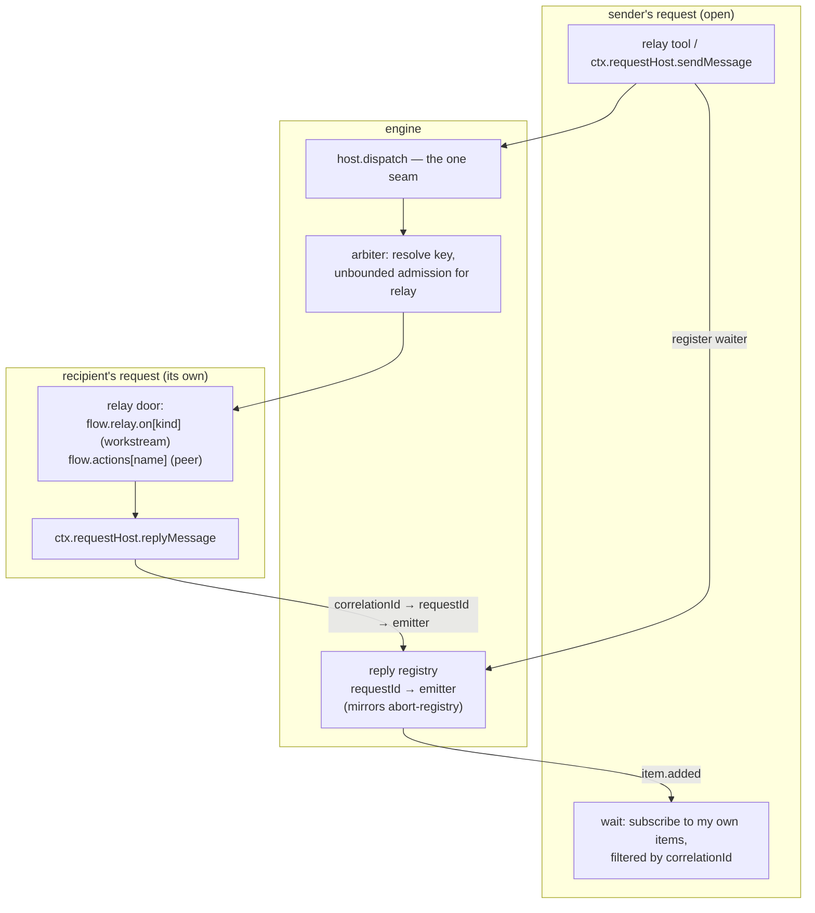

# FIX-1230: Relay core — address an existing session and send it a message, with fire-and-forget and wait-for-response modes — Implementation Spec

## Part I — The Case *(for the human)*

### 1. Problem — why it matters, why now

A running piece of work cannot be reached. FSD can start a session, and start a background
job under one, but there is no way back *in*. A worker that hits a question has two exits —
finish on a stale brief, or fail. A coordinator that learns something after handing work off
can only wait for it to come back and start again.

**Why now** — Conductor drives coding-agent runs across many sessions and needs this to
exist at all, and every other issue in the Relay epic is built on this one. Today's
workaround is to let the work finish and re-dispatch, throwing away everything it had done.

### 2. Solution in plain terms

A session gets an address — the id it already has — and a way to send it a message. The
message arrives as an ordinary request on the recipient, visible in that session's history
like anything else. Two modes: **send and move on**, acknowledged when the system accepts
it; or **send and wait**, where the sender parks until the recipient answers or its clock
runs out. Who may send is decided by the server from the sending context, never from
anything written in the message.

An agent inside a worker gets this as a tool, through a small surface its author declares.
It never reaches the flow's public actions — a worker is inside-world and stays there.

**Built before written, in the one place that matters.** The epic said the waiting half had
been specified wrong twice and told us not to write a third prose variant. So we ran it, and
it moved two things — how the reply is delivered, and which key a message queues on. §7
carries both, and decision 1 is one of them.

**Philosophy** — tenet 2: the send uses the one dispatch seam every transport already funnels
through, and the reply rides the existing item stream. Tenet 5: the reply reaches a live
request the same way a cancellation already does — one registry, not a path per transport.
Tenet 3: one verb, one declared config group, no new block kind, no new queue.

### 6. Decisions & rules — the sign-off surface

1. **A message obeys the recipient's declared concurrency policy, and "send and wait" is
   refused on the spot when the message would queue behind the sender itself.**
   *Rejected:* exempting relay from that policy. It rescues one configuration and buys a
   worse failure — we measured a message running alongside the sender's own request on the
   same session, the exact thing that configuration exists to prevent (§7, Q6 case 3).
   *Locks in:* an app that declares "one request at a time per user" gets a named refusal on
   "send and wait" at the first send, and must use "send and move on" or narrow that
   setting. Apps that declare no concurrency policy — the default — are unaffected.

2. **A wait that runs out of clock reports an *unknown* outcome, never a failure; the sender
   reads the delivery's own durable status before acting on it; and that status is reachable
   from every caller the mode is offered to — the agent included. We do not cancel the
   message.**
   *Rejected:* cancelling the undelivered message on timeout — a race we would lose, since
   it may already be running, replacing "you don't know" with "you were told wrong."
   *Locks in:* a caller may never retry on the timeout alone. It is a promise to consumers,
   the same one `livenessOf` already makes, and breaking it later means someone's side
   effect runs twice. **Both halves are the decision** — the unknown outcome *and* the means
   to resolve it. Review found the second half had no model-facing surface, which would have
   left the promise unfulfillable for the agent it was written for; it is named now so the
   thing being approved is the whole contract.

3. **Ships as two PRs: the address and "send and move on" first, then "send and wait".**
   *Rejected:* one PR. The first is what four other epic issues wait on; the second carries
   all the risk.
   *Locks in:* the rest of the epic unblocks roughly a week earlier, and "send and wait" is
   briefly documented as not-yet-available rather than shipping half-working.

**Non-goals** — finding a session to talk to (the sender is given the address), fan-out or
subscribers, ordering on the queue-backed path (FIX-830 owns it), and the cross-worker wake
channel that would let "send and wait" work on a queue-backed deployment (the epic's issue
2 — refused here in the meantime, not depended on).

**Size:** Large — 18 production files · 61 test behaviours · 6 doc surfaces · 2 PRs (each with a changeset).

---

### 3. Tradeoffs & alternatives

**Alternative: a durable inbox both sides poll** (the shape FIX-1075 sketches). A message
waits in a shared resource until the recipient next looks. Rejected as the primitive here
because it does not wake anybody: the headline case is a worker that is *mid-run* and needs
to be reached now, and an inbox turns that into "whenever it next checks." It is a good
thing to build *on* relay later, and nothing here forecloses it.

**The simpler approach: fire-and-forget only, and let the sender listen for a reply
message.** Genuinely tempting — it is one mode instead of two, it needs no reply registry,
and it works identically on every deployment. Insufficient because the sender has to stay
alive and keep listening for a reply that is a fresh request on *its* side, which is the
whole second half of the problem wearing a different hat. What we would save is the
registry; what we would pay is that every consumer writes the correlation logic itself.

**Where the complexity is:** not the send. It is the four ways a bounded wait and an
unbounded delivery can disagree — the reply that arrives after the listener is gone, the
delivery that runs after the sender is terminal, the caller who retries a timeout, and the
sender whose own concurrency key is what the delivery is queued behind. §9 is mostly that.

### 4. Focus practices (1–5)

1. **BP-031 (never decide from caller-controllable input)** — the sender's identity and the
   authorization tuple are derived from the running request. The *recipient locator* is the
   deliberate exception: it is caller-supplied and opaque by design, and over-applying the
   rule to it makes the headline case unreachable. Both halves get a test.
2. **BP-035 (second-path checklist)** — every behaviour is exercised on the *relay* path,
   not only on the HTTP path it resembles. A suite that only proves the seam works from
   outside proves nothing about this change.
3. **BP-030, and specifically its *reject the missing key loudly* side** — every session
   record written before this change reads the new discriminator as absent, and absent must
   **refuse**, never fall through. The tolerant reading is the exploitable one here, which is
   what makes this the half of BP-030 that applies. A backfill repairs the rows; the refusal
   is what holds until it has run.
4. **One convergence point for the refusal** (tenet 5) — every refusal (`key-collision`, and
   `external-dispatcher` if §12's O2 lands on refusing) is decided at the `sendMessage` verb,
   which is the single place a relay message is created. A guard added at the tool is a guard the verb's other callers skip.
5. **Prove the unknown outcome can fire** (tenet 7) — a timeout test that can only pass
   because nothing replied is not a check. Force a *late* reply and a *late* delivery.

### 5. What using it looks like

**A worker asks its coordinator a question and waits** *(what this spec proposes)*:

```ts
const answer = await ctx.requestHost.sendMessage({
  to: coordinatorSessionId,        // an address the worker was given
  kind: "question",                // selects the recipient's declared handler
  payload: { text: "Ship behind a flag, or hold?" },
  mode: "waitForResponse",
  timeoutMs: 120_000
})
switch (answer.outcome) {
  case "replied": handle(answer.reply); break
  case "unknown": // we stopped waiting. NOT "it didn't happen" — decision 2.
                  // resolve it: answer.deliveryRequestId, via the status tool.
                  break
  case "refused": // answer.refused: "key-collision" | "external-dispatcher" | …
                  break
}
```

**The coordinator declares what it accepts, and answers without ending its turn:**

```ts
defineFlow({
  kind: "conductor",
  // `m` is the inbound relay message: { kind, payload, from } — the same shape
  // `WebhookEventBinding.input` receives for a webhook event.
  relay: { on: { question: { block: answerQuestion, input: (m) => m.payload } } },
  // …
})

// inside answerQuestion, or anywhere nested under it:
await ctx.requestHost.replyMessage({ text: "Hold — legal is still reviewing." })
```

**Send and move on** — the same verb, no clock, acknowledged when accepted:

```ts
await ctx.requestHost.sendMessage({ to: peerSessionId, kind: "status", payload: {...},
                            mode: "fireAndForget" })
// resolves once the system has accepted it. Not once it has run.
```

---

## Part II — The Build Plan *(for the implementing agent)*

### 7. Technical design

Nothing new sits in the middle. A relay message is an ordinary dispatch through the one
seam every transport already uses, stamped with a source a caller cannot set; the reply is
an item on the sender's own stream, delivered through a registry shaped exactly like the
abort registry that already reaches live requests from outside.



- **`@flow-state-dev/core`** — `RequestHost` gains `sendMessage` and `replyMessage`, both
  returning the `{ ok: true, … } | { ok: false, refused, detail }` shape `startDetached`
  already uses. A
  new declared group `relay?: { on: { <kind>: binding } }` on the flow definition, a sibling
  of `webhooks?` / `schedules?` and the same shape: a binding carries its `ActionCore` inline
  plus an `input` mapper, so a relay handler never appears in `flow.actions`.
- **`@flow-state-dev/engine`** — a `RELAY_SOURCE` in `transport-sources.ts`; the resolution
  rule below in `resolve-action-core.ts`; the reply registry; the send/reply operations wired
  onto the request host the way `detached-start-operation.ts` is; a `RELAY_SOURCE` branch in
  the arbiter that keeps the recipient's key, resolves its policy by door form (below), and
  passes `waitTimeoutMs: Infinity` — the gate already honours it
  (`keyed-async-gate.ts:141-145`), so this is one branch, not a second admission concept.
- **External relay is refused UNCONDITIONALLY, with no capability flag to lift it — and this
  reverses an engineering call made two rounds ago.** The earlier design added an optional
  `crossWorkerWake` on `FlowDispatcher` so epic issue 2 could "set one flag instead of
  inverting a shipped guard". That was wrong in a way worth naming, because the reasoning
  sounded right: **relay needs three guarantees past the queue boundary — wake support, door
  authority, and arbitration — and issue 2 supplies exactly one of them.** A single flag that
  lifts the refusal therefore hands issue 2's author a choice nobody should have to make:
  enable relay without the other two, or ignore the capability their own issue exists to
  provide. Defining all three signals is not cheap either — door authority across the boundary
  is O1-dependent and arbitration is FIX-830's, so two of the three cannot be specified here at
  all.

  So — **and this is a claim about the refusal's *shape*, not about whether we ship it: §12's
  O2 decides that, and this paragraph asserts nothing about scope** — *if* relay refuses on an
  external dispatcher, that refusal covers **both** modes and **cannot be half-lifted by a
  capability flag**. Lifting it is a deliberate later change that must demonstrate all three
  guarantees, made by whoever can see all three. Inverting a shipped guard is the *correct*
  cost here: it forces the change to be argued, which a flag flip does not.

  The shape argument survives either O2 branch, which is why it lives here rather than in
  §12: under *"scope queue-backed out"* it describes the guard we ship, and under *"support
  queue-backed"* it is the reason a flag is not how that support arrives either — the three
  guarantees still have to be demonstrated, just by the issue that builds them.
- **The door, and it is the whole security property. It has TWO axes, and conflating them is
  how a hole gets opened.** A declared `flow.relay.on[kind]` handler resolves first and is
  reachable on every session kind — that path never asks either question below. The
  **fallthrough to `flow.actions`** is what is gated. In order:

  0. **Either kind absent → refuse, before any door is resolved.** This runs *first*, ahead
     of the declared handler, and that ordering is the rule — not a detail of it. An earlier
     draft placed it among the fallthrough gates, which meant a legacy sender or recipient
     still reached a declared `relay.on` handler while §9 promised absence was refused
     unconditionally. Fail-closed that only covers one of two doors is not fail-closed.
  1. Recipient is `"workstream"` → **refuse** the fallthrough. Terminal, never
     `flow.actions`. Protects the recipient's narrow declared surface.
  2. Sender is `"workstream"` → **refuse** the fallthrough, whatever the recipient is.
     Confines the agent.
  3. Otherwise (`"top-level"` / `"sibling"` at both ends) → falls through to
     `flow.actions[kind]`…
  4. …**but the fallthrough does not reach an action declared `durable`** — refused
     `durable-action`. Stated as a property of the door rather than as a check on the target:
     rules 1 and 2 narrow *who* may use the second door, and this narrows *what it opens
     onto*. **Declared `relay.on` bindings are refused the same thing at construction**
     (below); this rule is the fallthrough's half, and it has to be here because the
     fallthrough's `kind` is caller-supplied, so there is no static pairing to validate.

     **Rule 4 is the early, nameable case. It is NOT the guarantee — see the suspend refusal
     below, which is.** `ActionCore.durable` is not the capability: `ctx.suspend()` is gated on
     **`options.durabilityEnabled`** — whether the *host* was given a `DurabilityProvider` —
     and throws from there (`createExecutionContext.ts:3203-3206`), never consulting the
     action's flag. An action with `durable` **unset** can therefore suspend on a
     durability-enabled host, and no construction-time check can see it: the flag is a
     correlate, not the thing.

  **Round 1 got this wrong by confining the recipient only**, which left a workstream agent
  able to reach an *undeclared* public action on a peer — contradicting the promise this spec
  makes in §2, that a worker never reaches `flow.actions`. The two properties read alike and
  are not the same: one is about whose surface is exposed, the other about who is allowed to
  reach out. **The headline case is unaffected**, because a declared handler resolves before
  the fallthrough question is asked; what the second axis removes is only the agent's
  undeclared reach.
- **Both kinds are server-derived, so gating on them is BP-031-clean.** The recipient's comes
  off the session record the door already loads. The sender's is *its own* session's, read
  where `createExecutionContext` has already loaded and identity-checked that record — so the
  request-host closure (`create-request-host.ts:99-112`, which today carries `userId` /
  `tenantId` / `orgId` / `sessionId` / `lineageId` and **no kind**) gains it alongside them.
  Neither is ever read off the message.
- **`SessionRecord` gains `sessionKind` — and absent FAILS CLOSED.** No cheaper existing
  lever survives, and each was checked rather than assumed: `flow.workstream` is flow-kind
  level and cannot separate two sessions of one flow; `parentSessionId` will not survive
  issue 3, because a sibling has a parent too, so it cannot separate sibling from workstream;
  `topic` / `coordinate` are documented as carrying **no authority**
  (`stores/types.ts:76-96`), and routing from a field nothing guarantees is BP-031.
  `metadata` is worse still — a session record's is the caller's bag spread verbatim
  (`create-request-host.ts:305`), and `metadata.workstream` lives on the **request** envelope
  with its own comment saying it *"decides nothing"* (`:363-366`).
- **The field's real cost is legacy records, and that is handled, not hoped.** A record
  persisted before the field reads it as absent, and the adoption path **documents that it
  does not backfill** (`create-request-host.ts:258-264`). So absent is a **refusal**, never a
  permissive default — this is BP-030's *reject the missing key loudly* side, because here
  the tolerant reading is the exploitable one. A one-time backfill then repairs existing
  rows. **The backfill may classify by `parentSessionId` even though the runtime door may
  not**, and the distinction is the point: the door must survive issue 3's siblings, while
  the backfill runs once over rows that all predate siblings, so the ambiguity that
  disqualifies the field at runtime provably does not exist at backfill time.
- **Stamping it is a convergence point (tenet 5), not a line in one writer.** Four sites mint
  a session record: `ensure-session-record.ts:48` (fed by `createExecutionContext.ts:605` and
  `webhook/session-resolver.ts:35`), the public create route
  (`routes/session-routes.ts:195`), and the detached child writer
  (`create-request-host.ts:310`). Default `"top-level"` at the shared helper so its callers
  are covered by construction, and let the child writer be the one site that says
  `"workstream"`. An enumeration that stamps three of four ships a session nobody can reach.
- **OPEN, OWNER-FACING: the two-axis door does not hold on a queue-backed deployment, and
  fire-and-forget IS supported there.** Blocking wait is refused when the dispatcher cannot
  wake us (AC 4), but "send and move on" is not — so this is a live gap, not a mode we
  already decline. Three facts compose into it: `runActionInternal` resolves the action core
  **before** the recipient's session record is loaded, so the worker has no `sessionKind` at
  the moment it routes; `DispatchEnvelope` carries `requestId`, `flowKind`, `actionName`,
  `input`, `userId`, `sessionId`, `orgId`, `tenantId`, `source`, `metadata` and
  `resolvedActionCore` — **no session kind**, and the core itself is explicitly *"NOT
  serializable … external dispatchers (BullMQ) drop it"* (`dispatcher.ts:27-34`); and the
  sender's request-host closure, which is where the sender's kind lives, does not cross the
  queue boundary at all. **The door the owner approved therefore degrades on exactly the
  deployments the epic says need it.** **§12 recommends refusing queue-backed relay outright
  for this release**. **This sub-fork is now SETTLED — stamp the door at send** (decision D-3,
  #1430, delegated to the architect explicitly so queue deploys do not encode both). The
  sending side writes the routing answer onto the message; the worker does **not** recompute
  after load. **Do not ship a second encoding.**

  *Why stamping, recorded so it is not re-litigated:* the approved door is *"a worker gets a
  declared surface and never `flow.actions`"*, and stamping preserves that on a queue **without
  waiting on the cross-worker wake channel** (FIX-1231 / FIX-1242, which D-3 puts out of this
  cycle and states is **not** a FIX-1230 dependency). Recomputing after load would instead edit
  a step every flow already runs, for one consumer.

  *And the mechanism is exactly why it works — verified, not assumed.* `DispatchEnvelope`
  carries `metadata?: Record<string, unknown>` (`dispatcher.ts:26`), plain data that crosses the
  queue intact, while `resolvedActionCore` is documented **"NOT serializable — a block cannot
  cross a queue boundary … external dispatchers (BullMQ) drop it"* (`:29-34`). **The door's
  *answer* survives where the door's *implementation* cannot**, which is the whole reason a
  stamp closes this and a carried core does not.

  *BP-031, and the one sentence that keeps the stamp honest:* **the stamp is system-written and
  never caller-supplied.** It rides `metadata.relay`, and `metadata` *is* the caller's bag — the
  HTTP action route spreads `body.metadata` verbatim — so the stamp is authority **only behind
  the `source === RELAY_SOURCE` gate**, which the seam stamps (`action-routes.ts:144` hardcodes
  `source: "http"`, and nothing anywhere derives `source` from a body, query or params). A
  worker reading the stamp therefore checks `source` first, exactly as `replyMessage` and the
  incarnation guard do. Same trust model as `source` itself, which is the argument D-3 makes.

  *Freeze-at-send is accepted, not overlooked:* a session whose kind changes between send and
  run is routed on the older answer. Role changes mid-flight are FIX-1231-era, not this spec's.

  **And it is not one guarantee that degrades there — it is two, which changes the
  question.** Decision 1's refusal is also void on that path, and the framework says so
  itself: `createInboundTransportHost.ts:299-302` hardcodes
  `isExternalDispatcher ? { policy: "allow", key: undefined } : arbiter.resolve(…)`, and
  `:617-618` states *"The concurrency gate does not apply here — external dispatch is
  **unarbitrated in v1 (FIX-830)**."* So a queue-backed relay message is not arbitrated at
  all: there is no key to collide with, decision 1's refusal can never fire, and the
  recipient's declared concurrency policy is not applied to relay deliveries either. **This
  is the second independent finding landing on the same path**, which is what makes it a
  scope question rather than two patches — relay would be building both of its guarantees on
  a layer that explicitly does not provide them yet, and FIX-830 already owns closing that
  layer. Recorded as evidence, not resolved here.
- **Decision 1's refusal is specified here as CONSTRAINTS, not as a design — deliberately,
  and this is a stop rather than a punt.** The mechanism has now been written three times and
  each version was defeated by a fact only visible in the code: *thread the resolved key*
  (wrong — the key is populated but unheld on the default config, `arbiter.ts:88-93` vs
  `:164-167`); *thread the whole decision and refuse only when acquired* (right about the
  sender, but the **delivery's** decision is computed only inside
  `createInboundTransportHost.dispatch`, so nothing had resolved it at refusal time); and
  each repair exposed the next part. Three specifications, three real defects, no oscillation
  — that is a mechanism the spec cannot see from outside, and the epic hit the same signature
  on watch's correctness contract. **The business call is unchanged and is what the owner
  approves: refuse rather than exempt (decision 1).** What must hold:

  1. **The delivery's decision is computed once**, and *that same decision* is what `gate`
     receives. Not resolved for the check and re-resolved for the dispatch.
  2. **A custom `ConcurrencyKey` closure is invoked once per dispatch.** A stateful or
     time-varying key must not be called twice — it would pass the check on one value and
     gate on another, which is worse than not checking.
  3. **The refusal fires before anything queues or rejects.** A send that has already entered
     the gate has produced the outcome the refusal exists to prevent, and a
     `ConcurrencyRejectedError` surfacing instead of the named refusal is a different
     contract to the caller.
  4. **Refuse only when the sender actually HOLDS its key** — policy `queue`/`reject` and key
     defined — and the delivery would gate on that same key. A *resolved* key is not a *held*
     one; on the default config the sender resolves a populated session key and acquires
     nothing, and refusing there breaks the common path (Q6 case 7).
  5. **Arbitration policy follows the door form**, for the reason `arbiter.ts:145-159` already
     applies to events and detached dispatches: a declared `relay.on[kind]` binding carries a
     provenance-only name against `flow.actions`, so it takes the **flow default**; a
     `flow.actions[kind]` fallthrough is that action addressed as itself, so **its own
     override applies**.

  Satisfying all five may need a seam that does not exist yet — resolving the decision before
  dispatch and handing it in, rather than letting `dispatch` resolve it. That is the
  implementer's call with `tdd` and real code, which is exactly what the last three rounds
  did not have.
- **A relay message must not cross a flow boundary, and nothing downstream stops it.**
  `createExecutionContext` validates a reused session's user, tenant and org — and **not its
  flow kind**: it raises `UserBindingMismatchError`, `TenantBindingMismatchError` and
  `OrgBindingMismatchError` (`:633`, `:644`, `:660`) and reads `sessionRecord.flowKind`
  nowhere. `liveness-read.ts:120-127` states the property outright — *"A session id is not a
  flow boundary … one session can host requests of two flows."* So a same-owner send naming a
  session that belongs to **another flow** passes every existing check and runs *the sender's*
  flow handler against that session's history and state. **Require
  `recipient.flowKind === flow.kind`**, refused as `unknown-recipient` like the other
  addressing failures — or, if a later issue wants cross-flow relay, resolve and dispatch
  through the recipient's *registered* flow rather than the sender's. **Which of the two
  applies is decided by §12's O1, not by preference.** Under O1-no this issue requires the
  refusal. **Under O1-yes the refusal is not available at all** — a worker and its coordinator
  would be different flows by construction, so refusing cross-flow would forbid the headline
  case this spec exists to serve — and resolve-and-dispatch becomes mandatory. It is the same
  protection stated differently: the sender never runs *its own* handler against another
  flow's session either way.
- **The preflight approves a session *incarnation*, and the delivery must land on that same
  one — checked at execution, not only at send.** Every door decision above reads the
  recipient's record *before* dispatch. **Acceptance and execution are not the same moment,
  and no external queue is needed to separate them:** `policy: "queue"` is an ordinary
  in-process policy, and the host's own comment says only the *start* of execution is gated
  while *"the handle (requestId, liveStream, finished) is still returned synchronously"*
  (`createInboundTransportHost.ts:293-297`). So a delivery can be accepted, sit behind a held
  key, and run later — in a plain single-process deployment.

  A recipient session deleted and recreated under the same id in that window produces a new
  `lineageId`, and **nothing downstream re-checks**: `createExecutionContext` validates user,
  tenant and org bindings and **not** `flowKind` or `parentSessionId`
  (`state-and-scopes.md:471`). The preflight's door choice — and under O1-no the sender flow's
  handler — would then execute against a *replacement* session, defeating both the flow
  boundary and the relay door. This codebase already treats recreation-under-the-same-id as a
  live hazard for exactly this reason (`state-and-scopes.md:569-571`).

  **So: carry the expected incarnation with the delivery, revalidate it where the recipient
  record first exists, and on a mismatch RECONCILE what acceptance already wrote while never
  making the writes that have not happened yet.** Unconditional — the same `lineageId` remedy
  the sender-side status relation uses, applied at the other end. The exact split of which
  writes are reconciled and which are simply not made is below, and it is not a detail: an
  earlier draft of this very sentence demanded revalidation *before any request or item
  persistence*, which the next paragraph then refutes.

  **"Before any persistence" is UNACHIEVABLE, and asking for it a third time was the wrong
  question.** The guard has moved twice — settlement, then before item persistence — and each
  time something turned out to be written earlier. Enumerating the durable writes on the
  accepted-then-executed path rather than guessing at placement:

  1. `activeRequests.register` — host, at enqueue (`createInboundTransportHost.ts:465`).
     Before execution runs at all.
  2. `stores.request.set`, the `in_progress` stub — host, at enqueue (`:479`). Same.
  3. The same pair again on the external-dispatcher branch (`:621`, `:636`).
  4. `stores.session.set` writing `latestRequestId` — `runAction.ts:819`.
  5. `emitItemAdded` + `emitItemDone` for `action.userMessage` — `runAction.ts:1005-1021`.

  **Writes 1–3 precede the first sight of the recipient record. Writes 4 and 5 do not** —
  `runAction` loads it at **`:813`**, inside the `options.sessionId !== undefined` block that
  opens at `:808`, well before `createExecutionContext` re-reads it at `:1215`. An earlier draft
  of this paragraph said *"all five"*, anchored on `:1215` because that is the site the previous
  round argued about, and never asked whether a load existed before it. **That is the same
  defect this section keeps documenting** — the claim was checked against the mechanism the last
  argument named, not against what the sentence asserted.

  The correction sharpens the requirement instead of loosening it: only 1–3 are faits accomplis,
  and 4 and 5 are **preventable**.

  **And the decisive fact is a timing one, not a count: writes 1–3 happen at ACCEPTANCE, while
  the original session is still alive and valid.** The mismatch does not exist yet at that
  instant, so a check placed before them would pass and prove nothing. Moving the guard earlier
  cannot work — not "is hard", *cannot* — because the corruption is created later, when the
  session is deleted and recreated and the already-written request row is inherited. Session
  deletion removes per-resource content, resource state and the session record and **no request
  records at all** (`session-routes.ts:224-231`), which is what makes the row inheritable.

  **So the requirement has two halves, and they apply to different writes.** The guard goes
  **immediately after the load at `:813` and before the write at `:818-819`**:

  - **Writes 1–3 already happened, so they are RECONCILED** — delete the enqueue-time request
    record and its `activeRequests` entry.
  - **Writes 4 and 5 have not happened yet, so they are simply NOT MADE.** `latestRequestId` is
    *never written*, not written-and-left-alone, and the `userMessage` item is never emitted.

  **This is the second guard of exactly this shape in this function, and the first one's comment
  makes the argument.** The tenant-binding guard at `:818` compares a property of the
  just-loaded session against the request before letting the same `latestRequestId` write land,
  and it exists — in its own words — because *"this write runs before `createExecutionContext`'s
  binding check"*. Same window, same reasoning, added for the same class of bug (an auto-resume
  hijack, FIX-682). The incarnation check is that pattern's second instance and belongs beside
  it, which is a stronger instruction than deriving the window from scratch.

  **THE GUARD AT `:813` DOES NOT COVER THE WRITE AT `:819`, AND NO CONDITIONAL WRITE CLOSES IT
  WITH TODAY'S STORE CONTRACT. So relay removes its own exposure and narrows what it claims.**
  A recreate landing between the `get` at `:813` and the `set` at `:819` is not merely a lost
  race: the write is `set(sessionKey, { ...session, latestRequestId, updatedAt }, "any")`,
  spreading the **old** record read before the delete — so it **resurrects the deleted session's
  fields over the replacement** and stamps the old delivery as its `latestRequestId`.

  *Whether a conditional write closes it — determined, not assumed.* `ExpectedVersion` is
  `number | "any" | "absent"` (`stores/types.ts:418`), and none of the three says *"only if the
  lineage still matches"*. **`"absent"` does not compose** — the replacement record exists, so it
  always conflicts; it expresses create-only, never update-if-unchanged. **And a numeric CAS
  narrows without closing**, which the architecture doc settles rather than leaving to
  inference, because it has already reasoned about ABA for both stores and they differ:
  *"Scope `delete` is a hard delete with no tombstone, so a recreated id may reuse versions …
  The scope store's versions detect concurrent modification; they are not an identity, and
  nothing in the framework treats them as one"* (`state-and-scopes.md:80`) — against resource
  state, where *"Versions are never reused, and a tombstone keeps its version … which is why the
  ABA argument needs no sweep, no timer and no retention window"* (`:86`). **Sessions live in
  the store that lacks the property**, so a CAS on the read version can succeed against the
  replacement.

  **What relay does, in two parts.**

  1. **A relay delivery does not stamp `latestRequestId` at all**, so the dangerous write never
     happens on this path and the resurrection is unreachable for relay rather than merely
     narrowed. That field serves **auto-resume discovery** — a client attaching to a session
     finds the newest request and attaches its stream
     (`react/src/hooks/useSession.ts:1148-1169`). A relay delivery is not caller-addressed and
     no client is waiting to resume it, so this is arguably right on its own merits: the
     recipient's own conversation should not have its auto-resume target replaced by an inbound
     message. *The trade, stated because it is real:* a UI watching the recipient still **sees**
     the relay input item (§7's grid keeps it `client: true`) but will not auto-attach to the
     delivery's stream.
  2. **The guarantee is NARROWED to what the design delivers, and what gets through is
     enumerated rather than gestured at.** An earlier draft said the replacement session
     "carries nothing of the old delivery". **That is false for a recreate landing after the
     guard**, and the gap is not one value — it is the two things the delivery does next:

     - **The relay input item is emitted at `runAction.ts:1005-1021`**, against the delivery's
       own request record, which carries the **bare** `sessionId`. Session deletion removes no
       request records (`session-routes.ts:224-231`), so listing that session's requests
       returns the old delivery's row and **its history-visible message appears in the
       replacement session's reconstructed history.**
     - **`createExecutionContext` loads the session at `:1215`** — the *replacement* — so
       **the handler runs against it.**

     **So the guarantee is:** *when the mismatch is visible at the guard, the delivery is
     dropped and the acceptance-time writes are reconciled.* Relay does **not** guarantee that
     a recipient recreated after the guard passes sees nothing of the old delivery. Anyone
     building on the broader reading — that a replacement session is clean by construction —
     would be building on something this design does not provide.

     *Why not closed here, decided on what exists rather than on effort.* Three mechanisms
     could close it and **none is available at this layer**: an incarnation-aware conditional
     write (scope-store `ExpectedVersion` is `number | "any" | "absent"` — no predicate form);
     an execution-layer session lock (**none exists** — the only locks in the tree are the
     filesystem store's internal per-id write locks, `stores/filesystem/shared.ts:337`, which
     serialize that adapter's own writes and cannot hold a session across delivery start); and
     lineage-scoping the request row's session key, **which would close it** and is the
     platform fix already filed below. Each is a change to a store contract every other caller
     shares. **And moving the guard later only narrows again** — the pattern this section
     already condemned twice; a fourth placement would buy a smaller window and the same
     false confidence.

  *The platform fix, filed rather than pretended.* The scope store has no predicate CAS, and
  **this window is pre-existing**: the FIX-682 tenant guard at `:818` has the same
  get-check-unconditional-set shape and the same exposure. Relay does not introduce the hazard;
  what it must not do is advertise a guarantee the window defeats. Closing it properly needs an
  incarnation-aware conditional write on the scope store, which belongs to whoever owns that
  store — the same disposition as lineage-scoping the request row's session key.

  *Tests — and the previous pair asserted neither promise.* They checked the replacement
  session's **fields** and its `latestRequestId`, which are blind to both things that actually
  go wrong: a foreign message in the history and a handler run against the wrong session. **The
  test passed while the exact harm occurred** — the ninth check on this spec that could not
  fail, and the first one guarding the promise its own guard exists for. Two tests, each
  asserting a promise rather than a field:

  1. **The covered case — recreate BEFORE the guard.** Assert the replacement session's
     **reconstructed history is empty** through `itemToLLMMessages`, and that **the handler did
     not run**, plus the reconciliation (no request row, no `activeRequests` entry). History and
     handler are the promise; the row is the mechanism that would otherwise carry them.
  2. **The window — recreate AFTER the guard, driven through the real interleaving**, not
     simulated by calling the guard twice. Assert **the narrowed guarantee**: the acceptance-time
     writes are still reconciled and `latestRequestId` is untouched. **This test deliberately
     does NOT assert that the replacement session's history is empty**, because that is not
     promised — and a comment must say so, or the next reader will "fix" the test by asserting
     it and then chase a failure that is the design working as specified.

  **Reachability verified rather than assumed, because placing the guard at `:813` is only free
  if the expected lineage is already there.** It is: the delivery carries it on
  `metadata.relay` (§7's envelope), and `metadata` is already a field on `RunActionOptions`
  (`execution/types.ts:87`) that `runActionInternal` receives and already passes to
  `resolveAction`. **No new parameter is threaded through.**

  **AND THE GUARD IS ONLY A GUARD BEHIND THE SOURCE GATE — this is load-bearing, not tidiness.**
  The expected lineage is read from `metadata`, and **`metadata` carries no authority**: it is
  the caller's own free-form bag, spread verbatim by the HTTP action route
  (`action-routes.ts:115-117`). The danger is *not* a caller injecting a bad value — a
  mismatching one only refuses their own delivery. It is a caller injecting **the correct value
  for the replacement incarnation**, which makes a delivery that should be dropped pass the
  check. **A guard whose input the attacker supplies is a no-op on exactly the case it exists
  for.** So: the read is valid **only because `source === RELAY_SOURCE` is stamped by the
  transport seam and cannot be set by a caller** — the same gate that authorizes `replyMessage`
  (§7), for the same reason.

  *Verified rather than asserted, because a gate that does not gate is worse than no gate:*
  the HTTP action route hard-codes `source: "http" as const` (`action-routes.ts:144`, and
  `:78` for principal resolution), and **nothing anywhere derives `source` from a request body,
  query or params** — the only defaulting is `input.source ?? "http"` on an already-built
  dispatch envelope (`initial-request-record.ts:67`). `RunActionOptions.source`'s `"http"`
  default (`execution/types.ts:86`) is a legacy fallback, not a caller-settable field.

  **This discipline is stated three times in this codebase, and the guard should cite it so
  nobody later removes the condition as redundant** — which is precisely how this class of
  guard dies. `runAction.ts:218-226`: *"the source gate is what stops a caller-addressed
  request from pivoting into an event handler via injected metadata."* `stores/types.ts:74-80`,
  on a field stamped never from `SessionRecord.metadata` because it *"can say anything"*:
  **"This field carries no authority."** And BP-031 itself — derive routing decisions from the
  framework's transport `source`, never from `metadata`. The comparison target is on the
  loaded record — `SessionRecord.lineageId` (`stores/types.ts:71`) — and its own BP-030 note
  makes the check sound for legacy rows too: an absent field reads as its own lineage keyed by
  the storage key, *"safe because a recreated session always gets a record that carries the
  field, so two records can never both fall back to one id."* A mismatch is therefore always
  detectable, including when the pruned incarnation predates the field.

  **The reconciliation deletes the only durable record `deliveryStatus` reads, and that is a
  sender-visible consequence — routed to §12's O3, not settled here.** §7 makes the delivery's
  request record the durable status; deleting it on an incarnation mismatch means a later
  `deliveryStatus` answers **`unknown-delivery`**, which already means *never existed* and *not
  yours*. The sender that asked cannot tell **"we dropped it deliberately, retrying is safe"**
  from either. That is decision 2's own subject — the retry call it exists to make possible.

  **This is a second door into O3, and it changes what O3 costs to defer.** O3 asks whether a
  pruned delivery is distinguishable; that arrives through *retention*, a policy an operator
  sets, after a window elapses. This arrives through a **drop the system performs on its own**,
  **always**, with no window and no operator involved. Under O3's *lossy* branch this case is
  **permanently indistinguishable by construction**; under its *tombstone* branch the same
  marker covers it, and the reconciliation keeps a lineage-isolated status plus its
  authorization relation instead of erasing both. **So O3 is no longer purely a
  retention-policy question the owner can defer at no cost** — deferring it leaves this drop
  silent. Stated here, decided there; nothing in §7 presumes a branch.

  *The alternative, and why it is not this issue's:* **lineage-scope the request row's session
  key**, so a recreated session cannot inherit one structurally. That is the better fix and it
  is a platform change — every reader that lists requests by session id is affected — so it
  belongs to whoever owns the request store, not to relay. Named here so the cheaper remedy is
  a visible choice rather than the only idea on the page.

  **Writes 4 and 5 still matter, and the earlier reasoning for them stands.** `runAction` parses the input and emits `action.userMessage` — `emitItemAdded` +
  `emitItemDone` — **before `createExecutionContext` ever loads the session**
  (`runAction.ts:1005-1021`). Relay's input item is required to be history-visible (§7's grid),
  so a revalidation placed at context creation would already have appended the *old* delivery's
  message to the *recreated* session's history, then dropped before the handler. The session
  would carry a message from a conversation that is not its own, visible to its next generator
  turn — and every "the handler did not run" assertion would pass.

  *Test — for the recreate-BEFORE-the-guard case, which is the one this fully covers.* A
  delivery accepted, the recipient deleted and recreated under the same id before it runs, then
  assert **empty reconstructed history** through `itemToLLMMessages` and that **the handler did
  not run** — the two promises — plus **no request row** and **no `activeRequests` entry**, the
  reconciliation that keeps them true, and an **unchanged `latestRequestId`**. The request row
  is the part that survives session deletion, so a history-only assertion cannot see it; the
  handler and the history are the part a row-only assertion cannot see. **Both halves, or the
  test passes while the harm occurs.** For the recreate-AFTER-the-guard case the promise is
  narrower — see part 2 above and its own test.

  **This corrects a prior mis-classification, and the correction is the useful part.** An
  earlier round held this item pending §12's O2, reasoning that it lived on the queued
  fire-and-forget path and O2 decides whether that path ships. **That was wrong because
  "queued" names two different mechanisms** — the in-process concurrency queue and an external
  dispatcher's job queue — and only the second is O2's. The first exists under every branch of
  every open question here, so the hold pointed at a decision that could never resolve it.
  O2 still governs *additional* exposure on an external dispatcher, where the envelope carries
  less and the recheck has further to reach; it does not gate the base requirement.
- **Tenant is checked in the preflight too, and the reason is isolation rather than
  tidiness.** The preflight validates owner, org and flow; without tenant,
  `createExecutionContext` throws `TenantBindingMismatchError` (`:636-649`) once the dispatch
  is already under way. That breaks §9's taxonomy — every relay refusal is *returned* — and it
  leaks: a thrown binding error distinguishes *"exists in another tenant"* from *"does not
  exist"*, handing a caller an existence oracle across the isolation boundary the check exists
  to hold. **Read the authoritative tenant before dispatch and return `unknown-recipient`** —
  deliberately the same code as a missing or other-owner recipient, because preserving
  isolation matters more than a precise reason. §9 and §10 carry it.
- **The backfill is a concurrent write against live writers, and failing closed makes a lost
  race permanent.** An unconditional `session.set` clobbers state a running request wrote; a
  single CAS attempt can simply lose; and an older instance still rolling can create another
  unstamped row *after* the scan has passed it. Because the reader refuses on absent, every
  one of those rows is a session nobody can reach or reach out from — the safe default turning
  a lost race into a dead session. **Require CAS with retry, and an idempotent repair that can
  run again after rollout** (a re-runnable sweep, or a lazy stamp on next load). Test the
  collision.
- **The backfill must enumerate with `parentage: "all"`, and this is the most likely way for
  it to ship broken.** `SessionListOptions.parentage` **narrows when omitted** — an
  unqualified `session.list()` returns *only top-level sessions*. So the obvious enumeration
  skips every legacy detached child, which is **exactly the set that needs
  `sessionKind: "workstream"`**, and the fail-closed reader then makes those rows permanently
  unreachable. The migration would silently do the opposite of its job, reporting success
  having examined the wrong rows. **The option's own doc predicts this reader error**
  (`stores/types.ts:269-280`): *"Note the asymmetry with `tenantId` in this same object,
  which is the thing a reader pattern-matching the two will get backwards: an absent
  `tenantId` widens, an absent `parentage` narrows."* We are that reader. The test must run
  the **actual sweep** against a persisted parented row — a unit test of the stamping
  function passes no matter which rows the sweep enumerated, so it cannot catch this.
- **The wait must see a reply that arrived before it started listening, and the ordering that
  guarantees it is the contract.**
  `subscribeToItems` delivers only *subsequent* transitions, and the reply can land between
  the dispatch and the subscription being installed — a fast in-process recipient makes that
  window real, not theoretical. A wait that only subscribes misses the reply that already
  arrived and burns its full `timeoutMs` on an answer sitting in `getItems()`.
  **`waitForItemMatch` therefore checks the items already emitted rather than only listening —
  and does so in the order set out below, subscribing first.** There is precedent and it
  is the same problem with the same answer: `waitForCondition` evaluates synchronously at
  entry against items already emitted and subscribes only after
  (`core/src/blocks/sequencer.ts:2311-2317`). **The POC has always done this and the prose
  had not said so** — see §12's note on citing artifacts for things they were not asked to
  establish.

  **The window between the snapshot and the subscribe is the part to get right, and it is
  narrower than it looks — verified, because the remedy depends on which.** A review raised a
  lost wakeup in that gap: reply lands after `getItems()` misses, before the listener is
  installed, nobody sees it, sender burns its full timeout. **The mechanism half is correct** —
  `subscribeToItems` registers a listener and replays nothing, and its own doc says a
  subscription registered during fan-out *"only sees subsequent events"*
  (`response-emitter.ts:255`). **The race half is not currently reachable**, and the reason is
  structural rather than lucky: in both the POC and the shipped `waitForCondition`, the snapshot
  and the `subscribeToItems` call sit in **one synchronous block** — the subscribe happens
  inside a `new Promise` executor, which runs at construction — so there is no suspension point
  in the window and single-threaded execution cannot interleave a delivery into it.

  **So the requirement is the ordering constraint that keeps it unreachable, stated
  structurally rather than as a rule to remember: subscribe FIRST, then snapshot, and dedupe a
  hit seen by both.** The alternative — keep snapshot-then-subscribe and forbid an `await`
  between them — is equally correct today and silently breakable tomorrow by anyone adding an
  awaited signal check or store read in that gap, which is exactly the kind of edit nobody
  reviews as dangerous. Subscribe-first cannot be broken by adding an `await`, because the
  listener is already live before the snapshot runs. This spec has taken the same trade twice
  already (per-host observation sinks; two checks covering different sets): **prefer the shape
  that makes the defect unrepresentable over the one that makes it merely absent.**
- **Cleanup has two failure shapes, and only one is a throw.** Correlation must be
  registered *before* dispatch, or a fast recipient can reply before the sender is listening.
  That ordering means `host.dispatch()` can return a handle normally and `handle.accepted`
  **reject later** — a failed `activeRequests` registration, record write, or enqueue — with
  the registry entry and the emitter live and nothing releasing them until the wait times
  out. A synchronous throw is the easy half and the one a cleanup matrix naturally covers;
  **the asynchronous rejection is a separate path and needs its own release and its own
  test.**
- **`replyMessage` is authorized by the trusted `source`, never by the stamped coordinate
  alone — and getting this wrong once already is the reason it is spelled out.** Closing over
  `metadata.relay` decides *which* waiter to answer; it cannot decide *whether the caller may
  answer at all*. The HTTP action route spreads caller-supplied `body.metadata` verbatim into
  the dispatch envelope (`action-routes.ts:68`, `:84`, `:115-117`), so a public action invoked
  over HTTP with `{ metadata: { relay: { correlationId } } }` presents as a relay delivery; with
  a live correlation id it injects a reply into that waiter instead of being refused
  `no-relay-message`. **Require `source === RELAY_SOURCE` *and* the stamped coordinate**,
  exactly as the arbiter already does for events — its comment states the rule and the reason:
  *"`metadata` alone is caller-controllable over HTTP, so trusting it would let a caller spoof
  `metadata.webhook` to skip a public action's reject/queue policy"* (`arbiter.ts:131-141`),
  and `resolveActionCore` gates every event branch the same way.

  **Worth recording rather than quietly fixing:** this spec argued that exact point correctly
  for the **door** — `metadata` is the caller's bag, spread verbatim, and decides nothing — and
  then authorized the **reply** with it, one section later. The rule was known, stated, and
  applied to one verb and not the other. A principle written down in the same document is not
  the same as a principle applied, which is why §10 tests the forged envelope rather than
  trusting the prose.
- **A recipient's `reject` policy throws where every other refusal returns.** When the
  recipient declares `policy: "reject"` and is busy under a key the **sender does not hold**,
  the sender-side `key-collision` check does not apply and `arbiter.gate` throws
  `ConcurrencyRejectedError` **synchronously** out of `host.dispatch` (`arbiter.ts:169-174`).
  That breaks §9's taxonomy — *every refusal is a returned `{ ok: false, refused }`, none of
  them throw* — on an ordinary path, not an exotic one. **`sendMessage` catches it and
  translates it into a named refusal** (`recipient-busy`), which is the established pattern
  rather than a new one: the webhook route already catches this same error at its own
  boundary (`webhook/routes.ts:221`).
- **`timeoutMs` is validated at both boundaries and REFUSED out of range, never clamped.**
  Node's timers are 32-bit: `setTimeout` with `Infinity`, `NaN`, or anything past `2**31 - 1`
  clamps to a **1 ms** timer with only a `TimeoutOverflowWarning` (measured, not inferred —
  `Infinity` fires in ~16 ms). So a caller asking for an unbounded wait gets an **immediate
  `unknown`**: the exact opposite of the request, silently, and on the outcome decision 2 tells
  the agent to go resolve. Negative and zero are the same class from the other end.

  **This is caller-controllable input steering behaviour, so the answer is a refusal, not a
  quiet clamp** (BP-031's shape, even though this is not an auth decision — the principle that
  behaviour must not be silently re-derived from untrusted input is the same). `sendMessage`
  refuses `invalid-timeout` for a `timeoutMs` that is not a finite integer in the supported
  range.

  **The refusal lives at the VERB, and the tool schema deliberately does NOT reject the value —
  these cannot both hold, and an earlier draft required both.** A tool's input schema failure
  **throws** before the handler runs (`build-block.ts:148-167`) and the executor surfaces it as
  a failed tool call. So a schema-level range check would hand the model a parse error it can
  only retry blindly, while the spec simultaneously promised it a readable `invalid-timeout`.
  **The schema types `timeoutMs` as a number and admits the value; the verb returns the named
  refusal.** Three reasons, in order: it matches the **house pattern for `RequestHost` verbs**,
  which surface refusals as returned results rather than throws (`settleParentTask`'s
  `fence-rejected` / `no-parent-task`, `request-host.ts:196`) and which §9's taxonomy already
  commits relay to; it keeps **one contract for both callers**, so the programmatic caller and
  the generator get the same answer to the same mistake; and a **named result an agent can read
  and act on** beats a failure whose only affordance is to try again.

  **`NaN` is the one edge that does not reach the verb through the tool, and it needs no
  special handling — because a model cannot express it.** Measured, and it is a property of the
  schema rather than of a pin — the behaviour is identical on both Zod versions installed here:
  a plain `z.number()` **accepts** `Infinity`, `-1` and `2**31` and **rejects only**
  `NaN` (*"Expected number, received nan"*). And tool arguments cross as JSON, where
  `JSON.parse("NaN")` throws and `JSON.stringify(NaN)` yields `null` — **`NaN` is not
  expressible in JSON at all**, so it can never arrive from a generator. `Infinity` *is*
  reachable (`JSON.parse("1e999") === Infinity`), it passes the schema, and it reaches the verb
  and returns `invalid-timeout` — which is the case that actually matters for a model, and it
  works under this contract unchanged.

  **So the schema stays a plain `z.number()`** — no deliberately-permissive shape to explain,
  and no per-caller split of the contract. The only caller that can supply `NaN` is a
  programmatic one, which is the verb path, which returns the refusal. *Test:* `Infinity`, `-1`,
  `0` and `2**31` each returning `invalid-timeout` **through the tool**, plus the largest
  supported value accepted; **`NaN` asserted at the verb only**, because that is the only place
  it can occur. **Assert the tool path returns rather than throws** — the half the earlier
  contradiction would have broken.
- **The framework's own tool wrapper defeats the blocking send, and its retry causes the
  duplicate delivery decision 2 exists to prevent.** `buildToolExecutor` reads
  `flow.tools.defaults.timeoutMs` (`tool-executor.ts:76`) and wraps every tool run in
  `runWithRetry(() => withTimeout(...))` (`:126`). Two consequences, and the second is the
  serious one. **First:** if that default is shorter than a relay wait, the tool rejects
  before `sendMessage` can return its `unknown` outcome and delivery id — so the agent loses
  the very handle decision 2 tells it to check. **Second:** `withTimeout`
  (`internal/utils.ts:36-59`) rejects on its timer and **does nothing to the underlying
  promise** — no abort, no cancellation — so the send is still live when `runWithRetry`
  starts a second one. A configured retry therefore produces **two deliveries with two sets
  of side effects**, which is precisely the harm decision 2 was written to make impossible.

  **BOTH MODES, and fire-and-forget is the one that ships first.** An earlier draft wrote this
  as a blocking-mode problem, which is wrong: `fireAndForget` goes through the *same* executor,
  and its promise resolves on **acceptance**, not on completion. If acceptance outruns
  `tools.defaults.timeoutMs` — a queued dispatch behind a held key is enough — `withTimeout`
  rejects, the accepted delivery stays live, and `runWithRetry` sends a second one. **The
  recipient then receives the message twice, and PR a ships exactly this mode with no wait to
  hide behind.**

  **Why that is a founding-constraint failure and not a tool-configuration nit.** The epic's
  premise is *one message, one recipient, no fan-out* — the property that separates this from
  a broadcast primitive. A silent duplicate is that constraint failing through the back door,
  produced by a wrapper nobody wired up on purpose, invisible under the default configuration.
  **So: safe timeout/retry composition is required for BOTH modes — and here is the concrete
  seam, because "opt out of the generic wrapper" was an undecided API decision wearing the
  clothes of decided execution.** Neither mechanism a reader would reach for exists today:
  `buildToolExecutor` reads **one** flow-level pair (`tool-executor.ts:76-77`) and applies it to
  every tool, and `GeneratorTool` is a bare `BlockDefinition` (`generator.ts:326`) with no
  opt-out of its own. Disabling `flow.tools.defaults` globally would change every other tool in
  the generator; leaving it on duplicates an accepted delivery.

  **The seam already exists one layer down, and the tool executor is the outlier.**
  `executeBlock` resolves retry as `mergeRetryPolicy(block.config.retry, options.retry)`
  (`executeBlock.ts:427-429`) — a **per-block override merged over the ambient policy**, with
  block winning (`{ ...runtimeRetry, ...blockRetry }`, `retry.ts:38-41`). `BlockConfig.retry`
  is already declared (`types/block.ts:799`), and `buildToolExecutor` simply ignores it while
  reading `tool.config.cacheable` per-tool two lines later. So this is **not a relay exemption;
  it is an inconsistency between two execution paths that relay is the first caller to need
  closed.**

  1. **Retry** — `buildToolExecutor` resolves the tool's own `config.retry` over the flow
     default instead of reading the flow default alone. `maxAttempts: 1` is already "do not
     retry", so the relay tool needs no new vocabulary.

     **The merge helper must be CORE-OWNED, and an earlier draft of this step got that wrong
     in a way worth recording.** It named `mergeRetryPolicy` — which lives in
     `packages/engine/src/execution/retry.ts:30`, while `buildToolExecutor` lives in
     `packages/core/src/blocks/internal/tool-executor.ts:70`. **`engine` depends on `core` and
     `core` declares no dependency on `engine`**, so that instruction was unimplementable
     without inverting a package dependency, and it left the implementer to choose between
     moving, exporting or duplicating the helper. **The fix for an undecided seam was itself an
     undecided seam** — the same defect one level up, which is why it is called out here rather
     than quietly corrected.

     **Resolution: move the pure merge into `core`, beside the `RetryPolicy` type it operates
     on, and have `engine` import it from there.** `RetryPolicy` is already a core type
     (`core/src/types/block.ts:754`) and the merge function's only import is that type — the
     rest of `retry.ts` (p-retry, `FlowError`, `SuspensionError`) is genuinely engine-side and
     stays. So this is not a new seam invented for relay; it is a pure function on a core type
     that was already in the wrong package.

     *Two alternatives weighed and rejected, because "prefer whichever removes the need to
     merge" is the right instinct and it loses here on a specific point.* **Replacing rather
     than merging** — `tool.config.retry ?? flowTools?.defaults?.retry` — is one line, needs no
     move, and would have been my choice on size alone. It is rejected because it gives
     `config.retry` **two different precedence rules under one field name**: merge-over-ambient
     on the block path (`executeBlock.ts:427-429`), replace-ambient on the tool path. That is
     the kind of near-identical divergence tenet 6 says to surface rather than average, and a
     reader who learns one rule would be wrong about the other half the time. **Duplicating the
     merge into core** is rejected for the obvious reason: two copies of a precedence rule drift,
     and this spec has already spent rounds on copies that drifted. *Note for the implementer:*
     `config.retry` is currently **dead on the tool path** — nothing in `core` reads it, and
     `executeBlock` is a different execution path — so there is no double-application to
     untangle, only a field that was declared and never honoured.
  2. **Timeout** — the tool's own override, falling back to `flowTools?.defaults?.timeoutMs`.
     **`0` needs no new semantics**: `withTimeout` already returns the promise untouched for
     `timeoutMs <= 0` (`internal/utils.ts:41-43`), so `0` reads as *"this tool's own clock
     governs"*.

     **It goes on `BlockConfig` beside `cacheable`, and this REVERSES what the previous round
     of this spec said.** That round required a "tool-scoped surface" — **which does not
     exist.** `GeneratorTool` is `BlockDefinition<any, any>` (`blocks/generator.ts:326`): a
     tool *is* a block definition, so `tool.config` **is** `BlockConfig` and there is no tool
     config type to put anything on. The instruction therefore told an implementer to avoid
     `BlockConfig` while the only way to make `tool.config.timeoutMs` readable is to add it to
     `BlockConfig`. **Verified before reversing, rather than reasoned from the name.**

     *Creating that surface is out of scope, and reaching for it would be the larger error.*
     Giving `GeneratorTool` its own config type is a public-API change touching every tool
     author and every pattern factory that builds tools — far beyond a relay issue, and
     undertaken only to avoid matching a convention this codebase already has.

     *That convention is `cacheable`* (`:831`): a tool-only knob on generic `BlockConfig`,
     documented *"No effect when the block is used outside a generator's tool slot."*
     **`timeoutMs` follows it exactly, including the no-effect sentence in its own doc.** The
     objection to that shape is real — a field three block kinds can set and be wrong about —
     but it is an objection to a convention already in place, and the answer is to reconcile
     both fields deliberately (FIX-1240), not to fork a second pattern in the change that was
     supposed to be fixing an inert field.

     *The honest cost, stated rather than buried:* until FIX-1240, `BlockConfig` carries two
     tool-only fields, and a handler author can set either and see nothing happen. The doc
     comment is the whole mitigation, which is why it is required rather than suggested.

  3. **The relay tool factory declares both**, so an author who adds it gets the right
     composition without knowing any of this. **Test it with a flow-level `tools.defaults.timeoutMs` shorter than the operation
  and retry enabled, asserting exactly ONE delivery** — for fire-and-forget as well as for the
  wait. A test on defaults proves nothing here.
- **Item visibility has TWO axes, and this spec introduces TWO items — so it is four cells,
  and until this round exactly one of them had been considered.** `resolveItemVisibility`
  returns `{ client, history }` (`contracts/src/items/resolve-visibility.ts:36-47`), and
  **both defaults are `client: true`** — conversational items default
  `{ client: true, history: true }`, structural ones `{ client: true, history: false }`. So
  "prefer a structural carrier" fixed the history axis and left the client axis exactly where
  it was. Swept as a grid rather than one finding at a time:

  1. **The reply carrier**, on the sender's stream → **`{ client: false, history: false }`**.
     Client-invisible because it is an internal correlation envelope, not something a UI
     should render — and a conversational carrier would surface it as a fake user message.
     History-invisible because `itemToLLMMessages` (`history.ts:57-70`) would otherwise
     replay it into the next generator turn as a user utterance, so the sender reads its own
     answer twice.
  2. **The relay input item**, on the recipient's stream → **`{ client: true, history: true }`**.
     Client-visible because it is the message that arrived and a UI watching that session
     should show it. History-visible because §2 promises exactly that, and a later turn
     rebuilds from items `itemToLLMMessages` admits — which is conversational items with
     `history: true`, and nothing else.

     **And its CONTENT is part of the contract, not only its visibility.** When the binding
     declares no `userMessage`, the framework default must render **the `kind`, the sending
     session, and the `payload` itself** into the message text — a deterministic serialization
     of the payload, not a placeholder like *"a relay message arrived"*. §2's promise is that
     the recipient's next turn can **act on what was sent**; a visible message the generator
     cannot recover the payload from satisfies every visibility assertion and none of the
     promise. This is stated because the alternative — requiring `userMessage` on every binding
     — would break §5's own headline example, which declares none.

  **The two rows want opposite settings, which is why neither default was right.** The reply
  carrier is transport: it must reach the waiting code and nothing else. The input item is
  conversation: it is the whole of what the recipient's next turn knows about the question.
  A structural input item would be persisted, pass a presence test, and be **invisible to the
  recipient's generator** — breaking §2's promise while everything stays green, which is why
  §10 asserts reconstruction on *both* sides rather than persistence on either.

  Neither property survives being left to a default or to an author's memory, so both are
  stamped explicitly and both are tested on both axes.
- **The reply registry entry is *taken*, not read-then-deleted.** "First reply wins" is not
  delivered by deregistering on the waiter's terminal paths: two `replyMessage()` calls for one
  correlation id can both read the entry before either continuation removes it, and both
  emit. **Require an atomic take** — remove the entry and obtain the emitter in one step, and
  emit only if the take succeeded. A named atomicity requirement, not a design; the same
  shape as the five constraints above, and it does **not** reopen the stop, which was about
  admission rather than reply delivery.
- **The result union, written out once — this is the contract, and §5, §9 and §10 all use
  these exact names.** It had been described three different ways in three places across as
  many rounds (an `ok`/`replied` example, an arm list without fields, a `timedOut` field in the
  build plan), which is how `accepted` and `unknown` became ambiguous in the one place a reader
  looks first. Writing it once ends that:

  ```ts
  type SendMessageResult =
    | { ok: true;  outcome: "accepted"; deliveryRequestId: string }
    | { ok: true;  outcome: "replied";  deliveryRequestId: string; reply: unknown }
    | { ok: true;  outcome: "unknown";  deliveryRequestId: string }
    | { ok: false; outcome: "refused";  refused: SendMessageRefusal; detail: string }

  type SendMessageRefusal =
    | "unknown-recipient"    // absent, other owner, or other tenant — one code, on purpose
    | "org-mismatch"
    | "key-collision"        // decision 1
    | "recipient-busy"       // the recipient's own `reject` policy
    | "external-dispatcher"  // never flag-lifted. ALWAYS refuses waitForResponse (no wake
                              //   channel — §1 non-goal); §12 O2 decides fireAndForget only
    | "invalid-timeout"      // NaN/Infinity/negative/over 2**31-1 — refused, never clamped
    | "no-relay-door"        // both doors closed: no `relay.on[kind]`, no `flow.actions[kind]`
    | "recipient-not-addressable"  // a door exists but this sender/recipient pair may not use it
                              //   (workstream axis, or a legacy record with no `sessionKind`)
    | "durable-action"       // the fallthrough resolved to a `durable` action — §7's door rule 4
    | "no-durable-sender"    // ephemeral sending session — BOTH modes: the delivery id it
                              //   would receive could never be queried (status authorizes by session)
    | "mode-not-available"   // `waitForResponse` before PR b lands
  ```

  Three things this pins that prose kept leaving open. **`ok` is the house discriminator**
  (`startDetached`, `settleParentTask`) so a caller can branch coarsely; `outcome` distinguishes
  the three non-refusal endings, and the redundancy is deliberate rather than accidental.
  **`unknown` is `ok: true`** — decision 2 says a timeout is not a failure, and putting it on
  the failure side of `ok` would invite exactly the retry it forbids. **`deliveryRequestId` is
  on all three success arms**, including `unknown`, because it is the handle decision 2 tells
  the caller to resolve; an `unknown` without it is the promise unkept.

  `accepted` is not a later addition: PR a ships fire-and-forget, so without it the half that
  lands first has no way to report success — it would borrow an arm meaning something else.
  An implementation could otherwise satisfy every wait-and-correlation behaviour below and
  still hand the sender nothing, which is the whole ask-and-continue flow.

  **And the other two verbs get theirs here too, swept by axis rather than one review round
  at a time.** Review found `replyMessage` had no result contract; the same question asked of
  every verb this issue adds found `deliveryStatus` had none either, and nobody had raised it.
  Writing the send union produced a decision prose had deferred for three rounds (`unknown`
  belongs on `ok: true`), which is the argument for writing these now rather than describing
  them:

  ```ts
  type ReplyMessageResult =
    | { ok: true;  outcome: "delivered" }
    // The waiter is gone for a reason NOT attributable to this request: it timed out,
    // or the sender was aborted. NOT an error — §9 says a late reply is dropped and
    // logged, and a recipient cannot know it lost that race. Its own run continues.
    | { ok: true;  outcome: "no-waiter" }
    | { ok: false; outcome: "refused"; refused: ReplyMessageRefusal; detail: string }

  type ReplyMessageRefusal =
    | "no-relay-message"      // this request carries no relay coordinate, or `source` is not RELAY_SOURCE
    | "already-replied"       // THIS request already took its entry — including the loser of
                              //   two concurrent replies from it. A caller bug, unlike no-waiter

  type DeliveryStatusResult =
    | { ok: true;  outcome: "status"; deliveryRequestId: string; status: RequestStatus;
        settledAtMs?: number }
    | { ok: false; outcome: "refused"; refused: "unknown-delivery"; detail: string }
                              // §12 O3 may add a distinct *pruned* answer here
  ```

  Two of these encode a distinction prose was blurring. **`no-waiter` is `ok: true` and
  `already-replied` is a refusal** — the first is an ordinary race the recipient cannot
  detect or prevent (§9's "dropped and logged"), the second is the recipient replying twice,
  which is a caller bug. Collapsing them would either alarm every late replier or silence a
  real defect.

  **And they are now DISJOINT, which they were not — an exhaustive taxonomy has to be
  exclusive as well as complete.** `no-waiter` used to include *"another reply took the entry
  first"*, which `already-replied` also covers, so the loser of two concurrent replies matched
  **both** arms and had no determined public answer; a caller cannot branch on an outcome that
  is not determined. **The separator is ownership, not timing.** The correlation coordinate is
  stamped on exactly one recipient request, so *"another reply"* can only be that same request
  replying twice — no second request can hold the entry. So `already-replied` means **this
  request already took it**, concurrent siblings included, and `no-waiter` means the entry is
  gone for a reason this request did not cause: the sender timed out or was aborted. Every
  case lands in exactly one arm. *Test:* two concurrent `replyMessage` calls from one recipient
  request — one `delivered`, one `already-replied`, never `no-waiter`, exactly one item
  appended.

  **The door refusals needed values, and their absence was a taxonomy hole, not a naming gap.**
  Three outcomes had no arm: a closed workstream-axis door, a legacy record with `sessionKind`
  absent, and a `kind` matching **neither** `relay.on` nor `flow.actions`. The last one is the
  bite — unresolved, it reaches `resolveActionCore` and **throws** `ValidationError`
  (`runAction.ts:240-245`), so a caller this spec promises a returned refusal gets an exception
  instead, contradicting §9's own taxonomy. `no-relay-door` and `recipient-not-addressable`
  close that. The two door cases share one code deliberately, on the same isolation reasoning
  as `unknown-recipient`: *which* door was shut is exactly what a confined sender should not
  learn. **Note the union is now genuinely exhaustive** — `durable-action` was already being
  distinguished from a generic door refusal above, which only makes sense against a union that
  enumerates the doors, and it did not.

  And **`deliveryStatus` refuses `unknown-delivery` for both "no such delivery"
  and "not yours"** — the same one-code reasoning as `unknown-recipient`, for the same
  isolation reason. **A third case — *pruned by retention* — is NOT settled here: §12's O3
  decides whether it collapses into this same code or becomes a distinguishable answer**, and
  the union above grows an arm under one of its branches. The one-code reasoning holds for the
  two cases named; it is an isolation argument and it does not extend to pruning, where the
  caller is authorized and the record is simply gone.
- **What a public action receives on the fallthrough path — the contract, because the two
  doors differ and only one has a mapper.** A declared `relay.on[kind]` binding has an
  `input` mapper and can shape the envelope however it likes. `flow.actions[kind]` has none,
  and `runAction` validates the dispatched value directly against the action's schema, so an
  action declaring `{ text: string }` would reject a wrapped `{ kind, payload, from }` even
  when the sender supplied exactly the right payload. **The fallthrough therefore dispatches
  the bare `payload`**, and `kind` / `from` ride `metadata.relay` where the recipient can read
  them without them being part of the validated input. **They carry no authority on their own** —
  `metadata` is the caller's bag, so a handler may treat `from` as trustworthy only because
  `source === RELAY_SOURCE` says the seam stamped it, the same condition the incarnation guard
  and `replyMessage` rest on. Test a **successful** fallthrough into
  a schema-bearing action, not only a refused one — a suite of refusals proves the door
  closes and says nothing about it opening.
- **The model-facing tool needs a declaration seam, and neither existing surface provides
  one.** §2 promises an agent gets `sendMessage` "through a small surface its author
  declares", and nothing in the plan defines what that declaration *is*. `flow.relay.on`
  declares which messages a recipient **accepts** — the wrong direction. `RequestHost.sendMessage`
  is programmatic and request-wide, so it scopes nothing. Left there, an implementer can
  expose the tool to every generator in the flow, or ship no usable tool at all, and satisfy
  the step either way — and the second outcome breaks the headline generator ask-and-continue
  flow while every named test passes. So the seam is named here: **an exported tool factory
  (`relaySendTool(...)` or equivalent) that an author puts in a generator's `tools`**, taking
  its input schema from the send verb's own arguments and returning the §7 result union
  unchanged. Author-declared per generator, which is what makes "and nowhere else" a fact
  about the declaration rather than a hope. Exact naming and factory options are the
  implementer's; **that a declaration point exists, and that it is per-generator, is not.**
- **The durable per-send status decision 2 requires is the delivery's own request record —
  no new store, no new table.** A relay message *is* a request, so the status machine
  (`RequestStatus`), the writer (the runtime, as for any request), the key (the delivery's
  `requestId`, which the send returns in both modes), and the cleanup (existing request
  retention) all already exist. **"Cleanup already exists" is load-bearing in the wrong
  direction, and §12's O3 is where that is decided** — the existing retention is what can
  delete this status out from under the sender. The one piece that plainly does not exist: the
  sender cannot **read** it.
  `livenessOf` is lineage-filtered — it requires `isDescendantSession` on the entry
  (`liveness-read.ts:131`) and a relay recipient is a peer, so it answers `false` for exactly
  the requests this contract is about. PR b therefore adds a narrow
  `deliveryStatus(deliveryRequestId)`, authorized by a **persisted relation from the sending
  SESSION**, not from the sending request.

  **Request-scoped authorization cannot keep decision 2, and the lifecycle that breaks it is
  one this spec explicitly permits.** A delivery outlives its sender (epic Q3), so the common
  shape is: the wait times out, the request ends, and the *next* turn is the one deciding
  whether to retry. That turn has a different `requestId`, so *"this request created that
  delivery"* refuses it — leaving the caller unable to resolve the unknown at exactly the
  moment decision 2 exists to govern, which is the duplicate-delivery risk itself. So the
  relation is recorded at send time as **(delivery requestId → authorized sender session)**
  and is readable by any later request from that session, under the same identity tuple the
  send was authorized on. §10 covers the later-turn lookup explicitly, because the
  same-turn case passes without it.

  **The relation is keyed on session id *and lineage*, because a session id is recyclable.**
  A session can be deleted and recreated under the same id; without the second half, the
  replacement conversation reads the deliveries of the one before it. This is BP-031's shape —
  an authorization decision resting on an identifier that can be reissued — and the codebase
  has already answered it once in the same place: `lineageId` is part of the derived child
  session id precisely because otherwise a recreated session *"adopts the previous lineage's
  workstream, silently inheriting a dead conversation's address"*
  (`state-and-scopes.md:569-571`). Same hazard, same remedy. So the record is **(delivery
  requestId → sender session id + that session's `lineageId`)** — both persisted on the
  delivery's own request record as `metadata.relay.from` and `metadata.relay.fromLineageId`,
  which needs no store this spec does not already write
  (`stores/types.ts:143`, `initial-request-record.ts:70`) — and the read verifies both;
  a mismatch answers `unknown-delivery`, the same code as a delivery that never existed.
  **`unknown-delivery` now carries a third meaning — *pruned* — and whether that stays
  indistinguishable from the other two is §12's O3, which decides it and which this line does
  not pre-empt.** The delivery is an ordinary request in the *recipient's* session, so the
  recipient's retention policy can delete it (`retention.ts:41-132`) while the sender, who set
  no such policy, is still the one asking.
  **Note this is the *sender-side* half of a pair, and both are now unconditional.** The other
  is the recipient-side incarnation check above — the delivery must land on the session the
  preflight approved. Same root cause (a session id is recyclable, `lineageId` is not), opposite
  ends of the send: this one scopes a **status lookup**, that one scopes **which session a
  handler runs against**. Neither is O2-gated. An earlier round held the recipient-side one
  pending O2 on the belief that it needed an external queue; it does not (§13 records why the
  classification was wrong), and this note previously repeated that belief.
- **The reply reserves its item index from the waiting request's counter, not from the
  emitter's map.** `createExecutionContext` owns `emittedItemCount` (`:1955`) and hands it out
  through closures — `nextItemIndex` at `:2281`, `:2556`, `:3370`, and `_reserveItemIndex` at
  `:3121`. `ResponseEmitter` does not see it: it computes `itemIndex = options.itemIndex ??
  this.getItemCount()` from its own map (`response-emitter.ts:650-651`). A reply delivered
  straight through the emitter therefore leaves the context counter untouched, and the waiting
  request's **next** `ctx.emit` reuses the index the reply just took — two items claiming one
  position on a live stream, in the request that is by construction mid-flight. **So the
  registry entry carries the request's `_reserveItemIndex` and the delivery passes the reserved
  index explicitly.** The atomic reservation already exists and is the same counter every other
  runtime emission draws from; using it is the fix, and inventing a second allocator would
  recreate the divergence. *Test:* a reply followed by a normal context emission, asserted on
  distinct indices — the ordering a presence check would pass.
- **A relay binding may not declare `durable`, a relay request may not suspend, and `relay` is never
  publicly re-enterable. Decided here, not deferred.** The binding mirrors full `ActionCore`,
  so a handler can call `ctx.suspend()` — and this spec would then expose a suspend it never
  says how to resume. The re-entry gate is an **allow-list**
  (`routes/public-reentry.ts:47-52`): `http`, `mcp`, `chat`, `scheduled` may be re-entered
  through retry/continue/resume; `webhook` and `workstream` are on a never-list a deployment
  cannot override (`:68-71`). **A `relay` source is in neither**, so by default those routes
  answer not-found for a delivery — and because relay is not on the never-list, a deployment
  could add it to `publicReentrySources` and open a re-entry path on requests nobody outside
  the system originated.
  **So: refuse a relay binding whose handler declares `durable: true` at construction, by name
  and with the reason, and put `RELAY_SOURCE` on the never-public-re-entry side.** The criterion is
  the one already written there for `workstream` — *"a detached dispatch started by the
  injection seam… no caller-facing entry at all, so it must have no caller-facing re-entry"*
  (`:44-45`) — and a relay delivery is framework-stamped with no caller-facing entry by exactly
  the same construction.

  **SCOPE — and the second door needed its own answer, which is door rule 4 above.** This
  refusal covers the **declared** binding. A public action reached by rule 3's fallthrough can
  equally be `durable` and suspend (`flow.ts:233`), and with `RELAY_SOURCE` on the never-list
  that request could suspend and never resume, with no configuration able to change it.
  **It cannot be closed the same way.** A `relay.on` binding is a static pairing of kind →
  handler, so `defineFlow` can name an invalid one; the fallthrough's `kind` is caller-supplied,
  so *every* public action is reachable and the only construction-time rule available is *"no
  public action on a relay-declaring flow may be `durable`"* — which breaks durable HTTP
  actions that have nothing to do with relay. So it moves to resolution time, and that narrows
  what the second door reaches. **Three options, and only one is sound:**

  - **Ship the dead-end** — a durable fallthrough target suspends and never resumes. A hang we
    would be shipping knowingly. Not an option.
  - **Restore the opt-in** by taking `RELAY_SOURCE` off the never-list. This is worse than the
    problem: the allow-list exists *because* retry's `inputOverride` feeds the handler
    caller-controlled input (`recovery-routes.ts:99-105`), so opting in opens caller-supplied
    input on framework-stamped requests — the precise bypass the list was built to close.
  - **Narrow the door** ← **chosen.** It costs an app author with a `durable` public action the
    ability to receive relay messages at it. Narrow, **discoverable** (a named refusal, not a
    silent hang), and reversible in the *additive* direction — the relay re-entry contract
    rejected just below would lift it later without withdrawing anything.

  **Its own code, deliberately: `durable-action`, not the generic door refusal.** An app author
  whose durable action stopped receiving messages must not see the same answer as a security
  refusal; collapsing them would make a supported configuration undiagnosable.

  **THE GUARANTEE IS A RUNTIME REFUSAL AT THE CAPABILITY, AND THE TWO CHECKS ABOVE ARE NOT
  SUFFICIENT — read this before treating the construction check as the fix.** Both of them key
  on `ActionCore.durable`, and **that flag is not what enables suspension**.
  `ctx.suspend()` is gated on **`options.durabilityEnabled`** — whether the host has a
  `DurabilityProvider` — and throws from that guard
  (`createExecutionContext.ts:3203-3206`); it never reads the action's flag. So a relay handler
  or fallthrough action with `durable` **unset** can still suspend on a durability-enabled host
  and become permanently unresumable under `RELAY_SOURCE`. Checking the flag closes only the
  *declared* subset of the hazard, and no construction-time check can close the rest — a block
  calling `ctx.suspend()` is not visible in a flow definition.

  **So: a request stamped `RELAY_SOURCE` that reaches `ctx.suspend()` is refused there**, at
  the same guard that already refuses when no `DurabilityProvider` is configured, and by the
  same means — `options.source` is in scope in that function today (`:1270`, `:2246`), so this
  reads a value already present rather than threading a new one. **Door rule 4 and the
  construction refusal stay** because an author who *declares* `durable` deserves to be told at
  build time with a named refusal rather than at runtime; they are the early case, and the
  suspend refusal is the boundary. *Test:* a **non-durable** relay handler that calls
  `ctx.suspend()` on a durability-enabled host — the case both flag checks miss, and the only
  one that proves which check is load-bearing.

  **The two checks cover DIFFERENT SETS, not one set at two times — which is why neither is
  redundant and why the construction one is not sufficient.** Construction sees exactly the
  bindings that *declare* `durable: true`, and nothing else: `ActionCore` exposes that flag and
  no capability (`flow.ts:233`), so a block that calls `ctx.suspend()` without declaring
  anything is invisible to it. The runtime guard sees exactly the requests that *actually
  reach* suspension, declared or not. The declared-but-never-suspending case is caught only by
  the first (early, at build time, where an author can act on it); the undeclared-but-suspending
  case is caught only by the second. **Mandating construction-time detection of "a suspending
  handler" would mandate something no implementation can do** — an earlier draft of step 2 did,
  and it is narrowed to the flag.

  *Recorded because the error is more transferable than the fix:* this refusal was first
  specified against `ActionCore.durable` and reported as closing the hole. It keyed on a
  property that usually travels with the capability instead of on the capability itself. **The
  check must test the thing being claimed** — here, "can this request suspend", not "did its
  author declare durability".

  *Rejected:* **defining a relay-specific re-entry contract now.** It is
  the larger design and it is not needed by anything in §5; refusing is reversible in the
  additive direction, since defining that contract later *adds* capability, while shipping a
  suspend that silently cannot resume and then withdrawing it is a breaking change. *Test:* a
  flow declaring `durable: true` under `relay.on` is rejected at construction; and
  retry/continue/resume against a relay delivery's request id answer not-found, including when
  a deployment names `relay` in `publicReentrySources` (which construction must refuse).
- **A sender with no durable address cannot resolve an unknown, so `waitForResponse` refuses
  it — decision 2's fourth failure mode, and the only one that is about *addressability*.**
  An action dispatched without a `sessionId` runs under a privately minted
  `ephemeral_${Date.now()}_${…}` session (`createExecutionContext.ts:504`), and the action
  route omits that coordinate from its response entirely — `session` is `undefined` when the
  caller supplied none (`action-routes.ts:236-241`). So the sender's session id exists but is
  known to nobody: no later request can name it, and the (delivery → sender session) relation
  above has nothing to key on. The `unknown` outcome would be **permanently unresolvable**,
  leaving precisely the retry decision 2 forbids.
  **So: refuse `no-durable-sender` when the sending session was not caller-supplied — for
  BOTH modes, not `waitForResponse` alone.** It fails at send time rather than at timeout, it
  matches the refusals already there, and it does not make this issue the owner of a new
  session-address surface.

  **And "caller-supplied" is a fact about request START, not about send time — so the sender's
  incarnation is revalidated too.** Session deletion removes the session record and no request
  records (`session-routes.ts:224-231`), and it does not abort running requests. So a caller can
  delete and recreate its own session while a request is still executing, and that request's
  `RequestHost` keeps its closed-over `sessionId` **and `lineageId`** from before the delete
  (`create-request-host.ts:99-112`). The id is still caller-supplied and still names a live
  session — a different one. A send from that request would then hand back a delivery id
  authorized to an **extinct lineage** that no later turn can query, which is precisely the
  permanent status loss `no-durable-sender` exists to prevent, reached by a different road.

  **So the check is not "was this id caller-supplied" but "does this sender still exist, as
  itself, now": load the sender's record at send time and compare its `lineageId` against the
  closure's.** A mismatch refuses `no-durable-sender` — the same code, because the caller-visible
  consequence is identical (an id nothing can resolve) and a second code would only tell a
  caller which way it lost. This is the recipient-side incarnation problem arriving on the
  sender side, with the same root fact underneath both: **a session id outlives the session.**
  *Test:* delete and recreate the sending session mid-request, then send — refused, in **both**
  modes, and no delivery id is handed out.

  **Wait-only was wrong, and the reason is the one this section already argues.** The rule was
  written against the `unknown` outcome, which only a wait produces — but the dependency is not
  on the *outcome*, it is on **`deliveryStatus` being reachable at all**, and that authorizes by
  the **sending session** (§7's relation). Fire-and-forget returns a `deliveryRequestId` and,
  per §12's O3, **status is that mode's sole feedback path** — there is no reply to fall back
  on. From an ephemeral sender it therefore hands the caller an id **no future request can ever
  query**, which is the same defect the wait case was refused for, minus the wait. A promise
  whose durable backing does not exist is not improved by the caller not blocking on it.
  *Checked against §5 rather than assumed:* every example sends from a real session — the
  worker in the headline case is a detached child with a durable id, and the fire-and-forget
  peer likewise — so the refusal excludes nothing this spec depends on. The alternative,
  exposing a durable address for ephemeral sessions, is a surface worth adding only if a
  consumer turns up who needs it; nothing in §5 does.
- **…and the agent needs it too, or decision 2's promise is unfulfillable for the caller it
  was written for.** `deliveryStatus` on `RequestHost` is programmatic and request-wide; the
  only declared model-facing surface is the send tool. So a generator whose blocking send
  times out receives *unknown* plus a delivery id **and no way to resolve it** — which is
  exactly the retry-on-timeout case decision 2 exists to prevent, reproduced in the one caller
  the headline flow depends on. **A status tool ships alongside the send tool, through the
  same declaration seam** (the exported factory an author adds to a generator's `tools`) —
  not a second mechanism, and not a global surface. An author who declares the send tool and
  omits the status tool has given their agent half a contract, so the pair is what the factory
  offers.

  *Why this is here rather than in a follow-up:* decision 2 is at the owner's gate, and until
  this round its contract named the outcome without naming any way to act on it. A promise
  whose second half has no surface is one an implementation satisfies while the user-visible
  behaviour stays broken — the shape this spec has now hit enough times to test for
  deliberately. Stating this because *named-but-unspecified*
  was the gap: an implementer left to invent a table would invent a different one each time.
- **Untouched:** `waitForCondition`, every block kind, the item taxonomy, the queue.
  **`SessionRecord` is NOT untouched** — it gains the `sessionKind` field above, written at
  all four creation sites and backfilled. An earlier draft listed it here from the round when
  the field had been removed, and the line survived the round that brought it back.

**What the POC showed** — `spec-poc/FIX-1230-relay-core/` on this PR, two scripts, ~7s
total, no model and no store. Both settle premises this design rests on, and both changed
it — Q5 changed how the reply is delivered, Q6 changed decision 1.

- **Q5 (`q5-correlated-reply.ts`) — the reply half works in-process, and two sends stay
  separate.** One request issued two blocking sends at once; each woke on its own reply in
  ~160ms, on its own correlation id. The wait needs no new primitive:
  `ctx.response.subscribeToItems` plus a timer is `waitForCondition`'s own engine with a
  call-time predicate.
- **Q5's first run is the finding that changed the design.** Delivering the reply as the
  obvious `{ type: "message", … }` draft reported *delivered* and woke nobody.
  `ResponseEmitter.emit` accepts anything with a string `type` and only routes
  `item.added` / `item.done` / `item.updated` through item tracking
  (`response-emitter.ts:112-121`, `:343-364`); everything else is appended as a raw stream
  event, which is never an item, never in `getItems()`, and never seen by
  `subscribeToItems`. **A reply delivered that way is dropped in silence.**

  **The delivery is therefore the *tracked* item-emission path — `emitItemAdded` (then
  `emitItemDone`), which is exactly what Q5's passing run called** via
  `response.emit({ type: "item.added", item })`
  (`spec-poc/FIX-1230-relay-core/harness.ts` → `deliverReply`, routed at
  `response-emitter.ts:343-346`). **It is specifically NOT `emitItemOneShot`.** That method
  calls `appendEvent` twice and nothing else (`:499-522`); its own doc says the item *"is NOT
  returned from `getItems()`"* (`:484-497`), and `fanoutItemEvent` — the only thing that
  notifies `subscribeToItems` (`:286-315`) — has four call sites, `:403`, `:433`, `:468`,
  `:897`, none of them inside it. An implementation using it would time out **every**
  `waitForResponse`. An earlier draft of this spec named it, which is the same silent failure
  Q5 exists to catch, reappearing in the write-up of Q5's own finding: **a POC passing does
  not verify what the prose says about it.** The registry holds the engine's `ResponseEmitter`
  so the delivery calls that path directly rather than rebuilding an `item.added` draft and
  hand-computing `itemIndex` as the POC had to.
- **Q6 (`q6-arbiter-key.ts`) — the arbitration matrix, and it decided §6's decision 1.**
  Five cases under `policy: "queue"`. **Predicted collision matched observed stall in every
  one**, so the refusal needs no heuristic: compare the key the sender's dispatch resolved
  against the key the delivery resolves. Case 4 showed an ordinary peer send on a
  `key: "session"` flow already works with no relay change; case 1 showed the same send under
  `key: "user"` stalls; case 3 showed that exempting relay rescues case 1 and lets a
  self-addressed message run *concurrently with the sender's own request on the same
  session*. A stalled delivery is not a dropped one — unbounded admission keeps it queued —
  which is why the refusal has to be at send time.

**Sketch — pseudocode. Illustrative, not the contract. React to the shape.**

```
sendMessage(to, kind, payload, mode):
    identity   ← the running request's, server-derived        (never from the message)
    recipient  ← load the session record for `to`
    refuse unless recipient.owner == identity.owner
               and recipient.org   == identity.org            (unbound == unbound too)
    refuse unless recipient.tenant   == identity.tenant       (or it THROWS downstream)
    refuse unless recipient.flowKind == my flow's kind        (NOT checked downstream)
    refuse if EITHER sessionKind is absent          ← FIRST, before any door
    door       ← the declared relay handler for `kind`, if the flow declares one
    if no declared handler:                        (BOTH axes, or the door leaks)
        refuse if recipient.sessionKind is "workstream"
        refuse if MY OWN sessionKind is "workstream"
        otherwise door ← the public actions        (top-level, and issue 3's sibling)
        refuse "durable-action" if that action is `durable`   ← the second door is narrow

    refuse "external-dispatcher"  if external dispatcher and mode is waitForResponse
                                                  ← unconditional: no wake channel exists
    refuse "external-dispatcher"  if external dispatcher and fireAndForget
                                                  ← only under §12 O2's refuse branch
                                                  (BOTH modes, no flag lifts this)
    refuse "no-durable-sender"    if MY session was not caller-supplied
                                                  ← BOTH modes: status authorizes by the
                                                    SENDING SESSION, so an ephemeral sender
                                                    can never query the id it is handed

    if mode is waitForResponse:
        refuse "key-collision"        per §7's five constraints — NOT specified here.
                                      The shape is the implementer's; what must hold
                                      is that I actually HOLD a key, that the delivery
                                      would gate on that same key, that its decision is
                                      resolved ONCE, and that this fires before anything
                                      queues. Three drafts of the mechanism died here.
        correlationId ← mint one, now                         (per SEND, not per request)
        register correlationId → my emitter                   (ONE map)

    dispatch through the one seam, stamped source=relay, waitTimeoutMs=Infinity,
        carrying metadata.relay = { correlationId, from, fromLineageId,
                                    recipientLineageId }       (like webhook/chat/scheduled)
    if mode is fireAndForget: return once accepted, with the delivery's requestId

    wait on MY OWN item stream for the item carrying correlationId, bounded by timeoutMs,
        with a subscribeToItems FILTER on that id so we don't re-scan on every event
    on timeout: return UNKNOWN + the delivery's requestId      (decision 2)
    always: deregister, on every path                          (§8 step 8)

replyMessage(payload):
    correlationId ← from metadata.relay on THIS request, closed over      (no argument)
    emitter       ← reply registry[correlationId]             (absent → other process, drop)
    emitItemAdded(item carrying correlationId), then emitItemDone
                                                              (NOT emitItemOneShot)
```

**Two things the sketch is deliberately making a claim about.** `replyMessage` takes no correlation
id — it is stamped into the recipient's request and closed over, the same reason
`settleParentTask` takes no claim ticket: an argument would be forgeable by anyone who can
read the message. **But closing over it is not by itself authorization** — see the next
bullet, which is the same trap this spec already walked around once. And replying is **explicit**, not the recipient action's return value:
the headline case is a coordinator answering a question *without* ending its turn, so an
implicit reply-on-completion cannot serve it, and shipping both would be two routes to one
job (tenet 3).

### 8. Implementation sequence

**PR a — the address, the door, and "send and move on".** Independently shippable; it is
what epic issues 3, 4 and 6 wait on.

**Say this out loud rather than leaving it to be inferred: PR a ships fire-and-forget with NO
FEEDBACK PATH.** `deliveryStatus` is the sender's only way to learn what became of a delivery
(§12's O3 turns on exactly that), and the verb lands in **PR b**. So for the duration of PR a's
release a caller can send and cannot ask. That is a deliberate, named gap, not an oversight —
PR a is independently shippable because the *address* and *send* halves stand alone, not
because the mode is complete. **What PR a does NOT postpone is the persisted relation** (step
6): the verb arriving later is a missing feature, whereas a delivery record written without its
authorization relation could never be read even after PR b.

**Steps 1 and part of 3 are gated on O1, and part of 6
on O2** (§12) — all three marked in place; the other five steps carry no gate and are what
PR a can begin on today. **Every gate is named at the step, and the two forks are decided
only in §12**: no step here settles O1 or O2 by stating one branch as the plan.

1. **CONDITIONAL ON O1** — **`sessionKind` on `SessionRecord`, stamped at all four creation
   sites** (§7), plus a
   **one-time backfill** of existing rows classified by `parentSessionId`. Additive and
   non-indexed, so the column itself needs no schema migration — the session row's `data`
   holds everything but a handful of indexed columns (`store-sqlite/src/schema.ts:13-24`) —
   but the rows still need rewriting, so this is a real migration step, not a type change.
   The backfill writes under **CAS with retry**, is **re-runnable** after rollout, and
   enumerates with **`parentage: "all"`** — omitting it narrows to top-level and skips every
   row the backfill exists for (§7). *Test:* each creation site stamps it; a backfill racing a
   live writer neither clobbers state nor leaves the row unstamped; and **the sweep itself**,
   run against a persisted parented row, stamps it — asserted on the sweep, not on the
   stamping function, because a unit test of the latter passes no matter which rows were
   enumerated. *Depends on:* nothing.
2. **The `relay` declared group** on the flow definition and instance, mirroring
   `webhooks`. Definition-only, like its siblings — add it to `rejectDefinitionOnlyOptions`.
   **Plus the construction-time refusal of a handler declaring `durable: true` under
   `relay.on`, named with its reason** (§7) — **`durable: true` only, because that is the whole
   of what a flow definition exposes** (`flow.ts:233`); an undeclared `ctx.suspend()` is not
   visible here and is the runtime guard's to catch — it belongs here because this is where the binding is
   validated, not where it is dispatched. *Test:* a declared binding is reachable; an instance
   option is rejected; a binding declaring `durable: true` is rejected by name.
   *Depends on:* nothing.
3. **Partly conditional on O1** (the absent-kind refusal, the two-axis door, **and the
   flow-boundary guard**, which under O1-yes becomes resolve-and-dispatch rather than a
   refusal; only `RELAY_SOURCE` itself is unaffected) — **the resolution rule**
   (§7) — **including the tenant preflight**, which is unconditional: the declared handler
   first; with none,
   fall through to `flow.actions` only when **both** the recipient's and the **sender's**
   `sessionKind` are `"top-level"`/`"sibling"`, refusing on `"workstream"` or absent at
   either end. The sender's kind joins the request-host identity closure alongside `userId`
   and `orgId`. Per AC 1 both are read from session records, never asserted by the sender.
   **Plus the flow-boundary check** — `recipient.flowKind === flow.kind`, refused as
   `unknown-recipient` (§7), since nothing downstream enforces it. **The absent-kind refusal
   runs first, ahead of resolving the declared handler** (§7 rule 0). The fallthrough
   dispatches the **bare `payload`**, with `kind` / `from` on `metadata.relay` — which carry no
   authority except behind the `source` gate (§7) — **and
   refuses `durable-action` when the action it resolved is `durable`** (§7 door rule 4) —
   resolution-time by necessity, since unlike step 2's construction-time refusal on a declared
   binding the fallthrough's `kind` is caller-supplied and has no static pairing to check.
   **Plus the door refusals' values** (§7): `recipient-not-addressable` for a closed
   workstream-axis door or an absent `sessionKind`, and **`no-relay-door` when `kind` matches
   neither `relay.on` nor `flow.actions`** — the case that otherwise reaches `resolveActionCore`
   and **throws** `ValidationError` (`runAction.ts:240-245`), handing a caller an exception
   where §9 promises a returned refusal.
   **And the one that actually closes the suspend hazard: a request stamped `RELAY_SOURCE`
   reaching `ctx.suspend()` is refused at that guard** (§7). The two flag checks are the early case;
   this is the boundary, because `durable` is not what enables suspension. *Test:* a
   **non-durable** relay handler calling `ctx.suspend()` — which both flag checks pass.
   *Test:* the ten in §10's door block. *Depends on:* 1, 2.
4. **The relay input item** — emitted by construction on every relay dispatch, from the
   binding's `userMessage` when declared and a framework default otherwise, **conversational
   and stamped `{ client: true, history: true }`** per §7's grid. *Test:* a binding that
   declares no `userMessage` produces a message the recipient's next generator turn
   *reconstructs* — asserted through `itemToLLMMessages`, not through the item being persisted,
   **and asserted on `role` AND on the reconstructed text actually containing the payload's
   values** (§7). Asserting that *some* message appears is a check a placeholder passes. *Depends on:* 3.
5. **`SendMessageResult` and `SendMessageRefusal`, exactly as §7 writes them** — the four
   arms, the `ok`/`outcome` pair, `deliveryRequestId` on all three success arms. Declared here
   because §5's public example reads it, so it is surface rather than an internal return.
   **`accepted` is what PR a's fire-and-forget returns, so it ships in this PR, not with the
   waiting half.**

   *Test, split by what each PR can actually reach — an earlier draft required "each arm is
   reachable" in PR a, which **cannot pass**: step 6 ships fire-and-forget only and refuses
   `waitForResponse` with `mode-not-available`, so `replied` and `unknown` are unreachable
   until PR b.* **In PR a:** the `accepted` and `refused` arms are reachable end to end and
   carry their declared fields, and the union's **shape** for all four arms is pinned at
   compile time — `unknown` is `ok: true` and carries `deliveryRequestId`, `reply` exists only
   on `replied` — since a type-level assertion needs no runtime path. **In PR b:** `replied` and
   `unknown` are reachable end to end.

   *This is the mirror of the defect this spec keeps finding.* We have been hunting assertions
   that **cannot fail**; this was one that **cannot pass**. Both are the same fault — an
   assertion whose outcome is fixed by something other than the behaviour it names — and a
   check that cannot pass is the less dangerous of the two only because someone eventually
   notices. *Depends on:* nothing.
6. **The `sendMessage` operation and its verb**, assembled the way
   `detached-start-operation.ts` assembles a detached dispatch: identity closed over, source
   stamped at the seam — the `source` stamp is what makes every later read of this bag
   trustworthy (§7) — `metadata.relay = { correlationId, from, fromLineageId,
   recipientLineageId }`
   stamped like the other transports' bags — **the incarnation the preflight approved travels
   with the delivery and is revalidated where the action runs** (§7). Fire-and-forget only in
   this PR; `waitForResponse` refuses `mode-not-available`, and **both modes refuse**
   `no-durable-sender` **both when the sender's session was never caller-supplied and when the
   sender's own incarnation has gone stale** — the record is loaded at send time and its
   `lineageId` compared against the request-host closure's, because a caller can delete and
   recreate its session while this request still runs and the closure would keep naming a
   session that no longer exists as itself (§7).
   *Test:* delete and recreate the sending session mid-request, then send — refused in both
   modes, with no delivery id handed out; the identity tuple
   (owner, org bound-vs-unbound, tenant); acceptance resolves while still queued; the
   result carries the delivery's `requestId`; **and a delivery accepted, then the recipient
   deleted and recreated under the same id BEFORE it runs, leaves the replacement session with
   empty reconstructed history and NO HANDLER RUN — plus no request row, no `activeRequests`
   entry and an unchanged `latestRequestId`** (§7). **A second test drives the recreate AFTER
   the guard** and asserts only the narrowed guarantee — writes reconciled, `latestRequestId`
   untouched — deliberately not that the history is empty, which is not promised (§7 part 2).
   Not row-only and not handler-only: the enqueue-time stub is
   written at acceptance (`createInboundTransportHost.ts:465`, `:479`) while the original
   session is still valid, and session deletion removes no request records
   (`session-routes.ts:224-231`) — so the row is inherited and a history-only assertion cannot
   see it. **The guard sits immediately after the session load at `runAction.ts:813`, beside
   the tenant-binding guard at `:818` that already does this shape for the same write**: it
   reconciles the acceptance-time writes (deleting the stub) and prevents the later ones, so
   `latestRequestId` is never written rather than written and reverted. The in-process `policy: "queue"` window needs no external
   dispatcher.
   *Depends on:* 5.

   **The persisted `(delivery requestId → sender session id + that session's `lineageId`)`
   relation is WRITTEN HERE, in PR a** (§7), even though `deliveryStatus` reads it only in
   PR b. **Both halves ride `metadata.relay` on the delivery's own request record — `from` and
   `fromLineageId` — so the relation needs no separate store.** Verified before naming it,
   rather than repeating the mistake of specifying a home that does not exist:
   `RequestRecord.metadata` is a declared field (`stores/types.ts:143`) and
   `createInitialRequestRecord` persists it (`initial-request-record.ts:70`), on the same
   record `createExecutionContext` and the enqueue stub both write.

   **`fromLineageId` is not a duplicate of the send-time check, and dropping it would make that
   check unrepeatable.** Send time revalidates the sender's incarnation against a live record;
   status-lookup time happens later, when that session may be gone entirely — so the value has
   to be *persisted*, not recomputed. Without it PR b can only authorize by a **recyclable**
   session id, which is the ABA hazard §7 already refuses on the recipient side, arriving on
   the sender's. **This is BP-030 at PR granularity:** PR a hands out delivery ids, so if the relation
   waited for PR b then every delivery created during PR a's release would be **permanently
   unauthorizable — not merely unreadable until PR b, but unreadable forever**, because the
   record that authorizes the read was never written. A verb arriving late is a missing
   feature; a durable record that can never be authorized is a hole in data users already
   created. Nothing here needs PR b: the sender's `sessionId` and `lineageId` are already on
   the server-derived request-host identity closure (`create-request-host.ts:99-112`), and the
   delivery's `requestId` is what this step already returns — no reply registry, no
   correlation, no wait.

   **It must be persisted BEFORE `accepted` resolves, not eventually — the delivery id and its
   authorization have to become durable together.** On the ordinary non-queued in-process path
   they currently do not: `accepted` is `onRegistered` (`in-process-dispatcher.ts:132`), fired at
   `runAction.ts:719` immediately after `activeRequests.register`, while the **request record**
   — which carries `metadata.relay` and is what the relation is keyed to — is not written until
   `createExecutionContext.ts:1277`. So `sendMessage` can return a `deliveryRequestId` whose
   durable authorization does not exist yet, and an immediate status lookup, or a setup failure
   in that window, leaves an **accepted but permanently unauthorizable delivery** — the same
   defect the relation was pulled into PR a to prevent, reintroduced by *when* rather than by
   *whether*.

   **The queued branch already does this correctly, which is the shape to copy rather than
   invent:** it builds the stub and resolves acceptance off it —
   `accepted = materialized.then(...)` — so nothing is announced before it is discoverable
   (`createInboundTransportHost.ts:464-490`). **Relay's relation joins the acceptance boundary
   on both branches.**

   *Test — the boundary, not the eventual state.* Assert the relation is readable **at the
   instant `accepted` resolves**, and that a delivery whose relation write fails is **not
   accepted** (the caller gets a failure, not an id). *"Eventually persisted"* passes on a path
   that returns the id first and writes second, which is exactly the defect — the seventh check
   on this spec that would not have failed.

   **O3 IS UNANSWERED. What follows is what we build meanwhile — not what the owner chose.**
   An earlier draft of this step said *"O3 resolved to the tombstone branch"*. It did not: §12
   still carries O3 as an open owner-facing fork, and it stays open. We proceed on its standing
   recommendation because a recommendation is what we act on absent other direction — but
   *"unanswered, and here is what we are building meanwhile"* and *"decided"* are different
   claims, and only the first is true. **The distinction is not a wording nicety:** a reader
   who sees "O3 selected tombstones" will not know to ask, and the owner's real answer would
   then arrive at a document asserting they had already given it.

   *Under the standing recommendation,* a pruned delivery is a distinguishable answer rather
   than collapsing into `unknown-delivery`, and **the marker's WRITE side ships in PR a** — the
   same asymmetry as the relation above and the same answer. `deliveryStatus` only *reads* the
   marker in PR b, so if PR a wrote none, every delivery pruned by recipient retention during
   the PR-a-only window would be **permanently unreadable with no later release able to repair
   it**: the request row and its relation are already gone by the time PR b deploys, so the
   marker cannot be created retroactively.

   *If the owner answers the other way* (lossy window), this write is simply not built, PR a
   loses nothing else, and `unknown-delivery` keeps its three meanings. Nothing else in this
   step moves.

   **BLOCKED, AND SAYING SO RATHER THAN LEAVING IT TO BE INVENTED: the marker has no
   persistence seam.** It must **outlive the request record retention deletes**, which is the
   one thing the delivery's own row cannot do — so it cannot live there, and no store, key
   shape, or lookup-window cleanup is specified anywhere in this spec. An implementer reaching
   this line today would have to invent durable storage, which is not decided execution.
   **This step's tombstone write does not start until that seam is decided**; the rest of
   step 6 is unaffected and proceeds.

   **This is the third time on this spec that a mechanism was named without its seam being
   decided** — the per-tool retry exemption, then `mergeRetryPolicy`'s package, now this. The
   first two were caught in review; the pattern is worth naming in §13 rather than fixed three
   times and forgotten.

   **PARTLY CONDITIONAL ON O2 — the `external-dispatcher` refusal only.** Everything above is
   O2-independent and startable today. Whether this step *also* refuses `external-dispatcher`
   is **§12's O2 to answer, and this step states nothing about it** — it lands here whenever
   it lands, because this is the PR that ships fire-and-forget, so this is where such a
   refusal would have to exist to be true of what we build. Its *shape* is already fixed
   independently of the answer (§7: never lifted by a capability flag, and `waitForResponse` is
   refused on an external dispatcher under **either** branch since no wake channel exists, so no
   `FlowDispatcher` surface and nothing for epic issue 2 to set). Under the *support
   queue-backed* branch there is no refusal here at all, and the door (§7's sub-fork) plus
   relay-local arbitration become work needing its own issue rather than a variant of this
   plan. **Its test is not listed here or in §10 until O2 is answered** (§10 says why); adding
   one would settle O2 inside the build plan.
7. **The `RELAY_SOURCE` arbiter branch** — recipient's key, `waitTimeoutMs: Infinity`, and
   policy by door form (§7 constraint 5). **The shape of the seam that makes §7's five
   constraints hold is yours**, and it is likely to be resolving the delivery's decision once
   before dispatch and handing it in rather than letting `dispatch` resolve it — build it
   against the constraints, not against this sentence. *Test:* a recipient busy longer than
   the 30s default still runs (the Q4 shape); a declared binding does **not** inherit a
   same-named public action's `concurrency` and a fallthrough **does**; a custom
   `ConcurrencyKey` is invoked **exactly once** per dispatch. *Depends on:* 5.
8. **The agent-facing tool** — an **exported tool factory an author adds to a generator's
   `tools`** (§7), and a thin surface over **the same `sendMessage` verb**, exposing
   `fireAndForget`. Not a second sender: the tool and the programmatic caller resolve one
   verb with one result shape, which is the owner's original brief and is why every guard
   sits at the verb rather than at the tool. **And safe composition with
   `flow.tools.defaults` timeout/retry ships HERE, not in PR b** (§7): this step exposes the
   verb through `buildToolExecutor`, so this is the step that creates the duplicate-delivery
   window, and scheduling the protection later would ship the hazard in PR a. *Test:* a
   generator that declares it can call it; a generator that does not **cannot see it**; its
   result is the same union step 5 defines; **and a flow-level `tools.defaults.timeoutMs`
   shorter than acceptance with retry enabled produces exactly ONE delivery** — the
   fire-and-forget half, which PR a is what ships.

   **This step also carries the executor change the composition needs** (§7):
   `buildToolExecutor` merges the tool's own `config.retry` over `flowTools?.defaults?.retry`
   and resolves `tool.config.timeoutMs ?? flowTools?.defaults?.timeoutMs`, and `BlockConfig`
   gains `timeoutMs` **on `BlockConfig`, beside `cacheable` and documented no-effect outside a
   tool slot exactly as `cacheable` is** (§7) — there is no tool-scoped config type to use, and
   creating one is out of scope. **The merge helper moves from
   `engine/src/execution/retry.ts` into `core` first** (§7) — `buildToolExecutor` is in `core`,
   `core` has no dependency on `engine`, and the helper is a pure function on a core type, so
   it belongs there. Engine imports it from core afterwards; this step does not compile
   otherwise. **The test that proves it is per-tool
   rather than global: a generator declaring the relay tool AND an ordinary retryable tool
   under the same short `tools.defaults` — the ordinary tool still retries and still times out
   on the flow default, the relay tool does neither.** A test on the relay tool alone passes if
   someone "fixes" this by disabling the defaults flow-wide, which is the outcome this seam
   exists to prevent. *Depends on:* 5.

**PR b — "send and wait".** *Depends on:* a.

9. **`waitForItemMatch(response, predicate, timeoutMs, signal)`** — one shared helper, not
   ~40 lines inlined at the `sendMessage` verb. It **must** pass the predicate as the
   `subscribeToItems` `filter` so a long-lived sender does not re-scan `getItems()` on every
   unrelated item (`core/src/types/block.ts:123-146`), and it **must** honour `signal`,
   including the already-aborted case, and it **subscribes before it snapshots, deduping a hit
   seen by both** (§7).
   *Test:* it wakes on a match, times out without one, aborts on a cancelled sender, and
   unsubscribes on all three — plus a late reply after an abort mutates nothing, and **a
   reply already present before the wait begins still wakes it**, which is the case that fails
   if the snapshot is skipped.

   **Plus the ordering itself, asserted directly — and this is the one that matters, because
   the obvious version cannot fail.** A test that delivers the reply *before* the wait starts
   proves only that a snapshot happens; it passes whether or not the subscribe/snapshot
   ordering is safe, because it never creates the interleaving. **And no test can create it:**
   with the correct ordering there is no suspension point to deliver into, so the race is
   unobservable when the code is right and not reproducible on demand when it is wrong.
   **So assert the invariant, not the race** — drive the helper with a response double whose
   `getItems()` records whether `subscribeToItems` has already been called, and assert it has.
   That fails the moment someone reverses the order or slips an `await` between them, which is
   the only way the defect can be introduced.
10. **The reply registry** — **one map, `correlationId → { emitter, reserveItemIndex }`**,
   registered and deregistered by the host alongside the abort controller, in the same
   lifecycle. One map rather than two because the second is a lifecycle with its own deregister
   path to miss. Delivery **takes** the entry atomically (§7) rather than reading it and
   deleting later. **The entry carries the waiting request's index reservation, and the reply
   uses it** (§7) — the reservation already exists as `_reserveItemIndex`
   (`createExecutionContext.ts:3121`), so this is threading a callback, not new machinery.
   *Test:* deregistration on every terminal path — reply, timeout, abort, a synchronous
   dispatch throw, **and a `handle.accepted` that rejects asynchronously after a normal
   return** (§7); two concurrent replies for one correlation id append exactly once; **and a
   reply followed by a normal `ctx.emit` on the same request produces two distinct
   `itemIndex` values.**
11. **`ctx.requestHost.replyMessage`**, reading the correlation id off `metadata.relay` and
    closing over it, returning `ReplyMessageResult` (§7), on a carrier that is **a valid item
    stamped `{ client: false, history: false }`** (§7's grid — both axes, not just history),
    delivering via `emitItemAdded` + `emitItemDone` (§7 — **not**
   `emitItemOneShot`). **Its two non-delivered outcomes are DISJOINT and separated by
   ownership** (§7): `already-replied` when *this request* already took the entry — concurrent
   siblings included — and `no-waiter` only when the entry is gone for a reason this request
   did not cause. *Test:* two sends outstanding from one request each wake on their own
   reply — the Q5 case, as a CI spec; a delivery emitted the one-shot way is asserted
   **not** to wake a waiter, so the trap is pinned rather than described; **and two concurrent
   `replyMessage` calls from one recipient request give one `delivered` and one
   `already-replied`, never `no-waiter`, with exactly one item appended.**
   *Depends on:* 8, 9.
12. **The `key-collision` refusal**, at the `sendMessage` verb, satisfying §7's five
    constraints — it fires only when the sender **holds** its key and the delivery would gate
    on that same key, before anything queues or rejects. (`external-dispatcher` is not here:
    it belongs to step 6, which ships fire-and-forget — **whether it exists at all is §12's O2,
    and this step asserts nothing about it.**)
    *Test:* the Q6 matrix's collision cases refuse *synchronously*. *Depends on:* 10.
13. **The unknown-outcome contract** (decision 2) — **the *read* half; the relation itself is
    written in PR a, step 6.** The `outcome: "unknown"` arm — carrying `deliveryRequestId`, and never
    meaning "did not happen" — plus `deliveryStatus(deliveryRequestId)` on the request host,
    returning `DeliveryStatusResult` (§7), so the caller can actually act on it. *Test:* a reply
    that lands after the listener is gone, and a delivery that runs after the sender is
    terminal, neither throwing and neither reported as a negative; **and a sender session
    deleted and recreated under the same id cannot read the previous incarnation's delivery**.
    *Depends on:* 10.

    **PARTLY CONDITIONAL ON O3 — what a pruned delivery answers, and therefore the result
    shape.** The `unknown` arm above is O3-independent, as are the relation and the
    timeout composition that moved to PR a. **O3 remains open** — this step builds the read
    side to the standing recommendation and states the other branch, exactly as step 6's write
    side does; neither reads as though the owner answered. What is **not** settled is whether `deliveryStatus` can distinguish a
    delivery the recipient's retention has **pruned** from one that never existed — §12's O3
    decides that, and this step states nothing about it. Under the *lossy window* branch both
    collapse to `unknown-delivery` and `DeliveryStatusResult` is as §7 writes it; under the
    *tombstone* branch a pruned delivery is a distinct answer and the union grows an arm. **So
    the incarnation-mismatch test above deliberately does not name the code it expects** — under
    one branch it is `unknown-delivery`, under the other it must be distinguishable from
    *pruned*, and asserting either here would settle O3 inside the build plan.
14. **The tool's blocking mode, and the status tool beside it** — **plus `timeoutMs`
    validation at the verb** (§7): `invalid-timeout` for `NaN`, `Infinity`, negatives and
    anything past `2**31 - 1`, rather than letting Node clamp them to a 1 ms timer and return an
    immediate `unknown`. **The tool's schema types the field as a number and does not
    range-check it** — a schema failure throws before the handler
    (`build-block.ts:148-167`), and the model needs a readable refusal rather than a parse
    error. *Test:* the JSON-expressible edges (`Infinity`, `-1`, `0`, `2**31`) returning
    `invalid-timeout` **through the tool**, `NaN` at the verb only (JSON cannot carry it), and
    the largest supported value accepted. Both from the same
    declaration seam as step 8, so an author declaring the pair gives their agent the whole
    of decision 2: the *unknown* outcome and the means to resolve it. The refusal is surfaced
    to the model as a tool result it can act on rather than an exception. *Test:* a generator
    whose blocking send times out can call the status tool with the delivery id it was handed
    and learn the delivery's real outcome — the behaviour decision 2 promises and the one an
    implementation can otherwise omit entirely while every other test passes.
    *Depends on:* 12, 13.
15. **A `.changeset/*.md` in each of PR a and PR b** — both add user-facing public API and
    behaviour, so both are release-note-bearing (BP-022, `patch`/`minor` pre-1.0). Named as a
    deliverable rather than assumed, because a plan an implementer can satisfy while shipping
    no release fragment is a plan that will ship no release fragment.
16. **The flow-integration scenario** — a synthetic fixture flow under
    `packages/integration-tests/src/scenarios/fixtures/` and a scenario covering
    **send → recipient runs → reply → sender resumes with the payload**, provider-free via
    `testFlow` with `unmockedGeneratorPolicy: "error"`. Relay changes the *composed*
    lifecycle, and every other CI behaviour in §10 sits at the engine-host seam; AGENTS.md
    puts exactly this case in that tier (`AGENTS.md:151`, `:154`). *Depends on:* 14.

| sub-PR | deliverables | depends_on |
|---|---|---|
| a | steps 1–8: **`sessionKind` + backfill — CONDITIONAL ON O1** (§12; step 1), **the two-axis door and the flow-boundary guard — partly conditional on O1** (step 3, where the guard becomes resolve-and-dispatch rather than a refusal), **the `sendMessage` verb and fire-and-forget — startable, but its `external-dispatcher` refusal is partly conditional on O2** (step 6), the input item, the arbiter branch + key thread, the tool. **The other five steps carry no gate and are what PR a begins on today** | — |
| b | steps 9–16: the wait helper, the reply registry, correlation, both refusals, the unknown-outcome **read** half (`deliveryStatus`; the relation it authorizes against is written in PR a, step 6) | a |

**Removals:** none. Nothing today does this job, so there is no path to subtract — which is
worth stating rather than leaving as a silence, since a change that supersedes nothing is
unusual here.

### 9. Edge cases & error handling

| Case | Expected |
|---|---|
| Recipient session does not exist | Refused `unknown-recipient`. Indistinguishable from a recipient under another owner — no existence oracle, matching `livenessOf` |
| Recipient in another tenant | Refused `unknown-recipient` — the **same** code as absent and as another owner, on purpose. A distinct reason would confirm the session exists across a tenant boundary; without the preflight `createExecutionContext` throws instead (`:636-649`), which both breaks the taxonomy and leaks |
| Recipient owned by another user | Refused `unknown-recipient` (same code, deliberately). An existing invariant already blocks the run; refusing at the verb keeps the two answers identical |
| Recipient session belongs to **another flow** | **Conditional on O1** (§12), because the two branches want opposite behaviour here. *O1-no (workstreams inherit the parent's flow):* refused `unknown-recipient`. *O1-yes (workstreams get their own flow):* **not** a refusal — a worker and its coordinator then differ in flow kind by construction, so refusing would reject this spec's headline send; the send instead **resolves and dispatches through the recipient's registered flow**, never the sender's, which withholds the same thing (the sender cannot run its own handler against another flow's session). Under either branch there is **no** existing invariant behind it — `createExecutionContext` checks user, tenant and org and never flow kind — so whichever form this row takes is the only thing standing between a send and another flow's session state |
| Sender unbound, recipient org-bound (or the reverse) | Refused `org-mismatch`. The existing check only fires when both are set and *differ*, so an omitted org silently resolves to the recipient's |
| Reply arrives after `timeoutMs` | Delivered to a registry entry that is gone, or to a terminal request. Dropped, logged once, never an error to anyone |
| `handle.accepted` rejects *after* dispatch returned normally | The correlation entry and emitter are released on that path too. Registration precedes dispatch by necessity, so this is a real window and not the synchronous-throw case wearing a different hat |
| Delivery runs after the sender is terminal | Normal and expected. It was accepted; unbounded admission means it will run |
| Two replies for one correlation id | First wins; the second is dropped and logged — delivered by an **atomic take** of the registry entry (§7), not by deregistering afterwards, since two concurrent replies can both read the entry before either continuation clears it |
| `replyMessage` from a request that was not a relay delivery | Refused `no-relay-message` — nothing was stamped, so there is nothing to answer |
| Self-addressed "send and wait" | Refused `key-collision` when the sender actually holds the key (Q6 case 5); **permitted** when it holds none — `policy: "allow"`, the default — where it is merely a second request on one session (Q6 case 7). This row is what the round-2 refusal mechanics contradicted |
| Recipient is a **workstream** and the flow declares no handler for the kind | Refused `recipient-not-addressable`, **even when the message names a public action**. Terminal — the whole security property |
| `kind` matches **neither** `relay.on` nor `flow.actions` | Refused `no-relay-door`. Unresolved it reaches `resolveActionCore` and **throws** `ValidationError` (`runAction.ts:240-245`) — a caller promised a returned refusal getting an exception, which breaks the taxonomy below |
| Sender is a **workstream**, recipient is top-level, no declared handler for the kind | Refused `recipient-not-addressable`. The agent is confined regardless of who it addresses; a declared handler is its only reach outward |
| Recipient's `sessionKind` is **absent** (persisted before this shipped) | **Conditional on O1** (§12) — under O1-yes there is no field and this row does not exist. Under O1-no: refused `recipient-not-addressable`, whatever it actually is. Fails closed until the backfill has run — including for a top-level session, which is the cost of the safe default and the reason the backfill is a deliverable, not a follow-up |
| Recipient is top-level and the flow declares a handler for the kind | The declared handler wins over a same-named public action, **for relay messages only**. An HTTP caller is unaffected |
| Recipient deleted and recreated under the same id after the delivery was accepted | Dropped and logged. **The acceptance-time writes are reconciled** — request record and `activeRequests` entry deleted — **and the later ones never made**: `latestRequestId` is not written and no input item is emitted, the guard sitting immediately after the session load at `runAction.ts:813` (§7). Not "checked early enough": the stub is written at acceptance while the original session is still valid, so no earlier placement could detect a mismatch that does not yet exist. The replacement session exposes no request row, no history and no handler run. **A recreate landing AFTER the guard is the narrower case** (§7 part 2): the writes are still reconciled, but the delivery's message can reach the replacement's history and its handler can run — not promised against |
| A relay delivery reaches `ctx.suspend()` (whatever its `durable` flag says) | Refused at the suspend guard (§7). `ctx.suspend()` is gated on the host's `DurabilityProvider`, not on `ActionCore.durable` (`createExecutionContext.ts:3203-3206`), so a **non-durable** handler can suspend and would become permanently unresumable under `RELAY_SOURCE`. This row is the guarantee; the two rows keyed on the flag are the early, nameable case |
| Fallthrough resolves to a **`durable`** public action | Refused `durable-action` (§7 door rule 4) — its own code, not the generic door refusal, so an author whose durable action stopped receiving relay can tell this from a security refusal. The alternative was a request that suspends and can never resume, `RELAY_SOURCE` being permanently non-re-enterable. An HTTP caller of that same action is unaffected |
| Deliveries pile up under `policy: "queue"` while the sender holds the key | All of them run, in a burst, once the key releases. Unbounded admission trades a dropped message for a queue an operator should be able to see — §11 documents it |

| Recipient busy under `policy: "reject"`, sender holds no colliding key | Returned `recipient-busy`. The arbiter throws `ConcurrencyRejectedError` synchronously here (`arbiter.ts:169-174`) and `sendMessage` catches and translates it — the same boundary translation the webhook route already does (`webhook/routes.ts:221`) |
| A public HTTP action presents `metadata.relay` with a live correlation id | Refused `no-relay-message`. The route spreads caller metadata verbatim (`action-routes.ts:115-117`), so the stamped coordinate is not authorization — `source === RELAY_SOURCE` is |

| A send of **either mode** from a session the caller never named (ephemeral) | Refused `no-durable-sender` at send time. The session id is minted privately and omitted from the response (`action-routes.ts:236-241`), so no later request can name it — the `unknown` a wait produces could never be resolved, **and the `deliveryRequestId` fire-and-forget returns could never be queried either**, status being that mode's only feedback path (§12 O3) |
| A second `replyMessage` from the same recipient request — **sequential or concurrent** | Refused `already-replied`, including the loser of two concurrent calls. The arms are disjoint by **ownership**: `already-replied` is *this request already took the entry*; `no-waiter` is the entry gone for a reason this request did not cause (sender timed out or aborted). Never both (§7) |
| `timeoutMs` is `NaN`, `Infinity`, negative, or past `2**31 - 1` | Refused `invalid-timeout` at the **verb**, returned like every other refusal — and the tool schema deliberately admits the value so the model reads a result instead of a thrown parse error (§7). Not clamped: Node silently reduces all of these to a **1 ms** timer, so the caller asking for an unbounded wait would otherwise get an immediate `unknown` — the opposite of the request |
| **Either mode** under a flow whose `tools.defaults.timeoutMs` is shorter than the operation | The send's own clock governs and no generic retry wraps it. Otherwise the tool rejects before the result can be returned, and `withTimeout` does not cancel the send — so a retry produces a second live delivery (§7). **Fire-and-forget is the sharper case, not the milder one:** it resolves on *acceptance*, a queued dispatch behind a held key can outrun a short default, and PR a ships that mode with no wait to hide behind |
| A later turn asks for a delivery's status | Answered, if it comes from the sending **session**. Request-scoped authorization would refuse the ordinary case: the wait timed out, the request ended, and the next turn is the one deciding whether to retry |

**Taxonomy:** every refusal is a returned `{ ok: false, outcome: "refused", refused }` —
one of the `SendMessageRefusal` codes §7 enumerates — fatal to that send and
retryable by the caller once it fixes the cause — none of them throw, matching
`startDetached`. The one *non*-fatal, non-retryable outcome is the timeout, and it is
neither: it is `{ ok: true, outcome: "unknown", deliveryRequestId }` (decision 2).

### 10. Testing strategy

**Goal:** two real sessions on a running host, one asking the other a question mid-run. The
worker sends and parks; the coordinator's agent answers from inside its turn; the worker
continues on the answer and finishes. `goals/relay-core/ask-and-continue/run.mts`, real
model — the point is that a *generator's* tool call parks and resumes, which no mocked spec
proves.

**CI specs** (behaviours, not test names):

- one behaviour per decision in §6, in observable terms
- **the identity split, both halves**: the sender's identity is ignored when supplied on the
  message, and the recipient locator *is* honoured when supplied — the second is the one a
  well-meaning implementer breaks
- **the door, three tests, and they are the security surface**: (a) a message naming a public
  action, addressed to a **workstream**, runs **nothing**; (b) **a message *from* a
  workstream** naming a public action on a *top-level* recipient runs **nothing** — the
  sender axis, and the one round 1 left open; (c) **conditional on O1** (§12; no field
  under O1-yes, so no such test) — a recipient whose record was **persisted in the old shape**
  — no `sessionKind` at all — is **denied**, written against a record built without the field
  rather than one with it set to `undefined`; (d) the **headline case** — a
  top-level recipient with a declared handler and **no public action of that name** —
  resolves the declared handler and answers, and it must still pass with the sender being a
  workstream, which is what proves the second axis did not break the thing it protects;
  (e) **conditional on O1** (§12) — *under O1-no* a recipient session belonging to
  **another flow** is **refused**; *under O1-yes* that same send must **succeed**, dispatched
  through the recipient's **registered** flow, with the test asserting the sender's own
  handler never runs against that session. Nothing downstream enforces a flow boundary, so
  whichever form this takes is the boundary — but write it only once O1 is answered, because
  the O1-no form asserts a refusal on the exact path O1-yes makes the headline case;
  (f) **conditional on O1** (§12, same reason as (c)) — a legacy record with no `sessionKind`,
  at **either** end, is refused **even when the flow declares a matching `relay.on` handler** — the ordering rule, and the case an earlier
  draft left open by gating only the fallthrough; (g) a **successful** fallthrough — a top-level recipient, no
  relay binding, a public action declaring a real input schema — receives the **bare payload**
  and validates; **(h) the fallthrough resolving to a `durable` public action is refused
  `durable-action`, and the *same* action invoked over HTTP still works** — the second half is
  what proves the door narrowed rather than the action breaking (§7 door rule 4); **(i) a
  relay handler that does NOT declare `durable` calls `ctx.suspend()` on a durability-enabled
  host and is refused at the suspend guard** — the case (h) and the construction check both
  pass, and therefore the only one that proves which check is load-bearing (§7); **(j) a `kind`
  matching neither `relay.on` nor `flow.actions` comes back as a RETURNED `no-relay-door`
  refusal and not a thrown `ValidationError`** (§7, `runAction.ts:240-245`) — the taxonomy's
  own promise, on the path that breaks it. Nine of these ten assert a refusal under O1-no
  (eight under O1-yes, where (e) inverts); without (g)
  the suite proves the door closes and nothing about it opening
- **two sends, one request** — each wakes on its own reply, **and each receives the
  recipient's own payload back**. Assert the returned answer, not the item id: an
  implementation can satisfy every wait-and-correlation behaviour here and hand the sender
  nothing, which is the whole flow. Q5 asserted item ids until this round and has been
  corrected to assert the payload
- **a forged relay envelope over HTTP is refused**: invoke a public action with
  `{ metadata: { relay: { correlationId } } }` against a *live* correlation id and assert
  `replyMessage` refuses `no-relay-message` and the waiter is untouched. The `source` gate is
  the only thing standing here, so this test is that gate
- **a busy recipient under `policy: "reject"`, with a sender holding no colliding key**,
  comes back as a **returned** refusal — not a thrown `ConcurrencyRejectedError` escaping
  `sendMessage`. §9's taxonomy says no refusal throws; this is the path that breaks it
- **a LATER turn can resolve the delivery**: time out, let the sending request end, and
  resolve the status from the next request in that session. The same-turn case passes without
  the persisted relation, so only this one tests it
- **two concurrent `replyMessage` calls from one recipient request** resolve disjointly: one
  `delivered`, one `already-replied`, **never `no-waiter`**, and exactly one item appended. The
  arms overlapped until this round, so the loser had no determined answer — this is the test
  that pins the exclusivity, not just the atomic take
- **`timeoutMs` numeric edges come back as a RETURNED `invalid-timeout`, not clamped and not
  thrown**: **through the tool** for `Infinity`, `-1`, `0` and `2**31`, and **at the verb** for
  `NaN` — which is asserted there and not at the tool because JSON cannot express it
  (`JSON.parse("NaN")` throws), so it can only ever arrive from a programmatic caller (§7).
  Plus the largest supported value accepted. **Assert the tool path returns rather than throws** — a schema-level range check
  would throw before the handler (`build-block.ts:148-167`) and hand the model a parse failure,
  which is the contradiction this replaced. The clamp is what makes the whole thing worth
  testing: an unvalidated `Infinity` returns `unknown` in about a millisecond and is
  indistinguishable from an ordinary timeout
- **a short `tools.defaults.timeoutMs` with retry enabled produces exactly ONE delivery — in
  BOTH modes.** For `fireAndForget`, configure the default below *acceptance* and assert a
  single delivery: that is the mode PR a ships, and its duplicate reaches the recipient with no
  wait in front of it. The epic's founding constraint is one message, one recipient; this is
  the test that holds it. For the wait, configure the default below the *wait* and assert the
  agent still receives `unknown` with the delivery id **and that no second delivery exists** —
  the half that catches the non-cancelling retry. A test on default configuration proves
  nothing in either mode
- **a recipient in another tenant is refused, not thrown** — and is indistinguishable from a
  recipient that does not exist
- **the agent can act on an unknown outcome**: a generator whose blocking send timed out
  resolves the delivery through the declared status tool. Assert the agent-visible path, not
  `RequestHost.deliveryStatus` — the verb existing proves nothing about the caller decision 2
  was written for being able to reach it
- **the tool is scoped by declaration**: a generator that declares the factory can call it, a
  generator that does not cannot see it. The second half is what makes "and nowhere else"
  testable rather than aspirational
- **the reply carrier is invisible on BOTH axes**: run the sender's persisted items through
  the real history reconstruction and assert the carrier contributes nothing, **and** assert
  it is absent from the client projection. Flip each stamp independently to confirm both
  assertions can fail — the history one was vacuous in the POC until it was flipped, and the
  client one is new this round because only the history axis had been constrained
- **the one-shot trap is pinned, not described**: a reply emitted the `emitItemOneShot` way
  is asserted **not** to wake a waiter, so the next person to "simplify" the delivery breaks
  a test instead of shipping a silent timeout (§7)
- **relay is not publicly re-enterable**: retry, continue and resume against a relay
  delivery's request id all answer not-found, **and a host naming `relay` in
  `publicReentrySources` is refused at construction** — the never-list half, which a test on
  the default configuration alone would not reach (§7)
- **the refusals are synchronous** — the caller learns at send time, not at timeout (Q6)
- **the second path** (BP-035): every behaviour exercised over relay, not over HTTP
- **what must not change**: a flow declaring no relay group behaves exactly as today, and a
  flow declaring no concurrency policy never refuses a send
- **the invariant that is easy to state wrongly**: a timeout asserts *nothing* about the
  delivery. A test that asserts the recipient did not run is testing a race and will pass
  for the wrong reason on a fast machine; assert the sender's outcome, and separately assert
  that a late delivery still lands

- **the wait does not re-scan**: the correlation predicate is passed as the
  `subscribeToItems` filter, so an unrelated item does not re-evaluate every waiter
- **the collision refusal fires under a *custom* `ConcurrencyKey`**, not just `session`/`user`
  — the case a recomputed key gets wrong, and the one that silently degrades decision 1 into
  a timeout
- **and it does NOT fire on the default configuration**: a self-addressed `waitForResponse`
  on a flow declaring no `concurrency` is **permitted** and completes. This is the case that
  would have caught the resolved-key-vs-held-key error, and it is the config most apps have —
  Q6 case 7 runs it
- **arbitration reads the door form**: a declared `relay.on[kind]` binding does not inherit
  the `concurrency` of a public action that happens to share the name, and a `flow.actions`
  fallthrough does apply that action's own override
- **a custom `ConcurrencyKey` is invoked exactly once per dispatch** — asserted on a counting
  key, because a stateful one that passes the check and gates on a different value is worse
  than no check (§7 constraint 2)
- **the refusal precedes the gate**: a refused send leaves no queued or rejected dispatch
  behind it, and the caller sees the named refusal rather than a `ConcurrencyRejectedError`
- **the backfill under contention** — **conditional on O1** (§12; under O1-yes there is nothing to backfill and both backfill tests dissolve): a live writer and the backfill racing one row leaves
  the row stamped and the writer's state intact, and a re-run of the backfill is a no-op
- **the backfill reaches parented rows at all** (same O1 condition): run the real sweep over a store holding a
  persisted detached child and assert *that row* ends up stamped. This is the one that
  catches `parentage` defaulting to narrow, and a unit test of the stamping function cannot
- **every result arm is reachable and carries its declared fields**, asserted against §7's
  union by name: `{ outcome: "accepted", deliveryRequestId }` (the only success PR a can
  return), `{ outcome: "replied", reply }`, `{ outcome: "unknown", deliveryRequestId }`, and
  `{ ok: false, outcome: "refused", refused }`. Assert `unknown` is `ok: true` — putting it on
  the failure side invites the retry decision 2 forbids
- **a cancelled sender tears down cleanly**: no live timer, no live subscription, and a reply
  arriving afterwards mutates nothing (BP-035's cancel path)
- **the message is visible to the recipient's next generator AND carries the payload** when
  the binding declares no `userMessage` — run the recipient's persisted items through
  `itemToLLMMessages` and assert the reconstructed message has `role: "user"` **and text
  containing the payload's own values** (§7's content contract), then flip the input item to
  structural and assert it disappears. **Asserting only that a message *appears* is a check
  that cannot fail** — an implementation persisting *"a relay message arrived"* passes it while
  the recipient's generator has no way to act on what was sent, which is the whole of §2's
  promise. Same family as the POC verdict condition that passed with the thing it tested
  deleted.
  Persistence is not the property: `itemToLLMMessages` admits only conversational items with
  `history: true` (`history.ts:41-73`) and structural items default to `history: false`
  (`resolve-visibility.ts:36-47`), so a persisted structural item passes a presence test and
  is invisible to the very turn §2 promises it reaches. **This is the same correction already
  made on the sender's side** — one round earlier, one construct over

- **`waitForResponse` on an external dispatcher is refused `external-dispatcher` — test it
  now, unconditionally.** This half does **not** wait on O2: §12's O2 asks about
  fire-and-forget only, and the blocking refusal holds under *both* its branches because the
  cross-worker wake channel is a §1 non-goal. Without this test PR b can admit a mode on a
  deployment where **no reply can ever wake the sender**, so every call times out — a silent
  stall rather than a named refusal, which is the worse of the two failures

**No test for the FIRE-AND-FORGET external-dispatcher expectation, and that absence is
deliberate — not an oversight to fill in.** **§12's O2 is unanswered and is the only site that decides it**; §8 step 6 is
marked partly conditional on it and states no scope of its own. **Only the fire-and-forget
expectation is deferred** — the blocking refusal above is unconditional and is tested now, and
an earlier draft of this paragraph deferred both, which was a gap the mode split created. A CI spec asserting the
refusal would settle O2 inside the section an implementer reads as mandatory — the same move
§9's cross-flow row and the door block's (e) were corrected for, and the one §8 step 6
reproduced until this round. When O2 is answered, its test belongs here: under *refuse*, a
queue-backed dispatcher refusing fire-and-forget too; under *support queue-backed*, the door and
arbitration coverage that branch requires, which is a blocking item rather than an addition.

**Flow-integration tier** (`packages/integration-tests`, `testFlow`, provider-free): one
scenario for the **composed** lifecycle — send → the recipient's request runs → reply →
the sender resumes and continues on the answer. Everything above sits at the engine-host
seam, and relay's risk is precisely that these pieces are separately correct and jointly
wrong; AGENTS.md places this case in that tier (`:151`, `:154`), and the real-model goal
check does not substitute for it.

**Discipline:** `tdd`. The seam is `createInboundTransportHost` + `createInMemoryStores`,
reachable from a vitest spec with no HTTP server — the POC runs there already, so every
behaviour above is a tracer bullet.

### 11. Documentation plan

- **CREATE** `apps/docs/docs/server/session-messages.md`, sidebar position immediately after
  `server/background-work` ("Detached work") and before `server/authentication` — the page
  order already reads "here is background work, here is how you reach it." `sidebar_label:
  Messaging a session`. Outline: what an address is · the two modes and when each is right ·
  declaring what a worker accepts · what a timeout means and why it is not a "no" · the two
  refusals in plain terms. One example, the worker-asks-a-question one from §5.
  Cross-link ← from `server/background-work` (a "you can also reach one" line), →
  `advanced/concurrency-policies`.
  *Voice risk:* the timeout section will attract "gracefully". It should say what happens.
- **EXTEND** `apps/docs/docs/advanced/concurrency-policies.md` — a short section on why a
  shared concurrency key and "send and wait" are incompatible, and the two ways out. This is
  where an app author hits decision 1, and the refusal message should point here. Also
  document the **burst**: unbounded admission plus a held sender key queues deliveries that
  all run when the key releases, which is the trade we took to never drop one, and an
  operator should meet it in the docs rather than in a graph.
- **EXTEND** `docs/architecture/action-forms.md` — it owns the action-form contract and
  currently enumerates caller-addressed, event-addressed and detached. Relay is a fourth form
  and the page is false without it.
- **EXTEND** `docs/contributing/architecture-reference.md` — its locked-contract line for
  `resolveActionCore` spells out the fallthrough and names `"workstream"` as the one terminal
  branch (`:31`). Relay adds a branch *and* a second gating axis, so that sentence is wrong
  the day this ships. Both of these are BP-034: finishing the change means updating the
  provenance, not only the code.
- **EXTEND** `docs/architecture/detached-work.md` (`:18`) and
  `docs/architecture/state-and-scopes.md` (`:493`) — both describe the request host as **closed
  at four verbs**, and `packages/core/src/types/request-host.ts:28` says it a third time in the
  type's own header. Relay adds **three** verbs to that seam — `sendMessage`, `replyMessage`
  **and `deliveryStatus`** (§7) — so the seal lands at **seven**. **This is not a
  find-and-replace of the number: the sentence is a claim of *closure*, not a count**, and
  what relay falsifies is the closure — the seam becomes something that has been deliberately
  reopened once.

  **Write the property, not the number.** An earlier draft of this very deliverable said
  *"two verbs"* and framed the reseal as four→six, and it survived a review round before a
  reviewer counted; `deliveryStatus` had been specified two sections up the whole time. The
  instruction that carried the wrong number is the argument for its own second option, so the
  choice is now made rather than offered: state what the seal *means* — that adding a verb
  here is a decision someone reviews — and let the count follow from the type instead of being
  asserted in prose that drifts. **Do not leave a bare number behind.**
  All three sites move together, or the same contract reads three ways.
  *One precision for whoever counts them:* it is **four declared, not four always present** —
  `livenessOf` is optional and is attached only when the liveness gate is enabled
  (`create-request-host.ts:423` builds the three-member host; `:427` adds the fourth). A reader
  counting the runtime bundle on a gated deployment sees three. The doc sentences are accurate
  about the *contract*; do not "correct" them down to three on the way past.
- **EXTEND** `docs/architecture/inbound-transports.md` — the `source` known-set is stated
  **twice**, in prose at `:84-85` (`http`, `mcp`, `webhook`, `scheduled`, `notification`,
  `chat`) and as a table at `:285-293` (which omits `chat`). Relay's source needs an entry in
  both, and the disagreement already sitting between them is the evidence for why: one list
  gets updated and the other does not. `RequestRecord.source` carries a **third** copy in its
  own doc comment (`packages/engine/src/stores/types.ts:130-136`, known-set
  `http | mcp | webhook | scheduled | notification`) and needs the same entry. None of the
  three lists `workstream`, which `request-host.ts:66` says is already stamped today — so
  treat these as lists known to drift, not as registries anyone is keeping.
  **Also the re-entry rule**: this page owns the public retry/continue/resume surface, and
  `relay` joins `webhook` and `workstream` on the never-re-enterable side (§7). Say *why* — no
  caller-facing entry, therefore no caller-facing re-entry — rather than only adding a third
  name to a list, since the reason is what tells the next transport author which side they are
  on.
- **EXTEND** `packages/engine/README.md` and `packages/core/README.md` — one entry each for
  the new verbs and the declared group (BP-009).
- **REVISE** `docs/architecture/execution-and-errors.md:303-306` — **and a line naming the
  relay source is NOT enough here, because relay falsifies a safety contract on that page.**
  It states, as one of the *"two rules make the seam safe"* pair: *"**Identity is never a
  parameter, and neither is a session id.** … every other verb authorises by descent."*
  `sendMessage({ to: sessionId })` takes a session id **and** authorises **peers** — same
  owner, org, tenant and flow kind — not descendants. Both halves of the sentence are false the
  day this ships.

  **Same treatment as the "closed at four verbs" closure claim, and for the same reason: this
  is a safety contract, not a description.** Adding relay beside it leaves a reader with a rule
  that says the thing cannot happen next to the feature that does it, which is worse than
  silence — it teaches the wrong invariant to the next person designing a verb. The deliverable
  is to **revise or explicitly qualify the rule and state relay's authorization model beside
  it**: identity stays server-derived and never a parameter (that half survives), while the
  *recipient locator* is a caller-supplied session id whose authority comes from an
  owner/org/tenant/flow-kind check at the verb rather than from descent. Say which verbs
  authorise by descent and which by peerage, so the distinction is the contract instead of an
  exception.

- **No new architecture doc.** Relay is a new door on the existing dispatch seam, so it is a
  section under an existing concept rather than a subsystem of its own.

### 12. Dependencies, open questions & follow-ups

**Dependencies:** nothing in the **epic** must land first — that is the point of this being
issue 1, and epic issue 2 (the cross-worker wake channel) *depends on* this rather than the
reverse. **But this spec is not unblocked, and an earlier draft of this line said it was.**
An architectural question outside the epic gates the first steps of PR a; it is stated below
rather than left as an implementer note, because the honest label is the whole point — a
false readiness claim is worse than an open question, since it is the one thing a reader
cannot check by reading further.

**Open questions — three. The first is architectural and gates PR a; the second is
owner-facing scope; the third is a promise this release makes about feedback, and unlike the
other two it is gated by nothing and applies under every branch of them.**

### O1 — Do workstreams run their parent's flow, or get their own flow config? *(gates PR a)*

**Unresolved, and not this spec's to resolve.** The owner recalls a decision that a workstream
gets its own flow config rather than inheriting its parent's; it is not in the epic spec, this
spec, or the issue history, and at least one logged call points the other way. It is with them.

**Why it gates rather than annotates.** `flow.relay.on` is already per-flow, and the
recipient's flow kind is already read from its session record and already authoritative
(§7's flow-boundary check). So if a workstream carries its own flow, **a workstream flow's
relay surface *is* its declared inside-world surface** — and the machinery this spec built to
express that becomes unnecessary rather than merely simpler:

| PR a step | if workstreams inherit the parent's flow | if workstreams get their own flow |
|---|---|---|
| 1 · `sessionKind` + its four stamping sites | ships as written | not needed — flow kind already discriminates |
| 1 · the one-time backfill (and its missing activation path, §13) | ships, and needs an activation path named | not needed — nothing to backfill |
| 3 · the fail-closed absent-kind refusal | ships as written | dissolves — no field, no absent case |
| 3 · the two-axis door | ships as written | re-derived from flow identity instead of a persisted marker |
| 3 · the flow-boundary guard | stays a refusal: `recipient.flowKind === flow.kind` | becomes resolve-and-dispatch through the recipient's registered flow — a refusal here would break the headline case |

Steps 2 and 4–8 are unaffected either way, and so is every step in PR b.

**The flow-boundary row is the one an earlier draft of this table got wrong, and it is worth
saying why.** §7 requires a relay message not to cross a flow boundary, because
`createExecutionContext` validates user, tenant and org and never flow kind. That was written
as a refusal. **Under O1-yes the worker and its coordinator have different flow kinds by
construction**, so an unconditional refusal turns the spec's own headline send into
`unknown-recipient` — the design would forbid the case it exists to serve. The second remedy
§7 already names then stops being an alternative and becomes mandatory: **resolve and dispatch
through the recipient's *registered* flow, never the sender's.** That is the same protection
stated differently — the sender still cannot run its own handler against another flow's
session — not a relaxation of it. Under O1-no the refusal stands as written.

**What this spec does about it: marks those steps conditional and stops.** Building a
security-relevant persisted contract that may be discarded the week it lands is the expensive
error; stalling decided work at an architectural fork is the other one. Naming exactly which
steps are exposed lets PR a start on the six that are not.

*If wrong:* if this were left as a note and the answer arrives after PR a merges, we own a
persisted field, a migration, and a door design built on a discriminator the architecture no
longer needs — and removing a shipped persisted contract costs more than not adding it.

### O2 — Is queue-backed **fire-and-forget** in scope for this issue's first release?

**The question is about ONE mode, and an earlier draft of this heading collapsed two.** Under
the *support queue-backed* branch, lifting the refusal entirely would admit **`waitForResponse`
on an external dispatcher — where no reply can ever wake the sender.** The cross-worker wake
channel is a **non-goal of this issue** (§1) and belongs to epic issue 2; O2's alternative adds
door authority and arbitration and **not** a wake channel. So a blocking send admitted there
would park until its timeout, every time, by construction.

**So O2 decides the fire-and-forget path only. Blocking stays refused on an external dispatcher
under BOTH branches**, until the wake channel exists — which is not this issue's to build and
not what this question is asking. This matters to what is being asked, not only to what is
built: *"should queue-backed deployments get relay"* and *"should they get the mode that cannot
work there yet"* are different questions, and only the first is live.

**This subsection is the ONLY site that decides O2, and that is a structural rule, not a
courtesy.** Three times now a reviewer has found this spec holding a fork open in one section
while another section mandated one branch of it — first §12's recommendation against §8's
preserved queue-backed fire-and-forget, then §12's O1 fork against §10's mandatory
`unknown-recipient` test, then §8 step 6's mandated refusal test against the §10 absence note
written to fix the second. **The third was created by the fix for the second**, which is the
tell: each local branch-and-move produced the next contradiction one section over, because the
problem was never the site — it was that O2's answer was *restated* in five places instead of
referenced in five places. A restatement is a copy, and copies drift; this is the reseal-count
failure one altitude up.

So: `sendMessage`'s refusal shape (§7), the `external-dispatcher` union arm (§7), §8 step 6,
its test line, §10's absence note and §8's startable-set claim all **point here** and assert
nothing about scope on their own. Each may describe what its own branch *would* look like;
none may say whether we are taking it. **If a future round needs to change what we do about
queue-backed deployments, this subsection is the only place that should have to change** — if
a second place needs editing, the reference discipline has broken and that is the bug to fix,
not the sentence.

**ONE OF O2'S TWO LEGS IS NOW CLOSED, AND THE OTHER IS NOT. The question stays open on the
survivor.** Decision D-3 (#1430) settles the **door** sub-fork — stamp at send (§7) — so the
door no longer degrades on a queue-backed deployment. **D-3 says nothing about arbitration, and
the arbitration gap is intact:** `createInboundTransportHost.ts:617-618` still reads *"The
concurrency gate does not apply here — external dispatch is unarbitrated in v1 (FIX-830)"*, on
the external-dispatcher branch, verified against the current tree rather than inferred from
D-3's silence.

**So the recommendation below now rests on one guarantee, not two, and that is a real change to
its weight — but not to its direction, and not to whose call it is.** *"Two independent
findings on one path"* was the argument that this was a scope question rather than a mechanism
one; with one finding remaining, that argument is weaker and the owner should know it. Whether
one failing guarantee is enough to scope queue-backed out is theirs, unchanged. **What this
note must not do is let a decision about the door quietly close a question about arbitration** —
different subject, different owner (FIX-830), untouched by D-3.

Two of this spec's guarantees did not hold past the queue boundary, and they were found independently:
the **two-axis door** cannot be reproduced there (the worker routes before loading the
recipient's record, the envelope carries no session kind, the sender's kind lives in a
closure that does not serialize), and **decision 1's refusal is void** there because external
dispatch is unarbitrated in v1 by explicit design — `createInboundTransportHost.ts:299-302`
and `:617-618`, which names FIX-830 as the owner of closing it. **The first is closed by D-3;
the second is the one still standing.** Blocking wait is already
refused on such a deployment, but **fire-and-forget is supported**, so the surviving gap is
live rather than a mode we decline.

*Terms — rewritten to the leg that survives, because the closed one described a different
harm.* On a queue-backed deployment, a message sent to a busy recipient **ignores the
concurrency policy that recipient declared**: it is not arbitrated at all, so a flow that said
*"run these one at a time"* gets them run concurrently. (The old terms — a worker reaching a
public action it is walled off from — was the **door** harm, and stamping closes it.)

*Tradeoff:* building relay-local arbitration means relay enforcing on the external path what
the shared gate deliberately does not, ahead of FIX-830 deciding how that path works at all —
so it is work that may be replaced rather than extended. Refusing costs a deployment shape one
release of a working feature, visibly and with a named error.
*Recommendation:* **scope queue-backed deployments out of this issue's first release** — 
extend AC 4's existing refusal from blocking-wait to **both** send modes when the effective
dispatcher is external, so relay refuses rather than under-delivers. Three things argue for
it — **and one of the three has since been removed, which is stated rather than left for the
owner to notice.** The original first argument was that *two* of relay's guarantees provably do
not hold there, found independently a round apart: the door and decision 1's concurrency
promise. **D-3 closed the door leg**, so that argument is now one guarantee, not two, and it is
correspondingly weaker. The other two arguments are untouched. The layer
says so itself and names its owner: *"external dispatch is unarbitrated in v1 (FIX-830)"*
(`createInboundTransportHost.ts:617-618`). And **FIX-830 is not a pending small fix** — it is
*"Spike: prove the Workflow SDK Postgres world can replace FSD's hand-rolled
durable-execution substrate (and scope the BullMQ sunset)"*, currently in spec review. So the
layer relay would be promising on is not merely incomplete; it is under active
reconsideration for replacement, and the queue-backed path is the one whose sunset that spike
is scoping. Building two guarantees on top of that is the expensive kind of wrong.

*What would justify the alternative:* **Conductor needing queue-backed relay in this
release specifically.** That is a fact about the consumer's deployment that I do not have and
the owner does. If it is true, then we are choosing to build **relay-local arbitration** —
and, since D-3, *only* that: the door is settled as stamp-at-send (§7) and no longer part of
the bill. That is still real work, it is still not absorbed by this issue's estimate, and it
should be its own issue rather than folded in here — but the estimate is now one item, not two.
*What would change my mind:* Conductor's deployment shape, above — or FIX-830 landing with
arbitration intact, which would close decision 1's half on its own and leave only the door
sub-fork. Note that FIX-830 landing the *other* way (substrate replaced, BullMQ sunset) also
resolves this, by removing the deployment in question.
*If wrong:* refusing costs a deployment shape a working feature for one release, visibly and
with a named error — recoverable, and it is the failure everyone can see. Shipping it anyway
costs a weaker door *and* an unenforced concurrency promise on the deployments the epic says
need relay most, silently, while the spec at this gate says otherwise. **Leaving it
unanswered is the only option with no recovery path**, because the code ships either way.

### O3 — When retention has pruned a delivery, what does the sender's status check say?

**The one guarantee PR a makes about feedback can be silently withdrawn by an unrelated
session's retention policy, and I do not think this is mine to decide quietly.**

*The mechanism, verified:* `applyRetentionPolicy` (`execution/retention.ts:41-132`) lists the
**session's** completed requests, excludes only the *current* one (`:65`), and calls
`stores.request.delete(id)` in both phases — by age (`:74-87`) and by item-count eviction
(`:93-127`). A relay delivery is an ordinary request **in the recipient's session**, so a
later request there prunes it on the recipient's policy. The sender neither sets that policy
nor can see it.

*Why it bites here specifically.* PR a ships **fire-and-forget only** — and ships it with the
status verb still in PR b (§8 says so plainly), so for that release there is no feedback path
at all. Once PR b lands, `deliveryStatus` is
the sender's *sole* feedback path — there is no reply to fall back on. And §7 has now given
`unknown-delivery` three meanings: never existed, not yours (the lineage check), and pruned.
The caller cannot separate *"it ran and the record aged out"* from *"it never happened"*, which
is exactly the retry decision 2 exists to govern. A status that can vanish is therefore a
correctness property of the feature, not an edge case.

*Terms:* after some period nobody states, the system stops being able to tell a customer
whether a message it accepted was ever delivered — and answers as though it never was.

**A second door into this question, found after O3 was written, and it raises the cost of
deferring.** §7's incarnation reconciliation **deletes** the delivery's request record when a
recipient is recreated mid-flight — which is the same record `deliveryStatus` reads. So that
drop also answers `unknown-delivery`, and the sender cannot tell *"dropped deliberately, safe
to retry"* from *never existed* or *not yours*. Two things separate it from the retention case
that prompted O3: it arrives through **a drop the system performs on its own**, not a policy an
operator chose, and it is **unconditional and immediate** — no window has to elapse first.

*What each branch makes true for this case specifically, so it is decided in view rather than
inferred:* under **lossy window**, this drop is **permanently indistinguishable from a delivery
that never existed** — not "after the window", always, for every incarnation mismatch. Under
**tombstone**, the same marker already covers it: the reconciliation retains a lineage-isolated
status and its authorization relation rather than erasing both, and the sender learns the drop
happened. **The practical consequence is that O3 can no longer be deferred for free** — it was
framed as a retention-policy call, and this half is not one.

*Not gated by O1 or O2.* Retention applies on every deployment under both branches of both
questions. It is listed with them because it is owner-facing, not because it waits on them.

*Tradeoff:* a tombstone is durable state this issue would own — small, but new, and it
outlives the thing it describes. Stating a window instead costs nothing to build and moves
the cost onto every caller, who must now reason about a clock nobody surfaces to them.

*Recommendation:* **the tombstone — the smallest honest thing.** When retention prunes a
request that was a relay delivery, leave a marker that outlives it for a stated lookup window,
so the answer distinguishes **pruned** from **never existed**. It keeps `unknown-delivery`
meaning one thing, and it makes the promise the release actually makes checkable.

*The alternative, recorded so the choice is visible rather than assumed:* **state the window
honestly and let the status return unknown outside it.** Cheaper, no new persisted state, and
defensible for a release where fire-and-forget is a hint rather than a guarantee. I think it is
the wrong call *for this release specifically* — with no reply path, an unresolvable status is
the only thing the sender ever learns — but it is a real option and the cost of the tombstone
is real too.

*What would change my mind:* Conductor treating fire-and-forget as best-effort and never
calling `deliveryStatus` after the fact. That is a fact about the consumer I do not have.

*If wrong:* choosing the tombstone and not needing it costs a small persisted marker and a
retention hook — visible, and removable. Choosing the window and being wrong means a sender
retried a delivery that had already run, in the release where duplicate side effects are the
one failure decision 2 was written to prevent, and the evidence that it happened has been
deleted by the time anyone looks.

Two further things are deliberately deferred rather than open:

- **The names.** The owner has now named the two verbs — `sendMessage` and `replyMessage` —
  and this spec uses them. That supersedes the epic's naming deferral **for those two only**;
  the deferral still stands for everything else (`relay`, the `relay.on` surface,
  `RELAY_SOURCE`), which remain working names this spec does not ask about. §13 records the
  one place the rename leaves the surrounding namespace reading oddly.
- **Which layer role materialization belongs on.** The epic deferred it; nothing here
  depends on the answer.

**Settled claims:**

- **Settled:** a reply produced by the recipient's own request can reach the sender's live
  stream and wake a runtime-built wait, and two concurrent sends stay separate —
  **CONFIRMED** (Q5, `spec-poc/FIX-1230-relay-core/q5-correlated-reply.ts`).
- **Settled:** delivering that reply as a raw stream event reports success and wakes nobody —
  **CONFIRMED**; the delivery must be an item event, and the registry must hold the engine's
  emitter, not the handle a block sees (Q5's first run).
- **Settled:** the deadlock is a property of a shared arbitration key, not of relay; a
  session-keyed flow's ordinary peer send already works, and exempting relay from the policy
  lets a self-addressed message run concurrently with its sender — **CONFIRMED** (Q6).
- **Settled:** the refusal is exactly decidable by comparing the sender's held key with the
  delivery's resolved key — predicted collision matched observed stall in all **seven** cases
  (Q6), on the isolated-sink re-run. The claim said *five* until cases 6-7 (the default
  configuration) were added and never caught up; case 6 is also one of the two windows the
  shared observation array had contaminated, so it is independently evidenced only as of
  that re-run.
- **Settled by source read, no POC needed:** the reply must be delivered with
  `emitItemAdded`/`emitItemDone`, **not** `emitItemOneShot`. `fanoutItemEvent` — the only
  notifier of `subscribeToItems` (`response-emitter.ts:286-315`) — is called at `:403`,
  `:433`, `:468`, `:897` and nowhere inside `emitItemOneShot` (`:499-522`), whose own doc
  says the item never reaches `getItems()` (`:484-497`). Two reviewers disagreed on this;
  the call sites decide it. **Recorded here so it cannot be reopened by a reviewer with no
  memory of the thread — and because an earlier draft of this spec asserted the wrong one
  while citing a POC that had called the right one.**

**Handed to the implementer with constraints, not a design:** decision 1's refusal
mechanism. It was specified three times across two review rounds — thread the resolved key,
then thread the whole decision and refuse only when acquired, then the delivery's own
decision turned out not to be resolved at refusal time — and **each version was defeated by a
fact only visible in the code**, not by a change of mind. That is the signature of a
mechanism a spec cannot settle from outside, and it is the same one the epic recorded on
watch's correctness contract. §7 fixes the five properties the implementation must satisfy
and stops there. **Decision 1 itself never moved**, in any of the three rounds.

**A limitation of this spec's POC, recorded so nobody reads more into it than it showed:**
`harness.ts` registers a **single flow**, so Q5 and Q6 never exercised a cross-flow recipient
— the hole §7's flow-boundary check now closes. Q6's original five cases likewise all
declared `policy: "queue"` and so never covered the default configuration until cases 6-7
were added. And Q5 asserted the *item id* of the reply rather than the recipient's **payload** until
round 4 — then, once corrected, carried the payload on an object that was **not a valid
`MessageItem`** (no `role`, no `content`, an invented `payload` field), which the emitter's
shallow `isOutputItem` check waves through and history reconstruction reads as a message with
empty content. So the fix for the second gap did not establish what it was added to
establish, until round 6 rebuilt it on a real item and read it back **through persistence** — proving the correlation mechanism while proving nothing about the sender getting
its answer, which is the entire flow. All three gaps produced a real defect that shipped into
a draft. The POCs are evidence for what they ran, and for nothing adjacent to it; the
recurring shape is **asserting the mechanism instead of the promise**, and it is why §10 now
names the returned payload and the composed lifecycle explicitly.

**Stated once rather than as separate slips, because it is one limitation of how this spec
used its POCs:** three times on this issue an artifact that ran was cited for something it had
not established — the emitter method (the POC called the right one while the prose named the
wrong one), the default-config claim (reasoned in prose beside a matrix that never ran it),
and the payload proof (valid-looking output carried on an item production would reject). In
all three the POC was *fine*; what failed was the sentence beside it inheriting its
credibility. The counter-practice this issue landed on: **cite an artifact only for the
assertion it was built to make, and when prose needs a neighbouring claim, extend the
artifact instead of borrowing its authority.** The inverse is now recorded too —
snapshot-before-subscribe, where the POC did the right thing and the prose failed to capture
it. Same gap, read from the other side.

**The concrete form it finally took, and the fix that ended it.** The reply carrier was
written four times as a hand-shaped object literal and was invalid all four times — not an
item event, then an invented `payload` field, then missing `OutputItemBase`'s `requestId` /
`provenance` / `ts`. **Every version passed at runtime**, because `response.emit` takes
`unknown` and `isOutputItem` checks three fields, a guard strictly shallower than the type it
guards. No amount of re-reading closed it; each pass fixed what the last reviewer named and
missed what neither had. What closed it was moving the carrier into its own file, annotating
it `MessageItem`, and **type-checking it** — and then deleting a required field to confirm
the check could fail, because the first version of that check silently resolved the import to
`any` and reported clean while catching nothing. **When a hand-shaped value keeps passing a
shallow runtime guard, the counter-practice is not more review — it is to put the type in
front of it, and then break it on purpose.**

**And the completest instance, which is the harness rather than any claim it made: for ten
review rounds both POC scripts printed a `false` verdict and exited `0`.** This spec cited
their commands as CONFIRMED evidence throughout, so any check of exit status rather than
output would have read a refuted experiment as a confirmed one — the evidence mechanism could
not distinguish confirmation from refutation. Both rules above were derived *from these
scripts*, which means **the artifact that produced the lesson was exempt from it**. They now
assert every verdict condition and exit nonzero, verified by breaking each with its own real
defect: Q5 stamped `history: true` exits 1 naming the history condition, and Q6 comparing the
*resolved* key instead of the *held* one exits 1 naming the case-7 trap — the round-5 defect,
which asserting scripts would have failed on immediately instead of surviving three rounds.

**The honest state of decision 2, since the owner is deciding on it.** The promise itself has
not moved and is not in doubt: a timeout means *unknown*, and the sender resolves it before
acting. What review kept finding is that **its preconditions are spread across four seams this
issue does not own, and every one of them defaults to defeating it** — the status verb was not
model-facing (round 9), its authorization was request-scoped while the deciding turn is a
later one (round 11), the generic tool wrapper times out the send before `unknown` can be
returned, and that wrapper's retry does not cancel the first delivery, producing exactly the
duplicated side effects the decision forbids (round 11). Three findings across two rounds,
one promise, four seams. Each is folded and each is now a named behaviour in §10; recording
them as one observation rather than three because the pattern is the useful part: **a promise
whose preconditions live in machinery you don't own is kept only by naming every one of them,
and the defaults will not do it for you.**

**One more pattern, and it is the sweep rule pointing somewhere new.** This spec has
repeatedly **added** an arm, a capability or a guarantee in the section that argues for it and
left the section that implements it unchanged — the door (argued in §7, half-implemented in
§8), the O2 recommendation (made in §12, contradicted by the plan), the three-capability gate
(stated in §7, one third of it in §8), and the result union (described three ways in three
places). Four instances. The counter-practice is the sweep rule already recorded here, and the
new part is where it applies: **an addition needs the same sweep as a correction.** A
correction announces itself — something was wrong, so you go looking. An addition feels
complete the moment the argument reads well, and *"the prose makes the step look done"* is the
exact failure mode: a requirement stated in one place and implemented in a third of another is
worse than either alone, because the reader stops checking.

**And the sharpest form of that, because it is the rule failing on itself.** Three of round
13's four findings were lessons **already recorded here**, recurring one construct over: the
send union was written and `replyMessage` had none (and `deliveryStatus` had none either, which
nobody had raised); the reply carrier's *history* axis was constrained and its *client* axis
was not; the sender's history test was upgraded from persistence to reconstruction and the
recipient's was left asserting persistence. Each earlier fix was correct **and stopped at the
construct it was made on**. So: **a lesson recorded in this section does not propagate to
sibling constructs by itself.** The counter-practice is to sweep by *axis* rather than by
finding — when a fix lands, immediately ask where else that axis exists. Applied to this
batch it turned three findings into three grids: every verb this issue adds now has a written
result contract, every item it introduces is stamped on **both** visibility axes, and every
history assertion is against reconstruction rather than presence. Two of those cells
(`deliveryStatus`'s contract, the input item's client axis) were found by the sweep and by
nothing else.

**A mechanical note that has now cost two rounds, recorded so the next spec does not pay it
again.** Linear's markdown normalizer **truncates leading characters in table cells** — round
2 lost text from cells beginning with bold (`| **recipient**` arrived as `| recipient` with
characters eaten), and this round lost six words from an **indented** table inside a bullet
(`the` → `e`, `false` → `alse`). The corruption is silent: the document renders, and only a
word-level diff of the mirror against the repo catches it. Both times the fix was the same —
**express the content as a list rather than a table.** Since the Linear document is the
durable copy once this PR closes, a table in a mirrored spec is a liability rather than a
formatting choice, and every spec in this repo mirrors the same way.

**Follow-ups (flagged, not built):**

- **FIX-1056** (steering work in flight) and **FIX-1075** (a durable inbox) are the same
  seam approached two other ways, and both predate this epic. FIX-1056 carries an owner
  decision from 2026-08-10 that a detached task is the only way to start a Workstream, and
  the constraint it records — *"if steering wants a channel that is not a task, that is the
  point where the authored-entrypoint question re-opens"* — is precisely what the declared
  `relay` group does. Whether relay supersedes either is the owner's call and is raised
  separately; **nothing here closes, merges or re-scopes them.** FIX-1075's own framing
  question ("what does an inbox add once shared resources exist?") is better asked after
  relay lands, since an inbox built on relay is a different answer from an inbox built
  beside it.
- **Epic issue 3 stamps `sessionKind: "sibling"` and inherits the door unchanged.** §7's
  table already carries the row, so issue 3 adds a **value**, not a rule — which is the whole
  reason the discriminator is a field rather than something derived. Deriving it from
  `parentSessionId` would have forced issue 3 to rewrite a shipped, security-relevant routing
  rule instead; that alternative was drafted, reviewed, and rejected for exactly this.
- **Deepening:** `resolve-action-core.ts` will carry five source branches after this,
  three of which fall through and two of which are terminal. That distinction is currently
  a comment. Out of scope; follow up via `improve-codebase-architecture`.

### 13. Review notes for the implementer

**A guarantee, its implementation and its test must be the same width.** The incarnation guard
carried a broad promise (*"the replacement session carries nothing of the old delivery"*), a
narrower implementation (a check at one instant, with a real window after it), and a test that
asserted **neither** — it checked replacement fields and `latestRequestId` while the two things
that actually go wrong are a foreign message in the history and a handler run against the wrong
session. **The test passed while the exact harm occurred.** When those three widths disagree,
the test is what hides it: it is written from the implementation, so it silently ratifies the
narrower thing while the prose keeps promising the broader one. **Read the guarantee, the code
and the assertion side by side, and make the assertion name the promise** — if it names a field
instead, ask which promise that field stands in for.

**Check an assertion BOTH ways: can it fail, and can it pass?** This spec spent most of its
review rounds on checks that could not fail — a POC verdict that passed with its subject
deleted, a door test with no success case, a history test a placeholder satisfied, a type
assertion in a file nothing typechecks. Then step 5 turned up the mirror image: *"each arm is
reachable"* required in the PR that ships only one reachable arm, a check that **could not
pass**. They are one fault, not two — an assertion whose outcome is fixed by something other
than the behaviour it names — and only the could-not-pass half gets noticed on its own.

**A correction is not applied until the OLD text is gone. Sweep by decision, not by phrasing.**
We had both rules written down and did not run them: after correcting the "all five writes"
summary, the superseded *"revalidate before any request or item persistence"* imperative
survived two sections above its own refutation, marked *Unconditional*, where a top-down reader
takes it as the contract. **Having a rule is not applying it.** When you change a decision here,
grep for the decision's *subject* — not the sentence you just edited — and read every hit.

**A mechanism named is not a seam decided — this spec got that wrong four times.** Each time a
step read as decided execution while still containing an undecided API or storage decision, and
each was caught in review rather than by writing: the per-tool retry **exemption** (no opt-out
existed on `GeneratorTool`), `mergeRetryPolicy`'s **package** (named a helper `core` cannot
reach), the tombstone's **persistence** (a marker that must outlive the row retention deletes,
with no store named), the sender **lineage** (an authorization contract requiring a value the
persisted envelope did not carry), and — **fifth, and it came from the review direction rather
than the draft** — the *"tool-scoped surface"* for `timeoutMs`, which does not exist:
`GeneratorTool` is `BlockDefinition<any, any>`, so requiring a tool-scoped config meant
requiring something that would have to be built first. **That one is worth keeping precisely
because it arrived as a correction.** A reviewer naming a mechanism is subject to the same
check as an author naming one, and a direction that arrives with authority is *less* likely to
get that check, not more. Both times the reviewer's diagnosis was right and the remedy named a
home nobody had opened. The tell is the same in all four: a sentence that says
*what* happens without naming *where it lives*. **Four makes it a check to run, not a pattern
to admire: for every value a contract requires, name the record it lives on and open that
type.** **When you meet one in this document, stop and check
that the seam exists before building** — and if it does not, say so in the step rather than
inventing one.

**Read the enumerations, distrust the sentences that summarise them.** The lists in this spec —
the fork-vocabulary sites, the §7-requirement-to-§8-step coverage, the durable writes on the
delivery path — were produced by grepping and have been checked that way. **The prose claiming
what they show has not been, and it is where the last two defects landed**: *"all five writes
precede the first sight of the recipient record"* (three did), and *"relay adds two verbs"*
(three). Both times the list underneath was correct and the sentence compressing it was not.
If you are checking one thing in this document, check a summary against the list it summarises.

**Recorded, not fixed: §8's step-4 dependency is coarser than O1's table.** O1's branch table
says steps 2 and 4–8 are unaffected either way, and that is right about step 4's *content* — a
relay input item is emitted whichever door resolved. But step 4 declares `Depends on: 3`, and
step 3 is **partly** conditional on O1, so a DAG derived mechanically from the declared
dependencies holds step 4 while the table says it is free. **The table is right and the
dependency is too coarse**: what step 4 needs from step 3 is the resolution skeleton, not the
O1-conditional refusals. Left as-is deliberately — a `depends_on` that distinguished partial
conditionality would be new plan machinery, and it is not worth adding while the fallthrough
question above may delete the conditionality entirely.

**Two findings are HELD, not dropped, pending §12's O1** — the flow-ownership question, which
is now recorded there as an open architectural question gating PR a rather than as a note
here. This entry is what O1 costs *if* `sessionKind` survives it.
**If they do, `sessionKind` may be unnecessary** — `relay.on` is already per-flow, so a
workstream flow's relay surface *is* its declared surface, and the recipient's flow kind is
already read from the session record and already authoritative. The persisted discriminator
and its backfill would dissolve. Both findings below are real and verified; neither is worth
specifying against a field that may not survive.

- **HELD — the published testing helpers do not stamp the discriminator, so a required test
  may not run through them.** `testFlow` writes a session record directly
  (`packages/testing/src/test-utilities/testFlow.ts:136-150`) with `flowKind`, `userId`,
  `orgId`, state and journal — and **no `sessionKind`**; `createTestContext`
  (`packages/testing/src/runtime/createTestContext.ts`) creates scope records the same way.
  So with absence refused, **every session our own testing helpers produce reads as legacy
  and cannot be relayed to** — plausibly including step 16's `testFlow` integration scenario,
  which would then need its fixture to patch the row by hand to exercise the feature it was
  added to cover. *The sharp end:* that is discovered at implementation, not here, by someone
  who assumes the helper works. **These helpers are a fifth session-record writer**, beyond
  the four §7's convergence point enumerates — if O1 keeps the discriminator they join it, and
  the convergence-point list in §7 is wrong until they do. If O1 removes it, this evaporates.
- **HELD — the backfill has no activation path.** §7 and §8.1 specify the sweep's algorithm
  and its correctness properties, and **nothing invokes it**: no startup hook, no store-init
  migration, no lazy repair on load, no operator command, and no generic `SessionStore`
  migration runner exists to inherit one from. An implementation could satisfy every sweep
  test with a helper that is never called, while the fail-closed reader leaves every legacy
  session unreachable. That is this spec's own recurring failure — a check that passes while
  the thing it checks does nothing — at the level of a migration. *Resolve after the flow-config
  question: if `sessionKind` survives, the activation path is a deliverable and needs naming.*

**DECIDED, and recorded here because the reasoning is worth keeping — the durable-action hole
in the *fallthrough* door.** §7's re-entry refusal covered the **declared** `relay.on` binding;
rule 3 sends a top-level/sibling message to `flow.actions[kind]`, and a public action there can
equally be `durable: true` (`flow.ts:233`) and suspend. With `RELAY_SOURCE` on the permanent
never-list that request could suspend and never resume, unconfigurable.

**Resolved as §7's door rule 4: the fallthrough does not reach a `durable` action — refused
`durable-action`.** Not escalated, because there was one sound option and the owner is holding
four decisions. Shipping the dead-end is a knowing hang. Restoring the deployment opt-in is
worse than the problem — the allow-list exists *because* retry's `inputOverride` feeds handler
input (`recovery-routes.ts:99-105`), so opting in opens caller-supplied input on
framework-stamped requests. Narrowing costs an author with a durable public action the ability
to receive relay there: narrow, discoverable through a named refusal rather than a silent hang,
and reversible in the additive direction.

*The transferable part:* this is a **validation/resolution asymmetry**, not an oversight in the
earlier round. A declared binding is a static pairing, so `defineFlow` can refuse it; the
fallthrough's `kind` is caller-supplied, so every public action is reachable and the only
construction-time rule available would break durable HTTP actions unrelated to relay. **Any
future rule about what relay may reach has the same two halves and needs both** — a design with
two doors gets its enumeration wrong once per door.

**A third finding was held pending §12's O2 and has now been FOLDED, because the hold rested
on a mis-classification.** Kept here rather than deleted, since the error is more instructive
than the fix.

- **FOLDED (§7) — the preflight approves a session *incarnation* that the delivery may not
  land on.** *The claim, unchanged and verified:* a recipient session can be deleted and
  recreated under the same id between the preflight's read and the moment `runAction` loads it;
  recreation is supported and mints a new `lineageId`. The preflight will have chosen the door
  — and under O1-no the sender flow's handler — from the *old* record, and nothing downstream
  re-checks: `createExecutionContext` validates user, tenant and org bindings and **not**
  `flowKind` or `parentSessionId` (`state-and-scopes.md:471`). The codebase already treats
  recreation-under-the-same-id as a live hazard for exactly this reason
  (`state-and-scopes.md:569-571`). §7 now requires the expected incarnation to travel with the
  delivery and be revalidated where the action runs, with the delete/recreate test.

  **Why it was held, and why that was wrong.** The hold said the finding needed the *queued*
  window — accepted here, loaded later — and that O2 decides whether that path ships at all.
  **"Queued" names two different mechanisms, and only one of them is O2's.** `policy: "queue"`
  is the ordinary **in-process** concurrency policy: the host's own comment says the gate defers
  only the *start* of execution while *"the handle (requestId, liveStream, finished) is still
  returned synchronously"* (`createInboundTransportHost.ts:293-297`). The accept-now/run-later
  window therefore exists in a plain single-process deployment, under every branch of every open
  question here. **The hold pointed at a decision that could not resolve it** — the worst shape
  a hold can have, because it reads as "tracked" while being unreachable.

  O2 still governs *additional* exposure on an external dispatcher, where the envelope carries
  less and the recheck has further to reach. It does not gate the base requirement, and the
  base requirement is what was missing.

  *The transferable part:* the hold was written from a **name** (*queued*) rather than from the
  mechanism the name pointed at, and one of the two mechanisms was never checked. Verifying the
  half that confirms the classification is how a wrong classification survives review.

- **Open naming question, surfaced by the verb rename and deliberately not resolved here.**
  The owner named the verbs `sendMessage` / `replyMessage`; the surrounding namespace still
  reads `relay` — the declared handler map is `flow.relay.on[kind]`, the source is
  `RELAY_SOURCE`, and the config group is `relay?`. Whether a `sendMessage` verb should be
  declared against a `relay.on` map, or whether one of the two names should move toward the
  other, is a coherence question worth raising **once there is code to look at**, which is
  what the epic's naming deferral says about every name it still covers. It changes no
  behaviour and no decision, so it is not a fork for the owner and not a reason to hold the
  gate — it is a note for whoever builds this, to raise if the surface reads wrong in
  practice.

---

## Spec evolution *(the change story, not an audit log)*

- **Spec drafted** — framed as "a running session cannot be reached"; the send goes through
  the existing dispatch seam with a source a caller cannot set, and the reply rides the
  sender's own item stream through a registry shaped like the abort registry; split into two
  PRs so the epic's dependent issues unblock on the first.
- **After the POC** — decision 1 changed from *exempt relay from the recipient's concurrency
  policy* to *obey it and refuse the collision at send time*, because the exemption let a
  self-addressed message run concurrently with its sender on one session (Q6 case 3). The
  reply delivery changed from an emit to an item event, because the obvious emit reported
  success and woke nobody (Q5's first run).
- **After spec review, round 1** — three corrections, all folded. **The door:** a declared
  relay handler is now resolved for *every* recipient, with `flow.actions` as a fallthrough
  only for a top-level session (and issue 3's sibling), because the previous rule made this
  spec's own headline example unreachable. `sessionKind` stays the discriminator — a draft
  during this round replaced it with `parentSessionId` and that was reverted, because a
  sibling has a parent too, so it cannot separate sibling from workstream and issue 3 would
  have had to rewrite a shipped routing rule. **The legacy gap that prompted that draft is
  real and is now closed properly:** absent `sessionKind` **refuses**, and a one-time
  backfill is a deliverable rather than a follow-up. **The delivery call** was corrected to
  the tracked emission path, because the method an earlier draft named reaches no subscriber
  and would have timed out every blocking send.
- **After spec review, round 2** — the door gained its **second axis**. Round 1's fold
  confined the *recipient* — a workstream never exposes `flow.actions` — but the promise in
  §2 is that a workstream *agent* never reaches them, and nothing was checking the sender. A
  worker could still invoke an undeclared public action on a peer. Both axes now gate the
  fallthrough, and the headline case is unaffected because a declared handler resolves before
  the question is asked. Four smaller folds with it: the sender's resolved concurrency key is
  threaded rather than recomputed (a custom key function could differ, and decision 1's
  refusal would miss the collision it exists for); the wait honours the request's abort
  signal; a relay dispatch emits its input item by construction, so §2's "visible in that
  session's history" is backed rather than asserted; and the two documents that lock the
  action-form and `resolveActionCore` contracts are deliverables (BP-034).
- **After a round-2 correction** (not a third round) — the key-collision refusal was
  specified as *"the delivery's key equals the key my dispatch resolved"*, and a **resolved
  key is not a held key**: an undeclared flow resolves a populated session key while `gate`
  acquires nothing, so that comparison would have refused a self-addressed `waitForResponse`
  on the configuration most apps have — the exact case §9 promises is permitted, and a false
  refusal worse than the miss it was fixing. It now fires only when the sender actually
  acquired its key and the delivery would gate on that same key. Q6 grew cases 6-7 to measure
  the default config, which the original five never did because all of them declared
  `queue`. Folded in the same edit: a relay dispatch resolves its arbitration **policy** by
  door form, following the same provenance-only reasoning the arbiter already applies to
  events and detached dispatches. **Decision 1 itself is unchanged** — this is the mechanism
  it rests on being stated correctly.
- **After spec review, round 3** — the refusal mechanism **stopped being specified**. A third
  defect in it (the delivery's decision is resolved only inside `dispatch`, so nothing had
  computed it when the check ran) made the pattern legible: three specifications, three facts
  visible only in code. §7 now fixes five constraints and hands the mechanism to the
  implementer. Three folds alongside it: a relay send must check the recipient's **flow
  kind**, because `createExecutionContext` checks user, tenant and org and never flow — so a
  same-owner send could run the sender's handler against another flow's session; the backfill
  needs CAS-with-retry and a re-runnable repair, because failing closed turns a lost race into
  a permanently unreachable session; and §5's headline example passed a message shape its own
  mapper could not read. One fork is **left open for the owner**: the two-axis door cannot be
  reproduced past a queue boundary, and fire-and-forget is supported there.
- **After spec review, round 4** — four folds and one escalation. The `sendMessage` result gained a
  stated shape, because §5's public example read an answer the build plan never promised to
  return; the fail-closed rule moved **ahead of** resolving the declared handler, since
  gating only the fallthrough left a legacy record reaching a declared one; reply delivery
  requires an **atomic take** of the registry entry, since two concurrent replies could both
  read it before either continuation cleared it; and a **flow-integration scenario** was
  added, because every other behaviour sits at the engine-host seam while relay's risk is the
  composed lifecycle. Escalated rather than folded: **external dispatch is unarbitrated by
  explicit design** (`createInboundTransportHost.ts:299-302`, `:617-618`, naming FIX-830), so
  decision 1's refusal is void on a queue-backed deployment — the second independent finding
  on that path, which turns it from two patches into one scope question. Q5 was corrected to
  assert the recipient's payload rather than the reply item's id.
- **After spec review, round 5** — the open fork gained the **recommendation it should have
  carried from the start**: scope queue-backed deployments out of release 1 by extending
  AC 4's refusal to both send modes. Its absence was a process error, not a judgement call —
  a fork was written deliberately unrecommended, which `asking-for-decisions.md` forbids
  ("my recommendation, always"), and the reasoning that existed in conversation was not in
  the artifact the owner reads. Four folds with it: the backfill must enumerate with
  `parentage: "all"`, since omitting it narrows to top-level and would skip **exactly** the
  legacy children the backfill exists for — the option's own doc predicts the mistake; the
  result union gained an **`accepted`** arm, without which PR a's fire-and-forget had no way
  to report success; the fallthrough dispatches the **bare payload**, because a public action
  has no mapper and `runAction` validates the dispatched value directly; and cleanup covers
  an **asynchronously rejecting** `handle.accepted`, which the synchronous-throw matrix
  missed.
- **Owner named the verbs** — `send` / `reply` became `sendMessage` / `replyMessage`, the
  owner exercising the naming call the epic had deferred. Scoped to those two: `relay`,
  `relay.on` and `RELAY_SOURCE` keep their working names, and the coherence question the
  rename raises between them is recorded in §13 rather than resolved. The rename also made
  explicit what the owner's brief already required and the spec had left implicit — the
  agent-facing tool and the programmatic caller are **one verb**, not two surfaces.
- **After spec review, round 6** — the **plan was rewritten to follow §12's recommendation**
  rather than argue with it: the external-dispatch refusal moved into PR a's `sendMessage`
  and now covers **both** modes, and the test that asserted queue-backed fire-and-forget
  survived is gone. Adding a recommendation without sweeping the plan for sites taking a
  position on it was the same failure this spec has recorded before, one altitude up. Three
  folds with it: the wait **snapshots before subscribing**, which the POC had always done and
  the prose had never said; both PRs name a **changeset** as a deliverable; and Q5's reply is
  now a valid `MessageItem` read back **through persistence**, because the previous version
  proved the payload arrived on an object production would have rejected.
- **After spec review, round 7** — three folds, one held. **Folded:** external relay is now
  gated on wake support *and* door authority *and* arbitration, because the previous wording
  let epic issue 2 re-open queue-backed relay in both modes by setting one flag it had every
  reason to set; the reply carrier must not enter the sender's LLM history, since a
  conversational item defaults to `history: true` and would replay the correlation envelope
  into the next generator turn as a fake user utterance; and `SessionRecord` stopped being
  listed as untouched, a stale line from the round when `sessionKind` had been removed.
  **Held pending an owner question** — whether workstreams get their own flow config, which
  if true may remove `sessionKind` entirely: the backfill's missing activation path is
  recorded in §13 with its evidence rather than specified against a field that may not
  survive. The POC's reply carrier is now a type-checked module, after four invalid
  hand-shaped versions each passed a runtime guard shallower than the type.
- **After spec review, round 8** — the spec **corrected a false claim about its own
  readiness**: §12 said no blocking dependencies while PR a began by building a persisted
  discriminator, a backfill and a door design that an unresolved architectural question could
  eliminate outright. That question is now **O1**, stated openly with a table of what each
  affected step becomes under either answer, and the exposed steps are marked conditional so
  the other six can start. Three folds with it, two of them the same rule missed twice:
  `replyMessage` must gate on the trusted `source`, not the stamped coordinate — the HTTP
  route spreads caller metadata verbatim, and this spec had argued that exact point for the
  door one section earlier; a recipient's `reject` policy throws where §9 promises every
  refusal returns, so `sendMessage` catches and translates it; and the model-facing tool
  gained the declaration seam it was promised but never given, without which it can ship
  flow-wide or unusable while every named test passes.
- **After spec review, round 9** — two folds, and the first **widened O1**. The cross-flow
  guard was written as a refusal, which under O1-yes would forbid the headline case outright:
  a worker and its coordinator are different flows by construction there, so
  `recipient.flowKind === flow.kind` turns the spec's own worked example into
  `unknown-recipient`. §7 already named a second remedy — resolve and dispatch through the
  recipient's *registered* flow — and under O1-yes that stops being an alternative and becomes
  mandatory. The O1 table gains the row and no longer claims step 3 is unaffected. Second
  fold: decision 2 promised an unknown outcome *and* a durable status to resolve it, but the
  status verb was programmatic-only, so the agent — the caller the headline flow depends on —
  had no way to perform the check the decision requires. A status tool now ships beside the
  send tool through the same declaration seam, and §6 states that both halves are the
  decision, since the owner is being asked to approve that promise.
- **After spec review, round 10** — the POC scripts were made able to fail. They had printed
  `false` and exited `0` for the whole review, while being cited as confirmed evidence. Both
  now assert their verdicts, and each was broken with its own real defect to show a nonzero
  exit. Recorded in §12 beside the other POC limitations because it is the most complete
  instance of this issue's recurring shape: the harness that produced *prove the check can
  fail* could not fail.
- **After spec review, round 11** — three folds, one held, and all three folds land on the
  same promise. Decision 2's status check was **authorized per request** while the turn that
  decides whether to retry is a later one, so the ordinary lifecycle refused the caller at
  exactly the moment the decision governs; it is now a persisted (delivery → sender session)
  relation. The framework's own tool wrapper **times out the blocking send before `unknown`
  can be returned and then retries it without cancelling the first delivery**
  (`tool-executor.ts:76`, `:126`; `internal/utils.ts:36-59`), manufacturing the duplicate
  execution decision 2 forbids — the blocking send now composes with or disables it, tested
  under a *short* flow-level default rather than the default that hides it. And a tenant
  mismatch **threw** where §9 promises a return, while distinguishing "other tenant" from
  "absent" across an isolation boundary; the preflight now returns `unknown-recipient`.
  **Held:** the published testing helpers write session records without the discriminator, so
  a required integration test may not run through them — recorded in §13 with the other O1
  item.
- **After spec review, round 12** — two folds, both of them an argument that had outrun its
  own build plan. **The external-dispatch refusal is now unconditional**, and that reverses an
  engineering call from round 6: the `crossWorkerWake` flag was added so epic issue 2 could
  set one capability rather than invert a shipped guard, but relay needs *three* guarantees
  past the queue boundary and issue 2 supplies one — so the flag handed its author a choice
  between enabling relay without the other two and ignoring their own capability. Two of the
  three cannot even be specified here (door authority is O1-dependent, arbitration is
  FIX-830's). An unconditional refusal cannot be half-lifted, and inverting a shipped guard is
  the correct cost: it forces the change to be argued. **And the result union is now written
  out as TypeScript, once**, after three rounds of being described differently in §5, §7 and
  §8 — which had left `accepted` and `unknown` ambiguous in the example a reader meets first.
- **After spec review, round 13** — four folds, swept by **axis** rather than one finding at a
  time, because three of the four were lessons already in §12 recurring one construct over.
  **Decision 2's fourth failure mode**, and the first about addressability: a sender whose
  session was minted privately (`createExecutionContext.ts:504`, never returned by
  `action-routes.ts:236-241`) could never resolve an `unknown`, so `waitForResponse` now
  refuses `no-durable-sender` at send time — checked against §5, which depends on no such
  case. **Result contracts** written for `replyMessage` *and* `deliveryStatus`, the second
  found by asking the question of every verb rather than the one reported; writing them
  produced two distinctions prose had blurred (`no-waiter` is success, `already-replied` is a
  refusal). **Visibility swept as a grid** — two items × two axes, of which one cell had been
  considered: the reply carrier is now `{ client: false, history: false }` and the input item
  `{ client: true, history: true }`, opposite settings, which is why neither default was
  right. **And the recipient-history test** now asserts reconstruction rather than
  persistence — the same correction made on the sender's side one round earlier.
- **After spec review, round 14** — one fold, one hold, and one finding left deliberately
  untouched. **The docs plan now names every contract relay invalidates**: the "closed at four
  verbs" claim in two architecture docs and in `request-host.ts`'s own header, and the `source`
  known-set in its three copies. The fold is written as a *constraint on the prose* rather than
  a substitution, because what relay falsifies there is a claim of **closure**, not a number —
  and because the three `source` lists already disagree with each other and with the
  `workstream` value that ships today, which is what marks them as lists that drift. **Held
  pending O2:** a queued delivery can land on a session recreated under the same id since the
  preflight read it, and nothing downstream re-checks flow or session kind. The premise is
  verified, but the window is the queued one, so O2 decides whether it is a non-issue or a
  blocking correctness item — specifying it now would commit the spec to the send mode O2 is
  still asking about. **Left open:** O1 remains a fork for the owner; a review argued it is
  already settled by the inherited-flow contract, and that argument is going to the owner as
  evidence rather than being folded in as a resolution here.
