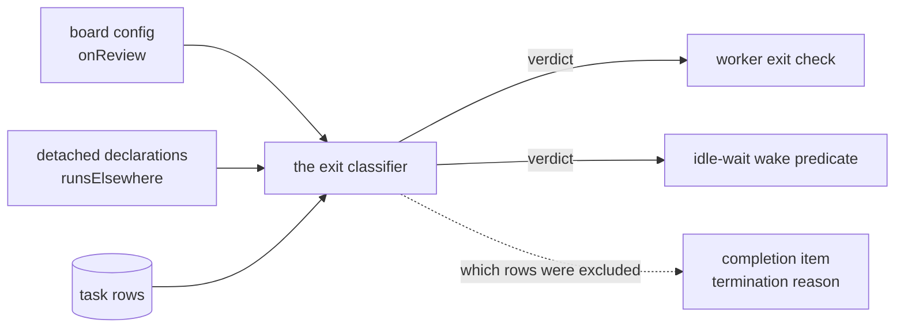

# FIX-1234: Task board — an exit/park mode so `awaiting_review` doesn't hold the launching request open — Implementation Spec

## Part I — The Case *(for the human)*

### 1. Problem — why it matters, why now

When a task board parks a task for a human to look at, the request that launched the
board stays open for as long as the human takes. Nothing about the board is broken —
the task parks correctly and resumes correctly — but the caller who started the drain
is still holding the line, along with everything that request is keeping alive.

Nobody waits that long on purpose, so what actually happens is worse than a wait: the
drain eventually gives up on an internal safety cap and returns, and the parked task is
simply abandoned where it sits. On the shipped defaults that cap works out to more than
half a day of held-open request, ending in a silent non-answer. Nothing reports it.

**Why now.** Relay's headline scenario is a background workstream that raises a
question and lets its request *end*, so the answer can arrive later as a fresh request.
That scenario is unreachable while parking pins the request open, which is why this
issue rides in the Relay epic even though it needs nothing from Relay's messaging core.

There is a second reason, and it is a defect we already shipped. A board can declare a
worker `dispatch: { mode: "detached" }`, which releases the launching request the moment
the work is handed to a background workstream. If that workstream then parks its task for
review, the row leaves `in_progress` — and the release stops applying. **A request that
was correctly let go gets recaptured by the very act of asking a human a question.**

### 2. Solution in plain terms

Give the board an opt-in mode saying "a task parked for review is not mine to wait on."
A board in that mode finishes its drain and returns as soon as the only work left is
parked, and it reports that as its own outcome rather than as success or as failure. The
parked task is untouched — it stays parked, durably, and a later resume re-queues it for
whatever drains the board next.

Nothing changes for any board that doesn't ask for it. The mode is off by default, and a
board that leaves it off behaves exactly as it does today, including a detached one.

**Epic alignment.** This is issue 5 of the Relay epic (FIX-1197, epic PR
[#1357](https://github.com/fixpoint-labs/flow-state-dev/pull/1357)). The epic constrains
it to the exit predicate rather than a new status, and names the board-drain-waiting-on-a-
human case as a third waiting kind — genuinely unbounded, which is why it needs an exit
path and not a timeout. This spec satisfies that constraint and makes the local calls the
epic deliberately left open.

**Philosophy** — tenet 3 (earn every addition): this is one defaulted option on a config
surface that already exists, not a new status, a new lifecycle, or a second way to park.
Tenet 5 (fix at the owning layer): the board's exit question already has exactly one
definition that both readers of it share, so the change lands there and both readers get
it by construction. Tenet 2 (composition over features): the *wake* — something noticing
the resume and starting a new drain — is deliberately not built here; a durable board
plus an ordinary later request already composes into it.

### 6. Decisions & rules — the sign-off surface

1. **The mode is opt-in and off by default, and a detached board has to ask for it too.**
   *Rejected:* treating a parked row on a detached board as automatically released, on the
   argument that the board already said that work runs elsewhere. That would be free, and
   it is the case we most want fixed — but it silently changes *when* an existing caller's
   request resolves, for every detached board already running.
   *Locks in:* the recapture bug above stays live for anyone who doesn't opt in, and we
   can't flip the default later without moving that resolution point for callers who
   never asked. Reversible only by accepting that change once, deliberately.

2. **A board that exits because its remaining work is parked says so, with an outcome of
   its own.** The board's completion item gains a reason of its own, alongside the ones it
   already reports for finished, failed, retry-budget-stopped, and handed-off.
   *Rejected:* reusing "everything finished" (a consumer stops watching while a human is
   still owed an answer) or "something failed" (reports a success as a failure — the exact
   defect that earned hand-off its own reason last time).
   *Locks in:* a public string that consumers branch on, and one more value every consumer
   switching on it must handle. Adding it later would be the same cost; getting it wrong
   means a monitoring surface that says "failed" every time a human is asked a question.

3. **The mode requires a durable board and the default termination rule; anything else is
   refused at construction.** Refused on a board whose tasks don't outlive the request, and
   on either non-default `onIdle` mode — `"wait"`, where the option would never be
   consulted, and `"complete"`, where it would work only until someone gave the parked task
   a dependent.
   *Rejected:* letting the parked row die with the request it was released from; and, for
   `"complete"`, excusing the parked row's *dependents* as well — a transitive dependency
   walk on the hottest read the board has (it runs on every wake), which is a larger and
   riskier mechanism than the whole rest of this issue. Documenting the limitation instead
   was also rejected: a documented trap is still a trap, and this spec has already chosen
   loud refusals over silent no-ops twice.
   *Locks in:* park-exit is a feature of durable boards on the default termination rule. A
   caller on request-scoped storage has to move it, and a caller who set `onIdle:
   "complete"` has to come back to the default or stay on hold. Both are told at
   construction, by name, rather than discovering it in production.

**Non-goals.**

- **The wake.** A resume re-queues the task; it does not start anything. Whatever drains
  the board next picks it up — a later user turn, a schedule, or (once Relay ships) an
  addressed message. This issue delivers the exit, not the return trip, and says so out
  loud in the docs because a user who resumes and sees nothing happen will otherwise file
  a bug.
- **`awaitReview` / `resumeFromReview` and the task status machine.** Unchanged. No new
  status: a new one would not fix the exit question and would duplicate a lifecycle that
  already works.
- **`taskLoopBack`**, the helper for hand-rolled task loops outside the board, keeps
  counting parked tasks as in-flight. It is a different loop, owned by its caller, and it
  already takes an `until` override.
- **FIX-1200**, the detached-worker-parks-then-suspends strand, is a different defect in
  the same area and is not touched here.

**Size:** Medium — 6 production files · 12 test behaviours · 4 doc surfaces · 1 PR.

---

### 3. Tradeoffs & alternatives

**Alternative: route parked rows through the existing detached exclusion.** The board
already knows how to drop rows from its exit question — that is how detached dispatch
releases the request — so the cheap move is to widen that exclusion to cover parked rows.
Rejected, and the reason is that the existing exclusion answers a different question. It
asks *where does this row's work belong*, derived from which workers the board declared
detached, and it is deliberately paired with a liveness check so an abandoned row comes
back. A parked row belongs to a **human**, on any board, however it was dispatched — and
no liveness check applies to it, because the task lease deliberately stops governing a
row once it parks (verified: see §12). Folding the two together would fix only boards
that happen to declare a detached worker, and would put a routing answer and a
human-waiting answer behind one name.

**The simpler approach: do it in user space.** A board can already override its own
termination (`onIdle: "wait"` with a `shouldExit` predicate), and for the narrowest board
a few lines get you "stop when the only rows left are parked". Genuinely tempting, and it
is worth being precise about why it loses:

- **Overriding termination replaces all of it.** The default mode also detects a board
  that can no longer make progress, and a detached board excuses rows a background
  workstream is running. Neither is available to a `shouldExit` predicate, which sees only
  the task rows. Rebuilding them means reaching past the package's exports map: the
  classifier and its counting helpers are on **none** of the three public subpaths, so a
  caller gets the claimability primitives and the routing predicate from the supported
  surface and then copies the rest out of internals that carry no compatibility promise.
  That is the workaround-every-caller-copies smell tenet 5 names, made worse by being
  copied from unstable seams — and these are the exact predicates that already drifted once
  when the board itself had two spellings of them.
- **No amount of user code fixes the report.** The board's completion item would call the
  exit a failure; the code already documents that misreport for early `shouldExit` returns.
  A monitoring surface that says "failed" every time a human is asked a question is not
  something the caller can correct from outside.

**Where the complexity is:** not the exclusion, which is a few lines. It is what the board
*reports* when the remaining rows are a mixture — some parked, some handed off, some
genuinely failed — and the fact that a parked row usually has downstream tasks waiting on
it, so the naive answer is "blocked by failures" on a board where nothing failed. §9 is
mostly about that.

### 4. Focus practices (1–5)

1. **One definition of the exit question** (tenet 5). Two blocks read it — the check that
   ends the worker loop and the predicate that decides whether a sleeping worker wakes —
   and they answer out of one shared classifier precisely because they drifted once
   before. The new exclusion is passed to that classifier, never re-derived at either
   call site.
2. **BP-030 (tolerate the old shape).** Every board that doesn't set the new option must
   behave bit for bit as today. The existing regression test that asserts a drain is
   *still running* while a task is parked is the guard for that, and it must keep passing
   untouched.
3. **BP-035 (second-path checklist).** The new path is "a worker is asleep when the board
   becomes exit-eligible". A test that only covers a board which was already awake proves
   nothing — the wake predicate and the exit check have to agree, or the worker sits until
   its timeout.
4. **Tenet 3 — subtract as you go.** Several code comments and two documentation pages
   state, as settled behaviour, that a parked task keeps the drain alive; one says closing
   that is "a separate question". This change is that question's answer, so every one of
   those statements is rewritten in the same change set rather than left standing beside
   it. Sweep by the decision, not by a phrase, and verify the old answer is *gone* — not
   merely that new text arrived somewhere.

### 5. What using it looks like (1–5 examples)

**Declaring it** *(what this spec proposes; the option does not exist today)*:

```ts
const board = taskBoard({
  name: "reviews",
  collection: reviewLedger,      // durable — required for this mode
  workers,
  onReview: "exit",              // provisional name — see §12
});
```

**What the caller observes, before and after:**

```
before  worker parks task A for review
        → drain stays open ~14h, then returns; A abandoned, nothing reported

after   worker parks task A for review
        → drain returns now, task-board-meta reports the parked outcome,
          A stays parked and durable
```

**Picking it back up.** No new API — a resume re-queues the task, and the next drain over
the same durable board claims it:

```ts
await tasks.resumeFromReview("A", "approved, carry on");
// later, in a new request:
await board.drain(...)   // claims A and runs it to completion
```

> **Relay integration requirement — durable storage alone is not enough.** A board that
> hands work to a background workstream already releases its launching request. The moment
> that workstream parks its task for review, the release stops applying and the request is
> recaptured (§1), and **turning on durable storage does not fix that.** Park-exit is a
> **second, separate switch.** Relay's headline scenario — a workstream asks a question and
> its request ends — needs both:
>
> ```ts
> const board = taskBoard({
>   name: "asks",
>   collection: durableLedger,                          // 1. durable storage — necessary
>   workers: { ask: { worker, dispatch: { mode: "detached" } } },
>   onReview: "exit",                                   // 2. park-exit — also necessary
> });
> ```
>
> Anyone building a Relay issue on a board that can park should read this as a checklist of
> two, not one. Wiring durable storage and stopping there leaves the recapture live **and
> looks like it worked**, because every other part of the board behaves correctly. This is
> the direct consequence of §6 decision 1 (the mode is opt-in, so a detached board has to
> ask for it too).
>
> The board must also be on the default termination rule — but that one cannot bite you
> silently, because a board that overrides it is refused at construction (§6 decision 3).

---

## Part II — The Build Plan *(for the implementing agent)*

> **What binds you, and what doesn't.** **§6 is the only copy of the contract** — every
> section below cites a decision rather than restating it, so a decision that moves in
> review moves in one place. **§9's ladder and table are normative** for what the board
> reports; they are the one piece of Part II that is a rule rather than a direction. Everything else here —
> §7's diagram and sketch, §8's ordering, §10's seams — is *directional*: it fixes the
> shape and the sequence, not the finished design. Where the code contradicts it, that is
> evidence the spec missed something; surface it rather than force-following it.

### 7. Technical design

Everything happens at the board's exit question. The board already funnels that question
through one classifier, which two blocks consume; this adds a second exclusion beside the
one detached dispatch already installs, and one new value on the outcome the board
reports when it stops.



- **`@flow-state-dev/orchestration`, task-board only.** The waitable-row count gains a
  second exclusion; the classifier and both of its readers thread the new option exactly
  the way they thread the detached one. The completion item gains one reason value. The
  board's construction-time checks gain two refusals.
- **The task substrate is untouched.** No new status, no new transition, no change to
  `awaitReview` / `resumeFromReview`, no new persisted field on a task row. The mode is
  board configuration, so nothing about it has to survive a restart independently of the
  board declaration that produced it.
- **No liveness conjunct on the new exclusion, deliberately.** The detached exclusion is
  paired with a lease check because a routed row can be abandoned by a claimant that died.
  A parked row cannot be in that state — parking moves it off `in_progress`, and the lease
  stops governing it there by design, so that a slow human cannot have the task reclaimed
  out from under them. A lease conjunct here would either exclude nothing or reintroduce
  exactly the reclaim the substrate deliberately prevents. This is settled, not assumed —
  §12.

**The exit reason is carried, not re-derived.** The completion item runs *after* the
worker pool finishes, and it reads the collection fresh. A resume that lands in that
window turns the parked row back into a `pending` one, so a reason inferred from the rows
at that moment cannot see why the drain stopped — and reports a board that exited
successfully for review as a failure. So the causal verdict is recorded **where it is
decided**, in the exit check, onto state scoped to *this drain invocation*, and the
completion item reads that. **This spec names no carrier symbol, deliberately** — the
scope is the requirement, and every concrete carrier proposed so far has turned out to be
one scope too wide (see the evolution note). Pick the seam against real code and let the
concurrency test in §8 step 3 be what pins it.

**Not the board's shared flow-state bag** — the one the install/teardown pair brackets the
pool with. That object is allocated once per board *definition*, at construction, so every
drain of that board mutates and tears down the same instance. It is construction-scoped,
not run-scoped: its own comment claims freshness only for a board re-entered
*sequentially* within one request, and says nothing about concurrent drains. Two requests
draining one board definition at once share the bag, and either teardown clears the
other's verdict mid-run — shipping a completion item that reports a *different* drain's
termination reason. Reachable on shipped defaults, not a corner: the default concurrency
policy normalises to a passthrough gate holding no key, so two sessions running the same
action both drain. Two drains can also collide *inside a single request* — a sequencer
step that runs blocks concurrently over the same input will do it — which is why the
requirement is invocation-scope and not merely per-request scope.

The `counts` stay a final snapshot: they are descriptive, and a caller reading them wants
the board's actual last state.

> **The pattern, because this is its third appearance in this epic:** *re-deriving a fact
> from state that has since moved, instead of carrying it from where it was decided.* The
> other two were the correlation ID (a `requestId` identifies the asker, not the ask) and
> watch's edge-versus-level baseline. An implementer who has seen it named will recognise
> the fourth.

**Sketch — pseudocode. Illustrative, not the contract. React to the shape.**

```
in the waitable-row count, which already skips rows that run elsewhere:

    for each row in the requested statuses:
        if the row is handed off to a workstream:        ← today
            skip it
        if park-exit is on and the row is parked:        ← the whole feature
            skip it
        otherwise it counts

both readers of the exit question receive the mode the same way they
receive the detached predicate — one options object, no second opinion

at the exit decision:
    record "rows were excused as parked"     ← carried, not re-derived later

at the completion item:
    walk §9's ladder in order, reading that carried verdict
    (the ladder is the contract; this line is not a second copy of it)
```

What this asks a reviewer: *is a second exclusion beside the routing one the right shape,
or should the two be one predicate?* §3 argues they must stay separate; that is the
question worth disagreeing with.

### 8. Implementation sequence

1. **Add the board option and refuse the unsupported combinations** (decision 3).
   `onReview: "hold" | "exit"`, defaulting to `"hold"`. Refuse `"exit"` on a non-durable
   backing, and on either non-default `onIdle` mode. Every refusal is loud, names the board
   and the fix, and follows the existing detached-board refusals in shape and register.
   *Test:* each refusal by name; a durable board on the default mode accepted.
   *Depends on:* nothing.
2. **Exclude parked rows from the waitable count** when the mode is on, as a predicate of
   its own beside the hand-off one — not by widening it. Thread the mode through the
   classifier's options to both readers from the board that built them, the same way the
   detached predicate is threaded, so neither reader holds an opinion of its own.
   *Test:* the exit check and the wake predicate agree; a board with the mode off is
   unchanged. *Depends on:* 1.
3. **Carry the verdict out of the exit decision.** Record, where the drain decides to
   stop, that rows were excused as parked — on state scoped to this drain *invocation*.
   Not the board's construction-scoped flow-state bag, and not per-*request* state either:
   both are shared by two concurrent drains of one board, one scope apart (§7). Nothing
   reads it yet.
   *Test:* the verdict survives a resume landing between the pool finishing and the
   completion item; **and** two concurrent drains of one board each report their own
   termination reason — exercised **same-request**, two drains run concurrently within one
   request, which is the case that pins invocation-scope rather than request-scope.
   *Depends on:* 2.
4. **Report the outcome** — the new termination reason on the completion item, read from
   the carried verdict and ordered by §9's ladder, which is normative. *Test:* the §9
   table, the ladder's order included. *Depends on:* 3.
5. **Remove the statements this supersedes** (tenet 3). Known sites: the "a parked row
   holds the drain open … closing that is a separate question" passage on the waitable
   count, the wake predicate's "stays asleep while … parked", the exit block's
   "`awaiting_review` keeps the loop alive in both modes above", and the board's own module
   and `onIdle` config docs. Treat that list as a starting point, not the sweep — search
   for the *decision*, rewrite every restatement to describe both modes, then verify no
   copy of the old answer survives. *Depends on:* 4.

*(Each step cites the decision it implements rather than restating it.)*

No PR plan: this is Medium and ships as one PR.

### 9. Edge cases & error handling

**The reporting ladder is normative.** First match wins, and the order is the contract —
getting it wrong silently regresses behaviour that is deliberate today:

1. a persisted retry-denial marker exists → **retry-budget-exhausted**. Unchanged, and it
   stays first: an operator needs to know the *budget* stopped the board, and a denied
   retry settles its task terminal `errored`, so any later rule keyed on failure would
   swallow it.
2. nothing un-`completed` remains → **all-completed**. Unchanged.
3. any remaining row is `errored` or `cancelled` → **blocked-by-failures**. Unchanged:
   something did fail, and the failure is the more actionable fact.
4. the exit decision excused rows as parked → **parked-for-review**. New. Read from the
   carried verdict (§7), never from the rows as they stand at this moment.
5. every remaining row is handed off → **handed-off**. Unchanged.
6. otherwise → **blocked-by-failures**. Unchanged.

With no parked row anywhere, steps 4 is inert and the ladder is exactly today's
classifier. That equivalence is the property to test, not just to assert.

| Case | Expected |
|---|---|
| Parked row + a still-claimable pending row | Board keeps running. Only the parked row is excused; ordinary work still holds the drain |
| Parked row + a pending row whose dep is the parked one | Board exits `blocked`, reason **parked-for-review** (ladder 4). The dependent cannot run and nothing failed. **Reachable only on the default `onIdle`** — this is the case that makes `"complete"` unsupported (decision 3), because there the pending dependent keeps the drain open regardless |
| Parked row + an errored or cancelled row | **blocked-by-failures** (ladder 3), even though a row is parked |
| Parked row + a denied retry | **retry-budget-exhausted** (ladder 1). The parked row does not demote it |
| Parked row + a handed-off row, nothing failed | **parked-for-review** (ladder 4). Both are released, and the one a human owes an answer to is what the operator needs to see |
| Resume lands between the worker pool finishing and the completion item | Still **parked-for-review**. The reason comes from the carried verdict, so a row that has since gone back to `pending` cannot erase it. Inferring from live rows here reports a successful review exit as a failure |
| Resume lands after the drain already decided to exit | The row re-queues and waits for the next drain. Not an error — this is the contract, not a race |
| Resume lands while the drain is still tearing down | Same. The row is `pending` and durable; whichever drain claims it next runs it |
| Mode set with `onIdle: "wait"` | Refused at construction. That mode never consults the counts, so the option would be a total no-op |
| Mode set with `onIdle: "complete"` | Refused at construction. The option would work on a parked leaf and stop working the moment that task gained a dependent — a no-op conditional on the dep graph, which is worse than a total one because it survives testing |
| Mode set on a board whose tasks die with the request | Refused at construction, naming durable storage as the fix |
| Mode off (the default), any of the above | Byte for byte today's behaviour, detached boards included |

**Taxonomy:** every new failure is construction-time and fatal — a misconfigured board
refuses to build rather than degrading. Nothing on the runtime path can fail: the change
is a read-only predicate over rows the board already lists, plus one recorded verdict.

**Second path (BP-035):** the reachable new path is a worker asleep in the idle wait when
the board becomes exit-eligible. The wake predicate and the exit check must agree, or the
worker sleeps to its timeout and the exit is late rather than absent — which is the shape
of defect a passing test would miss.

### 10. Testing strategy

**Goal check:** none applies — no model, no generator, no network on this path. The
honest equivalent, and what the settlement POC used, is a **real-path drain test**: a real
board over a real durable collection, parked and resumed by a sibling actor, asserting on
what the launching request observes. The existing `durable-board-freshness.test.ts` is
that harness and is the seam to build on.

**CI specs** (the behaviours, not the test names):

- **One behaviour per §6 decision**, in observable terms — the drain returns while the row
  is still parked; the completion item carries the new reason; each refusal fires by name.
- **The discriminating assertion, and it must be written as a flip.** The existing test
  records whether the drain had finished *before* the resume and asserts `false`. The new
  test asserts `true` on the same recording with the mode on. Assert it that way round —
  a test that only checks "the drain returned" passes against a drain that returned for
  any other reason, including the iteration budget this change exists to stop relying on.
- **What must not change:** the existing freshness test keeps passing unedited, and a
  detached board with the mode off still holds its request open when its worker parks.
- **The second path:** exit-eligibility reached while the worker is asleep, measured the
  way the existing test measures it — claim attempts far below the iteration budget — so a
  spinning worker and a sleeping one give different readings.
- **§9's ladder, in order** — including the two orderings that are easy to get backwards:
  a denied retry still reports the budget stopped the board even with a row parked, and a
  parked row does not demote an errored one.
- **The equivalence that guards the ladder:** with no parked row anywhere, the reason is
  identical to today's for every case the existing suite covers. That is what keeps the
  reordering from being a silent regression.
- **The carried verdict against its race:** a resume landing between the worker pool
  finishing and the completion item still reports the review exit, not a failure. Written
  as a flip, like the one above — inferring from live rows passes the naive version of this
  test and fails this one.
- **The carried verdict against cross-drain bleed:** two concurrent drains of the *same
  board*, one exiting for review and one not, each report their own reason. Run them
  **within one request**, concurrently — that is what discriminates invocation-scoped state
  from request-scoped state, which a cross-request version of this test would let pass. A
  verdict parked on any shared bag passes every single-drain test above and fails this
  one.
- **Each construction refusal by name**, including the two `onIdle` modes.

**Discipline:** `tdd`. The seam is the board's exit classifier and its two readers in
`@flow-state-dev/orchestration` — reachable from a vitest spec with no host involved, so
every behaviour above is a tracer bullet.

### 11. Documentation plan

- **EXTEND** `apps/docs/docs/orchestration/task-board.md` — a new subsection under
  "Termination", after the three `onIdle` modes, covering what the mode does, that it
  requires a durable board **and the default `onIdle`**, and — prominently — that a resume
  re-queues the task but does not start a drain. Add the new reason to the `terminationReason` list and to the example
  completion item. Correct the two existing statements that a parked task keeps the loop
  alive so they describe both modes.
  *Voice risk:* this is a wait/latency feature, so "seamless" and "instantly" will both
  suggest themselves. Neither. Say what the caller observes.
- **EXTEND** `apps/docs/docs/orchestration/configuration.md` — one row in the field table,
  matching the register of the `onIdle` and `boardId` rows.
- **EXTEND** `packages/orchestration/README.md` — one line where the board's termination
  modes are listed.
- **No new page.** This is one option on an existing concept, not a term a user searches
  for on its own.
- **EXTEND** `apps/docs/docs/server/background-work.md` — one short callout carrying §5's
  two-switch requirement: a detached board that parks still recaptures its launching
  request unless park-exit is on, so durable storage alone is not sufficient. This page is
  where someone wiring detached dispatch actually lands, which is why the requirement gets
  a home here rather than only on the task-board page. Cross-link → the new task-board
  subsection.
- **No new page.** This is one option on an existing concept, not a term a user searches
  for on its own.
- **No architecture-doc change.** `docs/architecture/*` describes the task status machine,
  which this does not touch.

### 12. Dependencies, open questions & follow-ups

**Dependencies:** none. This issue does not depend on Relay's send verb or on any other
issue in the epic; it is unblocked and orthogonal to the messaging core.

**Open questions:** none blocking. One name is provisional — see below.

**Provisional naming (deferred by the owner, not asked here).** `onReview: "hold" |
"exit"` and the reason string `parked-for-review` are proposals. The epic's §6 records the
owner's deferral of naming across Relay, this exit mode included, until there is code in
front of them. Both names are public surface, so they are worth a second look at
implementation review — but they are not a gate on approving this direction, and this spec
does not settle them.

**Settled claims** — established by an executed POC on the real `taskBoard` path, not by
argument. Do not reopen:

- **Settled:** the existing `awaitReview` / `resumeFromReview` pair already covers this
  gap — **REFUTED.** Two scenarios ran. Park-and-never-resume: the drain returns only when
  its iteration budget silently exhausts, and the task is abandoned at `awaiting_review`.
  Park-checkpoint-resume: the drain had *not* settled before the checkpoint, and moving
  the resume ahead of the checkpoint flips that assertion — so the check discriminates
  real timing rather than restating a fixed result. Mechanism: `awaiting_review` is the one
  non-terminal status excluded from every board-exit path, in both `onIdle` modes and on
  detached boards. Corroborated by the committed, passing
  `packages/orchestration/test/task-board/durable-board-freshness.test.ts`.
- **Settled:** the counter-claim's resume half is **CORRECT** — `resumeFromReview` does
  persist feedback and hand it to the re-claimed worker. Only "and so the request ends"
  was false. Nothing in this spec changes that half.
- **Settled:** a parked row's lease is neither renewed nor reclaimed — the lease check
  short-circuits for any status other than `in_progress`, **by design**, so a slow human
  cannot have the task reclaimed out from under them. This is why §7's exclusion carries
  no liveness conjunct.

**Follow-ups (flagged, not built):**

- **Per-task park-exit.** The mode is board-level, so a board cannot mix "this ask releases
  the request" with "this one holds it". A per-park flag would express that, at the cost of
  a persisted task field and its dual-read. Nothing needs it yet; revisit if a consumer
  does.
- **`handed-off` is re-derived from live rows the same way `parked-for-review` was going
  to be** — a detached child that settles between the pool finishing and the completion
  item can move the answer. §7's carried verdict is the seam a fix would use, but changing
  a shipped reason's behaviour is not this issue's to do. Flagged, not built.
- **The recapture defect stays live for detached boards that don't opt in** (decision 1).
  If we later decide that release should survive a park unconditionally, that is a
  deliberate default change with its own gate — not something to slip in.

### 13. Review notes for the implementer

Below-the-bar spec-PR feedback, recorded verbatim and **not** folded into the design.
Inputs, not instructions — adopt, adapt, or discard against real code; §6's Decisions bind
you, these don't.

- "Two-value enum with one being the default is a config surface that will almost never
  grow a third value (per-task park-exit is explicitly deferred). A boolean defaulting to
  `false` — e.g. `exitOnPark` or `releaseWhenParked` — would be simpler for callers and for
  the type system. The `onIdle` parallel is nice symmetry, but `onIdle` has three genuinely
  different modes; this is really one bit. *Suggestion, not a demand* — if the owner
  prefers the enum for readability at call sites, that's defensible." — cursor
  ([thread](https://github.com/fixpoint-labs/flow-state-dev/pull/1419#pullrequestreview-5003035137)).
  **Not settled here, deliberately:** the option's name sits inside the epic's deferred
  Relay naming question (§12), which the owner is holding until there is code in front of
  them. Carry this to that question as a live option rather than picking a side now.
- "At implementation time, mirror the existing `handed-off` pattern in `board-meta.ts`
  rather than inventing a parallel code path — ideally a single 'all remaining rows are
  released from this drain' helper with two release kinds (routed vs parked). *If* that
  generalization stays readable, it avoids a third copy of mixed-remainder logic later." —
  cursor
  ([thread](https://github.com/fixpoint-labs/flow-state-dev/pull/1419#pullrequestreview-5003035137)).
  The conditional is the reviewer's own and worth keeping: §9 stays normative either way,
  and the dep-blocked-row-behind-a-parked-row case is the one a generalized helper is
  easiest to get wrong on.
- **Sibling-worker exit latch (P1).** "The board starts `concurrency` independent worker
  loops (default 4), and the exit check stops only the loop that ran it. After worker A
  observes the parked-only state and exits, a resume can wake worker B, which claims the
  task in the same drain and keeps the launching request open. Two acceptable remedies: a
  drain-wide exit latch consulted before any further claim (with a regression test at
  `concurrency > 1`), or narrowing the stated contract to match what one loop can
  guarantee." — codex. Real, but narrow and implementer-choosable — pick with the code in
  front of you. Note that §10's resume-window test is the *post*-pool case; this is the
  *pre*-pool sibling case, and that test does not cover it.
- **README sweep is wider than §8 step 5 lists (P2).** "`packages/patterns/README.md`
  publishes the four-value `terminationReason` union verbatim, so it needs the new value
  too — not just the orchestration README." — codex. Mechanical. Step 5 already says to
  treat its list as a starting point rather than the sweep, and this site is now a known
  member of that starting list.
- **Concurrent drains collapse to one completion item (keyed-emission overwrite).**
  "`boardMetaCompleted` emits with `{ key: collectionId }` (`blocks/board-meta.ts:181`),
  keyed by collection alone. A keyed emission derives a deterministic id
  (`item_component_keyed:${key}`), `itemsById` collapses to one entry per
  `(requestId, key)`, and `data` is replaced wholesale, never merged
  (`createExecutionContext.ts:239-248`). So two concurrent drains of one board in one
  request emit two completion items under the same key and the second overwrites the
  first: drain A decides parked-for-review, drain B resumes and emits handed-off, A emits
  last, and the visible snapshot says parked-for-review with nothing parked." — codex.
  Both facts are true; the file:line references are here so you don't re-derive them.

  **Disposition: pre-existing, out of scope for this issue, tracked at
  [FIX-1236](https://linear.app/fixpoint-labs/issue/FIX-1236)** — "Task board: three
  defects sharing one root — state whose scope is wider than its readers assume", which
  carries this keyed emission, the construction-scoped flow-state bag, and the
  `handed-off` re-derivation together, because all three are the same mistake and patching
  them singly leaves the assumption standing. The overwrite is shipped behaviour that
  predates this issue: two concurrent drains already collapse to one completion item
  today, with today's four reasons, and last-writer-wins already reports the wrong one.
  This issue adds a member to that defect class; it does not create it. The suggested
  remedy — an ordering or version fence, and asserting the *final keyed snapshot* — would
  change completion reporting for **every** board, not only boards using the new mode,
  which is the widening §6 refuses.

  **This does not weaken §8 step 3's test, and don't let anyone read it as too weak.**
  That test asserts each *invocation* computes its own reason, which is the property this
  issue owns. Asserting the final keyed snapshot instead would be testing FIX-1236's
  defect, and would fail for reasons this spec is not responsible for.

---

## Spec evolution *(the change story, not an audit log)*

- **Spec drafted** — framed as the board's exit question rather than as a review-lifecycle
  gap; chose a second exclusion beside the detached-routing one over widening that one,
  because routing and human-waiting are different questions with different liveness rules;
  scoped to one opt-in board option, one reported outcome, the construction refusals, and
  the removal of every code comment and doc statement that asserts the superseded
  behaviour.
- **After spec review** — narrowed the mode to boards on the default `onIdle`, because
  under `"complete"` a parked row's *dependent* still holds the drain open, so the option
  would have worked on a leaf task and quietly stopped working when that task gained a
  dependent. The alternative — excusing the dependents too — needs a transitive dependency
  walk on the board's hottest read, which is a bigger mechanism than the feature.
- **After spec review** — made the exit reason a verdict carried from the exit decision
  rather than one inferred from the rows at completion time, because a resume landing in
  that window would have reported a successful review exit as a failure.
- **At the approval gate** — corrected the *scope* the verdict's carrier must have, in two
  passes that narrowed the same way. First: the spec called the board's flow-state bag
  "run-scoped", but it is construction-scoped — allocated once per board definition and
  shared by every drain of it — so one drain's teardown would clear another's verdict
  mid-run. Second: the replacement named a per-*request* carrier, which is still one scope
  too wide, because two drains of one board can run concurrently inside a single request
  and share it the same way. **The spec now names no carrier symbol at all** — it states
  the requirement (invocation scope) and leaves the seam to the implementer, since a named
  example can always be shown too wide while a stated property cannot. Step 3's
  concurrency test is what pins it, and it is specified same-request for exactly that
  reason. The principle in §7 — carry the verdict from where it is decided — never moved,
  nor did §9's ladder or either decision at the gate.
