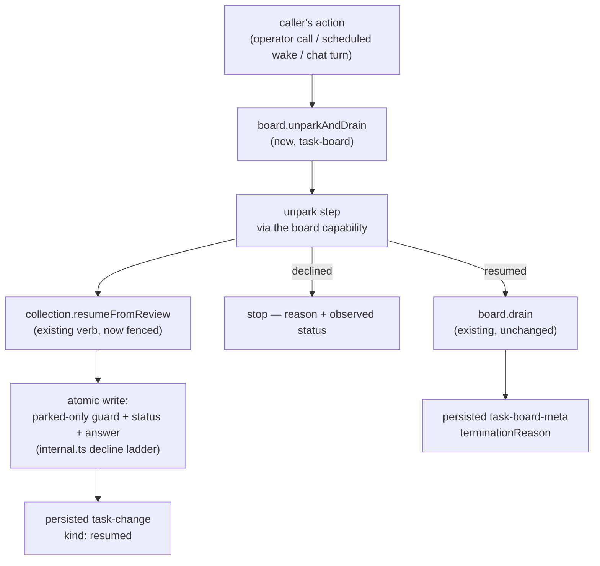

# FIX-1244: Task board: unblock a parked task with an input, starting a new request — Implementation Spec

## Part I — The Case *(for the human)*

### 1. Problem — why it matters, why now

A worker can stop and ask a person a question. The board holds the task in a
"waiting on a human" state and — since park-exit shipped last week — the run that
asked is allowed to end rather than sit there for a day. That half works.

The other half does not exist. When the person answers, there is no supported way
to hand that answer back and get the work moving again. What a caller has today is
two separate calls that both look like they worked and together often don't:

- **The re-queue call will happily fire at the wrong task.** It does not check that
  the task is actually waiting on anybody. Point it at a task a worker is running
  right now and it yanks that task out from under the worker, reports success, and
  the worker's result is later refused as stale. Point it at a task somebody already
  answered and it silently overwrites the first answer with the second. *(Both
  measured on `main` — see §7.)*
- **Nothing then runs the work.** Re-queuing puts the task back in the queue and
  stops. Something else has to come along and drain the board. If nothing does, the
  person's answer sits there forever and no surface anywhere says so.

**Why now.** Park-exit landed on 2026-08-25, so a board can now honestly say "I
stopped because a person owes me an answer." Until the answer can be delivered, that
honesty is a dead letter: the board tells the truth and then nothing can act on it.

**The workaround exists and it is the argument for building this.** The first
consumer already wrote it in its own code — an `answer` verb that reads the task,
decides whether the answer is allowed, re-queues, and then runs the drain itself. Its
own notes say the guard "will not refuse for us" and has to live in userland, that
the read-then-write is open to a race it cannot close, and that its crash-recovery
rule **has been extended four times** because the three separate calls leave a
half-finished trail behind when anything interrupts them. Every one of those is a
consequence of doing in three steps what should be one.

### 2. Solution in plain terms

Make delivering the answer **one call that either did it or said it didn't.**

Two changes, both small:

1. **The re-queue call learns to refuse.** It only works on a task that is genuinely
   waiting on a person. Anything else — a task a worker is running, one somebody
   already answered, one that was cancelled — comes back as a refusal that names the
   state it found, instead of a silent write. The answer itself is written in the
   same indivisible step as the state change, so there is no half-finished trail for
   a crash to leave behind and no window for a second answer to slip through.
2. **The board can hand the answer straight into a run.** A caller drops one board
   step into whatever action the answer arrives on, and it re-queues the task and
   then runs the board's drain in that same request. If the refusal fires, the drain
   does not run and the caller is told why.

**On the ticket's wording.** The ticket says the verb "starts a new request." It
doesn't, and it can't — the framework has no way for running work to launch a fresh
action, and that door was closed on purpose. What actually happens is that the
answer *arrives* on a request (an operator's call, a scheduled wake, a chat turn),
and that request is the new one. What was missing was a way to hand the task into it
that can't quietly do nothing. See decision 2.

**Philosophy** — tenet 2 (composition over features): this sharpens the verb the
substrate already has rather than adding a second one beside it, and reuses the
board's existing drain rather than building a second way to run a task. Tenet 5 (one
convergence point): the refusal is evaluated inside the same atomic write as the
state change, so no caller can be looking at a stale answer when it decides. Tenet 3
(earn every addition): one new board step and zero new task fields.

### 6. Decisions & rules — the sign-off surface

1. **The existing re-queue verb gains the refusal, rather than a second verb being
   added beside it.** Today it accepts any task; after this it accepts only a task
   that is waiting on a person, and reports a refusal for anything else.
   *Rejected:* leaving it as-is and adding a new, stricter verb next to it — nobody
   would be told the old one is the dangerous one, and the trap stays shipped
   forever.
   *Locks in:* this is a **breaking change to behaviour that already ships.** Anyone
   calling that verb on a task that isn't parked gets a refusal where they used to
   get a silent write. We believe that call is always a mistake (a different verb
   owns the "take this back from a dead worker" case), but we cannot see outside
   this repo to prove it. If we're wrong, someone's board stops re-queuing on
   upgrade — visibly, as a refusal they can read, not silently. Pre-1.0, so it is a
   minor version and a changeset note, not a migration.

2. **The answer is handed into the request it arrived on; the framework does not
   start a request of its own.**
   *Rejected:* giving the substrate a way to launch a fresh run — that means opening
   a runtime seam that was deliberately sealed, and it is a much larger decision than
   this ticket.
   *Locks in:* somebody has to be calling something when the answer lands — an
   operator action, a scheduled job, the next chat turn. If a product wants an answer
   left in a mailbox to start work with nobody present, that is a separate piece of
   work and this does not deliver it. What this does guarantee is that when a caller
   *is* there, the work actually starts, and when it can't, the caller is told.

3. **An answer can carry a sentence and a small bag of structured data; it never
   overwrites the task's original instructions.**
   *Rejected:* prose only (what ships today) — a coordinator handing back a decision
   an app has to branch on would have to smuggle it through free text; and rejected
   writing over the task's own input, which would destroy what the task was asked to
   do in the first place.
   *Locks in:* the structured half is merged, not replaced, so two answers on the
   same task combine rather than clobber. Anything a caller puts there is
   caller-supplied data and is never used to decide who may do what.

**Non-goals** — who calls the verb and what that looks like to an operator; the
Conductor-specific flow that consumes it; renaming the shipped `awaiting_review`
status to `parked` (that is FIX-1245 and lands separately — this spec is written
against the name that is live today); the message layer that carries the *question*
(FIX-1230); a second pause model (FIX-274, FIX-765).

**Size:** Medium — 7 production files · 12 test behaviours · 3 doc surfaces · 1 PR.

---

### 3. Tradeoffs & alternatives

**Alternative: a brand-new verb, leaving the old one untouched.** Additive, breaks
nobody, ships next week. Rejected because the old verb is the one every existing
caller and every doc example already reaches for, and it would keep its trap
indefinitely. Two verbs that both mean "resume" with one of them quietly dangerous is
the grab-bag shape the framework's own review gate exists to catch.

**The simpler approach: leave it in userland and document the recipe.** Genuinely
tempting — the first consumer already has a working version, so the code exists. It
is insufficient for one reason, and it is not ergonomics: the userland version
**cannot** make the check and the write indivisible. It reads the task, decides, then
writes, and the task can move in between. Its own module notes say so and name this
ticket as the only thing that closes it. The four extensions its recovery rule needed
are the same defect from the other side — three calls leave three places to crash.

**Where the complexity is:** not the refusal, which is a one-line reuse of machinery
another verb (`unblock`) already uses for exactly this shape. It is in what the
*second* answer to the same question should do. Once the first answer re-queues the
task, the second one finds a task that is no longer waiting and is refused — which is
correct, and is also indistinguishable from a retried delivery of the *first* answer.
This spec's position is that one atomic call makes retry-vs-duplicate a distinction
without a difference (both are "already answered, nothing further to do") and does not
try to tell them apart. §9 walks it.

### 4. Focus practices (1–5)

1. **Tenet 5 — one convergence point.** The refusal is evaluated inside the atomic
   write, next to every other guard, and never as a read followed by a write. A
   pre-check is the exact defect this replaces; reintroducing one at a higher layer
   would ship the bug with a nicer name.
2. **BP-030 (tolerate the old shape).** The verb's existing prose-only argument keeps
   working unchanged, and a hand-written collection that predates this needs no
   migration.
3. **BP-031 (never decide from caller-controllable input).** The answer's structured
   bag is caller data. Nothing routes, authorizes, claims or fences on it — same
   posture the task's existing metadata already takes.
4. **BP-035 (second-path checklist).** The second path here is the *refused* one, and
   it is the whole feature. A suite that only proves the happy answer proves nothing.
5. **Epic decision 5 — containment must not regress.** A refused or accepted answer
   must still leave every sibling task on the board running, proven at integration
   level, not per-backing.

### 5. What using it looks like (1–5 examples)

**A coordinator delivering a human's answer** *(what this spec proposes; today this
is two calls, and the first one does not check anything):*

```ts
const result = await ctx.cap.reviews.unpark("draft-42", {
  feedback: "approved, ship it",
  data: { decision: "approve" },
});

// { result: "resumed", taskId: "draft-42" }
//   the task is queued, carrying the answer, and is ready for a drain
// { result: "declined", reason: "disallowed", observedStatus: "in_progress" }
//   somebody is already running it — the answer was NOT written
```

**Handing the answer into the run it arrived on** — the board step a caller drops
into their action, so the drain is guaranteed to follow an accepted answer:

```ts
const reviews = taskBoard({ name: "reviews", onReview: "exit", /* … */ });

export const answerAction = sequencer({ name: "answer" })
  .step(reviews.unparkAndDrain);   // re-queue, then drain — or refuse and stop

// output: { unpark: { result: "resumed", … }, drained: true }
```

**What a refusal saves you from (before / after):**

```
before   resume a task a worker is running  → reported "recorded"; the worker's
                                              row is yanked and its result is
                                              later refused as stale
after    same call                          → declined, observedStatus
                                              "in_progress"; nothing written

before   resume the same task twice         → the second answer overwrites the
                                              first, with nothing reporting it
after    same calls                         → the first resumes; the second is
                                              declined, observedStatus "pending"
```

---

## Part II — The Build Plan *(for the implementing agent)*

### 7. Technical design

Three layers, and the load-bearing one is the lowest. Everything above it is
composition of pieces that already ship.



- **`@flow-state-dev/orchestration` → `tasks/collection`.** `resumeFromReview` is
  narrowed to the one edge it owns, using the mechanism `unblock` already uses for
  its own single edge (the `requireFrom` parameter threaded into the decline ladder),
  and forcing the advisory flag on the way `cancel` already forces it. The verb's
  payload argument widens from a prose string to prose-or-bag, with the string form
  preserved. Both backings; the shared decline ladder means one place decides.
- **`@flow-state-dev/orchestration` → `task-board/capability`.** The board's accessor
  gains `unpark`, which maps the substrate's write outcome onto a board-level result a
  caller branches on. Resource-backed boards only — park-exit already refuses every
  other backing at construction, so a parked row that outlives a request exists
  nowhere else.
- **`@flow-state-dev/orchestration` → `task-board`.** The handle gains
  `unparkAndDrain`: a sequencer of `.step(unpark)` then a conditional step into the
  board's own `drain`. It composes the existing drain; it does not re-implement any
  of it (BP-011 — the verb itself must not call a block).
- **Untouched:** the runtime request seam and its four verbs, the workstream dispatch
  contract, `core` entirely, every other collection verb, the drain's own pipeline,
  park-exit's exclusion and its termination ladder.

**Where the guarantee is observable (epic decision 4).** Two persisted surfaces, both
already shipping — nothing new is needed and nothing rests on a transient trace:

| What happened | Persisted carrier |
|---|---|
| the answer was written and the task queued | the `task-change` component item, `kind: "resumed"`, carrying the whole post-write row including the answer |
| the resumed work then ran (or didn't) | the drain's `task-board-meta` component item and its `terminationReason` |
| the answer was **refused** | the returned write outcome — deliberately item-less, exactly as every other decline has been since the epic's decision 1. A decline writes nothing, so it publishes nothing. |

**Is the shipped write outcome the right carrier?** For the write half, yes, and it
should not be duplicated: `declined` already carries a reason and the status observed
inside the write, which is precisely what a refused answer needs to say. It is
**not** sufficient for the board layer, because the board answers a second question
the write outcome has no variant for — *did anything then run?* So the board result
**wraps** the write outcome rather than replacing or re-inventing it: `resumed` /
`declined` at the verb, and `drained: true | false` from the composed step.

**POC on this branch — a characterization test, and the premise held.**
`spec-poc/FIX-1244-resume-fence/resume-fence.characterization.test.ts` pins today's
behaviour on `main` @ `1d818af22`. It passes, which means the defect is present as
described: the verb re-pends a live claimed row and reports `recorded`; passing the
advisory flag changes nothing because the edge it would check is legal; a second
answer overwrites the first's prose with nothing reporting it; and a parked row is
not claimable, so a resume genuinely has to route through the queue rather than
dispatching the row itself. Throwaway — it never merges. Run it from the repo root
per the header.

**Sketch — pseudocode. Illustrative, not the contract. React to the shape.**

```
in the collection's atomic write, where the decline ladder already lives:

    the resume verb declares it owns ONE edge — "waiting on a person" → "queued"
    and it declares itself advisory, the way the cancel verb already does.

    the ladder then needs no new arm: the existing single-edge check
    (the one the unblock verb uses) refuses anything else and reports
    the status it found.

    the same write also lands the answer:
        prose      → replaces
        the bag    → merges                     (decision 3)
        the task's original instructions → untouched

at the board:

    unpark(id, answer):
        outcome ← the write above
        recorded  → resumed
        declined  → declined(reason, status it saw)
        unchanged → resumed        ← already queued carrying this answer

    unparkAndDrain := step(unpark) then, only if resumed, step(the board's own drain)
```

What this asks a reviewer: *is narrowing the shipped verb the right move, or should
the fence live on a new verb and leave the old one alone?* Everything else follows
from that. It is deliberately impossible to tell from this what the parameter is
called or which file the guard's line lands in — the implementer's to settle.

### 8. Implementation sequence

1. **Widen the resume verb's payload** to prose-or-bag, string form preserved, and
   land prose + bag inside the same atomic write as the status change. No fence yet.
   *Test:* the string form is byte-for-byte unchanged; the bag merges rather than
   replaces; the task's own input is never touched. *Depends on:* nothing.
2. **Fence the verb to its one edge**, per decision 1, in the shared decline ladder so
   both backings inherit it from one place. *Test:* the §5 before/after rows, plus a
   refusal on each non-parked status and on a terminal task. *Depends on:* 1.
3. **`unpark` on the board capability**, mapping the write outcome to the board
   result. Refuse a non-resource backing by name at the accessor, matching park-exit's
   construction-time refusals in register. *Test:* each outcome maps to the right
   result; an unknown task id is a refusal, not a throw. *Depends on:* 2.
4. **`unparkAndDrain` on the handle**, per decision 2 — the conditional step into the
   board's existing drain. *Test:* an accepted answer runs the drain in the same
   request; a refused one does not run it and reports why. *Depends on:* 3.
5. **The cross-request goal check** — park, let the request end, answer, and see the
   work finish. Extends the existing park-exit integration scenario rather than
   starting a new file. *Depends on:* 4.
6. **Remove** the docs' hand-rolled two-step recipe (the "Picking it back up" section
   currently teaches the exact sequence this replaces) and the standalone `runAction`
   example under it. The session-naming footgun it warns about is subsumed: the new
   step runs on the caller's own request, so there is no second session to name.

*(No PR plan — Medium, one PR.)*

### 9. Edge cases & error handling

| Case | Expected |
|---|---|
| Answer names a task a worker is running | Refused, naming the running state. Nothing written. This is the defect the POC pins. |
| Answer names a task somebody already answered | Refused, naming the queued state — the first answer stands and is not overwritten |
| Answer names a completed / cancelled / errored task | Refused as terminal. The answer is unanswerable and the caller can say so |
| Answer names a task id that isn't on the board | Refused, not thrown — a caller-supplied id is input, not a programming error (BP-031) |
| A retried delivery of the *same* answer | Refused as already-queued, identically to a genuine second answer. **Deliberate:** one atomic call has no half-finished trail, so "retry" and "duplicate" are the same fact — nothing further to do — and telling them apart would need a body comparison this spec does not buy |
| A drain claims the task between the answer landing and the composed drain starting | Fine. The composed drain finds nothing to claim and returns; the work is running elsewhere. Idempotent by construction |
| Board is not resource-backed | Refused by name at the accessor. Park-exit already refuses such a board at construction, so no parked row can outlive a request there |
| The answer's bag collides with a key already on the task | Merge wins for the incoming key, same as the task's existing metadata patch. Never used to decide anything (BP-031) |
| A hand-written collection implementation | Inherits nothing and needs no migration — the widened payload is optional and the fence is advisory. It also gets no protection, which is the same standing gap the substrate already documents for custom implementations |

**Taxonomy:** every case above is a **refusal — a value, never a throw.** The only
throws left are the ones that already exist: a non-finite argument and a malformed
board declaration, both programming errors. A refusal is never retryable by repeating
the same call; it is information about a state the caller has to react to.

### 10. Testing strategy

**Goal:** a real board parks a task on a question, the request that asked ends
honestly, a person answers through the new step in a *later* request, and the work
finishes. The check is that the board's final report says the work completed — not
that a status changed. Extend
`packages/integration-tests/src/scenarios/task-board-park-exit-across-requests.test.ts`,
which already runs park-exit across three real requests and already proves the
negative case (a later drain that reaches the wrong ledger). No model is needed:
the outcome a user cares about here is "the answer got the work moving," which is
observable without one.

**CI specs** (the behaviours, not the test names):

- **one behaviour per decision in §6**, in observable terms — what a caller gets back,
  not how it was computed
- **the refused path for every non-parked state** (BP-035): running, already-queued,
  and each terminal status. This is the second path and it is the feature
- **what must not change**: the prose-only form of the verb behaves exactly as today
  on a genuinely parked task, and every other collection verb is untouched
- **both backings**, through the existing parameterized collection suite — the fence
  lives in shared code and a per-backing divergence is what that suite exists to catch
- **the invariant that is easy to state wrongly**: the refusal is decided **inside**
  the write, so a test must exercise a task that *changes* between a caller's read
  and its call — not merely one that was already in the wrong state when the test
  set it up. A test that only asserts "wrong status in, refusal out" passes against a
  pre-check implementation, which is the thing this spec exists to rule out
- **containment (epic decision 5), at integration level**: a worker outcome landing
  on a task settled while it ran still leaves every sibling on the board running,
  after an unpark as before one

**Discipline:** `tdd`. The seam for steps 1–3 is the collection's parameterized vitest
suite, reachable with the existing fakes and no runtime — every behaviour above is a
tracer bullet there. Step 4 needs the board's own test harness; step 5 is the
integration scenario.

### 11. Documentation plan

- **EXTEND** `apps/docs/docs/orchestration/task-board.md` — rewrite the *"Picking it
  back up"* subsection under *"Waiting on a person"*. It currently teaches the
  two-step recipe this spec replaces, including a standalone `runAction` example and
  a paragraph warning that omitting the session id silently drains an empty board.
  Both go: the new step runs on the caller's own request, so the footgun is gone
  rather than documented. New content: the one-call shape, the refusal cases as a
  short table, and what an answer may carry. One minimal example — the `unpark` call
  from §5, not the composed step, since the caller meets the verb first.
  Cross-link ← from the *"Termination"* section's `parked-for-review` bullet (the
  reader who just learned the board stops here needs to know what restarts it),
  → to *"Commanding the board with its capability"*.
  *Voice risk:* the temptation is "seamlessly resumes." Don't. Also: introduce
  *parked* in plain words on first use — the shipped status name is still
  `awaiting_review` and a reader will see both.
- **EXTEND** `packages/orchestration/README.md` — the park-exit entry gains one line
  naming the return trip. Terse; the site page carries the detail.
- **EXTEND** `docs/architecture/detached-work.md` — the park-exclusion table's
  surrounding prose says a parked row waits for "whatever drains the board next."
  One sentence naming what now hands it into a drain. Internal contract doc, not
  published.
- **No new page.** This is one section under an existing concept, not a term a user
  searches for on its own — and the concept page it belongs to already has the
  parking half.
- **Changeset:** `minor` (BP-022) — decision 1 is a behaviour change to a shipped
  verb and the note must say so plainly.

### 12. Dependencies, open questions & follow-ups

**Dependencies:** none outstanding. FIX-1234 (park-exit) merged as
[#1422](https://github.com/fixpoint-labs/flow-state-dev/pull/1422) on 2026-08-25 and
is on `main`; it is what makes a parked row outlive its request at all.

**Coordinate with, but not blocked by:**

- **[#1451](https://github.com/fixpoint-labs/flow-state-dev/pull/1451) (LAB-139)** is
  the userland version of this verb and the evidence base for §1. It is open and
  ships in `labs/`, not in a framework package, so there is no file collision. When
  this lands, its `answer` verb should collapse onto the primitive and shed its
  recovery rule — **not this ticket's job**, and worth a line to that PR's author.
- **FIX-1245** renames the shipped status `awaiting_review` → `parked`. This spec is
  written against the live name throughout, deliberately. The rename will touch the
  verb this spec touches; sequencing is the epic's call, not this spec's.

**Open questions:** none. Decision 1's blast radius is the one thing that would be a
question, and it is asked as a decision on the spec PR instead — it is a call the
owner ratifies, not a fork the research left open.

**Settled claims:**

- **Settled:** the shipped resume verb re-pends a live, claimed row and reports
  `recorded` — **CONFIRMED** by the characterization POC on this branch, four
  expectations green against `main` @ `1d818af22`. Includes the corollary that the
  advisory flag does not help, because the edge it would check is legal.
- **Settled:** a parked row cannot be claimed directly, so the resume must route
  through the queue rather than dispatching the row itself — **CONFIRMED** by the
  same POC.

**Follow-ups (flagged, not built):**

- **The mailbox case.** Decision 2 leaves "an answer arrives with nobody present"
  unserved. If a product needs it, that is a scheduled or queued wake calling this
  same step — a deployment concern, not a substrate one. Filing it is premature until
  a consumer asks.
- **Deepening:** the board capability's accessor is built from a `resolve()` closure
  with no context, so `unpark` is the first method that needs more than the
  collection ref. If a second such method appears, the accessor's construction wants
  revisiting. Out of scope; follow up via `improve-codebase-architecture`.

---

## Spec evolution

- **Spec drafted** — framed as the return trip park-exit left open; chose to sharpen
  the shipped resume verb rather than add a second one beside it, and to hand the
  answer into the caller's own request rather than open a runtime seam to start a
  fresh one; pinned the shipped defect with a characterization POC before writing the
  case for it.
