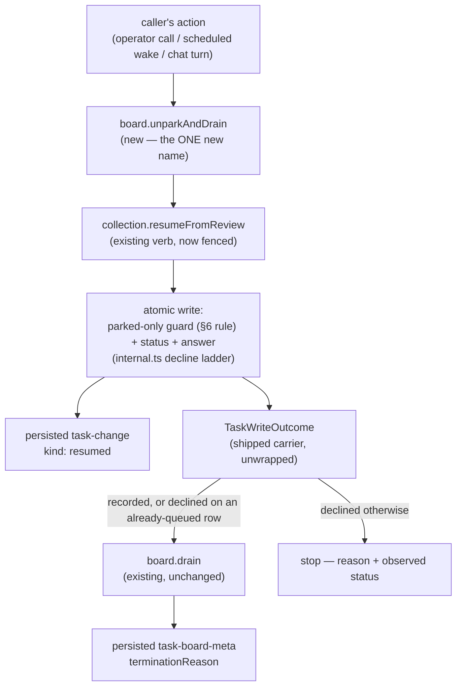

# FIX-1244: Task board: unblock a parked task with an input, starting a new request — Implementation Spec

## Part I — The Case *(for the human)*

### 1. Problem — why it matters, why now

A worker can stop and ask a person a question. The board holds the task in a
"waiting on a human" state and — since park-exit shipped last week — the run that
asked is allowed to end rather than sit there for a day. That half works.

The other half does not exist. When the person answers, there is no supported way
to hand that answer back and get the work moving again. What a caller has today is
two separate calls that both look like they worked and together often don't:

- **The re-queue call will happily fire at the wrong task.** It does not check that
  the task is actually waiting on anybody. Point it at a task a worker is running
  right now and it yanks that task out from under the worker, reports success, and
  the worker's result is later refused as stale. Point it at a task somebody already
  answered and it silently overwrites the first answer with the second. *(Both
  measured on `main` — see §7.)*
- **Nothing then runs the work.** Re-queuing puts the task back in the queue and
  stops. Something else has to come along and drain the board. If nothing does, the
  person's answer sits there forever and no surface anywhere says so.

**Why now.** Park-exit landed on 2026-08-25, so a board can now honestly say "I
stopped because a person owes me an answer." Until the answer can be delivered, that
honesty is a dead letter: the board tells the truth and then nothing can act on it.

**The workaround exists and it is the argument for building this.** The first
consumer already wrote it in its own code — an `answer` verb that reads the task,
decides whether the answer is allowed, re-queues, and then runs the drain itself. Its
own notes say the guard "will not refuse for us" and has to live in userland, that
the read-then-write is open to a race it cannot close, and that its crash-recovery
rule **has been extended four times** because the three separate calls leave a
half-finished trail behind when anything interrupts them. Every one of those is a
consequence of doing in three steps what should be one.

### 2. Solution in plain terms

Make delivering the answer **one call that either did it or said it didn't.**

Two changes, both small:

1. **The re-queue call learns to refuse.** It only works on a task that is genuinely
   waiting on a person. Anything else — a task a worker is running, one somebody
   already answered, one that was cancelled — comes back as a refusal that names the
   state it found, instead of a silent write. The answer itself is written in the
   same indivisible step as the state change, so there is no half-finished trail for
   a crash to leave behind and no window for a second answer to slip through.
2. **The board can hand the answer straight into a run.** A caller drops **one** new
   board step into whatever action the answer arrives on, and it re-queues the task and
   then runs the board's drain in that same request. That step is the only new name
   this ships; a caller who wants to re-queue *without* running anything uses the
   substrate verb from change 1 directly, which is what they already reach for today.

One park takes **one** answer. Once an answer is accepted the work is queued, so a
second answer to the same question is refused and the first stands — that is the fence
doing its job, not a limitation bolted beside it.

**On the ticket's wording.** The ticket says the verb "starts a new request." It
doesn't, and it can't — the framework has no way for running work to launch a fresh
action, and that door was closed on purpose. What actually happens is that the
answer *arrives* on a request (an operator's call, a scheduled wake, a chat turn),
and that request is the new one. What was missing was a way to hand the task into it
that can't quietly do nothing. See decision 2.

**Philosophy** — tenet 2 (composition over features): this sharpens the verb the
substrate already has rather than adding a second one beside it, and reuses the
board's existing drain rather than building a second way to run a task. Tenet 5 (one
convergence point): the refusal is evaluated inside the same atomic write as the
state change, so no caller can be looking at a stale answer when it decides. Tenet 3
(earn every addition): one new board step and zero new task fields.

### 6. Decisions & rules — the sign-off surface

> **Rule — the status the fence refuses from is `awaiting_review`. Stated here, once.**
>
> **"Parked" is the product word; `awaiting_review` is the value that ships.** Every
> "parked" in this document — Part I and Part II, prose, diagram and sketch alike —
> means a task sitting in `awaiting_review` and nothing else. That is the one status
> the fence may accept, and the implementer writes that literal.
>
> This matters more than a naming preference: **a guard written against `parked`
> never fires on `main`**, because no such enum member exists yet. FIX-1245 renames
> the member to `parked`; this spec deliberately takes none of that rename, and
> `needs_input` is not an enum member at all — it is only ever operator display.
> When FIX-1245 lands, this rule is the one line that changes.

1. **The existing re-queue verb gains the refusal, rather than a second verb being
   added beside it.** Today it accepts any task; after this it accepts only a task
   that is waiting on a person, and reports a refusal for anything else.
   *Rejected:* leaving it as-is and adding a new, stricter verb next to it — nobody
   would be told the old one is the dangerous one, and the trap stays shipped
   forever.
   *Locks in:* this is a **breaking change to behaviour that already ships.** Anyone
   calling that verb on a task that isn't parked gets a refusal where they used to
   get a silent write. We believe that call is always a mistake (a different verb
   owns the "take this back from a dead worker" case), but we cannot see outside
   this repo to prove it. If we're wrong, someone's board stops re-queuing on
   upgrade — visibly, as a refusal they can read, not silently. Pre-1.0, so it is a
   minor version and a changeset note, not a migration.
   *And the consequence worth seeing before you sign it:* **one park takes exactly one
   answer.** Once an answer is accepted the task is queued, so a second answer to the
   same question is refused and the first stands. A person who wants to revise has to
   wait for the work to park again. That falls out of the fence rather than being a
   separate choice — it is the same property that stops a stray answer overwriting a
   real one — but it is a real limit on what an operator can do, so it is named here
   rather than buried in an edge-case table.

2. **The answer is handed into the request it arrived on; the framework does not
   start a request of its own.**
   *Rejected:* giving the substrate a way to launch a fresh run — that means opening
   a runtime seam that was deliberately sealed, and it is a much larger decision than
   this ticket.
   *Locks in:* somebody has to be calling something when the answer lands — an
   operator action, a scheduled job, the next chat turn. If a product wants an answer
   left in a mailbox to start work with nobody present, that is a separate piece of
   work and this does not deliver it. What this does guarantee is that when a caller
   *is* there, the work actually starts, and when it can't, the caller is told.

*(An earlier draft carried a third decision — that an answer could also carry a small
bag of structured data, merged so that two answers combine. It was **withdrawn in
review**: it contradicts decision 1. Once the fence is on, an accepted answer queues
the task, so a second answer is refused and there is no second payload to merge with —
the merge was unreachable by construction. One park, one answer, prose only. The
structured payload is a genuine future widening and is recorded in §12 with the
trigger for it, including the trap to avoid when it comes.)*

**Non-goals** — who calls the verb and what that looks like to an operator; the
Conductor-specific flow that consumes it; renaming the parked status (FIX-1245 — see
the rule above); the message layer that carries the *question* (FIX-1230); a second
pause model (FIX-274, FIX-765); **structured (non-prose) answer payloads**, and
**revising an answer before the work restarts** — both §12 follow-ups.

**Size:** Small–Medium — 4 production files · 12 test behaviours · 3 doc surfaces · 1 PR.

---

### 3. Tradeoffs & alternatives

**Alternative: a brand-new verb, leaving the old one untouched.** Additive, breaks
nobody, ships next week. Rejected because the old verb is the one every existing
caller and every doc example already reaches for, and it would keep its trap
indefinitely. Two verbs that both mean "resume" with one of them quietly dangerous is
the grab-bag shape the framework's own review gate exists to catch.

**The simpler approach: leave it in userland and document the recipe.** Genuinely
tempting — the first consumer already has a working version, so the code exists. It
is insufficient for one reason, and it is not ergonomics: the userland version
**cannot** make the check and the write indivisible. It reads the task, decides, then
writes, and the task can move in between. Its own module notes say so and name this
ticket as the only thing that closes it. The four extensions its recovery rule needed
are the same defect from the other side — three calls leave three places to crash.

**Where the complexity is:** not the refusal, which is a one-line reuse of machinery
another verb (`unblock`) already uses for exactly this shape. It is in what the
*second* answer to the same question should do. Once the first answer re-queues the
task, the second one finds a task that is no longer waiting and is refused — which is
correct, and is also indistinguishable from a retried delivery of the *first* answer.
This spec's position is that one atomic call makes retry-vs-duplicate a distinction
without a difference (both are "already answered, nothing further to do") and does not
try to tell them apart. §9 walks it.

### 4. Focus practices (1–5)

1. **Tenet 5 — one convergence point.** The refusal is evaluated inside the atomic
   write, next to every other guard, and never as a read followed by a write. A
   pre-check is the exact defect this replaces; reintroducing one at a higher layer
   would ship the bug with a nicer name.
2. **BP-030 (tolerate the old shape).** The verb's existing prose-only argument keeps
   working unchanged, and a hand-written collection that predates this needs no
   migration.
3. **BP-031 (never decide from caller-controllable input).** The answer is caller
   text and must stay inert — it is read by a worker, and nothing routes, authorizes,
   claims or fences on it. Shipping prose only is what makes that true rather than
   aspirational here; §12's trap bullet is what keeps it true if a payload is ever
   added, and it is not optional reading for whoever does that.
4. **BP-035 (second-path checklist).** The second path here is the *refused* one, and
   it is the whole feature. A suite that only proves the happy answer proves nothing.
5. **Epic decision 5 — containment must not regress.** A refused or accepted answer
   must still leave every sibling task on the board running, proven at integration
   level, not per-backing.

### 5. What using it looks like (1–5 examples)

**Handing a human's answer into the run it arrived on** — the one new board step,
dropped into whatever action the answer lands on, so a drain is guaranteed to follow
an accepted answer and guaranteed not to follow a refused one:

```ts
const reviews = taskBoard({ name: "reviews", onReview: "exit", /* … */ });

export const answerAction = sequencer({ name: "answer" })
  .step(reviews.unparkAndDrain);   // re-queue, then drain — or refuse and stop

// { outcome: { outcome: "recorded" },                          drained: true  }
//     the answer landed and the work ran in this request
// { outcome: { outcome: "declined", reason: "disallowed",
//              status: "in_progress" },                        drained: false }
//     somebody is already running it — nothing was written
```

**Re-queuing without running anything** — the substrate verb from change 1, which is
the same call a caller reaches for today, now fenced *(what this spec proposes; today
this call checks nothing):*

```ts
const tasks = await ctx.cap.reviews.tasks();
const outcome = await tasks.resumeFromReview("draft-42", "approved, ship it");

// { outcome: "recorded" }   the task is queued, carrying the answer
// { outcome: "declined", reason: "disallowed", status: "pending" }
//     already answered — the first answer stands and was not overwritten
```

**What the fence saves you from (before / after):**

```
before   resume a task a worker is running  → reported "recorded"; the worker's
                                              row is yanked and its result is
                                              later refused as stale
after    same call                          → declined, status "in_progress";
                                              nothing written

before   answer the same question twice     → the second answer overwrites the
                                              first, with nothing reporting it
after    same calls                         → the first is recorded; the second
                                              is declined, status "pending"
```

---

## Part II — The Build Plan *(for the implementing agent)*

### 7. Technical design

*Throughout Part II, "parked" is §6's rule — the implementer writes the literal named
there, not the product word.*

Two layers, and the load-bearing one is the lower. Everything above it is
composition of pieces that already ship.



- **`@flow-state-dev/orchestration` → `tasks/collection`.** `resumeFromReview` is
  narrowed to the one edge it owns, using the mechanism `unblock` already uses for
  its own single edge (the `requireFrom` parameter threaded into the decline ladder),
  and forcing the advisory flag on the way `cancel` already forces it. Its signature
  is otherwise **unchanged** — same prose argument, same return type. Both backings;
  the shared decline ladder means one place decides.
- **`@flow-state-dev/orchestration` → `task-board`.** The handle gains
  `unparkAndDrain`, and that is the whole of the new public surface: a sequencer of an
  internal re-queue step followed by a conditional step into the board's own `drain`.
  It composes the existing drain; it does not re-implement any of it (BP-011 — a
  handler must not call a block). Resource-backed boards only, refused by name
  elsewhere — park-exit already refuses every other backing at construction, so a
  parked row that outlives a request exists nowhere else.
- **Untouched:** the runtime request seam and its four verbs, the workstream dispatch
  contract, `core` entirely, every other collection verb, the drain's own pipeline,
  park-exit's exclusion and its termination ladder, and the board capability's
  accessor — which gains **no** method.

**Why there is no `unpark` accessor method, though an earlier draft had one.** It
would have been sugar over `resumeFromReview` reached through `ctx.cap.<board>.tasks()`
— two lines a caller can already write — and it committed the framework to a second
name for the same act before anything needed one. Re-queue-without-drain is served by
the substrate verb, which is what a caller reaches for today. If batch-answering
several parked tasks and draining once turns up as a real shape, the accessor is a
small additive follow-up, not a thing to pre-build (tenet 3).

**Where the guarantee is observable (epic decision 4).** Two persisted surfaces, both
already shipping — nothing new is needed and nothing rests on a transient trace:

| What happened | Persisted carrier |
|---|---|
| the answer was written and the task queued | the `task-change` component item, `kind: "resumed"`, carrying the whole post-write row including the answer |
| the resumed work then ran (or didn't) | the drain's `task-board-meta` component item and its `terminationReason` |
| the answer was **refused** | the returned write outcome — deliberately item-less, exactly as every other decline has been since the epic's decision 1. A decline writes nothing, so it publishes nothing. |

**Is the shipped write outcome the right carrier? Yes — unwrapped, and nothing
re-invents it.** `declined` already carries a reason and the status observed inside
the write, which is exactly what a refused answer needs to say, so the write half
returns `TaskWriteOutcome` **unchanged**. The one thing it cannot answer is the board
layer's second question — *did anything then run?* — and that fact rides on the
composed step's own output (`{ outcome, drained }`) rather than being folded into a
new result type. One carrier per question, neither wrapping the other.

**`unchanged` is unreachable on this verb once the fence is on**, and that is worth
stating because an earlier draft mapped it to a success. `unchanged` means the desired
state already held; the fence refuses a non-parked row *before* the write is attempted,
so an already-queued task declines rather than reporting `unchanged`.

**Retrying the same answer: the write refuses, and the step still drains.** These are
not in tension and an implementer needs both. A retry finds the task already queued,
so the write declines — the first answer stands and is never overwritten. But a caller
retrying because its *previous* attempt died between the write and the drain still
needs the work to start, so the composed step drains on `recorded` **and** on a
decline whose observed status is `pending` ("already queued, still not running").
That single rule makes the step safe to retry from any prefix and is what lets this
design carry no crash-recovery rule at all — the thing the userland version had to
extend four times. A drain that finds nothing claimable returns immediately, so the
redundant case costs nothing.

**"Already answered by someone else" and "answered by me, then I crashed" are not
distinguished, and do not need to be** — the action is identical in both (the work is
queued and must run), and the caller is told the truth either way by the outcome:
*your* write was refused. Distinguishing them would need a body comparison this spec
does not buy. The userland version reached the same rule independently from the other
side — its recovery path drains on a `pending` row for exactly this case
(`labs/conductor/src/answer.ts`, the "crashed between the resume and the drain" arm).

**The answering request has to reach the same ledger, and that is a real constraint,
not a footnote.** A durable board's collection is scoped (the shipped integration
scenario declares `scope: "session"`), so the later request carrying the answer must
run in the **session that holds the parked task**. Get it wrong and nothing complains:
the runtime resolves a different ledger, the task reads as missing, the answer is
refused, and the work never restarts. This is the same footgun the docs currently warn
about for the hand-rolled two-step (§11 removes that warning) — collapsing the two
steps into one does **not** remove it, because it was never about the number of calls.
The composed step therefore refuses a task it cannot find rather than reporting a
no-op drain, and §11 states the requirement where an author will meet it.

**One thing the fence does not buy on a durable board, stated because the design's
headline overclaims without it.** The guard is evaluated inside the write's updater —
but a decline aborts that updater *before* a conditional write is attempted, so on
the resource backing it never conflicts, never rereads, and never re-runs. The basis
it judged is whatever that context had cached. The substrate already documents this
and singles out exactly the arm this fence uses (`disallowed`) as the one that is
unsafe on a stale basis (`tasks/collection/types.ts`, on `TaskWriteDeclineReason`).

Only one direction is reachable, and it is the safe one for correctness: a **false
refusal** of a genuinely parked task. The opposite — falsely accepting an answer for
a task somebody already answered — cannot survive, because accepting means attempting
the write, and the conditional write then conflicts and re-runs the guard against
refreshed state. So no answer is ever wrongly written and no first answer is ever
overwritten.

A false refusal is still a lie, and this spec's headline is that a refusal is true. So
**the durable path must re-evaluate against a refreshed read before it reports a
refusal from this verb** — a decline is rare, so the extra read costs nothing on the
common path. The mechanism is the implementer's; the requirement is not.

**POC on this branch — a characterization test, and the premise held.**
`spec-poc/FIX-1244-resume-fence/resume-fence.characterization.test.ts` pins today's
behaviour on `main` @ `1d818af22`, run from the repo root with
`pnpm exec vitest run spec-poc/…` (the package-filtered form does not collect it —
see the file header). It passes, which means the defect is present as described: the
verb re-pends a live claimed row and reports `recorded`; passing the advisory flag
changes nothing because the edge it would check is legal; a task that is **parked,
answered, then answered again** takes the second answer over the first with nothing
reporting it; and a parked row is not claimable, so a resume genuinely has to route
through the queue rather than dispatching the row itself. Throwaway — it never merges.

**Sketch — pseudocode. Illustrative, not the contract. React to the shape.**

```
in the collection's atomic write, where the decline ladder already lives:

    the resume verb declares it owns ONE edge — the parked status (§6 rule) → "queued"
    and it declares itself advisory, the way the cancel verb already does.

    the ladder then needs no new arm: the existing single-edge check
    (the one the unblock verb uses) refuses anything else and reports
    the status it found.

    the same write also lands the answer's prose, replacing.
    the task's original instructions are untouched.
    there is no second payload to merge — one park takes one answer.

at the board, inside the composed step:

    outcome ← the write above                     (TaskWriteOutcome, unwrapped)

    drain when:  recorded
             or  declined AND the status it saw is "queued"   ← retry-safe
    otherwise:   stop, and report the outcome as it stands

    unparkAndDrain := step(the write) then stepIf(the rule above, the board's own drain)
```

What this asks a reviewer: *is narrowing the shipped verb the right move, or should
the fence live on a new verb and leave the old one alone?* Everything else follows
from that. It is deliberately impossible to tell from this what the parameter is
called or which file the guard's line lands in — the implementer's to settle.

### 8. Implementation sequence

1. **Fence the verb to its one edge**, per decision 1 and §6's rule, in the shared
   decline ladder so both backings inherit it from one place. The signature does not
   change. *Test:* the §5 before/after rows; a refusal on each non-parked status and
   on a terminal task; the prose argument behaving exactly as today on a genuinely
   parked task. *Depends on:* nothing.
2. **`unparkAndDrain` on the handle**, per decision 2 — the internal re-queue step
   plus the conditional step into the board's existing drain, with the drain condition
   from §7 (`recorded`, **or** a decline whose observed status is queued). Refuse a
   non-resource backing by name, matching park-exit's construction-time refusals in
   register. *Test:* an accepted answer runs the drain in the same request; a refused
   one on a *running* task does not; a retry after a mid-sequence crash still drains.
   *Depends on:* 1.
3. **The cross-request goal check** — park, let the request end, answer, and see the
   work finish. Extends the existing park-exit integration scenario rather than
   starting a new file. *Depends on:* 2.
4. **Remove** the docs' hand-rolled two-step recipe (the *"Picking it back up"*
   section currently teaches the exact sequence this replaces) and the standalone
   `runAction` example under it. The session-naming footgun it warns about is
   subsumed: the new step runs on the caller's own request, so there is no second
   session to name.

*(No PR plan — one PR.)*

### 9. Edge cases & error handling

| Case | Expected |
|---|---|
| Answer names a task a worker is running | Refused, naming the running state. Nothing written. This is the defect the POC pins. |
| Answer names a task somebody already answered | Refused, naming the queued state — the first answer stands and is not overwritten. **One park takes one answer** (decision 1) |
| Answer names a completed / cancelled / errored task | Refused as terminal. The answer is unanswerable and the caller can say so |
| Answer names a task id that isn't on the board | Refused, not thrown — a caller-supplied id is input, not a programming error (BP-031) |
| Answer accepted, then the caller dies before the drain runs, then retries | The write is refused (already queued) **and the step drains anyway** — the §7 rule. This is why the design needs no crash-recovery rule |
| A retried delivery of the *same* answer, nothing having crashed | Identical to the row above: refused, and the drain finds nothing claimable and returns. **Deliberate:** one atomic call leaves no half-finished trail, so "retry" and "genuine second answer" are the same fact to the substrate — the first answer stands either way — and telling them apart would need a body comparison this spec does not buy |
| A drain claims the task between the answer landing and the composed drain starting | Fine. The composed drain finds nothing to claim and returns; the work is running elsewhere. Idempotent by construction |
| The answering request runs in a different session from the parked task | The task reads as missing and the step refuses. **Not** a silent no-op drain — that is the failure mode this replaces |
| A durable board whose cached basis lags the store | The refusal path rereads before reporting (§7). Without that reread the only reachable error is a *false refusal*; a false acceptance cannot survive the conditional write |
| Board is not resource-backed | Refused by name at the accessor. Park-exit already refuses such a board at construction, so no parked row can outlive a request there |
| A hand-written collection implementation | Inherits nothing and needs no migration — the widened payload is optional and the fence is advisory. It also gets no protection, which is the same standing gap the substrate already documents for custom implementations |

**Taxonomy:** every case above is a **refusal — a value, never a throw.** The only
throws left are the ones that already exist: a non-finite argument and a malformed
board declaration, both programming errors. A refusal is never retryable by repeating
the same call; it is information about a state the caller has to react to.

### 10. Testing strategy

**Goal:** a real board parks a task on a question, the request that asked ends
honestly, a person answers through the new step in a *later* request, and the work
finishes. The check is that the board's final report says the work completed — not
that a status changed. Extend
`packages/integration-tests/src/scenarios/task-board-park-exit-across-requests.test.ts`,
which already runs park-exit across three real requests and already proves the
negative case (a later drain that reaches the wrong ledger). No model is needed:
the outcome a user cares about here is "the answer got the work moving," which is
observable without one.

**CI specs** (the behaviours, not the test names):

- **one behaviour per decision in §6**, in observable terms — what a caller gets back,
  not how it was computed, including decision 1's one-park-one-answer consequence
- **the refused path for every non-parked state** (BP-035): running, already-queued,
  and each terminal status. This is the second path and it is the feature
- **what must not change**: the prose-only form of the verb behaves exactly as today
  on a genuinely parked task, and every other collection verb is untouched
- **both backings**, through the existing parameterized collection suite — the fence
  lives in shared code and a per-backing divergence is what that suite exists to catch
- **the invariant that is easy to state wrongly**: the refusal is decided **inside**
  the write, so a test must exercise a task that *changes* between a caller's read
  and its call — not merely one that was already in the wrong state when the test
  set it up. A test that only asserts "wrong status in, refusal out" passes against a
  pre-check implementation, which is the thing this spec exists to rule out
- **the retry rule from §7**, which is the one place two behaviours meet: a caller
  that dies between the accepted write and the drain, then retries, must end with the
  work having run — even though its second write was refused. A suite that only
  asserts "refused" on the retry passes while the answer is stranded
- **the stale-basis refusal**: two contexts over one durable board, one holding a
  basis from before the park. Its answer must be **accepted**, not refused — this is
  the behaviour the §7 reread exists for, and it is invisible to any single-context
  test
- **the wrong-session answer**, at integration level: the existing scenario already
  proves the negative for a hand-rolled drain; the composed step must **refuse**
  rather than report a drained board
- **containment (epic decision 5), at integration level**: a worker outcome landing
  on a task settled while it ran still leaves every sibling on the board running,
  after an unpark as before one

**Discipline:** `tdd`. The seam for steps 1–3 is the collection's parameterized vitest
suite, reachable with the existing fakes and no runtime — every behaviour above is a
tracer bullet there. Step 4 needs the board's own test harness; step 5 is the
integration scenario.

### 11. Documentation plan

- **EXTEND** `apps/docs/docs/orchestration/task-board.md` — rewrite the *"Picking it
  back up"* subsection under *"Waiting on a person"*. It currently teaches the
  two-step recipe this spec replaces, including a standalone `runAction` example and
  a paragraph warning that omitting the session id silently drains an empty board.
  Both go: the new step runs on the caller's own request, so the footgun is gone
  rather than documented. New content: the one-call shape, the refusal cases as a
  short table, and what an answer may carry. One minimal example — the
  `resumeFromReview` call from §5, not the composed step, since the caller meets the
  verb first.
  **Keep one thing the old section got right:** the answering request must run in the
  session that holds the parked task. The old text explained this around a
  hand-rolled `runAction`; the requirement survives that example's removal, because
  it was never about the number of calls. State it against the new step.
  Cross-link ← from the *"Termination"* section's `parked-for-review` bullet (the
  reader who just learned the board stops here needs to know what restarts it),
  → to *"Commanding the board with its capability"*.
  *Voice risk:* the temptation is "seamlessly resumes." Don't. Also: introduce
  *parked* in plain words on first use — the status name a reader sees in their own
  logs is the §6 rule's, not the product word, and the page has to bridge the two.
- **EXTEND** `packages/orchestration/README.md` — the park-exit entry gains one line
  naming the return trip. Terse; the site page carries the detail.
- **EXTEND** `docs/architecture/detached-work.md` — the park-exclusion table's
  surrounding prose says a parked row waits for "whatever drains the board next."
  One sentence naming what now hands it into a drain. Internal contract doc, not
  published.
- **No new page.** This is one section under an existing concept, not a term a user
  searches for on its own — and the concept page it belongs to already has the
  parking half.
- **Changeset:** `minor` (BP-022) — decision 1 is a behaviour change to a shipped
  verb and the note must say so plainly.

### 12. Dependencies, open questions & follow-ups

**Dependencies:** none outstanding. FIX-1234 (park-exit) merged as
[#1422](https://github.com/fixpoint-labs/flow-state-dev/pull/1422) on 2026-08-25 and
is on `main`; it is what makes a parked row outlive its request at all.

**Coordinate with, but not blocked by:**

- **[#1451](https://github.com/fixpoint-labs/flow-state-dev/pull/1451) (LAB-139)** is
  the userland version of this verb and the evidence base for §1. It is open and
  ships in `labs/`, not in a framework package, so there is no file collision. When
  this lands, its `answer` verb should collapse onto the primitive and shed its
  recovery rule — **not this ticket's job**, and worth a line to that PR's author.
- **FIX-1245** renames the parked status to the product word. This spec is written
  against the live name throughout, deliberately, and §6's rule is the single line
  that carries it — that is the line FIX-1245 changes. The rename will touch the verb
  this spec touches; sequencing is the epic's call, not this spec's.

**Open questions:** none. Decision 1's blast radius is the one thing that would be a
question, and it is asked as a decision on the spec PR instead — it is a call the
owner ratifies, not a fork the research left open.

**Settled claims:**

- **Settled:** the shipped resume verb re-pends a live, claimed row and reports
  `recorded` — **CONFIRMED** by the characterization POC on this branch, four
  expectations green against `main` @ `1d818af22`. Includes the corollary that the
  advisory flag does not help, because the edge it would check is legal.
- **Settled:** a parked row cannot be claimed directly, so the resume must route
  through the queue rather than dispatching the row itself — **CONFIRMED** by the
  same POC.

**Follow-ups (flagged, not built):**

- **The mailbox case.** Decision 2 leaves "an answer arrives with nobody present"
  unserved. If a product needs it, that is a scheduled or queued wake calling this
  same step — a deployment concern, not a substrate one. Filing it is premature until
  a consumer asks.
- **Structured (non-prose) answer payloads.** Withdrawn from §6 in review because the
  merge it promised is unreachable under the fence. It is still a real widening the
  day a consumer needs a machine-readable decision back — LAB-139 needs neither
  channel today, which is why it waits. **Three things for whoever picks it up.** It must land in the
  *same atomic write* as the status change — a second `patchMetadata` call re-creates
  precisely the non-atomic two-step this spec exists to remove. It is **cheap**:
  `metadata` and `patchMetadata` already ship, so widening the atomic write is
  additive and modeled on a pattern already in the tree. And it carries a **trap that
  must be closed first** — see the next bullet.
- **The trap the payload widening has to close (do not skip this).** Answer data must
  **not** be merged into the task's `metadata` unnamespaced. Detached dispatch derives
  a Workstream's routing topic from `metadata.topic`
  (`task-board/blocks/spawn-detached.ts`, verified), so an answer carrying a `topic`
  key would reroute the next attempt to a different Workstream and strand its
  conversational context. Namespace the answer's data or reserve the routing keys —
  otherwise the "answer data decides nothing" claim (BP-031) is aspirational rather
  than true. **This spec is not exposed to it**, because it ships no bag at all.
- **Revising an answer before the work restarts.** Decision 1 makes one park take one
  answer, so an operator who mis-answers has to wait for the work to park again.
  Serving revision means a window between the answer and the resume, which is a
  different shape from this verb. No consumer has asked; filing it now would be
  speculative.
- **Deepening:** the board capability's accessor is built from a `resolve()` closure
  with no context. Nothing in this spec needs more than that any more (the `unpark`
  accessor was dropped — §7), but the constraint is real and the next method that
  wants context will hit it. Out of scope; follow up via `improve-codebase-architecture`.

### 13. Review notes for the implementer

- "Decision 3's structured bag doesn't specify where `data` lands on the task. Existing shape has `feedback` (string) and `metadata` (merged via `patchMetadata`). Prefer merging answer `data` into `metadata` inside the same atomic write rather than a new top-level field — worker dispatch already exposes `metadata` via `taskWorkerInputSchema`." — cursor[bot] ([thread](https://github.com/fixpoint-labs/flow-state-dev/pull/1461))

  *Recorded verbatim, and **its central suggestion is refuted** — kept because a
  later reader will otherwise re-derive it. Two things. First, it describes a
  **follow-up**, not this spec: decision 3 was withdrawn, so v1 ships no bag and there
  is no `data` to place. Second, and the reason it must not be adopted as written:
  merging answer data into `metadata` is exactly what a **different** reviewer showed
  is unsafe — `metadata.topic` drives detached Workstream routing, so an answer could
  reroute the next attempt (§12's trap bullet, verified in
  `spawn-detached.ts`). Its atomic-write half is right and agrees with this spec; its
  field-placement half is not. §12 carries the corrected shape.*

**For the implementer:** these are *inputs, not instructions.* Each is one reviewer's
guess at code they haven't read. Adopt, adapt, or discard — you owe no justification
for discarding one (§6's Decisions bind you; these don't).

---

## Spec evolution

- **Spec drafted** — framed as the return trip park-exit left open; chose to sharpen
  the shipped resume verb rather than add a second one beside it, and to hand the
  answer into the caller's own request rather than open a runtime seam to start a
  fresh one; pinned the shipped defect with a characterization POC before writing the
  case for it.
- **After spec review (round 1)** — single-sourced the fence's from-status into one
  §6 rule, because the draft read throughout as though `parked` were already the enum
  member and a guard written against it would never fire on `main`.
- **After spec review (round 2)** — cut the public surface from two new board names to
  one, dropping the `unpark` accessor as sugar over a verb callers already reach for,
  and unwrapped the board result so the shipped `TaskWriteOutcome` carries the write
  and only the composed step carries `drained`.
- **After spec review (round 3, spent deliberately outside the two-round budget —
  round two surfaced a genuine spec-level contradiction rather than more notes)** —
  withdrew decision 3, because two reviewers independently showed its merge promise
  contradicts the fence: an accepted answer queues the task, so a second answer is
  refused and there is no second payload to merge with. One park now takes one answer,
  stated as a consequence of decision 1, and the retry rule that replaces the userland
  version's crash-recovery logic is stated explicitly in §7.
- **After spec review (round 3, second batch, folded into the same pass)** — retained
  the same-session requirement that had been lost when the standalone drain example
  was removed; scoped the "guard is inside the atomic write" claim to what the durable
  path actually delivers, and required a reread before a refusal is reported, because
  a false refusal would make the spec's headline untrue; and confirmed the structured
  payload's removal also deletes a BP-031 routing hazard outright rather than leaving
  it to be designed around.
