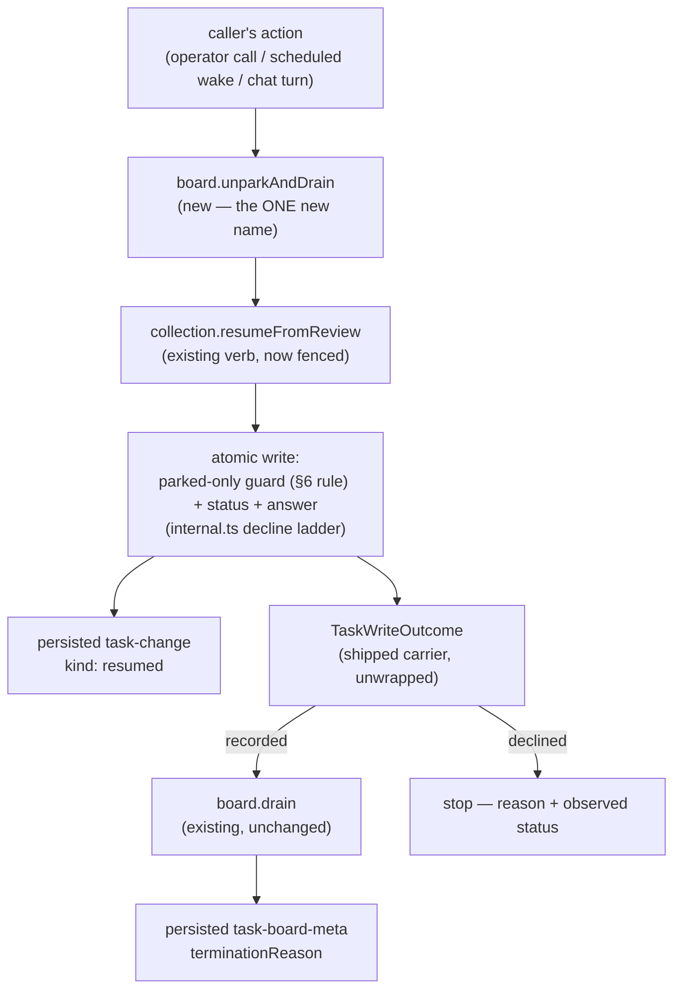

# FIX-1244: Task board: unblock a parked task with an input, starting a new request — Implementation Spec

## Part I — The Case *(for the human)*

### 1. Problem

A worker can park to ask a person a question. There is no supported way to hand the
answer back and restart the work. The two calls available today both look like they
worked while often not working: one re-queues any *live* task and reports success —
yanking the row from a running worker, whose result is then refused as stale — and
nothing runs the work afterwards (§7). A terminal row is the exception: that call
already throws today.

### 2. Solution in plain terms

Delivering an answer becomes one call that either did it or said it didn't: the re-queue
verb refuses anything not waiting on a person and writes the answer indivisibly with the
state change; a new board step drains the board in that request.

### 6. Decisions & rules — the sign-off surface

> **The fence is on the shipped enum member `awaiting_review`** — *parked* is the product
> word and no such member exists yet, so a guard written against it never fires. FIX-1245
> renames it later.

#### 1. Narrow the shipped call, or add a stricter one beside it?

**Plain terms.** The call that puts an answered task back to work fires at any task and
reports success either way; we narrow it to refuse anything not waiting on a person.

**The trade-off.** Shipped behaviour changes: a non-parked task now draws a readable
refusal, not a silent write. And **one park takes one answer** — an accepted answer
queues the work, so a second is refused.

**My recommendation: narrow the shipped verb.** A different verb already owns the only
other honest reason to re-queue — taking a task back from a dead worker — so pointing
this one at a running task is always a mistake. A stricter verb beside it tells nobody
which is dangerous, so the trap ships forever.

**What would change my mind:** someone outside this repo deliberately re-queuing unparked
tasks; we cannot see that from here.

**Cost of being wrong: low and visible, except in one case.** A board stops re-queuing
on upgrade and says why — pre-1.0, so a minor and a changeset. The exception runs the
other way: answering a **terminal** task throws today, and the fence turns that throw
into a returned `declined`, so a `catch`-based caller stops catching. One path gets
*quieter*. The changeset must say so. **One reliability caveat too, not a correctness
one:** on a durable board an answering request whose basis predates the park can refuse
a genuinely parked task (§7). The caller re-delivers and the next request succeeds, so
it costs a round trip; nothing is written wrongly and no answer is lost.

#### 2. The verb cannot start a new request — reframed, for ratification

Nothing lets running work launch a fresh action, and opening that seam is a far larger
decision than this ticket. The answer *arrives* on a request — an operator's call, a
scheduled wake, a chat turn — and that is the new one. Cost of the reframe: an answer
left in a mailbox with nobody calling anything starts no work. That case stays additive
(§12), and no reviewer has contested this across sixteen rounds, so it is recorded here
rather than put to you as a fork.

*(A third decision — a structured answer payload — was **withdrawn in review**: decision 1
queues the task on the first answer, so the merge it promised was unreachable. §12.)*

**Non-goals:** the rename (FIX-1245); the *question* layer (FIX-1230); a second pause
model (FIX-274, FIX-765); structured payloads and answer revision (§12); who calls the
verb, and the Conductor flow.

**Size:** 4 production files (§8) · 13 test behaviours (§10) · 3 documentation surfaces
(§11) · 1 PR.

### 3. Tradeoffs & alternatives

The rejected alternative is decision 1's. Leaving it in userland is tempting and fails
for one reason, not ergonomics: a userland guard cannot make the check and the write
indivisible.

### 4. Focus practices (1–5)

1. **Tenet 5 — the guard lives inside the atomic write**, never as a pre-check. That is
   the change; §10's fence test is built to fail against a pre-check specifically.
2. **BP-035 (second path)** — the *refused* path is the second path, and here it is the
   whole feature. A suite proving only the happy answer proves nothing.
3. **BP-031 (never route on caller input)** — the answer is inert prose; shipping no
   structured payload is what makes that true rather than aspirational (§12).

### 5. What using it looks like

```ts
.step(reviews.unparkAndDrain)

// { outcome: "recorded" }   accepted; a drain ran
// { outcome: "declined", reason: "disallowed", status: "in_progress" }   nothing written
```

---

## Part II — The Build Plan *(for the implementing agent)*

### 7. Technical design

*Throughout Part II, "parked" is §6's rule — the implementer writes the literal named
there, not the product word.*

Two layers, and the load-bearing one is the lower. Everything above it is
composition of pieces that already ship.



- **`@flow-state-dev/orchestration` → `tasks/collection`.** `resumeFromReview` is
  narrowed to the one edge it owns, using the mechanism `unblock` already uses for
  its own single edge (the `requireFrom` parameter threaded into the decline ladder),
  and forcing the advisory flag on the way `cancel` already forces it. Its signature
  is otherwise **unchanged** — same prose argument, same return type. Both backings;
  the shared decline ladder means one place decides.
  **And "both backings" is the honest bound on the guarantee, not a shorthand for
  "everywhere".** `TaskCollectionRef` is an exported interface, and a hand-written ref
  is a shape this codebase already plans around (BP-030: "a `TaskCollectionRef` written
  by hand maintains no provenance"). `requireFrom` lives in `tasks/collection/internal.ts`
  and is threaded by `resource-backed.ts` and `sequencer-backed.ts`; it is **not** a
  field on `TaskTransitionOptions`, so nothing carries the fence across the interface
  boundary. A caller's own `resumeFromReview` therefore keeps whatever behaviour it has
  today, including re-queuing a running task and reporting `recorded`. **This is about
  direct substrate calls only, and the composed step never reaches it:**
  `resolveCollectionBinding` labels *every* caller-supplied factory `backing: "factory"`
  — durable or not, since it cannot see inside the returned ref — and the invocation
  guard below throws on any non-resource backing. So `unparkAndDrain` refuses a custom
  ref before inheriting anything from it, and only a caller reaching for the verb
  directly is exposed. Admitting durable custom refs to the composed step would mean
  the binding learning to recognise them, which is the same widening §12 already owns.
  **This is scoped, not fixed:** the parked-only
  guarantee is a property of the two built-in backings. Widening it needs a public
  enforcement seam, which is a cross-verb change to the shared options type and belongs
  in its own change (§12). Saying so is the point — a safety claim that quietly does not
  hold at a supported extension point is the failure mode this epic is named after.
- **`@flow-state-dev/orchestration` → `task-board`.** The handle gains
  `unparkAndDrain`, and that is the whole of the new public surface: an internal
  re-queue step followed by a conditional **tap** into the board's own `drain`. **The
  tap is the part to get right.** `.tapIf` runs its child for effect and carries the
  prior value forward on both branches (`core/src/blocks/sequencer.ts`), so the step
  returns the write's `TaskWriteOutcome` whether the drain ran or not. A `.stepIf`
  would replace that outcome with the drain's result on exactly the branch that
  matters, and `TaskBoardHandle.drain` is typed loosely enough that the swap would not
  be caught while wiring the handle.
  It composes the existing drain; it does not re-implement any of it (BP-011 — a
  handler must not call a block). **Resource-backed boards only — and the refusal
  belongs at invocation, not construction.** Park-exit's construction guard returns
  early unless the board declares `onReview: "exit"` (`task-board/park-exit.ts`), so a
  request- or sequencer-backed board without that option constructs perfectly well
  today. Refusing at construction merely because the handle now carries this step would
  break every one of those boards for a step they never call. Lean on the existing
  condition instead: without `onReview: "exit"` no row can be parked, so this step can
  never legitimately fire, and an unsupported board is told so **when the step runs**.
  The handle stays uniform; only the call refuses.
  **Its input contract is part of the public surface and is stated here so three
  artifacts cannot invent three shapes.** The step is a sequencer step like any other:
  it reads the value it is handed — the action's input when it is the first step, the
  previous step's output otherwise — and that value carries the two things the
  underlying verb needs, the id of the task being answered and the prose answer. It
  does not read from state, resolve the id from the board, or accept it as
  construction config. *Field names are the implementer's* (BP-004: settle the public
  boundary first, then name it), but the shape is not, and §5's example, §11's docs,
  and §10's integration test must all use the one shape.
- **Untouched:** the runtime request seam and its four verbs, the workstream dispatch
  contract, `core` entirely, every other collection verb, the drain's own pipeline,
  park-exit's exclusion and its termination ladder, and the board capability's
  accessor — which gains **no** method.

**Why there is no `unpark` accessor method, though an earlier draft had one.** It
would have been sugar over `resumeFromReview` reached through `ctx.cap.<board>.tasks()`
— two lines a caller can already write — and it committed the framework to a second
name for the same act before anything needed one. Re-queue-without-drain is served by
the substrate verb, which is what a caller reaches for today. If batch-answering
several parked tasks and draining once turns up as a real shape, the accessor is a
small additive follow-up, not a thing to pre-build (tenet 3).

**Where the guarantee is observable (epic decision 4).** Two persisted surfaces, both
already shipping — nothing new is needed and nothing rests on a transient trace:

| What happened | Persisted carrier |
|---|---|
| the answer was written and the task queued | the `task-change` component item, `kind: "resumed"`, carrying the whole post-write row including the answer |
| the resumed work then ran (or didn't) | the **task's own** `task-change` items — they carry `taskId`, the kind, and the settled row (`tasks/collection/change-event.ts`), which is what makes them evidence about *this* task |
| the drain as a whole reached a terminal state | the `task-board-meta` component item and its `terminationReason` — **board-wide**, keyed by `collectionId` and carrying no task id, so it is a snapshot of the drain, never proof about one row |
| the answer was **refused** | the returned write outcome — deliberately item-less, exactly as every other decline has been since the epic's decision 1. A decline writes nothing, so it publishes nothing. |

**Is the shipped write outcome the right carrier? Yes — unwrapped, and the composed
step adds nothing to it.** `declined` already carries a reason and the status observed
inside the write, which is exactly what a refused answer needs to say, so both the verb
and the step return `TaskWriteOutcome` **unchanged**. No wrapper, no board-layer result
type, and no separate "did it drain" flag: the step drains on `recorded` and on nothing
else (below), so such a flag would only repeat what the outcome already says, at the
cost of a public schema, an assembly step, docs and tests.

**And a drain having run would not be proof that *this* task ran, so nothing reports
one.** A concurrent drain may claim the resumed row between the write and the drain
(§9 allows it), and on a board dispatching detached work the drain hands the row to a
worker that runs outside this request by design; the task-specific evidence is the
task's own `task-change` items, which carry `taskId`, and **not** `task-board-meta`,
which is board-wide and keyed by `collectionId` (table above).

**`unchanged` is unreachable on this verb once the fence is on**, and that is worth
stating because an earlier draft mapped it to a success. `unchanged` means the desired
state already held; the fence refuses a non-parked row *before* the write is attempted,
so an already-queued task declines rather than reporting `unchanged`.

**The step drains on `recorded` and on nothing else.** A retry finds the task already
queued, so the write declines and the step stops — the first answer stands and is
never overwritten. An earlier draft also drained on a decline whose observed status
was `pending`, so that a caller whose previous attempt died between the write and the
drain would still get the work started. **That is cut, and the cut is deliberate.**
`pending` is not evidence: a task reads `pending` after initial queueing, an
`unblock`, a reclaim and a failure retry alike, so a stale or mistyped answer would
drain the board despite having been refused. In the other direction, if the worker
parks *again* before a lost response is retried, the retry finds a parked task and
records the old answer against the **new** question. Neither is reachable by reading
status. What would reach it is a durable "which review is this answering" token, and
that is a new correlation surface this spec does not mint — §12 records the concern
against its first real consumer. FIX-1244's job is the fence, and the fence alone.

**An unknown id or a wrong-session request throws; it is not a refusal.** Promise and
carrier have to be stated together here, because an earlier draft had them disagree.
`TaskWriteOutcome` is returned **unchanged and unwrapped** (above), and its `declined`
variant carries a concrete `TaskStatus` — it has no way to say *there was no task*.
Both backings already throw before the decline ladder is reached
(`[tasks] task "<id>" not found`, in `resource-backed.ts` and `sequencer-backed.ts`),
and the collection's own contract already says so: the enumerated failure set is a
rejected transition and a lost claim, and "**everything else still throws**: a missing
task, a store failure, CAS exhaustion, an ordinary bug"
(`tasks/collection/types.ts`, on `TaskTransitionOptions`). **This spec takes that
throw as it ships.** It adds no surface, changes no carrier, and re-adds no
board-layer wrapper. Widening the shared carrier with a missing-task decline reason is
a real option, but it is a cross-verb change to a type every collection verb returns
and belongs in its own change — §12.

**A write that commits and then fails to announce must be recoverable, not claimed
away.** On the resource backing the row can commit and the `task-change` announcement
still throw; `resumeFromReview` then rejects, the composed step never drains, and an
accepted answer is left with no work started. This spec does **not** claim that cannot
happen. It requires instead that the boundary be recoverable through provenance that
already ships: mint a token with `beginTaskWrite` before the write, and after a
rejection read `didWriteLand`, which answers landed / did-not-land / cannot-tell
rather than leaving the caller to guess (`tasks/write-provenance.ts`). No new field
and no new durable surface — the mechanism exists and already covers exactly this
boundary. A caller told its write landed reaches for the board's drain; one told it
did not may deliver the answer again.

**That recovery contract is the substrate verb's, and the composed step needs none of
its own.** The token rides `TaskTransitionOptions.write`, which `resumeFromReview`
already accepts, so the caller that mints it is the caller that reads `didWriteLand`
afterwards — nothing has to be threaded back out of a rejected call. The composed
step's caller is flow-level and holds no collection, so it cannot run that query and
**is not asked to**: the step rejects, its action fails, and the answer is delivered
again on a later request. That is safe *because of decision 1*, not in spite of it —
if the first write landed, the row is queued and the re-delivery is **refused**, which
is exactly the duplicate-answer case the fence already covers. The step therefore does
**not** catch its own rejection to resolve a verdict and drain anyway: that would make
it act on a row whose change was never announced, and it re-adds internal machinery
review already cut once. What the re-delivery cannot recover is the *drain* — the
work stays queued until something drains the board — which is the lost-response case
§12 hands to LAB-139, not a gap this step can close.

**The answering request has to reach the same ledger, and that is a real constraint,
not a footnote.** State it as **scope identity**, not as "same session" — the
categorical rule would be wrong for two of the three scopes. `defineTaskCollection`
takes `scope: "session" | "user" | "org"`, and at user or org scope the ledger
"already spans every session the principal touches" (`define-task-collection.ts`), so
the answering request has to resolve the same **storage key**, and that key is
*derived*, not any single id prose can name. `engine/src/stores/scope-keys.ts` is the
authority: a session key is bare `sessionId` only when no tenant is present and
`${tenantId}:${sessionId}` when one is, and org keys namespace on the flow kind under
`isolateOrgState`. **State it as "resolves the same key, per the resolver", never as a
list of ids** — this spec enumerated them three times and each list was missing a
dimension. Two consequences are worth naming because both shorthands get them wrong:
a **different person in the same org** resolves the *same* ledger, so a colleague may
answer a task another's worker parked; and the **same `sessionId` under a different or
absent tenant** resolves a *different* one. Get the key wrong and nothing complains:
the runtime resolves a different ledger, the task reads as missing, the call throws,
and the work never restarts. This is the same footgun the docs currently warn
about for the hand-rolled two-step (§11 removes that warning) — collapsing the two
steps into one does **not** remove it, because it was never about the number of calls.
The composed step therefore surfaces a task it cannot find rather than reporting a
no-op drain — and it surfaces it as a **throw**, not a refusal, per the missing-task
paragraph above. §11 states the requirement where an author will meet it.

**One thing the fence does not buy on a durable board, stated because the design's
headline overclaims without it.** The guard is evaluated inside the write's updater —
but a decline aborts that updater *before* a conditional write is attempted, so on
the resource backing it never conflicts, never rereads, and never re-runs. The basis
it judged is whatever that context had cached. The substrate already documents this
and singles out exactly the arm this fence uses (`disallowed`) as the one that is
unsafe on a stale basis (`tasks/collection/types.ts`, on `TaskWriteDeclineReason`).

Only one direction is reachable, and it is the safe one for correctness: a **false
refusal** of a genuinely parked task. The opposite — falsely accepting an answer for
a task somebody already answered — cannot survive, because accepting means attempting
the write, and the conditional write then conflicts and re-runs the guard against
refreshed state. So no answer is ever wrongly written and no first answer is ever
overwritten.

**An earlier draft required a refreshed read before reporting a refusal. That
requirement is withdrawn, because nothing can satisfy it within this spec's scope.**
The public ref exposes cached state and mutations; a decline aborts the updater before
any conditional write, so no version conflict occurs and nothing re-runs. A fresh basis
would need either a refresh seam in `core`/`engine` — which this spec declares
untouched — or a write on the refusal path, which contradicts "a decline writes
nothing". Requiring it while naming neither mechanism handed the implementer an
architectural fork disguised as a detail.

**The promise is narrowed instead, and this is the honest version.** A refusal names
the state the answering request's basis could see. Within a request that basis is live.
Across requests it is bounded by the substrate's own freshness boundary (FIX-990: a
concurrently running separate action resolves its own collection; *"a later request
does"* see the writes). A context holding a pre-park basis therefore **refuses a
genuinely parked task**, and that false refusal is the one error this design cannot
rule out. It is safe rather than silent: the caller sees a decline naming a status,
re-delivers on a later request, and that request's basis includes the park. The cost is
a round trip, not correctness — no answer is wrongly written and no first answer is
overwritten, because acceptance attempts the write and the CAS re-runs the guard
against refreshed state.

**POC on this branch — a characterization test, and the premise held.**
`spec-poc/FIX-1244-resume-fence/resume-fence.characterization.test.ts` pins today's
behaviour on `main` @ `1d818af22`, run from the repo root with
`pnpm exec vitest run spec-poc/…` (the package-filtered form does not collect it —
see the file header). It passes, which means the defect is present as described: the
verb re-pends a live claimed row and reports `recorded`; passing the advisory flag
changes nothing because the edge it would check is legal; a task that is **parked,
answered, then answered again** takes the second answer over the first with nothing
reporting it; and a parked row is not claimable, so a resume genuinely has to route
through the queue rather than dispatching the row itself. Throwaway — it never merges.

**Sketch — pseudocode. Illustrative, not the contract. React to the shape.**

```
in the collection's atomic write, where the decline ladder already lives:

    the resume verb declares it owns ONE edge — the parked status (§6 rule) → "queued"
    and it declares itself advisory, the way the cancel verb already does.

    the ladder then needs no new arm: the existing single-edge check
    (the one the unblock verb uses) refuses anything else and reports
    the status it found.

    the same write also lands the answer's prose, replacing.
    the task's original instructions are untouched.
    there is no second payload to merge — one park takes one answer.

at the board, inside the composed step:

    outcome ← the write above                     (TaskWriteOutcome, unwrapped)

    drain when:  recorded
    otherwise:   stop, and report the outcome as it stands
    (a task that isn't there never reaches this rule — the write throws)

    unparkAndDrain := step(the write) then tapIf(the rule above, the board's own drain)
                      — a tap, so the write's outcome is what comes back either way
```

What this asks a reviewer: *is narrowing the shipped verb the right move, or should
the fence live on a new verb and leave the old one alone?* Everything else follows
from that. It is deliberately impossible to tell from this what the parameter is
called or which file the guard's line lands in — the implementer's to settle.

### 8. Implementation sequence

1. **Fence the verb to its one edge**, per decision 1 and §6's rule, in the shared
   decline ladder so both backings inherit it from one place. The signature does not
   change. *Test:* §9's first two rows — a task a worker is running, and a task already
   answered — refused rather than written; a refusal on each non-parked status and
   on a terminal task; the prose argument behaving exactly as today on a genuinely
   parked task. *Depends on:* nothing.
2. **`unparkAndDrain` on the handle**, per decision 2 — the internal re-queue step
   plus a conditional **tap** into the board's existing drain, with the drain condition
   from §7 (`recorded`, and nothing else), so the write's `TaskWriteOutcome` is what the
   step returns on both branches. A non-resource backing **throws when the
   step runs**, named, under the taxonomy's existing malformed-declaration class — not
   at construction (§7), and not as a `declined`, which cannot represent it (§9). *Test:* an accepted
   answer runs the drain in the same request; a refused one on a *running* task does
   not; a second answer to the same question is refused and drains nothing; an unknown
   id throws rather than returning an outcome.
   *Depends on:* 1.
3. **The cross-request goal check** — park, let the request end, answer, and see the
   work finish. Extends the existing park-exit integration scenario rather than
   starting a new file. **"Finished" must be asserted on task-specific evidence** — the
   resumed row's own completed status, or its `ran` trace — and **not** on the board's
   terminal report. §7 is explicit that `task-board-meta` is board-wide and proves
   nothing about one row, and the existing negative scenario already shows an empty
   ledger reporting `all-completed`, so a board-level assertion here would pass on a
   board that never ran this task. *Depends on:* 2.
4. **Remove** the docs' hand-rolled two-step recipe (the *"Picking it back up"*
   section currently teaches the exact sequence this replaces) and the standalone
   `runAction` example under it. **The ledger requirement it carries is not subsumed
   and does not go with it** — the example goes, the constraint stays, because it was
   never about the number of calls (§7). Restate it against the new step as scope
   identity, not as "same session", per §11.

*(No PR plan — one PR.)*

### 9. Edge cases & error handling

| Case | Expected |
|---|---|
| Answer names a task a worker is running | Refused, naming the running state. Nothing written. This is the defect the POC pins. |
| Answer names a task somebody already answered | Refused, naming the queued state — the first answer stands and is not overwritten. **One park takes one answer** (decision 1) |
| Answer names a completed / cancelled / errored task | Refused as terminal, as a **value**. **This is a behaviour change:** today the call throws, because `ALLOWED_TRANSITIONS` leaves every terminal status with no outgoing edge, and the forced advisory flag converts that throw into a `declined`. A `catch`-based caller silently proceeds — the one place this spec makes a failure quieter (decision 1) |
| Answer names a task id that isn't on the board | **Throws**, and this spec takes that as it ships. Both backings throw before the decline ladder, and `declined` requires a concrete `TaskStatus` with no missing-task reason — the returned carrier cannot express it (§7) |
| Answer accepted, then the caller dies before the drain runs, then retries | The retry is refused (already queued) and **drains nothing**. Status alone cannot separate a lost response from a stale answer (§7), so the accepted answer's work waits for whatever drains the board next. Closing that needs the correlation token §12 defers |
| A retried delivery of the *same* answer, nothing having crashed | Identical to the row above: refused, nothing written, nothing drained. **Deliberate:** "retry" and "genuine second answer" are the same fact to the substrate — the first answer stands either way — and telling them apart needs the correlation token §12 defers |
| A drain claims the task between the answer landing and the composed drain starting | Fine. The composed drain finds nothing to claim and returns; the work is running elsewhere. Idempotent by construction |
| The answering request resolves a different **storage key** than the parked task's, per `scope-keys.ts` (§7) — which includes the same `sessionId` under a different or absent tenant. **Not** a different person at org scope: that resolves the *same* ledger and is a supported answer | The task reads as missing, so the write **throws** and nothing drains. **Not** a silent no-op drain — that is the failure mode this replaces |
| A durable board whose cached basis lags the store | **No reread happens, and none is required.** A decline aborts the updater before any conditional write, so on the resource backing it never conflicts and never re-runs (§7). The only reachable error is a **false refusal** of a genuinely parked task; a false *acceptance* cannot survive, because accepting attempts the write and the conditional write then re-runs the guard against refreshed state. The caller re-delivers, which decision 1 already makes safe |
| The write commits but the `task-change` announcement throws | The call rejects and nothing drains. Recoverable rather than claimed away: `didWriteLand`, read against the token minted before the write, says landed / did-not-land / cannot-tell (§7) |
| Board is not resource-backed | **Throws when the step runs**, under the *malformed board declaration* class already in the taxonomy below — no new throw, no widened carrier. Not a `declined`: that variant requires a concrete `TaskStatus`, and "this backing cannot park" is a property of the board, not of a row. Not refused at construction either (§7): park-exit's guard returns early without `onReview: "exit"`, so refusing there would break every non-resource board for a step it never calls |
| A hand-written collection implementation | Inherits nothing and needs no migration — the widened payload is optional and the fence is advisory. It also gets no protection, which is the same standing gap the substrate already documents for custom implementations |

**Taxonomy:** every *state* refusal above is a value, never a throw — a wrong status
comes back as `declined` naming the status it found. The **error classes** are the ones
that already ship and this spec adds none: a missing task (which is the wrong-ledger
case too), a store failure, CAS exhaustion, a non-finite argument, a malformed board
declaration. **It does add one new observable failure path**, and reusing an existing
class does not make it less new: `unparkAndDrain` on a non-resource board throws, and
that call did not exist before this step. Park-exit's construction guard does not cover
it — it returns early unless the board declares `onReview: "exit"` — so nothing today
raises it. The changeset must list it and §11's page must document it. A refusal is
never retryable by repeating the same call; it is information about a state the caller
has to react to.

### 10. Testing strategy

**Goal:** a real board parks a task on a question, the request that asked ends
honestly, a person answers through the new step in a *later* request, and the work
finishes. **The check is the resumed row's own completed status or its `ran` trace —
not the board's final report.** That report is `task-board-meta`, keyed by
`collectionId` and carrying no task id, and the scenario below already proves an empty
ledger can report `all-completed`; asserting on it would pass on a board that never ran
this row. Extend
`packages/integration-tests/src/scenarios/task-board-park-exit-across-requests.test.ts`,
which already runs park-exit across three real requests and already proves the
negative case (a later drain that reaches the wrong ledger). No model is needed:
the outcome a user cares about here is "the answer got the work moving," which is
observable without one.

**CI specs** (the behaviours, not the test names):

- **one behaviour per decision in §6**, in observable terms — what a caller gets back,
  not how it was computed, including decision 1's one-park-one-answer consequence
- **the refused path for every non-parked state** (BP-035): running, already-queued,
  **blocked**, and each terminal status. This is the second path and it is the feature.
  `blocked` earns its own mention because it is the one an implementation can miss
  while every other case stays green: `blocked → pending` is a **legal** transition
  (`tasks/schema/task-status.ts`), so a fence that leans on transition legality rather
  than on `requireFrom` refuses the running and terminal rows correctly and re-queues
  blocked work. Enumerate from `TaskStatus`, not from the examples in this list
- **what must not change**: the prose-only form of the verb behaves exactly as today
  on a genuinely parked task, and every other collection verb is untouched
- **both backings**, through the existing parameterized collection suite — the fence
  lives in shared code and a per-backing divergence is what that suite exists to catch
- **the invariant that is easy to state wrongly**: the refusal is decided **inside**
  the write, so the task must change **after the method's own internal read and before
  its write** — an instrumented barrier or a forced CAS replay, not merely a task that
  changed after the *caller's* read. This distinction is the whole test. "Wrong status
  in, refusal out" passes against a pre-check. So does "changed between the caller's
  read and the call" — an internal `get()` pre-check would observe the changed state
  too and refuse correctly. Only a change landing inside the method's own read-to-write
  window can fail against a pre-check and pass against a guard evaluated in the
  updater, which is the implementation this spec exists to rule out. A test that cannot
  fail when the guard moves out of the write is not evidence for the claim it is cited
  for (BP-003)
- **the drain gate is `recorded` and nothing else**: every decline drains nothing,
  including a decline on an already-queued task. A suite that asserts a drain on any
  decline pins the rule this spec deliberately cut
- **the stale-basis refusal, pinned as a *known* false refusal**: two contexts over one
  durable board, one holding a basis from before the park. Per §7 that context
  **refuses**, and the test should assert that — not an acceptance. There is no reread
  to exercise. What must be proven is the direction: the refusal is the reachable error
  and a false *acceptance* is not, so a second context's answer never overwrites a
  first. Invisible to any single-context test
- **the wrong-session answer**, at integration level: the existing scenario already
  proves the negative for a hand-rolled drain; the composed step must **throw** (the
  task reads as missing) rather than report a drained board
- **the goal check asserts on the row, not the board**: the resumed task's own
  completed status or `ran` trace. A `task-board-meta` assertion passes on a board that
  never ran this row (§7), so it is not evidence for the thing this spec promises
- **containment (epic decision 5), at integration level**: a worker outcome landing
  on a task settled while it ran still leaves every sibling on the board running,
  after an unpark as before one

**Discipline:** `tdd`. The seam for §8's step 1 is the collection's parameterized
vitest suite, reachable with the existing fakes and no runtime — every collection-level
behaviour above is a tracer bullet there. Step 2 needs the board's own test harness;
step 3 is the integration scenario.

### 11. Documentation plan

- **EXTEND** `apps/docs/docs/orchestration/task-board.md` — rewrite the *"Picking it
  back up"* subsection under *"Waiting on a person"*. It currently teaches the
  two-step recipe this spec replaces, including a standalone `runAction` example and
  a paragraph warning that omitting the session id silently drains an empty board.
  The **example** goes — the new step runs on the caller's own request, so the
  hand-rolled sequence has nothing left to teach. **The warning stays**, restated
  against the new step (see below); the ledger footgun was never about the number of
  calls. New content: the one-call shape, the refusal cases as a
  short table, the one throw a caller can hit (this step on a non-resource board — new
  with this change, per §9), and what an answer may carry. **Lead with the composed step**, as §5
  does: this subsection answers "how do I get the work moving again", and an example
  that only re-queues teaches the exact half-finish §1 is about — the answer is
  accepted and nothing runs it. Show `resumeFromReview` second and label it for what
  it is, the re-queue-*without*-running alternative for a caller that drains on its
  own terms.
  **Keep one thing the old section got right:** the answering request has to resolve
  the *same ledger*. Per §7, write it as the resolved **storage key**, not as a list of
  ids — an org-scoped board is answerable by anyone in the org, and a session-scoped one
  is tenant-namespaced. The page's example is session-scoped, the strict case. The old
  text explained this around a hand-rolled `runAction`; the requirement survives that
  example's removal, because it was never about the number of calls.
  Cross-link ← from the *"Termination"* section's `parked-for-review` bullet (the
  reader who just learned the board stops here needs to know what restarts it),
  → to *"Commanding the board with its capability"*.
  *Voice risk:* the temptation is "seamlessly resumes." Don't. Also: introduce
  *parked* in plain words on first use — the status name a reader sees in their own
  logs is the §6 rule's, not the product word, and the page has to bridge the two.
- **EXTEND** `packages/orchestration/README.md` — the park-exit entry gains one line
  naming the return trip. Terse; the site page carries the detail.
- **EXTEND** `docs/architecture/detached-work.md` — the park-exclusion table's
  surrounding prose says a parked row waits for "whatever drains the board next."
  One sentence naming what now hands it into a drain. Internal contract doc, not
  published.
- **No new page.** This is one section under an existing concept, not a term a user
  searches for on its own — and the concept page it belongs to already has the
  parking half.
- **Changeset:** `minor` (BP-022) — decision 1 is a behaviour change to a shipped
  verb and the note must say so plainly.

### 12. Dependencies, open questions & follow-ups

**Dependencies:** none outstanding. FIX-1234 (park-exit) merged as
[#1422](https://github.com/fixpoint-labs/flow-state-dev/pull/1422) on 2026-08-25 and
is on `main`; it is what makes a parked row outlive its request at all.

**Coordinate with, but not blocked by:**

- **[#1451](https://github.com/fixpoint-labs/flow-state-dev/pull/1451) (LAB-139)** is
  the userland version of this verb and the evidence base for Part I's case: its own
  notes say the guard "will not refuse for us" and has to live in userland, that the
  read-then-write is open to a race it cannot close, and that its crash-recovery rule
  **has been extended four times** because three separate calls leave a half-finished
  trail behind when anything interrupts them. It is open and
  ships in `labs/`, not in a framework package, so there is no file collision. When
  this lands, its `answer` verb should collapse onto the primitive and shed its
  recovery rule — **not this ticket's job**, and worth a line to that PR's author.
- **FIX-1245** renames the parked status to the product word. This spec is written
  against the live name throughout, deliberately, and §6's rule is the single line
  that carries it — that is the line FIX-1245 changes. The rename will touch the verb
  this spec touches; sequencing is the epic's call, not this spec's.

**Open questions:** none. Decision 1's blast radius is the one thing that would be a
question, and it is asked as a decision on the spec PR instead — it is a call the
owner ratifies, not a fork the research left open.

**Settled claims:**

- **Settled:** the shipped resume verb re-pends a live, claimed row and reports
  `recorded` — **CONFIRMED** by the characterization POC on this branch, four
  expectations green against `main` @ `1d818af22`. Includes the corollary that the
  advisory flag does not help, because the edge it would check is legal.
- **Settled:** a parked row cannot be claimed directly, so the resume must route
  through the queue rather than dispatching the row itself — **CONFIRMED** by the
  same POC.

**Follow-ups (flagged, not built):**

- **Lost response / double answer — deferred, and LAB-139 owns it.** The fence refuses
  a second answer and nothing drains on a decline. That is safe, and it leaves two
  cases open. A caller whose response was lost has no way to learn its answer landed
  and get the work started. And if the worker parks *again* before that caller retries,
  the retry attaches the old answer to a **new** question. Both need a durable "which
  review is this answering" correlation — an idempotency key or a park-generation
  token — which is a new durable surface on the board, and status alone cannot stand
  in for it.
  [#1451](https://github.com/fixpoint-labs/flow-state-dev/pull/1451) (LAB-139) is the
  first consumer that would actually need it, so it is that work's to mint. Putting it
  here forks the surface before its consumer lands, which is why this spec carries the
  concern rather than a half-version of the answer.
- **A public enforcement seam for custom collections.** The parked-only fence is scoped
  to the two built-in backings (§7). Carrying it across the `TaskCollectionRef` boundary
  means putting the required from-status on `TaskTransitionOptions` — the shared type
  every collection verb takes — so custom implementations receive it and can honour it.
  That is a cross-verb widening with its own blast radius and its own migration question
  for refs already in the wild, which is why it is not smuggled in here. Worth doing the
  day a custom ref is expected to uphold substrate guarantees rather than merely satisfy
  the interface.
- **A missing-task decline reason on the shared write carrier.** §7 takes today's throw
  for an unknown id. Turning it into a value means widening `TaskWriteOutcome` — the
  carrier every collection verb returns — so it is a cross-verb change with its own
  blast radius, not a FIX-1244 special case. Worth doing the day a caller has to branch
  on "no such task" without a `try`; not worth doing from one verb.
- **The mailbox case.** Decision 2 leaves "an answer arrives with nobody present"
  unserved. If a product needs it, that is a scheduled or queued wake calling this
  same step — a deployment concern, not a substrate one. Filing it is premature until
  a consumer asks.
- **Structured (non-prose) answer payloads.** Withdrawn from §6 in review because the
  merge it promised is unreachable under the fence. It is still a real widening the
  day a consumer needs a machine-readable decision back — LAB-139 needs neither
  channel today, which is why it waits. **Three things for whoever picks it up.** It must land in the
  *same atomic write* as the status change — a second `patchMetadata` call re-creates
  precisely the non-atomic two-step this spec exists to remove. It is **cheap**:
  `metadata` and `patchMetadata` already ship, so widening the atomic write is
  additive and modeled on a pattern already in the tree. And it carries a **trap that
  must be closed first** — see the next bullet.
- **The trap the payload widening has to close (do not skip this).** Answer data must
  **not** be merged into the task's `metadata` unnamespaced. Detached dispatch derives
  a Workstream's routing topic from `metadata.topic`
  (`task-board/blocks/spawn-detached.ts`, verified), so an answer carrying a `topic`
  key would reroute the next attempt to a different Workstream and strand its
  conversational context. Namespace the answer's data or reserve the routing keys —
  otherwise the "answer data decides nothing" claim (BP-031) is aspirational rather
  than true. **This spec is not exposed to it**, because it ships no bag at all.
- **Revising an answer before the work restarts.** Decision 1 makes one park take one
  answer, so an operator who mis-answers has to wait for the work to park again.
  Serving revision means a window between the answer and the resume, which is a
  different shape from this verb. No consumer has asked; filing it now would be
  speculative.
- **Deepening:** the board capability's accessor is built from a `resolve()` closure
  with no context. Nothing in this spec needs more than that any more (the `unpark`
  accessor was dropped — §7), but the constraint is real and the next method that
  wants context will hit it. Out of scope; follow up via `improve-codebase-architecture`.

### 13. Review notes for the implementer

- "Decision 3's structured bag doesn't specify where `data` lands on the task. Existing shape has `feedback` (string) and `metadata` (merged via `patchMetadata`). Prefer merging answer `data` into `metadata` inside the same atomic write rather than a new top-level field — worker dispatch already exposes `metadata` via `taskWorkerInputSchema`." — cursor[bot] ([thread](https://github.com/fixpoint-labs/flow-state-dev/pull/1461))

  *Recorded verbatim, and **its central suggestion is refuted** — kept because a
  later reader will otherwise re-derive it. Two things. First, it describes a
  **follow-up**, not this spec: decision 3 was withdrawn, so v1 ships no bag and there
  is no `data` to place. Second, and the reason it must not be adopted as written:
  merging answer data into `metadata` is exactly what a **different** reviewer showed
  is unsafe — `metadata.topic` drives detached Workstream routing, so an answer could
  reroute the next attempt (§12's trap bullet, verified in
  `spawn-detached.ts`). Its atomic-write half is right and agrees with this spec; its
  field-placement half is not. §12 carries the corrected shape.*

- "When `resumeFromReview` commits the row but its `task-change` announcement throws, the promise rejects before `unparkAndDrain` reaches its conditional drain. … the public step neither exposes its pre-write token nor catches the rejection, so its caller cannot perform that provenance query and the accepted answer remains queued. Have the internal requeue step retain the token, resolve the three-valued verdict, and continue to the drain when the write landed." — chatgpt-codex-connector[bot], P2 ([thread](https://github.com/fixpoint-labs/flow-state-dev/pull/1461))

  *Recorded, and **its premise is refuted while its residue is answered in §7**. The
  premise — that a caller cannot run the provenance query because the step does not
  expose its token — does not hold for the substrate verb: the token is **caller-minted
  and caller-held**, presented on `TaskTransitionOptions.write`, which
  `resumeFromReview` already accepts (`tasks/collection/types.ts`, verified). Nothing
  needs threading back out of a rejected call. What holds is the narrower residue: the
  **composed** step's flow-level caller holds no collection and so cannot run it. §7
  now states why that caller is not asked to — re-delivery is safe under decision 1,
  because a landed first write leaves the row queued and the duplicate is refused. The
  suggested remedy is **not** adopted: draining after a swallowed announcement failure
  acts on a row whose change was never announced, and it re-adds the internal
  machinery the round-6 ruling removed. The un-drained tail is the lost-response case
  §12 hands to LAB-139.*

- "For an object input, `{ taskId, answer }` and `{ id, feedback }` are incompatible contracts, and the usage example supplies neither, so the implementation, documentation, and integration test can still choose different shapes. Lock the input schema and exact keys in the spec." — chatgpt-codex-connector[bot], P2, re-raised ([thread](https://github.com/fixpoint-labs/flow-state-dev/pull/1461))

  *Recorded and **not folded**, which is the disposition this PR's review contract
  states for the out-of-scope list — names and signatures are on it, and the contract
  also asks that a point not be re-raised once recorded. The argument is not without
  force: for an object input the keys are part of the contract. It is declined anyway,
  on BP-004 — settle the public boundary first, name it second. §7 fixes the boundary
  (the step reads the value it is handed; it carries the task id and the prose answer;
  it is not read from state, resolved from the board, or taken as construction config)
  and requires §5, §10 and §11 to share one shape. The failure mode described needs
  three artifacts to each invent a name; one implementer choosing once, with the docs
  and the test following, does not produce it. **Implementer: pick the keys, then make
  the example, the docs and the integration test match — that is the whole of what this
  asks.***

**For the implementer:** these are *inputs, not instructions.* Each is one reviewer's
guess at code they haven't read. Adopt, adapt, or discard — you owe no justification
for discarding one (§6's Decisions bind you; these don't).

---

## Spec evolution

- **Spec drafted** — framed as the return trip park-exit left open; chose to sharpen the
  shipped resume verb rather than add a second one beside it, and to hand the answer
  into the caller's own request rather than open a runtime seam.
- **After spec review** — single-sourced the fence's from-status to the shipped
  `awaiting_review`, because the draft read as though `parked` were already the enum
  member and a guard written against it would never fire.
- **After spec review** — cut the new public surface from two board names to one and
  returned the shipped write outcome unwrapped, because the extra accessor was sugar
  over a verb callers already reach for.
- **After spec review** — withdrew decision 3's structured answer payload, because its
  merge promise contradicted the fence: the first answer queues the task, so a second
  is refused and there is no second payload to merge.
- **After the architect's fold** — cut the crash-recovery claim rather than shoring it
  up, because separating a lost response from a stale answer needs a durable
  correlation token that is LAB-139's to mint; and took the shipped throw for a missing
  or wrong-ledger task instead of widening the shared write carrier.
- **After spec review** — scoped the parked-only guarantee to the two built-in
  backings, because `requireFrom` is not carried on `TaskTransitionOptions` and a
  hand-written `TaskCollectionRef` therefore inherits no fence. §12 carries the seam
  that would widen it.
- **After spec review** — dropped the composed step's `drained` flag, because it is
  derivable from the write outcome and was costing a wrapper schema for no information;
  and cut Part I from ~2,360 words to its ~400-word budget, because the accumulated
  derivation had grown over the decisions it exists to support.
- **After spec review** — priced the terminal-task change into decision 1, because
  answering a terminal task throws today and the forced advisory flag turns that throw
  into a returned decline: the one path this change makes *quieter* rather than louder,
  which the recommendation's "it fails visibly" framing had been leaving out.
- **After spec review** — restored §4 and the size count, which the budget cut had
  removed: both are sections `spec-template.md` requires, and a word ceiling is not
  authority to drop them.
- **After spec review** — stopped naming the ledger by id. Four rounds enumerated one
  (`sessionId`, then "principal", then per-scope ids) and each list was missing a
  dimension: session keys are tenant-namespaced and org keys namespace on flow kind.
  The rule now points at `scope-keys.ts` and says to state the resolved key, because
  restating a derived value in prose is what kept failing.
- **After spec review** — demoted decision 2 to a ratification note and compressed the
  rest of Part I, 833 words to 754. The previous entry called the budget a conflict
  between two `docs/contributing/` rules; that was premature. `writing-for-humans.md`
  says to cut the *number* of asks rather than the shape of each, and decision 2 was
  not a live fork — no reviewer contested the reframe in sixteen rounds, and the
  template gives a ratified decision a heading and a line. Applying the rule was the
  answer; the remaining gap over ~400 is one protected ask plus the sections the
  template requires.
- **After spec review** — admitted that the step adds a new observable failure path.
  §9 had claimed the spec adds no throws on the grounds that a non-resource board
  reuses an existing error class; reusing a class does not make a new call's failure
  less new, and nothing today raises it because park-exit's guard only fires on a board
  declaring `onReview: "exit"`. It is now in the compatibility contract, the changeset
  and the docs plan. Also aligned §9 and §10 with §7 on the stale basis: §7 had already
  established in review that a decline never rereads and that only a false refusal is
  reachable, but both downstream sections still described a reread that does not exist,
  and §10's test asserted the wrong direction as a result.
- **After spec review** — withdrew the refreshed-read requirement and narrowed the
  promise to match. §7 had carried both halves of a contradiction since review: one
  paragraph stating that a decline never rereads, and the next requiring a refreshed
  read before any refusal while calling the mechanism the implementer's. Nothing in
  scope can satisfy that — a fresh basis needs a `core`/`engine` seam or a write on the
  decline path, and the spec forbids both — so the requirement was an architectural fork
  in disguise. A refusal now promises only what the request's basis could see, the
  resulting false refusal on a stale basis is named as the one error the design cannot
  rule out, and decision 1's cost carries it as a round trip rather than a correctness
  risk.
