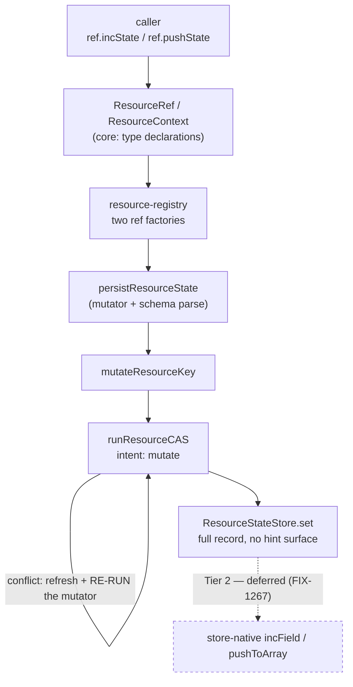

# FIX-1269 — Resource handles lack `incState` / `pushState`

| | |
|---|---|
| **Issue** | [FIX-1269](https://linear.app/fixpoint-labs/issue/FIX-1269/resource-handles-lack-incstatepushstate-so-the-same-intent-needs-two) (`Feature` · Medium) |
| **Epic** | [FIX-1157](https://linear.app/fixpoint-labs/issue/FIX-1157) — *Reconcile the two durable-storage primitives* · epic PR [#1365](https://github.com/fixpoint-labs/flow-state-dev/pull/1365) |
| **Branch / doc** | `spec/FIX-1269` · `spec/FIX-1269.md` |
| **Gate** | An approving human comment or review on the spec PR signs off Part I |

*Citations are against **`origin/main`**, read explicitly at the time of writing. **Cited by symbol; any line number is a hint.** No commit is pinned — a spec is implemented against `main`.*

---

## Part I — The Case *(for the human)*

### 1. Problem — why it matters, why now

FSD keeps durable data two ways: a per-session bag of values, and named resources. Both are ordinary places for a counter or a running list. Only one lets you say **"add one"** or **"append this"** — on the other you read the value, change it yourself, and write the whole thing back. Nothing about the data decides which you get; it's which storage you happened to pick. Moving a feature between them means rewriting working code for no visible reason.

**Why now.** The write-up explaining the two side by side is written and waiting on this. Published today it explains a gap; published after, it documents two methods. That ordering is a stamped owner decision (D-6), which puts this on the critical path.

### 2. Solution in plain terms

Add increment and append to the resource handles, under the names the bag already uses. They run on machinery resources already have — same guarded write, same conflict handling, same durability.

**As safe as every other resource write, and no faster.** Each call is a single guarded mutation, so two callers incrementing one counter both land. What they don't buy is throughput: concurrent writers still resolve by retrying, exactly as today. The gain is that one intent stops needing two APIs.

**Philosophy** — tenet 1 (coherence): two primitives disagreeing about which verbs exist is the incoherence, and it costs a reader every crossing. Tenet 2 (composition): built from the existing write path, no new primitive. **In tension with tenet 3** (earn every addition), whose test is "is this a duplicate route?" — increment *is* reachable today via `updateState`. The answer: this is the **named** route to a job that has only an unnamed one, and that route already exists on the sibling primitive. `updateState` stays, as the escape hatch for mutations without a name.

### 6. Decisions & rules — the sign-off surface

1. **A verb whose target field holds the wrong kind of value refuses the write and leaves the stored value alone.** Appending to something that isn't a list, or incrementing something that isn't a number, fails loudly instead of guessing.
   *Rejected:* silently coercing — non-list becomes empty list, non-number becomes zero. That is what the bag's increment does today, and a POC on the real path measured the cost: the previous value is destroyed and the call reports success ([§7](#7-technical-design)).
   *Locks in:* an error becomes published contract for anyone whose schema permits more than one shape in a field. Relaxing an error into a coercion later is cheap and additive; tightening a coercion into an error breaks callers who came to rely on it. We are buying the reversible direction.

2. **The verbs are typed against the resource's own state shape, not copied from the bag's untyped signatures.** A field name that doesn't exist on the resource is a build error.
   *Rejected:* signatures byte-identical to the bag's, which take bare strings — the issue's own "same signatures" wording. The resource handles already type every other mutator against their state, so the bag's looser spelling would fork the resource side's own convention to close a gap with the other primitive.
   *Locks in:* the two primitives' verbs read alike and mean the same, but are not one shared type. Moving code between them raises a compile error on a field that doesn't fit, instead of a silent no-op at runtime.

**Non-goals** — store-native delta verbs and any contention win (Tier 2 / [FIX-1267](https://linear.app/fixpoint-labs/issue/FIX-1267), deferred); any change to conflict semantics; `getOrPatchState`; and the architecture-doc paragraph comparing the two surfaces, which is [FIX-1154](https://linear.app/fixpoint-labs/issue/FIX-1154)'s.

**Deliberately not fixed here:** the verbs inherit `updateState`'s known deletion defect — a write issued after a delete can revive the resource. It is live on `main` today with no new verb involved and belongs to **[FIX-1258](https://linear.app/fixpoint-labs/issue/FIX-1258)** at the shared predicate; fixing it inside these verbs would repair one entry point and hide two ([§12](#12-dependencies-open-questions--follow-ups)).

**Size:** Small — 2 production files · 8 test behaviours · 1 doc surface · 1 PR.

---

### 3. Tradeoffs & alternatives

**Alternative: ship on `ResourceRef` only.** Cheaper, and it covers the handle most code holds — but `ResourceContext` is the type our documentation sends shared-helper authors to (`resources-and-client-data.md` works its example against `ContextType`), and live consumers are already typed that way: `@flow-state-dev/memory`'s `WmRef`, `@thought-fabric/core`'s `PerspectiveObservationsRef`. Verbs on one type reopen this gap one type over. Settled at epic altitude, recorded here because it explains the size.

**The simpler approach: document the gap and stop.** Genuinely on the table — it was the owner's answer for a day (D-6 = B) before being amended to A. Insufficient because an API whose absence you have to explain is worse than the two methods that remove the explanation.

**Where the complexity is:** not the increment — the wrong-typed target, which is what decision 1 exists for. The bag is not one behaviour to match: its append refuses a wrong-typed field, its increment silently overwrites one. "Match the bag" is not a followable instruction, which is why this is a decision rather than an implementation detail.

### 4. Focus practices (1–5)

1. **BP-035 (second-path checklist)** — the second path here is the *wrong-typed target*, and it is the whole of decision 1. A suite that only appends to real arrays proves nothing about it.
2. **BP-003 (verification evidence)** — the atomicity claim is the one this change's documentation must not get backwards, and reading the driver is not evidence for it. It is pinned by a run ([§7](#7-technical-design)).
3. **Conformance over taste (CLAUDE.md §8)** — the resource handles have an established convention for mutators: typed against `TState`, returning `Promise<void>`, no-op verified internally. The new verbs join it rather than importing the bag's.

### 5. What using it looks like

**Today, incrementing a counter on a resource:**

```ts
await ctx.resources.usage.updateState((s) => ({ ...s, calls: s.calls + 1 }));
```

**What this spec proposes:**

```ts
await ctx.resources.usage.incState({ calls: 1 });
await ctx.resources.usage.pushState("errors", "rate_limited");
```

**The same call in a shared helper — the case that needs `ResourceContext`, and the reason both types are in scope:**

```ts
type UsageCtx = typeof usageResource.ContextType;

async function recordCall(ctx: UsageCtx, outcome: string) {
  await ctx.incState({ calls: 1 });          // today: not on this type at all
  await ctx.pushState("outcomes", outcome);
}
```

The bag's spelling is unchanged and still returns a boolean; the resource verbs return `void`, matching every other resource mutator (settled at epic altitude).

---

## Part II — The Build Plan *(for the implementing agent)*

### 7. Technical design

The verbs are two more mutator bodies handed to the write path resources already use. Nothing new sits underneath them, and nothing on the store interface changes — that is the Tier 1 / Tier 2 line the epic draws, and it is what makes the "no contention win" claim true.



- **`@flow-state-dev/core`** — `ResourceRef` and `ResourceContext` each declare the two verbs. `ResourceContext` has **no runtime construction site anywhere in the engine**; it is a type-level view that a `ResourceRef` structurally satisfies, so this half is a pure type addition with no runtime cost.
- **`@flow-state-dev/engine`** — `resource-registry.ts` builds `ResourceRef`s in **two** places, the collection-instance factory and the single-resource handle. Adding the verbs to the `ResourceRef` interface makes both mandatory at compile time, so collection instances get them by construction.
- **Untouched:** `runResourceCAS` and its conflict policy, `ResourceStateStore` and every adapter, the scope-state side, `getOrPatchState`.

**Where the verbs sit relative to the CAS loop is the whole atomicity claim.** The mutator is handed to the driver, not applied before it: on a conflict the driver refreshes the container to the winner's row and **re-runs the mutator against it**. A successful call is therefore a single CAS-guarded mutation, which is the definition `docs/architecture/state-and-scopes.md` already uses under *Atomicity Guarantees*. Getting this backwards in the docs would push callers into the external read-then-write these verbs exist to remove.

**Solution sketch — pseudocode. Illustrative, not the contract.**

```
in each resource-ref factory, beside the existing patch/set/update verbs:

    incState(increments):
        hand the write path a mutator:
            for each (field, delta):
                if the stored field is not a number  → refuse   (decision 1)
                otherwise field ← stored + delta
        (same serialization, same change notification, as patchState)

    pushState(field, value):
        hand the write path a mutator:
            if the stored field is not a list and is not absent → refuse
            otherwise field ← stored list + [value]

absent field: treated as 0 / [] — that is first touch, not a wrong type
```

What this asks a reviewer: *is refusing inside the mutator the right layer, or should the wrong-typed target be caught before the write is attempted?* Refusing inside the mutator means the check re-runs on every CAS retry against the freshest state, which is the property that makes it correct under contention — but it also means the refusal surfaces from inside the driver.

#### POC — what it showed

`spec-poc/FIX-1269-handle-verbs/non-array-target.poc.test.ts` on this PR — 7 rows, all passing. Run it with:

```
pnpm install && cd spec-poc/FIX-1269-handle-verbs && ../../node_modules/.bin/vitest run
```

It was built for decision 1, and it changed the decision from "match the bag" to a contract of our own:

1. **The bag's two verbs disagree.** `pushState` onto a non-array **refuses** and leaves the prior value intact (memory and SQLite alike — [FIX-1255](https://linear.app/fixpoint-labs/issue/FIX-1255) is Done and closed that divergence). `incState` onto a non-number **silently coerces to zero and overwrites** on both. FIX-1255 named the increment case and explicitly left it out of scope. So "same semantics as the bag's" is not a specifiable target.
2. **The trap is concrete.** Porting the bag's container-level mutator body to a resource destroys the scalar and reports success — measured, not argued. That is the default an implementer lands on by copying, which is why decision 1 is stated rather than left implicit.
3. **The resource path is adapter-uniform.** The same mutator through memory and SQLite produces byte-identical state, because the resource write always persists a full record and has no hint surface to route a store delta verb through. FIX-1255's per-adapter divergence therefore *cannot* be inherited — and equally, the behaviour is ours to choose rather than to match.
4. **The problem is narrow.** A closed `z.array(...)` field refuses the scalar before any append can happen, so the wrong-typed target is only reachable on a resource whose schema permits more than one shape.

**The atomicity claim is pinned on the sibling branch, not re-run here.** `spec-poc/FIX-1154-resource-mutation-verbs/policy-rows.poc.test.ts` (PR [#1445](https://github.com/fixpoint-labs/flow-state-dev/pull/1445)) drives increment and append as mutator bodies over this exact path and shows two contexts both landing, plus the retry-exhaustion and deleted-resource rows. Its own header states that those rows characterize FIX-1269's verbs in advance. A second copy here would be a second carrier of one result.

### 8. Implementation sequence

1. **Declare the verbs on both types** in `packages/core/src/types/resource.ts`, typed per decision 2, returning `Promise<void>`, with JSDoc that states the atomicity contract and the decision-1 refusal. *Test:* a type-test pinning that both handle types expose the same mutation verb set (see §10). *Depends on:* nothing. Expect the engine to stop compiling — that is the check that both ref factories were found.
2. **Implement both verbs in both ref factories** in `packages/engine/src/context/resource-registry.ts`, beside the existing mutators and following their shape: serialize the write, hand the mutator to the persist helper, notify the change seam only when the write committed. *Test:* the §10 behaviours on a single resource and on a collection instance. *Depends on:* 1.
3. **The refusal**, per decision 1 — including the absent-field case, which is first touch and must **not** refuse. *Test:* the wrong-typed rows, and that the stored value survives the refusal. *Depends on:* 2.
4. **Changeset and the README line** (§11). *Depends on:* 3.

*(Each step cites the decision it implements rather than restating it — the contract lives in §6 alone.)*

### 9. Edge cases & error handling

| Case | Expected |
|---|---|
| Field absent | First touch: `incState` treats it as `0`, `pushState` as `[]`. Not a wrong type, not a refusal |
| Field holds the wrong kind | Refuse; stored value untouched (decision 1) |
| `incState({ n: 0 })`, or appending nothing changes nothing | Deep-equal no-op — the existing path suppresses the write and the `resource_change` emit. Inherited, not new |
| Multi-field `incState` where one field is wrong-typed | The whole call refuses; no partial application. One call is one mutation |
| Concurrent callers on one field | Both land — the loser re-runs its mutator against the winner's state |
| Contention outlasting the retry budget | `ConcurrentModificationError`, as every resource write does today |
| The resource was deleted mid-write | `ResourceDeletedError` when a live version was held — the existing terminal path |
| `writable: false` resource | Refused with the existing read-only error, same as `patchState` |
| Schema rejects the mutator's output | The existing write-path validation error; the verbs add no second validation layer |

**Taxonomy:** the wrong-typed refusal is a **non-retryable** caller error — retrying cannot change a stored value's type. Contention and deletion outcomes are unchanged from the existing path and keep their current retryability.

**Second path (BP-035):** every behaviour is exercised on a **collection instance** as well as a single resource. The two ref factories are separate code, and a suite that only covers singles is the obvious miss here.

### 10. Testing strategy

**No goal check applies.** This adds no runtime capability a flow can reach that it could not reach before — the same mutations are expressible today through `updateState`, which the §5 before/after shows. The behaviour worth proving is the contract, and that is a CI-spec surface. The one claim a real-path run *would* have covered — that concurrent callers both land — is pinned by an existing POC on the real path (§7).

**CI specs** (the behaviours, not the test names):

- **one behaviour per decision in §6**, in observable terms
- **the wrong-typed target**, for each verb, on a schema that permits it: the call refuses **and the stored value is still there afterwards**. The second half is the one that matters — a test asserting only the throw would pass against an implementation that threw after writing
- **the absent field is not a wrong type** — first touch on both verbs, which is the case a naive type guard breaks
- **the second path** (BP-035): every behaviour on a collection instance as well as a single resource
- **both handle types carry both verbs** — a type-test, following `packages/core/src/types/tests/*.type-test.ts`. This is what keeps the two types in step; the alternative, extracting a shared base, refactors two widely-read public declarations for a two-method addition (see §12)
- **what must not change**: `updateState` / `patchState` / `setState` behave exactly as today, and a no-op increment still suppresses its change event

**Discipline:** `tdd`. The seam is `createExecutionContext` with real stores — reachable from a vitest spec with no HTTP server, exactly as the POC and the existing engine resource suites do it.

### 11. Documentation plan

- **EXTEND** `packages/core/README.md` — the `ResourceRef` methods bullet gains the two verbs in its existing sentence: what they do, that they are atomic per write, that they return `void`, and the decision-1 refusal. One line, not a section.
- **JSDoc** on both declarations in `packages/core/src/types/resource.ts`, per BP-007. This is where the atomicity contract is stated for people who autocomplete rather than read READMEs.
- **Changeset** (BP-022), `minor` — user-facing public surface.
- **Explicitly NOT touched:** `docs/architecture/state-and-scopes.md`. The paragraph comparing the two mutation surfaces is FIX-1154's, and D-6 Decision 3 says the docs follow the verbs. Editing it here is how two children silently rewrite one paragraph.
  *(Also not `packages/engine/README.md` → "State mutations", which describes scope-state persist postures and concurrency drivers, not resource writes.)*

*Voice risk:* the tempting sentence is that these make resource writes atomic. They don't — resource writes already are. These give the atomicity a name.

### 12. Dependencies, open questions & follow-ups

**Dependencies:** none blocking. FIX-1269 is upstream of FIX-1154's documentation, not downstream of anything.

**Open questions:** none.

**Settled claims:**

- **Settled:** the resource verbs would inherit FIX-1255's per-adapter `pushToArray` divergence (the risk named on the issue) — **REFUTED**: the resource write path has no hint surface and always persists a full record, so memory and SQLite produce identical state. FIX-1255 is also Done, and closed the bag-side divergence to *refuse*. (§7, POC row 3.)
- **Settled:** "same semantics as the bag's" is a specifiable target for the wrong-typed case — **REFUTED**: the bag's append refuses and its increment silently coerces. There is no single behaviour to match, which is what makes decision 1 necessary. (§7, POC row 1.)

**Follow-ups (flagged, not built):**

- **Coordination, theme 3.** If FIX-1154's documentation publishes *before* this merges, it will have stated the gap as open, and **FIX-1269 owns the one-paragraph correction** — the epic assigns the restore to whichever child lands second. It is a correction of a statement this merge makes false, not a transfer of FIX-1154's documentation scope.
- **Not extracting a shared base type.** `ResourceRef` and `ResourceContext` already duplicate three mutators; this adds a fourth and fifth. A shared base would make future drift structurally impossible, and the epic explicitly left the call here. Declining it: it refactors two heavily-consumed public declarations for a two-method addition, and the type-test in §10 buys the same guarantee for far less. If a *third* handle type ever appears, that is the moment to extract one — and `UpdateStateRunner` in `core/src/helpers/update-state-with.ts` is the existing precedent for the structural-subset shape to reach for.
- **The bag's `incState` silently destroys a wrong-typed value** (POC row 1). Real, measured, and out of scope here — it is a bag-side defect on the store delta verb, the neighbour FIX-1255 named and deferred. Worth its own issue; this spec does not file one.
- **Deferred, not absent:** store-native delta verbs (FIX-1267), which would re-implement these two underneath without changing their signatures.

---

## Spec evolution

- **Spec drafted** — scoped to the handle surface on both public resource types per the epic's Tier 1 boundary; inherited the `Promise<void>` return and the atomicity framing rather than re-deriving them.
- **After POC** — decision 1 changed from *match the bag* to *refuse the write*, because a run showed the bag has no single behaviour to match: its append refuses a wrong-typed target and its increment silently overwrites one. The same run refuted the FIX-1255 inheritance risk the issue flagged, so it moved from a design constraint to a settled claim.
