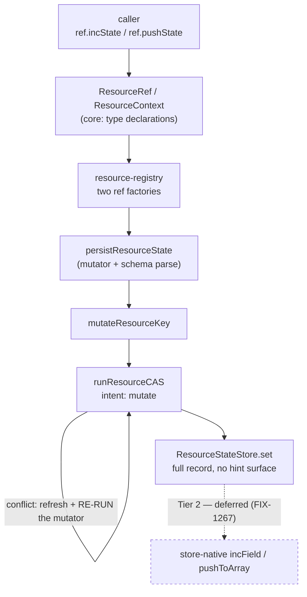

# FIX-1269 — Resource handles lack `incState` / `pushState`

| | |
|---|---|
| **Issue** | [FIX-1269](https://linear.app/fixpoint-labs/issue/FIX-1269/resource-handles-lack-incstatepushstate-so-the-same-intent-needs-two) (`Feature` · Medium) |
| **Epic** | [FIX-1157](https://linear.app/fixpoint-labs/issue/FIX-1157) — *Reconcile the two durable-storage primitives* · epic PR [#1365](https://github.com/fixpoint-labs/flow-state-dev/pull/1365) |
| **Branch / doc** | `spec/FIX-1269` · `spec/FIX-1269.md` |
| **Gate** | An approving human comment or review on the spec PR signs off Part I |

---

## Part I — The Case *(for the human)*

### 1. Problem — why it matters, why now

FSD keeps durable data two ways: a per-session bag of values, and named resources. Both are ordinary homes for a counter or a running list. Only the bag lets you say **"add one"** or **"append this"** — on a resource you read the value, change it, and write it all back. The storage decides that, not the data, so moving a feature between them means rewriting working code for no visible reason.

**Why now.** The write-up comparing the two is waiting on this: published today it explains a gap, published after it documents two methods (D-6).

### 2. Solution in plain terms

Add increment and append to the resource handles, under the names the bag already uses, on the write path resources already have — no new primitive.

**As safe as every other resource write, and no faster.** Each call is a single guarded mutation, so two callers incrementing one counter both land — on the memory, SQLite and Postgres stores. **The filesystem store's guard holds only within one process**, so two processes over one directory can still lose an increment; that limit is today's, and §11 states it rather than promising past it. The gain is not throughput — concurrent writers still retry — it is that one intent stops needing two APIs.

### 6. Decisions & rules — the sign-off surface

1. **A verb whose target field holds the wrong kind of value refuses the write and leaves the stored value alone.** Appending to something that isn't a list, or incrementing something that isn't a number, fails loudly instead of guessing.
   *Judged against the row the write commits against, never a stale snapshot* — a caller whose cached value was replaced meanwhile refreshes and re-runs first, refusing only if it still mismatches. Otherwise a write that would have succeeded fails because someone else fixed the field ([§9](#9-edge-cases--error-handling)).
   *Rejected:* silently coercing — non-list becomes empty list, non-number becomes zero. That is what the bag's increment does today, and a POC on the real path measured the cost: the previous value is destroyed and the call reports success ([§7](#7-technical-design)).
   *Locks in:* an error becomes published contract for anyone whose schema permits more than one shape in a field. Relaxing an error into a coercion later is cheap and additive; tightening a coercion into an error breaks callers who came to rely on it. We are buying the reversible direction.

2. **The verbs are typed against the resource's own state shape, not copied from the bag's untyped signatures.** A field name that doesn't exist on the resource is a build error, and so is a value of the wrong type: `pushState` takes the named field's element type, `incState` a partial keyed to number-valued fields — as `patchState` already takes `Partial<TState>`.
   *Rejected:* signatures byte-identical to the bag's, which take bare strings — the issue's own "same signatures" wording. The resource handles already type every other mutator against their state, so the bag's looser spelling would fork the resource side's own convention to close a gap with the other primitive.
   *Locks in:* the two primitives' verbs read alike and mean the same, but are not one shared type. Moving code between them raises a compile error on a field that doesn't fit, instead of a silent no-op at runtime.

**Non-goals** — store-native delta verbs and any contention win (Tier 2 / [FIX-1267](https://linear.app/fixpoint-labs/issue/FIX-1267), deferred); conflict semantics; `getOrPatchState`; and the architecture-doc paragraph comparing the two surfaces, which is [FIX-1154](https://linear.app/fixpoint-labs/issue/FIX-1154)'s.

**Deliberately not fixed here:** the verbs inherit `updateState`'s known deletion defect — a write after a delete can revive the resource. Live on `main` today, owned by **[FIX-1258](https://linear.app/fixpoint-labs/issue/FIX-1258)** ([§12](#12-dependencies-open-questions--follow-ups)).

**Size:** Small — 2 production files · 9 test behaviours · 1 goal check · 1 doc surface · 1 PR.

---

### 3. Tradeoffs & alternatives

**Document the gap and stop** was the owner's answer for a day (D-6 = B, amended to A): an API whose absence you have to explain is worse than the two methods that remove it. `updateState` stays as the escape hatch. Both handle types are in scope — settled at epic altitude, and it explains the size.

### 4. Focus practices (1–5)

1. **BP-035 (second path)** — the wrong-typed target is decision 1 entire.
2. **BP-003 (evidence)** — atomicity and refusal are pinned by runs, not by reading the driver ([§10](#10-testing-strategy)).
3. **Conformance (CLAUDE.md §8)** — the verbs join the resource mutator convention, not the bag's.

### 5. What using it looks like

**Today, incrementing a counter on a resource:**

```ts
await ctx.resources.usage.updateState((s) => ({ ...s, calls: s.calls + 1 }));
```

**With these verbs:**

```ts
await ctx.resources.usage.incState({ calls: 1 });
await ctx.resources.usage.pushState("errors", "rate_limited");
```

The bag's spelling is unchanged and still returns a boolean; the resource verbs return `void`, matching every other resource mutator.

---

## Part II — The Build Plan *(for the implementing agent)*

*Citations are against **`origin/main`**, read explicitly at the time of writing. **Cited by symbol; any line number is a hint.** No commit is pinned — a spec is implemented against `main`.*

### 7. Technical design

The verbs are two more mutator bodies handed to the write path resources already use. Nothing new sits underneath them, and nothing on the store interface changes — that is the Tier 1 / Tier 2 line the epic draws, and it is what makes the "no contention win" claim true.



- **`@flow-state-dev/core`** — `ResourceRef` and `ResourceContext` each declare the two verbs. `ResourceContext` has **no runtime construction site anywhere in the engine**; it is a type-level view that a `ResourceRef` structurally satisfies, so this half is a pure type addition with no runtime cost.
- **`@flow-state-dev/engine`** — `resource-registry.ts` builds `ResourceRef`s in **two** places, the collection-instance factory and the single-resource handle. Adding the verbs to the `ResourceRef` interface makes both mandatory at compile time, so collection instances get them by construction.
- **Untouched:** `runResourceCAS` and its conflict policy, `ResourceStateStore` and every adapter, the scope-state side, `getOrPatchState`.

**Where the verbs sit relative to the CAS loop is the whole atomicity claim.** The mutator is handed to the driver, not applied before it: on a conflict the driver refreshes the container to the winner's row and **re-runs the mutator against it**. A successful call is therefore a single CAS-guarded mutation, which is the definition `docs/architecture/state-and-scopes.md` already uses under *Atomicity Guarantees*. Getting this backwards in the docs would push callers into the external read-then-write these verbs exist to remove.

**Solution sketch — pseudocode. Illustrative, not the contract.**

```
in each resource-ref factory, beside the existing patch/set/update verbs:

    incState(increments):
        hand the write path a mutator:
            for each (field, delta):
                if the stored field is not a number  → refuse   (decision 1)
                otherwise field ← stored + delta
        (same serialization, same change notification, as patchState)

    pushState(field, value):
        hand the write path a mutator:
            if the stored field is not a list and is not absent → refuse
            otherwise field ← stored list + [value]

absent field: treated as 0 / [] — that is first touch, not a wrong type

"refuse" above means refuse against a CONFIRMED basis: a mismatch seen on a
stale cached row must refresh and re-run before it becomes an error (§7).
```

**Resolved in review — the layer is right and the naive semantics are wrong.** Refusing inside the mutator is correct: a check run *before* the write would judge this context's cached state, which a concurrent writer may already have replaced.

But the mutator is called **unguarded** — `runResourceCAS` does `const next = await mutator(current)` with no `try`, and `persist` is only reached afterwards. A throw from inside the mutator therefore propagates straight out: the driver never observes a conflict, never refreshes, and never re-runs. The intuition that "the check re-runs on every CAS retry against the freshest state" is **false for a throwing mutator** — throwing is exactly what prevents the retry.

So a refusal must be **conditional on a confirmed basis**, per decision 1: a mismatch against the cached row is not yet an error. The verb must establish that the row it judged is the row it would have committed against, and refuse only when the mismatch survives a refresh. Otherwise a caller whose cached value was a string, replaced by a number elsewhere since, gets a terminal wrong-type error about a value that is no longer stored. *The mechanism is the implementer's; the contract is that a stale mismatch retries and a confirmed mismatch refuses.*

#### POC — what it showed

`spec-poc/FIX-1269-handle-verbs/non-array-target.poc.test.ts` on this PR — 8 rows, all passing. Run it with:

```
pnpm install && cd spec-poc/FIX-1269-handle-verbs && ../../node_modules/.bin/vitest run
```

It was built for decision 1, and it changed the decision from "match the bag" to a contract of our own:

1. **The bag's two verbs disagree.** `pushState` onto a non-array **refuses** and leaves the prior value intact (memory and SQLite alike — [FIX-1255](https://linear.app/fixpoint-labs/issue/FIX-1255) is Done and closed that divergence). `incState` onto a non-number **silently coerces to zero and overwrites** on both. FIX-1255 named the increment case and explicitly left it out of scope. So "same semantics as the bag's" is not a specifiable target.
2. **The trap is concrete, for both verbs.** Porting the bag's container-level mutator body to a resource destroys the stored value and reports success — measured for append *and* for increment, so decision 1's two halves rest on the same evidence rather than one being implied by the other. That is the default an implementer lands on by copying, which is why decision 1 is stated rather than left implicit. Note what the symmetric row adds: on the bag, append refuses and increment overwrites; on a resource, the naive port makes **both** overwrite — so "match the bag" would not even reproduce the bag's own split behaviour.
3. **The resource path is adapter-uniform.** The same mutator through memory and SQLite produces byte-identical state, because the resource write always persists a full record and has no hint surface to route a store delta verb through. FIX-1255's per-adapter divergence therefore *cannot* be inherited — and equally, the behaviour is ours to choose rather than to match.
4. **The problem is narrow.** A closed `z.array(...)` field refuses the scalar before any append can happen, so the wrong-typed target is only reachable on a resource whose schema permits more than one shape.

**The atomicity claim is pinned on the sibling branch, not re-run here.** `spec-poc/FIX-1154-resource-mutation-verbs/policy-rows.poc.test.ts` (PR [#1445](https://github.com/fixpoint-labs/flow-state-dev/pull/1445)) drives increment and append as mutator bodies over this exact path and shows two contexts both landing, plus the retry-exhaustion and deleted-resource rows. Its own header states that those rows characterize FIX-1269's verbs in advance. A second copy here would be a second carrier of one result.

### 8. Implementation sequence

1. **Declare the verbs on both types** in `packages/core/src/types/resource.ts`, typed per decision 2, returning `Promise<void>`, with JSDoc that states the atomicity contract and the decision-1 refusal. *Test:* a type-test pinning that both handle types expose the same mutation verb set (see §10). *Depends on:* nothing. Expect the engine to stop compiling — that is the check that both ref factories were found.
2. **Implement both verbs in both ref factories** in `packages/engine/src/context/resource-registry.ts`, beside the existing mutators and following their shape: serialize the write, hand the mutator to the persist helper, notify the change seam only when the write committed. *Test:* the §10 behaviours on a single resource and on a collection instance. *Depends on:* 1.
3. **The refusal**, per decision 1 — including the absent-field case (first touch, must **not** refuse) and the confirmed-basis rule: a mismatch on a stale cached row refreshes and re-runs before it becomes an error (§7). *Test:* the wrong-typed rows, the stale-mismatch row, and that the stored value survives a refusal. *Depends on:* 2.
4. **The goal check** (§10) — a provider-free handler flow driving both verbs under `fsdev run`, proving the verbs are reachable on a live handle and not merely declared. *Depends on:* 2.
5. **Changeset and the README line** (§11), including the adapter-scoped atomicity wording. *Depends on:* 3, 4.

*(Each step cites the decision it implements rather than restating it — the contract lives in §6 alone.)*

### 9. Edge cases & error handling

| Case | Expected |
|---|---|
| Field absent | First touch: `incState` treats it as `0`, `pushState` as `[]`. Not a wrong type, not a refusal |
| Field holds the wrong kind, confirmed | Refuse; stored value untouched (decision 1) |
| Field holds the wrong kind on a **stale** cached row | Not an error yet — refresh and re-run the mutator; refuse only if the refreshed row still mismatches ([§7](#7-technical-design)) |
| `incState({ n: 0 })`, or appending nothing changes nothing | Deep-equal no-op — the existing path suppresses the write and the `resource_change` emit. Inherited, not new |
| Multi-field `incState` where one field is wrong-typed | The whole call refuses; no partial application. One call is one mutation |
| `incState` result is non-finite (`±Infinity`) | Refuse; stored value untouched. Reachable with no non-finite argument anywhere — two finite operands can overflow. **Not** covered by the schema row below: `z.number()` *accepts* `±Infinity` (it does reject `NaN`) |
| Concurrent callers on one field | Both land — the loser re-runs its mutator against the winner's state |
| Contention outlasting the retry budget | `ConcurrentModificationError`, as every resource write does today |
| The resource was deleted mid-write | `ResourceDeletedError` when a live version was held — the existing terminal path |
| `writable: false` resource | Refused with the existing read-only error, same as `patchState` |
| Schema rejects the mutator's output | The existing write-path validation error; the verbs add no second validation layer |

**Taxonomy:** a **confirmed** wrong-typed refusal is a non-retryable caller error. Note the qualifier — the older phrasing ("retrying cannot change a stored value's type") is wrong: another writer can change it, which is precisely why the refusal waits for a confirmed basis (§7). Contention and deletion outcomes are unchanged from the existing path and keep their current retryability.

**Refusal surface — one shape, not three.** The bag's store-level `pushToArray` throws a plain `Error` reading `pushToArray target at path[<field>] is not an array (got <type>)`, identically in the memory, SQLite, filesystem and Postgres adapters, and the store conformance suite pins `/not an array/`. The resource path never reaches that verb (it always persists a full record), so these verbs raise their **own** refusal — but they match its wording rather than inventing a third: message pattern `/not an array/` for `pushState` and `/not a number/` for `incState`, naming the field and the type found. The non-finite refusal joins the same family rather than inventing a fourth shape — `/not finite/`, naming the field and the value. Whether these are bare `Error`s or `FlowError`s with a `code` (as `resource_read_only` already is) is the implementer's call; what §10 pins is that the verbs refuse recognisably and leave the stored value intact.

**Non-finite results are refused because the adapters disagree about them.** `z.number()` accepts `±Infinity`, so the schema-validation row does not catch it — and what happens next depends on where the write lands. The in-memory store keeps `Infinity`; SQLite, Postgres and the filesystem store serialize through JSON, where `Infinity` becomes `null`. The same call therefore leaves *different stored state on different adapters*, which is the divergence this epic exists to close showing up inside the feature meant to close it. That is what makes it a correctness bug rather than a taste call. It needs no non-finite argument to reach: two finite operands can overflow (`Number.MAX_VALUE * 2` is `Infinity`).

This extends decision 1's *refuse rather than corrupt* principle to an adjacent case; it is **not** a wrong-typed target (`Infinity` is a correctly-typed number) and changes neither decision.

**The check is on the result, not the delta.** A non-finite delta always yields a non-finite result, so a result check subsumes a delta check — and only a result check catches overflow from two finite operands, which a delta check cannot see by construction. One check, not two. An implementer may still reject a non-finite delta early for a clearer message; that is error wording, and theirs.

**Second path (BP-035):** every behaviour is exercised on a **collection instance** as well as a single resource. The two ref factories are separate code, and a suite that only covers singles is the obvious miss here.

### 10. Testing strategy

**Goal check: required.** `AGENTS.md` → "Verifying flow changes during development" puts **resource state ops** in the `fsdev run` row, and that is what this change adds. An earlier draft of this spec declined a goal check on the grounds that the mutations are already expressible via `updateState`; that reasoning was wrong in a way worth naming, because it confuses *contract* with *wiring*. The POC and the CI specs drive `createExecutionContext` directly, so a verb that was declared but never actually reached a live handle — missing from one of the two ref factories, or lost at the package boundary — would leave every one of those rows green.

- **The check:** a provider-free handler flow (no model calls) that runs `incState` and `pushState` on a declared resource and reads the state back, exercised with `fsdev run`.
- **Pass criteria:** the run reports the mutated state, and the counter and list hold the expected values — proving the verbs exist on the handle the engine actually hands a block, not merely on the type.

The CI specs below stay alongside it: the goal check proves reachability, the specs prove the contract.

**CI specs** (the behaviours, not the test names):

- **one behaviour per decision in §6**, in observable terms
- **the wrong-typed target**, for each verb, on a schema that permits it: the call refuses **and the stored value is still there afterwards**. The second half is the one that matters — a test asserting only the throw would pass against an implementation that threw after writing
- **the absent field is not a wrong type** — first touch on both verbs, which is the case a naive type guard breaks
- **a stale wrong-type does not refuse** — a caller holding a cached scalar that another writer has since replaced with a valid list/number completes its write instead of failing terminally. This is the row that distinguishes decision 1 as specified from the naive type check, and it fails against an implementation that throws on the first pass
- **the non-finite boundary** — `incState` refuses when the result is `±Infinity`, both when the caller passes it directly and when two finite operands overflow to it, **and the stored value is still there afterwards**. The second half carries the weight, exactly as on the wrong-typed rows: a test asserting only the throw would pass against an implementation that threw after writing. Worth running on a JSON-serializing adapter as well as the in-memory one, since the divergence is what the row exists for
- **the second path** (BP-035): every behaviour on a collection instance as well as a single resource
- **both handle types carry both verbs** — a type-test, following `packages/core/src/types/tests/*.type-test.ts`. This is what keeps the two types in step; the alternative, extracting a shared base, refactors two widely-read public declarations for a two-method addition (see §12)
- **what must not change**: `updateState` / `patchState` / `setState` behave exactly as today, and a no-op increment still suppresses its change event

**Discipline:** `tdd`. The seam is `createExecutionContext` with real stores — reachable from a vitest spec with no HTTP server, exactly as the POC and the existing engine resource suites do it.

### 11. Documentation plan

- **EXTEND** `packages/core/README.md` — the `ResourceRef` methods bullet gains the two verbs in its existing sentence: what they do, that they are atomic per write, that they return `void`, and the decision-1 refusal. One line, not a section.
- **JSDoc** on both declarations in `packages/core/src/types/resource.ts`, per BP-007. This is where the atomicity contract is stated for people who autocomplete rather than read READMEs.
  **State the guarantee with its scope, not as a blanket promise.** "Concurrent callers both land" holds for the memory, SQLite and Postgres stores; the filesystem store serializes a record's read-check-write with a **per-id in-process lock** (`stores/filesystem/shared.ts` — "atomic within one process… Two processes over one directory still race"), so two processes sharing a directory can still lose an increment. That is the adapter's existing limitation, not one these verbs introduce — but this is the sentence customers will read as the atomicity contract, so it ships qualified. Writing it unqualified is the same defect class as the findings open on #1478.
- **Changeset** (BP-022), `minor` — user-facing public surface.
- **Explicitly NOT touched:** `docs/architecture/state-and-scopes.md`. The paragraph comparing the two mutation surfaces is FIX-1154's, and D-6 Decision 3 says the docs follow the verbs. Editing it here is how two children silently rewrite one paragraph.
  *(Also not `packages/engine/README.md` → "State mutations", which describes scope-state persist postures and concurrency drivers, not resource writes.)*

*Voice risk:* the tempting sentence is that these make resource writes atomic. They don't — resource writes already are. These give the atomicity a name. The second tempting sentence is that the guarantee is unconditional; see the adapter scope above.

### 12. Dependencies, open questions & follow-ups

**Dependencies:** none blocking. FIX-1269 is upstream of FIX-1154's documentation, not downstream of anything.

**Open questions:** none.

**Settled claims:**

- **Settled:** the resource verbs would inherit FIX-1255's per-adapter `pushToArray` divergence (the risk named on the issue) — **REFUTED**: the resource write path has no hint surface and always persists a full record, so memory and SQLite produce identical state. FIX-1255 is also Done, and closed the bag-side divergence to *refuse*. (§7, POC row 3.)
- **Settled:** "same semantics as the bag's" is a specifiable target for the wrong-typed case — **REFUTED**: the bag's append refuses and its increment silently coerces. There is no single behaviour to match, which is what makes decision 1 necessary. (§7, POC row 1.)
- **Settled:** a refusal thrown inside the mutator re-runs against refreshed state on every CAS retry — **REFUTED** by reading the driver: `runResourceCAS` calls the mutator unguarded and reaches `persist` only afterwards, so a throw propagates before any conflict is observed. This is why decision 1's refusal is qualified on a confirmed basis rather than left as a bare type check. (§7, §9.)

**Follow-ups (flagged, not built):**

- **Coordination, theme 3.** If FIX-1154's documentation publishes *before* this merges, it will have stated the gap as open, and **FIX-1269 owns the one-paragraph correction** — the epic assigns the restore to whichever child lands second. It is a correction of a statement this merge makes false, not a transfer of FIX-1154's documentation scope.
- **Not extracting a shared base type.** `ResourceRef` and `ResourceContext` already duplicate three mutators; this adds a fourth and fifth. A shared base would make future drift structurally impossible, and the epic explicitly left the call here. Declining it: it refactors two heavily-consumed public declarations for a two-method addition, and the type-test in §10 buys the same guarantee for far less. If a *third* handle type ever appears, that is the moment to extract one — and `UpdateStateRunner` in `core/src/helpers/update-state-with.ts` is the existing precedent for the structural-subset shape to reach for.
- **The bag's `incState` silently destroys a wrong-typed value** (POC row 1). Real, measured, and out of scope here — it is a bag-side defect on the store delta verb, the neighbour FIX-1255 named and deferred. Worth its own issue; this spec does not file one.
- **Deferred, not absent:** store-native delta verbs (FIX-1267), which would re-implement these two underneath without changing their signatures.

### 13. Review notes for the implementer

Below-the-bar spec-PR feedback, recorded verbatim, **not folded into the design**.

> - "The `let prev/post/committed → serializeResourceWrite(persist…) → notify` wrapper already appears verbatim **3× per factory** (`patchState` / `setState` / `updateState`) **× 2 factories** (`createNamespaceInstanceRef`, and the single-resource handle) = **6 copies on `main` today**. `incState` / `pushState` would make it **8**, with only the 5–8 line mutate closure actually varying per verb." — suggests a small per-factory `runWrite(mutate)` helper (mutate in, notify out) that the new verbs route through, **without needing to touch the three existing verbs**; cites **BP-024** (helper when the body varies, factory when only identity does), roughly −45 duplicated / +15 helper. — owner, on the spec PR

**For the implementer:** these are *inputs, not instructions.* Adopt, adapt, or discard — you owe no justification for discarding one (§6's Decisions bind you; these don't). The note above was flagged explicitly as **not** a request for sign-off, and the duplication count is the part worth keeping: it is measured, and it decides the call in one line where "consider extracting a helper" would not. Whether decision 1's refusal logic also lives in that helper is the same call, and equally yours.

---

## Spec evolution

- **Spec drafted** — scoped to the handle surface on both public resource types per the epic's Tier 1 boundary; inherited the `Promise<void>` return and the atomicity framing rather than re-deriving them.
- **After POC** — decision 1 changed from *match the bag* to *refuse the write*, because a run showed the bag has no single behaviour to match: its append refuses a wrong-typed target and its increment silently overwrites one. The same run refuted the FIX-1255 inheritance risk the issue flagged, so it moved from a design constraint to a settled claim.
- **After spec review** — decision 1 gained a *confirmed basis* qualifier, because reading `runResourceCAS` showed the mutator is called unguarded: a refusal thrown inside it propagates before any conflict is observed, so a caller with a stale snapshot would fail terminally on a value that is no longer stored. The §9 taxonomy line asserting the opposite was corrected. The atomicity guarantee was scoped to the adapters that actually provide it, since the filesystem store's read-check-write lock holds only within one process and §11 publishes that sentence to customers. The rejected goal check was reinstated as an `fsdev run` flow, per `AGENTS.md`, because the POC proves the mutator contract but nothing about whether the verbs are reachable on a live handle. Part I was cut to its budget.
