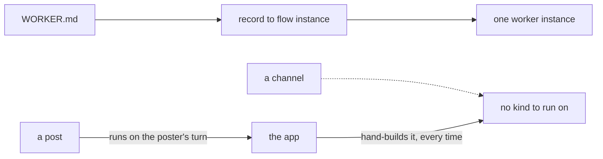
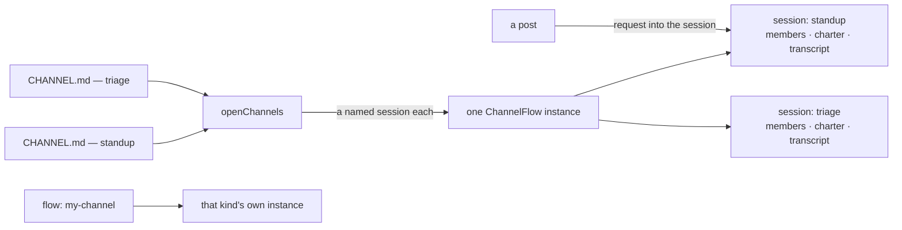
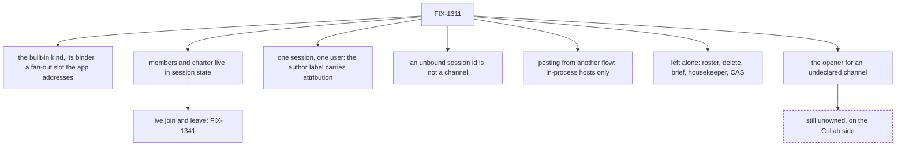

# FIX-1311 — Default ChannelFlow / channel kind floor

## 1. Today

A worker in a file becomes one running flow instance. A channel has no kind behind it, so
every app assembles one, and the conversation ends up split across whoever spoke last.

## 2. After (proposed)

A channel kind is a flow kind: one built-in kind, one instance. A channel is a named
session on it, carrying its own members and transcript. Your own kind adds an instance,
not a copy per file.

## 3. Where the decision fell

The floor is the kind, its binder, and an app-addressed fan-out slot. Three limits are
decided, not deferred: a session belongs to one user, an unbound id is refused, cross-flow
posting needs in-process dispatch. The undeclared opener stays unowned.
