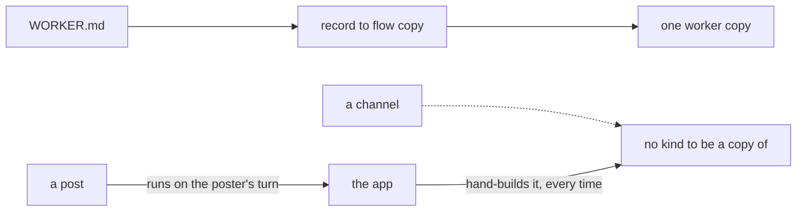
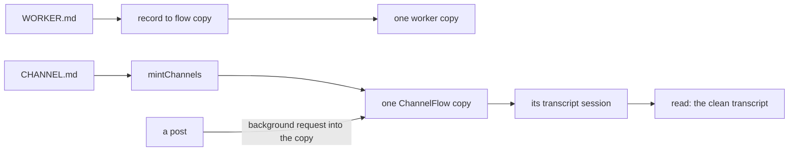
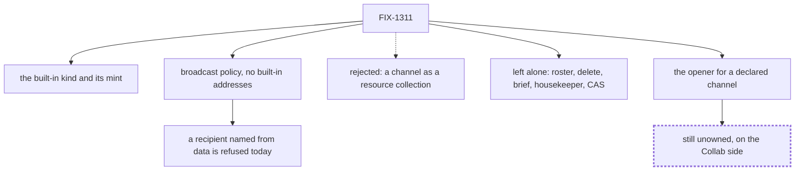

# FIX-1311 — Default ChannelFlow / channel kind floor

## 1. Today

A worker in a file becomes one running flow copy. A channel has no kind behind it, so
every app assembles one, and the conversation ends up split across whoever spoke last.

## 2. After (proposed)

A channel file with no kind named mints the built-in ChannelFlow. Posts run on the
channel, not on the poster, and the transcript has one home. This is the shape being
gated.

## 3. Where the decision fell

The floor is the kind, the mint, and one fan-out policy. Addresses wait on substrate.
The helper that opens a declared channel's session is the one thing here nobody owns.
