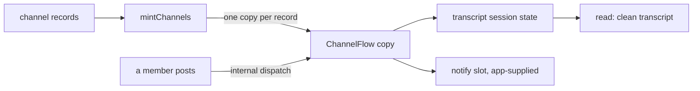

# FIX-1311: W3 — Default ChannelFlow / channel kind floor — Implementation Spec

## Part I — The Case *(for the human)*

### 1. Problem — why it matters, why now

Several agents working one topic, each reading what the others said, nobody owning a
row. We have no way to express that. A task board handles work that needs a claim and a
settlement; dispatch lets one session reach another. The many-participants-no-claim case
is built by hand, every time — including by this project, which runs its own coordination
on an external board for exactly this reason.

**Why now.** The channel file convention (FIX-1352) is approved and describes channels
that run a flow kind that does not exist. Nothing else in W3 moves until this lands.

### 2. Solution in plain terms

Put one channel in the box. A **channel** is a copy of a flow kind the framework ships —
`ChannelFlow` — and one channel is one copy, with its own session carrying the
conversation. Posting is a request into that copy, so the work and the record land on
the channel rather than on whoever posted. Reading gives back a clean list of messages,
separate from the machinery a session accumulates. A team that wants different behaviour
names their own kind on one line in the file, and it wins.

It ships no roster, no delete verb, and no brief, housekeeper or CAS. Where a channel
wakes its members, the framework carries the policy and the app supplies the addresses:
naming a recipient from stored data is something the substrate refuses today, and faking
it here would be the failure.

**Philosophy** — tenet 2 (composition over features): a channel is a flow kind over the
session, dispatch and state primitives that already ship, not a new Channel type beside
them. Tenet 3 (earn every addition): one kind and one minter, and the default arrives
without the app naming it, so the common case costs zero config lines. Tenet 5 (fix at
the owning layer): the keys a channel derives are refused at every door a record can
arrive through, not only at the file reader.

### 6. Decisions & rules — the sign-off surface

1. **A `CHANNEL.md` need not say which kind it runs. An omitted `flow:` selects the
   built-in ChannelFlow, and the built-in reaches the app's kinds map without the app
   naming it; a kind that *is* named but not registered still fails loudly.**
   *Rejected:* requiring `flow: channel` on every file, mirroring `WORKER.md` exactly. It
   would make "batteries-included default" untrue in the first file an author writes, and
   it is the same paper cut the parallel agent-kind epic rejected on its own surface
   (FIX-1359, Architect stamp on PR #1730). *Also rejected:* teaching `hireWorkforce` to
   do this instead of adding a small minter beside it — two other epics are changing that
   function right now.
   *Locks in:* the default is a promise we keep. Apps written against it omit the key, so
   we can add built-in kinds but can never remove the default without breaking every one
   of them. Reversible in the safe direction only — requiring the key later is breaking,
   relaxing it later would have been free.

2. **One channel is one flow copy with one named transcript session, and a post is a
   background request into that session — never work on the poster's turn.**
   *Rejected:* a post that appends to a shared collection and reacts on the poster's turn
   (the `#1627` shape). It keeps the conversation in whoever spoke last, which is how a
   transcript ends up split across sessions.
   *Locks in:* the channel's history has one home, so a transcript is readable as one
   thing and concurrent posts queue instead of racing. The bill: a channel has to have
   been opened before anyone can post into it, and the helper that opens one for a
   declared channel is not in this floor (§12) — so the first consumer opens it through
   the session route that already ships.

3. **Waking members ships as a policy with no addresses. The framework broadcasts one
   delivery per member per post and records refusals; the app supplies the recipients.**
   *Rejected:* a built-in recipient list read from channel membership. A dispatch target
   chosen from stored data is refused by construction (`packages/core/src/types/dispatch.ts`),
   and #1627 is the run that confirmed it; the only way to ship addresses here would be to
   invent the dynamic address the lock forbids.
   *Locks in:* an app that wants members woken writes one declaration per recipient kind
   until addresses-as-data lands (FIX-1320). Nothing about the channel's own surface
   changes when it does, so the wait costs authors wiring, not rework.

**Non-goals** — brief, housekeeper, retirement and CAS; the Collab roster (FIX-1341),
seeding, undeletability and a delete verb; the channel file convention and its reader
(FIX-1352); a task board assigning a channel as worker; cross-flow substrate and dynamic
dispatch targets; teams; and any `Channel` or `MessageBoard` L1 package type. Smart
resource + `reactTo` stays valid for non-conversation shared state and stays out of this
public surface.

**Size:** Medium — 6 production files · 11 test behaviours · 2 doc surfaces · 1 PR.

---

### 3. Tradeoffs & alternatives

**The simpler approach: ship no kind, only a recipe.** Document the composition #1627
proved and let each app assemble it — it is ~430 lines of ordinary user-space code. It
loses on one point that is not ergonomics: a `CHANNEL.md` that omits `flow:` has to
resolve to something, and a default kind is by definition framework-side. A recipe leaves
FIX-1352 declaring instances of nothing.

**The alternative on shape: a resource collection, not a flow kind.** The model this issue
carried until the owner replaced it. Rejected upstream, and the reason survives
independently: a collection has no session, so the transcript has no home and every post
runs on the poster's turn.

**Where the complexity is:** not the transcript. It is the two places the substrate does
not reach — a recipient named from data (decision 3) and a channel session that must
already exist (decision 2). Both are fenced rather than papered over; §9 is mostly them.

### 4. Focus practices

1. **Tenet 5, one convergence point for the refused keys.** A channel record arrives from
   the file reader or hand-built. Every key the mint derives is refused, or made
   structurally unreachable, at *both* doors — the failure the epic's theme 2 prevents.
2. **BP-003 — decision 3's premise is executed, not asserted.** "A target from data is
   refused" is what the slot rests on; §10 pins it with a run, not a citation.
3. **BP-035 — the second path is the concurrent post.** Two posts landing on one channel
   at once is ordinary for a channel, not an edge case.

### 5. What using it looks like

**A channel with no kind named** — `workforce/teams/engineering/channels/standup/CHANNEL.md`:

```md
---
description: Where the engineering team posts daily status.
members: [engineering.lead, engineering.analyst]
---

Post what you finished, what you're on, and what's blocking you.
```

**Minting it** *(what this spec proposes; today `mintChannels` does not exist and the
records have nowhere to go):*

```ts
import { mintChannels } from "@flow-state-dev/workforce";
import { readChannelsDirectory } from "@flow-state-dev/workforce/loader"; // FIX-1352

const { channels } = await readChannelsDirectory("./workforce");
const instances = mintChannels(channels);   // one ChannelFlow copy per record
// instances[0].id === "engineering.standup"
```

**Replacing the default**, per-app or per-channel:

```ts
mintChannels(channels, { kinds: { channel: createChannelFlow({ notify }) } });
// or, per channel, `flow: my-channel` in the file plus `kinds: { "my-channel": … }`
```

**Posting from another flow, and reading back:**

```ts
const postToStandup = dispatcher({
  name: "post-to-standup",
  flowKind: "engineering.standup",              // the channel copy's id
  action: "post",
  inputSchema: z.object({ body: z.string() }),
  session: { id: () => "engineering.standup" }, // its transcript session
  payload: (input) => ({ body: input.body })
});

// read → { id: "engineering.standup",
//          transcript: [{ at, from: "engineering.lead", body: "shipped the reader" }] }
```

---

## Part II — The Build Plan *(for the implementing agent)*

### 7. Technical design

Everything lands in `@flow-state-dev/workforce`. Nothing in `core`, `engine` or any store
changes; no new block kind, scope or store, per the epic's invent-kill.



**The kind.** `createChannelFlow(options?)` returns a `defineFlow` result with
`cardinality: "collection"` and `kind: "channel"`; `channelFlow = createChannelFlow()` is
the built-in the minter seeds. Its `configSchema` is closed and thin —
`description`, `members`, `instructions` — so a `CHANNEL.md` key the kind never declared
is refused by the flow's own gatekeeper, exactly as a `WORKER.md` key is. `options.notify`
is the fan-out slot (decision 3): a block run once per member per post, absent by default.
It is a factory rather than a bare flow because a block cannot ride in a zod-parsed config
bag; `taskBoard` and `createWorkforceCapability` set that precedent in-repo.

**The doors.** `post` and `read` are declared as both public actions and `internal`
entries, so a human client and another flow reach the same blocks. The post entries
declare `concurrency: "queue"` — per-entry-wins over the flow default
(`packages/core/src/types/flow.ts:233-242`), keyed on the session — so two posts landing
together serialise into the transcript instead of racing. `subscribe` / `unsubscribe`
mutate membership in the channel's session state; seeding a roster and enforcing
undeletability are not here.

**The transcript.** The channel's session state carries an append-only
`transcript: { id, at, from, body }[]`, written with the commutative `pushState` verb, so
concurrent appends never clobber one another and the floor needs no compare-and-swap —
which matters, because CAS is out of admission. `read` returns that array. It is
deliberately *not* `ctx.session.items.client()`: session history carries dispatch handles,
tool calls and refusals, and the clean projection is the subset a human or another agent
should read. That split is the lock's "session history may stay messy; the shareable peek
is a projection."

**The mint.** `mintChannels(records, options?)` mirrors `hireWorkforce`'s discipline
rather than sharing its code: order by id, collect every problem, throw once naming all of
them, return nothing partially. Two differences, both decision 1's: an absent `flow:`
resolves to `"channel"`, and `options.kinds` is seeded with the built-in under that key
unless the caller passed their own. A named-but-unregistered kind, and a factory filed
under someone else's `kind`, refuse exactly as they do for workers.

**What the mint derives, and what protects it** — the epic's theme 2 check:

| Derived field | Source | Mechanism |
|---|---|---|
| the copy's `id` | the record's minted identity | **Shape** — the record is `{ id, declared, body }`, so a frontmatter `id:` lands in `declared` and cannot reach the id |
| the flow kind | `declared.flow`, else the built-in | **Consumed and stripped** — `flow` is reserved, removed from the settings bag before the kind sees it |
| `description` | `declared.description` | **Consumed and stripped**, same door |
| `instructions` (the channel's charter) | the Markdown body | **Ordering + explicit refusal** — imposed after the passthrough, and a record carrying both a body and `instructions:` is refused as two sources for one setting |
| `system` | the declaration path (FIX-1352) | **Explicit refusal** at the mint as well as the reader, because a hand-built record never passes the reader |

The only deviation from the epic's seven inherited shape rules is that this issue ships no
reader, so rules 1, 5 and 6 do not apply to it; the rest are FIX-1352's and unchanged.

**Solution sketch — pseudocode. Illustrative, not the contract. React to the shape.**

```
mintChannels(records, options):
    kinds ← options.kinds, with the built-in filled in under "channel" if absent
    for each record, ordered by id:
        settings ← everything declared, minus the reserved keys
        refuse if settings names a derived key            ← the theme-2 table
        settings.instructions ← the body, if there is one
        kind ← declared.flow ?? "channel"                 ← decision 1
        refuse if kinds has no such kind, or it is filed under another name
        mint one copy: kind({ id: record.id, config: settings })
    one refusal naming every bad record, or every copy

the post entry, in the channel's own session:
    append { at, from, body } to the transcript        ← commutative push
    for each member: run the notify slot, if one was supplied
    record refusals on the post; never change membership   ← decision 3
```

What this asks a reviewer: *is seeding the kinds map with the built-in the right way for a
default to arrive, or should the default be resolved only by name and left to the app to
register?* The first makes the zero-config file real; the second is more explicit and is
what the narrow reading of the lock would give.

### 8. Implementation sequence

1. **The kind, with no fan-out.** `createChannelFlow` + `channelFlow`, `post` / `read` /
   `subscribe` / `unsubscribe`, the transcript projection, `concurrency: "queue"` on both
   post entries. *Test:* a post lands in the transcript; two concurrent posts both land,
   in order; `read` returns the projection and not session items. *Depends on:* nothing.
2. **Confirm the transcript session's door.** Establish whether the public action route
   creates a named session on first use or whether an explicit create is required, and
   fix `post`'s contract to whichever it is. *Test:* posting to an unopened channel
   produces a named refusal, not a crash. *Depends on:* 1. **Do not add a framework opener
   here** — §12.
3. **The mint.** `mintChannels`, decision 1's default and seeding, the theme-2 refusals,
   the collect-then-throw discipline. *Test:* a record with no `flow:` mints the built-in;
   a named-but-unregistered kind refuses by name; a record declaring a derived key refuses;
   one run names every bad record. *Depends on:* 1.
4. **The notify slot**, per decision 3. *Test:* one delivery per member per post; a
   refusal is recorded and membership is unchanged; no slot means no deliveries and no
   error. *Depends on:* 1.
5. **Exports, README and the docs page.** `@flow-state-dev/workforce` root only — the
   kind and the mint are isomorphic and must not pull `node:fs`. *Depends on:* 3, 4.
6. **A changeset** (`minor`) — new public exports on a published package (BP-022).

No removals: nothing this supersedes exists yet. #1627 is already closed and its lab was
never merged.

### 9. Edge cases & error handling

| Case | Expected |
|---|---|
| `CHANNEL.md` with no `flow:` | Mints the built-in (decision 1) |
| `flow:` naming a kind nobody registered | Refused by name, listing the kinds passed — never a silent fall back to the built-in |
| A kind registered under a key that is not its own `kind` | Refused, as for workers — this channel would run another kind's graph |
| Post to a channel whose transcript session does not exist | The dispatch's named refusal (`session-not-found`) reaches the poster; nothing is written |
| Two posts arriving together | Both land, in arrival order — `queue` on the entry plus a commutative append |
| A member's delivery refuses | Recorded on the post; membership is not changed. Pruning is roster behaviour and is out |
| No notify slot supplied | Posts land, nobody is woken, no error |
| A hand-built record declaring `system:` | Refused at the mint, in FIX-1352's wording |
| A record whose body and `instructions:` both carry a charter | Refused — two sources, no precedence rule |
| Duplicate channel id in one mint | Refused; an id is an address |

**Taxonomy:** everything at mint time is a startup misconfiguration and throws, collected.
Everything at post time is a per-delivery refusal that leaves the transcript intact.

### 10. Testing strategy

**Goal:** open two channels, have three seats post into one of them concurrently, and read
the transcript back — every post present, once, in arrival order, with nothing from the
other channel. Real path, real host; no model is involved, so this is a runtime goal check
rather than a model one.

**CI specs** (the behaviours, not the test names):

- one behaviour per §6 decision, in observable terms — the default kind, the transcript
  having one home, broadcast-without-addresses
- **the premise decision 3 rests on, executed** (BP-003): a dispatcher constructed with a
  target read from channel state is refused by the framework — so the run, not the spec,
  is why the slot exists
- **the second path** (BP-035): every transcript behaviour exercised with two concurrent
  posts, not only one
- **the theme-2 table, one row each**: a frontmatter `id:`, `flow:`, `description:`,
  `instructions:` and `system:` each reaching the mint, and what happens
- **what must not change**: `hireWorkforce` and the worker reader are untouched — their
  existing suites pass with no edits to either test file

**Discipline:** `tdd`. The seam is `@flow-state-dev/workforce`'s package root, reachable
from a vitest spec with the testing package's mock context; the dispatch behaviours need
an in-memory host, as #1627's lab used.

### 11. Documentation plan

- **CREATE** `apps/docs/docs/orchestration/channels.md`, in the `Orchestration` category
  immediately after `orchestration/workers-on-disk` — a channel is the second thing a
  workforce declares, and the page leans on that one for the file-convention shape.
  Outline: what a channel is (one copy of a flow kind, its session is the conversation) ·
  declaring one · posting and reading · replacing the kind · what waking members costs
  today and why. One minimal example: the standup channel from §5, minted and posted into.
  Cross-links: ← from `orchestration/workers-on-disk` ("workers are not the only thing you
  can declare") and `orchestration/overview`; → to `orchestration/task-substrate` for the
  claim-and-settle case a channel is deliberately not.
  *Voice risks:* do not write "seamless" or "first-class"; introduce *kind* and *seat* in
  plain terms on first use; no issue or PR numbers anywhere on the page.
- **EXTEND** `packages/workforce/README.md` — a `Channels` section beside the seat-factory
  one, and rows in the API and error tables, at the density that file already sets.
- **Not touched:** `docs/atlas/workforce.html`. The atlas owes a ChannelFlow rewrite and
  that is FIX-1358's surface, named in the epic spec's §5.

### 12. Dependencies, open questions & follow-ups

**Dependencies.** None blocking. This issue is first on the W3 floor and blocks FIX-1352,
whose approved spec (PR #1711, closed with `spec approved`) declares instances of the kind
this ships.

**Two coordination items with sibling issues, neither a blocker.**

- **`ChannelManifest` has two claimants.** FIX-1352 §7 declares
  `ChannelManifest { id, declared, body }` in `packages/workforce/src/manifest.ts`, and
  ships the `system:` refusal constant — but it sequences *after* this issue, whose mint
  consumes both. **Resolution:** this issue declares the record type and the refusal
  wording in `manifest.ts`; FIX-1352's reader returns the type rather than declaring a
  second one, and reuses the constant at its own door. That is one line of its §7, routed
  as an implementer note rather than a re-gate, since its spec is already approved.
- **The absent-`flow:` rule is being written twice, in two epics.** The parallel agent-kind
  epic (FIX-1359) has FIX-1361 teaching `hireWorkforce` that an omitted `flow:` selects a
  built-in kind, with a loud-fail rule for a misspelled one — the same rule this issue
  applies to channels. Both are unstarted. **Resolution:** ship them separately and
  identically now; once FIX-1361 lands, extract the shared mint discipline. Extracting it
  *here* would edit `hire.ts` while two other epics' issues (FIX-1361, FIX-1367) are also
  editing it. Commented up on the epic PR.

**Open — carried, not decided here.**

- **Where CAS belongs, now that there is no Board PRD to hold it.** The 22:28 lock lists
  brief, housekeeper and retirement as later ChannelFlow behaviours; the 22:29 cut names
  brief, housekeeper and CAS as out of admission. CAS appears only on the exclusion side,
  and the same lock keeps smart resource + `reactTo` alive for exactly the non-conversation
  shared state a compare-and-swap guards. **This issue does not place it**, and does not
  need to: the transcript appends commutatively, so nothing here wants a CAS. Already
  recorded as the epic's open question (FIX-1351 spec §5); **the owner and Architect decide
  it, not this spec and not its reviewers.** Blocks nothing.

**Follow-ups (flagged, not built).**

- **The pre-lab static intake DM, rehomed here from FIX-1353.** Under the lock a DM is a
  one-member channel, so this floor already carries it: the kind treats one member as the
  degenerate case of many, and declaring one is a `CHANNEL.md` (FIX-1352). **What is still
  unowned is the opener** — the helper that opens and names one durable channel session
  before any roster exists (decision 2's bill). It is the same helper as the epic's open
  *consumer reshape* and sits on the Collab side of the fence. Named so it does not fall
  between issues again; it blocks nothing today, and FIX-1355 if still unplaced when the
  lab starts.
- **FIX-1311's Linear relations name only `blocks FIX-1352`.** The epic spec notes the
  floor's blocking edge lives in prose rather than the tracker; that edge is now in Linear.
  No other edge added.
- **FIX-1352 sits in `In Spec Review` in Linear while its spec PR carries `spec approved`
  and is closed.** A tracker/label disagreement, not a design question; for the Linear
  Manager.

---

## Spec evolution *(the change story)*

- **Spec drafted** — framed as the epic's one blocking item rather than as a channel
  feature: the floor exists so a `CHANNEL.md` resolves to something real. Approach: one
  built-in flow kind plus a thin minter, with the transcript in the channel's own session
  and fan-out shipped as a policy with no addresses, because the substrate refuses a target
  read from data and #1627 is the run that showed it.
