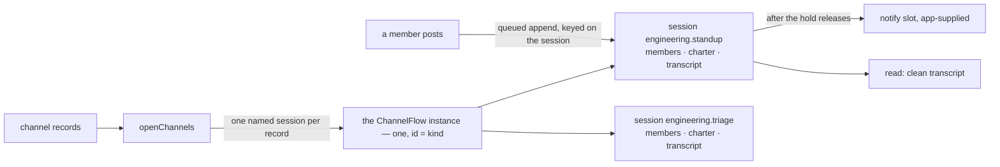

# FIX-1311: W3 — Default ChannelFlow / channel kind floor — Implementation Spec

## Part I — The Case *(for the human)*

### 1. Problem — why it matters, why now

Several agents working one topic, each reading what the others said, nobody owning a
row. We have no way to express that. A task board handles work that needs a claim and a
settlement; dispatch lets one session reach another. The many-participants-no-claim case
is built by hand, every time — including by this project, which runs its own coordination
on an external board for exactly this reason.

**Why now.** The channel file convention (FIX-1352) is approved and describes channels
that run a flow kind that does not exist. Nothing else in W3 moves until this lands.

### 2. Solution in plain terms

Put one channel in the box. A **channel kind** is a flow kind the framework ships —
`ChannelFlow` — and a **channel** is a named session on it. One built-in kind means one
registered instance; four kinds means four instances. The number of channels does not
change that number. The facts that differ per channel, who the members are and what the
charter says, live in that session's own state, which is where the framework already keeps
durable per-session facts. Posting is a request into the channel's session, so the work and
the record land on the channel rather than on whoever posted. Reading gives back a clean
list of messages, separate from the machinery a session accumulates. Reach for one when the
exchange is back-and-forth and wants a durable home: a one-shot instruction is a dispatch
into the target flow's own session, and work that needs a claim and a settlement is a task
board row. A team that wants different behaviour names their own kind on one line in the
file, and it wins: that kind gets its own instance, and its channels are sessions on that.

It ships no roster, no delete verb, no live join or leave, and no brief, housekeeper or
CAS. Where a channel wakes its members, the framework carries the policy and the app
supplies the addresses: naming a recipient from stored data is something the substrate
refuses today, and faking it here would be the failure.

**Philosophy** — tenet 2 (composition over features): a channel is a session on a flow
kind, built over the session, dispatch and state primitives that already ship. Not a new
Channel type beside them, and not one flow instance per conversation. Tenet 3 (earn every
addition): one kind, one instance, one binder, and the default arrives without the app
naming it, so the common case costs zero config lines. Tenet 5 (fix at the owning layer):
the keys a channel derives are refused at every door a record can arrive through, not only
at the file reader.

**In tension with tenet 4, and worth naming:** a transcript that records who said what
looks like evidence, and this floor can only prove part of it. A session is bound to one
user, so every line in one channel carries the same principal. Decision 2 is where that is
priced rather than hidden.

### 6. Decisions & rules — the sign-off surface

**All three are stamped by the owner on PR #1738 (never-merge, no D-n).** They are recorded
here as settled, not offered. An implementer follows them literally. **The shape underneath
them was re-stamped on 2026-09-12**, superseding the 2026-09-11 stamp: a channel is a named
session on a shared flow instance, not a flow instance of its own. Decisions 1 and 3 are
restated against that shape below; decision 2's fork is unchanged and its ceiling is now
stated honestly. See *Spec evolution*.

1. **A `CHANNEL.md` need not say which kind it runs. An omitted `flow:` selects the
   built-in ChannelFlow, the binder fills the built-in into the app's `kinds` map when it
   is absent, and a kind that *is* named but not registered still fails loudly.** What the
   key selects is the **kind, and therefore which instance the channel's session lives on**
   — not a copy of a flow made for that one file.
   *Rejected:* requiring `flow: channel` on every file, mirroring `WORKER.md` exactly.
   Batteries-included means the first file in `channels/` does not carry that line, and
   requiring it is the paper cut already refused for agents (FIX-1359 / #1730 admission
   (a)); two conventions answering one question differently would be worse than either
   answer. *Also rejected, and also stamped:* teaching `hireWorkforce` to own this. A thin
   channel binder beside it is right while FIX-1361 and FIX-1367 are editing `hire.ts`.
   *Locks in:* the default is a promise we keep. Apps written against it omit the key, so
   we can add built-in kinds but can never remove the default without breaking every one
   of them. Reversible in the safe direction only — requiring the key later is breaking,
   relaxing it later would have been free. **What would reopen it:** shipping a second
   built-in channel kind, where "which default?" becomes ambiguous (§12).

2. **A transcript line records who the framework can *prove* posted — a server-derived
   `principal` — and, separately, an optional `author` label the poster supplied, carried
   with `authorVerified: false`. The framework derives nothing from the claim, and refuses
   an `author` naming a non-member. Do not pretend seat-level trust until the substrate
   exposes the sender; BP-031 holds.**
   *Rejected:* a single `from` field naming the posting seat, as the first draft promised.
   A block cannot read the sender: the trusted provenance a dispatch carries is server-set
   and engine-internal (`DispatchStamp` is not exported from `@flow-state-dev/engine`, and
   no block-context accessor exposes it), and it names the sending *session*, not the
   sending seat. Anything a block could reach for instead is caller-supplied, which is
   BP-031 exactly — and an attribution nobody can trust makes the transcript evidence of
   nothing.
   **What the `principal` is actually worth, said plainly.** A session is bound to one
   user. A request whose identity does not match the stored `record.userId` is refused as
   `session-not-found` on the delivery path
   (`packages/engine/src/context/create-request-host.ts:196-202`) and throws
   `UserBindingMismatchError` on the action path
   (`packages/engine/src/context/createExecutionContext.ts:697-699`, commented as closing
   "a long-standing gap"). So every post into one channel runs under that channel's single
   `userId`, and the `principal` on every line of a given transcript is **the same value**.
   The unverified `author` claim is carrying all of the real attribution. **This is not a
   cost of the session shape** — the superseded shape had one transcript session per
   channel too and carried the identical constraint; it was simply never named. It is the
   tenet-4 tension §2 states, made explicit.
   *Locks in:* a channel transcript is proof that *the channel's own principal* wrote a
   line, which is close to proving nothing about which participant wrote it. Anyone
   building an audit or approval flow on a channel gets a far weaker guarantee than the
   field names suggest, which is why the claim is spelled as a claim in the API, the docs
   and the read surface rather than in a footnote — and why the docs page must say that
   the principal is constant per channel, not merely that `author` is unverified.
   Many members posting under their own principals needs substrate this floor does not
   have (§12).

3. **One kind is one instance; one channel is one named session on that instance. A post
   is a background request into that session — never `reactTo` on the poster's turn, which
   was the #1627 public model. The session must be bound before a post lands; a post from
   another flow works only where dispatch runs in-process. Only the transcript append is
   queued, and waking members runs after the hold releases, over recipients the app
   supplies — never an address read from data.**
   *Rejected:* one flow instance per channel file. Sessions already carry per-conversation
   inputs and state, so a second instance buys nothing and spends the framework's identity
   budget on conversations; `cardinality: "singleton"` is what the registry enforces for a
   kind that means one thing
   (`packages/engine/src/registry/flow-registry.ts:583-589`).
   *Rejected:* auto-creating a channel's session on first post, which now needs a **block-
   level** refusal rather than an absent instance: the action path is create-or-get
   (`packages/engine/src/context/createExecutionContext.ts:652-654`), so on a shared
   instance any caller naming an unused session id gets an empty session rather than a
   refusal. Boundness, not existence, is the test the post block applies (§7).
   *Rejected:* giving each poster a derived child session, which the external-dispatch path
   *does* support — it puts the conversation back in one session per poster, which is the
   split this decision's shape exists to avoid. A `{ key }` target could not name a shared
   channel anyway: the child id is hashed from the key together with the parent session and
   lineage (`packages/engine/src/context/detached-child.ts:22-42,58-75`;
   `packages/core/src/types/dispatch.ts:233-240`), so the same key resolves differently per
   parent. Posting addresses `{ id }`.
   *Rejected:* fanning out inside the queue hold; under a burst that makes a post wait
   behind every earlier post's delivery latency, and past the engine's 30s budget the
   waiting post is **dropped, never written**
   (`QUEUE_WAIT_TIMEOUT_MS = 30_000`, `packages/engine/src/transports/concurrency/arbiter.ts:41`;
   the gate "rejects with `ConcurrencyQueueTimeoutError` and never runs `fn`",
   `packages/engine/src/utils/keyed-async-gate.ts:39-42`). Losing a message is a worse
   failure than a slow one. *Rejected:* a built-in recipient list read from channel
   membership — a dispatch target chosen from stored data is refused by construction, and
   #1627 is the run that confirmed it. **Also rejected: reviving the Message Board**, N
   sessions standing in for the transcript. The channel *is* the session; waking a member
   is a notify, not a second transcript.
   *Locks in:* the channel's history has one home, and agent-to-channel posting is a
   single-process capability for now. On a queued deployment (`colocated`,
   `dispatch-only`, or any custom external dispatcher) a flow-to-flow post is refused by
   name (`packages/engine/src/context/dispatch-operation.ts:193-200`,
   `packages/engine/src/context/create-request-host.ts:521-534`), and only client posts
   through the ordinary action route still work — the docs have to say so before someone
   designs a channel into a queued deployment. That fence is unchanged by the session
   shape. An app that wants members woken writes one declaration per recipient kind until
   addresses-as-data lands (FIX-1320), with no change to the channel's own surface when it
   does.

**Non-goals** — live join and leave (`subscribe` / `unsubscribe`), which go with the
Collab roster (FIX-1341) along with seeding, undeletability and a delete verb; brief,
housekeeper, retirement and CAS; the channel file convention and its reader (FIX-1352); a
task board assigning a channel as worker; cross-flow substrate and dynamic dispatch
targets; teams; and any `Channel` or `MessageBoard` L1 package type. Smart resource +
`reactTo` stays valid for non-conversation shared state and stays out of this public
surface.

**Size:** Medium — 6 production files · 20 test behaviours · 2 doc surfaces · 1 PR.

---

### 3. Tradeoffs & alternatives

**The simpler approach: ship no kind, only a recipe.** Document the composition #1627
proved and let each app assemble it — ~430 lines of ordinary user-space code. It loses on
one point that is not ergonomics: a `CHANNEL.md` that omits `flow:` has to resolve to
something, and a default kind is by definition framework-side. A recipe leaves FIX-1352
declaring instances of nothing.

**The alternative on shape: a resource collection, not a flow kind.** The model this issue
carried until the owner replaced it. Rejected upstream, and the reason survives
independently: a collection has no session, so the transcript has no home and every post
runs on the poster's turn.

**The alternative this spec itself carried until 2026-09-12: one flow instance per
channel.** A `CHANNEL.md` minted a member of a `cardinality: "collection"` kind, so N
channel files meant N registered instances. Replaced by owner lock. It is the wrong use of
the framework: a session already carries the per-conversation inputs and state that shape
was reaching for, so the extra instances bought nothing and made every channel a
first-class flow address. What it costs to give that up is real and named in §7 — one
declared state shape for every channel on the instance, and per-channel settings that can
no longer ride in the flow's `config` bag.

**Where the complexity is:** not the transcript. It is the four places the substrate does
not reach — a recipient named from data, a sender the receiving block can identify, a
named-session delivery past a queue boundary, and a session that exists without anyone
having bound it to a channel. Decisions 2 and 3 fence all four.

### 4. Focus practices

1. **BP-031 — never decide from caller-controllable input.** This is the practice the
   change lives or dies by. A transcript's attribution is an authorization-shaped claim
   in durable storage; decision 2 exists because the only sender a block can reach today
   is one the caller wrote.

### 5. What using it looks like

**A channel with no kind named** — `workforce/teams/engineering/channels/standup/CHANNEL.md`:

```md
---
description: Where the engineering team posts daily status.
members: [engineering.lead, engineering.analyst]
---

Post what you finished, what you're on, and what's blocking you.
```

**Registering the kind, then binding the channels** *(what this spec proposes; today
neither function exists and the records have nowhere to go)*. The two steps are split
because they happen at different times: instances are registered when the server is built,
sessions can only be opened once it is running.

```ts
import { channelInstances, openChannels } from "@flow-state-dev/workforce";
import { readChannelsDirectory } from "@flow-state-dev/workforce/loader"; // FIX-1352

const { channels } = await readChannelsDirectory("./workforce");

// Build time — one instance per distinct kind, not per record.
const instances = channelInstances(channels);
// instances.length === 1; instances[0].id === "channel"

// Runtime — one named session per record, carrying that channel's members and charter.
await openChannels(channels, { client });
// opens session "engineering.standup" on the "channel" instance
```

**Replacing the default**, per-app or per-channel:

```ts
channelInstances(channels, { kinds: { channel: createChannelFlow({ notify }) } });
// or, per channel, `flow: my-channel` in the file plus `kinds: { "my-channel": … }`,
// which registers a second instance and puts that channel's session on it
```

**Posting from another flow, and reading back.** The flow addressed is the *kind*; the
channel is the session id. `author` is optional and unverified, and the principal on every
line is the channel session's own:

```ts
const postToStandup = dispatcher({
  name: "post-to-standup",
  flowKind: "channel",                          // the shared instance
  action: "post",
  inputSchema: z.object({ body: z.string() }),
  session: { id: () => "engineering.standup" }, // the channel
  payload: (input) => ({ body: input.body, author: "engineering.lead" })
});

// read → { id: "engineering.standup",
//          description: "Where the engineering team posts daily status.",
//          members: ["engineering.lead", "engineering.analyst"],
//          transcript: [{ at, principal: "u_42", author: "engineering.lead",
//                         authorVerified: false, body: "shipped the reader" }] }
```

---

## Part II — The Build Plan *(for the implementing agent)*

### 7. Technical design

Everything lands in `@flow-state-dev/workforce`. Nothing in `core`, `engine` or any store
changes; no new block kind, scope or store, per the epic's invent-kill.



**The kind, and why there is one instance.** `createChannelFlow(options?)` returns a
`defineFlow` result with `cardinality: "singleton"` and `kind: "channel"`;
`channelFlow = createChannelFlow()` is the built-in the binder seeds. Singleton is not a
preference here, it is the declared mechanism for "one kind means one thing": the registry
throws `FlowIdentityConflictError{ reason: "singleton-id-mismatch" }` unless
`flow.id === flow.kind` (`packages/engine/src/registry/flow-registry.ts:583-589`;
`cardinality` is declared at `packages/core/src/types/flow.ts:414-428`). So the instance's
address is `channel`, four kinds means four instances, and a hundred channel files means
zero extra instances. It is a factory rather than a bare flow because a block cannot ride
in a zod-parsed config bag; `taskBoard` and `createWorkforceCapability` set that precedent
in-repo. `options.notify` is the fan-out slot: a block run once per declared member per
post, absent by default.

**What moved out of `config`, and why it had to.** `config` is per *instance*
(`packages/core/src/types/flow.ts:621`), and there is now exactly one instance, so the
config bag is **kind-wide** — it can hold the notify policy and nothing that differs per
channel. The per-channel facts move to the session:

| Fact | Where it lives | Why |
|---|---|---|
| `members` | session **state** | Access-shaped. It decides whether an `author` claim is refused and who the fan-out addresses |
| `instructions` (the charter) | session **state** | Read by the kind's own blocks on every turn, through `ctx.session.state` |
| `description` | session `description` | Display-only, and `SessionRecord` already has the field |
| the transcript | session **state** | Append-only, per channel, per the projection below |

`state` and not `metadata`, deliberately. `SessionRecord.metadata`, `topic` and
`coordinate` **carry no authority** by declared contract: nothing may read them for
routing, authorization, adoption or identity, because "a display-only field has nothing to
disagree with" and adding such a read "reintroduces that hazard and is the change this note
exists to stop" (`packages/engine/src/stores/types.ts:83-113`). A members list is read on a
refusal path. It goes in typed, schema-declared state
(`packages/engine/src/stores/types.ts:20-28`).

**The constraint the shape introduces, stated out loud.** `stateSchema` is declared on the
flow definition (`packages/core/src/types/flow.ts:312-316`), so **every channel on one
instance shares one declared state shape**:
`{ members, instructions, transcript }`. That is workable for this floor — every channel
carries exactly those three — and it is a real ceiling: a channel kind cannot give one of
its channels a field another does not have. A team that needs a different shape declares
their own kind, which is decision 1's escape hatch and gets its own instance and its own
schema. A per-instance `session` override exists (`flow.ts:621`) but buys nothing here,
because there is one instance.

**Binding, in two steps, because they happen at two times.** `hireWorkforce` is
synchronous and build-time and returns `FlowInstance[]`
(`packages/workforce/src/hire.ts:106-109`). Registering an instance is build-time; opening
a session needs a running host. So the old single mint splits:

- **`channelInstances(records, options?)`** — build time, synchronous, returns the
  instances to register. One per *distinct kind* across the records, with the built-in
  seeded under `"channel"` unless the caller passed their own. This is where decision 1's
  default and its loud failure live, and where the whole roster is validated in one pass:
  order by id, collect every problem, throw once naming all of them, return nothing
  partially, exactly `hireWorkforce`'s discipline. A named-but-unregistered kind, and a
  factory filed under someone else's `kind`, refuse as they do for workers.
- **`openChannels(records, { client })`** — runtime, opens one named session per record at
  the record's own id and writes that channel's `members`, `instructions` and
  `description` into it. Idempotent: an already-open channel is left alone.

**Naming.** `mintChannels` is retired. Nothing is minted any more — no instance is created
per file — and keeping the word would teach exactly the model this lock replaced. Two
names for two phases, and `openChannels` deliberately matches the vocabulary decision 3 and
§12 already use for opening a channel's session.

**Which door `openChannels` uses, and the 409.** `POST /sessions` **409s on an id that
already exists** (`packages/engine/src/routes/session-routes.ts:222-235`), and that route
is the only one that accepts caller-supplied `state` at create (`:164-207`). The action
path is create-or-get instead (`packages/engine/src/context/createExecutionContext.ts:652-654`,
through `ensureSessionRecord`, `packages/engine/src/context/ensure-session-record.ts:144-168`)
but it creates the record with **empty** state, which is an unbound channel. So
`openChannels` uses the session route and **treats 409 as "already open", not as an error**
— re-running it over an unchanged roster is a no-op. Session ids being caller-supplied is
what makes any of this work: `ensure-session-record.ts:41-42` says so in as many words
("Session ids are caller-supplied, so `chat-42` or a document id can be deleted and used
again — an ordinary pattern, not an exotic one"), so `engineering.standup` is an ordinary
session id, not a trick.

**Do not lean on the session route to validate a channel's state.** It parses caller state
against `stateSchema` but, on a parse failure, **falls back to the caller's raw state**
("Validation happens at action-execution time, not session-create time",
`packages/engine/src/routes/session-routes.ts:170-176`). It is not a gatekeeper the way a
flow's `configSchema` is. Under the superseded shape the closed `configSchema` refused an
undeclared `CHANNEL.md` key for free; under this one **that refusal is the binder's job**,
against the same closed key list, at `channelInstances` where the whole roster is being
checked anyway. Losing that free gatekeeper is the second real cost of the reshape.

**Membership is the declared list, and nothing else writes it.** `members` is written once
at open and read-only on the post path; the notify slot iterates it directly. There is no
second copy anywhere, so there is no reconciliation rule to get wrong and no question about
what a removal means. Live join and leave belong to FIX-1341, with the same bill this floor
already accepts for delete and undeletability: changing who is in a channel means editing
the file and re-opening until that lands.

**The doors.** `post` and `read` are declared as both public actions and `internal`
entries, so a client and another flow reach the same blocks. Three fences on the post path,
all decision 3's:

- **The session must be *bound*, not merely exist.** This is the fence that changes shape
  under the lock, and it is the sharpest consequence of it. Previously a post into an
  unminted channel died because the instance did not exist. Now the instance always exists,
  and the action path is create-or-get, so a client naming `not-a-channel` as its session
  id gets a **new, empty session on the channel instance** rather than a refusal — which is
  precisely "any caller mints a channel's durable home by naming it", the branch decision 3
  rejected. So the post block refuses when session state carries no bound channel (no
  members, no charter): `channel-not-bound`, nothing written, and the empty session is
  inert rather than a channel. The `{ id }` dispatch path keeps its own stricter refusal on
  top — a delivery names a session that "must exist and be this principal's, owned by the
  addressed instance — `session-not-found` / `session-not-addressable` otherwise, **never
  created**" (`packages/engine/src/context/create-request-host.ts:29-32`).
- **A flow-to-flow post needs in-process dispatch.** Unchanged by the reshape. An `{ id }`
  delivery on a deployment whose dispatcher hands work to an external queue refuses
  `external-dispatcher` by name, deliberately and regardless of whether the session exists
  — "a delivery into an existing session is not arbitrated against that session's
  concurrency policy; delivery refuses rather than under-delivering"
  (`packages/engine/src/context/create-request-host.ts:521-534`;
  `packages/engine/src/context/dispatch-operation.ts:193-200`;
  `packages/core/src/types/dispatch.ts:297-302`). So on `colocated`, `dispatch-only`, or
  any custom dispatcher without `dispatchLocal`
  (`docs/architecture/dispatched-work.md` → Topology matrix), the public action door still
  works and the dispatch door does not.
- **A post must address `{ id }`, never `{ key }`.** A `{ key }` child id is hashed from
  the key together with tenant, principal, **parent session** and **parent lineage**
  (`packages/engine/src/context/detached-child.ts:22-42,58-75`;
  `packages/core/src/types/dispatch.ts:233-240`), so the same key resolves to a different
  session for every poster. A key cannot name a shared channel, which is the mechanical
  half of why the per-poster child was rejected.

**What the queue holds.** The post entries declare `concurrency: "queue"` — per-entry-wins
over the flow default (`packages/core/src/types/flow.ts:233-242`), keyed on the session —
so two posts landing on one channel serialise into its transcript, and posts on two
different channels never contend, because they are different sessions on the same instance.
**The held work is the append only.** Fan-out runs in a separate request: the post block,
having appended, dispatches the channel's own `onPosted` internal entry, which declares
`concurrency: "allow"`, so delivery latency never counts against the next poster's 30s wait
budget. The cost of that split is that a delivery failure cannot roll back an appended
post, which is the right way round — the transcript is the durable record and delivery is
best-effort (§9).

**Attribution, and what it can prove.** A block's server-derived identity is
`{ type, id, userId?, orgId?, tenantId? }` (`packages/core/src/types/scope.ts:8-25`), and
inside a dispatched post the running session is the *channel's*, not the poster's. The
trusted sender lives on `DispatchStamp.from`, which is engine-internal — read only through
`readDispatchStamp` and exported from neither `@flow-state-dev/engine` nor `core` — and
names a session id rather than a seat. So a transcript line carries a **`principal`**
derived from the request's identity and an optional **`author`** the poster supplied,
stored beside `authorVerified: false`. The post entry's input schema is a closed zod
object, so a caller cannot supply `principal` at all, and an `author` that is not in the
session's `members` is refused: a validity check against the declared roster, not
authentication, and the docs must say which it is. Per decision 2, the `principal` is
constant for a given channel, because the session is bound to one user — the check is worth
keeping (it is the server's value, and BP-031 forbids taking the caller's) but it is not
the attribution anyone is reading.

**The transcript.** The channel's session state carries an append-only
`transcript: { id, at, principal, author?, authorVerified, body }[]`, written with the
commutative `pushState` verb, so concurrent appends never clobber one another and the
floor needs no compare-and-swap — which matters, because CAS is out of admission. `read`
returns that array plus the channel's `members` and its session `description`. It is
deliberately *not* `ctx.session.items.client()`: session history carries dispatch handles,
tool calls and refusals, and the clean projection is the subset a human or another agent
should read.

**What binding derives, and what protects it** — the epic's theme 2 check, re-read against
the two phases. Nothing is derived at instance-registration time except the kind itself;
the per-channel derivations all happen at open.

| Field | When | Source | Mechanism |
|---|---|---|---|
| the channel's id (its **session** id) | open | the record's identity | **Shape** — the record is `{ id, declared, body }`, so a frontmatter `id:` lands in `declared` and cannot reach the id |
| the flow kind, and so which instance | registration | `declared.flow`, else the built-in | **Consumed and stripped** — `flow` is reserved, removed from the settings bag before the state is built |
| `instructions` (the channel's charter) | open | the Markdown body | **Ordering + explicit refusal** — imposed after the passthrough, and a record carrying both a body and `instructions:` is refused as two sources for one setting |
| `system` | registration | the declaration path (FIX-1352) | **Explicit refusal** at the binder as well as the reader, because a hand-built record never passes the reader |
| any undeclared key | registration | the record's frontmatter | **Closed key list at the binder** — the flow's `configSchema` no longer sees per-channel keys, and the session route does not validate state at create |
| a line's `principal` | per post | the request's server-set identity | **Shape** — not a bind field at all; the post entry's closed input schema has no `principal` key, so a caller has nowhere to put one |
| `members` | open | `declared.members` | **Single writer** — written once at open, read-only afterwards; no runtime verb writes it in this floor |
| `description` | open | `declared.description` | **Not derived** — written verbatim to the session's own `description`. The author's value *is* the value, so there is one writer and nothing to protect |

The only deviation from the epic's seven inherited shape rules is that this issue ships no
reader, so rules 1, 5 and 6 do not apply to it; the rest are FIX-1352's and unchanged.

**Solution sketch — pseudocode. Illustrative, not the contract. React to the shape.**

```
channelInstances(records, options):            ← build time
    kinds ← options.kinds, with the built-in filled in under "channel" if absent
    for each record, ordered by id:
        refuse if it declares a derived or undeclared key   ← the theme-2 table
        kind ← declared.flow ?? "channel"                   ← decision 1
        refuse if kinds has no such kind, or it is filed under another name
    one refusal naming every bad record, or one instance per DISTINCT kind

openChannels(records, client):                 ← runtime, after the host is up
    for each record, ordered by id:
        state ← { members: declared.members, instructions: body, transcript: [] }
        create a session on the record's kind, at the record's own id,
          with that state and the declared description
        a 409 means it is already open — leave it alone

the post entry, in the channel's own session, under the queue hold:
    refuse if session state carries no bound channel   ← channel-not-bound
    principal ← the request's own identity             ← never from the payload
    refuse if a claimed author is not in state.members
    append { at, principal, author?, authorVerified: false, body }   ← commutative push
    hand off to the channel's own fan-out entry and return   ← releases the hold

the fan-out entry, concurrency allow, outside the hold:
    for each member in state.members: run the notify slot, if one was supplied
    record refusals against the post; change nothing about membership
```

### 8. Implementation sequence

1. **The kind, with no fan-out.** `createChannelFlow` + `channelFlow` at
   `cardinality: "singleton"`, `post` / `read`, the session state schema
   (`members`, `instructions`, `transcript`), the transcript projection with
   `principal` / `author` / `authorVerified`, and `concurrency: "queue"` on both post
   entries. *Test:* the instance registers under id `channel`; a post lands in the named
   session; two concurrent posts on one channel both land, in order; posts on two channels
   do not contend; `read` returns the projection plus `members` and `description`, and not
   session items; a payload carrying `principal` is rejected by the schema. *Depends on:*
   nothing.
2. **The three post-path fences**, per decision 3. A post into a session that is not a
   bound channel refuses `channel-not-bound` and writes nothing — **this is the one to get
   right**, because the shared instance answers for every session id and the action path
   creates what it does not find. A flow-to-flow post on an external-dispatcher host
   surfaces `external-dispatcher`. *Test:* both refusals, with nothing written in either
   case, plus an empty session left inert. *Depends on:* 1. **Do not add an implicit open
   on the post path and do not fall back to a derived child** — both are decision 3's
   rejected branches.
3. **Registration and binding.** `channelInstances` (decision 1's default and seeding, the
   closed-key and theme-2 refusals, the collect-then-throw discipline, one instance per
   distinct kind) and `openChannels` (one named session per record, state written at
   create, 409 treated as already-open). *Test:* a roster with no `flow:` anywhere yields
   exactly one instance; two custom kinds yield two; a named-but-unregistered kind refuses
   by name; a record declaring an undeclared or derived key refuses; one run names every
   bad record; opening writes members and charter into the session; re-opening an unchanged
   roster changes nothing. *Depends on:* 1.
4. **The fan-out entry and the notify slot.** Iterates the session's `members`; runs outside
   the post's queue hold. *Test:* one delivery per member per post; a slow notify does not
   delay the next post's append; a refusal is recorded and nothing about membership
   changes; no slot means no deliveries and no error. *Depends on:* 1.
5. **Exports, README and the docs page.** `@flow-state-dev/workforce` root only — the kind
   and the binder are isomorphic and must not pull `node:fs`. *Depends on:* 3, 4.
6. **A changeset** (`minor`) — new public exports on a published package (BP-022).

No removals: nothing this supersedes exists yet. #1627 is already closed and its lab was
never merged.

### 9. Edge cases & error handling

The happy paths are decisions 1-3 and are not re-derived here; these are the hostile and
boundary cases.

| Case | Expected |
|---|---|
| `flow:` naming a kind nobody registered | Refused by name at `channelInstances`, listing the kinds passed — never a silent fall back to the built-in (decision 1) |
| A kind registered under a key that is not its own `kind` | Refused, as for workers — this channel's session would run another kind's graph |
| Two records naming the same custom kind | One instance, two sessions on it. Not an error, and the case the lock exists to make ordinary |
| A post naming a session id nobody bound | `channel-not-bound`; nothing written. The session may have been created by the action path, and stays empty and inert |
| A post into a bound channel from a flow on a host with an external dispatcher | `external-dispatcher`, even though the session exists. A client post on the same host still works (decision 3) |
| A post addressed by `{ key }` rather than `{ id }` | Lands in a per-poster child session, not the channel. The docs say to address `{ id }`; the framework cannot detect the mistake, so the channel simply never sees the post |
| Re-running `openChannels` over an unchanged roster | A 409 per channel, swallowed as already-open. No state is rewritten, so an edited `CHANNEL.md` does **not** reach an open channel — re-opening is not a migration, and that is §12's business |
| A burst of posts on one channel | Each waits only for the earlier appends on *that* channel, not for their deliveries. A waiter that still exceeds 30s is dropped by the engine's queue budget and never written — so the burst ceiling is a documented property, not a silent one |
| A post claiming an `author` who is not in the session's members | Refused; nothing written |
| A post supplying `principal` in its payload | Rejected by the entry's closed input schema before the handler runs |
| A second user posting into someone else's channel session | Refused by the substrate before any channel code runs — `session-not-found` on the delivery path, `UserBindingMismatchError` on the action path. A channel is one principal's; decision 2 |
| A member's delivery refuses | Recorded against the post; membership is not changed. Pruning is roster behaviour and is out |
| The notify slot throws for one member | The remaining members are still attempted; the post stays written |
| No notify slot supplied | Posts land, nobody is woken, no error |
| A hand-built record declaring `system:` | Refused at the binder, in FIX-1352's wording |
| A record declaring a key the kind never declared | Refused at the binder against its closed key list — the flow's `configSchema` no longer sees per-channel keys, and the session route does not validate state at create |
| A record whose body and `instructions:` both carry a charter | Refused — two sources, no precedence rule |
| Duplicate channel id in one roster | Refused; an id is an address, and here it is literally a session id |
| `members:` naming a seat that does not exist | Accepted. Binding does not resolve members against a roster — there is none in this floor — and a delivery to a missing recipient is an ordinary refusal |

**Taxonomy:** everything at registration and open time is a startup misconfiguration and
throws, collected. Everything on the post path is a per-request or per-delivery refusal that
leaves the transcript intact.

### 10. Testing strategy

**Goal check (the gate, not a nice-to-have).** A provider-free `fsdev run` over a real
host: register the kind once, open two channels on it, post into one from three seats
concurrently, read both transcripts back. One registered instance, every post present once
in arrival order, nothing from the other channel, every line carrying the server's
principal, and a post into an unbound session id refused with nothing written. This change
adds a flow kind, cross-flow dispatch, entry concurrency and named-session routing —
`CLAUDE.md` and `AGENTS.md` both put that above the unit-test line
(*"When you change flow logic, the default verification is `fsdev run`"*), so a vitest
suite alone does not discharge it. No model is involved, so this is a runtime goal check
rather than a model one.

**CI specs — 20 behaviours**, in observable terms:

*Registration and binding (7)* — a roster with no `flow:` anywhere yields exactly one
instance registered under id `channel` · two records naming one custom kind yield one
instance, not two · a named-but-unregistered kind refuses by name · a factory filed under
another kind's key refuses · a duplicate id in one roster refuses · one run names every bad
record rather than the first · opening writes members, charter and description into the
named session, and re-opening an unchanged roster changes nothing.

*Theme 2, one row each (5)* — a frontmatter `id:`, a `flow:`, an `instructions:` alongside
a body, a `system:`, and an undeclared frontmatter key each reaching the binder.

*Attribution, decision 2 (3)* — a payload carrying `principal` is rejected by the entry's
closed schema · a stored line's principal is the server-derived one and its `author` is
marked unverified · an `author` outside the session's members refuses.

*The post path, decision 3 (5)* — a post into a session nobody bound refuses
`channel-not-bound` and writes nothing, and the session stays empty · a flow-to-flow post on
an external-dispatcher host refuses `external-dispatcher` while a client post on the same
host succeeds · two concurrent posts on one channel both land in arrival order · concurrent
posts on two channels of one instance do not serialise against each other · a slow notify
does not delay the next post's append.

*Fan-out (3)* — one delivery per member per post · a delivery refusal is recorded and
membership is unchanged · no notify slot means no deliveries and no error.

*Plus, not counted as behaviours of this change:* two premises this floor rests on are
pinned as characterization specs (BP-003) — that a dispatcher whose target is read from
state is refused, and that a session bound to one user refuses another's request (decision
2's ceiling, which nothing in this package can enforce or weaken). `hireWorkforce`'s 23
tests and the worker reader's 31 must pass **with no edits to either test file**.

**Discipline:** `tdd`. The seam is `@flow-state-dev/workforce`'s package root for
registration, reachable from a vitest spec with the testing package's mock context; binding,
the post path and fan-out need an in-memory host, as #1627's lab used, and the goal check
runs the real one.

### 11. Documentation plan

- **CREATE** `apps/docs/docs/orchestration/channels.md`, in the `Orchestration` category
  immediately after `orchestration/workers-on-disk` — a channel is the second thing a
  workforce declares, and the page leans on that one for the file-convention shape.
  Outline: what a channel is (a named session on a flow kind the framework ships, and that
  session is the conversation) · **when a channel, and when something else** (the callout
  below) · declaring one and who its members are · opening it before anyone posts, and why
  an unopened id is not a channel · posting and reading · **what the transcript proves and
  what it doesn't** · **where posting from another flow works and where it doesn't** ·
  replacing the kind · what waking members costs today. One minimal example: the standup
  channel from §5, opened and posted into. Cross-links: ← from
  `orchestration/workers-on-disk` and `orchestration/overview`; → to
  `orchestration/task-substrate` from the callout, as the pointer for the claim-and-settle
  case a channel is not. The page teaches the kind/channel distinction explicitly — one
  kind is one instance, a channel is a session on it — because a reader arriving from
  `workers-on-disk` has just learned a convention where one file *is* one instance. The
  callout is the single place that teaches the fork: the link carries the pointer, the
  callout carries the reasoning, and no other page restates it.

  - **The callout — "When a channel, and when something else."** Short, and placed between
    "what a channel is" and posting, because a reader who gets this wrong has already
    picked the wrong primitive. Five rules, each a sentence or two:
    1. **One-shot, "go do this" → dispatch** into that flow's own session. Nothing about
       it wants a shared transcript.
    2. **Back-and-forth, "keep talking" → a channel**, when you want one durable home for
       the history and posts that land on the channel rather than on the poster. **A DM is
       the one-member degenerate case of ChannelFlow**, not a separate thing.
    3. **Claim it and settle it → the task board**, not a channel. Channels are
       many-participants-no-claim.
    4. **Do not fake a DM by dumping the dialogue into the worker's session.** Session
       history is machinery (tool calls, refusals, handles); ChannelFlow is what owns the
       clean transcript projection.
    5. **Do not put seat-owned work on a channel.** A post runs in the channel's session,
       and fan-out wakes members; neither one hands anybody a claim.

  *Voice risks:* do not write "seamless" or "first-class"; introduce *kind* and *seat* in
  plain terms on first use; no issue or PR numbers anywhere on the page. **The attribution
  and deployment limits are the two things the page must not soften** — a reader who comes
  away thinking the transcript is authenticated, or that posting works on any host, has
  been misled by us. On attribution the page must say the strong form decision 2 now
  states: a channel session belongs to one user, so the principal is the same on every
  line and the `author` label is the only thing distinguishing participants.
- **EXTEND** `packages/workforce/README.md` — a `Channels` section beside the seat-factory
  one, and rows in the API and error tables, at the density that file already sets.
- **Not touched:** `docs/atlas/workforce.html`. The atlas owes a ChannelFlow rewrite and
  that is FIX-1358's surface, named in the epic spec's §5.

### 12. Dependencies, open questions & follow-ups

**Dependencies.** None blocking. This issue is first on the W3 floor and blocks FIX-1352,
whose approved spec (PR #1711, closed with `spec approved`) declares instances of the kind
this ships.

**Two coordination items with sibling issues, neither a blocker.**

- **`ChannelManifest` has two claimants.** FIX-1352 §7 declares
  `ChannelManifest { id, declared, body }` in `packages/workforce/src/manifest.ts`, and
  ships the `system:` refusal constant — but it sequences *after* this issue, whose binder
  consumes both. **Resolution:** this issue declares the record type and the refusal
  wording in `manifest.ts`; FIX-1352's reader returns the type rather than declaring a
  second one, and reuses the constant at its own door. That is one line of its §7, routed
  as an implementer note rather than a re-gate, since its spec is already approved.
- **The absent-`flow:` rule is being written twice, in two epics.** The parallel agent-kind
  epic (FIX-1359) has FIX-1361 teaching `hireWorkforce` that an omitted `flow:` selects a
  built-in kind, with a loud-fail rule for a misspelled one — the same rule this issue
  applies to channels. Both are unstarted. **Resolution:** ship them separately and
  identically now; once FIX-1361 lands, extract the shared roster discipline (order,
  collect, throw once) — which is all the two share, since a worker roster mints instances
  and a channel roster opens sessions. Extracting it
  *here* would edit `hire.ts` while two other epics' issues (FIX-1361, FIX-1367) are also
  editing it. Commented up on the epic PR.

**Open — carried, not decided here.**

- **Where CAS belongs, now that there is no Board PRD to hold it.** The 22:28 lock lists
  brief, housekeeper and retirement as later ChannelFlow behaviours; the 22:29 cut names
  brief, housekeeper and CAS as out of admission. CAS appears only on the exclusion side,
  and the same lock keeps smart resource + `reactTo` alive for exactly the non-conversation
  shared state a compare-and-swap guards. **This issue does not place it**, and does not
  need to: the transcript appends commutatively, so nothing here wants a CAS. Already
  recorded as the epic's open question (FIX-1351 spec §5); **the owner and Architect decide
  it, not this spec and not its reviewers.** Blocks nothing.

**Follow-ups (flagged, not built).**

- **What would reopen decision 1, written down rather than remembered.** The owner's stamp
  names one condition: shipping a *second* built-in channel kind, at which point "which
  default did I get?" stops having an obvious answer and an explicit `flow:` earns its
  line. Nothing else reopens it — not a new app, not a custom kind, which decision 1
  already serves.
- **Per-seat attribution needs substrate this floor does not have.** Decision 2 is a
  ceiling, not a design preference: a channel could name the posting seat if a block could
  read the trusted sender, and the sender the stamp carries is a session id rather than an
  instance. Both are dispatch-substrate changes (FIX-1320's flow-instance addressing is the
  nearest home). Until then the transcript proves a principal.
- **Live join and leave** — `subscribe` / `unsubscribe` over channel membership, with
  whatever reconciliation against the declared list they need. FIX-1341, with the rest of
  the roster.
- **Teach the kind/channel distinction, to agents and to consumers.** The superseded
  shape — one file, one flow instance — is the one every `WORKER.md` reader already has,
  and it is the shape an agent writing a channel will reach for by default. This floor's
  docs page carries it for framework consumers (§11), but the repo's own agent-facing
  grounding does not: channels are not a worker-shaped collection mint, and the
  difference is *where per-instance config lives*. Owner flagged it as a likely follow-up
  task. Nothing in this issue is blocked on it.
- **Re-opening is not a migration.** `openChannels` swallows the 409 on an already-open
  channel, so an edited `CHANNEL.md` — a member added, a charter rewritten — does not
  reach a channel that is already open. This floor accepts that, on the same bill it
  accepts for delete and undeletability, but it is a sharper edge than the superseded
  shape had, where a re-mint rebuilt the copy's config from the file every boot. The
  reconciliation verb belongs with live join and leave (FIX-1341).
- **The pre-lab static intake DM, rehomed here from FIX-1353.** Under the lock a DM is a
  one-member channel, so this floor already carries it: the kind treats one declared member
  as the degenerate case of many. **The opener shrank under the lock**: `openChannels` is
  the opener for a *declared* channel, so what is still unowned is only the undeclared
  case — opening and naming one durable channel session with no `CHANNEL.md` behind it. It
  is the same helper as the epic's open *consumer reshape* and sits on the Collab side of
  the fence. Named so it does not fall between issues again; it blocks nothing today, and
  FIX-1355 if still unplaced when the lab starts.
- **FIX-1352 sits in `In Spec Review` in Linear while its spec PR carries `spec approved`
  and is closed.** A tracker/label disagreement, not a design question; for the Linear
  Manager.

---

## Spec evolution *(the change story)*

- **Spec drafted** — framed as the epic's one blocking item rather than as a channel
  feature: the floor exists so a `CHANNEL.md` resolves to something real. Approach: one
  built-in flow kind plus a thin minter, with the transcript in the channel's own session
  and fan-out shipped as a policy with no addresses, because the substrate refuses a target
  read from data and #1627 is the run that showed it.
- **After spec review** — three things moved. Attribution became a decision rather than a
  field: a block cannot read the trusted sender, so the transcript now proves a principal
  and stores any author as an unverified claim (BP-031). Posting gained a second fence:
  a named-session delivery is refused outright past an external dispatcher, so
  agent-to-channel posting is in-process only, stated rather than discovered. And
  membership collapsed to the declared list, dropping live join and leave to FIX-1341,
  because the owner's reading of the floor is that the file *is* the membership — which
  also removes the dual-source problem two reviewers found independently.
- **All three decisions stamped** — the owner signed off §6 on the spec PR, including the
  `flow:` fork as **optional** on the consistency argument (two conventions answering one
  question differently is worse than either answer) and the thin `mintChannels` beside
  `hireWorkforce`. Nothing in §6 is offered any more; §12 records the one condition that
  would reopen decision 1.
- **Routing guidance folded in** — the owner asked for one place that teaches when a
  channel is the right primitive and when it is not. §11 now requires a dedicated callout
  on the channels page carrying five rules: one-shot work dispatches, back-and-forth gets
  a channel (a DM being its one-member degenerate case), claim-and-settle belongs to the
  task board, a worker's session is not a DM, and seat-owned work does not go on a
  channel. §2 states the fork in one sentence so an implementer meets it without opening
  the docs plan, and the existing `task-substrate` cross-link now points at the callout
  instead of repeating its reasoning. Guidance only: no decision moved, and §6 is
  untouched.
- **The shape re-stamped, superseding the 2026-09-11 stamp (2026-09-12).** The owner
  replaced instance-per-channel with **kind-per-instance, channel-per-session**: a channel
  kind is a flow kind, one built-in kind means one registered ChannelFlow instance, and a
  channel is a named session on it carrying its own members, charter and transcript in
  session state. Four kinds means four instances; a hundred channel files still means one.
  The reason is that instance-per-channel is the wrong use of the framework — sessions
  already give you per-conversation inputs and state, so the extra instances bought
  nothing. Decision 1 now binds a session rather than minting a collection member; decision
  3's shape sentence and all three of its fences are restated against sessions on a shared
  instance; §7's config story, theme-2 table, diagram and the explainer's panels are
  redrawn. Three things the reshape surfaced rather than caused: the transcript session was
  always bound to one user, so decision 2's `principal` is constant per channel and the
  unverified `author` carries all the real attribution (named now, not introduced now);
  every channel on one instance shares one declared state schema; and `mintChannels` is
  retired for `channelInstances` (build time) plus `openChannels` (runtime), because
  registering an instance and opening a session happen at different times. The one genuinely
  new hazard is that a shared instance answers for every session id, so the post path gains
  a `channel-not-bound` refusal where an absent instance used to do that work. The Message
  Board stays dead: the channel *is* the session, and waking a member is a notify.
