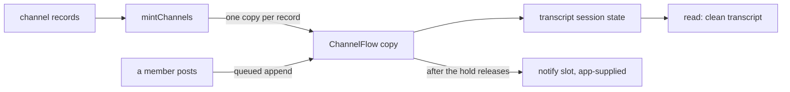

# FIX-1311: W3 — Default ChannelFlow / channel kind floor — Implementation Spec

## Part I — The Case *(for the human)*

### 1. Problem — why it matters, why now

Several agents working one topic, each reading what the others said, nobody owning a
row. We have no way to express that. A task board handles work that needs a claim and a
settlement; dispatch lets one session reach another. The many-participants-no-claim case
is built by hand, every time — including by this project, which runs its own coordination
on an external board for exactly this reason.

**Why now.** The channel file convention (FIX-1352) is approved and describes channels
that run a flow kind that does not exist. Nothing else in W3 moves until this lands.

### 2. Solution in plain terms

Put one channel in the box. A **channel** is a copy of a flow kind the framework ships —
`ChannelFlow` — and one channel is one copy, with its own session carrying the
conversation. Its members are the ones the file declared. Posting is a request into that
copy, so the work and the record land on the channel rather than on whoever posted.
Reading gives back a clean list of messages, separate from the machinery a session
accumulates. A team that wants different behaviour names their own kind on one line in
the file, and it wins.

It ships no roster, no delete verb, no live join or leave, and no brief, housekeeper or
CAS. Where a channel wakes its members, the framework carries the policy and the app
supplies the addresses: naming a recipient from stored data is something the substrate
refuses today, and faking it here would be the failure.

**Philosophy** — tenet 2 (composition over features): a channel is a flow kind over the
session, dispatch and state primitives that already ship, not a new Channel type beside
them. Tenet 3 (earn every addition): one kind and one minter, and the default arrives
without the app naming it, so the common case costs zero config lines. Tenet 5 (fix at
the owning layer): the keys a channel derives are refused at every door a record can
arrive through, not only at the file reader.

**In tension with tenet 4, and worth naming:** a transcript that records who said what
looks like evidence, and this floor can only prove part of it. Decision 2 is where that
is priced rather than hidden.

### 6. Decisions & rules — the sign-off surface

**All three are stamped by the owner on PR #1738 (2026-09-11, never-merge, no D-n).** They
are recorded here as settled, not offered. An implementer follows them literally.

1. **A `CHANNEL.md` need not say which kind it runs. An omitted `flow:` selects the
   built-in ChannelFlow, the minter fills the built-in into the app's `kinds` map when it
   is absent, and a kind that *is* named but not registered still fails loudly.**
   *Rejected:* requiring `flow: channel` on every file, mirroring `WORKER.md` exactly.
   Batteries-included means the first file in `channels/` does not carry that line, and
   requiring it is the paper cut already refused for agents (FIX-1359 / #1730 admission
   (a)); two conventions answering one question differently would be worse than either
   answer. *Also rejected, and also stamped:* teaching `hireWorkforce` to own this. A thin
   `mintChannels` beside it is right while FIX-1361 and FIX-1367 are editing `hire.ts`.
   *Locks in:* the default is a promise we keep. Apps written against it omit the key, so
   we can add built-in kinds but can never remove the default without breaking every one
   of them. Reversible in the safe direction only — requiring the key later is breaking,
   relaxing it later would have been free. **What would reopen it:** shipping a second
   built-in channel kind, where "which default?" becomes ambiguous (§12).

2. **A transcript line records who the framework can *prove* posted — a server-derived
   `principal` — and, separately, an optional `author` label the poster supplied, carried
   with `authorVerified: false`. The framework derives nothing from the claim, and refuses
   an `author` naming a non-member. Do not pretend seat-level trust until the substrate
   exposes the sender; BP-031 holds.**
   *Rejected:* a single `from` field naming the posting seat, as the first draft promised.
   A block cannot read the sender: the trusted provenance a dispatch carries is server-set
   and engine-internal (`DispatchStamp` is not exported from `@flow-state-dev/engine`, and
   no block-context accessor exposes it), and it names the sending *session*, not the
   sending seat. Anything a block could reach for instead is caller-supplied, which is
   BP-031 exactly — and an attribution nobody can trust makes the transcript evidence of
   nothing.
   *Locks in:* a channel transcript is proof of *which principal* said something, not
   which agent. Two seats running under one principal are indistinguishable in the record
   until the substrate carries the sender, so anyone building an audit or approval flow on
   a channel gets a weaker guarantee than the field names suggest — which is why the claim
   is spelled as a claim in the API, the docs and the read surface rather than in a
   footnote.

3. **One channel is one copy with one transcript session. A post is a background request
   into that session — never `reactTo` on the poster's turn, which was the #1627 public
   model. The session must exist first; a post from another flow works only where dispatch
   runs in-process. Only the transcript append is queued, and waking members runs after
   the hold releases, over recipients the app supplies — never an address read from data.**
   *Rejected:* auto-creating the session on first post (it would let any caller mint a
   channel's durable home by naming it). *Rejected:* giving each poster a derived child
   session, which the external-dispatch path *does* support — it puts the conversation
   back in one session per poster, which is the split this decision's shape exists to
   avoid. *Rejected:* fanning out inside the queue hold; under a burst that makes a post
   wait behind every earlier post's delivery latency, and past the engine's 30s budget the
   waiting post is **dropped, never written**
   (`QUEUE_WAIT_TIMEOUT_MS = 30_000`, `packages/engine/src/transports/concurrency/arbiter.ts:41`;
   the gate "rejects with `ConcurrencyQueueTimeoutError` and never runs `fn`",
   `packages/engine/src/utils/keyed-async-gate.ts:39-42`). Losing a message is a worse
   failure than a slow one. *Rejected:* a built-in recipient list read from channel
   membership — a dispatch target chosen from stored data is refused by construction, and
   #1627 is the run that confirmed it.
   *Locks in:* the channel's history has one home, and agent-to-channel posting is a
   single-process capability for now. On a queued deployment (`colocated`,
   `dispatch-only`, or any custom external dispatcher) a flow-to-flow post is refused by
   name, and only client posts through the ordinary action route still work — the docs
   have to say so before someone designs a channel into a queued deployment. An app that
   wants members woken writes one declaration per recipient kind until addresses-as-data
   lands (FIX-1320), with no change to the channel's own surface when it does.

**Non-goals** — live join and leave (`subscribe` / `unsubscribe`), which go with the
Collab roster (FIX-1341) along with seeding, undeletability and a delete verb; brief,
housekeeper, retirement and CAS; the channel file convention and its reader (FIX-1352); a
task board assigning a channel as worker; cross-flow substrate and dynamic dispatch
targets; teams; and any `Channel` or `MessageBoard` L1 package type. Smart resource +
`reactTo` stays valid for non-conversation shared state and stays out of this public
surface.

**Size:** Medium — 6 production files · 19 test behaviours · 2 doc surfaces · 1 PR.

---

### 3. Tradeoffs & alternatives

**The simpler approach: ship no kind, only a recipe.** Document the composition #1627
proved and let each app assemble it — ~430 lines of ordinary user-space code. It loses on
one point that is not ergonomics: a `CHANNEL.md` that omits `flow:` has to resolve to
something, and a default kind is by definition framework-side. A recipe leaves FIX-1352
declaring instances of nothing.

**The alternative on shape: a resource collection, not a flow kind.** The model this issue
carried until the owner replaced it. Rejected upstream, and the reason survives
independently: a collection has no session, so the transcript has no home and every post
runs on the poster's turn.

**Where the complexity is:** not the transcript. It is the three places the substrate does
not reach — a recipient named from data, a sender the receiving block can identify, and a
named-session delivery past a queue boundary. Decisions 2 and 3 fence all three.

### 4. Focus practices

1. **BP-031 — never decide from caller-controllable input.** This is the practice the
   change lives or dies by. A transcript's attribution is an authorization-shaped claim
   in durable storage; decision 2 exists because the only sender a block can reach today
   is one the caller wrote.

### 5. What using it looks like

**A channel with no kind named** — `workforce/teams/engineering/channels/standup/CHANNEL.md`:

```md
---
description: Where the engineering team posts daily status.
members: [engineering.lead, engineering.analyst]
---

Post what you finished, what you're on, and what's blocking you.
```

**Minting it** *(what this spec proposes; today `mintChannels` does not exist and the
records have nowhere to go):*

```ts
import { mintChannels } from "@flow-state-dev/workforce";
import { readChannelsDirectory } from "@flow-state-dev/workforce/loader"; // FIX-1352

const { channels } = await readChannelsDirectory("./workforce");
const instances = mintChannels(channels);   // one ChannelFlow copy per record
// instances[0].id === "engineering.standup"
```

**Replacing the default**, per-app or per-channel:

```ts
mintChannels(channels, { kinds: { channel: createChannelFlow({ notify }) } });
// or, per channel, `flow: my-channel` in the file plus `kinds: { "my-channel": … }`
```

**Posting from another flow, and reading back.** `author` is optional and unverified; the
principal on the line is the server's:

```ts
const postToStandup = dispatcher({
  name: "post-to-standup",
  flowKind: "engineering.standup",              // the channel copy's id
  action: "post",
  inputSchema: z.object({ body: z.string() }),
  session: { id: () => "engineering.standup" }, // its transcript session
  payload: (input) => ({ body: input.body, author: "engineering.lead" })
});

// read → { id: "engineering.standup",
//          description: "Where the engineering team posts daily status.",
//          members: ["engineering.lead", "engineering.analyst"],
//          transcript: [{ at, principal: "u_42", author: "engineering.lead",
//                         authorVerified: false, body: "shipped the reader" }] }
```

---

## Part II — The Build Plan *(for the implementing agent)*

### 7. Technical design

Everything lands in `@flow-state-dev/workforce`. Nothing in `core`, `engine` or any store
changes; no new block kind, scope or store, per the epic's invent-kill.



**The kind.** `createChannelFlow(options?)` returns a `defineFlow` result with
`cardinality: "collection"` and `kind: "channel"`; `channelFlow = createChannelFlow()` is
the built-in the minter seeds. Its `configSchema` is closed and thin — `description`,
`members`, `instructions` — so a `CHANNEL.md` key the kind never declared is refused by
the flow's own gatekeeper, exactly as a `WORKER.md` key is. `options.notify` is the
fan-out slot: a block run once per declared member per post, absent by default.
It is a factory rather than a bare flow because a block cannot ride in a zod-parsed config
bag; `taskBoard` and `createWorkforceCapability` set that precedent in-repo.

**Membership is the declared list, and nothing else writes it.** `config.members` comes
from the file and is read-only at runtime; the notify slot iterates it directly. There is
no second copy in session state, so there is no reconciliation rule to get wrong and no
question about what a removal means. Live join and leave belong to FIX-1341, with the same
bill this floor already accepts for delete and undeletability: changing who is in a channel
means editing the file until that lands.

**The doors.** `post` and `read` are declared as both public actions and `internal`
entries, so a client and another flow reach the same blocks. Two fences on the post path,
both decision 3's:

- **The transcript session must already exist.** An `{ id }` delivery names a session that
  "must exist and be this principal's, owned by the addressed instance —
  `session-not-found` / `session-not-addressable` otherwise, **never created**"
  (`packages/engine/src/context/create-request-host.ts:29-32`). The floor does not add an
  opener; the first consumer creates the channel's session at the channel's own id through
  the session route that already ships. The helper that does that for a *declared* channel
  is the epic's open consumer reshape (§12).
- **A flow-to-flow post needs in-process dispatch.** An `{ id }` delivery on a deployment
  whose dispatcher hands work to an external queue refuses `external-dispatcher` by name,
  deliberately and regardless of whether the session exists — "a delivery into an existing
  session is not arbitrated against that session's concurrency policy; delivery refuses
  rather than under-delivering" (`create-request-host.ts:525-536`;
  `packages/core/src/types/dispatch.ts:297-302`). A `key`-derived child is unaffected,
  which is exactly why it was rejected: it gives each poster their own session. So on
  `colocated`, `dispatch-only`, or any custom dispatcher without `dispatchLocal`
  (`docs/architecture/dispatched-work.md` → Topology matrix), the public action door still
  works and the dispatch door does not.

**What the queue holds.** The post entries declare `concurrency: "queue"` — per-entry-wins
over the flow default (`packages/core/src/types/flow.ts:233-242`), keyed on the session —
so two posts landing together serialise into the transcript. **The held work is the append
only.** Fan-out runs in a separate request: the post block, having appended, dispatches the
channel's own `onPosted` internal entry, which declares `concurrency: "allow"`, so delivery
latency never counts against the next poster's 30s wait budget. The cost of that split is
that a delivery failure cannot roll back an appended post, which is the right way round —
the transcript is the durable record and delivery is best-effort (§9).

**Attribution, and what it can prove.** A block's server-derived identity is
`{ type, id, userId?, orgId?, tenantId? }` (`packages/core/src/types/scope.ts:8-25`), and
inside a dispatched post the running session is the *channel's*, not the poster's. The
trusted sender lives on `DispatchStamp.from`, which is engine-internal — read only through
`readDispatchStamp` and exported from neither `@flow-state-dev/engine` nor `core` — and
names a session id rather than a seat. So a transcript line carries a **`principal`**
derived from the request's identity and an optional **`author`** the poster supplied,
stored beside `authorVerified: false`. The post entry's input schema is a closed zod
object, so a caller cannot supply `principal` at all, and an `author` that is not in
`config.members` is refused: a validity check against the declared roster, not
authentication, and the docs must say which it is.

**The transcript.** The channel's session state carries an append-only
`transcript: { id, at, principal, author?, authorVerified, body }[]`, written with the
commutative `pushState` verb, so concurrent appends never clobber one another and the
floor needs no compare-and-swap — which matters, because CAS is out of admission. `read`
returns that array plus the channel's declared `description` and `members`. It is
deliberately *not* `ctx.session.items.client()`: session history carries dispatch handles,
tool calls and refusals, and the clean projection is the subset a human or another agent
should read.

**The mint.** `mintChannels(records, options?)` mirrors `hireWorkforce`'s discipline rather
than sharing its code — **deliberately duplicated for now; §12 carries the extraction and
why it waits.** Order by id, collect every problem, throw once naming all of them, return
nothing partially. Three differences from the worker factory: an absent `flow:` resolves to
`"channel"`; `options.kinds` is seeded with the built-in under that key unless the caller
passed their own; and `description` is not merely stripped but **re-supplied** under the
kind's declared `description` config key, because a channel's description is user-facing
where a worker's is a roster label. A named-but-unregistered kind, and a factory filed
under someone else's `kind`, refuse exactly as they do for workers.

**What the mint derives, and what protects it** — the epic's theme 2 check:

| Field | Source | Mechanism |
|---|---|---|
| the copy's `id` | the record's minted identity | **Shape** — the record is `{ id, declared, body }`, so a frontmatter `id:` lands in `declared` and cannot reach the id |
| the flow kind | `declared.flow`, else the built-in | **Consumed and stripped** — `flow` is reserved, removed from the settings bag before the kind sees it |
| `instructions` (the channel's charter) | the Markdown body | **Ordering + explicit refusal** — imposed after the passthrough, and a record carrying both a body and `instructions:` is refused as two sources for one setting |
| `system` | the declaration path (FIX-1352) | **Explicit refusal** at the mint as well as the reader, because a hand-built record never passes the reader |
| a line's `principal` | the request's server-set identity | **Shape** — it is not a mint field at all; the post entry's closed input schema has no `principal` key, so a caller has nowhere to put one |
| `description` | `declared.description` | **Not derived** — consumed and re-supplied verbatim under a declared config key. The author's value *is* the value, so there is one writer and nothing to protect |

The only deviation from the epic's seven inherited shape rules is that this issue ships no
reader, so rules 1, 5 and 6 do not apply to it; the rest are FIX-1352's and unchanged.

**Solution sketch — pseudocode. Illustrative, not the contract. React to the shape.**

```
mintChannels(records, options):
    kinds ← options.kinds, with the built-in filled in under "channel" if absent
    for each record, ordered by id:
        settings ← everything declared, minus the reserved keys
        refuse if settings names a derived key            ← the theme-2 table
        settings.description ← the declared description   ← re-supplied, not dropped
        settings.instructions ← the body, if there is one
        kind ← declared.flow ?? "channel"                 ← decision 1
        refuse if kinds has no such kind, or it is filed under another name
        mint one copy: kind({ id: record.id, config: settings })
    one refusal naming every bad record, or every copy

the post entry, in the channel's own session, under the queue hold:
    principal ← the request's own identity            ← never from the payload
    refuse if a claimed author is not a declared member
    append { at, principal, author?, authorVerified: false, body }   ← commutative push
    hand off to the channel's own fan-out entry and return   ← releases the hold

the fan-out entry, concurrency allow, outside the hold:
    for each declared member: run the notify slot, if one was supplied
    record refusals against the post; change nothing about membership
```

### 8. Implementation sequence

1. **The kind, with no fan-out.** `createChannelFlow` + `channelFlow`, `post` / `read`,
   the transcript projection with `principal` / `author` / `authorVerified`, and
   `concurrency: "queue"` on both post entries. *Test:* a post lands; two concurrent posts
   both land, in order; `read` returns the projection plus `description` and `members`, and
   not session items; a payload carrying `principal` is rejected by the schema. *Depends
   on:* nothing.
2. **The two post-path fences**, per decision 3. Post to an unopened channel surfaces the
   dispatch refusal rather than creating anything; a flow-to-flow post on an
   external-dispatcher host surfaces `external-dispatcher`. *Test:* both refusals, with
   nothing written in either case. *Depends on:* 1. **Do not add a framework opener and do
   not fall back to a derived child** — both are decision 3's rejected branches.
3. **The mint.** `mintChannels`, decision 1's default and seeding, `description`
   re-supplied, the theme-2 refusals, the collect-then-throw discipline. *Test:* a record
   with no `flow:` mints the built-in; a named-but-unregistered kind refuses by name; a
   declared `description` reaches the kind's config; a record declaring a derived key
   refuses; one run names every bad record. *Depends on:* 1.
4. **The fan-out entry and the notify slot.** Iterates `config.members`; runs outside the
   post's queue hold. *Test:* one delivery per declared member per post; a slow notify does
   not delay the next post's append; a refusal is recorded and nothing about membership
   changes; no slot means no deliveries and no error. *Depends on:* 1.
5. **Exports, README and the docs page.** `@flow-state-dev/workforce` root only — the kind
   and the mint are isomorphic and must not pull `node:fs`. *Depends on:* 3, 4.
6. **A changeset** (`minor`) — new public exports on a published package (BP-022).

No removals: nothing this supersedes exists yet. #1627 is already closed and its lab was
never merged.

### 9. Edge cases & error handling

The happy paths are decisions 1–3 and are not re-derived here; these are the hostile and
boundary cases.

| Case | Expected |
|---|---|
| `flow:` naming a kind nobody registered | Refused by name, listing the kinds passed — never a silent fall back to the built-in (decision 1) |
| A kind registered under a key that is not its own `kind` | Refused, as for workers — this channel would run another kind's graph |
| Post to a channel whose transcript session does not exist | `session-not-found` reaches the poster; nothing is written (decision 3) |
| A flow-to-flow post on a host with an external dispatcher | `external-dispatcher`, even though the session exists. A client post on the same host still works (decision 3) |
| A burst of posts on one channel | Each waits only for the earlier appends, not for their deliveries. A waiter that still exceeds 30s is dropped by the engine's queue budget and never written — so the burst ceiling is a documented property, not a silent one |
| A post claiming an `author` who is not a declared member | Refused; nothing written |
| A post supplying `principal` in its payload | Rejected by the entry's closed input schema before the handler runs |
| A member's delivery refuses | Recorded against the post; membership is not changed. Pruning is roster behaviour and is out |
| The notify slot throws for one member | The remaining members are still attempted; the post stays written |
| No notify slot supplied | Posts land, nobody is woken, no error |
| A hand-built record declaring `system:` | Refused at the mint, in FIX-1352's wording |
| A record whose body and `instructions:` both carry a charter | Refused — two sources, no precedence rule |
| Duplicate channel id in one mint | Refused; an id is an address |
| `members:` naming a seat that does not exist | Accepted. The mint does not resolve members against a roster — there is none in this floor — and a delivery to a missing recipient is an ordinary refusal |

**Taxonomy:** everything at mint time is a startup misconfiguration and throws, collected.
Everything on the post path is a per-request or per-delivery refusal that leaves the
transcript intact.

### 10. Testing strategy

**Goal check (the gate, not a nice-to-have).** A provider-free `fsdev run` over a real
host: mint two channels from records, open one, post into it from three seats
concurrently, read the transcript back. Every post present, once, in arrival order, with
nothing from the other channel, and every line carrying the server's principal. This
change adds a flow kind, cross-flow dispatch, entry concurrency and named-session routing
— `CLAUDE.md` and `AGENTS.md` both put that above the unit-test line
(*"When you change flow logic, the default verification is `fsdev run`"*), so a vitest
suite alone does not discharge it. No model is involved, so this is a runtime goal check
rather than a model one.

**CI specs — 19 behaviours**, in observable terms:

*The mint (6)* — an omitted `flow:` mints the built-in · a named-but-unregistered kind
refuses by name · a factory filed under another kind's key refuses · a declared
`description` reaches the kind's config · a duplicate id in one roster refuses · one run
names every bad record rather than the first.

*Theme 2, one row each (4)* — a frontmatter `id:`, a `flow:`, an `instructions:` alongside
a body, and a `system:` each reaching the mint.

*Attribution, decision 2 (3)* — a payload carrying `principal` is rejected by the entry's
closed schema · a stored line's principal is the server-derived one and its `author` is
marked unverified · an `author` outside `config.members` refuses.

*The post path, decision 3 (4)* — a post to an unopened channel refuses `session-not-found`
and writes nothing · a flow-to-flow post on an external-dispatcher host refuses
`external-dispatcher` while a client post on the same host succeeds · two concurrent posts
both land in arrival order · a slow notify does not delay the next post's append.

*Fan-out (3)* — one delivery per declared member per post · a delivery refusal is recorded
and membership is unchanged · no notify slot means no deliveries and no error.

*Plus, not counted as behaviours of this change:* the premise decision 3 and the fan-out
slot rest on — that a dispatcher whose target is read from state is refused — is pinned as
a characterization spec (BP-003), and `hireWorkforce`'s 23 tests and the worker reader's 31
must pass **with no edits to either test file**.

**Discipline:** `tdd`. The seam is `@flow-state-dev/workforce`'s package root for the mint,
reachable from a vitest spec with the testing package's mock context; the post-path and
fan-out behaviours need an in-memory host, as #1627's lab used, and the goal check runs the
real one.

### 11. Documentation plan

- **CREATE** `apps/docs/docs/orchestration/channels.md`, in the `Orchestration` category
  immediately after `orchestration/workers-on-disk` — a channel is the second thing a
  workforce declares, and the page leans on that one for the file-convention shape.
  Outline: what a channel is (one copy of a flow kind, its session is the conversation) ·
  declaring one and who its members are · opening it before anyone posts · posting and
  reading · **what the transcript proves and what it doesn't** · **where posting from
  another flow works and where it doesn't** · replacing the kind · what waking members
  costs today. One minimal example: the standup channel from §5, minted and posted into.
  Cross-links: ← from `orchestration/workers-on-disk` and `orchestration/overview`; → to
  `orchestration/task-substrate` for the claim-and-settle case a channel is not.
  *Voice risks:* do not write "seamless" or "first-class"; introduce *kind* and *seat* in
  plain terms on first use; no issue or PR numbers anywhere on the page. **The attribution
  and deployment limits are the two things the page must not soften** — a reader who comes
  away thinking the transcript is authenticated, or that posting works on any host, has
  been misled by us.
- **EXTEND** `packages/workforce/README.md` — a `Channels` section beside the seat-factory
  one, and rows in the API and error tables, at the density that file already sets.
- **Not touched:** `docs/atlas/workforce.html`. The atlas owes a ChannelFlow rewrite and
  that is FIX-1358's surface, named in the epic spec's §5.

### 12. Dependencies, open questions & follow-ups

**Dependencies.** None blocking. This issue is first on the W3 floor and blocks FIX-1352,
whose approved spec (PR #1711, closed with `spec approved`) declares instances of the kind
this ships.

**Two coordination items with sibling issues, neither a blocker.**

- **`ChannelManifest` has two claimants.** FIX-1352 §7 declares
  `ChannelManifest { id, declared, body }` in `packages/workforce/src/manifest.ts`, and
  ships the `system:` refusal constant — but it sequences *after* this issue, whose mint
  consumes both. **Resolution:** this issue declares the record type and the refusal
  wording in `manifest.ts`; FIX-1352's reader returns the type rather than declaring a
  second one, and reuses the constant at its own door. That is one line of its §7, routed
  as an implementer note rather than a re-gate, since its spec is already approved.
- **The absent-`flow:` rule is being written twice, in two epics.** The parallel agent-kind
  epic (FIX-1359) has FIX-1361 teaching `hireWorkforce` that an omitted `flow:` selects a
  built-in kind, with a loud-fail rule for a misspelled one — the same rule this issue
  applies to channels. Both are unstarted. **Resolution:** ship them separately and
  identically now; once FIX-1361 lands, extract the shared mint discipline. Extracting it
  *here* would edit `hire.ts` while two other epics' issues (FIX-1361, FIX-1367) are also
  editing it. Commented up on the epic PR.

**Open — carried, not decided here.**

- **Where CAS belongs, now that there is no Board PRD to hold it.** The 22:28 lock lists
  brief, housekeeper and retirement as later ChannelFlow behaviours; the 22:29 cut names
  brief, housekeeper and CAS as out of admission. CAS appears only on the exclusion side,
  and the same lock keeps smart resource + `reactTo` alive for exactly the non-conversation
  shared state a compare-and-swap guards. **This issue does not place it**, and does not
  need to: the transcript appends commutatively, so nothing here wants a CAS. Already
  recorded as the epic's open question (FIX-1351 spec §5); **the owner and Architect decide
  it, not this spec and not its reviewers.** Blocks nothing.

**Follow-ups (flagged, not built).**

- **What would reopen decision 1, written down rather than remembered.** The owner's stamp
  names one condition: shipping a *second* built-in channel kind, at which point "which
  default did I get?" stops having an obvious answer and an explicit `flow:` earns its
  line. Nothing else reopens it — not a new app, not a custom kind, which decision 1
  already serves.
- **Per-seat attribution needs substrate this floor does not have.** Decision 2 is a
  ceiling, not a design preference: a channel could name the posting seat if a block could
  read the trusted sender, and the sender the stamp carries is a session id rather than an
  instance. Both are dispatch-substrate changes (FIX-1320's flow-instance addressing is the
  nearest home). Until then the transcript proves a principal.
- **Live join and leave** — `subscribe` / `unsubscribe` over channel membership, with
  whatever reconciliation against the declared list they need. FIX-1341, with the rest of
  the roster.
- **The pre-lab static intake DM, rehomed here from FIX-1353.** Under the lock a DM is a
  one-member channel, so this floor already carries it: the kind treats one declared member
  as the degenerate case of many. **What is still unowned is the opener** — the helper that
  opens and names one durable channel session before any roster exists (decision 3's first
  fence). It is the same helper as the epic's open *consumer reshape* and sits on the
  Collab side of the fence. Named so it does not fall between issues again; it blocks
  nothing today, and FIX-1355 if still unplaced when the lab starts.
- **FIX-1352 sits in `In Spec Review` in Linear while its spec PR carries `spec approved`
  and is closed.** A tracker/label disagreement, not a design question; for the Linear
  Manager.

---

## Spec evolution *(the change story)*

- **Spec drafted** — framed as the epic's one blocking item rather than as a channel
  feature: the floor exists so a `CHANNEL.md` resolves to something real. Approach: one
  built-in flow kind plus a thin minter, with the transcript in the channel's own session
  and fan-out shipped as a policy with no addresses, because the substrate refuses a target
  read from data and #1627 is the run that showed it.
- **After spec review** — three things moved. Attribution became a decision rather than a
  field: a block cannot read the trusted sender, so the transcript now proves a principal
  and stores any author as an unverified claim (BP-031). Posting gained a second fence:
  a named-session delivery is refused outright past an external dispatcher, so
  agent-to-channel posting is in-process only, stated rather than discovered. And
  membership collapsed to the declared list, dropping live join and leave to FIX-1341,
  because the owner's reading of the floor is that the file *is* the membership — which
  also removes the dual-source problem two reviewers found independently.
- **All three decisions stamped** — the owner signed off §6 on the spec PR, including the
  `flow:` fork as **optional** on the consistency argument (two conventions answering one
  question differently is worse than either answer) and the thin `mintChannels` beside
  `hireWorkforce`. Nothing in §6 is offered any more; §12 records the one condition that
  would reopen decision 1.
