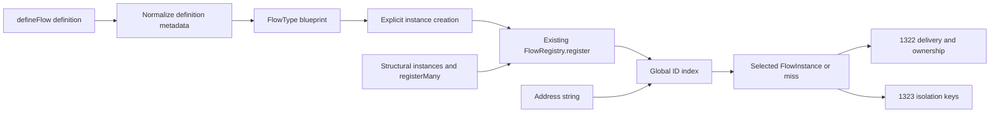

# FIX-1321: Instance cardinality and global-ID registry — Implementation Spec

## Part I — The Case

### 1. Problem — why it matters, why now

Registering two copies of the same flow can silently select the first copy, not the one the caller meant. Conductor already gives each board its own ID, so this is a live correctness gap, not preparation for a hypothetical product.

### 2. Solution in plain terms

Give each registered instance one global address. Ordinary flows keep their current address; definitions that support several copies declare that fact and require an ID for each copy. Change the existing registry, not add another one.

**Necessity: Build as scoped.** A user-owned map cannot repair lookup inside the framework. This extends the existing primitive as already scoped. Philosophy tenets 2, 3 and 5 support one registry, removing first-wins, and enforcing identity where every registration converges.

This is the first prerequisite of the [approved three-issue objective](https://github.com/fixpoint-labs/flow-state-dev/pull/1617). Addressed delivery/ownership and isolated storage remain FIX-1322/1323; this issue alone does not make collection deployment safe or close FIX-1315.

### 6. Decisions & rules — the sign-off surface

1. **Keep ordinary addresses; require custom-ID users to declare multiple-copy intent.** Omission means singleton, whose ID equals its kind. Conductor board IDs survive through explicit `collection`, not renaming; ordinary examples replace incidental `default` IDs with their kind. *Rejected:* inferring collection or preserving conflicting tutorial defaults. *Locks in:* custom-ID users make a visible declaration when upgrading; ordinary URLs stay unchanged, but listed example IDs change from `default`.
2. **An exact instance address always wins; an incomplete address never guesses.** IDs are unique across kinds. A collection requires its explicit ID even when only one copy exists. *Rejected:* first/only-member convenience and public kind/ID pairs. *Locks in:* callers coordinate names globally; an ID matching another kind still names that instance, not the kind.

**Non-goals:** delivery/envelope and durable ownership changes, isolated storage/migration, Devtool switching, Workforce mint, chat redesign/removal, message boards, new transports.

**Size:** 19 production/helper files · 8 behaviour groups · 8 substantive documentation surfaces plus 7 example-only surfaces · 1 implementation PR. Test-fixture repairs also span core, engine, CLI and affected consumers; this is a cross-repo authoring cutover, not a three-file registry patch.

### 3. Tradeoffs & alternatives

A user-space map is simpler but cannot control framework lookup. A kind/key pair permits reused IDs but creates the second public address the objective rejected. The real complexity is preserving custom-ID users and distinguishing a definition from an instance, not implementing a map.

### 4. Focus practices

- One registration convergence point, including direct structural instances and bulk registration (tenet 5).
- Remove the pair overload and first-wins branch together (tenet 3).
- BP-030 compatibility preserves known identities, never guesses ownership.

### 5. What using it looks like

Proposed usage; not executed during spec authoring:

```ts
import { defineFlow } from "@flow-state-dev/core";
import { createFlowRegistry } from "@flow-state-dev/engine";

const reports = defineFlow({ kind: "reports", actions: {} });
const registry = createFlowRegistry();
registry.register(reports());
registry.get("reports"); // that singleton; id === kind

const engineer = defineFlow({
  kind: "engineer", cardinality: "collection", actions: {},
});
registry.register(engineer({ id: "engineer-a" }));
registry.get("engineer-a"); // that instance
registry.get("engineer"); // undefined, even with only one copy
```

Conductor's existing `defineConductor({ id: boardId })` stays unchanged; its `defineFlow` declaration adds `cardinality: "collection"`. Its board address is not rewritten.

---

## Part II — The Build Plan

### 7. Technical design



#### Public identity and convergence

- Add definition-only `cardinality: "singleton" | "collection"`, default `"singleton"`; mirror normalized cardinality on `FlowType` and `FlowInstance`. Do not add an instance override. Reuse the existing definition-only runtime guard for untyped callers attempting one.
- Singleton creation defaults ID to the effective kind. A supplied different ID is invalid, not rewritten. Collection creation requires an explicit nonempty string ID. No framework ID allocator, UUID dependency, implicit mint, or automatic collection inference. Preserve current kind override capability: policy comes from the definition, and singleton equality uses the effective instance kind.
- IDs remain opaque strings; do not introduce a delimiter restriction, escaping scheme, or a second incarnation identifier. Global means within one runtime registry, not globally across installations. There is no kind-name reservation: a collection instance may deliberately claim an ID equal to a kind, including its own.
- `FlowRegistry.register` is the authoritative admission point: reject duplicate IDs across **all** kinds; reject singleton ID/kind mismatch (including legacy custom-ID instances with omitted cardinality, with a collection-declaration-required diagnostic); reject malformed cardinality/identity. Direct structural instances cannot bypass it. A missing cardinality on legacy structural input is accepted only for `id === kind` and normalized to singleton; malformed custom IDs must not infer collection. New typed instances carry cardinality explicitly.
- A registered kind has one cardinality policy. Refuse a later registration of that kind declaring the other policy; otherwise a hand-built singleton could turn a collection's bare kind into an accidental compatibility address. Distinct kinds may still have the intentional exact-ID collision in §9.
- Preserve per-registration transactional behaviour: validate cardinality, ID uniqueness and existing shared-schema compatibility before mutating indexes/participants. `registerMany` continues calling `register`; it is not made an all-or-nothing batch transaction. Existing earlier successful registrations remain if a later element fails.
- Registry returns admitted instances with normalized cardinality. Identity is registration metadata, not a mutable naming API; follow current object/reference conventions without adding freeze or rename mechanisms.

#### Lookup is smaller, not a second resolution protocol

Replace `get(kind, id?)` with `get(address)` returning `FlowInstance | undefined`, backed by a global-ID index in the same registry. Remove the pair overload and kind fallback. The existing kind index may remain for deterministic kind/ID-sorted `list()` and schema participation; it is not another public resolver.

An exact-only lookup implements every approved bare-kind case without a special algorithm: a singleton is already indexed by its kind; an absent collection-kind ID misses whether zero, one or many members exist; an intentionally registered exact ID wins. A miss stays `undefined`; ingress layers own named `flow-not-found` / `no-entry` refusal and are changed in FIX-1322. Do not add a result union or a second lookup API just to distinguish misses.

Preserve `describeSharedSchemas()` and its current kind-grouped compatibility rules. This issue does not widen schema validation into per-instance override compatibility, which is a separate documented limitation.

#### Definition construction is not instance minting

At researched base `cc4bd1e41`, `defineFlow.ts:1197` eagerly calls `createFlowInstance(definition, undefined)` to populate the callable's metadata. Putting the collection ID guard there would make every collection definition fail before the user can supply an ID.

Separate internal definition/config normalization from addressed instantiation within the existing module. Both blueprint metadata and real instance creation reuse that normalization; only the public factory invocation requires a collection ID. Do not manufacture a placeholder ID, register the blueprint, or export a second factory. Retain eager definition/entry/schema validation and existing metadata mirrors; do not recompute a normalized definition unnecessarily merely to obtain its properties.

#### Consumer boundary and source evidence

Research used source/reference searches; no language-server reference tool was available. No `getFlowDefinition` symbol exists on the researched main; do not invent one.

| Existing source | Observed behaviour / ownership |
|---|---|
| `packages/core/src/types/flow.ts:414-655` | Definition, optional instance ID/kind options, required instance ID, callable FlowType; FIX-1321 adds cardinality without a parallel type system. |
| `packages/core/src/flow/defineFlow.ts:169-205,983-1226` | Definition-only guard, effective kind, default ID, structural return and eager blueprint construction; FIX-1321 owns these writers. |
| `packages/engine/src/registry/flow-registry.ts:27-169` | Pair-scoped uniqueness, first-member fallback, sequential bulk registration and deterministic listing; FIX-1321 replaces identity lookup, preserves unrelated schema view. |
| `labs/conductor/src/flow.ts:1035,1133` | Definition plus custom `id: boardId`; FIX-1321 explicitly declares collection, preserving IDs. |
| `packages/engine/src/routes/{action,session,stream,resume,state,resource}-routes.ts`, `routes/debug-snapshot.ts`, `routes/route-auth.ts` | URL-address and persisted-kind readers. FIX-1322 owns selected-instance transport and owner checks, including backend debug reads; no Devtool UI project is implied. |
| `packages/engine/src/transports/host/{createInboundTransportHost,in-process-dispatcher}.ts`, `transports/auth/pickPrincipalResolver.ts`, `transports/webhook/routes.ts` | Dispatch/auth/ingress selection; FIX-1322 consumes this registry, never reimplements first/only-member logic. |
| `packages/engine/src/execution/{request-continuation,request-recovery}.ts`, `packages/bullmq/src/worker.ts` | Re-entry/worker resolution from persisted kind; FIX-1322 supplies durable owner ID, not a second lookup rule. |
| `packages/mcp/src/createMcpTransportAdapter.ts`, `packages/scheduled/src/routes.ts`, `packages/chat-sdk/src/{event-handlers,subscription-index}.ts` | Adapter selection/stamping belongs to FIX-1322; chat gets minimum compatibility only. |
| `packages/cli/src/commands/run.ts`, `packages/cli/src/chat/{loop,targets}.ts`, `packages/cli/src/resolve-flow.ts` | Config lookup and discovery can select/deduplicate by kind outside registry; FIX-1322 owns addressed execution/discovery, not a chat targeting feature. |
| `packages/engine/src/stores/scope-keys.ts` and resource key consumers | FIX-1323 receives selected `flow.id`, flags and resources. It does not ask registry to infer ownership or constrain opaque ID characters. |

One-argument consumers mechanically remain callable under the new signature, but kind-only persisted reads are **not** made safe by that fact. In particular, legacy `flowKind: "engineer"` must not resolve an unrelated instance whose exact ID is `"engineer"`. FIX-1322 persists `flowId` as owner, retains actual `flowKind` as shape metadata, and validates legacy ownership before lookup. Do not announce collection rollout until FIX-1322 and FIX-1323 have landed and their assembled goal passes.

### 8. Implementation sequence

1. **Definition policy and blueprint/instance separation:** modify `packages/core/src/types/flow.ts` and `packages/core/src/flow/defineFlow.ts`; cover collection declaration versus invocation and singleton equality. Keep scope/action inference intact. No new package.
2. **Registry admission and lookup:** modify `packages/engine/src/registry/flow-registry.ts`; replace pair lookup/first-member selection and add global uniqueness at registration, preserving schema-validation rollback and listing. Modify `packages/engine/src/routes/http-handlers.ts` only to expose cardinality beside existing `id`/`kind` in the flow-list metadata, not to deliver addressing or ownership changes.
3. **Clean author cutover:** modify `labs/conductor/src/flow.ts` to declare collection, preserve board IDs, and remove its comment promising bare-kind first-instance lookup. Update `packages/testing/src/runtime/createTestContext.ts`, a structural production helper whose cast bypasses compiler checks, with singleton metadata. Remove pair-overload calls, comments and tests; migrate actual pair callers to their known ID. Registry test pair calls are known; do not assume a production pair caller exists.

   Remove the obsolete optional second `id` parameter from the locally redeclared registry types in `packages/cli/src/chat/{loop,targets}.ts`; this is a signature-only correction, not recipient selection or chat redesign.

   Eleven additional production/example factories currently supply incidental `id: "default"`: `apps/kitchen-sink/flows/{chat-agent,rich-text-component,weekly-digest}/flow.ts`, `labs/knowledge-hub/src/flow.ts`, `labs/trading-desk/flows/{analysis,portfolio}/flow.ts`, `examples/guides/board-lifecycle/src/lifecycle-flow.ts`, `examples/guides/custom-pattern/src/word-count-flow.ts`, `examples/guides/research-team/src/flow.ts`, `examples/hello-chat/src/flows/hello-chat/flow.ts`, and `examples/knowledge-base/src/flow.ts`. Make ordinary singleton examples use the existing kind as ID by removing that incidental override; their old public kind-address and kind-owned persisted records stay unchanged, though the listed instance ID changes from `default`. Do not blindly mark all these flows collection: several unrelated kinds currently reuse `default` in one runtime. If inspection finds an ID is an actual application owner/reference rather than incidental example configuration, preserve it with explicit collection and surface any real global collision instead of renaming durable ownership. Conductor is the known such case.

   Migrate every consumer of each removed incidental override in the same cutover. Main confirmed the compatibility distinction: preserve singleton public kind-addresses/buckets and Conductor board IDs, not colliding tutorial `default` IDs. A real durable/reference consumer of a proposed incidental ID is evidence against removing it; preserve the identity and surface that conflict, without an alias or guessed owner.

   Repair factory-call and structural fixtures in `packages/core/test/flow.test.ts`, engine registry tests, CLI discovery/config/plugin fixture strings, testing-package utilities, `goals/**/*.mts`, and affected lab/adapter tests. Incidental IDs should not cause an unrelated negative test to fail before its intended validation. Keep valid singleton fixtures singleton; only collection behaviour fixtures opt into collection.
4. **Proof and release/documentation:** exercise §10, repair affected existing fixtures and docs examples, publish the public-contract changeset for core/engine. No changeset in this never-merged spec PR. FIX-1322 then handles all transport/owner/discovery consumers above; FIX-1323 handles isolated storage. This issue is one implementation PR, not a sub-PR DAG.

### 9. Edge cases & error handling

| Case | Expected |
|---|---|
| Collection definition inspected without invoking its factory | Metadata available; no addressed instance created and no missing-ID error. |
| Empty collection ID, invalid cardinality, singleton custom ID, instance-side cardinality override | Deterministic configuration failure; never rewrite/infer. Factory catches authored invalid input; registration also rejects malformed structural/legacy input. |
| Different definitions reuse one ID | Second registration refuses before any registry/schema mutation; first remains reachable. |
| Same kind mixes singleton and collection policies | Refuse registration, irrespective of order. |
| Kind `engineer` has IDs `engineer-a`/`engineer-b`; kind `billing` has ID `engineer` | `get("engineer")` returns billing; a registry constructed without the billing registration misses instead of choosing engineer-a. No unregister API is added. |
| A collection explicitly supplies its own kind as ID | It is an exact ID and valid if globally free; other members remain separately addressed. This is not implicit bare-kind selection. |
| Schema conflict on an otherwise unique ID | Existing `CrossFlowSchemaConflictError`; rejected instance is absent from lookup/list/schema participants. |
| Third element of registerMany fails | Earlier admitted elements remain, rejected and subsequent elements do not appear; no new bulk rollback promise. |
| Instance kind override | Existing override supported; singleton ID derives from effective kind, definition cardinality cannot be overridden. |

**Taxonomy:** configuration/admission failures require caller correction, not automatic retries. Unknown lookup returns `undefined`, as today. Transport refusal vocabulary and persisted migration failures are FIX-1322/1323 concerns. Do not catch invalid configuration and silently produce a default instance.

### 10. Testing strategy

**Planned real-path proof, not yet executed:** model-free because identity selection has no model-dependent behaviour. Instantiate real `defineFlow` definitions with simple handlers returning distinct instance markers; register with the production registry; look up each explicit ID and run its actual handler through `runAction`. A must return A's marker and B B's marker, regardless of registration order. A bare collection kind must produce no selected instance and no handler invocation. Add the exact-ID/kind collision and confirm the billing marker, not either engineer marker. Retain a singleton run addressed by its unchanged kind. Run this as a throwaway smoke scenario at implementation time; no fake registry or resolver mocks.

**Eight observable behaviour groups** at existing core flow/engine registry test seams, using `tdd` tracer bullets during implementation:

1. Singleton identity/default compatibility, including effective-kind override and refusal of a custom singleton ID.
2. Collection definition remains inspectable; invocation requires explicit ID and returns normalized policy.
3. Collection explicit-ID selection versus lone/multiple-member bare-kind miss; no first-wins by registration order.
4. Exact ID wins kind-name collision, including explicitly using own collection kind as ID.
5. Cross-kind duplicate IDs and mixed-cardinality registration fail without replacing an existing instance.
6. Structural/legacy producers and instance-option bypasses obey admission/definition-only policy; omitted legacy cardinality only preserves known singleton identity.
7. Failed schema registration leaves all registry views unchanged; registerMany retains its existing successful-prefix behaviour.
8. Conductor custom board ID is unchanged after explicit declaration; metadata listing exposes that ID, kind and cardinality without inventing a default board.

Update current first-wins/pair assertions in `packages/engine/test/registry-routes.test.ts`; they defend the removed contract and must not survive beside the new one. Permanent tests earn their place by failing on misselection, invalid admission or lost compatibility, not by asserting map layout or copied fields. The full dispatch/ownership/isolation goal is owed by FIX-1322/1323 and the epic, not claimed here.

**Actually executed for this spec:** read-only source/document/PR research and document-quality review only. No POC, build, test, formatter, linter, package install or executable validation. Runtime and type proof remain planned.

### 11. Documentation plan

**Required:** this changes public authoring and lookup. Extend existing pages; no new page/category/blog or sidebar reorder. The existing Fundamentals flow/options pair, Engine registry reference and Start here anatomy guide already give it a home. All leads describe use, not the implementation story. Audience is an app author familiar with actions; introduce cardinality as one versus several named instances.

| Surface | Placement, outline/example and cross-links |
|---|---|
| EXTEND `apps/docs/docs/fundamentals/flows.md` | Replace first-registered advice under FlowType vs FlowInstance. Lead: a definition describes a flow; a registered instance names one configured copy. Sections: singleton defaults, explicit collection IDs, registration/address lookup. Show §5's two calls. Link both ways with Flow options and Engine API. |
| EXTEND `apps/docs/docs/configuration/flow.md` | Add cardinality to definition-only options/table and normalized FlowType/FlowInstance metadata; explain factory ID requirement and failure behaviour. Replace custom `default` singleton intro. Link to flow concept and registry reference. |
| EXTEND `apps/docs/docs/api/server.md` | Existing createFlowRegistry section: exact lookup, global uniqueness, misses and collision example; document cardinality alongside ID/kind in the existing flow-list response. Preserve createFlowState as normal setup path; link flow concept/setup both ways. Do not document unshipped transport behaviour. |
| EXTEND `apps/docs/docs/server/setup.md` | Brief registration paragraph beside flows setup: ordinary singleton call and explicit collection IDs; link registry reference, not duplicate its table. |
| EXTEND `apps/docs/guides/anatomy-of-a-flow.md` | Existing flow-definition walkthrough: kind is type identity, ordinary singleton call uses no custom ID; link concept page. No new walkthrough. |
| EXTEND `packages/core/README.md` | Correct singleton example; terse definition-only cardinality note and link to Flow options. |
| EXTEND `packages/engine/README.md` | Registry paragraph: exact global ID plus miss/duplicate behaviour; link Engine API and setup. |
| EXTEND `docs/architecture/flows-and-actions.md` | FlowType/FlowInstance contract: declaration policy, normalized metadata, registration and exact ID; custom-ID example explicitly collection. Link current server contract rather than changing dispatch/storage here. |

**Mechanical example repairs, not new features:** current custom `id: "default"` singleton recipes also occur in `apps/docs/docs/{intro.md,api/core.md,devtool/setup.md,getting-started/project-structure.md,patterns/utility-blocks/core.md}`, `apps/docs/guides/building-a-chat-app.md`, and `docs/architecture/overview.md`. Change illustrative default instances to ordinary singleton calls, or explicitly declare collection when preserving an intentional custom identity. Audit templates/scaffolds for the same authoring contract. This does not optimize chat or add Devtool switching.

**Voice:** follow `docs/contributing/user-docs.md`: outsider-facing, runnable complete examples, flat explanation of results/errors, no internal issue numbers or rationale. Avoid undefined identity jargon, marketing adjectives and ornamental em-dashes. Keep source-level rationale here. Eventual docs writing/editorial pass follows that document; no site prose is changed by this spec.

### 12. Dependencies, open questions & follow-ups

- **Input:** [FIX-1320 epic PR](https://github.com/fixpoint-labs/flow-state-dev/pull/1617), immutable objective artifact `e1d5b701096105eb04954b4ec41545b3dc25e7cf:spec/_epics/flow-instances.md`. Owner approved the three-issue objective in session, recorded on FIX-1320 comment `4a714d24-2f94-4066-af07-15a74e7355ab`; the artifact's stale pending sentence does not revoke that. No individual spec is approved.
- **No hard upstream implementation blocker.** FIX-1321 merges before FIX-1322/1323. Their specs are authored independently against the selected identity seam, not cross-reviewed before individual approval. Linear currently has related issues but no hard blocked-by edges; merge sequencing is recorded here, not fabricated as a new dependency.
- **Adjacent #1600:** open at `a9b1fc261d29df994ff6d6b0470504202b54404d`, branch `claude/cross-flow-ff`, when researched. It overlaps core definition/types and docs but explicitly leaves instance addressing to this floor. Not landed and not an epic child. Reconcile ordinary merge overlap; FIX-1322 owns its cross-flow ownership/address interaction.
- **Existing primitive assessed:** `createFlowRegistry().register(instance)` already stores IDs; a local `Map([[a.id, a], [b.id, b]])` does not repair framework consumers. No provider-specific API or library is necessary. The approved scope already is the substrate refinement, so the necessity verdict is Build as scoped, not a scope change.
- **Industry alternatives:** [Temporal Workflow ID](https://docs.temporal.io/workflow-execution/workflowid-runid) separates a user-selected execution identity from run identity; use its one-address lesson, not its reuse/lifecycle policies. [Orleans grain identity](https://learn.microsoft.com/en-us/dotnet/orleans/grains/grain-identity) is type plus key; useful in other systems but rejected here because it requires the public pair. [Kubernetes names/UIDs](https://kubernetes.io/docs/concepts/overview/working-with-objects/names/) distinguish typed names and immutable incarnation IDs; a second identity is unnecessary for this registry. None establishes FSD's collision precedence; that comes from the approved objective.
- **Open product forks / empirical settlements:** none. Opaque ID handling in storage and legacy ownership migration are explicit FIX-1323/1322 responsibilities, not permission for fallback.
- **Deferred:** FIX-1324 Devtool switching and FIX-1325 Workforce mint; FIX-1330 chat removal is separate, neither child nor blocker. Shared-schema validation of differing per-instance resource overrides is already called out in registry comments; do not grow it into this issue.

---

## Spec evolution

- **Spec drafted** — framed as preserving named copies without first-wins; chose definition-owned cardinality and exact lookup in the existing registry, with explicit Conductor migration and downstream owner/storage boundaries.
