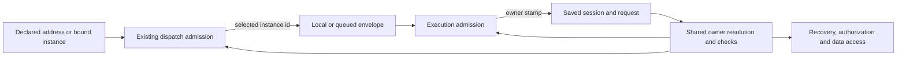

# FIX-1322: Addressed dispatch and durable instance ownership — Implementation Spec

## Part I — The Case

### 1. Problem — why it matters, why now

Dispatch forgets which copy of a flow was selected; saved sessions identify only its kind. Restarting or reading later can choose another copy's configuration or data. Conductor already needs distinct copies.

The original symptom was a bug; public addressing and persisted ownership are new contracts: **specRequired: Feature**. Only the three-issue objective is approved.

### 2. Solution in plain terms

Carry the chosen instance through dispatch. Save its identity on sessions and requests, and check that owner before execution, recovery or data access.

**Build as scoped.** Application binding cannot preserve a recipient across framework-owned queues and saved records. Extend existing delivery under the approved [flow-instances objective](https://github.com/fixpoint-labs/flow-state-dev/pull/1617). Philosophy tenets **1**, **3** and **5** support one identity, no second addressing API, and checks where paths converge.

### 6. Decisions & rules — the sign-off surface

1. **Addressing saved work through another instance cannot transfer it.** Reject implicit adoption. *Locks in:* same-kind peers start separate work; recovery cannot substitute for an unavailable owner.
2. **Unknown historical owners require explicit migration.** Reject guessing from available copies. *Locks in:* custom-id deployments need an inventoried, quiesced cutover; known singleton history remains compatible.

**Non-goals for this issue:** registry/cardinality remains FIX-1321's scope even in the shared implementation PR; storage namespaces remain FIX-1323's separate scope. No new delivery modes, message boards, fan-out, Devtool, Workforce minting or chat redesign/removal.

**Delivery plan:** land FIX-1321's registry/cardinality semantic switch and FIX-1322's complete consumer/owner cutover atomically in **one shared implementation PR**, with **FIX-1322 as integration owner**. Exact-id registry lookup cannot safely land ahead of live kind-addressed consumers. The issues retain separate scope, acceptance and goal accountability; FIX-1322's planning size remains approximately 65 production files · 12 test behaviours · 30 documentation surfaces, not an estimate for the combined PR. Both individual specs and the later cross-spec gate require owner approval before implementation. This absorbed engineering sequencing decision is not whole-spec approval.

### 3. Tradeoffs & alternatives

A registry-only fix loses the owner on persistence. A new address object expands callers and violates the single-id contract. Retain existing address slots, distinct from stored kind metadata. Complexity is at admission and restart/migration boundaries.

### 4. Focus practices

- **BP-030:** tolerate known old singleton shapes, never invent a collection owner.
- **BP-035:** exercise re-entry, queue admission and create-race winners, not just initial dispatch.
- **Tenet 5:** owner checks precede writes, resolver selection and resource loading.

### 5. What using it looks like

Existing field spellings remain; address values are instance ids. Proposed outcomes:

```ts
import { createClient } from "@flow-state-dev/client";
const east = createClient({ flowKind: "review-east", userId: "u_1" });
const west = createClient({ flowKind: "review-west", userId: "u_1" });
await east.sendAction("review", { invoiceId: "inv_42" });
// A west action carrying a session owned by east refuses; it does not transfer it.
```

```text
fsdev run review-east review --input '{"invoiceId":"inv_42"}'
# Runs east; a collection's bare kind never picks a member.
```

---

## Part II — The Build Plan

### 7. Technical design

#### Baseline and the shared contract

Research baseline: fresh `origin/main` at `cc4bd1e41`. The immutable epic reviewed here is [PR #1617 at e1d5b701](https://github.com/fixpoint-labs/flow-state-dev/blob/e1d5b701096105eb04954b4ec41545b3dc25e7cf/spec/_epics/flow-instances.md). Its stale pending-objective text is superseded by the owner's session approval, recorded in FIX-1320 comment `4a714d24-2f94-4066-af07-15a74e7355ab`; no individual approval is implied.

FIX-1321 supplies `FlowRegistry.get(address)` as exact global-id lookup, returning an instance or missing. It removes `(kind,id)` lookup. Singleton `id === kind` preserves existing addresses; collection needs its explicit id, including a lone member. If a billing instance has id `engineer`, address `engineer` selects billing, even while kind `engineer` has other instances. No second resolver, first-wins lookup or fallback is introduced here.



#### Address fields and owner fields have different roles

| Surface | Contract after cutover |
|---|---|
| HTTP `/:flowKind/...`, client/CLI target, authored cross-flow selector, `InboundRequestEnvelope.flowKind`, `DispatchEnvelope.flowKind`, BullMQ `FlowJobData.flowKind` | Existing address-slot spelling retained; **value is the selected `flow.id`**. No parallel `flowId` selector or precedence between two fields. |
| New `SessionRecord.flowId`, `RequestRecord.flowId`, `ActiveRequestEntry.flowId` | Durable/logical owner id, stamped from the selected instance. Required for new framework writes; legacy decoded records can lack it. |
| `SessionRecord.flowKind`, `RequestRecord.flowKind`, active-record kind, descriptive/logging metadata | Actual definition kind, derived from the selected instance. Never an address for record-driven routing. |
| `ctx.flow` / resolved `FlowInstance` | Carries both facts already; retain it rather than re-deriving selection from a kind string. |

This deliberately uses one historical wire address field instead of adding an alias. Its old name is documented, not deprecated. All materializers must use resolved `flow.kind` for kind metadata and `flow.id` for owner fields; copying the address string into both is wrong. Singleton URLs, envelope values and storage ids stay unchanged. New owner fields are additive record data, not re-keying.

For a dispatch originating inside a running instance, omitted cross-flow selector binds explicitly to that running instance's id. An explicit selector always resolves as an id, even if its string equals the sender's kind; it must not shortcut to the sender. Adapters may receive the declaration from their existing application binding. Handler matching alone is not recipient selection. Existing integrations without a declared collection recipient refuse rather than selecting a copy or expanding to every copy; no new targeting configuration is commissioned.

#### Convergence and ordering

Add one engine-owned interpretation of loaded-record ownership and one reusable owner-compatibility check. Exact code placement is an implementer call, beside existing session/adoption helpers, not a new registry or ownership store. Resolve an owned record with `get(record.flowId)` and validate its actual kind against `record.flowKind`; missing owner instances refuse. Metadata, display labels and a URL cannot override a stored owner.

Use that shared logic at both admission levels:

- **Transport admission:** `createInboundTransportHost` resolves the declared recipient and validates existing session/request identities before enqueue materialization or acceptance. The current unconditional queued request write must not overwrite a foreign request id. Preserve accepted/discoverable semantics and existing concurrency policy.
- **Execution admission:** direct `runAction`, local dispatcher, queue worker, continuation and retry must all reach owner checks **before** active registration, `latestRequestId`, user/org creation, history/resource preload or request adoption. Context construction must also guard its direct entry and re-check a create-race winner. An early check without an atomic create/adoption check is insufficient.
- **Saved-record access:** management authorization selects the stored owner's principal resolver before applying existing tenant/user/org rules. Session/request routes then reject an addressed-instance mismatch before state transitions or data access. State, resource and debug handlers use the same resolved owner to select schemas/providers. No owner-specific reader resolves by stored kind independently.

Ownership strengthens existing authorization, source allow-lists, immutable org binding, tenant namespacing and lineage/incarnation fences; it replaces none of them. Keep current not-found/disclosure policies at public boundaries. Do not widen webhook/internal/task public re-entry. Do not change host-wide concurrency key-sharing policy in this issue; any callback field documented as kind remains actual kind.

The existing `ensureSessionRecord` resource-tombstone reclamation race is not closed by an owner check: a delayed creator can purge a winner's tombstones before losing session CAS. `ensure-session-record.ts` documents the required scope-generation work as FIX-1000. This issue prevents adoption/execution and admission-owned writes against a foreign owner; it does not promise atomic resource reclamation across stores or commission scope generations. Validate the race winner without moving reclamation into a new unsafe ordering.

#### Child, reply and lineage boundary

[PR #1600](https://github.com/fixpoint-labs/flow-state-dev/pull/1600), OPEN at research head `a9b1fc261d29df994ff6d6b0470504202b54404d`, is adjacent work, not landed code or this issue's implementation. It introduces authored cross-flow selection and the `target` to `action` cutover. Preserve its named `flow-not-found` / `no-entry` outcomes and accepted-versus-not-started guarantees when integrating.

Replace **kind inequality** with **resolved instance-id inequality** wherever it decides the same-instance/cross-instance boundary: static/carried dispatcher validation, recipient resolution, child-key derivation and lineage inheritance. Same instance retains existing child derivation and lineage. A different destination instance, including same-kind peers, gets #1600's cross-flow child treatment: destination id distinguishes derived child keys and a separate lineage is minted. Adoption and existing-session delivery require the stored session owner to equal the **resolved recipient**, not the sender. For two singletons, destination id preserves #1600's kind-based key bytes because id equals kind. Existing custom-id children with old derivation require explicit migration rather than silent adoption at new keys.

`{ from: true }` remains a source-gated seam-stamped session target, not authority to switch recipient. Preserve #1600's explicitly addressed reply to the original owner's instance: the recorded session owner must equal the resolved recipient; an omitted/incorrect recipient that resolves elsewhere refuses. Principal/tenant/org, sender-incarnation and external-dispatcher restrictions remain. Correlation and descendant/listing/liveness traversal may cross owners where #1600 already permits it; validate each record under its own owner without equating all descendants to the parent's owner. Do not filter child lists back to the parent's id or share cross-instance lineage resources.

#### Durable storage and legacy cutover

Persist the owner on every creation path and retain it on every subsequent update. Exclude `flowId` from conditional mutable request fields just like other indexed identity. Memory/filesystem stores and SQLite/Postgres adapters must round-trip it, including active-registry explicit serializers and schema migrations. Add exact-owner filtering for addressed session/request enumeration without redefining existing broad administrative `flowKind` filters. Kind grouping is still useful; it is not ownership.

Legacy record resolution:

1. A non-null stored `flowId` is authoritative; validate target existence, actual kind and agreement between a request and its session. Conflicting owners are a refusal, never a repair-on-read.
2. Without `flowId`, preserve default singleton history only when the resolved definition is a singleton whose `id`, `kind` and stored `flowKind` all agree. Deployment inventory must establish this was historically a default singleton, not a custom-id instance now relabelled. Runtime string equality cannot discover deployment history.
3. Any ownerless collection/custom-id history requires an explicit per-record owner mapping and offline backfill, or a named `migration-required` refusal. One currently registered collection member proves nothing. A legacy `flowKind: engineer` must not be assigned to an unrelated billing instance whose id happens to be `engineer`.

Commission a documented **adapter-native offline cutover**, not a generic migration service: quiesce producers and execution; drain old queues/active work; back up and inventory session/request records plus FIX-1323's cells; map explicit record ids to known registered ids; validate kind, tenant, session/request and parent/lineage relationships; backfill owner fields without changing record ids; verify readback before resuming. An interrupted run is safe to repeat for already-identical mappings; a conflicting stamped owner stops it. No store-wide transaction or all-scope enumeration is assumed. SQL schema changes may add nullable legacy owner columns but must not blanket-backfill `flowId = flowKind` for collection history.

Old queued envelopes have no way to distinguish a historical kind from a newly explicit colliding id. Therefore collection rollout requires that drain, not an unsupported mixed-version rolling guarantee. Default singleton old queues remain compatible. Scope/resource migration belongs to FIX-1323: it supplies provenance-aware preflight refusal, not a claim that runtime can identify arbitrary old cells. Session resource keys remain session-bound; owner validation prevents entry through another instance.

#### Necessity and research

The existing primitive is application binding plus `dispatcher()` / `host.dispatch`; there is no user-space hook that makes all durable readers obey that binding. The delta is framework lifecycle composition, not discoverability or vendor knowledge. Keep this approved scope rather than a wrapper, a second address, or new workflow machinery.

External precedents inform principles, not APIs: [Orleans logical grain identity](https://learn.microsoft.com/en-us/dotnet/orleans/grains/grain-identity) survives activations, but its composite type/key address is rejected here; [Temporal workflow versus run identity](https://docs.temporal.io/workflow-execution/workflowid-runid) supports stable ownership and explicit conflict refusal, not importing replacement policies; [Cloudflare durable-object migrations](https://developers.cloudflare.com/durable-objects/reference/durable-objects-migrations/) support declared historical identity changes, not guessing from today's deployment. No library or dependency is needed. Read-only research found the owning paths; no executable POC or validation was run during specification.

### 8. Implementation sequence

One shared implementation PR integrates FIX-1321's registry/cardinality semantic switch with the complete FIX-1322 consumer/owner cutover; FIX-1322 is integration owner. The registry switch must not land ahead of its live kind-addressed consumers. The work slices below are FIX-1322's contribution, not independently shippable sub-PRs; integrate FIX-1321's separately specified acceptance and goal proof in the same landing. Do not dispatch duplicate implementation workers to land the two issues independently. Require approval of both individual specs and the later cross-spec gate before coding; this sequencing fold passes neither gate. Refresh #1600 before coding and converge its overlap rather than copying a stale diff. No alias, first-wins fallback, temporary collection ban, new child or public pair bridges the cutover.

| Order | Existing modules to modify; removals | Observable slice |
|---|---|---|
| 1 | Engine `stores/types.ts`, `context/initial-request-record.ts`, `context/ensure-session-record.ts`; memory/filesystem stores; `store-sqlite` and `store-postgres` session/request/active-registry serializers and schemas. Add shared engine owner interpretation near adoption helpers. | Owner survives persistence/reopen; legacy singleton reads, ambiguous collection refusal. |
| 2 | `context/createExecutionContext.ts`, `execution/runAction.ts`, `transports/host/createInboundTransportHost.ts`, `context/detached-child.ts`; session birth in `routes/session-routes.ts`, webhook session resolver and existing integration seeds. | Refuse known foreign owners before admission effects; losing creators cannot adopt/execute a foreign winner. Preserve the separately documented reclamation limitation. |
| 3 | `transports/types.ts`, `transports/dispatcher.ts`, local dispatcher, `context/dispatch-operation.ts`, `flowstate/createFlowState.ts`, `routes/http-handlers.ts`, core dispatch declarations/#1600, task-board hand-off. Remove forwarding of `.kind` as recipient and same-kind fast paths. | Exact-id selection survives ordinary/internal/task dispatch and carried-action paths. |
| 4 | BullMQ `types.ts`, `dispatcher.ts`, `worker.ts`, `schedules.ts`; MCP adapter; engine webhook routes; scheduled routes; CLI `resolve-flow.ts` and `commands/run.ts`; client typed bindings/types and React stored-request re-entry. Audit existing bound integrations, including minimal chat compatibility only. Remove CLI kind dedup/`.find(kind)` selection; distinct ids survive discovery and duplicate global ids refuse through registry rules. Typed clients bind `flow.id`; React retry/resume uses returned owner id, not stored kind metadata. | Every producer retains its declared id, including client bindings and later hook re-entry; queue round-trip and CLI choose the same copy. |
| 5 | `execution/request-continuation.ts`, `execution/request-recovery.ts`, active request metadata; `routes/route-auth.ts`, action/session/status/stream/recovery/resume/child-session/state/resource routes and `debug-snapshot.ts`; `context/liveness-read.ts`, shared resource context construction. Remove record-driven `get(record.flowKind)` and kind-only ownership comparisons. | Restart/re-entry and later reads use durable owner; active fallback never overrides a disagreeing durable record. |
| 6 | `context/create-request-host.ts`, `context/detached-child.ts`, `execution/dispatch-metadata.ts`, carried-core dispatch validation and #1600's consumers. Preserve action rename, trust stamps and refusal shapes. | Same-kind peers take existing cross-flow boundary; same-instance compatibility holds. |
| 7 | §10 goal/tests; §11 docs and release changesets for changed public packages; documented offline migration. | Real owner continuity proved; no obsolete addressing examples, first-wins tests or generated scaffold remains. |

The approximately 65-file footprint includes explicit adapter copies, client/React bindings and all ingress/re-entry readers, not just the three central engine files. Reconcile caller and adapter inventories against the refreshed tree; omission from this directional table is not permission to retain a second owner decision. Preserve `flowId` through client request/session response types and projections; typed-client `FlowLike` must represent the selected instance rather than reconstructing its address from kind. These are API binding corrections, not a UI or Devtool feature.

Typed-client binding distinguishes an instance from a definition: a supplied instance binds its `id`; a singleton definition can retain kind-based construction because its normalized id is that kind. A collection definition alone is not a recipient and must require a minted instance, not guess one or add a second selector. Preserve existing singleton authoring ergonomics. Record-backed React retry uses the returned owner id; legacy singleton response interpretation follows the same compatibility rule, not a client-side collection fallback.

### 9. Edge cases & error handling

| Case | Expected boundary |
|---|---|
| Explicit address equals another kind's name | Exact-id instance wins, then its entry map is checked; no sender-kind shortcut. |
| Missing collection id / lone bare kind | Existing named flow miss; no enqueue, mint or fallback. |
| Caller names another owner's session/request | Named owner mismatch; public boundary retains existing concealment/status policy. No side effects. |
| Session creation loses a race to foreign owner | Re-check winner; never overwrite/adopt. Public explicit create keeps conflict behavior. |
| Queued request id already exists for another owner | Refuse before request materialization and acceptance; worker rechecks independently. |
| Durable request and active entry disagree | Durable owner wins authority; reject incompatible active identity, do not combine fields into a new owner. |
| Record owner id exists but actual kind differs | Refuse inconsistent ownership; no schema/provider/resolver chosen from a colliding kind string. |
| Legacy collection request without session | Requires its own explicit owner mapping; no session-based guess is possible. |
| Owner removed from registry | Named missing owner; do not reroute to a sibling. |
| Existing internal/task reply names original owner explicitly | Preserve #1600 delivery when the resolved recipient owns the stamped session; wrong/default peer recipient refuses `session-not-addressable`. Existing adoption conflicts remain `key-occupied`. |
| Dynamic scheduled action crosses unsupported queue/recovery path | Preserve existing nonserializable/nonrecoverable restriction. |
| Migration stopped halfway | Remain quiesced; repeat identical mappings or refuse conflicts, never serve a mixed attribution. |

Owner/address/migration refusals are deterministic and non-retryable until input or deployment is corrected. Storage/network failures keep existing retry classification. A shared internal owner mismatch may surface as `wrong-instance-session` / `wrong-instance-request`; existing dispatch refusal names and public non-disclosure remain stable. Do not make a refusal look like accepted background work.

### 10. Testing strategy

**Discipline:** feature tracer bullets at the real engine admission and record-backed route seams. Extend existing behavioural tests; do not assert wiring or wording. No tests/builds/formatters are executed for this prose-only spec.

**Goal:** a model-free real-path harness under `goals/flow-instances/owner-continuity/` with two registered collection instances A/B whose handlers and configuration return distinguishable markers. Through the actual host and filesystem or SQLite stores, address A then B; restart the host over those stores; re-enter A's session/request, read A's state/resource projection and attempt all of that through B. A remains A, B refuses before execution or mutation, and removing/reordering B never redirects A. Exercise the actual CLI and BullMQ adapter/worker target round-trip separately; no mock dispatcher may stand in for the external delivery path. No model is needed because the goal is deterministic identity, not generated content.

Once FIX-1323 is integrated, run the assembled epic scenario using isolated user state and resources: A and B write different markers, later reads see only their own, wrong-instance session re-entry refuses, lone bare kind refuses, collision exact id wins, and default singleton URLs/buckets still work. The owner-continuity goal can prove this issue without claiming the separately owned isolation key change has landed.

**Twelve CI behaviours** (each should fail on a plausible regression):

1. Every declared recipient remains exact across HTTP, generic/typed clients, bound adapter, internal/task, direct execution, CLI and serialized queued/scheduled delivery.
2. Lone collection bare-kind misses and explicit id/kind collisions select the actual exact-id owner.
3. New sessions, requests and active entries preserve owner across memory/filesystem/SQLite/Postgres round-trips and reopen.
4. Wrong-owner direct execution refuses before session/request/user/resource changes or active registration.
5. Session creation/adoption races validate the winning owner; losing dispatch cannot claim it.
6. Queued pre-existing request-id collision cannot overwrite or acknowledge another owner's work.
7. Continue, retry, resume and stream re-entry, including React hooks, keep owner through restart and reject wrong URL/active-entry attribution.
8. State/resource/debug and management-auth readers select the recorded owner's declarations/resolver; existing principal/tenant/source restrictions still apply.
9. Same-instance child/adoption/reply/lineage keeps compatibility; same-kind peers get #1600's cross-flow child keys/lineages and may explicitly reply to the original owner, while a wrong/default recipient refuses.
10. Child listing/traversal retains valid cross-flow descendants without treating their owner's data or lineage as the parent's.
11. Known singleton legacy rows and old wire shapes work; collection ownerless rows, lone-copy guesses and wrong-kind id collisions refuse migration.
12. Explicit offline mapping preserves session/request agreement, is repeatable for identical mappings and stops on conflicting stamped owners.

Existing anchors include engine `session-create-race-bindings`, `lineage-address-ownership`, `runtime-dispatch`, host/queued-liveness, request-recovery, suspension/resume, stream, management-auth and session-request suites; adapter conformance lives in `engine/src/stores/testing/` and SQL adapter tests. Preserve queued acceptance, incarnation guards and continuation item ordering. Goal evidence belongs in the implementation PR, not an unearned claim in this spec.

### 11. Documentation plan

**Required:** public target semantics, durable owner refusal and operational migration are observable contracts. Extend existing pages; **no new page or sidebar change**. Existing Engine/Advanced/persistence categories already fit. Audience is application authors first, adapter authors and operators where named. Lead with the outcome, define instance versus kind once, use complete minimal TypeScript/CLI examples at implementation, and show refusal behavior without marketing language or issue history (`docs/contributing/user-docs.md`, `writing-for-humans.md`). Fresh writer/editor review applies during implementation; do not expand into a corpus rewrite.

Each row is one surface (30 total). Most companion changes are a terminology correction or link, not another tutorial.

| Surface: EXTEND | Insertion, outline and smallest example | Links / voice constraints |
|---|---|---|
| `apps/docs/docs/server/setup.md` | Before API Endpoints: “Addressing an instance”; “Keeping a session with its owner.” East action succeeds, west reuse refuses. | Link fundamentals flow instances, persistence ownership and durable execution both ways. Id is not an auth credential. |
| `apps/docs/docs/advanced/inbound-transports.md` | After adapter example: target id travels unchanged; stored-owner re-entry. Update existing envelope example, retaining field spelling. | Link setup/auth/durability; distinguish transport trust from ownership. |
| `apps/docs/docs/advanced/durable-execution.md` | Within suspended-request resume: recorded owner survives restart; retry does not transfer ownership. | Link persistence/auth; distinguish execution resume from SSE reattach. |
| `apps/docs/docs/persistence/overview.md` | After persisted data: owner fields; ownerless history; quiesced mapping/drain/backfill/readback checklist. Mapping table, not an invented API. | Link setup/durability/FIX-1323-owned flow-isolation page; no automatic migration promise. |
| `apps/docs/docs/server/authentication.md` | Addressed-route scope: select stored owner's resolver, then existing principal/tenant policy; east/east versus east/west table. | Link setup and persistence; owner id is not authorization. |
| `apps/docs/docs/advanced/manual-flow-execution.md` | Existing `runAction` example: supplied instance owns new records; foreign session refuses even without a host. | Link setup and ownership; no second runner. |
| `apps/docs/docs/server/background-work.md` | Existing child and `{id}`/`{from}` explanation: instance equality, cross-instance lineage/refusal, legitimate child listing. | Link persistence and durable execution; preserve source restrictions. |
| `apps/docs/docs/api/server.md` | `parseFlowRoute` / `runAction` reference descriptions: address-slot meaning and owner admission. | Link primary setup page instead of repeating its tutorial. |
| `apps/docs/docs/api/cli.md` | Existing `fsdev run <flowKind> <action>` section: target argument is exact id; singleton invocation unchanged. | Link setup and fundamentals. |
| `apps/docs/guides/background-jobs-bullmq.md` | Existing enqueue example forwards selected id; short drain-before-collection-upgrade note. | Link inbound transports and persistence migration. |
| `apps/docs/guides/human-in-the-loop.md` | “How a pause works”: same saved owner on resume. Reuse existing example. | Link durability owner section; no UI change. |
| `packages/engine/README.md` | Inbound transport and re-entry paragraphs: exact address, durable owner, direct execution guard. | Link primary pages; keep terse. |
| `packages/core/README.md` | Existing dispatcher reference: retained cross-flow selector spelling now names instance id. Minimal explicit target example after #1600 integration. | Link background work; no second selector. |
| `packages/cli/README.md` | Existing `fsdev run` example/argument help: instance id, not first matching kind. | Link CLI reference. |
| `packages/bullmq/README.md` | Existing dispatcher/worker example: preserve target; drain legacy collection jobs for upgrade. | Link migration guide; no rolling-upgrade promise. |
| `docs/architecture/inbound-transports.md` | Envelope/host contract: address-versus-kind roles, all producers, admission before materialization. | Link durable ownership contract; maintainer-level invariant. |
| `docs/architecture/dispatched-work.md` | Child/adoption/reply/lineage sections: same owner versus cross-owner, queue acceptance and migration. | Link action forms and state/scopes. |
| `docs/architecture/action-forms.md` | Existing dispatcher/session-target rules: instance check without widening delivery modes. | Link dispatched work; preserve #1600 shape. |
| `docs/architecture/server-and-client.md` | Canonical endpoints/client targeting and stored-owner authorization/re-entry. | Link inbound contract; no client UI redesign. |
| `docs/architecture/state-and-scopes.md` | **Ownership/child sections only:** session/request flowId, early owner admission and lineage boundaries; remove claim kind alone isolates sessions. | FIX-1323 owns namespace sections; coordinate shared-file integration, not competing formulas. |
| `docs/architecture/flows-and-actions.md` | Request execution/route sections only: resolve id, validate owner, stamp records and recover by owner. | FIX-1321 owns declaration/cardinality sections; integrate without overwriting them. |
| `apps/docs/docs/configuration/client.md` | Existing client/provider option tables: `flowKind` is an instance address. Reuse existing singleton example. | Link setup; no duplicate migration explanation. |
| `apps/docs/docs/client/overview.md` | Generic/typed client introduction: bind an instance, preserve its owner on later calls. One typed-client invocation. | Link configuration/client and setup. |
| `apps/docs/docs/api/client.md` | Existing action/session client and returned-record references: address versus owner metadata. | Link persistence ownership and client overview. |
| `packages/client/README.md` | Existing `createTypedClient` example: bind the supplied instance id; returned records retain owner for recovery. | Link client overview; retain concise examples. |
| `packages/react/README.md` | Provider `flowKind` option and resume/continue descriptions: instance address and stored-owner re-entry. | Link React API; no rendering change. |
| `apps/docs/docs/api/react.md` | Existing `resumeLatestRequest` / `continueRequest`: re-enter recorded owner. | Link durable execution, not a new tutorial. |
| `apps/docs/docs/client/react.md` | Existing re-entry example and provider binding: preserve exact owner. | Link setup and durable execution; no UI redesign. |
| `packages/store-sqlite/README.md` | Schema-evolution promise: distinguish automatic DDL from operator-attributed historical owners. | Link persistence migration; no “no manual migration” blanket promise. |
| `packages/store-postgres/README.md` | Scope “no offline step/backfill” to the existing items migration, not owner migration. | Link persistence migration; no duplicate SQL recipe. |

No chat-specific acceptance/example/page is added. Correct adapter migration promises as well as identity-field descriptions without duplicating the primary migration checklist. Add release changesets for changed public packages during implementation; this never-merged spec PR needs no changeset. The implementation docs writer receives only a surface brief/public API/test entry points; a separate implementation-blind editor reviews to SHIP under `user-docs.md`.

### 12. Dependencies, open questions & follow-ups

- **FIX-1321 + FIX-1322 land atomically:** exact-id registry and explicit collection declaration are technical prerequisites within one shared implementation PR, not a separately merged predecessor. FIX-1322 owns integration; each issue retains its own spec, acceptance and goal accountability. Both individual specs and the later cross-spec gate require owner approval; the engineering sequencing decision neither asks for that decision again nor authorizes implementation. FIX-1323 stays a separate implementation PR with the required identity/owner prerequisites. Full floor proof includes all three, including isolation, before rollout is claimed safe.
- **#1600 is adjacent, OPEN at a9b1fc261:** converge its dispatch/action rename and child/reply/lineage changes before FIX-1322 merges. It is not a child, an already-landed implementation or authority to start code. Refresh status/head during implementation; if still open, coordinate seam ownership rather than ship competing versions.
- **#1223** is open adjacent management-auth work (head `e148f8d476c26f8fbfe95daa0bad6294bc70091c` at research). Preserve its tenant-auth correction when integrating; it is not demonstrated as a prerequisite for this spec.
- Linear currently has no hard blocked-by relations. This spec records the atomic landing plan without inventing a new product blocker. Project is Orchestration Primitives; no fitting existing milestone was established, so none is invented.
- **Open persisted-contract fork — historical child keys:** [review r3952348303](https://github.com/fixpoint-labs/flow-state-dev/pull/1633#discussion_r3952348303) identifies a conditional conflict between §7's destination-kind-to-id child derivation and its unchanged-record-id backfill. If inventory finds children created under the old cross-flow derivation for a custom-id destination, stamping the owner alone cannot make repeat dispatch find the old child. Current research baseline lacks cross-flow child dispatch and #1600 is unlanded; affected deployed history is not established. The spec does not authorize silently forking that history.
  - **Recommendation for owner decision:** retain one runtime derivation and explicitly re-key affected children plus dependent records/references during the quiesced offline migration. This preserves repeat-dispatch continuity without permanent legacy lookup, but changes the current record-id preservation promise, existing saved links and the migration inventory.
  - **Alternative:** an explicit owner-stamped legacy-key adoption rule preserves old record ids/links, but adds a second persisted lookup/precedence contract and ongoing ambiguity handling. Neither alternative is selected by this review batch.
  - **What changes the recommendation:** verified inventory showing no affected history makes this a documented preflight exclusion, with no re-key or legacy adoption needed; a requirement that old session ids/links remain stable favours the adoption alternative. The cost of a wrong choice is split child history or broken saved references. Resolve this conditional migration promise before individual sign-off; do not broaden scope by implementation inference.
  Approval remains of Parts I+II; no approval, merge, spec closure or implementation is authorized by publication.
- Devtool (FIX-1324), Workforce mint (FIX-1325) remain deferred. Chat removal FIX-1330 is neither a child nor blocker. Message-board routing remains outside the floor.
- Existing scope-generation gap FIX-1000 remains separate: resource tombstone reclamation is not a cross-store atomic ownership fence. The owner-admission guarantee does not claim to close that pre-existing lifecycle race.

### 13. Review notes for the implementer

First external feedback batch; these observations do not select a new approach or narrow lifecycle, reader, typed-client, React or documentation coverage. Quoted feedback is retained as implementation input, not a finished API or mandatory helper/index design.

- **Existing convergence machinery** — [Cursor r3952329433](https://github.com/fixpoint-labs/flow-state-dev/pull/1633#discussion_r3952329433):

  > Good convergence point. Consider explicitly anchoring the shared helper to **existing** machinery — extend `evaluateAdoption` / `binding-errors` / `pickPrincipalResolver` rather than introducing a parallel "ownership subsystem." The codebase already treats user/tenant/org binding mismatches this way; instance owner is the same class of check at a different boundary.

- **Performance** — [Cursor review](https://github.com/fixpoint-labs/flow-state-dev/pull/1633#pullrequestreview-5134954030):

  > **Performance:** dual transport+execution admission is inherent to durable queues; acceptable if `ctx.flow` is threaded and `flow_id` indexes are added for list filters.

- **Anonymous management filtering** — [Codex r3952348298](https://github.com/fixpoint-labs/flow-state-dev/pull/1633#discussion_r3952348298). Apply §7's recorded-owner authorization to host-wide listing and recovery too; broad administrative kind grouping is not authorization:

  > When same-kind instances override authentication differently, the current host-wide listing and recovery paths cannot enforce this owner-specific rule: `unauthenticatedFlowKinds()` reduces open instances to `flow.kind`, and session listing, active-request listing, and interrupted-request sweeping filter on that set. An anonymous peer therefore makes every authenticated peer of the same kind anonymously visible and allows its requests to be marked interrupted. Require these authorization filters to use durable owner IDs or evaluate each record's owner resolver, while retaining `flowKind` only as an administrative grouping filter.

- **Concurrent queued admission and cleanup** — [Codex r3952348302](https://github.com/fixpoint-labs/flow-state-dev/pull/1633#discussion_r3952348302). Apply the existing no-foreign-write/no-acceptance contract to concurrent request creation as well as already-present records; a pre-read alone is not the required atomic admission:

  > For concurrent queued deliveries using the same caller-supplied request ID, validating existing records before materialization is a TOCTOU race: both admissions can observe absence, while the current host unconditionally registers the active entry and writes the request with `"any"`. Require an atomic create-if-absent/lost-winner owner check plus owner-fenced active-entry registration and cleanup before acceptance; otherwise one instance can overwrite or deregister the other's work despite the promised collision refusal.

## Spec evolution

- **Spec drafted** — promoted the original lookup bug to a new addressing/ownership contract, retained existing wire address slots and chose durable owner checks plus explicit historical mapping across one cutover.
- **After EM sequencing decision** — combined FIX-1321's registry semantic switch and FIX-1322's complete consumer/owner cutover into one shared implementation PR owned by FIX-1322, because exact lookup cannot land safely ahead of live kind-addressed consumers. Separate issue acceptance/goals, individual approvals, the later cross-spec gate and §12's historical-child-key owner fork remain; this direct decision fold adds zero automatic review rounds (aggregate: one).
