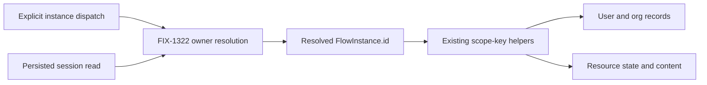

# FIX-1323: Instance-isolated state and resources — Implementation Spec

## Part I — The Case

### 1. Problem

Two copies of the same flow can currently overwrite each other's supposedly private user and organization data. Choosing the right recipient is not enough if both recipients then open the same storage bucket. This matters now because the approved four-outcome floor (FIX-1321 registry, FIX-1322 ownership, this issue, and FIX-1324 Devtool instance viewing) makes those copies addressable.

### 2. Solution

Keep today's sharing controls, but make private data belong to the particular copy, not its kind. Shared data stays shared. Ordinary singletons keep their existing buckets. Session resources stay attached to their session; FIX-1322 decides which instance may enter it.

**Necessity: build as scoped.** This is existing storage behavior made honest, not a new scope or isolation mode. Application wrappers cannot repair the engine's later resource reads. The approach follows philosophy tenets 1 (coherence), 3 (earn every addition), and 5 (fix at the owning layer).

The [approved epic](https://github.com/fixpoint-labs/flow-state-dev/pull/1617), head `e1d5b701096105eb04954b4ec41545b3dc25e7cf`, supplies the floor. The owner's subsequent objective approval supersedes that artifact's stale pending wording; this individual spec still needs approval.

### 6. Decisions & rules

1. **Keep existing sharing controls and singleton data in place.** Reject a new scope or per-instance database. **Consequence:** changing a collection instance's id changes where its private data lives; stable ids become a persistence commitment.
2. **Require an explicit, offline ownership decision for old collection data.** Reject first-reader claims and copying the same old bucket into every copy. **Consequence:** upgrading an existing collection deployment needs a maintenance window and an attributable inventory. Unresolved data stops the cutover with `migration-required`, the same named outcome the runtime raises when it meets a leftover ownerless record; runtime cannot discover missing historical provenance from orphan storage keys alone.

**Non-goals:** registry rules, a second ownership record, online migration service, session-resource redesign, new address syntax, chat optimization/removal, Devtool switcher (FIX-1324's outcome in this epic, not this issue's), Workforce mint, message boards, and generalized key-encoding reform.

**Size:** 6 production files · 8 behavior groups · 9 documentation surfaces · 1 implementation PR.

### 3. Tradeoffs & alternatives

Changing only execution writes is smaller but makes later reads open the wrong copy. Per-instance stores are heavier than the existing key partition. Permanent dual-read preserves the very sharing this change removes. The real complexity is attributable migration, not string substitution.

### 4. Focus practices

- One key decision for execution and persisted reads (tenet 5; BP-035's second path).
- Preserve explicit resource sharing overrides (BP-027).
- Never infer ownership from registration order, current population, or equal-looking strings (tenet 1).

### 5. What using it looks like

Existing isolation options do not change. With FIX-1321's declaration, a consumer instantiates an already-defined flow as follows:

```ts
const reviewer = defineFlow({
  kind: "reviewer", cardinality: "collection",
  isolateUserState: true, isolateOrgState: true,
  actions: { run: { block: reviewBlock } },
});
const a = reviewer({ id: "reviewer-a" });
const b = reviewer({ id: "reviewer-b" });
```

For the same user/org, A's private writes are absent from B and survive a later read through A. A resource explicitly declaring `flowIsolation: false` remains shared between them. `reviewBlock` is the application's existing block; registration/address syntax belongs to FIX-1321/1322, not a new API here.

---

## Part II — The Build Plan

### 7. Technical design

#### Authority and convergence



`packages/engine/src/stores/scope-keys.ts` is the key convergence point. Replace the kind coordinate with required instance `id` in `IsolationFlow`, `resolveUserStorageKey`, `resolveOrgStorageKey`, `resolveResourceScopeId`, and `resourceScopeIds`. Do not retain a `kind` fallback or a deprecated helper overload. Public exported scope helpers now require an instance-bearing shape; custom callers passing only `{ kind, isolateUserState }` must pass `{ id: flow.id, isolateUserState }` instead. Their string return contract is otherwise unchanged.

| Cell | Key after cutover |
|---|---|
| Shared user/org scope state | bare identity id |
| Isolated user/org scope state | `${identityId}:${flow.id}` |
| Shared user/org resource state/content | bare identity id plus existing canonical resource key |
| Isolated user/org resource state/content | `${identityId}:${flow.id}` plus existing canonical resource key |
| Session resource | existing tenant-qualified session key; existing lineage address for `sharedToLineage` |

These are internal storage coordinates, not a public `(kind,id)` address. Keep the current separator format, identity fields and tenant policy. User/org remain shared across tenants by design. No new id alphabet is imposed; existing composite-key ambiguity is not repaired by this issue. Preflight must detect source/destination aliasing rather than parse ownership out of a colon-delimited string.

Per-resource `flowIsolation` still wins over the flow-level default in both directions. Scope-state isolation is independent of resource isolation. Keep single-resource aliases, collection pattern/prefix ownership, longest-prefix resolution, lazy/eager loading, and version/CAS policy unchanged.

#### Every read and writer

- **`context/createExecutionContext.ts`:** scope-record initial/reload keys; eager/config-based resource resolution; lazy/per-storage-key resolution; all persist callbacks and grouped loads consume those resolved ids. Both direct `flow.kind` calls to `resolveResourceScopeId` must move. Keep the session/lineage branch unchanged.
- **`routes/state-routes.ts`:** FIX-1322 resolves the session's persisted `flowId` to its owner before any state/resource read. Preserve `id` in the local isolation shape; use it for scope records and both resource stores. No `registry.get(session.flowKind)` reconstruction.
- **`resources/internal.ts`:** persisted resource lookups consume an instance-bearing flow. Narrow the persistence-facing `ResourceFlowLike`/`toIsolationFlow` path so it cannot lose `id`; metadata-only functions may retain the minimal shape they actually need. Resource list/get/content/debug reads converge through this module; they must not pick the first kind copy. MCP shares metadata helpers but currently refuses persisted reads without a session context ([MCP boundary](https://github.com/fixpoint-labs/flow-state-dev/blob/cc4bd1e41/packages/mcp/src/createMcpTransportAdapter.ts#L537-L546)); enabling those reads is not in this issue.
- **Unchanged downstream writers:** scope persist/delta operations, resource CAS mutations/deletes/collections, content persistence and their store adapters accept opaque resolved keys. Do not add adapter-specific instance resolution.
- **Memory adapter tuple boundary:** update `stores/memory/content-store.ts` and `stores/memory/resource-state-store.ts` to index exact `(scopeType, scopeId)` buckets with resource keys inside each bucket, instead of concatenating three arbitrary strings and prefix-scanning them. Use ordinary nested maps within each existing adapter, not a new abstraction or exported key codec. Every get/set/delete/getAll/getByPrefix/deleteAll/purgeTombstones path uses exact bucket identity; prefix matching applies only to the resource key. This fixes a relevant inferred collision: ids `reviewer-a` and `reviewer-a:b` must not turn A's list/delete into B's list/delete. Preserve resource CAS, retained versions and cloning. There is no durable memory format to migrate; restart creates empty stores.
- **Unchanged definition checks:** `core/src/flow/defineFlow.ts` effective-storage tuples compare declarations within one definition, before an instance exists. Their constant kind coordinate is not a persisted address and need not be mechanically replaced. FIX-1321 owns registry participation/schema-check changes.
- **External collections:** their app-owned read/search backing has no `flowIsolation` configuration and does not use framework resource-state/content storage (`core/src/types/external-resource-collection.ts:92-105,138-176`). This issue makes no new isolation promise for external storage and does not add one.

The shared seam is FIX-1322's `flowId` owner record/resolver. This spec consumes it and never writes an alternative owner onto user/org/resource rows. An instance id is not authorization: retain existing user/org/tenant checks before exposing data.

#### Physical storage facts and adapter-native cutover

The adapters need no new user/org/resource schema column for instance keys. SQLite/Postgres and filesystem already separate or encode the resource tuple; memory needs the internal bucket correction above. The `vercel` store factory delegates to Postgres, not a fifth storage layout. The ordinary store interfaces expose neither a lossless physical-row export nor one transaction across scope state/resource state/content; do not add either here.

| Adapter | Observed layout | Offline recipe and limit |
|---|---|---|
| Memory | Scope records are keyed maps; resource state/content currently concatenate the tuple ([content source](https://github.com/fixpoint-labs/flow-state-dev/blob/cc4bd1e41/packages/engine/src/stores/memory/content-store.ts#L10-L60), [state source](https://github.com/fixpoint-labs/flow-state-dev/blob/cc4bd1e41/packages/engine/src/stores/memory/resource-state-store.ts#L42-L153)). | Recreate stores on restart; no live migration promise. Fix tuple indexing as above. |
| Filesystem | User records: `users/<encodeURIComponent(id)>.json`; org records still live in **`projects/`**, not `orgs/` ([factory](https://github.com/fixpoint-labs/flow-state-dev/blob/cc4bd1e41/packages/engine/src/stores/index.ts#L233-L238)). Resources: `state/<scopeType>/<encoded scopeId>/<encoded resource segments>.json`; content parallels it under `content/` with `.md` ([layout](https://github.com/fixpoint-labs/flow-state-dev/blob/cc4bd1e41/packages/engine/src/stores/filesystem/filesystem-resource-store.ts#L142-L158)). State leaves contain `[\"fsdev.resource-state/1\",version,lifecycle,state]`. | Enumerate canonical raw files with existing resource path rules, including deleted envelopes. Stage a complete directory copy; move attributed entries with existing segment encoding, update scope record JSON `id`, preserve bytes otherwise. A single-file atomic rename does not make this multi-directory operation atomic. Keep traffic stopped until the whole replacement is verified. Do not follow symlinks or accept unknown layout markers. |
| SQLite | `users.id`/`orgs.id` TEXT primary key plus JSON `data` and version/timestamps; `resource_state` and `resource_content` use primary key `(scope_type,scope_id,resource_key)` ([scope schema](https://github.com/fixpoint-labs/flow-state-dev/blob/cc4bd1e41/packages/store-sqlite/src/schema.ts#L95-L114), [resource schema](https://github.com/fixpoint-labs/flow-state-dev/blob/cc4bd1e41/packages/store-sqlite/src/schema.ts#L268-L294)). | On an offline backup, stage mapped full rows and use a transaction to replace only attributed keys. Rewrite both scope PK and JSON `data.id`; move resource `scope_id`, preserve resource key, version, lifecycle and content. Inspect all rows directly, not the live-only API. |
| Postgres | Same logical primary keys; scope/resource payloads are JSONB, resource version BIGINT, content TEXT ([scope schema](https://github.com/fixpoint-labs/flow-state-dev/blob/cc4bd1e41/packages/store-postgres/src/schema.ts#L140-L167), [resource schema](https://github.com/fixpoint-labs/flow-state-dev/blob/cc4bd1e41/packages/store-postgres/src/schema.ts#L289-L316)). | Quiesce all hosts and use an operator-owned transaction/staged snapshot with the same complete-row checks as SQLite. Preserve configured schema placement. Adapter initialization/advisory locking is schema work, not instance-owner migration. |
| Custom or mixed registry | The public interface accepts opaque ids but does not promise raw tombstone export or cross-store atomicity. | Use native complete export/restore under one maintenance window. Unsupported or incomplete inventory refuses cutover; do not generalize a portable getAll→set loop. |

`ContentStore` stores a content string, not a separate metadata record. Preserve application metadata wherever it actually lives by retaining complete resource-state/scope payloads, not selecting known fields. Resource-state public reads hide tombstones; normal set/delete changes versions/lifecycle ([contract](https://github.com/fixpoint-labs/flow-state-dev/blob/cc4bd1e41/packages/engine/src/stores/types.ts#L988-L1092)). This is why operator recipes need physical rows/files.

An inventory row is data, not a proposed public API: `user / identity u / legacy kind reviewer / resource notes/a / destination reviewer-a / ownership evidence <operator reference>`. Include every state/content/tombstone representation belonging to that logical cell. A scope-state row maps its whole blob separately.

#### Compatibility and migration contract

**Fresh stores:** no migration. **Known historical singleton with `id === kind`:** keys are byte-identical, not a dual-read. **Legacy custom-id/collection storage:** an offline deployment preflight must establish ownership before opening the upgraded runtime. The preflight is an operator procedure, not a new runtime scanner or a claim that an orphan key contains an owner.

One explicit inventory ties each physical legacy scope-state record and resource cell to a destination instance. Resource-state and content entries for the same logical resource move as one migration unit. Inventory includes deleted resource rows, content-only rows, removed declarations, and identities not present in active sessions. Session/request mappings are the separate rows of the same operator cutover owned by FIX-1322; a session's owner is evidence about that session, not proof that an old kind-wide user bucket belongs to it. FIX-1322 re-keys historical cross-flow children of custom-id flows during this same quiesced offline migration when the inventory finds any (no legacy-key adoption, no permanent second lookup); the session-scoped state and content cells of a re-keyed child session are part of this migration unit and move with it. When the inventory finds no such children, that is a documented preflight exclusion and nothing session-scoped moves.

Required offline procedure. FIX-1322 writes the skeleton (quiesce, inventory, backfill, readback, with its record-mapping steps) in `apps/docs/docs/persistence/overview.md`; this issue extends that same section with the cell rows and adapter recipes. One checklist, not two:

1. Quiesce every writer/worker and in-flight request against the store, back it up, and work on a copy where the adapter supports it. Record the old deployment's actual definitions, ids and identity inventory, including retired kinds. Enumerate raw persisted cells, not only active resource declarations or live StoreRegistry reads.
2. Assign each affected legacy cell to exactly one registered destination instance of its actual kind using operator-held provenance. Scope state is a whole blob: do not split fields heuristically. When former copies wrote a shared legacy blob, operator reconstruction is required; refuse unresolved attribution with **`migration-required`**. Do not infer from there being only one copy today. An empty inventory is acceptable only after inspecting the store, not because runtime get returned undefined. For each historical cross-flow child of a custom-id flow that FIX-1322's rows re-key, list the child's session-scoped state and content cells against its new session key; if the inventory finds none, record the exclusion.
3. Validate the entire move plan before writes. Preserve shared cells and known-singleton cells. Check all source/target physical keys across kinds and identities, including target equal to another kind's old key and source equal to target. Equal coordinates do not prove equal ownership. A destination containing unrelated data or a tombstone is a **`migration-conflict`**, never an overwrite/merge. Chains or cycles must be handled from a complete staged snapshot, not sequential renames that consume another source.
4. Apply adapter-native moves to the offline copy/transaction. Rewrite scope-record `id` to the destination key while preserving bare `userId`/`orgId`; preserve complete payload, versions, timestamps, resource lifecycle/tombstones, content strings and application metadata in its existing payloads. Move all attributed resource state and content, not only the live rows visible through ordinary reads. Move the session-scoped state and content cells of re-keyed child sessions to the child's new key in the same step; sessions the inventory did not re-key keep their existing keys. Do not route migration through normal `set`/`delete` calls that create new versions or hide/drop tombstones.
5. Verify source-to-target conservation against the inventory and that there are no unmapped legacy cells in the converted collection namespaces. Remove superseded source addresses only after the target is verified; keep the backup offline, not as a live fallback. Publish the replacement store and FIX-1322's owner-stamped records together while still quiesced, then execute the later-read goal in §10 before admitting traffic.

A failure keeps traffic stopped. Before admission, rollback means restore the complete backup; after new writes, an old binary must not be restarted against the converted store. There is no online/rolling upgrade promise and no forever compatibility flag. Custom adapters use their native export/restore tooling and the same checks; if they cannot expose/preserve the inventory, the supported result is `migration-required`, not a lossy portable loop. `migration-required` is one named outcome at two altitudes: the offline preflight stops with it when attribution is unresolved, and the upgraded runtime raises the same outcome when it meets a leftover ownerless record (FIX-1322's refusal). Neither altitude is a second mechanism, and neither is a runtime scanner inferring ownership from cell presence.

### 8. Implementation sequence

One implementation PR, after the shared FIX-1321+FIX-1322 landing. FIX-1322's owner-read seam is present when this issue implements; the assembled goal in §10 runs against it before the issue is declared complete.

1. Change the scope-key contract and exported helper input shapes in `packages/engine/src/stores/scope-keys.ts`. Update existing helper consumers/tests, with no old-kind shim. Prove singleton/shared invariance and independent user/org isolation.
2. Change both resource-routing branches in `packages/engine/src/context/createExecutionContext.ts`; use the existing resolver across eager loads, deferred declarations, lazy collection reads, mutations/deletes and content persist. Prove resource override precedence and same-kind copy independence.
3. Carry the resolved instance through `packages/engine/src/resources/internal.ts` and `packages/engine/src/routes/state-routes.ts`. Consume FIX-1322's durable owner guard, not its old kind-only lookup. Prove later reads, including debug/client projections and a wrong-instance refusal.
4. Correct exact resource-bucket indexing in `packages/engine/src/stores/memory/content-store.ts` and `resource-state-store.ts`. Prove colon/prefix-related instance ids cannot alias list, mutation, deletion or tombstone purge across buckets, while collection key-prefix reads still work.
5. Update existing behavior tests in `packages/engine/test/flow-isolation.test.ts`, `resource-flow-isolation.test.ts`, `resource-state-routes.test.ts`, and the closest existing adapter/route/content tests as needed. Delete tests that only pin old helper plumbing; keep behavioral regressions.
6. Execute the real-path goal and migration rehearsal, then update §11's docs and an engine changeset describing the externally visible key/helper contract. Remove throwaway proof scripts. No durable adapter schema change, migration service, new dependency or new scaffold.

The six production files above are this issue's owned delta. Shared-file integration with FIX-1322 is sequential at implementation merge/rebase, not competing owner-resolution implementations. No hard Linear blocked-by edge existed at research start; this issue implements after the shared FIX-1321+FIX-1322 landing (one implementation PR, owned by FIX-1322). FIX-1322's owner-read seam is a required assembled-read/ownership seam that landing supplies.

### 9. Edge cases & error handling

| Boundary | Expected |
|---|---|
| Same kind, two different ids, same user/org | Isolated cells differ; explicitly shared resources remain shared |
| Instance ids related by colon/prefix, e.g. `reviewer-a` and `reviewer-a:b` | Exact resource buckets on all adapters; list/delete/purge in A cannot see or mutate B |
| Flow isolates state but a resource explicitly opts out | Scope-state bucket differs; resource uses bare identity bucket |
| Flow shares state but a resource explicitly opts in | Scope state is shared; only that resource uses instance bucket |
| Org missing | Preserve today's absence behavior; do not manufacture an org bucket |
| Mixed resources/aliases/nested collection prefixes | Existing canonical ref and ownership precedence select the bucket consistently for load/write/read |
| Session/lineage resource | Existing address unchanged; FIX-1322 refuses wrong owner before access |
| Loaded owner is absent or mismatched | Absent: the runtime stops with `migration-required`, the same named outcome the offline preflight stops with, not a second mechanism. Mismatched: FIX-1322's wrong-instance refusal. Never retry another kind copy |
| Collection id changes or instance unregisters | No fallback to old id/kind; migration is explicit and reads fail through existing missing-owner behavior |
| Ambiguous inventory or unknown physical format | Offline preflight stops with `migration-required`; leave original data intact |
| Occupied target, including tombstone or coordinate alias | Offline `migration-conflict`; no live destination changes |
| Crash during offline filesystem conversion | Original backup remains authoritative; traffic stays stopped until complete replacement is verified |

No extra retry policy. Store transport failures retain existing errors. Ownership/migration refusals require correction, not repeated dispatch.

### 10. Testing strategy

**Goal, planned:** a model-free real flow using handler actions and the actual router/engine/store path. No model is relevant to storage identity. Instantiate A/B of one collection kind with the same user/org. Through explicit instance dispatch, A writes a sentinel to isolated user and org scope state, an isolated static resource, a collection member's state/content, and an explicitly shared resource. B writes different private sentinels. End both requests, discard contexts, reopen the durable store/runtime, and read both through session state and resource endpoints. A sees A-only private values, B sees B-only private values, and both see the shared value. Attempt B re-entry into A's session and observe FIX-1322's named refusal. Run a singleton fixture against existing keys unchanged.

**Eight behavior groups:** (1) private user/org state across copies; (2) shared/singleton compatibility; (3) per-resource override precedence; (4) static/aliased/collection state and content on eager/lazy paths, including colon/prefix instance ids and exact-bucket deletion/purge; (5) fresh-context state/resource/client/debug reads; (6) session/lineage addressing unchanged with owner refusal; (7) attributable migration survives restart including tombstones/versions/content and re-keyed child session cells; (8) ambiguous/occupied/alias migration refuses without publishing partial results. Parameterize adapter behavior where existing conformance fixtures support it, rather than duplicate plumbing assertions.

**Migration rehearsal, planned:** create old-layout fixtures with explicit provenance and distinct singleton/shared/collection cells in filesystem, SQLite and Postgres; convert using §7's adapter-native recipe and verify raw inventory conservation plus the same post-restart router reads. Include a tombstone and a content-only resource so a getAll-only migration would fail. An unresolved-owner fixture and an unrelated occupied target must stop before publication. Custom-store support is conditional on complete native export/import, not assumed from interface compatibility.

**Discipline:** feature `tdd`, observable engine/storage boundaries. New permanent tests only for plausible isolation/migration bugs; use a throwaway real-flow harness for the goal. **Executed during this spec step:** read-only source/architecture/adapter and document review only. No implementation, model run, POC, tests, formatters, builds or executable validation. No claim above is a successful runtime result.

### 11. Documentation plan

Docs are required: observable isolation and exported helper inputs change. Extend existing pages; no new page, sidebar/category, guide or blog. Existing sidebar homes are Core → Engine → Advanced → flow isolation; Core → Engine → persistence overview; Core → Fundamentals → state/scopes and flow configuration; Core → Resources → storage. Readers should know flows, scopes and resources; introduce instance as a particular configured copy, not as another scope.

1. **EXTEND `apps/docs/docs/advanced/flow-isolation.md`**, under “Opting a flow out”, “Picking shared vs isolated” and the switching-flags note. Lead: private state follows a copy; shared state does not. Outline: two-copy example from §5, resource override example, stable ids, singleton compatibility, migration stop condition. Scope the existing isolation guarantee to ordinary instance-routed access, not authorization; link to authentication. Link out to resource storage and persistence; both link back. Distinguish flow cardinality `collection` from a resource collection.
2. **EXTEND `apps/docs/docs/persistence/overview.md`**, inside the offline cutover section FIX-1322 writes (the quiesce/inventory/backfill/readback skeleton with its record-mapping steps). Lead: existing collection deployments require an attributable offline cutover; schema initialization cannot invent owners. Add the cell rows (scope state, resource state/content, tombstones, re-keyed child session cells) and the adapter-specific raw-layout recipes, backup/rollback and refusal checklist to that same section. Name the stop condition once: the preflight stops with the same `migration-required` outcome the runtime raises on a leftover ownerless record. Include a minimal inventory row showing legacy cell → explicit destination id, not invented migration API calls. Link to isolation; one checklist, not two.
3. **EXTEND `apps/docs/docs/resources/storage.md`**, near scope choice. Short shared/instance-private/session-bound comparison, `defineResource({ scope: "user", flowIsolation: true, stateSchema })` example using an existing schema, link to isolation. Do not re-teach the full migration.
4. **EXTEND `apps/docs/docs/configuration/flow.md`**, isolation option table/notes. Replace “per flow kind” with “per flow instance”; explain no new sharing flag and link to the two-copy example.
5. **EXTEND `apps/docs/docs/fundamentals/state-and-scopes.md`**, user/org sharing subsection. One instance-isolation sentence/link; four scopes and cross-tenant policy unchanged.
6. **EXTEND `apps/docs/docs/server/authentication.md`**, state-isolation discussion. Correct kind/private wording and crosslink; explicitly preserve the distinction between key namespacing and authorization.
7. **EXTEND `docs/architecture/state-and-scopes.md`**, “Cross-Flow State: Shared vs Isolated” and helper examples. Update the instance key rule, preserve precedence/identity fields/tenant policy, replace the claim that kind alone makes sessions isolated with FIX-1322 owner semantics. Keep existing unrelated schema-check limitations unless FIX-1321 actually changes them. Link to the single migration procedure.
8. **EXTEND `docs/architecture/resources-and-client-data.md`**, isolation storage-key matrix and comments. State and content/collection entries share the instance coordinate. Session/lineage rows unchanged; crosslink state/scopes.
9. **EXTEND `packages/engine/README.md`**, cross-flow schema/isolation section. Correct kind namespacing and document required `id` in exported scope-helper inputs with the old minimal-shape → instance-bearing-shape example. Link to the site migration procedure rather than copy it.

Core README remains intentionally unchanged: it has no kind-qualified isolation description to correct, and registry/cardinality belongs to FIX-1321. SQLite/Postgres READMEs remain unchanged because their opaque-key and schema-initialization contracts do not change: this is not a DDL upgrade. Preserve their current version/tombstone/item migration guidance. `projects-on-org-scope` guide is unrelated app modeling and intentionally unchanged; do not import its stale nested resource example. Changeset is release metadata, separate from these nine doc surfaces. Voice: plain problem-first prose, define instance once, avoid marketing adjectives/em-dash-heavy qualification; examples use the current flat `resources`/`ctx.resources` API.

### 12. Dependencies, evidence & open questions

**Dependencies:** [FIX-1321](https://linear.app/fixpoint-labs/issue/FIX-1321) registry/cardinality and [FIX-1322](https://linear.app/fixpoint-labs/issue/FIX-1322) land atomically in one shared implementation PR owned by FIX-1322; this issue implements after that shared FIX-1321+FIX-1322 landing. FIX-1322 owns durable `flowId`, explicit dispatch and all session/request adoption/re-entry/migration, including child re-keying; its owner-resolved read seam is required for the assembled goal. [PR #1600](https://github.com/fixpoint-labs/flow-state-dev/pull/1600) merged to main on 2026-09-07 (`7843f23f`); it is adjacent landed work, not an epic child. Rebase onto its execution-context changes; do not absorb its deferred work. FIX-1324/1325 and separate chat removal FIX-1330 are not blockers. Project milestone remains unset because neither existing milestone was established as fitting this floor.

**Source evidence (read, not executed):**

- [Scope key rules](https://github.com/fixpoint-labs/flow-state-dev/blob/cc4bd1e41/packages/engine/src/stores/scope-keys.ts#L28-L62), [resource bucket resolution](https://github.com/fixpoint-labs/flow-state-dev/blob/cc4bd1e41/packages/engine/src/stores/scope-keys.ts#L208-L272): current kind coordinate and precedence.
- [Execution routing](https://github.com/fixpoint-labs/flow-state-dev/blob/cc4bd1e41/packages/engine/src/context/createExecutionContext.ts#L914-L1116): per-config and per-key routing, lazy/eager and session-lineage split.
- [Later state reads](https://github.com/fixpoint-labs/flow-state-dev/blob/cc4bd1e41/packages/engine/src/routes/state-routes.ts#L57-L157), [resource flow coercion](https://github.com/fixpoint-labs/flow-state-dev/blob/cc4bd1e41/packages/engine/src/resources/internal.ts#L254-L271): kind-only read paths requiring the same cutover.
- [Architecture](https://github.com/fixpoint-labs/flow-state-dev/blob/cc4bd1e41/docs/architecture/state-and-scopes.md#L508-L572) currently documents kind-qualified keys; this spec intentionally changes that contract, not merely a hidden implementation detail.

**Industry alternatives:** [Cloudflare Durable Objects identity](https://developers.cloudflare.com/durable-objects/api/namespace/) distinguishes a class from a stateful instance, but its mint-on-demand namespace API is not needed here. [AWS silo versus pooled storage taxonomy](https://docs.aws.amazon.com/whitepapers/latest/multi-tenant-saas-storage-strategies/multitenancy-on-dynamodb.html) supports keeping existing key partitioning rather than per-instance databases (the whitepaper is marked historical, not operational tuning advice). [Prisma's explicit data migration](https://www.prisma.io/docs/guides/database/data-migration) supports attributable migrate-then-contract; it cannot supply ownership absent from legacy data. No library or new primitive is needed.

**Open questions:** none requiring a product decision beyond ratifying §6. Deployment-specific ownership mappings are operator inputs, never questions the framework answers by guessing. No empirical claim is marked settled by a POC.

### 13. Review notes for the implementer

Below-bar suggestions from the first external review batch, preserved verbatim as implementation input, not new requirements. §10's adapter rehearsal remains planned; selecting permanent CI fixtures is a separate implementation choice.

**CI placement — [Cursor r3952312573](https://github.com/fixpoint-labs/flow-state-dev/pull/1632#discussion_r3952312573):**

> **Rehearsal scope may be more than the proof needs.** SQLite and Postgres share the same logical PK layout (§7 L104–105); permanent CI coverage on filesystem + one SQL adapter likely suffices, with Postgres reserved for release/manual unless JSONB/advisory-lock behavior is under test. Same conservation rules, less CI duplication.

**Local coercion — [Cursor review 5134935280](https://github.com/fixpoint-labs/flow-state-dev/pull/1632#pullrequestreview-5134935280):**

> **Duplicated `IsolationFlow` coercion** — `toIsolationFlow` in `internal.ts` and inline `isoFlow` in `state-routes.ts` will both need `id`; consolidate when `IsolationFlow` changes rather than spreading a third copy through execution context.

**Owner-resolution reuse — [same review](https://github.com/fixpoint-labs/flow-state-dev/pull/1632#pullrequestreview-5134935280):**

> Instance isolation does not increase `resourceScopeIds` beyond today's two-bucket ceiling. The memory nested-map change is a hot-path win, not bloat. Worth adding one invariant: FIX-1322 owner resolution happens **once per request** and is reused for all scope/resource reads in that handler.

---

## Spec evolution

- **Spec drafted** — made isolation follow the resolved instance through writes and later reads, preserving singleton/shared keys and requiring attributable offline collection migration instead of a runtime fallback.
- **After cross-spec alignment (2026-09-08)** — sequenced after the atomic FIX-1321+FIX-1322 landing, counted FIX-1324 as the epic's fourth outcome, added re-keyed child session cells to the migration unit, folded the cutover docs into FIX-1322's single checklist with one named `migration-required` outcome, and recorded PR #1600 as landed, because the epic's coherence pass locked those calls in FIX-1322.
