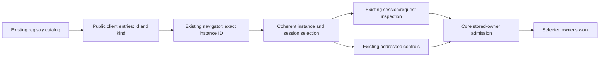

# FIX-1324: Devtool instance list/switch/sessions — Implementation Spec

## Part I — The Case

### 1. Problem — why it matters, why now

Devtool treats a flow's kind as its identity. Two copies can appear with the same label, select together, and show the first copy's configuration or the previous copy's session. Developers cannot trust which copy they are inspecting.

The owner added Devtool to this cycle's flow-instance outcome while reviewing the core specs. Fixing execution without fixing its inspector would leave that outcome invisible.

### 2. Solution in plain terms

Keep the existing expandable navigator. Give each registered instance its own row, identified by its exact ID with kind as supporting information. Selecting a copy selects its sessions and requests; existing inspection and controls follow that owner, including when opening another copy's child session.

**Necessity: Build as scoped.** An application-side map cannot repair Devtool's selection and inspection. Reuse its public client and the core instance contracts, not a second registry. Philosophy tenets 1, 3 and 5 support one identity, no new console, and fixing ownership where selection converges.

Aligned with [epic PR #1617](https://github.com/fixpoint-labs/flow-state-dev/pull/1617), scope expansion published at `164212a4c`. This spec has its own approval gate; adding its outcome did not approve implementation.

### 6. Decisions & rules — the sign-off surface

1. **Extend the inspector, not turn it into an instance-management console.** Keep session creation and existing controls; do not add instance creation, minting, renaming or deletion. *Rejected:* a new management screen. *Locks in:* operators inspect instances registered by their application; managing their lifecycle remains outside this delivery.
2. **A saved selection is a convenience, never permission to guess a copy.** If its instance or session is unavailable, show an empty or unavailable view rather than substitute a same-kind peer. *Rejected:* automatically choosing the first remaining copy. *Locks in:* some stale selections require a fresh click, in exchange for never presenting another copy's work as the intended one.

**Size:** 18 named Devtool production files, plus any missing thin core-client projection plumbing; 7 observable regression groups; 5 primary documentation surfaces; one implementation PR after the shared identity/owner cutover. Core isolation remains necessary for complete epic proof.

### 3. Tradeoffs & alternatives

Changing labels alone is smaller but leaves the wrong session and request address underneath. Grouping instances under kinds adds navigation state without improving this outcome. The real complexity is retiring stale inspection and asynchronous results during a switch, not rendering rows.

### 4. Focus practices

- One selected instance/session relationship, not independently restored values (tenet 5).
- Reuse existing read fences and public clients; remove kind-based identity assumptions (tenets 1 and 3).
- Prove the actual browser view and affected controls, not a mocked component (tenet 7).

### 5. What using it looks like

Proposed navigator, using illustrative already-registered IDs:

```text
Before                 After
> engineer             > engineer-a  (engineer)
> engineer             v engineer-b  (engineer)
                         session-b → request-b → B's trace
> reports              > reports
```

Switch A → B → A: each session list belongs to that copy; old detail content does not flash under the new selection. `reports` remains the familiar singleton row.

The existing public address slot keeps its historical spelling under FIX-1322:

```ts
const client = createClient({ flowKind: "engineer-b", userId: "devuser" });
await client.sendAction("inspect", {}); // B's existing action, not first engineer
```

This demonstrates the prerequisite contract, not a new FIX-1324 API. No URL deep-link feature is introduced.

---

## Part II — The Build Plan

### 7. Technical design

#### Baseline and prerequisites

Source research used fresh `origin/main` at `088181af7`. The application shell is `apps/devtool/src/App.tsx`; implementation lives in `packages/devtool/src/react`. The server package is `packages/engine`, not a separate `packages/server`. Existing architecture requires the inspector to consume public client APIs (`docs/architecture/overview.md`).

The prerequisite contracts are directional specs, not claims of landed code:

- **FIX-1321:** the existing registry admits globally unique opaque instance IDs; singleton `id === kind`; collection requires an explicit ID. `GET /api/flows` already lists instance entries with `id` and `kind`; its cardinality metadata and public `FlowListEntry` belong to this core cutover. No Devtool-side cardinality inference or kind-to-ID resolver.
- **FIX-1322:** existing flow-address slots, including the historically named `flowKind` client parameter and `/:flowKind/` URL segment, carry exact instance IDs. Record `flowKind` remains actual kind; additive record `flowId` is authoritative ownership. Session/request/active-record projections preserve that owner. Server-side record interpretation, authorization, exact-owner enumeration and legacy-owner refusal belong to FIX-1322.
- **FIX-1323:** isolated user/org state and isolated resources follow instance ID. Devtool reads those existing projections; it neither migrates cells nor hides leakage with frontend filtering.



#### Catalog and selection convergence

`FlowList` currently keys/toggles rows by `flow.kind`; `FlowItem` labels by kind and calls both session hooks with kind. `PanelContent` finds metadata with `.find(f => f.kind === activeFlowKind)`. Replace those identity uses with the selected entry's exact `id`. Show ID as the primary identifying label, kind as secondary only when useful; singleton ID/kind equality needs no doubled label. If a long ID is visually truncated, its full value must remain discoverable and accessible using existing title/copy idioms. Do not make truncated text, array position or a friendly label the identity. No new display-name metadata or labeling service.

The provider owns one coherent workspace selection: exact instance plus its selected session, with request/detail state subordinate to it. An instance switch/collapse clears the previous session and request before a new owner can render or dispatch. Catalog refresh keeps an exact selection only while that entry remains available; missing entries never fall back by kind. Metadata/actions/action schemas come from the selected entry, not the first kind match.

Consolidate the current duplicated sticky-session authority between provider, navigator and panel. Persisted selections are hints keyed by connection/base URL, user and exact instance ID, not kind alone. Credentials are not persisted in new selection keys. Credential/client changes retire in-flight ownership even if the visible user/IDs remain the same. Validate restored session ownership through the admitted session response before installing it; do not briefly display cached content while validation runs. Existing kind-keyed singleton hints may be reused only after this validation proves the same singleton owner; never migrate one kind hint into a collection peer. Clear unavailable hints or leave the view unselected, without adding a migration subsystem.

The invariant converges at the existing selection transition, reached by navigator row/collapse, session pick/create completion, sticky restore, child/task links, descent return and config/catalog invalidation. It must not rely on every caller updating two unrelated pieces of state correctly.

#### Read path and minimum plumbing

Keep `GET /api/flows`, existing session list/detail/request/state/resource endpoints, request SSE, and the existing `createClient` / session / recovery client factories. No new instance endpoint, registry, transport or query-cache library.

The existing catalog returns `{ flows: [...] }`; `listFlows()` unwraps it. It is currently publicly enumerable, not an authorization grant. Preserve that policy: selecting a listed instance does not authorize its sessions or imply that instance IDs are secrets.

The minimal plumbing seams, if required, are `packages/engine/src/routes/{http-handlers,session-routes,child-session-routes}.ts`, `packages/client/src/types/index.ts`, and `packages/client/src/session-client/sessions.ts`, with existing recovery projections for suspension ownership. Owner filtering belongs before pagination and retains current principal/tenant constraints; fetching a broad kind page then hiding peers is not sufficient.

Consume FIX-1322's **exact-owner enumeration** through the existing `listSessions` surface; preserve its separate broad administrative kind filter. The exact-owner filter is record ownership, not a second action address or a competing `flowKind`/`flowId` precedence rule. Use the core-approved spelling when implementing. If that public client/HTTP filter or a child/suspension owner projection is still absent after the shared cutover, complete only that thin existing route/type/serialization plumbing here in coordination with FIX-1322; do not duplicate its store/admission implementation. A change to address semantics or authorization is a genuine core-contract fork and must be surfaced, not guessed.

Session-ID endpoints remain session-ID endpoints. The selected session must resolve to the current owner before its requests/details are installed. A request loaded for that session must not replace the selected owner from display metadata. Backend owner checks remain authoritative for state, debug snapshots, resource content/downloads, streams and recovery; frontend checks prevent stale/misleading presentation but do not grant access. Keep current user/tenant/org filtering, bearer fetcher, `baseUrl`, principal resolvers and non-disclosure/error policies. No development authorization bypass or fetch-all-then-filter substitute.

#### Navigation, asynchronous work and controls

Reuse `useReadFence` and the held-identity/render-masking idiom already in `use-session-requests.ts` and `use-child-sessions.ts`. Identity includes the relevant client/credential context, selected instance and session; request/replay identity adds the request and cursor where required. Do not allocate a parallel cache or generic navigation system. Retire stream/continuation handles and pending callbacks on ownership changes. Late successes, errors, loading flags and new-session/action/resume completions may finish server-side but cannot select, populate or reconnect the new workspace.

Clear old selected item/block detail, raw/canonical request maps, replay/live state, descent context, action form state tied to the old schema, session state and resource content at that boundary. A render-time mask or keyed owned subtree must prevent a passive-effect gap where A's content appears under B. Preserve ordinary concurrent actions inside the same workspace; do not implement a latest-action-wins policy accidentally.

Existing visible controls stay functional and correctly addressed:

| Existing surface | Required ownership behaviour |
|---|---|
| Session New/refresh/select; ActionBar schema form and JSON dispatch | New creates a **session** under selected ID, not an instance. Dispatch passes that ID in the existing address slot with that owner's session. Late completion cannot navigate a different workspace. |
| Live toggle, automatic SSE, focus refresh, replay full/from cursor, simulated reconnect | Bind/reattach to exact owner ID and request; retire A's stream before presenting B. Preserve same-request reconnect after resume. |
| Per-request Continue | Use exact owner ID in the recovery call and retire its separate stream handle on instance/session/client changes. |
| Suspension approve/reject | Use admitted record owner ID, not record kind or synthetic `__devtool__` client binding; preserve current authorization and resume semantics. |
| Tasks/ChildSessions links and descent return | Children may legitimately belong to another instance. Use returned child owner to switch instance+session atomically; each trail entry retains its owner. Return restores that owner. Do not filter descendants back to the parent owner. |
| Stream/Trace/block/item detail, Session Context/client data and resource inspection/download | Always show the selected admitted session's work and configuration; no stale detail objects survive a switch. |

There is no session/request URL router, cancel-run button, static flow graph or top-level Resume control in the researched UI. Do not invent these. Existing child/task links and copy-ID affordances are the navigation to migrate. The standalone shell and embedded `DevToolPanel` remain the same public surface; preserve external/internal user-ID control and token synchronization semantics. Existing user-wide interrupted sweeps are not redesigned as an instance lifecycle feature.

#### Alternatives and source grounding

- [React: preserving/resetting state](https://react.dev/learn/preserving-and-resetting-state#resetting-state-with-a-key) supports identity-bound detail state, not remounting the entire application indiscriminately.
- [TanStack: query keys](https://tanstack.com/query/latest/docs/framework/react/guides/query-keys) explains why all data dependencies belong in cache identity. Apply that principle to existing read fences; do not add TanStack.
- [Kubernetes Dashboard: workload navigation](https://kubernetes.io/docs/tasks/access-application-cluster/web-ui-dashboard/#using-dashboard) is a historical grouping/detail precedent, not a dependency recommendation (the project is deprecated). A kind-grouped hierarchy is possible but unnecessary here; a lifecycle console imports unrelated product scope.

### 8. Implementation sequence

**One implementation PR**, separate from the atomic FIX-1321+1322 PR. Begin source implementation only after the required individual and cross-spec gates; land against the shared identity/owner cutover, not an incompatible registry-only intermediate. FIX-1323 need not block catalog/selection work, but its isolated-data contract is required for the assembled isolation view and complete epic proof.

1. **Confirm the public handoff.** Refresh core specs and merged APIs. Verify catalog identity, exact-owner list filtering and session/request/child/suspension owner projection. Any missing thin consumer plumbing goes in existing engine route/client type/serialization modules, not a new API family; FIX-1322 retains admission/migration authority.
2. **Make selection atomic and instance-based.** Modify `context/devtool-context.tsx`, `components/navigator/{flow-list,flow-item}.tsx`, `config.ts`, `hooks/{use-active-session,use-sessions}.ts`. Remove kind-keyed selection and duplicate sticky authority; scope persistence and stale catalog/list/create completion handling. Prove two rows/selectors do not alias, and a stale hint cannot install a foreign session.
3. **Carry owner through inspection and navigation.** Modify `DevToolPanel.tsx`, `context/selection-context.tsx`, and owned read/detail boundaries as needed: `hooks/{use-session-requests,use-child-sessions,use-request-stream}.ts`, `components/detail/session-context.tsx`. Retire old detail/replay/stream state and change child/task descent and return to carry owner. Keep session-addressed public reads unchanged.
4. **Correct existing control targets.** Modify `lib/client.ts`, `hooks/{use-action-dispatch,use-continue-request,use-resume-suspension}.ts`, `components/workspace/{action-bar,suspensions-view}.tsx`, with panel call sites. Remove stored-kind recipient derivation and old completion callbacks that can reinstall another owner. Do not remove capabilities to avoid addressing them.
5. **Prove the real surface, then remove superseded assumptions and publish docs.** Update affected existing behavioural tests, run §10 browser proof, remove throwaway proof scaffolding, update §11 and add the normal implementation changeset for changed public packages. No changeset or production implementation belongs in this never-merged spec PR.

The named production inventory is 18 existing Devtool files; allow a small existing client/engine projection delta only if the core handoff has not already supplied it. No new permanent component, package or hook is commissioned. Refresh the inventory against the actual tree rather than preserving obsolete names.

### 9. Edge cases & error handling

| Case | Expected result |
|---|---|
| Same kind, different IDs; ID deliberately equals another kind | Exact catalog ID selects its entry and configuration. Labels/kinds never resolve the recipient. |
| Empty catalog; zero selected instance; selected owner removed | Empty/unavailable view, no request/control target and no sibling substitution. Refresh/reselection remains available. |
| A's session hint restored for B or a changed backend/user | Discard/refuse before installing data; no kind-based repair. Revalidate authorized singleton hints only. |
| Rapid A→B→A; old reads/create/action/continue/resume resolve afterward | Only current owned results appear; switching away and back does not revive a retired operation. Already-issued server work is not falsely claimed canceled. |
| Credentials change with same visible IDs | Retire prior data, details and callbacks until newly authorized reads complete; never store bearer secrets in preference keys. |
| Child belongs to another exact instance | Follow admitted child's owner and session together; return restores parent owner. Preserve cross-owner descendant visibility allowed by core. |
| Legacy ownerless collection/custom-ID data | Show core migration-required/unavailable result; never assign it to the selected instance. Historical child-ID migration remains FIX-1322's blocker. |
| Long/opaque IDs, punctuation, shared prefixes | Encode once using existing URL helpers; show/copy full value without prescribing ID syntax. |
| Denied/missing session/request or network failure | Preserve existing non-disclosure/status policy and scoped retry UI. No automatic alternate-instance retry. |

Ownership/selection/migration errors require corrected input or deployment. Existing network/storage retry classification remains. This is not a new generic retry/error taxonomy.

### 10. Testing strategy

**Goal and browser proof, planned and unrun:** run the actual Devtool (standalone and an existing embedded mount) against the real runtime/client over HTTP/SSE, with two registered collection instances of the same kind, distinct IDs, configuration markers, sessions and requests, plus one ordinary singleton. Seed instances through supported application registration, not new Devtool lifecycle UI. Use deterministic real handlers for distinguishable results; a model is unnecessary for identity proof. No fake UI, mocked fetch echo or CLI-only result counts.

In a real browser:

1. Visually confirm A/B are distinguishable and full IDs discoverable. Select A, use existing New session/action controls, inspect its request Stream/Trace/item detail. Select B and inspect B's separately created session/request/configuration, then return A. Record screenshots/observations and real request URLs/owner responses showing the same identity throughout.
2. Inspect client/debug state and resource content with distinct A/B markers after FIX-1323 is present; no B state appears under A. Preserve intentionally shared data when the application does not request isolation.
3. Exercise live stream, replay/cursor/reconnect, interrupted Continue and suspension approve/reject against their real runtime states. Observe the correct owner and request continuing, not just successful HTTP status. Open a cross-owner child through Tasks/ChildSessions and return using the trail.
4. Delay real network responses while switching instances; confirm no old session, trace, detail, error or reconnect appears in the new view. Reload with persisted selections; change backend/user/token and remove access or registration; verify no same-kind fallback or stale disclosure. Browser delay/interception may orchestrate timing, but response data must come from the real runtime.
5. Repeat singleton viewing, session creation, action and replay on its unchanged address. Verify keyboard/accessible row identity and embedded configuration/token behavior without new panel props.

**Seven observable regression groups** using existing test seams (`packages/devtool/test/devtool-panel-session-reset.test.tsx`, `devtool-config-sync.test.tsx` and related hook tests): distinct same-kind selection/configuration; foreign/stale persisted session refusal; late list/create/action results; stream/continue/resume retirement; cross-owner child-and-return; detail/data retirement across identity/credentials; singleton compatibility. Extend deterministic deferred-promise/rerender tests where these expose plausible race/owner bugs. Do not pin React keys, field copies, labels' exact wording or mock forwarding as proof. Fix or remove old tests that encode kind-first identity; do not add a broad component suite merely to claim coverage.

**Discipline:** feature tracer bullets at existing UI state-transition and public client/route seams. Server owner/admission/isolation regression coverage belongs to core prerequisites, not duplicate UI tests. Browser proof establishes the visible outcome; runtime core proof alone does not.

**Executed for this spec:** read-only source, issue, PR and documentation research; independent read-only specification review. No browser, POC, test/build/formatter/linter, package install or executable validation has been run. All behavioural proof above remains planned.

### 11. Documentation plan

**Required:** this changes observable inspector selection and existing controls. Extend five existing surfaces; no new page, sidebar category, guide or blog post. `apps/docs/sidebars.ts` keeps Core → Dev tools → DevTool ordering; `apps/docs/sidebarsGuides.ts` keeps development-tips in Start here.

- **EXTEND `apps/docs/docs/devtool/overview.md`**, existing Flow overview, Session management, Action dispatch and Child sessions sections. Audience: developers with a running server and registered instances. Lead: “Choose a flow instance by its exact ID. Its kind describes the flow; its ID identifies the copy you inspect.” Show the two already-registered IDs from §5, session/request selection, existing controls and cross-owner child return. Link to client overview and embedding Identity; incoming links below make this the single navigation explanation. Do not conflate flow instance IDs with trace block-instance IDs.
- **EXTEND `apps/docs/docs/devtool/setup.md`**, final instruction under Starting the server. Replace kind-ambiguous selection wording with instance → session → request usage; link to overview#flow-overview. Keep its existing setup code rather than duplicate collection registration examples.
- **EXTEND `apps/docs/docs/devtool/embedding.md`**, Identity. Distinguish selected instance from authenticated user/connection and link to overview#flow-overview. Preserve mount/props example; no new API. Update its stale-session limitation only insofar as the implemented owner transition actually resolves it.
- **EXTEND `apps/docs/guides/development-tips.md`**, The DevTool / How to run it. Replace “Connect to your flow kind and session” with selecting the exact instance and opening a session; link `/docs/devtool/overview#flow-overview`. Keep the existing CLI example, not a second selection tutorial.
- **EXTEND `packages/devtool/README.md`**, after Quick Start. One discoverability sentence linking the canonical instance-viewing section; retain its asset/build API focus.

Public address/catalog/filter documentation in `apps/docs/docs/client/overview.md`, `packages/client/README.md`, `apps/docs/docs/server/setup.md`, `packages/engine/README.md` and `docs/architecture/server-and-client.md` belongs to FIX-1321/1322's shared cutover. If §8 supplies a genuinely missing public projection/filter delta, extend every existing reference describing that actual delta in the same implementation change, without duplicating upstream work. For child-owner projection this includes `apps/docs/docs/server/background-work.md`'s HTTP response example and complete-row claim, `packages/engine/README.md`'s child-list response description, and `docs/architecture/server-and-client.md`'s ChildSessionSummary field set, alongside the client reference/README. Retain those pages' examples and cross-links, adding owner identity to the existing response explanation rather than a new page. No isolated-state migration guide is added here; FIX-1323 owns it.

Voice: follow `docs/contributing/user-docs.md` outsider rule. Plain task instructions, no issue numbers or “now supports” history in user docs, no marketing adjectives, and no promise that selecting an instance grants access. Say “create a session,” never “create an instance,” for the existing New control.

### 12. Dependencies, open questions & follow-ups

- **FIX-1321 + FIX-1322 are the implementation prerequisite**, landing atomically in one shared PR owned by FIX-1322. Catalog/cardinality, exact addresses, durable owners, authorized projections and exact-owner session enumeration are consumed here. Their spec review surfaces are [#1631](https://github.com/fixpoint-labs/flow-state-dev/pull/1631) and [#1633](https://github.com/fixpoint-labs/flow-state-dev/pull/1633); refresh current approval/landing state, never infer it from this document.
- **FIX-1323 / [#1632](https://github.com/fixpoint-labs/flow-state-dev/pull/1632)** is not a blocker to catalog/selection authoring or independent UI work after the owner cutover. Its data isolation/migration must be present for §10's isolated-state inspection and complete epic rollout. Session/request identity inspection has no independent new dependency on storage-key changes.
- **PR #1600** overlaps the owner/child boundary and is integrated by FIX-1322. **PR #1223** overlaps request-management tenant authorization; refresh that overlap through FIX-1322, preserve its intended tenant binding, and do not create another mandatory merge dependency for this UI spec.
- All four specs require individual approval before the separately owner-authorized cross-spec pass. `crossSpecCleared=false`. No source implementation, individual approval or merge is authorized by this publication. FIX-1322's historical custom child-ID migration blocker remains unresolved and owned there; this spec neither solves nor removes it.
- FIX-1325 Workforce hire/mint remains later. FIX-1330 chat removal is standalone backlog, not a prerequisite. No message board, chat redesign/removal or generic UI overhaul.

**Open direction questions:** none added by this spec. Field spelling on the exact-owner list filter is settled with the core public handoff, not a new public-address fork. If that handoff cannot preserve exact owner enumeration and caller authorization together, surface that concrete conflict before coding rather than inventing another registry or selector.

### 13. Review notes for the implementer

- “useReadFence.isCurrent compares tuple values (use-read-fence.ts:187–213), so A→B→A can revive an old callback absent a visit token/keyed remount; begin() instead imposes latest-read-wins.” — independent technical specification review, referring to `packages/devtool/src/react/hooks/use-read-fence.ts`. Treat this as implementation input, not a prescribed new abstraction: §7/§9 already require retiring old visits while preserving concurrent actions within the current workspace.

---

## Spec evolution

- **Spec drafted** — the owner's fourth outcome becomes an exact-instance extension of the existing inspector, with coherent session/request navigation and correctly addressed existing controls; one UI implementation PR consumes the shared core cutover, and real browser proof remains required.
