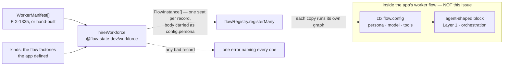

# FIX-1325: The seat factory — a worker record becomes one addressable, configured flow

## Part I — The Case *(for the human)*

### 1. Problem — why it matters, why now

An app that wants three collaborating AI workers has to introduce each one to the framework
by hand: write a flow for it, invent an address for it, and wire its settings into that copy.
Three judgement calls per worker, made in code, made differently in every app that has tried.

The epic's companion issue gives those workers a home on disk — a folder per worker, a
document saying who it is. That issue deliberately stops at *reading*. Its output is a set of
plain records that nothing can run. **This issue is the step that makes a record into
something you can talk to.**

**Why it matters:** the objective this epic serves is that a multi-seat workforce becomes an
ordinary application shape. A folder that produces nothing runnable does not move that;
neither does a factory with no roster to feed it. The two together are the claim.

**Why now:** everything underneath has landed. A flow definition can have many named copies
(`cardinality: "collection"`), each with its own address, its own isolated data, and its own
frozen settings bag. Those were named gaps six weeks ago. They are on `main` now, and nothing
in Layer 2 uses them.

### 2. Solution in plain terms

One function, one list. You hand it the worker records and the flows your app defines; it
hands back one running copy of a flow per worker — each answering to its own address, each
carrying the settings its own folder declared. Your app registers what comes back, the same
way it registers anything else.

Two things it deliberately does not do. It **does not build a flow out of the folder** — the
folder says *which* flow this worker runs and *how it is configured*, never what it does step
by step. And it **does not register anything** — it hands back the copies and your app
registers them, so a workforce read from files and a workforce written by hand arrive at the
registry by the same door.

The distinction that makes the whole shape work: **a hired worker is a flow copy and nothing
else — there is no second species.** An intake desk or a coordinator is a worker: a seat, an
address, a configuration. So is a worker with a personality. What separates them is not what
kind of *thing* they are, it is what their flow was written to accept: a worker's
instructions arrive as one more setting, and a flow that never asked for one refuses it by
name. Being opinionated is a property of the flow you are a copy of, not a second list you
appear on.

And a seat is a **dispatch target** — an address you open a session against. That is
deliberately not the same list as the in-process workers a task board drains: same idea, a
named assignable target, different mechanism. Keeping the two apart is the point.

**Philosophy.** Tenet 2 (composition over features): this adds no runtime concept — the
copies, the addresses and the settings bags all already exist; the function assembles them.
Tenet 3 (earn every addition): one exported function, one return list, no second registry, no
second worker species. Tenet 5 (one convergence point): a worker's address is minted in
exactly one place, so nothing can hold two versions of it — which is precisely the mistake §6
decision 1 exists to correct, and §6 decision 4 now applies the same rule to what a worker
*is*.

### 6. Decisions & rules — the sign-off surface

1. **A worker's identity is one string, and it is dot-separated: `engineering.lead`. That
   same string is its address, its registry name, and the name anything referring to it
   uses.**
   *Rejected:* `engineering/lead` — the slash-separated identity the loader's approved spec
   mints today.
   *Why, and this one is not a taste call:* **a worker whose address contains a `/` cannot be
   reached at all, and nothing tells you.** The POC on this branch registers one and then
   fails to talk to it —
   [`spec-poc/FIX-1325-seat-addressing/`](../spec-poc/FIX-1325-seat-addressing/NOTES.md). The
   flow builder accepts the id, the registry admits it and resolves it, and then every HTTP
   address 404s, because the router rebuilds the path from its segments before matching, so
   an escaped `/` is indistinguishable from a real one. The same seat under a dot answers
   normally. **That is the worst possible failure shape** — it boots clean and breaks when
   somebody first tries to use the worker.
   *Locks in:* one string, everywhere, minted once by the loader. The factory does no
   re-minting, so there is no second spelling to drift.
   *Cost, stated plainly:* the loader's spec was already approved with `/` in it, and this
   changed a decision that spec argued for. It was cheap **because** it happened before any
   code — the loader is the identity's only minter and it had no callers — and would have got
   permanently expensive later, which is the same argument that spec used for locking the
   shape early.
   *Ratified in review (round 1).* Cleared by the FSD Architect on this PR and on
   [#1665](https://github.com/fixpoint-labs/flow-state-dev/pull/1665); FIX-1335's spec now
   mints `team.name` and was re-cleared at `dddd80c9`. A factory-side `/`→`.` translation is
   rejected outright — that is the two-names-forever outcome this decision exists to avoid.
   The **disk layout `teams/<id>/workers/<name>/` is unchanged**: a path is not an id.

2. **A worker's folder says which flow it runs and how that flow is configured. It never
   describes what the flow does.** The record names a kind (`flow: worker-agent`); the app
   passes the factory the flow kinds it defined; the factory instantiates one copy per
   worker.
   *Rejected:* the factory assembling a flow from the folder's contents — the atlas's
   proposed `createWorkerFlow({ role, personality, tools, skills })`.
   *Locks in:* the block graph is written in code, reviewed as code, and tested as code. A
   difference between two workers that changes what happens step by step is a different flow
   kind, not another line of frontmatter. This is what keeps a folder from quietly becoming a
   programming language.
   *Cost:* an app must define at least one worker flow in code before any folder does
   anything. Files alone do not produce a runnable worker from nothing — they produce
   configured copies of something an engineer wrote.

3. **Everything in the file except the two keys the factory itself reads is that worker's
   settings, handed to the flow verbatim. The flow decides what is allowed.**
   Reserved: `flow` (which kind) and `description` (roster label). The rest is parsed against
   that flow kind's declared settings schema.
   *Rejected:* the factory keeping its own list of settings it understands and passing on the
   rest, or silently dropping what it doesn't recognise.
   *Locks in:* a setting a worker declares that its flow never offered is **refused by name,
   at startup, before anything runs** — the epic's honesty theme applied at the file
   boundary, and it costs nothing to build because the settings bag already refuses
   undeclared keys. It also means the flow's author, not the framework, decides what a worker
   of that kind may say about itself.
   *Cost:* settings are written in the file exactly as the flow declares them. A flow that
   wants a two-word setting has to pick a spelling its authors will type, and live with it.
   We are deliberately not inventing a translation between how the file writes a name and how
   the code writes it — one such rule is how a convention acquires a dialect.

4. **A worker's instructions are configuration, handed to its flow under one reserved name
   (`persona`). There is no agent entry and no second species: a hired worker is a flow copy,
   full stop.**
   *Rejected:* the shape this spec carried until the substrate fence — the factory reading a
   record's body and minting an `Agent` for a registry; an explicit `agent: true` flag; and
   "register everything".
   *Why the old shape is foreclosed, and it is not a taste call:* Layer 1 already resolves a
   worker as a `BlockDefinition`, and says so in as many words — *"workers are plain
   `BlockDefinition`s — there is no parallel 'worker' abstraction"*
   (`packages/orchestration/src/tasks/workers/types.ts`). The agent registry was Layer 2
   holding a second, parallel answer to a question Layer 1 had already settled. This decision
   stops FIX-1325 building a third one on top of it.
   *How agent-ness is carried instead:* by the flow. A record with a body is handed that body
   as a setting named `persona`. An agent-shaped worker flow declares `persona` in its
   `configSchema` and builds its generator from it, the same way it builds its model and its
   tools from the rest of the bag. What makes a worker opinionated is what its flow was
   written to do with what its folder declared — which is decision 2, one level down.
   *Locks in:* **thinness stops being something the factory decides and becomes something the
   framework refuses.** Hand a body to a flow whose schema never declared `persona` and the
   config parse refuses it by name, at the hire, before anything runs — the framework closes a
   `configSchema` before parsing, so an undeclared key is an error rather than a stripped one
   (`packages/core/src/types/flow.ts`). The shape this replaced had to *document* the opposite
   hazard: prose under a thin seat's frontmatter minted a registry entry nobody asked for, and
   the stated mitigation was "documentation, not machinery". The fence turns that documentation
   into a refusal, and it costs nothing to build.
   *Cost, and this is the part most worth a reviewer's eyes:* `persona` is a name the factory
   imposes. Decision 3 says plainly that we do not invent a translation between how the file
   writes a name and how the code writes it — and a body is not frontmatter, so it has no name
   of its own until this decision gives it one. That is the single translation this factory
   makes, and it is deliberate. The alternative — handing the body to the flow factory as a
   separate argument beside `config` — keeps the settings vocabulary untouched but throws the
   free refusal away: a flow that never wanted a body would have to check for one and refuse it
   itself, which is machinery in every worker flow instead of none. One imposed word buys the
   refusal for every flow that will ever exist. **A record that declares `persona:` in
   frontmatter *and* carries a body has two sources for one setting; that is a collected error,
   not a precedence rule (§9).**

5. **The four room helpers are cut from this issue's delivery and land with their first real
   caller** — the lab stage after W2.
   *Ratified in review (round 1).* Cleared by the FSD Architect against the epic's own fence:
   a helper lands with its first real caller, and nothing in this epic starts conversations
   with workers. The epic-spec now matches — its §4 row says the helpers are not in this
   issue, and its §1 *Not doing* lists them. **FIX-1325 done = the seat factory.**
   *Locks in:* what ships is the factory, which the epic's gate bar tests directly. The
   helpers ship when there is a workforce for them to address. Two of the four also need
   addressing doors that are still named gaps, so building them now would mean shipping them
   incomplete or inventing an argument to hide the gap.
   *Cost:* until then, an app that wants to open a conversation with a worker writes the
   session call itself — which is exactly what it does today, so nothing gets worse.

6. **The code door (`worker.ts`) is not wired by this issue, and it does not need to be.**
   *Rejected:* the factory importing a worker's TypeScript file at startup.
   *Locks in:* no runtime-TypeScript-loading question in this epic — a build-toolchain
   problem nobody has costed. And the capability it would buy already exists by decision 2: a
   worker whose shape is custom code is a flow kind the app defines and a folder that points
   at it. The second door is a *file-layout* affordance the loader records; wiring it is a
   named gap, not a gap this issue papers over.
   *Cost, stated correctly:* an author who expected to drop a `.ts` file in a worker folder
   and have it picked up will find it **recorded by the loader and refused by name at the
   hire** — not ignored. A `worker.ts`-only folder declares no frontmatter, so it names no
   flow kind, and a record naming no kind cannot be hired; §9 gives that case its own row so
   the message says *recorded but not yet wired* rather than the generic missing-flow error.
   Ignoring it was never available: theme 3 refuses to drop a seat silently. The docs must say
   so in the same breath as the convention.

7. **A worker record carries its identity as one field. The team and the bare name are not
   materialized beside it.** The record is `id`, `declared`, `body` — plus the one field only
   a directory read can produce (`codePath`), which this factory never reads.
   *Rejected:* `id` **and** `teamId` **and** `name`, the shape both this spec and FIX-1335
   drafted.
   *Why:* the segments are derived data, and now provably so. FIX-1335's segment rule is an
   allowlist — `/^[a-z0-9]+(?:-[a-z0-9]+)*$/` — which excludes the `.` the id joins on, and
   that spec now states the exclusion and marks it load-bearing. An id is therefore splittable
   into team and name unambiguously, so the extra two fields cannot carry anything `id`
   doesn't — they can only *disagree* with it, and no rule would say which wins. Nothing here
   reads them: §7 uses `manifest.id` verbatim, §9 declines to re-validate the id's shape on
   purpose, and no §10 behaviour touches a segment.
   *Locks in:* decision 1's rule one level down — a worker's name exists once in the system.
   It matters most for the **hand-built** roster, which is a first-class input here (§3):
   `teamId` and `name` would be two more fields an app writes by hand, keeps consistent with
   `id` by hand, and that nothing checks.
   *Cost:* a consumer that wants the segments splits the id itself. If one ever appears, the
   answer is a single exported `parseWorkerId` beside the loader's minting helper — not two
   fields back on the record. Not built here, because nothing calls it (§13).

**Non-goals** — the loader itself (FIX-1335); building a flow graph from files; a second
registry, or the factory owning registration; adding a worker after boot; several workers of
the *same* kind as a proven shape (Collab RC); worker output-shape honesty (FIX-1337); team
addressability and board scoping (FIX-1310); importing `worker.ts`. **And, explicitly, the
Layer 1 work the substrate fence sets up:** collapsing `defineAgent` / `materializeAgent` /
`agentBlock` into one block factory in `@flow-state-dev/orchestration`, and removing the
`agentRegistry` / `agent-ref` runtime resolve path. That is its own issue, sequenced *after*
this factory lands (§12). This spec teaches and builds toward that shape; it does not perform
it, and it invents none of its API.

**Size:** Small–Medium — 3 production files · 14 test behaviours · 1 goal · 2 doc surfaces ·
1 changeset · 1 PR. *Smaller than the pre-fence draft:* the agent-derivation half of the
factory is gone entirely, and with it every import of the `Agent` type.

---

### 3. Tradeoffs & alternatives

**Alternative: keep `/` and teach the framework to address it.** The identity stays as the
loader's spec wrote it and the router learns to accept an escaped separator. Rejected on two
grounds. It is a change to the substrate to accommodate one Layer 2 product's naming taste,
which is the fold the epic's theme 3 refuses. And it isn't ours to fix end to end: the
escaped separator has to survive every host adapter's path handling — Next's catch-all, the
node host, Vercel — and we control none of them. A dot works everywhere today.

**Alternative: the factory builds and returns an agent registry.** One call, nothing to wire.
This is what the spec proposed until the substrate fence, and it is now foreclosed rather than
merely rejected — there is no agent registry to build. Worth recording *why* it read as
reasonable: the argument against it at the time was only that a registry is also fed by
hand-written definitions, so owning construction makes that path second-class. That argument
was correct and far too small. The real objection is one layer up: Layer 1 already answers
"which block runs this work" by name, and a Layer 2 registry of `Agent` objects is a second
answer to the same question, kept in sync by nobody. Returning one list of flow copies leaves
exactly one answer standing.

**The simpler approach: no factory at all.** Document the four lines an app writes per worker
and stop. Genuinely tempting — the epic's gate bar explicitly accepts hand-registration, so
this would pass it. Insufficient for two reasons. One of those four lines mints the worker's
address, and an address minted in two places is the drift tenet 5 exists to prevent — the POC
above is what that costs when it goes wrong. And "hire this roster" being one call rather
than a loop an app writes is most of what makes a workforce feel like a shape the framework
knows about, which is the objective.

**Where the complexity is:** not the factory, which is a map over records — and less of one
than it was, since the agent-derivation half is gone. What is left is the identity question
decision 1 settles, and the one piece of vocabulary decision 4 imposes: the body has no name
of its own, so handing it to a flow means choosing one. Every other key travels under the name
its author wrote.

### 4. Focus practices (1–5)

1. **BP-003 (evidence, not reading).** The addressing premise under decision 1 is settled by
   a run on the real router, not by reading the route table. Its output is in the POC notes;
   its verdict is the reason decision 1 exists.
2. **Tenet 5 — one convergence point for the address.** The factory mints nothing. It uses
   the identity the record carries — now ratified, so there is exactly one spelling of a
   worker's name and the factory is not where a second could appear. Decision 7 applies the
   same practice to the record itself: one identity field, no derived copies beside it.
3. **Refuse, don't drop (epic theme 3, BP-030).** An unknown setting, a missing flow kind, a
   worker naming a kind the app didn't pass, **and now a body handed to a flow that never
   asked for one** all refuse at the hire, by name. Nothing is skipped quietly, and every bad
   worker is reported in one pass so an author fixes them all at once. The body's refusal is
   free: it rides the same closed-`configSchema` parse as every other key, which is the whole
   reason decision 4 routes it through the bag.
4. **BP-004 (public boundary first).** The exported surface is one function and two types.
   The helpers are behind decision 5 precisely so the boundary doesn't widen ahead of a
   caller.
5. **BP-022 (changeset).** `@flow-state-dev/workforce` is a published package; a new root
   export is a `minor`.

### 5. What using it looks like (1–5 examples)

**Two worker files — one opinionated, one thin:**

```md
<!-- teams/engineering/workers/lead/WORKER.md -->
---
description: Holds the engineering board and breaks work into tasks.
flow: worker-agent
model: openai/gpt-5.4-mini
tools: [board, search]
---

You are the engineering lead. You do not write code yourself — you break the
request into tasks, assign them, and report what came back.
```

```md
<!-- teams/engineering/workers/intake/WORKER.md -->
---
description: The front door. Routes an incoming request to whoever should hold it.
flow: intake
---
```

The intake file has no body. That is what makes it a thin seat.

**Hiring them** *(the whole change at the call site)*:

```ts
import { hireWorkforce } from "@flow-state-dev/workforce";
import { workerAgentFlow, intakeFlow } from "./flows";

const seats = hireWorkforce(workers, {
  kinds: { "worker-agent": workerAgentFlow, intake: intakeFlow },
});

flowRegistry.registerMany(seats); // both workers, addressable
```

**What came back** — one list, and every worker is on it:

```ts
seats.map((s) => s.id);  // ["engineering.intake", "engineering.lead"]
seats[1].config;         // { model: "openai/gpt-5.4-mini", tools: ["board","search"],
                         //   persona: "You are the engineering lead. …" } — frozen
seats[0].config;         // {} — the intake record declared no settings and has no body
```

**Where the "agent" went** — into the flow, which is the app's code (decision 2). The two
flow kinds differ because they were *written* to differ; `worker-agent` declares that it takes
a persona, `intake` does not:

```ts
// flows/worker-agent.ts — the opinionated kind
export const workerAgentFlow = defineFlow({
  kind: "worker-agent",
  cardinality: "collection",
  configSchema: z.object({
    persona: z.string(),
    model: z.string().default("openai/gpt-5.4-mini"),
    tools: z.array(z.string()).default([]),
  }),
  // …its graph builds an agent-shaped generator from `ctx.flow.config`.
});
```

*This call site is the one the Layer 1 collapse changes* — how the flow builds that
agent-shaped block from its config bag. The factory above is unaffected either way: it hands
over a config bag and never looks inside. See §7, "Which layer owns what".

**Talking to a worker** — an ordinary flow address, nothing workforce-specific:

```
POST /api/flows/engineering.lead/sessions
POST /api/flows/engineering.lead/<session>/actions/run
POST /api/flows/worker-agent/sessions        →  404: the bare kind is not an address
```

**A worker that says something its flow never offered:**

```
hireWorkforce: worker "engineering.lead" — flow "worker-agent" does not accept
setting "temperature". Declared settings: persona, model, tools.
```

**Prose under a thin seat's frontmatter** — the hazard the old shape could only document,
now a refusal:

```
hireWorkforce: worker "engineering.intake" — flow "intake" does not accept
setting "persona". Declared settings: (none). A worker's instructions are handed
to its flow as `persona`; this flow kind does not take one.
```

---

## Part II — The Build Plan *(for the implementing agent)*

### 7. Technical design

The factory is a pure, synchronous map from records to instances. It reads no files, opens no
connections, and registers nothing.



**The surface.**

```ts
// Shape only. `WorkerManifest` is declared once, in `packages/workforce/src/manifest.ts`,
// and **its field documentation lives on that declaration** — FIX-1335's spec carries the
// agreed wording and is landing it in a parallel pass. Do not copy doc comments back onto
// the type from here: two specs writing comments for one declaration means whoever lands
// second silently overwrites the other, which is the second-spelling failure decision 7
// exists to remove.
export interface WorkerManifest {
  id: string;
  declared: Record<string, unknown>;
  body: string;
  codePath?: string;
}

export interface HireOptions {
  /** Flow factories by kind, as the app defined them. A record's `flow` names one. */
  kinds: Record<string, (options: { id: string; config?: unknown }) => FlowInstance>;
}

/** One copy per record, ordered by id. Register these. */
export function hireWorkforce(manifests: WorkerManifest[], options: HireOptions): FlowInstance[];
```

**What those fields are *to this factory*** — factory prose, deliberately not the type's
documentation: `id` is used verbatim as the copy's id and address, never re-minted and never
re-validated (decision 1, §9). `declared` is split into the two reserved keys and the settings
bag. `body`, when non-empty, becomes the single `persona` setting (decision 4). `codePath` is
read for exactly one thing — telling a record that names no flow *because its folder uses the
code door* apart from a record that is simply malformed (§9).

**One list, not a wrapper.** The pre-fence return was `{ seats, agents }`. With `agents` gone
the honest return is the array itself — a one-field object is structure held open for a second
field we have decided will never come, which is the speculative flexibility tenet 3 refuses.
Errors do not need the second slot either: they throw, collected (step 5).

**Per record, in order:**

1. Split `declared` into the two reserved keys (`flow`, `description`) and the rest.
2. If `body.trim()` is non-empty, add it to the rest under `persona`. If `rest` already holds
   a `persona` key, collect an error instead — two sources for one setting, and no precedence
   rule (decision 4, §9).
3. Look `flow` up in `kinds`. Missing or absent → collect an error naming the worker and the
   kinds that were passed.
4. `kinds[flow]({ id: manifest.id, config: rest })`. The settings parse happens inside — the
   flow's own `configSchema` is closed before parsing, so an undeclared key refuses by name
   (`persona` included), a missing required one refuses, and the result is frozen. **Add no
   validation of our own here**; wrapping a thrown parse error with the worker's id is the
   whole contribution.
5. Any errors collected → throw one error listing every bad worker, so an author fixes them
   in one pass. Nothing is returned partially.

**Why the body goes through the config bag rather than around it.** It is the same argument
the pre-fence draft made for reading agent fields off the parsed config, and it now covers
everything: one bag, one gatekeeper. A flow kind that doesn't declare `model` makes `model:`
in a worker file an error rather than a key that quietly shapes a generator the flow knows
nothing about — and a flow kind that doesn't declare `persona` makes a *body* the same kind of
error. The factory reads neither. It reads `flow`, holds `description`, and hands the rest
over.

**Package layout.**

- **New:** `packages/workforce/src/manifest.ts` — the `WorkerManifest` type, and nothing else.
  Node-free, exported from the package root. FIX-1335's loader imports the type from here
  rather than declaring its own, and under this one name — an alias for the same record is the
  second spelling decision 7 removes (§12).
- **New:** `packages/workforce/src/hire.ts` — `hireWorkforce` and `HireOptions`. Type-imports
  only, and now only one of them: `FlowInstance` from core. No `Agent` import, no
  `defineAgent` import, no runtime import from anywhere. The root export gains no `node:`
  dependency.
- **Untouched, and deliberately not consumed:** `defineAgent`, `materializeAgent`,
  `agentBlock`, `createAgentRegistry`, `definePersona`, the core `Agent` and `AgentRegistry`
  types, the flow registry, `defineFlow`. This issue adds no field to any of them and calls
  none of them.

**The factory's contract is invariant under the Layer 1 collapse.** `hire.ts` referenced none
of those symbols before the fence and references none after, so the two issues can land in
either order without either touching the other's files. That is the main reason the fence
costs this spec a rewrite and no rework.

**Which layer owns what** — the boundary is the interesting part of this design now, so it is
stated rather than assumed:

- `@flow-state-dev/workforce` depends on `@flow-state-dev/orchestration`; never the reverse
  (`packages/workforce/package.json`). Workforce is Layer 2.
- The agent-shaped block factory's home is **Layer 1**, in orchestration, where a worker
  already resolves as a `BlockDefinition` by name. This spec does not name that API, because
  it does not exist yet and inventing it here would create exactly the second spelling
  decision 7 exists to remove.
- **This factory consumes none of it.** It maps records to flow copies. What an app's worker
  flow builds out of its config bag is the app's business and Layer 1's mechanism.
- A **seat** is a flow copy with an address — a dispatch target. Orchestration's board workers
  are in-process `BlockDefinition`s drained from a queue. Same idea, different mechanism, two
  lists that must not be merged.

**One constraint this shape places on the Layer 1 factory** — recorded here because it is
discoverable from this issue's shape and not from that one's:

> A `cardinality: "collection"` flow has **one** block graph shared by every copy; only the
> config bag differs. So an agent-shaped block used inside a worker flow must take its
> persona, model and tools from `ctx.flow.config` **at run time**. Today's `materializeAgent`
> resolves persona through a ctx function, but fixes `model` at definition time
> (`opts.overrides?.model ?? agent.model ?? …`) and resolves tools and capabilities at
> definition time too — so as it stands, every copy of a worker flow kind would silently share
> one model. The substrate already permits the fix: `generator({ model })` accepts
> `(input, ctx) => …` (`ResolvableModel`, `packages/core/src/blocks/generator.ts`).

*This is a requirement to carry into the Layer 1 issue, not a blocker here* — nothing in this
issue's delivery calls that factory, and §10's goal builds its opinionated flow from a plain
generator reading `ctx.flow.config` (§12).

*No solution sketch beyond the above.* The body is a loop; the parts that need specifying are
specified.

### 8. Implementation sequence

1. **The manifest type** — `manifest.ts` plus its root export. *Test:* typecheck.
   *Depends on:* nothing. Coordinate with FIX-1335 per §12 if that landed first.
2. **The factory** — `hire.ts`: the split, the body-to-`persona` fold, the kind lookup, the
   instantiation, and the collected refusal. *Test:* every §10 CI behaviour.
   *Depends on:* 1.
3. **Ship it** — root export, the goal, the changeset, the docs. *Test:* the §10 goal.
   *Depends on:* 2.

*No removals.* Nothing on `main` does this job.

### 9. Edge cases & error handling

**The rule behind the table:** every problem is a startup misconfiguration, so every problem
throws — but they are *collected first*, so one run names all of them.

| Case | Expected |
|---|---|
| Empty `manifests` | `[]`. An app may have no file-declared workers |
| `flow` absent from a record | Collected error naming the worker |
| `flow` absent **and** `codePath` present — the `worker.ts`-only seat FIX-1335's §9 records as valid | Collected error refusing **by name**, naming the unwired door: *worker "engineering.tools" — `worker.ts` is recorded but not yet wired; give this seat a `flow:` or remove the folder*. Never the generic message above, and never a silent skip |
| `flow` names a kind not in `kinds` | Collected error naming the worker, the kind, and the kinds that were passed |
| A setting the flow's schema never declared | The flow's own refusal, rethrown with the worker's id prefixed. Not caught and softened |
| A required setting the record omits | Same — the flow refuses at the mint |
| The flow kind is `cardinality: "singleton"` | The registry refuses a singleton under a custom id. Let it — the app passed a flow that cannot have copies, and the framework's message says so. Do not pre-check it here and produce a second message for one condition |
| Two records with the same `id` | Collected error. The registry would also catch it; catching it here names it as a *roster* problem and reports it alongside the others |
| `body` present but whitespace-only | Thin seat — contributes **no** `persona` key at all. Whitespace is not instructions, and an empty string handed to a flow that declares `persona` would be a worse lie than omitting it |
| A body on a record whose flow never declared `persona` | The flow's own refusal, rethrown with the worker's id. This is the thin-seat rule *enforced* rather than documented (decision 4) |
| `persona` in frontmatter **and** a non-empty body | Collected error naming the worker and both sources. Not a precedence rule: picking a winner would be the second convergence point decision 1 and 7 both exist to remove |
| A record whose `id` is not `<teamId>.<name>` | Not checked. The loader owns identity minting (decision 1); re-validating it here would be the second convergence point that decision exists to remove |
| `description` absent | Nothing happens. It is reserved out of the settings bag and this factory reads it for nothing — it stays on the record as the roster label the loader already requires for a `WORKER.md` (§12 flags that it now has no consumer here) |
| `capabilities` naming an unknown capability | Not this factory's call. `capabilities` is an ordinary setting like any other; whatever the flow builds from it is what resolves it |

**Why the `worker.ts` row exists, and why it is a spec row rather than the implementer's
judgement.** FIX-1335's §9 rules that a folder holding only `worker.ts` is a *valid* record —
`declared` empty, `body` empty, `codePath` set, not an error — and routes what happens next
explicitly to this spec. Composed, that record arrives here with no `flow`, and the generic
row above would collect *"flow absent"*: an error that reads like the author made a mistake,
when what they actually did was use the epic's second door, which this issue has not wired
(decision 6). Because the hire throws one collected error, a single such folder takes the
whole roster with it — theme 1 calls the two doors equal, and composed, an app that uses door
2 at all cannot boot until the door is wired. That is decision 6's real cost, and the message
is where an author finds it out. **The direction is settled, not open:** refuse, don't drop
(theme 3, BP-030). A silent skip would let a seat the author wrote vanish from the roster with
nothing said — the boots-clean-breaks-later failure shape decision 1's POC exists to remember.
Wiring the door stays a named follow-up (§12).

### 10. Testing strategy

**Goal.** `goals/workforce-seats/two-seats-run-their-own-configuration/`, no model.

***Where the two records come from — conditional on FIX-1335, and both paths are real.***

- **Preferred, once FIX-1335 has landed:** the two records are produced by the real loader —
  `readWorkforceDirectory` over a `teams/` fixture tree in the goal's own `fixtures/`, one
  folder per worker, each `WORKER.md` written the way an author would write it. Nothing in the
  run hand-builds a manifest on this path, and no hand-built record is left in the file as a
  quiet fallback.
- **Fallback, until it has:** the two records are hand-built in the run exactly as §7's shape
  declares, and everything else — the flow kinds, the addresses, the `/state` reads, every
  anti-game clause below — runs exactly as specified.

*Why the preferred path is worth the coupling:* **nothing else in this epic proves a folder on
disk becoming a working seat**, which is the epic's stated objective. FIX-1335's goal proves
files → *records* and stops there — and it is named `files-alone-produce-the-roster`, so a
green run over there reads like the files-only bar and is not. This goal is the only place the
whole path is observed, so when the loader exists, this goal uses it.

*The branch is mechanical, and the run says which half it took.* The selector is the presence
of the loader export, never the implementer's judgement: the run resolves
`readWorkforceDirectory` from `@flow-state-dev/workforce/loader`, takes the fixture tree when
it is there and the hand-built records when it is not, and **states the source it used as the
first line of its output** — `roster source: readWorkforceDirectory(fixtures/teams)` or
`roster source: hand-built manifests (loader not landed)` — with the same line recorded in
`goal.md`'s result. A reader must be able to tell which bar a green run cleared without
reading the run script.

*Every anti-game clause below binds the fixture path too.* It is a stronger source for the
same records, not a replacement for the checks, and the refusal cases follow the same source
rule as the good ones. Two of the clauses get stronger for free on that path: the ids under
assertion are the ones the loader minted from folder names, so `engineering.lead` being a real
dotted address is *observed* across the whole path rather than typed into the run.

*What this couples, plainly.* Only the stronger path waits on FIX-1335 landing first. The
fallback is what keeps FIX-1325 independently buildable — which matters because the epic
deliberately un-serialised these two issues, and a goal that hard-blocked on its sibling would
re-serialise them through the back door. If FIX-1335 lands after this PR is open, moving the
goal onto the loader path is a small follow-up commit, not a re-spec.

*Outcome:* An app defines two worker flow kinds and hires two workers — one opinionated, one
thin. Each becomes a copy addressable by its own id that behaves according to the settings its
own record declared and none of its sibling's, still true after a restart. The opinionated
worker's flow received its record's body as its `persona` and runs on it; the thin worker is a
fully addressable flow that runs to completion carrying no persona at all. A record naming a
kind the app didn't define, a record declaring a setting its flow never offered, and **a body
handed to a flow kind that never declared one**, all refuse at the hire with nothing
registered.

*Signal:* the real HTTP router over on-disk SQLite, matching its siblings under
`goals/flow-instances/`. Both workers run an action to completion; the stores are closed and a
fresh host built before every read; each worker's `/state` is read for the value a **nested**
block wrote from `ctx.flow.config` — persona included, so the body's whole journey (file →
record → config bag → a block deep in the graph) is observed at the far end rather than
asserted at the near one. Neither flow kind needs the Layer 1 agent factory: the opinionated
kind is a plain generator reading its persona from config, which is what keeps this goal
buildable before that work lands (§7).

*Anti-game:* a hollow pass would assert the hires returned and the requests completed — true
even when both workers share one settings bag and one silently wins. So the check MUST read
the settings back through `/state` rather than off the returned instance, and from a nested
block rather than the action root; MUST assert each worker's sibling value is **absent** as
well as its own present; MUST assert the bare flow kind is a 404 for both, since that is the
address the old rule would have answered on; MUST assert every refusal happened with
**nothing** registered, since a refusal after a partial hire is not a refusal; and MUST
address each worker by the exact id its record carried, since grading `flowKind` proves
nothing — both workers of a kind share it.

**Thinness needs a new observable, and a stronger one.** The pre-fence check read it off the
agent registry: the thin seat's id was absent from `agentRegistry.list()`. There is no such
list now, and the replacement must not be a bare absence — "carries no persona" is satisfiable
by never hiring the worker at all, which is the exact hole that clause existed to close. So
the goal MUST assert it as a **pair**, one half positive and one half a refusal:

- the thin worker **is** addressable and runs an action to completion, and its `/state` shows
  the value its own flow wrote and **no** persona — it is a live seat, not an omission; and
- adding a body to that same thin record makes the hire **refuse by name**, naming
  `engineering.intake` and `persona`, with nothing registered.

The second half is what the old shape could not test at all: it could only document that prose
under a thin seat's frontmatter minted an unwanted entry. Thinness is now a property the
framework enforces, so the goal grades the enforcement rather than the absence.

*Why a goal and not only unit tests:* the claim is that a described worker becomes one you can
talk to. That is a property of the assembled path — factory, registry, router, store — and a
suite over a hand-built instance cannot state it. It is also the epic's gate-minimum bar, so
this goal is what the gate is read off.

**CI specs** (behaviours, not test names):

1. Two records of two kinds produce two instances carrying their own ids, in id order.
2. Each instance's `config` holds its own record's settings, frozen, the sibling's absent.
3. A record with a body reaches its flow as `config.persona`, the body verbatim, alongside
   the settings its frontmatter declared.
4. A record with no body — and one with whitespace only — contributes **no** `persona` key,
   and still produces an instance.
5. A body handed to a flow kind whose schema never declared `persona` throws at the hire, and
   the message names both the worker and `persona`.
6. A record naming a kind not in `kinds` throws, naming the worker, the kind, and the
   available kinds.
7. A record with no `flow` throws, naming the worker.
8. A setting the flow never declared throws, and the message carries both the worker's id and
   the offending key.
9. Two bad records produce **one** error naming both.
10. Any failure leaves nothing partially built — the call throws rather than returning.
11. Duplicate record ids throw as a roster error.
12. Empty input returns an empty array.
13. A record carrying `persona` in frontmatter **and** a non-empty body throws, naming the
    worker and both sources — no precedence is applied.
14. A record with `codePath` set and no `flow` — the `worker.ts`-only seat — throws with a
    message naming the worker and the unwired code door, **distinguishably from** behaviour 7's
    generic missing-flow message. Assert the two messages differ; a row whose whole point is a
    better message is not proved by a throw.

### 11. Documentation plan

- **EXTEND** `apps/docs/docs/orchestration/workers-on-disk.md` — the page FIX-1335 creates —
  with a section *"From a record to a running worker"*: the hiring call, the `flow` and
  `description` keys, what settings a worker may declare and who decides, **what a worker's
  body means and who decides that** (it arrives as `persona`; a flow that never declared one
  refuses it), the address a hired worker answers on, and — in the same breath as the folder
  convention — that a folder holding only `worker.ts` is recorded but not yet hireable, and
  says so by name at the hire rather than booting without it (decision 6, §9). **Create the
  page if FIX-1335 has not landed**, carrying only this issue's half. *Why extend rather than add a page:* a reader
  learning the folder convention needs the running half in the same sitting; two pages would
  split one story and fragment the sidebar for no gain.
  *Cross-links:* → the flow-copies page (what an instance id and a settings bag are), → the
  worker-flow concept (an app writes the flow; the folder configures it).
  **Deliberately not cross-linked to the Agents page.** The pre-fence plan pointed at it twice
  — *"what an agent entry is for"*, and back from its *Current limits* bullet on static
  registration. Both are now claims about a mechanism the Layer 1 work is removing, so linking
  them would teach a shape with a scheduled expiry and leave a dangling anchor when it goes.
  This page says what a worker flow is and stops there; whoever does the Layer 1 change owns
  re-pointing the Agents page (§12).
  *Voice risks for this topic:* "seamless", "automatically", and "just add a file" all fit the
  temptation here and none are allowed. Say plainly that the app still defines the flows and
  still registers what comes back. Introduce "seat" on first use. No issue IDs on the page.
- **EXTEND** `packages/workforce/README.md` — `hireWorkforce` in the API table, plus a short
  section with the signature, the two reserved keys, the body-as-`persona` rule, and the
  boundary (hands back copies, registers nothing).
- **CHANGESET — required.** `minor`, `@flow-state-dev/workforce`. One user-facing sentence:
  *"New `hireWorkforce`: turn worker records into one configured flow copy each, with a
  worker's instructions handed to its flow as a `persona` setting."*

### 12. Dependencies, open questions & follow-ups

**Dependency on FIX-1335 — one type, and settled decisions.**

*The type.* `WorkerManifest` lives in one node-free module both issues import
(`packages/workforce/src/manifest.ts`), under one name. Whichever issue lands second does a
pure move; whichever lands first puts it there. Not a blocker in either order.

*Decision 7 changes that type, and FIX-1335's has followed it.* Settled: that spec now
declares `{ id, declared, body, codePath? }`. `teamId` and `name` are gone as derived data;
`dir` is gone too, and the interesting part is that its only stated justification — that
FIX-1325 resolves relative refs against it — was false, since this factory opens nothing (§7
says so in its first line). `codePath` stays: its §9 consumes it, and it is not derivable from
`id`. §7 here now matches that shape.

*The separator, settled.* Decision 1 reopened the identity separator that FIX-1335's approved
spec locked as `/`, on the POC's evidence. The Architect ratified it on both PRs; that spec
now mints `team.name` and was re-cleared at `dddd80c9`. The change landed where the identity
is minted, which is the only place it could land without creating the second convergence point
decision 1 removes.

**The substrate fence, and what it hands to other issues.** The product owner locked a
substrate fence after review round 1: `agentRegistry` / `createAgentRegistry` / `agent-ref`
die as a runtime resolve path, `defineAgent` becomes a block factory returning a
`BlockDefinition`, and `materializeAgent` / `agentBlock` collapse into it. The mechanism's home
is **Layer 1** (`@flow-state-dev/orchestration`), where a worker already resolves as a
`BlockDefinition` by name. Three consequences leave this issue and land elsewhere:

- **The code kill is its own Linear issue, sequenced after this factory lands.** Removing the
  `AgentRegistry` types, the research-team wiring and the skills-deps injection is not in
  FIX-1325's scope and must not be folded into it. This spec teaches the shape; that issue
  performs it.
- **A constraint on the Layer 1 factory, discoverable only from this side.** A collection flow
  shares one block graph across all its copies, so an agent-shaped block must take persona,
  model and tools from `ctx.flow.config` at run time. Today's `materializeAgent` fixes `model`
  at definition time and resolves tools and capabilities there too — carried over as-is, every
  copy of a worker flow kind would share one model. The substrate already allows the fix
  (`ResolvableModel` accepts `(input, ctx) => …`); the requirement is that the collapsed
  factory keeps that door open. Written up in §7; **routed to the Layer 1 issue, not solved
  here.**
- **FIX-1337's spec reasoned about today's mechanism, and the fence superseded that half —
  now discharged.** Its §6 decision 2 argued that a definition-time-only check is opt-in by
  construction *because* `createAgentRegistry` takes plain `Agent` objects and nothing routes
  through `defineAgent`. That was correct against the mechanism on `main` today, and was the
  stated reason its check did not live in the definition builder. Once `defineAgent` is the
  only way to build an agent-shaped block the bypass it names no longer exists, so the
  reasoning needed revisiting — while the *decision* could survive on its other leg (the
  non-object-root hole, which the fence does not touch). **Discharged — FIX-1337 has
  folded it**, on its own spec PR and its own review, as this bullet routed it to do. Its spec
  now carries a *Fence correction* block that retires the dead `createAgentRegistry` bypass
  argument by name and re-grounds decision 2 on the two legs the fence does not touch:
  reachability (decision 1 removes the `z.string()` branch that kept an unusable shape inert)
  and the predicate hole (`assertStrictCompatible` passes a non-object root silently). The
  decision itself survived unchanged and was not re-derived. Nothing is outstanding; the bullet
  is kept as the record of where the routing went, not as an open item.

**`description` — a reserved key with no code consumer, and that is the design. Closed.**
`description` is reserved out of the settings bag and this factory reads it for nothing. An
earlier draft of this section blamed the fence for that — *"its only consumer was
`Agent.description`"* — and **that reason was false. Checked: nothing in
`packages/workforce/src` or `packages/orchestration/src` reads `agent.description`, zero
hits.** Core types the field as a routing-facing summary for trace UI and DevTool, never a
runtime input. It never had a code consumer, so the fence took nothing from it.

What it is, is the **roster label** — the human-facing line saying who a seat is, exactly as a
`SKILL.md`'s `description` is. Having no code consumer is what a label is for, so tenet 3 has
no complaint to answer here. It stays reserved for the reason already given: letting it flow
into `config` would tax every worker flow kind with declaring a `description` setting or
refusing every hire. **Closed here rather than routed** — FIX-1335 is separately gaining a
line carrying the same reason, and an open item pointed at an approved spec that never
acknowledged it is a question nobody owns.

**No live fork.** Both questions this spec opened at draft — the separator and the four room
helpers — were ratified in review round 1 and now read as decisions 1 and 5. The fence is an
owner ruling, not a fork. §6 is the sign-off surface.

**Follow-ups (flagged, not built):**

- **The four room helpers** — decision 5. To be filed against the lab stage rather than left
  implicit in this issue's title.
- **Wiring the `worker.ts` door** — decision 6. Needs the runtime-TypeScript question costed
  first.
- **Several workers of one kind** — already supported by the substrate (collection cardinality
  makes it free), deliberately not proven here. Collab RC.
- **The atlas's §06 five-file layout** is superseded by one `WORKER.md`, and its §05
  `createWorkerFlow` sketch is superseded by decision 2. The epic already carries the atlas
  update as an obligation; this adds the §05 half to it.
- **The Layer 1 collapse** — `defineAgent` as a block factory in orchestration, `materializeAgent`
  and `agentBlock` folded into it, the `agentRegistry` / `agent-ref` resolve path and the
  skills-deps injection removed, and the docs Agents page re-pointed. To be filed after this
  factory lands. Carries the §7 run-time-config constraint with it.

### 13. Review notes for the implementer

*Round 1.*

- **If something downstream needs a worker's team or bare name, add one exported
  `parseWorkerId(id)` beside the loader's minting helper — do not put the segments back on the
  record.** Decision 7 is the rule; this is the escape hatch for when a caller appears. There
  is no caller today, so do not build it ahead of one.
- **Check the `.` on the two paths the POC did not exercise, at implementation time.** The POC
  proved a dotted id routes over HTTP. The CLI's flow argument and a queue payload are the
  paths it did not cover — worth ten minutes. If one of them splits on `.`, that is a finding
  about the substrate to raise, not a reason to remint the id here (decision 1).

*Round 2 (the substrate fence).*

- **Both round-1 notes above survive the fence unchanged, and were checked rather than
  assumed.** `parseWorkerId` is about the record's identity, which the fence does not touch;
  the `.`-on-CLI-and-queue check is about addressing, which it does not touch either. Neither
  is moot.
- **Do not reach for the Layer 1 agent factory while building this.** Nothing in the delivery
  needs it, including the goal — its opinionated worker flow is a plain generator reading
  `persona` and `model` from `ctx.flow.config`. If you find yourself importing `defineAgent`
  or `materializeAgent` into `hire.ts` or into the goal's flows, the shape has drifted back to
  the pre-fence draft.
- **The one thing to get exactly right is the fold in §7 step 2.** An empty or whitespace body
  must contribute *no* `persona` key — not `persona: ""`. A thin flow kind refuses any
  `persona` key at all, so an empty string would turn every thin seat into a failed hire, and
  the goal's thin worker would go red for the wrong reason.

*Not folded — addressed to FIX-1335, not this issue.* Cursor's round on
[#1665](https://github.com/fixpoint-labs/flow-state-dev/pull/1665) also asked for a shared
`validateSegmentName(name, { label })`, a thin `parseConventionMarkdown(raw, {
requireDescription })` shared with the skills reader, and a test-tier trim (let the goal prove
"files alone → roster"; let vitest own error isolation, symlink refusal, id-shape regression
and import boundaries). All three are the loader's: this factory validates no segment, parses
no markdown, and owns a different goal. They stay live on that PR.

---

## Spec evolution

- **Spec drafted** — the seat factory as a pure map from worker records to configured flow
  copies, with agent entries only where a worker declares instructions; the flow graph stays
  in code; the room helpers cut to their first real caller.
- **POC before the first review round** — the identity premise (`<teamId>/<name>` used as a
  flow address) was load-bearing and unchecked. Built and run on the real router: a slashed id
  registers and is then unreachable, silently. Decision 1 is that verdict, and it reopened the
  loader spec's separator.
- **Review round 1 — both open questions ratified, one new decision.** The Architect cleared
  the dot separator and the held room helpers; both now read as decisions (1 and 5) with their
  reasons recorded, and the spec carries no live fork. Cursor's manifest-shape finding is
  answered as decision 7 — the record carries `id`, not `id` + `teamId` + `name` — which
  became decidable once FIX-1335 stated the segment rule that makes an id splittable. The rest
  of Cursor's round belongs to the loader and stays on #1665; the `worker.ts` defer was
  refused, since decision 6 already declines to *wire* the door while the two-door contract
  itself is a standing ruling.
- **Substrate fence — owner-locked, and it removed this spec's second half.** The product
  owner locked a Layer 1 fence: we register blocks, not Agents. `agentRegistry` /
  `createAgentRegistry` / `agent-ref` die as a runtime resolve path, `defineAgent` becomes a
  block factory returning a `BlockDefinition`, `materializeAgent` and `agentBlock` collapse
  into it, and the mechanism's home is `@flow-state-dev/orchestration` — Layer 1 — not
  workforce. Not a proposal and not a review finding; a ruling, applied rather than
  re-litigated.
  *What it changed here:* the factory returns **seats only**, as one `FlowInstance[]` rather
  than `{ seats, agents }`. A worker's agent-ness stopped being a registry entry and became
  what its flow is built from: the body is handed to the flow as one setting, `persona`, and a
  flow that never declared one refuses it by name at the hire. Decision 4 was rewritten from
  *"a body makes you an agent → registry entry"* to *"a body is configuration, and the flow
  decides what it means"*; §7 lost its agent-derivation step, its `Agent` import and its
  `Workforce` wrapper type, and gained an explicit statement of the workforce → orchestration
  boundary. The net is a **smaller** issue than the one reviewed in round 1 — one behaviour
  removed, two refusals added, and a whole half of the returned surface gone.
  *Two things the fence surfaced that the ruling did not anticipate.* A collection flow shares
  one block graph across its copies, so the Layer 1 factory must take persona, model and tools
  from `ctx.flow.config` at run time or every copy of a kind shares one model — a constraint
  routed to that issue (§7, §12). And `description` is now a reserved key with no consumer in
  this factory at all; it stays reserved for a stated reason, flagged in §12 rather than
  quietly kept.
  *Sequencing:* the documents move now; the code kill — the `AgentRegistry` types, the
  research-team wiring, the skills-deps injection — is **its own Linear issue, filed after
  this W2 factory lands**. This spec was deliberately not widened into it, and names none of
  the Layer 1 API it does not yet have. FIX-1337's spec reasons about `createAgentRegistry`
  bypassing `defineAgent`; that argument is written against today's mechanism and is
  superseded after W2 — flagged in §12 and routed there, not edited from this branch.

- **Cross-spec alignment, plus one owner ruling on the goal — no decision changed.** A
  coherence review over the epic's three approved specs returned four items against this one;
  all four are alignment with siblings that moved, a factual correction, or the owner's ruling.
  Decisions 1, 4, 5, 6 and 7 stand exactly as approved.
  *The owner's ruling — the epic's finish line gets proved here.* Nothing in the epic observed
  a folder on disk becoming a working seat: FIX-1335's goal proves files → records and stops,
  under a name (`files-alone-produce-the-roster`) that reads like the files-only bar. §10's
  goal now takes its two records from the real loader over a fixture tree **when FIX-1335 has
  landed**, and runs exactly as previously specified when it has not. The branch is mechanical
  — the presence of the loader export decides it — and the run states which source it used, so
  a reader can tell which bar a green run cleared. Only the stronger path is coupled to
  FIX-1335 landing first; the fallback is what keeps this issue independently buildable, which
  the epic's deliberate un-serialising of the two requires. Every anti-game clause binds both
  paths.
  *A composed failure neither spec owned.* FIX-1335's §9 makes a `worker.ts`-only folder a
  valid record and routes what happens next here; arriving with no `flow`, it would have hit
  the generic missing-flow error and taken the whole roster with it. §9 gains a row that
  refuses it **by name**, naming the unwired door. Direction was already settled (refuse,
  don't drop); what was missing was the row. Decision 6's stated cost is corrected to match —
  *recorded and refused by name*, not *recorded and ignored* — and a CI behaviour asserts the
  two messages differ.
  *A false reason retired.* §12 blamed the substrate fence for leaving `description` without a
  consumer. Checked and wrong: nothing in `packages/workforce/src` or
  `packages/orchestration/src` has ever read `agent.description`. It is the roster label, like
  a `SKILL.md`'s, and having no code consumer is what a label is for. The item is **closed**
  rather than routed to FIX-1335.
  *Two smaller ones.* §7 now references the shared `WorkerManifest` declaration instead of
  restating its field doc comments — the two specs had drifted on `body` and `declared`, so
  whoever landed second would have overwritten the other; what §7 needs to say about a field
  *for the factory* it now says as factory prose. And §12's third fence bullet is marked
  **discharged**: FIX-1337 folded it, retiring the dead `createAgentRegistry` bypass argument
  and re-grounding its decision 2 on reachability and the predicate hole.
