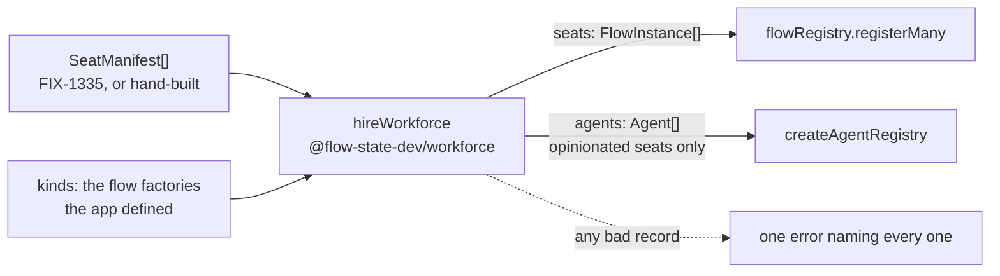

# FIX-1325: The seat factory — a worker record becomes one addressable, configured flow

## Part I — The Case *(for the human)*

### 1. Problem — why it matters, why now

An app that wants three collaborating AI workers has to introduce each one to the framework
by hand: write a flow for it, invent an address for it, decide whether it counts as an
"agent", and list the ones that do in a single registry call. Four judgement calls per
worker, made in code, made differently in every app that has tried.

The epic's companion issue gives those workers a home on disk — a folder per worker, a
document saying who it is. That issue deliberately stops at *reading*. Its output is a set of
plain records that nothing can run. **This issue is the step that makes a record into
something you can talk to.**

**Why it matters:** the objective this epic serves is that a multi-seat workforce becomes an
ordinary application shape. A folder that produces nothing runnable does not move that;
neither does a factory with no roster to feed it. The two together are the claim.

**Why now:** everything underneath has landed. A flow definition can have many named copies
(`cardinality: "collection"`), each with its own address, its own isolated data, and its own
frozen settings bag. Those were named gaps six weeks ago. They are on `main` now, and nothing
in Layer 2 uses them.

### 2. Solution in plain terms

One function. You hand it the worker records and the flows your app defines; it hands back
one running copy of a flow per worker — each answering to its own address, each carrying the
settings its own folder declared — plus agent entries for the workers that are opinionated
enough to need one, and nothing at all for the ones that aren't. Your app registers what
comes back, the same way it registers anything else.

Two things it deliberately does not do. It **does not build a flow out of the folder** — the
folder says *which* flow this worker runs and *how it is configured*, never what it does step
by step. And it **does not own the registry** — it returns entries, so a workforce read from
files and a workforce written by hand produce the same thing.

The distinction that makes the whole shape work: **being a worker does not make you an
agent.** An intake desk or a coordinator is a worker — it has a seat, an address, a
configuration — and it never touches the agent layer at all. A worker becomes an agent when
its file gives it a personality to run with.

**Philosophy.** Tenet 2 (composition over features): this adds no runtime concept — the
copies, the addresses and the settings bags all already exist; the function assembles them.
Tenet 3 (earn every addition): one exported function, no second registry, no new field on the
core `Agent`. Tenet 5 (one convergence point): a worker's address is minted in exactly one
place, so nothing can hold two versions of it — which is precisely the mistake §6 decision 1
exists to correct.

### 6. Decisions & rules — the sign-off surface

1. **A worker's identity is one string, and it is dot-separated: `engineering.lead`. That
   same string is its address, its registry name, and the name anything referring to it
   uses.**
   *Rejected:* `engineering/lead` — the slash-separated identity the loader's approved spec
   mints today.
   *Why, and this one is not a taste call:* **a worker whose address contains a `/` cannot be
   reached at all, and nothing tells you.** The POC on this branch registers one and then
   fails to talk to it —
   [`spec-poc/FIX-1325-seat-addressing/`](../spec-poc/FIX-1325-seat-addressing/NOTES.md). The
   flow builder accepts the id, the registry admits it and resolves it, and then every HTTP
   address 404s, because the router rebuilds the path from its segments before matching, so
   an escaped `/` is indistinguishable from a real one. The same seat under a dot answers
   normally. **That is the worst possible failure shape** — it boots clean and breaks when
   somebody first tries to use the worker.
   *Locks in:* one string, everywhere, minted once by the loader. The factory does no
   re-minting, so there is no second spelling to drift.
   *Cost, stated plainly:* the loader's spec is already approved with `/` in it, and this
   changes a decision that spec argued for. It is cheap **now** — nothing references a worker
   identity yet, since the loader is its only consumer and it has no callers — and gets
   permanently expensive later, which is the same argument that spec used for locking the
   shape early. See §12 (a).

2. **A worker's folder says which flow it runs and how that flow is configured. It never
   describes what the flow does.** The record names a kind (`flow: worker-agent`); the app
   passes the factory the flow kinds it defined; the factory instantiates one copy per
   worker.
   *Rejected:* the factory assembling a flow from the folder's contents — the atlas's
   proposed `createWorkerFlow({ role, personality, tools, skills })`.
   *Locks in:* the block graph is written in code, reviewed as code, and tested as code. A
   difference between two workers that changes what happens step by step is a different flow
   kind, not another line of frontmatter. This is what keeps a folder from quietly becoming a
   programming language.
   *Cost:* an app must define at least one worker flow in code before any folder does
   anything. Files alone do not produce a runnable worker from nothing — they produce
   configured copies of something an engineer wrote.

3. **Everything in the file except the two keys the factory itself reads is that worker's
   settings, handed to the flow verbatim. The flow decides what is allowed.**
   Reserved: `flow` (which kind) and `description` (roster label). The rest is parsed against
   that flow kind's declared settings schema.
   *Rejected:* the factory keeping its own list of settings it understands and passing on the
   rest, or silently dropping what it doesn't recognise.
   *Locks in:* a setting a worker declares that its flow never offered is **refused by name,
   at startup, before anything runs** — the epic's honesty theme applied at the file
   boundary, and it costs nothing to build because the settings bag already refuses
   undeclared keys. It also means the flow's author, not the framework, decides what a worker
   of that kind may say about itself.
   *Cost:* settings are written in the file exactly as the flow declares them. A flow that
   wants a two-word setting has to pick a spelling its authors will type, and live with it.
   We are deliberately not inventing a translation between how the file writes a name and how
   the code writes it — one such rule is how a convention acquires a dialect.

4. **A worker with instructions in its file is an agent and gets a registry entry. A worker
   without them is a thin seat: a flow, an address, and nothing else.**
   *Rejected:* an explicit `agent: true` flag, and "register everything".
   *Locks in:* registering everything cannot express a thin seat at all, and would teach that
   every worker is an agent — the collapse the epic's theme 3 exists to prevent. A flag can
   disagree with the file it sits in; instructions cannot, because the instructions *are* the
   thing that makes a worker opinionated. Nothing to keep in sync.
   *Cost:* prose written under the frontmatter of a thin seat mints a registry entry nobody
   asked for. The mitigation is documentation, not machinery: `description` is where "what
   this seat is for" goes, and the body is the worker's own voice.

5. **The four room helpers are cut from this issue's delivery and land with their first real
   caller.** *This is the scope decision, and it needs your call — see §12 (b).*
   *Locks in:* what ships is the factory, which the epic's gate bar tests directly. The
   helpers ship when there is a workforce for them to address.
   *Cost:* until then, an app that wants to open a conversation with a worker writes the
   session call itself — which is exactly what it does today, so nothing gets worse.

6. **The code door (`worker.ts`) is not wired by this issue, and it does not need to be.**
   *Rejected:* the factory importing a worker's TypeScript file at startup.
   *Locks in:* no runtime-TypeScript-loading question in this epic — a build-toolchain
   problem nobody has costed. And the capability it would buy already exists by decision 2: a
   worker whose shape is custom code is a flow kind the app defines and a folder that points
   at it. The second door is a *file-layout* affordance the loader records; wiring it is a
   named gap, not a gap this issue papers over.
   *Cost:* an author who expected to drop a `.ts` file in a worker folder and have it picked
   up will find it recorded and ignored. The docs must say so in the same breath as the
   convention.

**Non-goals** — the loader itself (FIX-1335); building a flow graph from files; a second
registry, or the factory owning registration; adding a worker after boot; several workers of
the *same* kind as a proven shape (Collab RC); worker output-shape honesty (FIX-1337); team
addressability and board scoping (FIX-1310); importing `worker.ts`.

**Size:** Medium — 3 production files · 12 test behaviours · 1 goal · 2 doc surfaces ·
1 changeset · 1 PR.

---

### 3. Tradeoffs & alternatives

**Alternative: keep `/` and teach the framework to address it.** The identity stays as the
loader's spec wrote it and the router learns to accept an escaped separator. Rejected on two
grounds. It is a change to the substrate to accommodate one Layer 2 product's naming taste,
which is the fold the epic's theme 3 refuses. And it isn't ours to fix end to end: the
escaped separator has to survive every host adapter's path handling — Next's catch-all, the
node host, Vercel — and we control none of them. A dot works everywhere today.

**Alternative: the factory builds and returns the registry.** One call, nothing to wire.
Rejected for the same reason the loader's spec rejected it: the registry is also fed by
hand-written definitions, and a factory that owns construction quietly makes that path
second-class. Returning entries keeps both doors equal.

**The simpler approach: no factory at all.** Document the four lines an app writes per worker
and stop. Genuinely tempting — the epic's gate bar explicitly accepts hand-registration, so
this would pass it. Insufficient for two reasons. One of those four lines mints the worker's
address, and an address minted in two places is the drift tenet 5 exists to prevent — the POC
above is what that costs when it goes wrong. And "hire this roster" being one call rather
than a loop an app writes is most of what makes a workforce feel like a shape the framework
knows about, which is the objective.

**Where the complexity is:** not the factory, which is a map over records. It is the identity
question decision 1 settles, and the split in decision 4 — deciding which workers are agents
without inventing a second worker type to hold the answer.

### 4. Focus practices (1–5)

1. **BP-003 (evidence, not reading).** The addressing premise under decision 1 is settled by
   a run on the real router, not by reading the route table. Its output is in the POC notes;
   its verdict is the reason decision 1 exists.
2. **Tenet 5 — one convergence point for the address.** The factory mints nothing. It uses
   the identity the record carries. If decision 1 is rejected, this practice is the first
   casualty and §12 (a) says so.
3. **Refuse, don't drop (epic theme 3, BP-030).** An unknown setting, a missing flow kind,
   and a worker naming a kind the app didn't pass all refuse at the hire, by name. Nothing is
   skipped quietly, and every bad worker is reported in one pass so an author fixes them all
   at once.
4. **BP-004 (public boundary first).** The exported surface is one function and two types.
   The helpers are behind decision 5 precisely so the boundary doesn't widen ahead of a
   caller.
5. **BP-022 (changeset).** `@flow-state-dev/workforce` is a published package; a new root
   export is a `minor`.

### 5. What using it looks like (1–5 examples)

**Two worker files — one opinionated, one thin:**

```md
<!-- teams/engineering/workers/lead/WORKER.md -->
---
description: Holds the engineering board and breaks work into tasks.
flow: worker-agent
model: openai/gpt-5.4-mini
tools: [board, search]
---

You are the engineering lead. You do not write code yourself — you break the
request into tasks, assign them, and report what came back.
```

```md
<!-- teams/engineering/workers/intake/WORKER.md -->
---
description: The front door. Routes an incoming request to whoever should hold it.
flow: intake
---
```

The intake file has no body. That is what makes it a thin seat.

**Hiring them** *(the whole change at the call site)*:

```ts
import { hireWorkforce, createAgentRegistry } from "@flow-state-dev/workforce";
import { workerAgentFlow, intakeFlow } from "./flows";

const { seats, agents } = hireWorkforce(workers, {
  kinds: { "worker-agent": workerAgentFlow, intake: intakeFlow },
});

flowRegistry.registerMany(seats);                  // both workers, addressable
const agentRegistry = createAgentRegistry(agents); // the lead only
```

**What came back:**

```ts
seats.map((s) => s.id);    // ["engineering.intake", "engineering.lead"]
seats[1].config;           // { model: "openai/gpt-5.4-mini", tools: ["board","search"] } — frozen
agents.map((a) => a.name); // ["engineering.lead"] — the intake seat is absent
```

**Talking to a worker** — an ordinary flow address, nothing workforce-specific:

```
POST /api/flows/engineering.lead/sessions
POST /api/flows/engineering.lead/<session>/actions/run
POST /api/flows/worker-agent/sessions        →  404: the bare kind is not an address
```

**A worker that says something its flow never offered:**

```
hireWorkforce: worker "engineering.lead" — flow "worker-agent" does not accept
setting "temperature". Declared settings: model, tools.
```

---

## Part II — The Build Plan *(for the implementing agent)*

### 7. Technical design

The factory is a pure, synchronous map from records to instances. It reads no files, opens no
connections, and registers nothing.



**The surface.**

```ts
/** One worker as declared on disk. FIX-1335's `WorkerManifest` satisfies this. */
export interface SeatManifest {
  /** The worker's whole identity and its flow address — `"<teamId>.<name>"`. */
  id: string;
  teamId: string;
  name: string;
  /** Frontmatter exactly as written. */
  declared: Record<string, unknown>;
  /** The worker's instructions. Empty for a thin seat. */
  body: string;
}

export interface HireOptions {
  /** Flow factories by kind, as the app defined them. A record's `flow` names one. */
  kinds: Record<string, (options: { id: string; config?: unknown }) => FlowInstance>;
}

export interface Workforce {
  /** One copy per record, ordered by id. Register these. */
  seats: FlowInstance[];
  /** Entries for the records that carry instructions. */
  agents: Agent[];
}

export function hireWorkforce(manifests: SeatManifest[], options: HireOptions): Workforce;
```

**Per record, in order:**

1. Split `declared` into the two reserved keys (`flow`, `description`) and the rest.
2. Look `flow` up in `kinds`. Missing or absent → collect an error naming the worker and the
   kinds that were passed.
3. `kinds[flow]({ id: manifest.id, config: rest })`. The settings parse happens inside — the
   flow's own `configSchema` refuses an undeclared key and a missing required one, and the
   result is frozen. **Add no validation of our own here**; wrapping a thrown parse error with
   the worker's id is the whole contribution.
4. If `body` is non-empty, build the agent: `name: manifest.id`, `description`,
   `persona: body`, and — read off the **parsed** config, so a flow that never offered them
   makes them unsettable — `model`, `allowedTools` (from `tools`), `usesCapabilities` (from
   `capabilities`). Built through `defineAgent`, so its validation is the one that applies.
5. Any errors collected → throw one error listing every bad worker, so an author fixes them
   in one pass. Nothing is returned partially.

**Why the agent fields come from the parsed config and not from the raw frontmatter.** It
means a flow kind that doesn't declare `model` makes `model:` in a worker file an error
rather than a key that quietly shapes the agent while the flow knows nothing about it. One
bag, two readers, one gatekeeper.

**Package layout.**

- **New:** `packages/workforce/src/manifest.ts` — the `SeatManifest` type, and nothing else.
  Node-free, exported from the package root. FIX-1335's loader imports the type from here
  rather than declaring its own (§12).
- **New:** `packages/workforce/src/hire.ts` — `hireWorkforce`, `HireOptions`, `Workforce`.
  Type-imports only; the root export gains no `node:` dependency.
- **Untouched:** `createAgentRegistry`, `materializeAgent`, `defineAgent`, `definePersona`,
  the core `Agent` type, the flow registry, `defineFlow`. This issue adds no field to any of
  them.

*No solution sketch beyond the above.* The body is a loop; the parts that need specifying are
specified.

### 8. Implementation sequence

1. **The manifest type** — `manifest.ts` plus its root export. *Test:* typecheck.
   *Depends on:* nothing. Coordinate with FIX-1335 per §12 if that landed first.
2. **The factory** — `hire.ts`: the split, the kind lookup, the instantiation, the agent
   derivation, and the collected refusal. *Test:* every §10 CI behaviour.
   *Depends on:* 1.
3. **Ship it** — root export, the goal, the changeset, the docs. *Test:* the §10 goal.
   *Depends on:* 2.

*No removals.* Nothing on `main` does this job.

### 9. Edge cases & error handling

**The rule behind the table:** every problem is a startup misconfiguration, so every problem
throws — but they are *collected first*, so one run names all of them.

| Case | Expected |
|---|---|
| Empty `manifests` | `{ seats: [], agents: [] }`. An app may have no file-declared workers |
| `flow` absent from a record | Collected error naming the worker |
| `flow` names a kind not in `kinds` | Collected error naming the worker, the kind, and the kinds that were passed |
| A setting the flow's schema never declared | The flow's own refusal, rethrown with the worker's id prefixed. Not caught and softened |
| A required setting the record omits | Same — the flow refuses at the mint |
| The flow kind is `cardinality: "singleton"` | The registry refuses a singleton under a custom id. Let it — the app passed a flow that cannot have copies, and the framework's message says so. Do not pre-check it here and produce a second message for one condition |
| Two records with the same `id` | Collected error. The registry would also catch it; catching it here names it as a *roster* problem and reports it alongside the others |
| `body` present but whitespace-only | Thin seat. Whitespace is not instructions |
| A record whose `id` is not `<teamId>.<name>` | Not checked. The loader owns identity minting (decision 1); re-validating it here would be the second convergence point that decision exists to remove |
| `description` absent | Passed through as `undefined`; `defineAgent` decides. The loader already requires it for a `WORKER.md` |
| `capabilities` naming an unknown capability | Not this factory's call. Resolution happens at materialization, which now refuses rather than drops (FIX-1327) |

### 10. Testing strategy

**Goal.** `goals/workforce-seats/two-seats-run-their-own-configuration/`, no model.

*Outcome:* An app defines two worker flow kinds and hires two workers — one opinionated, one
thin. Each becomes a copy addressable by its own id that behaves according to the settings its
own record declared and none of its sibling's, still true after a restart. The thin worker is
a fully addressable flow and appears nowhere in the agent registry; the opinionated worker's
registry entry carries what its record declared. A record naming a kind the app didn't
define, and a record declaring a setting its flow never offered, both refuse at the hire with
nothing registered.

*Signal:* the real HTTP router over on-disk SQLite, matching its siblings under
`goals/flow-instances/`. Both workers run an action to completion; the stores are closed and a
fresh host built before every read; each worker's `/state` is read for the value a **nested**
block wrote from `ctx.flow.config`.

*Anti-game:* a hollow pass would assert the hires returned and the requests completed — true
even when both workers share one settings bag and one silently wins. So the check MUST read
the settings back through `/state` rather than off the returned instance, and from a nested
block rather than the action root; MUST assert each worker's sibling value is **absent** as
well as its own present; MUST assert the thin worker's flow **is** addressable while its id is
absent from `agentRegistry.list()`, since "thin" must not be satisfiable by failing to hire
it; MUST assert the bare flow kind is a 404 for both, since that is the address the old rule
would have answered on; MUST assert both refusals happened with **nothing** registered, since
a refusal after a partial hire is not a refusal; and MUST address each worker by the exact id
its record carried, since grading `flowKind` proves nothing — both workers of a kind share it.

*Why a goal and not only unit tests:* the claim is that a described worker becomes one you can
talk to. That is a property of the assembled path — factory, registry, router, store — and a
suite over a hand-built instance cannot state it. It is also the epic's gate-minimum bar, so
this goal is what the gate is read off.

**CI specs** (behaviours, not test names):

1. Two records of two kinds produce two instances carrying their own ids, in id order.
2. Each instance's `config` holds its own record's settings, frozen, the sibling's absent.
3. A record with a body produces exactly one agent, named with the record's id, its persona
   the body verbatim, its description the record's.
4. A record with no body — and one with whitespace only — produces **no** agent, and still
   produces an instance.
5. `model` / `tools` / `capabilities` reach `Agent.model` / `allowedTools` /
   `usesCapabilities` from the parsed config.
6. A record naming a kind not in `kinds` throws, naming the worker, the kind, and the
   available kinds.
7. A record with no `flow` throws, naming the worker.
8. A setting the flow never declared throws, and the message carries both the worker's id and
   the offending key.
9. Two bad records produce **one** error naming both.
10. Any failure leaves nothing partially built — the call throws rather than returning.
11. Duplicate record ids throw as a roster error.
12. Empty input returns two empty arrays.

### 11. Documentation plan

- **EXTEND** `apps/docs/docs/orchestration/workers-on-disk.md` — the page FIX-1335 creates —
  with a section *"From a record to a running worker"*: the hiring call, the `flow` and
  `description` keys, what settings a worker may declare and who decides, the thin-seat rule,
  and the address a hired worker answers on. **Create the page if FIX-1335 has not landed**,
  carrying only this issue's half. *Why extend rather than add a page:* a reader learning the
  folder convention needs the running half in the same sitting; two pages would split one
  story and fragment the sidebar for no gain.
  *Cross-links:* → Agents (what an agent entry is for), → the flow-copies page (what an
  instance id and a settings bag are). ← Agents' *Current limits* bullet on static
  registration, which this half answers.
  *Voice risks for this topic:* "seamless", "automatically", and "just add a file" all fit the
  temptation here and none are allowed. Say plainly that the app still defines the flows and
  still registers what comes back. Introduce "seat" on first use. No issue IDs on the page.
- **EXTEND** `packages/workforce/README.md` — `hireWorkforce` in the API table, plus a short
  section with the signature, the two reserved keys, and the boundary (returns entries, does
  not register).
- **CHANGESET — required.** `minor`, `@flow-state-dev/workforce`. One user-facing sentence:
  *"New `hireWorkforce`: turn worker records into one configured flow copy each, plus agent
  entries for the workers that declare instructions."*

### 12. Dependencies, open questions & follow-ups

**Dependency on FIX-1335 — a type, and a decision.**
*The type:* `SeatManifest` should live in one node-free module both issues import
(`packages/workforce/src/manifest.ts`). Whichever lands second does a pure move; whichever
lands first should put it there. Not a blocker in either order.
*The decision:* decision 1 changes the identity separator that FIX-1335's **approved** spec
locks as `/`. That spec is where the change has to land, because that is where the identity is
minted — and re-minting it here is exactly the second convergence point the decision removes.
The POC is the evidence. Flagged on the epic PR (#1664) and on FIX-1335's spec PR (#1665)
rather than decided unilaterally here.

**Open — needs your call.**

**(a) The identity separator, since it reopens an approved spec.**
- *The fork:* change the worker identity to `engineering.lead` now, or keep `engineering/lead`
  and have the factory translate it into a second, different address.
- *In plain terms:* a worker's name is also the thing you type to reach it. With a slash in
  it, nothing can reach it — and nothing warns you until someone tries.
- *The trade-off:* changing it means reopening a spec that was already signed off, which costs
  a round and looks like churn. Keeping it means a worker has two names — one it is known by,
  one it answers on — and every later feature has to know which is which. Nobody outside feels
  either today; the second is felt by whoever adds the fifth feature that touches worker
  identity, and by any app that has adopted the name shape by then.
- *My recommendation:* change it. The cost is one edit to a spec with no implementation behind
  it yet, and the approved spec's own argument for locking the shape early — that changing it
  later would break every reference — is the argument for changing it now, while there are
  none.
- *What would change my mind:* if FIX-1335 is already built and merged with `/` throughout, or
  if a dot turns out to break an address we haven't tested — the CLI's flow argument, a queue
  payload. Neither is true as far as this issue checked; the second is worth ten minutes at
  implementation time.
- *If I'm wrong:* we spend a spec round and land on a translation layer instead. Reversible,
  small, and no code is written on the wrong assumption either way.

**(b) The four room helpers — ship them here, or hold them for the lab?**
- *The fork:* build the four conversation helpers now as part of this issue, or ship the
  factory alone and add them when something actually calls them.
- *In plain terms:* the helpers are the shortcuts for starting a conversation with a worker or
  broadcasting to a team. Nothing in this epic starts conversations with workers.
- *The trade-off:* building them now means the epic's package looks complete and the next
  stage finds them waiting. Holding them means the next stage writes a few lines of session
  code first. The people who feel it are whoever builds the first real workforce app — either
  they find helpers shaped by a guess, or they write the plumbing and we shape the helpers
  around what they actually needed.
- *My recommendation:* hold them. The epic's own fence says a helper lands with its first real
  caller, and its first caller — the pentest lab — is explicitly the *stage after* this epic.
  Two of the four also need addressing doors that are named gaps, so building them now means
  either shipping them incomplete or inventing an argument to hide the gap, which the epic
  forbids by name.
- *What would change my mind:* if the lab is starting immediately and would be blocked without
  them. Then they land in the same week and the guess-risk mostly disappears.
- *If I'm wrong:* the epic ships a smaller package and the lab spends an afternoon writing
  session calls. That is the whole downside — it is the work every app does today.

**Follow-ups (flagged, not built):**

- **The four room helpers** — decision 5. To be filed against the lab stage rather than left
  implicit in this issue's title.
- **Wiring the `worker.ts` door** — decision 6. Needs the runtime-TypeScript question costed
  first.
- **Several workers of one kind** — already supported by the substrate (collection cardinality
  makes it free), deliberately not proven here. Collab RC.
- **The atlas's §06 five-file layout** is superseded by one `WORKER.md`, and its §05
  `createWorkerFlow` sketch is superseded by decision 2. The epic already carries the atlas
  update as an obligation; this adds the §05 half to it.

### 13. Review notes for the implementer

*(Empty at draft. Review feedback that does not change the approach lands here.)*

---

## Spec evolution

- **Spec drafted** — the seat factory as a pure map from worker records to configured flow
  copies, with agent entries only where a worker declares instructions; the flow graph stays
  in code; the room helpers cut to their first real caller.
- **POC before the first review round** — the identity premise (`<teamId>/<name>` used as a
  flow address) was load-bearing and unchecked. Built and run on the real router: a slashed id
  registers and is then unreachable, silently. Decision 1 is that verdict, and it reopens the
  loader spec's separator.
