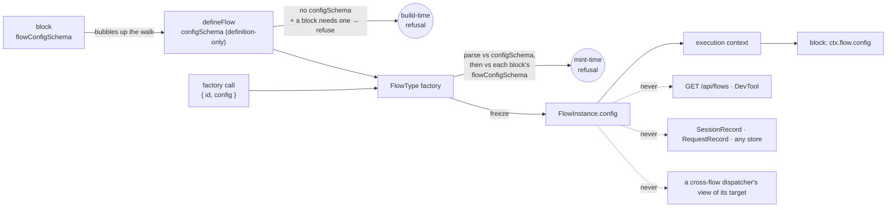

# FIX-1331: Instance create-time config bag (`FlowInstanceOptions.config` → `ctx.flow.config`) — Implementation Spec

## Part I — The Case

### 1. Problem — why it matters, why now

Two copies of the same flow can now be addressed, isolated and owned separately — but they still cannot be *set up* differently. Wanting one engineer seat on one coding harness and a second on another means building a whole second flow: fresh definition, fresh block graph, fresh actions, identical except for two strings.

That is what Conductor does today: it closes over the workspace and the timeouts and calls `defineFlow` inside its own factory, so one board per epic is one whole flow definition per epic. Fine for a handful written by hand. It does not survive a roster of seats read from a file, where every hire rebuilds the action tree.

**Why now** — the rest of the floor is what makes several copies real. Without knobs, the only difference two copies can express is their name, and every real difference has to become a separate kind — the shape the epic rejected.

### 2. Solution in plain terms

When you create a copy of a flow, you hand it a small bag of settings — a model, a harness, a path to a persona file. The definition says up front what that bag may contain. Every block inside that copy can read it, and nothing can change it afterwards.

The line this spec is really for:

> **Anything the copy is *given* goes in the bag. Anything the copy *learns* goes in its own private storage.**

A seat's harness is given; its current task and its counters are learned. If a block would ever want to write it, it is not config — it is instance-isolated state, which FIX-1323 delivers. Holding that line is what stops this becoming a mutable per-instance store by accident.

**Philosophy** — tenet 2: one option on a factory that already exists, not a new noun beside it. Tenet 3: the framework never inspects the bag, so it adds no branching anywhere. Tenet 5: the value enters where an instance is built, so there is one door to validate at.

### 6. Decisions & rules — the sign-off surface

1. **The bag is fixed when the copy is created and frozen for its life; anything a copy would write goes to its own private storage instead.** *Rejected:* a per-instance settings store blocks can update — a second, weaker copy of what FIX-1323 gives. *Locks in:* retuning a running seat is a redeploy, not a runtime action, so anything operational must be modelled as state from day one — moving a knob out of the bag later is a data migration, not an edit.

2. **A copy may only carry settings the definition declared, and a mismatch refuses when the copy is created.** *Rejected:* an opaque bag anyone can put anything in. *Locks in:* a mistyped knob in a roster fails at startup with the seat named, rather than surfacing as an agent that quietly ran on the wrong model. The cost is that a bag whose keys aren't known until run time is unsupported; relaxing that later is cheap, tightening it later would not be.

3. **Settings never leave the process: not on the public flow listing, not in DevTool, not in any stored record.** *Rejected:* putting them on the flow list so an operator can see each copy's configuration — that endpoint is deliberately unauthenticated, and these are author-written values that will eventually include a credential someone should not have put there. *Locks in:* "why did this seat behave differently?" is answered from the code that minted it, not from an API; and a past run keeps no record of what it ran under, so a request that suspends and resumes after a deploy runs on the *new* settings.

4. **The bag is read through the `flow` member the public context already names, narrowed to exactly `config` — not through a new context member.** *Rejected:* `ctx.config`, which sits beside the process-wide `ctx.settings` and says nothing about whose config it is; and `ctx.instance.config`, a second name at a second altitude for what the runtime context already calls `flow`. The runtime already carries the instance under `flow`; only the type boundary moves. *Locks in:* the block-context boundary becomes a *shape* rather than an absence, so the type-level tripwire that keeps `actions`, `task`, `internal`, `resources` and `id` out of reach has to be re-aimed rather than deleted — and every later request to widen it argues against a named list instead of a blanket no.

5. **A block that reads the bag declares what it needs — `flowConfigSchema` on the block — and the flow is checked against that declaration. The block never names a flow.** *Rejected:* typing the block's context off a named flow (`InferFlowBlockContext<typeof engineer>`), which is how an earlier cut of this spec did it. That binds a block to one flow at the type level and gives it a type with no check behind it: a block installed somewhere else compiles and reads whatever is there. The declaration runs the other way — the requirement bubbles to the flow and the flow refuses if it cannot meet it — which is how `requireOrg` and a dispatcher's address already work (§7). *Locks in:* a block is portable by construction and its requirement travels with it; the cost is one more schema slot on all four block kinds, beside `parentStateSchema`, and the honest limit on what that check is worth is decision 6.

6. **The check is a parse of the real bag, not a comparison of two schemas — so it is exact, and it happens per copy rather than per definition.** Two refusals, at the two moments each is decidable: **at definition time**, a flow that declares no `configSchema` at all while a block it reaches requires one; **at the mint**, the frozen bag parsed against each block's declared schema. *Rejected:* deciding at definition time whether the flow's `configSchema` structurally satisfies the block's — see §7 for why that is not implementable to a standard worth promising, and what the codebase's own attempt at it (`compareZodSchemasStructurally`) is limited to. *Locks in:* every copy that can run has been checked completely — refinements, unions, nested objects and defaults included, because zod parses the value rather than us reading the type. What you do **not** get is "this flow can never satisfy this block" reported when the flow is defined: a flow whose `configSchema` is merely *looser* than the block needs (an optional key the block requires) is refused at the mint of each copy that omits it, not where the two were written. No unsatisfied block ever executes; you may just learn one step later than you expected, and per copy rather than once.

**Non-goals** — mutable seat state (FIX-1323 owns it); exposing settings on any HTTP surface or in DevTool (FIX-1324 owns instance navigation and already has id, kind and cardinality); letting a cross-flow dispatcher read its target's settings; a second registry, TeamFlow, or any Workforce surface; reshaping FIX-1321/1322/1323 in flight.

**Size:** 8 production files (6 in `core`, 1 in `engine`, 1 in `testing`) · 14 test behaviours · 7 documentation surfaces · 1 PR. *(Three core files and three behaviours over the pre-gate cut: the block-side declaration is one schema slot on each of `handler`, `generator` and `router`, and it brings its own two refusals.)*

---

### 3. Tradeoffs & alternatives

**Alternative: keep doing what Conductor does** — a function closing over the knobs that calls `defineFlow` inside itself. No framework change at all. Rejected because it makes every copy a *separate definition*: twenty seats is twenty block trees and twenty structurally different registrations, and the epic's premise — same shape, different name — stops being expressible.

**The simpler approach: per-instance `actions` overrides, which already exist.** One copy can already replace a block. Insufficient because it is a *structural* override: differing by a model name means constructing a new generator per copy, and the fence says structural differences are what separate *kinds* are for.

**Where the complexity is:** not the plumbing — the value is already on every block's context at run time. Two things are hard, and neither is the bag.

The first is a **boundary**. The public block context deliberately does **not** expose the flow instance (a type-level tripwire enforces it), because reaching the whole instance lets a block step past the dispatch and claim gates built onto it. Exposing one read-only member without reopening that door is decision 4; §7 builds it.

The second is **what a block's declaration is actually worth**. A block says what settings it needs; the flow says what settings it has. Deciding whether the second satisfies the first *from the two schemas* is the natural-looking move and is not tractable over real Zod — decision 6 takes the tractable route instead (parse the actual bag) and §7 states plainly what that does and does not catch. Getting this wrong in the optimistic direction would be the worst outcome available: a declaration that reads like a guarantee and misses the case it was written for.

### 4. Focus practices

1. **The framework never reads inside the bag** (tenet 3). Nothing in the engine, registry, routes or stores branches on a config *value*. The registry's one branch is on `requiresConfig`, a declaration-derived boolean like `requiresOrg`, and it refuses rather than behaves differently. A change that wants to read a value is a new decision, not an extension of this one.
2. **BP-031 (never route or authorize from reachable input)** — why config takes no part in address resolution, isolation keys, or the unauthenticated flow listing.
3. **One convergence point for validation** (tenet 5) — every instance carrying a config comes through one factory path: the normalization in §7, built at §8 step 2. The block-side check rides that same path rather than opening a second one — the bag is parsed against the flow's schema and against each block's declaration at the same moment, in the same function. §9's structural-bypass row names the one shape that gets past it.
4. **BP-030 (tolerate the old shape)** — every flow that exists today declares no schema and passes no config, reads an empty object, and is otherwise unchanged.

### 5. What using it looks like

*(What this spec proposes. None of it runs today.)*

**One definition, two seats that differ by knobs:**

```ts
const seatConfig = z.object({
  harness: z.enum(["claude-code", "codex", "cursor"]),
  model: z.string(),
  personaPath: z.string().optional(),
});

const engineerBlock = handler({
  name: "engineer-work",
  // What this block requires of whatever flow installs it. Types the read,
  // and is checked against the flow — no flow is named here.
  flowConfigSchema: seatConfig,
  execute: async (input, ctx) => {
    const { harness, model } = ctx.flow.config; // typed, and already validated at mint
    // ...
  },
});

const engineer = defineFlow({
  kind: "engineer",
  cardinality: "collection",
  configSchema: seatConfig,
  actions: { work: { block: engineerBlock } },
});

const alice = engineer({ id: "eng-alice", config: { harness: "claude-code", model: "opus" } });
const bob   = engineer({ id: "eng-bob",   config: { harness: "codex",       model: "gpt-5.4" } });
```

One block, one action tree, two registered copies. FIX-1322 addresses them by id; FIX-1323 keeps their private data apart. A roster mints the rest in a loop: `engineer({ id: seat.id, config: seat.config })` per row, no graph rebuilt.

**The block names no flow.** `flowConfigSchema` says what the block needs, not where it runs — so the same `engineerBlock` drops into any other flow whose `configSchema` satisfies it, checked there too, with nothing about it edited. A block that reads the bag without declaring one gets `Readonly<Record<string, unknown>>` and must parse for itself. Declaring is how a block gets both the type and the guarantee, and it is the only way to get either.

**What a bad knob does (before / after):**

```
before  a seat with a typo'd harness registers fine; the agent picks a
        default three steps into its first run
after   engineer({ id: "eng-carol", config: { harnes: "codex", … } })
        throws at that line, naming the flow, the id and the unknown key

before  a block that reads ctx.flow.config is installed on a flow that
        declares no settings at all; it reads {} and defaults its way
        through the first run
after   defineFlow({ kind: "reviewer", … }) throws where the flow is
        defined: it reaches block "engineer-work", which requires flow
        config, and the flow declares no configSchema

before  the flow declares settings, but not the ones this block reads
after   engineer({ id: "eng-alice", config: { … } }) throws at the mint,
        naming the flow, the id, the block, and the field it wanted
```

---

## Part II — The Build Plan

### 7. Technical design

The value enters at one place and is read at one place. Nothing in between inspects it. What the blocks *require* travels the other way — up to the flow, the way a dispatcher's address and `requireOrg` already do.



**`@flow-state-dev/core` carries the substrate.** Four concerns, plus one follow-on in `@flow-state-dev/testing`:

- **Authoring surface — two schemas, in two places, doing two jobs.** They coexist; neither replaces the other. `configSchema` on the flow declares what the bag *is* and is what parses and freezes it at the mint (decisions 1 and 2, unchanged). `flowConfigSchema` on a block declares what that block *needs of whatever flow installs it* — it types the read and guards installation, and it never parses the bag on its own authority. A flow with no block declaring anything works exactly as before; a block declaring one is portable to any flow that satisfies it.

  `configSchema` on `FlowDefinition`, definition-only in exactly the way `cardinality` is — the existing instance-option refusal list gains it, so `flow({ configSchema })` throws by name rather than being accepted and ignored. `config` on `FlowInstanceOptions`. `config` on `FlowInstance` and mirrored on `FlowType` — normalized so it is never absent — plus `requiresConfig` beside `requiresOrg` (below).
- **Normalization — at a mint, and only at a mint.** The instance-construction path parses `config` against the declared schema and freezes the result. Four refusals: a `config` with no declared schema, a `config` that fails the schema (an undeclared key included — see below), and `configSchema` passed as an instance option, all at the factory call; plus a `configSchema` that is not an object schema, refused where it is declared. Omitting `config` at a mint is not a way around any of it — the schema parses `{}`, so its defaults apply and a required field refuses. This is the single door: the factory is what every registered and every directly-evaluated instance goes through.

  **A blueprint is not a mint, and the seam for that already exists.** `defineFlow` builds the definition-derived properties it mirrors onto `FlowType` at definition time. If that construction parsed the omitted bag, a schema with a required field would throw *when the flow is defined* — §5's own two-seat example would not run, because `defineFlow({ configSchema: seatConfig, … })` would throw before `engineer({ … })` is ever reached.

  FIX-1321/1322 hit this exact failure mode for `id` and already split the path: on `fix/fix-1322`, `normalizeFlowConfig()` returns `Omit<FlowInstance, "id">` and `createFlowInstance()` is `resolveInstanceId(...)` plus that, with the reason in its own doc comment — *"a collection definition has no id to instantiate with at that point. Putting the collection-id requirement here would make every collection definition fail before its author could supply an id."* Config is the same kind of value as `id`: per-copy, supplied at the mint. **So config normalization goes in `createFlowInstance`, beside `resolveInstanceId`, and `normalizeFlowConfig` never touches it.** No new flag and no new seam — the blueprint half simply has no bag to normalize.

  **What the blueprint carries.** `FlowType` keeps a `config`, derived once at definition time from `configSchema.safeParse({})`: on success, that parsed value, so a blueprint and `engineer()` agree exactly, defaults included; on failure, the frozen empty object plus **`requiresConfig: true`**, a normalized boolean beside `requiresOrg` — the existing precedent for a declaration-derived flag the engine branches on. The framework still never reads *inside* the bag (tenet 3); it reads whether one is required.

  **The blueprint probe runs the block check too, so there is one rule and not two.** `requiresConfig` is set when that `safeParse({})` fails **or** when the value it produced fails any entry in `requiredFlowConfig`. Same predicate, same code path as the mint: "could this flow run with the bag it would have if nobody supplied one?" A flow whose knobs all default and whose blocks are all satisfied by those defaults registers bare and reads them, exactly as before. One whose blocks need more than the defaults give is a flow that must be minted, and says so at the registry door rather than three steps into a run.

  **The last door, so the promise does not fail quiet.** A blueprint handed to the registry in place of an instance is a narrow path — CLI discovery rejects it outright (`isFlowInstance` in `packages/cli/src/resolve-flow.ts:19` requires `typeof value === "object"`, and a `defineFlow` result is a callable), and a `flows:` map entry does not type-check because `FlowType` has no `id` — but the registry deliberately tolerates it for JS and legacy callers: `admitIdentity` (`packages/engine/src/registry/flow-registry.ts:520`) admits *"a singleton definition handed over in place of an instance"* under `id = kind`. Left alone, a flow declaring required settings would register there and hand its blocks `{}`, misbehaving somewhere downstream and far from the cause — the shape decision 2 exists to prevent. **So that branch refuses when `requiresConfig` is set,** naming the flow and saying it must be minted with a config bag. It forecloses nothing that works: a collection blueprint already refuses one line below (`invalid-id` — the code's own comment reads *"A collection with no id is a blueprint, not an instance, and refuses below"*), and a bare-registered singleton can never receive a bag anyway, because a blueprint and a mint of the same flow cannot coexist in one registry — by either of two routes. A singleton minted without an id takes the default (`resolveInstanceId` ends `return suppliedId ?? flowKind`), so it collides with the blueprint's `id = kind` and the second registration refuses as `duplicate-id`; a singleton minted *with* an id carries `id !== kind` and never registers at all, refusing one check earlier as `singleton-id-mismatch`. Same conclusion, two different errors — worth knowing which, since only the first is a collision. No flow that exists today declares a `configSchema` at all, so nothing already running can be caught by it.

  **Closed keys, not stripped keys.** A plain `z.object(...).parse()` *drops* an undeclared key silently, so `{ harnes: "codex", … }` read from a roster would parse clean and the seat would run on a default — precisely what decision 2 promises will not happen, and TypeScript's excess-property check never sees a value loaded from a file. So the declared schema is closed before it is parsed: normalization refuses a `configSchema` that is not a Zod object (`isZodObject` in `packages/core/src/helpers/zod-introspect.ts` already exists for this, and `types/resource.ts:570` sets the precedent for requiring one) and parses through its strict form, so an undeclared key is an error naming the flow, the id and the key. Closing it inside the framework rather than asking authors to write `.strict()` is deliberate: an author cannot leave the door open by forgetting, and `.passthrough()` is meaningless under decision 2 anyway. This makes decision 2 *true*; it does not change what decision 2 promised.
- **The block-side declaration, and what checking it is actually worth.** This is decisions 5 and 6, and it is where the design earns or loses its promise.

  **The slot.** `flowConfigSchema?: ZodTypeAny` goes on `BlockConfig` — the shared config every block kind extends — so the runtime field exists on all four kinds from one edit, and the type generic (`TFlowConfigSchema`, defaulting to `undefined`, inferring `ctx.flow.config`) is threaded in `handler`, `generator`, `router` **and** `sequencer`. That is one kind more than `parentStateSchema`, which sits on three; the divergence is deliberate rather than sloppy. `parentStateSchema` is meaningless on a sequencer, which *is* the parent. Flow config is readable from any block kind's context, a sequencer's connectors and taps included, so leaving one kind out would be a hole an author finds by hitting it.

  **Where it bubbles.** Off `walkFlowGraph`'s reachable set in `defineFlow` — the same closure `resolveDispatchTargets` reads, which takes the generator's static `tools` edge. Not off the action roots the way `declaredResources` and `requiresOrg` are collected. The reason is in `defineFlow`'s own comment on that split: resources and org can ride the roots because a board reached only as a tool lands its declarations through the task entry its seat addresses. A plain tool block that reads `ctx.flow.config` has no action root of its own, so collecting off the roots would silently skip it. The flow carries the result as `requiredFlowConfig` — the declaring block's name paired with its schema, deduped by schema reference the way `mergeDeclaredResources` dedupes by `defineResource()` reference, so one shared schema across ten blocks is one entry. Internal and never serialized, like `flowLevelResourceKeys`; decision 3 keeps schemas off the wire for the same reason it keeps values off it.

  **Precedent supplies the shape and stops short of the check — that difference is the finding.** `parentStateSchema` is the nearest neighbour: a block declares the shape of something it does not own, gets `ctx.parent`'s state ops typed from it, and is portable because it names no particular parent. It is exactly the family this slot belongs to. But **nothing verifies it.** There is no bubble and no refusal; a block declaring a `parentStateSchema` its actual parent does not match compiles and runs, and reads whatever is there. The declaration is a type assertion, not a contract. The two mechanisms that *do* refuse are `requireOrg` — bubbled through `buildBlock`, surfaced as `flow.requiresOrg`, and enforced per request in `validateDispatch` — and a dispatcher's address, walked in `defineFlow` and refused at definition time by name (*"Flow X reaches block Y, which dispatches to internal:'z', but the flow declares no such entry. Add … , or point the dispatcher at an entry it declares."*). That last one is the template here: build-time, names the flow and the block, and ends in a remedy. So the house style supports the direction, but it is not uniform, and the closest analogue by shape verifies nothing at all. The check below is new surface, and it is worth being precise about what it buys.

  **The two refusals, at the two moments each is decidable.**

  1. **Definition time**, in `defineFlow`, beside the dispatch refusal and reading the same walk: a reachable block declares `flowConfigSchema` and the flow declares **no** `configSchema` at all → throw, naming the flow, the block, and the fix. Fully decidable — the flow's schema is absent, so nothing can satisfy anything.
  2. **The mint**, in `createFlowInstance`, immediately after the bag is parsed against the flow's own `configSchema` and before it is frozen: the parsed bag is run through each entry in `requiredFlowConfig`. A failure refuses with the flow, the instance id, the declaring block's name and Zod's own issues.

  **Why the mint and not a schema-to-schema check at definition time.** The natural-looking move is to decide, where both schemas are in hand, whether the flow's `configSchema` structurally satisfies the block's. It is not implementable to a standard worth promising. Deciding it means comparing the flow schema's *output* type against the block schema's *input* type, and over real Zod that runs straight into: `.default()`, which makes a key optional on input and required on output, so a naive read of the wrapper type gets the answer backwards; `z.enum([...])` against `z.string()`, compatible but a different `_def.typeName`, so any type-name comparison is a false refusal on a correct program; `.refine()` / `.superRefine()`, whose constraint is a closure and cannot be compared at all; unions, needing variant-wise checking; `.transform()`, `.pipe()`, `.brand()` and `.catch()`, whose output type is genuinely not recoverable from structure; and `z.lazy` recursion. The codebase already has one attempt at this — `compareZodSchemasStructurally` in `packages/core/src/helpers/zod-introspect.ts`, whose own doc comment says *"Conservative one-level structural comparison… Does NOT recurse into nested shapes, refinements, brands, or union variants."* It is used in exactly one place, `sequencer.validate()`, it is **opt-in** (an author calls `.validate()`; nothing runs it automatically), and it demands *equal key sets* — which is backwards for this job, where a flow will normally declare more knobs than any one block reads. Building a stricter version would mean writing a Zod subtyping algorithm, maintaining it against every Zod release, and shipping a guarantee whose failure mode is a **false refusal on a program that works** — the worst direction for a build-time check to be wrong in.

  **What the mint-time parse gets instead: everything, exactly.** By the time the check runs, the bag is a concrete value. `blockSchema.safeParse(bag)` is not an approximation of the question — it *is* the question. Refinements run. Unions resolve. Nested objects are checked to the bottom. Defaults have already been applied by the flow's parse, so the block sees the value it will actually read. There is no class of mismatch it misses, and no correct program it refuses. This is also how the codebase's one existing config-compatibility check works: `assertConfigCompatible` in `packages/core/src/capability/merge.ts` decides whether two uses of a capability agree by `schema.safeParse(value)` on each side and comparing the parsed results — never by comparing schemas. We are following that, not inventing.

  **The limit, stated plainly, because it is the thing to weigh.** The guarantee is **per copy, not per definition**. A flow whose `configSchema` is merely *looser* than a block needs — the block requires `model`, the flow declares `model: z.string().optional()` — is not refused where the two were written. It is refused at the mint of every copy that omits `model`, and it passes for copies that supply it. Concretely: every instance that can run has been fully checked, so no block ever executes against a bag it did not accept; but "these two can never fit" is not reported until someone tries to build one, and a roster of twenty seats reports it per seat. The definition-time refusal covers the blunt case (no `configSchema` at all); the loose-schema case is a mint-time answer. We think that trade is right — an exact check one step later beats an approximate check earlier, and the approximate one would also refuse programs that work — but it is a real difference from what "the flow refuses at build time if it cannot satisfy the block" sounds like, and §10 pins it with a test so nobody later reads the suite as the stronger promise.

- **The read boundary.** This is what decision 4 settles, and it is the part of the change with teeth. The public `BlockContext` deliberately has **no** `flow` member; a type-test asserts its absence so that a block cannot reach the flow's action, task and internal maps and step around the claim and dispatch gates built onto them. The engine's own context type is `BlockContext & { flow: FlowInstance }`, so at run time `ctx.flow` **is already the instance on every block context** — including nested ones, which are spread from it. Nothing needs plumbing; only the type boundary moves.

  Per **decision 4**, the public context declares a `flow` member exposing **exactly one property, `config`** — not the instance. The instance's other members stay unreachable without a cast, exactly as today, and the type-test's tripwire is *re-aimed* rather than removed: it keeps a negative assertion on `flow.actions`, `flow.task`, `flow.internal`, `flow.resources` and `flow.id`, and gains a positive one on `flow.config`. That is strictly more precise than today's all-or-nothing assertion. `ctx.stores` is untouched. The cost of a shape rather than an absence is that the tripwire has to be sharper — hence the re-aim.

  **One name for the narrowed view.** `BlockContext`, the flow-inference helper and the boundary type-test all need the same shape, and three hand-written copies drift. Name it once — `FlowContextView<TConfig>`, structurally `{ config: TConfig }` — and have all three refer to it, so widening the boundary later is one edit in one place and the tripwire asserts against the type the context actually uses.

- **The test harness has to match production.** `packages/testing/src/runtime/createTestContext.ts:131-143` builds its default `FlowInstance` through a cast and would hand a block `ctx.flow.config === undefined` where production promises a frozen empty object — the harness quietly disagreeing with the runtime it stands in for. Its synthetic instance gains the same frozen empty object, and the test-context options gain one passthrough so a seat block can be exercised under a bag without minting a whole flow. No other testing surface moves.

**`config`, not `params`.** `params` reads as per-call arguments and would invite exactly the misuse decision 1 exists to prevent — a caller expecting to vary them per request. `config` carries "set up front" natively. It sits next to `ctx.settings` (whole process, one shape, declaration-merged) as its per-copy sibling; the docs plan states that pair once so it is not left to inference.

**Typing a consumer gets — both ends typed, from two different declarations.**

- **Minting is typed from the flow's schema.** The factory's call signature threads `configSchema` through, so `engineer({ id, config })` type-checks the bag at the line that writes it. This is where a roster typo happens and where the type earns its keep.
- **Reading is typed from the block's own schema.** A block declaring `flowConfigSchema` gets `ctx.flow.config` as `z.infer<>` of that schema, with no annotation and no flow named — the same way `parentStateSchema` types `ctx.parent` and `stateSchema` types `ctx.self`. A block that declares nothing reads `Readonly<Record<string, unknown>>` and parses for itself, which is the honest type for a block that never said what it wanted.

**`InferFlowBlockContext` is unchanged and stays off this path.** It already exists (`packages/core/src/types/flow.ts:662`) and keeps doing what it does for the flow's request/session/user/org state schemas. An earlier cut of this spec used it to type `ctx.flow.config` from a named flow — `InferFlowBlockContext<typeof engineer>` — and the owner rejected that at the gate, correctly: it binds a block to one flow at the type level, and gives it a type with nothing behind it. It is **not extended** to carry the config slot. Adding it there would put a second way to get the same type, one of which comes with a check and one of which does not, and authors would reach for either.

**Untouched:** every route, store, scope key and context factory; every package but `core`, `engine` and `testing`; the three in-flight floor issues' surfaces. The engine's whole share is one refusal inside the registry branch that already tolerates a definition handed over as an instance, reading one boolean and never the bag. `buildBlock` is not touched either — the block declaration is collected off `defineFlow`'s existing walk, not bubbled through the builders the way `requiresOrg` is, so no composite has to learn to merge it.

**Sketch — pseudocode. Illustrative, not the contract. React to the shape.**

```
where a configSchema is declared:
    if it is not an object schema -> refuse at definition time, naming the flow

where defineFlow walks the reachable block graph (the same walk the
dispatch-address refusal reads, tool edge included):

    required <- [ (block.name, block.flowConfigSchema)
                  for every reachable block that declares one ]
                deduped by schema reference
    if required is non-empty and the flow declared no configSchema:
        refuse at definition time, naming the flow, the first block, and
        the fix: declare a configSchema this block can read

    -- NOTE: no schema-vs-schema comparison here. See the paragraph above:
    -- it is not decidable over real Zod, and the value-level parse below
    -- answers the same question exactly.

satisfies(bag):
    for (blockName, schema) in required:
        schema.safeParse(bag) -> on failure, refuse naming the flow,
                                 the instance id, blockName and the issues

where a flow instance is MINTED (the half that also resolves the id;
the blueprint half normalizes no config at all):

    if instance options carry a config:
        if the definition declared no schema   -> refuse, naming the flow
        parsed <- closed(schema).parse(config) -> refuse with the schema's issues,
                                                  an undeclared key among them
    else if the definition declared a schema:
        parsed <- closed(schema).parse(empty)  -> defaults apply, a required field refuses
    else:
        parsed <- empty
    satisfies(parsed)                          -> the block-side refusal
    instance.config <- freeze(parsed)

where the blueprint's mirrored properties are built:
    probe <- schema.safeParse(empty)
    candidate                <- probe ok ? probe.value : empty
    blueprint.config         <- freeze(candidate)
    blueprint.requiresConfig <- (not probe ok) or (candidate fails satisfies)

where the registry admits a definition handed over as an instance:
    if it requiresConfig -> refuse, naming the flow: mint it with a config bag

where a block runs:
    the runtime context ALREADY carries the instance under `flow`
    the public context type now admits exactly one member of it: `config`
    (the tripwire keeps every other member unreachable without a cast)
    its type comes from THIS block's flowConfigSchema, or is an open
    read-only record when it declared none
```

### 8. Implementation sequence

1. **Authoring types.** `configSchema` on the definition, `config` on instance options, `config` on `FlowInstance`/`FlowType`. No behaviour yet. *Test:* the definition-only refusal for `configSchema` passed as an instance option. *Depends on:* FIX-1321 + FIX-1322's shared landing (the instance-option refusal list and the cardinality normalization this sits beside).
2. **Normalize and refuse at the factory**, per decision 2 — close the schema, parse, freeze, and the four refusals. *Test:* a valid bag, each refusal, an undeclared key from a non-literal bag, and the omitted-config path (defaults applied). *Depends on:* 1.
3. **Put the normalization in the mint half only** — `createFlowInstance`, beside `resolveInstanceId`; `normalizeFlowConfig` stays untouched — and derive the blueprint's `config` and `requiresConfig` from one `safeParse({})` probe. Then refuse a `requiresConfig` blueprint in `admitIdentity`'s existing definition-handed-over-as-instance branch. *Test:* defining a flow whose `configSchema` has required fields succeeds and yields a usable `FlowType`; minting it with a valid bag succeeds; minting it without one refuses; registering the blueprint bare refuses. *Depends on:* 2.
4. **Thread the schema through the factory's call signature** so minting is type-checked. *Test:* type-level — a wrong-typed and an unknown key both fail to compile. *Depends on:* 1.
5. **Open the read boundary** to `config` only via `FlowContextView<TConfig>`, and re-aim the type-test tripwire onto the members that must stay closed. *Test:* the type-test itself, plus a runtime read from a nested block. *Depends on:* 2.
6. **Add the block-side slot.** `flowConfigSchema` on `BlockConfig` for the runtime field, and the `TFlowConfigSchema` generic threaded through `handler`, `generator`, `router` and `sequencer` so `ctx.flow.config` types off the block's own declaration — the shape `parentStateSchema` already has, extended to the fourth kind for the reason in §7. *Test:* type-level — a declaring block reads a typed `config` with no annotation and no flow named; a non-declaring one reads the open read-only record and a property access on it does not compile. *Depends on:* 5.
7. **Collect and refuse.** Gather `requiredFlowConfig` off `defineFlow`'s existing `walkFlowGraph` closure; refuse at definition time when the flow declares no `configSchema`; run the collected schemas against the parsed bag at the mint (step 3's function) and against the blueprint probe. *Test:* the four in §10 behaviours 12-14 plus the tool-edge case. *Depends on:* 3, 6.
8. **Match the test harness to production** — the synthetic instance in `@flow-state-dev/testing` carries the frozen empty object, and the test-context options take a supplied bag. *Test:* a block read through `testBlock` with no flow supplied, and one with a bag. *Depends on:* 5.
9. **Docs** per §11.

*(No removals. Nothing this replaces exists yet; Conductor's closure-per-epic factory keeps working unchanged and is not migrated here — see §12.)*

### 9. Edge cases & error handling

Validation and refusal semantics follow decision 2; the empty default for an unconfigured flow follows BP-030 (§4). What is below is the cases those two do *not* answer.

| Case | Expected |
|---|---|
| A block mutates `ctx.flow.config.x` | Frozen at the top level, so it throws in strict mode and is silently dropped otherwise. **Nested objects are not deep-frozen** — a nested mutation succeeds and is visible to every later block in that process. Documented as a limitation, not defended against |
| A flow declaring required config is registered **bare**, as the `defineFlow` result rather than a mint | Refuses at registration, naming the flow and saying to mint it with a bag (§7). Reachable only from JS or a cast — the types and CLI discovery both reject a blueprint — but it is the one path where a required bag could have gone silently missing |
| A `configSchema` written as `.refine()` / `.superRefine()`, a `z.discriminatedUnion`, or an intersection | Refused at definition time as *not an object schema*. Closing undeclared keys needs a real `ZodObject`, and the introspection helper is a bare type-name check that does not unwrap (`packages/core/src/helpers/zod-introspect.ts:20`), so **cross-field validation of a config bag is unsupported**: a rule spanning two knobs belongs in the block that reads them, or in a later decision that widens this. The refusal names the shapes that are accepted, so an author is not left guessing why a valid schema was rejected |
| A flow whose settings all default is registered bare | Registers, and reads the schema's defaults: the blueprint's `config` is the same `safeParse({})` result a bagless mint gets, so the two never diverge |
| Two copies with the same config, different ids | Ordinary. Config takes no part in identity or in FIX-1323's isolation keys — the coordinate is `id` alone, so identical bags never merge storage |
| An instance built structurally, bypassing the factory | Carries whatever `config` its literal has, unvalidated. The registry's identity checks admit it as today. This is the one gap in the single door, and it is the same gap that already exists for every other normalized field — named here rather than papered over with a second validation site |
| A durable request resumes after a deploy changed the config | Reads the new config (decision 3). There is no stored copy and therefore nothing to reconcile |
| A flow's `configSchema` is *looser* than a block's `flowConfigSchema` — the block requires `model`, the flow marks it optional | Not refused when either is written. Refused at the mint of every copy that omits `model`, naming the flow, the id and the block; copies that supply it run. This is decision 6's stated limit, and it is asserted as a behaviour (§10) so the suite never reads as the stronger promise |
| A block declares `flowConfigSchema` and reaches the flow **only** as a generator's static tool | Checked. Collection reads `walkFlowGraph`'s closure, which takes the tool edge, rather than the action roots `declaredResources` and `requiresOrg` ride |
| A generator's `tools` is a **function**, not an array | Not checked — the function's return depends on runtime values that do not exist at definition time, the same limit `defineFlow` already documents for the dispatch walk. A block reachable only that way falls back to reading an untyped bag and parsing for itself |
| Two blocks on one flow declare *contradictory* `flowConfigSchema`s (one wants `model: z.string()`, the other `model: z.number()`) | Both are parsed against the same bag, so whichever the bag fails refuses at the mint, naming that block. Nothing tries to reconcile the two schemas into one — `requiredFlowConfig` is a list, not a merge, precisely so no silent last-writer-wins can happen |
| The same block is installed on two flows with different `configSchema`s, both satisfying it | Both work. This is the point of the declaration: the block names no flow, so it is checked independently at each |
| A block declares `flowConfigSchema` and never reads `ctx.flow.config` | Still checked. The declaration is the contract, not the read; a block that declares more than it uses over-constrains its own portability, which is the author's call |
| A cross-flow dispatch to another instance | The dispatching block reads its **own** `ctx.flow.config`. The child request the dispatch starts runs under the target instance, so the target's blocks read the target's config. There is no path from sender to recipient's config, by design (decision 3's non-goal) |

**Taxonomy:** every config failure is fatal and happens where the copy is built — at process startup, before any request exists; a flow that cannot be built cannot serve. Nothing here is retryable and nothing degrades.

### 10. Testing strategy

**Goal:** two registered copies of one collection kind, differing only in `config`, each running the same action; the observable output of each names its own knob and not the other's, with no per-copy block graph built. Runnable as an `fsdev run` pair against a two-instance host; zero-model, since nothing here needs a real generator — the knob's *value reaching the block* is the whole outcome.

**CI specs — the fourteen behaviours** (not test names):

1. **Decision 1 — fixed and frozen, shallowly.** A top-level mutation of `ctx.flow.config` is refused *and* a nested one is not, asserted together so nobody later reads the suite as a promise of deep immutability.
2. **Decision 2 — declared or refused.** A bag whose definition declared no schema refuses at the factory call, naming the flow.
3. **Decision 2 — a key nobody declared refuses**, from a bag built as a plain object rather than an object literal at the call site, so what refuses is the schema and not TypeScript. This is the behaviour a strip-by-default parse passes silently, and the one that makes the promise real.
4. **Decision 3 — nothing leaks.** The flow-listing payload for a configured instance carries no config key. This is the one behaviour outside `packages/core`: a negative assertion added to the existing engine route test, not a new engine file.
5. **Decision 4 — the boundary holds.** The type-test's negative assertions on the instance's other members still fail to compile, and the positive one on `config` compiles. Getting this backwards — deleting the directives instead of re-aiming them — silently reopens the door this design is careful about, and no runtime test would catch it.
6. **The read reaches a nested block, not just the root.** The value rides the context spread, so a test that only reads it in a root handler proves nothing about a step inside a sequencer or a tool inside a generator. This is the second path (BP-035) and the one a naive suite misses.
7. **A required-field schema can be defined, and cannot be registered unminted.** `defineFlow` with a required-field `configSchema` returns a usable `FlowType`; minting with a valid bag succeeds; minting without one refuses; and handing the blueprint itself to the registry refuses, naming the flow. The definition-time construction is the trap in the first half — without it the §5 example is unrunnable and nothing says so — and the bare registration is the fail-quiet in the second.
8. **Defaults apply when a mint omits the bag.** An all-defaulted schema minted with no `config` reads its defaults, not a bare empty object.
9. **What must not change:** a flow declaring neither option behaves exactly as today and reads a frozen empty object.
10. **The harness matches production:** a block run through `testBlock` with no flow supplied reads a frozen empty object, never `undefined`.
11. **The harness carries a bag:** knobs supplied to the test context reach the block under test.

12. **A block's declaration refuses a flow that declares nothing.** `defineFlow` with an action block carrying a `flowConfigSchema`, and no `configSchema` on the flow, throws at the definition — naming the flow and the block. This is the build-time half of decision 6, and the only half that is a build-time answer.
13. **A block's declaration refuses a bag that does not satisfy it, at the mint.** A flow whose `configSchema` declares `model` as optional, a block that requires it, and a mint that omits it: refuses, naming the flow, the id and the block. **Asserted together with the fact that `defineFlow` did *not* throw for that same pair** — decision 6's limit is a promise about *when*, and a test that only checks the refusal would let someone later "fix" it into a build-time check nobody costed.
14. **One block, two flows.** The same declaring block installed on two flows with different `configSchema`s, both satisfying it, is checked at each and reads each flow's own values. Plus the tool-edge case: a declaring block reachable only through a generator's static `tools` array is still collected and still checked — the behaviour that fails if collection is taken off the action roots instead of the walk.

**Discipline:** `tdd`. The seam is `packages/core` — the factory path is a plain function call and the read is a plain property, so behaviours 1-3 and 6-9 are vitest tracer bullets with no engine, no server and no store; 10-11 are the same in `packages/testing`, and 4 is a single negative assertion on a test that already exists. The type-level behaviours (5, and the compile-time halves of 2 and 3) belong in `packages/core/src/types/tests/`, which is where the existing boundary tripwire lives and the only place a `@ts-expect-error` is actually checked.

### 11. Documentation plan

Required — this adds two public authoring options and one context read. Extend existing pages; no new page, no sidebar change. Several of these pages are also edited by FIX-1321; these sections go after those, not instead of them.

| Surface | Placement, outline and cross-links |
|---|---|
| EXTEND `apps/docs/docs/fundamentals/flows.md` — **the canonical home** | New short section after FlowType vs FlowInstance: "Copies that differ by settings." The given-vs-learned fence in plain terms lives **here and only here**, followed by §5's two-seat example. Add `config` to the "settable per instance" list; note that a flow declaring required settings must be minted. Cross-link → isolated state, → the block-context page. |
| EXTEND `apps/docs/docs/configuration/flow.md` | Rows, not prose: `configSchema` in the `defineFlow` fields table, marked definition-only beside `cardinality`; `config` in the instance-options list; one line on what refuses and when, including that the schema must be a plain object schema — no `.refine()`, unions or intersections — and that a cross-knob rule belongs in the block. A short "the two schemas" note: the flow's `configSchema` defines and parses the bag; a block's `flowConfigSchema` says what that block needs of any flow it is installed on. They coexist; neither replaces the other. Link → the flows page for the fence. |
| EXTEND `apps/docs/docs/fundamentals/blocks.md` | One short subsection under "The block context", after `ctx.parent`: declaring `flowConfigSchema` and reading `ctx.flow.config`, that it is read-only and fixed for the copy's life, and the one-sentence pair with `ctx.settings` (whole process vs this copy). Minimal example: declare, then read one knob. Say the two things a declaration buys — the type, and the refusal when the flow cannot meet it — and say where the refusal lands (no `configSchema` at all: where the flow is defined; anything else: where a copy is created). A reader who skips this line will expect the earlier one. Link → the flows page for the fence, don't restate it. |
| EXTEND `apps/docs/docs/configuration/runtime.md` | One clause on the existing `settings` row pointing at per-instance `config` as the other half of the pair, so a reader choosing between them is not left to guess. |
| EXTEND `packages/core/README.md` | Terse entry for both options beside the flow section; link to the configuration page. |
| EXTEND `packages/testing/README.md` | One line on the test context's config passthrough, and that an unconfigured test flow reads the same frozen empty object production gives. |
| EXTEND `docs/architecture/flows-and-actions.md` | The `FlowInstance` contract gains `config`: normalized, frozen, never persisted, never on the wire, not part of any storage key. State the boundary decision (which one member of the instance the public context admits, and why) here — it is an internal contract, not site prose. |

**Voice:** per `docs/contributing/user-docs.md` — describe what the option does, never that it was added, and no issue numbers. Introduce "instance" and "collection" as FIX-1321's pages define them rather than redefining them. Watch for "flexible" and "powerful" around a config bag; and do not write the fence as a warning — write it as the rule it is.

### 12. Dependencies, open questions & follow-ups

**Dependencies — hard.** This sits on top of the floor and cannot land before it:

- **FIX-1321 + FIX-1322** (the shared implementation PR, [#1640](https://github.com/fixpoint-labs/flow-state-dev/pull/1640), branch `fix/fix-1322`) — supplies `cardinality`, the instance `id` contract, the definition-only instance-option refusal list this extends, and the `normalizeFlowConfig` / `createFlowInstance` split that config normalization sits on (§7). Every file this spec touches is a file that PR is currently rewriting, and the blueprint-vs-mint seam is the reason the design has one line to add rather than one to invent.
- **FIX-1323** ([#1646](https://github.com/fixpoint-labs/flow-state-dev/pull/1646), branch `fix/fix-1323`) — not a code dependency (no shared file; the isolation coordinate is `flow.id` and config takes no part in it), but decision 1's fence is only true once instance-isolated state exists. Speccing against it is safe; shipping before it would leave "put it in a resource instead" as advice with nothing behind it.

**Neither has merged. Nothing here is implemented until both have** — every file this spec touches in `core`'s flow layer is a file #1640 is currently rewriting. The four block builders the declaration slot touches (`handler`, `generator`, `router`, `sequencer`) are not in #1640's diff, so that half is additive and does not collide; the ordering constraint comes from the flow layer alone.

**Epic bookkeeping, non-blocking:** the epic-spec's running index (`spec/_epics/flow-instances.md` §4) carries no row for FIX-1331 — it lists the four floor issues and FIX-1325. This issue is a follow-on that sits beside them rather than in them, so the omission may be deliberate, but the index is where the epic's reader looks for the set. Flagged for the coordinator; not changed here.

**Open questions:** none. The read boundary is settled as **§6 decision 4** and survived the gate unchanged. The mechanism by which a block gets its type and its guarantee is settled as **decisions 5 and 6**, directed by the owner at the gate. Decision 6 carries a stated limit rather than an open question — the check is exact but per copy, not per definition — and §10 behaviour 13 pins it so it is not quietly re-promised.

**Follow-ups (flagged, not built):**

- ~~**A per-block declaration slot for the config shape**, beside `parentStateSchema`.~~ **Pulled into this issue** by the owner's direction at the spec-approval gate. It is no longer a follow-up: it is decisions 5 and 6, and it is the mechanism. The reason it was deferred — one more schema slot on the block kinds — is a real cost and is still real; what changed is that it buys a portable block and an actual check, not just a saved parse.
- **Migrating Conductor** from its closure-per-epic factory to one definition plus config. It is the natural first consumer and would be a good proof, but it is a live lab flow with its own validation and freezing logic, and moving it is a change to Conductor, not to the substrate. Out of scope here.
- **Showing a copy's settings to an operator.** Decision 3 shuts the unauthenticated door, not the idea. If DevTool should show a seat's knobs, that is an authenticated read on FIX-1324's surface or a later issue's, with a decision about redaction attached.

### 13. Implementer notes — recorded from review, not folded

Below the spec-review bar. Recorded verbatim for the implementer to weigh against real code; not argued with here.

1. **Cursor — §7 pays for the boundary explanation twice.** *"§3 already defers the boundary essay to §7; §7 then re-derives the full 'why `flow` is closed' premise (~15 lines) before the proposal. Consider opening §7 at the three concerns (authoring / normalization / read boundary) with a one-line back-link here — keeps the fork visible without paying the explanation twice."*

2. **`second-look` — two file-level pointers worth having before you start.** *"`defineFlow<TActions, TSession, TRequest, TUser, TOrg, TResources>` already threads several generics through `FlowType`, and `FlowInstanceOptions` already accepts per-instance overrides typed against them. Adding `TConfig` the same way is coherent with an established pattern, not new speculative surface."* And: *"`packages/core/src/types/tests/block-context-boundary.type-test.ts` … already pairs a positive assertion (`ctx.requestHost` declared) with negative ones (`ctx.stores`/`ctx.flow` absent) for the same file, so narrowing `flow` to admit only `config` and adding one positive assertion follows the file's existing convention rather than inventing a new one."*

3. **Cursor — the condition under which decision 4 should be revisited.** *(Read before the gate; `ctx.flowConfig` here names a rejected **context member**, unrelated to the block's `flowConfigSchema` declaration decision 5 adds.)* *"The alternative (`ctx.flowConfig` or similar) is simpler at the type boundary but adds a second vocabulary; I'd only switch if you expect repeated boundary expansions and want to keep `flow` fully closed."* Decision 4 takes the first branch; this names what a later issue would have to see to reopen it.

4. **`second-look` restraint verdict:** no findings — *"Appropriately scoped — no bloat found."* Nothing to cut.

---

## Spec evolution

- **Spec drafted** — framed as "copies can be named but not configured"; chose one create-time frozen bag validated at the factory over a mutable per-instance store or a structural override, and placed the read behind a narrowed view of the flow member the runtime context already carries, rather than a new context member.
- **Review round 1 folded** — three reviews. Cursor and the FSD Architect ratified the direction and all three §6 decisions, and both landed independently on the same read boundary, which is now **decision 4**; §7's reviewer question is gone and §12's "none" is honest. Codex found two real holes, fixed here rather than argued: `defineFlow` builds the blueprint's mirrored properties at definition time, so parsing a required-field schema there would throw before the first mint could run — resolved by putting config normalization in the mint half only, reusing the `normalizeFlowConfig` / `createFlowInstance` split #1640 already made for `id`, which fails the same way for the same reason. **A first pass at this claimed a bare `defineFlow` result is registered directly today; checking the files, it is not** — CLI discovery's `isFlowInstance` rejects a callable and a `flows:` entry does not type-check without an `id`. What is real is the registry's deliberate tolerance of a singleton definition handed over as an instance, which would have let a required bag go missing silently; that branch now refuses on a `requiresConfig` flag, which is the change's only engine surface. And a plain Zod object *strips* undeclared keys, so the mistyped roster knob decision 2 promises to refuse would have parsed clean and run on a default — resolved by closing the schema before parsing. **Decision 2 promises exactly what it promised before; this makes it true.** `@flow-state-dev/testing` joined the scope: its synthetic flow instance would have handed blocks `undefined` where production promises a frozen empty object. Spec hygiene from Cursor folded (§4 cross-ref, §5 typed read, §9 trimmed to what §6 does not answer, one canonical docs home for the fence, `FlowContextView<TConfig>` named once); the rest is recorded in §13.
- **Owner-directed change at the approval gate** — the owner rejected how a block got its config type. The draft typed a block's context off a named flow (`InferFlowBlockContext<typeof engineer>`), which binds a block to one flow and gives it a type with no check behind it; the house pattern runs the other way — a block declares what it requires, the requirement bubbles, and the flow refuses if it cannot meet it. Folded as **decisions 5 and 6**: `flowConfigSchema` on the block (the name is the owner's, and it matches `inputSchema` / `outputSchema` / `stateSchema` — the slot names the schema, not the value), collected off `defineFlow`'s existing block walk, refusing at definition time when the flow declares no `configSchema` and at the mint when the bag does not satisfy a block. `InferFlowBlockContext` leaves the happy path and is not extended. **The two schemas coexist** — the flow's `configSchema` still defines, parses and freezes the bag (decisions 1-4 unchanged); the block's declares what that block needs of any flow it is installed on.

  **Verifying the pattern before building on it changed two things.** The strongest precedent is not resource bubbling or `requiresOrg` — both weaker than they look, the first refusing on accessor-key collisions and the second per request in `validateDispatch` — but a dispatcher's address, walked in `defineFlow` and refused at definition time naming the flow, the block and the fix. That is the template §7 follows. And the *nearest* neighbour by shape, `parentStateSchema`, has **no check at all**: a block declares the shape of something it does not own, gets it typed, and nothing ever verifies it. So the direction is house style, but "a declaration is always verified" is not — the check here is new surface, and §7 says so rather than borrowing credibility from a precedent that does not have it.

  **The tractability question is settled, and the answer moved the design.** Deciding *from the two schemas* whether a flow's `configSchema` satisfies a block's is not implementable to a standard worth promising: `.default()` inverts optionality between input and output, `z.enum` vs `z.string()` is compatible with different type names, `.refine()` is a closure, and `.transform()` / `.pipe()` / `.brand()` / `.catch()` have output types not recoverable from structure. The codebase's own attempt, `compareZodSchemasStructurally`, documents itself as one-level and non-recursive, is opt-in behind `sequencer.validate()`, and demands *equal* key sets — backwards for this job. So the check is a **parse of the real bag at the mint**, which is exact rather than approximate and misses no class of mismatch — the same technique `assertConfigCompatible` already uses for capability config. The cost is stated as a limit, not buried: the guarantee is **per copy, not per definition**. A flow merely looser than a block needs is refused at each mint that omits the field, not where the two were written. Every instance that can run is fully checked; you learn one step later, and per seat.

- **Review round 2 folded** — converged; no decision moved. Two clarifications: the refusal that keeps a bare-registered singleton and a configured mint apart has *two* routes, not one (`duplicate-id` for a default-id mint, `singleton-id-mismatch` for a custom-id one), and the ZodObject-only requirement rules out `.refine()`, discriminated unions and intersections as a `configSchema`, so cross-field config validation is unsupported — now a §9 row and a line in the docs plan rather than a limitation nobody wrote down.
