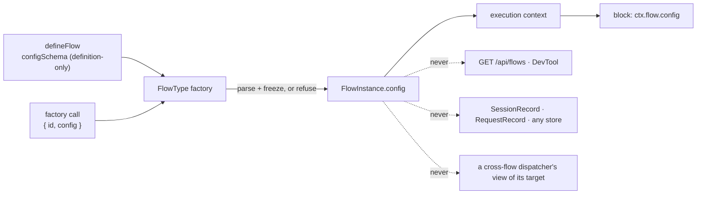

# FIX-1331: Instance create-time config bag (`FlowInstanceOptions.config` → `ctx.flow.config`) — Implementation Spec

## Part I — The Case

### 1. Problem — why it matters, why now

Two copies of the same flow can now be addressed, isolated and owned separately — but they still cannot be *set up* differently. Wanting one engineer seat on one coding harness and a second on another means building a whole second flow: fresh definition, fresh block graph, fresh actions, identical except for two strings.

That is what Conductor does today: it closes over the workspace and the timeouts and calls `defineFlow` inside its own factory, so one board per epic is one whole flow definition per epic. Fine for a handful written by hand. It does not survive a roster of seats read from a file, where every hire rebuilds the action tree.

**Why now** — the rest of the floor is what makes several copies real. Without knobs, the only difference two copies can express is their name, and every real difference has to become a separate kind — the shape the epic rejected.

### 2. Solution in plain terms

When you create a copy of a flow, you hand it a small bag of settings — a model, a harness, a path to a persona file. The definition says up front what that bag may contain. Every block inside that copy can read it, and nothing can change it afterwards.

The line this spec is really for:

> **Anything the copy is *given* goes in the bag. Anything the copy *learns* goes in its own private storage.**

A seat's harness is given; its current task and its counters are learned. If a block would ever want to write it, it is not config — it is instance-isolated state, which FIX-1323 delivers. Holding that line is what stops this becoming a mutable per-instance store by accident.

**Philosophy** — tenet 2: one option on a factory that already exists, not a new noun beside it. Tenet 3: the framework never inspects the bag, so it adds no branching anywhere. Tenet 5: the value enters where an instance is built, so there is one door to validate at.

### 6. Decisions & rules — the sign-off surface

1. **The bag is fixed when the copy is created and frozen for its life; anything a copy would write goes to its own private storage instead.** *Rejected:* a per-instance settings store blocks can update — a second, weaker copy of what FIX-1323 gives. *Locks in:* retuning a running seat is a redeploy, not a runtime action, so anything operational must be modelled as state from day one — moving a knob out of the bag later is a data migration, not an edit.

2. **A copy may only carry settings the definition declared, and a mismatch refuses when the copy is created.** *Rejected:* an opaque bag anyone can put anything in. *Locks in:* a mistyped knob in a roster fails at startup with the seat named, rather than surfacing as an agent that quietly ran on the wrong model. The cost is that a bag whose keys aren't known until run time is unsupported; relaxing that later is cheap, tightening it later would not be.

3. **Settings never leave the process: not on the public flow listing, not in DevTool, not in any stored record.** *Rejected:* putting them on the flow list so an operator can see each copy's configuration — that endpoint is deliberately unauthenticated, and these are author-written values that will eventually include a credential someone should not have put there. *Locks in:* "why did this seat behave differently?" is answered from the code that minted it, not from an API; and a past run keeps no record of what it ran under, so a request that suspends and resumes after a deploy runs on the *new* settings.

4. **The bag is read through the `flow` member the public context already names, narrowed to exactly `config` — not through a new context member.** *Rejected:* `ctx.config`, which sits beside the process-wide `ctx.settings` and says nothing about whose config it is; and `ctx.instance.config`, a second name at a second altitude for what the runtime context already calls `flow`. The runtime already carries the instance under `flow`; only the type boundary moves. *Locks in:* the block-context boundary becomes a *shape* rather than an absence, so the type-level tripwire that keeps `actions`, `task`, `internal`, `resources` and `id` out of reach has to be re-aimed rather than deleted — and every later request to widen it argues against a named list instead of a blanket no.

**Non-goals** — mutable seat state (FIX-1323 owns it); exposing settings on any HTTP surface or in DevTool (FIX-1324 owns instance navigation and already has id, kind and cardinality); letting a cross-flow dispatcher read its target's settings; a second registry, TeamFlow, or any Workforce surface; reshaping FIX-1321/1322/1323 in flight.

**Size:** 4 production files (3 in `core`, 1 in `testing`) · 11 test behaviours · 7 documentation surfaces · 1 PR.

---

### 3. Tradeoffs & alternatives

**Alternative: keep doing what Conductor does** — a function closing over the knobs that calls `defineFlow` inside itself. No framework change at all. Rejected because it makes every copy a *separate definition*: twenty seats is twenty block trees and twenty structurally different registrations, and the epic's premise — same shape, different name — stops being expressible.

**The simpler approach: per-instance `actions` overrides, which already exist.** One copy can already replace a block. Insufficient because it is a *structural* override: differing by a model name means constructing a new generator per copy, and the fence says structural differences are what separate *kinds* are for.

**Where the complexity is:** not the plumbing — the value is already on every block's context at run time. It is a boundary. The public block context deliberately does **not** expose the flow instance (a type-level tripwire enforces it), because reaching the whole instance lets a block step past the dispatch and claim gates built onto it. Exposing one read-only member without reopening that door is the hard part; §6 decision 4 settles it and §7 builds it.

### 4. Focus practices

1. **The framework never reads inside the bag** (tenet 3). Nothing in the engine, registry, routes or stores branches on a config value. A later change that wants to is a new decision, not an extension of this one.
2. **BP-031 (never route or authorize from reachable input)** — why config takes no part in address resolution, isolation keys, or the unauthenticated flow listing.
3. **One convergence point for validation** (tenet 5) — every instance carrying a config comes through one factory path: the normalization in §7, built at §8 step 2. §9's structural-bypass row names the one shape that gets past it.
4. **BP-030 (tolerate the old shape)** — every flow that exists today declares no schema and passes no config, reads an empty object, and is otherwise unchanged.

### 5. What using it looks like

*(What this spec proposes. None of it runs today.)*

**One definition, two seats that differ by knobs:**

```ts
const seatConfig = z.object({
  harness: z.enum(["claude-code", "codex", "cursor"]),
  model: z.string(),
  personaPath: z.string().optional(),
});

// Type positions are hoisted, so a flow-bound block can name its own flow.
type EngineerCtx = InferFlowBlockContext<typeof engineer>;

const engineerBlock = handler({
  name: "engineer-work",
  execute: async (input, ctx: EngineerCtx) => {
    const { harness, model } = ctx.flow.config; // typed, and already validated at mint
    // ...
  },
});

const engineer = defineFlow({
  kind: "engineer",
  cardinality: "collection",
  configSchema: seatConfig,
  actions: { work: { block: engineerBlock } },
});

const alice = engineer({ id: "eng-alice", config: { harness: "claude-code", model: "opus" } });
const bob   = engineer({ id: "eng-bob",   config: { harness: "codex",       model: "gpt-5.4" } });
```

One block, one action tree, two registered copies. FIX-1322 addresses them by id; FIX-1323 keeps their private data apart. A roster mints the rest in a loop: `engineer({ id: seat.id, config: seat.config })` per row, no graph rebuilt.

**A block authored to run inside more than one kind** cannot name a single flow, so it parses at the top of `execute` instead — `const { model } = seatConfig.parse(ctx.flow.config)`. That is the only case that re-parses. A flow-bound block reads a bag the factory already validated; re-parsing it on every call would say the mint could not be trusted.

**What a bad knob does (before / after):**

```
before  a seat with a typo'd harness registers fine; the agent picks a
        default three steps into its first run
after   engineer({ id: "eng-carol", config: { harnes: "codex", … } })
        throws at that line, naming the flow, the id and the unknown key
```

---

## Part II — The Build Plan

### 7. Technical design

The value enters at one place and is read at one place. Nothing in between inspects it.



**`@flow-state-dev/core` carries the substrate.** Three concerns, plus one follow-on in `@flow-state-dev/testing`:

- **Authoring surface.** `configSchema` on `FlowDefinition`, definition-only in exactly the way `cardinality` is — the existing instance-option refusal list gains it, so `flow({ configSchema })` throws by name rather than being accepted and ignored. `config` on `FlowInstanceOptions`. `config` on `FlowInstance` and mirrored on `FlowType` — normalized to an empty object so it is never absent, and on the blueprint always the empty one (below).
- **Normalization — at a mint, and only at a mint.** The instance-construction path parses `config` against the declared schema and freezes the result. Four refusals: a `config` with no declared schema, a `config` that fails the schema (an undeclared key included — see below), and `configSchema` passed as an instance option, all at the factory call; plus a `configSchema` that is not an object schema, refused where it is declared. Omitting `config` at a mint is not a way around any of it — the schema parses `{}`, so its defaults apply and a required field refuses. This is the single door: the factory is what every registered and every directly-evaluated instance goes through.

  **A blueprint is not a mint.** `defineFlow` builds one instance with no options at definition time to mirror the definition-derived properties onto `FlowType` (`packages/core/src/flow/defineFlow.ts:1181`). If that call parsed, a schema with a required field would throw *when the flow is defined* — §5's own two-seat example would not run, because `defineFlow({ configSchema: seatConfig, … })` throws before `engineer({ … })` is ever reached. So instance construction takes an internal blueprint flag, and the blueprint skips config normalization entirely and carries the frozen empty object. That is not a second validation site; it is the absence of one, because a blueprint is not a copy — the same reason `FlowType` already carries no `id`.

  The mirror itself stays. An exported `defineFlow` result is registered directly today — `packages/cli/src/resolve-flow.ts` discovers the module's exports and `resolve-runtime.ts:152` casts them to `FlowInstance[]` — so dropping `config` from `FlowType` would hand `ctx.flow.config` as `undefined` to every flow that exists, which is the one thing BP-030 forbids here. The consequence to state plainly: a flow that declares a required-field `configSchema` and is registered *bare*, without being minted, reads `{}`; its own read fails at first execution rather than at startup. Declaring required config means the flow must be minted. §9 carries the row.

  **Closed keys, not stripped keys.** A plain `z.object(...).parse()` *drops* an undeclared key silently, so `{ harnes: "codex", … }` read from a roster would parse clean and the seat would run on a default — precisely what decision 2 promises will not happen, and TypeScript's excess-property check never sees a value loaded from a file. So the declared schema is closed before it is parsed: normalization refuses a `configSchema` that is not a Zod object (`isZodObject` in `packages/core/src/helpers/zod-introspect.ts` already exists for this, and `types/resource.ts:570` sets the precedent for requiring one) and parses through its strict form, so an undeclared key is an error naming the flow, the id and the key. Closing it inside the framework rather than asking authors to write `.strict()` is deliberate: an author cannot leave the door open by forgetting, and `.passthrough()` is meaningless under decision 2 anyway. This makes decision 2 *true*; it does not change what decision 2 promised.
- **The read boundary.** This is what decision 4 settles, and it is the part of the change with teeth. The public `BlockContext` deliberately has **no** `flow` member; a type-test asserts its absence so that a block cannot reach the flow's action, task and internal maps and step around the claim and dispatch gates built onto them. The engine's own context type is `BlockContext & { flow: FlowInstance }`, so at run time `ctx.flow` **is already the instance on every block context** — including nested ones, which are spread from it. Nothing needs plumbing; only the type boundary moves.

  Per **decision 4**, the public context declares a `flow` member exposing **exactly one property, `config`** — not the instance. The instance's other members stay unreachable without a cast, exactly as today, and the type-test's tripwire is *re-aimed* rather than removed: it keeps a negative assertion on `flow.actions`, `flow.task`, `flow.internal`, `flow.resources` and `flow.id`, and gains a positive one on `flow.config`. That is strictly more precise than today's all-or-nothing assertion. `ctx.stores` is untouched. The cost of a shape rather than an absence is that the tripwire has to be sharper — hence the re-aim.

  **One name for the narrowed view.** `BlockContext`, the flow-inference helper and the boundary type-test all need the same shape, and three hand-written copies drift. Name it once — `FlowContextView<TConfig>`, structurally `{ config: TConfig }` — and have all three refer to it, so widening the boundary later is one edit in one place and the tripwire asserts against the type the context actually uses.

- **The test harness has to match production.** `packages/testing/src/runtime/createTestContext.ts:131-143` builds its default `FlowInstance` through a cast and would hand a block `ctx.flow.config === undefined` where production promises a frozen empty object — the harness quietly disagreeing with the runtime it stands in for. Its synthetic instance gains the same frozen empty object, and the test-context options gain one passthrough so a seat block can be exercised under a bag without minting a whole flow. No other testing surface moves.

**`config`, not `params`.** `params` reads as per-call arguments and would invite exactly the misuse decision 1 exists to prevent — a caller expecting to vary them per request. `config` carries "set up front" natively. It sits next to `ctx.settings` (whole process, one shape, declaration-merged) as its per-copy sibling; the docs plan states that pair once so it is not left to inference.

**Typing a consumer gets — two halves, deliberately unequal.**

- **Minting is typed.** The factory's call signature threads the declared schema through, so `engineer({ id, config })` type-checks the bag at the line that writes it. This is where a roster typo happens and where the type earns its keep.
- **Reading is not, by default.** A block is authored independently of any flow, so a bare `BlockContext` types `config` as an open record. A block gets the shape either by typing its context through the existing flow-inference helper, or by parsing with the same schema at the top of `execute` — which is what a block reused across flows should do anyway. **No new per-block schema slot** (nothing beside `parentStateSchema`); §12 flags it as the follow-up if the friction shows up in real use.

**Untouched:** `@flow-state-dev/engine` entirely — no route, registry, store, scope-key or context-factory change. Every package but `core` and `testing`. The three in-flight floor issues' surfaces.

**Sketch — pseudocode. Illustrative, not the contract. React to the shape.**

```
where a configSchema is declared:
    if it is not an object schema -> refuse at definition time, naming the flow

where a flow instance is built, after cardinality is normalized:

    if this construction is the definition-time blueprint:
        parsed <- empty                        (a blueprint is not a copy)
    else if instance options carry a config:
        if the definition declared no schema   -> refuse, naming the flow
        parsed <- closed(schema).parse(config) -> refuse with the schema's issues,
                                                  an undeclared key among them
    else if the definition declared a schema:
        parsed <- closed(schema).parse(empty)  -> defaults apply, a required field refuses
    else:
        parsed <- empty
    instance.config <- freeze(parsed)

where a block runs:
    the runtime context ALREADY carries the instance under `flow`
    the public context type now admits exactly one member of it: `config`
    (the tripwire keeps every other member unreachable without a cast)
```

### 8. Implementation sequence

1. **Authoring types.** `configSchema` on the definition, `config` on instance options, `config` on `FlowInstance`/`FlowType`. No behaviour yet. *Test:* the definition-only refusal for `configSchema` passed as an instance option. *Depends on:* FIX-1321 + FIX-1322's shared landing (the instance-option refusal list and the cardinality normalization this sits beside).
2. **Normalize and refuse at the factory**, per decision 2 — close the schema, parse, freeze, and the four refusals. *Test:* a valid bag, each refusal, an undeclared key from a non-literal bag, and the omitted-config path (defaults applied). *Depends on:* 1.
3. **Give instance construction its blueprint flag** and route `defineFlow`'s mirror call through it, so a definition-time construction normalizes no config. *Test:* defining a flow whose `configSchema` has required fields succeeds and yields a usable `FlowType`; minting one without a bag still refuses. *Depends on:* 2.
4. **Thread the schema through the factory's call signature** so minting is type-checked. *Test:* type-level — a wrong-typed and an unknown key both fail to compile. *Depends on:* 1.
5. **Open the read boundary** to `config` only via `FlowContextView<TConfig>`, and re-aim the type-test tripwire onto the members that must stay closed. *Test:* the type-test itself, plus a runtime read from a nested block. *Depends on:* 2.
6. **Extend the flow-context inference helper** to fill the new slot from the definition's `configSchema`, through the same `FlowContextView`. *Test:* type-level. *Depends on:* 4, 5.
7. **Match the test harness to production** — the synthetic instance in `@flow-state-dev/testing` carries the frozen empty object, and the test-context options take a supplied bag. *Test:* a block read through `testBlock` with no flow supplied, and one with a bag. *Depends on:* 5.
8. **Docs** per §11.

*(No removals. Nothing this replaces exists yet; Conductor's closure-per-epic factory keeps working unchanged and is not migrated here — see §12.)*

### 9. Edge cases & error handling

Validation and refusal semantics follow decision 2; the empty default for an unconfigured flow follows BP-030 (§4). What is below is the cases those two do *not* answer.

| Case | Expected |
|---|---|
| A block mutates `ctx.flow.config.x` | Frozen at the top level, so it throws in strict mode and is silently dropped otherwise. **Nested objects are not deep-frozen** — a nested mutation succeeds and is visible to every later block in that process. Documented as a limitation, not defended against |
| A flow declaring required config is registered **bare**, as the `defineFlow` result rather than a mint | The blueprint normalizes no config (§7), so it reads `{}` and a block's own read fails on first execution rather than at startup. Declaring required config means the flow must be minted; the docs say so beside `configSchema` |
| Two copies with the same config, different ids | Ordinary. Config takes no part in identity or in FIX-1323's isolation keys — the coordinate is `id` alone, so identical bags never merge storage |
| An instance built structurally, bypassing the factory | Carries whatever `config` its literal has, unvalidated. The registry's identity checks admit it as today. This is the one gap in the single door, and it is the same gap that already exists for every other normalized field — named here rather than papered over with a second validation site |
| A durable request resumes after a deploy changed the config | Reads the new config (decision 3). There is no stored copy and therefore nothing to reconcile |
| A cross-flow dispatch to another instance | The dispatching block reads its **own** `ctx.flow.config`. The child request the dispatch starts runs under the target instance, so the target's blocks read the target's config. There is no path from sender to recipient's config, by design (decision 3's non-goal) |

**Taxonomy:** every config failure is fatal and happens where the copy is built — at process startup, before any request exists; a flow that cannot be built cannot serve. Nothing here is retryable and nothing degrades.

### 10. Testing strategy

**Goal:** two registered copies of one collection kind, differing only in `config`, each running the same action; the observable output of each names its own knob and not the other's, with no per-copy block graph built. Runnable as an `fsdev run` pair against a two-instance host; zero-model, since nothing here needs a real generator — the knob's *value reaching the block* is the whole outcome.

**CI specs — the eleven behaviours** (not test names):

1. **Decision 1 — fixed and frozen, shallowly.** A top-level mutation of `ctx.flow.config` is refused *and* a nested one is not, asserted together so nobody later reads the suite as a promise of deep immutability.
2. **Decision 2 — declared or refused.** A bag whose definition declared no schema refuses at the factory call, naming the flow.
3. **Decision 2 — a key nobody declared refuses**, from a bag built as a plain object rather than an object literal at the call site, so what refuses is the schema and not TypeScript. This is the behaviour a strip-by-default parse passes silently, and the one that makes the promise real.
4. **Decision 3 — nothing leaks.** The flow-listing payload for a configured instance carries no config key. This is the one behaviour outside `packages/core`: a negative assertion added to the existing engine route test, not a new engine file.
5. **Decision 4 — the boundary holds.** The type-test's negative assertions on the instance's other members still fail to compile, and the positive one on `config` compiles. Getting this backwards — deleting the directives instead of re-aiming them — silently reopens the door this design is careful about, and no runtime test would catch it.
6. **The read reaches a nested block, not just the root.** The value rides the context spread, so a test that only reads it in a root handler proves nothing about a step inside a sequencer or a tool inside a generator. This is the second path (BP-035) and the one a naive suite misses.
7. **A required-field schema can be defined.** `defineFlow` with a required-field `configSchema` returns a usable `FlowType`, minting with a valid bag succeeds, and minting without one refuses. The definition-time blueprint construction is the trap here; without this test the §5 example is unrunnable and nothing says so.
8. **Defaults apply when a mint omits the bag.** An all-defaulted schema minted with no `config` reads its defaults, not a bare empty object.
9. **What must not change:** a flow declaring neither option behaves exactly as today and reads a frozen empty object.
10. **The harness matches production:** a block run through `testBlock` with no flow supplied reads a frozen empty object, never `undefined`.
11. **The harness carries a bag:** knobs supplied to the test context reach the block under test.

**Discipline:** `tdd`. The seam is `packages/core` — the factory path is a plain function call and the read is a plain property, so behaviours 1-3 and 6-9 are vitest tracer bullets with no engine, no server and no store; 10-11 are the same in `packages/testing`, and 4 is a single negative assertion on a test that already exists. The type-level behaviours (5, and the compile-time halves of 2 and 3) belong in `packages/core/src/types/tests/`, which is where the existing boundary tripwire lives and the only place a `@ts-expect-error` is actually checked.

### 11. Documentation plan

Required — this adds two public authoring options and one context read. Extend existing pages; no new page, no sidebar change. Several of these pages are also edited by FIX-1321; these sections go after those, not instead of them.

| Surface | Placement, outline and cross-links |
|---|---|
| EXTEND `apps/docs/docs/fundamentals/flows.md` — **the canonical home** | New short section after FlowType vs FlowInstance: "Copies that differ by settings." The given-vs-learned fence in plain terms lives **here and only here**, followed by §5's two-seat example. Add `config` to the "settable per instance" list; note that a flow declaring required settings must be minted. Cross-link → isolated state, → the block-context page. |
| EXTEND `apps/docs/docs/configuration/flow.md` | Rows, not prose: `configSchema` in the `defineFlow` fields table, marked definition-only beside `cardinality`; `config` in the instance-options list; one line on what refuses and when. Link → the flows page for the fence. |
| EXTEND `apps/docs/docs/fundamentals/blocks.md` | One short subsection under "The block context", after `ctx.parent`: reading `ctx.flow.config`, that it is read-only and fixed for the copy's life, and the one-sentence pair with `ctx.settings` (whole process vs this copy). Minimal example: read one knob. Link → the flows page for the fence, don't restate it. |
| EXTEND `apps/docs/docs/configuration/runtime.md` | One clause on the existing `settings` row pointing at per-instance `config` as the other half of the pair, so a reader choosing between them is not left to guess. |
| EXTEND `packages/core/README.md` | Terse entry for both options beside the flow section; link to the configuration page. |
| EXTEND `packages/testing/README.md` | One line on the test context's config passthrough, and that an unconfigured test flow reads the same frozen empty object production gives. |
| EXTEND `docs/architecture/flows-and-actions.md` | The `FlowInstance` contract gains `config`: normalized, frozen, never persisted, never on the wire, not part of any storage key. State the boundary decision (which one member of the instance the public context admits, and why) here — it is an internal contract, not site prose. |

**Voice:** per `docs/contributing/user-docs.md` — describe what the option does, never that it was added, and no issue numbers. Introduce "instance" and "collection" as FIX-1321's pages define them rather than redefining them. Watch for "flexible" and "powerful" around a config bag; and do not write the fence as a warning — write it as the rule it is.

### 12. Dependencies, open questions & follow-ups

**Dependencies — hard.** This sits on top of the floor and cannot land before it:

- **FIX-1321 + FIX-1322** (the shared implementation PR, [#1640](https://github.com/fixpoint-labs/flow-state-dev/pull/1640), branch `fix/fix-1322`) — supplies `cardinality`, the instance `id` contract, and the definition-only instance-option refusal list this extends. Every file this spec touches is a file that PR is currently rewriting.
- **FIX-1323** ([#1646](https://github.com/fixpoint-labs/flow-state-dev/pull/1646), branch `fix/fix-1323`) — not a code dependency (no shared file; the isolation coordinate is `flow.id` and config takes no part in it), but decision 1's fence is only true once instance-isolated state exists. Speccing against it is safe; shipping before it would leave "put it in a resource instead" as advice with nothing behind it.

**Neither has merged. Nothing here is implemented until both have** — every file this spec touches in `core` is a file #1640 is currently rewriting.

**Epic bookkeeping, non-blocking:** the epic-spec's running index (`spec/_epics/flow-instances.md` §4) carries no row for FIX-1331 — it lists the four floor issues and FIX-1325. This issue is a follow-on that sits beside them rather than in them, so the omission may be deliberate, but the index is where the epic's reader looks for the set. Flagged for the coordinator; not changed here.

**Open questions:** none. The read boundary §7 previously put to reviewers is settled as **§6 decision 4** — two independent design reviews landed on the same answer, and it is an engineering call, not a fork that turns on something the owner knows.

**Follow-ups (flagged, not built):**

- **A per-block declaration slot for the config shape**, beside `parentStateSchema`, so a block gets `ctx.flow.config` typed without parsing. Deliberately not built: it is one more schema slot on all four block kinds, and a block that parses gets validation at the point of use for free. Revisit if real seat blocks show the friction.
- **Migrating Conductor** from its closure-per-epic factory to one definition plus config. It is the natural first consumer and would be a good proof, but it is a live lab flow with its own validation and freezing logic, and moving it is a change to Conductor, not to the substrate. Out of scope here.
- **Showing a copy's settings to an operator.** Decision 3 shuts the unauthenticated door, not the idea. If DevTool should show a seat's knobs, that is an authenticated read on FIX-1324's surface or a later issue's, with a decision about redaction attached.

### 13. Implementer notes — recorded from review, not folded

Below the spec-review bar. Recorded verbatim for the implementer to weigh against real code; not argued with here.

1. **Cursor — §7 pays for the boundary explanation twice.** *"§3 already defers the boundary essay to §7; §7 then re-derives the full 'why `flow` is closed' premise (~15 lines) before the proposal. Consider opening §7 at the three concerns (authoring / normalization / read boundary) with a one-line back-link here — keeps the fork visible without paying the explanation twice."*

2. **`second-look` — two file-level pointers worth having before you start.** *"`defineFlow<TActions, TSession, TRequest, TUser, TOrg, TResources>` already threads several generics through `FlowType`, and `FlowInstanceOptions` already accepts per-instance overrides typed against them. Adding `TConfig` the same way is coherent with an established pattern, not new speculative surface."* And: *"`packages/core/src/types/tests/block-context-boundary.type-test.ts` … already pairs a positive assertion (`ctx.requestHost` declared) with negative ones (`ctx.stores`/`ctx.flow` absent) for the same file, so narrowing `flow` to admit only `config` and adding one positive assertion follows the file's existing convention rather than inventing a new one."*

3. **Cursor — the condition under which decision 4 should be revisited.** *"The alternative (`ctx.flowConfig` or similar) is simpler at the type boundary but adds a second vocabulary; I'd only switch if you expect repeated boundary expansions and want to keep `flow` fully closed."* Decision 4 takes the first branch; this names what a later issue would have to see to reopen it.

4. **`second-look` restraint verdict:** no findings — *"Appropriately scoped — no bloat found."* Nothing to cut.

---

## Spec evolution

- **Spec drafted** — framed as "copies can be named but not configured"; chose one create-time frozen bag validated at the factory over a mutable per-instance store or a structural override, and placed the read behind a narrowed view of the flow member the runtime context already carries, rather than a new context member.
- **Review round 1 folded** — three reviews. Cursor and the FSD Architect ratified the direction and all three §6 decisions, and both landed independently on the same read boundary, which is now **decision 4**; §7's reviewer question is gone and §12's "none" is honest. Codex found two real holes, fixed here rather than argued: `defineFlow` builds a no-options instance at definition time to mirror onto `FlowType`, so parsing a required-field schema there would throw before the first mint could run — resolved with a blueprint construction that normalizes no config, keeping the mirror because a bare `defineFlow` result is registered directly today. And a plain Zod object *strips* undeclared keys, so the mistyped roster knob decision 2 promises to refuse would have parsed clean and run on a default — resolved by closing the schema before parsing. **Decision 2 promises exactly what it promised before; this makes it true.** `@flow-state-dev/testing` joined the scope: its synthetic flow instance would have handed blocks `undefined` where production promises a frozen empty object. Spec hygiene from Cursor folded (§4 cross-ref, §5 typed read, §9 trimmed to what §6 does not answer, one canonical docs home for the fence, `FlowContextView<TConfig>` named once); the rest is recorded in §13.
