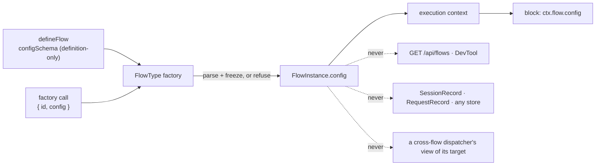

# FIX-1331: Instance create-time config bag (`FlowInstanceOptions.config` → `ctx.flow.config`) — Implementation Spec

## Part I — The Case

### 1. Problem — why it matters, why now

Two copies of the same flow can now be addressed, isolated and owned separately — but they still cannot be *set up* differently. Wanting one engineer seat on one coding harness and a second on another means building a whole second flow: fresh definition, fresh block graph, fresh actions, identical except for two strings.

That is what Conductor does today: it closes over the workspace and the timeouts and calls `defineFlow` inside its own factory, so one board per epic is one whole flow definition per epic. Fine for a handful written by hand. It does not survive a roster of seats read from a file, where every hire rebuilds the action tree.

**Why now** — the rest of the floor is what makes several copies real. Without knobs, the only difference two copies can express is their name, and every real difference has to become a separate kind — the shape the epic rejected.

### 2. Solution in plain terms

When you create a copy of a flow, you hand it a small bag of settings — a model, a harness, a path to a persona file. The definition says up front what that bag may contain. Every block inside that copy can read it, and nothing can change it afterwards.

The line this spec is really for:

> **Anything the copy is *given* goes in the bag. Anything the copy *learns* goes in its own private storage.**

A seat's harness is given; its current task and its counters are learned. If a block would ever want to write it, it is not config — it is instance-isolated state, which FIX-1323 delivers. Holding that line is what stops this becoming a mutable per-instance store by accident.

**Philosophy** — tenet 2: one option on a factory that already exists, not a new noun beside it. Tenet 3: the framework never inspects the bag, so it adds no branching anywhere. Tenet 5: the value enters where an instance is built, so there is one door to validate at.

### 6. Decisions & rules — the sign-off surface

1. **The bag is fixed when the copy is created and frozen for its life; anything a copy would write goes to its own private storage instead.** *Rejected:* a per-instance settings store blocks can update — a second, weaker copy of what FIX-1323 gives. *Locks in:* retuning a running seat is a redeploy, not a runtime action, so anything operational must be modelled as state from day one — moving a knob out of the bag later is a data migration, not an edit.

2. **A copy may only carry settings the definition declared, and a mismatch refuses when the copy is created.** *Rejected:* an opaque bag anyone can put anything in. *Locks in:* a mistyped knob in a roster fails at startup with the seat named, rather than surfacing as an agent that quietly ran on the wrong model. The cost is that a bag whose keys aren't known until run time is unsupported; relaxing that later is cheap, tightening it later would not be.

3. **Settings never leave the process: not on the public flow listing, not in DevTool, not in any stored record.** *Rejected:* putting them on the flow list so an operator can see each copy's configuration — that endpoint is deliberately unauthenticated, and these are author-written values that will eventually include a credential someone should not have put there. *Locks in:* "why did this seat behave differently?" is answered from the code that minted it, not from an API; and a past run keeps no record of what it ran under, so a request that suspends and resumes after a deploy runs on the *new* settings.

**Non-goals** — mutable seat state (FIX-1323 owns it); exposing settings on any HTTP surface or in DevTool (FIX-1324 owns instance navigation and already has id, kind and cardinality); letting a cross-flow dispatcher read its target's settings; a second registry, TeamFlow, or any Workforce surface; reshaping FIX-1321/1322/1323 in flight.

**Size:** 3 production files · 8 test behaviours · 6 documentation surfaces · 1 PR.

---

### 3. Tradeoffs & alternatives

**Alternative: keep doing what Conductor does** — a function closing over the knobs that calls `defineFlow` inside itself. No framework change at all. Rejected because it makes every copy a *separate definition*: twenty seats is twenty block trees and twenty structurally different registrations, and the epic's premise — same shape, different name — stops being expressible.

**The simpler approach: per-instance `actions` overrides, which already exist.** One copy can already replace a block. Insufficient because it is a *structural* override: differing by a model name means constructing a new generator per copy, and the fence says structural differences are what separate *kinds* are for.

**Where the complexity is:** not the plumbing — the value is already on every block's context at run time. It is a boundary. The public block context deliberately does **not** expose the flow instance (a type-level tripwire enforces it), because reaching the whole instance lets a block step past the dispatch and claim gates built onto it. Exposing one read-only member without reopening that door is the design question; §7 is mostly about it.

### 4. Focus practices

1. **The framework never reads inside the bag** (tenet 3). Nothing in the engine, registry, routes or stores branches on a config value. A later change that wants to is a new decision, not an extension of this one.
2. **BP-031 (never route or authorize from reachable input)** — why config takes no part in address resolution, isolation keys, or the unauthenticated flow listing.
3. **One convergence point for validation** (tenet 5) — every instance carrying a config comes through one factory path. §9 names the one shape that gets past it.
4. **BP-030 (tolerate the old shape)** — every flow that exists today declares no schema and passes no config, reads an empty object, and is otherwise unchanged.

### 5. What using it looks like

*(What this spec proposes. None of it runs today.)*

**One definition, two seats that differ by knobs:**

```ts
const seatConfig = z.object({
  harness: z.enum(["claude-code", "codex", "cursor"]),
  model: z.string(),
  personaPath: z.string().optional(),
});

const engineerBlock = handler({
  name: "engineer-work",
  execute: async (input, ctx) => {
    const { harness, model } = seatConfig.parse(ctx.flow.config);
    // ...
  },
});

const engineer = defineFlow({
  kind: "engineer",
  cardinality: "collection",
  configSchema: seatConfig,
  actions: { work: { block: engineerBlock } },
});

const alice = engineer({ id: "eng-alice", config: { harness: "claude-code", model: "opus" } });
const bob   = engineer({ id: "eng-bob",   config: { harness: "codex",       model: "gpt-5.4" } });
```

One block, one action tree, two registered copies. FIX-1322 addresses them by id; FIX-1323 keeps their private data apart. A roster mints the rest in a loop: `engineer({ id: seat.id, config: seat.config })` per row, no graph rebuilt.

**What a bad knob does (before / after):**

```
before  a seat with a typo'd harness registers fine; the agent picks a
        default three steps into its first run
after   engineer({ id: "eng-carol", config: { harnes: "codex", … } })
        throws at that line, naming the flow, the id and the unknown key
```

---

## Part II — The Build Plan

### 7. Technical design

The value enters at one place and is read at one place. Nothing in between inspects it.



**`@flow-state-dev/core` carries all of it.** Three concerns:

- **Authoring surface.** `configSchema` on `FlowDefinition`, definition-only in exactly the way `cardinality` is — the existing instance-option refusal list gains it, so `flow({ configSchema })` throws by name rather than being accepted and ignored. `config` on `FlowInstanceOptions`. `config` on `FlowInstance` and mirrored on `FlowType`, normalized to an empty object so it is never absent.
- **Normalization.** The existing instance-construction path parses `config` against the declared schema and freezes the result. Three refusals, all at the factory call: a `config` with no declared schema, a `config` that fails the schema, and `configSchema` passed as an instance option. This is the single door — the factory is what every registered and every directly-evaluated instance goes through.
- **The read boundary.** This is the part worth arguing about. The public `BlockContext` deliberately has **no** `flow` member; a type-test asserts its absence so that a block cannot reach the flow's action, task and internal maps and step around the claim and dispatch gates built onto them. The engine's own context type is `BlockContext & { flow: FlowInstance }`, so at run time `ctx.flow` **is already the instance on every block context** — including nested ones, which are spread from it. Nothing needs plumbing; only the type boundary moves.

  The proposal is to declare on the public context a `flow` member exposing **exactly one property, `config`** — not the instance. The instance's other members stay unreachable without a cast, exactly as today, and the type-test's tripwire is *re-aimed* rather than removed: it keeps a negative assertion on `flow.actions`, `flow.task`, `flow.internal`, `flow.resources` and `flow.id`, and gains a positive one on `flow.config`. That is strictly more precise than today's all-or-nothing assertion. `ctx.stores` is untouched.

  **Why not a fresh member.** `ctx.config` sits confusingly beside `ctx.settings` (which is process-wide, from `createFlowState`) and says nothing about whose config it is. `ctx.instance.config` invents a second name for the thing the runtime context already calls `flow`, at a second altitude — the incoherence tenet 1 exists to prevent. Narrowing the member that is already there is the coherent move; the cost is that the boundary is now a *shape* rather than an absence, and shapes need a sharper tripwire. Hence the re-aim.

**`config`, not `params`.** `params` reads as per-call arguments and would invite exactly the misuse decision 1 exists to prevent — a caller expecting to vary them per request. `config` carries "set up front" natively. It sits next to `ctx.settings` (whole process, one shape, declaration-merged) as its per-copy sibling; the docs plan states that pair once so it is not left to inference.

**Typing a consumer gets — two halves, deliberately unequal.**

- **Minting is typed.** The factory's call signature threads the declared schema through, so `engineer({ id, config })` type-checks the bag at the line that writes it. This is where a roster typo happens and where the type earns its keep.
- **Reading is not, by default.** A block is authored independently of any flow, so a bare `BlockContext` types `config` as an open record. A block gets the shape either by typing its context through the existing flow-inference helper, or by parsing with the same schema at the top of `execute` — which is what a block reused across flows should do anyway. **No new per-block schema slot** (nothing beside `parentStateSchema`); §12 flags it as the follow-up if the friction shows up in real use.

**Untouched:** `@flow-state-dev/engine` entirely — no route, registry, store, scope-key or context-factory change. Every other package. The three in-flight floor issues' surfaces.

**Sketch — pseudocode. Illustrative, not the contract. React to the shape.**

```
where a flow instance is built, after cardinality is normalized:

    if instance options carry a config:
        if the definition declared no schema  -> refuse, naming the flow
        parsed <- schema.parse(config)        -> refuse with the schema's issues
    else:
        parsed <- empty
    instance.config <- freeze(parsed)

where a block runs:
    the runtime context ALREADY carries the instance under `flow`
    the public context type now admits exactly one member of it: `config`
    (the tripwire keeps every other member unreachable without a cast)
```

The question this asks a reviewer: **is narrowing the existing `flow` member the right way through the boundary, or should the bag get a member of its own and leave the boundary shut?** The refusals and the freeze are the settled part; that one line is not.

### 8. Implementation sequence

1. **Authoring types.** `configSchema` on the definition, `config` on instance options, `config` on `FlowInstance`/`FlowType`. No behaviour yet. *Test:* the definition-only refusal for `configSchema` passed as an instance option. *Depends on:* FIX-1321 + FIX-1322's shared landing (the instance-option refusal list and the cardinality normalization this sits beside).
2. **Normalize and refuse at the factory**, per decision 2 — parse, freeze, and the three refusals. *Test:* a valid bag, each refusal, and the absent-config default. *Depends on:* 1.
3. **Thread the schema through the factory's call signature** so minting is type-checked. *Test:* type-level — a wrong-typed and an unknown key both fail to compile. *Depends on:* 1.
4. **Open the read boundary** to `config` only, and re-aim the type-test tripwire onto the members that must stay closed. *Test:* the type-test itself, plus a runtime read from a nested block. *Depends on:* 2.
5. **Extend the flow-context inference helper** to fill the new slot from the definition's `configSchema`. *Test:* type-level. *Depends on:* 3, 4.
6. **Docs** per §11.

*(No removals. Nothing this replaces exists yet; Conductor's closure-per-epic factory keeps working unchanged and is not migrated here — see §12.)*

### 9. Edge cases & error handling

| Case | Expected |
|---|---|
| No `configSchema`, no `config` — every flow that exists today | `ctx.flow.config` is a frozen empty object. Nothing else changes (BP-030) |
| `configSchema` declared, `config` omitted at mint | The schema's own defaults decide: a schema whose fields all default parses an empty object; one with a required field refuses. Not a special case — it is the schema's answer |
| `config` passed, no `configSchema` declared | Refuse at the factory call, naming the flow and pointing at `configSchema` (decision 2) |
| A block mutates `ctx.flow.config.x` | Frozen at the top level, so it throws in strict mode and is silently dropped otherwise. **Nested objects are not deep-frozen** — a nested mutation succeeds and is visible to every later block in that process. Documented as a limitation, not defended against |
| Two copies with the same config, different ids | Ordinary. Config takes no part in identity or in FIX-1323's isolation keys — the coordinate is `id` alone, so identical bags never merge storage |
| An instance built structurally, bypassing the factory | Carries whatever `config` its literal has, unvalidated. The registry's identity checks admit it as today. This is the one gap in the single door, and it is the same gap that already exists for every other normalized field — named here rather than papered over with a second validation site |
| A durable request resumes after a deploy changed the config | Reads the new config (decision 3). There is no stored copy and therefore nothing to reconcile |
| A cross-flow dispatch to another instance | The dispatching block reads its **own** `ctx.flow.config`. The child request the dispatch starts runs under the target instance, so the target's blocks read the target's config. There is no path from sender to recipient's config, by design (decision 3's non-goal) |

**Taxonomy:** every config failure is fatal and happens at process startup, before any request exists — a flow that cannot be built cannot serve. Nothing here is retryable and nothing degrades.

### 10. Testing strategy

**Goal:** two registered copies of one collection kind, differing only in `config`, each running the same action; the observable output of each names its own knob and not the other's, with no per-copy block graph built. Runnable as an `fsdev run` pair against a two-instance host; zero-model, since nothing here needs a real generator — the knob's *value reaching the block* is the whole outcome.

**CI specs** (the behaviours, not the test names):

- one behaviour per §6 decision, stated in what a caller sees
- **the read reaches a nested block, not just the root** — the value rides the context spread, so a test that only reads it in a root handler proves nothing about a step inside a sequencer or a tool inside a generator. This is the second path (BP-035) and the one a naive suite misses
- **what must not change**: a flow declaring neither option behaves exactly as today, and reads an empty object
- **the boundary holds**: the type-test's negative assertions on the flow instance's other members still fail to compile. Getting this backwards — deleting the directives instead of re-aiming them — silently reopens the door this design is careful about, and no runtime test would catch it
- **freezing is shallow and the test says so**: assert the top-level refusal *and* assert that a nested mutation is not prevented, so nobody later reads the suite as a promise of deep immutability

**Discipline:** `tdd`. The seam is `packages/core` — the factory path is a plain function call and the read is a plain property, so every behaviour above is a vitest tracer bullet with no engine, no server and no store. The type-level behaviours belong in `packages/core/src/types/tests/`, which is where the existing boundary tripwire lives and the only place a `@ts-expect-error` is actually checked.

### 11. Documentation plan

Required — this adds two public authoring options and one context read. Extend existing pages; no new page, no sidebar change. Several of these pages are also edited by FIX-1321; these sections go after those, not instead of them.

| Surface | Placement, outline and cross-links |
|---|---|
| EXTEND `apps/docs/docs/configuration/flow.md` | `configSchema` in the `defineFlow` fields table, marked definition-only beside `cardinality`; `config` in the instance-options list. One line on what refuses and when. Link → the block-context page. |
| EXTEND `apps/docs/docs/fundamentals/flows.md` | New short section after FlowType vs FlowInstance: "Copies that differ by settings." Lead with the fence in plain terms (given vs learned), then §5's two-seat example. Add `config` to the "settable per instance" list. Cross-link → isolated state, → the block-context page. |
| EXTEND `apps/docs/docs/fundamentals/blocks.md` | One subsection under "The block context", after `ctx.parent`: reading `ctx.flow.config`, that it is read-only and fixed for the copy's life, and the one-sentence pair with `ctx.settings` (whole process vs this copy). Minimal example: read one knob. |
| EXTEND `apps/docs/docs/configuration/runtime.md` | One clause on the existing `settings` row pointing at per-instance `config` as the other half of the pair, so a reader choosing between them is not left to guess. |
| EXTEND `packages/core/README.md` | Terse entry for both options beside the flow section; link to the configuration page. |
| EXTEND `docs/architecture/flows-and-actions.md` | The `FlowInstance` contract gains `config`: normalized, frozen, never persisted, never on the wire, not part of any storage key. State the boundary decision (which one member of the instance the public context admits, and why) here — it is an internal contract, not site prose. |

**Voice:** per `docs/contributing/user-docs.md` — describe what the option does, never that it was added, and no issue numbers. Introduce "instance" and "collection" as FIX-1321's pages define them rather than redefining them. Watch for "flexible" and "powerful" around a config bag; and do not write the fence as a warning — write it as the rule it is.

### 12. Dependencies, open questions & follow-ups

**Dependencies — hard.** This sits on top of the floor and cannot land before it:

- **FIX-1321 + FIX-1322** (the shared implementation PR, [#1640](https://github.com/fixpoint-labs/flow-state-dev/pull/1640), branch `fix/fix-1322`) — supplies `cardinality`, the instance `id` contract, and the definition-only instance-option refusal list this extends. Every file this spec touches is a file that PR is currently rewriting.
- **FIX-1323** ([#1646](https://github.com/fixpoint-labs/flow-state-dev/pull/1646), branch `fix/fix-1323`) — not a code dependency (no shared file; the isolation coordinate is `flow.id` and config takes no part in it), but decision 1's fence is only true once instance-isolated state exists. Speccing against it is safe; shipping before it would leave "put it in a resource instead" as advice with nothing behind it.

Neither has merged. Nothing here should be implemented until both have.

**Epic bookkeeping, non-blocking:** the epic-spec's running index (`spec/_epics/flow-instances.md` §4) carries no row for FIX-1331 — it lists the four floor issues and FIX-1325. This issue is a follow-on that sits beside them rather than in them, so the omission may be deliberate, but the index is where the epic's reader looks for the set. Flagged for the coordinator; not changed here.

**Open questions:** none. The boundary call in §7 is a real judgement and is called out for review as such, but it is mine to make and made — it is not a fork that turns on something the owner knows.

**Follow-ups (flagged, not built):**

- **A per-block declaration slot for the config shape**, beside `parentStateSchema`, so a block gets `ctx.flow.config` typed without parsing. Deliberately not built: it is one more schema slot on all four block kinds, and a block that parses gets validation at the point of use for free. Revisit if real seat blocks show the friction.
- **Migrating Conductor** from its closure-per-epic factory to one definition plus config. It is the natural first consumer and would be a good proof, but it is a live lab flow with its own validation and freezing logic, and moving it is a change to Conductor, not to the substrate. Out of scope here.
- **Showing a copy's settings to an operator.** Decision 3 shuts the unauthenticated door, not the idea. If DevTool should show a seat's knobs, that is an authenticated read on FIX-1324's surface or a later issue's, with a decision about redaction attached.

---

## Spec evolution

- **Spec drafted** — framed as "copies can be named but not configured"; chose one create-time frozen bag validated at the factory over a mutable per-instance store or a structural override, and placed the read behind a narrowed view of the flow member the runtime context already carries, rather than a new context member.
